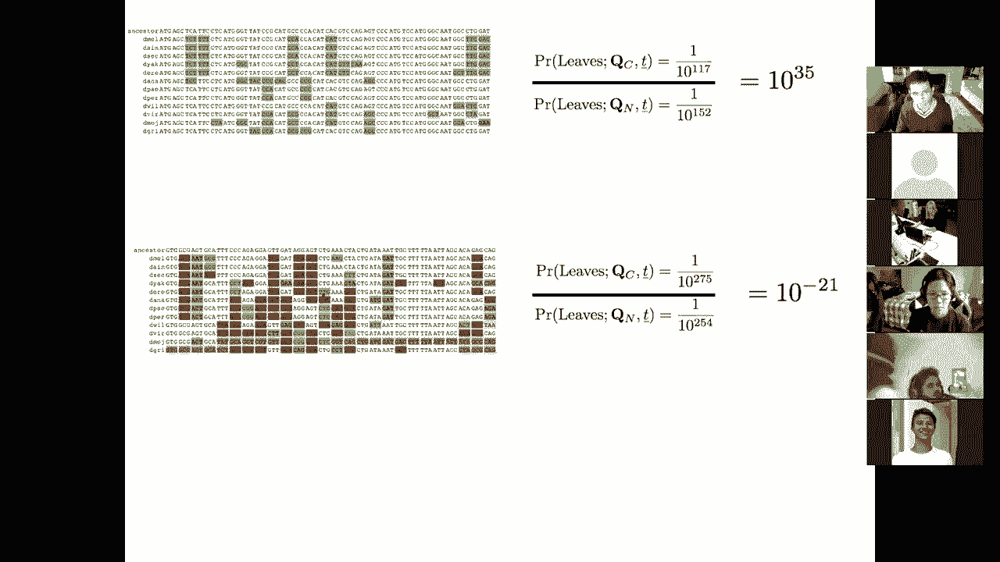
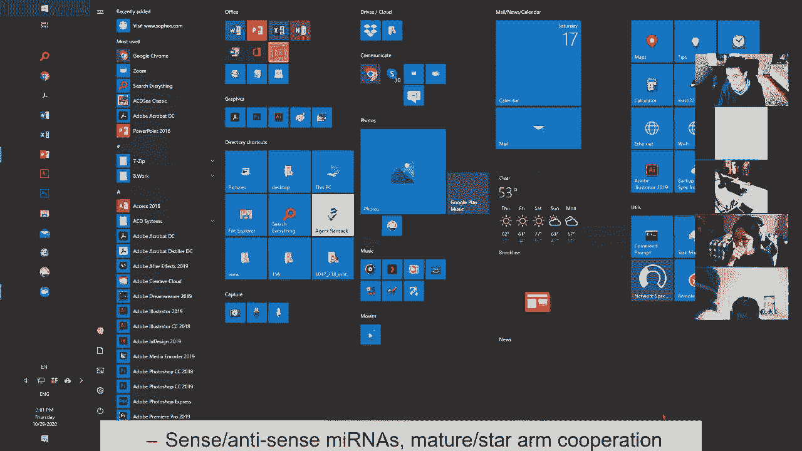
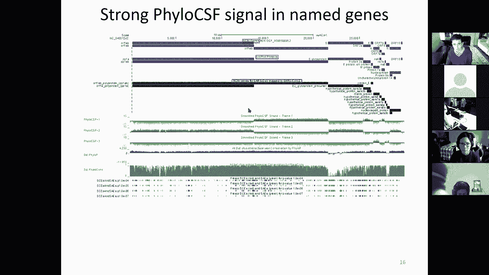
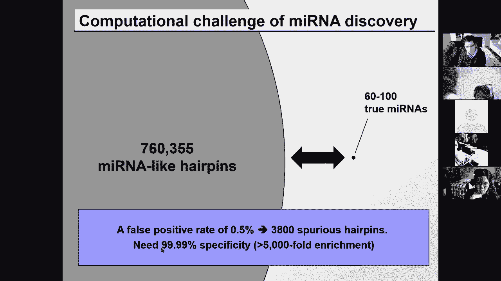
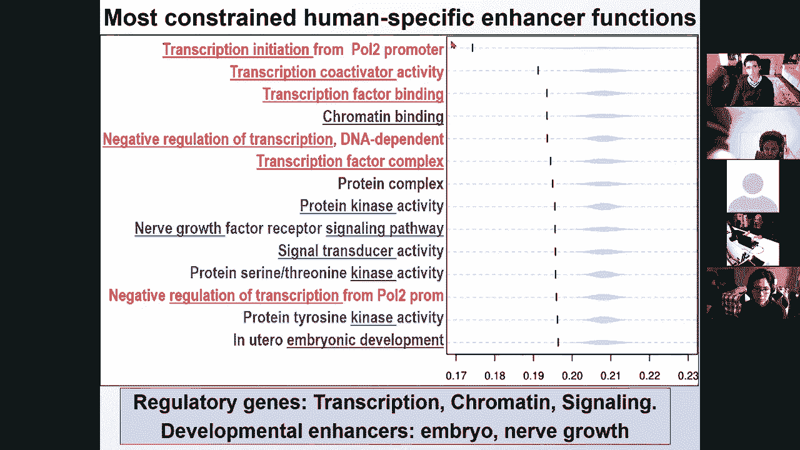

# 17：L17 - 比较基因组学 🧬

在本节课中，我们将要学习比较基因组学，特别是用于基因组注释的进化特征。这是本课程关于比较基因组学和进化的最后一个模块。今天的讲座将聚焦于比较基因组学和进化特征。

下一次课，我们将讨论基因组尺度的进化和基因组复制，然后是系统发育学和系统发育基因组学，接着是测验，最后我们将转向未来方向。

之前我们讨论了很多关于基因组注释、基因表达、表观基因组学、网络和调控基因组学，以及疾病遗传学和疾病基因组学的内容，这些主要关注人类谱系内部的变异。今天，我们将讨论跨物种的变异，特别是研究如何利用全基因组研究来推断进化特征，然后利用这些特征来注释元件。我们将把这些特征应用于注释蛋白质编码基因、非编码基因、microRNA基因和调控基序。

下一次课，我们将讨论基因组重排和基因组复制，如何基于同线性构建全局比对，以及如何检测结构变化。然后，我们将有两节关于系统发育学和系统发育基因组学的讲座，即如何利用系统发育来理解进化速率和进化模型，回到树上的动态规划和贝叶斯进化模型。系统发育基因组学与今天的讲座非常相似，都是利用全局特征来理解局部的个体事件，我们将研究基因树、物种树和协调。

## 概述：利用比对揭示功能元件

之前我们展示过这张幻灯片，用以激发构建基因组比对的动机。本次讲座基本上从那里开始，即我们可以利用近缘物种的比对来研究不同区域的保守模式。

这里，星号表示这四个物种间的完美保守。基于连续的星号，可以看到保守的“岛屿”。事实上，这些保守岛屿与这些区域内已知的调控基序实例非常吻合。因此，核心思想是：我们现在能否系统地使用比较基因组学来研究这些特征并发现这些元件？

具体来说，今天的讲座将侧重于“解读进化以揭示功能元件”。下一次课，我们将研究如何利用基因组来理解进化本身。基本上，我们越理解进化，就越理解基因组；反之亦然。

## 本节课目标

1.  首先，观察核苷酸保守性和进化约束。
2.  其次，关注进化特征，重点是变化的模式，而非保守的数量。
3.  然后，研究蛋白质编码基因的特征。
4.  接着，研究RNA、基序、转录因子结合位点和microRNA的特征。
5.  最后，了解如何测量人类谱系内部的选择。

## 比较基因组学的力量与核心概念

比较基因组学极其强大。我们可以通过比较相关物种来发现功能元件。其核心概念自达尔文以来就已理解：一方面是随机突变，另一方面是自然选择。

随机突变通过随机突变元件来探索空间，这并非有意为之，只是犯错误。如果由工程师负责选择，我们可能仍然是完美复制的细菌，没有错误。因此，突变是一把双刃剑：一方面它引入问题，另一方面它引入新事物。

我们今天主要关注的是**纯化选择**如何运作，即那些破坏元件的突变是如何被维持的。在系统发育学讲座中，我们会更多地讨论**正选择**。但现在，我们主要关注随机突变，它大多会破坏功能，但偶尔也会使功能变得更好。

自然选择则是残酷的决策，在环境背景下选择那些维持功能的序列。因此，一方面是完全盲目的随机突变，另一方面是维持那些仍保留功能的序列的自然选择。

这两种力量在进化时间尺度上作用的结果是：一方面，非功能区域会积累突变并被保留；另一方面，功能区域也会积累突变，但这些突变会降低适应性，因此随着时间的推移，那些具有破坏性元件的生物体适应性会降低，其基因最终会减少。

尽管功能和非功能区域发生相同数量的突变，但随着时间的推移，功能区域的突变会从基因库中被排除，而非功能区域的突变则会积累。

## 检测能力与物种选择策略

我们关心的一个问题是检测能力：我们有多大能力来发现这些功能元件？一个非常简单的概念是：系统发育树上的分支长度越长，非功能区域相对于功能区域积累的事件就越多，你区分非功能区域突变积累和功能区域突变排除的能力就越强。

因此，你的检测能力应大致与所比对物种树中捕获的进化距离成线性比例。如果我们的目标是根据突变数量区分功能与非功能区域，那么在非常近的距离下，两个区域都没有什么突变；在足够的距离下，我们可以区分功能与非功能区域之间替换的差异积累；而在非常遥远的比较中，功能区域不再保守，因此你将无法真正捕捉到功能与非功能之间的区别。

比较基因组学中常用的解决方案是**比较许多近缘物种**，这比比较少数远缘物种要强大得多。也就是说，对于相同的总分支长度，我们更倾向于许多近缘物种，因为功能区域在每对物种间都是保守的，任何一对物种间的进化比较都没有足够的时间积累足够的新环境适应。在较短的进化距离内，环境变化不大，因此成对保守性仍然很高，但非功能区域会独立地积累“噪音”。

我喜欢用这个类比：当你用一个麦克风录制交响乐时，如果麦克风周围有噪音，你录制的噪音和信号一样多。如果有多个麦克风，信号会线性传输到所有麦克风，但每个麦克风的噪音是独立的，因此我们能够真正捕捉到进化信号，因为不同谱系中噪音的独立积累。

## 检测约束元件：从全局比对着手

现在我们已经研究了中性分支能力和纯化选择如何通过排除那些积累了破坏性突变的生物体来维持功能元件不变。接下来，让我们看看如何检测约束元件，特别是观察可以检测这些核苷酸的单个核苷酸或模型。

现在，你可以构建这些全基因组比对。对于任何一个物种，你可以看到不同颜色的基因。然后，在进化时间尺度上，你可以比对这些物种，并看到顺序大致是保守的。

这很重要，因为通过选择染色体片段顺序大致保守的物种，意味着我们不仅可以构建蛋白质编码区域的比对，还可以构建这些基因间区域的比对。这意味着我们实际上可以研究整个基因组中编码和非编码区域的进化模式。

这可以同时应用于数百个基因。我们现在可以开始使用这些比较来识别其中的功能元件。

在第一讲或第二讲中，我们也展示过这张幻灯片，通过显示例如外显子（用浅蓝色高亮显示的蛋白质编码外显子）实际上是非常深度保守的。当然，挑战在于许多其他元件也高度保守，问题是这些到底是外显子还是调控区域。

如果我们试图理解这个特定区域是编码还是非编码，我们可以观察该序列的变化模式。我们可以看到，它在哺乳动物之外就不再保守了，在鸡、河豚或斑马鱼中不保守。这表明这可能实际上是一个非编码区域，因为蛋白质编码外显子往往在哺乳动物树之外也非常深度保守。

一般来说，蛋白质编码基因进化得更慢。现在我们可以首先开发检测约束的方法，然后开发区分不同类型约束的方法。

## 检测约束的方法

对于检测约束，我们讨论过如何计算编辑操作的总数或替换和空位的数量，这是我们动态规划讲座的内容。或者，我们可以估计突变的数量，包括对回复突变的估计，这将是我们系统发育学讲座的重点。

我们还可以结合邻域信息，寻找保守窗口。例如，当我们观察不同的核苷酸片段时，我们可能会说，这里有一个保守的核苷酸，但它是单独保守的；那里有另一个保守的核苷酸，但也是单独保守的。也许连续多个核苷酸保守的事实实际上很重要。

因此，我们可以使用保守窗口的概念。你可以编写一个隐马尔可夫模型来寻找高度保守区域和低度保守区域之间的最佳转换。我们在HMM讲座中讨论过隐马尔可夫模型在理解人类基因组中蛋白质编码约束岛屿或非编码约束岛屿位置的应用。

具体来说，这里Y轴上的信息显示了处于与保守与非保守元件对应的隐马尔可夫模型状态的后验概率。同样，你可以估计约束隐藏状态的后验概率，可以使用维特比解码来找到与保守/非保守最佳部分对应的路径，或者使用后验解码来定义该区域每个核苷酸最可能的隐藏状态。

同样，你可以使用系统发育来估计树突变率或拒绝的替换。这基本上是询问：沿着我的树，是否存在我预期会发生但并未发生的单个SNP突变？我们也可以允许不同的速率，这将在系统发育学部分讨论。

但今天我要关注的主要概念是**选择模式与选择速率**的区别。

## 选择模式 vs. 选择速率

这里有三个区域进化中性或非中性的例子。在中性区域，你可以看到有很多替换。每个保守位置显示为一个点，每个变化显示为该序列已变为的核苷酸。

因此，一个中性序列基本上有多个独立的变化，在每个核苷酸之间切换。这是一个中性序列。约束序列可以显示变化速率的降低，这基本上是说：我可以发生任何类型的突变，但总体突变更少。所以这里有更多的点，有更多约束序列。

因此，我们可以建立一个替换率的概率模型，对该进化速率ω进行最大似然估计，并报告速率ω，以及该速率非中性的对数优势得分。然后，我们可以使用基于窗口的或位点方式的应用ω。

到目前为止，大家都理解了吗？

## 分支是如何发生的？

分支基本上是物种形成。例如，当一个物种的祖先染色体发生重排，使得它们的染色体不再对齐，即使果蝇可能有后代，这些后代也可能无法存活，因为它们的染色体无法正确对齐。

另一个可能性是地理隔离，例如夏威夷的果蝇物种，熔岩流可以分隔物种，使它们无法再相互交配，从而导致物种形成事件。

所以，分支的发生要么是由于地理隔离，要么是由于合子后不兼容。

## 约束强度与特定模式

我们讨论了约束的强度，但我们也可以研究这个区域。在这个区域，我们发现有很多独立事件，其中C变成了G，又在不同的独立谱系中变成了G。这告诉我们什么？这是否意味着这个核苷酸在随机进化？是中性进化吗？不，不完全是中性。它被约束为要么是C，要么是G。一半的物种是C，一半是物种是G。

因此，与其研究一个速率（这里速率会很高，表明该核苷酸在中性进化），我们可以检测不寻常的替换模式。我们可以建立一个四个字符A、C、G、T之间马尔可夫链的平稳分布的概率模型。

然后，随着字母在该马尔可夫链中切换，我们可以问：它们是否以非随机的方式相互切换？我们可以构建该区域被约束的核苷酸向量的最大似然估计量，用于基因组中的每个k-mer，以及该k-mer非中性的对数优势得分。

到目前为止，大家都理解整体变化量与特定模式之间的区别了吗？

## 应用：检测特定约束与基序

利用这一点，我们现在可以遍历基因组，不仅判断什么是高度保守或低度保守，还可以判断什么是保守为T或G，保守为A或C或T或G，等等。

因此，我们基本上可以匹配全基因组的位置权重矩阵。我们已经用它来揭示单个转录因子结合位点，以及在基序实例内的位置特异性偏好。有了更多物种，你实际上可以直接从序列推导出基序共识，你可以看到多个核苷酸实际上在特定位置受到约束，并可以用它来识别破坏进化保守基序的遗传变异。

我们在讨论GWAS功能解释时谈到过这一点。

## 估计基因组中受约束的比例

这是关于通过序列特异性（位置特异性突变量）或位置特异性变化模式来检测约束元件。现在，我们也可以用这个来估计基因组中受约束的比例。

也就是说，即使我们无法检测到单个核苷酸，我们是否可以检测到整个基因组似乎比偶然预期更受约束的事实？这里的想法是，我们将观察进化约束的分布。

我们可以通过ω（速率）或π（模式）来测量约束。然后，基于这两条曲线之间的区别，识别实际上有多少保守是可检测的。这是关于在这里设置一个阈值，然后询问高于该阈值的是什么。

在每个阈值处，我们都有一些假阳性率。因此，我们可以基于中性元件选择这个假阳性率。我们可以问：我预期中性进化区域有多少进化？这就是这里的蓝色部分。

因此，我们基本上可以观察保守分数在红色（实际）与蓝色（预期背景，若无约束）中的分布。然后，在任何截止值处，我们基本上都有一组真阳性（红色分布中高于阈值的所有部分）和假阳性预测（蓝色分布中高于该阈值的部分）。

在每个阈值处，我们基本上都有某个假阳性率。假阳性率基本上告诉你，我可以基于蓝色分布选择阈值，以获得5%的假阳性率之类。基于这两个分布之间的差异，我可以选择一个阈值和一个假阳性率。

但问题是我们无法检测到所有的约束元件，因为曲线重叠。基本上，真实的信号相对于蓝色的中性信号略有偏移，但分布仍然高度重叠。因此，我们将永远无法在不引入一堆假阳性的情况下检测到这里的东西。

然而，我们实际上可以做的是，通过对两条曲线之间的整个区域进行积分来估计约束的总过量。利用这一点，我们基本上可以说，基因组中有多少比例不仅可检测为受约束，而且总体上估计有多少比例的基因组受约束，尽管我根本没有能力检测到那些。

在哺乳动物比对的背景下，这种分析表明，蛋白质编码转录本内部，以及5‘ UTR、3’ UTR和启动子中，约束有非常强的富集。在其他基因组区域也有，但新的元件主要落在内含子和基因间区域，即富集较少，但那里有大量的约束。

利用这一点，我们基本上可以通过比较蓝色和红色曲线来估计存在这种过量的约束。但如果你放大这条曲线，比较全基因组（蓝色）和祖先元件（红色），这些是祖先重复元件，我们预计它们不受很强的约束。因此，我们可以使用这些红色元件来基本估计过量约束。

然后，这种过量约束实际上有两种模式：一种是过量纯化约束，另一种实际上是过量正选择，那里基本上有新元件被发现、进化出来。

到目前为止，大家都理解这个不仅使用特定阈值检测元件，还观察过量元件的整体概念了吗？

## 覆盖深度作为约束的额外度量

我们在这里讨论的约束是基于对不同元件约束的实际评估，但你也可以观察不同区域的整体覆盖深度。你可以看到，例如，蛋白质编码外显子在29个物种中约有20个物种的覆盖，而对于祖先重复序列，覆盖要少得多。

这意味着什么？这意味着不仅比对物种在那里高度保守，而且在基因组的功能区域有更多比对物种。因此，你可以使用整体覆盖深度作为约束的额外度量。

如果你观察在四种哺乳动物中保守的元件，你可以看到它们在29种哺乳动物中对齐得更多。然后，我们发现的这些新元件也对齐度很高，且高度保守。

目前，我们只使用了约束信号，但在比对的存在或不存在中，还有额外的残留信号。你可以看到，从4个物种（人、小鼠、大鼠、狗）到29个物种，检测能力如何增加。我们基本上可以看到能检测到更多的约束，但也可以估计更多的约束。

这里在50个核苷酸分辨率下的约束大约是5%。通过变化模式，我们发现了更多的约束估计。

## 进化特征：关注变化模式

以上都是关于在核苷酸水平上测量约束。但现在，当我们观察更大的元件时，我们实际上可以寻找涉及多个核苷酸的模式。现在，我们将讨论进化特征的概念，然后特别关注变化模式。

这里的想法是，我们可以开发特征来检测，也许这个区域实际上与那些其他区域的进化方式不同。这里的核心概念是，一个区域的具体功能——无论是蛋白质编码基因、非编码RNA还是调控基序——决定了作用于该区域的选择压力，而这些选择压力实际上决定了我们将要发现的突变、插入和缺失的模式。

因此，我们可以开发对每种功能类型具有特征性的进化特征。例如，如果你观察蛋白质编码基因，并比较蛋白质编码与非编码区域，密码子替换频率本身告诉你，核苷酸三联体以与氨基酸功能选择一致的速率进行交换，而在非编码区域，三联体以不同的模式交换。

蛋白质编码进化的一个特征是**密码子替换频率**。第二个特征是**阅读框保守**，即保持翻译阅读框的压力，因此空位总是3的倍数（例如6和3），而不是像这里的14、7和17。这些是与蛋白质编码功能相关的进化特征。

我们也可以讨论与RNA结构相关的进化特征。这里的功能不是在氨基酸水平，而是在碱基配对水平。因此，那些改变核苷酸序列但保留配对的变化将被容忍。所以，如果你有一个将GC碱基对变为AT碱基对的替换，这完全没问题，折叠仍然发生。

因此，保留折叠的**补偿性变化**实际上是RNA结构的特征。还有**沉默的GU替换**，其中G在RNA结构中既可以与C配对，也可以与U配对，这些GU/GC替换是另一个进化特征。

注意，我们不是在问有多少保守，而是在问变化是否专门保留了特定功能选择的特征。因此，对于蛋白质编码区域，白色核苷酸是没有变化的地方。我们甚至不使用白色核苷酸，只使用彩色核苷酸（即发生变化的地方）来寻找这些进化特征。

这对于检测特定类别的功能元件非常具有特征性。对于调控基序，特征是突变实际上保留了共识，并允许在任何位置增加分支长度得分，以及全基因组保守。这些特征共同使我们能够从进化特征中检测调控基序，并检测单个基序实例。

我展示这张幻灯片的原因，即使我们将深入探讨每一个细节，是希望你们认识到，对于每种类型的功能元件，存在非常不同类别的进化特征。其背后的关键思想是，突变将随机探索这个进化空间，而这个空间的形状对于蛋白质编码基因、RNA、microRNA等将非常不同。

我们正在观察编码相同功能的所有序列的空间，而这个空间使我们能够检测这些进化特征。在那个空间中，你基本上必须考虑更多分支长度的影响。如果你试图推断形状是正方形还是圆形，在纸上只扔了几个点，你可能无法分辨。但随着更多事件的发生，可容忍突变的形状实际上变得更加清晰。

这就是进化特征的概念：不同类别的元件以不同的模式、不同的方式进化。我们不会关注变化量或保守量，而是关注特定的变化模式。

到目前为止，大家都理解进化特征的概念以及它们与单纯的整体变化量有何不同了吗？

## 应用进化特征

利用这一点，我们现在可以深入研究蛋白质编码基因，发现新的蛋白质编码基因或修订现有的蛋白质编码基因，或检测RNA内部不寻常的基因结构。我们可以开发方法来检测新的结构家族或识别靶向、编辑或稳定性信号的方式，以及核糖开关。

在microRNA进化特征中，我们可以发现新的microRNA家族，扩展现有的microRNA家族，寻找两个臂协同作用或正义链和反义链实际上都有功能的特定类别的microRNA。我们也可以在基序领域发现新的调控基序、新的调控基序实例，或我们在调控基序和调控基因组学讲座中讨论过的转录因子和microRNA网络，并且我们还可以推断其中许多的单结合位点分辨率。

## 深入探讨蛋白质编码进化的特征

现在让我们深入探讨蛋白质编码进化的特征。我们将讨论阅读框保守和密码子替换频率。

这里有一个测试：这是一个12种果蝇物种的比对，它们跨越的距离与29种哺乳动物大约6000万年的分歧相似。我们现在可以问：这里的蛋白质编码区域在哪里？这个区域的一部分编码蛋白质，一部分是非编码。你们可以猜猜哪个区域是蛋白质编码，哪个是非编码。

如果我们在这里画一条垂直线，我会声称这条线左侧的序列与右侧的序列进化方式不同。我们讨论过的一些进化特征是什么？

第一个特征是空位。如果你看这里的空位，长度是5，长度是1，这不是你在蛋白质编码区域预期的那种空位。相比之下，这是一个长度为6的空位，