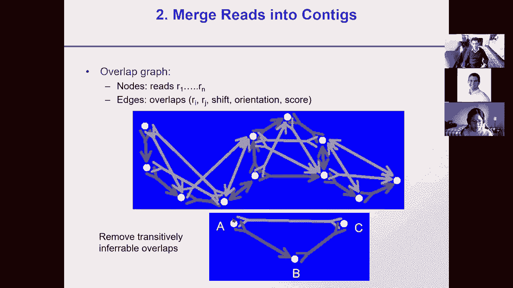
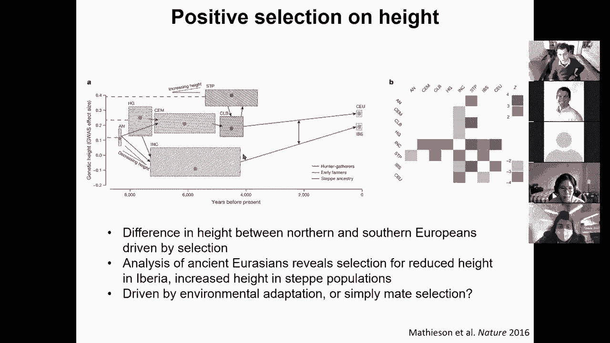

# 18：L18- 基因组进化 🧬

在本节课中，我们将要学习基因组进化。我们将从如何组装和比对基因组开始，探讨基因组快速进化的机制，特别是全基因组复制事件，最后研究近期人类进化中的自然选择。

---

## 🧩 基因组组装

上一节我们介绍了基因组进化研究的背景，本节中我们来看看如何从测序片段中组装出完整的基因组。

测序技术每次只能读取几百个核苷酸。因此，我们无法直接从一端测序到另一端。常见的策略是使用**双端测序**。这种方法将DNA打断成固定长度的片段，然后对片段的两端进行测序。通过已知的片段长度，我们可以推断两端序列在基因组中的大致距离。

以下是基因组组装的传统方法步骤：

1.  **寻找重叠序列**：通过比对或哈希等方法，找到不同读段之间重叠的部分。
2.  **构建重叠群**：将重叠的读段逐步连接起来，形成更长的连续序列，称为重叠群。
3.  **搭建支架**：利用双端测序提供的距离和方向信息，将重叠群排列并连接成更大的支架。支架之间的未知序列用字母“N”填充。
4.  **生成一致序列**：对于每个位置，根据覆盖该位置的所有读段的碱基和质量分数，通过加权投票等方式，确定最终的共识碱基。

组装过程中的主要挑战是基因组中的重复序列。如果重复序列的长度超过读段长度且序列高度相似，组装算法可能错误地将来自基因组不同位置的重复序列“折叠”到一起。

为了处理重复序列，我们可以构建一个**重叠图**。图中的节点是读段，边表示读段之间的重叠关系。通过分析图的拓扑结构和测序深度（即某个区域被测序覆盖的次数），我们可以推断并“展开”那些被错误折叠的重复区域。

另一种现代组装方法是**字符串图法**。它直接基于读段构建图结构，并通过寻找图中的最优路径来推导基因组序列。这种方法可以更有效地利用长读段数据来解决重复序列问题。

---

## 🔗 全基因组比对

现在我们已经有了组装好的基因组，接下来看看如何将不同物种的基因组进行比对。

对于两个序列的全局比对，我们可以使用动态规划算法，但其时间复杂度是 **O(n²)**。对于多个物种的全基因组比对，如果使用多维动态规划（例如，3个物种就是三维立方体），计算将变得不可行。

因此，我们采用**渐进式比对**策略。首先，根据物种间的进化关系构建一棵系统发育树。然后，从树的叶子节点开始，两两比对关系最近的序列，产生一个共识序列。接着，将这个共识序列与下一个最近的序列进行比对，如此逐步向上，直到树的根部。这样就将一个复杂的多重比对问题，分解为一系列两两比对问题。

对于很长的基因组序列，直接进行全局动态规划仍然开销巨大。因此，实际流程通常是：
1.  首先寻找高得分的**局部匹配**。
2.  将这些局部匹配**连接成链**。
3.  只在链所定义的区域内进行受限的动态规划，从而得到最终的全局比对。

这种比对方法可以检测到序列之间的大规模进化事件，如**倒位、易位和复制**。

除了基于序列相似性的方法，我们还可以进行**基于基因的全基因组比对**。其核心思想是利用基因作为“锚点”，先确定不同基因组间基因的对应关系，再填充基因间的序列比对。

BOS算法（最佳明确子群算法）是解决基因对应关系的一种方法。它构建一个加权二分图，节点是不同基因组中的基因，边的权重是蛋白质序列相似性。算法通过迭代筛选，优先保留那些位于同线区块（基因顺序保守的区域）且相似性高的边，从而解析出一对一、一对多或多对多的同源关系。

通过比对，我们可以发现基因组中快速进化的区域。例如，在酵母基因组中，染色体末端（端粒附近）存在大量基因家族的扩增，这些区域结构不稳定，但有利于快速适应环境变化。

---

## ⚡ 快速进化机制与全基因组复制

通过比较亲缘关系较近的物种，我们可以观察到基因组快速进化的具体机制。

研究发现，许多基因组重排（如易位、倒位）的断点附近常常有**转座元件**或**tRNA基因**。这些重复元件可能作为“进化热点”，促进了基因组结构的改变。

此外，还存在一些“进化捷径”，例如：
*   **蛋白质内含子**：一种可以自我剪切并移动的蛋白质片段，能插入到其他蛋白质中。
*   **通读终止密码子**：在特定条件下，核糖体可以越过终止密码子继续翻译。

接下来，我们探讨一个重大的进化跳跃事件：**全基因组复制**。

通过对酿酒酵母和其近缘物种克莱沃毕赤酵母的基因组比较，研究者发现了一个关键模式。克莱沃毕赤酵母的许多基因组区域，会**交错地**映射到酿酒酵母的两条不同染色体上。这种基因的“交织”模式，是远古发生的一次**全基因组复制**的有力证据。

在复制发生后，祖先基因组中的每个基因都变成了两个拷贝。随后，绝大多数冗余的基因拷贝被丢失，只有约8%的基因保留了两个拷贝。通过分析基因顺序，我们可以“描绘”出复制后基因丢失的历史，从而重建这一重大进化事件。

全基因组复制为新功能的产生提供了原材料。对酵母的研究发现，在保留的两个拷贝基因中，约有20%的基因对表现出**不对称进化速率**，其中一个拷贝进化加速，这可能是**新功能化**的迹象。这些加速进化的拷贝往往在特定条件（如胁迫）下表达，而进化速率较慢的“祖先功能”拷贝则通常执行必需的基础功能。

---

## 👨‍👩‍👧‍👦 近期人类进化与自然选择

前面我们看了跨越百万年的进化，现在把目光聚焦到近期，看看如何在人类群体中检测自然选择的信号。

首先，我们需要一个基线。在理想条件下（无突变、无迁移、无选择、大群体、随机交配），群体中的基因型频率会达到**哈迪-温伯格平衡**。设等位基因A的频率为 *p*，等位基因a的频率为 *q* (且 *p + q = 1*)，则基因型频率为：
*   AA: *p²*
*   Aa: *2pq*
*   aa: *q²*

当实际观测值偏离这个预期时，就可能存在进化力量（如选择、遗传漂变）的作用。

我们有多种统计方法，可以在不同时间尺度上检测自然选择：

1.  **物种间比较 (长尺度)**：使用 **dN/dS** 检验。比较非同义替换率(dN)和同义替换率(dS)。如果 dN/dS > 1，表明氨基酸改变受到正向选择。
2.  **群体内多态性与物种间分化比较 (中尺度)**：如 **McDonald-Kreitman 检验**。比较物种内多态性位点和物种间固定位点中同义与非同义替换的比例。如果固定位点中非同义替换的比例异常高，提示正向选择。
3.  **高频率衍生等位基因 (较短尺度)**：通过与黑猩猩基因组比较，确定每个位点的“祖先型”和“衍生型”碱基。如果在人类群体中，某个衍生等位基因的频率异常高，可能是近期正向选择的结果。
4.  **群体间分化 (群体尺度)**：计算 **群体固定指数 Fst**。Fst 衡量群体间的遗传分化程度。某个位点在群体间Fst值极高，表明该位点可能受到局域适应选择。
5.  **长单倍型 (近期选择)**：这是检测**近期强正向选择**的有力工具。当一个有益突变在群体中快速上升时，它周围紧密连锁的染色体区域还来不及被重组事件打断，因此会形成一个**长而高频的单倍型**。

一个经典案例是欧洲人群中的**乳糖耐受性**。负责消化乳糖的LCT基因上游的一个突变，使成人在摄入乳制品后仍能表达乳糖酶。这个突变在畜牧业发展后提供了巨大优势，因此受到了强烈的正向选择。在现代欧洲人群中，携带此突变的染色体单倍型不仅频率高（~77%），而且长度非常长（超过1Mb），这正是近期强选择的典型特征。

通过整合这些检测方法，科学家们已经在人类基因组中发现了许多近期受到选择的基因，涉及消化代谢、疾病抵抗、肤色、身高适应等多个方面。

---

## 📚 总结

本节课中我们一起学习了基因组进化的多个层面：
1.  我们了解了如何从短测序读段**组装**出完整基因组，并处理重复序列的挑战。
2.  我们探讨了如何进行**全基因组比对**，包括渐进式比对和基于基因的比对，以识别保守区域和进化事件。
3.  我们深入研究了**快速进化机制**，如转座元件介导的重排，并重点剖析了**全基因组复制**这一重大进化事件及其后续的功能分化。
4.  最后，我们将尺度拉近到人类群体内部，学习了多种检测**自然选择**信号的统计学方法，并看到了这些方法如何揭示人类近期适应性的进化历史。

从基因组组装到跨物种比对，再到群体遗传分析，这些工具共同帮助我们利用基因组数据来解读生命演化的壮丽篇章。