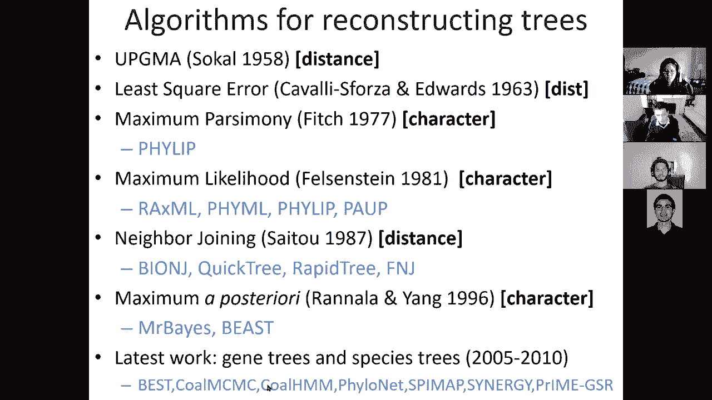

# 19：L19- 系统发育学 🧬


在本节课中，我们将学习分子进化与系统发育学的基础知识。我们将探讨如何从序列数据推断进化历史，包括构建距离矩阵、使用不同算法构建系统发育树，以及如何直接基于序列比对来评估和搜索最优树形结构。

---

## 1. 系统发育学基础 📚

上一节我们介绍了课程的整体目标，本节中我们来看看系统发育学的基本概念和定义。

系统发育学研究的是物种、基因或其他实体之间的进化关系。我们利用可观察的特征（性状）来推断它们的历史谱系关系。

*   **性状**：可以是形态特征（如牙齿形状），也可以是分子特征（如DNA序列中的特定核苷酸）。
*   **节点**：代表分类单元（如物种、基因）。
    *   **根节点/祖先节点**：代表所有分类单元的共同祖先。
    *   **内部节点**：代表假想的祖先，表示分化事件。
    *   **叶节点/终端节点**：代表我们实际观察到的现存分类单元。
*   **分支/谱系**：连接节点的线段，代表进化路径和时间。

系统发育树主要有三种类型：
*   **分支图**：只关注拓扑结构（谁和谁关系更近），不包含分支长度信息。
*   **时序图**：假设所有谱系从共同祖先开始以相同速率进化，分支长度代表实际时间。
*   **系统发育图**：结合了拓扑结构和分支长度，分支长度可以代表进化速率或遗传距离。

我们的核心挑战是：如何从一组已比对的核苷酸或蛋白质序列中，推断出最能代表其进化历史的树形结构。

---

## 2. 从序列比对到距离矩阵 📏

上一节我们定义了系统发育树的基本要素，本节中我们来看看如何量化序列之间的进化差异，即构建距离矩阵。

我们首先需要测量两条已比对序列之间的进化距离。最简单的方法是计算**总体核苷酸差异百分比**。例如，如果两条序列90%相同，则距离为10%。

然而，简单的计数会低估实际的突变数量，因为存在**回复突变**的可能性：一个位点可能从A变为C，后来又变回A，这样在最终比对中我们就观察不到变化。因此，我们需要进化模型来校正这种效应。

以下是校正模型的核心思想：我们将核苷酸的替换过程建模为一个**马尔可夫链**。在极短的时间 `Δt` 内，一个核苷酸以特定概率变为其他核苷酸。

**Jukes-Cantor模型**是一个单参数模型，它假设所有核苷酸之间的相互替换速率相同。其替换概率矩阵可以表示为：

给定时间 `t` 后，一个位点保持不变的概率 `P(相同)` 和发生改变的概率 `P(不同)` 的公式为：
```
P(相同) = 1/4 + (3/4) * exp(-4αt)
P(不同) = 3/4 - (3/4) * exp(-4αt)
```
其中 `α` 是替换速率参数。

通过观测到的差异比例 `p`，我们可以反推校正后的遗传距离 `d`：
```
d = -(3/4) * ln(1 - (4/3)p)
```

**Kimura双参数模型**则更进一步，它考虑了**转换**（嘌呤间或嘧啶间的替换，如A↔G）和**颠换**（嘌呤与嘧啶间的替换，如A↔C）通常具有不同速率的事实，因此使用两个参数进行建模。

实际上，存在一整套模型层次结构，从简单到复杂（如考虑不同碱基频率的GTR模型），用于更精确地估计序列间的进化距离。

---

## 3. 从距离矩阵到系统发育树 🌳

上一节我们学会了如何计算序列间的校正距离，本节中我们来看看如何利用这些距离来构建系统发育树。

距离矩阵包含了所有序列对之间的差异信息。构建树的目标是找到一个树形结构，使得树上任意两叶节点之间的路径距离（即沿途分支长度之和）尽可能接近距离矩阵中对应的观测值。

首先，我们需要了解距离矩阵的类型：
*   **超度量距离**：满足三点条件，`d(i,k) = d(j,k) > d(i,j)`。这对应于一个所有叶节点到根节点距离相等的**有根树**（即存在分子钟）。
*   **可加距离**：满足四点条件，`d(i,j) + d(k,l) ≤ d(i,k) + d(j,l) = d(i,l) + d(j,k)`。这保证存在一个树能精确反映这些距离。
*   **一般距离**：由于噪声、模型不准确或进化速率不均等原因，实际数据往往既非超度量也非严格可加。

以下是几种基于距离的建树算法：

**UPGMA（非加权组平均法）**
这是一种层次聚类方法。
1.  找到距离最近的两个类群（初始为单个序列），合并它们，形成一个新节点。
2.  新节点的高度设为两个类群距离的一半。
3.  重新计算新类群与其他所有类群的平均距离。
4.  重复上述步骤，直到所有类群合并完毕。

UPGMA**假设分子钟存在**，如果数据是超度量的，它能构建出正确的树；如果进化速率不均，它可能会得出错误拓扑。

**邻接法**
邻接法通过引入一个“净分歧度”来修正UPGMA的缺陷，该度量反映了每个节点到所有其他节点的总距离。
其修正后的距离 `D(i,j)` 计算公式为：
```
D(i,j) = d(i,j) - (r_i + r_j) / (N - 2)
```
其中 `r_i` 是序列 `i` 到所有其他序列的距离之和，`N` 是序列总数。

邻接法选择使 `D(i,j)` 最小的两个节点进行合并。它对于可加距离矩阵能保证得到正确树，对于一般距离矩阵也通常表现良好。

除了这些循序渐进的算法，我们还可以使用**最优性标准**来搜索最佳树，例如**最小二乘法**（最小化观测距离与树距之差的平方和）或**最小进化法**（最小化树的总分支长度）。但这些方法需要结合树空间搜索策略。

---

## 4. 从序列比对直接评估系统发育树 ⚖️

上一节我们介绍了基于距离的建树方法，本节中我们绕过距离矩阵，直接学习如何根据序列比对数据来评估一个给定树形结构的优劣。

这类方法不直接构建树，而是为不同的树拓扑结构进行评分，需要与树搜索算法（下一节介绍）结合来寻找最优树。

**最大简约法**
核心思想是选择所需进化事件（如核苷酸替换）最少的树。对于比对中的每一列（位点），我们尝试为所有内部节点分配核苷酸状态，使得整棵树上该位点所需的状态变化总数最小。

可以使用动态规划算法高效计算：
1.  从叶节点开始，每个叶节点的状态集合已知（即观测到的核苷酸）。
2.  向根节点方向计算。对于一个内部节点，查看其两个子节点的状态集合。
    *   如果两个集合有交集，则父节点状态设为该交集中的一个，不增加代价。
    *   如果无交集，则父节点状态设为两个集合的并集，代价增加1。
3.  遍历所有位点，将代价相加，总代价最小的树被认为是最优的。

**最大似然法与最大后验概率法**
这些是概率模型方法，不仅考虑拓扑，还考虑分支长度 `t`。

*   **最大似然**：寻找使观测数据 `D`（序列比对）出现概率最大的树拓扑 `T` 和分支长度 `t`。
    ```
    (T, t)_ML = argmax P(D | T, t)
    ```
*   **最大后验概率**：在最大似然的基础上，结合了关于树和分支长度的先验知识 `P(T, t)`，寻找后验概率最大的树。
    ```
    (T, t)_MAP = argmax P(T, t | D) = argmax P(D | T, t) * P(T, t)
    ```

计算 `P(D | T, t)` 需要使用进化模型（如Jukes-Cantor）和**Felsenstein的剪枝算法**。该算法利用动态规划，从叶节点到根节点递归计算每个节点处于每种核苷酸状态的可能性，最终得到在给定树和分支长度下，产生观测数据的整体概率。

这些概率方法的优点在于其坚实的统计学和进化论基础，但计算量通常非常庞大。

---

## 5. 系统发育树空间的搜索与评估 🔍

上一节我们学会了如何给一棵树打分，本节中我们来看如何在所有可能的树中寻找得分最高的那一棵。

对于包含 `n` 个物种的树，可能的无根二叉树拓扑数量是 `(2n-5)!!`，这是一个天文数字，无法进行穷举搜索。因此，我们需要启发式搜索策略。

**马尔可夫链蒙特卡洛（MCMC）搜索**
这是一种常用的在树空间中进行随机采样的方法。
1.  **初始化**：通常从一棵邻接法构建的树开始。
2.  **提议新树**：通过特定的树形调整操作在当前树附近产生一棵新树。
    *   **最近邻交换**：交换一个内部节点连接的两个子树。
    *   **子树剪枝与重接**：剪下一棵子树，将其连接到另一条分支上。
3.  **评估与接受**：计算新树的得分（似然值或后验概率）。根据Metropolis-Hastings准则，以一定概率接受新树作为当前状态（即使它比旧树差，但接受概率较低）。这保证了长期采样会收敛到后验分布。
4.  **迭代**：重复步骤2和3数百万次，在丢弃初始的“老化”样本后，剩余的样本可以用于估计最可信的树或计算分支支持度。

**自举法评估**
为了评估所建树的可靠性，特别是各个分支的可信度，我们使用**自举法**。
1.  从原始比对数据中**有放回地**随机抽取列，生成许多个（如1000个）相同大小的新比对数据集。
2.  为每个自举数据集构建一棵系统发育树。
3.  观察原始树中的每个分支在这些自举树中出现的频率（即**自举支持率**）。支持率高的分支（如>95%）被认为是可靠的，而支持率低的分支则可信度低。

---

## 总结 📝

本节课中我们一起学习了系统发育学的核心内容：
1.  **基础概念**：了解了系统发育树的基本组成部分和类型。
2.  **距离矩阵构建**：学习了如何通过进化模型（如Jukes-Cantor模型）从序列比对中计算校正后的遗传距离。
3.  **距离法建树**：掌握了UPGMA和邻接法等算法，以及它们各自的假设和适用条件。
4.  **特征法评分**：理解了最大简约法和最大似然/后验概率法如何直接基于序列数据评估树的优劣。
5.  **树空间搜索**：认识了如何使用MCMC等启发式方法在巨大的树空间中搜索最优树，并用自举法评估结果的可靠性。




通过这些方法，我们可以从分子序列数据中推断出描绘进化历史的系统发育树，这是比较基因组学和进化生物学中至关重要的工具。