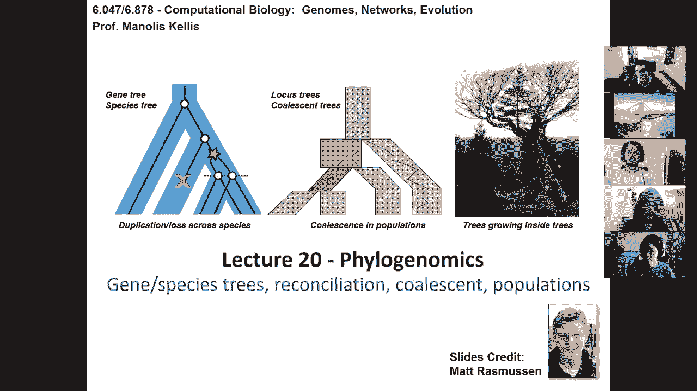
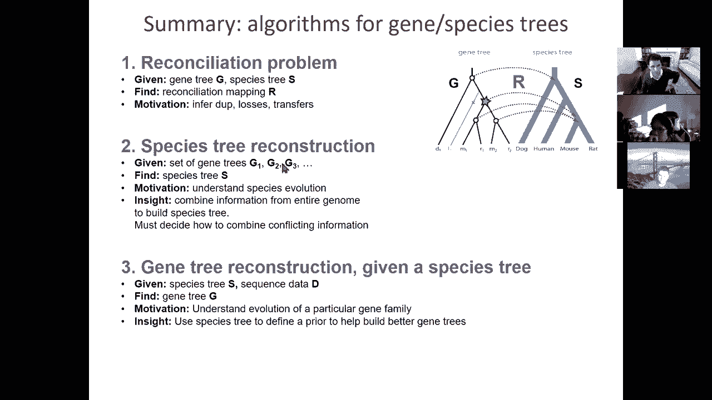

# 20：L20 系统基因组学 🧬🌳

在本节课中，我们将学习系统基因组学。我们将探讨如何将之前学习的关于复制、丢失、分化等事件的基因树，整合到物种树和溯祖树中，并利用这些信息来推断基因复制、丢失以及深层溯祖事件。本节课的核心是理解“树中之树”的概念。

---

## 概述：基因树与物种树

上一节我们介绍了系统发育分析。本节中，我们来看看如何区分基因树和物种树，讨论两者的“调和”问题，以及种群差异的溯祖过程。

首先，我们将讨论“调和”：如何将基因树映射到物种树上，如何利用这种映射推断直系同源、旁系同源、基因复制和丢失事件，以及调和问题的具体案例和最大简约法调和。

---

## 基因树与物种树的调和 🧩

基因树是在物种谱系内部进化的。我们之前研究的系统发育树，其分支通常是无标签的。但现在，我们需要考虑序列所属的物种。例如，一段序列来自狗，另一段来自人。通过了解比对序列的物种归属，我们可以理解它们在物种树内部的进化过程。

### 核心概念与定义

*   **物种树**：描述了物种之间的进化关系。每个物种可以被看作一个“基因袋”。
*   **基因树**：描述了特定基因在物种间的进化历史。
*   **调和**：将基因树的节点映射到物种树节点上的过程，以推断进化事件。

以下是调和过程中的关键事件定义：

*   **复制事件**：发生在基因树节点上，当该节点映射到的物种树位置与其任一子节点相同时。公式表示为：`reconciliation(v) == reconciliation(left_child(v))` 或 `reconciliation(v) == reconciliation(right_child(v))`。
*   **丢失事件**：当基因树中一个节点的父节点映射到的物种树位置，与该节点映射的位置不同，且中间跨越了物种树分支时被推断出来。
*   **直系同源**：两个基因通过物种形成事件找到最近共同祖先。它们在不同物种中很可能执行相同功能。
*   **旁系同源**：两个基因通过基因复制事件找到最近共同祖先。它们可能获得新的功能或产生基因剂量效应。

### 调和算法简介

最简单的算法是最大简约法调和。其递归过程如下：
1.  对于基因树的叶节点（物种），直接映射到物种树对应的物种。
2.  对于基因树的内部节点 `v`，其映射位置是其左右子节点映射位置的**最近共同祖先**。
3.  根据映射结果判断事件：如果节点 `v` 的映射位置与其任一子节点相同，则为**复制事件**；如果节点 `v` 的父节点映射位置与 `v` 不同，且跨越了物种树分支，则推断存在**丢失事件**。

这个算法从叶节点开始，自底向上遍历基因树，完成映射和事件推断。

---

## 系统基因组学：利用全基因组数据 🌍

上一节我们介绍了单个基因树的调和。本节中，我们来看看如何利用全基因组范围内的多个基因树来构建更可靠的物种树，并反过来利用物种树提高基因树重建的准确性。

### 构建物种树的方法

给定一组基因树，目标是找到一个能最好概括这些基因树信息的物种树。主要方法有：

1.  **超级矩阵法**：将所有基因的序列比对拼接成一个大的超级矩阵，然后基于此矩阵构建系统发育树。
2.  **超级树法**：分析每个基因树支持的“分裂”（即物种分组），然后整合所有基因树的分裂信息，构建一个共识树。
3.  **最小化进化事件法**：选择一个物种树假设，计算将所有基因树调和到该物种树所需的总的复制和丢失事件数（或深层溯祖事件数），选择使总成本最小的物种树。

### 利用物种树优化基因树重建

传统的流程是：重建基因树 -> 将其调和到物种树。但基因树重建可能出错，导致错误推断大量复制和丢失事件。

更优的方法是：将物种树信息作为先验知识，整合到基因树重建过程中。我们可以建立一个**生成式概率模型**，该模型考虑：
*   **物种树拓扑结构和分歧时间**。
*   **基因特异性进化速率**和**物种特异性进化速率**。分支长度可以建模为：`分支长度 = 基因速率 * 物种速率 * 分歧时间`。
*   **复制与丢失模型**。
*   **序列进化模型**（如HKY、Jukes-Cantor等）。

通过贝叶斯推理，我们可以计算在给定物种树和序列数据的情况下，某个基因树拓扑结构的后验概率，从而找到最可能的基因树。这种方法能显著提高直系同源基因推断的准确性和减少错误推断的进化事件。

---

## 种群水平的进化：溯祖理论 👥

之前我们关注的是物种间的进化。本节中，我们来看看种群内部、个体之间的进化过程，这需要适应更短的时间尺度。

### 赖特-费希尔模型（前进时间）

这是一个前进时间模型，用于研究遗传漂变等效应。它假设：
*   种群大小固定为 `N`。
*   随机交配。
*   中性进化（无选择）。
*   非重叠世代。

在每一代，每个个体会产生大量配子，下一代个体从这些配子中随机抽取形成。因此，一个等位基因可能没有后代，也可能有多个后代。

### 溯祖模型（后退时间）

与赖特-费希尔模型等价但更高效的是**溯祖模型**，它向后追溯时间。其核心思想是：随机抽取当代的两个等位基因，追溯它们的祖先，直到找到最近共同祖先。

*   **溯祖时间**：`k` 个谱系追溯到其最近共同祖先所需的时间。
*   **概率分布**：在种群大小 `N` 很大时，`k` 个谱系在 `t` 代内未发生溯祖的概率近似服从指数分布：`P(T > t) ≈ exp( - (k choose 2) * t / (2N) )`。

这个模型可以高效地模拟种群中基因谱系的合并历史。

### 多物种溯祖与不完全谱系分选

将溯祖模型扩展到物种树，就得到了**多物种溯祖模型**。物种树的每个分支代表一个种群，有其特定的种群大小和存在时间。

*   **不完全谱系分选**：当种群很大或物种形成时间很短时，来自不同物种的两个等位基因可能没有足够时间在祖先种群中溯祖，它们的溯祖事件可能发生在更古老的祖先种群中。
*   **结果**：这会导致基因树的拓扑结构与物种树的拓扑结构不一致，而这种不一致并非由于基因复制或丢失引起。

ILS是导致基因树与物种树差异的重要原因之一，可用于推断物种分化时间和祖先种群大小。

---

## 统一模型：等位基因、基因座与物种 🧬

我们已看到两种解释基因树/物种树冲突的视角：复制/丢失 vs. 溯祖/ILS。然而，传统模型无法同时处理这两种情况。

一个统一的框架是**等位基因在基因座中进化，基因座在物种树中进化**的模型。在这个模型中：
1.  **基因座树**在物种树中向前进化，经历复制和丢失事件。
2.  在每个基因座内部，**等位基因**通过溯祖过程向后进化。
3.  复制事件产生的新基因座，其等位基因可以在种群中固定、丢失或保持多态性。

这个**DL-溯祖模型**结合了前进时间的复制/丢失过程和后退时间的溯祖过程，能够更全面地建模基因组进化历史。

---

## 重组与祖先重组图 🔀

之前的模型都假设无重组。但真实情况中，重组会打断谱系的历史。

*   **重组的影响**：基因组上不同区域可能具有不同的进化历史（拓扑结构）。
*   **祖先重组图**：一种表示包含重组事件的进化历史的图结构，它不是一棵树，而是一个有向无环图。
*   **建模方法**：可以使用**序列马尔可夫溯祖模型**等，将基因组视为从左到右的序列，在不同位置之间，基因树的拓扑结构以一定的概率（重组率）发生切换。这类似于一个隐马尔可夫模型，其中隐藏状态是局部的树拓扑。

---

## 总结 📚

本节课中我们一起学习了：
1.  **基因树与物种树的调和**：如何映射并推断复制、丢失事件，定义直系/旁系同源。
2.  **系统基因组学**：如何利用全基因组数据构建更稳健的物种树和基因树，通过整合物种树信息的生成式模型显著提升推断准确性。
3.  **种群遗传学模型**：包括前进时间的赖特-费希尔模型和后退时间、更高效的溯祖模型。
4.  **不完全谱系分选**：多物种溯祖模型下的重要现象，能导致基因树与物种树冲突，并用于推断历史参数。
5.  **统一进化模型**：整合基因复制、丢失和溯祖过程的DL-溯祖模型。
6.  **重组**：重组如何使进化历史非树状，以及祖先重组图的概念。

通过系统基因组学，我们将微观的基因进化与宏观的物种形成、种群历史联系起来，获得了对生命进化历史更完整、更深入的理解。