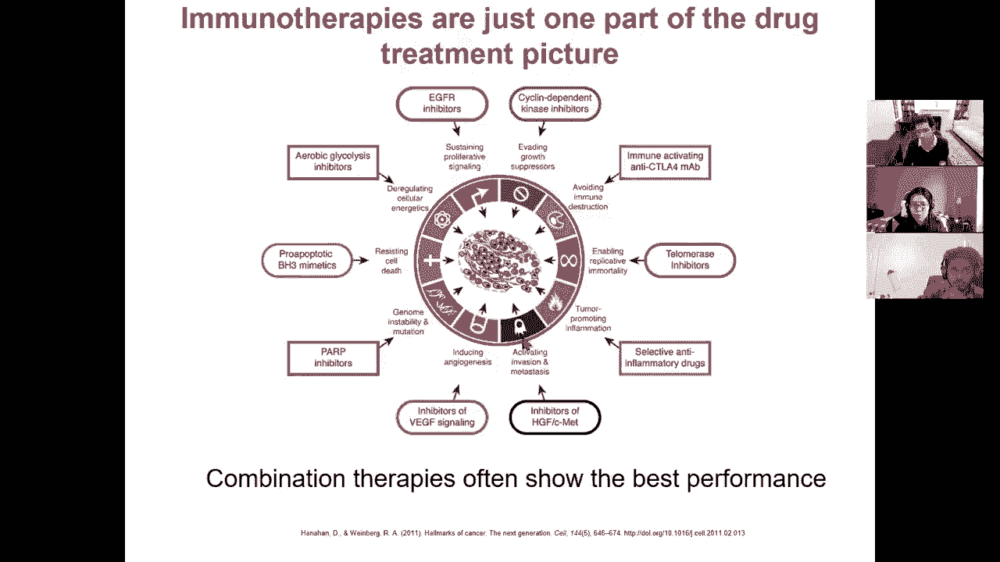

# 21：L21- 癌症基因组学 🧬

在本节课中，我们将要学习癌症基因组学的基础知识。我们将从理解癌症的核心特征开始，探讨如何通过外显子组和全基因组测序来发现驱动癌症的基因突变，并进一步了解超越基因序列的癌症驱动因素，包括表观遗传学改变和肿瘤与免疫系统的相互作用。

***

## 癌症的基石：癌基因、抑癌基因与癌症特征

上一节我们介绍了课程的整体框架，本节中我们来看看理解癌症的基础概念。癌症并非单一疾病，而是一类具有共同特征的细胞异常增殖性疾病。

2000年，Bob Weinberg 和 Doug Hanahan 在《细胞》杂志上发表了一篇名为“癌症的特征”的综述，将癌细胞区别于正常细胞所获得的能力总结为六大类，并在2011年补充了四个新特征。这些能力是肿瘤形成所必需的“技能”。

以下是癌症的六大核心特征：
1.  **避免细胞凋亡**：癌细胞能够逃避程序性细胞死亡信号。
2.  **实现生长信号自给自足**：癌细胞不再依赖外部生长信号，其“油门”被卡住。
3.  **对生长抑制信号不敏感**：癌细胞无视周围环境发出的停止生长信号，其“刹车”失灵。
4.  **诱导持续血管生成**：肿瘤能够发出信号，诱导周围环境形成新的血管，为其提供氧气和营养。
5.  **无限复制潜能**：癌细胞能够突破正常细胞分裂次数的限制（如端粒缩短），实现无限增殖。
6.  **组织浸润和转移**：癌细胞能够侵入周围组织并扩散到身体其他部位，这是被正向选择的进化优势。

此外，2011年提出的四个新兴特征包括：
*   **细胞能量代谢异常**：癌细胞线粒体功能失调，产生大量能量。
*   **避免免疫摧毁**：癌细胞能够与免疫系统相互作用，逃避免疫系统的攻击。
*   **基因组不稳定性和突变**：癌细胞倾向于制造基因组不稳定性和高突变率，通过“数量游戏”增加获得有益突变的机会。
*   **肿瘤促进性炎症**：肿瘤可以利用炎症反应，招募免疫细胞并加以利用。

肿瘤获得这些特征的顺序并不重要，关键在于最终全部获得。由于存在多种基因和调控路径，每个肿瘤都通过独特的突变组合来实现这些特征，这导致了肿瘤的异质性。

***

## 驱动突变与乘客突变：识别癌症的“元凶”

理解了癌症的特征后，我们需要找到导致这些特征的分子变化。在肿瘤发生过程中，细胞会积累大量突变，但并非所有突变都同等重要。

核心概念在于区分**驱动突变**和**乘客突变**：
*   **驱动突变**：直接赋予癌细胞生长优势，促进肿瘤发展的突变。它们通常影响癌基因、抑癌基因等关键通路。
*   **乘客突变**：在肿瘤发展过程中随机积累，不直接贡献于肿瘤生长优势的突变。它们是进化过程的“搭便车者”。

识别驱动突变的主要挑战在于，它们在所有突变中只占极少数（通常每个肿瘤仅有5-20个），而乘客突变数量庞大。常用的策略是寻找**复发性突变**，即在许多不同患者的相同基因或通路上反复出现的突变。

驱动突变主要影响四类基因：
1.  **癌基因**：正常时促进细胞生长（原癌基因），突变后过度活跃，成为“卡住的油门”。例如 **RAS** 基因家族。
    *   `原癌基因 ->（突变）-> 癌基因 -> 过度生长`
2.  **抑癌基因**：正常时抑制细胞分裂，充当“刹车”。突变导致功能丧失，细胞生长失控。例如 **TP53** 基因。
    *   `抑癌基因 ->（功能丧失性突变）-> 生长失控`
3.  **突变基因**：参与DNA修复或维持基因组稳定。突变会导致基因组不稳定性和突变率升高。
4.  **表观突变基因**：调控全局表观基因组。其功能失调会导致广泛的基因表达改变。

此外，基因组结构变异（如染色体易位产生的融合基因）也是常见的驱动事件。例如，9号与22号染色体易位产生的 **BCR-ABL** 融合基因是慢性髓系白血病的驱动因素。

***

## 从外显子组测序中发现复发突变与异质性

上一节我们介绍了驱动突变的概念，本节中我们来看看如何利用外显子组测序来发现它们。识别癌症驱动基因的主要方法包括全基因组关联研究（GWAS）、遗传连锁分析和体细胞突变分析。

体细胞突变分析是发现肿瘤特异性驱动突变的关键。其核心方法是**配对测序**：同时测序患者的肿瘤组织和正常组织（如血液），通过比较找出只在肿瘤中出现的体细胞突变。

以下是分析体细胞突变的主要步骤：
1.  **突变检测**：使用工具（如 Mutect2）比较肿瘤和正常样本的测序数据，统计富集地识别体细胞突变。
2.  **过滤与注释**：应用一系列过滤器排除测序错误、常见多态性位点等，然后对剩余突变进行功能注释。
3.  **寻找复发信号**：在大量患者中寻找在**基因水平**（同一基因多次突变）、**氨基酸水平**（同一蛋白位点反复突变）或**通路水平**（同一通路多个基因被破坏）上复发的突变。例如，BRCA1 和 BRCA2 基因在遗传性乳腺癌中就有数百种不同的复发突变。

然而，癌症也是一个进化过程，这导致了**肿瘤内异质性**。一个肿瘤并非由完全相同的细胞组成，而是包含多个具有不同突变谱的细胞亚群（克隆）。这种异质性使得驱动突变可能只存在于一部分肿瘤细胞中，在测序数据中表现为较低的等位基因频率。

克隆进化模型描述了肿瘤的发展：起始驱动事件导致一个优势克隆扩增，随后该克隆内细胞继续积累新的突变（包括新的驱动事件），形成不同的亚克隆。治疗就像一个选择压力，可能消灭大部分克隆，但残留的、具有耐药性的亚克隆会再次扩增，导致复发。

通过分析多个肿瘤区域或不同时间点的样本，我们可以构建肿瘤的**系统发育树**，追踪不同克隆的进化历史，并识别在克隆扩增中起关键作用的驱动事件。

***

## 全基因组测序：探索非编码区驱动突变

外显子组测序主要关注蛋白质编码区，但人类基因组中超过98%的区域是非编码的。本节中我们来看看如何利用全基因组测序探索非编码区的癌症驱动突变。

绝大多数体细胞突变位于非编码区，且主要是乘客突变。在非编码区寻找驱动突变面临巨大挑战：
1.  **功能单元不明确**：在编码区，基因是天然的功能单元。而在非编码区，功能单元可能是增强子、启动子或更复杂的调控网络，其边界难以界定。
2.  **背景突变率差异大**：不同基因组区域的突变率受染色质状态、复制时间、基因表达水平等因素影响，存在巨大差异。例如，不活跃的染色质区域（如异染色质）通常比活跃的开放染色质区域突变率更高。
3.  **识别收敛性更困难**：在编码区，不同患者在同一基因的不同位置突变可视为收敛于该基因。在非编码区，我们需要将散布在不同位置的突变关联到它们共同调控的靶基因上，这需要借助基因调控网络的知识。

为了应对这些挑战，我们需要：
*   **校正背景突变率**：建立统计模型，考虑染色质可及性、复制时间、序列背景等多种因素，预测每个基因组区域的“预期”突变率，然后找出突变显著高于预期的区域。
*   **定义调控单元**：利用表观基因组学数据（如组蛋白修饰、染色质开放区域）定义增强子、启动子等调控元件。
*   **寻找调控收敛**：即使突变位于基因组不同位置，如果它们都影响同一个靶基因或同一个信号通路，也可以被认为是驱动事件。这需要整合染色质相互作用（如Hi-C）和基因调控网络数据。

非编码驱动突变可以通过多种方式发挥作用，例如改变转录因子结合位点、破坏或创造microRNA结合位点、通过结构变异重写基因调控环境等。

***

## 超越突变：表观遗传改变与肿瘤微环境

癌症驱动因素不仅限于DNA序列的改变。本节中我们来看看表观遗传改变和肿瘤微环境在癌症中的作用。

**表观遗传改变**，如DNA甲基化、组蛋白修饰和染色质结构的全局性变化，也可以驱动癌症。这些改变通常由**表观突变基因**（如DNA甲基转移酶、组蛋白去乙酰化酶）的功能失调引起。它们能导致全基因组范围的基因表达重编程，影响细胞分化状态，从而促进肿瘤发生。针对这些表观遗传改变的药物（如表观遗传疗法）正在成为新的治疗策略。

**肿瘤微环境**是指肿瘤细胞周围的复杂生态系统，包括成纤维细胞、免疫细胞、血管内皮细胞等。肿瘤与微环境的相互作用对其生长、侵袭和转移至关重要。例如，肿瘤可以通过释放信号分子来抑制免疫细胞功能，营造一个免疫抑制性的微环境，从而逃避免疫系统的攻击。

单细胞基因组学技术使我们能够以前所未有的分辨率解析肿瘤内和微环境中的细胞异质性。通过单细胞RNA测序，我们可以：
*   识别不同的肿瘤细胞亚型和它们所处的细胞周期状态。
*   刻画肿瘤浸润免疫细胞（如T细胞、B细胞、巨噬细胞）的组成和功能状态。
*   推断肿瘤细胞的拷贝数变异。

***

## 肿瘤免疫学与免疫治疗 🛡️

上一节我们提到了肿瘤微环境中的免疫细胞，本节中我们深入探讨肿瘤与免疫系统的相互作用，以及如何利用这种相互作用进行治疗。

肿瘤与免疫系统的关系是一个动态的“编辑”过程。免疫系统会识别并清除具有高免疫原性（即能被免疫系统识别为“非己”）的肿瘤细胞。然而，在进化压力下，肿瘤细胞会通过多种机制逃避免疫监视：
1.  **降低免疫原性**：选择抗原性较低的突变。
2.  **下调抗原呈递**：减少主要组织相容性复合体（MHC）分子的表达。
3.  **营造免疫抑制微环境**：上调抑制性免疫检查点分子（如PD-L1），招募抑制性免疫细胞（如调节性T细胞）。

**免疫治疗**旨在打破这种免疫抑制，重新激活患者自身的免疫系统来攻击肿瘤。主要策略包括：
*   **免疫检查点抑制剂**：使用抗体阻断PD-1/PD-L1或CTLA-4等抑制性通路，相当于“松开T细胞的刹车”。这类药物的疗效与肿瘤的**突变负荷**和**新抗原**数量正相关，因为更多的突变意味着免疫系统有更多可以识别的靶点。
*   **过继性细胞疗法（如CAR-T）**：从患者体内提取T细胞，在体外进行基因工程改造，使其表达能够特异性识别肿瘤抗原的嵌合抗原受体（CAR），然后扩增并回输到患者体内，相当于给免疫细胞装上“GPS导航”去攻击肿瘤。
*   **癌症疫苗**：根据患者肿瘤特有的新抗原设计个性化疫苗，刺激机体产生针对这些新抗原的特异性免疫反应。

预测免疫治疗疗效是一个活跃的研究领域，涉及计算预测新抗原、分析T细胞受体（TCR）库的多样性以及评估肿瘤免疫微环境的状态。

***

## 总结

本节课中我们一起学习了癌症基因组学的核心内容。我们从**癌症的六大（及新兴）特征**出发，理解了癌细胞获得的关键能力。我们探讨了如何通过**外显子组和全基因组测序**来区分**驱动突变**与**乘客突变**，并利用**复发性**和**克隆进化**分析来识别关键的癌症基因。我们认识到，驱动因素不仅限于编码区突变，**非编码区调控元件**和**全局性表观遗传改变**也扮演着重要角色。最后，我们深入了解了**肿瘤与免疫系统**复杂的相互作用，以及如何通过**免疫检查点抑制剂、CAR-T疗法和癌症疫苗**等免疫治疗策略来对抗癌症。癌症基因组学是一个快速发展的领域，其研究成果正在不断转化为更精准、更有效的癌症诊断和治疗方法。