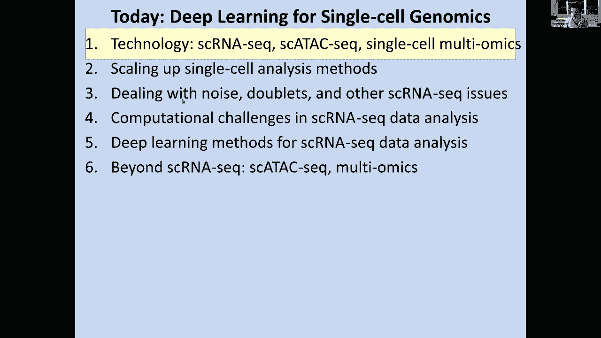

# 22：单细胞基因组学与深度学习方法 🧬

在本节课中，我们将学习单细胞基因组学的基础知识，特别是用于单细胞基因组学的深度学习方法。我们的目标是能够在单细胞水平上推断信息。我们将讨论单细胞RNA测序、单细胞ATAC测序以及单细胞多组学技术，探讨如何扩展这些技术，以及如何处理噪声、双联体和其他单细胞测序问题。课程将涵盖单细胞RNA测序数据分析的计算挑战、已应用于此的深度学习方法，并展望超越单细胞RNA测序的未来方向。

## 🧫 为何要进行单细胞分析？

上一节我们介绍了课程概述，本节中我们来看看为何需要分析单细胞。当我们观察批量数据时，例如脑组织活检或肝脏活检中测量的RNA，我们得到的是许多维度的平均值。这包括不同细胞类型、不同细胞状态、不同发育阶段、不同响应以及细胞周期中不同时间点的平均值。在显微镜下，细胞是极其异质性的。因此，平均这些细胞的表达量会得到一个无法代表其中任何一个细胞的结果。

第二个原因是细胞会分化。例如，它们从多能干细胞开始，然后分化成所有不同的血统谱系。即使在同一种细胞类型内，个体细胞之间也存在巨大差异，这是批量分析无法捕捉的。此外，当细胞对环境做出反应时，它们拥有的特定受体只能部分地捕捉细胞环境。在组织或器官水平上，你得到的是这些反应的平均值，而实际上，每个细胞可能根据其检测到的病毒蛋白量而有非常不同的反应。

最后，进行单细胞分析的另一个原因是，如果你观察循环肿瘤细胞或斑马鱼早期胚胎，可能只有八个细胞。如果我们使用批量RNA捕获方法，当样本中只有百分之一的细胞是肿瘤细胞时，我们可能会完全错过它。同样，如果某个区域细胞非常少，也可能被遗漏。

批量数据的另一个主要问题是，当你观察一个基因的表达分布时，真实数据可能呈现非常双峰性的分布。一些细胞可能大量表达该基因，而另一些细胞可能表达极少。但当你观察批量数据时，你得到的是这些的平均值，完全错过了这种双峰性。批量数据的另一个问题是稀有事件可能丢失。如果你观察平均值的分布，最终分布会非常接近平均值，而实际上可能有一些个体细胞对该基因有极强的信号，这些信号可能在批量数据中完全丢失。

## 🔬 单细胞分析的传统与现代方法

上一节我们探讨了单细胞分析的必要性，本节中我们来看看实现单细胞分析的方法。单细胞分析并非新概念，人们长期以来一直试图研究单个细胞。传统方法使用显微镜观察带有大约五个探针的单个标记RNA，这可以捕获丰富的空间信息，但只能捕获很少的基因。

随着电信号、FISH技术和原位测序技术的发展，这种方法得到了一定程度的扩展，可以观察大量探针。通过单细胞RNA测序，我们现在可以开始观察成千上万个基因在成千上万个细胞中的表达。

许多单细胞RNA测序技术的底层基础技术是RT-PCR。概念是从活细胞开始，提取RNA，进行逆转录，添加引物，然后测量群体的RNA表达。早期研究通过流式细胞术或微孔板捕获等方法费力地分离单个细胞，然后使用这些单个细胞测量尽可能多的基因。当然，这需要在孔内进行大量扩增，以通过单个孔中的单个细胞的RNA测序捕获大量基因。

单细胞RNA测序的关键优势在于，你现在不仅可以对五个或十个探针进行此操作，还可以对成千上万个基因在成千上万个细胞中进行此操作。基本思路是：获取组织，可以进行整个组织的RNA测序，也可以创建包含单细胞和RNA制备的单细胞悬浮液，然后关联单个细胞，分离这些单细胞。你可以使用移液器吸取一个细胞，也可以使用细胞分选仪逐个发射细胞，可视化其特性并捕获它们，或者让它们通过。最近，微流控技术通过一系列腔室引导细胞移动，实现了对单个细胞的操控。

## 🧪 单细胞RNA测序技术流程

以下是单细胞RNA测序的基本步骤：

1.  **组织获取与处理**：从生物样本中获取组织，并制备成单细胞悬浮液。
2.  **单细胞分离**：使用微流控、液滴或孔板等技术将单个细胞物理分离。
3.  **细胞裂解与RNA捕获**：裂解细胞释放RNA，并通过带有条形码的磁珠或溶液捕获mRNA。
4.  **逆转录与扩增**：将RNA逆转录为cDNA，并通过PCR进行扩增，为测序准备足够的材料。
5.  **文库构建与测序**：添加测序接头，构建测序文库，然后进行高通量测序。
6.  **数据分析**：对测序产生的数据进行生物信息学分析，包括基因表达定量、细胞聚类和轨迹推断等。

## 🚀 高通量单细胞技术的演进

上一节我们介绍了基本流程，本节中我们来看看技术如何实现高通量化。早期技术可能一次只能分析十个细胞。但近年来，技术已显著改进，现在可以一次分析数万甚至数十万个细胞。让我们看看哪些底层技术实现了单细胞RNA测序技术的这种指数级扩展。

我们经历了从使用移液器捕获单个细胞并将其放入孔中，到使用显微镜和毛细管移液器，最终到使用流式细胞分选，通过激光决定关心哪些细胞。最近，我们能够进行激光捕获显微切割，选择特定的细胞类型。更近期的技术包括基于微流控的单个细胞分离，有效地捕获这些细胞并将其与特定的条形码一起包裹在凝胶液滴中，这些液滴在油相介质中彼此分离。最近还有基于液体的收集和基底辅助的组合条形码技术。

无论使用何种具体技术，关键思想是相同的：将细胞物理分离到某种“孔”中。这可以是一个大管，也可以是96孔板或384孔板中的单个孔。传统方法是通过将这些细胞物理分离到微流控芯片中，然后每次对整孔进行测序，进行全长RNA测序，从而能够检测每个孔中单个细胞的基因表达、剪接和其他附加信息。

最近，通过像Drop-seq和inDrop这样的方法，将细胞捕获在水凝胶液滴内部，而不是进行分选，从而实现了更高的通量。经过物理分离的细胞也使用简化方法（如CEL-seq、MARS-seq等）进行了分析。在这些方法中，通常只测序基因的3‘端UTR区域，逆转录从polyA尾开始，使用 oligo-dT 引物启动逆转录，从而测量基因表达，但不一定能捕获全长转录本、剪接模式等信息。

## 💡 主流单细胞技术平台比较

以下是几种主流单细胞技术的简要比较：

*   **Smart-seq**：将单个细胞分离到独立的孔或微流控腔室中，进行全长RNA测序。通量较低（通常一次几十到几百个细胞），成本较高，但能获得更完整的转录本信息。
*   **10x Genomics (Drop-seq原理)**：基于液滴的高通量技术。将单个细胞与带有独特条形码的凝胶磁珠共同包裹在油包水液滴中，在液滴内进行逆转录和条形码标记。通量极高（一次可处理数千至数万个细胞），成本低，但通常只捕获3‘端序列。
*   **Split-seq/sci-RNA-seq (组合索引)**：一种基于组合条形码索引的技术。不进行物理分离，而是通过多轮细胞池化、条形码标记和再混合，为每个细胞的RNA分子分配一个独特的组合条形码序列。通过有限的条形码池（如几百个）的多次组合，理论上可以标记海量细胞，成本极低，且无需特殊设备。

## ⚠️ 单细胞数据分析的挑战与噪声处理

上一节我们介绍了高通量技术，本节中我们来看看数据分析中的挑战，特别是噪声处理。单细胞RNA测序面临几个主要挑战。

第一个挑战是rRNA污染。每个细胞内都有大量核糖体RNA（rRNA），其丰度远高于mRNA。如果不处理，测序数据中绝大部分 reads 将来自rRNA。常用的去除方法包括 polyA 选择（捕获带有polyA尾的mRNA）或使用探针特异性去除rRNA。

第二个挑战是PCR偏好性。当扩增特定的mRNA分子时，第一个被扩增的分子可能会在“富者愈富”的模式中占据优势，导致该分子的 reads 数被严重高估。为了缓解这个问题，可以在建库时加入**唯一分子标识符（UMI）**。UMI是连接在每条原始RNA分子上的短随机序列，通过统计具有相同UMI的 reads，可以区分来自同一原始分子的PCR重复副本和来自不同原始分子的 reads，从而更准确地定量基因表达。

第三个挑战是质量控制。我们需要判断一个细胞是否是高质量的。常用的质控指标包括：比对到基因组的 reads 比例、检测到的基因数量、线粒体基因表达比例（高比例可能表示细胞状态不佳或死亡）、每个细胞的总 reads 数等。不符合质控标准的细胞（如基因数过少、线粒体基因比例过高）通常会被过滤掉。

一个特别的挑战是**双联体（Doublets）**。在液滴技术中，一个液滴可能偶然包裹了两个细胞。这两个细胞的所有RNA分子都会被打上相同的细胞条形码，在数据分析中会被误认为是一个“细胞”，但其基因表达谱是两个细胞类型的混合，会干扰下游的细胞分群和差异表达分析。识别双联体的方法包括：利用已知的细胞类型标记基因（混合表达谱）、使用样本多重标记（如果两个细胞来自不同样本的混合，其条形码组合会异常），或使用专门的算法进行预测。

## 🧮 单细胞RNA-seq数据分析流程

处理完原始数据后，我们得到一个基因（行）x 细胞（列）的计数矩阵。从这个矩阵出发，标准的分析流程包括：

1.  **质量控制与过滤**：根据上述指标过滤低质量细胞和低表达基因。
2.  **标准化**：消除由于测序深度不同导致的细胞间总 reads 数的差异。常用方法包括将每个细胞的计数除以一个大小因子，然后进行对数转换（如 `log1p`）。
3.  **高变基因选择**：并非所有基因都提供有用的信息。选择在细胞间表达变异程度高的基因进行下游分析，通常能捕获更多的生物学信号。
4.  **降维**：单细胞数据维度极高（数万个基因）。为了可视化和计算，需要使用主成分分析（PCA）、t-分布随机邻域嵌入（t-SNE）或均匀流形近似与投影（UMAP）等方法将数据投影到低维空间（如2维或3维）。
5.  **细胞聚类**：在低维空间中，根据细胞之间的相似性（如欧氏距离）将细胞分组。这些簇通常对应于不同的细胞类型或状态。
6.  **差异表达分析**：比较不同簇之间或不同实验条件（如疾病 vs 对照）下细胞的基因表达，找出显著差异表达的基因。
7.  **轨迹推断**：对于发育或分化过程，细胞状态是连续的。轨迹推断算法（如Monocle, PAGA）试图根据表达相似性，将细胞排列成一条或多条假时间轨迹，以模拟分化或激活过程。
8.  **细胞类型注释**：利用已知的细胞类型标记基因，为每个聚类分配生物学上有意义的细胞类型名称。

## 🤖 用于单细胞分析的深度学习方法

上一节我们概述了标准分析流程，本节中我们重点看看深度学习方法如何应用于单细胞数据分析。深度学习模型，特别是自编码器，在解决单细胞数据分析的特定挑战方面显示出巨大潜力。

*   **批次效应校正**：当数据来自不同实验批次时，批次间的技术差异可能掩盖真实的生物学差异。**MMD-ResNet** 等方法使用自编码器学习细胞的一个低维表示（潜空间），并在此过程中通过最大均值差异（MMD）等损失函数，强制不同批次细胞在潜空间中的分布对齐，从而消除批次效应。
*   **细胞聚类**：**DESC** 是一种深度嵌入聚类方法。它使用自编码器学习细胞表示，并同时优化一个聚类目标函数。该方法以分层和迭代的方式进行，能够获得细胞类型特异性的批次校正和清晰的聚类边界。
*   **数据插补（Imputation）**：单细胞数据含有大量“漏失（dropout）”的零值（基因在某个细胞中未被检测到，可能是技术原因，也可能是该细胞确实不表达）。**AutoImpute** 等基于自编码器的方法，通过学习数据的低维表示并重建完整的表达矩阵，可以智能地填充这些零值，恢复基因-基因之间的相关性，并改善下游分析。
*   **变分自编码器（VAE）用于建模**：**scVI** 是一个强大的概率框架，它使用变分自编码器对单细胞RNA-seq数据进行建模。scVI 将观察到的计数数据建模为零膨胀负二项分布等，并同时推断细胞潜变量、批次效应和文库大小因子。它可以用于批次校正、降维、差异表达分析和插补等多种任务，提供了一个统一的分析框架。

## 🌌 超越RNA：单细胞多组学与未来展望

单细胞分析不仅限于RNA。现在可以对同一细胞同时或关联分析多种分子层面，即单细胞多组学。

*   **单细胞ATAC-seq**：测量单个细胞中染色质的可及性（开放程度），从而推断其活跃的调控元件和潜在的转录因子活性。
*   **单细胞DNA测序**：分析单个细胞的基因组变异。
*   **单细胞蛋白组学**：例如通过质谱流式细胞术（CyTOF）或抗体条形码（如CITE-seq）测量细胞表面或内部的蛋白质丰度。
*   **空间转录组学**：在保留组织空间位置信息的前提下，测量局部区域的基因表达，将细胞类型映射回其原始组织结构。

整合这些多组学数据（如同时分析同一细胞的基因表达和染色质可及性）是当前的前沿。计算方法如 **Multi-Omics Factor Analysis (MOFA)** 和 **Seurat v4** 的整合工具，旨在将不同模态的数据对齐，以获得对细胞状态更全面、更深入的理解。

## 📝 总结

在本节课中，我们一起学习了单细胞基因组学的核心内容。我们从**为何需要单细胞分析**开始，探讨了批量分析的局限性。接着，我们回顾了**单细胞RNA测序技术的发展历程**，从低通量方法到如今主流的基于液滴（如10x Genomics）和组合索引的高通量平台。我们深入了解了单细胞实验和数据面临的**主要挑战**，包括rRNA污染、PCR偏好性、质量控制以及双联体问题。

然后，我们梳理了**标准单细胞RNA-seq数据分析流程**，包括质控、标准化、降维、聚类、注释和轨迹推断。重点介绍了**深度学习方法**在这一领域的应用，例如利用自编码器进行批次效应校正（MMD-ResNet）、深度聚类（DESC）、数据插补（AutoImpute）以及使用变分自编码器进行概率建模（scVI）。最后，我们展望了**超越RNA的单细胞多组学世界**，包括ATAC-seq、蛋白组学和空间转录组学，这些技术正在共同推动我们对细胞异质性和复杂生物系统的理解达到前所未有的深度。

单细胞基因组学是一个飞速发展的领域，它正在彻底改变我们对生物学和疾病的认识。掌握其基本原理和计算方法，是进入这一前沿领域的钥匙。