# 001：课程介绍与动机 🚀

在本节课中，我们将学习高效深度学习计算的基本概念，了解为什么需要这门技术，并预览整个课程的结构与目标。我们将从计算机视觉、自然语言处理和多模态AI的快速发展入手，探讨其背后巨大的计算需求与挑战。

## 课程概述与讲师介绍

欢迎来到2024年高效深度学习计算课程。我是韩松教授，很高兴再次教授这门课程。这是第三次开设这门课，我们将学习如何让神经网络运行得更快、训练得更快、推理得更快。

两年前首次开课时只有30名学生，去年有90名，今年则超过了200名。欢迎大家，希望我们能共同度过一个富有成果的学期。

我毕业于清华大学，在斯坦福大学获得博士学位，师从Bill Dally教授。博士期间，我专注于模型压缩和高效深度学习计算，发表了奠定现代神经网络加速与压缩基础的“深度压缩”论文，以及一篇被评选为ISSAC五十年历史中五大最激动人心论文之一的“高效推理引擎”论文。

博士期间，我还联合创立了一家名为DI T的高效AI芯片初创公司，该公司后来被Zings收购，而Zings又被AMD收购，这是一个在硅谷广为人知的故事。因此，这门课程将教授一些既基础又实用的研究内容。

大约六年前，我加入麻省理工学院，开启了一段激动人心的旅程。我们的研究范围从微型机器学习扩展到大型语言模型的加速与压缩。过去几年我们最令人兴奋的工作之一是用于大语言模型量化的AWQ技术，它获得了最佳论文奖，并且在Hugging Face上已有超过六百万次下载。如果你想部署大语言模型并使其缩小四倍，AWQ是关键技术。我们将在本课程中学习它，不仅会实现它，还会在你的笔记本电脑上本地部署一个大语言模型，这将非常令人兴奋。

在MIT，我还专注于一家名为OmniM的初创公司，致力于高效推理计算和模型优化。因此，在这门课中，我们将学习来自这两家初创公司的所有“秘密武器”，如果你能掌握这些模型，这五个作业将对你非常有帮助。

我们精心设计了五个实践性很强的作业，旨在让大家以最小的努力学习最多的知识，充分利用我们的时间。请务必认真完成这些作业。

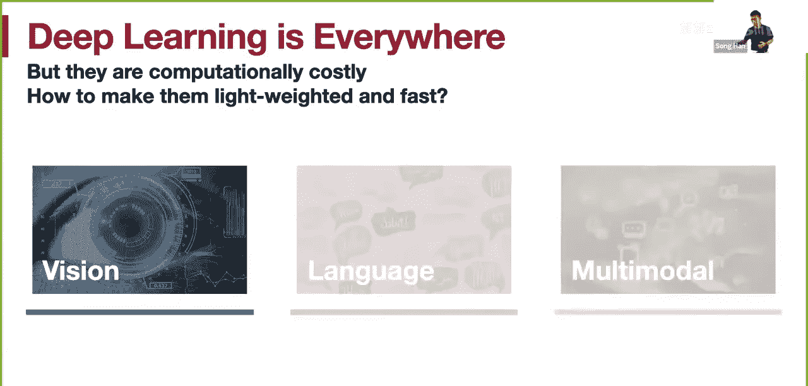

我们将有五个实验，每位助教负责其中一个。每周二和周四我们都有答疑时间，欢迎大家随时来办公室咨询任何问题。

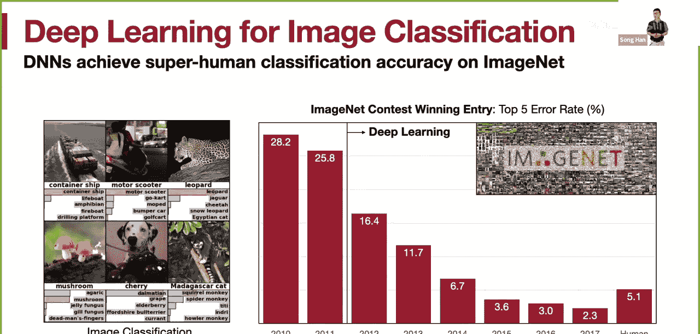

## 为什么需要高效深度学习计算？

现在，让我们从动机开始：为什么需要高效深度学习计算？让我们看看AI计算的供需关系。

下图展示了不同年份大语言模型参数规模（红色）与单GPU显存（绿色）的对比。我们可以看到，大语言模型的规模从2018年最初的Transformer约0.05B参数，增长到2019-2020年GPT-2的约1.5B参数。最近，甚至出现了万亿参数级别的模型，其增长速度远超单GPU可用显存的增长速度。

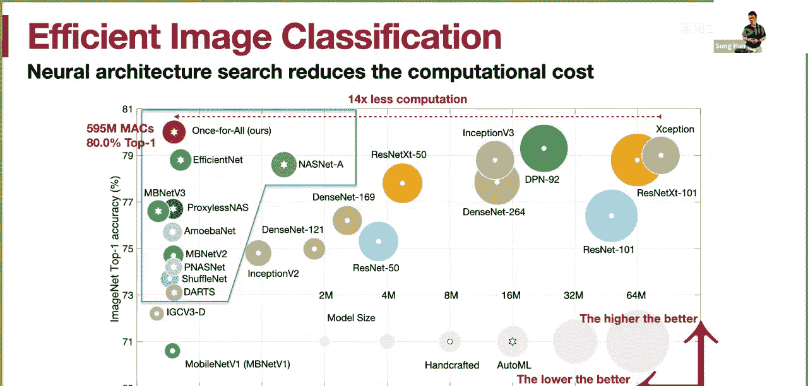

这个巨大的差距实际上在近年来还在扩大。供需曲线的不匹配推高了成本，使得深度学习训练和服务变得极其昂贵。因此，我们将学习使用高效的模型压缩技术来弥合这一差距，提高硬件利用率，并减少模型对内存和计算的需求。

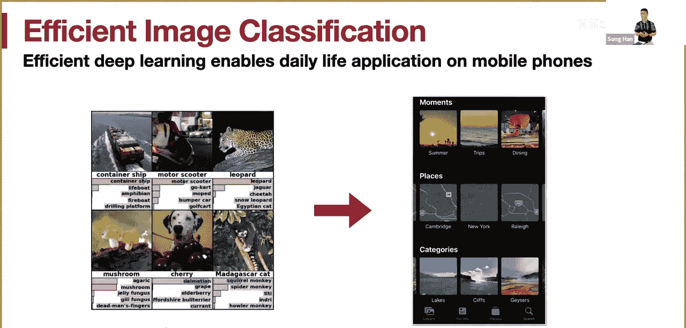

与其直接使用训练好的模型进行推理，我们现在可以在部署前先对模型进行压缩，然后部署压缩后的模型进行推理。

近年来，模型压缩、加速以及稀疏模型领域的出版物数量增长非常快。我们将学习这些技术，了解如何利用压缩和稀疏性来加速神经网络推理。

## 从视觉到语言：计算需求探索

在本讲座中，我们将从三个部分开始，从视觉到语言再到多模态，以理解AI工作负载的计算需求，并看看我们目前处于前沿的哪个位置。让我们从视觉任务开始。

### 计算机视觉的进展与计算成本

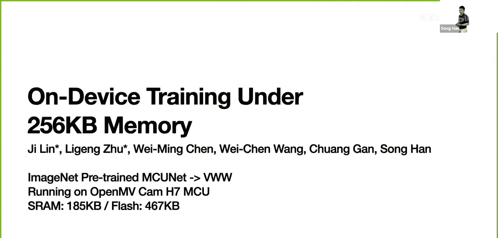

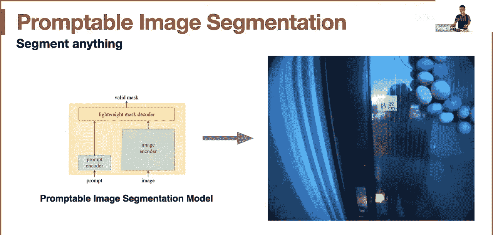

谈到计算机视觉，我们必须提到ImageNet和AlexNet。下图展示了ImageNet错误率随年份下降的情况。仔细观察2012年，那是错误率下降幅度最大的一年，也正是我在斯坦福开始攻读博士学位的时候。AlexNet的出现令人惊叹地超越了许多传统技术。随后的几年里，错误率持续下降，甚至超过了人类水平（最后一栏）。这确实是大数据、强大算力和先进算法共同推动这些工作负载性能提升的结果。

然而，天下没有免费的午餐。在下图中，X轴是计算量（我们将在下一讲详细学习MACs的含义），Y轴是准确率。我们可以看到一个趋势：想要更高的准确率，实际上需要运行推理的计算量就越大。圆圈的大小代表模型大小，这意味着准确率的提升并非没有代价，你需要大量的内存和计算才能实现这样的准确率。

我们在这门课中要学习的就是推动前沿，减少计算量，同时不牺牲甚至提高准确率。通过神经架构搜索等技术，我们可以大幅减少MACs，将其推向图的左下角，同时保持甚至提升准确率。

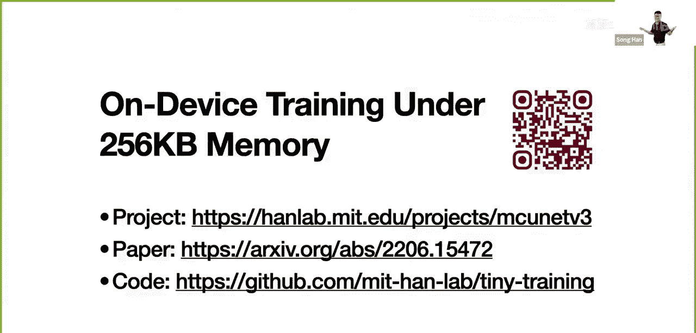

### 边缘设备上的高效AI

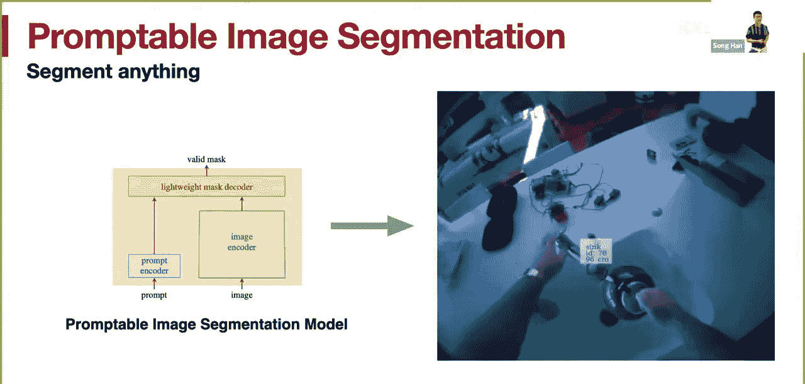

这些惊人的高效AI技术使得我们能够在边缘设备上本地运行深度神经网络。例如，在手机上，我们可以自动标记照片（如夏季旅行、用餐地点、湖泊、悬崖、间歇泉等），也可以在手机上本地进行人物识别。右侧的示例来自我们的实验室，展示了在设备上进行姿态估计，所有计算都在本地进行，无需担心数据被传输到云端。

我们将学习这些技术。不仅是在手机上，我们甚至可以将模型压缩到能够部署在更小的物联网设备上，甚至是只有几美元的微控制器上。这些设备更小、更便宜，但同时也更具挑战性，因为我们必须确保模型足够小以适配微控制器，并且推理库足够高效以运行不同的工作负载，不仅是分类，还包括检测（如人脸和口罩检测、人员检测）。这个产品是在COVID期间完成的，我们展示了使用一个仅有256KB内存的微控制器来检测是否佩戴口罩的演示。

### 设备端训练

不仅是设备端推理，我们还将教授设备端训练。AI系统需要持续适应从传感器收集的新数据。我们希望能在设备上本地处理这些新数据，以实现更好的隐私保护、降低成本、支持定制化以及实现终身学习。

但训练比推理要昂贵得多。为什么呢？我们必须存储中间激活值、计算梯度、进行反向传播等等，因此将训练适配到边缘硬件上更加困难。

在本课程中，我们也将学习那些可以大幅减少内存占用的设备端训练技术。例如，在两年前发表的名为“在256KB内存下进行设备端训练”的项目中，我们通过量化、权重稀疏更新和微型训练引擎等技术，将训练成本从几百兆字节降低到仅141KB，实现了三个数量级的节省。我们将在约两个月后深入探讨这个话题。

利用该技术，我们有一个演示：在OpenMV Cam微控制器上进行256KB内存下的设备端训练。我们为其连接了两个按钮来输入类别：绿色按钮表示“无人”，红色按钮表示“有人”。模型最初没有针对这两个类别进行训练，因此分类结果是错误的。你可以看到屏幕右上角显示红色或绿色。在训练之前，它无法正确识别人物。

然后我们应用设备端训练，按下按钮（绿色表示无人，红色表示有人）手动输入少量标签。反向传播在设备上本地完成。经过几次迭代后，让我们看看分类结果：无人（红色）、无人（绿色），模型现在可以完美分类它们。这里没有Wi-Fi，没有互联网，所有操作都在这个微控制器上本地完成。

### 高效图像分割与生成

接下来，让我们谈谈另一个有趣的内容：图像分割。这是来自Meta的“分割一切”演示，你可以给出提示，然后分割你看到的任何东西，例如这里的人会被分割出来。但这在计算上非常繁重。以前，人们会存储提取出的特征，离线存储，然后只在浏览器上运行头部。

我们将在本课程中介绍的一项技术——高效视觉Transformer（Efficient ViT）——实际上可以减少计算量，将吞吐量提高48倍以上，同时在此图表上显示出更高的准确率。48倍的加速意味着仅使用现有硬件，通过使模型更高效，我们就能使吞吐量从每秒11张图像加速到每秒182张图像，而质量与基线模型完全匹配。这是由Zo Yang在加入MIT之前完成的一个非常了不起的项目。

### 生成式模型与扩散模型

到目前为止，我们介绍了判别式模型。随着算法进步，人们设计了这些不仅能识别图像还能生成新图像的生成式模型。这里有几个例子，比如泰迪熊、一碗汤、一张宇航员在火星上骑马的图片。

扩散模型可以根据文本描述创建逼真的图像。为了加速它，我们首先需要了解扩散模型的工作原理。但这种惊人的特性伴随着非常高的计算成本。例如，训练Stable Diffusion花费了600,000个A100 GPU小时，相当昂贵。

下图由Mu Yang生成，显示生成1K x 1K图像的单个扩散步骤，其计算成本已经非常高，更不用说视频生成（红色条）。一个56亿参数的模型生成一个仅480x720分辨率、49帧（几秒钟）的视频，单个扩散步骤所需的计算量是前者的9倍。运行这些图像或视频生成模型非常昂贵。此外，随着分辨率增长，计算量也呈协作性增长。

这是一个我们想要解决的大问题。我们做了几个项目，将在本课程中介绍，例如“Gang Compression”，可以将计算量减少2.1到9倍。这是压缩前后的对比：将马变成斑马。之前运行速度约为每秒12帧，现在可以运行每秒40帧。我们将介绍实现这一目标的技术。

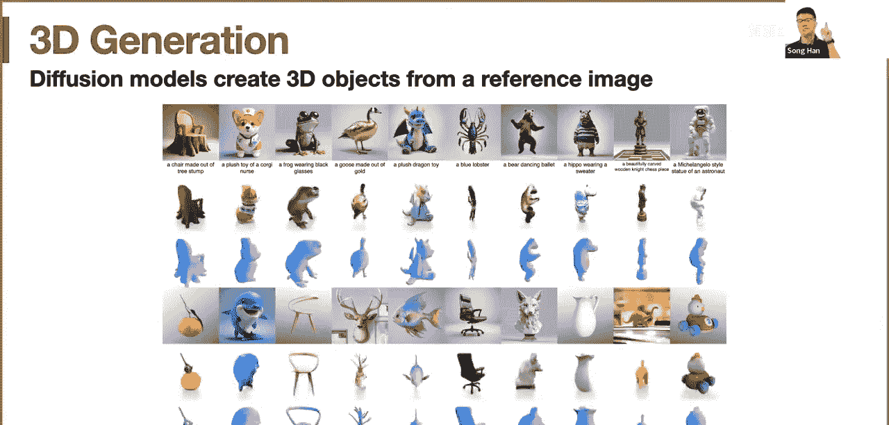

还有使用“Any Cost Again”技术。例如，以前我们想进行照片编辑，比如让女士微笑，这需要相当长的时间，或者让她看起来更年轻。我们可以将滑动条向右移动，首先将图像投影到隐藏空间，这需要一段时间。我们做并将要介绍的是，首先训练一个“Once-for-All”网络，这是一个包含许多不同子网络的超级网络。在编辑阶段，我们可以使用较小的子网络以低成本进行快速原型制作。最后，当我们对结果满意时，只运行一次大的子网络。结果，你可以看到几乎能让她瞬间微笑，或者让她看起来更年轻，我们可以将第二个滑动条向右移动，改变头发颜色也几乎是瞬间完成。通过使用这种“Once-for-All”技术，我们可以快速派生出许多不同的子网络。使用这种技术，我们可以将计算量（黄色条所示）从100%减少到78%、50%、30%，甚至19%，但我们几乎看不出质量差异，尽管我们将MACs减少了多达五倍。

这是我们将在课程后期介绍的另一种技术，用于加速图像生成时的照片编辑。这里我们进行的是图像修复。什么是修复？修复基本上是说，我们有一张图像的一部分（比如矩形中的黑色部分），我们想在那张有马和草地的照片中添加一匹马。最初，Stable Diffusion需要约1.855 ExaFLOPS，耗时369毫秒。经过压缩加速后，我们可以将其降低到约514 GigaFLOPS，耗时95毫秒。同样，在右侧，为图像添加一棵椰子树，我们可以将其加速4.8倍。以前的方法需要生成所有像素，即使你只编辑其中一部分。但使用我们的稀疏更新方法，我们只更新需要生成的像素，其余像素保持不变。

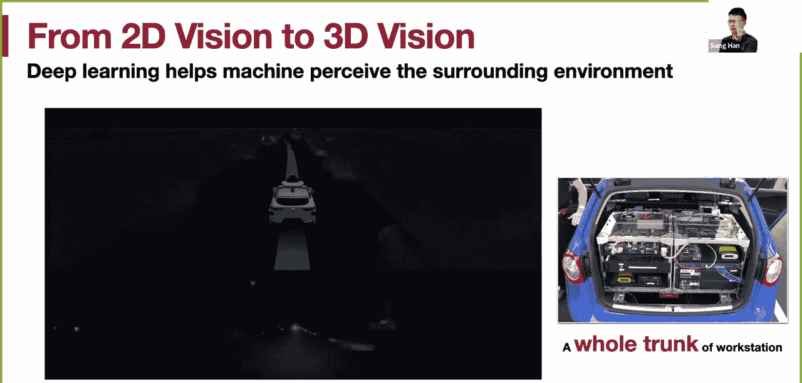

我们还将介绍如何通过并行处理加速图像生成。使用四个GPU，我们能否生成更大的图像甚至更快？最初使用一个GPU需要大约12秒。一个自然的想法是，如果我们有四个GPU，能否快四倍，比如3秒？不幸的是，简单地这样做会产生伪影和重复。使用四个GPU实际上生成了四张不同的图像。原因是这四个GPU彼此之间没有通信，结果各自生成了独立的图像。但通信会导致网络延迟。我们处理这个问题的方法是将计算与网络通信重叠，这样我们可以使用一个步骤来将陈旧的输入通信到下一个步骤。我们将在本课程后面详细学习这一点，这里只是作为动机介绍。结果，我们可以在右侧生成图像，速度快了三倍，但质量保持得很好。

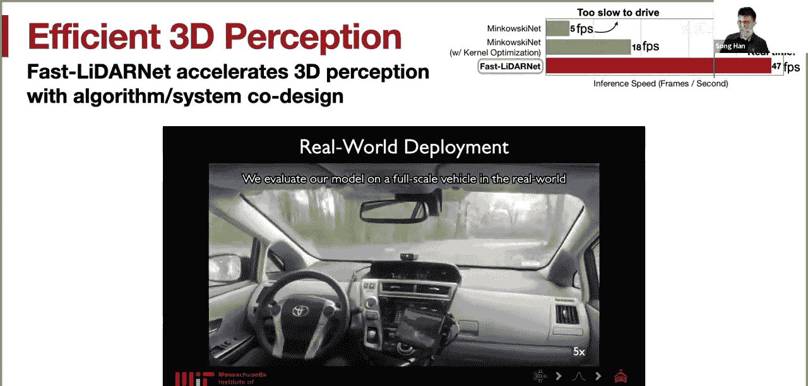

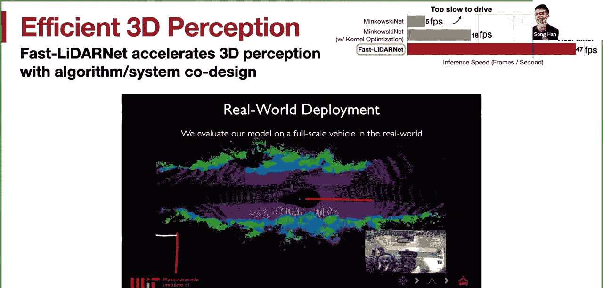

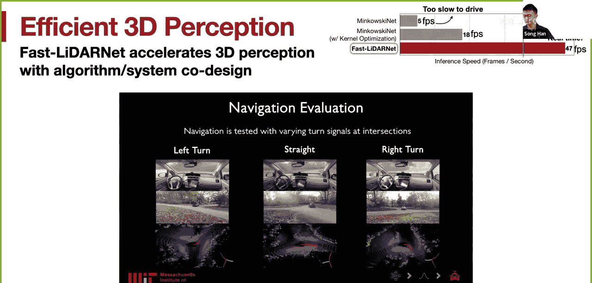

### 图像定制与3D生成

人们还对图像定制感兴趣，即根据用户指定的输入创建个性化图像。例如，我们想生成类似“韩松骑马”的东西，但它看起来不像我在骑马，非常通用。因此，我们将介绍像“Fast Composer”这样的技术，这是一种来自Guang Xan的训练免费方法，可以将不同的人物融合在一起。例如，这里我们可以让Jane和Lady Gaga一起唱歌。

高效的图像生成有很多应用。这只是一个例子，说明为什么我们需要学习这些技术。例如，在iPad上，我们可以画一幅画，然后过几秒钟看到它渲染出来，我们希望它能更快，立即渲染出非常好看的图像，并且希望这种方法可以在边缘设备上本地运行。

不仅是图像生成，3D生成也是一个非常热门的话题，需要大量计算。这是扩散模型从参考图像创建3D对象的示例。第一行是参考图像，后面几行是基于单张图像生成的3D对象。也可以使用文本提示，以自然语言作为输入来创建3D对象。

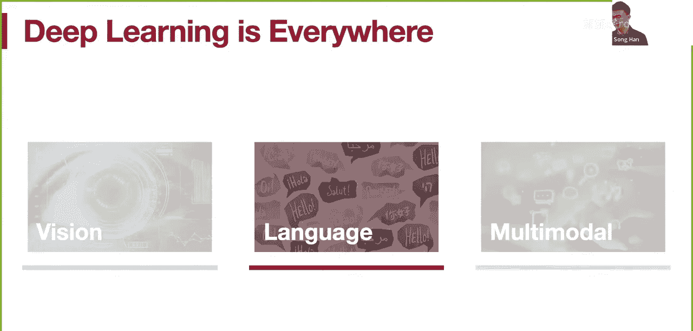

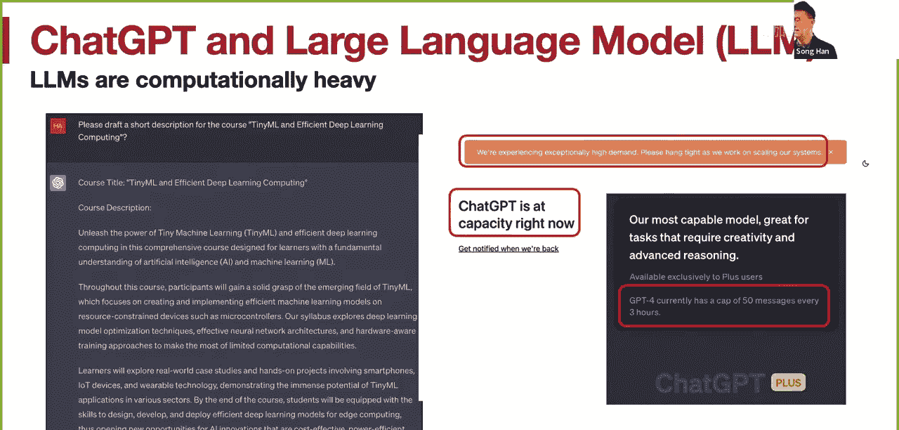

视频生成增加了另一个自由度，任务更加庞大和困难，需要更轻量的模型规模。这是去年的技术，而今年有了Sora，非常令人兴奋。只需给出一个文本提示，例如“一位时尚女性走在东京街头”，就能从自然语言描述生成高分辨率、照片般逼真的视频。但同样，这消耗了巨大的计算量。我们将学习降低这种计算量的技术。

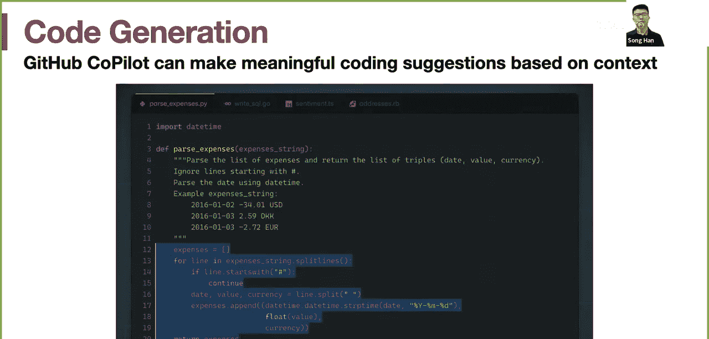

### 3D视觉与自动驾驶

到目前为止，我们谈了很多关于2D视觉的内容，但实际上，3D视觉也非常令人兴奋，比如自动驾驶。自动驾驶汽车不仅有摄像头传感器，还有激光雷达等传感器来收集点云数据，以理解这个3D世界。不幸的是，这需要大量计算。下图显示的是工作站整个机箱放在汽车座椅后面，你肯定不希望它加热整个车厢，让人不舒服。因此，我们希望让自动驾驶更高效，将所有东西适配到更小的GPU中。

这就是我们所做的“Fast Light”项目，通过算法与系统协同设计来加速3D感知。之前它只能运行每秒5帧，经过优化后（我们将在本课程中学习关于3D点云加速的内容），它可以运行每秒47帧。

这是我们将要介绍的另一个项目，来自我们组的Zhu Xan，他即将成为UCST的助理教授。这个项目叫做“BEV Fusion”，它不仅结合一个传感器，还非常高效地结合了多个传感器。这里我们展示了六个摄像头（前、后、左前、右前等）和一个位于顶部的激光雷达传感器。我们希望结合这些特征，融合多个传感器进行分割和检测（检测意味着找到汽车、行人等的3D边界框）。右侧显示的是BEV地图分割，BEV代表鸟瞰图。这是完全无地图的，在新城市中，你可以运行此类算法来找到车道、可行驶区域、人行道等。右上角显示该算法可在用于自动驾驶任务的移动GPU Orin上运行。

以上就是关于计算机视觉惊人进展及其对计算影响的第一部分内容。尽管这些应用令人惊叹，但它们以高昂的计算资源成本为代价。

## 自然语言处理的进展

现在让我们切换到第二部分，谈谈自然语言处理的进展。

这是ChatGPT出现后的第二年，它的计算量非常大。实际上，当ChatGPT刚问世时，通常容量有限，每三小时限制用户发送50条消息等等。我们正在经历异常高的需求，请稍等，我们正在扩展系统。这些都是瓶颈。

但它们确实在帮助我们。例如，GitHub Copilot可以根据上下文给出非常有意义的编码建议。我们只需给出一些提示或注释，它就会非常快速地自动生成代码。还有神经机器翻译，利用LLM技术来弥合语言障碍。

我们将介绍降低模型大小同时保持BLEU分数（衡量质量的指标）的技术。这里，我们将模型大小从1176 MB减少到仅9 MB。如果只有9 MB，就很容易适配到你的手机上。

最近，随着大语言模型的发布，新的能力开始出现，例如零样本学习和少样本学习。什么是零样本学习？模型可以仅根据任务描述预测答案，没有梯度，没有训练。给定一个新任务，你只需告诉它任务是什么，它就会给出答案。例如，从英语翻译成法语，我们不需要训练单独的英语到法语或英语到中文模型，只需使用不同的提示来描述任务。零样本意味着没有示例，直接翻译“奶酪”成法语。大语言模型还具有少样本学习能力。我们只需看几个例子，在提示工程中给出任务的几个示例，例如翻译英语到法语，然后给出三个例子，最后给出翻译“奶酪”的结果。同样，没有梯度，没有微调，我只是巧妙地设计提示，模型就能够进行这种零样本或少样本学习。

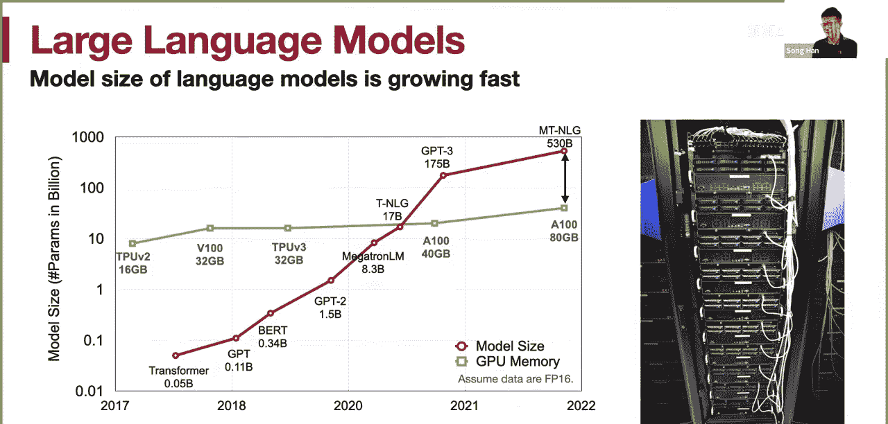

这似乎是令人兴奋的能力，然而，正如我们所料，这带来了非常高的成本。下图显示了少样本、单样本或零样本学习的准确率。为了达到更高的准确率，模型规模必须快速增长，从130亿参数到1750亿参数。准确率每提高一小个百分点，都需要更大的模型规模和更多的GPU资源来服务这些模型。曲线非常平坦，意味着每一点准确率的提升都伴随着非常高的成本。

大语言模型还有另一个非常有趣的新兴能力，叫做思维链。让我们看看什么是思维链。标准提示是：“Roger有5个网球，他又买了两罐网球，每罐有3个网球，他一共有多少个？”答案是11，因为5 + 2*3 = 11。然后如果你问另一个问题，给出相同的提示：“食堂有23个苹果，如果他们用了20个做午餐，又买了6个，现在有多少个苹果？”正确答案应该是9，但当时ChatGPT给出的答案是27，这显然是错误的。

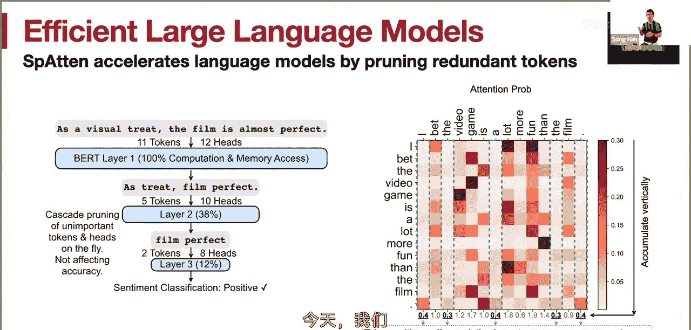

如果我们换一种方式提示呢？对于第一个问题，答案用蓝色显示：“Roger一开始有5个球，两罐网球，每罐3个，总共6个网球，5加6等于11。”它描述了整个思考过程，答案11是如何得出的。我以这种方式提示，不仅展示结果，还展示思维链的思考过程。对于苹果问题，模型可以输出一个新的答案：“食堂最初有23个苹果，他们用了20个做午餐，所以剩下23-20=3个。然后他们又买了6个苹果，所以现在有3+6=9个。答案是9。”现在它能正确理解了。

因此，我们将介绍一些这样的提示工程技术，这将非常实用，你可以更有效地与这些大语言模型互动。同样，这样的准确率是以非常高的计算成本为代价的。下图是GSM8K中学数学文字问题的准确率。X轴是模型大小。为了达到高准确率，模型必须非常大，比如1750亿参数甚至5000亿，甚至万亿参数。这导致了我们最初展示的图表：模型增长速度远快于硬件。右侧是我们实验室地下室用于训练这些模型的服务器。我们大约在两年前购买了它，当时我们有200 Gbps的InfiniBand带宽，但就在我们购买的那一刻，它就过时了。去年我想做讲座时，状态是400 Gbps，现在是800 Gbps。这个领域发展如此之快，因此学习这些技术以跟上浪潮是非常及时的。

### 利用语言冗余

我们还设计了一些技术来减少计算量，通过发现自然语言中的冗余。实际上，在自然语言中，有很多冗余。例如，给定句子“作为视觉盛宴，这部电影近乎完美”（左侧示例），我们可以将其修剪为“盛宴 电影 完美”，甚至修剪为“电影 完美”，仍然可以将其分类为积极情感。这表明人类语言有很多冗余，我们可以利用这种冗余进行稀疏注意力计算。这是我们大约三、四年前做的一个项目，叫做稀疏注意力。我们实际上可以移除那些不与其他词元高度关联的冗余词元。例如在这个例子中，“I bet the video game is a lot more fun than the film”，“video”与“game”高度关联，但“I”和“a”与任何词的关联都不强，因此我们可以安全地移除这些词元。

这些是我们将在本课程后面部分深入探讨的一些技术。今天，我们只是概述一下，让你对我们将要学习的内容有个初步了解。

### 在边缘部署大语言模型

这些大语言模型非常令人兴奋，我们如何将它们部署到边缘呢？在边缘部署大语言模型将非常有用。我们可以在笔记本电脑、汽车、机器人上本地运行代码补全服务、办公聊天、游戏聊天等，而无需担心延迟、网络Wi-Fi或将我们的私人数据发送到云端。

因此，在边缘本地部署大语言模型需求巨大。在这门课中，我们将有两讲和两个实验专门介绍如何通过使用大语言模型量化技术，在边缘本地部署大语言模型，以便你可以在笔记本电脑上运行70亿甚至130亿参数的模型。

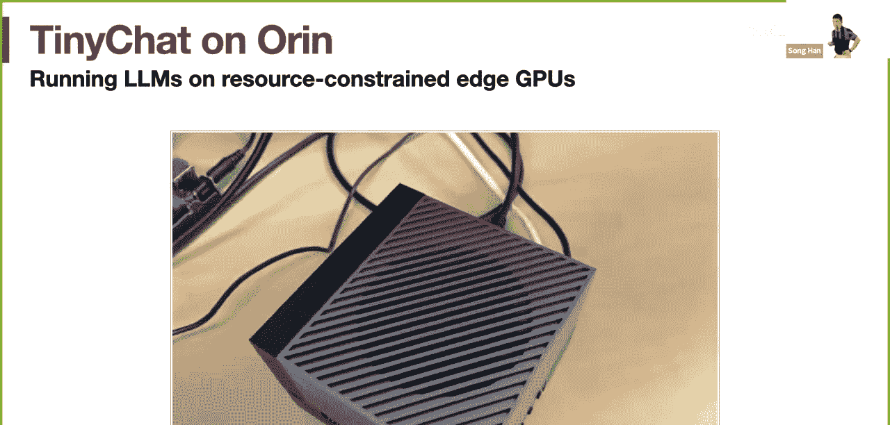

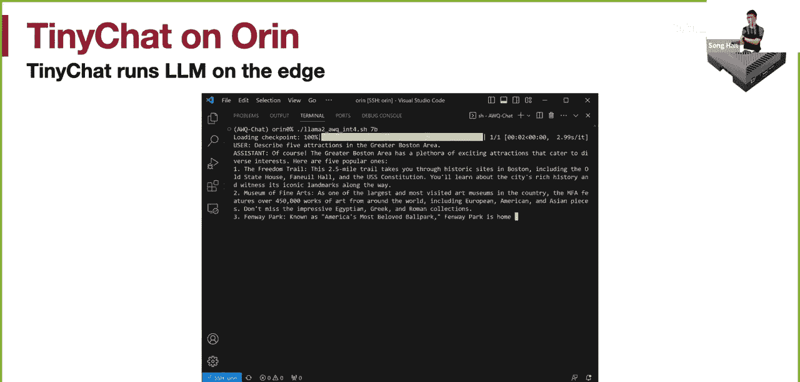

这是一个演示，展示在一台相当过时的MacBook（仅配备M1芯片，甚至不是M3芯片）上，仍然可以相当快地运行代码补全。给定提示“排序和评级”，我们将介绍将这些大语言模型从16位量化到仅4位的技术，逐步从16位到8位（使用SmoothQuant），甚至到4位（使用AWQ，即激活感知的仅权重量化）。实际上，SmoothQuant论文来自两年前的这门课程的一个课程项目，由Guangxuan完成。也许在今年，你们中的一些人可能会提出更令人兴奋的项目，甚至可能在未来发表论文。关键思想是，我们在激活值中发现了许多异常值（非常大的值，如右上角所示），我们想使其平滑。由于矩阵乘法是线性的，我们可以缩放权重和梯度，使它们均衡和平滑，从而更容易量化并充分利用动态范围。

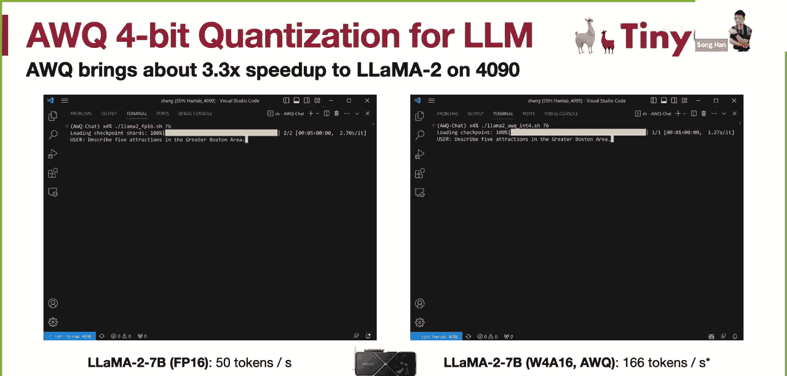

我们将在实验四中实现这种算法。此外，我们将在实验五中介绍高效的推理库，以便你可以自己实现量化算法和推理库。这实际上需要对计算机系统的工作原理有深刻的理解。你必须能够编写C程序，而不仅仅是Python，要能非常熟练地操作指针、单指令多数据、熟悉缓存（缓存如何工作、什么是局部性、什么是多线程）。我们将使用多核处理器、SIMD技术以及寄存器级并行来实现这些技术。这就是为什么我们强制执行这些先修课程要求，以便你能完成这些实验。

这里有一个名为“TinyChat”的演示，它是Ho Tian Shaang开发的一个推理库。我们可以在Jetson Orin Nano（一个非常小的移动GPU）上部署一个70亿参数的大语言模型。我们3D打印了这个TinyChat计算机，用于实时交互输入。这表明我们实际上可以在资源受限的边缘GPU上运行大语言模型。这是一个Jetson Orin，我们可以使用TinyChat在上面非常流畅地运行大语言模型，甚至包括130亿参数的模型。

下图比较了量化与未量化的情况。如果使用激活感知量化（AWQ），速度会快得多。左侧显示未量化运行大语言模型速度较慢，右侧显示使用4位量化后，速度从每秒450个词元提升到每秒166个词元。

在边缘设备上运行大语言模型可以有很多应用。例如，AI智能可以总结你的部分电子邮件，为你的电子邮件提供智能回复，以及写作工具帮助你修正情感使其更专业等。

## 多模态AI的挑战与机遇

到目前为止，我们讨论了视觉和语言。现在让我们跳转到多模态。什么是多模态？我们将图像、语言、音频、动作等不同模态结合起来，将它们投影到同一空间，并理解和处理所有这些不同模态的输入，输出不同的模态。我们能否输入图像、语言、音频、视频、动作，然后输出可能不仅是文本，还有图像、视频甚至动作？这就是多模态问题。

这里的挑战在于如何对齐来自不同输入模态的表征（嵌入）。一个例子是这个名为LLaVA的模型，它可以理解图像，并接收带有输入图像的语言提示，输出语言描述。例如，“你知道这幅画是谁画的吗？”LLaVA会说出关于蒙娜丽莎的细节。

下图显示，通过量化技术，我们也可以将它们量化到仅4位而不损失准确率。例如，这是一个输入图像和一些文本描述。使用简单的四舍五入量化，它会说一些奇怪的话，比如“有地球和其他行星的小图片放在食物上面”。但使用AWQ量化，它会说“图像是对从太空看地球图片概念的一种轻松幽默的理解”。因此，通过适当的量化技术，我们不仅可以加速大语言模型，还可以加速视觉语言模型。

后来，我们设计了这个VLA视觉语言模型。我们还将介绍如何训练视觉语言模型并进行推理。关键思想是生成视觉词元。现在，不仅语言可以被词元化，图像也可以被词元化。我们如何词元化图像？通过使用视觉Transformer。我们将有一整讲专门介绍什么是视觉Transformer，以及如何设计高效的视觉Transformer。通过视觉Transformer，我们可以将输入图像投影成多个词元，并将图像词元与文本词元结合起来。基本上，我们可以将这个想法扩展到其他模态。人们意识到一切都可以被词元化，一切都是词元输入、词元输出。

我们将在本课程中学习那些训练方法，例如数据和训练方法实际上比架构本身更重要，为什么视觉指令微调不够，为什么我们需要视觉语言预训练，为什么图像分词器不够，我们需要图像间和文本间的结合，以及我们如何绑定它们，如何设置每种模态的比例。我们还将讨论视觉上下文学习，这是一种非常令人兴奋的能力，以及我们如何从图像扩展到视频，这需要更长的上下文长度，因为每一帧大约需要200个词元。如果你想理解像电影这样长达一小时的视频，就需要非常长的上下文。因此，在本课程中，我们将介绍长上下文技术，如何处理线性增长的内存，而不是简单地使用线性增长的KV缓存。

以下是一些现代视觉语言模型（如Vila）可以实现的能力。给定这个视频，“请告诉我视频中发生了什么”，Vila会说：“视频显示了一场足球比赛，一名球员进球并引发欢呼，球员与队友一起庆祝。”我们有一个Vila的演示链接，欢迎大家免费试用。根据视频，“接下来可能会发生什么？”Vila说：“视频显示了一个装有草莓的搅拌机，很可能搅拌机会被打开，将草莓搅拌成冰沙。”它具有世界知识，知道给定这样几帧，接下来会发生什么。这也被称为世界模型。世界模型具有世界知识，理解世界如何运作，给定一些帧来预测接下来会发生什么。同样在这种情况下，“接下来可能会发生什么？”Vila说：“视频中的下一步很可能涉及该人在研钵中研磨香料。”

一个非常有趣的能力是视觉上下文学习。什么是上下文学习？我们没有明确说明任务是什么，只是展示一些例子。这里的提示是：“图像：波士顿，图像：多伦多，图像：？”然后它会说“旧金山”。我们没有明确告诉它“请告诉我这张图片是哪个城市”，但我们只是展示了一些例子，然后模型就会理解：“任务是告诉用户这是哪个城市。”这是通过使用交错图像-文本训练实现的。因此，数据和训练方法在大语言模型领域非常重要，我们将在本讲中介绍视觉语言模型。

下一个是关于世界知识的。有人能猜出这是哪里吗？给定这张图片。非常棒，是圣彼得堡！这需要世界知识，你需要见过很多地方才能理解。但事实上，视觉语言模型也能说出特定图像的位置。实际上，今年早些时候我在欧洲旅行时，我拍了一张随机照片，令我惊讶的是，它能告诉我这实际上是一个特定的地方，描述得非常准确。所以我对它所拥有的世界知识感到非常惊讶。欢迎大家试用，甚至可以在你的作业中实现它。

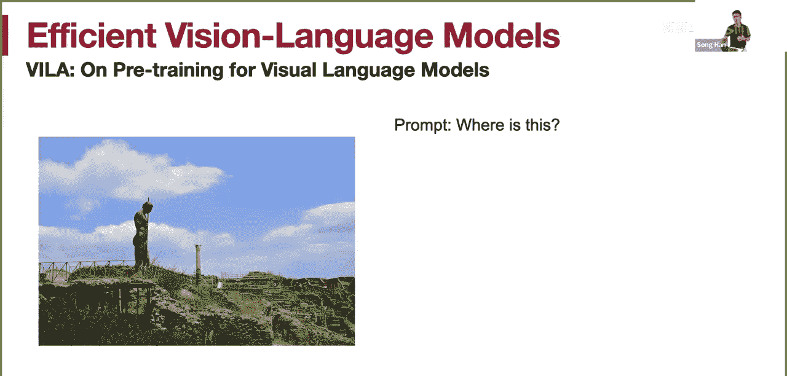

我们还将学习这项技术：能否将这些大语言模型、视觉语言模型带到我们的笔记本电脑上？这样我们就可以使用它、与它互动、完全控制它，将所有世界知识压缩到笔记本电脑中。以下是我们能做的事情，例如详细描述一幅画，它正在笔记本电脑上本地运行。

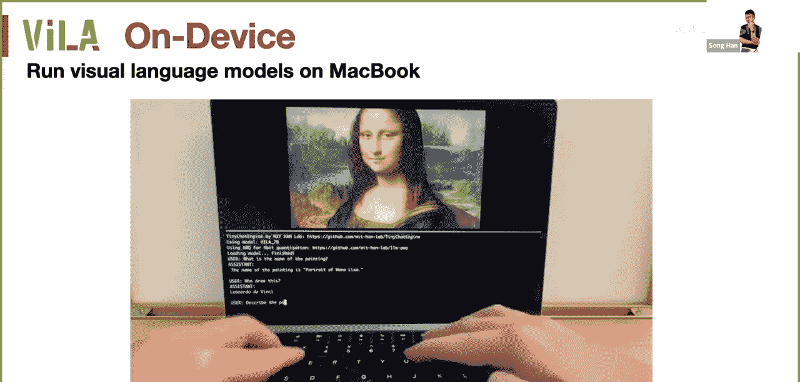

在我们的实验五中，我们实现了一个语言模型推理库。我们也可以将视觉语言模型作为额外的加分项来实现。如果你想在实验五中做视觉语言模型，请随时与我讨论。

### 动作模态与机器人

另一个模态是动作。我们也可以使用视觉语言模型来输出其他模态，比如动作。这里的指令是：“从抽屉里给我拿米饼。”当前步骤是打开抽屉。它帮助使用包含大量世界知识的大语言模型进行规划。它理解为了拿米饼，你首先需要打开抽屉，然后从抽屉里拿出米饼，然后放好，再关上抽屉等等。

但不幸的是，这个视频加速了4倍，实际只有3赫兹。这是由于高计算成本和网络延迟，因为图像通过互联网传输到工作站，然后再将最终结果传输回来。这是来自Google的RT-1，也已经非常了不起了，但它凸显了学习这些高效部署计算技术（如本课程所教）的重要性。

同样，对于游戏，Algo击败李世石使用了1920个CPU和280个GPU，每场比赛电费3000美元，超级昂贵。或者AlphaFold需要16个TPU v3，即128个TPU v3核心，训练数周。所有这些惊人的能力都伴随着高昂的成本。

## 算法、硬件与数据三大支柱

现在，让我们从视觉语言和多模态转换话题，来谈谈这三个支柱：算法、硬件和数据。特别是，我们要强调硬件进步是推动高效深度学习计算发展的驱动力。

在本课程中，我们将介绍一些硬件和系统技术。我们的理念是进行全栈设计：在软件部分，从算法部分（计算需求）到系统部分（计算供给）进行全栈设计，我们希望通过减少需求和增加供给来缩小差距。

现代硬件设计的近期趋势是微处理器频率趋于稳定，单核性能也趋于平稳，更多的缩放放缓，但核心数量在增加，晶体管数量也在增加。因此，并行计算和专用计算是这种背景下的新趋势。

精度也很重要，社区不断推进低精度算术的发展，从浮点32位、浮点16位到整数8位、8位整数到FP8（8位浮点），甚至到FP4（4位浮点），这即将出现在最新的Blackwell架构GPU中。因此，精度在不断降低。在本课程中，我们将学习所有关于浮点数、FP8、E5M2（指数5位、尾数2位）、尾数等细节，以及为什么Blackwell如此惊人，它能在量化部分拥有如此高的峰值性能。

右侧显示了单芯片推理性能在八年内提高了300倍。这来自我的博士导师Bill Dally教授的幻灯片，显示从标量32位到FP16，再到V100中的HMMA张量核心，INT8 TOPS增加到125，然后通过使用INT8 IMMA张量核心再次翻倍，再到使用A100中的结构化稀疏2:4稀疏性，性能提升了300倍。八年内这样的改进非常惊人。

沿着这条创新路线，软件实际上扮演着非常关键的角色，尤其是在先进技术节点上。下图显示从65纳米、28纳米、7纳米到5纳米。你可以看到紫色部分，即软件组件，在总先进设计成本中占据了很大一部分。

这也为能够吸引大量优秀客户的优秀软件创造了条件。可编程性必须易于使用，尤其是对于大语言模型和生成式AI，模型变化非常快，每天都在变化。如何使其灵活变得超级重要。因此，在本课程中，我们非常关注高效深度学习计算的软件部分。我们不会在本课程中设计新硬件，但会学习如何充分利用现有硬件，以及对设计新硬件有何启示。

下图展示了从2016年到2024年GPU的进展。我们将它们放入四个不同的基准测试中。FP16性能以每秒万亿次操作（TOPS）衡量。我们将在下一讲学习什么是TOPS每秒，它意味着什么，什么是密集计算，什么是稀疏计算，什么是张量核心。因此，我们将从下周四开始，在剪枝讲座中学习密集和稀疏，一周后学习量化和精度。

从P100到B100，实际上TOPS每秒提高了100倍。特别是从H100到B100，TOPS每秒甚至翻了一番，这非常惊人，甚至还没有考虑FP4。如果我们加上FP4，在这个图表中会高得多，因为它只显示了FP16。

这里是内存带宽。计算便宜，内存超级昂贵。从A100到H100，内存带宽几乎翻了一番，然后从H100到B100又翻了一番多。我们将介绍这些概念，比如为什么数据移动昂贵，为什么能量消耗主要由移动数据主导。

这里显示的是功耗。不幸的是，功耗也增长得很快。从A10的400瓦到H100的700瓦，以及B100。如果一个节点中有8个GPU，你可以计算需要多少功耗。所以8个节点，所有GPU将消耗约4000-5000瓦，整个节点总共将消耗10,000瓦。你必须为一个节点准备10,000瓦的电力。因此，空间将不再是限制，电力供应和能源成为了新的瓶颈。以前，当我们使用A6000 GPU时，我们可以用两根电缆为整个机架供电，但现在两根电缆只能为四台A100节点或两台H100节点供电。因此，能效超级重要。

在本课程后期，我们将组织一次实验室参观，带大家到地下室的服务器那里，这样你们可以看到这些模型是如何训练的，什么是一个迷你数据中心，它是什么样子，什么是冷通道、热通道、机架、交换机、InfiniBand、电缆以及现代GPU是什么样子。

接下来是内存。不幸的是，与计算相比，内存的增长速度较慢。目前我们实验室拥有的是80GB的A100 GPU。H100基本保持不变。而B100则有一个令人兴奋的飞跃，达到几乎192GB。这是用于云上训练和服务的。

### 边缘设备硬件

让我们也看看边缘设备。例如，在手机上，我们希望拥有那些低功耗芯片。这里只有10瓦，从骁龙855一直到骁龙8 Gen 1和8 Gen 2也存在，但我们没有找到公开数据，所以没有放在这里。性能也增长得很快，比如大约50 TOPS每秒，内存大约是8GB或16GB，以及Qualcomm DSP。

苹果也提供了苹果神经引擎，用于机器学习应用的高能效和高吞吐量。同样，Qualcomm DSP是35 TOPS每秒。然而，我们不应该只看峰值性能（比如35或52）就得出结论说苹果或高通哪个更快。实际上不能，因为这是多维度的问题。峰值性能并不直接转化为实测速度，有很多因素，我们将在本课程中学习，比如激活数据移动、权重数据移动、内存带宽利用率等都很重要。

还有移动GPU，在汽车中广泛使用，例如Jetson Orin，用于许多电动汽车，提供几百TOPS每秒的性能，消耗约60瓦，64GB内存。并且将有新的Blackwell架构问世，这是下一代Jetson Orin。还有用于许多物联网设备（如智能家居摄像头）的微控制器，可能配备这些小型ARM设备，只有几百毫瓦功耗，但内存也非常小，只有几百KB的SRAM，也许有几MB的DRAM，甚至没有DRAM。有些微控制器完全没有DRAM，你必须非常小心地管理内存。

因此，从云AI到移动AI再到微型AI，模型内存从几十GB到几百KB，实际上存在巨大差距。每个AI设备与云处理器之间仍有巨大差距。我们在这门课中学到的内容将尝试通过使用更小的模型来缩小这一差距。

## 课程总结与物流安排

以上就是三大支柱：硬件、数据和算法。我们的目标不是使用大量计算、排放大量碳、雇佣许多工程师、训练大量数据（100万小时），而是如何用更少的计算、更少的碳、更少的工程师、自动化训练和更少的数据来实现目标。

这是课程概述，让我用剩下的10分钟来介绍一些后勤安排。

讲座时间是每周二和周四下午3:35到4:55，在这个教室进行，我们会录制课程。答疑时间在每个周四本讲座结束后，下午5点到6点，房间号是38-344，那是我们办公室的位置。欢迎大家随时在答疑时间提问，或者去Piazza提问，请确保在Piazza上注册。

我们也会像其他课程一样使用TAs来提交作业。如果有任何外部咨询，可以发邮件到 efficient-ml-staff@mit.edu。我们还将创建一个邮件列表，请大家务必关注这个邮件列表，以便我们可以广播一些新闻、项目想法，甚至有些公司想提供实习或全职工作机会，我们也可以通过该邮件列表传播。请保持关注，Reggene将发送关于邮件列表注册的通知。

关于先修课程，今年我们强制执行两个先修条件：一是6.191（计算结构），因为实验五和实验四需要对计算机系统工作原理有深刻理解，比如什么是缓存、局部性、并行性、五级流水线、页表，因为我们将讨论页面注意力推测、推测解码，最重要的是，你必须熟悉并能够舒适地编写C程序，因为实验将用C语言编写，并且要了解现代线程技术。第二个先修条件是6.390（机器学习导论）。请确保你熟悉如何使用PyTorch，因为所有实验都将使用PyTorch。

我们将大致涵盖三个部分：第一部分是关于高效推理技术，包括剪枝（减少参数数量）、量化（降低每个参数的精度）以及神经架构搜索（如何设计高效的神经架构）。还有知识蒸馏（如何使用教师模型来提炼一个更小的模型）。我们还将讨论高效训练技术，包括梯度压缩、设备端训练、微调学习以及并行化（包括数据并行、模型并行、流水线并行以及大语言模型的序列并行）。我们还将介绍特定应用的优化，最重要的当然是Transformer和大语言模型。我们将介绍整个架构，Transformer如何工作，从位置编码一直到什么是QKV、注意力、不同的上下文扩展技术、RoPE等。我们还将介绍扩散模型（扩散模型如何工作）、视频理解、点云理解等。

一个关键概念是系统与算法协同设计，这实际上结合了我们从EE侧、CS侧以及AI侧学到的许多知识。希望这门课能成为你在本科高年级或博士前几年进行跨学科研究时可以选修的课程。EE侧的6.191或微计算机项目实验室、硬件架构或深度学习，CS侧的计算机架构、软件性能工程、移动传感器计算，AI侧的机器学习导论、深度学习、计算机视觉进展、自然语言处理，都是相关的课程。

在本学期中，我们将有五个实验。前四个实验我们将使用Google Colab，所以你不用担心硬件问题。第一个实验关于剪枝，第二个关于量化，第三个关于神经架构搜索，第四个关于大语言模型压缩。第五个实验确实需要硬件，需要一台笔记本电脑，希望你们都有一台内存大于8GB的笔记本电脑，确保可用存储空间至少为5GB。不幸的是，我们没有预算为每个人提供笔记本电脑，但我假设每个人都已有一台笔记本电脑，无论是x86还是ARM，无论是Mac、Linux还是Windows。我们已经仔细调试过，使其能够适配不同平台。Jha将是实验五的助教，如果你有任何与实验五和硬件相关的问题。

阅读材料方面，我们将有五个实验，每个占15%，随后是一个期末项目，占25%。期末项目是开放式的，但我们会给你一些项目想法来开始。项目由3到4名学生组成的小组完成，包括提案、演示、海报展示和最终报告，总共占28%。

我们还为参与度提供了4%的奖励分。所有作业都在截止日期晚上11:59之前提交。迟交政策是：整个学期总共有6个无惩罚的迟交日。鉴于注册人数众多，我们对这6个迟交日没有任何例外。迟交天数按天计算，每迟交一天，惩罚分别为20%或50%，所以作业在迟交两天后为零分。

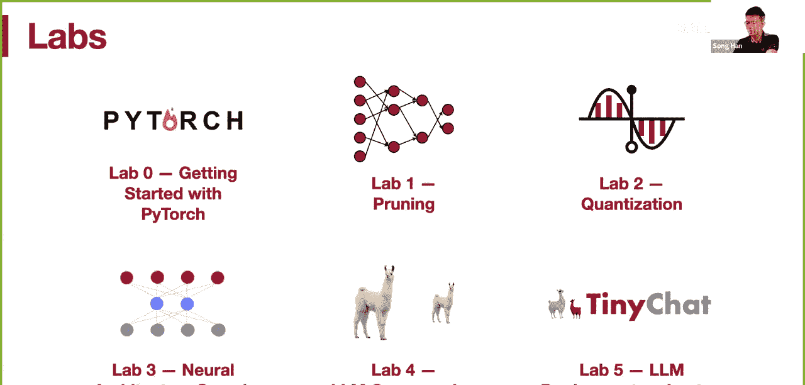

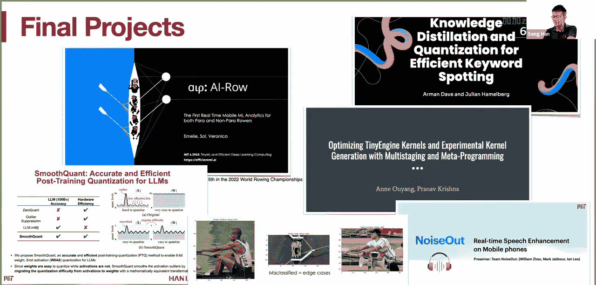

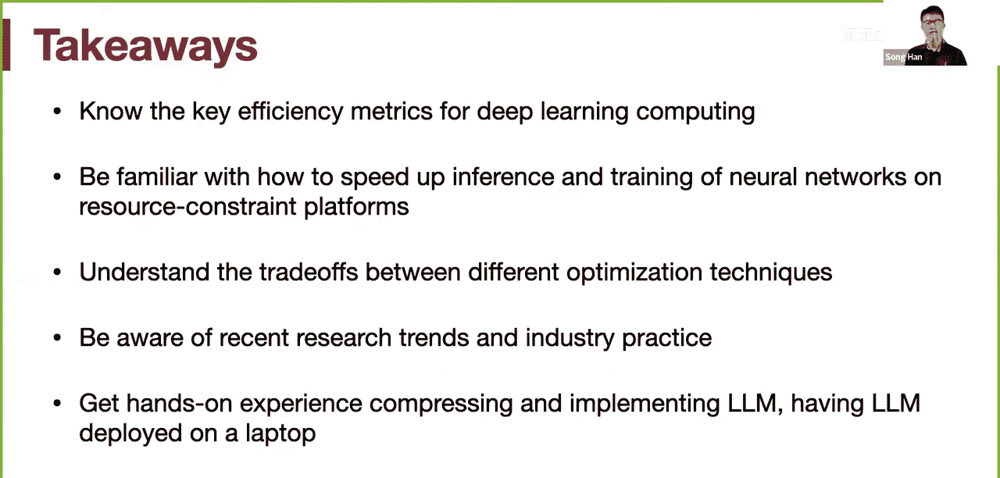

先修课程非常重要，因此不符合先修条件的学生将在课程第二周被注销注册。如果你认为你具有同等先验经验（包括计算机架构和机器学习），请务必通过此表格提交申请。请在本周五晚上11:49之前提交你的申请表格，然后我们的助教将审核这些申请。不符合先修条件