# 022：量子计算基础

## 概述

在本节课中，我们将要学习量子计算的基础知识，包括量子比特、量子门、量子电路以及当前量子计算设备的发展现状。我们将从基本概念出发，逐步构建对量子计算的理解，并探讨其在机器学习领域的潜在应用。

---

## 量子计算：1：引言与背景

感谢韩教授的亲切介绍。感谢大家的到来。

我的名字是Henry W。我是H C S的准教授，今年刚从麻省理工学院毕业。

我将要讨论的是机器学习和量子计算这两个热门领域的交叉点。

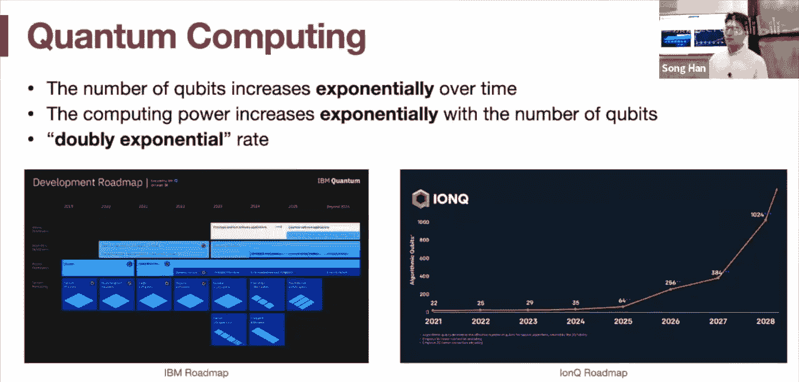

你们一定听说了很多关于量子计算的最新进展。实际上就在昨天，谷歌团队发布了AlphaQubit。他们试图使用一些先进的AI模型，特别是Transformer模型，来解码量子纠错码。

此外，几年前，谷歌量子团队也展示了量子优越性，这意味着量子计算机在某些任务上的性能可以超越最好的经典计算机。IBM也是该领域的重要参与者，他们展示了量子实用性，这意味着可以在量子设备上执行一些在经典计算机上非常困难的计算。虽然这些计算可能不产生实际价值，但至少对于这些计算来说，在经典计算机上执行非常困难。我们正在努力为它们寻找一些有用的应用。

在今天的讲座中，我将简要介绍量子计算的基础知识，包括什么是量子比特、如何执行不同的门操作、如何操作这些量子比特，以及如何对它们应用不同的计算。我们还将介绍量子电路，它是量子程序的基本构建模块，意味着你可以拥有一组量子比特和一些量子门来操纵量子比特的状态。此外，我们将介绍当前的时代，即嘈杂中型量子时代，或称NISQ时代，这意味着我们仍处于早期阶段，存在大量噪声，且可用的量子比特数量不多。最后，我们还将介绍一些示例工作流程，将基本的量子机器学习电路编译到可用的量子设备上，特别是超导和中性原子量子设备。

下图显示了近10年来制造的量子比特数量。回到2017年，我们在超导芯片上有5个量子比特，如左图所示。我们将这些芯片放置在称为稀释制冷机的冰箱中，它就像一个房间天花板上的大型枝形吊灯。基本上，随着我们向下层移动，这个大冰箱内部的温度会越来越低，一直降到几毫开尔文，非常接近绝对零度。在这种情况下，量子比特将具有超导效应，能量将具有离散的能级，因此我们可以用0或1来表示信息。之后，科学家们又花了几年时间进一步推进这一领域，以构建越来越大的量子比特。例如，2019年，我们有27个量子比特；2020年，有65个量子比特；去年，IBM发布了拥有超过1000个量子比特的Condor芯片。

在底部，我们也看到了许多纠错方面的演示。这意味着我们不仅关心量子比特芯片的规模，也关心其质量。因为即使我们拥有大量量子比特，例如在机器学习场景中，你可能拥有10000个甚至100000个GPU，但如何充分利用它们是一个大问题。量子计算也是如此。现在我们有了1000个量子比特，但在许多情况下，由于当你同时使用所有量子比特时存在巨大噪声，我们无法充分利用这1000个量子比特内的计算能力，最终结果可能非常嘈杂，无法从计算机中检索到正确答案。因此，在这种情况下，最近的许多进展也转向了逻辑量子比特，它利用了纠错码。在底部，我们可以看到哈佛大学的中性原子设备上演示了大约48个更大的量子比特。他们试图利用的基本思想是，可以为每个量子比特增加更多的冗余。例如，我们可以用25个物理量子比特来表示一个逻辑量子比特。这样，我们可以容忍更大数量的错误，并仍然获得正确答案。

对于量子设备的制造，与经典设备类似，我们都遵循CMOS半导体技术路线图。实际上，对于量子设备，有许多不同的技术路线图，它们彼此之间存在显著差异。例如，在超导领域，他们使用超导传输器件制造人造芯片，硬件设备中的量子比特是人造的，而非天然的。最左边你可以看到IBM，拥有超过1000个量子比特；第二个是谷歌的Sycamore机器，拥有53个量子比特。还有其他技术，如离子阱，我们可以使用离子作为量子比特来控制离子的状态；还有中性原子设备，我们使用电中性的原子作为量子比特，并使用激光来控制这些原子的状态。除此之外，我们还有其他路线图，如光子量子设备，以及一些基于自旋量子比特的半导体量子设备。

近年来，我们看到量子比特的数量实际上呈指数级增长。我们可以看到，就量子比特数量而言，它实际上每年翻一番。同时，这些量子比特内的计算能力也随着量子比特数量的增加而呈指数级增长，其原因我们稍后会介绍。但直观地说，当你增加一个量子比特时，不像经典比特那样只增加一个比特的信息。如果你增加一个量子比特，你可以用向量表示的状态大小、信息量实际上会翻倍。因此，我们可以想象，计算能力也随着可用量子比特的数量呈指数级增长。所以，计算能力实际上是以这种双指数速率增长的。我们如何利用这个巨大的空间呢？我们知道，全世界每天大约产生3比特的信息。实际上，我们只需要64个量子比特就可以表示所有这些信息，因为我们可以使用这64个量子比特内部长度为2的64次方的状态向量。如果我们有一台100个量子比特的机器，那么我们可以存储在这100个量子比特中的信息量实际上非常巨大，相当于2的100次方比特的信息。这相当于以当前速率全人类产生10亿年的信息量。

因此，你可以想象，我们拥有这个巨大的空间，并且拥有控制这些量子比特的巨大能力。但是，为了获得有意义的结果或执行一些有意义的算法，我们仍然需要仔细操纵这些状态，并为量子设备设计特定的算法。量子算法的发展历史可以分为多个阶段。回到1980年代到1990年代，人们实际上开发了许多新颖的量子算法。量子算法的先驱之一Peter Shor教授也是麻省理工学院的教授，他开发了因式分解算法，这是一种用于寻找大整数的质因数的著名算法。我们知道，在加密领域，我们使用RSA算法。其基本基础是，对于经典计算机来说，找到大整数的因数非常困难。计算两个大整数的乘积很容易，但一旦你有了一个大整数，你无法轻易找出最初是哪两个原始数字。在这种情况下，量子设备实际上提供了一种称为Shor算法的算法，与经典算法相比，可以实现指数级加速。你可以想象，这是一个非常巨大的影响。实际上，回到2018年，美国政府启动了国家量子计划，试图将所有易受攻击的RSA算法替换为量子安全协议。最近，NIST已经将加密算法范围缩小到仅四种。这样，在未来，如果没有新的量子算法破解这些加密方案，我们就可以转向那些量子安全的协议。

回到1980年代，人们对这种量子算法感到非常兴奋，因为这是第一次可以在量子设备上以指数级加速完成一些在经典计算机上非常困难的事情。然而，他们有一个很大的假设，即量子设备非常完美，完全没有噪声。所有操作都在纯粹无噪声的场景下进行。他们还假设他们拥有非常大量的量子比特，也许手头有数百万个量子比特可用。但实际上，这在30年前并不现实，因为当时人们还没有制造出任何量子设备。

大约10年后，即1995年左右，人们也开始意识到，实际上我们不必制造完美的量子设备，因为有一种理论称为量子纠错理论。这意味着我们不必制造那些完美的量子比特，我们只需要制造一些足够好的量子比特，然后我们可以利用大量量子比特的冗余来构建量子比特的层次结构。这意味着我们可以从物理量子比特中获得许多可以纠正一些错误的量子比特。这给了我们很大的信心，我们可以制造尽可能多的量子比特，然后用这些量子比特来换取更好的可靠性。

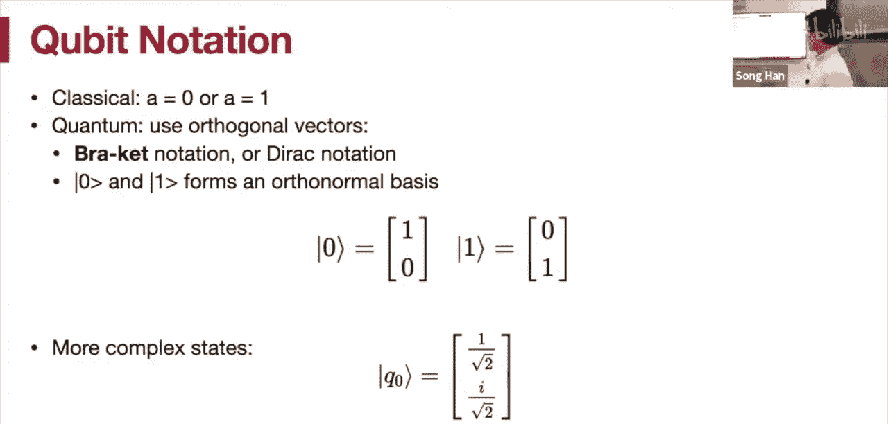

在过去的20年里，受这一概念的推动，许多研究团队以及来自工业界和学术界的科学家们，试图构建这些新的量子设备，并努力突破量子比特数量的界限。例如，谷歌正在构建这种超导设备，IBM也试图构建越来越多数量的量子比特，中国科学技术大学正在构建光子量子设备。随着量子设备的最新进展，我们看到了一些突破，如谷歌量子团队演示的实用性和优越性。这些是实际应用吗？我们对实际应用存有疑问，因为我们知道这些算法可能没有实际应用。但我们确实知道，如果我们拥有一些量子设备，并且可以继续增加其规模，总有一天我们可以在因式分解算法或其他量子模拟算法上实现实际应用。

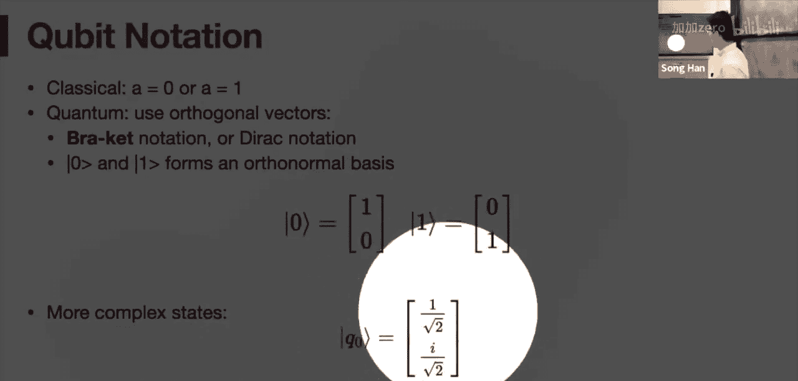

如今，在量子优越性演示五年后，整个领域实际上达成了一个共识：人们必须继续推动量子纠错的边界，因为我们不仅需要确保量子设备拥有大量量子比特，还需要确保每个量子比特的性能都非常好。例如，错误率需要低于10的负8次方，才能执行有意义的RSA-256因式分解算法。

好的，这基本上就是量子设备的现状。许多研究人员正试图演示最佳的量子纠错方案。例如，谷歌昨天发布的AlphaQubit论文实际上试图使用Transformer模型进行纠错解码过程。其他一些研究人员也试图利用现有设备，因为现有设备仍然有数千个量子比特，我们能否从现有领域中找到一些有意义的应用。这就是NISQ计算的发展趋势或路线图。

---

## 量子计算：2：量子比特与量子门

现在，让我们更深入地探讨量子设备的基础知识。

就像在经典设备中我们使用比特来表示信息一样，你可以用10个比特来表示10比特的信息，要么全是0，要么全是1，或者是0和1的某种组合。

量子设备的基本组件在概念上与经典设备相似，即我们使用量子比特来表示信息。我们简称量子比特为qubit。

在量子比特内部，你可能想知道我们可以用什么数学形式来描述量子比特系统。实际上，我们使用一个称为状态向量的向量来描述量子系统内的所有信息。想象一下，在一个经典系统中，我们现在正开车在路上，我们想告诉我们的朋友我们的位置。我们可以说，我们在高速公路100英里处。这就像我们可以用一个数字来表示我们在一个线性一维系统中的当前位置。这是一种非常紧凑的形式。我们可以只用一个数字来表示关于汽车位置的所有信息。

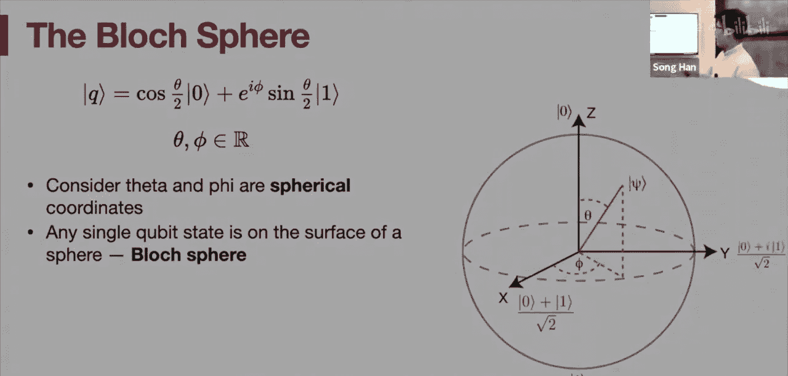

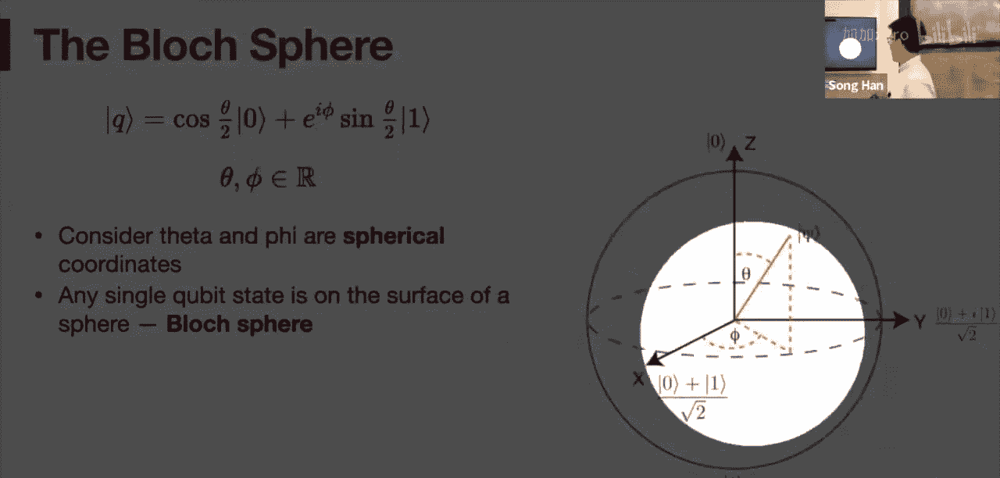

然而，我们可以想象，我们也可以用另一种更冗余的方式来表示汽车的位置。例如，我们可以说有12个不同的离散位置，然后我们可以使用一个长度为12的向量。所有其他数字都是0，然后我们使用独热编码来表示我们在第四个位置，只有一个位置是1，其他位置都是0。我们也可以将这个完整的向量发送给我们的朋友，告诉他们我们在哪个位置。这也代表了该系统内的所有信息。

这非常低效。你可以想象，最初我们只需要一个数字，现在我们使用了12个二进制数字。然而，对于量子设备来说，这种表示实际上非常高效，因为在量子设备中，汽车不仅可以位于一个位置，而且汽车位于任何位置都有一定的概率。汽车在整个道路上会有不同位置的组合，即位置的叠加。这就是量子设备的神奇或特殊之处。这意味着仅用一个量子比特，我们就可以表示许多不同的状态，而不仅仅是0或1，而是0状态和1状态之间的所有不同组合。

更严格地说，我们可以使用量子比特符号，即括号符号，来表示量子比特的状态。在经典情况下，比特要么是0，要么是1。但在量子情况下，我们可以使用这种狄拉克符号或括号符号。对于0状态，我们使用|0>；对于1状态，我们可以使用|1>。对于一个非常复杂的状态，例如这个|ψ>是1和0的叠加，我们可以在0状态和1状态上都有数字。这样，你可以想象，对于一个量子比特，我们不仅能够表示一个比特，还能表示两个复数。与经典比特相比，这具有更大的表示能力。

我们也可以将这种状态写成两个基态组合的形式。例如，这里的|ψ>可以是(1/√2)|0>加上(i/√2)|1>。这意味着系统的一部分能量处于0状态，另一部分能量处于1状态。这种形式，即两个基态的叠加，是它们的线性组合。

然而，当我们实际对量子比特进行测量或观察时，我们仍然需要回到经典世界。量子比特可以保持叠加状态很长时间，但为了从量子比特中读取信息，我们必须执行一个称为测量的过程。测量实际上是通过向量子比特施加微波脉冲来检索信息，或者给量子比特拍照以查看其状态。关于测量的重要或非直观之处在于，当我们实际测量量子比特时，量子比特会坍缩到0或1中的一个状态。无法直接测量量子比特的所有整体信息。而且，在这个测量过程中，状态的坍缩是随机发生的。例如，对于原始状态，在0和1之间，在我们进行测量之后，有一定的可能性我们从量子比特中得到1，也有另一种可能性得到0。

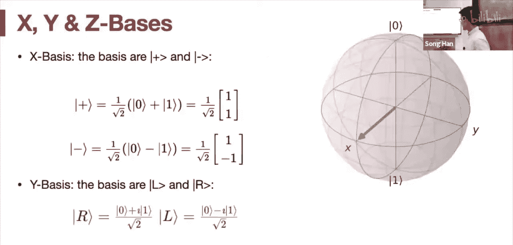

你可能会想，我们究竟如何用量子比特进行有意义的计算？答案是，实际上我们可以多次进行计算。例如，我们可以准备量子比特100次，然后测量100次，然后你可以得到1状态和0状态的分布。这样，你可以从这个量子比特的经典状态分布中获得有意义的结果。

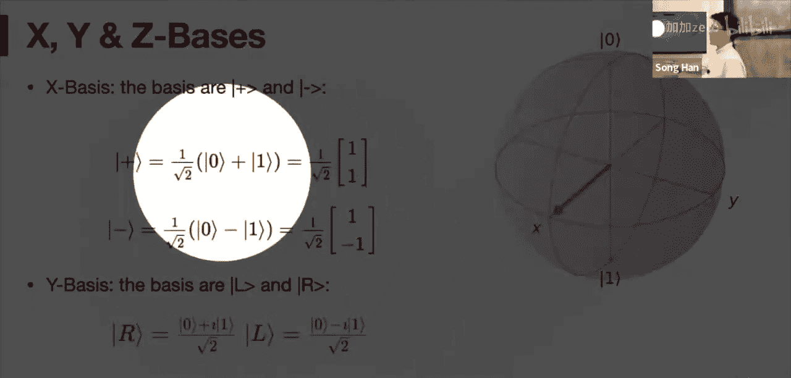

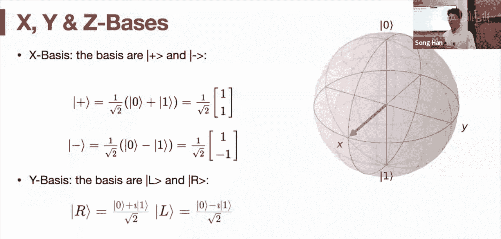

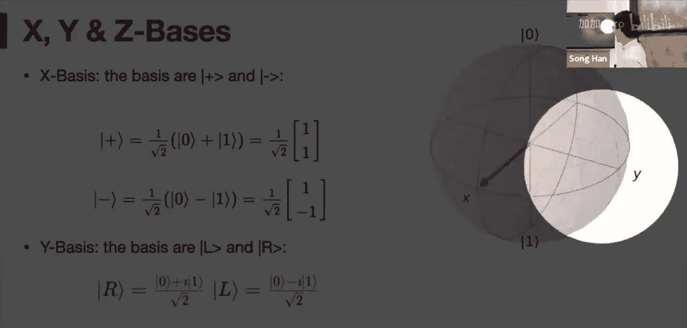

具体来说，你可能想知道分布的概率，我们如何知道测量结果是什么，测量0或测量1的概率是多少？从数学上讲，测量0的概率可以用这个点积运算来计算。基本上，这里的|0>就是我们刚刚介绍的。这里的|ψ>实际上是我们想要测量的状态。例如，如果我们想知道测量0的概率，那么我们可以直接计算这个过程，即|0>向量与目标向量的点积。然后我们可以计算这个过程的范数的平方。例如，组合过程可能看起来像这样。我们可以计算这个整体值约为1/2，这意味着当我们在这个0维度测量这个状态时，有50%的概率我们获得0状态。当然，还有另外50%的概率我们测量到1状态。这样，直观地说，我们准备的量子比特有一半的能量在1上，另一半在0上。这样，当你进行测量时，量子比特必须坍缩到离散状态之一，要么是0，要么是1。这个过程，这个点积运算可以帮助我们计算这个测量过程的概率分布。

对于测量过程，实际上有一个限制，即当我们测量状态本身时。例如，我们想用|ψ>本身来测量|ψ>，那么状态必须是1，因为测量状态与我们准备的状态相同。这样，我们知道|ψ>的行向量与列向量的点积应该是1。在这种情况下，我们知道这两个状态的系数α和β的范数平方之和应该为1。所以α² + β²应该等于1。

正如我们提到的，会有观察者效应，这意味着当我们测量量子比特时，我们知道以一定的概率获得每个基态，要么是0，要么是1。量子状态被称为坍缩到经典状态，所以在进行测量之前，我们不知道确切的状态。这是一个非常有趣的事实，因为有一个非常著名的概念实验，称为薛定谔的猫。你把一只猫放在一个盒子里，然后有一个计数器来计算来自这个特定设备的原子数量，在某个点之后，当你打开盒子时，你知道在计数器计数一定次数后，会释放毒药毒死猫。但在你打开盒子之前，你不知道盒子或猫的状态是否会被触发。这意味着当你进行观察时，你决定了猫的当前状态。但在你打开盒子之前，你不知道状态是什么。这就是猫的生与死的叠加。这是一个非常有趣的思维实验。实际上，在真实实验中也观察到了这一点。在量子比特中，在你将状态准备为叠加态之后进行测量，你会看到有时测量到0，有时测量到1，但在这个过程中，你确实有0和1的分布。

为了对量子比特的状态有一个直观和视觉上的理解，我们还可以使用另一个强大的工具，称为布洛赫球。我们知道量子比特的数学表示是α|0> + β|1>，α和β是复数。我们也可以将β表示为e^(iφ)β，使用这种极坐标表示。这样，我们知道我们可以将这个复数表示转换为实数。这样，我们有α、β和φ这些自由度。而且我们知道，因为α² + β²也需要加起来等于1。这样，我们进一步消除一个自由度。所有自由度将只是两个实数，即θ和φ。实际上，我们可以在一个球体上表示任意单个量子比特的状态，这个球体称为布洛赫球。其中一个自由度是θ，另一个是φ。我们可以看到，球体上的任何点都将由一个量子比特数据唯一表示。这对于我们理解量子比特在哪里非常有用。例如，这个球体的北极将是|0>。如果我们应用一个NOT门，我们将|0>反转为|1>。这本质上是从北极到南极沿着这个方向拉动。在后面的幻灯片中，我们将展示如何使用布洛赫球来更好地理解量子比特上的操作。

现在我们有了量子状态，我们知道可以用向量来表示状态，我们也想对状态进行一些操作或计算。

与之前的经典计算非常不同的一点是，所有的量子门都是可逆的。可逆是什么意思？可逆意味着在你进行计算后得到结果，然后从这个操作和结果中，你能够100%地检索到原始输入状态。

例如，如果我们对一个量子比特进行NOT门操作，我们想将|0>状态翻转为|1>状态。因为这里的NOT门用矩阵表示，实际上是一个可逆门。我们知道，如果最终结果是|1>，那么原始输入将是|0>。这个过程是一个可逆过程。

对你来说，一个问题是什么是经典计算中最简单的可逆门？我们知道NOT门和许多其他门，如XOR门或CNOT门。那么最简单的可逆门是什么？基于你学到的知识，有什么想法吗？比NOT门更简单的？是的，没错。最简单的可逆门是什么都不做。所以它就是恒等门。它将输入映射到输出。这样，当你得到输出时，你就知道输入，因为恒等门根本不改变状态。这样，量子中的所有门实际上都是可逆门，因为我们必须确保系统的能量与原始状态保持相同。可逆门都可以表示为这些矩阵或围绕布洛赫球的旋转。例如，NOT门可以用这个2x2矩阵表示。例如，在这种情况下，当我们在量子状态上应用NOT门时，我们可以从量子比特|0>的零状态开始，然后我们应用这个NOT门，然后|0>将被翻转为|1>。这样，指针将指向这个布洛赫球的南极。同样，如果我们对这个|1>应用NOT门，我们也将这个向量旋转回北极，即|0>状态。

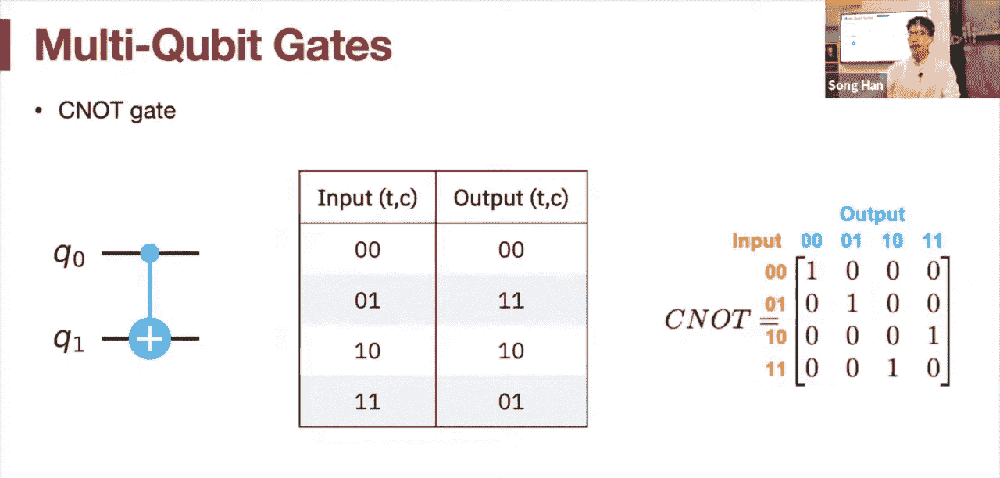

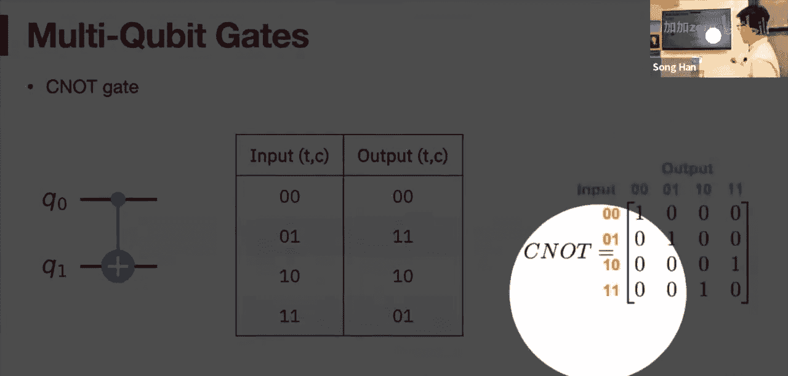

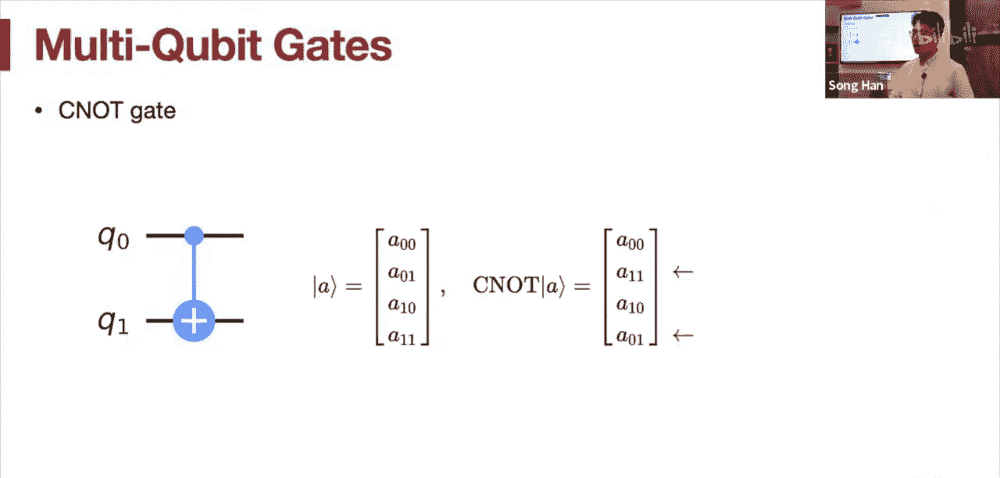

除了这个NOT门，还有其他泡利门，例如Y门和Z门。Y门的形式是[[0, -i], [i, 0]]，Z门是[[1, 0], [0, -1]]。基本上，当我们有这些不同的基门X门、Y门和Z门时，我们可以看看当我们实际将这些门应用于不同状态时会发生什么。例如，如果我们将Z门应用于|0>状态，我们知道计算后我们仍然处于|0>状态。如果我们将Z门应用于|1>状态，会发生什么？最终我们得到-|1>，但物理上，实际上-|1>向量与|1>状态是无法区分的，因为这里的-|1>和|1>只差一个全局相位-1。当我们进行全局相位变化时，实际上称为全局相位，在正常的物理过程中无法测量。接下来，我们还考虑将Z门应用于|1>状态也将与原始状态相同。这样，我们知道|0>和|1>实际上是Z矩阵的本征态，因为在我们应用Z之后，原始状态不会改变。这样，由|0>和|1>状态形成的所有组合基也称为Z基组合基。

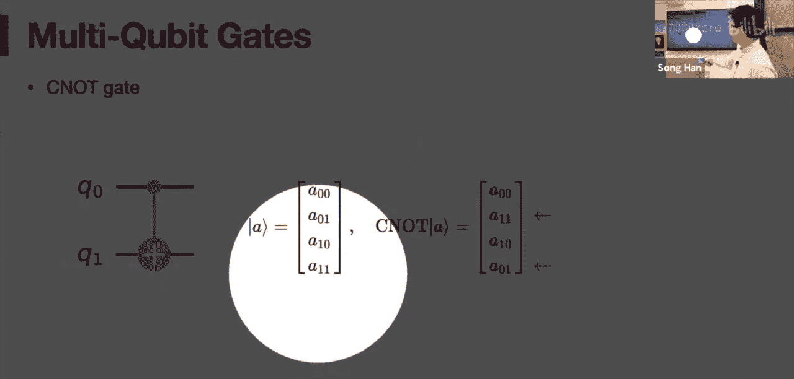

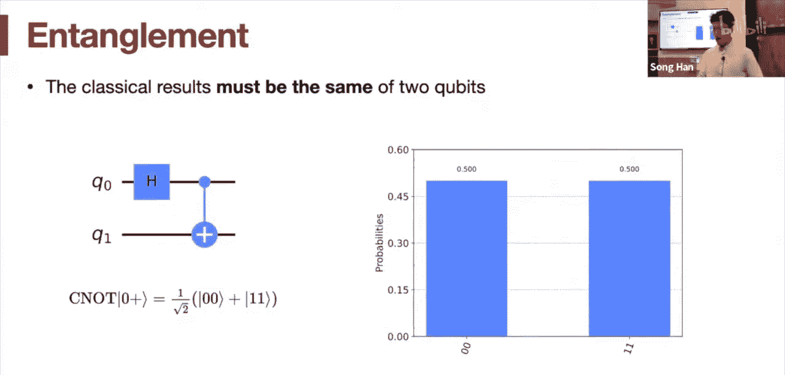

你可以想象，我们也有一些状态在应用NOT门后保持不变，即X基。例如，如果原始状态是|+>状态，然后我们将X门应用于|+>门，然后我们可以看到最终结果将与原始结果相同，对于|->状态也是如此。这样，我们知道X基的基门将是|+>和|->，形式为(1/√2)(|0> ± |1>)。类似地，对于Y基，我们也有|L>和|R>，即(1/√2)(|0> ± i|1>)。这些实际上是布洛赫球上的几个不同极点。例如，我们知道|0>和|1>状态是北极和南极，对于|+>和|->，它们实际上是前面和后面的极点，对于|L>和|R>，它们是布洛赫球的最左和最右极点。这样，你就知道了布洛赫球上的几个锚点，当我们理解了布洛赫球上这些不同位置时，我们就可以轻松理解这些门。

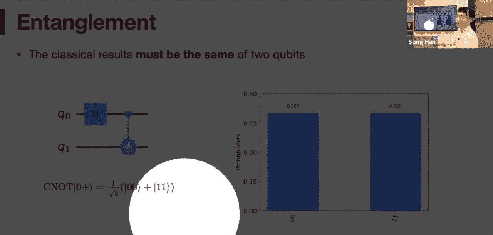

在这些泡利门之后，另一个非常有趣的门实际上是Hadamard门。Hadamard门实际上与经典门非常不同，因为从一个经典状态开始，即纯|0>状态，在应用这个Hadamard门之后，我们实际上创建了一些叠加。例如，最初我们可以有一个纯|0>状态，然后在应用Hadamard门之后，我们得到|+>门，它是|0>和|1>的叠加。

对于其他一些门也是如此，例如，这里我们介绍几个非常常用的单量子比特门，例如相位门、S门和S†门。单量子比特门最通用的形式可以用这个U门表示。这里我们在这个U门中有三个参数。基本上，当你将这个U门应用于布洛赫球上的任何量子比特状态时，只要根据你想要执行的转换配置这三个参数，你就可以执行从任意位置到另一个任意位置的旋转。这样，三参数U门是单量子比特的通用变换门。

好的，这样在第二部分，我们基本上介绍了单量子比特以及我们如何操纵这些门。就像在经典计算中我们应用那些NOT门和那些CNOT或X门一样，在量子设备内部，我们有不同种类的门来操纵量子比特的状态，以执行我们想要的计算。

---

## 量子计算：3：多量子比特系统与纠缠

在第三部分，我们将介绍多量子比特系统。因为我们知道，我们不能只用一个量子比特甚至一个比特来计算任何有意义的计算。我们必须在多个量子比特上执行计算。

这里有趣的部分来了，对于两个量子比特，实际上向量的长度将随着量子比特的数量呈指数增长。例如，如果我们只有两个量子比特，那么表示两个量子比特所有可能状态的向量的长度将是2的2次方，即4。这意味着能量分布在|00>、|01>、|10>和|11>状态上。这样，我们必须用长度为2^n的向量来表示n个量子比特。我们介绍的归一化原理仍然成立，即每个基的所有系数的范数平方之和为1。

这样，当我们有n个量子比特时，实际上我们必须使用状态向量中2^n个复数振幅来表示我们的状态。你可以想象，当我们有三个量子比特时，向量的大小将是2的3次方，即8。如果我们有10个量子比特，那么向量的大小将是2的10次方，即超过1000。因此，模拟大量量子比特非常困难，因为当我们有20个甚至50个量子比特时，我们必须存储在经典内存中的向量大小将是2的50次方，这对于模拟来说太大了。这也给了我们在量子状态中存储信息或进行任何计算的优势。

这里我们可以给出一个复杂情况的例子，即三个量子比特的集体状态。基本上，所有的量子比特都将应用我们在第一部分介绍的Hadamard门，然后三个量子比特的集体状态将是(1/√8)，然后在所有可能的基门上，即所有八个基态上，能量和概率将均匀分布。

你可能想知道单量子比特门对多量子比特系统的影响。如果我们在三量子比特系统中只对一个量子比特应用一个NOT门，会发生什么？实际上，当我们这样做时，我们可以计算多个门之间的张量积。例如，我们在第一个量子比特上有这个Hadamard门，在第二个量子比特上有NOT门。为了计算H门和X门的整体效果，我们可以执行X矩阵和Hadamard矩阵之间的张量积，我们得到这个大小为4x4的整体计算矩阵，然后我们可以计算在将这两个门应用于两个量子比特之后最终状态是什么。

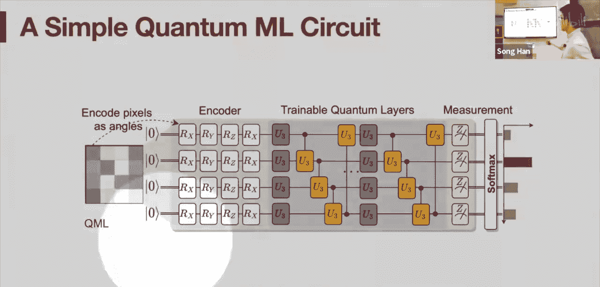

我们还有这个联合能量矩阵，这意味着当我们有这个门时，例如，仅在量子比特1上的NOT门，类似于前面的情况，我们也可以计算X和I之间的张量积，然后我们可以得到多量子比特系统的4x4矩阵。

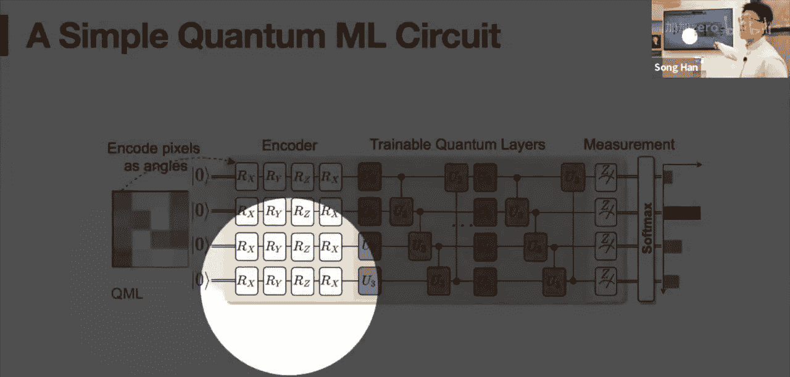

这里我将介绍一个非常有趣的门，即CNOT门。CNOT实际上是受控非门的缩写。在这个CNOT门中有两个量子比特作为输入，一个是控制量子比特，另一个是目标量子比特。控制位是这里的Q0，目标是Q1。受控非意味着当原始量子比特的控制量子比特是0时，我们不对目标量子比特进行任何计算。然而，如果我们在Q0上有一个1，那么我们必须对Q1执行一个NOT操作，即翻转Q1上的状态。

在中间这里，我们可以看到这个门的真值表。如果目标和控制位都是0，那么输出也将是00。然而，如果控制量子比特是1，如第二行所示，我们知道目标量子比特也必须执行这个翻转操作，所以最终输出将是11，一直到最下面一行，输入是11，然后我们需要将目标从1翻转到0，所以输出将是01。这样，我们可以为CNOT情况构造这个真值表。我们可以看到，所有输入都以黄色表示，输出以绿色表示。当我们实际输入这个|00>状态时，那么输出也将是|00>。然而，如果我输入这个|10>状态，那么输出将是|11>，因为目标量子比特的翻转。

这样，我们可以想象CNOT实际上执行了这两个状态的交换。当我们实际以这种格式输入状态时，那么输出将简单地交换|10>系数和|11>系数的位置，如图所示。

CNOT门如何创建量子计算中一个非常重要的概念，即纠缠。想象一下，如果我们在Q0上做Hadamard门，那么我们可以得到这个|0>+|1>状态。如果我们执行从Q0到Q1的CNOT门，在我们在Q0上应用Hadamard门之后，我们实际上可以得到一个非常有趣的状态，即两个量子比特之间的叠加纠缠，因为这里的状态实际上是(1/√2)(|00> + |11>)。

这意味着两个量子比特要么都处于|0>状态，要么都处于|1>状态。例如，如果你准备这个状态100次，然后测量100次，你可以看到50%的时间你得到这个|00>状态，另外50%的时间你得到|11>状态。

让我们想象一个非常有趣的场景。假设我准备了这个纠缠的量子比特对，处于|00>和|11>状态，然后我把其中一个量子比特给你，你登上宇宙飞船，然后你可以去宇宙的另一边，然后你可以测量量子比特。你测量量子比特，然后你得到，比如说，你得到一个0，然后如果我同时测量量子比特，或者在你测量量子比特一秒钟后测量，我将得到与你相同的结果，无论我们之间的距离有多远。这是因为两个量子比特已经纠缠在一起。这样，即使两个量子比特之间的距离远远超过光在一秒钟内传播的距离，我们仍然可以得到相同的结果。要么你测量到0，然后我也测量到0；要么你测量到1，那么我的测量结果也将是1。这实际上被称为远距离的幽灵相互作用，这意味着似乎有某种力量连接着这两个量子比特。然后，如果你在宇宙的一侧测量这个，也会影响另一侧的结果。这样，你可能会问，我们是否可以利用两个量子比特之间的纠缠来进行某种通信。这样，我们就可以实现两地之间超光速的通信。然而，不幸的是，我们无法通过这个过程进行任何通信，实际上这就是无通信定理。原因在于，例如，你在你那一侧测量到1。实际上，你无法配置量子比特。这纯粹是一个随机过程。你只是测量到1。然后我知道我测量到1，但你无法翻转量子比特来传递一个比特的信息，因为整个过程是随机的。这样，我们唯一能保证的是两个状态相同，但我们甚至无法通过这个过程发送一个比特的信息。这就是量子通信的无通信定理。

回到纠缠这里，实际上除了CNOT门之外，还有其他一些门可以创建纠缠或执行两个量子比特之间的相互作用。例如，一个门是CZ门。CZ意味着我们可以使用Q0对第二个量子比特执行一个Z门，即我们在第一部分介绍的Z门。这相当于首先在目标量子比特上执行Hadamard门，然后执行CNOT，最后执行另一个Hadamard门。

我们还可以执行SWAP门。SWAP是什么意思？假设我有某样东西，然后我可以把它换给你，这意味着我们可以交换两个量子比特的信息。SWAP意味着我们可以用这些SWAP完全改变两个量子比特的信息。SWAP也可以实现或分解为三个交错的CNOT门。

除了CZ门，我们还有受控旋转X门和其他许多双量子比特门。受控RX或CRX实际上是底部的格式，即如果我们在第一个量子比特上有这个|1>状态，那么我们可以对目标量子比特执行任意角度的X旋转。

这是一个很好的问题。实际实现因不同技术路线而异。例如，在超导芯片上，我们制造人造量子比特，然后门是通过微波脉冲实现的。我们有到量子比特的传输线，然后我们可以计算脉冲的形状，然后形状下的面积将决定这里的旋转角度θ。我们可以改变微波的形状以在超导量子比特上执行不同的门。对于另一种技术路线，如中性原子设备，我们将中性原子放置在真空室中，然后我们用激光照射原子，然后我们可以决定激光的长度，即我们照射激光多少秒或微秒。这样，我们也将这些门应用于实际的量子比特。这取决于不同种类的技术。

---

## 量子计算：4：量子电路与量子机器学习

现在我们进入第三部分，即量子电路。实际上，现在我们已经学习了什么是量子比特以及量子比特上的基本门。下一步将是构建一个量子程序，以便我们可以进行一些有意义的计算。我们不只是想操纵一个量子比特，我们想操纵一组量子比特来执行一些最小的计算并获得结果。

这里我们可以首先看看量子电路的整体组成部分。首先，我们有量子比特的初始化和重置部分，我们想用我们的问题表述来初始化量子比特状态。例如，如果我们想执行一些量子机器学习任务，然后我们想将信息编码到量子比特中，比如图像或一些句子，我们想将嵌入编码到量子比特中。

然后我们想应用一些量子门，例如Hadamard门或CNOT门，以执行状态的操纵。

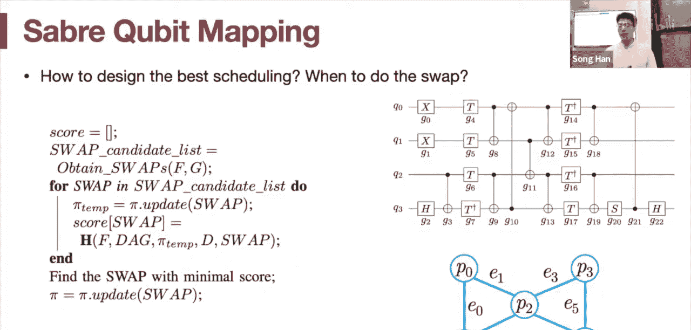

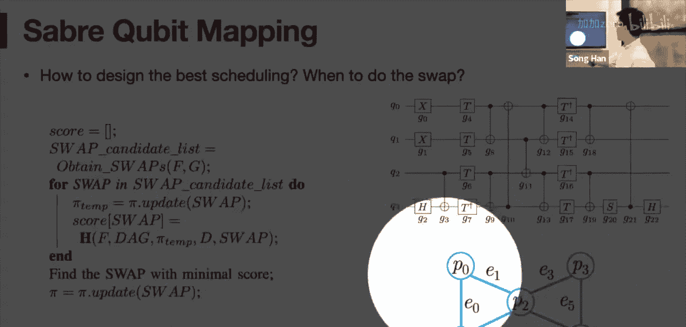

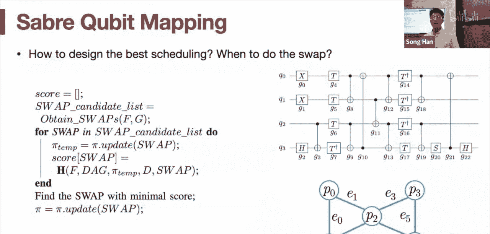

最后，我们对量子比特进行测量以获得最终结果。这就像在经典CPU中一样。在CPU中，你可以从DRAM中获取不同的信息，然后使用ALU执行操作，最后我们需要将不同的计算结果加载到SRAM或缓存中作为最终结果。这里也类似，我们需要初始化量子比特，然后进行计算，最后进行测量。

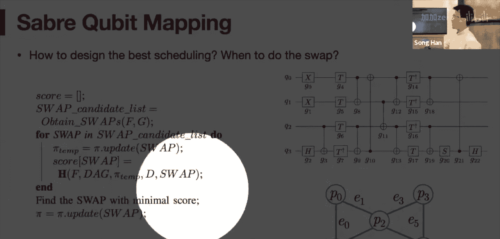

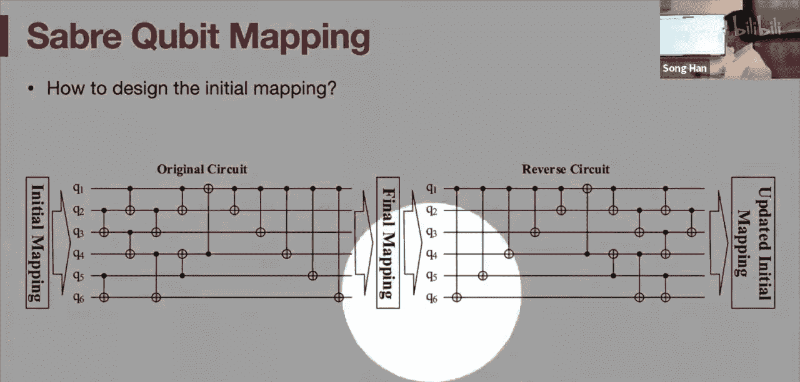

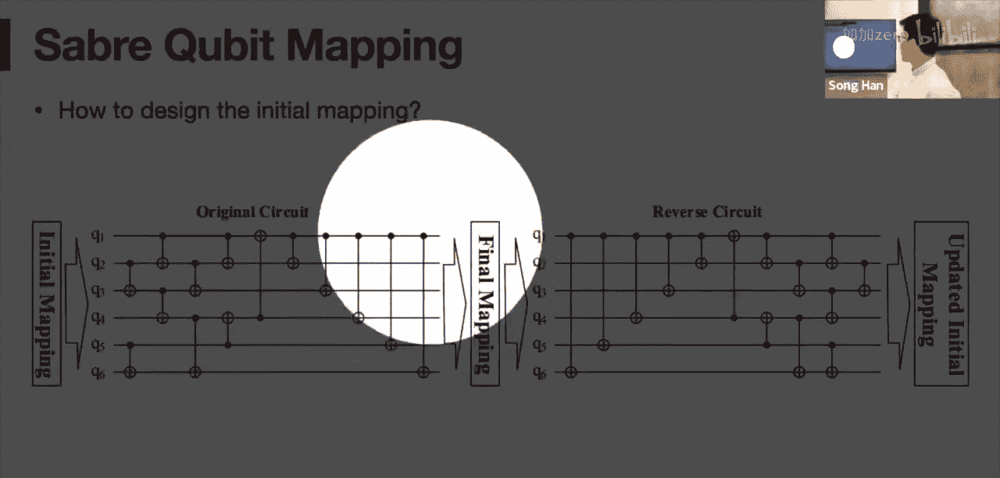

测量之后，还可以进行一些经典的后处理。例如，基于测量结果，我们可以在这里进行一些经典控制的量子门操作。

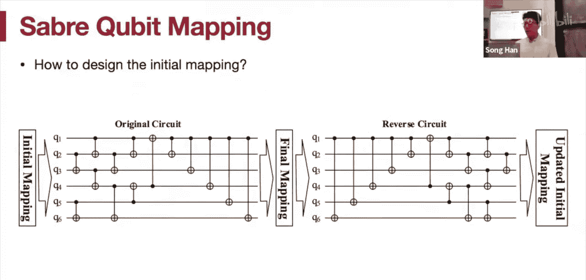

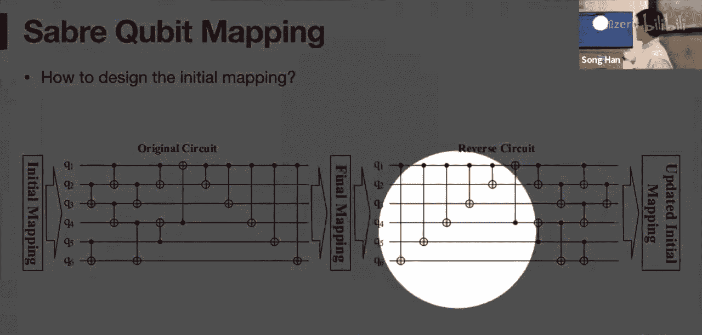

这里让我们快速看一个非常简单的电路，即半加器电路。我相信这是数字电路设计中的第一课。我们想设计一个半加器电路。在经典数字电路设计中我们可以做什么？我们可以添加那些与门。因为当我们实际添加这两个输入时，我们在右下角有这个真值表。对于其中一个比特，我们可以直接使用它作为第一个比特的进位，然后我们可以执行从Q0到Q1的CNOT，如左下角所示。这样，我们可以创建这个量子电路，它基本上执行这个半加器电路。

如果我们还想执行全加器呢？这意味着我们必须计算这个进位比特。在这种情况下，我们也可以使用这个受控多控制CNOT，基于Q0和Q1的状态来翻转Q3。例如，如果我们输入Q0或Q1中有一个是1，那么我们知道进位比特也应该是1，这样我们可以在Q3上得到这个数字。但如果Q0和Q1都是0，那么我们不必对Q3执行任何翻转。这样，我们可以看到获得这个进位比特的基本操作。

绿色框是初始状态吗？是的，所以这里是初始状态，你可以看到这里的两条分隔线。第一条是我们想要将1加到1的初始状态。这样，我们需要执行一个X门来进行初始状态准备。中间两条虚线之间的所有计算都是我们使用的门，然后对于两次测量，我们获得最终结果。

好的，这是全加器的基本过程。这里我们可以快速看一个非常简单的量子机器学习电路的例子。例如，如果我想做一些图像分类。在这种情况下，我们需要做的第一件事是将图像编码到量子比特中。有许多将经典状态编码到量子比特的过程。这里我们只使用一个非常简单的编码器，即相位编码器，这意味着我们将像素值编码到旋转角度中。这里我们大致可以看到有一个下采样到2x2的图像。这样，我们可以使用这个4x4图像，然后我们有每个像素的灰度值，然后我们可以将像素的灰度值编码到这些不同旋转门的旋转角度中。这里我们可以使用4x4的编码过程数组，但也有许多其他编码器可以使用。其中一些使用振幅编码，这意味着你直接将图像的状态编码到量子比特状态中；或者你可以使用二进制输入，你可以基本上只使用大量量子比特，每个量子比特要么是1要么是0。有许多正在进行的研究试图找出将经典状态编码到量子状态的最佳编码过程。之后，我们还可以在中间有可训练的量子层，颜色为灰色和黄色。这些值是U3门和受控U3门。这些门实际上可以执行对输入状态的期望操纵。例如，你可以基于反向传播过程训练这些值，以确保你正在执行计算的状态实际上代表了我们输入图像中数字的一些独特方面或独特信息。这样，在这个计算或输入状态之后，我们最终可以进行测量。测量我们可以获得完整的数字。想象一下，如果我们只是做四位数字分类，我们可以简单地做一些后处理，也许只添加一个softmax作为后处理，然后我们可以获得每个数字的值。

这是一个关于输出维度与输入或我们想要分类的类别数量不同的问题。答案是，实际上这里的后处理，一件事是我们可以基于许多不同的基进行测量。这里你可以看到我们只是在所有Z基上进行测量。我们也可以测量所有X基或X基。实际上，我们可以从这四个量子比特获得的数字至少是2的4次方，即16个数字。这样，我们可以在之后添加一个后处理，如全连接层，将其分类为10类或其他数量的类别。重要的是，我们可以进行不同的测量以从量子设备获得信息，然后我们可以添加另一层最终后处理，以将我们拥有的信息维度与我们想要分类的类别数量匹配。

这是一个关于如果我们有一个5x5图像会发生什么的问题。这是一个很好的问题。实际上，如果我们有一个5x5图像。这里的编码器首先只是一个例子。有几十种不同种类的编码器。简单的答案是，我们可以只添加一个量子比特，然后我们可以将5x5图像编码到量子比特中，我们也可以使用25个量子比特，然后我们可以只对每个量子比特添加一个门来编码状态。这就像经典机器学习中的神经架构搜索，在第一层，你可以使用3x3卷积，也可以使用5x5卷积，我们甚至可以展平图像，然后只添加全连接层，我们可以使用Transformer模型。有十种可能性或非常大的设计空间来将信息编码到量子门中，但在这个方案中，通常我们可以将大小增加到5x5来存储信息。

好的，这是量子机器学习电路的一个非常基本的方案。

基本上，我们有了如何使用量子比特的想法，以及如何构建电路以从量子状态计算有意义的结果。你可以想象，实际上对于这个量子电路，想象一下我们有一个非常大的输入，例如，用于长上下文学习的非常长的文档。在经典设备中，如果我们使用Transformer模型，我们会受到注意力计算量增加的困扰。然而，在量子方面，我们可以轻松地使用相对对数数量的量子比特来编码非常长的上下文，因为用这四个量子比特，我们可以存储2的4次方的信息，用100个量子比特，我们有极其巨大的空间。所以我们可以想象，如果我们能够找到非常有效的方法将信息编码到量子状态中，那么处理能力将会非常强大。而且，与经典设备相比，所需的量子比特数量非常少。然而，为了将信息编码到量子状态中，实际上存在很大的困难。通常，为了将状态非常准确地编码到量子状态，你还需要付出指数级深度的编码电路的成本。因为通常所有的量子比特最初都处于全零状态，然后如果你想编码到任意状态，那么你在初始化阶段必须应用的门数量也非常大。这实际上是当前量子计算社区的瓶颈或挑战之一，即数据编码或数据上传过程。我们如何以非常小的成本在量子设备中高效地表示状态？这是一项正在进行的研究工作，试图降低成本，并充分利用可用的量子比特数量。

---

## 量子计算：5：NISQ时代与编译器

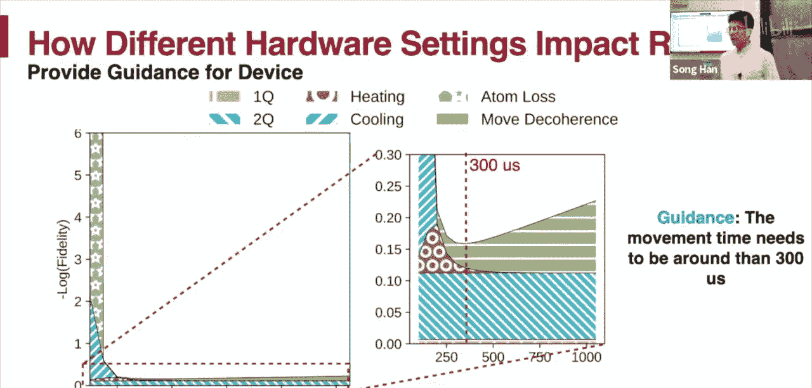

现在，在算法方面，我们了解了如何操纵量子比特的状态，我们可以执行哪些门，以及量子机器学习的基本模型。在设备方面，我们将介绍一些关于嘈杂中型量子时代的基本概念。如你所知，在机器学习社区，人们也想对深度学习或机器学习的不同阶段进行分类。目前我们处于机器学习的第三阶段。量子计算也是如此。实际上，量子计算有几个大的浪潮，现在我们实际上处于NISQ时代。N意味着我们有嘈杂的量子比特，这意味着量子比特对环境非常敏感。当我们在经典设备上进行计算时，例如，你打开笔记本电脑，然后你只使用1+1，然后你输入你想要计算的方程，然后100%的时间你得到正确答案。然而，如果你在量子设备上这样做，就像我们在上一节介绍的那样，在量子设备上执行1+1的全加器，会有相当大的概率我们得到错误的答案。这都是因为量子设备上的噪声，因为所有的操作，如NOT门和CNOT门，由于各种噪声而无法忠实地实现。例如，控制微波脉冲的形状不完美，量子比特与环境之间存在一些相互作用，有时来自宇宙和太阳的宇宙射线也会影响量子比特的状态。在量子比特上进行计算是一个非常脆弱的过程。这就是为什么我们称这是一个嘈杂的过程。通常，你可以看到单量子比特单周期泡利门的错误率在10的负3次方范围内，对于CNOT门，错误率在10的负2次方范围内。这意味着当你在量子设备上计算100次1+1时，你会得到一个错误的答案。这实际上不是很好的结果，因为当我们实际执行更复杂的计算时，比如你想执行一些量子机器学习模型，那么将会有数十或数千个门，甚至数百万个门，如果设备不够可靠，那么结果也将不正确。

除了这种噪声，我们还有有限数量的量子比特。通常，我们在可用设备中有数十到数百个甚至数千个量子比特。

而且，量子比特之间的连接性有限。例如，这里是IBM Washington设备的图，我们有这种砖块形状的量子芯片。它被称为重六边形，因为每个环上有12个量子比特，还有六个顶点，每条边上还有一个额外的量子比特，所以被称为IBM设备的重六边形拓扑。

现在，如果我们将超导IBM、谷歌以及离子阱、中性原子连续设备放在这个二维网格上，我们可以看到一维是系统规模，另一维是错误容忍度。我们可以看到，在右上角拥有非常大的设备和非常高的错误容忍度是更好的。然而，我们可以看到右上角实际上是一些量子算法的要求。其中之一是Shor算法，用于大整数的因式分解，以及用于结构化数据库搜索的Grover搜索，还有一些用于量子化学任务。我们可以看到，在可用设备和硬件要求之间仍然存在相当大的差距。我们的想法是，我们能否进行一些计算，特别是从计算机系统背景和架构背景出发，我们如何在中间层进行一些优化以缩小这一差距。例如，一个非常重要的任务，也是我们可以从设备以及计算机系统方面做出贡献的一点是，我们可以进行量子比特映射过程，选择那些好的量子比特开始。例如，在IBM设备这里，我们有127个量子比特，但并非所有的量子比特都是平等的。你可以看到一些量子比特颜色较深