# 023：量子机器学习第二部分 (Zoom Recording) (MIT 6.5940, Fall 2024)

在本节课中，我们将继续学习量子机器学习，这是系列的第二部分。我们将深入介绍参数化量子电路、其训练方法、噪声感知训练技术，以及用于量子机器学习的Torch Quantum库。最后，我们将探讨如何通过架构搜索找到最鲁棒的量子电路设计。

## 概述

上一讲我们介绍了量子计算的基础知识，包括量子比特的工作原理、基本量子门、如何实现一个基础的量子分类器，以及当前量子计算（如NISQ时代）的现状和编译技术。

本节中，我们将进一步探讨量子机器学习的更多细节，特别是参数化量子电路及其训练方法，用于分类等任务。我们还将学习如何通过噪声感知训练来提高量子电路的鲁棒性和可靠性，并介绍MIT开发的Torch Quantum库。最后，我们将讨论四种不同的架构，以及如何选择可靠性最高的架构来完成量子机器学习任务。

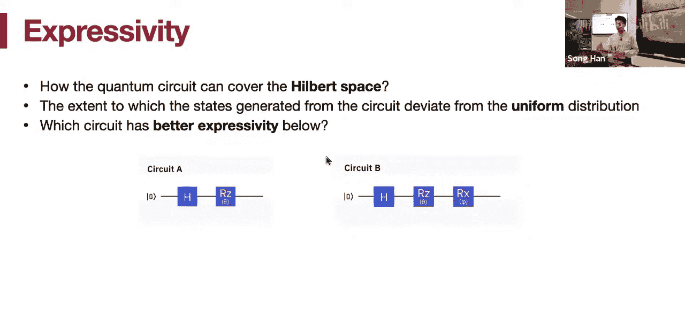

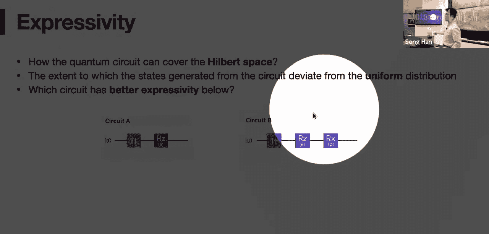

## 1. 量子机器学习方法分类

首先，我们需要理解量子机器学习方法的分类体系。我们可以从两个维度来划分：算法类型和数据类型。

算法类型可以是**量子算法**或**经典算法**。数据类型可以是**经典数据**或**量子数据**。这样，整个领域可以划分为四个区域：

*   **左上角**：经典数据 + 经典算法。我们在之前的课程中已经学习了许多这类高效的经典算法。
*   **右上角**：经典数据 + 量子算法。这是我们本节课的重点，即如何利用量子计算的能力来处理经典输入（如图像）。
*   **左下角**：量子数据 + 经典算法。这通常指如何控制量子设备，例如向量子比特发送控制信号、进行校准和读取。
*   **右下角**：量子数据 + 量子算法。这涉及处理量子信息，例如使用量子比特作为传感器感知环境，并用量子算法解码信息。

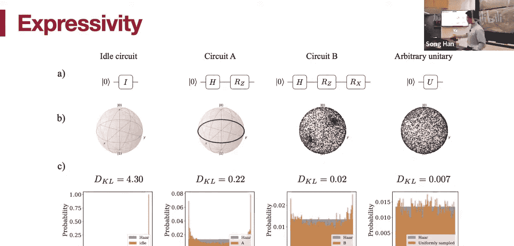

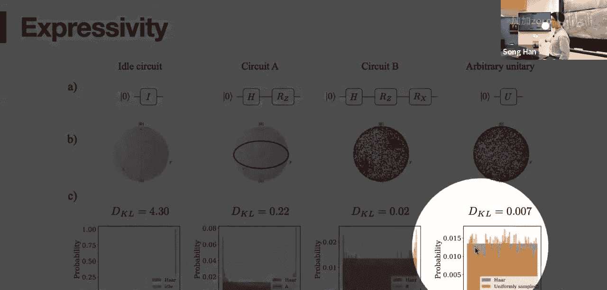

本节课我们主要关注如何使用量子算法处理经典数据，即分类体系中的第二类。

## 2. 参数化量子电路

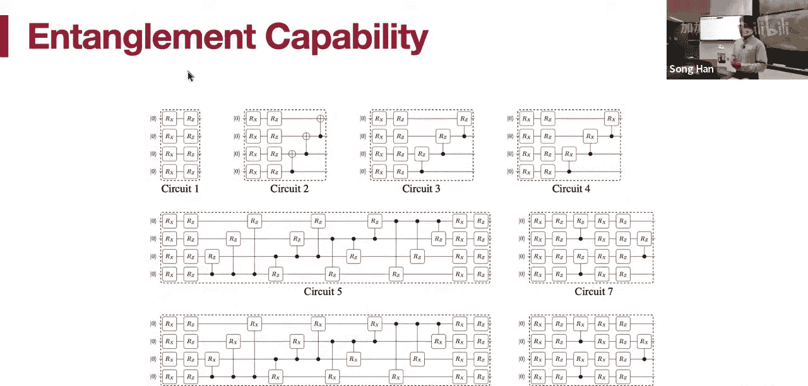

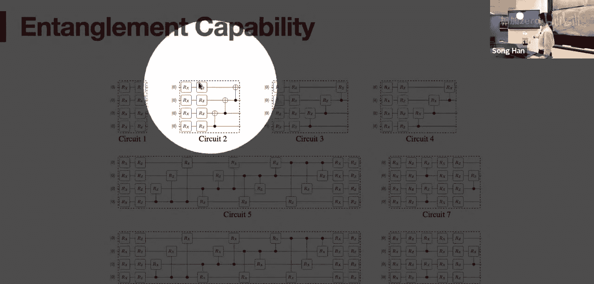

在上一讲中，我们介绍了量子电路的基本构成：初始化量子比特、应用各种量子门、最后进行测量以获得经典输出。

参数化量子电路在此基础上引入了可调参数。以下是一个PQC的例子：

```python
# 一个简单的参数化量子电路示例结构
# |0> -- Rx(θ1) -- ● -- Rz(θ3) -- Measure
# |0> -- Ry(θ2) -- X -- Rx(θ4) -- Measure
```

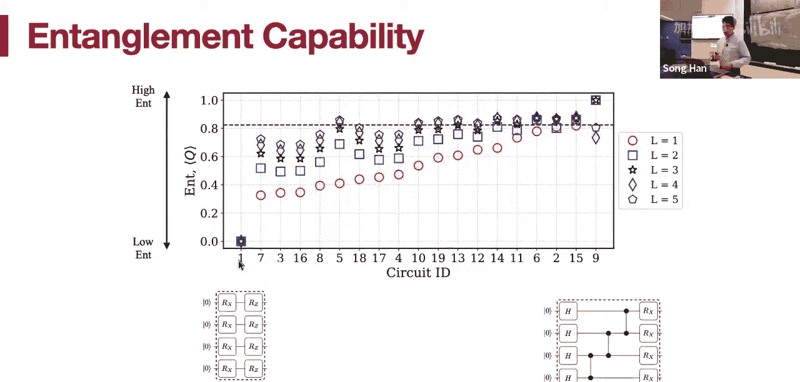

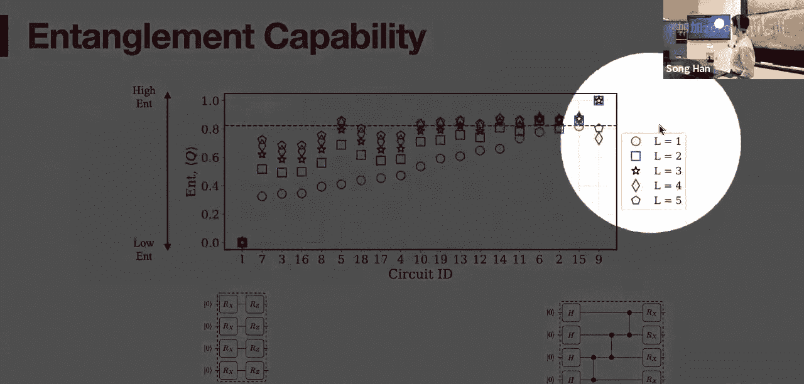

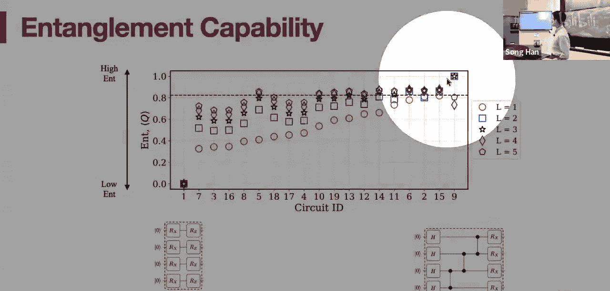

图中，标为黄色的门（如 `Rx(θ)`）包含可调参数（`θ`），旋转角度不同，门的实际效果也不同。标为灰色的门（如 `S`、`X`、`H`）是固定门，执行固定的操作。这类似于经典深度学习：卷积层或全连接层有可调参数，而池化层或展平层则没有。

### 2.1 表达能力

我们关心量子电路的一个关键属性是**表达能力**，即电路表示任意量子态、覆盖希尔伯特空间的能力。电路能从均匀分布中生成的状态范围，就表征了其表达能力。

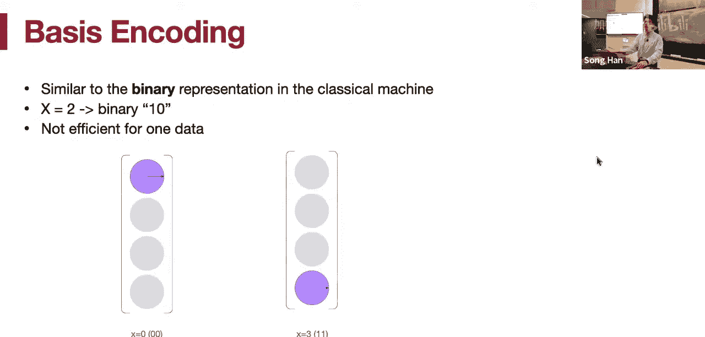

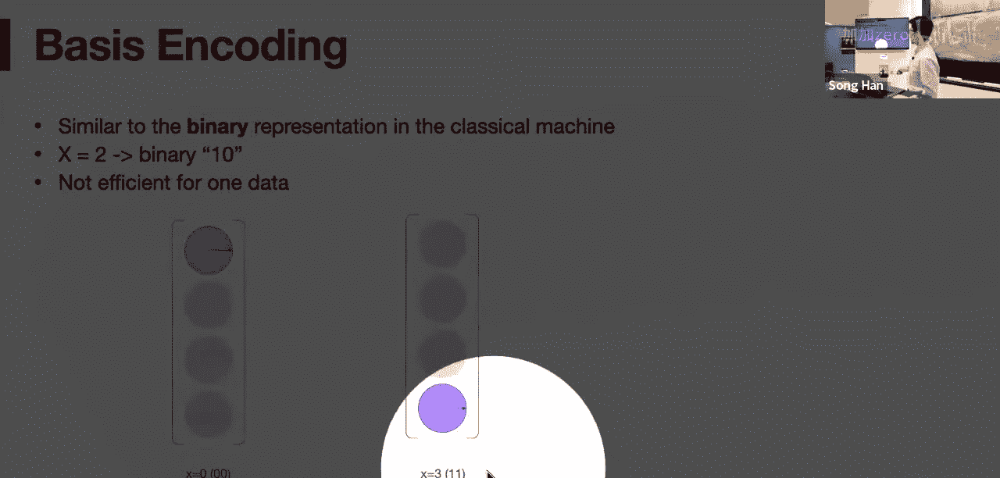

请看两个例子：
*   **电路A**：首先应用哈达玛门 `H`，然后应用旋转Z门 `Rz(θ)`。
*   **电路B**：首先应用 `Rz(θ)`，然后应用 `Rx(φ)`，比电路A多一个参数。

直观上，**电路B** 由于参数更多，具有更强的表达能力，能表示希尔伯特空间中更多的状态。

如何可视化这一点呢？当我们改变 `θ` 值时，电路A在布洛赫球上的覆盖范围是一个赤道环。而对于电路B，通过随机分配 `θ` 和 `φ` 的不同组合，我们可以覆盖整个球面，而不仅仅是一个环。因此，电路B具有比电路A更好的表示能力。

更严格地说，我们可以通过比较电路生成的状态对与均匀分布（哈尔测度）的差异来量化表达能力。差异越小（KL散度越低），电路的表达能力越强。

### 2.2 纠缠能力

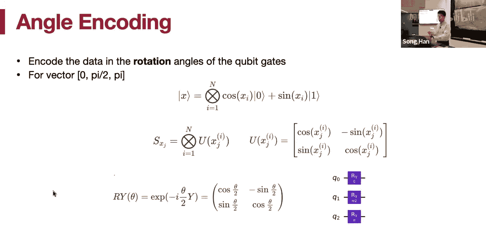

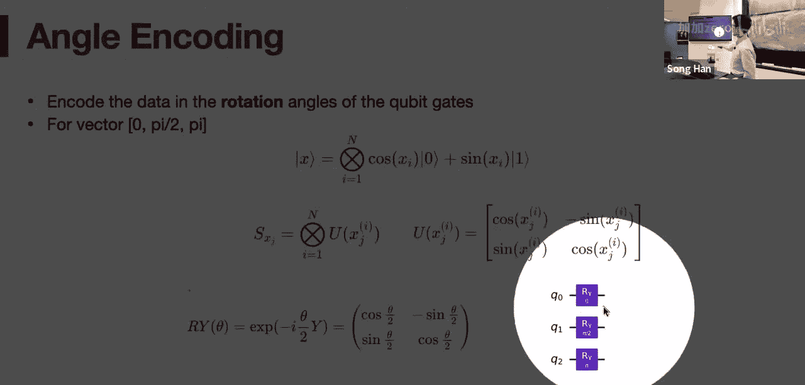

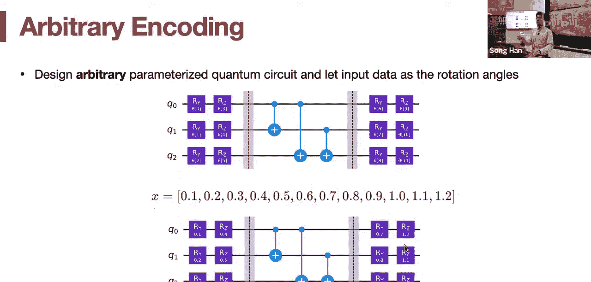

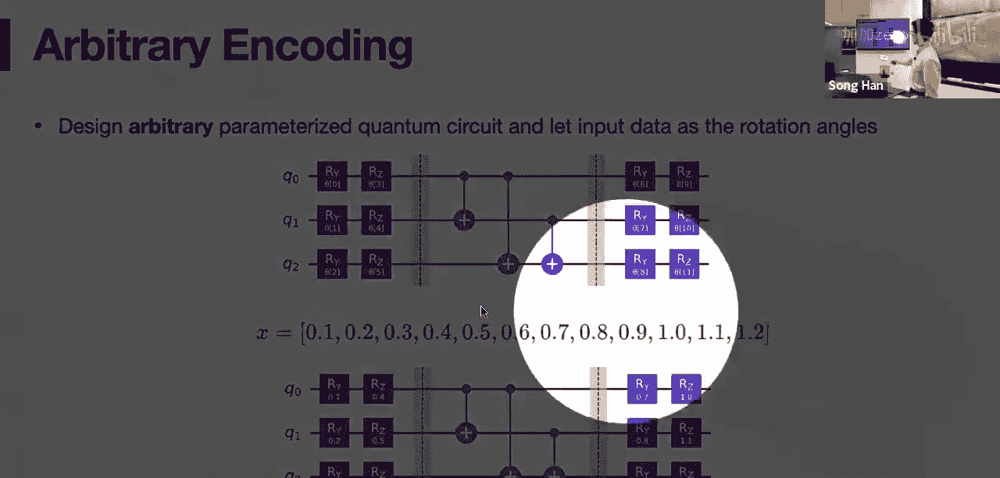

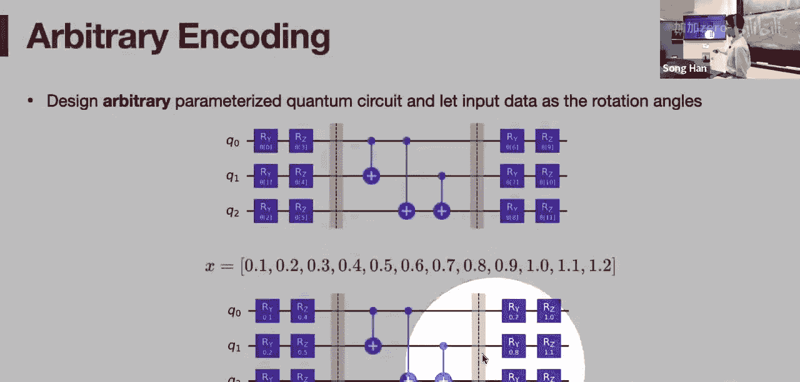

除了表达能力，我们还关心电路的**纠缠能力**，即电路能否使两个或多个量子比特的状态发生纠缠。

我们可以使用 **Meyer-Wallach 度量** 来衡量。MW度量的范围是0到1。对于未纠缠态，MW度量为0；对于两个量子比特的最大纠缠态，MW度量为1。因此，我们可以用平均MW度量来衡量量子电路的纠缠能力。

以下是不同量子电路结构的例子：
*   **电路1**：所有门都只作用于单个量子比特，没有量子门连接不同的量子比特。因此，它没有任何纠缠能力。
*   **电路2**：在量子比特之间有许多CNOT门，因此具有很强的纠缠能力。

通过MW度量，我们可以可视化不同电路的纠缠能力。例如，无论使用多少层，电路1的纠缠能力始终为0。而电路9（具有大量纠缠门）即使只有少数几层，也能达到很高的纠缠能力。

直观上，我们希望量子电路具有较大的纠缠能力。因为在第一讲中我们提到，我们希望将数据编码到量子比特的大指数级希尔伯特空间中。如果无法使量子比特纠缠在一起，我们就无法将所有量子比特作为一个整体来编码大量数据。

### 2.3 硬件效率

另一个需要考虑的方面是**硬件效率**，即我们是否能在实际设备上高效地实现这些量子电路。

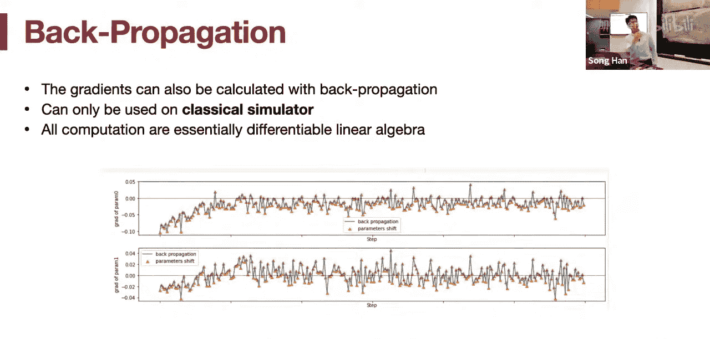

我们需要考虑以下几点：
1.  **量子比特连接性**：PQC设计是否考虑了量子比特之间的实际连接方式？例如，如果硬件只支持相邻量子比特之间的操作，那么电路设计应与之匹配。
2.  **原生门支持**：电路中的门是否是硬件支持的原生操作？例如，如果硬件不支持某个受控旋转门，则需要将其分解为多个原生门，这会引入额外开销。

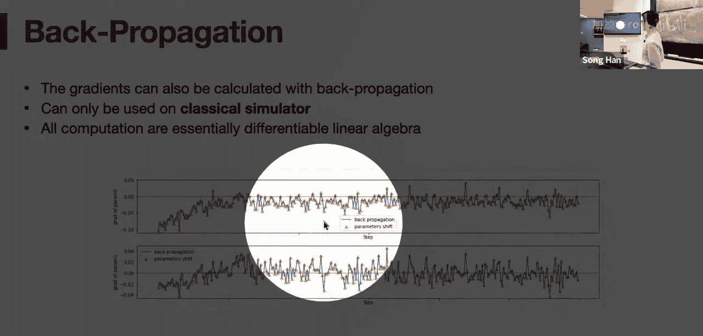

因此，在构建量子电路时，我们必须综合考虑表达能力、纠缠能力和硬件效率。

## 3. 数据编码与电路训练

在将经典数据输入量子电路进行处理之前，我们需要先将其编码到量子态中。

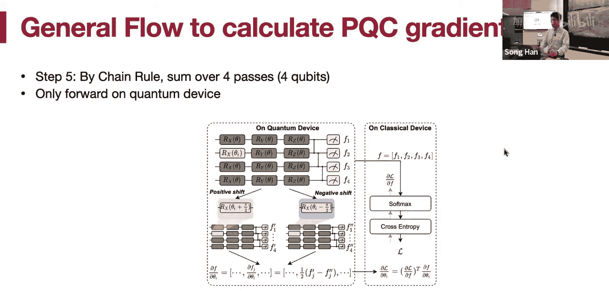

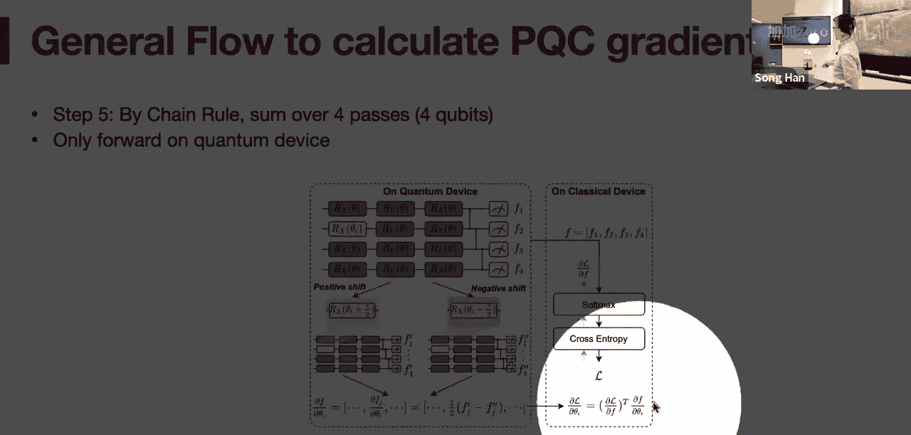

### 3.1 编码方法

假设我们有一个经典数据集 `X`，包含 `m` 个样本，每个样本有 `n` 个特征。我们需要将每个特征向量编码到量子电路中。以下是四种主要的编码方法：

**1. 基态编码**
类似于经典计算中的二进制表示。例如，数字2的二进制是“10”，我们可以创建一个量子态，将所有概率幅集中在 `|10>` 态上。这种方法对于单个数据点效率不高，但可以同时编码多个数据点到一个叠加态中。

**2. 振幅编码**
将输入向量的每个元素直接编码为量子态向量的概率幅。例如，对于向量 `[1, 0, 0, 0]`，我们创建一个量子态 `|00>`。对于向量 `[0.8, 0.2, 0.6, 0.4]`，我们将能量按比例分配到不同的基态上。这种方法非常高效，对于 `n` 个特征，我们只需要 `log₂(n)` 个量子比特。但需要注意的是，输入向量必须归一化（模长为1），且制备任意振幅的量子态本身可能需要复杂的电路。

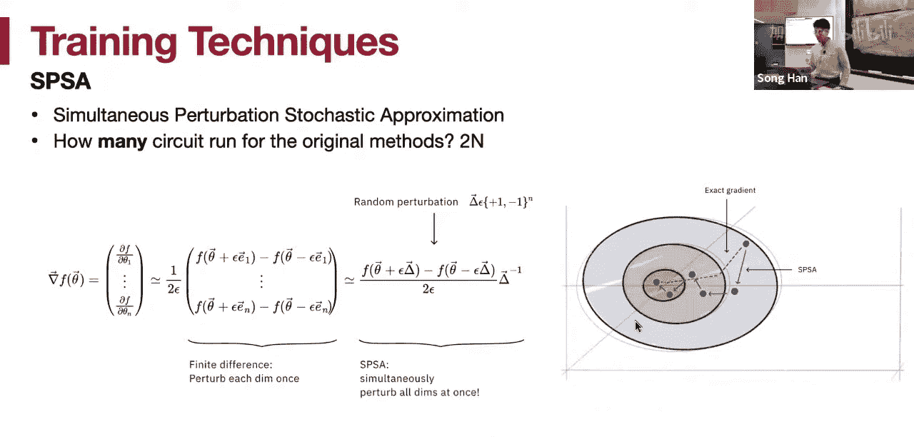

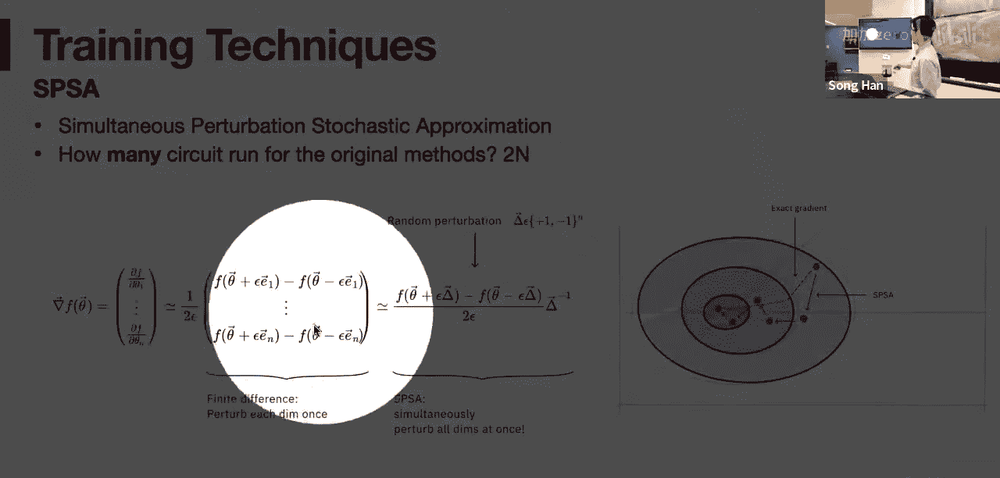

**3. 角度编码**
将输入数据的每个值编码为量子门旋转的角度。例如，对于输入向量 `[0, π/2, π]`，我们可以将其直接设置为 `Rz` 门的旋转角度。这种方法非常高效，无需复杂的态制备电路。

**4. 任意编码**
结合上述多种方法。例如，可以先使用几层旋转门，然后应用纠缠门，最后再用另一层旋转门编码剩余的数据值。

### 3.2 训练参数化量子电路

编码完成后，我们需要训练参数化量子电路。这个过程类似于经典深度学习：
1.  **预处理**：将经典数据编码到量子比特（类似于图像降采样）。
2.  **可训练层**：应用参数化量子电路层来变换输入态。
3.  **目标**：将量子态变换到目标态以执行分类等任务。

训练通常采用数据驱动的迭代方法：初始化参数，计算目标函数（如交叉熵损失），然后通过反向传播或其他优化器更新参数以最小化损失。

**梯度计算**
1.  **有限差分法**：给参数一个小的扰动 `ε`，计算函数值的变化来近似梯度。缺点是 `ε` 的选择需要谨慎，过大或过小都会导致梯度不准确。
2.  **参数移位规则**：对于量子电路中的旋转门，可以计算解析梯度。规则是：对于参数 `θ`，梯度 `∂f(θ)/∂θ` 可以计算为 `[f(θ+π/2) - f(θ-π/2)] / 2`。其直观理解是，对于 `cos(θ)` 这类函数，其导数 `-sin(θ)` 正好是 `cos(θ+π/2)`。
3.  **反向传播**：在经典模拟器上，我们可以利用计算图进行反向传播，获得解析梯度。实验表明，参数移位规则与反向传播的结果一致。

然而，**在实际量子设备上，我们无法获取中间结果，因此不能进行反向传播**。参数移位规则的优势在于，它只需要最终的测量结果，因此可以在真实设备上执行。

**训练流程**
在实际设备上，训练流程是混合的：
1.  在量子设备上执行电路，获得测量结果 `F`。
2.  在经典计算机上，根据 `F` 计算损失函数 `L`，并得到 `∂L/∂F`。
3.  对于每个参数 `θ`，利用参数移位规则在量子设备上计算 `∂F/∂θ`。
4.  利用链式法则 `∂L/∂θ = (∂L/∂F) * (∂F/∂θ)` 计算总梯度，并在经典端更新参数。

**挑战与优化**
*   **参数移位规则的成本**：每个参数都需要两次额外的电路执行，因此总成本随参数数量线性增长。这是量子训练的一个基本挑战。
*   **同时扰动随机逼近**：为了降低成本，我们可以使用SPSA算法。其思想是同时扰动所有参数一个随机方向（`+1` 或 `-1`），通过一次前向过程估算所有参数的梯度方向。虽然这是近似，但通常能取得与普通梯度下降相近的效果。
*   **贫瘠高原问题**：当量子比特数或层数增加时，梯度的方差会指数级减小，导致早期层的梯度消失，难以有效更新。这与经典深度学习中的梯度消失问题类似。在量子领域，由于不可克隆定理，无法像经典残差连接那样简单地复制中间状态，因此解决此问题更具挑战性。

### 3.3 量子分类器示例

回顾上一讲介绍的量子分类器：
1.  **编码器**：使用角度编码将像素值编码为旋转角。
2.  **可训练层**：包含 `U3` 门和受控 `U3` 门。
3.  **训练**：使用SPSA等方法训练参数。
4.  **测量与后处理**：测量量子比特，通过后处理得到分类结果。

训练过程类似于经典神经网络的优化，目标是找到损失函数的极小值点。

### 3.4 其他PQC应用

除了分类，PQC还可用于其他任务：
*   **变分量子本征求解器**：用于寻找给定矩阵的最小本征值。在量子化学中，可用于计算分子的基态能量。
*   **量子近似优化算法**：用于解决组合优化问题。

## 4. 噪声感知训练

在实际量子设备上，噪声会显著影响梯度计算的可靠性，从而降低模型性能。图中显示，在真实IBM设备上训练的准确率明显低于无噪声的经典模拟。

一个有趣的观察是：**当梯度幅度很小时，其相对误差会非常大**。直观上，如果梯度本身很大，噪声不太可能改变其方向；但如果梯度很小，轻微的噪声就可能导致梯度方向反转。

因此，我们的核心思想是：**在训练过程中，识别并剪枝那些不可靠的小梯度，只使用可靠的梯度来更新参数**。

我们提出了一种**概率梯度剪枝**方法：
1.  **梯度累积**：设置一个时间窗口，累积多个训练步骤中每个参数的梯度绝对值。
2.  **排序与剪枝**：对累积的梯度幅度进行排序。只保留幅度较大的梯度用于参数更新，而剪枝掉幅度很小的梯度。

实验表明，这种方法可以在四分类任务上提升约5%到10%的准确率，并且在IBM设备上训练时尚能减少约2倍的训练时间（因为无需计算被剪枝的梯度）。

概率梯度剪枝相比确定性剪枝（永远移除某些参数）更有优势，因为它通过采样决定剪枝对象，带来了约1%到9%的额外精度提升。

## 5. Torch Quantum 库

为了便于开发量子机器学习模型，MIT开发了 **Torch Quantum** 库。它基于PyTorch框架构建，旨在提供快速、便捷、可扩展的量子机器学习基础设施。

TQ库的特点包括：
*   **易用性**：构建量子模型类似于构建经典PyTorch模型。
*   **GPU加速**：支持GPU加速计算。
*   **密度矩阵支持**：支持更一般的量子态表示。
*   **动态计算图**：便于调试。
*   **框架转换器**：可轻松转换为其他量子框架（如Qiskit）的代码，以便在真实设备上运行。
*   **完全可微**：所有操作都基于PyTorch张量，因此可以无缝使用PyTorch的优化器。

**使用示例**
以下是一个简单的量子分类模型构建示例：
```python
import torchquantum as tq

class QuantumClassifier(tq.QuantumModule):
    def __init__(self, n_wires):
        super().__init__()
        self.n_wires = n_wires
        # 编码层：角度编码
        self.encoder = tq.AngleEncoder()
        # 可训练层：旋转门
        self.rx_layers = tq.RX(has_params=True, trainable=True)
        # 固定门：例如哈达玛门
        self.h_layer = tq.Hadamard()
        # 测量
        self.measure = tq.MeasureAll(tq.PauliZ)

    def forward(self, x, q_device):
        # 重置量子设备
        q_device.reset_states()
        # 编码经典数据
        self.encoder(q_device, x)
        # 应用可训练门
        self.rx_layers(q_device)
        # 应用固定门
        self.h_layer(q_device)
        # 测量
        x = self.measure(q_device)
        # 后续可接经典层，如MLP
        x = self.classical_net(x)
        return x
```
TQ库还提供了许多宏和预定义模型，欢迎访问 `torchquantum.org` 或GitHub仓库进行探索。

## 6. 鲁棒量子神经架构搜索

量子神经架构搜索是量子机器学习中的一个基本挑战，即如何为特定任务找到最佳的量子电路结构。设计空间巨大，包括：门的类型（`U3`、`CNOT`等）、门的数量、门的层数、门的位置等。

**量子NAS框架**
我们介绍一个名为 **Quantum NAS** 的框架，其核心思想是 **“一次训练，多次使用”**。目标是训练一个包含所有可能子电路结构的**超电路**，然后从中采样评估，避免对每个候选结构单独训练。
框架包含四个步骤：
1.  **构建超电路**：设计一个足够大的电路，覆盖目标设计空间。
2.  **训练超电路**：采用“采样-训练”策略。每一步随机从超电路中采样一个子电路，仅更新该子电路的参数。经过足够步数后，所有子电路都经历了训练，其性能排序与单独训练的结果具有正相关性。
3.  **噪声感知进化搜索**：在训练好的超电路上，使用进化算法等搜索方法，在真实设备上评估采样子电路的性能，寻找最优子电路。
4.  **从头训练与剪枝**：找到最优结构后，可以对其从头进行训练。之后，还可以剪枝掉那些参数接近零（即近似恒等操作）的门，以简化电路。

**其他搜索方法**
*   **基于机器学习的预测器**：使用图神经网络等模型来预测子电路性能。
*   **强化学习**：将架构搜索建模为强化学习问题，智能体的动作是添加或删除层/门，奖励是在真实设备上的性能。
*   **可微分搜索**：使架构参数可微，并进行梯度优化。

## 总结

本节课我们一起学习了量子机器学习的核心进阶内容：

1.  **参数化量子电路**：理解了其表达能力、纠缠能力和硬件效率等关键属性。
2.  **数据编码**：学习了基态编码、振幅编码、角度编码和任意编码四种方法。
3.  **电路训练**：掌握了参数移位规则、SPSA等梯度计算方法，并了解了贫瘠高原等挑战。
4.  **噪声感知训练**：通过概率梯度剪枝技术，提高了在真实有噪设备上训练的鲁棒性。
5.  **Torch Quantum库**：认识了这一用于快速开发量子机器学习模型的PyTorch框架。
6.  **量子神经架构搜索**：了解了通过Quantum NAS等框架自动搜索高性能、高鲁棒性量子电路结构的方法。

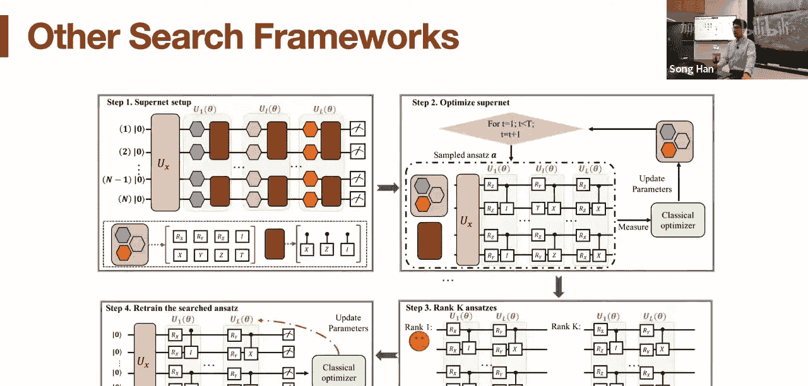

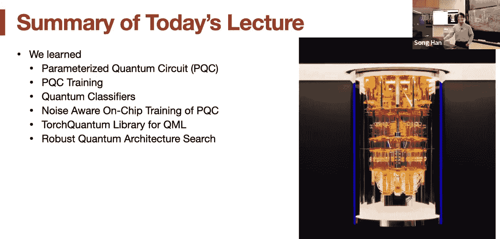

希望本教程能帮助你建立起对量子机器学习更深入的理解。