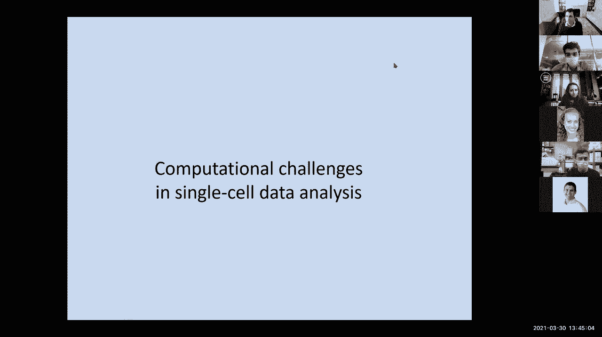
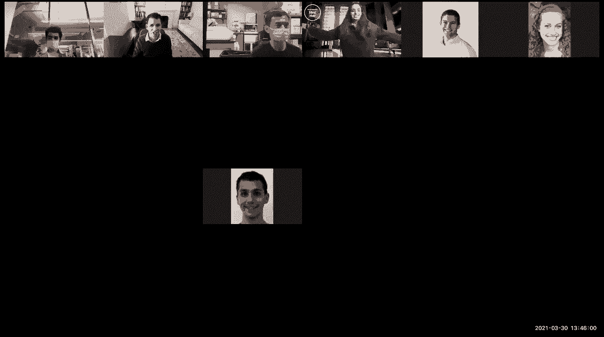
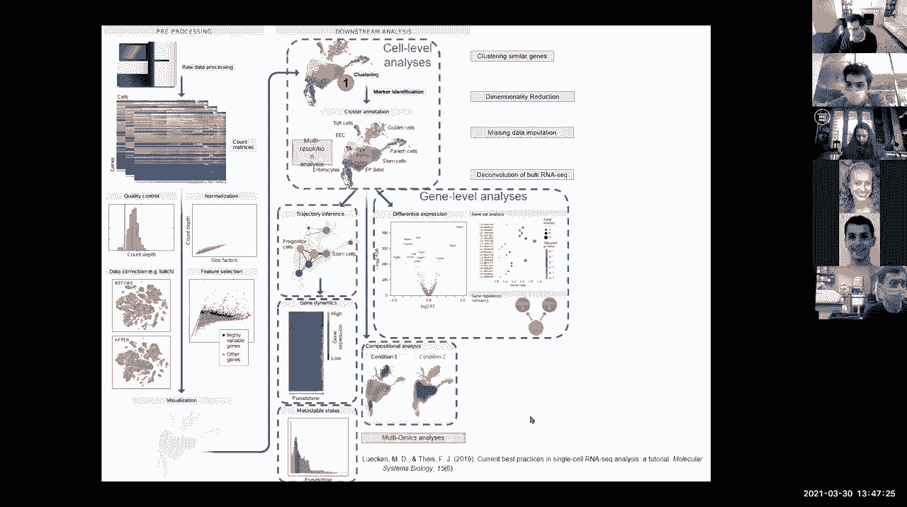
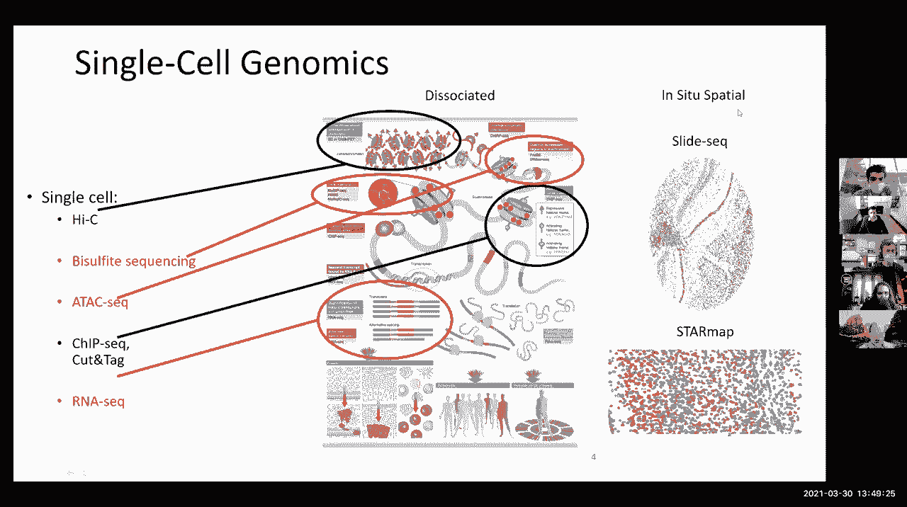
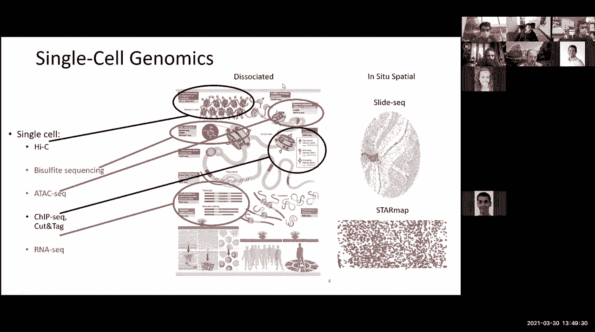
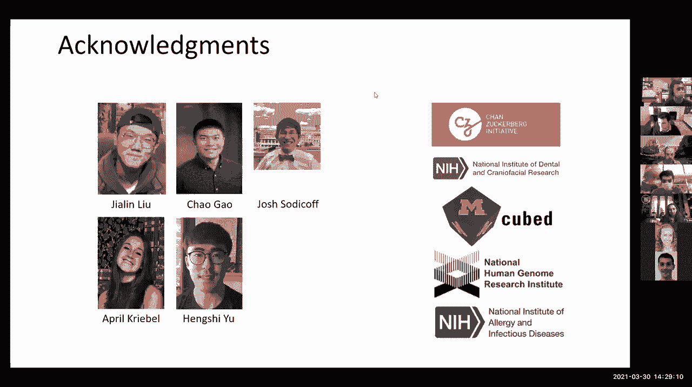
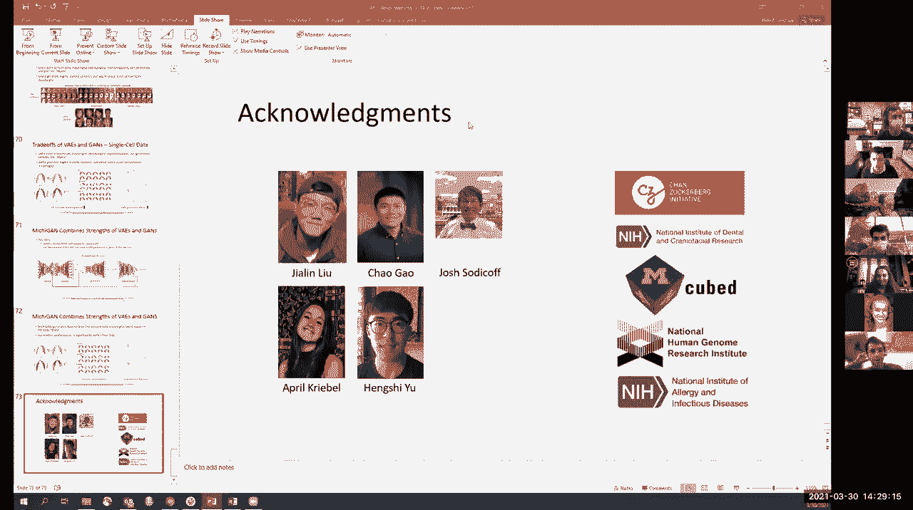
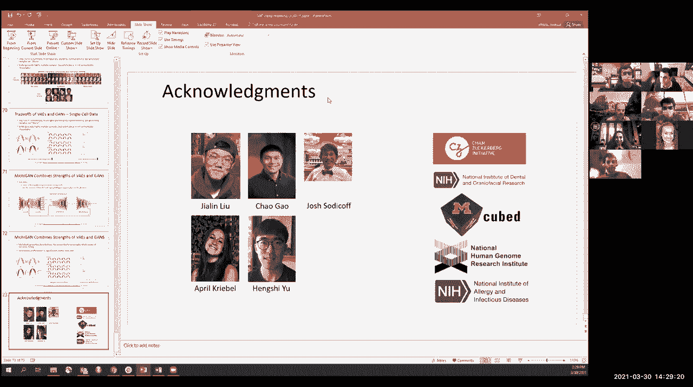

# P11：Lecture 11 - Dimensionality Reduction - 爱可可-爱生活 - BV1wV411q7RE

今天我们将继续讨论单细胞数据分析的主题，具体到降维，我们还有乔希·威尔士的客座演讲，我们将讨论一些监督和非监督的方法，然后一些线性降维和一些非线性降维，然后与深度学习建立关系，呃，嵌入。

正如我们在本节开始时所说的，有基因表达矩阵可以测量成千上万的基因，你知道的，成千上万的实验，所以用单细胞数据，这些矩阵基本上是，你知道的，呃。

可能有一千个或更多的基因在一万个或更多的细胞中在许多不同的条件下，所以你基本上可以把这些矩阵看作是沿着基因的维度，观察给定实验中所有基因的表达模式。

或者一个给定基因在许多不同细胞或许多不同实验中的基因表达谱，我们可以用它来将基因或细胞聚集在一起，或者根据基因表达对不同的细胞类型进行分类，或者基于细胞类型特异性表达的不同基因是什么。

所以我们基本上区分了以前聚类和分类的概念，所以在分类中你问，是什么基因允许我对特定的细胞进行分类，因为我不知道，第四层的神经元或兴奋性神经元，根据星形胶质细胞的基因表达模式。

或者什么是从头开始学习的细胞类型簇，我如何推断细胞类型，新星有时揭示了我们一开始还不了解的星系团，然后我们就可以进去了，然后嗯，发现，呃，后来，所以有了监督学习，你知道课程，你在寻找微分表达式。

而对于无监督学习，你事先不知道课程，我们今天要研究的技术之一是降维，为了揭示这些类，所以经常有监督学习，你在问，在一种细胞类型和另一种细胞类型之间差异表达的基因是什么。

或者在疾病状态下的神经元与疾病状态下的神经元之间，你知道的，非疾病状态，你知道吗，表达式没有差异的空模型，与相关模型相比，其中，比如说，在离对角线上协方差不为零，两个基因实际上是相互关联的。

或者基因在特定情况下发挥作用，所以你基本上可以用呃来评估差异表达的统计意义，这个假设检验框架，也就是问一个假设与另一个假设的对数可能性是多少，解释我们观察到的数据，所以说，这个。

是我们研究过的许多微分表达方法的基础，当然还有，问题是我们如何为微阵列实验建模这些读取计数分布，这与体细胞水平的rna搜索实验有很大的不同，与单细胞RNA搜索实验有很大不同。

所以你应该一直考虑数据的底层分布是什么，以及在数据集中观察到的分布最合适的是什么，例如，批量数据集和单个单元数据集最流行的方法之一，通过将来自每种单元格类型的所有数据聚合到一个伪批量配置文件中。

就是寻求，它实际上使用了这个负二项分布，也就是，的特定表达模式，呃，特定细胞类型或特定体积实验中的所有基因，从一个实际上更接近数据的分布中导出，然后你可以问一个特定基因的平均表达是多少，在特定条件下。

该基因表达的变化是什么，然后你可以在我发现一堆差异表达的基因后问，它们是否在某一特定类别中得到丰富，通过进行超几何测试，它基本上告诉你从该类别中选择K个基因的可能性有多大，在这个范畴之外的n减去k。

鉴于我在我的集群中选择了N个基因，好的，所以你是，你可以通过要求一些，在某一特定类别中至少有那么多，所以我们在整个过程中看到了各种形式的，你总是可以，当然，对于你测试的假设的数量是正确的，利用骨铁校正。

这基本上是在问，考虑到我测试过的假设的数量，我希望超过一定意义的数字是多少，或者你可以做其他类型的更正，专门要求，有多少人超过了特定的门槛，而不是我总共测试了多少，不那么严格的，基本上是在说。

给定我观察到的p值，高于特定p值的测试次数是多少，这是一个不那么严格的，这就是监督学习的全部内容，但是对于无监督的学习，又来了，大量的降维，即使它适用于两者，所以降维有很多不同的原因。

其中之一是整体数据可视化，能够以一种对我们来说直观的方式表示数据集，人类与研究人员，然后可以建立关于数据的直觉，然后对这些数据集进行统计测试，第二个是数据约简，所以我已经和许多团队谈过了。

他们基本上告诉我数据太大了，我该怎么办，一种方法是实际上降低数据的维数，在你应用你的监督学习之前，或无监督学习方法，数据分类，寻找趋势，寻找变异的主要成分，即驱动的因素是什么，数据集的可变性，可以让你。

比如说，区分一种疾病对你的全球基因的影响，表情模式，与男性的影响，女性，与年龄的影响，相对于你知道的批次，等等，诸如此类，所以理解驱动你变化的因素是降维的主要用途，以及简单地降低数据集中的噪声。

能够寻找数据的低维表示，理解噪声通常是一种非常高频的变化，在那些较低的维度中没有捕捉到的，有一个警告，当然啦，其中一些批量效应实际上是全球性的，是，所以它是一个，你知道的，这是一种权衡。

但是测量中的许多噪声不是由全局参数驱动的，使用这些降维方法将有效地减少或有时消除，所以这些例子是，数据中有多少唯一的数据集子集，所以当你做聚类的时候，你可以说好，嗯，似乎有20种细胞类型，或者你知道。

他们中的十五个，我们就可以，我们可以理解，其他五个都是新奇的，让我们更多地了解他们，这些细胞之间有什么相似或不同，我的样本中变异的潜在驱动因素是什么，是否有任何特定的时间趋势或，你知道。

与特定共因子和协变量相关，需要什么测量来区分两个不同的类别，所以这是特征选择的一部分，而是以一种积极学习的方式，你基本上可以说，如果我寻找，区分癌症的最佳方法，你知道，来自非应答者的免疫治疗应答者。

那么我应该在早期进行哪些测量来区分这些，又很有趣，非常非常普遍，我们会问数据有什么有趣的，新样本属于什么子集，这就是降维的意思，它基本上是在问，我可以把我的高维数据投射到一个低维流形中吗，呃。

沿着这个低维空间的变化，所以在这个特殊的情况下，实际数据是嵌入在三维中的，但你实际上可以找到一个低维平面它是通过这个三维空间形成的，数据真正所在的位置，所以如果我想问，这个圆相对于那个圆在哪里。

我宁愿只在那个平面的x y坐标上移动，数据真正所在的位置，而不是拥有完整的三维空间，这将导致空间中不可行的部分，那么什么是流形，它是一个局部相似的拓扑空间，每个点附近的欧几里得空间。

流形中的嵌入是一种结构，流形学习是关于学习一个低维表示，允许这种嵌入，所以这里的概念是，我们将获取非常高维的数据，并了解数据的真实维度，为什么我们要谈论真正的维度。

因为并不是每个基因都是独立于所有其他基因而变化的，基本上，如果你把细胞的基因表达模式拉向，我不知道，对压力的反应，基因不会孤立地做出反应，它们在路径上做出反应，它们在生物学上有意义的群体中做出反应。

这不仅仅是生物数据，所有真实世界的数据都是如此，在哪里，基本上，有一个潜在的真实维度的数据驱动这些关联，好的，所以让我们做一个非常快速的民意调查，呃，到目前为止，谁在跟踪这种多方面的学习，代表权。

有六十七只，十九，十五零，所以学习这些流形有很多方法，所以我们要讨论的第一个方法是线性方法，然后我们将讨论非线性降维，所以最常见的线性降维方法之一是主成分分析，主成分分析基本上要求什么。

数据是否有低维线性投影，这使我能够捕捉到变化的主要来源，在确定性的和可证明的最优中，所以主成分实际上是最大可变性的轴，所以如果你有一个用一堆随机变量测量的人口，这些随机变量表示真实种群所在的坐标系。

我们可能在测量，你知道的，嗯，假设两个不同的基因，但真正潜在的维度是两个基因，你知道彼此正相关或负相关，它们都是不同的，所以就是协变的量，我们感兴趣的是低维嵌入吗，不是整体，你知道吗。

数据集根本没有探索的完整空间，所以我们可以简单地，比如说，旋转轴并识别数据主要沿着此变化驻留，这可能是由接触病原体的数量驱动的，然后另一个变化可能只是，我不知道，细胞的固有或区域状态或类似的东西。

所以要基本上学习这些主要成分，你可以，嗯，一组线性坐标，它是原始空间的变换，所以基本上给定n维空间中的端点，你如何投射到一维空间，然后最小化到那条线的距离平方和，找到通过它投射的最佳线。

它允许快速最小化，假设这条线穿过零，它也是对称的，你不必担心积极和消极，所以传统的方法是，呃，看看这个，数据，那么什么是特征向量，特征向量基本上是变换向量，例如，该向量通过矩阵旋转的变换，剪切，缩放。

etc实际上只是一个线性乘积，原始向量的线性缩放，所以实际上是对这些变换不变的向量，那么问题是，嗯，你知道，什么是，比如说，一组的特征向量，嗯，你知道，数据集，那么你可以很容易地通过求解，你知道的。

从那个确切的定义开始，该向量的矩阵变换实际上是该向量的线性缩放，这意味着矩阵变换减去相同的次数，单位矩阵实际上为零，在m个不同的解下，它是简单的零，取决于方程的真实顺序，对于对称矩阵，特征向量是正交的。

就像你看到的那样，您在上一个示例中看到的，呃，然后实对称矩阵的特征向量是实的，由它定义的正矩阵的特征向量都是非负的，这是特征分解的基础，你基本上是在取一个大的数据矩阵，就是问，你知道。

就像我在第一张幻灯片上给你看的那样，表达式级别是多少，呃，在列中，对于每一个成行的基因，在每一种情况下，以列为单位，你现在可以开始将表达式矩阵分解为变化的主向量，次数，标量，次数，那个矩阵的逆。

所以基本上，如果原始数据是一个具有m个线性无关特征向量的方阵，即无缺陷矩阵，然后存在一个唯一的特征分解，也就是，呃，独一无二，如果特征值本身是不同的，如果特征值不同，那么它只是简单地在特征向量之间翻转。

相同特征值的，然后看相应的特征向量，其中第一个特征向量捕获最高特征值中变化最大的，第二个特征向量，第二多按相应的特征值，等等，等等，所以这个对角线矩阵基本上代表了这些，然后这些，呃，列是特征向量。

相应的标量是特征值，这基本上是捕捉数据集最自然的线性降维，你现在基本上已经把变化的主要维度，你现在可以开始了，这里的主成分，的，特征值，简单地说好，如果我们看看前两个维度的数据集，只是。

您现在有了原始数据集的最佳二维线性投影，最能捕捉原始变体的，如果你想要一个三维物体，你只要看看前三个维度，四维等等，好的，到目前为止谁和我在一起，呃，矩阵的特征值分解，好的，我们现在是七十四分。

所以这一切都很好，但那是为了对称，呃，那是为了，对于一般n乘n矩阵，然后我们就得求助于奇异值分解，所以对于对称矩阵，你基本上有一组u和u逆，它们是相同维度的，但对于非对称矩阵，对于非平方矩阵。

你基本上需要一种不同类型的因式分解，这就是奇异值分解的作用，那么奇异值分解所做的，它基本上说了我基因的特征向量是什么，我的条件的特征向量是什么，它们的组合是什么最能解释数据，所以不是只取一维的分解。

也就是通过这个方阵的对称性，相反，你会问一个维度和另一个维度，所以你基本上要做的是表示你的原始矩阵a，作为m乘m矩阵，n乘n矩阵和n乘n矩阵，所以这个u矩阵的列是a的正交特征向量，转置，y aa转置。

因为它立即变成了方阵，对于V，又是转置A的正交特征向量，它是一个方阵，所以我，乘m乘n，然后呢，转置的特征值是转置a的特征值，它们实际上是奇异值的平方根，所以你最终得到的是一个三向分解。

它再次给出了这里对应于前面特征值的奇异值，然后其他两个矩阵中的奇异向量，思考这一点的方法是，你有效地进行了一个复杂的矩阵运算，也就是，你知道的，把空间剪成并分解，你需要调整一个旋转，因为这是一个方阵。

另一个方阵的另一个旋转，然后缩放，你知道的，特征向量，奇异向量，所以最初的矩阵基本上是应用于x的v星的一系列运算，然后应用于此，然后你应用到那个，所以奇异值分解的优点是它适用于非，方阵，它可以让你，呃。

用你的奇异值表示，最重要维度的顺序，变化的线性维数，您可以以最佳方式将数据投射到其上，的，这里最重要的定理是，奇异值分解可用于计算最优低值，原始数据的秩近似，所以如果你想找一个。

原始n维数据集的维数k的表示，然后你基本上可以说，为了最小化我的原始矩阵U之间的距离，和修改后的低维矩阵，根据这个弗罗贝尼乌斯规范，基本上是欧几里得规范，你知道这里值的平方，使它们都是n个矩阵。

那么最优解实际上是由奇异值分解给出的，这是最优的线性降维，所以这样做的方法是，你保持前k个特征向量，前k个特征值完全不变，然后你只需将剩余的特征值归零，有效地归零剩余特征向量的影响，这就是你知道的。

对于这样一个维度的归纳法的最优解，所以谁和我在一起，奇异值分解的线性降维，然后把k加1归零，一直到剩余的i can值和，有效地消除了剩余特征向量的影响，但这基本上是主成分分析所做的，所以基本上。

这些原理分量正在寻找相应的特征向量，我在MNIST数据集中的矩阵分解，对于你的第一个习题集，这基本上是获取这些像素值并有效地投射它们，以保持这些表示之间距离的方式，所以如果你有，比如说。

以字符零为像素值的所有图像，他们实际上非常接近，呃，第八字，他们非常接近第六个角色，他们实际上离第一个角色很远，它实际上很接近第七个字符等等，等等主成分分析基本上捕捉到了变化的主要线性维度。

这是你用线性投影所能做的最好的事情，非线性尺寸内部缩小允许你有效地做的是，um消除了线性嵌入的一些约束，特别是，这个T分布，随机邻域嵌入是一种聚类数据的方法，在不同的尺度上保持距离。

而不是基本上说所有的距离都是一样的，这就是PCA试图做的，它说得很好，也许一些真正的近端，呃，数字应该更紧密地聚集在一起，比如说，所有的零都非常，非常接近，然后你要走一段距离，在你去六和八之前，等等。

所以也许我想，然后呃，保持近距中所有零的接近性的映射，以及近在咫尺的所有物体的接近程度，但不太关心中长途关系，这就是TSI允许你做的，基本上可以让你把一个非常高的维空间，例如。

每一个基因的表达都有两万维，然后把它映射到一个较低的维空间上，在那里，假设这里最接近的点仍然是这里最接近的点，不用担心更长的距离，所以呃，这个嵌入允许您做什么，定义你关心的距离和距离保持的半径。

您设置了特定的带宽，这样，我们将要测量的条件将有一个固定的，邻居有效数，你可以说我想成为最接近，我最接近的五十个细胞，在那50个最近的细胞之外，我不太担心距离，所以我们要寻找原始的非常高的维空间的投影。

进入一个较低的维空间，在新的较低的维空间中保持这些成对距离，与原来的空间相比，所以您想选择一个嵌入，问题是，这里的概念是，我不在乎数据点去哪里，我只关心相似的数据点彼此接近。

我不在乎在那个非常高的空间里的单个细胞去了哪里，或预计，我只关心有相似表达模式的细胞，在这个一维向量中彼此接近，所以我们要有一个原始距离，这基本上告诉我这些点有多不同，i从点j在其x坐标空间中。

双维原始空间，与所有其他不相同的点相比，所以基本上i和j之间的距离相对于所有其他点的距离，基本上所有的，你知道，我关心的另一点，呃，对于所有对点，你知道，k，呃，l，以及这些数据点在低维空间中有多相似。

你知道的，或多或少相同的公式，然后呢，这里的关键思想是低维嵌入将使用一个学生，t分布，这就是T分布随机邻居嵌入的名称，避免挤迫，所以你基本上把尺寸推出去了，所以基本上高斯分布是蓝色分布。

就是把东西压得很近，但是T分布允许你做的，通过有更宽的尾巴来把东西分散得更远一点，所以说，映射实际上是非线性的，您只需搜索所有可能映射的空间，为了找到它，您基本上可以使用渐变方法来找到这样的嵌入。

并寻找一种最小化成本函数的方法，最大限度地减少原始空间和新空间之间的KL分歧，所以新的低维距离是p j，然后原来的高维距离是q ij，你要找的是这么大的，距离由，呃，你知道的。

小的qijs和小的pjs是由，如果如果小，如果大的PJS是用小的QAS建模的，那么你有一个非常大的惩罚，因此，把遥远的点带到彼此靠近的地方是不可以的，但是把附近的点分开是可以的。

所以当我说最近的点聚集在一起的时候，但中距离实际上可以，你知道吗，推开，那么这个随机分布的，随机邻居嵌入，它保留了数据的局部相似性结构，你在梯度中搜索，你基本上是在试图优化这个低维空间的坐标，y。

通过取这个成本函数的梯度，相对于你如何投射数据，所以你基本上是在搜索可能的投影空间，通过看这个成本函数和导数，基本上是，你知道这些距离和这里的原点之间的距离，好的，所以这让你可以有效地搜索。

这样一种低维嵌入，这些，呃，局部的相似性实际上会被保留下来，因此，当您将相同的方法应用于相同的原始像素时，MNIST的明智数据，你知道的，手写数字，数据集，你看到的是零最终形成了一个非常，非常紧的簇。

尽管其中一些实际上与六非常相似，这实际上被推到了一边，艾滋病被推到了一边，所以6、8和0都在空间的同一部分，原来是我们现在失去的东西，但我们不在乎这些全球距离，相反，我们关心的是这些距离的局部相似性。

所以我们基本上优化了这个投影空间，这是一个非线性的，呃，嵌入非线性二维，这个非常高的二维向量的嵌入，或，你知道吗，九十六乘九十六像素矢量，通过保持这些局部距离而不是这些全局距离，当事情是，呃，散开。

即使他们很亲近，但不惩罚中距离的东西，所以让我们看看谁和我在一起，在迪斯尼基本上是这个TD条，我们做了随机邻居嵌入，基本上采取了一个非常高的维空间，将其投射到较低的维空间，优化低维空间，这样，这样。

保留了原始距离函数和新距离函数之间的KL发散度，但特别是为了保持彼此的局部距离，好的，我们五点，四，三个，八，八，零，零，所以这是很多，嗯，围绕单个单元格数据集的可视化。

所以基本上当你开始考虑你的单细胞数据时，对于您的许多项目，您将使用TSI或UMAP，或其他随机嵌入到较低维空间，所以在这些中有很多参数很重要，呃，嵌入，所以基本上，如果你看看有多少邻居的距离，我认为。

如果你只考虑两个邻居，然后你会发现你根本没有捕捉到数据的原始结构，如果你考虑到邻居太多，比如说，一百个邻居，那你就知道蓝点接近一百分，嗯，都是一样的，所以你不会，你没有任何信息，要么考虑的邻居太多。

要么考虑的邻居太少，但如果你考虑到5个邻居或30个邻居或50个邻居，然后你捕捉那些局部结构，如果你也采取很少的步骤，你可能找不到最优的结构，你会看到当算法在那个空间中搜索时，y，保持这些距离的地方。

它就会，有时候，你知道的，把东西折叠成完全相同的点，然后再把它们铺开，所以你可以玩这个投影的步数，当你取梯度相对于你的数据的维数，如果查看原始群集的大小。

所以基本上如果原始数据有非常分散的集群或非常紧密的集群，这对迪斯尼来说真的不重要，它基本上简单地说，嗯，你知道最近的50个邻居都是一样的，不管它们在原来的空间里是如何分散或浓缩的。

所以这是方法不变的东西，至于集群之间的距离，就像我之前用零给你看的那样，六和八，真的没关系，如果您的原始数据是蓝色的，接近黄色，接近绿色，它可能，它可以走任何路，一次又一次，那是因为我们选择了一组邻居。

作为搜索半径，我们是，呃，我们正在比较的，然后有时可能会出现假集群，如果你一次看到两个邻居等等，诸如此类，但随着正确的困惑程度，它这个，呃允许你对此保持不变，一次又一次，呃。

你知道这些关系会被很好地捕捉到如果你看5点或30点，但有时它们会丢失，如果你没有看正确的距离，一次又一次，呃，你知道的，我真的鼓励你玩这个，你可以，呃基本上尝试不同的，困惑，尝试不同的。

然后看看您的数据是如何沿着这些不同的维度变化的，呃通过去这里，所有的权利，所以约书亚，你在吗，呃，让我们看看，我们正在等待一位客座讲师的到来。

呃，乔希，你在吗，我想他还没到，好的，呃，让我，呃，所有的权利，拉伸断裂，我们能不能，呃有点让人伸展而，我在找我们的客人，就像这个实际上等一下。

我很抱歉，我你知道，我们实际上会继续讲座，嗯，对不起，所以我希望人们在他们的，呃头，至少，然后嗯，乔希很快就会加入我们，所有的权利，所以上次我们谈了很多，所以我想简单介绍一下他的方法，听他的讲座。

上次我们谈到，嗯，现在我们关注的是数据的低维投影的概念，线性或非线性，这让我们能够真正了解细胞类型的特定集群，所以这通常是第一步，呃，嘿，乔希，呃，你准备好了，你准备好了。

然后你可以进行基因水平分析或轨迹水平分析，或者你知道动力学，或者了解状态和条件，我们今天要听到的是，来自乔希的是，我们如何不仅获取一种类型的数据集，但是我们如何获取单细胞RNA数据和单细胞攻击数据。

和许多不同类型的组学数据，并将它们共同投射到低维数据集中，在其中我们可以将它们相互匹配。

所以乔希，我看到你在那里，呃，你介意分享你的屏幕吗，然后嗯，开始你的客座讲座，所以我要把聊天。

幻灯片的链接，所有的权利，把它拿走，乔希，谢谢，所有的权利，幻灯片通过了吗，是的，太好了，我们明白你的意思了，真的很棒，谢谢下午好，谢谢大家的邀请，所以嗯，我很高兴今天能和你谈话，如果我必须总结什么。

我要用一个想法告诉你，关键的想法是我们将尝试学习细胞身份的表征，通过集成单细胞多组数据集，我将向你展示我们做到这一点的几种方法，用我开发的一些方法，所以我会给你一些动机方面的背景知识，我长话短说。

因为我知道你们已经听说过一些单细胞技术和方法，然后我将介绍狮虎方法，一种积分非负矩阵分解，我将告诉你一种放大imf算法的方法，利用在线学习，然后我会告诉你最近正在进行的几个项目。

集成具有部分重叠特征的数据集，并将变分自动编码器和生成对抗网络结合起来，生成单细胞学习配置文件，所以嗯，就像你一样，呃，在过去的几次讲座中听到了，您可以在单个单元格中执行许多类型的测量。

您可以从分离的单元格执行它们，这是最常见的单细胞测量方法，或者你可以用C2来做空间测量。

用空间坐标，从分离的细胞中提取。

你可以用单细胞来测量基因表达，rna搜索，你可以测量组蛋白修饰或转录因子结合，使用芯片搜索或切割和标记或切割和运行，你可以测量染色质的可达性，或DNA甲基化或染色质构象，和我用红色着色的模式。

以下是我将关注的问题，然后嗯，除了从孤立的细胞中获取信息，知道空间坐标真的很有用，这样你就可以将分子信息映射回它的组织上下文中，有几个协议可以做到这一点，最明显的是用于转录组测量。

但越来越多的人也在努力测量空间分辨率上的其他东西，所以传统上，细胞类型已经被定义在我称之为定性的方式，基于粗大形态学等属性，或者几个细胞表面标记的存在或不存在，或容易观察到的表型特性，但是。

所有这些单细胞测量的可用性，提供了一个向细胞身份的定量定义迈进的机会，其中使用单细胞分辨率的分子和其他类型的信息，以无偏见的方式以定量的方式重新定义细胞类型，人们正在努力以这种方式使用单细胞技术。

比如人类细胞图谱和大脑倡议在这方面做出了一些努力，中心地图项目和其他，因此，这些问题和数据类型提出了许多分析挑战，我选了这里的，呃，与我将告诉你们的方法最直接相关的问题，所以首先。

有大量的测量跨越条件物种，组织，如果我们说的是细胞同一性，这真的不仅仅是一个离散的现象，但细胞变异也有连续的方面，有技术上的混杂物和生物信号混合在一起，有多种类型的数据测量不同类型的特征。

但通常每个单元只有一种测量类型，因此，为了应对其中的一些挑战，我开发了一个叫做liger的工具，它是基于积分非负矩阵因式分解的，这种类型分析的起点是两个或多个单个单元格数据集。

具有一组共同的G基因水平特征，这些可能是跨多个个体或跨物种的单细胞rna搜索数据集，或者这些也可以是不同方式的测量，如基因表达和表观基因组，呃，在空间测量中的测量甚至分离，但它们都必须共享一组共同的g。

g，模型特征，为了将这些多个数据集集成在一起，我们采用的方法是进行积分非负矩阵因式分解，我稍后会更多地讨论，但首先我想激励一下，为什么，我们转向非负矩阵因式分解方法的一些原因。

其中一个原因是因为MF收益率，有时被称为基于部件的分解，这是一个在原文中注明的属性，呃，1999年发表在《自然》杂志上的NMF论文，李成展示的例子是，如果对一组人脸图像执行NMF。

你可以用和MF得到一个非常相似的面部重建，和更常见的经典的PCA方法，所以重建看起来很相似，但如果你看看所用的碱基，或者是通过NMF和PCA学习的，它们有非常不同的性质。

PCA的基础是你可以被描述为整体，你可以把每个主成分看作一个特征面，而基的NMF表示分解为几个部分，所以各个部分突出了面部的不同部分，所以这部分来自于非负性约束，在NF中脱离了，因此。

如果我们将基于nmf的方法应用于基因组数据或，其中特征是基因，那么你可以把NF因子解释为元基因，元基因是一组共表达基因或共调控基因，你可以把这些看作是生物途径或细胞类型特定的基因。

它们还可以捕捉技术因素，正如我将在一分钟内展示的那样，所以在高水平上，应用于基因组数据的NMF方法的作用，它是首先将基因组合成元基因吗，然后在单细胞数据的情况下汇总每个细胞的表达，利用这些元基因。

所以你可以把每个因素都想象成，告诉每个基因对每个元基因的贡献，然后计算每个元基因的自我因子，相应的元基因表达水平，每个，所以所以嗯，我们在Lager工具中使用NMF方法，然后嗯。

我们表演的F类型的独特之处在于什么，每个元基因都有一个共享的和一个数据集特定的组成部分，它是共享组件，在所有数据集上具有相同的负载，但是数据集特定组件允许每个数据集，向共享组件添加唯一权重，所以直觉上。

这给了我们一组因素，在数据集中代表相同的生物信号，并确定，呃，信号是如何变化的，所以回到，我在细胞身份定量定义开始时发布的框架，我们可以认为这些元基因提供了细胞身份的定量定义。

以及它如何在数据集和生物背景下变化，然后在执行这个联合因式分解之后，我们可以使用细胞因子负载，我在这里显示的是h来执行分位数归一化和联合聚类，识别细胞，跨多个数据集对应的单元格类型和单元格状态，然后嗯。

由于，非负性约束和继承这一基于部分的概念，自然与MF，我们能够学习，嗯，可解释的元基因可以让我们对生物学有很多了解，跨多个单单元数据集，所以作为一个简单的例子，因数，两个。

8来自这个特定的单单元数据集在这个特定的单元集群上负载最强，这是大脑的数据集，我一会儿会更多地谈论这一点，但是这里的元基因代表了细胞类型，定义这种特殊细胞类型的特定基因，如果我们看看数据集。

跨多个个体学习的特定元基因，我们可以看到他们向我们展示，这种细胞类型特异性信号在供体中的变化方式，在这种情况下，原来这是有一定意义的，与这些捐赠者的生物学和背景有关，我稍后会讲到。

我们可以获得很多关于细胞身份的见解，以及不同数据集是如何相似和不同的，这些元基因可解释性的另一大优势是它们可以识别技术信号，让我们从数据集中的生物信号中解构它们，所以一个共同的变异来源，嗯。

在单细胞数据集中，这是一种讨厌的东西，是线粒体基因的整体表达，还有这个，当技术变化的来源出现时，细胞在测序过程中受到不同的压力，因为线粒体有点坚韧，它们保护线粒体RNA，因此，在这个特定的数据集中。

因子11显示出非常，呃，所有集群中的高负载，但是嗯，尤其是在星系团的一些角落，可以这么说，如果你看看这个因素上的顶部加载基因，原来都是线粒体基因，如果我们把这个因素包括在下游分析中。

我们可能会错误地得出结论，这里的这些细胞代表了一种不同的细胞类型，在现实中，它们的主要特征是它们有很高的线粒体基因表达，所以通过去除这个因素，我们可以转移这种技术变异来源的影响，好的，所以现在。

我将简单地告诉你们我们实际上是如何解决f项优化问题的，在数学上，所以嗯，这是目标函数，就像所有的NMF问题一样，它在所有参数的共同作用下都是非凸的，但是嗯，如果你把其中一个矩阵块固定住。

那么优化问题是凸的，因为一个抓住了其他的，把其他人固定住，因此，国际货币基金组织最初的实施使用了乘法更新，这是一种启发式的计算方法，UM更新以了解参数，但是嗯，我们导出了一种基于块坐标下降的新算法。

它有一些显著的优势，并给了我们一个收敛保证，保证该方法收敛到局部最小值，这是你在非凸问题中所能希望的最好结果，特别是，块坐标下降算法在实际应用中收敛速度非常快，由于优化问题的特殊结构，所以简而言之。

我们解决这个问题的方法是对每一个矩阵块和参数，共享的元基因，每个区块的数据集特定的元基因和h本身因子，我们把其他的修好，然后通过解决一个非负平方问题来更新剩余的块。

我们用一种非常有效的算法来解决这个问题，所以总体来说，整个策略在计算上是相当有效的，可以扩展到数千个基因和数十万个细胞，将每个单元格分配给它具有最高负载的因子，这给出了一种联合聚类分配。

因为每个因素在数据集上都有相同的解释，然后我们在下游执行几个步骤，为了增加分析的总体鲁棒性，我们使用单元格因子在每个数据集中建立一个k个最近邻图，然后将每个单元格的最大因子分配设置为其邻居的模式。

这基本上消除了最大因子分配中的任何错误，因为附近所有细胞的几率，得到错误的任务相对较小，然后我们对单元格因子负载执行最后的分位数归一化步骤，以便跨数据集的单元格使用它们的单元格因子负载直接可比。

然后在那之后量子归一化的最后一步，您可以使用这些因素进行下游分析，像聚类或可视化，所以现在，我将给你们看几个简短的例子，您可以使用这种方法执行的分析种类，第一个是。

整合单细胞rna在人类捐赠者中寻找数据，这是我们为2019年的论文生成的数据集，我们对七个人类捐赠者的巨大尼亚加拉进行了测序，这是大脑中产生多巴胺的部分，它有很多呃，疾病相关性，使用单细胞方法，所以嗯。

如果我们只做一个标准的单个数据集，单细胞rna搜索分析，细胞完全由人类供体聚集，因为这些捐赠者的年龄、性别和背景有很大的差异，但在用imf联合学习细胞因子后，能够将细胞聚集在一起。

使它们按细胞类型而不是按捐赠者聚集在一起，我们可以识别实体的主要细胞类型，然后呢，正如我一分钟前在我的例子中提到的，我们可以查看共享和数据集特定的元基因，真正了解人类捐赠者的细胞是如何相似和不同的。

我们发现的一个有趣的事情是，如果我们观察小胶质细胞和星形胶质细胞，我们可以看到一些数据集特定的术语，呃，与第五名受试者脑损伤反应相关的基因，八，两个，八，第五名受试者的um蛋白错误折叠，八四十。

当我们回去查看这些捐赠者的元数据时，原来五个，八，两个，八人死于头部外伤，五十，840在死后被诊断为脑淀粉样蛋白自体病，这是一种蛋白质错误折叠的疾病，所以嗯，这显示了这些元是如何。

基因因子可以让你了解细胞状态和细胞特性的变化，在这些数据集中，呃是整合空间和分离细胞数据集，我们使用了老鼠大脑的数据集，来自单细胞rna搜索和使用星图测量的相同大脑区域，这是一个空间转录组学协议。

这两种数据类型具有互补的属性，单细胞rna搜索数据没有空间坐标，但它测量所有的基因，反过来说，星图数据只测量选定的基因子集，但你有每个观察到的转录物在组织中的空间位置，因此。

通过将这两种数据类型放在一起，我们可以识别组织中细胞类型的空间位置，并估算空间，空间数据集中未测量基因的空间分辨基因表达，所以嗯，当我们这样做的时候，使用两个数据集之间共享的基因集。

我们能够联合聚集细胞，在两种数据类型之间标识一组公共群集，然后通过回看用星图测量的细胞的原始um空间位置，我们能够直观地看到这些细胞类型在组织中的位置，让人放心的是，如果您在每个集群中查看。

两种技术关键标记基因的表达非常一致，知道细胞类型的空间位置是很重要的，因为它可以开始告诉你一些关于问题架构的事情，在大脑的背景下，这对于了解神经回路是如何，神经元如何在神经回路中协同工作，所以说。

我们在这里发现的一个有趣和有点令人惊讶的事情的例子，我们发现星形胶质细胞有两种亚型，当我们观察这两个星系团的空间位置时，其中一个有这种奇怪的图案，这个集群中的细胞只位于皮层的外侧。

并查看一些具有空间分辨率的正交数据类型，我们能够确认这似乎是一个真正的生物学，所以嗯，这些GFAP，阳性星形胶质细胞在皮层外侧有这个特殊的空间位置，而位于皮层内的星形胶质细胞主要是MF，g，e，八亚型。

所以说，嗯另一个真的嗯，这种单细胞数据集成的重要应用是集成多个，来自单个样式的OMIC数据集，这是一个特别独特和具有挑战性的问题，因为您在这里开始的数据集既不共享实例也不共享特性。

所以你的开始数据矩阵有这样，在出租车的情况下，和rna搜索峰值具有攻击搜索数据的特征，和G基因用于rna查找数据，测量是在不同的细胞中进行的，这些细胞在实验中没有直接对应，所以为了链接这些数据集。

我们首先执行一个伪表达计算步骤，在这个步骤中，我们将表观基因组数据，呃，基因水平的特征，以这样一种方式，每个呃，基因um表观遗传状态，呃，被概括为一个与基因表达相关的量，对于攻击，查找数据。

我们为此尝试了几种策略，事实证明，最有效的方法是简单地数数，有多少可访问的读数落在启动子或基因体上，对于每一个甲基化数据，你可以通过计算启动子甲基化来做类似的事情，或基因体甲基化，在这之后。

我们有了共享相同特征集的输入矩阵，基因和不同的细胞，在做了这个伪表达式计算之后，我们可以再次进行积分非负矩阵因式分解，呃，集成数据集和链接，将转录组和表观基因组图谱联系起来。

所以我们用老鼠皮层的数据来做这个，这里的例子来自单细胞RNA，seq与单细胞dna甲基化测序，我们确认了，两者之间一组非常明确对应的单元格类型，嗯，这些标签和我们的联合标签很相配。

与基因表达和甲基化数据集的公布标签匹配良好，有一件事很有趣，我们能够从甲基化数据中识别出一些细胞类型，以前有模棱两可的标签，嗯，因为有更多已知的细胞类型标记，是基因表达或蛋白质标记，而不是甲基化标记。

因此，通过将甲基化数据与基因表达联系起来，我们能够更好地注释细胞类型，我们也可以用单细胞RNA进行这种分析，SEQ和单细胞攻击座椅数据，这里有一个例子，我们是如何用人类骨髓数据来做到这一点的。

正如我提到的，为了做到这一点，以便链接这些数据类型，你需要计算表观遗传数据的基因体和启动子的读数，这样你就有了每个基因的伪表达量，有一件事，呃，真的，把这些类型的数据放在一起是一个巨大的胜利。

你可以开始把表观基因组状态和单个基因的基因表达状态联系起来，在同一细胞内，这让你可以开始，提名基因间调节元件，可能调节附近基因的表达状态，所以作为一个例子，我们在这里发现了攻击的几个高峰寻求数据。

显示非常单元格类型特定的可访问性模式，这些峰的可达性与邻近基因的表达密切相关，所以只要计算用MF链接的链接单元格之间的简单相关性，我们能够预测这些基因峰值链接，并开始指定细胞类型特定的调节元件。

所以如果你看看这些基因区域之一的可及性，你可以看到它是非常特定于细胞类型的，并与邻近基因的表达高度相关，这是对利格和积分非负矩阵因式分解的快速浏览，以及一些可以应用于，定义跨不同上下文的细胞身份。

而现在，我要告诉你，我们扩展这种方法的几种方式，第一个是通过创建一个在线学习算法来解决国际货币基金组织的问题，它允许我们扩展到越来越大的数据集，所以网上学习的想法，如果你不熟悉，您可以增量地更新计算。

当新数据以流式方式到达时，因此，在单细胞数据的上下文中，有几个不同的场景是有用的，第一个场景是您有多个大型数据集，所以让我们说你，你试图分析笔记本电脑上的数据集，你有固定的记忆。

我们以前为解决imf优化问题而开发的方法，要求您将整个数据集存储在内存中，并在算法的每次迭代中使用每个数据点，但是有了在线学习算法，我们可以将数据随机分成固定大小的小批，我们一次只需要装载和使用一小批。

当我们执行权重的迭代更新时，我们在算法中学习的，所以在场景一中，如果你有非常大的数据集，但仍然可以完全观察到，换句话说，他们不是动态到达的，您可以使用这种迷你批处理方法，以避免将整个数据集存储在内存中。

它也会聚得更快，因为算法的每次更新都不需要每个数据点，另一个非常有用的场景，我们称之为场景二，这就是你有大量数据集的地方，这些数据集以流式的方式到达，一个现实世界中可能发生这种情况的例子，就是。

如果你有一个大财团，努力生成整个有机体或组织的图谱，我马上给你举一个大脑的例子，这在实践中是如何发生的，所以在这个场景中，以前的办法，需要您从头开始重新分析所有数据集，每次联盟生成新的数据集。

而在线学习算法允许你简单地将新的数据集，因为它到达时没有重新访问以前的任何数据集，然后场景三是您有一个精心策划的现有数据集，您希望使用从以前的数据集中了解到的权重，将新的数据集投射到引用中，因此。

这三种情况在不同的情况下都很有用，我们方法的另一大优势是，正如我提到的，您不必存储数据集，但是，您甚至根本不必下载数据集，到硬盘上，所以我们，我们展示了，多个用户可以分析相同数据的单个副本。

通过Internet流式迷你批设置，所以只说几句这种方法背后的计算机科学，我们利用了机器学习论文杂志上的一些现有理论，开发了一种在线词典学习的方法，NF是这个更普遍的问题的一个特例，称为字典学习，和。

这篇论文的关键见解是，您可以派生一个用于字典学习的自定义在线学习算法，通过优化渐近收敛的代理函数，根据参数与原始目标函数相同的解，嗯，在收敛性方面，这个解有一些很好的性质。

因为它是专门为字典学习问题量身定做的，你实际上可以有一些非常强的收敛保证，你不能仅仅用，对于I NMF优化问题也是如此，我们可以写出这个代理函数的一个稍微修改的版本，这是为我们的特定目标量身定做的。

然后嗯，计算允许我们优化代理函数的更新，当新的迷你批数据到达时迭代，下面是整个算法的概述，基本思想是从数据中随机抽取一个迷你批，然后计算单元格因子负载，根据你目前对元基因的最佳猜测，在这种情况下是字典。

然后呢，一个技巧可以让您避免将以前的所有数据点存储在内存中，字典的更新，嗯，仅依赖于来自先前看到的数据点的单元格因子负载之间的内积，因此，通过增量计算这个矩阵产品，就像你看到的每个迷你批一样。

您可以避免存储表达式级别，以前数据集的单元格因子加载，这在实际中效果很好，它有我提到的内存优势，但它也收敛得更快，因为数据集越大，每个附加单元的冗余度就越大。

所以你不需要看到算法的每一个单元格和每一次更新，为了快速收敛，这是一个来自老鼠大脑的大数据集的例子，表明如果你随着时间的推移观察目标函数，与批处理设置相比，在线设置的收敛速度非常快。

或者如果运行给定的固定时间，在那段时间之后，目标函数要低得多，使用在线算法比使用批处理算法，所以我们做了一个基准与其他一些广泛使用的方法，包括Harmony和Serrat以及我们以前发表的方法。

我们发现内存使用确实是一个很大的优势，嗯，与其他方法相比，它在时间上也非常有效，和，嗯，我们能够用这种方法在2-5分钟内处理300万个细胞，在我学生的笔记本电脑上使用500兆字节的RAM。

而如果你想用其他方法做同样的分析，您必须使用一些相当大的内存计算节点，和大量的时间来运行相同的分析，作为一个例子，嗯，我提到的迭代细化能力，我称之为场景，在线学习的两个。

我们使用大脑倡议细胞普查网络生成的数据，我们是其中的一员，财团产生了，来自小鼠大脑单个区域的一组数据集，在运动皮层，四个实验室在两年内使用五种协议生成了八个数据集，所以这是一个持续的过程，每隔几个月。

一个实验室将生成另一个数据集并上传与财团共享，所以每个人都是分析数据的人，每次数据集到达时都必须重新运行他们的分析，从而展示这种迭代细化能力的优势，我们按时间顺序排列了数据集，它们是在其中生成的。

并将它们一个接一个地合并到因式分解中，使用这个在线算法，所以我在这里展示的是，你是在绘制细胞因子负载的图吗，当一个新的数据集到达时，这种迭代细化的每一步，你可以看到随着细胞数量的增加。

您可以区分的集群数量增加，每个连续的数据集与以前的数据集很好地对齐，这个特别酷的地方是什么，就是，它与rna数据集甲基化和攻击数据集一起工作，所以说，该联盟产生的前六个数据集是rna数据集。

然后生成攻击寻道数据集和甲基化数据集，所以我们也能够逐渐地融入，他们对齐得很好，我们能够，在最后，使用所有数据集和模式联合聚类，事实证明，如果你重新运行分析，使用其他两种方案中的任何一种。

所以在场景一中一次使用所有的数据集，或者用场景三投射后面的数据集，而不更新元基因，你会得到非常相似的结果，哪个让人放心又好，好的，嗯，所以现在我要稍微换档。

并讨论如何将国际货币基金组织的算法扩展到这种情况，在哪里，嗯你的，你的特征部分重叠，这是一个不寻常的案例，呃，在数据集成方面，但这产生了一个有趣的计算问题，所以问题是。

对于许多我们希望集成单个单元格数据集的情况，我们要联合分解的矩阵，没有相同数量的细胞，行，或列中相同数量的特性，以前人们通过，只是，呃，通过我提到的伪表达式计算，迫使特征对齐以重合。

但更令人满意的方法是，至，以某种方式能够利用跨数据集的共享和非共享特性，所以要做到这一点，我们修改了I，MF算法，这样你就可以计算一个元基因矩阵，它对应于每个数据集的非共享特性和共享特性，和，嗯。

这里的框图显示了矩阵的所有维度是如何计算的，最后，这允许您利用数据集中存在的所有特性，作为一个具体的例子，如果我们整合rna seq和攻击搜索数据，rna搜索数据只有以基因为中心的特征。

攻击寻迹数据既有基因间峰又有基因间峰，重叠基因和启动子，所以以前，我们只能利用攻击搜索数据中的基因中心特征，但有了这个算法，我们也可以利用基因峰，这种类型的um设置的另一个常见例子是我们有目标基因。

其中空间转录组协议只测量基因的子集，而RNA SEQ数据集测量所有基因，事实证明，这个扩展有很大的不同，在某些情况下，下面是一个集成空间抄本组态数据集的示例。

用一个单细胞rna搜索数据集只测量30个基因，左边是我们用前面的算法得到的，右边是我们通过算法得到的，它结合了未共享的特征，这对你解决的能力有很大的影响，嗯，然后只是简单地。

因为这是一门专注于深度学习的课程，我想介绍一下我的团队刚刚发布的最新预印本，嗯，这项工作的动机是建立生成模型，UM从单细胞表达数据生成逼真的细胞轮廓，然后嗯。

就像你在谈论Vaes和Gans时可能学到的那样，这些是非常不同的方法，有互补的优势和劣势，然后呃，Vies真的很擅长学习有意义的表示，但不擅长生成现实的例子，反过来，甘斯能生成非常逼真的样本。

但是潜在的空间在语义上没有意义，所以如果你，如果你取VAE的一个特定维度，潜在的空间，并沿着那个维度插值，生成的图像在一个语义因素变化中变化，比如说，肤色、亮度或刘海的存在，反过来。

如果你在太空中穿越甘光的一维，生成的图像是如何变化的，没有韵律或理由，所以所有这些共同的智慧都来自图像数据，但尚不清楚同样的属性是否适用于单个单元格数据，所以我们做了一些基准测试，我们发现以同样的方式。

当GAN应用于单细胞数据时，它们会产生更好的样本，所以不讲细节，这里是为了时间，我们开发了一种结合AES和GAN优势的方法，我们努力想出一个以甘斯结尾的好首字母缩写，所以我们把它叫做密歇根。

因为我们的机构，密歇根的主要思想是你首先训练一个VAE，在本例中，我们使用了全相关变分自动编码器，它在目标中有一个额外的术语，鼓励解开纠缠，然后训练完一个vae，你固定VAE编码器的重量。

它允许您获得每个数据点的表示形式，然后您使用该表示作为代码来训练条件GAN，然后本质上，你用游戏的生成器网络替换你的VAE的解码器，这个简单的策略真的很强大，因为它给了你VAE的解纠缠性能。

以及甘的世代表现，而以前对这两个中的几个一起使用的方法真的破坏了训练的稳定，所以如果你有兴趣了解更多关于它的信息，你可以在这里看到幻灯片底部的预印本，我认为这些类型的生成模型有很多令人兴奋的应用。

操纵和预测细胞特性变化的影响，所以我就结束了，这里是贡献了我在这里提到的工作的学生。

我很乐意回答任何问题。

非常感谢，我们总是问我们的嘉宾演讲者的一件事是，你是否有兴趣为任何学生做导师。

对空间感兴趣的人，也伸出援手，如果你有兴趣，非常的酷，再次感谢你的精彩演讲，所以呃，让我们看看，呃，让我们做一个快速的民意调查，哦不，我不再登录了，所以你不能再停顿了，但给我竖起大拇指。

如果你们觉得自己学到了一些很棒的东西，好厉害，非常感谢你的精彩演讲，乔希再见。

