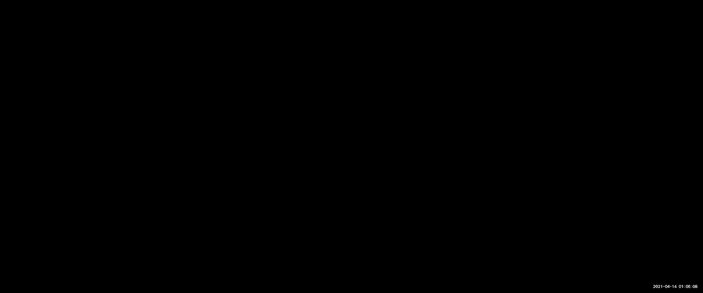
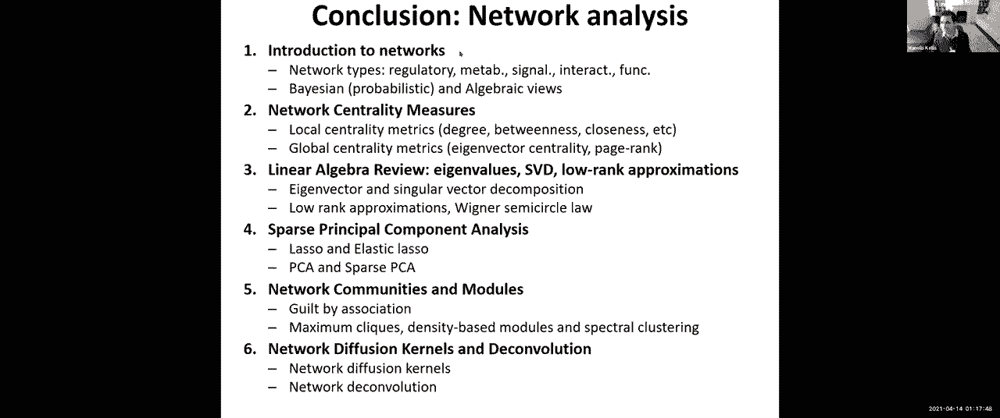
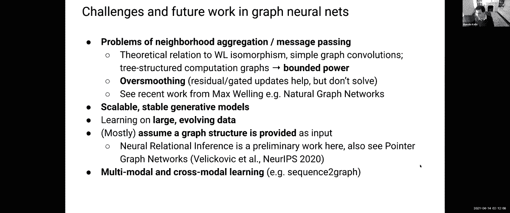
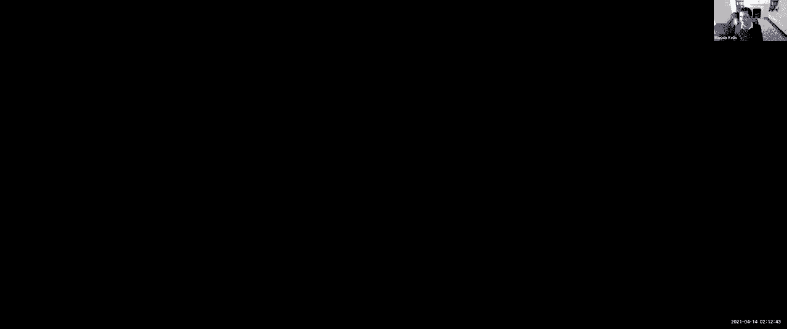
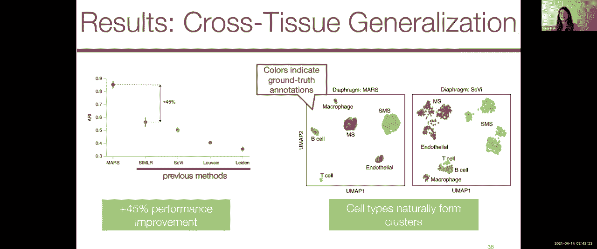

# P15：Lecture 15 - Graph Neural Networks - 爱可可-爱生活 - BV1wV411q7RE

所有的权利，所以今天欢迎大家，我们说的是图神经网络，我们将讨论图和网络的一些基础，然后潜入图神经网络，蛋白质，蛋白质相互作用及图表，我们将有两个客座讲座，作者：尼尔·班德、玛丽亚·巴克和尤里·莱高。

我们已经报道了很多，我们在第一个模块中讨论了机器学习模型和解释，所以我们讨论卷积神经网络，递归神经网络，图神经网络简介，然后降维和生成模型，在第二个模块中，我们谈到了基因调控，dna可达性。

预测启动子和增强子，使用监管主题，我们研究转录因子结合，表观基因组学，基因表达，单细胞RNA分析及其他单细胞分析，然后在模块三，我们谈到了降维，迪斯尼，非负主要因式分解，以及遗传学和变体召唤。

不变解释与表达，数量性状基因座，如何利用中间分子表型理解因果关系，以及如何在大型数据库中集成电子健康记录和基因组数据，所以我们已经涵盖了三个模块，我们现在在第四个关于图形和蛋白质的模块上。

我们今天星期四和下星期四有三节课，所以星期二是班级假期，所以我们我们道歉，我们的家庭作业推迟到4月19日，所以这违反了一些规则，所以我们要在广场上弄清楚，怎么呃，把这个弄清楚。

因为即使在假期后做也是个坏主意，我们接到通知，所以我们最终可能无法给予延期，但我们会和学生们一起找出答案，之后我们将进行小测验，所以这将是一个课堂小测验，小测验的目的是让你们学会。

所以我们覆盖所有这些材料的原因，为什么我们有这么多，呃，习题集和练习，甚至所有的团队项目，真的是让你们拥抱这个新领域，并能够在这个新领域富有成效，所以嗯和RTS一起工作，去康复中心。

观看讲座和休息站的录音视频，浏览一下我们张贴的文件，仔细检查你的家庭作业，这真的是准备测验的最好方法，所以没有，不会有惊喜，我们的目标不是欺骗你，给你惊喜，涵盖我们在讲座或恢复中不会涉及的东西。

或者在p集中，目标是让你有机会和助教一起复习材料，为你嵌入材料，好的，测验结束后，我们将进入最后一个成像模块，最后一个正式的模块，接下来的几节课将是关于前沿的，还有你自己的最后陈述。

所以今天我们开始关于图形和蛋白质的模块，我们将有一系列关于蛋白质的超级棒的客座讲座，结构与药物设计，今天我们将介绍图分析的基础，然后我们如何利用，我们已经学会的所有这些深度学习方法。

真正从生物网络中获得洞察力，最常见的生物网络将在蛋白质的空间里，蛋白质折叠空间中蛋白质相互作用的位置，然后呃，药物设计，我们也很幸运，明天阿尔法折叠团队实际上要在麻省理工学院做一个讲座。

所以我把这个加到你的日历上了，所以对于那些在谷歌日历上的班级日历中的人来说，你已经可以找到链接了，但是阿尔法折叠就像你知道的，蛋白质折叠的革命性进步，然后呃，他们是DeepMind的一部分。

一个现在是谷歌和Demis一部分的团队，哈萨比斯，一个希腊人一直在领导这项工作，现在他们的团队已经进入了蛋白质折叠的巨大挑战，他们已经能够超越实验方法达到的基准，导致了很多新闻。

关于蛋白质结构折叠现在如何解决的新闻稿，这还不是一个真正解决的问题，但至少计算方法已经发展到了，至少对于特定竞争中的一部分蛋白质来说，在那里他们匹配了实验方法能做的事情，所以说。

我们明天会听到阿尔法折叠团队的消息，十一点半到一点钟，m，所以说，呃，如果你们能做到的话，请加入，我们也会试着让录音可用，但我们也会有与阿尔法折叠无关的讲座，蛋白质结构与药物设计的空间。

好了废话不多说网络无处不在，有很多不同的网络类型，监管网络，代谢网络，信令网络，等，嗯，他们是呃，在决定如何在不循环的情况下穿过一堆桥时首次被引入，欧拉在坎宁斯堡，你在很多地方都听说过他。

许多不同的领域，在汉密尔顿周期上做了很多工作，扩展这项工作，使用网络，许多网络现在在我们的社会中无处不在，社交网络，协作网络，商业网络，计算机网络，运输网络，生物网络，因此。

对网络分析的方法有很大的需求，如果你看看社交网络，他们是当今最大的公司之一，能够真正研究网络在任何地方都是极其重要的，尤其是在生物学中，有许多种类的网络在染色质水平上起作用，在DNA水平上。

在RNA水平和蛋白质水平，你可以想到转录调节网络，蛋白质调节它们的目标基因，具有微RNA和其他RNA结合蛋白的转录后网络，信号转导与蛋白质相互作用网络，代谢网络，除了啊，化学网络和蛋白质折叠网络。

我们将讨论，这些网络可以是有向的，也可以是非有向的，它们可以是有符号的，也可以是无符号的，它们可以是加权的，也可以是不加权的，并取决于您正在查看的网络类型，它们有不同的性质。

而且这些网络并不是孤立地行动的，他们在互相交流，所以不同类型的网络之间有很多串扰，在我们的细胞里，发现网络的基本构建块有许多应用程序，用于预测表达，利用这些网络，用于预测功能，利用这些网络。

和了解这些网络的结构，所以除了实际的物理实例化的现实世界网络，还有呃，相关性网络和概率网络，其中节点和边表示概率对象，例如不同国家之间的独立或有条件的独立，呃，图的子集，所以我们讨论了加权图。

在那里我们可以有有向图或有向图，简单图或多图，有许多不同的表示，您可以有一个邻接列表表示，简单地列出所有的边，或者矩阵表示，以及这些网络的矩阵表示，允许您在网络上进行矩阵运算。

所以你基本上可以定义这些网络的各种属性，比如不同节点的中心性，它们对网络有多重要，但你可以用很多方法来定义这种中心性，根据他们有多少邻居，有多少最短的路径穿过它们，它们有多少边，有多少，嗯。

随机游走会如何影响这些网络，有许多不同类型的网络中心性，正如我提到的，这些网络的矩阵表示允许我们现在分解这些网络，然后通过使用线性代数方法来学习社区，这些方法允许我们进行矩阵因式分解。

做特征值发现和特征向量发现，进行奇异值分解，有效地降低这些网络的维数，学习低维投影，特别是，您可以使用这些带有稀疏约束的主成分分析，非常类似于我们在，呃，机器学习讲座，你实际上可以对额外的惩罚，变量。

并实际上寻求这些网络的稀疏表示为本征数组和本征基因，如果你希望本征条件和本征基因，在通过这些线性代数方法发现模块方面有很多工作要做，所以你实际上可以对网络进行光谱聚类，通过识别这些网络的拉普拉斯。

利用拉普拉斯原理，这些拉普拉斯矩阵的第一特征值和第二特征值，这基本上是给你最大限度地切断这些网络，因此，您实际上可以使用它来以迭代的方式识别组件的可分离性，利用这些网络的光谱表示来切割这些网络。

在扩散核方面也有很多工作，基本上告诉你不同的边缘有多近，以及有多少信息通过它们传播，所有这些方法都是，呃，真的很普遍，我有，我会的，我会链接到班级，我已经做了一个半小时的讲座，就是今天的这些方法。

我只想把上课的头几分钟花在，向您介绍在网络分析方面所做的大量工作，确保你们知道这一切，当我们开始介绍这些下一代图神经网络方法时，以及在这些网络上的深度学习，所以嗯，一定不要忘记，你可以使用一整套文献。

结合我们所有的方法，结合我们今天将要讨论的所有方法，所以事不宜迟，我们的第一个客座讲座将是尼尔的后半部分，我们开始的班关于图神经网络的讲座，嗯，本学期很早，和大众的需求。

每个人都要求尼尔回来给我们他的后半部分。

呃，演示文稿，所以呃，尼尔，把它拿走，太厉害了，谢谢。这么多，尼尔将讲到两点钟，然后在两点，我们要让玛丽亚·巴尔巴克加入我们，所以尼尔外卖，太厉害了，让我分享一下我的屏幕，大家能看到这个，是的。

我们也可以看到你的指针，这样你就可以指导我们通过你的幻灯片，太棒了太棒了，呃好吧，谢谢你再次邀请我，我是尼尔乐队，我目前是牛津大学的一名硕士研究生，但我已经和马诺利斯合作了，我想已经一年半了。

我很高兴能更多地谈谈图神经网络，所以嗯，就像一些消息来源一样，这些基本上是相同的，我经历了第一次，但很多作品都以托马斯·基普为特色，他是这个领域的先驱之一，并开发了图卷积网络体系结构，至今仍非常活跃。

事实上我们实际上有，我认为尤里·莱科维奇机器学习课程中的一张精彩幻灯片，关于图表，所以很高兴能收到他的来信，嗯，然后你知道其他一些有趣的演示，如果你想去探索更多这个地区，在这之后。

我强烈推荐这个底层资源，基本上是来自Patara的资源线程，谁在DeepMind做这些东西，所以只是简单地介绍一下演讲的大纲，我将简要复习一下图神经网络，我们将讨论更多的问题域，包括半监督学习。

多关系数据，也就是当你有一堆不同的边缘类型以及自然语言处理时，我们将讨论一些研究前沿，如深度生成图模型，然后非常令人兴奋的潜图推理，这基本上是当你得到一堆关于世界的观察，你试图推断一个潜在的因果结构。

产生这些观察，它在，比如说，相互作用系统与因果推理，很高兴从复习开始，我们将讨论gnns的主要思想，我们可以应用它们的一些标准任务，然后是我们上次提到的核心模型，我和你们都谈过，所以呃。

从你的莱斯基奇课程中你知道，我们有一张很棒的幻灯片，基本上讨论了，呃，讨论了GNNS的关键思想是什么，也就是说，我们希望绘制信息来更新图中的每个节点，根据它附近的信息。

所以我们可以用几种不同的方式来定义邻域，我们可以说，一个社区只是它的K-Hop Chaonetwork，围绕特定节点，可以是k等于一，也可以是k等于二，我们可以把这里存在的所有节点，这个小区。

我们还可以对这些节点进行子采样，上次我给你们举了一个例子，你知道的，在这个案例中，我们试图通过Facebook的图表来了解，我们可能有一个特定的节点，说凯蒂·佩里节点，或者有很多边缘的东西。

我们想再取样，所以这是一项更容易处理的任务，所以无论如何，我们选择这个邻居，我们将在上面传播信息，我们在很多情况下，我们为每个不同的节点提供的一些初始嵌入，假设我们在分子图上进行传播。

你可能会有一些原子的编码，这些编码实际上构成了分子图，你甚至可能有组成边缘的各种类型的键的编码，所以最终我们有一堆原始的特征信息，我们希望为特定节点的更新不断聚合特性信息。

你会从你的邻居那里得到未来的信息，当你增加GNN的深度时，你将扩展到，基本上在图上有一个更大的接受场，所以你可能在图层上有更新，两个GNN意味着你将从K跳社区绘制，其中对于任何给定节点，k等于2。

然后在最后的第三步，这基本上就是我们要做的，然后处理这些节点嵌入，我们可以预测，对每个特定节点执行节点分类任务，假设我们有一张不同实体的图，我们想预测他们每个人的类型，我们可以用那种方式做预测。

我们还可以在所有节点上聚合以产生一个嵌入向量，然后对整个图进行预测，就像我们可能会做的那样，如果我们想说，你知道吗，以分子图作为输入，并预测其溶解度或毒性，或者类似的东西，GNNS的最终目的是学习如何。

在此图形上有效地传播信息，计算节点特征或潜在的许多图，然后表演，当然啦，这个下游操作，所以呃，综述了图卷积网络中密钥模型的种类，让我们只考虑一个无向图，我们正在为这个红色节点执行更新。

最终我们的更新规则是基于从节点本身传播信息，用蓝色突出显示，所以我们基本上有了这个节点的隐藏表示，我和你知道，这是我们在L层的隐藏表示，然后我们有一个权重矩阵，它特定于这种自我更新。

这也适用于这个隐藏的表示，我们也有红色的，在红色的术语中，呃，我们从该节点的近邻接收到的更新，我们将权重矩阵应用于这些隐藏的表示中的每一个，使用归一化常数，这可能取决于正在更新的节点的标识。

以及您实际接收更新的节点，所以这就是你知道的理由，你可以为邻居正常化，有大量可笑的出边，这样他们就不会对自己的更新做出不成比例的贡献，嗯，这里要注意的关键是这些权重矩阵，首先，它们被应用。

在整个过程中应用相同的权重矩阵，您在整个图中所做的更新，所以如果我们用一种天真的方式去做这个方法，我们会把我们所有的呃，图形数据排序，我们将有N个不同的节点进入一个完全连接的网络，我们将有n个平方参数。

只有一个完全连接的层，在这种情况下，这些参数中的每一个，这些矩阵由d和，技术上你知道你基本上可以一个接一个，对于这些h向量，您将其更改为不同的隐藏维度，但最终它将是一个大大降低的参数数量。

出于同样的原因，在卷积神经网络中，在整个图像中滑动这个内核并共享参数是有意义的，所以你基本上得到了翻译平移等方差的好处，还有分担体重，出于同样的原因，我们有这个排列等方差，也就是，基本上就是。

你将把同样的事情应用到你所有的邻居身上，没有一个邻居优先于另一个邻居，现在我们基本上可以写出完整的东西，完整的更新图形化，我认为这是一个很好的方法来分解正在发生的一切，我们有作为我们的投入。

这个矩阵x中的节点特征，我们也可以称之为，你知道我们在零层的隐藏矩阵，我们将应用一个迭代更新，我们可以把它写成这种紧凑的矩阵形式，在现实中，这就是你最终实现这一点的方式，你又有来自L层的隐藏表示。

这将是n乘d，n是行数，又名节点数，D将是隐藏的维度，你应用一个d乘d的权重矩阵，然后你要在图中传播这些信息，为此，您将使用这个归一化邻接矩阵，上面有一顶帽子的原因是在这种情况下。

在一般图卷积网络的情况下，它们使用稍微修改的邻接矩阵，这样你就不仅仅是在边缘传递信息，而且我们还引入了自边缘，这样你就可以从自己身上传播信息，到嵌入的下一个阶段，所以我们把这些作为线性运算。

然后我们应用一个元素非线性，这给了我们下一层的隐藏表示，因此，最终我们可以不断迭代地应用这个更新，你会注意到在每一步，或者基本上在图神经网络的每一层，更新应用于图中的每个节点。

所以基本上从它的近邻吸收信息，最后我们得到的输出是n，无论我们的输出维度是什么，如果我们在做分类，这将是我们的课程数量，然后我们可以在每一行上做一个软最大值，我们可以把它们分为特定的类型。

我们甚至可以把所有的嵌入加起来，并执行软max，这将给我们一个图形类型的分类，有趣的是，我们将要讨论的是，您几乎可以采取自动编码器类型的方法，也就是，您可以查看两个特定节点的每个嵌入。

你可以用某种评分功能，确定这两个节点之间存在边的几乎概率，所以说，比如说，你可以取它们之间的点积，然后取一个非线性，尤其是如果你用乙状结肠，你可以很容易地解释它，作为零到其中之一之间的压扁概率，嗯。

基本上是这两个节点之间存在的边，好的，酷，为了描述图卷积网络的任务，嗯，我们在谈论引用网络，我们的节点是文件，边缘是引文链接，我们可以选择在节点上有这些单词特性，但最终我们甚至不一定需要这些。

我们基本上可以用一个指示器来说明，节点是什么，我们的目的是预测每篇论文的类别，所以我们基本上只是涂了两层，gcnn，就像我们刚才描述的那样，我们有输入功能，特定于零层的权重矩阵，这个归一化邻接矩阵。

我们应用非线性，我们再做同样的事情，然后这一次W将把我们投射到我们的输出维度，也就是我们正在进行分类的不同纸张类别的数量，然后我们做一个软最大，我们对这些网络中的每一个都有预测，尼尔，呃。

这个网络有很多层吗，你能用比两层更多的东西吗，所以这是一个，这实际上是图神经网络的一个关键缺点，你经常会遇到过度平滑的问题，嗯，现在有很多关于gcns的理论工作，本质上你所做的就像，你是。

就像你在图中随机游走一样，因为你是，你基本上是根据邻接矩阵传播信号，所以如果你有一个任意深的网络，你会达到一个稳定的状态，基本上有可能，基本上是整个图的所有节点嵌入，将是相同的或非常接近相同的，嗯。

所以在实践中，我想说人们通常使用图神经网络它们的深度很少超过8，我会说，嗯，为什么它是一个看似任意的数字，在绝大多数真实世界的图形中，你会遇到图形的直径，所以你可以通过图表来传播信息的最长路径。

从任何给定节点到另一个节点大约是四个，所以这基本上意味着你已经遇到了两个节点两次，我是说，你会有的视觉区域，比如说，如果你第一次播种，基于随机游动的边缘接近度，比如说，从每一条边开始。

然后你可以以某种方式有第一层，更直接的信息，第二层，第三层，不一定有整个网络，同时大喊大叫，但也许可以通过它们对彼此的影响来衡量它们，但仍然能够学习更高阶的表示，所以是的，我想我认为注意力型的工作是。

肯定是围绕着那种逻辑，但它仍然局限于特定的节点，所以这仍然意味着你的注意力得分，你知道你附近的所有节点，也有这种独立的工作开始调查，几乎基于补丁的表示。

所以你会说你知道这个特定的节点从它的补丁中提取信息，让我们比较一下这个补丁和这个补丁的表示形式，我很想看看把两者结合起来的东西，就像一个基于注意力的补丁，再次，对于那些在图神经网络上做项目的人来说。

这些都是关于加里的重要话题，是啊，是啊，绝对，嗯是的，我想我要注意的最后一件事是，在实践中，如果你想避免过度平滑，人们做的一种常见方式，也就是说，他们使用门控循环单元进行更新。

这基本上只是帮助保存你初始状态的记忆，嗯，总的来说，引入递归和递归链接，是避免过度平滑的好方法，我们上次先讨论了三个核心模型，我们将从基本上这个图卷积开始，我们已经报道过了，所以我不会完全解释。

这只是它的一个轻微的概括，你不一定需要在，来自邻居的基本加权表示，你也可以取一个平均值或一些任意的聚合，然后在，呃，你索引上的功能，我和你从邻居那里得到的信息，我们提到的注意力更新与图卷积更新非常相似。

唯一的区别是它们做得很明确，那个，你得到的注意力分数不仅仅是基于，正在更新的节点的标识，我和提供更新信息的邻居，j但它实际上可以是，呃，显式地基于这些节点的状态，所以在实践中，你可以取它们的点积。

特别是你会把整个邻域的点积，嗯，如果你想更新自己，然后你可以将这些分数软化到，基本上确定哪些与你最相关，然后你做同样的聚合事情，在你自己的表示之间更新，来自其他节点的贡献，最后，我们有消息传递。

这是一个稍微不同的范式，这个想法就是，嗯，你实际上会有这些边的显式表示，例如，呃，你实际上会有某种功能来结合，将事件到图中每个边的两个节点之间的信息组合在一起，然后更新任何给定节点的状态。

通过将事件到该节点的边的隐藏表示相加，所以你可以立即看到一个问题是如果你有超级密集的图，你实际上要保持啊，你知道的，这些边缘的隐藏嵌入，这意味着说，如果你有一个像点击一样接近的图表，或者。

或者是一个完全连通的图，其中有n个平方边，这可能是一个非常严重的记忆问题，太厉害了，所以呃，这就结束了回顾，嗯，所以现在我们将进入更多的问题领域，包括半监督学习，多关系数据。

许多不同的边缘类型和自然语言处理，所以图的半监督分类是，只是排列的结构，等变运算，我们基本上可以在这种转换环境中学习，其中您可以在图中节点的某些子集上进行训练，然后你可以测试或评估。

对所有其他不同的节点进行预测，例如，我们正在考虑设置这个非常简单的图形，从，我相信，空手道俱乐部网络，基本上是一群空手道学生之间的裂痕，他们的友谊形成了一些有趣的社区，嗯，你有一些标记的节点。

一些未标记的节点，您只想预测，当然没有标签，我们将通过使用节点上的损失来训练，我们确实有标签，特别是，我们基本上只是用原木损失，我们实际上将试图最大限度地减少，呃。

正确分类节点的任何特定概率的负对数似然，在一个特定的节点上，当我们预测该类时，嗯，所以这是，这可能有点混乱，因为，嗯，你知道的，就像它所说的那样，但这与标准的负对数似然非常相似，你会鼓励。

你预测正确类的概率是正确的，因为这是一个SoftMax操作，这自然会降低你预测的概率，错误的，嗯，有趣的是，如果您将图卷积网络应用到这个示例中，只有一个类，或者更确切地说，每个类一个示例，嗯。

然后你绘制潜在的动态，所以基本上，这意味着，您只需将这些节点的最后嵌入，投影到二维空间，你看着他们的分离，呃，运行一系列训练迭代，您会发现，即使不使用任何节点特性，所以纯粹利用图的结构，嗯。

每节课的单个训练例子，一个GCN模型能够产生一个潜在的空间，它在二维上是线性可分的，所以这种事情只是有点，显示了这些网络快速学习的功效，因为它们有很多共享参数，为了做到这一点，课堂上的例子很少。

在换向设置中这样做，又名半监督学习，甚至在没有任何显式节点特性的情况下这样做，只是纯粹从结构上，所以接下来我们将讨论关系图，卷积网络，因此，这些可以仅用于建模多关系数据，这样你就可以检查，呃，有点想。

比如说，就像一个，你知道，一个有转录调节的调节网络，你也有功能调节，你可能有不同的信心，这些各种各样的边缘，您实际上希望以不同的方式对这些进行编码，但仍然将所有这些信息集成到一个模型中。

那么你到底要怎么做，这将是一个与我们非常相似的更新规则，我们习惯了，你会有一个特定于特定关系类型的权重矩阵，你也会有一个常数，它将再次特定，到正在更新的节点，呃，来自更新它的邻居的节点，以及关系类型。

你把所有这些都总结起来，然后你应用一个非线性，就像我们一直做的那样，你可能会注意到这会变得有点笨拙，如果我们有太多的关系，所以人们提出的一种处理方法，这基本上只是有一个较低的维度权重矩阵。

或者一组学习的权重矩阵，然后定义每个关系，呃，所以你基本上限制了你实际上需要学习的参数的数量，即使是对大量的关系，这最终是，你知道的，很有帮助的说，在数据库查找等应用程序中。

您试图在多个关系表上进行逻辑处理，但当然，这有点，计算生物学中很有趣的东西，所以在我们进入之前，我们要讨论的最后一个领域，图神经网络的一些最新应用，是看连接，图神经网络与自然语言处理的关系。

尤其是开始占据主导地位的模型，自然语言处理空间，甚至最近对图像的预测，也就是变压器，所以从NLP上下文来看，最终的问题是，你试图把某种语言中的某个特定句子翻译成另一种语言，你想这么做。

通过生成每个单词的一堆迭代编码，这样你就学会了这些一般的概念理解，呃，你知道一个词的定义，或者一个不可知论的词的语义信息，它是什么语言，所以这个预测很容易，就是下游的任务是，它甚至不一定需要翻译。

可能是句子分类，等，所以关键的理解是单词在一个序列中，确实有一个清晰的互动模式，我们想在它们上定义一个图，所以就为什么这种联系很重要而言，那么为什么在GNN和变压器之间画这种相似之处很重要呢，呃。

开始有一些明显的异花授粉的例子，例如，人们正在考虑使用一些策略来预先训练这些大型变压器模型，用图形神经网络来做到这一点，嗯，也有大量的工程努力，变成了变形金刚，所以实际上，如果你想做，呃。

一些类型的图神经网络方法，您实际上可能会从查看转换器库中受益，这将是很好的优化这类事情，嗯，然后我认为更微妙的一点是，变压器的论点真的是，我们从一个完全连通的图开始。

或者在我们寻求更新的所有元素之间单击，所以如果你在看一个句子，你要看看一个单词是如何受到所有其他单词的影响的，对我来说，这是呃，一种考虑图中边有效性的不同方法，神经网络数据集，因为你经常会引用。

未引用的地面真相边缘，但你可能对这种边缘的存在没有充分的信心，特别是生物网络，你实际上知道你错过了一个事实，甚至可能是存在的绝大多数真正的边缘，嗯，所以变形金刚是一个接一个的，或者是极端的，呃。

在另一个方向，假设我们没有关于边缘的信息，让我们从，呃，从基本上统一的先验到所有可能存在的边缘，这些边缘应该在哪里，所以有一些方法可以取得平衡，所以为了明确一点，变形金刚确实做了相同类型的更新。

说我们在做翻译，我们加入一堆节点嵌入，与这些词有关的，我们表现出自我关注，我们输出更新的节点嵌入，然后我们做一个前馈，它实际上独立地应用于这些嵌入中的每一个，所以最终它会保留排列，这些节点的等方差。

或者这些话，他们按什么顺序进来并不重要，他们将为彼此提供信息，模型没有具体的好处或变化，你把一个词放在另一个词之前，这在语言的背景下有点奇怪，但实际上最终锻炼了，嗯，嗯，所以你接受这些输入。

让我们假设我们有一个简单的，呃，你知道的，两个单词句子思维机器，我们有这些单词嵌入，我们将使用这些权重矩阵来产生查询，每个嵌入的键和值，所以权重矩阵是相同的，呃，不管这个词是什么。

您将应用相同的权重矩阵来投射，呃，用嗯，使用其中的每一个并生成查询，键和值，我们将在下一张幻灯片上看到如何更新，现在我们有了这些，我们基本上想做一个查找，从呃，你知道一个特定的单词对所有其他单词。

所以在这种情况下只有两个，所以我们要做思维的查找和思维的更新，您将接受它的查询，你要把它的点积，用所有其他单词的键，包括它自己，所以你计算分数，您执行规范化，呃，你可以忽略这个。

这种划分归一化只是为了训练的稳定性，你得到一个软最大值，基本上就是，你可以把它解释为基于当前信息的程度，基本上从上一轮的嵌入更新，我到底应该从自己那里得到多少信息，我应该从我所有的邻居那里得到多少信息。

在这种情况下，它是它是，你可以把它看作是两个节点的图，将softmax元素与值相乘，呃，我们收到的嵌入，所以呃，你可以把这看作是传递它实际上相关的信息，呃到呃到其他节点，然后您只需生成新的嵌入。

通过将所有这些软最大值的总和，价值，嵌入，所以最终有一种非常明显的相似之处，这正是图注意力网络所做的，唯一的变化是我们假设邻域是整个图，嗯，所以在任何给定的步骤中，我们都在处理一个完全连通的图。

它最终实际上是完全相同的事情，唯一的区别是，您使用这些特定的东西，称为位置嵌入，在自然语言处理的背景下，我们在图的上下文中或图的注意力网络中没有这些，除此之外，他们是，它们在功能上是相同的，有一种。

一个非常关键的原因来跟上这两个领域的文献，所以你能给出更多关于位置嵌入的信息吗，那么什么什么他们编码什么，呃，所以通常你会，您可以使用几个选项，嗯，但通常人们会使用这个词在句子中的索引位置。

他们会学会嵌入，这是特定于句子中的第一个词或句子中的第五个词，基本上传达…的信息，你应该如何对待任何给定的单词，鉴于它在句子的第五个位置，以及进入模型的方式，你只要把它添加到最初的嵌入中，是啊，是啊。

然后呃，现在开始判决，有一个线性结构，图有一个线性顺序，等价物是什么，基本上你知道吗，那是个好地方吗，在那里您可以实际引入实际的图形连接性信息，即使这些对应于完全连通图，你能记得连接的类型吗，或者。

你知道的，某种嵌入，它捕获通过图形中的节点的信息流，是啊，是啊，我觉得有很多机会，其实，所以当你解码新句子时，嗯转换器的实现方式，所以或者假设你在为汽车完成服务做培训，您只能访问用户过去键入的所有内容。

在变压器的实现中，你要做的是，你要遮住呃的上对角线，注意矩阵的，基本上它的作用是，它将上下文限制为只使用，实际上已经说过的话，一直以来，你知道过去说的话，嗯，所以有点像模拟，或者自然的扩展是。

您可以立即在图形上使用转换器类型的体系结构，只是使用掩蔽作为图形结构，你可以做一些更有趣的事情，也就是说，你可以让掩蔽成为模型中的另一个学习参数，所以你基本上试图慢慢地掩盖图表的部分。

你可以试着让它更有等级感，使用有点像嗯，几乎是，你知道的，我提到的关系类型权重，人们将如何使用它们作为较小数量的重量的线性组合，你可以想象作为一种像，几乎就像邻接矩阵的块分解。

然后你慢慢地取出大块的部分，所以我想有一个，有很多机会穿越，应用这些东西，我想最后，我们的时间到了，进入一些关于图神经网络的真正有趣的研究前沿，所以要开始，我们将讨论一般的无监督学习环境。

所以让我们假设我们要做的是，我们只想学习节点嵌入，这将有助于下游任务，所以我们不想只在这个大的图形对象周围记录，我们希望每个节点都有这些紧凑的表示，这将有助于节点分类任务，我们可能会做。

我们可能希望聚合所有的节点嵌入，然后做一个图形分类任务，随便啦，嗯，其中许多方法将使用对比学习方法，所以对比学习现在在，比如说，图像图像训练与预训练，基本上你会有一只猫的图像，想有一些学习的方法。

对猫是什么有一种更抽象的概念，你可以做到这一点的一个例子是，你可以随机拍摄所有关于猫的图像，还有与猫的水平翻转图像，最终你知道你的预测应该仍然是那张图像是一只猫。

您将这些数据增强的一组示例定义为正面示例，你说，任何好的编码器都应该把所有这些东西编码成非常相似的表示，它还应该有所有这些表示，与狗的数据增强不同，如果你的任务是给猫和狗分类。

所以最终你需要的只是一个编码器，输入空间中的一些相似性概念，然后可以使用它来限制嵌入空间中的表示，这一切的美妙之处在于你，你基本上产生了更多的东西，你可以计算损失，这似乎真的提高了神经网络的能力。

使其变得很好地指定，因为你基本上找到了这些，就像，嗯，您可以对特定节点进行的这些小更改，创建更健壮的表示，这通常是数据增强的理由，所以在图的上下文中，我们有一种自然的相似性概念。

它只是一个紧邻另一个节点的节点可能是一个积极的例子，人们采取的另一种方法是一个可以从另一个节点到达的节点，很容易，在随机游动中将是一个正样本的例子，然后是底片，你可以在图中随机抽取任意两个节点。

或者你可以明确地确保它们没有连接它们的边缘，你做什么有点武断，嗯，所以只是通过一些更多的设计参数，当我们试图进行无监督学习时，正如我提到的，这些采样策略我们可以有各种各样的编码器，比如GCNS。

我们可以有注意力网络，您甚至可以尝试MLP或查找表，但你知道，这就是我们一直在谈论的事情的理由，您可以有各种不同类型的节点表示，例如，你可以考虑潜在空间的几何形状，我们的意思是，你知道吗。

一个积极的例子，你可能只想最小化欧几里得距离，在这些嵌入之间，或者最大化点积，您还可以有分布嵌入，因此将它们嵌入到特定类型的分布中，例如，双曲gcns对于分层图有很大的意义，或无缩放图，嗯。

如果你想使用各种不同类型的评分功能，你可以用，你知道的，内部产品，正如我提到的，你可以把这些嵌入的点积，你有不同的节点，你可以拿双线性乘积，如果您想参数化这个，嗯，这种本地与全球的概念。

我顺便提到了一点，但基本上是这样的想法，嗯，最终节点将从它们周围的补丁中提取信息，啊，所以我们称之为局部表示，我们还可以获得一个节点的全局表示，比如说，带了一堆呃，补丁表示，我们有一种特殊类型的阶级。

并在整个图中聚合它们，以达到这个全局表示，然后你使用这个评分功能的方式是，你，试图最大化特定类的局部表示之间的互信息，和全球代表性，所以这最终会做的是，它鼓励了你，它鼓励你能够拔出。

来自图表的不同信息子集，所以基本上是为了达到一个代表，这实际上与你对一个类的预测有关，从潜在的完全不同和分离的信息，这最终非常非常好地帮助下游节点分类，这实际上是人们最初使用图像的一种方法。

而且对草也很有效，所以对这些物体的维度没有一些直觉，换句话说，你知道在你展示的例子中，你在定位节点，好像有某种春天，你知道那种把他们拉在一起的东西，但在实践中，这些有一个巨大的维度。

这些财产可以居住的地方，所以当你学习这些局部全局属性和直观的解释时，哦，这就像我不知道一个三维物体，但实际上它就像一个十维的物体，这些节点的投影所在的地方，基于这些评分功能，是啊，是啊。

所以我认为在实践中人们，我只是想给它一个数字，我想经典的尺寸，因为这样的陈述可能会有250个，六五个，十二个会有点大，for for节点，我想是很大的草，这将是每个嵌入节点的维度，因此。

仅嵌入就可能包含足够的信息，然后您可以从中重新创建一个完整的图形，基本上，是啊，是啊，好的部分是，我指的是深图和inommax或局部全局目标，你可以有这种特定于分类类型的东西。

你也可以用我描述的积极和消极的例子，纯粹基于相似性，它会得到这个想法，你基本上只想擅长编码图形结构，嗯，而不是任何特定的，呃，你以后会试着对这方面进行分类，嗯，我会说。

虽然我认为我认为事情的分类方面对这个领域来说真的很有趣，因为我们最近看到人们发现图像的对比学习，在课堂上，实际上，一个完全监督的设置正在工作，挺奇怪的，基本上你可以使用对比表示。

我们基本上只是抛出交叉熵损失，纯粹使用对比损失，它最终表现得更好，我认为这很令人惊讶，看看类似的事情是否会发生会很有趣，GNN和嗯，在这整个，采集样本，把你的图像切碎，从中提取特征，那么你是怎么做到的。

在图形的一面，所以基本上你从这些图中再取样，或者你需要做什么，是啊，是啊，所以嗯，你可以把它完全看作是把一个图作为输入，事实上，这是我们有的一个非常好的东西，用对比学习做gnns，如果你这样做。

预处理会少得多吗，我是说可能有一些有趣的方法来引入数据增强，但如果你从它最基本的形式来思考，你只需要用积极的例子来表示节点，它们就在一起，或者在图中彼此的小随机游动中，和负例作为任意选择的节点。

这意味着你不必做，必须做一堆数据增强，嗯，另一件有趣的事情是，有大量关于，一种硬负挖掘，基本上是为了让对比学习方法发挥作用，通常用于图像，发现真的很难，负点实际上嗯有点混淆模型是一个焦点。

人们还没有发现这对GNN来说是必要的，谢谢。总结一下这些设计决策的要点，我们已经描述过了，基于图的编码器很好，呃，考虑到我们的讨论，这当然是一件好事，基于um邻居的评分对链路预测和节点分类都很有效。

所以在这种情况下，链接预测意味着，也许取两个给定节点的节点嵌入之间的点积，然后取乙状结肠，您有可能存在链接，你也可以对节点进行分类，我所提到的局部全局评分是有效的，基本上可以将其转移到节点分类中。

然后是您使用的实际节点表示形式，所以你是否只是产生表示，这样你就可以把他们的点积，并把它理解为一个有意义的距离，放在你的分数中，或者如果使用超球嵌入，或者这些分布类型嵌入，取决于数据的结构。

这最终意味着节点的特征以及图的结构，所以现在我们要考虑两个一般的范例，如何生成图形，所以在第一种情况下，我们考虑的是基于可能性的生成，所以我们有一堆不同的地面真值图，我们想定义一个可能性，基本上就是。

我们生成的图将与地面真值图匹配，所以在这种情况下，我们将使用这种方法，我一直在暗示的，也就是说，我们将通过预测新的链接来生成图表，或已知实体之间的这些联系，所以我们只使用标准的GNN或GCN作为编码器。

我们的解码器只是嵌入的一些功能，对于任何给定的节点对，我们要应用一个函数，可能是点积，然后是一个乙状结肠，你得到了边缘存在的概率，然后你可以把它写成基本上，图um的完全指定的生成模型。

基本上我们只是假设任何给定边存在的概率，基于UM基于事件到的节点，它将有条件地独立于所有其他，呃，在最简单的情况下存在的边，这种近似在VAE类型的文献中非常常见，用变分推理。

只是因为我们需要一个容易处理的近似值，嗯，所以再次，边存在的概率只是点积，然后应用乙状结肠版本，第二，我们不是每个节点都有不同的嵌入，我们只有整个图的一个嵌入向量，嗯，所以我们基本上要从头开始生成它们。

只使用一个特定的状态，我们要从中解码，一个例子是图RNN，他们基本上有两个级别的RN同时运行，一个是在图级别上操作的RNN，它告诉我们是时候添加另一个节点了，或者是时候终止添加其他节点了。

然后样本和边缘电平RNN，它将做出一系列预测，当您试图在任何特定节点上添加时，例如，在我们已经有了这个之后，这个，你知道有一个特定节点的奇异图，我们想添加下一个，样本和边缘水平RNN会说，你知道。

有一个指示器，我们想把新节点二连接到初始节点一，然后当你在这个节点上加上第三个，我们有一个输出两个指示器的RNN，第一个表示我们确实希望连接到节点一，但我们不希望连接到第二个节点，正如你所看到的。

三号节点与一号节点相连，但不是到节点二，以此类推，同样地，我们可以尝试在一个单一的步骤中生成我们实际需要的图形，所以这基本上试图引入，因为很少有关于如何，你要尽可能地进行这个生成过程。

所以你只要嵌入一些，你知道大概很大，呃，嵌入，你有这样的KL术语，基本上只是正则化编码分布，类似于一些，先前，那很简单，然后我们想直接投射到一些完全指定我们的图形的东西中，所以它将是邻接矩阵。

潜在的边缘特征和节点特征，再说一遍，这里有很长的历史，呃，和活动子场在这种生成上，我们实际上要关注的是，嗯，这种类型的生成，我们在这里考虑的第一个应用程序，也就是药物发现。

具体来说我们会在2018年看到麻省理工的这篇论文，呃，称为结点树变分自动编码器，特别是来自王东金和雷吉娜·巴利的实验室，我瞄准这里，约翰，呃，几天后给它做一个客座讲座，所以好吧，太厉害了。

我希望这是一个有用的入门，希望我没有完全抢了他的风头，也许我会少花点时间在这上面，嗯，但是是的，我认为这是一篇引人入胜的论文，所以呃，是的是的，它是，它也像一种复杂的纸张，所以我认为绝对值得做几次传球。

老实说，嗯，所以他们在这篇论文中的目标是产生从头分子，有很高的效力，当我说重新开始，我是说，存在于分子潜在空间中的合法分子，但不一定是真正合成或表征的东西，所以当我们解码图形的任务时。

如果我们在做我刚才提到的一个节点一个节点的过程，我们要通过这些中间状态，我们实际上处于一种无效的境地，其中我们说我们正在建造这个戒指，我们实际上有这样的情况，在自然界中这永远不会发生，这将很难验证。

因为我们知道在某个时候我们实际上可以完成，说这个环状结构，它将是一个有效的图形，我们也知道时间越长，呃，序列是，中间状态越多，训练就越难，所以与其那样做，我们不妨一组一组地建造它们。

定义更紧凑的词汇表大小，它实际上小得惊人，在锌的数据集中，二十五万个分子只有八百个，而且很容易检查有效性，因为我们用一个更短的动作序列来构造这些，第二个，呃。

他们在这篇论文中做的一件有趣的事情是树分解的概念，这基本上是为了删除图中出现的循环，说你有这些芳香的戒指，嗯，你知道的，组成每个结合点的分子，您可能希望将此循环收缩到一个特定的节点中。

这样你就有了更容易生成来描述的东西，分子的高级结构，它们通过连接树型分解来实现这一点，从技术上讲，有时不能为所有分子找到连接树，但在实践中，他们发现对于小分子来说，它工作得很好。

所以回顾一下他们正在做的一切，它们有一个分子，他们有罚款，呃，一种细粒度的分子图，这将被用来决定，基本上编码一个状态，这将有助于连接图表的各个部分，即使在一个非常好的水平上，它们也有这种治疗成分。

它构建了这个连接树，这将帮助他们解码更高的级别，或者图的更一般的结构，然后他们基本上会用分子图填补空白，今天我们只关注树解码的部分，基本上他们有一个隐藏的状态，他们试图解码这个更高级别的结构。

所以他们有一个重复的过程，他们预测一个特定节点的标签，它们还执行这种拓扑预测，基本上我们应该添加一个子节点，或者我们应该回溯并移动到连接树的另一边，这是他们只能做的事情，因为他们做了这个连接树假设。

因为结点树假设在这种情况下是有效的，嗯，它基本上导致了这种非常嗯的小说，也是一种简单的方法，实际上只预测这两件事，并生成有效的，呃，分子的高级结构，他们实际传递信息的方式很重要，所以在这种情况下。

假设我们在这个节点I，我们已经决定我们不会倒退，我们实际上要尝试预测这个子节点j，我们需要弄清楚这个子节点j的标签是什么，我们想做什么，就是，我们希望涉及我们所构建的子树的所有状态，到目前为止。

所以我们有了这个新兴的分子，让我们对我们到目前为止所拥有的所有信息进行编码，你知道正在解码的分子，所以我们实现这一点的方法是使用门控，功能组复现单位，我们正在构建的节点的特征，这可能是您输入的初始特性。

用描述这个分子的，比如说一个指示器或与它的属性有关的东西，然后我们还有，在所有隐藏的状态上，基本上把所有的边缘都编码到那个节点上，不包括我们实际穿过的边缘，因为我们不想引入递归定义。

所以我们得到这个边缘的这个状态，然后我们插入嵌入，以及编码整个，呃图，所以这是如果你回忆起来，嗯，基本上当我们对连接树进行编码时，我们得到了这个全局向量，我们把它扔进去，除此之外。

基本上是我们到目前为止构建的子树的局部状态，我们对这到底应该是什么进行标签预测，他们发现这真的很有效，例如，用于分子重建，我们有一个随机编码器，我们还有一个随机解码器，所以他们所做的是把它们作为输入。

一种特殊的分子，他们做的，你知道，用十个不同的随机种子，十种不同的编码，然后它们在十种不同的随机种子中变化并进行十种不同的解码，然后他们报告解码分子的部分，实际上与输入完全相同。

他们在重建方面取得了相当高的比例，这种方法的关键单元是，即使你从潜在的，你有很高的可能性实际上产生一个分子，经RD试剂盒验证，化学上是有效的，所以你实际上永远无法解码一个化学上无效的分子。

因为在他们的案例中检查有效性是如此容易，终止某些东西的构造实际上是有意义的，如果你已经到了某种无效的状态，因为你不是不会遇到那种，呃，你知道的，环生成问题，比如说，但他们发现。

即使他们不做这种明确的检查，他们实际上在很多时候都有有效的重建，我认为他们做的最有趣的实验或实验类型，这种贝叶斯优化的思想，嗯，它基本上是想告诉你潜在的空间有多容易航行，呃，从头生产药物。

所以他们这样做的方式是，他们首先训练一个VAE，这意味着对于任何给定的分子，你作为输入，你可以把它和它的潜在向量联系起来，我们只是把它理解为编码分布的平均值，嗯，我们当然也有这个分子的一些已知性质。

假设它的溶解度，嗯，然后我们可以取潜在的向量，将其插入任意属性预测器，在这种情况下，他们使用稀疏的GPS，预测目标化学性质的高斯过程，鉴于潜在的代表性，然后他们所做的是，他们基本上只是修复属性预测器。

把它当作一个预言，用它来进行贝叶斯优化，你真的可以使用任何给定的黑匣子优化技术，因为你基本上有一个神谕告诉你，这些都是对潜在向量有帮助的东西，达到良好的溶解度，你在，呃，你的潜力。

最后你从潜在的样本中取样，使用你用VAE训练的解码器，然后你测量呃，带着某种基本的真理，也许你真的对分子进行了测序，那些分子的溶解度是多少，在这种情况下，他们使用了一个容易计算的度量。

他们发现的是他们取样的前三个，它们实际上优于其他方法，我最后要讨论的是潜图推理，所以在这种情况下，我们基本上观察到了一个系统的快照的时间序列，假设你有一堆粒子在周围弹跳，其中一些子集与秘密弹簧相连。

你可以实际观察到，你想推断出实际上产生的弹簧是什么，你所看到的观察，所以说，基本上，我们想要显式地建模隐藏的结构，这是发生在我们的问题中的，你可以很容易地看到这是如何延伸到生物学的。

也许你有一个基因表达值的发展轨迹，你想推断什么，在发展轨迹中产生结果的不同因素是什么，所以我们观察到一组动态，这也是我们每个节点的观测结果的时间序列，我们用图神经网络对其进行编码。

我们可以以图的方式取样，嗯基本上任何给定边的存在，然后我们修复我们取样的边缘，并利用固定的边缘来重建动力学，基本上推断未来会发生什么，如果你有一堆不同的轨迹例子，你基本上可以把它们切成两半，你知道的。

嗯，把一开始发生的一切都作为输入，然后试着预测结局和目标，我们将只是重建新的轨迹，以及先验编码分布和我们的编码分布之间的正则化，UM对玩具数据的评估，在这种情况下，在这些图片中，你基本上可以看到，嗯。

预言的和地面的真理左和右，这种较轻的部分实际上是输入的部分，输出是较深的颜色，你可以看到它的性能非常好，有趣的是，当他们使用他们实际上学会的解码器时，用图形神经网络，它的性能优于使用地面真相物理模拟。

嗯，当它们插入弹簧的这些相互作用时，所以它实际上最终解释了某种变量，他们的问题比这种特殊环境下的黑匣子工程系统稍微好一点，它接近一个基线，他们只是预测，在这些州的监督下，他们还将其应用于一些真实的数据。

呃，在情感捕捉方面，基本上是人们走路和表演各种，呃，基本的步骤，他们发现嗯，他们可以，首先，他们可以有一个学习过的静态图，这意味着你将以前的所有观察结果，你修复一个图形，然后你试图生成未来的状态。

或者你可以一个接一个地生成东西，所以你预测未来的一步，然后将其输入到您的网络中，然后你试图达到一个新的图形，重复这个过程，他们发现这是迄今为止性能最好的，特别是，当你使用这种方法时。

预测运动捕捉最终会更好，如果你提供完整的图表，这表明稀疏性实际上有助于预测，它也有更好的帮助，比你提供人的骨架，你实际上是想预测，呃，然后一些LSTM基线，这种类型的东西可以很容易地应用于因果发现。

你基本上试图使用这样一个模型，推断相互作用的对象之间的因果关系，你可以把它作为一个单一的引擎使用，接受一堆不同的因果相互作用和关系，并试图预测，嗯，导致数据的潜在边缘是什么。

在图神经网络中有很多有前途的途径，一些重要的问题，所以说，比如说，在消息传递和邻域聚合中，有一些问题，有有限的权力，也是一个值得一看的好地方，这是同构检验的理论关系，嗯，树结构计算的排序问题。

像无法找出，如果你的图表中有循环，嗯，过度平滑问题，我们讨论过的，最终，我觉得，很多有趣的工作将是在扩展这些类型的东西，在大数据集上学习，嗯，你知道的，不一定假设提供了图形结构。

最后尝试了多模态和跨模态学习，所以呃，在序列和图形之间，奇妙，所以非常感谢你，我也很高兴欢迎玛丽亚。

所以嗯玛丽亚，您想共享您的屏幕吗，是呀，非常感谢，所以我们似乎有一些人看到我的屏幕，是啊，是啊，我们可以看到你的屏幕，但是嗯嗯，开始了，这是我的小溪。

你听到了吗，哦，完美，现在，我们可以看到你的屏幕，呃，我想是因为我正在上传文件，好的，听起来不错，你听到了吗是的，我们能听得很清楚，好的，谢谢，我想这是问题所在，因为我正在关闭文件，所以说，好的。

很抱歉，我上传了演讲的幻灯片，还有多少秒，所以真的很好，嗯，真的很棒，很高兴来到这里，对不起，你上传的地方还剩多少秒，你可能是说我不是玛丽亚，但我是个研究员，嗯是的，我来看看，所以我可以取消上传，是啊。

是啊，是啊，是啊，是啊，是啊，是啊，是啊，我想那可能是安全的，嗯好吧，是啊，是啊，我取消了，我不知道网络会，我会和学生们分享你之前发给我的版本，听起来不错，是呀，谢谢很好。

所以每个人你都可以在Dropbox链接上找到幻灯片，好的，非常感谢，谢谢。大家好，我叫玛丽亚，我是斯坦福大学乐高小组的博士后，今天我很高兴地告诉你们生物网络中的深度学习，所以机器学习，尤其是。

深度学习改变了我们今天对机器学习生命周期的看法，所以如果你看看，呃，早期的机器学习工作，我们可以注意到最难的部分，花了最多精力的是如何设计合适的功能，取决于起伏，然而。

这个领域的关键转变发生在我们的想法上，基本上任何下游预测任务，表征学习方法背后的主要思想是我们想把一个很高的，维数行数据输入矢量，我们想学习一些非线性编码函数，映射低维嵌入中的每个数据点。

我们想学习嵌入，在某种程度上，嵌入空间中的相似性将反映原始输入空间中的相似性，用深度神经网络，我们知道如何处理固定大小的矩阵，例如使用卷积神经网络的图像，我们也知道如何处理文本语音。

我们可以表示为一个链，比如说，利用递归神经网络，但总的来说，现代深度学习工具箱是为简单的数据类型设计的，意义序列，和固定尺寸的网格，但并不是所有的东西都可以表示为序列或网格，比如说。

如果要表示数据网络中的数据，在生物学中无处不在，比如说，给定一个细胞相似网络，基因相互作用网络，或者病人网络仅举几个例子，所以在这种情况下，当数据以图形形式给出时。

我们需要考虑更广泛适用的深度神经网络框架，目前还不清楚我们如何将深度学习用于复杂的，呃，更复杂的数据，为什么它很难，不是微不足道的，原因是因为网络要复杂得多，因此。

特别是网络可以具有任意大小和复杂的拓扑结构，所以在不利的情况下，没有空间局部性，像网格一样，这意味着没有固定的顺序，呃和呃，节点上没有参考点，因为如此，比如说，所以在图表中，没有左下角的概念，总的来说。

没有方向的概念，所以图也经常是动态的，可以具有多模态特性，所以在图上表示学习的情况下，我们要做的是，当我们想找到学习映射函数f的方法时，它将把图作为输入，并将图中的节点映射到低维嵌入空间中，激励问题是。

我们如何学习这样的嵌入函数f，我们的目标是在网络上为机器学习执行高效的任务无关特征学习，所以嵌入函数f需要取节点，并将其映射到实d维向量，使得图中相似的节点紧密地嵌入在一起。

这意味着它们有相似的嵌入向量，所以我们想学习这个函数f，它作为输入图，并给我们位置，即单个节点的嵌入，我们有很多方法可以分析网络，比如说，嗯，我们可以预测给定节点的一种类型，它是一个节点分类任务。

然后给定两个节点，我们可能有兴趣预测是否有，呃，有一个链接，意思是这两个节点是否相连，或者我们可能有兴趣看看两个节点或两个网络有多相似，并在做或做的时候测量一些网络相似性，节点的聚类。

网络中的意义社区检测，我们将考虑的设置如下，所以我们假设我们得到了一个图，在这个图中，我们这里表示集合，我们也得到了一个，也就是邻接矩阵，为了简单起见，我们可以假设这个邻接矩阵是二进制的。

这意味着图是未加权的，让我们也假设对于每个节点，我们还有一组与之相关联的节点特性，所以在生物网络中，呃，我们的功能可以是，比如说，基因表达谱或基因功能信息，以防我们没有，如果我们没有任何节点功能。

那么最常用的方法是使用指示向量，但一般来说，如果我们有一些节点特征，图神经网络会工作得更好，让我们也假设对于每个节点，我们有很多，呃，我们支持，呃，我们拥有的每个节点，呃，另一种表示法，那就是小V。

它表示网络中的一个节点，工作顶点设置为，然后这里，v的c n表示节点b的相邻节点集，让我们想想最天真的方法，将深度神经网络应用于图形，因此，最简单的方法是用邻接矩阵表示节点，所以在这种情况下。

这个节点特征的联合向量和没有节点相似性是我们的输入示例，我们把它直接喂给神经网络，所以在这种情况下，比如说，对我来说，对于这个节点v，我们会看看它的邻接矩阵输入。

我们还将研究它在这种情况下的低维特征嵌入，我们将把它作为深度神经网络的输入，这种方法有什么问题，所以有很多问题，第一个问题是，网络中参数的数量将取决于节点的数量，在网络中。

原因是输入的数量基本上是节点的数量，加上许多特性，我们每个节点有一个训练示例，这意味着我们将有比训练示例更多的功能，训练将非常不稳定，我们很容易过度，另一个问题是，这不适用于不同大小的图。

因为我们的输入取决于节点的数量和主要限制，因为这对北方的命令很敏感，例如，如果，我们以不同的方式将这些节点命名为，b，c和d，如果我们在这个例子中改变它们的顺序，并以不同的顺序命名。

我们矩阵的行和列将被置换，即使信息是一样的，所以有点，相同，图的拓扑结构可以用许多不同的邻接矩阵表示，而且因为没有固定的节点排序，不清楚如何对图中的节点进行排序，以便它们可以作为矩阵中的输入给出。

这意味着我们依赖于顺序，在接下来的幻灯片中，我将讨论框架，即图形神经网络，允许，图形形式的皮肤，所以在节点输入的高水平上，我们将把它发送到多层非线性变换，然后在输出端，我们将得到节点嵌入，但我们也可以。

比如说，对嵌入子图或图感兴趣，为了发展这一框架，我们将借鉴卷积神经网络的一些思想，所以在卷积中，卷积神经网络，单个卷积层取…的面积，比如说，三乘三像素，我们把转化应用到他们身上。

我们可以把这个过程看作是创造一个新的像素，然后将此转换运算符作为滑动窗口应用于图像，我们所有人可能都知道，我们在图的情况下，你有点想做类似的操作，所以我们会有一个滑动窗口的中心，呃，这里表示为这个节点。

对于这个节点，我们想从它的邻居那里借用信息，所以从高层来看，图像和图的卷积算子思想，我们从邻居那里获取信息，结合信息，然后创建新消息，这个想法是邻域定义了图神经网络中的神经网络架构，所以基本上。

感兴趣节点周围图的结构定义了神经网络的结构，所以我们想在这里对此做出预测，中的红色节点I，那么如果要对这个节点进行预测，我们会从它的邻居那里获取信息，邻居也会从它的，呃，从它自己，从它的邻居那里。

从他们的邻居那里，意思是沿着网络的边缘转换这里的信息，我们将学习如何聚合它，以及如何计算新消息，所以我们可以把图卷积神经网络看作是两步，所以第一步是我们确定，确定节点计算图。

然后我们学习在这个计算图上传播和转换信息，它定义了神经网络的结构，所以关键的想法是我们想生成节点嵌入，基于本地网络邻域，例如，假设这里是节点A是我们的目标节点，我们在右边显示了神经网络的结构。

这将为这个目标节点制作一个计算图，所以在这个的第一层，所以在第一层节点A将从它的邻居那里获取信息，在这种情况下，这将是B，c和d，那么如果我们叠加额外的层，我们基本上会看看邻居，目标节点的邻居。

这意味着我们将获取目标节点a的两个热邻居的信息，我们在这里的目标是学习如何在这里聚合信息，像这样，这个节点B如何聚合来自它的邻居A和C的信息，它是如何转变的，呃，改造，它如何转换符号。

所以我们必须沿着边缘学习消息转换运算符，以及聚合运算符，我们在这个例子中表示，这些聚合运算符如图所示的灰色框，图神经网络的关键概念是邻域聚合，和，不同图神经网络体系结构之间的关键区别是如何执行这种聚合。

而且因为在节点上是任意的，呃，我们需要的性质是聚合运算符是置换不变的，所以这意味着我们可以以任何顺序排序节点，但是聚合需要始终相同，所以接下来我们将讨论这个转换框中的基本内容。

这意味着我们如何定义转换和聚合，我们怎样才能学习和学习它，基本的方法是我们可以简单地平均来自节点的信息，并应用神经网络，所以说，取节点嵌入的平均和将是置换，不变量，因为不管顺序如何。

我们会得到同样的结果，所以在这种情况下，接线员会从孩子们那里接收信息，它将这些消息的平均值，然后我们将应用神经网络，做一些线性变换然后非线性，所以让我们看看地图，所以在零层的嵌入。

零零层的嵌入是节点V的特征表示，这里零表示层，我们表示网络，呃，我们正在计算嵌入，所以这意味着最初零层嵌入将相等，等于我们的节点特征，下一步，我们将以以下方式创建更高阶的邻居。

所以我们将在这里查看上一层节点V的嵌入，表示为步骤中的HV，呃，从k层减1，我们用矩阵B变换它，所以这对应于我们的线性变换，然后我们将遍历我们感兴趣的节点的邻居，这是u除以v的n。

我们将把这些邻居以前的嵌入，除以节点数，这意味着我们将取节点的平均嵌入，所以这是我们的一个伟大的聚合操作员，再一次，聚合算子后面跟着一些线性变换，最后我们将应用一些非线性，比如说。

Rio或计算节点在K层的最终嵌入，但是最后，作为最终结果的节点的最终嵌入，将是我们在步骤K的嵌入，呃，这里，这是我们在网络中的最大层数，任何损失函数和法国的梯度下降，训练重量参数，这些矩阵w，k和bk。

所以这些是我们学习的参数，到目前为止，我们通过取邻居消息的平均值来聚合邻居消息，问题是我们能做得更好吗，图圣人算法的思想是，我们引入一个广义聚合函数，它结合了节点本地邻居的特性。

所以聚合函数的聚合可以是任何可微函数，下一组向量到单个向量，并在应用聚合函数后，我们将连接由此产生的邻域嵌入，通过节点的自嵌入，所以说，比如说，如果你看看简单的，简单邻域聚合，我们将接受其中的一些嵌入。

在图形阶段的情况下，我们将连接这个嵌入，用聚合方法的结果嵌入自嵌入，它从我们的邻居那里收集信息，我们如何定义，有许多方法可以定义聚合函数，最简单的，呃，聚合函数又是我们可以取的平均值。

另一种可能是池方法，呃，所以在池方法中，每个邻居的向量独立于给定的，通过全连接神经网络馈电，然后我们跟着，呃，然后，我们应用元素最大池操作来聚合跨邻居集的信息，另一种可能性是使用，比如说，lstm细胞。

而且因为这种情况下的秩序会受到影响，呃，事实上，邻域嵌入，要安全地应用LSTM，我们所能做的就是，节点节点的随机排列，这三种方法都是在原有的图圣人算法中提出和提出的，我们现在来看看激励。

图神经网络在生物学中的应用，所以特别是我们，我会展示，如何利用图神经网络预测多药房副作用，意思是联合用药引起的副作用，例如，呃，当一个病人独自服用这种蓝色药丸时，没有副作用，蓝色药丸是安全的。

然后类似地，让我们说，病人服用红色药丸，一次又一次，没有副作用，蓝色药丸是安全的，然而，当一个病人同时服用这两种药物时，那么病人可能会有一些副作用，比如说，头痛的概率突然增加了30%。

因为这些药物是一起服用的，这意味着这两种药物并不是独立作用的，把它们放在一起会导致一些意想不到的副作用，即使独自带着他们，每一种都没有产生任何副作用，所以动机是我们想估计副作用的可能性。

当两种药物一起服用时，这部分我会，我将在接下来的幻灯片中介绍，它的动机是我们小组发展的十年方法，以及对这些异构网络建模的自然表示，所以我们可以把药物表示为网络中连接两种药物的节点。

如果它们会导致多药房副作用，以捕捉药物的作用机制，我们可以把药物和它们的蛋白质靶点联系起来，并通过基于蛋白质-蛋白质相互作用网络的蛋白质连接来模拟潜在的生物学机制，因此，为了模拟可能发生的不同副作用。

我们可以允许药物节点之间的不同关系类型，所以让我们看看这里，在幻灯片上的示例和插图中，所以这里药物显示为这些绿色三角形，而蛋白质是这个或者呃，橙色，药物m和c一起服用会导致胃肠道出血。

而C药与S药一起服用会导致恶心，到目前为止，我们研究了如何将GNS用于同构网络，和，为了将gnns应用于这样的设置，其中我们有一个异构网络，我们需要扩展我们谈到的方法，在接下来的幻灯片中。

我们将展示如何使用节点嵌入异构网络，在异构网络中使用图神经网络，所以在这种情况下，呃，我们又会有一个图G，但如果我们有一套，我们会有一个V T，它将表示节点类型t的顶点集，然后我们会有一个R。

它将表示边缘类型R的邻接矩阵，然后我们将有一个T型节点节点的特征矩阵，但话说回来，它们将被T索引，因为它们将取决于节点类型T，在接近中，他们使用单个药物的副作用作为节点特征，但例如。

我们可以想到其他可以使用的节点特性，比如说，如果我们有网络，我们可以利用药物的化学结构，或者如果我们有蛋白质网络，我们可以利用蛋白质的一些生物物理特性的功能特性，类似于同质网络。

我们希望基于网络邻域生成节点嵌入，但是在异构网络的情况下，这个邻域需要用边缘类型来分隔，所以原理是，我们需要学习如何在图中转换和传播信息，由节点定义，每种边缘类型um中的网络邻域，为了说明这一点。

我们可以考虑左边的例子，我们来看看我们可以看看中心的这个深绿色节点，假设我们对这个绿色节点的两跳邻域感兴趣，但是基于关系类型R 3，那么对于这个节点，如图所示，我们将在关系类型R 3中找到它的邻居。

我们将在这里表示为这个红色箭头，所以如果我们看这个节点，这个R3连接到这条边和这条边，所以我们展示了这个我们展示了这些边缘作为红色箭头，然后我们再看看他们的邻居，但又一次，基于关系类型R三。

我们把它显示为这里的黄色箭头，所以因为我们现在在这个节点上，我们将再次研究这三种关系，并修改异构图的框架，我们将分别聚合和转换来自每个边缘类型的邻域的信息，以便获得药物C的嵌入，在这个例子中。

我们将查看跨不同关系类型的邻域，所以药物C有三种不同的关系类型，它有R一个，r二，呃和这个蛋白质药物蛋白质关系，因此，根据关系类型r 1聚合信息，我们只取节点n的嵌入。

因为这是关系类型r-1中唯一的邻居，当然，我们也会考虑C本身的嵌入，在关系类型R2中，比如说，C有两个邻居，它有c和d，所以这将是，这将表示我们的关系类型R2，最后，在蛋白质关系中。

我们有四种蛋白质关系，我们将从他们那里收集信息，基本上每一个，边缘类型，我们将有一个不同的单独的矩阵，我们将学习，所以呃，如果你再看一次数学，在最初的零层，嵌入等于节点特性。

但是我们需要扩展我们的方法的方法是，我们现在必须看这些关系类型的和，我们将再次讨论这笔钱，我们将再次查看节点的自嵌入，并聚合来自上一层的信息，但是给定依赖于这个关系类型R的邻域。

最后我们将通过邻域聚合在K层后再次进行嵌入，这种基于编码器的方法是基于关系图的，神经网络，编码器将导致每个节点的低维表示，并预测两种药物是否会导致副作用，你可以预测是否会有链接，基于这两种药物的嵌入。

并在生成的嵌入上定义损失函数，所以总而言之，我们将首先拿着图，学习每个节点的D维向量嵌入，这将定义我们的编码步骤，然后在解码器步骤中，我们将使用学习的嵌入来预测药物的副作用，现在简单地说。

我会考虑一点不同的接近，给你一个简单的概述，我们在我们的小组中正在做的另一件事，这里的问题是，呃，也是关于自动学习表示，但问题是我们如何自动学习可以推广到新奇的表示，从未见过的细胞类型。

所以让我们考虑下面的场景，让我们想象一下，我们从非常不同的生物实验中收集了数据集，比如，比如说，示例中显示了不同的组织，比如胰腺，肺和心脏，在每一个实验中，我们都有关于细胞基因表达水平的信息。

这意味着每个细胞都用它的高维基因表达载体来描述，这是典型的单细胞数据，生物学家感兴趣的基本任务是，就是如何根据单元格类型注释单元格，通常需要付出巨大的努力来根据细胞的基因表达图谱来注释细胞。

但理想情况下，我们想做的是给一个新的，完全无注释的实验，我们希望自动将单元格注释为单元格类型，并避免这种繁琐的手工工作，但这里的挑战是这个新实验，它可能与我们到目前为止收集的实验完全不同。

它可以有我们从未见过的细胞类型，比如说，我们可能会感兴趣，我们可能会在脑组织中给予，其中有许多特定的脑细胞类型，它们与其他组织不共享细胞类型，问题是，我们如何学习可推广的表示，可以推广到新的。

从未见过的实验和细胞类型，并解决这个挑战，我们提出了一种元学习方法，我们称之为Mars，我们方法的主要思想是我们利用旧的先验知识，以前注释过的数据，以推广到新的从未见过的细胞类型。

所以我们的学习算法将在这个注释实验上进行优化，还包括以前注释过的一组实验，我们称之为元数据集，那是学习学习的数据集，嗯，元数据集的此数据集，将帮助我们更好地概括看不见的数据。

以及我们要解决这个具有挑战性的任务，我们提出了一个元学习模型，我们称之为Mars，那个，克服了细胞类型的异质性，通过学习跨多个数据集的潜在表示，所以关键的想法是我们，我们从注释和未注释的实验中提取细胞。

我们将它们共同投射在低维嵌入空间中，在这个嵌入空间中，我们希望来自相似细胞类型的细胞被紧密地嵌入，而来自不同细胞类型的细胞应该嵌入很远的地方，为了实现这一点，我们将学习嵌入空间中的单元格类型地标。

我们可以把它看作是低维嵌入空间中的θ代表，我们还学习了一个非线性映射函数f，我们将使用深度神经网络学习，神经网络，它将把高维基因表达载体，并将其映射到低维嵌入空间，我们想学习嵌入函数f，以一种方式。

我们强制来自相同细胞类型的细胞接近，彼此，而来自不同细胞类型的细胞应该嵌入很远的地方，我们在大规模小鼠细胞图谱数据上验证了这种方法，它由20多个组织的10万多个细胞组成。

我们验证了这种方法在不同组织中推广的能力，所以我们基本上漏掉了一张纸巾，在剩下的组织上评估性能，我们从不使用任何注释，我们证明了在火星上，嵌入属于相同单元格类型的空间单元格紧密嵌入在一起。

是一种自然形成的集群，而不同的细胞类型嵌入在很远的地方，这有点，呃，根据我们的目标职能，另一方面，在另一种基于深度学习的方法中，那就是SCI，你可以看到呃，相同的细胞类型通常会分裂成不同的簇。

而不同的细胞类型彼此非常接近，当我们用公正和运行索引来评估性能时，我们表明火星达到了四个，性能比现有方法提高5%，感谢大家的关注。

呃，谢谢你，玛丽亚为一个伟大的，le，3。我为我撞车向大家道歉，我们在理解上有一些时区差异，但我很高兴马里奥能来，谢谢你能来，所以玛丽亚，我经常问学生的问题是，你愿意帮助建议学生。

如果他们决定做与你的工作有关的项目，是呀，是呀，我也会很开心的，非常的帅气，所有的权利，非常感谢，Maria，我可以问助教吗，请留下来感谢其他人，谢谢你的邀请。

