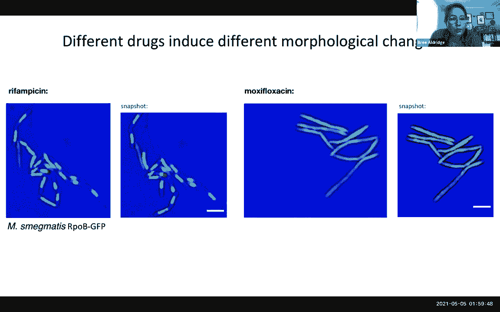
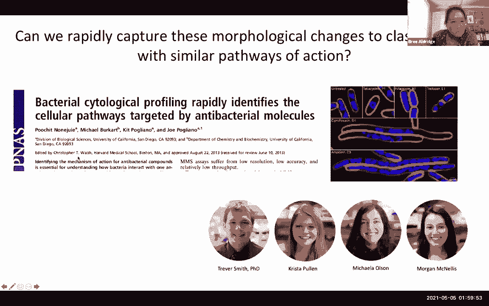
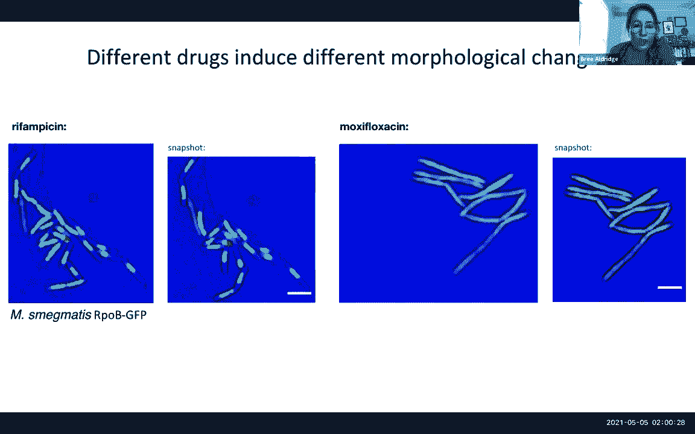
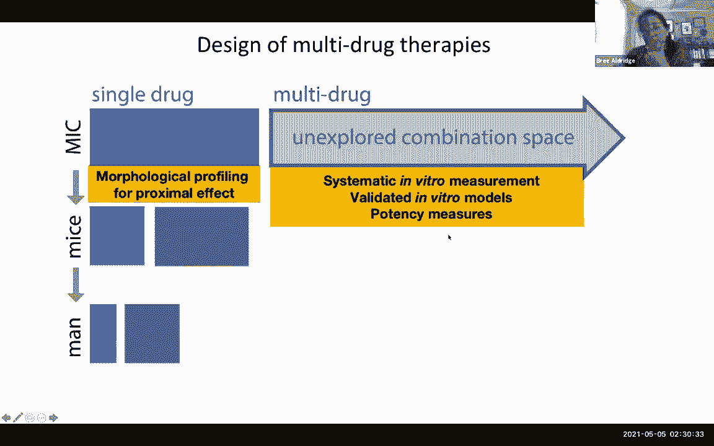

# P18：Lecture 19 - Machine Learning for Pathology - 爱可可-爱生活 - BV1wV411q7RE

现在一零五，所以我很高兴欢迎阿南特马布奇，他将告诉我们深度学习方法和非，图像分析的深度学习方法，我们在学期的前几节课上讨论了如何，深度学习与卷积神经网络，和许多其他建筑已经彻底改变了我们解释图像的方式。

还有视频和时间方式，以及这些是如何应用于成像的许多不同领域的，今天我们开始医学图像分析模块，我想我们将从Anant那里听到的，我们基本上有新的深度学习方法的空间，许多专门的方法。

其中的特性实际上是手工制作的，通过几十年的专业知识可能还没有被深度学习方法超越，也许他们不会，所以说，我们很想看到某种深度学习，在数字成像的背景下，我不带走它，是啊，是啊，谢谢。甜瓜。

但你刚刚给了你给了笑点，所以我想差不多完成了，所以说，那是，哦现在，你那是那是，这是一个很好的总结，这是对谈话本质的一个很好的执行总结，否，但是谢谢你，谢谢你邀请我，我很高兴这次解决了，嗯，所以我想。

你知道，用这个稍微搅拌一下锅，希望会是什么，呃，你知道，至少在呃有一个温和的挑衅性的谈话，在计算病理学空间，我故意选择了这个标题，因为在我工作的领域，呃，就像医学图像分析空间中提到的马诺利斯。

但特别是在病理学领域，你有很多大图像，在过去的20年里，随着病理学的数字化，它确实成为深度学习应用的热门领域之一，很简单，因为人们可以利用的数据量，被数量级取代，你能在放射学领域得到的任何东西。

例如核磁共振或CT扫描，有这么多，即使在一张活检幻灯片上，所以它真的成了，呃，深度学习应用的典范，但这就是为什么我想稍微搅拌一下锅，即使在这些情况下，你有这些，在那里，甘端图像真正说话并合格。

深度学习的机会在哪里，以及在可能不合适的情况下，还有一些警告还有一些失误，现在我真的想和大家分享，我不打算深入探讨技术上的细枝末节，如何构建网络，或者你知道超参数，优化等，但试着给一些吸取的教训。

一些建议和想法，关于深度学习如何以及在哪里可能在上下文中最有用，至少对于计算病理学，所以只是想，呃，就叫一声，你知道，我是嗯，也是一位研究健康的科学家，会是露易丝，斯托克斯，弗吉尼亚州克利夫兰。

我们正在开发的许多技术，我们的目标是对我们退伍军人的健康产生有利和积极的影响，所以我不知道你们中是否有人在社交媒体上，如果你身体好的话，这是我真正的利益冲突，披露是事实，所以这就是，呃。

那是我的推特手柄，所以如果你们在推特上，你喜欢你在这里看到的任何东西吗，请随意，给我点个关注，所有权利，所以我想搭建舞台，一点点临床背景，我在这里使用了癌症的一些统计数据。

关于某人一生中癌症的诊断发病率，如果你看看美国的男人和女人，大约百分之四十，美国的男人和女人在他们的一生中都会被诊断出患有某种形式的癌症，所以这是一个非常惊人的统计数据，所以美国十个人中有四个。

中国的成年人在他们一生中的某个时候会被诊断出患有癌症，呃，但当你真正看到癌症的死亡率时，大约有六十万人死亡，他们会把，你知道现在美国每年有几千个，那仍然是一个很大的数字，我无意轻视这个数字。

这仍然是一个很大的数字，但是当你看到成年人中40%的诊断发病率时，你对比一下每年大约60万人死亡，很明显有差异，很明显有不匹配，这有几个原因，呃，原因是。

我们在早期和早期使用成像来识别癌症方面变得更好了，在更早的阶段，我们知道早期定义的癌症，你就越有可能，呃，在某种程度上能够打败它，呃，我们有，呃，我们可以更积极地使用的生物标志物，呃。

我们也有更好的治疗方法，如免疫治疗，它在1918年获得了诺贝尔医学奖，呃，那个，当然啦，确实改变了我们今天治疗癌症的方式，但如果我们完全诚实，我们不得不承认，至少部分原因，癌症诊断发病率之间的差异。

癌症的死亡率统计数据至少部分，因为对于很多癌症来说，我们倾向于过度诊断和治疗他们，好的，那么这意味着什么呢，呃，让我们说，前列腺癌就是一个例子，在美国，七分之一的男性患有前列腺癌，在他们有生之年。

但四十个人中只有一个会因为，所以这是一个典型的癌症的例子，通常是非常懒惰的，它没有攻击性，它很懒散，不幸的是，即使这样，我们也倾向于过度治疗这些多林癌，我们让他们接受放射治疗，到手术。

这些治疗往往弊大于利，因为有一个非零，有可能有人因为，惰性前列腺癌可能，反过来，然后发展成其他疾病，我是说，吲哚林前列腺癌放射治疗就是一个例子，但除此之外，另一个问题是，还有一个非常现实的金融毒性问题。

我们倾向于，你知道的，对病人造成一些真正的伤害，不仅仅是一种毒性的治疗，也是因为这导致了，你知道，许多人破产被诊断患有癌症，只是因为，你知道，的，我们的财务状况，我们的卫生系统建立起来了。

与我国的卫生经济学，所以，过度诊断和过度治疗，直接导致了许多癌症患者的经济毒性，所以在我们小组里，我们一直在思考，人工智能的效用是什么，机器学习在，你知道诊断，癌症等疾病的预后和治疗反应评估。

现在周围有很多嗡嗡声，你知道AI用于疾病诊断，因此能够识别疾病的存在或不存在，但这只是机会的一部分，在我看来，因为除了诊断之外，还有很多事情需要做，我是说。

如果你有40%的人口被诊断出患有某种形式的癌症，在他们有生之年，那你真的得想想接下来会发生什么，癌症诊断后会发生什么，现在，你如何治疗这些癌症，你是怎么管理他们的，你如何识别，哪些是有攻击性的。

哪个懒散，然后可能会开出更积极的治疗方法而不是更不积极的治疗方法，它最终发展了这些，所谓的预后和预测工具，不仅仅是诊断工具，在我的，依我看，这实际上会帮助我们，最终实现精准医学的真正承诺，对呀。

所以这就是我们团队一直关注的很多事情，我只想在这里快速添加，这并不是说没有工具可以正确地做到这一点，所以有很多其他的工具可以看到，你知道的，基因表达，肿瘤的基因组学，肿瘤的蛋白质组学。

试图理解它是更有侵略性还是更少侵略性，也许是最著名的辅助诊断工具的例子，用于识别哪些患者需要，更积极的治疗是肿瘤型DX资产，所以癌型DX是多，基于基因组健康的基因表达分析，现在是精确生物科学的一部分。

本质上是用来产生风险评分的，基于22个不同基因的表达，本质上，如果你有高风险评分，然后那些病人更有攻击性，需要积极的治疗，如化疗，如果你的分数很低，呃，两个不同基因的集合，等式是这样的。

你得了侵袭性较低的疾病，然后呃，低学校也意味着他可能，呃会受益于，只是手术，你不需要化疗，对呀，所以这就是我的想法，但是，我们知道，许多基于基因组或基因表达的分析都有局限性，因为它们很贵，组织破坏。

他们破坏组织来进行基因表达分析，另一个问题是它们涉及到对肿瘤的一部分进行采样，往往更具侵略性，呃，那么好，他们，它们可能包括对肿瘤的一部分进行取样，那不是肿瘤最具侵袭性的成分，由于终端间异构的问题。

我们知道非常侵袭性的肿瘤往往是极其不均匀的，在形态上，它们往往有多个亚克隆，多种不同类型的突变，所以如果你不取样肿瘤最具侵袭性的成分，通过这些基于基因表达的检测。

你可能不会得到一个真正反映曲调最具侵略性潜力的风险评分，所以这是这些资产的基本挑战，就像我说的，数字病理学，具有将幻灯片数字化的能力，现在，你有机会创造这样的图像，这是一个标准，去找病理学家，对呀。

所以病理学家是看幻灯片的人，一旦活检完成，创建幻灯片，病理学家检查幻灯片，病理学家对…作出诊断，你知道吗，这种癌症，不是癌症，地址是什么，你知道吗，成绩是多少，或者疾病的阶段。

所有这些通常都是在显微镜下进行的，但在过去的二十年里，全幻灯片扫描，事实上，你可以把这些幻灯片放进扫描仪，生成高分辨率图像，就像你在这里看到的那些，意味着病理学家可以根据，他们在看屏幕上的图像。

但对数据科学家来说更重要的是，像我们这样的计算机科学家和生物工程师，我们现在有机会开始使用先进的机器学习，图像分析，计算机视觉方法来处理这些病理幻灯片开始询问，有什么特点吗。

是否有超出人类读者视觉识别的模式，病理学家对吧，所以说，只是一些模式的例子，病理学家可能无法通过机器学习视觉识别，你可以识别单个细胞，个别淋巴，单个癌细胞，那些，你在这里看到的红点。

然后我们可以使用网络理论的思想来本质上观察空间结构，以及单个单元格的图形排列，我们可以看到一系列不同的定量指标，从单个细胞的空间排列，我们可以开始观察不同组织区域内的文本模式，在上皮内，在间质内。

在不同类型的细胞中，并将所有这些转化为一系列不同的定量测量，这不仅可以告诉我们诊断，也是疾病的预后，也很关键的是某人是否会对特定的治疗有反应，或者他们是否对特定的治疗没有反应，你能回到幻灯片上一会儿吗。

所以我很难理解我们在这里看到的是什么，所以基本上细胞在哪里结束，空间蒸馏在哪里，呃，你知道的，这是一个伟大的，这是个好问题，谢谢谢谢你，所以这些小红点代表了所谓的取消核，或者淋巴细胞，是啊，是啊。

这是面包和黄油幻灯片，你会有，嗯，癌症诊断，嗯，你在这里看到的，呃，这些特殊的结构，呃，中间是白色的，你知道的，紫色的边框，这些是小管对吧，这是一个标志，这些小管本质上是连接器官不同部分的管子。

本质上是食物网络，呃，和营养网络，所以当你对标本进行切片时，呃，你基本上得到了一个横向视图，但真的，我们在这里看到的空间排列是红色的东西，机器学习识别出的红点，这些是癌核，淋巴细胞，这就是我们所看到的。

所以这里的想法是看看这些癌细胞的空间排列和癌症护理，我将更详细地谈谈这一点，后来嗯，但这是这里特别关注的，然后剩下的就是最近邻相互作用，所以正确，所以我们看起来很好，有多种不同的方法可以量化空间排列。

你可以，我们已经看过了，例如，偏执镶嵌，你可以看看唯一的三角剖分，是啊，是啊，你看一系列不同的空间统计数据来捕捉内部的权利，好的，好的，那么为什么，为什么这很重要，就像，um，我能注意到，呃，你知道的。

暗指，在，在导言中，你知道的，现在有一个巨大的机会来观察这些图像，试图弄清楚病人的结果和治疗反应可能是什么，所以有一个巨大的潜在机会，而不是进行基于基因组的测试，你可以把这些图像数字化，他们穿过。

算法和算法，然后看模式，这些图案能够，现在提出了这些患者中哪些可能患有更严重的疾病和更不严重的疾病，因此，哪些病人需要化疗，哪些病人不需要化疗，对呀，那么为什么，为什么这真的，呃很好。

因为你不会破坏任何组织，对呀，你在做病理学家看你的幻灯片，用这个数字化仪把它数字化，现在你有了一个数字幻灯片图像，你不会破坏组织，你可以，你可以，本质上，你在云上运行这个，您可以生成模式识别。

形象与评估，并将结果发回给肿瘤学家，对呀，所以这就是机会，那么深度学习在这一切中处于什么位置，从深度学习，就像我说的，在计算病理学领域产生了重大影响，你知道吗，在过去的五到六年里，因为，突然。

人们意识到潜在的数据量，在这些病理幻灯片中，就像我说的，取代了我们在其他医学领域看到的任何东西，至少医学影像领域，对呀，所以如果你看看，你知道的，核磁共振扫描，CAT扫描，你知道的。

通常倾向于谈论数百兆字节的数据，用于单活检核心的单次扫描，或前列腺活检核心，一次活检，你说的是几千兆字节的数据，为了进一步了解典型的前列腺活检，你通常会得到大约12个样本，十二公司，那么。

你说的是大约20到30GB的数据，每个病人产生的，只有当你谈论活检课程时，如果你真的在做前列腺本身的物理手术切除，你要谈论的，你知道的，将要产生的更高数量级的数据。

所以这对机器学习研究人员来说真的是一个繁荣，因为突然间有了这么多数据的升值，然后我们可以利用它来训练神经网络，这只是一个非常简单的神经网络，我们大约六年前发表了，到呃。

只是一个非常初始的堆叠稀疏自动编码器，其中我们向堆栈提供了单个单元格的注释，稀疏自动编码器，自动编码器，根据单元格的注释学习，呃，细胞的模式是什么，然后输出这些细胞的空间位置，效果很好，给了我们。

我能不能，我在这里问你几个细节，是呀，我们已经研究了卷积神经网络，他们基本上是在多个层面上学习这些过滤器，然后应用于图像，在这种特殊情况下，特征学习从何而来，你有没有手工设计这些功能。

还是你自动学会了细胞的形状，是啊，是啊，所以我们在这里做的是提供注释，其中注释位于单个单元格周围，所以实际上有一个补丁提供给网络，在贴片中，细胞被包含，所以真的，网络试图学习的是像你知道渐变这样的东西。

它试图学习细胞的形状，它大致是椭圆形的，它还试图学习界面，对呀，所以这个渐变，所以它拾取了那些渐变，所以你知道，当您将其应用于图像时，它基本上去寻找椭圆形的东西，当你看到一个从内心的转变。

细胞内部染色较暗的部分，现在要寻找椭圆物体的概念是从学习中产生的，还是你手工编码到机器里的东西，所以这完全是一种无人监督的功能，我们没有对网络本身编码任何属性，我们只是给它提供了，用补丁。

其中包含的单元格，这些补丁是从哪里来的，做了吗，我是说，你有没有，是啊，是啊，手动申请，所以基本上我们，我们把整个，呃，像这样的一系列不同的声音，只是为了语境化，这部作品发表于大约六年前，是的嗯。

所以我们真的有学生，很多高中生坐在那里，创造了一些小盒子，这些单个细胞周围的包围盒，把图像分解成一系列的边界框，然后将其提供给网络，好的，所以网络基本上学会识别有销售的盒子，没有销售的盒子，这是正确的。

这是正确的，例如，如果我画一些，呃，你知道吗，您图像中的框，是啊，是啊，红色的，有一些没有注释，这是因为没有学生提供那个吗，呃或者是的，所以这是一个很好的问题，那么为什么其中一些被错过了。

所以有人因为一些不同的原因被错过了，一个是呃，差异染色，事实上，这些东西中的一些变得更暗，其中一些染色更轻，所以，这引起了一个问题，另一个问题是这里实际上有不同类型的细胞，你的淋巴细胞往往要小得多。

你得了癌症，往往更大的核，当我们大约六年前做这项工作的时候，我们并没有真正意识到不同细胞类型之间的细微差别，所以当你看到这些细胞中的一些被遗漏时，这也是因为它不是一组更同质的注释，正在提供给网络。

所以换句话说，我们没有控制小细胞，在大细胞里，所以因为有一些差异，呃你，你知道你，你倾向于网络没有以最好最强大的方式训练，另一个问题是玷污了我们所认识到的，在这个空间里做了很多工作。

现在这些幻灯片的染色会对网络本身造成很大影响，用于陈述的如此微分陈述，实际上会对这些分段的保真度产生重大影响，所以现在有很多工作要做颜色增强，作为运行这些网络的预处理步骤。

所以你对幻灯片进行某种校准或颜色标准化，在运行网络之前，这些都不是在六年前的这项特定工作中完成的，谢谢。是啊，是啊，当然好问题，呃，所以这就是我们所做的，这是一张经典的幻灯片，我会把它拉起来。

只是要小心不要相信这些，这些神经网络算法和深度学习算法盲目，所以这是一个，嗯，我们旅程的下一步是在额外的病理学中深度学习，所以第一个作品是，让我们用它进去找个别的结构，单个细胞的分割，下一个问题是。

我们现在能用无监督的特征生成再次训练算法吗，真正问这个问题，嗯，我们能在更高的水平上预测，病人级别的诊断是这样的，换句话说，我们现在能试着弄清楚，嗯，谁有心力衰竭的风险，与没有心力衰竭风险相比，所以说。

我们在这里所做的基本上是提供了，心内膜心肌活检的一系列补丁，所以这些是病人，嗯，他的心脏有近视，他们都在接受移植，心脏移植，所以你问的一个问题，呃，当你看活检时，这些病人，病理学家看活检。

他们试图弄清楚这些心脏上是否有明显的失败，如果有失败的证据，那么这些可能不是移植的好心脏，对呀，呃，所以这是一个重要的问题，我们想看到的是我们能训练一个网络吗，在这种情况下。

基于这些心内膜心肌活检的CNN，真正区分什么是正常的心脏，相对于训练是一种感觉，所以又一次，没有，嗯，呃，我们采取了两种不同的方法，一个是基于CNN的方法，我们从内部挖掘出了不同的玫瑰，a。

呃标记了感兴趣的区域，对呀，所以我们基本上有了标记的病理，以一种非常粗略的方式，感兴趣的区域在，我们去随机抽样了一个不同的，一些不同的感兴趣的区域，我想大概是十二十四乘十二十四块，然后提供给网络。

通过无监督的特征生成再次学习，我们，这里的想法是，我们想尝试了解网络是否可以区分病人，呃，那些有心力衰竭风险的人是正常的，我们有105个病人，我们用来训练的，和四个病人进行训练。

然后我们用另外一百多个病人进行独立测试，现在所有这些病人都来自同一个地方，这些都是宾夕法尼亚大学的病人，只是为了让它变得有趣，我们还做了一个，我们有两个心脏病理学家查看相同的验证集。

所以我们问他们同样的问题，你能分辨出哪些是衰竭的心脏吗，哪些是正常的心脏，现在我们已经知道哪些是正常的，哪些是失败的，因为我们有过，在所有这些案件中，所以这被确定为基本真理，基于多个不同病理学家的共识。

所以我们有两个不同的病理学家，他看了这一百多个病人的测试集，当我们应用它的时候，网络到那一百零四箱左右的测试集，你可以在这里看到，结果呢，Auc是9点7分，所以这个，你知道的，CNN的曲线面积是惊人的。

如果你看病理学家，曲线的面积只有74%左右，对呀，所以这是这是，呃，挺莫名其妙的，但很明显我们很兴奋，你知道我们发布了一份关于报纸的新闻稿，你知道我得到了很大的牵引力，但几个月后，几个月后。

我们所做的是我们从佩恩那里得到了另一组病人，来自同一机构，在同一扫描仪上扫描，我们又运行了同样的算法，又是同一个CNN，所有这些病人都发现，当我们在这组新病人身上运行CNN时，ADC实际上从9。

7点下降到7。5点，所以这真的很令人困惑，所以我们不知道发生了什么，然后嗯，在至少几个月的挠头之后，试图弄清楚发生了什么，我们意识到第二部分的图像，在同一台扫描仪中扫描过，在过渡期间。

有一个软件升级已经应用于SCA，所以基本上对扫描仪的一个小软件升级，非常不知不觉地，非常微妙地改变了图像的属性，正因为如此，CNN中的图像特征和相应的表示发生了变化，从病理学家的角度来看。

它们没有什么不同，但这些图像的分布在不知不觉中发生了变化，因为这个远程软件更新，神经网络现在从九点七下降到七点五，所以这对我们来说真的是一个非常非常惊人的教训，你知道。

你真的必须非常小心盲目地相信这些算法，因为这不是这在很多战斗中都是出乎意料的对吧，所以我相信你们很多人都读过，你知道很多CNN和神经网络，当你从一边到另一边，他们不会一概而论，但这是一个例子。

在同一侧的数据上，来自同一个实验室，从同一扫描仪，网络现在已经从，你知道97%的准确率或面积，这些手工设计的特点之一是，他们或多或少，你知道的，是啊，是啊，对这种类型的，我的问题是，如果你，我是说。

你在F面板中展示了一个例子，所以如果你回去问，什么类型的特征，我发现，有多少看起来像F，有多少是你会手工设计的东西，有没有办法明确地过滤掉功能，似乎没有捕捉到。

f中的面板实际上显示了我们所学到的一些表示的例子，但我们已经明确地为，这正是我们学到的教训，我们学到的是，当你经常进行无监督的特性生成时，尤其是CNN，你在这些卷曲中学到的很多东西，对呀。

所以你学到了很多原始图像的卷积，这就是它征求了很多这些文本回应，这些文本责任的问题，这些卷曲是它们往往对，你知道的，染色变异及分析前变异源，但是有一些重要的教训，比如在F小组。

你意识到信号似乎是从附近发出的，你知道的，有些类型，特定类型的细胞，在这种情况下，肌细胞，尽管我们没有明确地编码肌细胞，这是非常宝贵的一课，因为它说你知道这并不完全是肌细胞的结构，网络正在学习。

但信号是从附近传来的，肌细胞，所以这项工作实际上产生了后续的方法，这实际上给人留下了深刻的印象，我很乐意和大家分享，当论文正式出来的时候，当我们实际观察负侧的空间排列时，在一个更大的法庭上看这个。

两三百个病人，五个不同的侧面，并在曲线上生成一个区域，这和九点七很有可比性，一些东西，那个点九，五点，九，六射程，但一个真正有弹性的，因为它不是，它对不同地点和不同化学家的变化不敏感。

所以即使这并不完全成功，我们希望它，你说得很对，它为我们进去说，好的，嗯，这是，网络似乎把注意力集中在图像的某些部分，这似乎就是行动的地方，这就是我们，呃最终明确地建模，随后。

所以我只想在这里分享几个例子，我是说这是一个，你知道引用加州大学伯克利分校的乔丹教授的话，你知道非常非常受人尊敬的机器学习空间，你知道他出来了，他说他太相信这些蛮力算法了，信仰是错位的。

我不认识米诺利人，你是否有辛西娅，杜克大学的鲁丁，你知道参与，你知道在这个研讨会系列中，她可能是另一个要带进来的人，因为你知道辛西娅把它，几年前在《自然机器智能》上发表了一篇非常有影响力的论文。

但她说你知道相信这些蛮力算法，你知道的太多了，我是说这是你，你绝对得停下来，相信黑匣子做出高风险的决定，这真的发生在，你知道的，我们在医学影像和临床诊断方面的问题，这是另一个很好的例子。

我很想分享萨米尔·辛在加州大学欧文分校的工作，你知道这是一个经典的例子，你需要知道网络正在学习什么，呃，你知道的，2。他做了这道题，是你干的，你知道特别的，嗯，他学生的问题。

在那里他们试图训练一个网络来区分哈士奇和世界，发现当他们使用从互联网上下载的图像来训练网络时，它得到了98分，区分哈士奇和世界的准确率为9%，但是萨米尔，他显然比我聪明得多，因为当他看到那些结果时。

他立刻意识到，你知道这太好了，不可能是真的，不像你知道你的，真的，当你发布新闻稿时，他真的很兴奋，嗯，呃，你知道的，意识到这是没有意义的，因为这些动物看起来很相似。

他们发现网络实际上并没有了解到任何特征，动物的脸，它只是了解到背景中有雪，对于所有那些右边有哈士奇的图像，典型的例子你知道你只需要真正考虑，什么是网络学习，和，真正专注于此，你知道这在这里是有意义的。

那太好了，但它也告诉你在哪里你可以在网络上绊倒，如果这真的是它在学的东西，只是了解到背景中没有，对呀，但我觉得重点是，我是说，这不是你想要的，你知道扔掉，我不想过分挑剔，我认为有巨大的机会。

我认为我们发现深度学习真的可以发挥作用的地方，它在检测和分割方面的效用，我们发现的地方，这些方法有一个真正的效用，这是我们大约五年前发表的一篇论文，在那里我们展示了深度学习的效用，扩展我们早期的工作。

在那里我们展示了它来寻找不同类型的细胞，不同类型的组织类型，你知道立方体，在这些图像上一系列不同类型的结构中的有丝分裂图，嗯，你现在知道这些，这些东西越来越漂亮了，呃例行公事，你可以运行这些。

你知道现成的硬件，你知道你可以用Gpus，你知道你可以通过深度学习生成几乎实时的结果来进行图像分割，即使在非常大的病理图像上，你在这里看到的图像大约是4万像素，四万像素图像，你用一个预例程网络捕捉。

你知道的，成千上万的细胞核和淋巴细胞在这些大图像上非常，很快，呃，然而，挑战是，并继续是注释，这些网络仍然需要大量的数据来训练和学习，尽管有很多关于半监督学习的工作，和一次短暂的学习，事实是。

你知道从细分的角度来训练这些网络，这需要努力，努力意味着你必须坐在里面，并手动注释和标记这些图像，所以我们推出的，呃，你可以查这个，这是在GitHub上，还有一篇关于档案的论文，你也可以下载。

称为快速注释器，所以它是什么，基本上，它是一个交互式工具，允许你进入，找出几个有代表性的例子，一旦完成，它在后台训练一个网络，它产生一个初始输出，并使用该输出，最终用户实际上可以标记和微调结果，所以说。

就像Melois在之前的一张幻灯片上发现的那样，现在有几个细胞不见了，你可以做的是你可以把网络的输出，进去标记漏掉的细胞，也许是过度分割的东西，你可以，您可以编辑它，做了那件事，我们现在把这个传回网络。

因此，在交互式主动学习模式下，网络学习很快，可以很快开始，打电话并收敛到所需的结果上，所以你可以很快地交互式地，站起来，相当好的网络相当快，这是非常令人印象深刻的，我认为这是一个，它是。

这在很大程度上是一种新的范式，从某种意义上说，人类可以是循环的一部分，但有巨大的，你知道吗，背景下的机器学习能力，这是非常好的，它是一个很大的，但是最大的瓶颈，最大的绊脚石是，嗯是的，坦白说，呃。

除了时间的缺乏，对呀，归根结底就是这样，缺少兼职，尤其是病理学家太忙了，他们只是没有时间坐下来注释，对呀，所以这是一个经典的例子，你知道妈妈是下一个，你知道吗，你知道，必要性是，这里提到的母亲，对呀。

所以你得想办法，帮助提高注释过程的效率，所以我想在这段时间里谈谈，我有一些手工制作的机会，就像我说的，你知道我得到了这些，你知道，我用，不同类型细胞的图形基序，所以我们现在所做的。

基本上是利用深度学习来识别不同的组织隔间，不同类型的细胞，一旦我们这样做了，我们就能够调用图网络，像你知道的事情，博奈特目的地，三角剖分，创造这些不同的，呃图形图案，然后看看空间统计学，看看相互作用。

以及不同组织间隔内不同细胞类型的排列，因此您可以定义不同的单元格类型，基质细胞，肿瘤与游离淋巴细胞，你可以看不同的组织隔间，上皮，上皮，间质，你可以开始看相互作用，现在这里的优势是更多可解释的特性。

因为你知道你在提取什么，你知道你说的真的是这个，这个空间结构，间质细胞与肿瘤的空间排列，浸润淋巴细胞，所以这就是我们发现最划算的地方，因为呃，在这种情况下，我们看到了病理图像的另一个非常重要的标志。

这是一个胶原蛋白对，基岩的胶原蛋白是这些病理图像的框架，贯穿这些病理图像的纤维组织，我们所做的是深度学习，而是用它来分割肿瘤巢穴，然后把胶原纤维分出来，一旦我们这样做了，我们可以观察胶原纤维的取向。

所以我们给胶原纤维分配了一个载体，一旦我们这样做了，然后我们借用熵的概念来观察这些向量的无序性，在这些向量中，所以本质上，如果你发现纤维都在同一个方向上，那么熵就低了，如果纤维彼此不协调。

如果向量彼此不一致，熵很高，所以本质上我们能够转换DIP机器学习，深度学习在胶原纤维分割中的应用，但随后将其转化为胶原纤维取向的熵，和，然后证明了这种熵实际上对乳腺癌患者的生存有很大的预测作用。

所以我们实际上能够展示这些发生的事情，在你知道的地方，这是显示事件数据时间的好方法，所以本质上证明了胶原蛋白，这个向量方向熵特征非常好地根据乳腺癌患者的存活率来区分他们，但现在我们在做不是。

基于一些不透明的特征，我们是基于可解释的特征来做的，带着重担的深度学习，随着分割，但除此之外，我们使用的是手工设计的功能，也许应该做，我们有时间再举几个例子吗，是啊，是啊，让我们跑过去一点点。

我们在结束时间上有一些灵活性，所以好吧，所有的权利，所以也许我在这里再举一个例子，我们正在做的一些工作，我就跳过这个，我在这里举一个前列腺癌的例子，我们昨天刚推出的，昨天刚出来的，所以这是一个。

你知道吗，我之前提到的前列腺癌的另一个大问题，在这些病人手术后，你知道他们中的一些人会重新选择，这是个问题，因为这些术后复发的病人往往做得很差，他们往往因为前列腺癌而有很高的死亡风险。

所以我们想问的一个问题是，我们能看看标本吗，手术标本，尽早弄清楚这些病人是否会复发，因为如果你能弄清楚他们是否会复发，他们可以开始接受额外的治疗来降低死亡的风险，因为前列腺癌。

所以我们对九百名患者进行了一项大型研究，这真的是昨天早上才出来的，在自然界中精确肿瘤学，我们应该在网上找到它，我也很乐意分享这篇论文，所以在这种情况下，我们使用深度学习来分割腺体。

但后来看了空间安排和空间建筑平面图，并使用了260名患者来训练基于这些的模型，呃，这些呃，特征，然后在大约600多个病人身上验证了它，再次发现它做得很好，它在区分复发患者方面做得很好。

与没有复发的人相比，但我们更进一步，我们在研究中还做了，我们把它和3000美元的分子分析进行了比较，目前用于预测前列腺癌的结果，所以这是一个商业测试，这是在呃，nccn或国家综合癌症网络指南。

它对组织有破坏性，一共是三千元，它很贵，大多数人都够不着，你知道的，li or，你知道的，中低收入国家，所以我们想看看仅仅从这些病理图像中观察图像特征，这三千元的资产怎么样了。

所以我们进行了面对面的比较，发现在面对面的比较中，在迈耶船长的生存评估中他们又做得很好，互相尊重，这些测试的表现几乎是等价的，但真正有趣的是当我们将图像特征与两个非常简单的临床因素结合起来时。

当我们看PSA的时候，这是前列腺癌的生物标志物，每个人都得到生物标志物评估，PSA评估和格里森评分，这是一个标准，另一个在前列腺癌患者背景下观察的变量，我们实际上表明了。

我们几乎可以提高图像分类器的性能，分子分类器的两倍，所有这些都是基于可解释的特征，直观的功能，在600多名患者身上验证，并以一种可以按成本顺序进行的方式进行，较低数量级，降低成本。

所以分子分析是三千美元，这是字面上像五美元，对呀，因为你说的是幻灯片的图像，用这些算法来分析，就是这样，所以只是为了时间的利益，其他的我就略过了，但我真的你知道，你有，你知道吗，请随意看幻灯片。

我很乐意回来回答问题，但我想把剩下的演示文稿整理一下，实际上是关于这些方法的更多例子，深度学习可以真正作为识别，最初的图案，然后我们可以从中提取手工制作的特征，这里有这么大的机会。

我是说不仅仅是在预后方面，我们在这里发现的另一个机会，用这些方法发现，你可以开始发现不同人群之间疾病表型的差异，这是我们去年推出的，但我们发现患有前列腺癌的非裔美国男性之间的差异。

与患有前列腺癌的白种人美国男性的竞争，深度学习被用来定义组织隔间，但后来我们利用细胞的个体统计特征来捕捉这些差异，并发现我们可以通过考虑人群特异性差异来创建更好的预后模型，但是和不是。

这不是深度学习网络中完全连接的层吗，应该做的，基本上，我觉得你是，你基本上是在说，好的很好，我们可以使用网络的卷积层学习特性，不不，我们没有学习任何特征，所以现在我们要做的是，我们用CNN做分割，是啊。

是啊，关于分割，所有后续的特征分析都是使用手工制作的方法完成的，所以CNN实际上没有在分割之外使用，那么这一切都是有机的未来工程，所以基本上，那么你的，你对这个领域的发展有什么看法。

你觉得我们将无法学习这些手工制作的功能，使用完全深度学习的方法，我想这将是一个有点挑战，我有一些保留，我想是的，我从更多的临床评论，我有更多的临床偏见，临床观点，我所看到的，嗯，对我来说是创新。

创新必须与可解释性联系在一起，因为临床医生最终会希望看到这些方法的透明度，我认为深度学习是一个发现的机会，以潜在地确定需要关注的领域并为后续行动提供线索，但我仍然认为我们只是触及表面，在特征工程方面。

我认为功能工程还有很多可以做的，从字面上看，我在这里展示的只是非常非常少的例子，但是像胶原纤维的取向等等，我们只是触及表面，但这在很大程度上是基于我们对这个领域的了解，关于生物学的道路，域的。

我想我们还有很长的路要走，特征工程将由深度学习直接驱动，我认为在这一点上，深度学习可以建议去哪里寻找，但除此之外我认为特征工程必须来自数据科学家，计算机科学家和生物工程师，嗯。

但你知道我认为和一个人在一起是如此重要，因为我想很多人我是说，至少在我们的背景下，从机器学习的角度来看，好的很好，我们什么都能做，但我认为有一个真正的从业者回来说，到目前为止，它对我们还没有那么有用。

我认为这非常重要，是可解释性，我想这真的是可解释性，这对临床医生来说是一个真正的驱动力，因为我和临床医生谈过，你得考虑一下，从他们的角度来看，对耶，你告诉他们，不要在某人身上使用化疗。

我会相信一个黑匣子吗，但我不明白这些陈述，你决定不做化疗，对呀，所以这是一个完整的专门讲座和可解释性，所以我最大的问题是，只是缺乏解释吗，因为其中一些可以解决，还是我们永远无法了解这些特征。

但我想这是对这个领域的公开挑战，我们看看，事情是如何进展的，是啊，是啊，是啊，是啊，可爱的井，我没有别的临别赠言了，呃我们不，我我只是，呃，是啊，是啊，我只想把锅卖了一点，你知道对不起。

我和我认为这花了比那更长的时间，我可能放了太多幻灯片，但是嗯，我想嗯，是啊，是啊，它是，它是，还有很多事情要做，我认为有一个巨大的机会，的意见趋同问题，你是手工制作和深度学习的功能。

我想你知道我会把它扔在那里，我们想不断地迫使自己质疑，网络是什么样的，我是说，那是我的停车位，是啊，是啊，是啊，是啊，我不认为我们想把任何事情都视为理所当然，准确地说，部分原因是。

我想展示我们的一个失败就是开车回家，那个点，不相信网络盲目学习的人，完美，是啊，是啊，嗯，非常感谢你，我很感激有这个机会，谢谢。我想请大家和我一起，真的很感谢他出色的、非常非常有启发性的演讲。

所以谢谢你，谢谢，好的，谢谢谢谢大家保重，谢谢。我们今天的下一位嘉宾是布里·奥尔德里奇，谁是呃，在一个非常不同类型的应用程序中，所以繁殖把它带走，所有的权利，你们看到我的桌面幻灯片了吗。

让我分享我的幻灯片，然后你现在看到了完整的幻灯片，对是的，所有的权利，完美，你会认为一年后，我会更擅长在缩放上呈现PowerPoint，所有的权利，所以我真的很兴奋来到这里，我首先要说的是。

我要告诉你一些我的爱人一直在做的工作，在更翻译的方面，尝试和设计结核病的联合疗法，我们使用了很多机器学习方法，我会告诉你，因为这是一堂深度学习课，我们尝试深度学习失败的领域，所以我觉得这可能是一个考虑。

何时使用深度学习，何时不使用深度学习，然后我会在我前进的过程中提供一些想法，我认为我们可以进入深度学习的领域，随着我们获得更多高质量的数据，所以这太棒了。

它实际上很好地遵循了安南在他自己的演讲中提出的主题，所以说，和，这就是为什么，我认为引进从业者是非常重要的，呃，尤其是当我们从深度学习的部分，所以我喜欢把它带走，是的，我是说。

所以我的观点是我们应该先尝试最简单的东西，是啊，是啊，所以当我们提出一个数据驱动的问题时，你先从最简单的方法开始，所以你会在我们的幻灯片中看到这种行为，在所有这些案例中，我们确实尝试了CNN的。

他们做得比有时无人监督的方法要糟糕得多，所以你知道，对每个人关于为什么这可能是真的的反馈感兴趣，当你看到什么样的混乱，我们的数据集看起来像，但这些是电视研究中的真实数据集，所以这是我们所处的现实。

所以嗯，我的实验室真的被治疗电视的惊人困难所激励，所以电视是一种细菌病原体，它是，除了今年它是世界上死亡的主要原因，由于单一的传染性病原体，需要多种抗生素治疗通常六个月，所以我们作为一个领域一起工作。

在学术界，非营利组织和制药公司设计新的通用，T的多种药物治疗疗程缩短，对我们来说，一个主要的瓶颈是，你实际上是如何为电视设计一种多种药物疗法的，你如何有效地做到这一点，因为组合空间真的很大，为什么。

我要在这里提到这一点，因为异质性的概念会在我的演讲中出现很多，我们需要用多种药物治疗的主要原因，因为结核病是异质性的，通常人们会谈论你需要如何用多种药物治疗，减缓耐药性的获得。

但我们在结核病的情况下看到，很多先天的细胞对细胞的异质性，这就是我实验室的很多人关注的，但我今天就不多说了，多种药物的原因实际上也是因为当T驻留在肺部时，在我们所说的肺部肉芽肿环境中，在每个颗粒里。

我认为是一个洞穴，在每一个洞穴或肉芽肿中，细菌，常驻细菌暴露在不同的微环境中，这些微环境改变了药物反应，所以当你治疗结核病患者时，你在治疗多种结核病，这就是为什么你需要不同的药物，所以你总是有易感性。

好的，那么这通常是如何工作的呢，我们谈论麻省理工学院从老鼠到人的道路，所以这是药物开发的典型过程，也用于开发多种药物疗法，所以这在结核病中的作用是大部分药物，在麻省理工学院的实验室里做的研究工作。

所以这是以肉汤为基础的培养基是为单一药物做的，然后那些最好的药物在单一药物中取得进展，在小鼠模型中的有限特设组合中，然后进入临床试验，所以我们缺少的是这个巨大的未被探索的组合空间，对呀。

所以我想让你考虑的是这个空间的大小，如果我们有大约20种目前对结核病有效的药物，我们需要三个的组合，我们治疗结核病至少需要三种药物，二二三是一千一百四十个组合，对，绝对没有办法测试，我们需要明白。

我总是把药物组合比作烹饪或食谱，我今天用的例子是像这样的沙拉，我们把单一的药物作为单独的沙拉成分来测量，但当你在高级餐厅吃饭时他们会给你昂贵的沙拉，就像有时那些味道简介出乎意料的好，就像我们进入了春天。

所以如果你有草莓美斯卡林沙拉，然后是山羊奶酪，你永远不会想到把这些东西加在一起，但实际上这是一个非常好的沙拉，所以这将是一个协同的组合，我们会在这个未被探索的组合空间中发现，如果我们试着更好地取样。

所以这就是我们正在努力实现的目标，最近有很多临床试验，就在过去两年的结果表明，即使不使用新药，有很多新的组合，被发现比目前的护理标准更有效的新组合，也是六个月，所以接受抗生素治疗的时间非常长。

所有的权利，所以回到这个管道，嗯，你可能听说过我们真的没能生产出新的抗生素，治疗和治疗细菌性病原体，但我认为这对电视来说不是真的，电视领域产生了许多新的抗菌药物。

我们现在面临的问题是我们的组合空间太大了，无法实际测量，所以我要告诉你的是，今天是两个不同的项目，我们在实验室里尝试看看，如果我们真的能利用这里的实际实验空间，在麻省理工学院领域取得进展。

并优先考虑最好的组合或沙拉，我们可以找到我们可用的成分来继续前进，这样我们就能确保我们捕捉到最好的组合，被发展成动物模型，然后进入临床试验，所以嗯，在我演讲的第一部分，我要说的是。

我们如何通过快速使用成像来缩小单一药物的范围，确定新药的作用途径，我演讲的第二部分，我要回顾一下我们在体外进行系统的联合测量的方法，你用机器学习来开发分类器，去预测，哪些新的组合更有可能提高护理标准。

所以我的实验室花了很多时间，失效，我今天不打算谈论的成像和工作，但这里我给你看的是一些老电影，我们有M spg maz，它是电视的大豆亲戚，带有亮绿色的染色体标签。

在这些电影中，我们处理了，让我看看能不能，嗯。

错误的方式，再放一遍，当药物继续，拉法明在左边，莫克西在右边，它们有两种截然不同的作用机制，当药物继续，你看到，我明白了，你们上过细胞形态学的课，所以这里我们看的是细胞形状。

染色体定位和染色体的致密性或伸长性，你可以看到治疗结果是，乐福明和莫西洛辛看起来完全不一样，所以问题是我们是否可以使用形态学分析。

利用乔·波利亚诺的实验室在2013年首次发表的这个想法，在一个带有E的示例中，大肠杆菌，他们所做的是，他们把大肠杆菌，他们用不同的药物治疗细菌，他们把它们修好了，他们做了染色和高通量成像。

然后他们基本上使用无监督学习和聚类，他们测试并发现是真的假设，当配置文件看起来相同时，那些药物有类似的作用机制，所以这是一个联想内疚的想法，但这个想法是，如果我们有一个足够大的结核病药物参考集。

我们有一种新的结核病药物，我们能接受吗，做一个形态学轮廓，找出哪些参考药物，它是最匹配的，这样我们就可以知道二次分析要做什么，去了解那些，嗯，那药到底在做什么，好的，所以想法是这样的，这是自鸣得意的。

你以前看到的大多数图像，我在这里加了另一种药，嗯，你可以在大肠杆菌中看得很清楚，这在mematus中工作，这很管用，我们不知道它在电视上是否行得通，所以我们看到的是，所以这些图像看起来像一个热的烂摊子。

对你所看到的，这是TSO的固定细胞成像，我们得了肺结核，它是BSL三级生物，我们用药物治疗他们，我们把它们修好了，我们把它们带出实验室，把3号实验室改造成2号实验室，我们给它们染色并做了成像。

我想让你看到的是下面的这些图像，有一个绿色的染色体标签，然后这是上面的相衬成像，你首先可以看到，许多细菌，不像你看到的大肠杆菌，许多细菌根本不吸收污渍，这些是细胞可渗透的，染料应该是细胞可渗透的。

所以我们有很多黑暗的细胞，这些特征，它们的形态特征看起来并没有明显的不同，好的，所以我们想，其实，我们以为这个项目会停止很多次，因为这看起来太难了，这些特征不像我谦虚时那样明显，但是我实验室的成员。

所以特雷弗，史密斯和克里斯塔·普伦，他是实验室的前成员，粘在一起，他们继续在一个较小的药物治疗参考集中量化这些特征，只是看细胞长度，单元格宽度，每个治疗组的染色量超过一万个细胞，观察核苷酸的压实。

并观察了染色的程度，我们看到，有很多治疗组与未治疗组之间有统计学上的显著差异，所以我们仔细研究了一下，试图看看这是否有效，好的，这是为细胞学分析建立的典型管道，我只想指出真核细胞也是这样。

所以我们希望它能在电视上工作，这个想法是你治疗细菌或细胞，你把它们修好，你把它们弄脏了，你做高通量成像，你做自动图像分析和特征提取，所以在某些情况下，你也可以使用深度学习来做到这一点，在这种情况下。

我们不需要使用深度学习，然后我们只想做一个分类试验，试图联系或找出哪些治疗组看起来最相似，这就是我们看到的，这是乔·波利亚诺在《E》杂志上的论文，大肠杆菌，你可以看到不同治疗组的不同复制。

在一个一般的PCA空间上，所以无监督学习，你会看到治疗组相互聚集，这就是我们在侧面看到的结核，所以我们只在这里展示两台电脑，因为变异量不是太大，它们的颜色大致由药物的一般作用类别编码。

你可以看到这些都混在一起了，你不可能复制体甚至都不挨着，对呀，所以这根本不会以同样的方式工作，它会为E工作的，大肠杆菌，在看到我们的图像后，也许这并不奇怪，这里发生的是病原体对药物有反应。

它们的机制或反应非常不同，或者是什么让最致命的，嗯，其中一些是细胞壁非常厚，电视中的细胞壁比大肠杆菌中的细胞壁厚30倍，所以很难进入，你看到的，不同类型的治疗没有区别，因为细胞不受治疗的影响。

那不是真的，原来是有区别的，所以给我一点时间，我要去那里，我们会成功的，只是不是嗯，我们还得克服几个障碍才能成功，好吧嗯，所以在这一点上，我想我们确实尝试了深度学习，但没有奏效。

所以这是我们尝试神经网络的时候，看看它是否有效，没有，我认为数据太多变了，所以我们嗯，我们知道我们有麻烦了，就像分枝杆菌场，知道有大量的批次对批次的异质性，所以我们认为我们需要一批批地解决。

我们实验的异质性，我们知道有大量的细胞对细胞的异质性，这对你来说应该很明显，看着图像，我们还看到了一些微妙的特征，也许我们需要非线性聚类来实现轮廓的相似性，所以为了解决这个问题。

我们做的第一件事是处理批处理规范化，使用一种叫做典型变异规范化的方法，这种方法是由我们的合作者开发的，google的mike ando，和TVN的想法，就是对齐PCA产生的协方差矩阵。

每个实验中未经处理的对照，所以你基本上把均值归一化为零，方差归一化为1，然后将转换应用于每一批，从未治疗组到治疗组，所以我们所做的基本上是把这些不对齐的事实，这两个不同的批次我们应用TN。

然后当我们应用它的时候，我们看到这些未经治疗的群体现在相互混合，所以我们要做的是减少一些非生物的，比如批量变异，这在生物学上并不重要，为了做到这一点，我要指出的一件事是，在我们的成像中。

我们需要大量未经治疗的对照，所以在我们的成像管道中，我们将25%的成像时间用于未经处理的样本，如果没有重要的未经处理的控制，就没有办法使这一工作发挥作用，在我们所做的每一次生物和技术复制中，好的，嗯。

所以我们做的另一件事是，我们明确地合并了细胞到细胞的异质性度量，包括像四分位区间和下四分位和上四分位这样的东西，我们最终使用的功能，所以我们从大约25个功能到100个功能。

当我们这样做并应用批处理规范化方法时，我刚刚向你介绍了TVN，我们看到我们的PCA空间确实有所改善，所以细胞壁作用剂现在彼此靠近，但其他的都是混合的，所以我们确实看到了一些聚集，但还不够。

我想做任何可靠的分类，我不会真的依赖这些，但我想我们越来越近了，所以我们接下来做的就是试着，并解决功能的其他部分，我们看到的微妙特征，也许我们认为PCA太线性了，我们需要一些非线性聚类算法来代替，嗯。

所以这是扩展的管道，我们用来做我们所说的，我们的方法叫做睡眠，或形态学评估和了解结核病特有的应力，但我们认为它也适用于其他生物，特征量化，我觉得我们没必要进去，它是你想要的任何类型的图像分割。

我们过滤掉焦点细胞，我们创建我们的功能列表，其中包括细胞的明确um特征，每个图像中的细胞异质性，然后捕捉细微的形态变化，我们从使用PCA转向K最近邻方法，链接相似的配置文件。

所以我们在分类试验中使用随机方法来做到这一点，我们需要这样做的原因是，我们发现我们为TN选择的未经处理的对照，批量归一化，它非常脆弱，所以我们可以想出很多好的解决方案，我们的c k和k ns。

这取决于我们使用的未经处理的控制，所以为了克服这种脆弱性，啊，我们采用随机方法，所以我们在每次分类试验中选择一组新的，未经处理的对照，我们使用mmr进行功能订购，mmr，你们经历过那种方法吗。

然而最小冗余，最大相关性，呃不，好的，所以它是它是一个，这是一个功能选择，嗯，常用于观察基因表达变化的算法，这里的想法是，确保，我们在寻找彼此没有太大共变的东西，嗯，但这是密切相关的。

然后随着结果的差异，所以这就是为什么我们称它为实验室里的先生，所以我们用它来排列我们的特征，然后我们进行批处理规范化，我们对我们的PCA空间做一个k nn，然后我们评估每个试验的成功，成功与否是由。

根据每种已知药物与另一种药物的关系，在同一普通班级，我们做向后选择来逐步减少我们的特性集，然后我们用它来识别最佳的特征集，在这些随机试验中的每一个，通常平均。

我们有大约35到40个功能我们最终以最佳运行，我们运行了70次，我们列出了这70次试验的共识，这就是我们所说的共识分类或CNN，所以CNN的数据是我接下来要给你们看的，所有的权利，这是我们的扩展版本。

也展示了实验，另一件事我不是为了时间而在这里讨论的，我们不仅仅用高剂量的治疗来治疗，我们需要用低剂量的药物和高剂量的药物来治疗，我们做一个联合形态学剖面，所以它就像一个微小的剂量反应曲线。

这对我们来说很重要，要弄清楚药物在做什么，我们固定并染色细菌，我们想象，我们提取我们的特征，我们做所有的批量归一化，我们在这些试验中进行随机模拟，得到邻域聚类，这解释了不同类型的异质性，我们已经明确地。

嗯，以及细微的特征，好的，它起作用了，我在右边给你看的是，是显示连接强度的热图，所以这是来自共识炮的，黄色的是这34种药物中的每一种，它与这些广泛的行动类别有多大联系，这就像细胞壁抑制剂。

dna合成抑制剂，呼吸抑制剂，等等，你可以看到细胞作用剂通常看起来像细胞井作用剂，控件看起来像控件，脱氧核糖核酸合成抑制剂一般看起来像脱氧核糖核酸合成抑制剂，等，当我们做交叉验证时。

我们发现这大约有75%的准确性，所以我们对此很满意，实际上考虑到数据本身看起来有多混乱，嗯，我们可以把这个网络看作是一个网络图，所以这里你看到的是与之间最紧密的联系，线的粗细表示连接的强度。

每个治疗组都有颜色编码，有其广泛的作用类别，根据文献共识，所以我们可以看到的是，你知道的，甚至在氨基糖细胞内，比如说，它们在这里形成自己的小树枝，他们看起来很像，和其他针对同一途径的药物。

就像微结肠酸合成抑制剂一样，它们看起来非常相似，所以这一切都有道理，然后嗯，一个没有意义的片段是Beacilin，所以我知道这不是课，所以我会解释，所以Acelin是一种呼吸抑制剂，你可以在这里看到。

它被错误地归类为细胞壁作用剂，你可以看到这里的阿克伦应该在这里，它应该会在这里和其他呼吸抑制剂一起亮起来，但它看起来像几个细胞壁作用剂这让我们很困惑，这个问题有两个简单的解决方案--我们错了。

或者两个Beaculin正在做一些我们以前没有发现的事情，嗯，我们用形态学分析看到的不是标准的，你知道的，转录分析，这个信标是ATP合成抑制剂，它关闭了结核病的能力，并进行氧化磷酸化。

所以我们的假设是它引发了某种能源危机，因为糖酵解直接进入细胞壁的合成，在细胞壁里，所以这就是为什么它看起来像细胞壁死亡，作为近端死因，而不是呼吸链抑制，这就是，这里的生物活动，如果这是真的。

那么我们就不会在细胞壁上看到同样的灾难性变化，如果我们把糖酵解中的细菌，一种方法是让它们长大而不是在糖里，水分和丰富的生长条件使它们在脂肪酸上生长，所以我们这样做了，我们不得不依靠我们以前的pca空间。

因为我们这里没有足够的治疗小组，但你在这里看到的是糖酵解中的细胞良好作用剂，所以在丰富的生长条件下，你可以看到Beaclen在蓝点上，它与细胞壁作用剂有类似的联系，或者至少大致。

但当我们用脂肪酸种植它们时，Beaculin小组看起来像其他人，但重要的是，这意味着它看起来不再像细胞壁作用剂了，然后我们在随后的实验中看到了这一点，所以说，这些数据支持观察。

道林的作用机制取决于T的代谢状态，而且那个，嗯，在丰富的生长条件下，死亡的近因是细胞壁衰竭，而不是直接的呼吸抑制，所以为了时间的利益，我知道这门课不一定对药物作用机制感兴趣，我们继续去使用睡眠。

了解多药理学和其他继发性和脱靶效应，电视治疗用抗菌药物，嗯，我们认为这种方法特别适合于确定近端损伤，而不是根和分子靶点，就这样，结核病的形态学图谱是传统分子图谱技术的一个很好的补充。

来帮助我们解释这些数据，因为当你使用典型的组学方法来学习时，会发生一件事，在电视上的作用，所有的通道都打开了吗，所以作为生物学家，我们很难很好地弄清楚，我们实际上应该如何处理这些信息。

这为我们提供了一个非常有针对性的目标，我总是把它描述成一个手电筒，帮助我们朝着，我们应该对路径空间的哪一部分进行二级研究，另一种方法是我们现在使用形态学分析，是看一个完整的化学系列。

所以当他们做药物化学来优化这些新药时，我们需要了解的一件事是这些变化是否真的改变了目标效果，在一种情况下，具体方式，到目前为止，我们所做的是使用机器学习方法，尝试用成像快速确定。

你看到我们的成像真的必须适应异质性，为了我们图像的丑陋，批量到批量销售细胞异质性，在这样做的过程中，然后依靠随机试验来处理我们的特征选择，而不是深度学习，我们想出了一个系统，我们已经做了好几次了。

在随后的实验中，真正有力地识别了机制，结核病药物的作用途径，所以在我进入演讲的第二部分之前，我想知道我是否应该在这里停下来问问题，你不认为你必须继续前进，好的，所有的权利。

所以接下来我们想做的就是试着看看，如果我们能有效地解决这个未被探索的组合空间，在实际体外测量中的应用，然后嗯，通常的方法是人们测量组合，用所谓的棋盘，化验，这对这里的人来说很熟悉。

我看到一些点头和一些不不，好的，所以嗯，棋盘的工作方式是，你只是基本上测量所有的药物剂量组合，所以如果这是一个成对组合，你有X和Y，你在每个轴上的剂量都在增加，然后棋盘是两个轴的组合。

所以你在测量组合空间的所有药物剂量组合，你会选择一个你关心的表型，所以在细菌生长的情况下，你可能会看到90%的抑制浓度，生长抑制，我们称之为Y90，那可能是，你知道这里的这个灰色的斑点。

你会沿着棋盘上的轮廓，你会看轮廓的形状，以确定药物是否具有协同作用，意思是，它们结合在一起比预期的或对立的意思更有效，它们组合起来的效果不如预期，如果它们是相加的，所以他们没有互动。

你会在这里得到一条直线，如果它是协同的，你会得到一个凹陷的轮廓，如果是对抗性的，你会得到一个凸起的轮廓，这是非常传统的做法，这很容易做到，尤其是用多通道移液管，人们做连续稀释，在实验室里一直这样做，嗯。

问题是棋盘文章实际上是超级低效的，对于高阶组合来说，它真的很低效，所以结核病必须用三到四种药物治疗，所以如果我们在结核病中系统地进行组合测量，我们遇到了一个非常实际的问题，双向棋盘需要一个更紧的棋盘。

三向组合需要三三八十四个井板，四向组合需要两个五，三个八十四个轮子板只为一个复制，对呀，那真的不实际，3。这事肯定不是一蹴而就的，那么人们是如何处理这个问题的，他们只是不测量高阶组合。

他们只是把自己限制在通常的成对测量上，甚至没有系统地进行，所以我们开发了一个黑客攻击棋盘，因为这是棋盘文章的几何优化，我们称之为n种药物相互作用的菱形或对角线测量。

它的工作方式是我们测量棋盘上信息最丰富的部分，我们保留剂量反应曲线的单位，所以我们测量了轴上的单剂量反应曲线，我们测量对角线，它是药物X和药物Y的一对一混合物，这是等高线形状的定量近似。

它的工作方式是如果这是我的I C，五十，对不起，天哪，我在白色圆圈里看到90，嗯是X，另一个是Y，这里，我们能做的就是简单地投射一条线，看看它和我的对角线在哪里相交，也就是我的组合剂量反应曲线。

如果这两种药是相加的，那么你会认为他们的C90就在交汇点所在的地方，在这种情况下，它是协同的，所以实际的C90更接近原点，如果离这个点更远，那就是对抗性的，我们可以用我们所说的分数抑制浓度来量化这一点。

只要取这个比例，所以这是一个定量的近似值，所有的权利，这也是高阶的，我们和其他实验室现在已经做了多达十种药物组合，你所要做的就是做一个n向对角线，把它投射到超平面上看，期望加法的平面是什么。

所以在高阶组合中它真的变得更有效，所以我们的想法是利用钻石的功效来测量组合，来解决我们在设计多种药物组合时遇到的两个主要问题，使用体外研究和结核病，我们必须克服的第一个挑战，这个广阔的空间是不实际的。

我刚告诉过你我们要怎么用钻石，第二个问题是我们有一个问题，许多其他疾病系统都有，也就是我们在微紧板材中使用的大多数生长条件，在长凳上，嗯，不要给我们的结果是可以预测的，在实际的动物身上发生了什么，因此。

大多数结核病药物反应措施是在丰富的生长条件下进行的，目前还不清楚这些是否真的有用，在预测动物身上发生的事情时，所以我们决定把它们都解决掉，连同一个大数据集，然后采取数据驱动的方法，共同解决这两个问题。

嗯，这个工作方式是和我实验室里这个不可思议的团队一起，他们领导了这个项目，收集所有这些数据并进行分析花了几年时间，我们已经服用了十种结核病药物，我们有最多的组合数据，在动物系统中，我们测量了所有的单个。

成对，和三路组合，这是一百七十五种组合在八种不同的体外生长环境中，模仿感染过程中遇到的不同元素，这样我们就可以尝试在计算上将它们合并在一起，模拟不同动物模型中发生的事情，由此得到动态剂量响应曲线。

我想给你看一样东西快速通过这里，因为我想我们时间不多了，在这八种不同的生长条件下，我们得到非常不同的加倍时间，药物的效力非常依赖于，药物和它们所处的生长条件，所以这意味着药物反应有质感。

如果我们在体外模型中做简单的改变，接下来我们做的是看看我们的药物相互作用空间，所以我在这里映射，药物组合在顶部，和我们八种不同的环境，红色是药物组合拮抗剂，在蓝色中，我们的协同作用，我想让你看到的是。

药物相互作用图谱高度依赖于生长环境，没有一个单一的组合可以在所有条件下协同作用，当你开始这样的项目时，你天真地进来好好想想，我只是想找几个有协同作用的组合，在我所有的生长条件下，我们将优先考虑下一个。

对于组合空间，这不是发生的事情，所以我们又回到了画板上，我们利用了钻石测量是剂量响应曲线的事实，是计量单位，这样我们就可以继续在这里导出效力度量，那些是绿色的，我们继续前进，然后采取数据驱动的方法。

所以这里我们将使用监督学习和非监督学习，我们将数据重新组合到一个数据立方体中，其中包括组合，条件，时间点和药物相互作用和效力的五个不同关键指标，和，我们想看看在这个体外数据空间中是否有预测信号。

这将预测小鼠复发模型的结果，我们从两个不同的类别开始，所以C0是橙色的，C1是蓝色的，你会在接下来的几张幻灯片中看到，嗯，零是护理的标准或更糟，如果动物模型中的组合被证明比标准的护理更好。

我们把它标记为蓝色的C一，所有权利，所以说，嗯，我的方法总是从最简单的开始，嗯，我们可以使用的聚类方法，所以我们从一个简单的旧PCA分析开始，无人监管，我们只是想看看，空间里有信号吗，在菱形空间中。

它将根据C0和C1分开，所以我们对它进行了颜色编码，事实上这是PCA而不是PSR，你甚至可以在PC One上看到，这个集群很好，所以这告诉我们，有一个强烈的信号描绘了，他们是否会比护理标准更好。

所以这是一个很好的开始，我不得不说我们很惊讶这个效果有多好，我们评估了这些，什么，对PC One做出贡献的指标是什么，这些是我们的货物，我们在这里看到了很多富含脂质的环境。

所以这有助于我们了解我们的八个模型和体外模型中哪些值得使用，我要指出我们放弃的一些体外模型，就像我们的细胞内模型，我们在这里降落，因为它根本不能预测动物模型中发生的事情，所以我们放弃了那个模型。

我们发现的另一件非常有趣的事情是，嗯，这些指标实际上是由效力驱动的，而不是由药物相互作用驱动的，所以这里的效力指标是紫色的，所以嗯，作为一名工程师，我被驱使去做的是尝试和优化，我们如何设计我们的实验。

所以接下来我想做的是看看，如果我们能限制生长条件的数量，我们将来的测量是在，所以现在我们用不同的监督学习方法设计，这里我向你们展示随机森林模型的结果，C零与C一组合分类器的设计。

使用我的八个生长条件中的不同子条件，例如，这里的专栏只显示了酸性和胆固醇条件，所以我们八个条件中有两个，我想这个班很熟悉，AH ROC曲线与精度召回曲线，是呀，好的，所有的权利，所以我不需要给你看。

所以我们对这些的性能非常满意，尤其是考虑到我们拥有的数据如此之少，我们真的局限于数据，人们把所有这些老鼠放在一起这些非常长期的老鼠实验，所以我们对此很满意，这表明，我们可以使用简单的体外模型来进行测量。

所以现在我们，我们有一条前进的道路来真正减少我们所做的体外实验的数量，设计和优先考虑使用新药的组合，这就是我们现在正在努力的，就是这样，我想我没时间了，我也是，所以我想说的是，我们使用的不是深度学习。

其实，你知道吗，正如我在这两个案例中所说的，更简单的方法实际上对我们更有效，不仅尝试减少并快速理解在单一药物空间中该玩什么，也要提出一条前进的道路，如何系统高效地探索组合空间。

这样我们就可以最好地利用这些在老鼠身上的组合研究，这个想法是做系统有效的体外测量，仅使用无效的体外模型，对呀，所以我们需要抛弃仅仅使用，最简单的型号是什么，我们最好的组合，需要由效力指标驱动。

而不是简单的药物协同对抗拮抗。

也就是说，我只想感谢我实验室的人，在所有这些项目上都非常努力，电视工作很难，有点乱，所以嗯，你知道的，约拿，尼纳坦和塔拉是钻石队的特雷弗，克里斯梅拉和摩根一直在研究墨菲斯，非常感谢你，布雷迪。

这真的非常非常有启发性，再一次，你在一个小部分里向我们展示了整个背景，呃，其中一小部分可以是机器学习和深度学习，所有这些，但你基本上是在告诉我们，这是一个更大的方程中的一小部分，它不一定总是正确的。

这对我们班来说也是极其重要的，所以非常感谢你这么做，这是一次精彩的谈话，然后我期待更多，非常感谢好的，谢谢好的再见。

