# P2：Lecture 02 - Machine Learning Foundations - 爱可可-爱生活 - BV1wV411q7RE

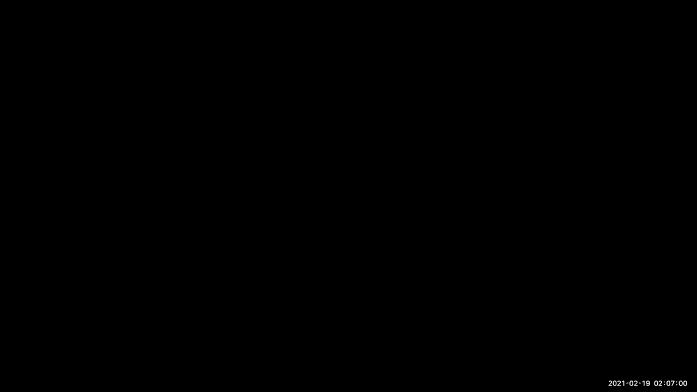

好的，欢迎来到今天的第二课，我们将讨论，呃，学习的基础和如何优化网络，特别是我们要问的第一个问题，什么是机器学习，二号，呃，我们如何定义传统的神经网络，呃，在我们深入研究卷积神经网络之前。

和递归神经网络，和一些现代建筑在接下来的几节课中，以及如何使用梯度进行优化，我们如何进行梯度下降，我们怎么训练，呃，跨多层的神经网络，特别是深度神经网络，我们应该使用什么样的性能指标，如何管理梯度优化。

最重要的是，我们如何使一个模型正则化，因为你知道，回到六十年代，挑战是我们如何增加复杂性，我们如何向模型中添加参数，我们今天面临的问题是，我们如何限制参数，我们如何确保模型不仅仅是简单地记住。

它所见过的每一个例子，都有巨大的模型容量。

所以我们将讨论控制参数的正则化，和模型复杂度，所以我们所有人都对什么是机器学习有某种直观的概念。

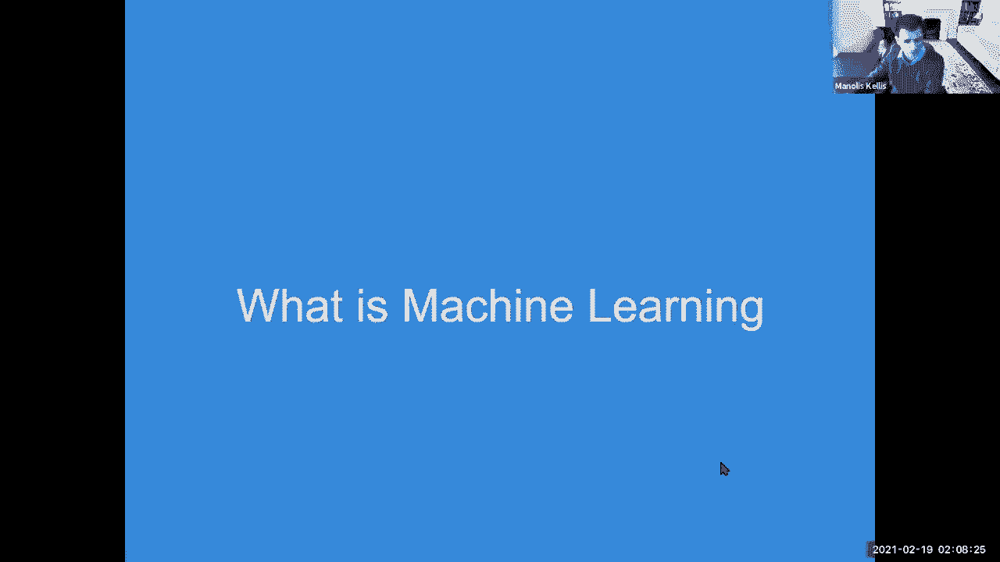

呃，让我们正式地定义它，所以你知道，已经提出了许多定义，所以学习是将经验转化为专长或知识的过程，机器学习可以广义地定义为计算方法，再次使用经验来提高性能，或者做出准确的预测，所以有一个，有一个方面。

你知道的，利用你过去的经验，现在在一些方面变得更好，未来的目标，墨菲二十二，机器学习的目标是开发能够自动检测的方法，检测数据中的模式，然后利用发现的模式来预测未来的数据，或其他有关结果。

这可以追溯到你的许多评论，当你说嘿，生物数据中有模式，这就是为什么机器学习很有意义，但再次关注使用这些模式来，然后执行预测任务，另一个定义是陈述学习任务，给定输入向量的值。

使它成为用某个y帽表示的输出y的一个很好的预测，所以我们将在这堂课中定义，呃，机器学习是从某类任务的经验中学习，使性能度量P随着更多的经验而提高，这是米切尔在1997年提出的定义，因此。

如果用p来衡量的特定任务的表现随着经验的增加而提高，e，然后是学习，这就是机器学习的概念，所以总有一个任务，我们总是用一组数据来构建，然后总是有，嗯，某种性能的衡量标准，所以让我们看看，呃。

到目前为止谁和我在一起，太厉害了，呃，如果有任何问题，请把它们添加到聊天中，我们会在他们来的时候回应他们，比如说，在你的第一个习题集中，e即数据，机器学习模型可能从中学到的东西。

这将是一组手写数字的训练图像，带标签，那将是你的训练套装，你的任务是什么，我们的任务是在新的图像中对未来的手写数字进行分类，这是一个测试集，这和训练集很不一样，所以训练集是用来拟合模型参数的。

模型架构等等，测试集有点像，当您评估模型的性能有多好时，挑战是，如果你有大量的参数，那么评估你在训练中的表现只是意味着，哦，我记得，这个图像，我以前见过，呃，而对于被测试的人来说，这真的是关于推广能力。

这将是我们所做一切的关键，然后性能度量是什么，会是什么，正确分类的测试集数字的百分比，好的，这样你就不用太担心符号了，但只是为了一致性，我们将讨论标量，这些是一维的物体，向量是二维物体，矩阵有点抱歉。

呃，标量只是一个数字，向量是一串数字，矩阵是二维数网格，张量可以是任何它们可以是的东西，你知道的，我们将讨论输入空间，数据集的一个特定示例将使用特定的索引，然后是一个示例的特定特性，它将以这种方式显示。

然后我们将讨论标签空间，以及示例的特定标签，和你知道的特定预测标签，对于那个特定的例子，那是你的帽子，所以我们的输入是x，我们的预测或输出将是Y的，这就是我们要表示的，它们的不同维度，所以再一次。

我们将要讨论，呃，一个输入x和一个输出y以及一个将x转换为y的函数，所以基本上我们的神经网络要做的是，或者我们将要做的任何机器学习技术，在课堂上将评估从，呃，你知道的，输入数据。

然后使用这些特性计算输出结果，而且大多数时候，这将是某种深度神经网络，它对这些数据进行了转换，通常是非线性变换，这就是整个力量，深度学习来自，所有这些神经网络，它们具有非线性的事实。

意味着它们可以近似大量的函数，而如果它们都是线性的，它们只会近似线性函数，所以我们的输入将是一个特定的特性，或在统计中，这些被称为预测器，或自变量或回归，所以再一次，你知道的。

即使是线性回归也可以被认为是一项机器学习任务，其中有一组输入点，你在预测一组输出，你做这些预测的方法是最小化，我不知道这些平方误差，例如，等等，然后再一次，这些是输入变量和协变量，和产出。

我们将把它们作为机器学习中的标签来讨论，但它们可以被认为是统计学中的反应，或因变量，从自变量，所以这些是输入，独立的，因变量是由自变量导出的，是回归分析中的因变量或回归。

作为一个固定的迈阿密或Hiparapa的离子，就这样开始了啊啊啊，所以学校放假，周耶，所以呃，你知道，如果你们想停下来玩城堡，我在上面还有一个缩放会议，哈哈哈，到目前为止有三个小家伙，好的，所以嗯。

我们的训练集将是，你知道的，输入参数的集合和输入一个基本上，所以我们的训练集将包含一组已知的X，因此Y's是众所周知的，然后我们的测试集将是一个独立的x集，葡萄酒也因此而闻名。

然后我们的目标最终将是在现实世界中展示这一点，当我们不知道智者的时候，所以我们将有一个功能和相关标签的集合，训练将是，使用该训练集来学习x和y之间的函数关系，如何将X转换成眼睛。

到目前为止每个人都和我在一起，所以嗯，现在我们的术语是，函数将接受输入的一些参数，然后计算输出，好的，所以我们的输入将是一组二进制图像，是2 8乘2 8 2 8，我们的输出是哪个图像这是1 2 3 4。

一直到十，输出将到处都是零，除了我们预测的数字，然后我们的权重向量，这些将是我们模型的参数，呃，有点，所有这些的相应权重，还有一些偏见，或者某种基地，任何类型预测器的基本偏移量，这就是所谓的偏见。

因为在没有任何数据的情况下，这只是你预测的零的偏移量，所以这只是一个基本的，嗯，你知道的，线性函数的输出，当没有轴的时候，然后我们将优化所有这些，所以我们将使用重量和偏差，这将是这些拦截。

然后是特定的系数，它们将告诉我们如何结合，所有这些像素的值，然后是参数，所以这个功能转换功能可以被认为是世界的模型，所以在我们的第一节课中，我们在谈论世界上如何有可观测的东西，然后我们从世界上做出推论。

推论是我们的模型，我们的假设，或者用机器学习的术语来说，它们可以成为我们的分类器，这些功能基本上很好，是1还是2，这些分类器有效地做出了假设，对世界做出推断，好的，这些推论有时是绝对的。

这就是数字所相信的，记住当我们谈论天气的时候，当你观察云的时候，但你却推断现在是冬天，比如说，所以这将是特殊类型的，呃，你所做的推论，因此，您正在从低级数据中抽象出来。

你在世界上观察到的一个高水平的概念，在我目前的模型中，我目前的假设是什么，或者我从世界上预测的我现在的班级，呃，就一秒钟，所以我们要看两个判别模型，他们只会关心某件事是否，你知道的，猫或者人，比如说。

小心这里的缩放滤镜，嗯，或者一个生成模型，它实际上模拟了关节分布，好的，我们在第一节课上又讨论过了，参数化模型的概念，它实际上试图捕捉世界上天气模式的分布，在自动驾驶汽车里。

您试图对所有对象的分布进行建模，不管这是树还是人，或者自行车，或者一个，你知道的，卡车，等等，诸如此类，而不是一个简单地试图决定，我停下来了吗，我去吗，我向右拐吗，还是我向左转，所以你只是，你知道。

在两者之间做出选择，说四个动作，或者你试图建立一个完整的世界模型，然后你采取这些行动，让我们看看，呃，到目前为止谁和我在一起，让我看看聊天，看看有没有问题，嗯，好的，好的，酷，是啊，是啊，所以呃。

米尔纳，这些都是很好的问题，我们将更详细地讨论这些，好的，可爱如此，嗯，好的，所以你又知道了，所有这些都将是超级混凝土，当你们开始做你们的第一道习题时，所以要记住，pset zero在周一到期。

而pset zero只是在设置环境，在那之后，他说一个人还没有解决生物学，他说一个会是关于这个的，呃，标准研究所，数据集，也就是，呃，这些手写的字，所以请在本周努力设置你的环境。

下周开始你们可以开始做习题集了，然后当你开始这样做的时候，所有非常具体的东西，我们将成为一个，我们将有一个输入空间，然后把这个矢量压平后重新缩放，我们只有一串1和0，然后在这个二进制向量中编码标签空间。

一个被称为热编码的东西，这基本上意味着从向量中，您通过将这些变量中的一个设置为一个来选择类，这就成了一个热门变量，那是你选择的变量，好的，所有的权利，所以现在机器学习不需要简单地分类。

所以基本上在我们的第一道习题集，我们要在10种不同类型的角色中进行选择从0到9，但是呃，分类，只是众多中的一个，许多不同类型的机器学习，另一个非常常见的任务是回归，所以你不是想说这是，呃，你知道的。

你在尝试的是一只猫还是一个人，你试图说一个特定函数的实际值是多少，线性回归是非常常见的，二次高维回归，然后你可以做很多转换，在允许您应用的数据上，线性分类器或线性回归，或者其他基于转换数据集的简单模型。

这也是我们将在整个课堂上看到的，当然还有，呃，有一个完全不同的类，你没有任何类型的标签，所以用回归分类，我们知道输出应该是什么，我们有一个y，它可以是，你知道的，蓝色或红色，或输出函数的值。

而对于无监督学习，我们只是得到了很多数据，我们正在数据中寻找仍在学习的模式，因为你在学习一个模型，例如，你可能会推断有一个高斯的混合体，橙色，然后如果你翻转蓝色，然后从蓝色分布中取样，这可能是某种高斯。

这里可能是，你知道的，另一种，我不知道，伽马分布或其他一些分布，你从这些点取样，所以即使你没有预测性任务，即使你没有输出变量，你试图预测某个X空间中的输入数据，这是一个多维空间。

仍然可以给你足够的信息来学习模式，好的，所以我们将讨论有监督或半监督学习，半监督意味着当你既有学习结构的能力，然后你就有了点的子集的标签，然后通过学习子集的结构和标签，你可以推断出一个学习函数。

分类或回归，呃，在你不在的地方学习的模型，你知道的，考虑到所有的训练，呃，从一开始的答案，例如你在哪里，只是偶尔给出和回答，所以强化学习是来自世界的部分输入的一种类型，部分反馈，你正在学习如何导航。

只是现在，然后你会得到一些关于你所采取的行动的反馈，所以你可以区分这些不同的呃，基于，嗯，你有的y函数基本上我们对输出了解多少，这是一个不等号，如果不平等，如果不是空的，那么它是有监督的或半监督的。

如果输出是一组实数，然后你就可以，你知道，把这看作是多元回归的回归，这是一组多维的数字，然后二进制分类是当你有零个或一个或多个类，或者多类分类，你可以再次排序，一个热整数并对这些进行编码或多标签分类。

其中您试图为每个值预测多个标签，例如，它是一只猫，我不知道，呃快乐，是一个悲伤的人等等，然后无监督学习是当你没有任何输出的时候，好的，所以再一次，你的Y将是，嗯，你知道，的多类分类，呃，习题集一。

我们将使用SoftMax回归，也称为多项式逻辑回归，作为一种多类分类方法，所以它是，我们将对此进行更多的细节讨论，而是用线性回归代替，你用的是非线性函数，它可以是乙状结肠或软最大值函数。

或者逻辑回归函数，等等，好吧，让我们来谈谈目标函数，所以目标函数将是你正在优化的函数，在训练机器学习模型时，它通常是损失函数的一个组合的形式，或者成本函数或错误函数。

所以错误函数不会以不同的方式惩罚错误，它只是简单地说这是正确的或这是不正确的，一个成本函数基本上可以有一个与假阳性相关联的成本，或者假阴性，或者你离得有多远等等，损失函数是你试图预测的。

你实际上预测的是什么，所以它实际上可以量化你有多错，对于每一个中的任何一个，所以为了分类，你可以想到零一损失，要么你做对了，要么你做错了，或交叉熵损失，这就是你所预测的，你应该预测什么，或铰链损失。

这是回归的变差，我们将讨论均方误差或均值绝对误差，所以这是l 1范数或l 2范数，这些是你经常知道的，呃，称为l 1和l 2，我们也将在正规化中看到这一点，所以我们将讨论1个正则化，l两次正规化。

基本上是线性的或二次的，好的，那么这是什么，这基本上是在问还有多远，我是从哪里我试图预测，我要么用我离开的绝对值，这是一个线性惩罚，或者我用值的平方，你很自然地知道，嗯，使这个对称，不管你是上是下。

但它也比附近的离群点惩罚更远的离群点，因为惩罚的二次增加，你走得越远，我们可以在它们之间有混血儿，甚至为了正则化，我们可以有结合l 1和l两个范数正则化的混合，你也可以有概率推断，基本上是说。

函数的分布有多大的不同，在我观察到的Y之间，我预测的是，好的，然后我们将讨论似然函数和后验函数，一种可能性，后验分布基本上告诉我们，最大似然估计量是多少，如果我没有任何事先的期望。

只根据数据来了解数据应该是什么样子，或者如果我有事先的期望，那么我的后验概率是多少，或最大值，后验或地图估计器，值或类，等等，等等，所以基本上这将使用贝叶斯设置，正如我们在第一节课中所说的。

我们使用的地方，不仅仅是我们观察到的证据，而且也是，你知道，那种可能性，这是我们上次谈到的错误的逆转，也是每一个类的先验，然后我们会对参数有一些限制，因为我们不想给任何一个人分配太多的重量。

在任意一个输入值上，因为那样它更有可能过度适应，而且不太可能一概而论，所以我们将因所有参数的总和而受到惩罚，线性的或二次的，绝对值线性，或二次，它又一次照顾了绝对，然后我们要讨论这个最大范数。

这将是评估，所以为了分类，我们将讨论零一损失，简单地说，我多久预测错一次课，从我应该预测的班级，这只是错误数的总和，二元交叉熵损失实际上是在看，它的伯努利分布，那么基本上，产生这些值的概率是多少。

这些值还有多远，与他们的概率相比，所以这只是用发生的概率来权衡一切，这个二元交叉熵损失只是基于信息的值，简单来说就是，你知道的，匹配这个熵的相应方程，好的，所以这只是这两个值之间的交叉熵。

根据这些伯努利分布给出的分布，它们是，你知道的，生成1和0的概率事件，所以我们将讨论分类的损失函数，也就是二元交叉熵损失，然后看什么是Y，标签，那些Y的估计是多少，呃，逻辑回归或，你知道的。

问题集的其他非线性分类器，然后根据输出的二进制化得出的最大估计值是多少，然后相应的损失，还有交叉熵，它捕捉到了更多关于，通过直接使用这些值，我们的预测器有多接近，而不是这些值的二进制版本。

这就是交叉熵信息实际上很有帮助的地方，所以分类交叉熵损失将使用这个，呃，你知道的，基于特定信息的方法，但我们也可以使用SoftMax，哪个呃，就是看这个乙状结肠函数，它把空间映射成一个零。

使用此特定公式的一个输出，我们将在整个课堂上看到，所以同样，只有当它属于类时，输出才是1，否则为零，然后概率解释是，可能性是根据这些类别中元素的分布来定义的，习题集的结构是，输入数据集，一套呃，重量。

这个偏见项，我们将组合成预测器的偏移量，然后是实际输出和损失函数，我们将构建优化器，根据输入损失函数的这些权重之间的差异，所以这将用于训练我们的重量，我们的预测，我们将要做的事情。

这是通过计算均方误差或均值，这些数据集的绝对误差，然后均方误差再次惩罚呃，在遥远的地方，呃，错误，较大的错误更多，较小的错误更少，到现在为止，我们只是在谈论每个错误的每个惩罚都是一样的。

但我们也可以谈论风险，这是与一个特定的预测将花费我们多少相关的损失，比如说，说某人没有病毒，然后在一个大派对上让他们在现实世界中出去，可能比错误的有害得多，说这个人感染了病毒，让他们错过了派对。

但社会的成本就更小了，所以我们可以用风险而不仅仅是损失，我们可以利用这个风险，与这些价值在我们世界中分布的特定假设有关，所以我们可以谈谈这个分布，以及它如何影响这种风险，不仅仅是二元损失。

我们将试图优化目标函数，这将接近输出，目标函数可以是，你知道的，损失函数，成本函数，风险函数，等等，等等，或者相互交叉熵，我们将初始化模型参数，然后我们将求导，基本上我们的产量相对于每个重量。

所以我们要问，我可以改变多少我的参数，以达到全球成本最低，我们将根据这个最小值进行梯度下降，所以在p集合1中，我们将使用随机梯度下降，在每一步中，我们将随机抽取一小批，不是所有的数据。

但是训练数据中的一小部分数据，并更新参数，使用我们专门从那个小批处理中计算的梯度，所以这基本上意味着，当我在每次迭代中浏览数据时，而不是试图一次进行最小化所有内容的更新，我将最小化。

关于每次数据的不同子集，梯度会稍微移动，每次方向略有不同，但最终使用最小化中的所有数据，然后对每个参数求导，每个砝码，所以为了问，我如何在T的下一个时间点更新我的权重，呃，我从t减去1得到的增量。

所以这些是上一个时间点的权重，我在下一个时间点更新每个重量，对损失函数求导，相对于我正在优化的每个权重，那么目标函数就是损失函数，它正在评估所有的训练数据，让我们看看到目前为止谁和我在一起。

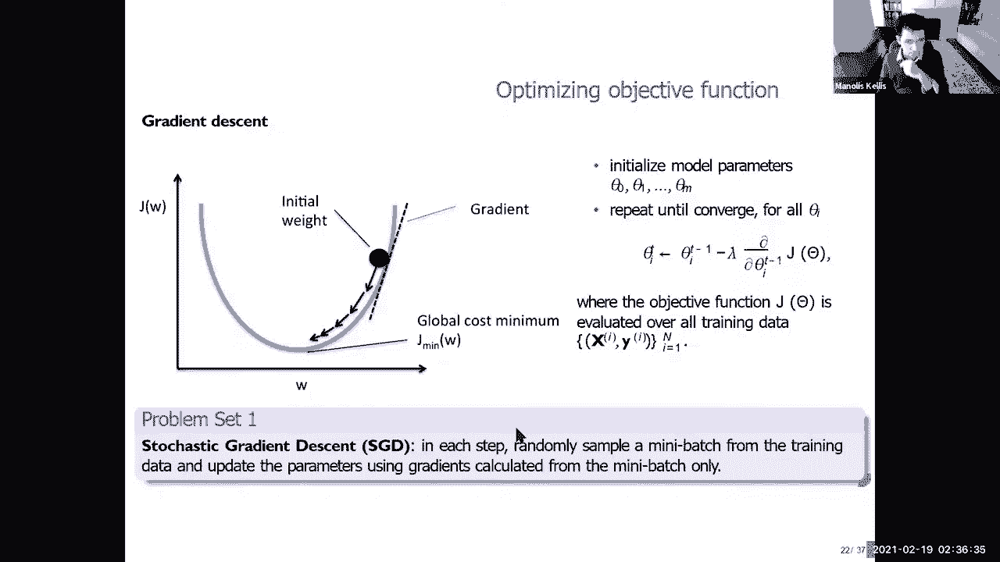

很酷，所以大多数人仍然和我在一起，好吧，所以现在让我们来谈谈培训和评估，所以我们将使用训练集和测试集。

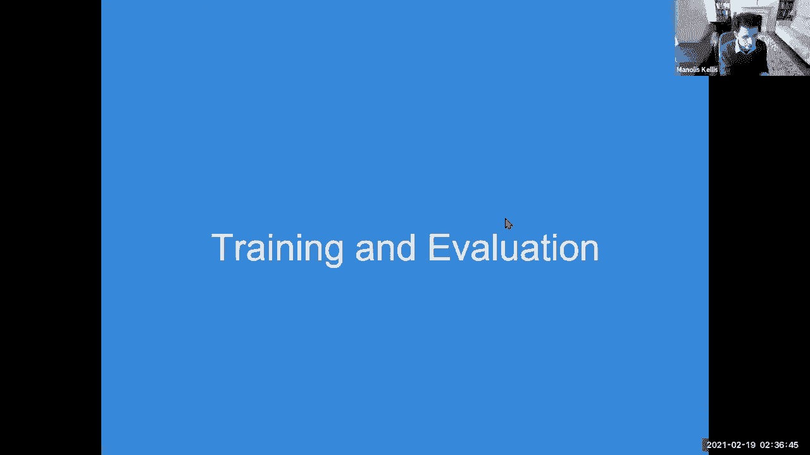

那么为什么这些有帮助，因为随着我越来越多地使用这种梯度下降来训练模型，我会告诉你更多关于，很快，1。我可以将损失减小到最低限度。但真正有趣的是，如果我保留一个单独的验证集。

与我们的训练集完全分离的验证集，什么是真正奇妙和超级有趣的，随着他们在训练中变得更好，我也神奇地在验证集变得更好，这基本上意味着有一个函数将x映射到y，我真的在学习使用数据子集的功能。

但在一段时间后又发生了一些非常重要的事情，一定的训练，就是我的错误，我在验证集上的损失函数开始上升，那么这里发生了什么，正在发生的事情太不合适了，所以再一次，正在安装，基本上意味着有一个函数要拟合。

如果我在训练的早期处于这种状态，我还没有真正学会那个功能，我还没有充分利用我的模型的力量，去近似那个函数，但过了一段时间，我正在逼近这个函数，在训练布景上有点太好了。

这基本上意味着我在未来的表现开始变差了，它可能没有我输入数据的特殊性，比如说，我可能我不知道在分类猫对人的照片，我可能会意识到所有的猫都穿着，我不知道所有照片里都有粉红色的睡衣，因此，当我进一步训练时。

而不是耳朵和胡须，等，我在捕捉粉红色睡衣的影子，在猫的脸上，那只在我的训练套装里，它不在我的验证集中，所以我并没有真正了解到关于这个函数的一些真实的东西，我可能会知道我不知道所有的照片都是照相机，或。

你知道一些与未来图像不太相关的东西，所以我们将再次把数据分成第一个，一套训练设备，这些将用于训练，但挑战来了，如果你基本上说，哦，好的，很好，嗯，我要停止学习，呃过程。

当我在这个坚持的集合中的错误开始增加时，所以说，这基本上意味着我将就此打住，但也许如果我有一个单独的数据集，可能只是，你知道，与其他单独的数据集略有不同，所以战斗的方法，那基本上就是说好，伟大。

现在我已经根据一个独立的数据集最小化了我的损失函数，但我真的不知道表演，因为我有点太胖了，使验证集损失最小的历元数，但我真的不知道最小的损失是否会是损失，我希望另一个随机样本的图像或另一个样本，的。

这里的关键思想是，训练集和验证集都是来自底层分布的示例，有各种偏见的，所以所以，如果我能停下来观察什么能真正最大限度地减少我的损失，我真的不知道真正的概括力，这就是为什么我们通常将数据拆分为验证集。

用来调音的，我们要训练多长时间，或者调优超参数，比如说，我应该穿多少层，呃，神经网络有，我应该使用什么样的卷积滤波器，等等，等等，所以所有这些都可以用来评估预期的推广能力，这就是验证集的作用。

然后我们在一个独立的测试集上真正测试一个完全训练的模型的性能，所以一组例子，这只用于评估一个经过充分训练的模型的性能，然后对性能进行评估测试，模型不能再调谐了，你说不好，我做得不太好，让我再训练一会儿。

然后看看我做得怎么样，因为这样你就需要使用另一套测试集，你以前没见过的，所有的权利，让我们看看到目前为止谁和我在一起，然后呃，下一个问题是嗯，查看共享结果，停止共享结果，嗯，他们觉得自己学到了一些东西。

好，这很有帮助，所以呃，三五二六二六十三零，太棒了，嗯好吧，那么我们如何评估，呃准确性，我们怎么知道我们做得好不好，所以是的，这是我们评估准确性的地方，但我们如何实际评估准确性。

有很多方法可以做到这一点，我们可以看到真正的正能量，这是我们的，嗯，对不起，真正的积极因素或真正的消极因素，绿色部分是我们想要最大化的，红色的部分基本上是假阳性和假阴性，所以如果你预测某件事是积极的。

而且它真的是积极的，这是一个真正的积极因素，如果你预测积极，但实际上是负面的，这是一个假阳性，当你预测阴性时，假阴性，但这是真正的积极和真正的消极当你预测消极时，但这真的很消极，这样你就可以评估准确性。

特异性，然后根据这些分数进行召回，所以特异性是我有多少真正的否定，在所有的，我正确地预测了多少个负面消息，特异性这就是特异性，灵敏度是，我正确预测了多少积极因素，所以在积极的方面，我正确预测了多少。

和消极方面的特殊性，我正确预测了多少，精确度和准确性再次是所有真正的积极因素之一，抱歉，在所有预测的积极因素中，有多少是真正积极的，然后准确性是在整个人群中，真阳性和真阴性的总和是多少。

F One评分结合了回忆和精度，根据数据集的平衡，这些差异很大，因此，如果您的数据集非常不平衡，那就更容易得到了，说，灵敏度高，但代价是你知道，特异性等，诸如此类，再次。

我们将以这种特殊的方式讨论真实预测的比例，好的，这些都是我所做的预测，这是真正的积极和真实，然后呢，呃，接收机工作特性，它来自战争期间不同渠道的传输，在某种程度上，交流基本上是在说。

当我将分类器的阈值调整为，你知道，非常严格的或非常宽松的，所以当我调整敏感性和特异性时，I沿着哪条曲线起作用，你可以通过拥有，你知道，只是总体上更高的敏感性曲线，在随机分类器具有，呃，你知道的。

沿着对角线行走，一个完美的分类器将沿着轴行走，您可以测量曲线下的整体面积或AUC或，你知道一个大鹏，接收器工作特性下的区域，基本上说，你知道的，什么是总体上更好的分类器，即使在特定的情况下，你可能会。

你知道，交叉的曲线，所以在这个政权中，这个分类器比较好，而在这种情况下，另一个分类器更好，在这个政权中，你知道，这个分类器更好，等等，所以它们不一定要单调有序，这个总是比另一个好。

这些曲线实际上可能会交叉，所以再一次，呃，因为接收机的工作特性实际上是期望真阳性和假阳性，的，在数据集中平衡积极和消极，还有其他曲线更适合，当数据集不平衡时，比如说，精度召回曲线，它是看精度和回忆。

你知道，更好地捕捉非常未买的东西，对于非常不平衡的数据集，它能做到这一点，一次又一次，这些是互补曲线，它们捕捉了不同的方面，所以你也可以在回归设置中，你实际上没有对例子进行分类，但你在预测比分，比如说。

你可以说好，我实际预测的值之间的相关性是什么，我应该预测的价值，好的，如果你预测的值完全正确，那么相关性是1，如果你预测，你知道完全随机，相关性为零，如果是负1，那么你的状态很好，只要逆转你的预测，嗯。

但你知道，通常如果你在这个灰色地带，那么你可能会做得更好，挑战，当然啦，与相关和皮尔逊相关是，嗯，即使所有这些相关性曲线都是1或-1，这是伟大的，嗯，这里的这些曲线显然有很多信息内容。

仍然显示出精确为零的相关性，所以因为它是由x定义的，减去平均值，除以你知道的，有多少个X的次数等等，那么所有这些实际上都表明，零相关，所以还有其他指标来评估回归预测器，比如说。

Spearman秩相关性不关心数据的具体值，只是数据的顺序，你知道的，对于领带，你可以分配一些分数等级，根据按升序排列的平均等级，所以你基本上可以说，我预测的数据等级是一样的吗。

即使我不在乎具体的价值观，这对，你知道吗，巨大离群值，或者对于未分布在，你知道吗，呃，典型方式，这里的精斑关系是一个，因为我可以预测所有数据的正确排名，尽管皮尔逊相关不是一个，好的，所以让我们看看，呃。

到目前为止谁和我在一起，好的，很好四三三六二一零零，所以我们要问，我应该有多兴奋才能得到88的皮尔森相关性，你知道这很棒吗，这样可以吗，就这么糟吗，这就是相关性显著测试的用武之地。

所以基本上我们可以说所有可能结果的集合是什么，我所期望的，我希望看到这个结果的概率有多大，那么意义就在于，我不太可能看到我的相关性的价值，还是为了我的同意，或任何其他精确度指标，与我所期望的相比。

你知道吗，随机分布，所以学生的T分布基本上给了我们这个期望，在零假设下具有特定自由度，所以基本上如果n是观察数，然后我们基本上可以对值进行置换，所以如果我排列我的预测器，或者如果我排列我的数据。

那么我将观察到的相关性的预期分布是什么，然后看看离那有多远，基本上，沿着这些分布观察，我和这里有用的东西，这里有帮助的是，这些分布实际上有很好的特征，所以我们实际上可以用一个统计测试来说明。

我是否在某个显著的P值范围内，我们可以谈论统计显著性阈值，我们与预期数据进行了匹配，而不仅仅是相关性p值，这是一个单面测试，如果我期望它是，你知道很强烈，或者但是我我想说。

这比我预期的要高吗我只有一个片面的测试，但如果我说它与我所期望的不同吗，那是我用双面测试的时候，它基本上是说它是高于这个阈值还是低于那个阈值，然后双面测试基本上把一半的面积分配给每个方向，因此。

如果你说它有95%的信心，每边都有2。5%，所以他们比你需要的更严格，如果你只测试一个方向，有适当的测试，如果你在两个方向上测试偏差，所以我们基本上可以谈论二项式测试，评估零模型产生观察到的结果的概率。

所以如果我有n个观察和k个结果被正确分类，那么分类器随机做出正确选择的概率为p，然后我们可以计算出确切的k个观测被正确分类的概率，只是偶然，只要通过空模型，这只是从n次中选择k。

从k个正数中选择一个的概率，乘以选择n-k负数的概率，这是这k个观测的确切数量，但如果我想说，我希望至少有K，然后我就用，呃，所有k或更大的值，然后每次这样做，这有时被称为超几何分布。

这是用卡方检验近似的，有适当的自由度，当然还有，嗯，你测试的假设越多，你就越有可能，他们中的一个会证明是真的，所以如果你问N个问题，你需要调整零的概率，因为如果你很兴奋，如果任何分类是重要的。

你有一千种可能的方法来分类数据，那么其中一个肯定会被认为是重要的，你知道一些可能性，所以嗯，你这样做的方式是，你可以纠正这些，所以你基本上可以用一根非常严格的骨头来矫正RI，简单地说，我有M个假设。

他们中的每一个都有可能偶然出现，因此，我应该相应地缩放校正后的p值，然后对于任何一个观察，我最好将校正的概率除以…的期望数，我正在测试的不同假设，您可以使用不太严格的校正。

本杰明·霍赫伯格提供了如此理想的假阳性率，我们的错误发现率使用一个更宽松的界限，其中如果alpha是所需的错误发现率，M是测试次数，那么你实际上是按照它们的p值上升的顺序来测试它们。

你会发现最大的k使得相应的概率是k/n倍，你想要的错误发现率，因为你在整理它们，你考虑到了，嗯，根据我期望的数量来调整特定的阈值，至少那个概率，或者至少是那个概率等等，然后你就拒绝了假设。

对于所有剩下的假设，但不是那些超过特定阈值的，所以你知道你可以用它来调整你的阈值。

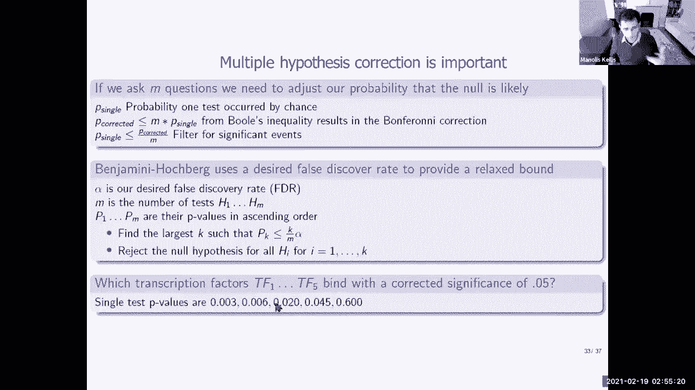

呃，因此，再次，呃，有一个很酷的网站，为了呃，呃，教导人们相关性不是因果关系，你真的可以进入任何曲线，它基本上会告诉你一些与曲线相关的值，例如，因被床单缠住而死亡的人数，与滑雪设施产生的总收入密切相关。

你知道这只是一个完全的统计流感，所以你应该意识到，呃，你知道吗，如果有足够的数据，你几乎可以在任何地方找到相关性。

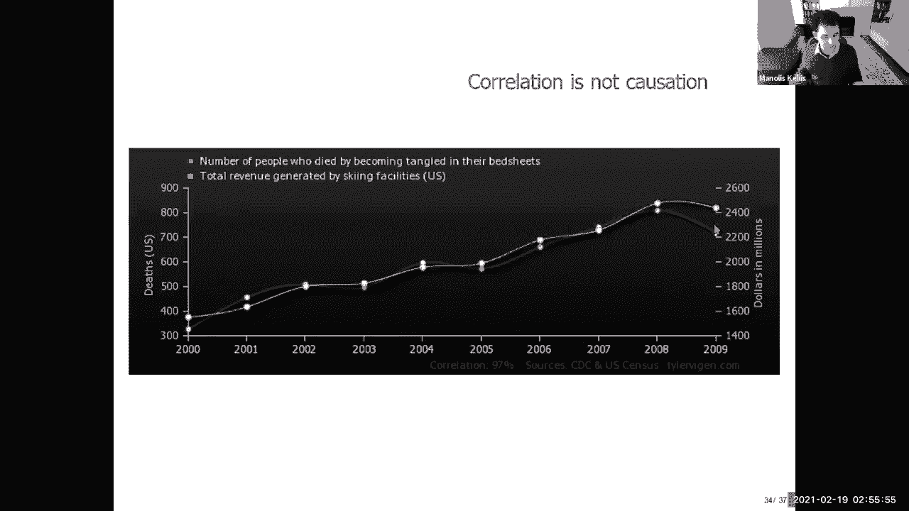

然后呃，你也应该意识到所有这些，呃可以有零相关性，还没有很高的互信息，所以这些形状中的每一个都有接近于零的相关性，但又一次，缺乏相关性并不意味着缺乏关系。

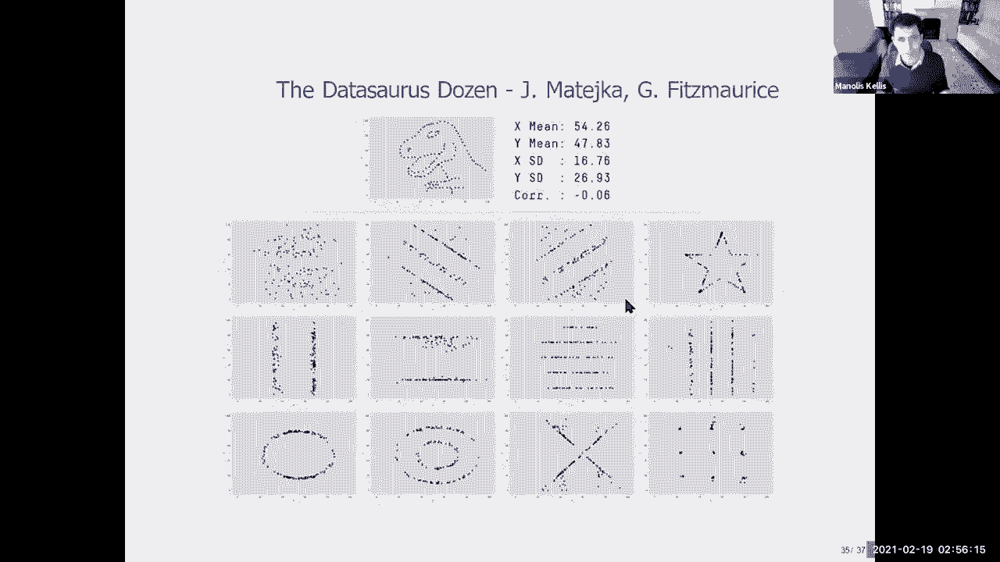

好的好的，这是一些基本的基本工具，机器学习，所以现在让我们转移到，嗯，你知道的，我们现在如何将所有这些应用于神经网络。

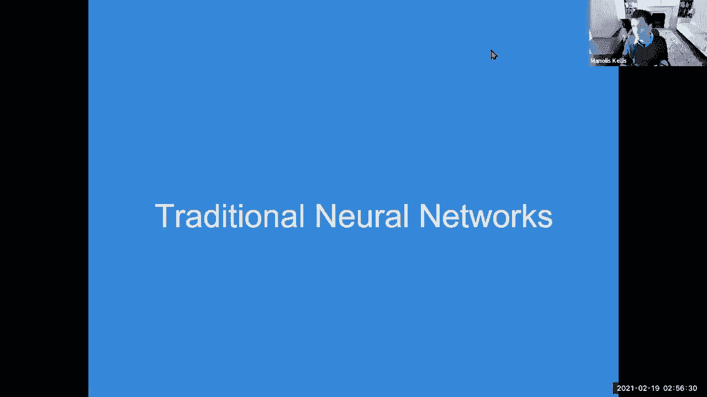

具体地说，你知道我要做什么。

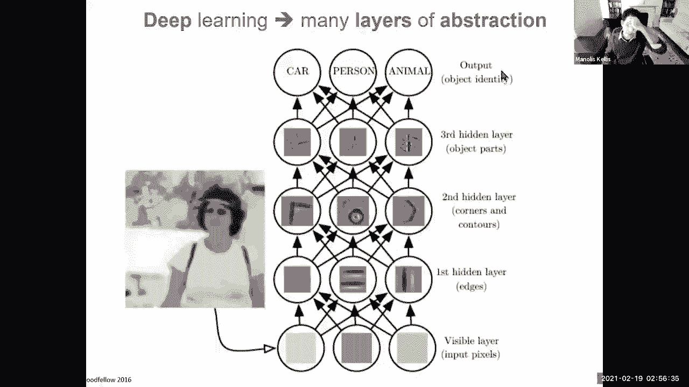

我要请大家站起来做伸展运动，所以呃，各位，拜托了，我可以请我们无畏的助教来协调拉伸休息吗，所以呃，杰基，呃，取消静音，然后呃，人们是如何做一些伸展运动的，哦，好的，我不认为我有资格领导这个。

但这个得伸展你的背部，我认为这很重要，对不起，你们不要，我有资格做这个，我不知道，如果苔丝能帮上忙或跳这个，这是件好事，你甚至看不到我，我有一个虚拟标记，那个东西，谢谢你的鼓励，是啊，是啊，你做得很好。

杰基，你可以把肩膀伸出来，就像交叉手臂，你知道，帮我拿一下，我看到三个深蹲，每一个可能是我个人的极限，所以这是一个，我真的不能这么低，和背景中的分享，把你的胳膊伸出来，这里实际上是跳一点让血液流动。

跳千斤顶太棒了，那我为什么要这么做，因为流向大脑的血液越多，你对我的关注就越多，所以这是一种非常偷偷摸摸的偷窃方式，在接下来的2-5分钟里为我们提供更多的卡路里，所有的权利，所以让我们，呃，潜水。

顺便说一句，让我们在这里做一些脉搏。

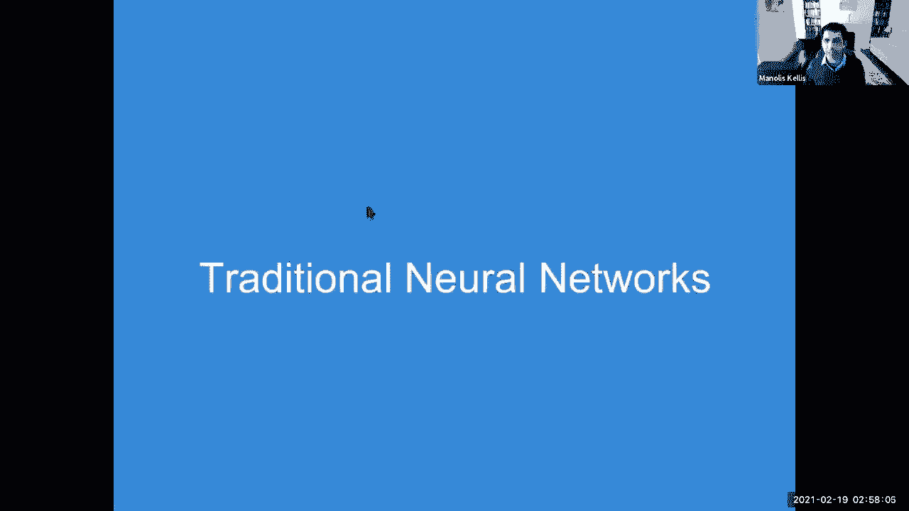

所以到目前为止，谁觉得他们学到了什么，呃，让我们看看，再次，你们中的许多人都上过机器学习的课，所以希望这对你们中的一些人来说是一个回顾，但我觉得很酷，有很多人，呃，在这里击掌，这是伟大的，所以呃，是啊。

是啊，我们有三八三四二，四三零，然后，嗯，进度如何？我们做得怎么样，我是不是开得太慢了，我走得太快了，所有的权利，所以在恰到好处和略高于这个之间的某个地方，呃酷，然后，呃最后，嗯，你觉得你跟得有多好。

没有威尔逊，你不是这样的，嗯是的，明天的朗诵会是对这一切的回顾，这太棒了，好的，太厉害了，所以呃再次，呃，八二十二零零，那真是太酷了，所以呃，让我们呃，现在深入研究神经网络。

所以我再次给你们看了第一张幻灯片中的这张照片，我认为这很好地体现了我们所说的深度学习，事实上，我们有多层网络，它们将学习原始数据的抽象，所以在底层，你将直接连接到你的输入，然后在第一层第一个隐藏层。

您将从这个输入层获得信息，这将使一些抽象，例如学习边，然后你要做角和轮廓，在边缘上建造，你将学习物体部件，在角落和轮廓上建造，然后你将根据物体的部分来识别它们，好的，这就是等级制度。

我们将在所有这些深度学习架构中研究，所以说，回到六十年代，这是已经存在很长时间的东西，时间长了，发生在模型空间本身的主要区别是，卷积滤波器的概念，这些参数是作为一组单独的参数学习的。

这些参数将应用于整个图像，所以不是学习这里的优势和独立学习那里的优势，你在学习边缘的概念，你在整个图像中应用它，这就是这些卷积滤波器的作用，好的，今天我们不讨论卷积滤波器。

星期二我们会有一整堂关于这个的课，我们将了解这种深度神经网络的基础，不用担心这组额外的参数，所以就目前而言，它将只是重量，将在这些级别中的每一个级别上计算，好吧，再来一次，正如我在第一节课上提到的。

这些灵感来自人脑，通过大脑中每个神经元的树突接收信息，然后在你之后发出信号，你越过了一个特定的激活阈值，并通过你的口音将信号发送到下游的所有神经元，现在你可以把这个生物结构抽象成一个计算结构。

基本上说这个特定神经元的输出将是一个加权，所有和我说话的神经元的输入总和，所以我将有一个与每一个相关的权重，这就是学习的地方，其他一切都只是通过网络流动，你基本上有不同的输入。

所以如果我展示一只猫或一个人的图像，这些只是不同像素的输入，我所学到的，是一个函数，它将这些像素转换成一个人的概率，和猫的概率，所有这些学习功能都是，好的，他百分之百支持我，因为我觉得这是，你知道的。

这就是深度学习神经网络的核心所在完美，顺便说一句，你们的民意调查做得很棒，非常感谢你所有这些答案，好的，所以我们有72个，二一，七零零，所以这是在网络层面，这是在每一个节点的级别上。

所以这些节点中的每一个都接收输入，根据重量来称重，然后如果他们跨过门槛，它将完全相同的输出发送到网络上的所有后代，好的，正在计算的函数是什么，你可以计算一个线性函数，比如说，所有x的加权之和。

你知道有些偏见，好的，那应该是等号，这是最初的神经网络，但神经网络变得真正强大的地方是，当该函数通过时，和非线性，好的，这种非线性允许你现在，显著增加可以近似的函数空间，这就是我们所说的神经网络。

它是一个四层深度神经网络和多层深度神经网络，几乎可以学习任何功能，只要我们引入一个非常时髦的结构，这是一个非线性，什么是非线性，非线性只是打破了，你知道的，我所得到的就是我所得到的，为什么。

因为如果你所拥有的只是到处都是的线性，那么它只是一个大的线性函数，你真的学不到那么多，但是通过引入非线性，你可以突然学习XOR函数，你知道，各种逻辑函数、形状和曲线，你知道，所有其他的轮廓和转换。

根本没有捕捉到，呃，用纯线性网络，基本上是这个乙状结肠单元，它采用了神经元的概念，在跨过门槛之前根本不开火，然后神经元发射，所以他们基本上说，好的，通过研究神经科学，你知道吗，非人类哺乳动物。

然后观察他们的神经元对不同激活水平的反应，他们基本上说，哦哇哦，如果我给它一堆活动，你知道电，但在一个特定的阈值以下，什么也不会发生，然后当我开始跨过门槛的时候，有些事情发生了，它最大，好的。

这就是最初的乙状结肠单元，非线性来自于基本上说神经元要么向一个，或者它不在零点开火，当你跨过门槛，如果激活把你从一个推到另一个，你可以通过使乙状结肠更尖锐或更宽来调整它，据你所知，特定参数。

你基本上可以说，总激活水平是多少，我在什么点x穿过它，我穿过它有多陡，好的，这些只是你可以用来有效地缩放乙状结肠单元的参数，然后在乙状结肠单元之外，你，你知道吗，人们基本上说好。

有些神经元不只停留在一个，但有时他们开火很多，所以软加单元被改造成，基本上你知道没有输出，直到你越过门槛，但当你跨过门槛，你不能只停留在一个，但你继续到你收到的输入水平，所以这给了你更多的表现力。

这让你有能力真正大声喊出来，哇哦，当你看到它真的是一顶帽子，一些真正让神经元燃烧的东西，好的，这就是软的好处，软的加，或者软麦克斯，um函数，在这里再次表示，它没有饱和度，过渡很平滑，在现代，深度学习。

我们大多忽略了软加和乙状结肠，赞成一个简单得多的函数，它基本上是一个整流的线性单位或relu，所以整流线性单元基本上意味着它是线性响应，只要我跨过门槛，所以在一个特定的阈值以上，我只响应x等于y。

低于这个门槛，我根本没有反应，好的，那么谁和我在一起，所有这些呃，这里的激活单元，所有这些非线性，非常的酷，所以呃，我们在78，十三九，零零，好的，所以嗯，每个隐藏层基本上都有一些激活功能作为它的输出。

我们将讨论输入层，输出层和中间的隐藏层，深度学习的意义在于拥有多个隐藏的层，好吧，再来一次，您可以有多个输出函数，你可以有一个Relu，你可以有一个乙状结肠，你可以有一个切线，呃苏坦。

基本上是从负1到正1，而不是再从零到一，与乙状结肠非常相似，但只是缩放，然后你也可以有一个漏水的relu，它之前有很强的激活能力，但在那之前也有一些激活，然后是学习，然后我们基本上说，好的。

那么我如何根据输入调整所有这些权重，匹配输出，所以我得到了一堆猫的图像，我得到了成千上万的猫的图像和成千上万的人的图像，我想要的是学习翻译的函数，一堆像素变成猫或人的图像，或者一个角色，三个或一个字符。

四，那么我如何学会这一切，我学到的方法，那就是让这些输出单元告诉我，哦，好吧，你应该在这里为猫开火，但你显然不是为了猫而开枪的，所以你为什么不把你的体重一直向下调整呢，好的，这就是学习过程的作用。

它基本上说，我如何调整重量，使i i匹配输出函数，我应该匹配的，好的，调整重量的方法是通过，关于每个输入变量的误差，好的，这样做的方法是，基本上说，我会调整体重，时间t减去1到时间t。

我将通过求导来调整我的体重，不是沿着所有的维度，而是沿着一个特定的维度，好的，所以我基本上可以沿着x 1的这个维数求导，沿着这个维度x2，通过对每个权重取误差的偏导数，我基本上可以调整我的体重更新。

以更接近真正的价值，通过最小化错误，所以基本上我对误差求导，然后把重物移得更近，好的，到目前为止谁和我在一起，这基本上是基于梯度学习的基础，这很有帮助，所以三九三九十六六零，然后呢，呃，速度如何？

我是不是开得太快了，我是不是开得太慢了，我要写吗，所以人们觉得我刚刚好，百分之四十一的时间，只是有点太快了，百分之五十的时间，但不是，但几乎没有人太快，所以耶，我是，嗯好吧。

所以现在我们得到了这个关于重量的导数，我们可以在上面加上各种各样的铃铛和哨子，事实上，让我看看聊天看看，助教是，呃，回答所有这些问题，所以嘿，塔斯做，我们有任何问题到目前为止还没有得到回答。

我应该现场回答，嗯，我觉得，一个我们还没有得到回答的问题是为什么，你会用一个软加，就像在像Relu这样的东西上，我想是的，所以这并不常见，它是，你知道吗，呃，计算起来更复杂，但它使过渡更加顺利。

所以基本上，如果你试图在锋利的边缘上进行梯度下降，那么你可能会在这里遇到问题，所以基本上这会使梯度下降更平滑，这将是软Plus的一个优势，但在实践中，这只会使计算变得更加困难。

我可以帮助回答的任何其他问题，或，呃，同时，杰基和其他助教，如果在聊天中有一些你觉得有帮助的澄清，欢迎你把它们放在这里，嗯活着，所以你知道当我停下来的时候，我们可以做到这一点，好的。

所以这是这里的这个术语，所以误差对每个重量的导数，但我不只是在一个层面上这样做，我在每一个层面上都这样做，所以如果我只有一个这样的输入，那就超级容易了，我会像，好的，伟大，让我们这样求导。

但我得到的实际上是这个的导数，也取决于它的导数，这也取决于这个的导数等等，这就是反向传播的作用，基本上允许你传播这些导数，使用网络中被称为链式法则的东西，什么是链式法则。

链式法则基本上允许你在这些级别中的每一个级别上计算，作为这个的函数，它本身是作为那个的函数计算的，它本身是作为那个的函数计算的，好的，这就是链式法则允许你做的。

允许您将其中任何一个计算为前面所有层的函数，好的，所以每一个都要求导，但不仅仅是在这方面，但也考虑到所有的东西，为了调整重量，因为如果我只调整这些重量。

那么你知道我并没有真正学会如何从输入中构造任何东西，基本上我需要做的是把重量一直向下调整，这就是所有允许我这样做的偏导数，如果我用这个导数，我可以把它表示为导数，关于每一层的所有这些中间变量，好吧那么。

但还有很多额外的铃铛和哨子，我可以添加到这个，所以基本上最基础和最基本的梯度，下降是误差对每个权重的偏导数，但我可以增加一个学习率，这基本上告诉我很好，我有那个导数的方向，但我应该按多少比例。

这就是学习率的来源，你基本上可以说好，我可以通过沿着坡度走更大的步来学得很快，这就是这张照片的原因，我基本上可以说好，我发现这个梯度在向那个方向移动，也许我应该往那边跳，或者也许我应该跳一点点。

这就是epsilon的作用，好的，学习率，它需要避免超过最优解，但除此之外，我们可以加一个重量，腐烂，它不只是采取渐变，但它实际上减去了之前的时间步长，重量乘以某个衰变因子，为什么这有帮助，那很有帮助。

因为重量的衰减会导致非常，非常大的重量会衰减得更多，因此，它在某种程度上推动你的体重变得更小，更有控制力，好的，所以它惩罚大重量，以防止过度适应，然后除此之外，我基本上可以问上一个时间步长的增量是多少。

我在上一个时间步中改变了多少，我向什么方向改变了，基于那个三角洲，我可以包括一些动量，基本上确保我不会跳过正确的解决方案，来来回回来来回回，现在朝着那个方向前进，我慢慢地平稳地走下去。

最终会聚在正确的答案上，好的，所以我们谈到了学习率，我们谈到了重量衰减，我们还谈到了势头，基于上次更新的幅度和正弦，在多个维度上，这也是上次更新的方向，好的，这就是基于梯度的学习所做的。

现在随机梯度下降，它每次随机采样样本的子集，然后它只使用该子集更新权重，和在线学习，每次只使用一个训练数据点更新梯度，当你看到点，你在根据这些点调整渐变，好的，所以呃，让我们看看到目前为止谁和我在一起。

太厉害了，所以17 12 2 0 0好的。

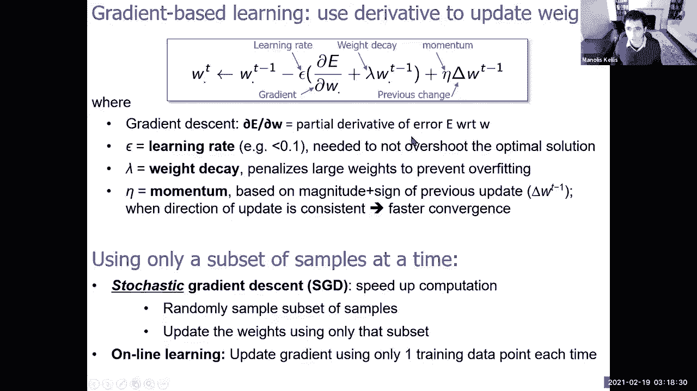

所以现在让我们潜入其中的一些呃。

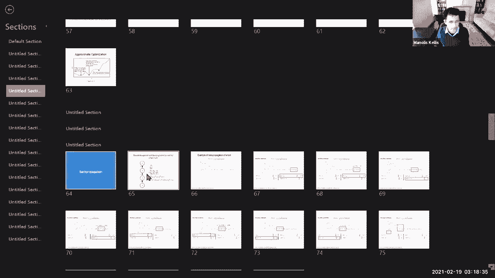

基本上跨越多层的方法，好的，所以呃的导数，z相对于某个重量，使我们现在可以优化这里的重量，它经过多层，那么我该如何调整呢，嗯，我可以求z对w的导数，简单来说就是，这就是链式法则的用武之地，z对y的导数。

然后y相对于x的导数，和x相对于w的偏导数，它基本上是每次计算相同的函数，它是函数f的导数，因为我所有的转换都有相同的功能，它基本上是y的f导数，f是x的导数，w的导数f为，就是在w上两次应用函数f。

x是什么，这是应用函数f 1从w和w，完全没有应用函数f，这就是链式法则的用武之地，所以反向传播基本上允许你做的，就是你计算相对于链条上下任何重量的梯度，只要把这些偏导数。

你基本上可以看看反向传播的特殊例子，通过所有这些偏导数，所以每次我计算这些梯度相对于所有这些，好的，所以我基本上有一个特定的函数，我正在计算所有这些，一路向下，所以我们基本上在每一步都有局部梯度。

然后我们有远处的梯度一直向下。

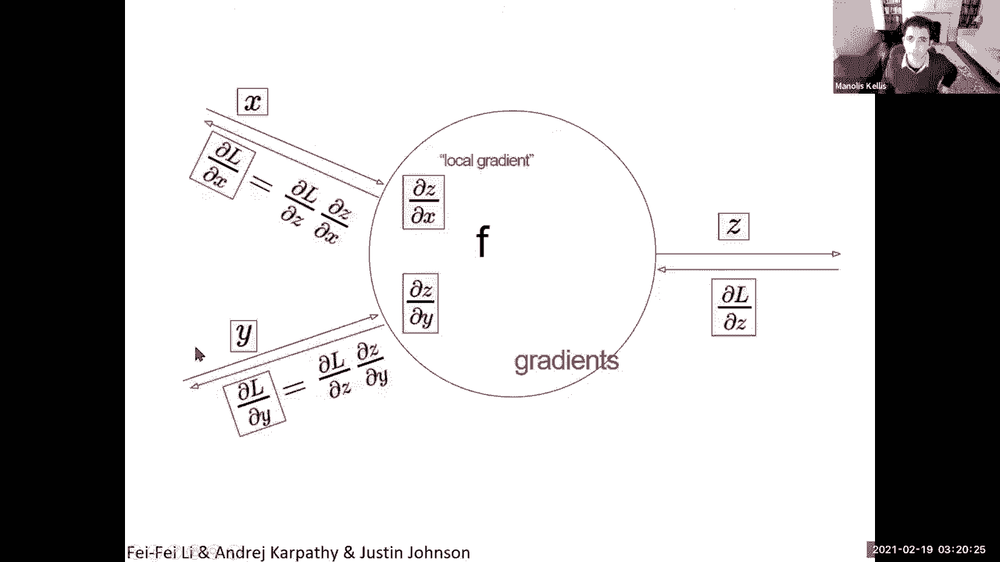

好的，所以这就是现在，你知道吗，最基本的基础，呃，这是为了这次学习。

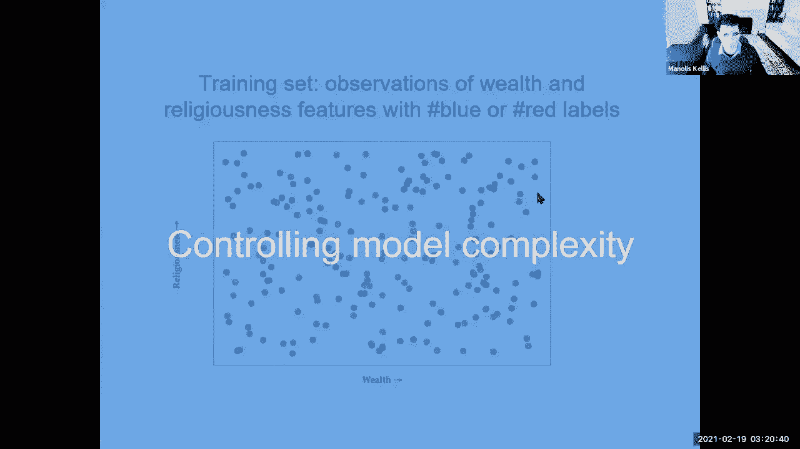

我们有能力回到过去，用这种方式训练我们的模型，当然，挑战是，我们怎么知道，我们有多少参数，我们如何控制模型的复杂性。

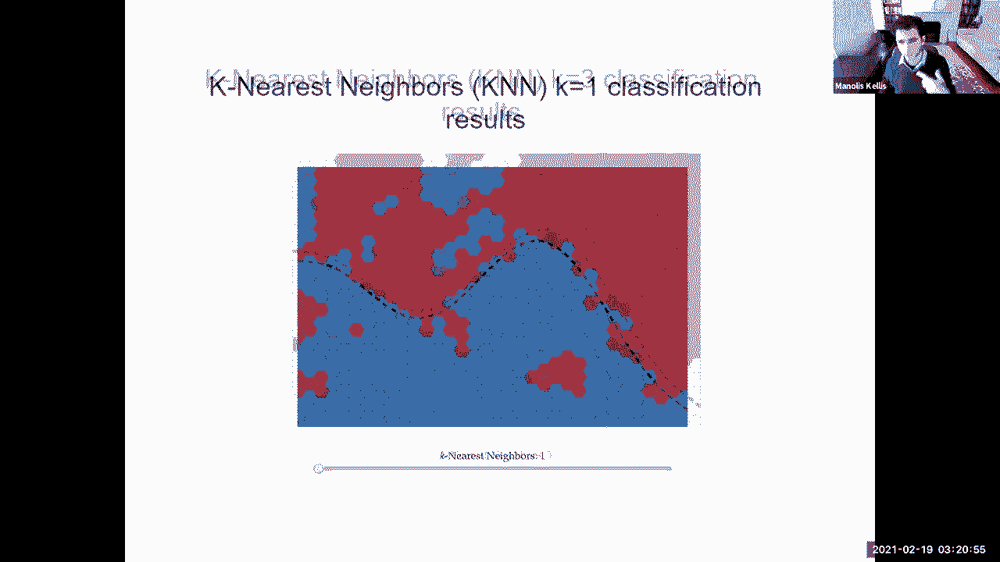

这就是嗯。

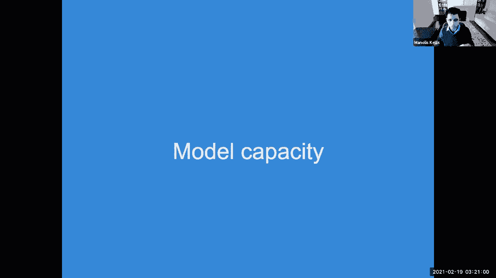

模型能力对识别很重要，那么什么是模型容量，模型的容量或VC维度，当对手产生点数时，能正确预测多少点数，它基本上告诉你什么是整体建模能力，有多少，这与模型参数有关，但不仅仅是参数。

这也像我可以有一个baa百亿，像线性参数，但如果我没有二次方的东西，它对你没有真正的帮助，所以不仅仅是参数，也是你可以计算的函数类型，所以这就是，呃，你知道的，VC维度，基本上是模型的有效维度。

所以容量是一个非参数模型，由训练集的大小定义，所以如果我看最近的邻居，我问，你知道的，我如何根据最近邻对空间进行分类，然后呢，每一个，该空间上的xy坐标将由与其邻居的接近度定义，根据这个德尔，比如说。

k个最近邻根据k个最近训练示例计算输出，经常，它是呃，你知道很好的方法，当然也是一个非常非常好的底线，但后来，一个模型的可推广性讲的是，在以前看不见的输入上表现良好的能力，因此，如果你在训练这种分类。

这个分类器基于所有这些，你可能没有很好地意识到，你知道这些人只是有点不对劲，在那个空间里的未来点很可能是红色的，而不是蓝色，所以如果你根据神经最近邻训练，例如，您的泛化能力可能很差。

因为您并没有真正学习分离这些数据集的函数，这就是呃，泛化真的出现了，所以说，模型的通用性，描述在以前看不见的输入上执行良好的能力，我之前给你们看过这样的图表，其中x轴是训练的时代。

但这里x轴是模型的容量，所以x轴现在基本上告诉你参数的有效数量是多少，或者我的模型的有效维度数或VC维度，你可以看到，参数越来越多，我可以越来越好地匹配我的蓝色数据集，但是我的泛化误差又增加了。

一次又一次，偏差告诉我，我与给定的数据集匹配得有多好，方差基本上告诉我我与，你知道的，未来数据集，根据我从现实世界中获得的随机样本的变化，在我的训练集和测试集之间，所以如果你有，比如说。

只有3个隐藏神经元或6个隐藏神经元或20个隐藏神经元，然后你可以用或多或少的容量来近似这些函数，您可以降低模型的容量以避免过度拟合，但挑战是，如果你减少容量，你也减少了你可以近似的可能函数的空间。

所以另一种方法是简单地正则化你的参数，说，让我来惩罚这些参数的大小，而不是简单地，你知道的，完全避免有更多的参数，所以你可以权衡。

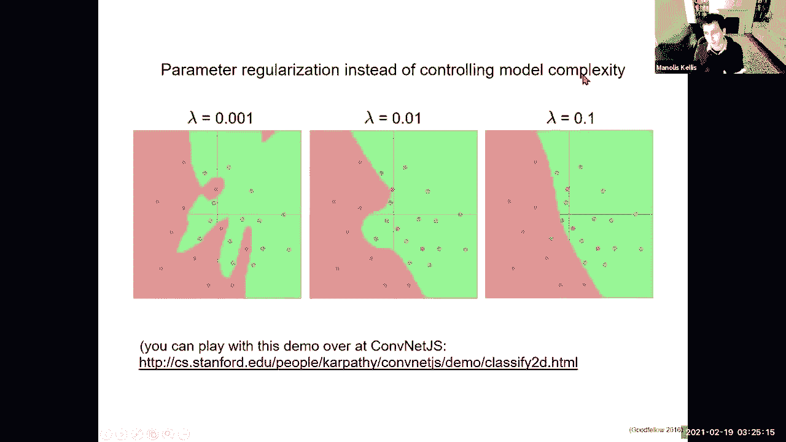

一个很有帮助的，给你的演示是看不同类型的点，比如说，如果我有非常简单的数据，然后我想用更少的神经元建立网络，你可以在这里看到，我可以很好地学习这个，但如果我有一个网络，比如说20个神经元，嗯，那就有点。

你知道吗，呃学习可能有点太多了，例如，如果我有一个螺旋数据，你可以看到在一定的学习时间后，我可以真正地近似它，但如果我的神经元很少，我根本做不到，它只是没有能力这样做，它不能近似一个函数。

足够高的维度来获得这些，呃镜子，所以如果我增加神经元的数量，然而，我正在增加模型的容量，现在我开始学习更复杂的函数，但它仍然是你知道不能这样做，我可以再换一次网络，如果我给它足够的神经元。

你可以看到在一定数量的时代之后，它开始近似那个函数。

好的，所以我希望你们能认识到模特的能力，其他形式的正常化，上次我们谈到了辍学，这是另一种形式的正规化，我们谈到了夹紧模型，某种力量，低维表示，还有很多其他的方法可以做到这一点。

你基本上可以有更多的训练数据，您可以调整模型复杂性，根据层数，你可以强制提前停车的单位数，使用验证集选择，什么时候停下来，你可以包括体重下降，两个L一个都用，正则化的线性函数或二次函数。

惩罚权重绝对值之和，或者权重的平方和。

你也可以添加噪音作为调节器。

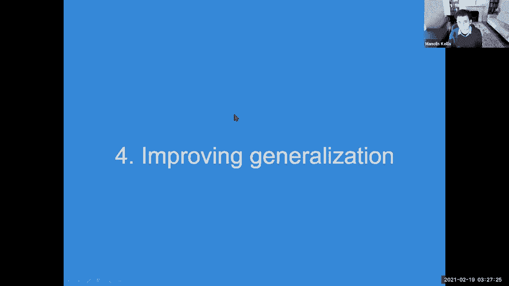

你基本上可以说，而不是精确匹配每一个点，我要把这些点随机移动到，基本部队正规化，呃那边，所以你可以把输入中的噪声看作是一个正则化器，你也可以在模型的参数分布上有贝叶斯先验。

你也可以把重量衰减看作是贝叶斯先验，这基本上是在告诉你，我希望我的体重能小一点，所以每次我都会减轻体重，把它移到离我的前任更近的地方，当证据本身将把它推向最大可能性时，估计先验会把它移得更近。

把后验移动得更近，更接近于一种较低的重量，我们还可以考虑残差的方差，不仅仅是错误本身。

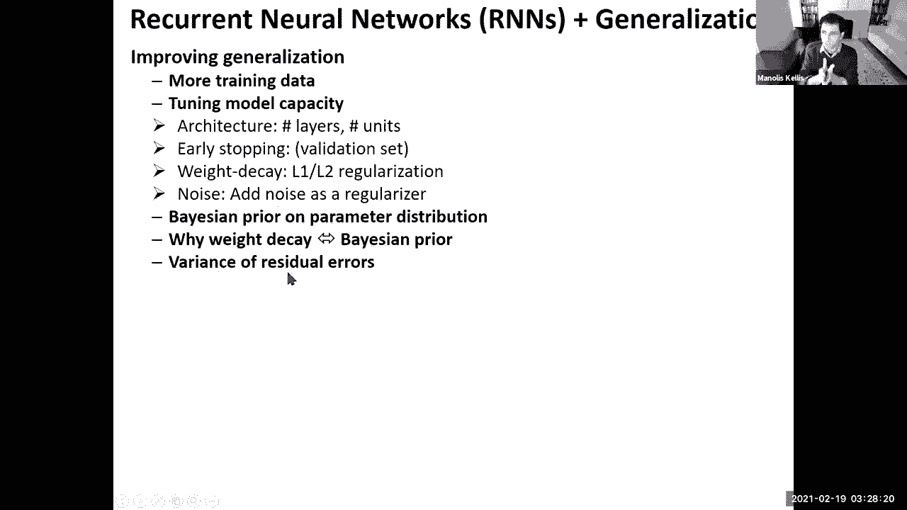

但是误差有多大，所有的权利，第二课到此结束，呃，让我们看看，呃，到目前为止谁和我在一起的快速民意调查，谁觉得呃，他们已经得到了我提出的可爱通知的东西，我们有两个关于容量的大问题，和伟大的，所以呃。

我很快就去找他们，所以二七六七七零，然后下一个是谁觉得他们学到了什么，阅读这里的问题，酷，我们有，嗯53，四十零，七零，让我来回答这个问题，所以呃，深度神经网络的容量是如何计算或估计的。

这真的取决于你使用的激活函数，以及你使用的重量总数，所以我不认为我们想把容量看作一个数字，更多的是，嗯，我想说这更像是一个概念，你的关系网的表现力是什么，我们可以考虑更多的容量和更多的参数。

以及这些参数的更有表现力的函数，这两个对立面的容量都较小，所以你知道，大多数时候，我们不会担心绝对容量和它是如何计算的，但相反，我是增加容量还是减少容量，然后增加容量。

一个人如何决定何时在更大的单位中添加更多的单位，而不是添加一个新的层天哪，这些都是很奇妙的问题，他们是许多，对于神经网络，所以基本上很多深度学习领域都是关于权衡，在更多的层之间，更宽的层，呃，你知道的。

更多连接，呃，更多抽象，更多，你知道吗，在我们将要讨论的特别建筑中，你知道吗，我们将要讨论的卷积滤波器，嗯，你知道的，卷积神经网络的其他特征，和递归神经网络在接下来的两节课上。

那是我们真正要进入建筑的时候，但简单的回答是这是一门艺术，我们真的没有理论，什么是正确的平衡，呃，复杂性的，好的，可爱，你们觉得自己学到了东西，谢谢。大家都看到你在背诵，呃。

明天三点和明天四点的第一次指导会议，所以请大家把视频，我看到很多视频进来，那太好了，然后呃，看你同学的视频，上传你的个人资料，我们将汇编所有这些，我们实际上要在，嗯，因为这就是上课的全部意义。

因为你有很棒的队友，你们将成为你们的同事和伙伴，呃你的余生，所以呃，采取步骤，以最积极的方式向同学介绍自己，告诉我们你的背景，你的兴趣，您的项目类型，你感兴趣的，一种叙述，你的表格上会有什么，呃。

每个人在一个视觉格式，一号然后二号，花时间去见你的同学，阅读他们的个人资料，为最亲近的人观看视频，对你有兴趣，等等，好吧，再见了伙计们，呃，在接下来的两天里，拜拜，拜拜，所有的权利。

