# 1：课程介绍、AI与ML 🧬


在本节课中，我们将学习麻省理工学院课程“生命科学中的深度学习”的总体介绍。我们将了解课程目标、后勤安排、核心模块以及为什么深度学习在生命科学领域至关重要。

---

## 📚 课程概述与后勤


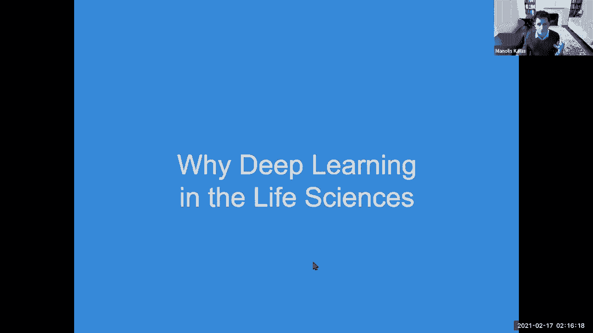

本课程是麻省理工学院课程编号 6.874，也被称为 HST.506。课程将在基因调控、疾病机制、治疗设计、病历与医学影像等计算生物学核心问题上，深入应用机器学习方法。

课程将在周二和周四下午进行。辅导课将在周五下午举行，这是可选的，但对于完成出色的期末项目非常有帮助。

教学团队成员包括 Dylan、Azhang、Tess 和 Jackie。他们的研究兴趣涵盖机器学习与基因组学、计算统计学解决生物学问题、深度学习技术解析生物数据以及合成生物学与药物发现等领域。

课程网站包含往年所有讲座录音的链接。Canvas 网站可以通过特定 URL 访问。课程相关问题可以通过 Piazza 或指定邮箱联系教学团队。

---

## 🎯 先修知识与课程要求

学习本课程需要以下几个基础：
1.  **微积分与线性代数**：涉及张量、矩阵、向量和特征值等数学与计算知识。
2.  **概率与统计**：这是机器学习和深度学习的普遍基础。
3.  **编程**：课程习题集和实验都需要编程，以深入探索课程主题。
4.  **生物学入门知识**：课程将在此基础上进行构建。

课程评分构成如下：
*   **习题集**：共五个，可放弃最差的一个，占总成绩的 **30%**。
*   **测验**：一个半小时，可带一张笔记，占总成绩的 **5%**。
*   **期末项目**：由2-3名学生组队完成，占总成绩的 **5%**。
*   **课堂参与与转录**：占总成绩的 **10%**，包括指导会议、客座讲座和文献研讨。

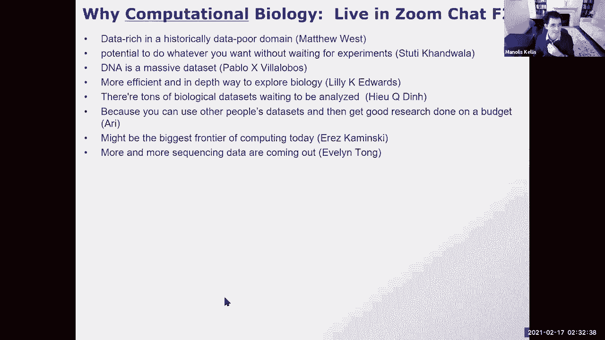

学生将很快通过邮件收到 Google Cloud 优惠券，以便使用 Jupyter Notebook 完成习题集。

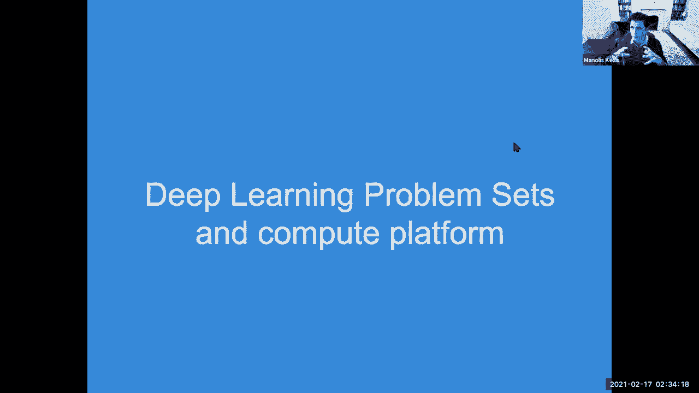

---

## ❓ 为什么生命科学需要深度学习？


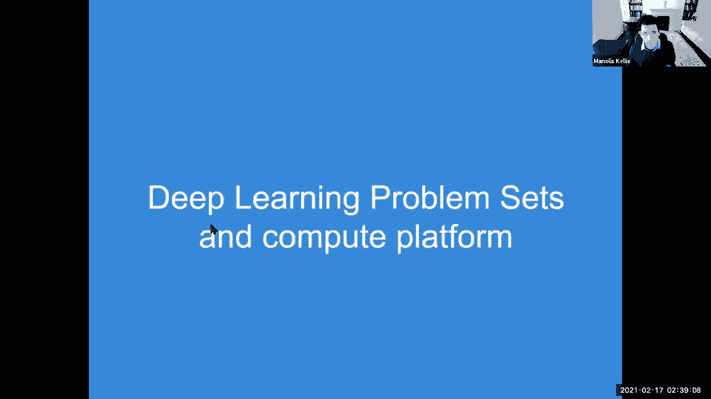

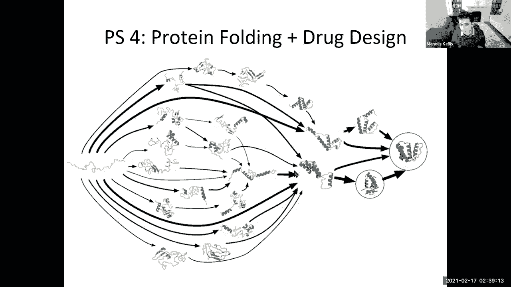

深度学习出版物中约有8%是关于生物信息学的，这是一个巨大的比例。例如，AlphaFold 在蛋白质结构预测上达到了与实验方法相当的精度，这从根本上改变了我们对生物学的理解。

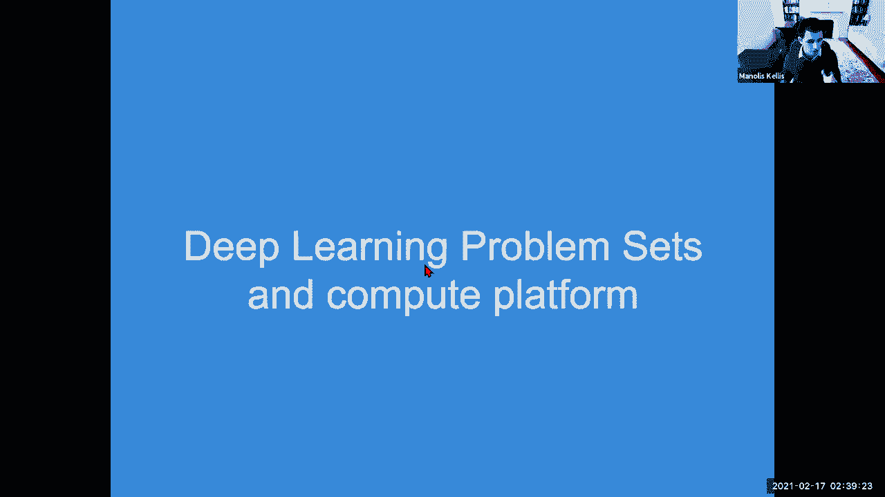

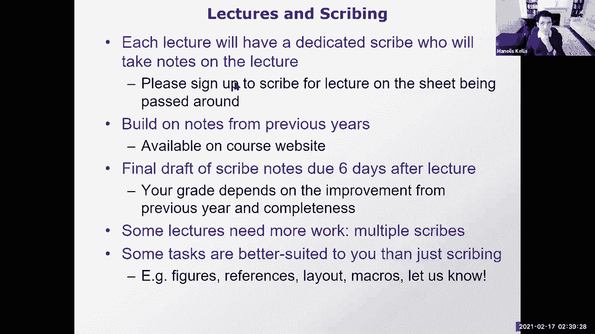

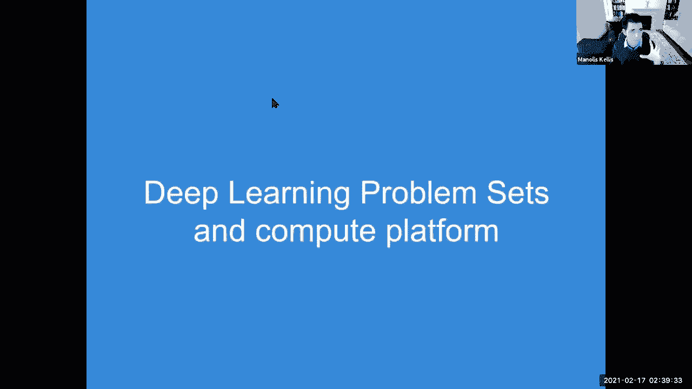

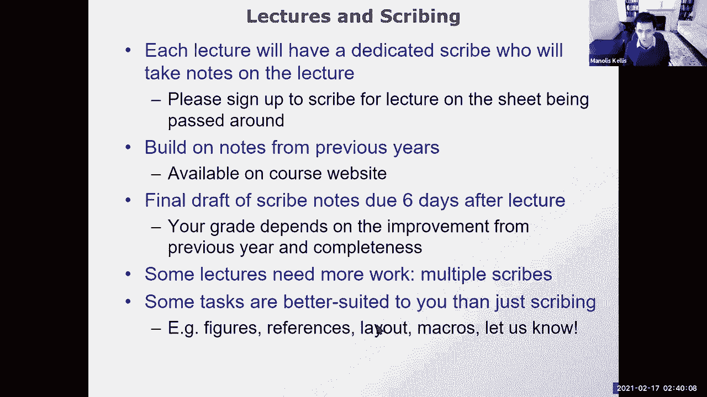

三个领域的融合推动了这一变革：
1.  **廉价、高质量的大数据集**：包括测序数据、影像数据、医疗记录和文本数据库。
2.  **机器学习方法的根本性进步**：包括新算法和组合多种数据的方式。
3.  **高性能计算**：如图形处理器（GPU）提供了强大的计算单元，极大地加速了机器学习。

因此，本课程旨在培养能够处理这些复杂生物数据集的新一代学生。


---

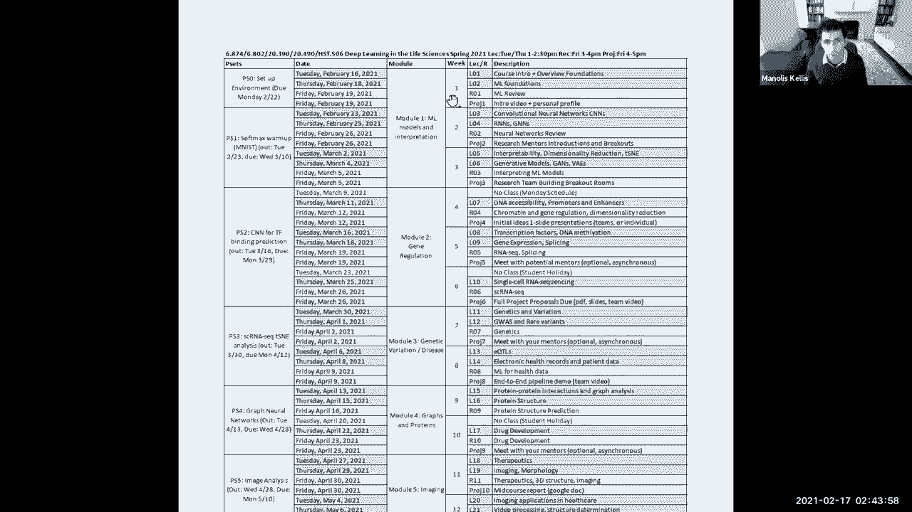

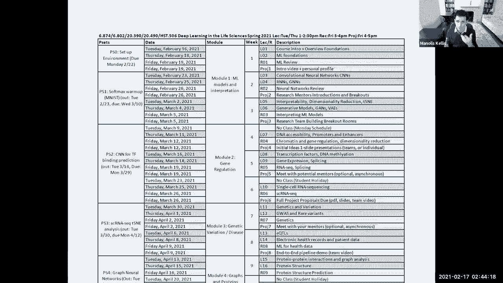

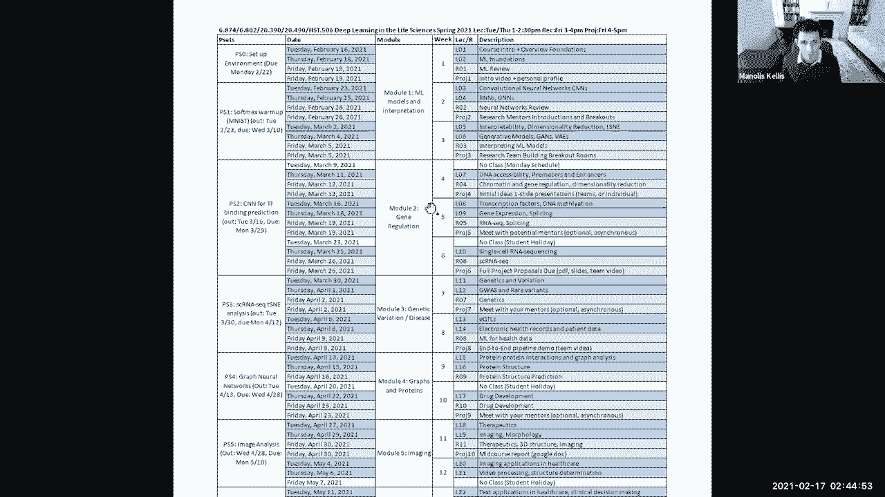

## 🗺️ 课程大纲与核心模块

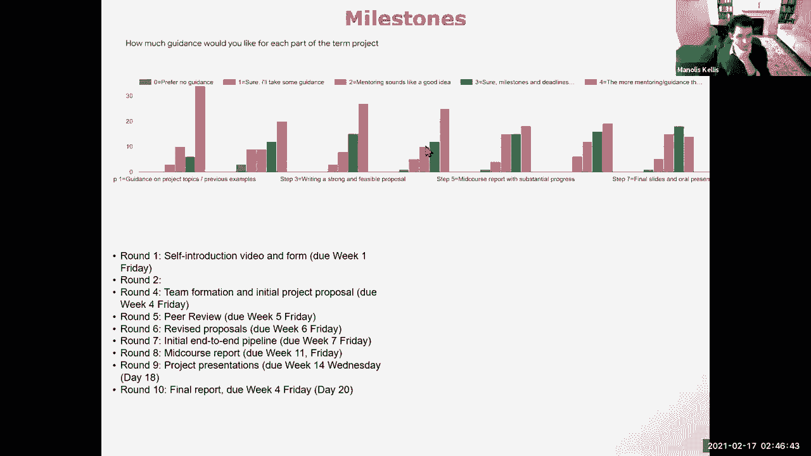

课程内容分为五个主要模块：

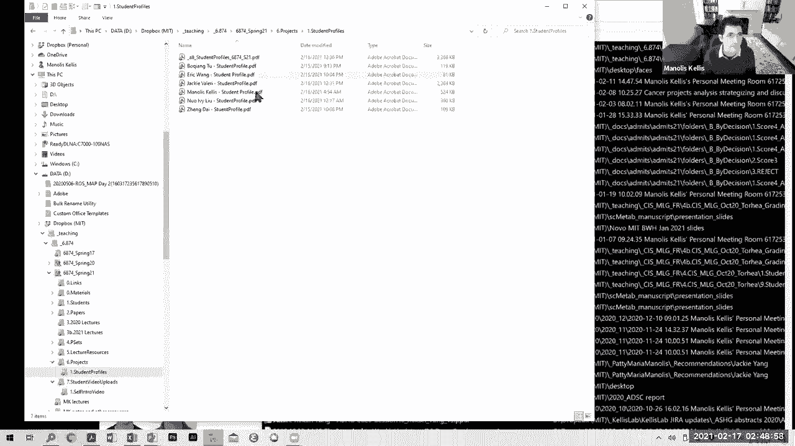

1.  **机器学习基础**：涵盖卷积神经网络（CNN）、循环神经网络（RNN）、图神经网络（GNN）、模型可解释性、降维以及生成模型（如GAN和VAE）。
2.  **基因调控回路**：深入探讨基因组学，包括DNA可及性、增强子、染色质、基因调控、转录因子、DNA甲基化、基因表达与剪接，并重点介绍如何用深度学习方法直接从基因组推断这些结构。
3.  **疾病与变异**：探讨如何利用深度学习发现遗传变异，理解变异如何影响基因调控电路和表达水平，以及如何利用电子健康记录推断与疾病相关的变异。
4.  **结构与药物设计**：聚焦蛋白质-蛋白质相互作用、蛋白质结构、折叠以及药物开发，重点介绍图神经网络在这些领域的应用。
5.  **影像分析**：研究生物学中各类影像分析应用，如形态学、治疗学、视频处理和结构测定，这些都非常适合深度学习。

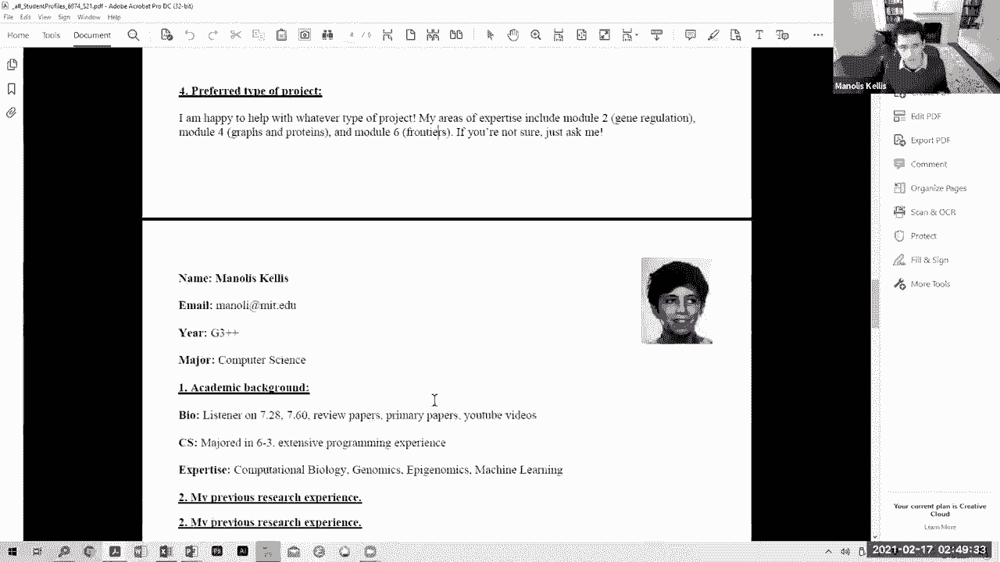


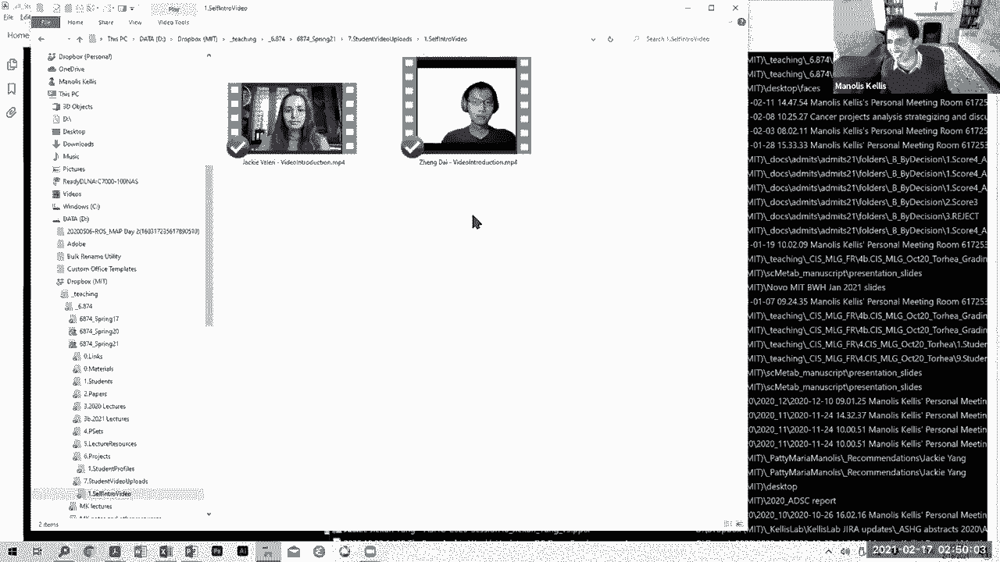

此外，课程最后还会涉及医疗保健中的文本应用、神经科学以及癌症与传染病等前沿交叉领域。

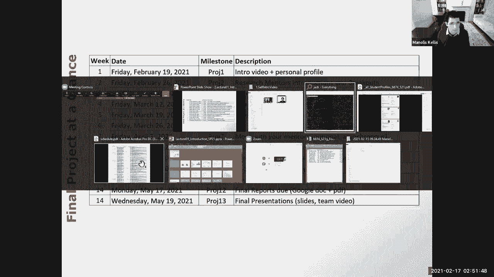

---

## 📝 习题集与项目


课程将通过五个习题集引导学生实践：
1.  **习题集1**：TensorFlow 入门，完成字符识别等基础任务。
2.  **习题集2**：将机器学习技术应用于基因组数据，识别序列模式。
3.  **习题集3**：深入分析单细胞RNA测序数据，关联遗传变异与疾病。
4.  **习题集4**：应用图神经网络于蛋白质折叠和药物设计。
5.  **习题集5**：专注于医学影像分析。

学生将在整个学期中完成一个团队项目（2-3人）。项目旨在模拟真实的研究过程，包括：构建生物学问题、收集文献与数据、应用新算法、解释结果、接收同行评议、撰写科学论文和进行成果展示。

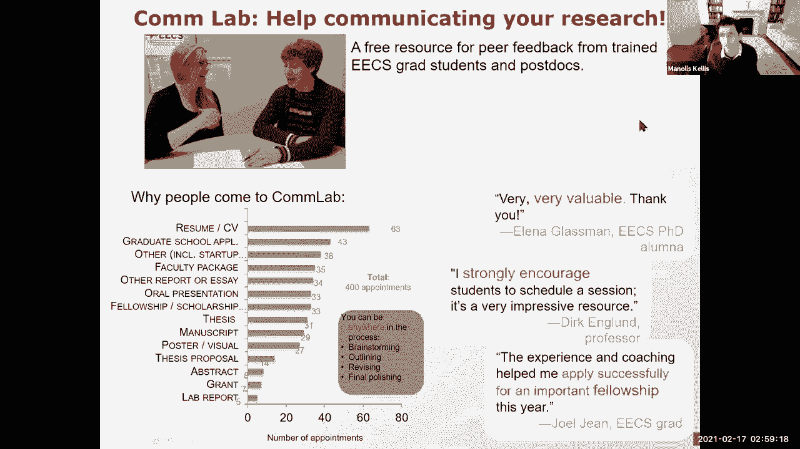

项目设有多个里程碑，如提交初步想法、数据管道演示、中期报告和最终演示，以确保稳步推进。


---

## 🤖 机器学习核心概念简介

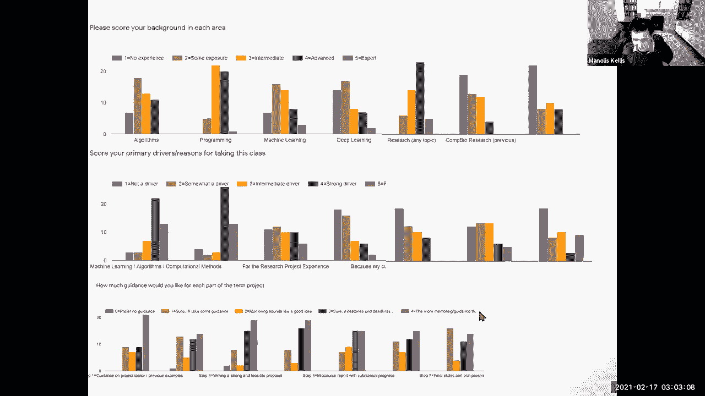


上一节我们介绍了课程的整体框架，本节中我们来看看支撑本课程的机器学习核心思想。

传统人工智能依赖于手工编写的规则和评分函数。例如，在国际象棋中，程序需要人类为每个棋盘位置手工设计一个评分函数，然后通过搜索算法（如Minimax）来选择最佳走法。

深度学习改变了这一范式。它不依赖专家定义规则，而是让机器通过数据自我学习。例如，AlphaZero 通过自我对弈来理解游戏，而非被明确告知规则。这种方式能更好地应对现实世界和自然环境的极端复杂性。

机器学习的核心是从可观测数据中推断世界的隐藏状态。一个基础框架是贝叶斯推理：

**公式**：
`P(假设 | 数据) = [P(数据 | 假设) * P(假设)] / P(数据)`
其中：
*   `P(假设 | 数据)` 是后验概率，即在观察到数据后，假设成立的概率。
*   `P(数据 | 假设)` 是似然，即假设成立时观察到该数据的概率。
*   `P(假设)` 是先验概率，即在观察数据前，假设成立的概率。
*   `P(数据)` 是证据或边缘似然，即观察到该数据的总概率。

这允许我们从生成模型（由因推果）转向判别模型（由果推因）。

机器学习主要分为以下几类：

以下是主要的机器学习类型：
*   **监督学习**：使用带有标签的数据集训练模型，以对新数据进行分类或回归预测。
*   **无监督学习**：在没有标签的数据中发现内在结构或模式，如聚类。
*   **表征学习**：自动从数据中学习有用的特征，而非依赖手工设计。深度学习是其中的代表，它通过多层网络构建从简单到抽象的特征层次。

深度学习网络受到生物神经元的启发。生物视觉信号从视网膜像素开始，经过层层神经元处理，逐步抽象出边缘、轮廓、物体部件等概念，最终识别出物体。人工神经网络模拟了这一过程：

**代码示意（概念）**：
```python
# 简化的前馈神经网络层计算
output = activation_function( dot(input, weights) + biases )
```
其中，`activation_function`（如 ReLU, Sigmoid）决定了神经元是否“激活”，`weights` 和 `biases` 是需要通过反向传播算法从数据中学习的参数。

---

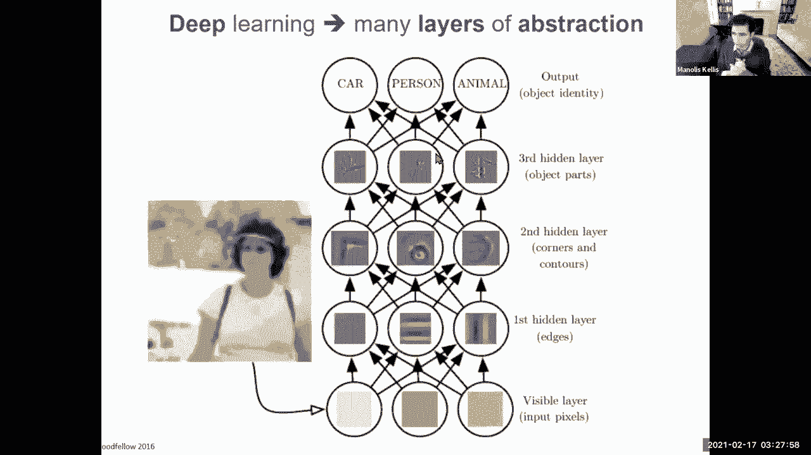

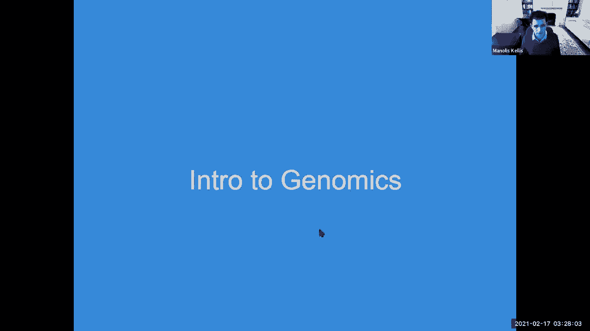

## 🎉 总结

本节课中，我们一起学习了“生命科学中的深度学习”这门课程的总体介绍。我们了解了课程的目标、安排和评分方式，探讨了深度学习在生命科学领域兴起的原因，并预览了涵盖机器学习基础、基因调控、疾病变异、结构生物学和影像分析五大模块的课程大纲。最后，我们简要介绍了机器学习的核心思想，特别是深度学习如何通过分层学习特征来理解复杂世界。我们期待在接下来的课程中与大家一同深入探索这些激动人心的主题。