# 2：神经网络基础与优化 🧠

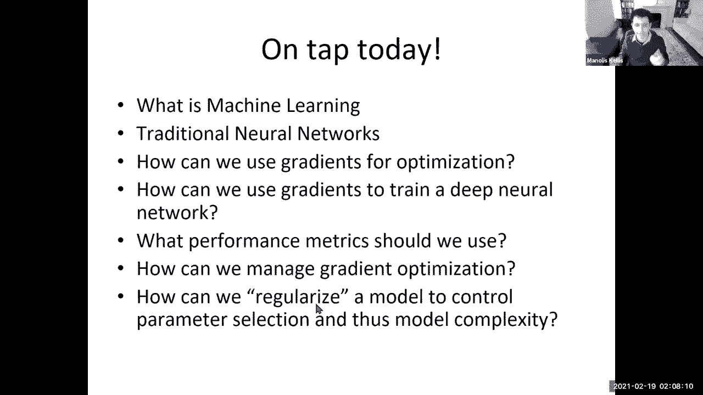

在本节课中，我们将学习机器学习的基本概念、传统神经网络的定义、以及如何使用梯度下降法来优化和训练网络。我们还将探讨如何评估模型性能以及防止模型过拟合的正则化方法。

---

## 什么是机器学习？

机器学习可以广义地定义为：利用经验（数据）来提升性能或做出更准确预测的计算方法。其核心在于从数据中自动检测模式，并利用这些模式对未来数据或其他结果进行预测。

一个机器学习任务通常包含三个要素：
*   **任务**：例如，对手写数字图像进行分类。
*   **经验**：即**训练数据集**，例如一组带有标签的手写数字图像。
*   **性能度量**：用于评估模型好坏的指标，例如测试集上正确分类的百分比。

我们的目标是学习一个函数，将输入数据 `x` 映射到输出预测 `y_hat`，并使其在未见过的数据（**测试集**）上表现良好，这被称为模型的**泛化能力**。

---

## 机器学习任务类型

机器学习任务主要根据输出标签 `y` 的情况进行分类。

以下是主要的机器学习任务类型：
*   **监督学习**：训练数据包含输入 `x` 和对应的输出标签 `y`。我们的目标是学习 `x` 到 `y` 的映射关系。
    *   **分类**：预测离散的类别标签（例如，猫或狗）。
    *   **回归**：预测连续的数值（例如，房价）。
*   **无监督学习**：训练数据只有输入 `x`，没有标签 `y`。目标是发现数据中的内在结构或模式（例如，聚类）。
*   **半监督学习**：训练数据中只有部分数据带有标签，结合有标签和无标签数据进行学习。
*   **强化学习**：智能体通过与环境交互，根据获得的奖励或惩罚（部分反馈）来学习如何采取行动。

---

## 模型、参数与目标函数

上一节我们介绍了机器学习的任务类型，本节中我们来看看模型是如何构建和优化的。

一个机器学习模型可以看作是一个函数 `f`，它接受输入 `x` 和一组**参数** `θ`（例如权重 `w` 和偏置 `b`），然后计算输出 `y_hat`。

为了训练模型，我们需要定义一个**目标函数**（通常称为损失函数或成本函数），它用于衡量模型预测 `y_hat` 与真实标签 `y` 之间的差距。我们的目标是通过调整参数 `θ` 来最小化这个目标函数。

以下是常见的损失函数：
*   **均方误差**：用于回归任务，计算预测值与真实值之差的平方的平均值。公式为：`MSE = (1/n) * Σ(y_i - y_hat_i)^2`
*   **交叉熵损失**：常用于分类任务，特别是与Softmax函数结合。它衡量两个概率分布之间的差异。
*   **0-1损失**：用于分类，如果预测错误则损失为1，正确则为0。

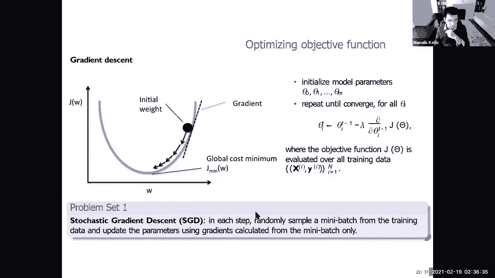

---

## 训练、验证与测试

为了可靠地评估模型，我们需要将数据划分为三个互斥的集合。

以下是数据划分的目的：
*   **训练集**：用于**拟合模型参数**。模型直接从此数据中学习。
*   **验证集**：用于**调整超参数**（如网络层数、学习率）和**选择模型**，以及在训练过程中监控是否出现过拟合（当验证集误差开始上升时）。
*   **测试集**：用于在模型完全训练和调优后，**最终评估**模型的泛化性能。测试集在训练过程中绝对不可使用。

这种划分可以防止模型仅仅“记住”训练数据（过拟合），从而确保其学到的是普遍规律。

---

## 模型评估指标

仅仅知道模型有误差还不够，我们需要具体的指标来量化其性能。

对于分类任务，常用指标基于**混淆矩阵**，它统计了真正例、假正例、真反例、假反例的数量。

以下是基于混淆矩阵的关键评估指标：
*   **准确率**：所有预测中正确的比例。`Accuracy = (TP + TN) / (TP + TN + FP + FN)`
*   **精确率**：在所有预测为正的样本中，实际为正的比例。`Precision = TP / (TP + FP)`
*   **召回率**：在所有实际为正的样本中，被预测为正的比例。`Recall = TP / (TP + FN)`
*   **F1分数**：精确率和召回率的调和平均数，用于平衡二者。`F1 = 2 * (Precision * Recall) / (Precision + Recall)`
*   **ROC曲线与AUC**：通过变化分类阈值，绘制真正例率与假正例率的关系曲线，曲线下面积越大，模型性能通常越好。

对于回归任务，常用**皮尔逊相关系数**或**斯皮尔曼秩相关系数**来衡量预测值与真实值的关联程度。

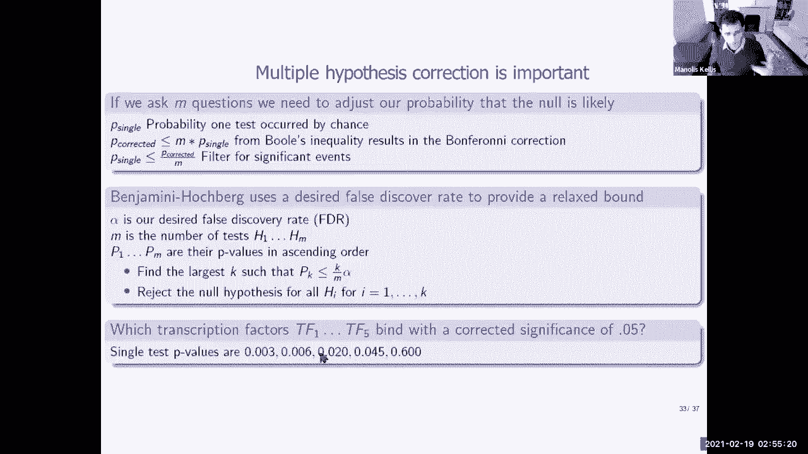

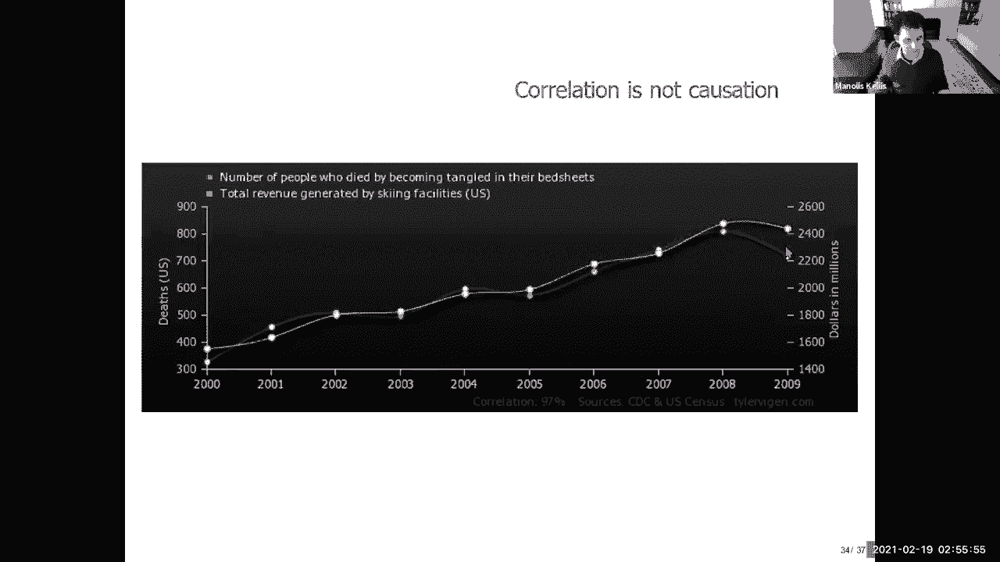

---

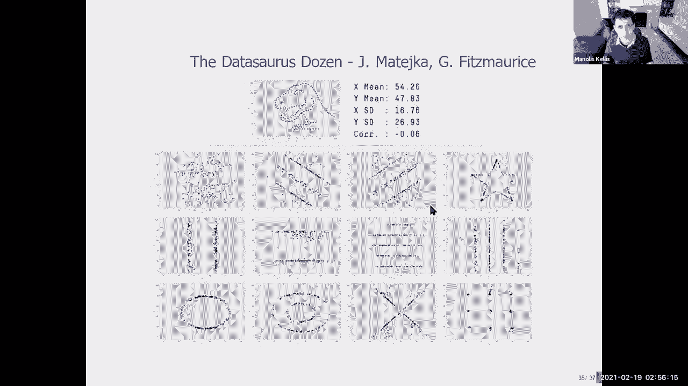

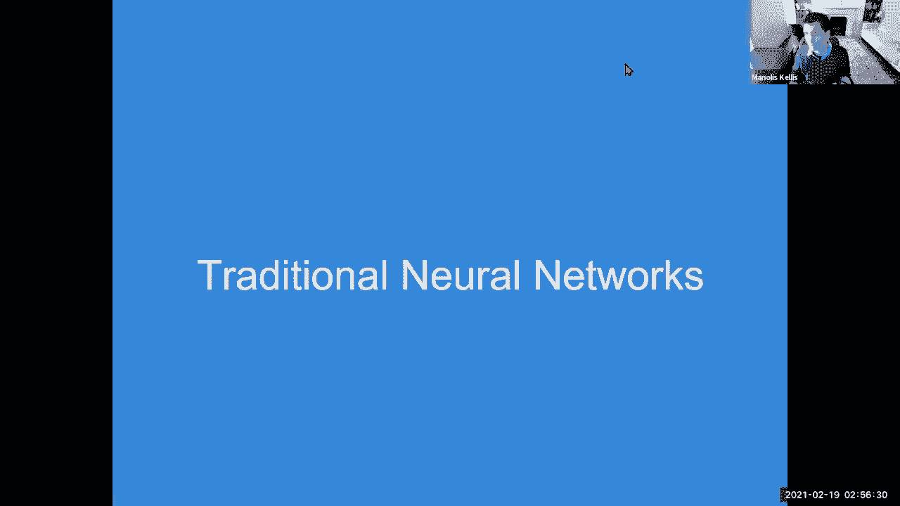

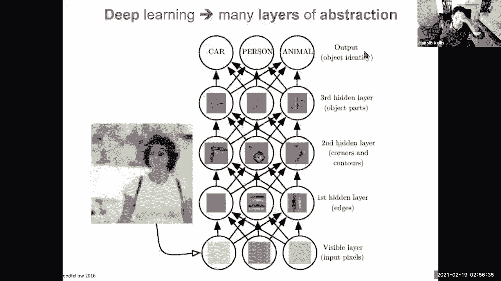

## 神经网络基础

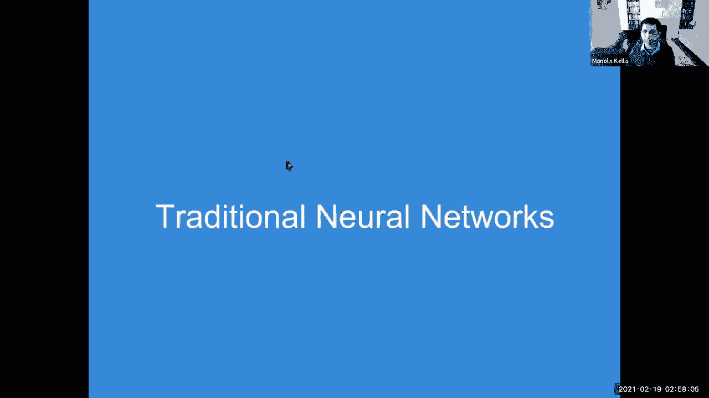

现在，让我们将上述概念应用到神经网络中。神经网络受到生物神经元的启发，由多层互连的“神经元”组成。

一个基本的神经元接收来自前一层神经元的输入 `x`，计算加权和 `z = w·x + b`，然后通过一个**激活函数** `σ` 产生输出 `a = σ(z)`。激活函数引入了非线性，使得神经网络能够拟合复杂的函数。

以下是常见的激活函数：
*   **Sigmoid**：将输入压缩到(0,1)之间。公式为：`σ(z) = 1 / (1 + e^{-z})`
*   **Tanh**：将输入压缩到(-1,1)之间。
*   **ReLU**：整流线性单元，是目前最常用的激活函数。公式为：`ReLU(z) = max(0, z)`
*   **Leaky ReLU**：对ReLU的改进，当输入为负时有一个小的斜率，避免神经元“死亡”。

深度神经网络通过堆叠多个这样的层（输入层、隐藏层、输出层）来构建，深层网络可以学习从低级特征到高级特征的层次化表示。

---

## 训练神经网络：梯度下降与反向传播

神经网络拥有大量参数，我们需要一种高效的方法来优化它们。这就是**梯度下降法**。

梯度下降的核心思想是：计算损失函数 `L` 关于每个参数 `θ` 的**梯度**（偏导数），这个梯度指明了损失函数上升最快的方向。为了最小化损失，我们让参数沿着梯度的反方向进行更新。

参数更新公式为：
`θ_new = θ_old - η * ∇L(θ_old)`
其中 `η` 是**学习率**，控制每次更新的步长。

对于多层神经网络，计算底层参数的梯度需要用到**链式法则**，这个过程被称为**反向传播**。反向传播从输出层开始，将误差梯度层层向后传递，从而高效地计算出所有参数的梯度。

在实践中，我们常使用其变体：
*   **随机梯度下降**：每次迭代随机抽取一小批数据进行梯度计算和参数更新，效率更高。
*   **带动量的梯度下降**：在更新时不仅考虑当前梯度，还考虑上一次更新的方向，有助于加速收敛并减少震荡。

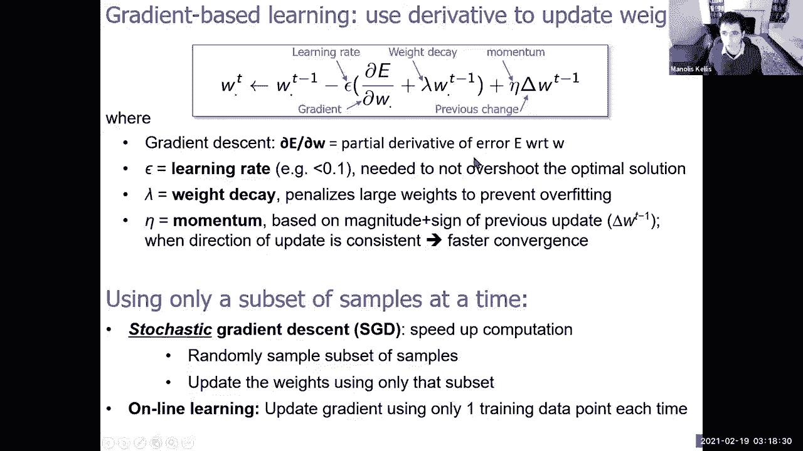

---

## 模型容量与正则化

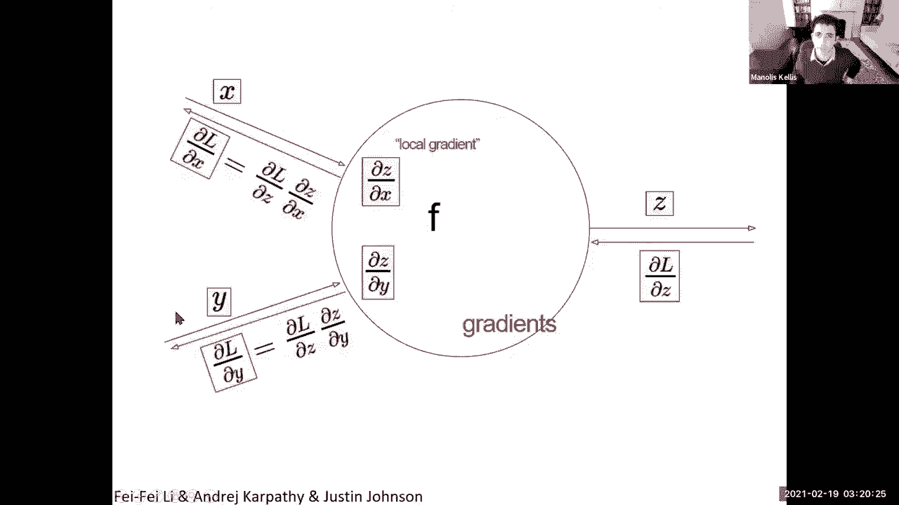

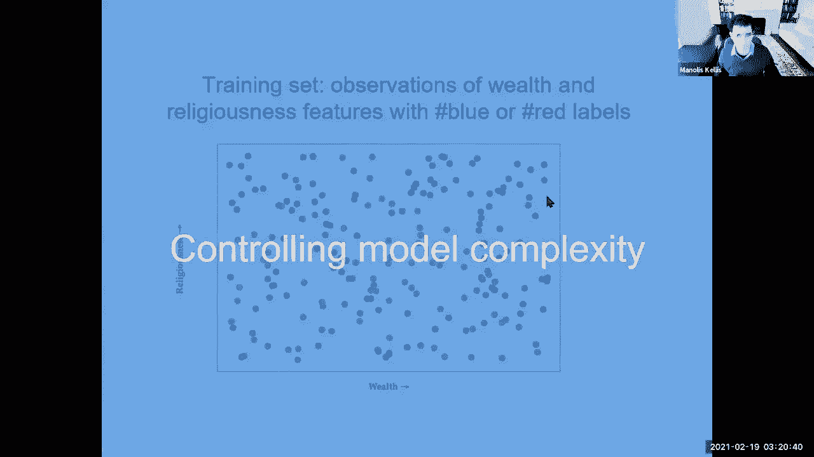

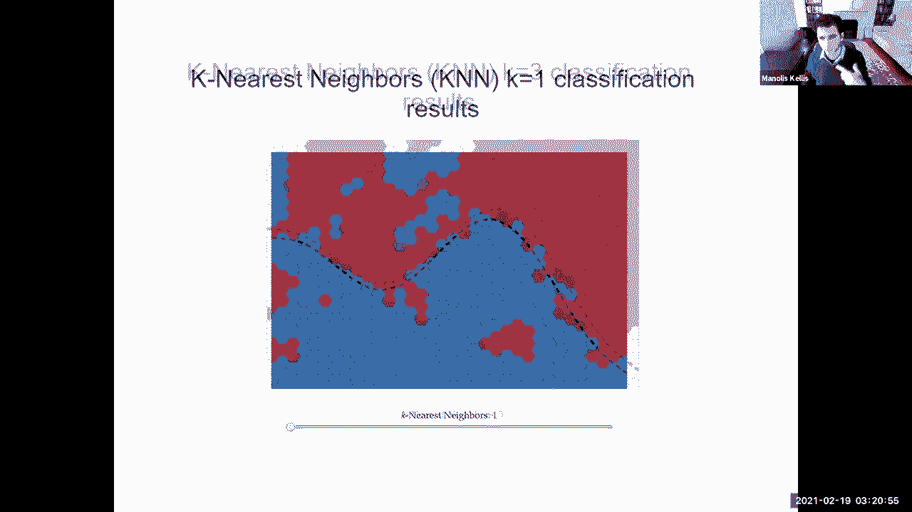

随着模型参数增多（容量增大），模型可以拟合更复杂的函数，但也更容易过拟合训练数据。

**模型容量**指的是模型拟合各种函数的能力。我们需要在容量不足（欠拟合）和容量过大（过拟合）之间找到平衡。

**正则化**是一系列用于防止过拟合、提高模型泛化能力的技术。

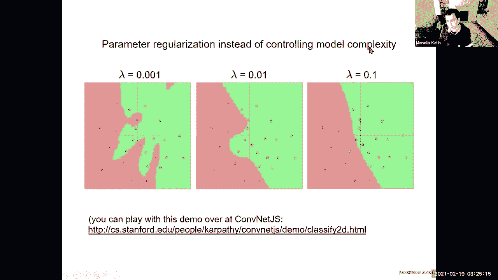

以下是常用的正则化方法：
*   **L1/L2正则化**：在损失函数中增加一项，惩罚较大的权重。L1正则化倾向于产生稀疏权重，L2正则化使权重趋向于较小值。
    *   L2正则化项：`λ * Σ w_i^2`
    *   L1正则化项：`λ * Σ |w_i|`
*   **Dropout**：在训练过程中，随机让网络中的一部分神经元暂时“失活”，这可以防止神经元之间产生复杂的共适应关系，相当于每次训练一个不同的子网络。
*   **早停**：在训练过程中持续监控验证集误差，当验证集误差不再下降反而开始上升时，停止训练。
*   **数据增强**：通过对训练数据进行随机变换（如旋转、裁剪、加噪声）来人工增加数据量，提高模型鲁棒性。

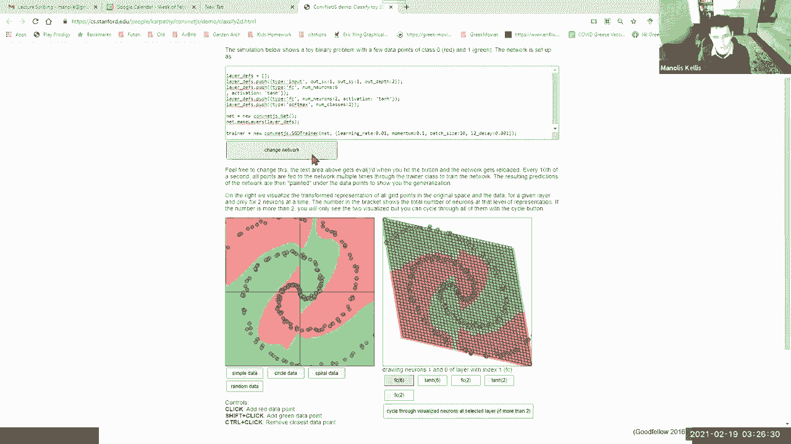

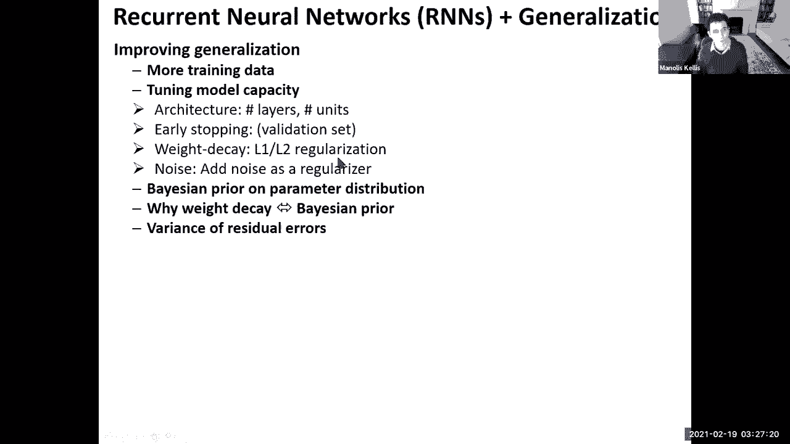

---

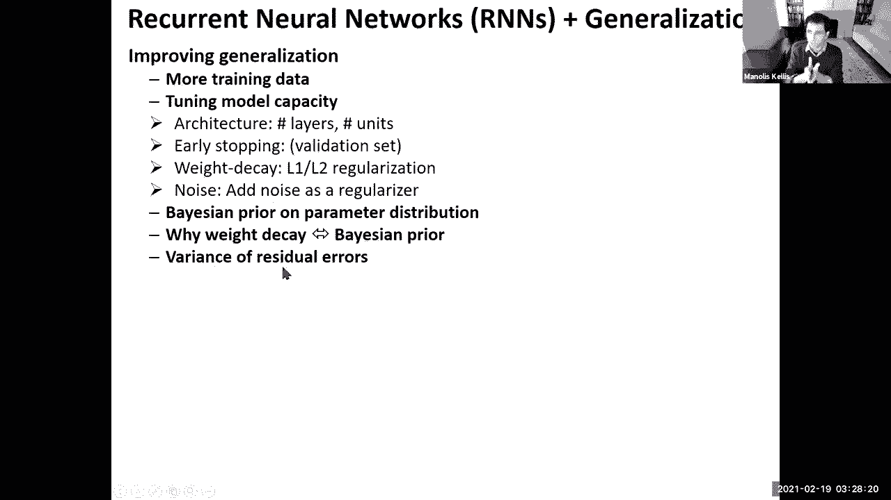

## 总结

本节课中，我们一起学习了机器学习的基础框架：
1.  定义了机器学习及其核心要素：任务、经验和性能度量。
2.  区分了不同类型的机器学习任务，如监督学习、无监督学习等。
3.  介绍了模型、参数、损失函数和优化目标。
4.  强调了通过划分训练集、验证集和测试集来可靠评估模型的重要性。
5.  讲解了神经网络的基本结构，包括神经元、激活函数和深度层次。
6.  深入探讨了使用梯度下降和反向传播算法来训练神经网络的原理。
7.  最后，我们了解了模型容量的概念以及如何使用正则化技术（如L1/L2、Dropout）来避免过拟合，确保模型具有良好的泛化能力。

这些概念是理解所有现代深度学习模型的基石，在接下来的课程中，我们将在此基础上学习更具体的网络架构，如卷积神经网络和循环神经网络。