# 4：RNN、LSTM、Transformer与GNN 🧠

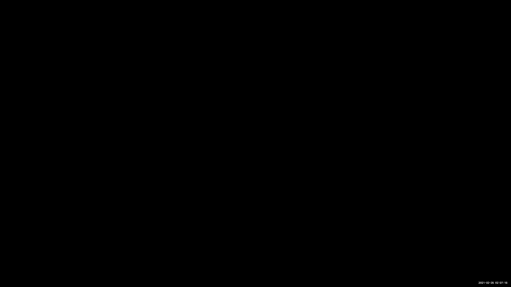

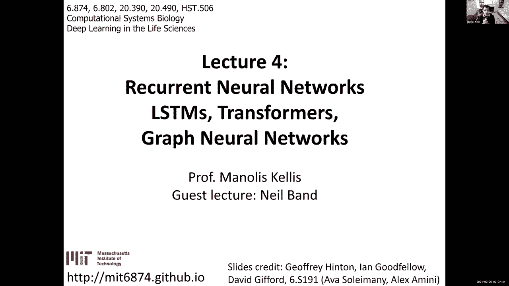


在本节课中，我们将学习如何处理和理解序列数据。我们将从如何编码时间信息开始，探讨循环神经网络（RNN）及其变体，特别是长短期记忆网络（LSTM）。接着，我们将了解一种无需循环结构即可处理序列关系的新架构——Transformer。最后，我们将把视野扩展到图结构数据，学习图神经网络（GNN）的基本原理。

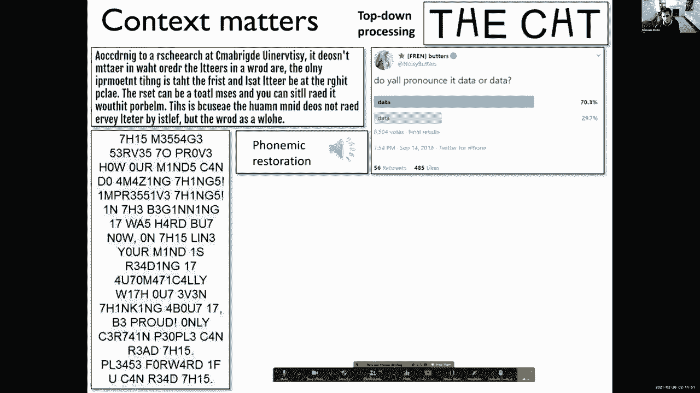


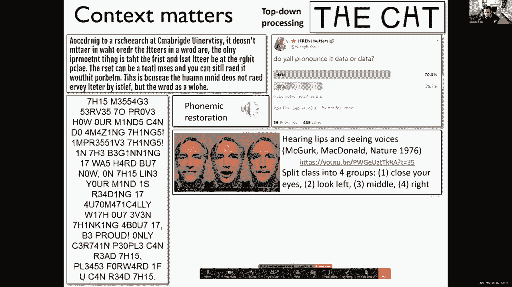


## 1. 如何阅读、聆听、理解与书写：上下文与注意力 📖

上一讲我们介绍了卷积神经网络，它擅长处理图像这类具有空间结构的数据。本节中，我们来看看如何处理像语言、声音这样的**序列数据**。人类在理解序列时，会利用上下文信息来解读每一个元素。

例如，观察下面的句子，尽管中间的字符完全相同，但你却能清晰地理解其含义是关于“猫”的。这是因为你在扫描句子时，是在**整个句子的上下文**中解读每一个字符的。

> The cat sat on the mat.

这种自上而下的处理方式，允许我们根据整体语境来理解局部刺激。研究表明，人类阅读时并非逐个识别字母，而是将单词作为一个整体来理解。只要单词的首尾字母位置正确，即使中间的字母顺序混乱，我们依然能够顺利阅读。

这种现象不仅存在于视觉，也存在于听觉，例如“音素恢复效应”（Phonemic Restoration Effect）。当句子中的某个音节被噪音覆盖时，我们的大脑会根据上下文自动“填补”缺失的声音。另一个著名的例子是“麦格克效应”（McGurk Effect），它展示了视觉信息（如唇形）如何影响我们对听觉信息的感知。

所有这些都表明，我们的大脑在持续地**预测**接下来会发生什么，并根据实际接收到的信息来更新我们的认知模型。这正是我们今天要探讨的循环神经网络、Transformer等时序模型试图实现的核心思想。

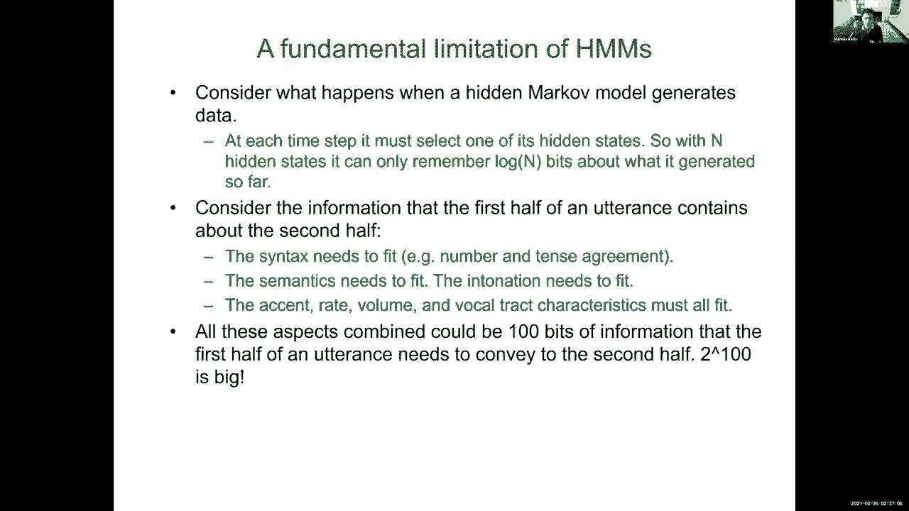

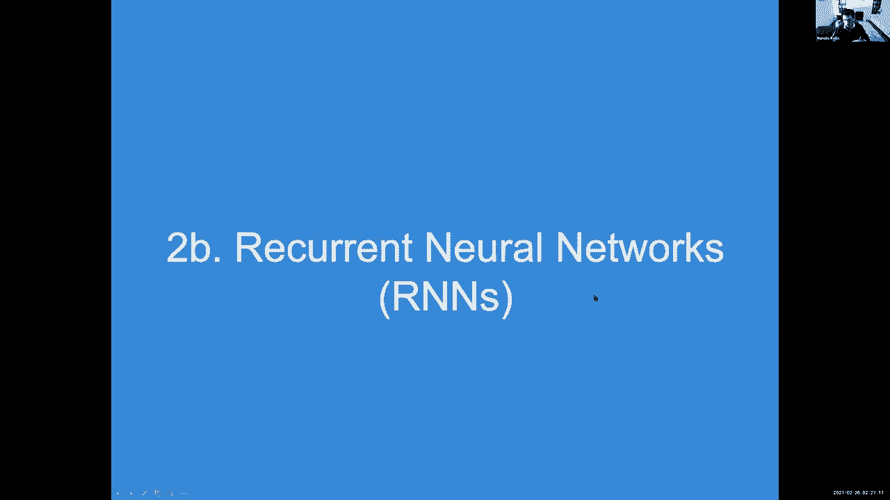

## 2. 编码时间信息：从隐马尔可夫模型到循环神经网络 ⏳

那么，计算上我们如何编码这种**时序上下文**呢？我们如何确保计算机能够像人脑一样自然地处理序列信息？

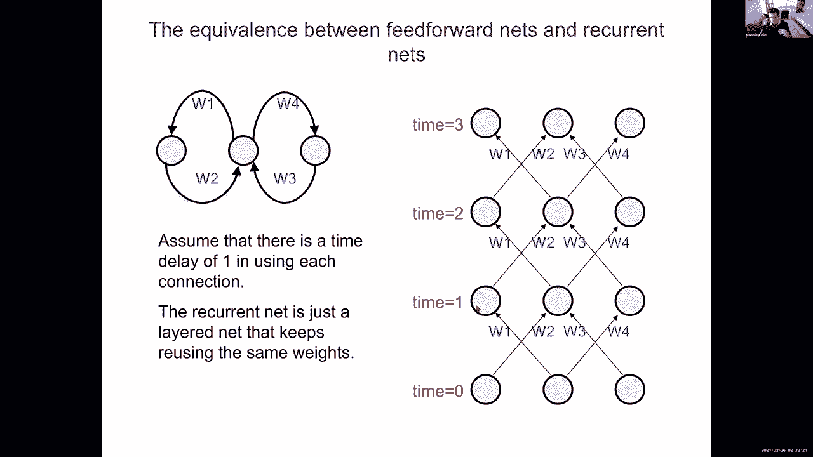

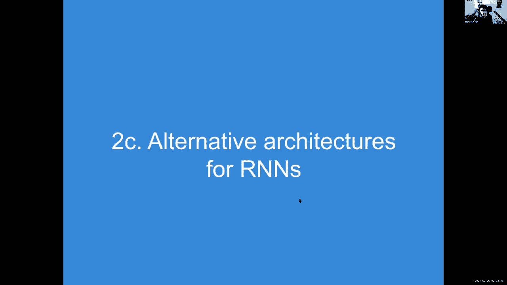

首先，我们来看简单的模型，如**隐马尔可夫模型**。HMM假设系统处于一系列离散的隐藏状态中，状态间的转移和状态的输出都是随机的，由转移矩阵和发射矩阵控制。其核心思想是，**当前观测值仅依赖于当前隐藏状态**，而**当前隐藏状态仅依赖于前一个隐藏状态**。

HMM的局限性在于，其记忆能力受限于隐藏状态的数量。要记住大量过去的信息，就需要指数级增长的隐藏状态数，这在实践中是不可行的。

这就引出了**循环神经网络**。RNN通过一个**分布式的隐藏状态**来高效地存储大量关于过去的信息。这个隐藏状态是显式表示的，并且可以通过**非线性动态**进行更复杂的更新。与HMM的随机性不同，标准的RNN是确定性的。

从计算图的角度看，RNN可以看作是通过**时间展开**的前馈神经网络。网络在每一个时间步都使用**相同的权重**，这使得模型能够学习一个通用的函数，并将其应用于整个序列。

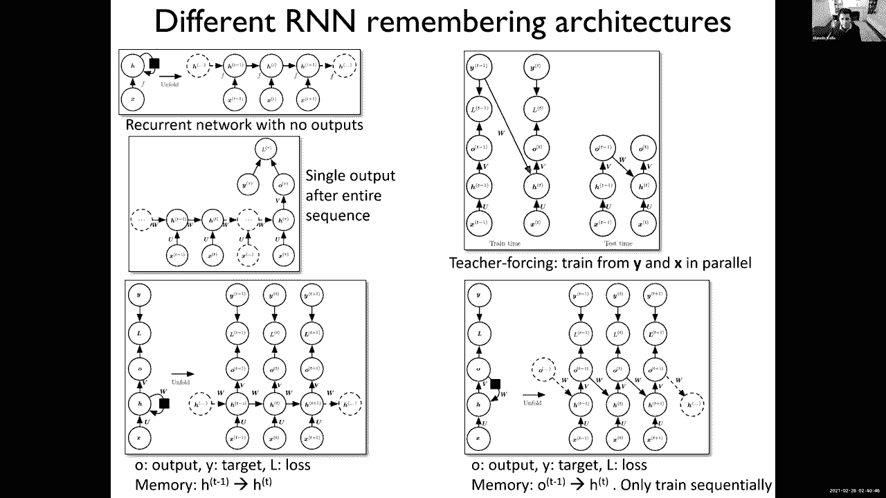

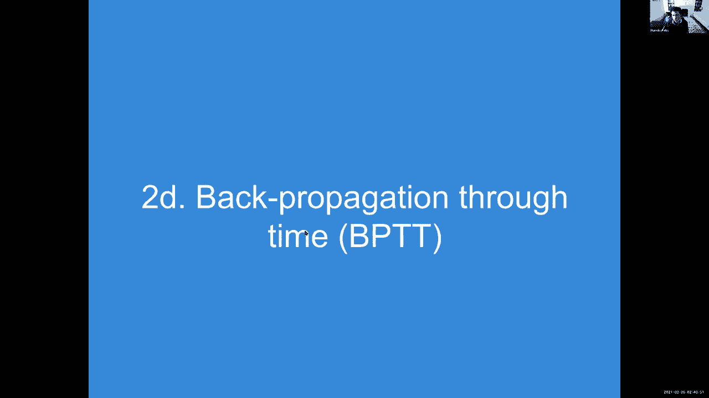

以下是RNN单元在一个时间步的基本计算过程，其中 `h_t` 是当前隐藏状态，`x_t` 是当前输入，`W` 和 `U` 是权重矩阵，`b` 是偏置，`σ` 是激活函数（如tanh）：

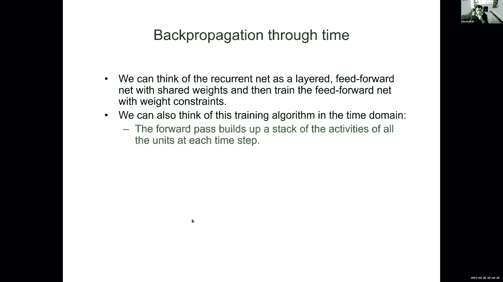

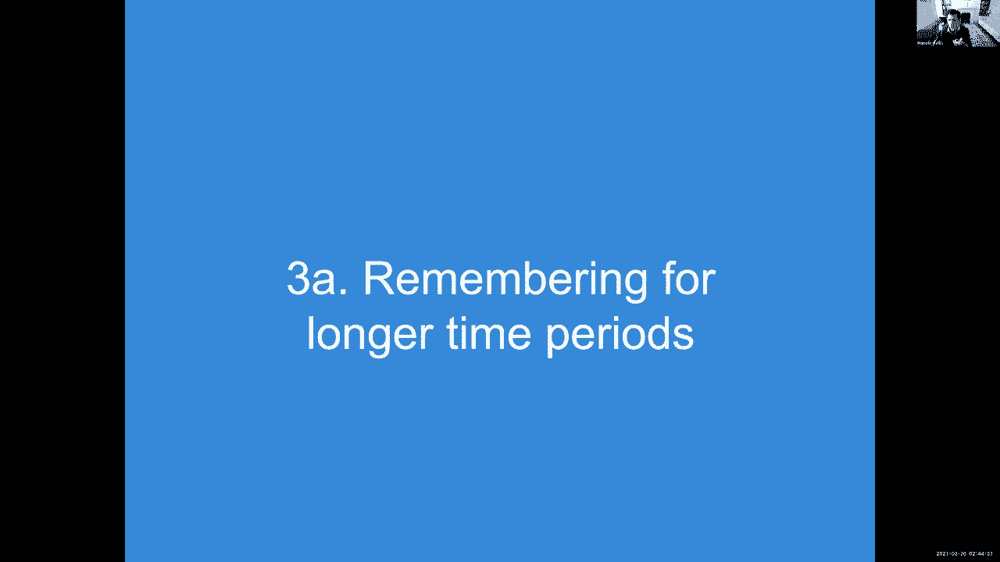

```python
h_t = σ(W * h_{t-1} + U * x_t + b)
```

## 3. RNN的架构与训练：通过时间反向传播 🔄

RNN可以有多种架构变体，主要区别在于信息如何流动：

1.  **隐藏状态到隐藏状态**：最常见的架构，当前隐藏状态接收来自前一个隐藏状态和当前输入的信息。
2.  **输出到隐藏状态**：将前一个时间步的**模型输出**作为当前时间步的输入。这只能在序列生成任务中顺序训练。
3.  **目标到隐藏状态（教师强制）**：在训练时，将前一个时间步的**真实目标值**（而非模型输出）作为当前输入。这可以加速训练，但在测试时需要切换回模式2。

无论哪种架构，其训练都依赖于**通过时间反向传播**。基本思想是将RNN按时间步展开成一个深层的网络，然后使用标准反向传播算法计算梯度，并**约束不同时间步的相同权重必须共享更新**。

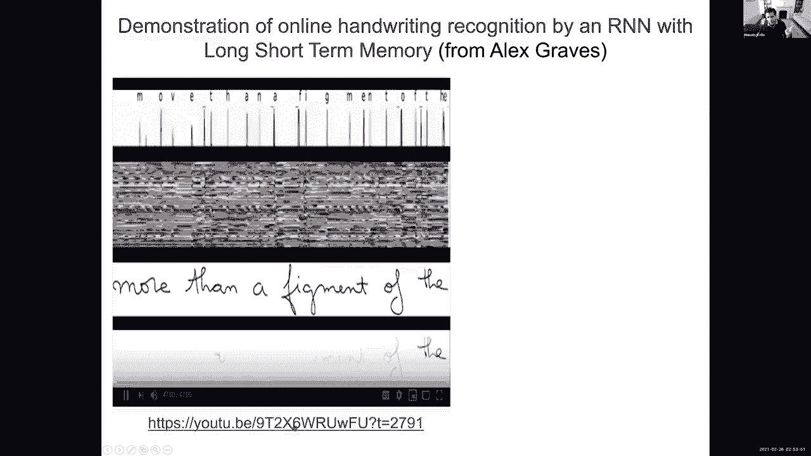

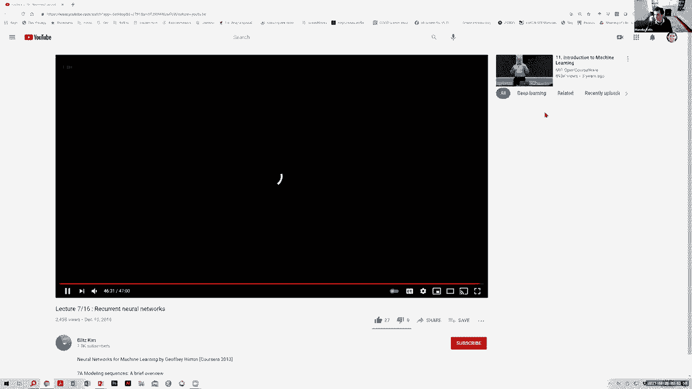


## 4. 应对梯度消失：长短期记忆网络 🧠➡️💾

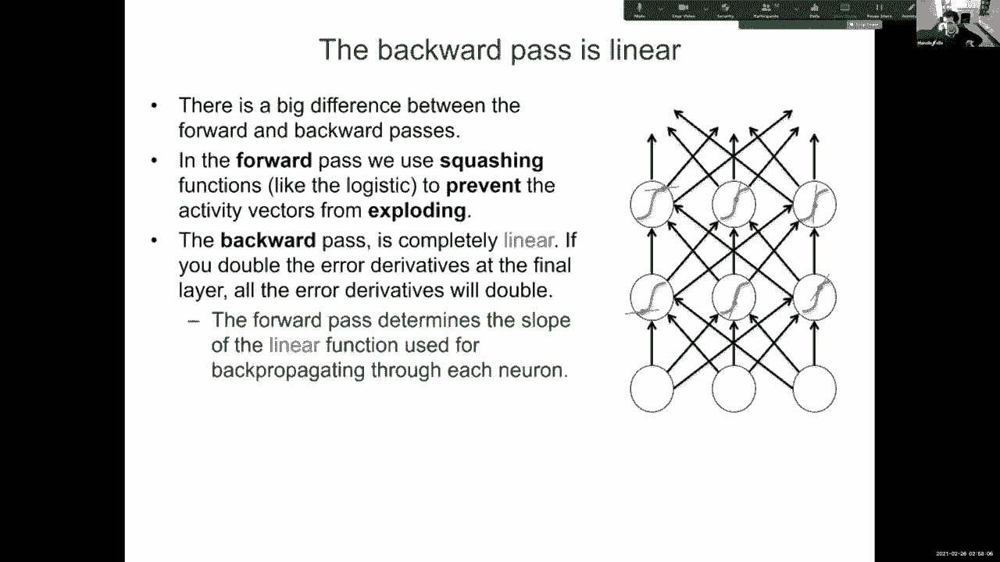

然而，RNN在处理长序列时面临一个严峻挑战：**梯度消失/爆炸**。当误差通过许多时间步反向传播时，梯度会指数级地缩小或增大，导致早期时间步的信息无法有效影响模型参数更新。

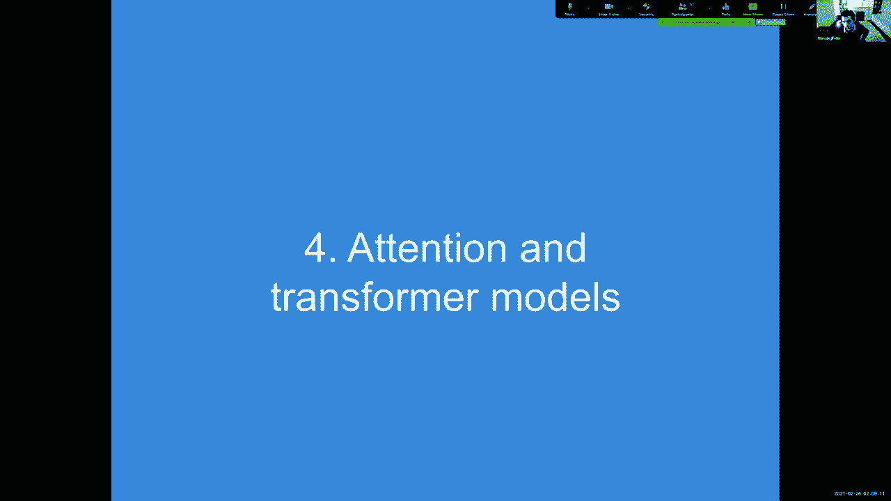

为了解决这个问题，研究者提出了**长短期记忆网络**。LSTM引入了一个称为“细胞状态”的传送带，它贯穿整个序列，只有少量的线性交互，信息在上面流传很容易保持不变。LSTM通过三个“门”结构来精细调控细胞状态：

*   **遗忘门**：决定从细胞状态中丢弃哪些信息。
*   **输入门**：决定将哪些新信息存入细胞状态。
*   **输出门**：决定基于细胞状态输出什么。

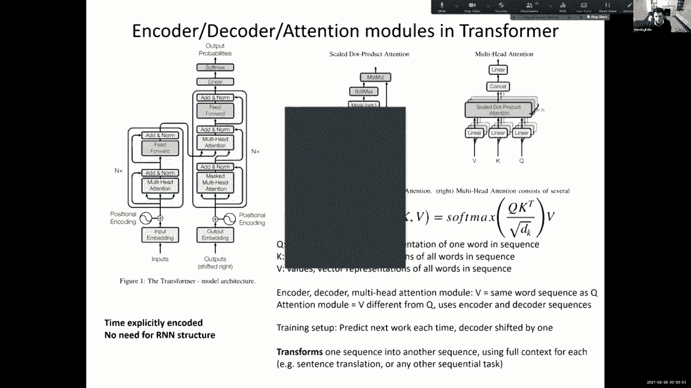

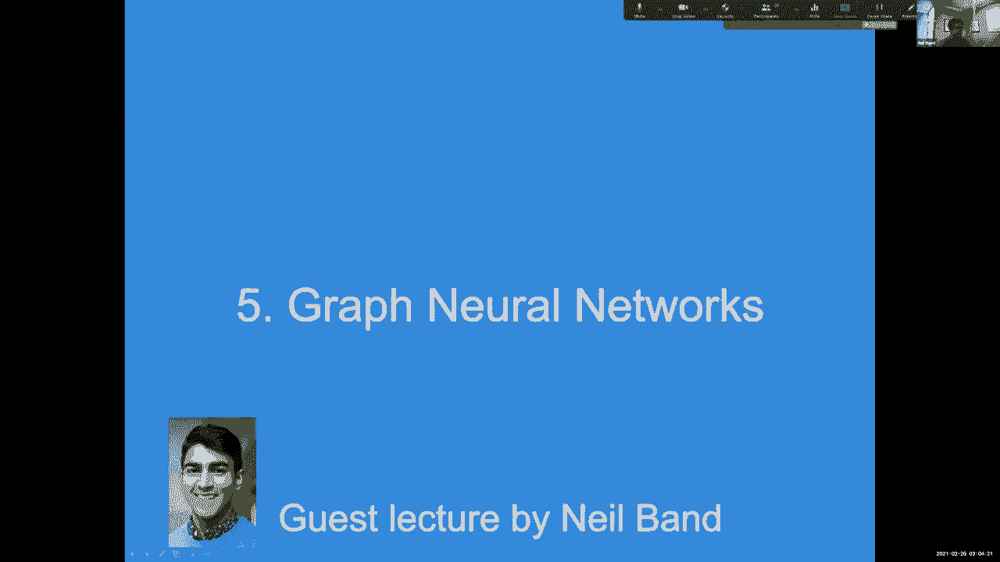

这些门（通常由sigmoid函数实现）让LSTM能够学习长期依赖关系，决定何时记住、何时遗忘信息。其核心公式如下：

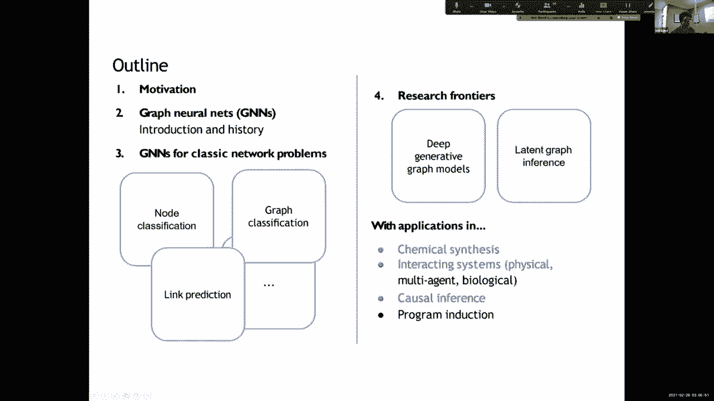

```
f_t = σ(W_f · [h_{t-1}, x_t] + b_f)  # 遗忘门
i_t = σ(W_i · [h_{t-1}, x_t] + b_i)  # 输入门
C̃_t = tanh(W_C · [h_{t-1}, x_t] + b_C) # 候选细胞状态
C_t = f_t * C_{t-1} + i_t * C̃_t       # 更新细胞状态
o_t = σ(W_o · [h_{t-1}, x_t] + b_o)  # 输出门
h_t = o_t * tanh(C_t)                # 输出隐藏状态
```

LSTM在诸如手写识别、机器翻译等需要长程记忆的任务上取得了巨大成功。

## 5. 超越循环：Transformer与注意力机制 ⚡

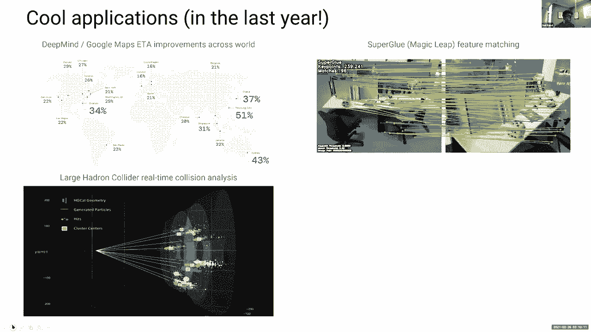

尽管LSTM有效，但循环结构本质上还是顺序的，限制了计算并行性。**Transformer** 架构完全摒弃了循环，仅依赖**注意力机制**来捕获序列中任意位置之间的依赖关系。

Transformer的核心是**自注意力**机制。对于序列中的每个元素，它计算一个“查询”向量，并与序列中所有元素的“键”向量进行匹配，得到一个注意力权重分布。然后，用这个权重对所有的“值”向量进行加权求和，从而得到该元素的新的表示。这个过程允许模型直接关注到序列中任何相关的部分，无论距离多远。

Transformer模型通常采用编码器-解码器架构：
*   **编码器**：将输入序列映射为一组上下文表示。
*   **解码器**：基于编码器的输出和之前已生成的输出，自回归地生成目标序列。

关键创新在于，解码器的输入是目标序列向右移动一位（即“偏移”），这使得模型在训练时能学习预测下一个词。Transformer通过**位置编码**来注入序列的顺序信息，因为自注意力机制本身是不感知顺序的。

注意力权重的计算公式如下，其中Q、K、V分别是查询、键、值矩阵，`d_k`是键向量的维度：

```
Attention(Q, K, V) = softmax(QK^T / sqrt(d_k)) V
```

## 6. 从序列到图：图神经网络 🌐

我们之前看到的CNN处理网格数据（如图像），RNN和Transformer处理序列数据（一维网格）。但现实世界中许多数据的关系可以用**图**来表示，例如社交网络、分子结构、知识图谱。

**图神经网络** 的目标是学习如何将信息在图中的节点之间进行传播和聚合。GNN的核心操作是“消息传递”：在每一层，每个节点会聚合其邻居节点的特征信息，并结合自身特征，更新自己的表示。

一个经典的GNN模型是**图卷积网络**。其节点更新公式可以简化为：

```
H^{(l+1)} = σ(Â H^{(l)} W^{(l)})
```
其中 `H^{(l)}` 是第l层的节点特征矩阵，`W^{(l)}` 是可学习的权重矩阵，`Â` 是经过归一化的邻接矩阵（加入了自环），`σ` 是非线性激活函数。

GNN具有以下优点：
*   **参数共享**：同一层的权重在所有节点间共享，与图大小无关。
*   **置换不变性**：对节点重新排序不会影响计算结果。
*   **可扩展性**：可以处理不同大小的图，适用于归纳学习和直推学习。

更强大的变体如**图注意力网络**，引入了注意力机制，让节点在聚合邻居信息时能够区分不同邻居的重要性。

GNN可以应用于节点分类、链接预测、图分类等多种任务，在药物发现、推荐系统、物理模拟等领域有广泛应用。

## 总结 📝

本节课中，我们一起学习了处理序列和图结构数据的核心神经网络架构。

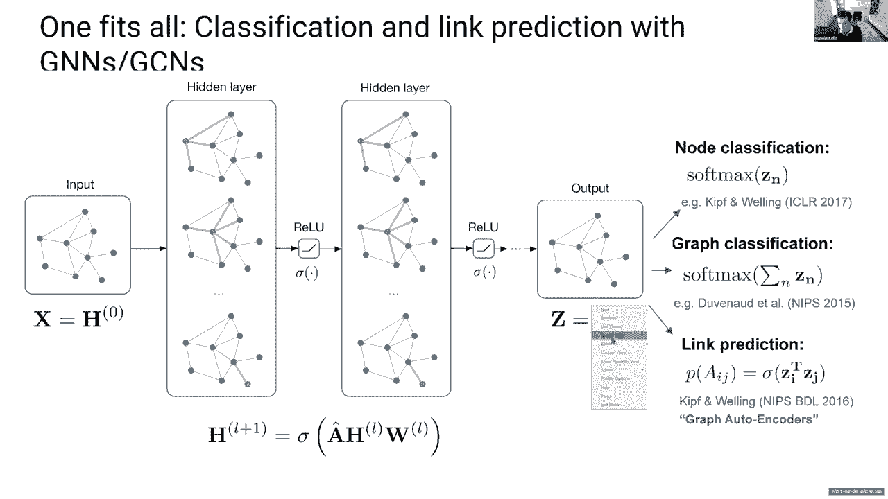

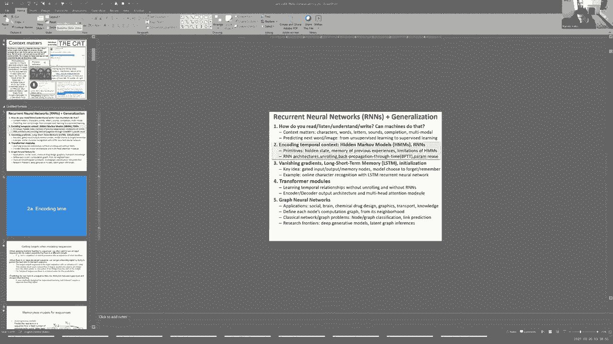

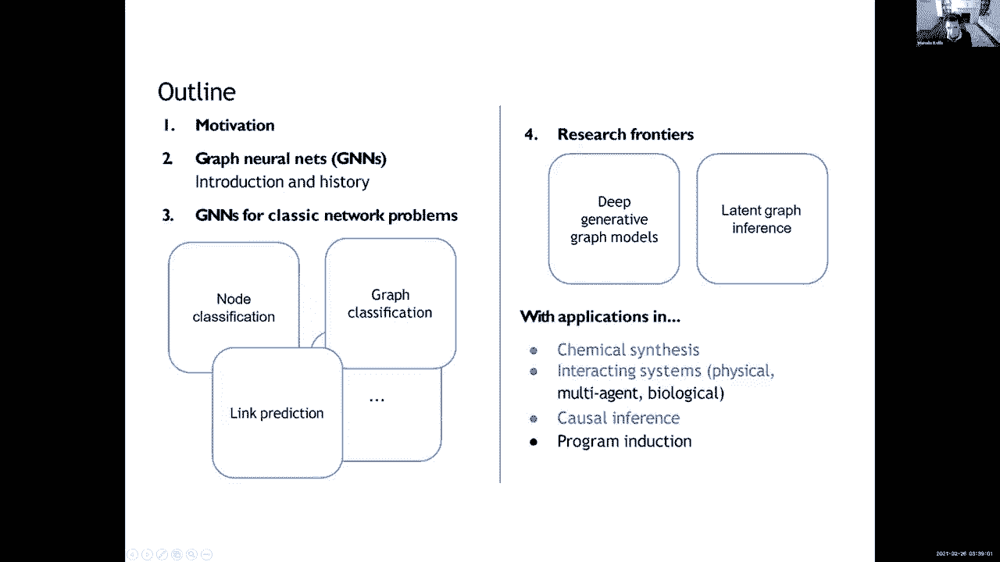

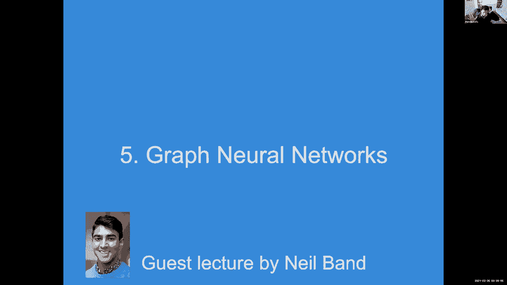

我们首先探讨了人类利用上下文理解序列的认知原理。接着，从隐马尔可夫模型的局限性出发，引入了循环神经网络，并学习了如何通过时间反向传播来训练它。为了克服RNN的梯度消失问题，我们深入了解了长短期记忆网络的门控机制。然后，我们看到了完全基于注意力机制的Transformer如何革命性地处理序列，实现了高效的并行计算。最后，我们将神经网络的应用范围扩展到了非欧几里得数据，学习了图神经网络的基本思想和消息传递框架。

这些模型构成了现代深度学习处理时序与关系数据的基石，并将为后续课程中蛋白质结构预测、药物设计等复杂项目提供强大的工具。