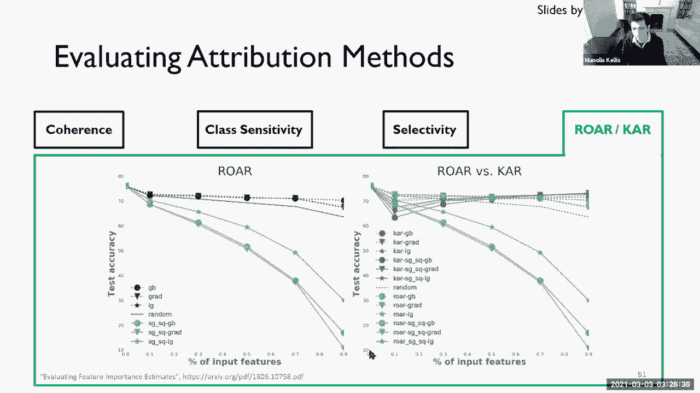

# 5：可解释的深度学习 📚


在本节课中，我们将学习什么是深度学习的可解释性，以及如何将神经网络这个“黑箱”中的信息，转化为人类能够理解的形式。我们将探讨可解释性的重要性、不同的解释方法，并学习如何评估这些方法的有效性。

***

## 🎯 什么是可解释性？

可解释性是指将神经网络中隐含的、复杂的信息，转换为人可以理解的信息的过程。

当人类顶尖棋手李世石与AlphaGo对弈时，AlphaGo走出了一些人类棋手从未见过的“非人类”棋步。这揭示了围棋更深层的奥秘，但AlphaGo本身并没有告诉我们这些奥秘是什么。它只是凭借强大的计算能力获胜。机器在学习，但我们无法从中提取知识。

因此，我们需要可解释性来理解：为什么机器能做得更好？我们能从中学到什么？

***

## 🔍 为什么可解释性很重要？

可解释性至关重要，原因有以下几点：

1.  **验证与调试模型**：我们需要确保模型按照预期工作。错误的决策代价可能极高（例如，自动驾驶汽车事故、医疗误诊）。可解释性有助于我们定位问题。
2.  **获得新发现**：在医疗诊断等领域，理解模型为何将肿瘤分类为恶性，不仅能验证诊断，还能帮助医生学习新的病理特征，甚至改进未来的诊断方法。
3.  **解释的权利**：当算法做出影响个人的决策时（如贷款审批、招聘），当事人有权知道决策的依据。这有助于发现并消除模型训练数据中可能存在的偏见。
4.  **理解人类自身**：通过研究模型如何“看”图像（例如，区分松饼和吉娃娃），我们也能反思人类视觉和决策的过程。

***

## 🛠️ 两种可解释性方法

根据引入解释的时机，方法可分为两类：

*   **事前可解释方法**：在模型设计之初就构建可解释性。例如，直接使用决策树等本身结构清晰、易于理解的模型。但这类模型表达能力有限，难以处理像深度学习所应对的复杂任务。
*   **事后可解释方法**：先构建复杂的“黑箱”模型（如深度神经网络），训练完成后，再开发专门的技术来解释它。这是目前深度学习领域的主流方法。

***

## 📊 解释的层次：模型 vs. 决策

事后解释方法可以根据其关注的粒度分为两个层次：

*   **解释模型**：这是**宏观**视角，侧重于理解模型的**内部工作机制**。例如，模型学到了哪些特征？整个决策边界是怎样的？
*   **解释决策**：这是**微观**视角，侧重于解释**单个具体的预测结果**。例如，为什么这张图片被分类为“猫”？是哪些像素导致了这一判断？

接下来，我们将分别深入这两个层次。

***

## 🧠 第一部分：解释模型（宏观）

解释模型旨在理解神经网络的内部表示。主要有四种方法：

### 1. 权重可视化
这种方法直接可视化卷积神经网络中学习到的滤波器。早期的研究发现，第一层滤波器学习到的是边缘、颜色块等基础特征，这与生物视觉皮层的研究结果惊人地相似。公式上，我们观察的是卷积核 `W` 本身。
```python
# 伪代码：可视化第一层卷积核
for filter in model.conv1.weights:
    visualize(filter)
```

### 2. 构建代理模型
用一个简单的、可解释的模型（如线性模型或决策树）去近似模拟复杂黑箱模型的预测行为。我们训练这个代理模型的目标不是拟合真实数据，而是拟合黑箱模型的输出。
```
代理模型 ≈ 黑箱模型的决策函数
```

### 3. 激活最大化
这种方法试图找到能够**最大化**某个神经元或输出类别激活的输入模式。其核心思想是：什么样的输入最能代表这个神经元或类别所学习的概念？

其目标可表示为以下公式：
```
x* = argmax_x (f_c(x) - λ * R(x))
```
其中：
*   `f_c(x)` 是模型对于类别 `c` 的激活值或置信度。
*   `R(x)` 是正则化项，用于约束生成的图像 `x*` 看起来更自然、更像真实数据。
*   `λ` 是权衡参数。

早期的无约束激活最大化会产生无意义的、叠加的噪声图像。通过加入从数据分布中采样的约束，可以生成更接近真实样本、人类可理解的“原型”图像。

### 4. 基于示例的方法
通过寻找训练集中最能代表（原型）或最能反驳（批评）某个类别的具体样本来解释模型。例如，找出那些“几乎”是某个类别但不是的样本（接近错过），这能揭示模型分类的边界和潜在缺陷。

***

上一节我们介绍了从宏观层面理解模型内部的四种方法。本节中，我们来看看如何解释模型做出的每一个具体决策。

## 🎯 第二部分：解释决策（微观）

解释决策关注单个输入和输出，旨在回答“为什么是这个结果？”。

### 1. 基于示例的解释
这种方法不关注输入图像的像素，而是追溯**训练过程**。它试图找出训练集中哪些样本对当前这个预测的影响最大。这类似于法律中引用先例来论证判决。

### 2. 归因方法
这是最直接的方法，它为输入（如图像）的**每一个特征**（如每个像素）分配一个**属性分数**，用以衡量该特征对最终决策的贡献程度。这些分数可以可视化为热图（显著图）。

#### 基线方法：梯度显著性
最简单的方法是计算模型输出相对于输入图像的梯度：
```
Saliency Map = |∂f_c(x) / ∂x|
```
这个梯度图显示了微小改变每个像素会对类别 `c` 的置信度产生多大影响。

**问题**：原始的梯度显著性图通常非常**嘈杂**，像素点分散，难以聚焦在目标物体上。

**假设与改进**：
*   **假设1：梯度不连续**：由于ReLU等分段线性函数，深度网络的决策函数可能不平滑，导致梯度噪声。
    *   **改进：平滑梯度**：通过对输入添加微小随机噪声并计算多个噪声样本梯度的平均值，来平滑梯度。
        ```
        SmoothGrad(x) ≈ 1/n * Σ Saliency Map(x + N(0, σ))
        ```
*   **假设2：函数饱和**：对于某些输入，模型可能已经达到很高的置信度，梯度很小，无法反映特征重要性。
    *   **改进：积分梯度**：不是计算在原始输入点的梯度，而是计算从基线（如全黑图像）到当前输入点路径上的梯度积分。
        ```
        IntegratedGrads(x) = (x - x') * ∫_{α=0}^{1} [∂f(x' + α(x-x'))/∂x] dα
        ```
*   **基于反向传播的改进**：
    *   **反卷积**：尝试反转卷积操作，将高层特征映射回输入像素空间。
    *   **导向反向传播**：结合前向传播中的激活信息，在反向传播时只回传正梯度，从而生成更清晰、聚焦于目标物体的显著图。

***

## 📈 如何评估归因方法？

我们如何知道一种归因方法的好坏？可以从定性和定量两方面评估：

以下是主要的评估维度：

*   **定性评估**：
    *   **连贯性**：归因热点是否准确地落在了图像中的目标物体上，而不是分散在背景？
    *   **类别敏感性**：当解释不同类别的预测时，其归因图是否具有区分度？例如，解释“猫”和“狗”的显著图应该聚焦于不同的特征。

*   **定量评估**：
    *   **特征删除测试**：按照归因分数从高到低删除像素（或设为基线值），观察模型预测置信度的下降速度。好的归因方法，删除高分像素会导致置信度急剧下降。
    *   **保留与再训练测试**：修改输入图像（如遮挡高归因区域），然后用这些修改后的图像重新训练一个模型。如果归因准确，新模型在测试集上的性能应该显著下降。

***



## 🎓 课程总结

本节课中我们一起学习了深度学习的可解释性：

1.  **定义与动机**：我们明确了可解释性是将神经网络隐含信息转化为人类可理解信息的过程。其动机包括验证模型、调试错误、获得新发现以及保障“解释的权利”。
2.  **方法分类**：我们区分了**事前**与**事后**解释方法，以及**解释模型**（宏观）和**解释决策**（微观）两个层次。
3.  **解释模型的方法**：我们学习了**权重可视化**、**构建代理模型**、**激活最大化**（及其约束版本）和**基于示例**的方法，以理解模型的内部表示。
4.  **解释决策的方法**：我们探讨了**基于示例**和**归因方法**。重点分析了原始梯度显著性图的噪声问题，并介绍了**平滑梯度**、**积分梯度**、**反卷积**和**导向反向传播**等改进技术。
5.  **评估方法**：最后，我们了解了如何通过**连贯性**、**类别敏感性**、**特征删除测试**和**保留再训练测试**等指标，定性和定量地评估不同归因方法的优劣。

通过本课的学习，希望你不仅掌握了让深度学习模型“开口说话”的工具，也深刻理解了在关键应用领域追求模型透明与可信的重要性。