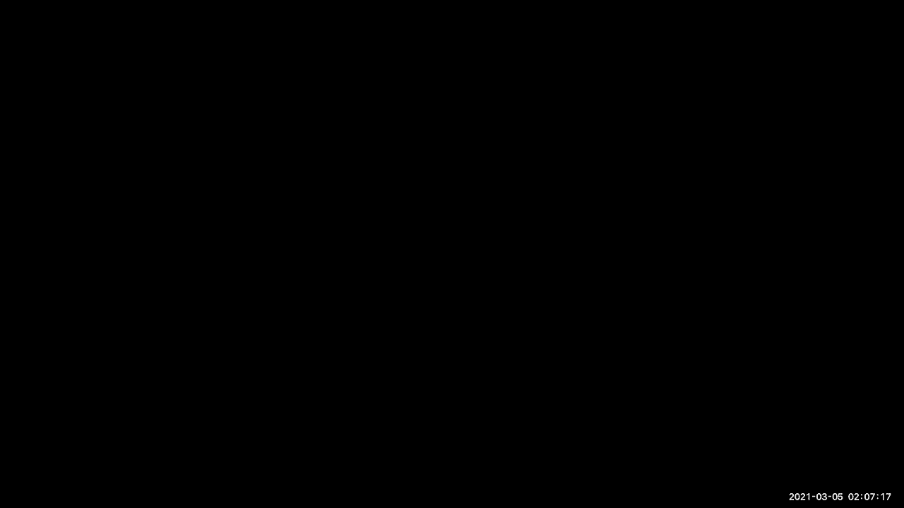
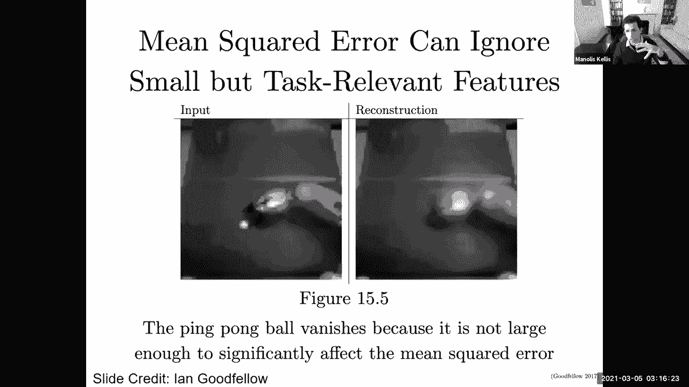
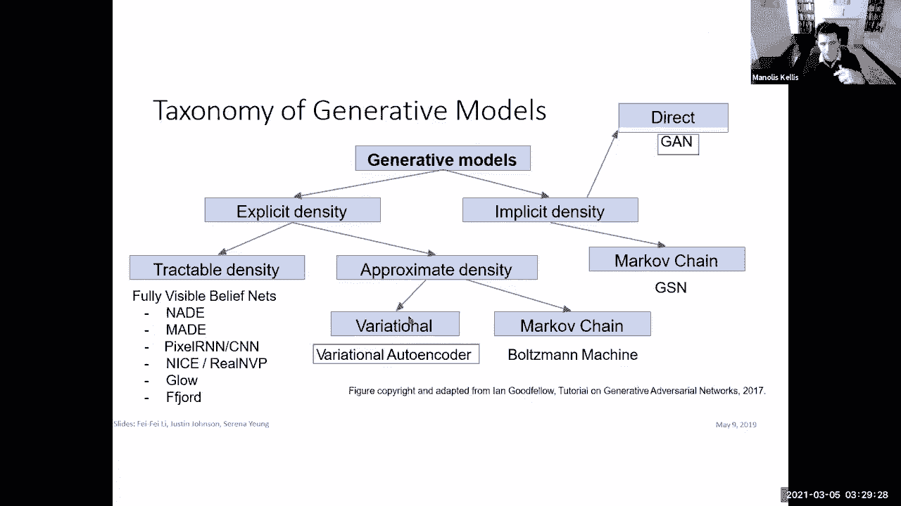

# 6：生成模型、GAN、VAE与表征学习 🧠

在本节课中，我们将要学习生成模型的核心概念。生成模型不仅能识别世界，更能创造世界。我们将重点探讨两种最流行的生成模型：生成对抗网络和变分自编码器。更广泛地说，我们将讨论模型如何学习对世界的“表征”。

---

## 概述：表征学习的力量

我们之前讨论卷积神经网络时提到，深度学习的真正创新在于“表征学习”。在分类任务中，模型的大部分能力并非来自最后的分类层，而是来自学习到的中间特征，例如边缘、角落、轮子等更一般的场景。这种特征提取是卷积神经网络中最重要的概念。

事实上，表征学习是贯穿图神经网络、循环神经网络、自编码器及其变体、对抗网络等领域的普遍关键思想。分类任务实际上是驱动特征提取的“借口”，而特征提取是所有知识表示的来源。这是一个非常强大的通用范式。

当前，除了图像，还有许多具有结构的应用领域（如基因组学、生物学、神经科学）尚未被现有架构充分捕获和利用。思考表征学习，是进行架构创新的绝佳起点。

---

## 从监督学习到无监督学习

在传统的监督学习中，我们有数据 `X` 和标签 `Y`。但最令人兴奋的部分是潜在空间表示 `Z`。最大的问题是：我们能否完全抛弃标签 `Y`，专注于学习表征 `Z`？这样我们就可以利用多出数个数量级的无标签数据。

本节的目标是探索如何摆脱 `Y`，专注于通过各种方法学习表征。

---

## 借口任务：学习的“伪装”

上一节我们介绍了抛弃标签 `Y` 的目标，本节中我们来看看如何实现。一种核心思想是“借口任务”。我们并不真正关心任务本身，而是利用它作为学习世界表征的“借口”。

以下是几种常见的借口任务：

*   **预测自我**：这是自编码器的核心。输入一张图像，网络学习一个压缩的表示 `Z`，然后尝试用 `Z` 重建原始图像。任务本身（重建）并不重要，重要的是中间学到的压缩表示。
*   **预测未来**：在循环神经网络的背景下，利用时间序列数据（如语音、视频、文本）预测下一个元素。为了准确预测，模型必须学习能捕捉世界动态的有意义表征。
*   **预测图像间关系**：例如，给定两张连续图像（如射门和球入门），预测哪张在前。这迫使模型学习物理和因果模型。
*   **预测缺失部分**：从图像中移除一块补丁，然后让模型预测缺失的像素。除非模型理解世界，否则无法完成。
*   **预测旋转**：将图像旋转，让模型预测原始方向。这迫使模型理解图像内容。
*   **图像上色**：输入黑白图像，让模型预测彩色版本。
*   **图像超分辨率**：输入低分辨率图像，让模型预测高分辨率版本。
*   **多模态匹配**：例如，匹配视频画面与对应的声音。

所有这些任务都将无标签的输入数据 `X` 进行某种变换，然后将原始数据作为目标 `Y`，从而“伪装”成一个监督学习任务。我们真正关心的是网络在学习解决这些任务过程中所获得的中间表征 `Z`。

---

## 自编码器：通过压缩学习表征

上一节我们看到了各种“伪装”学习的方法，本节我们深入探讨其中最直接的一种：自编码器。自编码器的核心思想正是“预测自我”，但通过一个信息瓶颈。

自编码器包含两部分：
1.  **编码器**：将输入数据 `X` 编码为低维的潜在表示 `Z`（`Z` 的维度远小于 `X`）。
2.  **解码器**：将潜在表示 `Z` 解码，重建输入数据 `hat{X}`。

其目标函数是最小化原始输入 `X` 与重建输出 `hat{X}` 之间的差异（如均方误差）：
`Loss = ||X - hat{X}||^2`

由于 `Z` 的维度很小，网络不能简单地记忆输入，而是被迫学习数据中最重要、最具代表性的特征，从而形成有意义的压缩表示。

自编码器的美妙之处在于，训练完成后，编码器和解码器可以分开使用：
*   **编码器**：可作为特征提取器，将任何输入映射到有意义的低维特征空间 `Z`，用于比较、聚类或其他下游任务。
*   **解码器**：可作为生成模型。给定一个潜在向量 `Z`，它可以生成对应的数据 `X`。通过改变 `Z`，我们可以生成不同的数据样本。

---

## 变分自编码器：概率化的生成模型

上一节介绍的自编码器能学习表征并生成数据，但它的潜在空间 `Z` 是确定性的。本节我们看看如何将其概率化，从而获得更强大的生成模型——变分自编码器。

VAE 是自编码器的概率版本。关键区别在于：
*   编码器不再输出一个确定的向量 `Z`，而是输出一个概率分布的参数（通常是均值 `μ` 和方差 `σ`），假设 `Z` 服从高斯分布：`Z ~ N(μ, σ^2)`。
*   解码器从这个分布中采样一个 `Z`，然后重建数据。

这样做的好处是，我们显式地对数据的潜在变化进行了建模。潜在空间 `Z` 的每个维度都可能对应数据中有意义的、独立的特征（如人脸图像的微笑程度、头发颜色、头部朝向等）。

训练 VAE 需要最大化训练数据的对数似然，但这通常难以直接计算。因此，VAE 通过优化一个称为“证据下界”的可处理目标函数来间接实现：
`ELBO = E[log p(X|Z)] - KL(q(Z|X) || p(Z))`
其中：
*   `E[log p(X|Z)]` 是重建项，衡量解码器重建数据的好坏。
*   `KL(q(Z|X) || p(Z))` 是正则化项，衡量编码器产生的分布 `q(Z|X)` 与先验分布 `p(Z)`（通常为标准正态分布）的接近程度。它促使潜在空间变得规整、连续。

**总结 VAE：**
*   **优点**：是原则性的生成模型方法；能进行概率推断；学习到的潜在空间通常具有良好结构（连续、可插值）。
*   **缺点**：最大化的是似然下界，而非精确似然；生成的样本有时可能比较模糊。

通过 VAE，我们不仅学到了数据的表征，还学到了这些表征的分布，使我们能够通过从先验分布 `p(Z)` 中采样 `Z`，然后通过解码器生成全新的、合理的数据样本。

---

## 生成对抗网络：通过对抗提升质量

VAE 生成的图像有时较为模糊。本节我们介绍另一种强大的生成模型——生成对抗网络，它能生成质量更高、更清晰的图像。

GAN 的核心思想是“对抗训练”。它同时训练两个网络：
1.  **生成器 `G`**：接收随机噪声 `Z`，尝试生成逼真的假数据 `G(Z)`。
2.  **判别器 `D`**：接收数据（真实数据 `X` 或生成数据 `G(Z)`），尝试判断其真伪。

这两个网络玩一个“极小极大”游戏：
*   **判别器 `D`** 的目标是最大化正确分类的概率（给真数据高分，给假数据低分）。
*   **生成器 `G`** 的目标是最小化判别器做出正确判断的概率（即生成能骗过判别器的数据）。

其目标函数可以表示为：
`min_G max_D V(D, G) = E[log D(X)] + E[log(1 - D(G(Z)))]`

训练过程是交替进行的：
1.  固定生成器 `G`，训练判别器 `D` 几轮，使其更好地区分真假。
2.  固定判别器 `D`，训练生成器 `G` 几轮，使其生成更能欺骗当前判别器的数据。

随着对抗训练的进行，生成器和判别器的能力共同进化，最终生成器能产生极其逼真的样本。

**GAN 的变体与进展：**
*   **DCGAN**：将 CNN 架构引入 GAN，使用跨步卷积代替池化，使用批归一化等，使训练更稳定。
*   **Progressive GAN**：从低分辨率图像开始训练，逐步增加分辨率，极大地提升了生成高分辨率图像的质量和稳定性。
*   **StyleGAN**：对潜在空间进行更精细的控制，可以分离并操控图像的高层属性（如姿态、发型）和细节纹理。

GAN 已被广泛应用于图像生成、风格迁移、图像超分辨率、图像修复等领域，生成的图像质量 often 能达到以假乱真的程度。

---

## 总结与展望

本节课中，我们一起深入探讨了生成模型的世界。

1.  **核心范式**：我们首先确立了“表征学习”是深度学习的核心力量。分类任务只是学习世界表征的“借口”。
2.  **无监督学习**：我们探索了如何通过“借口任务”在无标签数据上学习有意义的表征。
3.  **自编码器**：我们学习了通过压缩与重建来学习表征的基本模型，其编码器和解码器可分别用于特征提取和生成。
4.  **变分自编码器**：我们将自编码器概率化，学习了如何显式建模潜在空间的分布，从而能够从分布中采样并生成多样化的数据。
5.  **生成对抗网络**：我们介绍了通过生成器与判别器的对抗训练来获得高质量生成样本的框架，并看到了它在图像生成方面的惊人效果。

生成模型领域仍然非常年轻且充满活力。从 VAE 的原则性概率框架到 GAN 的高质量输出，再到各种混合模型和新颖架构，天空才是极限。理解这些基础模型，将为你探索、创新乃至在生物、物理、艺术等跨领域应用打下坚实的基础。