# 7：调控基因组学 🧬

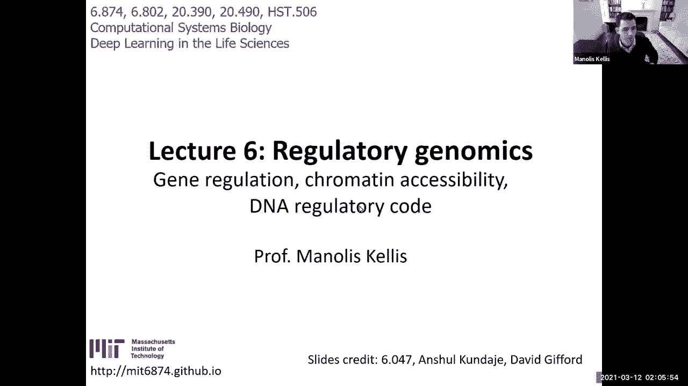

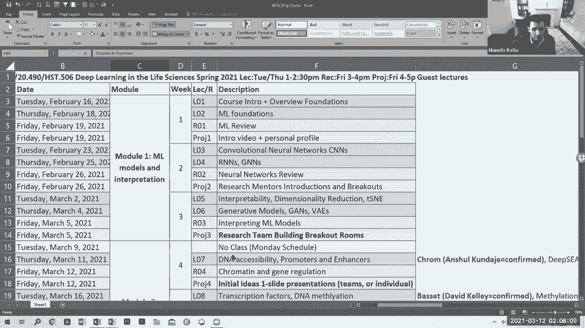

在本节课中，我们将学习调控基因组学的基础知识，包括基因调控的组成部分、染色质可及性以及DNA调控码。我们将探讨如何利用深度学习模型来理解DNA序列如何编码复杂的基因调控信息。

***

## 基因调控的组成部分

基因调控是生物学中最迷人的领域之一。从一个包含30亿个字母（A、C、G、T）的DNA“程序”出发，通过一系列细胞分裂，最终构建出具有复杂结构和功能的生物体。这一切的实现，依赖于细胞内的调控回路。

调控回路的基础是一系列结构和修饰，它们使细胞能够“记住”并响应不同的信号，从而决定细胞的身份和功能。DNA的包装方式是实现这一点的关键。

***

### DNA的包装与修饰

每个细胞都含有约两米长的DNA。为了将其压缩到微小的细胞核内，DNA被紧密地包装起来。这种包装本身也承载着重要的调控信息。

*   **核小体**：DNA缠绕在组蛋白八聚体（由H2A、H2B、H3、H4各两份组成）上，形成“串珠”状结构。每个“珠子”就是一个核小体，大约包裹147个碱基对的DNA。
*   **组蛋白修饰**：组蛋白的氨基酸尾巴可以进行多种翻译后修饰，例如甲基化、乙酰化等。这些修饰（如H3K4me3, H3K27ac）是重要的表观遗传标记，影响着DNA的可及性和基因表达。
*   **DNA甲基化**：在CpG二核苷酸（C后接G）上的胞嘧啶（C）可以添加甲基，形成5-甲基胞嘧啶。DNA甲基化通常与基因沉默相关，并能影响转录因子的结合。

这三种修饰（DNA可及性、组蛋白修饰、DNA甲基化）共同作用，构成了基因调控的“语言”。

***

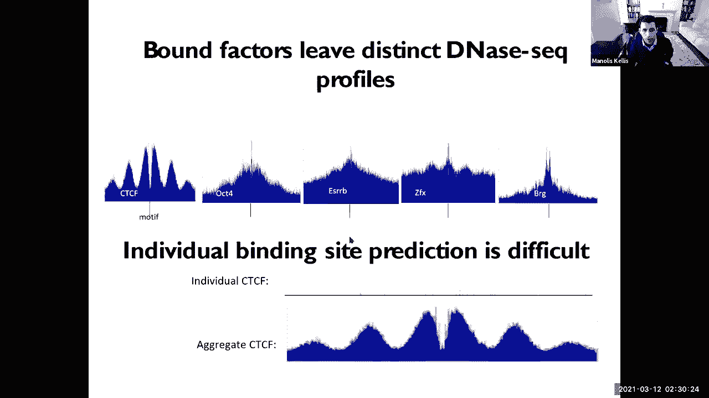

### 染色质状态与调控元件

通过组合上述修饰模式，我们可以定义基因组的不同功能区域，即“染色质状态”。利用隐马尔可夫模型等方法，可以系统性地发现和注释这些状态。

以下是几类关键的调控元件及其标志性修饰：

*   **启动子**：RNA聚合酶结合并启动转录的区域。标志包括H3K4三甲基化、H3K9乙酰化和DNA可及性。
*   **增强子**：可以远距离调控基因转录的动态区域。标志包括H3K4单甲基化、H3K27乙酰化和中等程度的DNA可及性。
*   **转录区**：正在被活跃转录的基因区域。标志包括H3K36三甲基化等。
*   **抑制区**：基因表达被抑制的区域。可通过DNA甲基化、H3K27三甲基化（多梳抑制）或H3K9三甲基化（异染色质）来标记。

***

## 识别DNA调控语言：基序与语法

基因组如何编码这些复杂的调控信息？关键在于DNA序列本身。

*   **转录因子与DNA基序**：转录因子是能够结合特定DNA序列的蛋白质。它们识别的短DNA序列模式称为“基序”。例如，一个转录因子可能偏好结合“CCATGG”这样的序列。
*   **位置权重矩阵**：通过比对某个转录因子的多个结合位点，可以构建一个位置权重矩阵来描述其结合偏好。矩阵中每个位置的信息含量（比特数）代表了该位置对结合特异性的重要程度。
*   **调控语法**：基因调控不仅仅是多个转录因子独立结合的总和。它们之间存在复杂的“语法”，包括：
    *   **组合规则**：哪些基序倾向于同时出现。
    *   **排列规则**：基序之间的优选间距和方向。

非编码区的DNA序列变异常常会破坏这些基序或语法规则，从而导致基因调控紊乱和疾病。

***

## 探索基因调控的实验技术

为了绘制全基因组的调控图谱，科学家们开发了多种高通量实验技术。

以下是几种核心技术的简介：

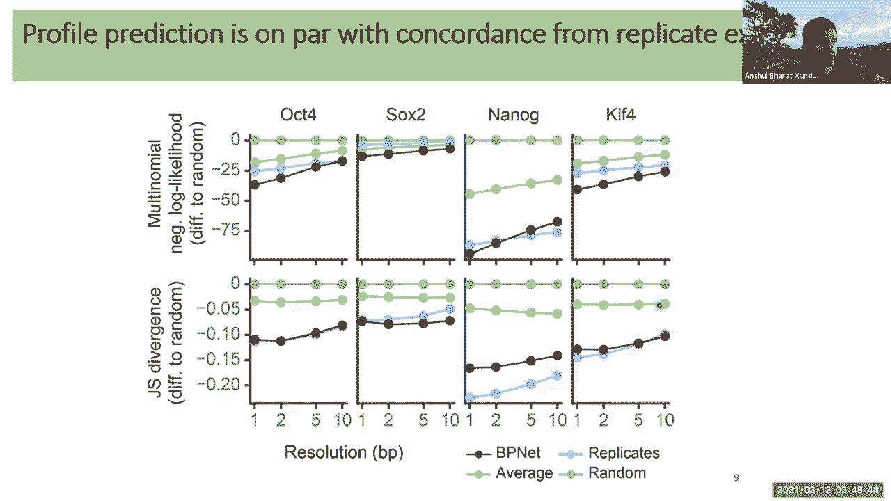

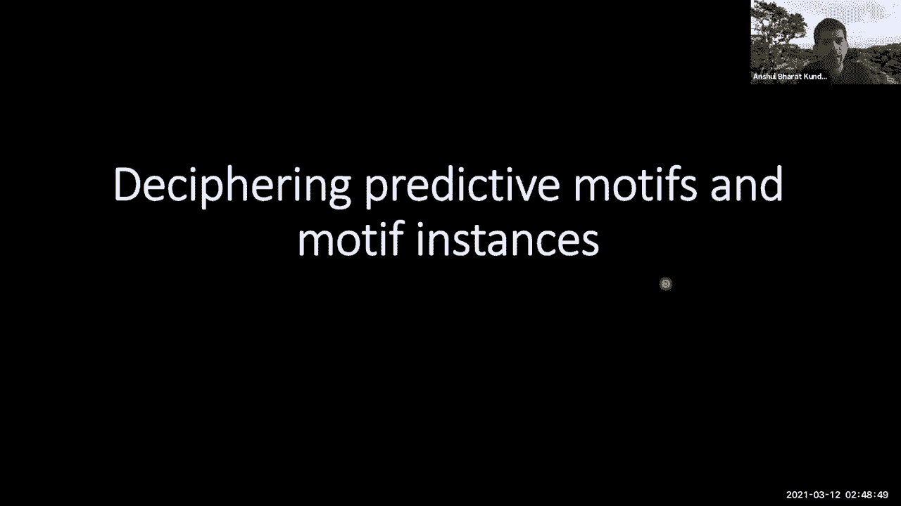

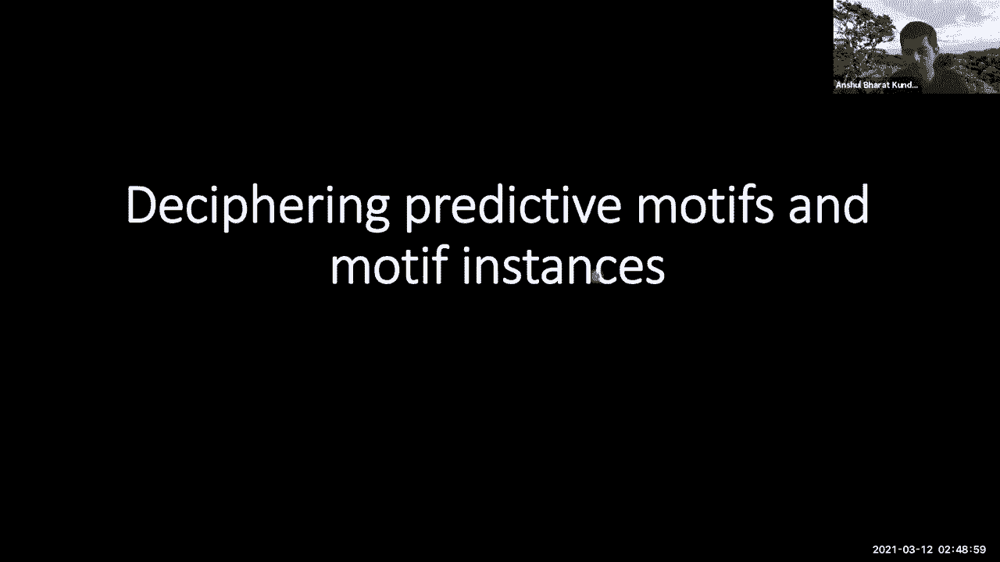

*   **染色质免疫沉淀测序**：利用特异性抗体富集与特定蛋白（如转录因子）或组蛋白修饰结合的DNA片段，然后进行测序，从而定位这些因子或修饰在全基因组中的分布。
*   **DNA可及性测定**：
    *   **DNase-seq**：使用DNase I酶切割开放的染色质区域，并对切割片段进行测序。
    *   **ATAC-seq**：使用Tn5转座酶插入测序接头到可及的染色质区域，效率更高，所需细胞量更少。

这些技术为我们提供了海量的数据，用以理解基因调控的机制。

***

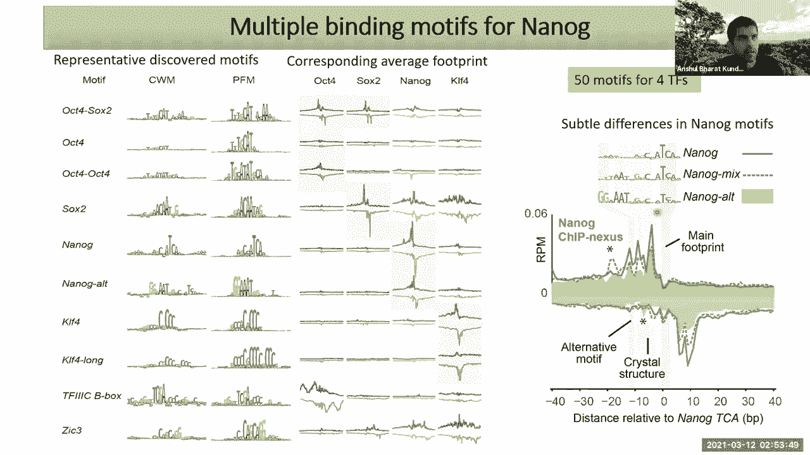

## 应用深度学习解析调控基因组学

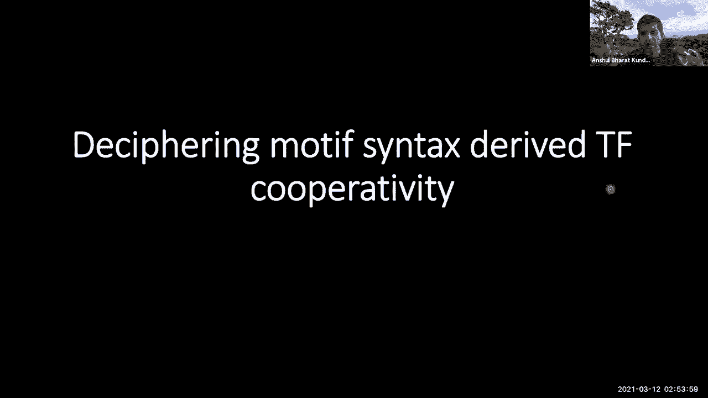

上一节我们介绍了基因调控的基础知识和实验技术。本节中，我们来看看如何利用深度学习模型，从这些高通量数据中挖掘DNA序列的调控逻辑。

### 🧠 从序列到轮廓：BpNet模型

传统的机器学习方法通常将一段基因组序列（如1000个碱基对）映射为一个标量信号（如该区域的总读数），这丢失了高分辨率的结合“足迹”信息。

BpNet模型创新地将此问题视为一个“文本到语音”的转换任务：
*   **输入**：DNA序列（文本）。
*   **输出**：单碱基分辨率的实验读数轮廓（语音），例如ChIP-nexus或ATAC-seq数据。

**模型架构与损失函数**：
*   **架构**：采用全卷积神经网络，结合**扩张卷积**以用更少的层获得更大的感受野，以及**残差连接**以促进信息流动。
*   **损失函数**：设计了一个复合损失函数，同时优化两个目标：
    1.  预测区域的总读数（使用负二项式或对数均方误差损失）。
    2.  预测读数在序列每个位置上的精确分布（使用**多项分布**的负对数似然损失）。多项分布完美模拟了将N次测序读数分配到多个基因组“箱子”中的过程。

该模型能够极其准确地预测蛋白质结合的高分辨率足迹。

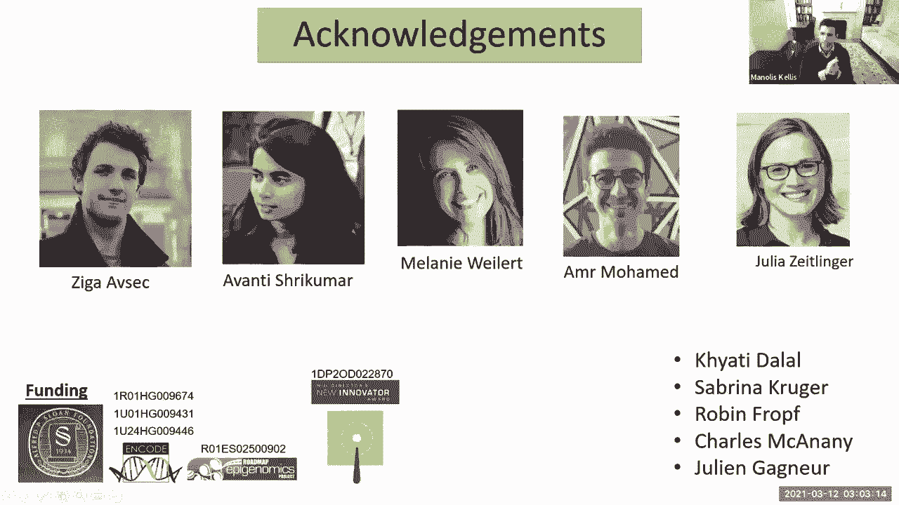

***

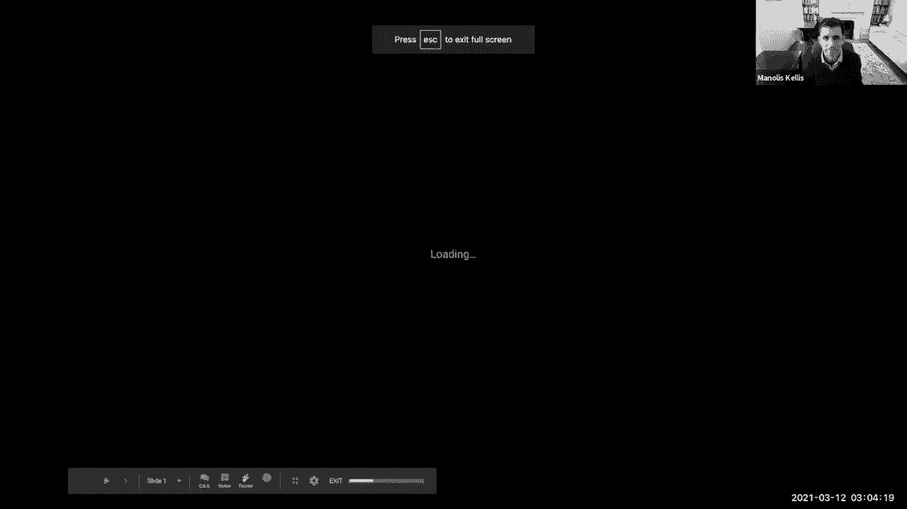

### 🔍 解释模型：揭示调控语法

拥有一个高精度的预测模型并非最终目标。我们更希望打开这个“黑箱”，理解它学到了什么。

*   **特征归因**：使用如**DeepLIFT**的算法，可以回溯模型的预测，计算出序列中每个核苷酸对最终预测的贡献度。这能直观展示驱动特定转录因子结合的序列模式。
*   **基序发现**：通过聚合分析成千上万个序列的归因分数，可以系统性地发现模型学习到的所有重要序列模式（基序）。研究发现，解释四种多能性转录因子（如Sox2, Nanog）的结合，需要约50个基序，远超传统认知，揭示了大量的组合与协作关系。
*   **语法发现**：模型能够学习到基序间高阶的排列规则。例如，分析发现Nanog结合位点侧翼的重要核苷酸呈现出**10.5个碱基对**的周期性模式，这正好是DNA双螺旋一圈的长度。这表明Nanog倾向于以二聚体形式结合在DNA螺旋的同一侧。

***

### 🧪 在硅片中验证：扰动实验

为了验证模型学到的语法规则如何驱动蛋白质的合作结合，可以在计算机中进行“在硅片”扰动实验。

*   **合成实验**：在随机DNA序列中嵌入两个基序，并系统地改变它们之间的距离。模型预测显示，Sox2的结合几乎不受与Nanog基序距离的影响，而Nanog的结合则强烈依赖于这个距离，并表现出10.5个碱基对倍数的偏好性，体现了非对称的协作效应。
*   **基因组扰动**：在真实的基因组增强子中，利用模型注释的基序，系统地“突变”掉某个基序，并预测其对所有因子结合的影响。这些计算预测与后续真实的CRISPR基因编辑实验结果高度一致，证明了模型解释的生物学可靠性。

***

## 深度学习增强表观基因组数据：AtacWorks

单细胞ATAC-seq技术让我们能在细胞分辨率下研究染色质可及性，但由于每个细胞的测序读数很少，数据非常稀疏嘈杂，难以准确识别开放区域。

AtacWorks模型旨在解决这一问题：

*   **目标**：输入低质量、低覆盖度或单细胞的ATAC-seq信号轨道，输出去噪增强后的信号轨道以及峰值（可及区域）位置。
*   **关键特点**：
    *   使用一维残差卷积神经网络。
    *   **不将DNA序列作为输入**，只使用覆盖度信号。这使得模型更容易在不同细胞类型和物种间迁移和泛化。
    *   通过从高质量数据中随机下采样来生成“噪声-干净”数据对，用于训练模型学习去噪和增强。
*   **效果**：
    *   能显著提升低覆盖度数据的信噪比，准确识别峰值。
    *   在单细胞数据中，仅用**十分之一数量的细胞**就能达到与传统方法使用全部细胞相当的分析效果。这使得研究稀有细胞亚群的染色质可及性成为可能。
*   **应用案例**：应用于人类造血干细胞，成功地从仅50个细胞的稀有祖细胞亚群中，获得了清晰的染色质可及性图谱，并发现了驱动其向不同血统分化的特定调控元件。

***

## 总结

在本节课中，我们一起学习了：
1.  **基因调控的基础**：包括染色质结构、组蛋白修饰、DNA甲基化以及它们如何定义启动子、增强子等调控元件。
2.  **调控密码**：DNA序列通过基序和复杂的语法规则编码调控信息。
3.  **实验技术**：ChIP-seq、ATAC-seq等技术如何帮助我们绘制全基因组调控图谱。
4.  **深度学习的应用**：
    *   **BpNet**展示了如何用序列到轮廓的模型高精度预测蛋白质结合，并通过解释模型揭示了前所未有的复杂调控基序和语法。
    *   **AtacWorks**展示了如何用深度学习增强低质量表观基因组数据，特别是在单细胞水平上，极大地提升了我们研究稀有细胞类型的能力。

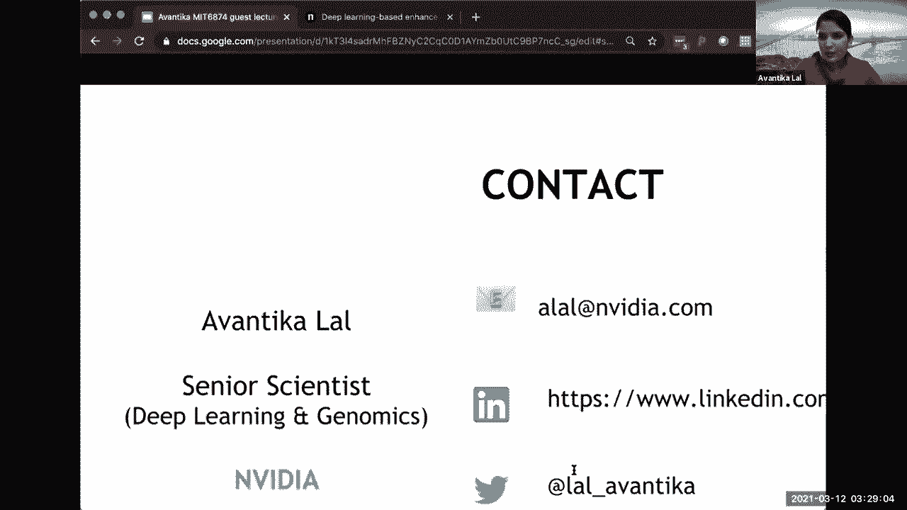

这些工作标志着我们正从单纯描述调控现象，走向真正理解其序列编码原理，并为解读非编码变异在健康和疾病中的作用提供了强大工具。