# 8：转录因子结合与三维染色质结构 🧬

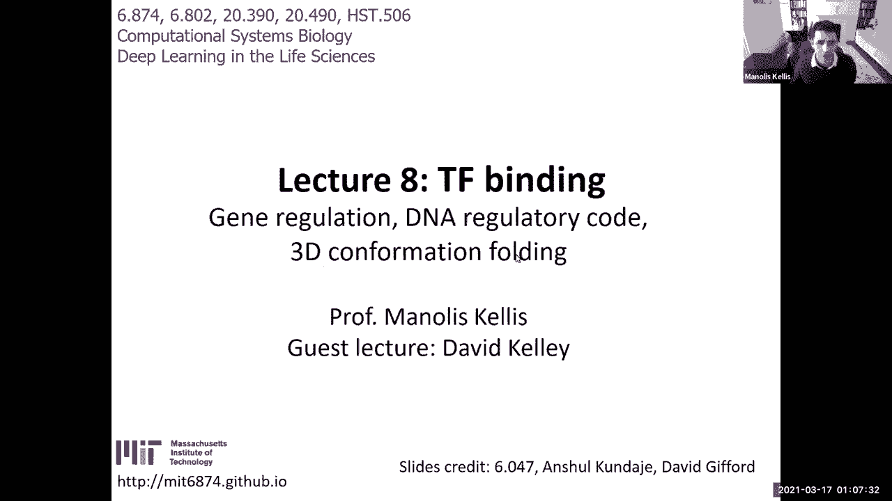

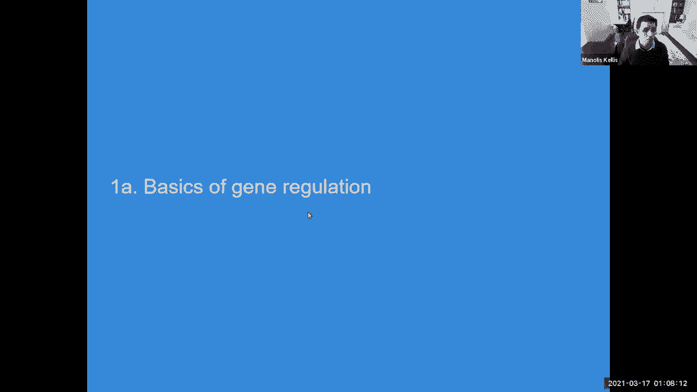

在本节课中，我们将学习基因调控的核心机制，特别是转录因子如何结合DNA，以及三维染色质结构如何影响基因表达。我们将回顾传统方法，并重点介绍深度学习在调控基因组学中的应用。

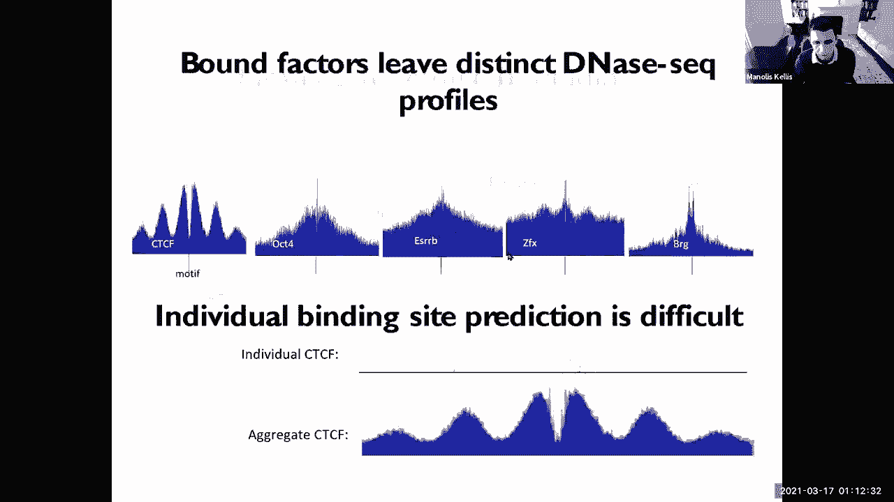

***

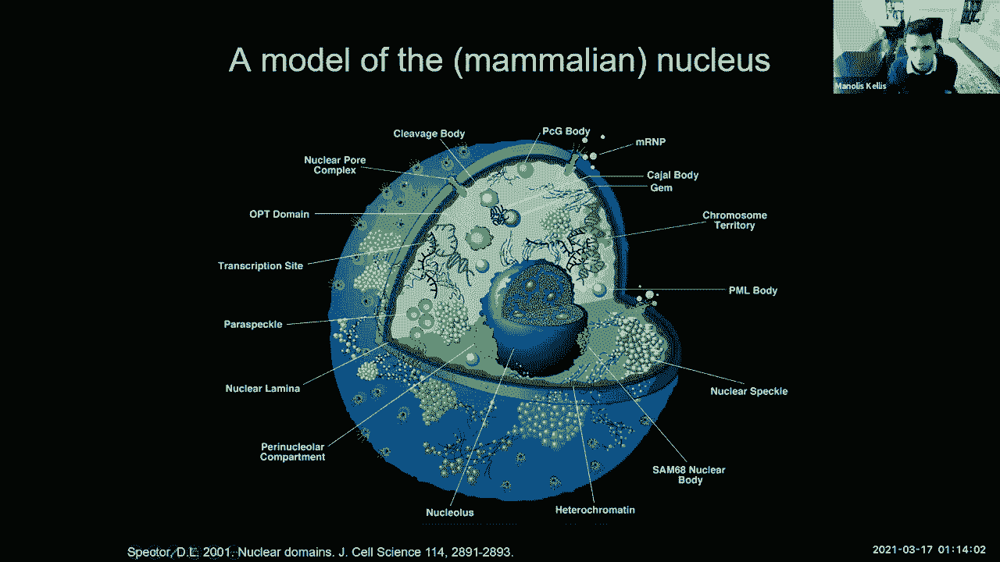

## 🔍 回顾：基因调控与染色质状态

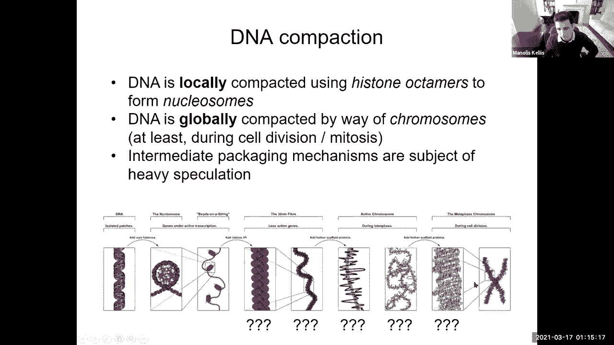

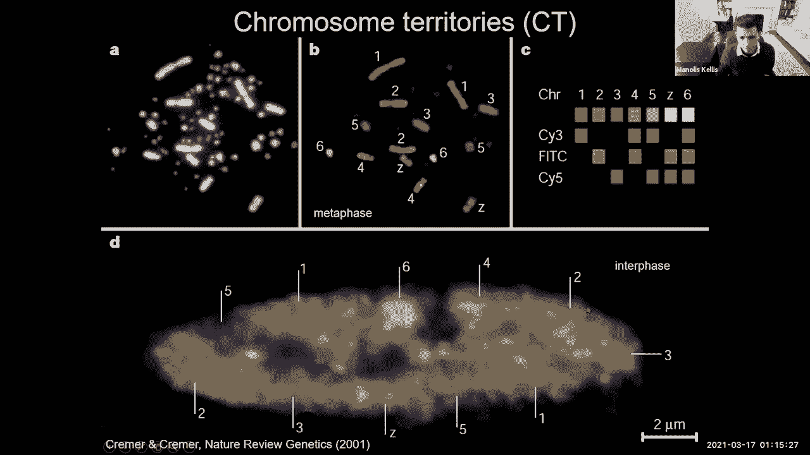

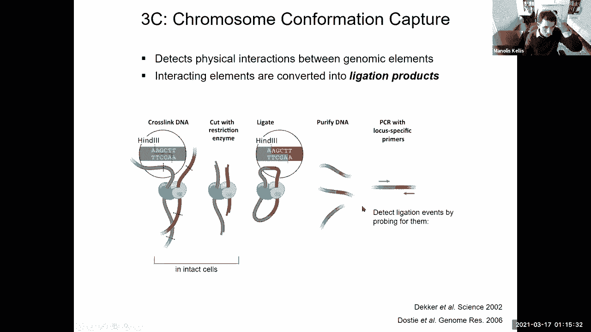

上一节我们介绍了基因调控是人体细胞类型多样性的基础。这通过染色质从DNA到核小体、染色质纤维、高级结构直至染色体的逐级压缩得以实现。这种包装不仅是结构性的，也具有功能性，能够通过特定的组蛋白修饰标记来标注不同区域，从而形成基因调控框架。

我们讨论了如何基于组蛋白修饰标记的组合来发现这些染色质状态。然而，在许多方面，这只是输入。真正的输入是DNA序列。因此，我们今天要解决的主要挑战是如何利用DNA序列和深度学习来预测基因调控基因组的不同特征，特别是如何区分构成增强子区域、启动子区域以及它们在三维空间中环化的特定基序。

我们讨论了基序如何由短序列模式表示，这些将成为我们卷积滤波器的基础。我们还讨论了深度学习网络在图像上下文中的分层表征学习能力。在本模块中，我们将探讨这些表示如何成为我们的基序，并成为深度学习框架底层的卷积滤波器。

最底层、最接近DNA序列的将是这些基序标识，它们将被学习为新的特征。这些基序标识将使我们能够开始预测调控因子是谁，以及它们如何组合以预测基因调控功能。这些标识基本上源自位置特异性权重矩阵或位置权重矩阵，这些模型独立地告诉你每个位置如何由每个转录因子的结合特异性决定。

***

## 🧵 三维染色质结构

接下来，我们增加一个层次：允许区域相互折叠的三维染色质结构。

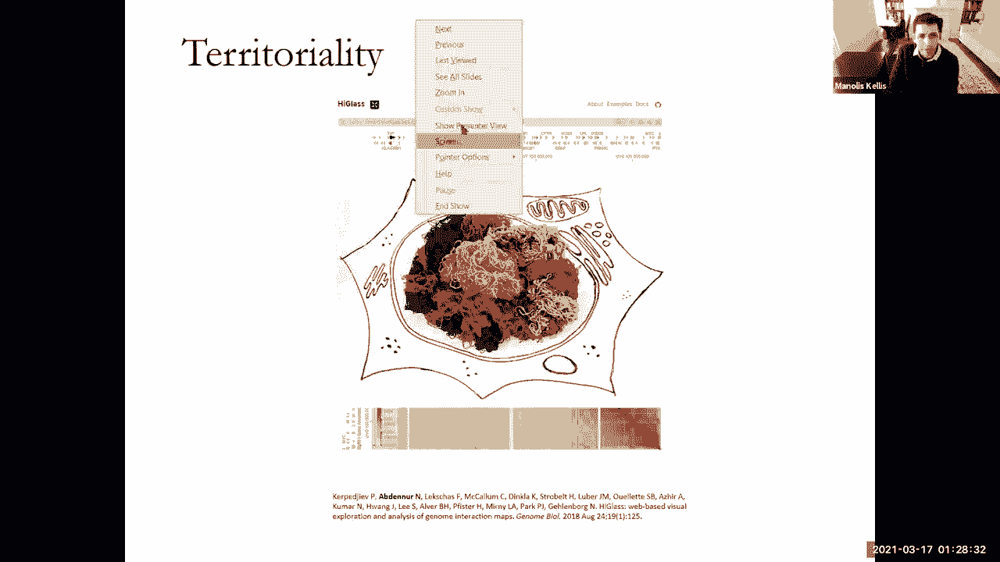

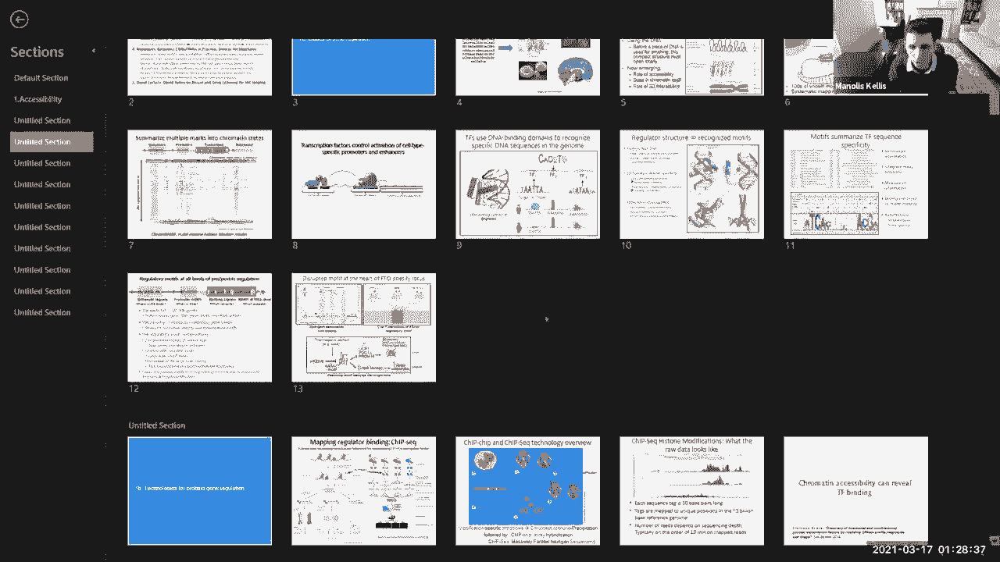

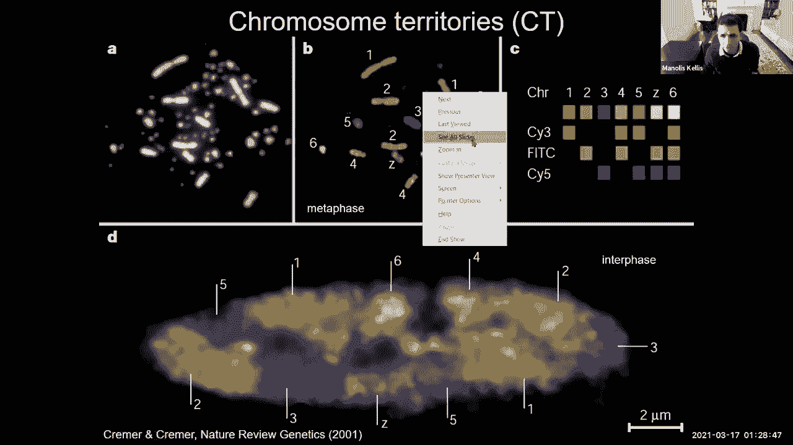

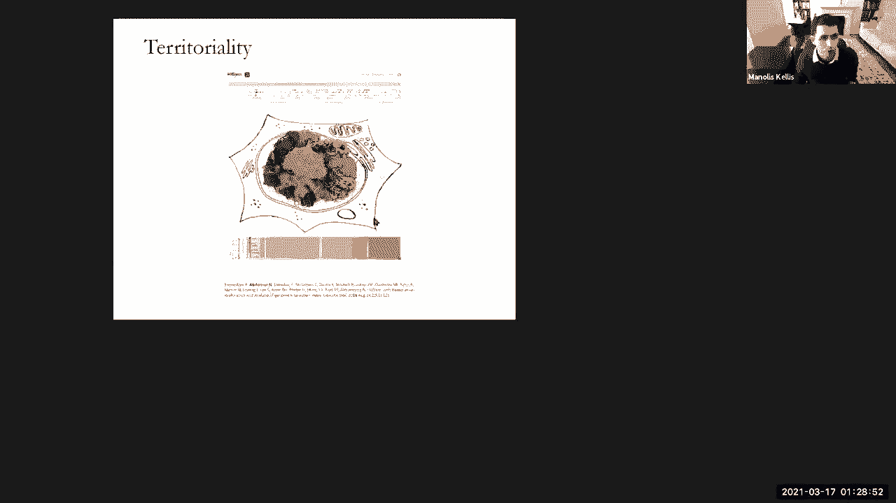

细胞核是巨大的。细胞质是细胞的大部分区域，蛋白质在那里翻译。我们现在放大到细胞核本身，所有DNA都在其中压缩。在细胞核内，甚至还有更小的核仁，哺乳动物细胞核内也发生区室化。

在细胞核内，不同的DNA链有时会接触到外围，这个外围被称为核纤层。许多被抑制的区域基本上堆积并紧贴核纤层。而活跃区域则被推离核纤层，更靠近细胞核中心，并位于染色体领域内。这实现了基因组的空间组织，你甚至可以在显微镜下观察到。

细胞核的直径约为6微米，而DNA的长度约为2米。压缩的规模相当惊人，基本上跨越了九个数量级。所有这些压缩都是分阶段、在不同组织层次上发生的。我们对核小体了解得很清楚，但对于这些中间阶段，直到最近才被阐明。

我们还认识到存在染色体结构域，不同的染色体实际上位于细胞核内。

***

## 🧪 染色体构象捕获技术

今天我们要讨论的是一种用于推断什么环化到什么的技术：染色体如何相互环化？

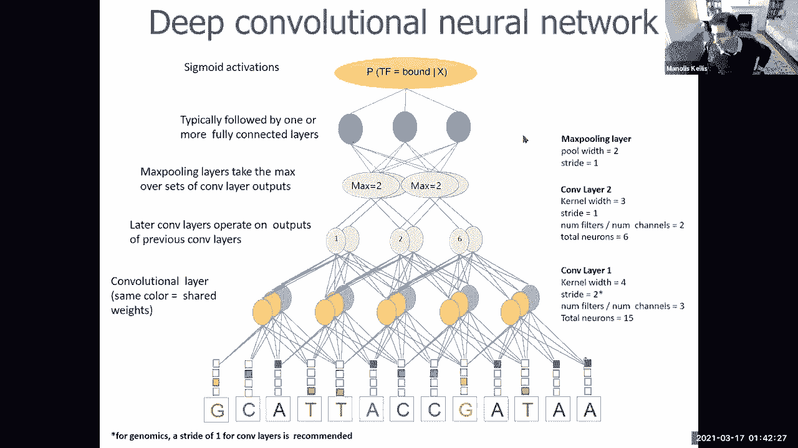

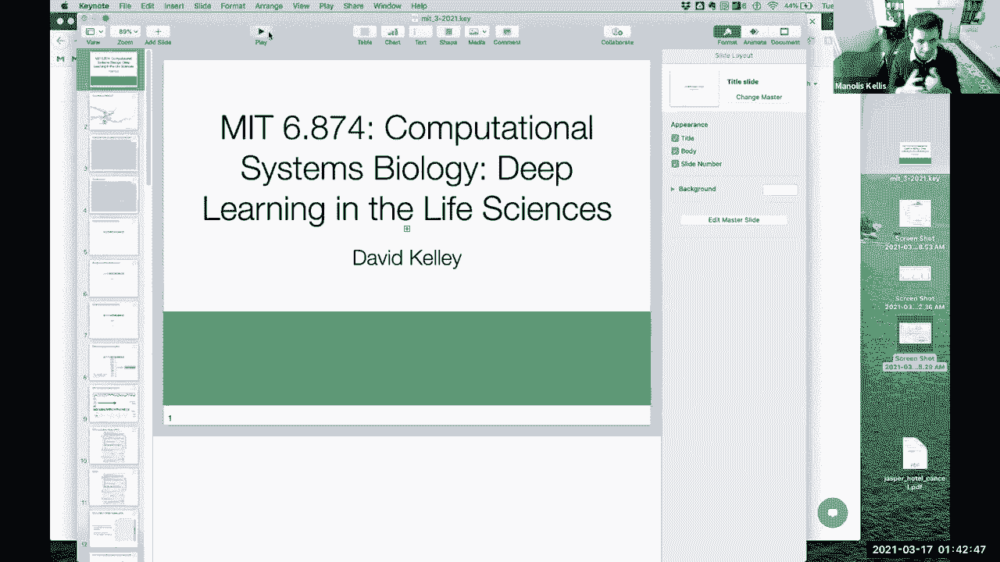

在深入之前，我们先介绍一种探测染色体组织的非常酷的技术：染色体构象捕获技术。这项技术的基本原理是：如果我有一碗意大利面（代表DNA），想弄清楚碗内蓝色面条与红色面条的接触点，我可以随机地将所有面条粘在一起，然后在随机长度和固定间隔处随机切割。例如，每次我看到特定的限制性内切酶切割位点时，我就会切割，这基本上会每四个核苷酸切割一次，从而产生这些随机切割的面条。

然后，我使用一种特殊的“胶水”来连接这些悬挂的切割末端，从而创建嵌合分子，这些分子包含部分蓝色面条和部分红色面条。接着，我对它们进行测序，以查看红色部分和蓝色部分在基因组中的定位。如果红色部分定位在这里，蓝色部分定位在那里，这基本上告诉我这两部分是相互环化的。

这项技术可以让我们深入了解三维基因组是如何包装的。我们可以在一个位点与另一个位点的水平上进行，这就是原始的3C技术。或者可以使用一对多技术，或者使用多对多技术。还有一种技术是通过随机切割，然后选择被标记为最近切割的片段，并特异性捕获这些嵌合区域。例如，通过添加生物素标记，这样每次红色片段被切割并与蓝色片段连接时，我都可以通过生物素化来特异性下拉这些嵌合区域。

还有其他技术，例如ChIA-PET，它类似于染色质免疫沉淀，但最终进行配对末端标记，从而能够通过特定蛋白质（如CTCF蛋白）的视角，只查看所有连接中的一个子集。

***

## 📊 三维相互作用的特征

通过高通量染色体构象捕获技术，我们可以获得类似这样的图谱。这些图谱基本上告诉我们，基因组沿着对角线分布，但同时也向两个方向延伸。每次你看到一个非对角线条目，它基本上告诉你基因组的这个区域与那个区域有多少相互作用。

因此，无论你在图片中实际看到什么，每个点都代表了环化信息。靠近对角线的地方，区域倾向于相互自相互作用，形成一条粗带。第二个特征是似乎存在一些边界，在这些边界内，区域内部的相互作用远多于与外部的相互作用，这些被称为拓扑关联结构域。第三个特征是这些结构域似乎是分层的，存在嵌套的层次结构。第四个特征是存在棋盘格模式，即A区室倾向于与其他A区室相互作用，B区室倾向于与其他B区室相互作用。

我们可以利用这些开始询问基因组实际上是如何组织的。我们可以开始可视化一些压缩过程，并观察放大时的特征。基本上，在整个染色体上，你可以看到这些区块，然后放大其中一个区块，再次看到这种分层性质，再进一步放大，开始看到个体相互作用，其中这个区域与那个区域非常强烈地相互作用。

我们称之为顺式相互作用和反式相互作用。有趣的是，许多反式相互作用现在被认为在不同实验中可重复地观察到。这种领域性表明，不同的染色体倾向于在细胞核内占据自己的空间。

***

## 🧠 从序列预测调控：传统与深度学习方法

现在，让我们深入探讨这些区域的计算分析。首先，我们如何理解DNA被所有这些不同调控因子读取并执行所有这些组织的语言？

第一件事是，我们将使用传统方法寻找调控基序。在深度学习之前，这些传统方法是关于寻找重复的模式。你基本上会说，我有一组共表达的基因，我的假设是它们受到一个共同的上游调控因子的共调控，该因子结合它们所有的上游区域。因此，我将开发计算方法来寻找它们之间共享的基序。这就是早期方法所做的。它们基本上是说，让我们使用位置权重矩阵来定义共享基序，该矩阵将是一个潜在变量。然后，我将迭代使用该矩阵来查找该基序的实例，然后使用这些实例来优化矩阵，再使用该矩阵来优化实例，如此反复。

现在，我们也可以使用相同的深度学习方法，利用表征学习、分层和从头发现滤波器，所有这些最初为图像开发的技术，现在可以用于调控基因组学。关键思想如下：就像图像分析有RGB输入图像一样，我现在不仅有三个通道，而是有四个通道，每个DNA字母对应一个通道。这被称为独热编码。因此，G通道只有在有G时才为1，否则为0。所以，我可以将我的序列表示视为一个四通道的“图像”。

在下一层，表征学习变得非常酷和有用。表征学习基本上是说，我将有一个卷积滤波器，将其应用于我的整个DNA序列的每个位置。就像在图像中扫描以检测边缘的边缘检测器一样，我将有一个基序检测器来扫描我的DNA序列，以识别何时出现特定的转录因子结合位点。以同样的方式，我们寻找轮子、鼻子、手电筒、帽子等特征，我们现在将搜索DNA的不同特征，这些特征将是基序。

因此，这里的核心概念是，我们将拥有一个深度学习架构，就像之前一样，具有越来越抽象的表征层。在最底层，我们将有经过独热编码的输入序列。在紧邻其上的层，我们将有卷积滤波器，这些滤波器将被从头学习。它们是卷积的，因为我在DNA的每个位置都应用完全相同的操作。

卷积滤波器通过在DNA的不同区域共享参数，学习轮子、边缘、鼻子或CTCF结合位点等概念。CTCF结合位点的概念将是“GATTAC”，我将在我的DNA中扫描它。一旦我学习了底层的表征，深度学习框架的美妙之处在于，我可以基于某些任务（例如，转录因子是否在此结合）动态地进行参数优化。基于某些任务，我将学习能够让我执行该任务的表征。我将学习这些在整个基因组中共享参数的表征。我的深度学习框架将意识到“GATTAC”的概念是有用的，并将学习该基序。它将学习CTCF结合位点的概念是有用的，ABF1结合位点是有用的，等等。

因此，它将学习所有这些卷积滤波器，然后与特定的预测任务一起在整个基因组中应用这些滤波器。一旦你有了这个概念，你就可以改变卷积滤波器的数量、长度和大小、层数、预测任务，以及各种输入-输出关系。我们将看到这个主题的许多不同变体。

***

## 🤖 嘉宾讲座：BASSET——深度学习在调控基因组学中的应用

现在，我们很高兴邀请David Kelly，他是最早开发深度学习框架的作者之一。他将深入讲解卷积神经网络在基因组学中如何工作的基础。

David的讲座将涵盖BASSET模型，这是一个用于预测DNA可及性的卷积神经网络框架。模型接收独热编码的DNA序列作为输入，通过卷积层学习基序，然后通过池化层和全连接层进行预测。BASSET采用多任务学习，同时预测多个细胞类型的染色质可及性，从而学习共享的表征。

模型的第一层卷积滤波器可以解释为转录因子结合位点的位置权重矩阵。通过分析这些滤波器，我们可以识别模型学习到的基序。此外，模型还可以通过扰动输入序列来研究特定基序对预测的影响，或者通过计算梯度来识别对预测重要的核苷酸。

为了处理长程相互作用和预测基因表达，David进一步开发了使用扩张卷积的模型。扩张卷积允许模型在更大的基因组区域内整合信息，从而能够考虑增强子、启动子和绝缘子等远端调控元件对基因表达的影响。通过残差连接，模型可以更有效地训练深层网络。

最后，David还探讨了如何利用深度学习预测三维染色质相互作用。通过将一维序列表征转换为二维接触矩阵，并使用二维扩张卷积，模型能够从DNA序列预测Hi-C数据中观察到的染色质环和拓扑关联结构域。

***

## 📝 总结

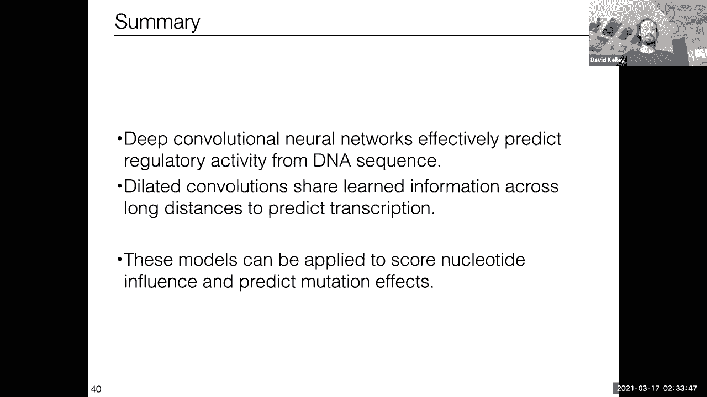

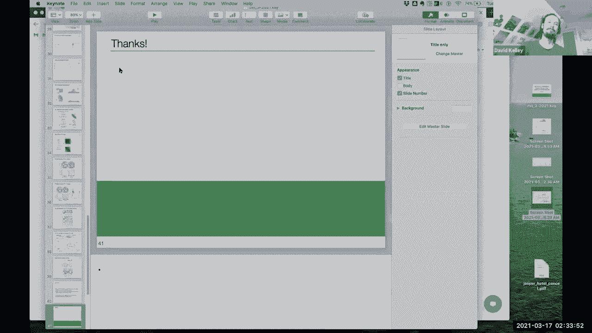

本节课中，我们一起学习了基因调控的核心机制，包括转录因子结合和三维染色质结构。我们回顾了传统的基序发现方法，并深入探讨了深度学习在调控基因组学中的应用，特别是卷积神经网络如何从DNA序列中学习调控基序和预测染色质特征。通过嘉宾讲座，我们了解了BASSET等工具的实际应用，以及如何利用扩张卷积和残差网络处理长程基因组相互作用和预测基因表达。这些技术为我们理解复杂的基因调控网络提供了强大的计算工具。