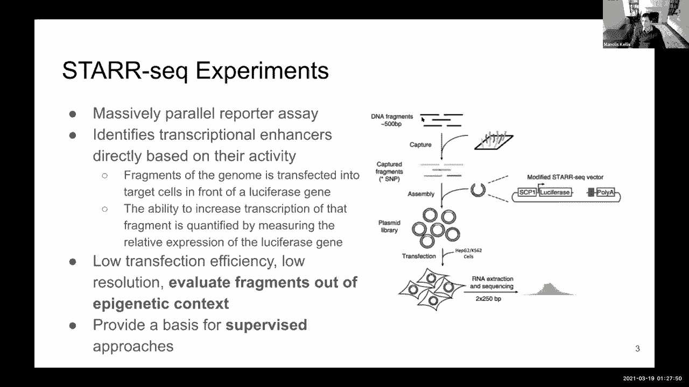
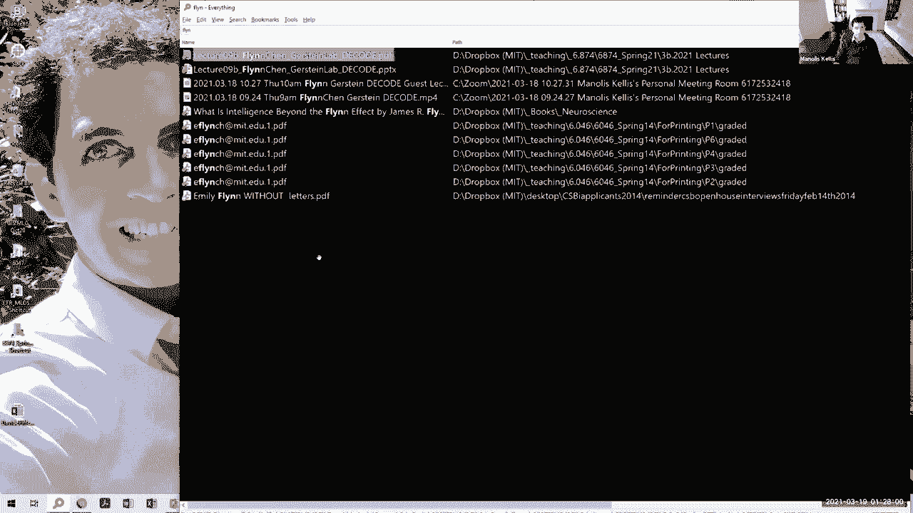
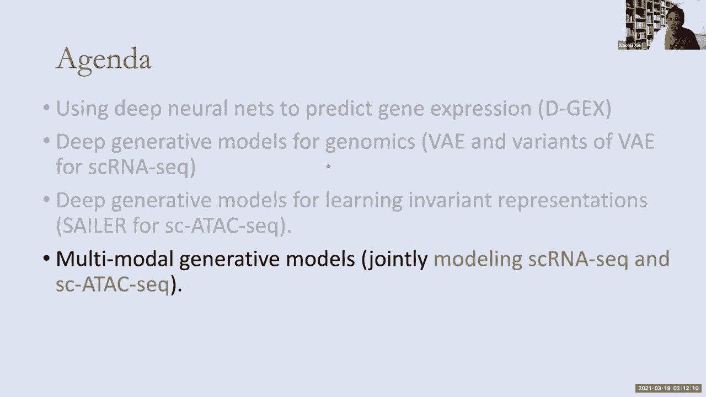
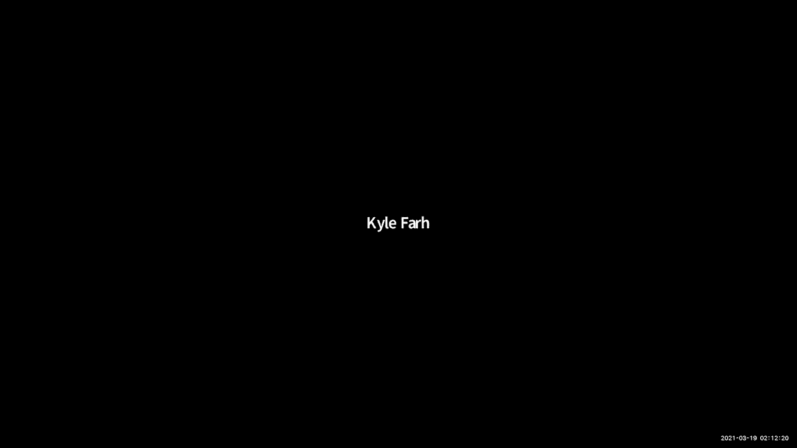
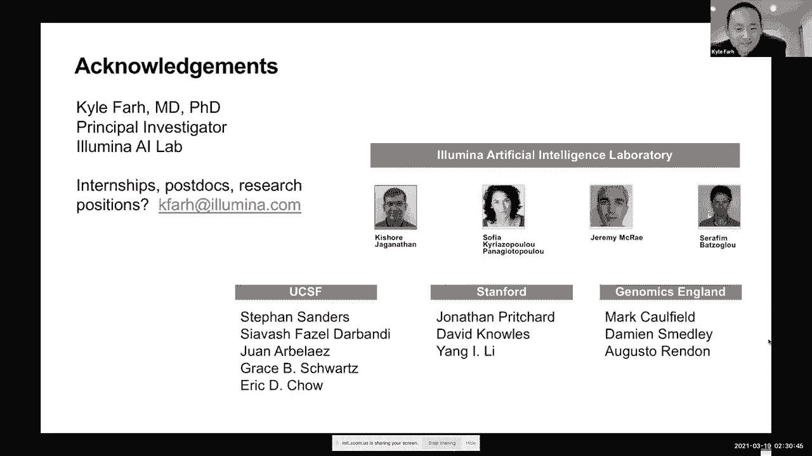

# 09：基因表达预测 🧬

在本节课中，我们将学习如何利用深度学习技术预测基因表达。我们将从基因表达分析的基础概念入手，探讨如何从少量基因数据预测全基因组表达，以及如何利用染色质特征和序列信息来预测基因表达和剪接事件。

***

## 📊 基因表达分析基础

基因表达分析的核心是测量细胞中RNA的水平。传统方法使用杂交技术，例如通过微阵列芯片测量特定基因的表达。近年来，随着测序成本的急剧下降，RNA测序（RNA-seq）已成为主流技术，它能够直接对转录组进行测序，从而更全面地获取基因表达数据。

这些技术最终会生成一个表达矩阵。矩阵的行代表基因组中的约20，000个基因，列代表不同的实验条件、组织类型或细胞状态。矩阵中的每个值代表特定基因在特定条件下的表达水平。

这个矩阵可以从两个维度进行分析。在垂直维度上，我们可以比较不同条件下同一基因的表达模式。在水平维度上，我们可以比较不同基因在同一条件下的表达模式。

***

## 🔍 无监督学习：聚类分析

在获得表达矩阵后，最基础的分析方法是进行无监督的聚类分析。

以下是两种主要的聚类分析思路：
*   **条件聚类**： 沿着矩阵的列（条件维度）进行聚类，可以找出在基因表达模式上相似的实验条件。例如，阿尔茨海默症患者与老年人的表达谱可能相似，这暗示了疾病与衰老过程可能存在关联。
*   **基因聚类**： 沿着矩阵的行（基因维度）进行聚类，可以找出在不同条件下共表达的基因。这些基因可能具有相似的功能，例如都参与B细胞或血细胞谱系的分化。

聚类分析是完全无监督的，不需要预先的训练标签，旨在发现数据中内在的结构和模式。

***

## 🎯 有监督学习与高级分析框架

上一节我们介绍了无监督的聚类分析，本节中我们来看看如何利用有监督学习和更高级的框架来分析基因表达数据。

除了聚类，我们还可以进行有监督的分类任务。例如，已知一组与T细胞功能相关的基因，我们可以训练一个分类器，在表达矩阵中寻找具有类似表达特征的其他基因，从而基于“关联内疚”原则推断新基因的功能。

更重要的是，我们可以利用在整个课程中学到的深度学习框架来处理表达数据。例如：
*   **自监督学习**： 我们可以随机遮盖表达矩阵的一部分，然后训练模型来预测这些缺失值。这迫使模型学习基因表达模式的潜在表征。
*   **多任务学习**： 我们可以同时预测多个生物学类别（如增殖、分化等），利用非线性特征和更高阶的交互信息。
*   **降维与表征学习**： 我们可以使用主成分分析（PCA）或自编码器等方法来学习基因或条件的低维“元表征”。公式 `X ≈ U Σ V^T` 表示通过奇异值分解（SVD）进行低秩矩阵近似。t-SNE等方法则可以学习一个能更好分离不同类别的低维嵌入空间。

这些工具使我们能够结合基因表达向量和染色质特征向量，来探索更复杂的生物学问题。

***

## 🚀 本节课的核心议题

基于上述分析框架，本节课将深入探讨三个前沿的基因表达预测议题。

以下是本节课三位客座讲师将重点介绍的内容：
1.  **表达上采样**： 如何从少量（如1000个）基因的测量值，预测全基因组（约20000个）的表达水平。这类似于图像分析中的超分辨率任务。
2.  **从染色质特征预测表达**： 基因的表达水平与其启动子、增强子等区域的染色质状态（如DNA可及性、组蛋白修饰）密切相关。因此，可以利用染色质信息来预测基因表达。
3.  **从序列预测剪接**： 前体mRNA的剪接过程决定了最终蛋白质的构成。我们可以利用深度神经网络，直接根据DNA序列来预测外显子的包含或排除，以及剪接位点的使用。

***

## 🧪 讲座一：从染色质特征预测增强子活性

首先，弗林·陈将介绍如何利用弱监督学习框架，从染色质特征中精确预测和定位增强子。

增强子是能够增加基因转录活性的调控元件。定位增强子对于理解疾病遗传驱动因素至关重要。早期方法因缺乏标注数据，多采用无监督方法（如ChromHMM）。随着STARR-seq等大规模并行报告基因检测技术的发展，我们现在可以获得大量关于基因组片段增强子活性的标注数据，从而转向有监督的学习范式。

STARR-seq实验能够高通量地检测基因组中每个片段是否具有增强子活性。然而，该实验的局限性在于，每个片段是在其原始表观遗传背景之外被评估的。

我们的方法旨在利用卷积神经网络，整合多种染色质特征（如DNA可及性ATAC-seq，组蛋白修饰H3K27ac， H3K4me3等），来预测STARR-seq的实验结果。模型输入是这些特征在基因组区域上的矩阵，输出是一个二元分类（是否有增强子活性）。

更巧妙的是，在模型做出阳性预测后，我们使用Grad-CAM（梯度加权类激活映射）方法。通过计算正向传播的梯度并将其反向传播到特定网络层，我们可以生成一个热图，高亮显示输入区域中对模型决策最重要的部分。这使我们能够将原始的宽窗口（如4kb）预测，细化为更精确、更高分辨率的“核心增强子区域”。

***

## 📈 讲座二：深度学习在基因表达分析中的应用

接下来，邵慰教授将介绍深度学习在基因表达分析中的多种应用，特别是深度生成模型。

我们开发了多种工具，例如DeepExpression（D-GEX），它使用深度神经网络从少量“标志基因”的表达来预测全基因组的表达谱。模型是一个简单的多层感知机，输入是约978个标志基因的表达向量，通过全连接层，最终输出预测的约20000个基因的表达向量。这比简单的线性回归基准表现更好。

对于更常见的无标注基因组数据，深度生成模型更为适用。其核心思想是将高维、复杂、嘈杂的数据映射到一个低维流形上进行研究。变分自编码器（VAE）是其中一种重要框架。

VAE的目标是最大化证据下界（ELBO）：
`ELBO = E_{q(z|x)}[log p(x|z)] - D_{KL}(q(z|x) || p(z))`
其中，第一项是重构损失，第二项是让近似后验分布 `q(z|x)` 接近先验分布 `p(z)`（通常为标准正态分布）的KL散度。

在单细胞RNA-seq数据分析中，人们通常使用零膨胀负二项分布（ZINB）来建模计数的离散性和高零值特性。将VAE与ZINB结合，可以有效地学习单细胞数据的低维表征。

然而，学习到的表征常常混杂了实验批次效应、测序深度等技术噪音。为此，我们提出了条件生成模型，在建模时显式地考虑这些混杂因素（c），并同时最小化潜在变量（z）与混杂因素（c）之间的互信息 `I(z; c)`，从而迫使模型学习到只反映真实生物学状态、去除技术噪音的表征。

***

## ✂️ 讲座三：从序列预测RNA剪接

最后，凯尔·法尔博士将介绍如何直接从DNA序列预测RNA剪接，以及其在解读非编码区变异中的临床应用。

人类基因组中约99%是非编码区，大部分功能未知。剪接是高等生物中从前体mRNA中去除内含子、连接外显子的关键过程。剪接供体（GT）和受体（AG）位点本身特异性很低，需要广泛的序列上下文来精确定义。

我们开发了SpliceAI，这是一个深度卷积神经网络。它以约10kb的DNA序列作为输入，为每个核苷酸位置预测它是剪接供体、受体还是其他。模型采用残差网络和扩张卷积架构，能够在保持序列位置一一对应关系的同时，捕获长距离的序列上下文信息。

模型自动学习到了许多已知的剪接调控特征，如分支点、多嘧啶束、外显子长度以及外显子簇效应。长距离上下文信息可以补偿局部剪接位点模体的弱化，这是之前基于位置权重矩阵（PWM）的方法失败的主要原因。

我们将SpliceAI应用于罕见病患者的全基因组数据。通过比较野生型和突变型序列的预测结果，可以识别出导致异常剪接（如外显子跳跃、内含子保留）的非编码区变异。在自闭症谱系障碍、智力障碍等大型队列中，SpliceAI预测的高影响剪接变异在患者中显著富集，并通过患者血液RNA-seq验证了预测的异常剪接事件。自然选择分析也表明，这些预测的隐性剪接变异与蛋白质截短变异一样受到强烈负选择。

***

## 📝 总结

本节课中我们一起学习了基因表达预测的多个方面。我们从基础的表达矩阵和聚类分析出发，探讨了如何利用深度学习进行表达上采样。通过三位客座讲师的分享，我们深入了解了如何从染色质特征预测增强子活性（弱监督学习），如何应用深度生成模型（如VAE）分析并校正单细胞基因表达数据，以及如何直接从DNA序列高精度预测RNA剪接事件（SpliceAI），并将其用于解读非编码区变异在人类疾病中的作用。这些工作展示了深度学习在解析基因组复杂调控逻辑和推进精准医疗方面的强大潜力。