# 10：单细胞基因组学入门教程 🧬


在本节课中，我们将学习单细胞基因组学的基础知识。我们将探讨为何需要单细胞分析、现代单细胞RNA测序技术的发展历程、超越RNA的多组学分析、数据处理中的挑战，以及相关的计算方法。

## 概述：为何需要单细胞分析？

传统批量测序方法提供的是细胞群体的平均测量值，这可能会掩盖细胞间的异质性。单个细胞在基因表达上存在巨大差异，这种差异可能源于环境刺激、细胞间相互作用、细胞周期阶段、转录爆发事件或分化轨迹。特别是在癌症研究中，肿瘤细胞间的基因型差异会导致显著的表型多样性。因此，单细胞分析对于揭示细胞多样性、捕获罕见事件以及理解复杂的生物过程至关重要。

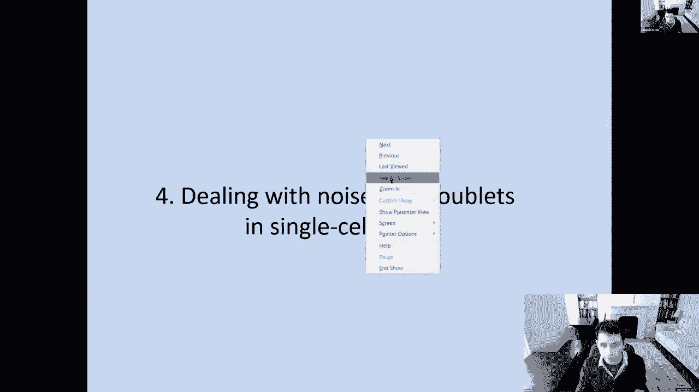

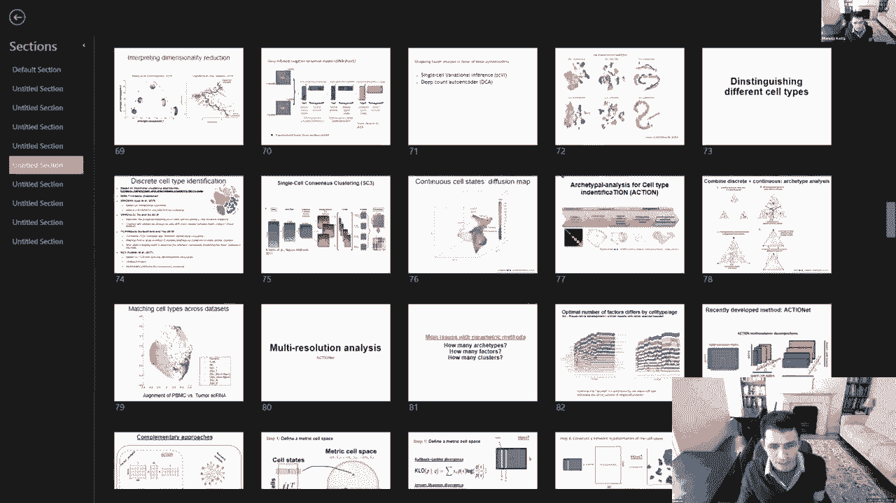

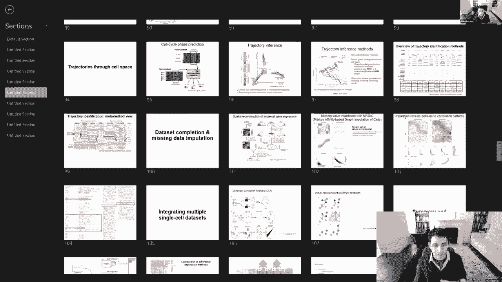

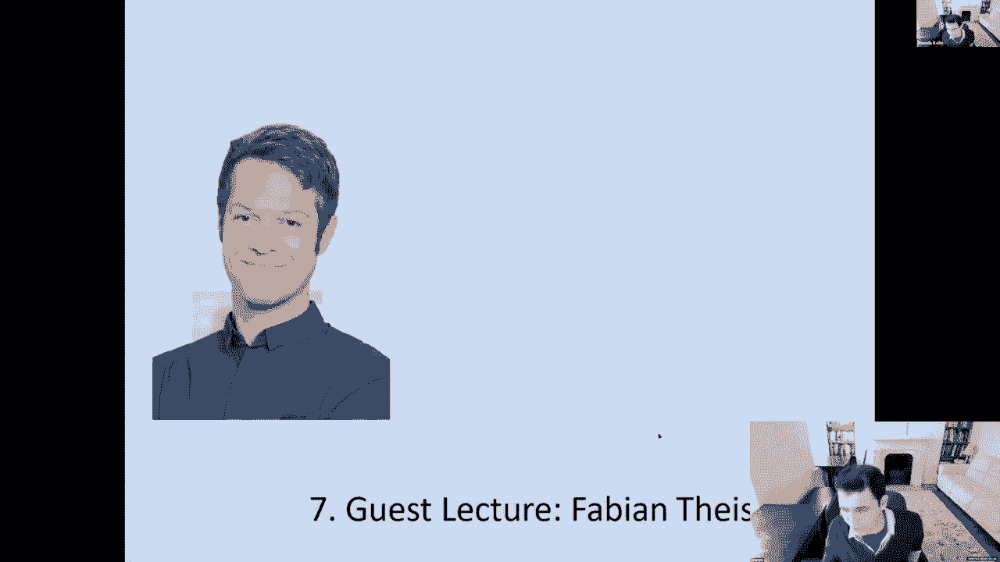

## 单细胞分析的传统与现代技术

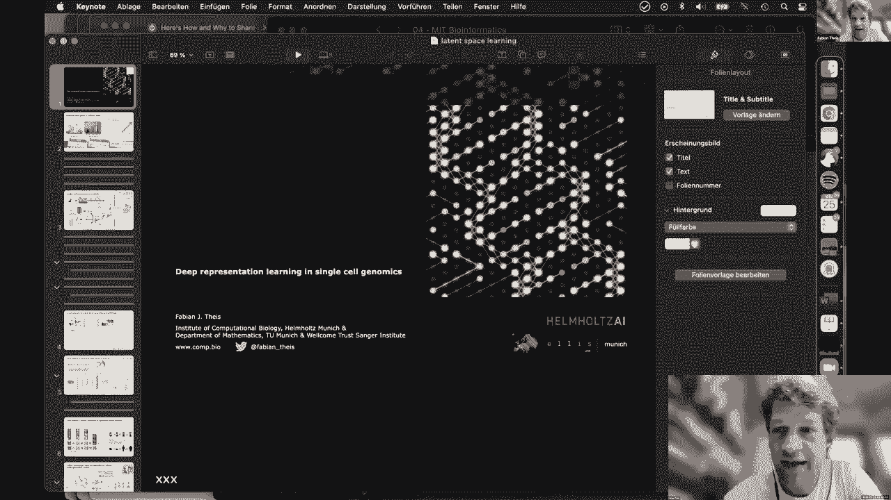

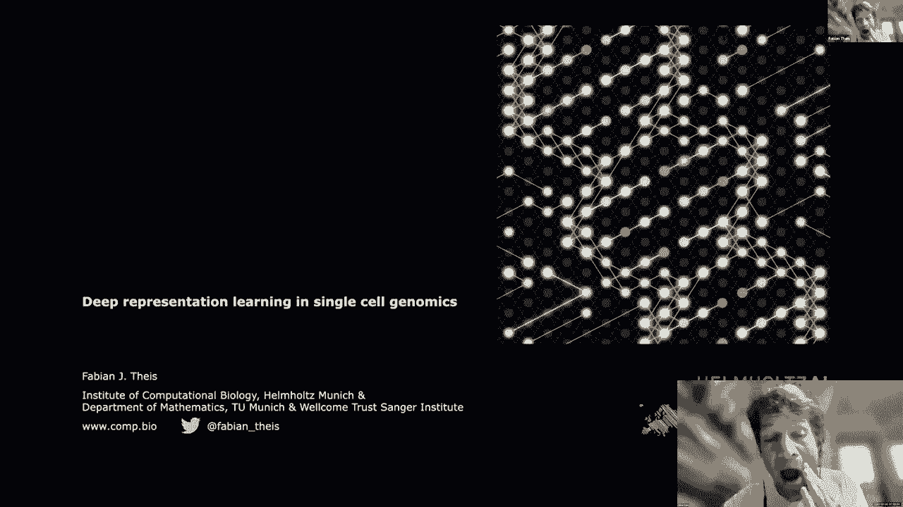

上一节我们介绍了单细胞分析的必要性，本节中我们来看看实现单细胞分析的技术是如何演进的。

早期技术依赖于对单个细胞进行物理分离和单独分析，例如通过成像、单细胞PCR或原位测序。这些技术能够揭示单个细胞中基因表达的时空动态和异质性。

现代技术的革命性进步在于通量的大幅提升。主要有三类技术路径：

*   **基于孔板的技术 (如 Smart-seq2)**：将单个细胞分选到独立的孔板中进行RNA扩增和测序。优点是捕获基因数多，但成本较高，通量有限。
*   **基于液滴的技术 (如 10x Genomics)**：利用微流控技术将单个细胞与带有独特条形码的微珠共同包裹在油滴中。所有细胞的RNA在后端混合进行一次性测序，再通过条形码追溯RNA的细胞来源。这种方法实现了高通量和相对较低的成本。
*   **组合索引技术 (如 Split-seq)**：不进行物理上的单细胞分离，而是通过多轮细胞池化与重新分配，为每个细胞的RNA添加独特的组合条形码。最后进行混合测序，并通过条形码组合解析细胞身份。这种方法成本极低，适合超大规模研究。

## 超越RNA：单细胞多组学

我们了解了单细胞RNA测序，但细胞的特性远不止RNA表达。现在，技术已扩展到在单细胞水平同时测量多种分子层面，即单细胞多组学。

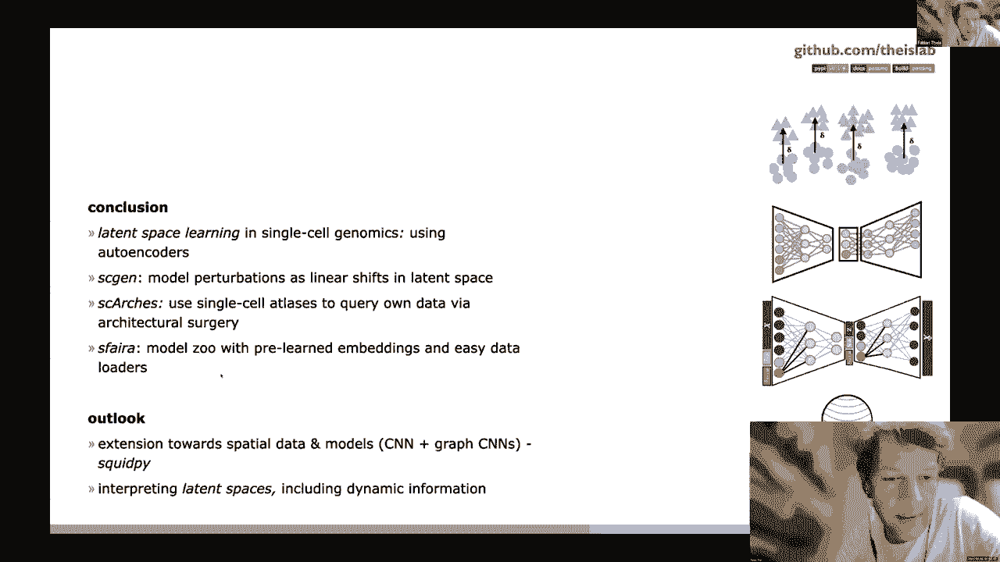


常见的多组学分析包括：
*   **单细胞ATAC-seq**：测量染色质可及性，用于推断转录因子活性和基因调控状态。
*   **单细胞DNA甲基化测序**：分析表观遗传修饰。
*   **蛋白质组学**：通过抗体标记（如CITE-seq）检测细胞表面或细胞内蛋白质丰度。

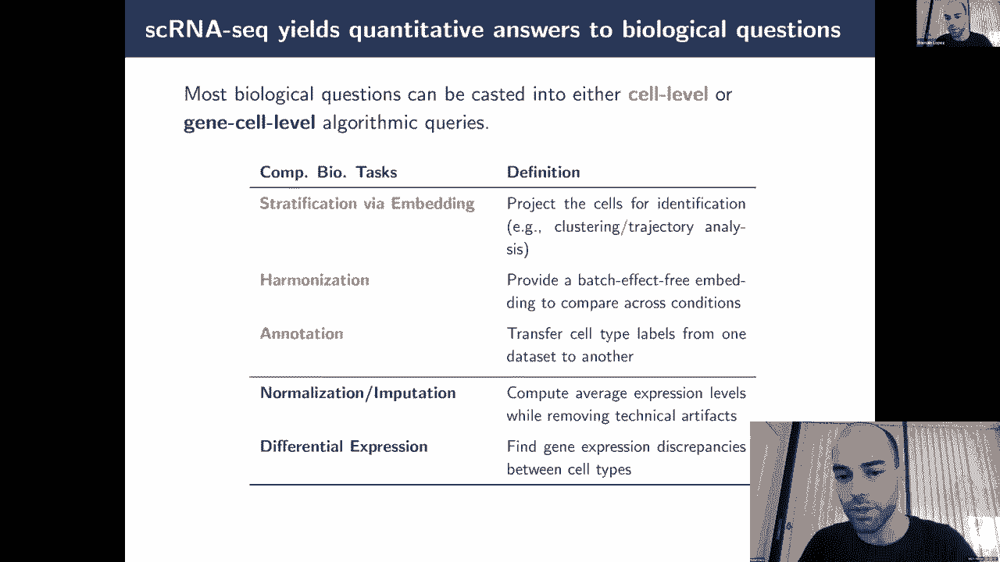

整合这些多模态数据，可以更全面地刻画细胞状态和功能。

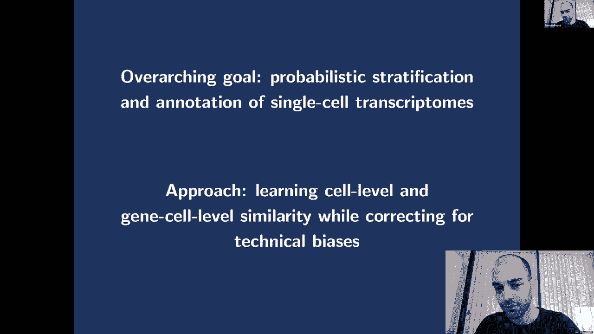

## 单细胞数据的计算挑战与深度学习方法

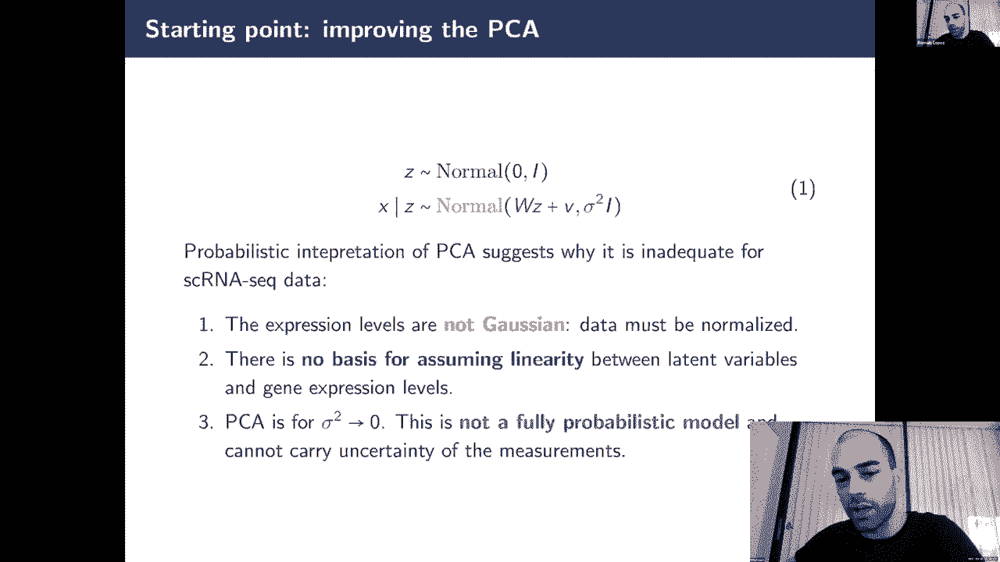

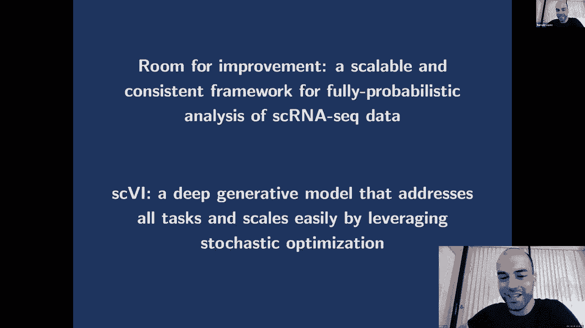

单细胞数据具有高维度、高噪声（含大量技术性零值）和稀疏性等特点。计算分析的核心任务包括降维、聚类、细胞类型注释、轨迹推断和差异表达分析等。

近年来，深度学习方法在该领域显示出强大潜力。变分自编码器（VAE）等生成模型被广泛用于学习数据的低维潜在表示（潜在空间），并进行去噪和插补。

以下是VAE用于单细胞数据去噪的一个概念性代码框架：

```python
# 伪代码示意：基于VAE的单细胞数据去噪模型
class scVAE(nn.Module):
    def __init__(self, input_dim, latent_dim):
        super().__init__()
        # 编码器：将高维基因表达数据压缩到低维潜在空间
        self.encoder = nn.Sequential(
            nn.Linear(input_dim, 128),
            nn.ReLU(),
            nn.Linear(128, latent_dim * 2) # 输出均值和方差
        )
        # 解码器：从潜在空间重建基因表达数据
        self.decoder = nn.Sequential(
            nn.Linear(latent_dim, 128),
            nn.ReLU(),
            nn.Linear(128, input_dim),
            # 通常使用适合计数数据的损失函数，如负二项分布
        )

    def reparameterize(self, mu, logvar):
        # 重参数化技巧，用于从分布中采样
        std = torch.exp(0.5*logvar)
        eps = torch.randn_like(std)
        return mu + eps*std

    def forward(self, x):
        # 编码
        h = self.encoder(x)
        mu, logvar = h.chunk(2, dim=-1)
        z = self.reparameterize(mu, logvar)
        # 解码重建
        x_recon = self.decoder(z)
        return x_recon, mu, logvar
```

在潜在空间中，我们可以进行更有意义的操作，例如：
*   **扰动预测**：通过潜在空间向量算术（如 `z_perturbed = z_control + (z_stimulated - z_control)`），预测细胞对药物或刺激的反应。
*   **批次效应校正**：将批次信息作为条件输入模型，学习不受批次影响的生物变异表示。
*   **跨数据集整合与标签转移**：利用半监督或条件VAE模型，将已知细胞类型的注释迁移到新的未标注数据集。

## 总结

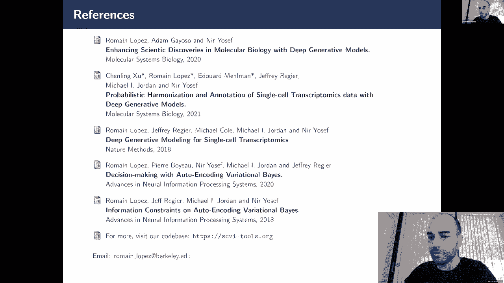

本节课中我们一起学习了单细胞基因组学的核心内容。我们从单细胞分析的必要性出发，回顾了从传统到现代的高通量测序技术发展，包括基于孔板、液滴和组合索引的主流方法。接着，我们探讨了超越RNA测序的单细胞多组学前沿。最后，我们深入了解了处理单细胞数据时面临的计算挑战，并重点介绍了变分自编码器等深度学习方法如何在数据去噪、潜在空间学习、扰动预测和批次校正等方面发挥重要作用。这些工具正推动着我们对细胞异质性和复杂生物系统的理解迈向新的深度。