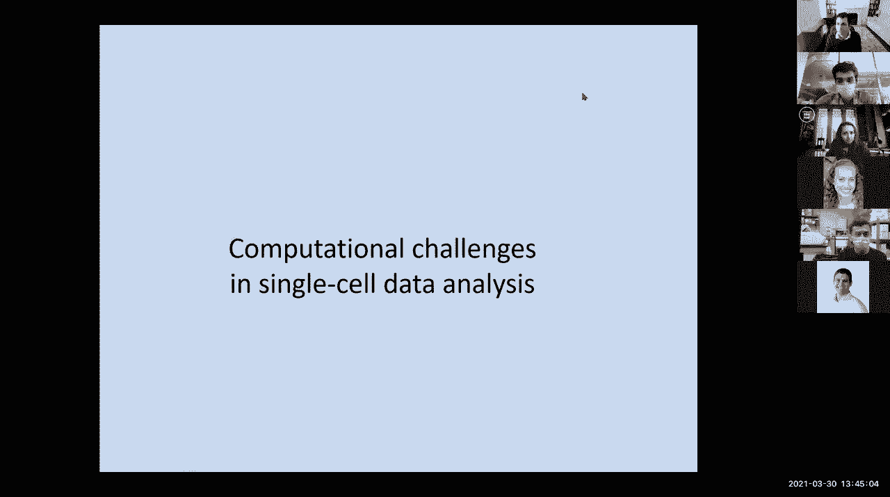
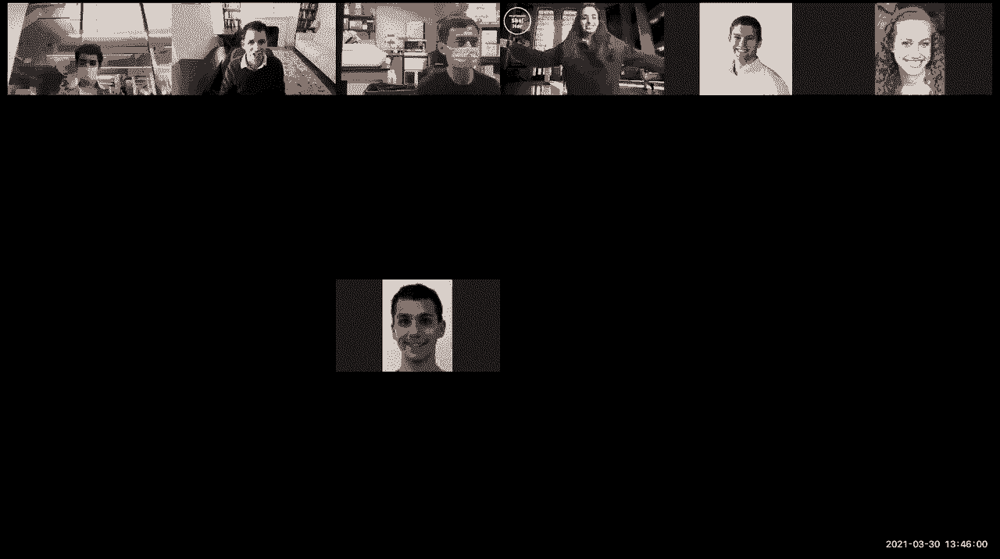
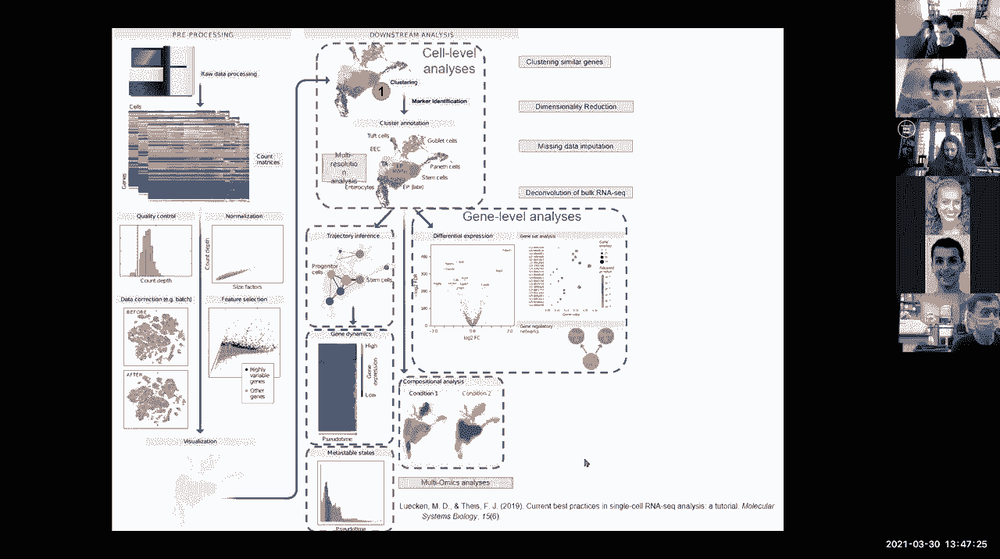
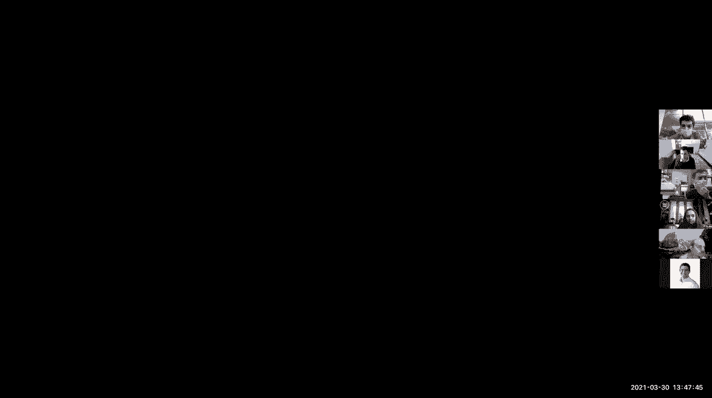
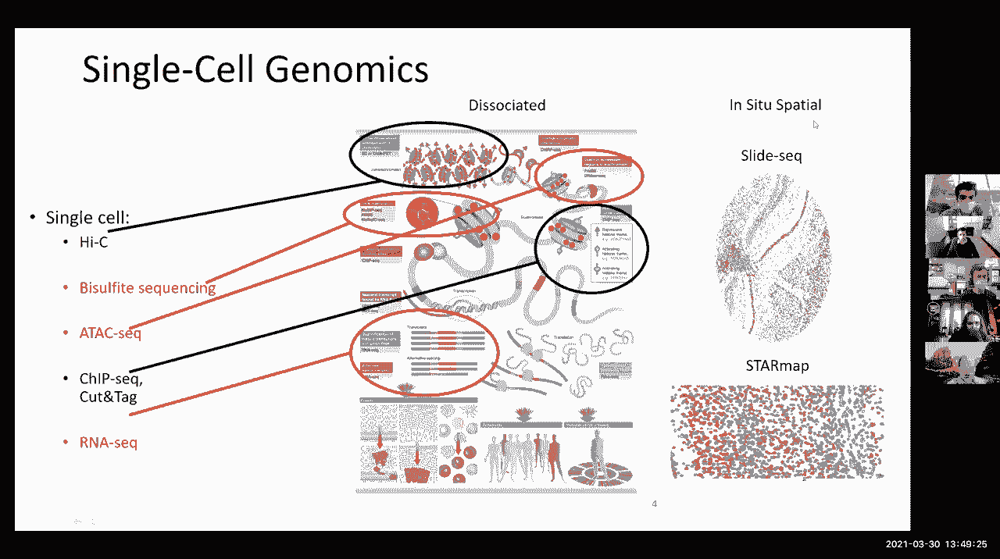
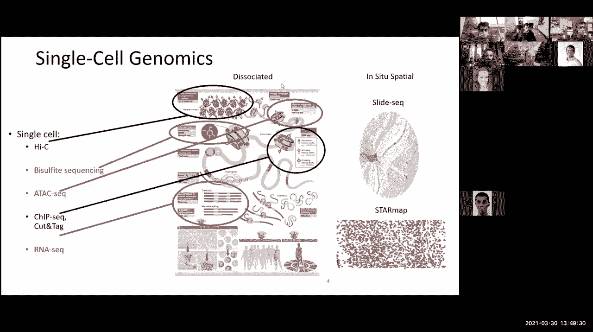
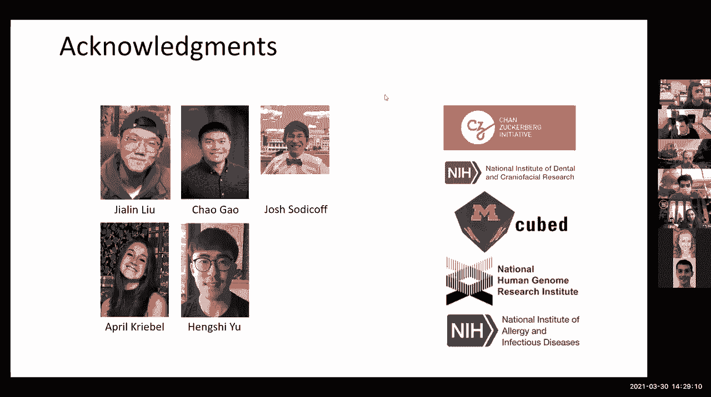
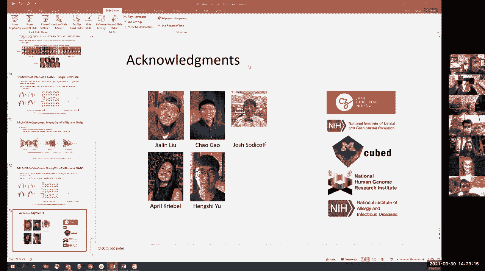
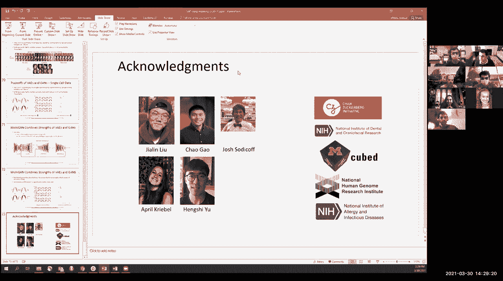
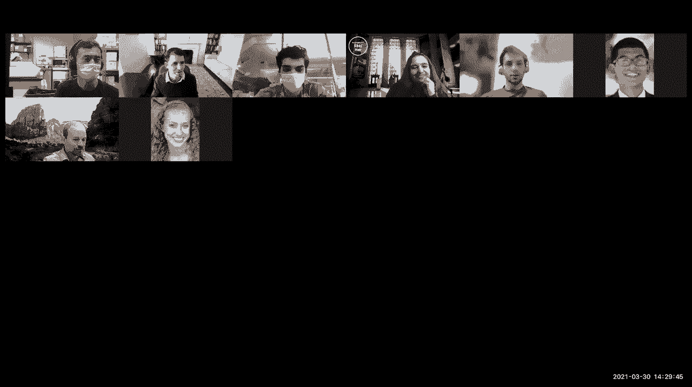

# 11：降维 📉


在本节课中，我们将学习单细胞数据分析中的降维技术。课程将涵盖监督与非监督方法、线性与非线性降维，并探讨其与深度学习的联系。我们还将聆听Josh Welch博士关于多组学数据整合的客座讲座。

---

## 概述

降维是分析高维数据（如单细胞基因表达数据）的关键步骤。它能帮助我们可视化数据、减少噪声、识别数据中的主要变异来源，并发现潜在的细胞类型或状态。本节课将从线性方法（如主成分分析）入手，逐步深入到非线性方法（如t-SNE），最后介绍整合多模态数据的先进技术。

---

## 线性降维方法

上一节我们概述了降维的目标。本节中，我们来看看最经典的线性降维方法——主成分分析。

### 主成分分析

主成分分析旨在寻找一个低维线性投影，以最优方式捕捉数据变异的主要来源。主成分是数据变异最大的方向轴。

给定一个数据矩阵，PCA通过特征值分解（对于方阵）或奇异值分解（对于一般矩阵）来找到这些主成分。其核心思想是将原始数据转换到一组新的坐标轴上（即主成分），其中前几个成分包含了数据的大部分信息。

**公式描述**：
对于一个中心化后的数据矩阵 **X**，其协方差矩阵为 **C = XᵀX / (n-1)**。PCA求解该协方差矩阵的特征值和特征向量：
**C v = λ v**
其中，**λ** 是特征值，**v** 是对应的特征向量。特征值大小表示对应主成分所解释的方差。

**代码描述**（概念性）：
```python
# 假设 data 是一个 numpy 数组，行为样本，列为基因
from sklearn.decomposition import PCA
pca = PCA(n_components=2) # 降至2维
reduced_data = pca.fit_transform(data)
```

### 奇异值分解

对于非方阵的数据矩阵（例如，基因数不等于细胞数），我们需要使用奇异值分解。SVD可以将任意矩阵分解为三个矩阵的乘积，其奇异值同样指示了数据变异的重要性。

**公式描述**：
对于矩阵 **A**，其SVD分解为：
**A = U Σ Vᵀ**
其中，**U** 和 **V** 是正交矩阵，**Σ** 是对角矩阵，其对角线元素即为奇异值。保留前k个最大的奇异值及其对应的向量，即可得到最优的k秩近似。

---





## 非线性降维方法





上一节我们介绍了PCA这种线性投影方法。然而，生物数据中的关系往往是非线性的。本节中我们来看看非线性降维方法，例如t-SNE。



### t-分布随机邻域嵌入



t-SNE的核心思想是在低维空间中保持数据点之间的局部相似性结构，而非全局距离。它特别擅长在二维或三维空间中形成清晰的簇，便于可视化。

以下是t-SNE的关键步骤：

1.  **计算高维空间中的相似性**：对于每个数据点i，计算其与点j的相似性条件概率 \( p_{j|i} \)，该概率与以点i为中心的高斯分布概率密度成正比。
2.  **定义低维空间中的相似性**：在低维嵌入中，使用学生t分布（重尾分布）来计算点i和点j之间的相似性 \( q_{ij} \)。
3.  **优化嵌入**：通过梯度下降法，最小化高维分布P和低维分布Q之间的Kullback-Leibler散度，从而优化低维空间中的点坐标。

**公式描述**：
目标是最小化KL散度：
\( C = KL(P || Q) = \sum_i \sum_j p_{ij} \log\frac{p_{ij}}{q_{ij}} \)
其中，\( p_{ii}=0 \)，且 \( p_{ij} = \frac{p_{j|i} + p_{i|j}}{2n} \) 以使其对称。

t-SNE的参数（如困惑度）对结果影响很大，需要根据数据特点进行调整。

---

## 多组学数据整合

上一节我们讨论了如何对单一模态的数据进行降维。在单细胞研究中，我们常同时获得多种类型的组学数据。本节中，我们将了解如何整合这些多模态数据以获得更全面的细胞身份视图。

### 整合非负矩阵分解

Josh Welch博士介绍的Liger工具使用整合非负矩阵分解方法。其目标是整合多个共享同一组特征（如基因）的单细胞数据集（例如来自不同个体、物种或不同组学模态）。

iNMF为每个“元基因”（metagene，即共表达基因集）学习一个**共享因子**和一个**数据集特定因子**。共享因子代表所有数据集中共有的生物信号，而数据集特定因子捕捉该信号在不同数据集中的独特变化。

这种方法能：
*   实现跨数据集的联合聚类，识别共同的细胞类型。
*   获得可解释的“元基因”，用于理解生物学通路或技术因素（如线粒体基因污染）。
*   整合不同模态数据（如RNA-seq和ATAC-seq），通过“伪表达量”计算将表观基因组特征与基因表达关联起来。

### 在线学习扩展

为了处理大规模或持续产生的数据流，Liger扩展了在线学习算法。该算法可以：
1.  处理超出内存的大型数据集。
2.  在新增数据到达时迭代更新模型，无需重新分析全部历史数据。
3.  将新数据投影到已有的参考坐标系中。

### 处理部分重叠特征

当整合的数据集特征仅部分重叠时（如空间转录组仅测部分基因，而scRNA-seq测全部基因），扩展的iNMF算法可以同时利用共享和非共享的特征，从而更充分地利用信息。

### 生成模型：结合VAE与GAN

最后，Josh博士介绍了其团队将变分自编码器与生成对抗网络结合的工作（Michigan模型）。VAE善于学习解耦的、有意义的潜在表示，而GAN善于生成逼真的样本。结合二者优势的模型，有望用于生成真实的单细胞表达谱，并对细胞特性进行预测和干预。

---

## 总结









本节课我们一起学习了单细胞数据分析中的降维技术。
*   我们从**线性降维**（PCA， SVD）开始，理解了如何找到数据变异的主要线性方向。
*   然后探讨了**非线性降维**（t-SNE），它通过保持局部相似性来揭示复杂的流形结构。
*   最后，通过Josh Welch博士的讲座，我们学习了利用**整合非负矩阵分解**等先进方法，来**整合多组学、多批次、多模态的单细胞数据**，从而对细胞身份进行更定量、更全面的定义。这些技术是解析高维生物数据、发现新生物学的强大工具。