# 12：全基因组关联研究与疾病回路解析 🧬

在本节课中，我们将学习人类遗传学的基础知识，特别是如何通过全基因组关联研究来识别和解释与疾病相关的遗传变异。我们将从遗传学的基本概念开始，逐步深入到GWAS的原理、挑战，以及如何利用计算工具来理解非编码变异的功能机制。

---

## 🧬 人类遗传学基础

上一节我们介绍了课程的整体目标，本节中我们来看看人类遗传学的历史背景和核心概念。

人们很早就知道，通过选择性繁殖可以改变动植物的性状，例如培育出皮毛更厚的动物或可食用的玉米。关于遗传模式的观察，如眼睛和头发颜色，也已有很长的历史。然而，理解其内在机制则经历了漫长的过程。

孟德尔通过豌豆实验提出了**颗粒遗传**的概念，即遗传不是混合的，而是由离散的遗传单位（后来称为基因）控制，这些单位有显性和隐性之分。然而，人类许多性状（如身高、肤色）表现为连续变化，这与孟德尔的离散观察似乎矛盾。

这一矛盾在20世纪初由费舍尔等统计学家解决。他们意识到，**连续的性状变异可以由多个孟德尔基因座共同解释**。即使每个基因只有微小的影响（例如，每个基因影响身高一英寸），多个基因叠加起来就能产生看似连续的分布。这奠定了现代数量遗传学的基础。

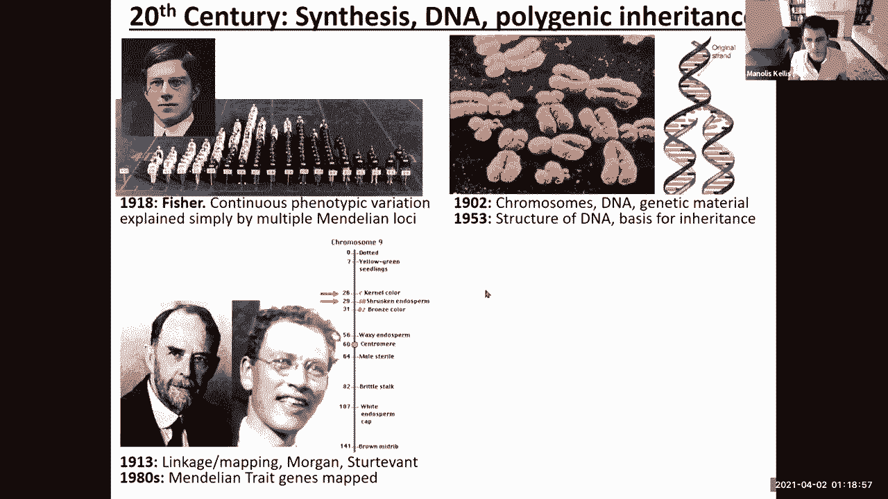

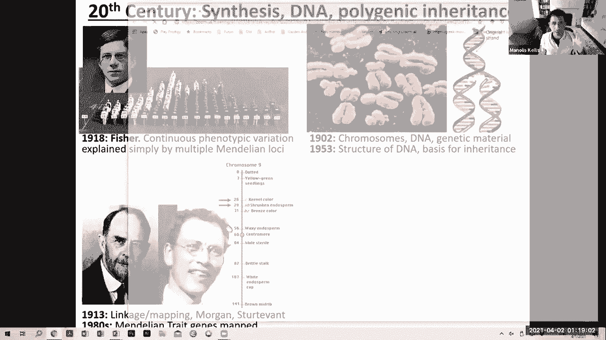

---

## 🔗 连锁与连锁不平衡

上一节我们介绍了多基因解释连续性状的概念，本节中我们来看看遗传变异在染色体上是如何共同传递的。

摩根和斯特蒂文特发现，位于同一条染色体上且彼此靠近的基因，在遗传时倾向于**共同分离**，而不是独立分配。这种偏离独立分配的现象被称为**连锁**。如果两个基因座距离足够远，重组事件会使它们独立分离；如果距离很近，它们则处于**连锁不平衡**状态，倾向于一起遗传。

这一发现成为**连锁分析**的基础。在20世纪80年代，科学家利用染色体上的标记（如重复长度多态性）来追踪疾病性状与这些标记的共同分离情况，从而将疾病基因定位到基因组的特定区域。

**连锁分析**的公式通常基于**重组分数（θ）** 来计算两个基因座之间的遗传距离。LOD分数（对数优势比）用于评估连锁的证据强度：
`LOD = log10(连锁假设下的数据概率 / 无连锁假设下的数据概率)`

---

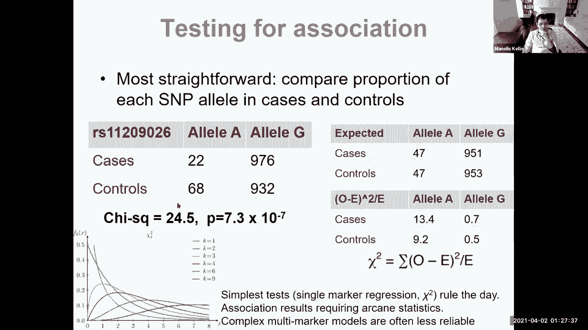

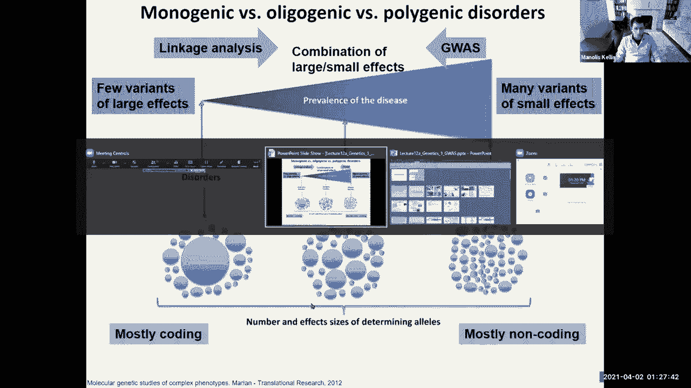

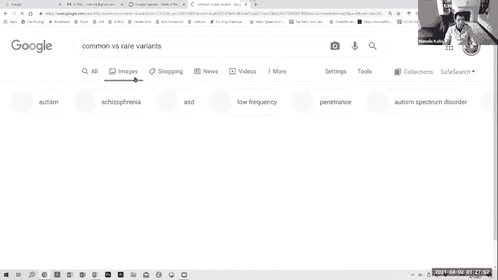

## 🧬 遗传变异的类型

上一节我们讨论了如何利用连锁定位基因，本节中我们来看看构成遗传多样性的各种变异类型。

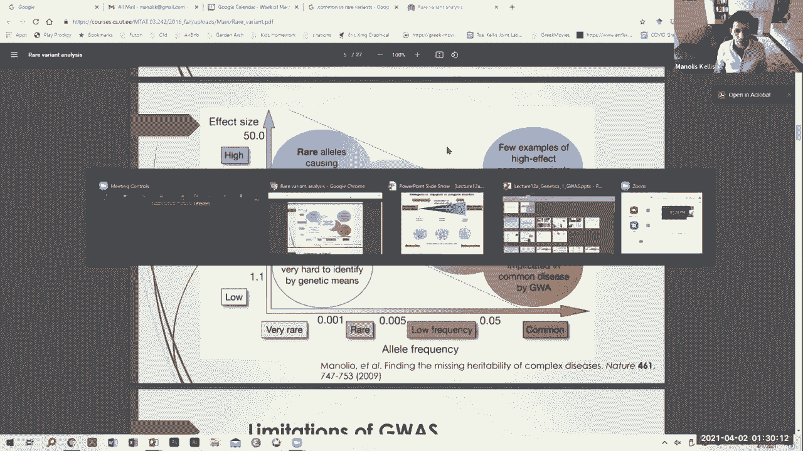

以下是主要的遗传变异类型：

*   **单核苷酸多态性**：基因组中单个碱基的改变。例如，`A -> T`。
*   **小插入/缺失**：一小段DNA序列的插入或删除。例如，序列中插入 `TATGG`。
*   **短串联重复**：一段短序列的多次重复。例如，`(GTC)n` 重复次数的变化。
*   **结构变异/拷贝数变异**：涉及较大片段（>5000个碱基）的插入、删除、倒位或拷贝数变化。

大多数变异位于非编码区，没有明显效应。但有些变异会产生重大影响：
*   位于**蛋白质编码区**的SNP可能改变氨基酸，例如导致镰状细胞贫血的 `A -> T` 突变（血红蛋白β链基因）。
*   位于**调控区**的变异可能影响基因表达。
*   **短串联重复**的异常扩展可导致疾病，如亨廷顿病（HTT基因中CAG重复次数过多）。

根据频率，变异可分为：
*   **常见变异**（>5%人群频率）
*   **低频变异**（0.5%-5%）
*   **罕见变异**（<0.5%）
*   **私有/新生变异**（通常仅存在于单个个体或家庭中）

此外，还有**体细胞变异**，发生在个体从受精卵发育成体的过程中，仅存在于部分细胞。

---

## 🧬 常见变异与罕见变异

上一节我们了解了变异的类型，本节中我们来看看研究这些变异的两大策略及其内在联系。

在寻找疾病基因时，我们面临一个核心挑战：**效应强度与变异频率之间存在反比关系**。

*   **罕见变异，强效应**：导致孟德尔遗传病（如囊性纤维化）的变异通常非常罕见，但对疾病有巨大影响。这类变异适合用**连锁分析**在家族中研究。
*   **常见变异，弱效应**：与复杂疾病（如糖尿病、精神分裂症）相关的变异通常很常见，但每个变异只轻微增加风险。这类变异需要通过**全基因组关联研究**在大规模人群中发现。

这种“常见-弱效应”与“罕见-强效应”的二分现象并非巧合。如果一个变异效应很强且有害，自然选择会阻止它在人群中变得常见。反之，效应微弱的变异则可以容忍较高的频率。

GWAS主要捕捉常见、弱效应的变异，而连锁分析擅长发现罕见、强效应的变异。两者共同覆盖了疾病遗传架构的不同层面。

---

## 📊 全基因组关联研究详解

上一节我们对比了两种研究策略，本节中我们深入探讨GWAS的具体步骤和计算方法。

GWAS的核心是**病例-对照设计**。研究者收集患有特定疾病的个体（病例）和未患病的个体（对照），然后比较两组在基因组数百万个位点上的遗传差异。

由于对每个个体进行全基因组测序成本高昂，GWAS通常采用**基因分型**技术。该技术利用已知的常见变异数据库，通过特异性探针检测个体携带的是参考等位基因还是替代等位基因，成本远低于测序。

获得基因型数据后，需进行严格的质量控制，包括去除低质量样本、排除有亲缘关系的个体、校正群体分层等。

对于每个SNP，我们构建一个**列联表**，统计病例和对照中携带每个等位基因的人数。然后使用**卡方检验**来评估观察到的分布是否与随机期望存在显著偏差。

卡方统计量计算公式为：
`χ² = Σ (观测值 - 期望值)² / 期望值`
其中求和针对列联表中的所有单元格。根据自由度（对于2x2表，df=1）查表即可得到p值。

为了直观展示全基因组范围内的关联信号，我们将每个SNP的 `-log10(p值)` 绘制成**曼哈顿图**。每个点代表一个SNP，y轴值越高，表示关联越显著。通常，跨越特定阈值（如 `p < 5×10⁻⁸`，即基因组显著性水平）的峰值区域被认为是关联信号。

我们还可以通过**QQ图**来评估整体p值分布，检查是否存在因群体分层等技术问题导致的假阳性膨胀，并确认真正的关联信号。

---

## 🎯 精细定位与功能阐释的挑战

上一节我们介绍了如何通过GWAS发现关联信号，本节中我们来看看找到关联区域后所面临的下一个巨大挑战。

由于人类群体历史相对较短，重组事件有限，基因组变异是以**单倍型块**的形式共同遗传的。这意味着，在一个关联区域内，许多SNP彼此高度相关（处于连锁不平衡中）。因此，GWAS发现的显著信号往往代表一个包含数十甚至上百个SNP的区域，而**真正的致病变异可能只是其中的一个**。

**精细定位**的目标就是在这个关联区域内，找出最可能是功能性的因果变异。这是一项计算和实验上的重大挑战。

为了理解非编码变异如何发挥作用，我们需要系统地回答以下几个问题：
1.  **作用位置**：该变异在哪种细胞或组织中起作用？
2.  **靶基因**：它调控的是哪个或哪些远端基因？
3.  **因果变异**：区域内众多相关SNP中，哪个是功能性的？
4.  **上游调控因子**：是哪个转录因子结合被该变异破坏或创建？
5.  **细胞表型**：这如何改变细胞行为？
6.  **机体表型**：这如何最终导致疾病？

---

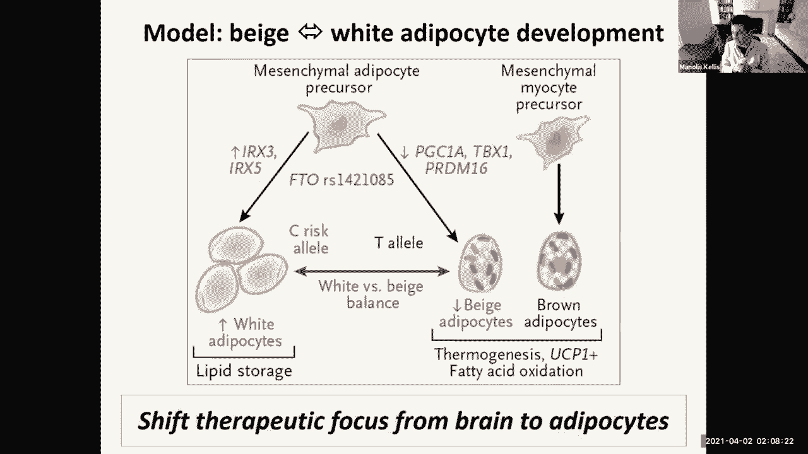

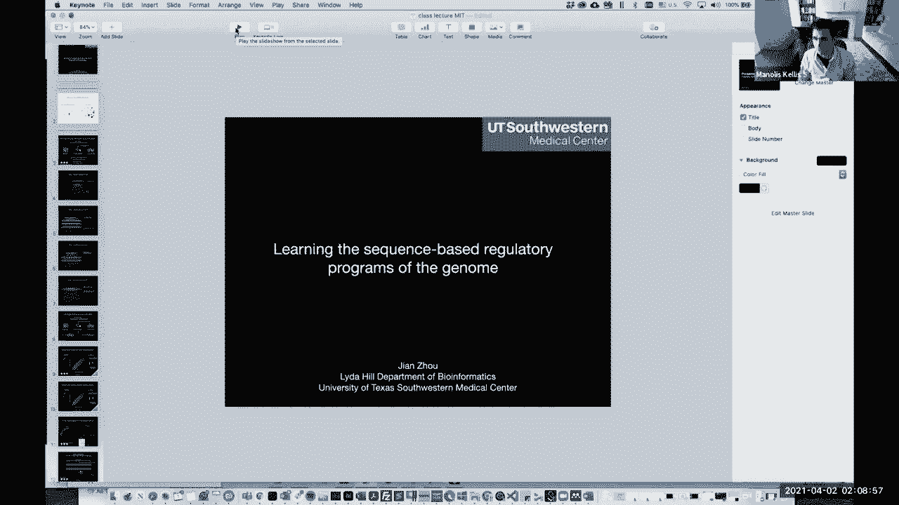

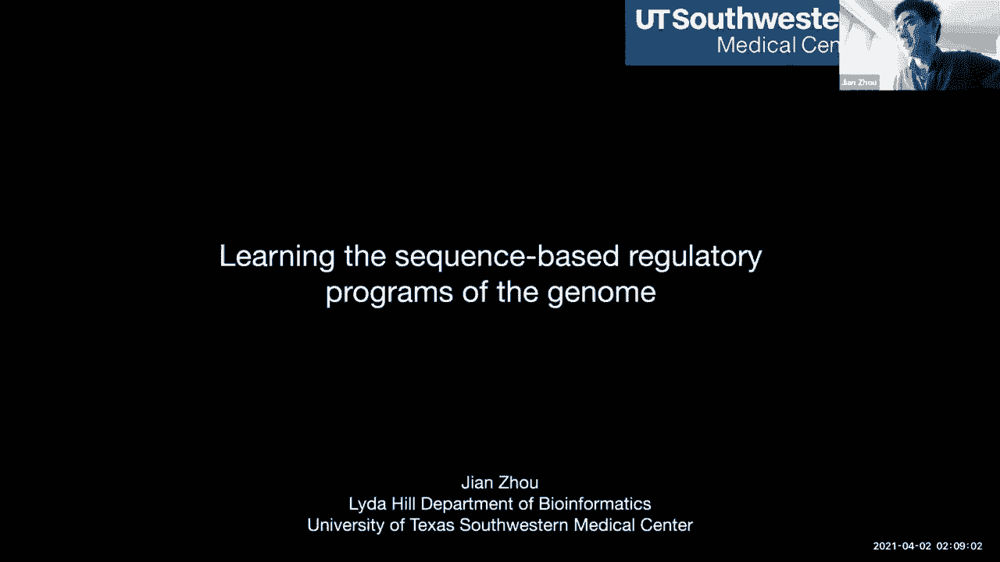

## 🔬 案例研究：FTO基因座与肥胖

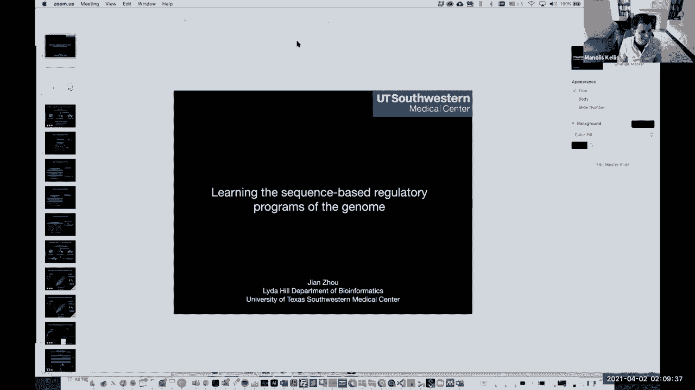

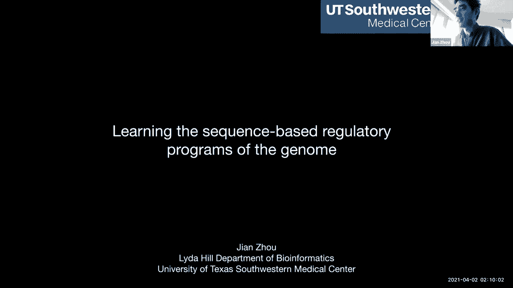

上一节我们提出了理解非编码变异的六个关键问题，本节中我们通过一个经典案例来看看如何逐步解答这些问题。

FTO基因座是与体重指数和肥胖关联最强的遗传区域之一。早期GWAS发现该区域有89个常见变异与肥胖相关。研究步骤如下：

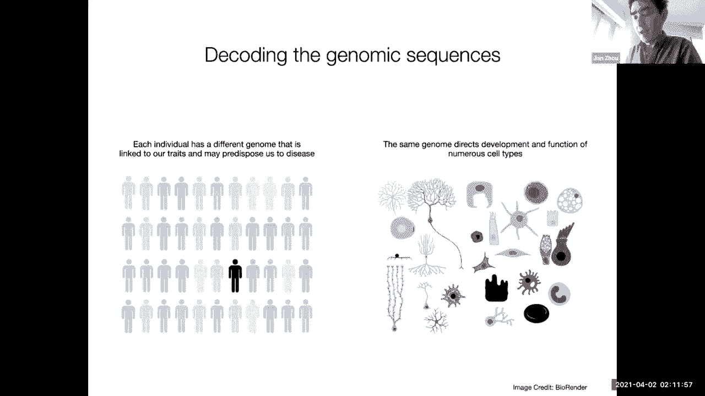

1.  **确定作用细胞类型**：利用表观基因组学数据（如ENCODE、Roadmap），发现该区域在脂肪前体细胞中有一个活跃的**超级增强子**。
2.  **寻找靶基因**：通过三维基因组学数据（Hi-C）发现，该增强子与远端（相隔约200万个碱基）的 **IRX3** 和 **IRX5** 基因启动子相互作用。表达分析证实，风险等位基因会**上调**这两个基因的表达。
3.  **鉴定因果变异**：通过序列保守性和调控 motif 分析，锁定一个破坏**ARID5B**转录因子结合位点的特定SNP。
4.  **验证调控回路**：实验证明，ARID5B通常结合该位点并抑制增强子活性。风险等位基因破坏了结合，导致增强子过度活跃，进而上调IRX3/IRX5。
5.  **阐明细胞机制**：IRX3/IRX5的高表达会抑制线粒体功能，促使脂肪前体细胞分化为储脂细胞（白色脂肪），而非燃脂细胞（米色脂肪）。
6.  **验证生理表型**：在小鼠中敲低Irx3基因，即使给予高脂饮食，小鼠也能保持苗条。利用CRISPR技术将人类风险等位基因（C）回改为保护性等位基因（T），可以恢复细胞的燃脂能力。

这个案例展示了如何从一个GWAS信号，逐步解析出一个完整的“**SNP -> 调控元件破坏 -> 靶基因失调 -> 细胞功能改变 -> 疾病表型**”的因果链条。

---

## 🤖 利用深度学习预测变异功能

上一节我们看到了解析单个基因座的复杂过程，本节中我们来看看如何利用计算方法，大规模预测遗传变异的功能影响。

面对数以万计的GWAS关联位点，实验方法逐一解析是不现实的。深度学习模型为我们提供了强大的**计算预测工具**。

**基础模型：预测染色质特征**
首先，我们可以训练卷积神经网络模型，直接根据DNA序列预测转录因子结合、组蛋白修饰或染色质可及性。这类模型能够：
*   利用长序列上下文信息。
*   捕捉序列特征间的非线性相互作用。
*   在不同任务间共享学习到的序列特征。

**从序列到功能影响**
即使模型仅在参考基因组序列上训练，我们也可以通过“硅基诱变”来预测变异的影响：
1.  输入包含参考等位基因的序列，得到预测值P_ref。
2.  输入包含替代等位基因的序列，得到预测值P_alt。
3.  比较P_ref和P_alt的差异，即可预测该变异对结合或染色质状态的影响方向（增强或减弱）。

**评估与验证**
我们可以利用来自杂合子个体的等位基因特异性数据（如ChIP-seq或ATAC-seq reads的偏向性）来评估模型预测的准确性。模型能够有效区分出那些真正具有功能影响的变异。

**扩展到基因表达预测**
预测基因表达更具挑战，因为它涉及更大的基因组区域和更少的训练样本（基因数量有限）。一种策略是：
1.  首先用基础模型在启动子/增强子区域生成染色质特征谱。
2.  然后使用正则化线性模型，学习这些空间特征谱对基因表达的贡献权重。
3.  最终实现从序列变异到表达量变化的预测。

**应用于疾病研究：自闭症的新生突变**
在自闭症研究中，新生非编码突变的功能难以评估。利用上述预测模型，我们可以为每个突变计算一个“功能影响分数”。比较自闭症患者与其未患病兄弟姐妹的新生突变，发现患者的突变在预测上对染色质和转录因子结合具有**更强的影响**，并且这些影响富集在与突触功能和染色质调控相关的基因网络上。这为理解非编码变异在自闭症中的作用提供了计算证据。

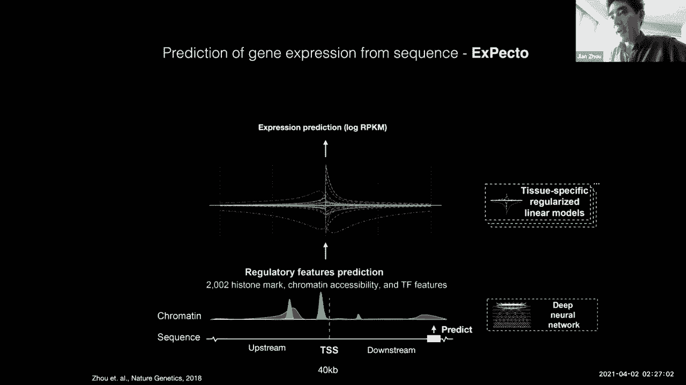

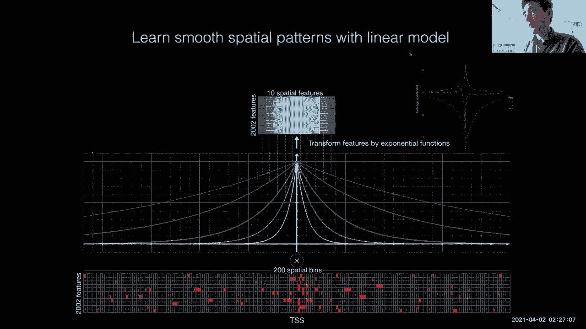

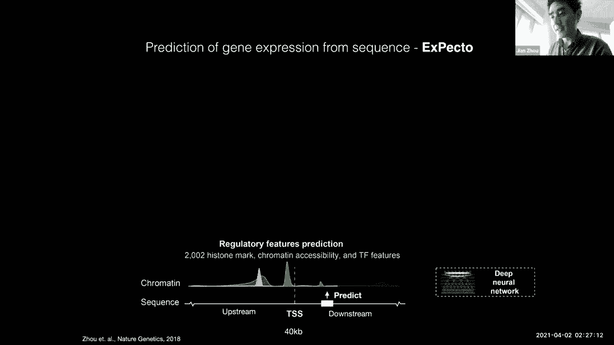

---

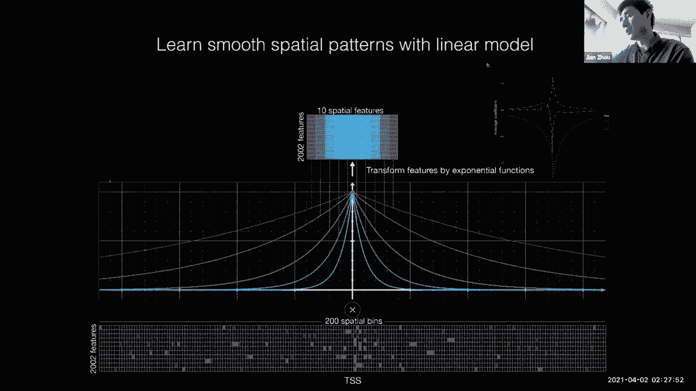

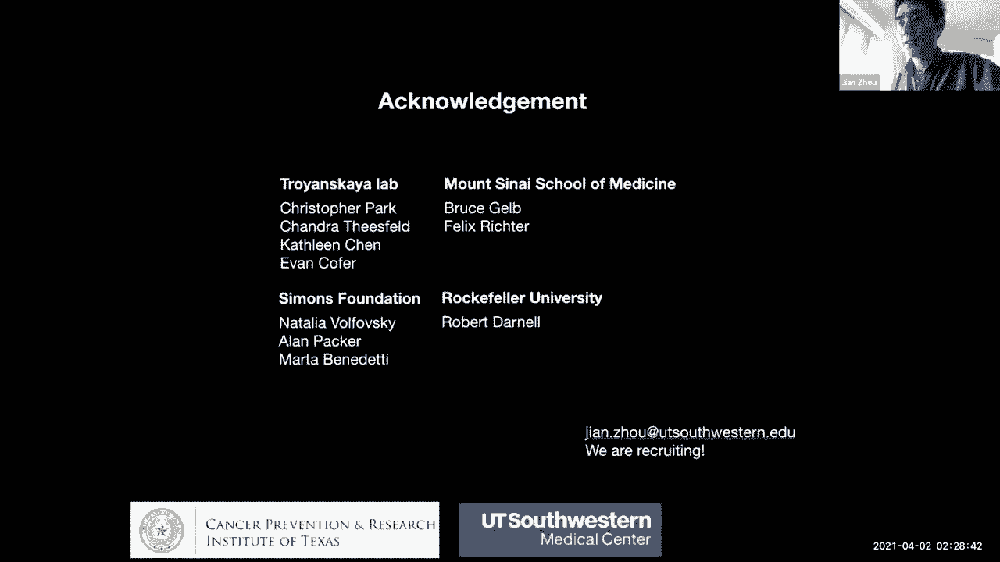

## 📝 总结

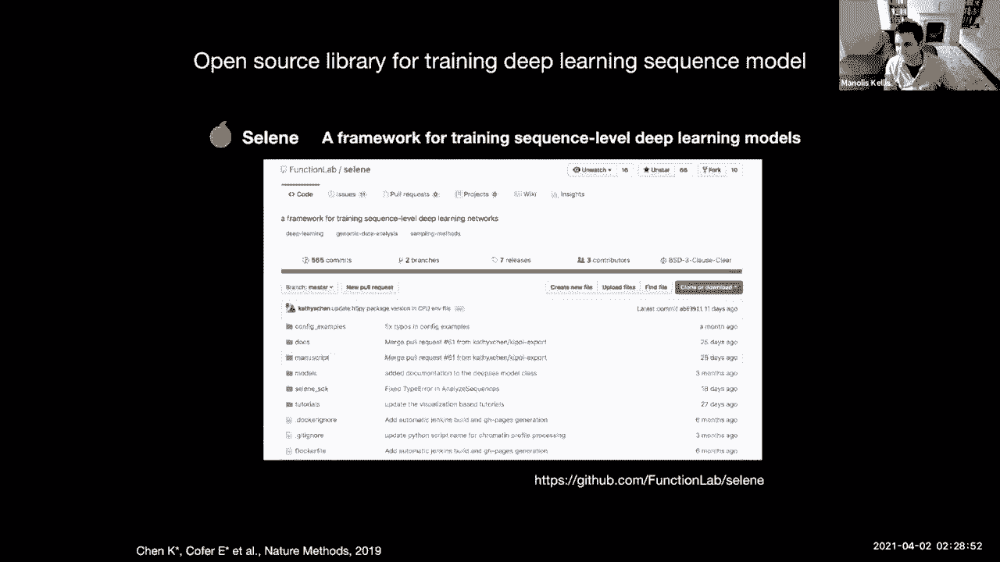

本节课中我们一起学习了人类遗传学与全基因组关联研究的核心内容。

我们从遗传学的基本原理出发，理解了连续性状如何由多个基因座解释。我们探讨了连锁分析与GWAS这两种策略，分别用于发现强效应的罕见变异和弱效应的常见变异。我们详细剖析了GWAS从实验设计、质量控制、统计检验到结果可视化的全过程。

更重要的是，我们认识到GWAS发现的关联信号往往指向一个区域，而非单个变异，因此**精细定位**和**功能阐释**是后续的关键挑战。通过FTO基因座的案例，我们看到了结合表观基因组学、三维基因组学和基因编辑技术来解析非编码变异机制的完整路径。

最后，我们了解到，面对海量的遗传变异，**深度学习模型**已成为预测其功能影响的强大工具。这些模型能够从序列预测染色质状态和基因表达潜力，并应用于复杂疾病变异的研究中，帮助我们系统性地解读“疾病电路”。

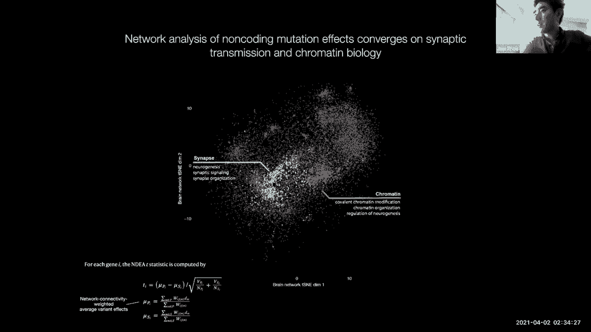

---

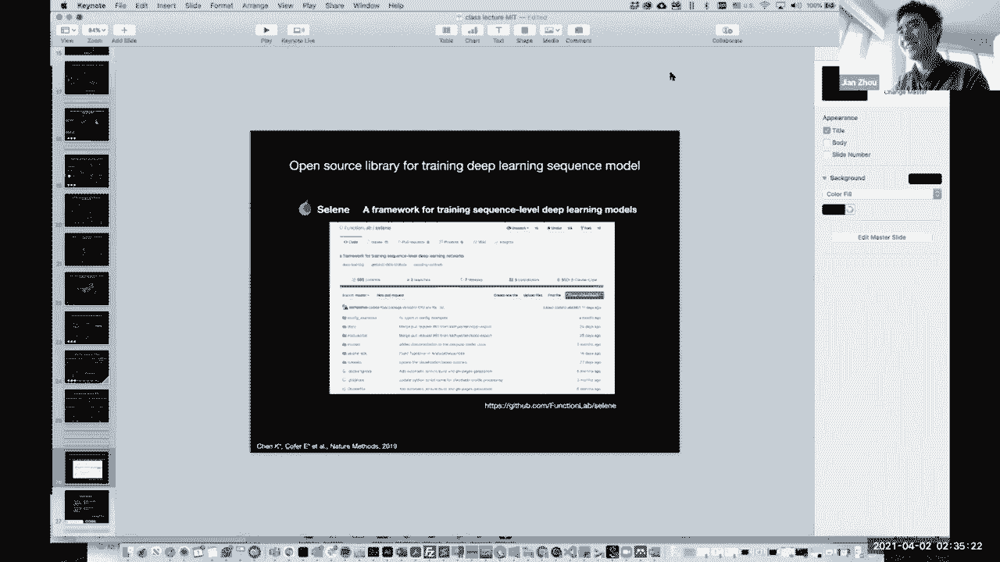

> 注：本教程根据提供的视频内容整理，保留了原话的核心含义，删除了语气词，并按照要求的结构、格式和风格进行重组与阐述。