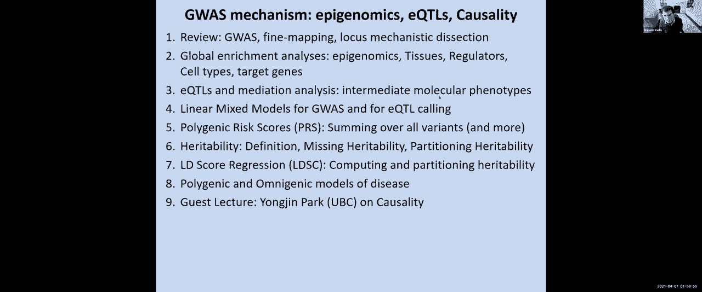
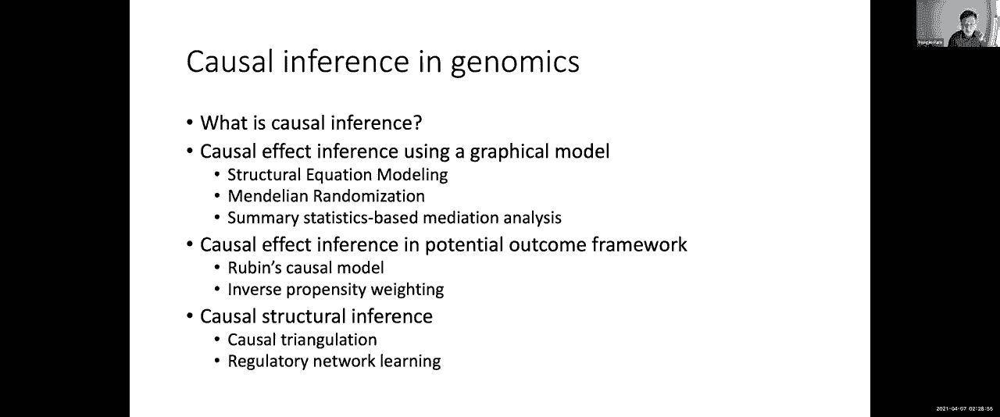
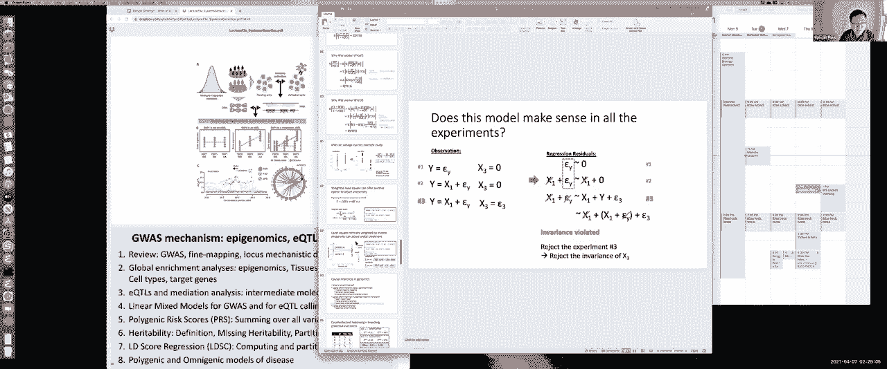
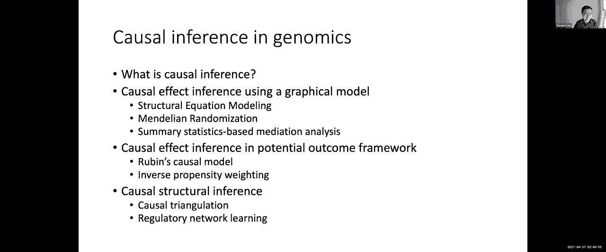

# 13：GWAS机制剖析与因果推断 🧬

在本节课中，我们将学习全基因组关联研究（GWAS）的机制剖析方法，以及如何利用表观基因组富集分析和表达数量性状位点（eQTL）研究来推断疾病相关的组织、细胞类型和靶基因。我们还将探讨因果推断的基本概念和方法，以区分遗传变异与疾病之间的因果关系和相关关系。

---

## 🔍 GWAS机制回顾与目标

上一节我们介绍了GWAS的基本概念。本节中，我们来看看如何深入剖析GWAS发现的基因座背后的生物学机制。

GWAS的目标是利用遗传学来研究疾病机制、预测靶基因、开发疗法并实现个性化医疗。然而，机制研究面临巨大挑战：绝大多数与疾病相关的常见变异位于非编码区，不直接改变蛋白质序列。这意味着目标基因未知、因果变异不明、起作用的细胞类型和通路也不清楚。

关键思路是，我们不孤立地研究单个基因座，而是全局性地分析所有与特定性状相关的遗传变异，寻找它们共同的功能特征。

---

## 🌐 全局富集分析：推断相关组织与细胞类型

为了理解曼哈顿图中每个峰背后的生物学基础，我们采用全局富集分析的方法。其核心思想是：通过共同研究所有与疾病相关的基因座，我们可以发现它们共有的属性，并利用这些属性反过来解释单个基因座。

以下是进行全局富集分析的步骤：
1.  收集与特定性状（如身高、糖尿病）相关的所有遗传区域（通常基于连锁不平衡区块）。
2.  计算这些遗传区域与各种细胞/组织类型中活跃的增强子等表观基因组注释之间的重叠程度。
3.  使用超几何检验等统计方法，评估观察到的重叠是否显著高于随机预期。
4.  将显著富集的组织或细胞类型视为与该性状相关的功能背景。

通过这种方法，我们可以构建一个矩阵，行代表不同性状，列代表不同组织/细胞类型，从而揭示特定的关联模式。例如：
*   与身高相关的变异富集于胚胎干细胞中的活性增强子。
*   与免疫性疾病相关的变异富集于T细胞和B细胞中的增强子。
*   与血压相关的变异富集于心脏（左心室）中的增强子。

一个有趣的发现是，阿尔茨海默病的遗传变异并未富集于大脑神经元增强子，而是富集于CD14+单核细胞（包括大脑中的小胶质细胞）中的增强子，这提示了该疾病中免疫成分的重要性。

---

## 🎯 从全局富集到局部优先：贝叶斯精细定位

上一节我们介绍了如何发现全局富集模式。本节中，我们来看看如何利用这些全局信息来指导单个基因座内的因果变异推断。

我们可以将全局富集分析的结果转化为经验性的先验知识。例如，对于克罗恩病，如果一个变异片段与免疫细胞增强子重叠，那么它作为因果变异的先验概率就更高。

然后，我们结合以下两方面信息，计算每个变异片段是因果关系的后验概率：
1.  **先验概率**：基于该片段与全局富集特征（如特定组织增强子）的重叠情况。
2.  **似然值**：基于GWAS汇总统计中该片段与疾病关联的证据强度。

公式可以简化为：
`后验概率 ∝ 先验概率 × 似然值`

通过这种方法，我们可以从包含数百个变异的一个基因座中，优先选出那些既具有强遗传关联信号，又落在相关功能注释区域的片段，这些片段更可能是真正的因果变异。

---

## 🧬 利用eQTL连接遗传变异与基因表达

仅仅知道变异可能影响哪些组织的调控元件还不够，我们还需要知道它最终影响了哪个基因的表达。这就是表达数量性状位点（eQTL）研究的目的。

eQTL分析旨在填补遗传变异（G）与复杂疾病（Y）之间的巨大鸿沟，通过引入中间分子表型（X），如基因表达水平或DNA甲基化水平。

其基本模型是线性回归：
`表达水平 = α + β1 * 基因型 + β2 * 协变量1 + ... + βn * 协变量n + ε`

其中，我们检验基因型（如等位基因计数）是否能够显著解释个体间基因表达的差异。与GWAS相比，eQTL研究通常需要更少的样本量就能发现关联，因为遗传变异对局部基因表达的影响往往更强、更直接。

除了传统的**整体eQTL**（比较不同基因型个体间的总表达水平），还有**等位基因特异性表达（ASE）分析**。ASE专门研究杂合子个体，比较来自父母双方的不同等位基因在同一细胞环境下的表达量差异，能更精细地识别顺式调控效应。

---

## ⚖️ 因果推断：从相关到因果

上一节我们讨论了如何发现遗传变异与中间表型（如表达）的关联。本节中，我们来看看如何推断这些关联是否是因果关系。

混淆因素是导致相关关系不等于因果关系的主要原因。因果推断的两大主流框架是：
1.  **潜在结果框架**：核心是反事实问题——“如果同一个个体接受了不同的处理（如携带不同等位基因），结果会有什么不同？”。
2.  **结构因果模型/图模型**：使用有向无环图表示变量间的因果关系，并通过诸如“后门准则”等规则来识别可估计的因果效应。

在遗传学中，**孟德尔随机化**是一种利用遗传变异作为工具变量来推断中间表型（如基因表达）与疾病之间因果关系的强大方法。其核心优势在于，基因型在配子形成时随机分配，通常不受后天环境因素影响，因此能有效避免混淆。

简单的孟德尔随机化估计公式为：
`β（中介效应） = β（G -> 疾病） / β（G -> 表达）`

这相当于利用大自然进行的随机对照试验，来估计改变基因表达对疾病风险的平均因果效应。

---

## 📝 总结

在本节课中，我们一起学习了：
1.  **全局富集分析**：通过分析所有疾病相关遗传变异的共同功能特征，来推断相关的组织、细胞类型和调控元件。
2.  **贝叶斯精细定位**：结合全局富集提供的先验信息和局部的遗传关联信号，优先选择最可能的因果变异。
3.  **eQTL分析**：研究遗传变异如何影响基因表达等中间分子表型，从而将非编码变异与靶基因连接起来。
4.  **因果推断**：介绍了潜在结果框架和图模型的基本概念，并重点讲解了如何利用孟德尔随机化等方法，从观察性数据中推断暴露（如基因表达）与结局（如疾病）之间的因果关系。

这些方法共同构成了从GWAS发现到机制解析，再到因果验证的完整研究链条，是理解复杂疾病遗传基础的关键。