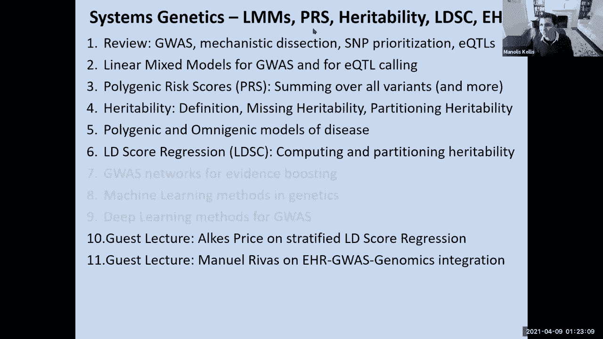
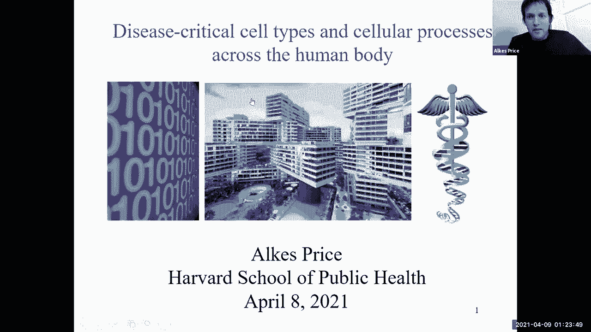
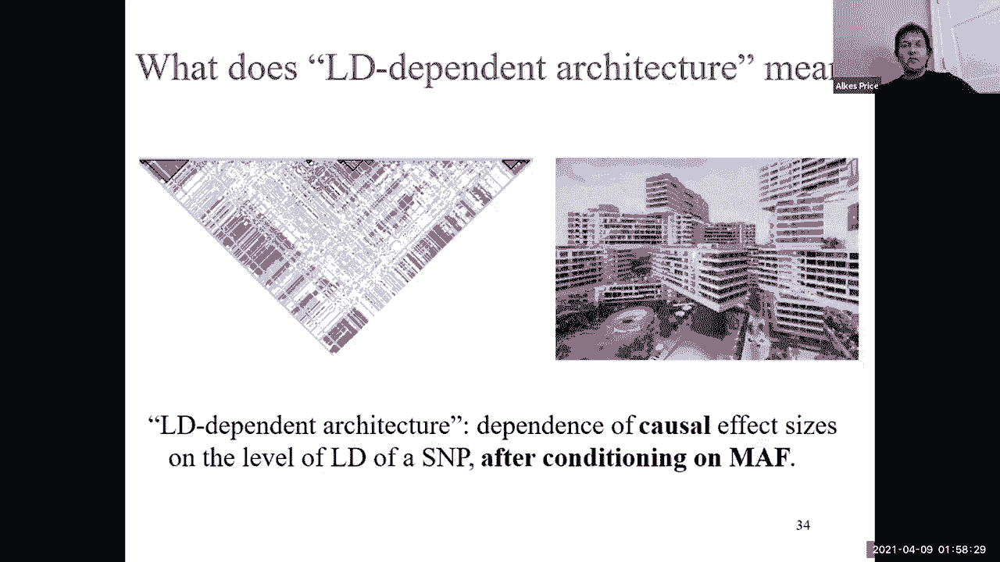
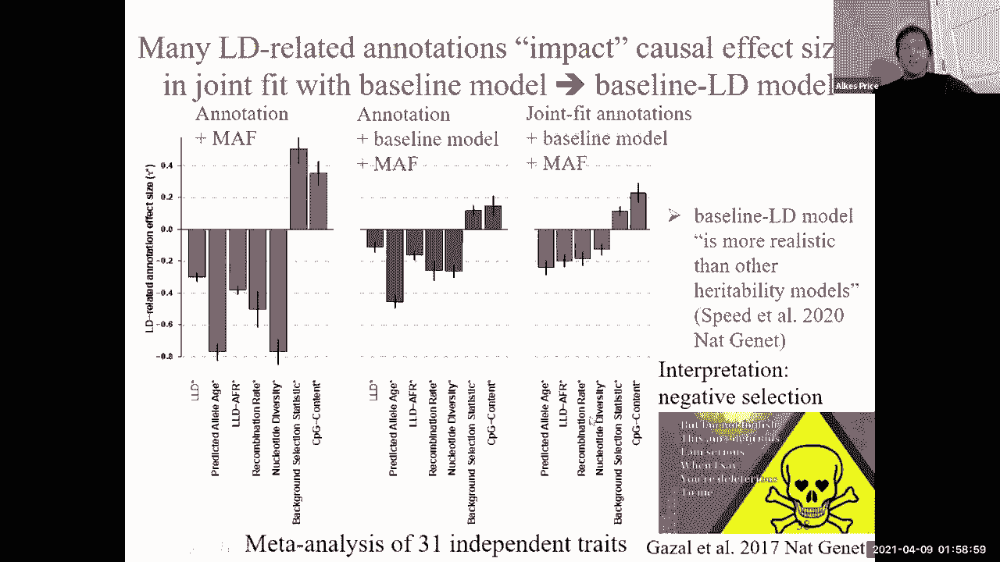
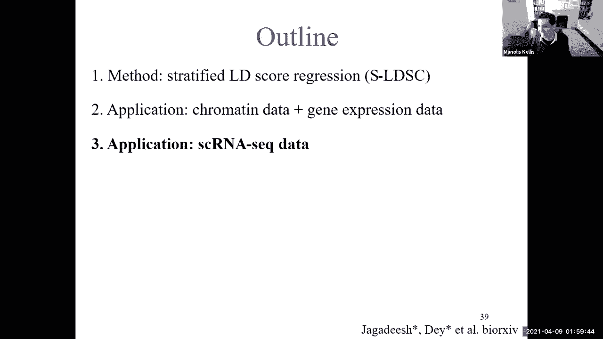
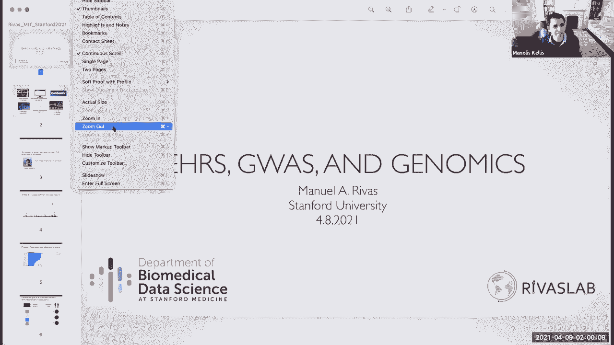
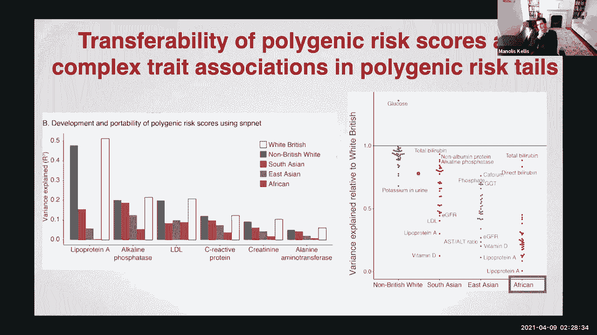

# 14：系统遗传学与电子健康记录 🧬📊

在本节课中，我们将要学习系统遗传学，这是遗传学模块的最后一课。我们将把视角提升到系统层面，并讨论电子健康记录。课程将介绍线性混合模型、遗传力定义、LD分数回归，以及如何将基因组学与电子健康记录整合。

---

## 回顾与引入

上一节我们讨论了常见与罕见变异、强效应与弱效应、多基因风险评分以及连锁不平衡分析。本节中，我们将深入探讨如何整合这些信息，并引入系统层面的分析方法。

我们已经探讨了如何整合基因组信息以精细定位变异，以及如何利用RNA测序数据和深度学习模型来预测驱动基因和细胞类型。今天，我们将重点学习线性混合模型和遗传力估计，并了解LD分数回归这一流行方法。

---

## 线性混合模型

线性混合模型用于预测表型，同时考虑固定效应和随机效应。固定效应是我们感兴趣的预测因子，而随机效应则捕捉个体间的相关性，例如由亲缘关系或群体结构引起的效应。

### 基本框架

我们试图用个体的基因型数据来预测其表型。基本公式如下：

**Y = Xβ + Zu + ε**

其中：
*   **Y** 是表型向量。
*   **X** 是固定效应设计矩阵（如基因型）。
*   **β** 是固定效应系数向量。
*   **Z** 是随机效应设计矩阵。
*   **u** 是随机效应向量，假设服从分布 **u ~ N(0, Gσ²_g)**，**G** 是亲缘关系矩阵。
*   **ε** 是残差向量，假设服从分布 **ε ~ N(0, Iσ²_e)**。

该模型的美妙之处在于，即使不知道真正的因果变异，它也能有效捕捉额外的遗传变异。

---

## 遗传力

遗传力衡量了表型变异中可由加性遗传效应解释的比例。我们主要关注**片段遗传力**，即特定一组单核苷酸多态性所能解释的遗传力。

### 估计方法

我们可以通过比较表型相似性和基因型相似性来估计遗传力。更先进的方法是使用**LD分数回归**，它利用全基因组关联研究的汇总统计数据来估计遗传力，并探究其在不同基因组功能类别中的分布。

---

## LD分数回归

LD分数回归是一种分析GWAS汇总统计数据的方法，用于估计遗传力并探究其在不同功能基因组注释中的富集情况。

### 核心思想

GWAS中平均卡方统计量大于1，并不一定意味着混淆，而可能是真实多基因信号的结果。LD分数衡量了一个SNP与其他SNP的连锁不平衡程度。LD分数回归将每个SNP的关联卡方统计量对其LD分数进行回归。

**回归方程近似为：E[χ²] ≈ 1 + N * h² * (ℓ / M)**

其中：
*   **N** 是样本量。
*   **h²** 是遗传力。
*   **ℓ** 是该SNP的LD分数。
*   **M** 是SNP数量。

截距接近1表明混淆较少，斜率则可用于估计遗传力。

### 分层LD分数回归

我们可以将这种方法扩展到多个功能类别。以下是分析步骤：

1.  计算每个SNP相对于不同功能类别（如编码区、增强子）的LD分数。
2.  将SNP的卡方统计量对多个功能类别的LD分数进行多元线性回归。
3.  每个功能类别回归系数的斜率，反映了该类别对遗传力的贡献。

通过比较某个功能类别解释的遗传力比例与其在基因组中所占的比例，可以计算**富集度**。例如，如果编码区SNP占所有SNP的1%，却解释了10%的遗传力，那么其富集度就是10倍。

---

## 电子健康记录与基因组学整合

电子健康记录为遗传学研究提供了海量的表型数据。结合基因组数据，可以揭示更广泛的基因型-表型关联。

### 多表型遗传关联分析

传统GWAS一次只分析一个表型。利用EHR，我们可以同时分析数千个表型，构建“变异-表型”关联矩阵。通过降维技术（如奇异值分解），可以提取出代表共同遗传结构的低维成分。

### 多基因风险评分

对于疾病风险预测，同时考虑所有相关SNP的多元模型比单变量模型效果更好。以下是构建PRS的步骤：

1.  使用大规模数据集（如UK Biobank）拟合多元回归模型（如LASSO、弹性网络）。
2.  模型同时纳入数百万个SNP作为预测因子。
3.  通过交叉验证选择模型参数，防止过拟合。
4.  将得到的权重应用于目标个体的基因型数据，计算其风险评分。

**挑战**：目前基于欧洲人群数据训练的PRS模型，在其他人群（如非洲、东亚人群）中预测性能会显著下降。这主要是由于等位基因频率、连锁不平衡结构的差异以及某些人群特异性变异的缺失造成的。

---

## 总结

本节课中我们一起学习了系统遗传学的核心内容。我们介绍了线性混合模型，它能够同时处理固定效应和随机效应。我们探讨了遗传力的概念及其估计方法，并深入学习了LD分数回归，这种方法可以利用GWAS汇总数据估计遗传力并发现其在特定基因组功能区域的富集。最后，我们了解了如何将电子健康记录与基因组数据整合，进行大规模表型关联分析和构建多基因风险评分，同时也认识到跨人群应用时面临的挑战。这些工具共同推动了我们对复杂性状遗传架构的理解。