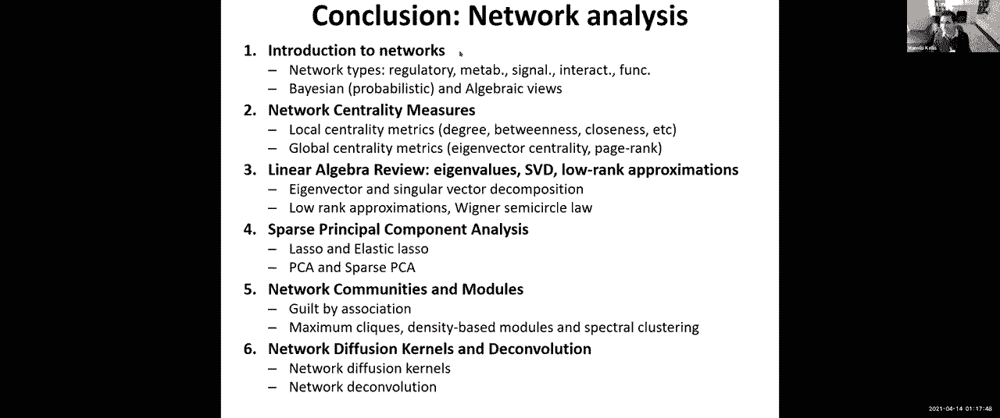
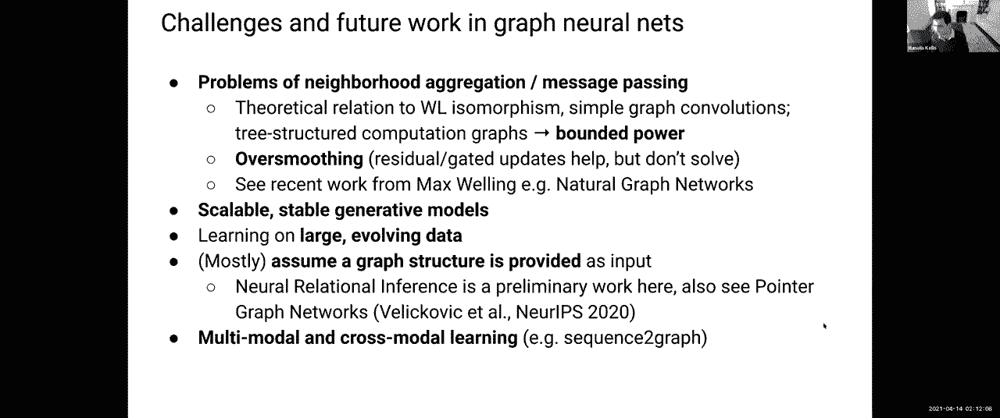
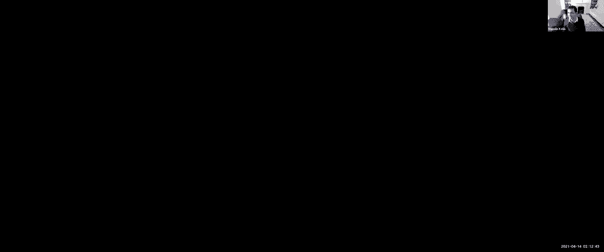
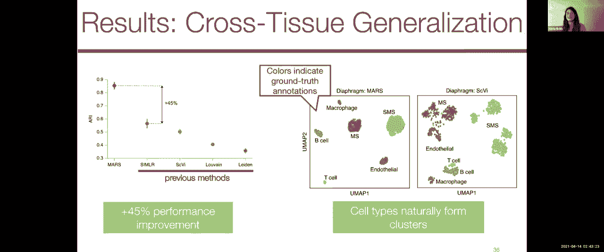

# 15：图神经网络 (GNNs) 教程 🧬

在本节课中，我们将学习图神经网络 (GNNs) 的基础知识。我们将从图和网络的基本概念开始，然后深入探讨图神经网络的核心原理及其在生物学中的应用，例如蛋白质相互作用网络和药物设计。课程将包含两位客座讲师的分享，内容涵盖半监督学习、多关系数据处理以及前沿研究领域。

---

## 📊 图与网络基础

网络在我们的世界中无处不在，从社交网络到生物网络，如基因调控网络、代谢网络和蛋白质相互作用网络。这些网络可以是有向或无向的，有权重或无权重，有符号或无符号的。理解网络的结构和特性对于分析复杂系统至关重要。

图的基本表示方法有两种：
1.  **邻接列表**：列出图中所有的边。
2.  **矩阵表示**（如邻接矩阵）：允许我们对网络进行矩阵运算。

图的矩阵表示使得我们可以计算各种网络属性，例如节点的中心性（衡量节点的重要性）。中心性可以通过多种方式定义，例如节点的邻居数量、穿过该节点的最短路径数量等。

此外，我们可以使用线性代数方法（如矩阵分解、特征值分解、奇异值分解）来学习网络的低维表示，发现网络中的社区结构。例如，谱聚类方法利用图的拉普拉斯矩阵的特征值来识别网络中的可分离组件。

---

## 🧠 图神经网络 (GNNs) 核心思想

上一节我们介绍了图的基础分析方法，本节中我们来看看如何将深度学习应用于图结构数据。图神经网络的核心思想是：根据图中每个节点附近的信息来更新该节点的表示。

具体来说，GNN通过聚合邻居节点的信息来更新目标节点的嵌入表示。随着GNN层数的增加，每个节点能够接收到来自更远邻居（即K跳邻居）的信息，从而获得更大的感受野。

GNN的典型流程分为三步：
1.  定义每个节点的邻域（例如其一跳或二跳邻居）。
2.  通过多层神经网络在图上传播和聚合信息，更新节点嵌入。
3.  利用最终得到的节点嵌入进行下游任务预测，例如节点分类或图分类。

以下是图卷积网络 (GCN) 中节点更新的一个简化公式：

`h_i^(l+1) = σ( Σ_(j∈N(i)∪{i}) (1 / c_ij) * W^(l) * h_j^(l) )`

其中：
*   `h_i^(l)` 是节点 `i` 在第 `l` 层的嵌入。
*   `N(i)` 是节点 `i` 的邻居集合。
*   `W^(l)` 是第 `l` 层可学习的权重矩阵。
*   `c_ij` 是一个归一化常数（通常与节点度数相关）。
*   `σ` 是非线性激活函数。

这种参数共享的机制，类似于卷积神经网络中的权重共享，使得模型能够高效地处理不同大小和结构的图，并具有排列不变性（即节点顺序不影响结果）。

---

## 🎯 GNN的任务与应用场景

我们已经了解了GNN如何更新节点表示，现在来看看它可以应用于哪些具体任务。图神经网络可以处理多种任务，主要包括：

*   **节点分类**：预测图中每个节点的类别（例如，在论文引用网络中预测每篇论文的研究领域）。
*   **链接预测**：预测两个节点之间是否存在边（例如，预测蛋白质之间是否存在相互作用）。
*   **图分类**：对整个图进行预测（例如，给定一个分子图，预测其溶解度或毒性）。

在半监督学习设置中，GNN尤其强大。即使只有少量带标签的节点，GNN也能利用图的结构信息，为大量未标记的节点生成准确的预测。这是因为信息通过边在图中传播，带标签节点的信息可以影响其邻居节点的表示。

---

## 🔗 处理复杂图结构

前面的例子主要针对同构图（只有一种节点和边类型）。然而，生物数据通常更加复杂。本节中我们来看看如何将GNN应用于更复杂的图结构，例如多关系图。

在异构网络（包含多种节点类型或边类型）中，我们需要根据不同的关系类型分别聚合信息。例如，在药物-副作用网络中，药物节点可能通过“共同服用导致副作用A”或“靶向相同蛋白质”等不同类型的关系相连。

关系图卷积网络 (R-GCN) 通过为每种关系类型引入不同的权重矩阵来扩展基础的GCN：

`h_i^(l+1) = σ( W_0^(l) * h_i^(l) + Σ_(r∈R) Σ_(j∈N_r(i)) (1 / c_i,r) * W_r^(l) * h_j^(l) )`

其中 `W_r^(l)` 是针对关系类型 `r` 的特定权重矩阵。为了减少参数量，可以对 `W_r` 进行低秩分解或作为基础变换的线性组合。

---

## 🤖 前沿研究与发展方向

GNN的研究正在快速发展。除了监督学习，无监督学习在图表示学习中也扮演着重要角色。对比学习是当前的一个热点，其核心思想是学习一个编码器，使得在原始图中相似的节点（如相邻节点）在嵌入空间中也彼此接近，而不相似的节点则相距较远。

另一个令人兴奋的方向是**深度生成图模型**，它旨在生成新的、有效的图结构（例如生成新的潜在药物分子）。例如，Junction Tree VAE 方法先生成分子的树状骨架（高级结构），再填充原子细节，从而确保生成分子的化学有效性。

此外，**潜图推理** 旨在从观察到的系统动态（如时间序列数据）中推断出潜在的因果图结构。这在理解基因调控网络或相互作用粒子系统等领域具有巨大潜力。

GNN目前也面临一些挑战，例如过度平滑（过深的网络会使所有节点嵌入变得相似）、处理图中循环结构的能力有限，以及如何扩展到超大规模图数据集。

---

## 💊 生物学应用实例：预测药物副作用

让我们看一个GNN在生物学中的具体应用：预测多药副作用（即两种药物联合使用时产生的副作用）。

我们可以构建一个异构网络，其中包含：
*   **节点**：药物和蛋白质。
*   **边**：
    *   药物-药物边：表示两种药物联合使用会导致特定副作用。
    *   药物-蛋白质边：表示药物靶向的蛋白质。
    *   蛋白质-蛋白质边：来自已知的蛋白质相互作用网络。

通过使用能够处理多关系数据的GNN（如R-GCN）对这个网络进行编码，我们可以学习到每个药物节点的综合嵌入。这个嵌入同时考虑了药物的化学特性、其靶点蛋白以及与其他药物的相互作用信息。然后，我们可以解码器部分计算任意两种药物嵌入的相似度，来预测它们联合使用时产生副作用的概率。

这种方法将多种生物医学知识整合到一个统一的深度学习框架中，有助于发现未知的药物相互作用。

---

## 🧬 跨数据集泛化：元学习应用

最后一个例子展示了如何利用GNN和元学习解决单细胞数据分析中的挑战：如何将细胞类型注释推广到全新的、未见过的实验或组织？

我们提出了一种名为 **MARS** 的元学习方法。其核心思想是：
1.  学习一个嵌入函数 `f`，将高维基因表达向量映射到低维空间。
2.  在该嵌入空间中，同时学习一组可代表的“细胞类型地标”。
3.  目标函数鼓励相同细胞类型的细胞嵌入彼此靠近且接近其地标，而不同细胞类型的细胞嵌入则彼此远离。

通过在大型、多样化的已注释数据集（元数据集）上训练，MARS 学习到的表示能够很好地泛化到全新的组织数据中，即使其中包含训练时未出现过的细胞类型，其性能也优于之前的深度学习方法。

---

## 📝 总结

本节课中，我们一起学习了图神经网络 (GNNs) 的核心概念与应用。我们从图的基础知识出发，探讨了GNN通过聚合邻居信息来更新节点表示的核心机制。我们介绍了GNN在节点分类、链接预测和图分类等任务中的应用，并扩展到了处理多关系异构网络的复杂场景。

我们还浏览了GNN的前沿研究方向，包括无监督对比学习、深度生成模型和潜图推理。最后，通过预测药物副作用和跨数据集单细胞分析两个具体案例，我们看到了GNN在解决实际生物医学问题中的强大能力和灵活性。

图神经网络为我们分析和理解复杂的生物网络系统提供了强大的新工具，是连接深度学习与生物网络科学的重要桥梁。