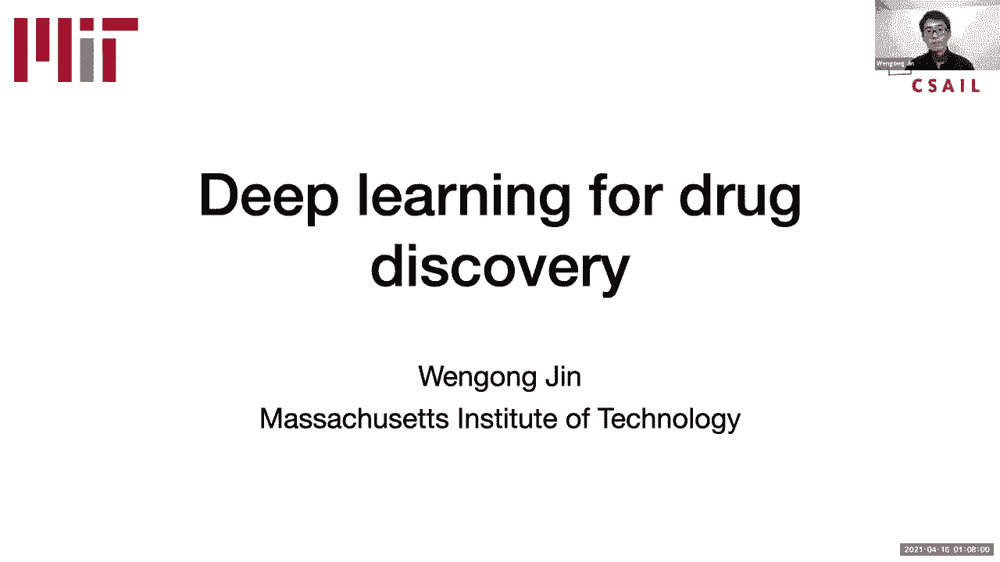
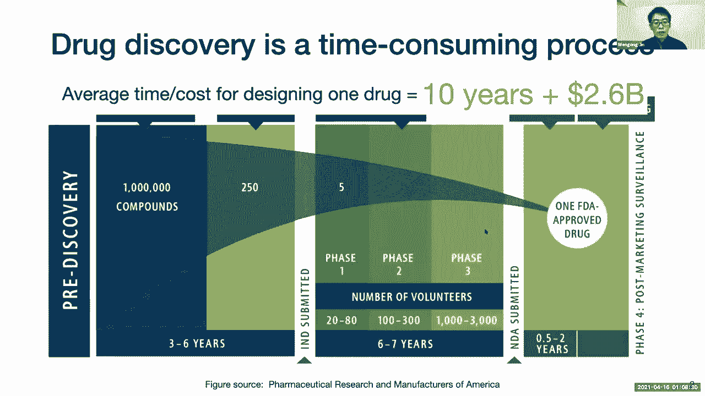
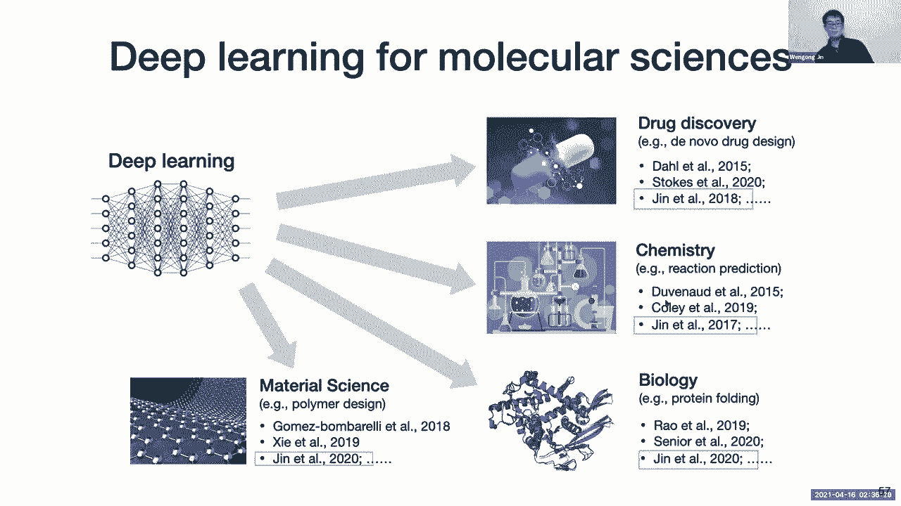
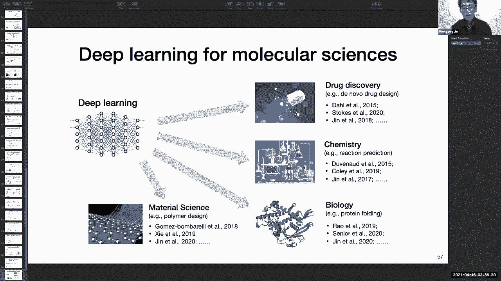

# 16：AI药物设计 🧪






在本节课中，我们将学习如何利用人工智能，特别是图神经网络，来加速和革新药物发现的过程。我们将探讨虚拟筛选、从头药物设计等核心概念，并通过抗生素发现和COVID-19药物组合等实际案例，了解AI如何解决药物研发中的关键挑战。

---

## 📊 概述：药物发现的挑战与AI机遇

药物发现是一个耗时且昂贵的过程。从数百万候选分子中识别出一种新药，平均需要超过10年时间和约26亿美元成本。传统的实验方法，如高通量筛选，每天只能测试约10万种化合物，这与估计高达10^60的潜在化学空间相比微不足道。因此，开发高效的计算算法来自动设计药物至关重要，而深度学习和人工智能为此提供了新的解决方案。

计算药物发现主要围绕两个核心概念：
*   **功能空间**：指化合物与其性质（如毒性、溶解度）之间的映射关系。这些性质通常可以用数字评分来衡量。
*   **化学空间**：指所有潜在分子的巨大集合。目标是找到具有特定理想性质的化学结构。

---

## 🔬 第一部分：利用图神经网络发现新型抗生素

上一节我们介绍了药物发现的基本挑战，本节中我们来看看如何利用图神经网络进行虚拟筛选，并以发现新型抗生素Halicin为例。

### 传统方法的局限：手工特征

在深度学习兴起之前，虚拟筛选主要依赖于手工设计的分子特征，例如分子量或更复杂的“摩根指纹”。摩根指纹将分子分解为不同的子结构（如特定半径内的原子组合），并将其映射为一个高维向量。

**代码示例：摩根指纹概念**
```python
# 伪代码：生成摩根指纹
from rdkit import Chem
from rdkit.Chem import AllChem

molecule = Chem.MolFromSmiles(‘CCO’) # 乙醇
fingerprint = AllChem.GetMorganFingerprintAsBitVect(molecule, radius=2, nBits=2048)
```
然而，这些手工设计的特征可能无法捕捉所有未知的、与抗菌活性相关的关键化学模式，从而限制了模型的预测性能。

### 图神经网络：自动学习特征

图神经网络（GNN）可以直接从分子图中学习特征表示，将特征学习和模型预测融为一体。分子可以很自然地用图来表示：原子是节点，化学键是边。

**公式：图卷积的基本思想**
节点特征通过聚合其邻居节点的信息来更新。经过多层卷积后，每个节点的表示都编码了其局部子图的结构信息。最后，通过池化操作（如求和或平均）将所有节点表示汇总为整个分子的单一向量表示。

以下是图神经网络的工作流程：
1.  **输入表示**：每个原子被编码为一个向量（如原子类型）。
2.  **图卷积**：通过聚合邻居信息，更新每个原子的表示，编码局部化学环境。
3.  **多次卷积**：重复此过程以捕获更大范围的分子结构信息。
4.  **图池化**：将所有原子的表示合并为一个代表整个分子的向量。
5.  **性质预测**：在该向量上添加前馈神经网络，预测目标性质（如抗菌概率）。

### 案例研究：发现Halicin

研究人员利用约2500个具有已知抗菌活性的分子训练了一个GNN模型。该模型在测试集上表现出色。随后，他们用该模型对约6000种已知化合物（原本用于其他用途）进行排名，以寻找潜在的抗生素。

模型排名第61位的化合物（原代号SU3327）被选中进行实验验证。该化合物被命名为Halicin，其结构与现有抗生素差异很大。实验证明，Halicin不仅能有效抑制大肠杆菌，还对多种耐药菌株（如鲍曼不动杆菌、艰难梭菌）具有广谱抗菌活性，甚至在小鼠感染模型中效果显著。

相比之下，基于传统摩根指纹和神经网络的模型未能发现Halicin，这凸显了GNN学习到的特征表示更具优势。

---

## 🦠 第二部分：融合生物知识预测COVID-19药物组合

上一节我们看到了GNN在虚拟筛选中的威力，但模型仅依赖化学结构。本节中我们来看看，在面对数据稀缺的新疾病（如COVID-19）时，如何将生物知识注入模型以提升预测能力。

### 动机：数据稀缺与知识融合

对于COVID-19，早期可用的实验数据非常有限（仅数百个药物组合的协同性数据）。纯数据驱动的GNN模型容易过拟合。因此，需要将病毒生物学知识融入模型，以改善其泛化能力。

关键生物学知识包括病毒复制周期中的干预点：
1.  阻止病毒进入（如抑制ACE2受体）。
2.  抑制病毒蛋白（如3CL蛋白酶）。
3.  抑制与病毒相互作用的宿主蛋白。

### 模型设计：CombioNet

研究人员设计了名为CombioNet的模型，它同时结合了化学和生物学表示。

模型构建分为三个步骤：
1.  **学习生物靶点表示**：利用公开的药物-靶点相互作用数据库（如ChEMBL），训练一个GNN来预测药物是否会抑制某个与COVID-19相关的靶点（病毒或宿主靶点）。这解决了数据稀疏性问题，并为每种药物生成一个“生物特征”向量。
2.  **学习化学结构表示**：同时，使用标准的GNN为每种药物生成“化学特征”向量。
3.  **预测协同效应**：对于药物组合(A, B)，模型结合它们的化学和生物特征，预测其联合抗病毒活性。协同效应得分通过比较联合活性与各自活性的简单加和来计算（类似于集合的容斥原理）。

### 成果与验证

融合了生物和化学信息的CombioNet模型，其预测性能显著优于仅使用化学信息的标准模型。利用该模型进行预测，并与美国国立卫生研究院合作进行实验验证，成功发现了两种具有强协同效应的新型药物组合（例如瑞德西韦与另一种药物的组合）。

---

## 🧬 第三部分：基于图生成的从头药物设计

前两部分主要关注“虚拟筛选”，即对现有化合物库进行排名。但化学空间极其庞大，虚拟筛选无法覆盖全部。本节中我们来看看更雄心勃勃的“从头药物设计”，即直接生成具有理想性质的新分子结构。

### 生成模型的挑战

从头药物设计本质上是一个生成建模问题：学习一个在“好分子”区域概率密度高的分布，然后从中采样。挑战在于分子是图结构，而非序列或网格。

已有方法存在局限：
*   **基于序列的方法**：使用SMILES字符串表示分子，并用RNN生成。但SMILES表示脆弱，相似分子可能有完全不同的字符串，导致生成效果不佳。
*   **逐节点生成**：一次向图中添加一个原子和化学键。但对于稀疏的分子图，这种方法复杂度高（O(n²)），且重建大分子的准确率低。

### 新思路：利用分子的结构先验

分子图通常具有“树宽较低”的特点，这意味着它们可以被有效地分解为较小的、重复出现的“ motifs”（如环、特定官能团）。对大量分子进行分析发现，仅约600种不同的motif就能覆盖99.9%的分子。

### 模型架构：连接树变分自编码器

受图模型中“连接树算法”的启发，研究人员提出了连接树变分自编码器（Junction Tree VAE）。

**模型工作流程**：
1.  **编码**：将输入分子分解为其对应的连接树（树节点是motif）。使用GNN分别编码分子图和连接树，得到潜在向量表示。
2.  **解码**：先解码生成连接树（一个motif序列），这是一个更简单的序列生成任务。然后，根据生成的树结构，将motif逐步连接、扩展，最终组装成完整的分子图。

这种方法将复杂的图生成任务分解为树生成和子图组装两个更简单的步骤，显著提高了生成效率和准确性，特别是在生成较大分子时。

### 应用：分子优化

该生成模型不仅能从头生成分子，还能对现有分子进行优化。例如，给定一个活性良好但“类药性”（如水溶性、口服生物利用度）较差的先导化合物（如Halicin），模型可以学习对其进行局部修改，在保持其抗菌活性的同时，提升其类药性评分。实验表明，这种基于motif的生成方法在分子优化任务上的成功率高于基于序列或逐节点生成的方法。

---

## 💎 总结与展望

本节课我们一起学习了人工智能在药物设计中的关键应用：

1.  **虚拟筛选与抗生素发现**：利用图神经网络自动学习分子特征，能够更有效地从化合物库中识别出具有新颖结构和强效活性的候选药物，如抗生素Halicin。
2.  **知识融合与药物组合**：在面对数据稀缺的新疾病时，将生物学知识（如药物-靶点相互作用）融入图神经网络模型，可以显著提升预测能力，成功发现协同药物组合。
3.  **从头药物设计与分子生成**：通过利用分子图的结构先验（低树宽、motif），设计新的图生成模型（如连接树VAE），能够高效地生成和优化分子结构，实现对庞大化学空间的探索。





AI在分子科学（药物发现、化学生物学、材料科学）中的应用前景广阔。未来的挑战包括处理蛋白质3D结构、设计大分子聚合物以及规划化学合成路线等。这是一个需要跨学科合作、充满机遇的领域。