# 17：深度学习在蛋白质折叠中的应用 🧬

在本节课中，我们将学习如何利用深度学习技术来研究蛋白质结构，特别是蛋白质折叠问题。课程内容分为三个主要部分：首先，我们将探讨如何利用几何深度学习分析蛋白质表面特征；其次，我们将深入了解如何从蛋白质序列预测其三维结构；最后，我们将讨论端到端可微分方法在蛋白质结构预测中的最新进展。

## 蛋白质结构与功能概述

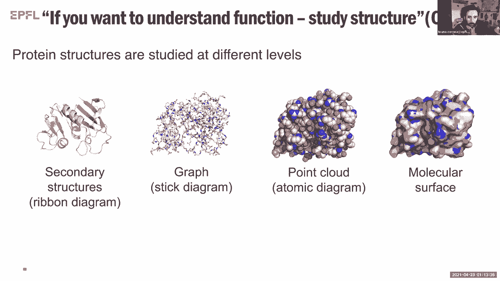

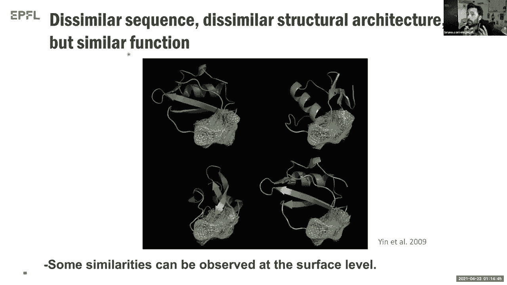

蛋白质是生命活动的主要承担者，其功能与其三维结构密切相关。蛋白质的氨基酸序列（一级结构）会折叠成特定的三维构象，这种构象决定了蛋白质的催化、识别、机械支撑等多种生物学功能。

例如，抗体是一种蛋白质，其结构使其能够识别并结合特定抗原。此外，还有负责离子转运、细胞间通讯等功能的蛋白质。因此，理解蛋白质结构对于理解其功能至关重要。

## 研究蛋白质结构的重要性

研究蛋白质结构的方法多种多样。我们可以从不同层面表示蛋白质结构：从氨基酸序列、二级结构（如α螺旋、β折叠），到更复杂的三维原子坐标点云，再到连续的分子表面表示。本课程将重点讨论如何利用蛋白质的分子表面信息来推断其功能。

## 蛋白质表面指纹与几何深度学习

一个有趣的现象是，许多具有相似功能的蛋白质，其氨基酸序列可能不同，三维架构也可能不同，但其分子表面却可能具有相似的物理化学模式。这引导我们提出一个核心问题：能否仅通过分析蛋白质表面的“指纹”模式来预测其功能，而不依赖于序列信息？

为了研究这些高维、结构丰富的表面数据，我们转向**几何深度学习**。这与传统深度学习（如图像分类）处理规则网格数据不同，几何深度学习擅长处理图、点云、网格等非欧几里得数据结构。

### 几何深度学习引擎：网格与补丁

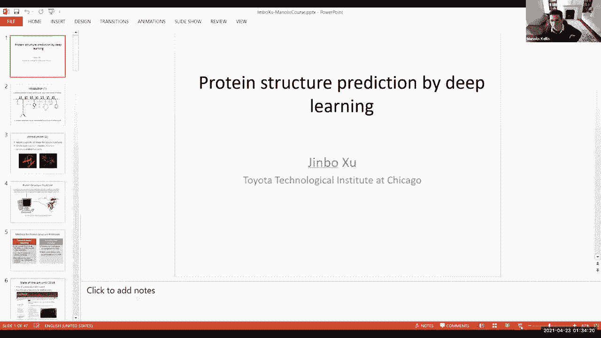

我们使用三角网格来表示蛋白质表面。网格由**节点**（顶点）、**边**和**面**构成。

以下是我们的数据处理流程：
1.  **构建网格**：将蛋白质三维结构转化为表面三角网格。
2.  **定义补丁**：以网格上每个节点为中心，根据测地线距离（表面最短路径）定义一个局部区域，称为“补丁”。
3.  **编码特征**：在每个节点上，我们编码两类特征向量：
    *   **几何特征**：如形状指数、曲率，描述表面的拓扑形状。
    *   **化学特征**：如疏水性、静电势，描述表面的生化性质。
    *   **极坐标**：编码节点相对于补丁中心的方向信息。
4.  **应用可学习卷积**：对每个补丁应用特殊的图卷积操作。卷积核包含可学习的参数（例如，用于加权不同区域的高斯权重 `g` 和 `e`），最终将整个补丁的信息汇总为一个特征向量。

通过这种方式，我们可以为蛋白质表面的任何区域生成一个“指纹”描述符，用于后续的功能分析。

## 应用：从表面指纹预测功能

学习了如何提取表面指纹后，我们来看看其具体应用。我们的目标是利用这些指纹来理解未知蛋白质结构的功能特性。

以下是几个关键的应用方向：
*   **结合口袋分类**：预测蛋白质表面哪些凹陷区域（口袋）更可能结合特定的辅因子或代谢物。
*   **蛋白质-蛋白质相互作用位点预测**：识别表面哪些区域更倾向于与其他蛋白质结合。
*   **蛋白质对接预测**：预测两个蛋白质之间最可能的结合构象。

在我们的研究中，通过消融实验发现，同时结合**化学特征**和**几何特征**能获得最佳预测性能。仅使用几何特征效果不佳，而化学特征本身已包含大量信息，但二者结合能进一步提升准确性。

在对接预测方面，我们的方法（通过比较指纹向量距离）在保持与主流对接程序相近精度的同时，速度提升了数个数量级，因为它将三维空间搜索简化为一维向量距离计算。

## 下一代方法：可微分表面建模（D-MASIF）

上一节我们介绍了基于预处理特征提取的流程。本节我们来看一种更先进的端到端方法。

最初的流程需要手动计算并映射化学和几何特征到网格上。新一代方法 **D-MASIF** 旨在建立一个完全可微分的网络，直接从蛋白质的原子点云出发，端到端地同时学习表面几何和计算静电势等化学特征。

这种方法减少了预处理步骤，并且预测的静电势等特征与之前基于物理计算的结果高度吻合，为后续设计应用提供了更高效的框架。

## 蛋白质结构预测：从序列到三维构象

接下来，我们将视角从表面分析转向一个更根本的问题：如何仅从氨基酸序列预测蛋白质的三维结构。这是一个长期存在的重大挑战。

传统方法主要分为两类：
1.  **基于模板的建模**：在已知结构数据库（PDB）中寻找同源蛋白作为模板进行建模。当模板相似度高时，此方法非常可靠。
2.  **自由建模**：当没有合适模板时使用。过去的主流方法是**片段组装**，即从序列中截取短片段，在PDB中寻找可能的结构片段，然后通过采样和能量优化将它们组装成完整结构。这种方法计算成本极高，且对大蛋白成功率低。

近年来，一种新策略取得了突破性进展：**利用共进化信息与深度学习**。

## 共进化分析与接触预测

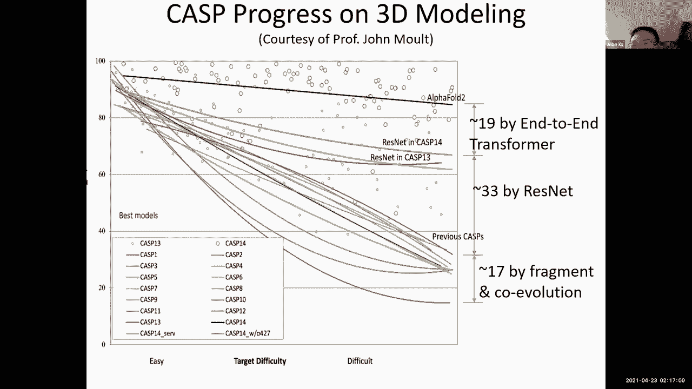

新策略的核心是：通过深度学习方法，从蛋白质的多序列比对中预测残基间的空间接触关系。

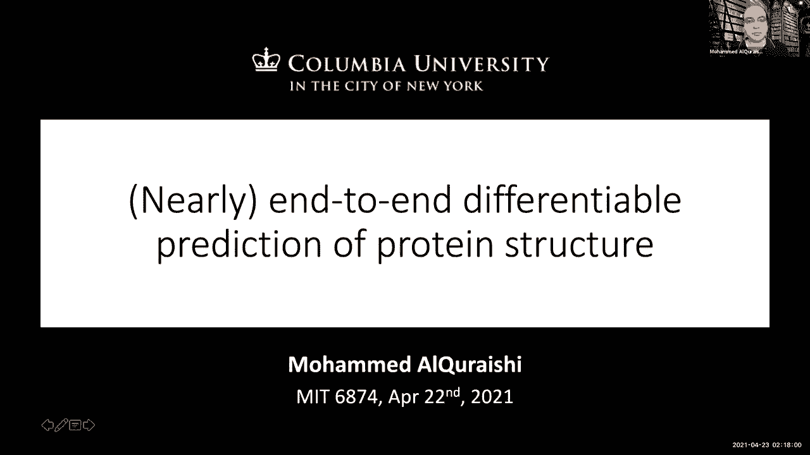

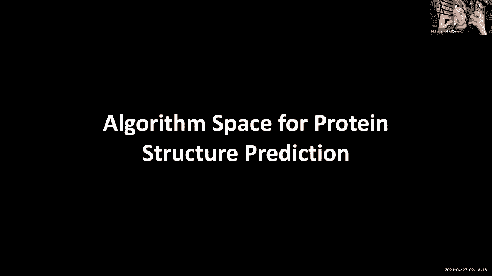

其流程如下：
1.  输入目标蛋白质序列。
2.  进行同源性搜索，构建**多序列比对**（MSA），即收集大量同源序列。
3.  从MSA中提取信息，输入机器学习模型，预测**残基接触图**或更精确的**残基间距离矩阵**。
4.  将这些空间约束输入优化引擎，生成三维坐标。

**接触预测**的精度是该方法成功的关键。早期基于互信息等全局统计方法需要大量同源序列，对于同源物少的蛋白效果不佳。而早期的监督学习方法只利用局部序列特征，忽略了蛋白质整体的上下文信息。

## 深度卷积神经网络在接触预测中的突破

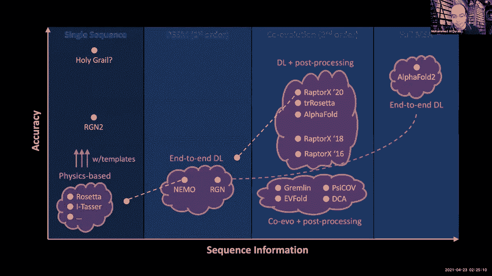

为了解决上述问题，我们开发了新的方法。关键思路是将整个蛋白质的接触预测建模为一个图像分割问题。

我们将蛋白质序列视为一个二维图像，其中每个像素代表一对残基。我们使用一个非常深的**二维残差卷积神经网络**，同时预测所有残基对之间的接触状态。网络的输入是整个蛋白质的序列特征和MSA的概要信息。

这种方法能够捕获蛋白质全局的上下文信息，显著提升了接触预测的精度，从早期的20%左右提升到了80%以上。高精度的接触信息极大地改善了后续的三维结构建模。

## 从接触图到三维模型

获得预测的接触或距离信息后，需要将其转化为三维结构。主要有两种方法：
*   **距离几何法**：直接使用距离约束求解三维坐标。
*   **能量最小化法**：将预测信息转化为能量势，通过梯度下降等优化方法寻找低能构象。

由于深度学习方法提供的约束非常精确，现在仅需采样数百个构象即可得到良好模型，计算效率远高于传统的片段组装法。

## 最新进展：端到端可微分模型

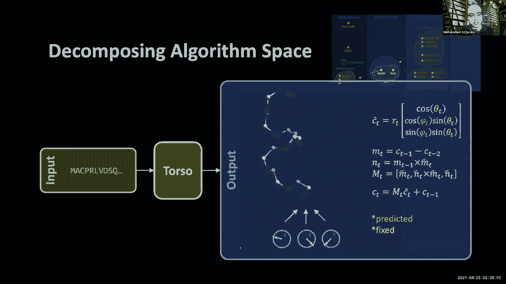

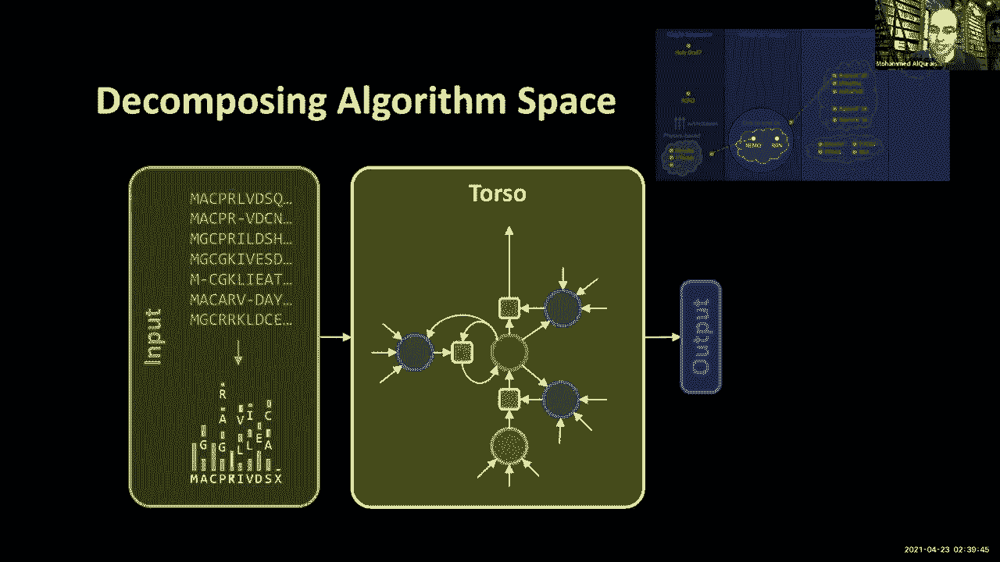

上一节我们介绍了基于预测接触图的流程，其中包含不可微分的后处理步骤（如能量最小化）。本节我们来看更前沿的**端到端可微分模型**。

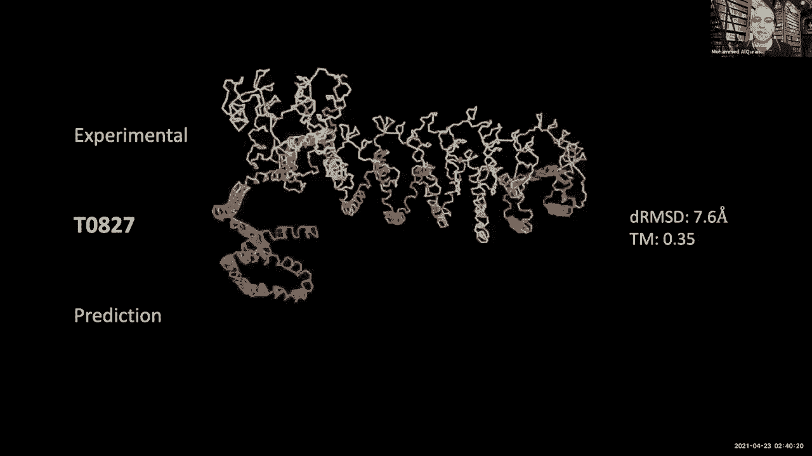

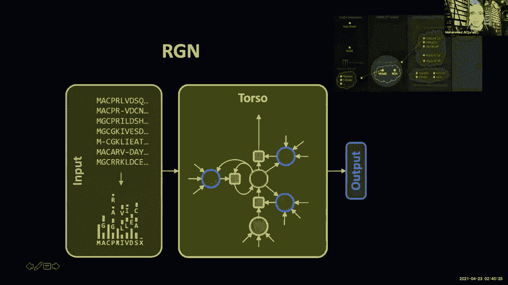

这类模型（如AlphaFold 2，以及我们开发的trRosetta、RGN等）旨在直接从序列（或MSA）预测三维坐标，整个流程可微分，允许损失梯度从最终的三维结构直接反向传播到输入。

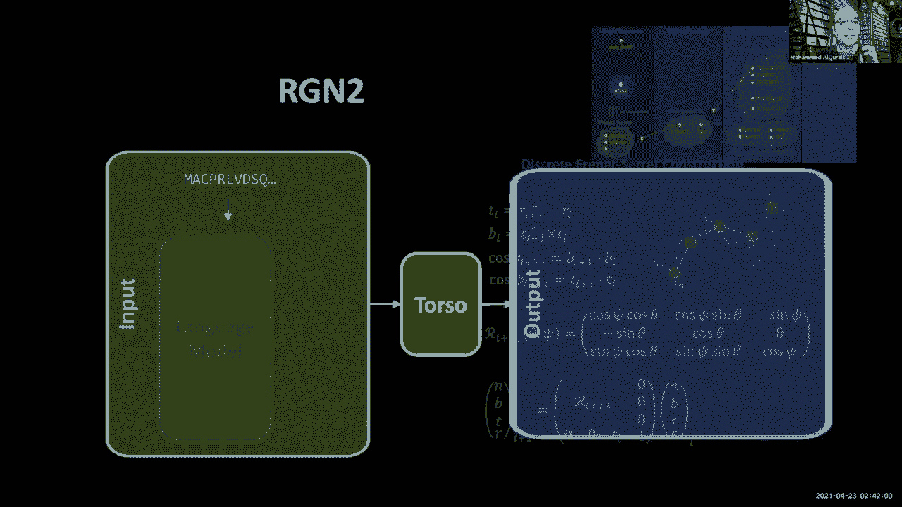

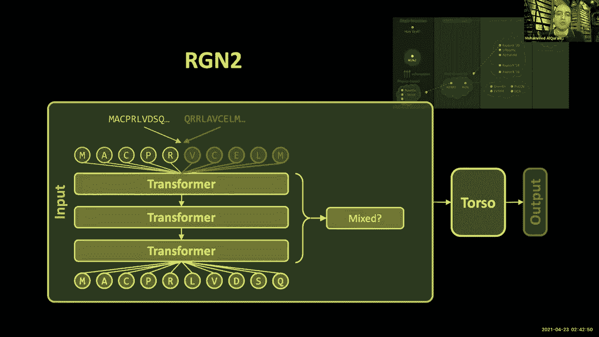

我们早期的工作（RGN）使用循环神经网络，通过预测离散的扭转角来逐步构建主链。损失函数基于最终三维结构的全局精度，迫使网络学习隐含的全局约束。

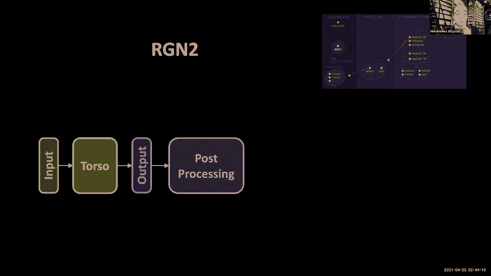

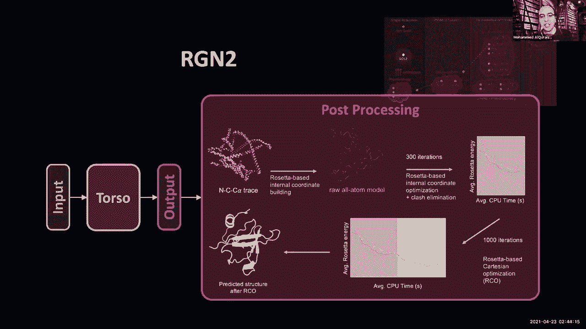

近期，我们改进了参数化方法，使用**刚体运动**（旋转矩阵）来描述Cα原子间的几何关系，并结合了基于**蛋白质语言模型**（如ESM-1b）提取的单个序列的深层语义表示。这使得我们能够仅从单条序列出发，在某些情况下（如孤儿蛋白、从头设计蛋白）取得与需要MSA的先进方法相媲美的预测效果。

## 总结与展望

本节课中，我们一起学习了深度学习在蛋白质科学中的三个重要应用方向。

首先，我们学习了如何利用**几何深度学习**分析蛋白质表面指纹，从而预测功能位点和相互作用界面。其次，我们深入探讨了如何通过**深度卷积神经网络**从多序列比对中预测残基接触，进而实现高精度的蛋白质三维结构预测。最后，我们了解了**端到端可微分模型**的最新进展，这些模型能够直接从序列生成结构，并在单序列预测等场景展现出巨大潜力。

这些技术的发展不仅解决了基础科学问题，也为药物设计（如靶点识别、抗体设计）、理解基因突变影响、蛋白质工程等领域带来了新的工具和可能性。未来，结合更强大的蛋白质语言模型、更高效的架构以及物理与学习的融合，这一领域将继续快速发展。