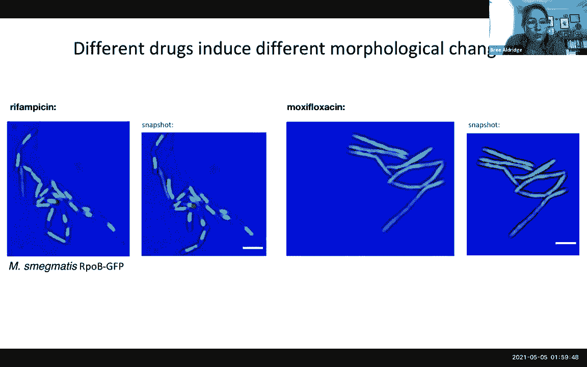
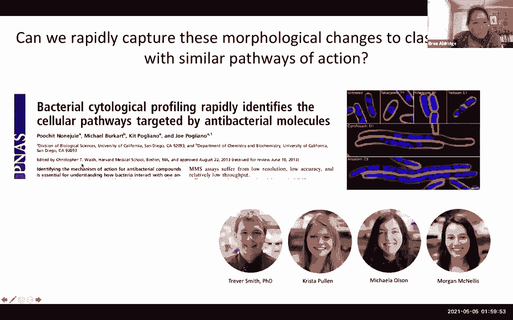
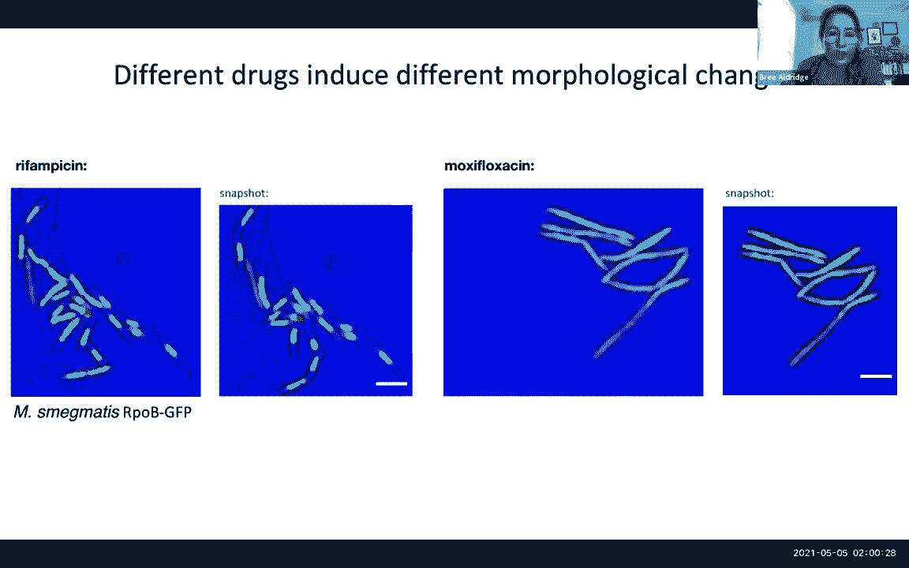
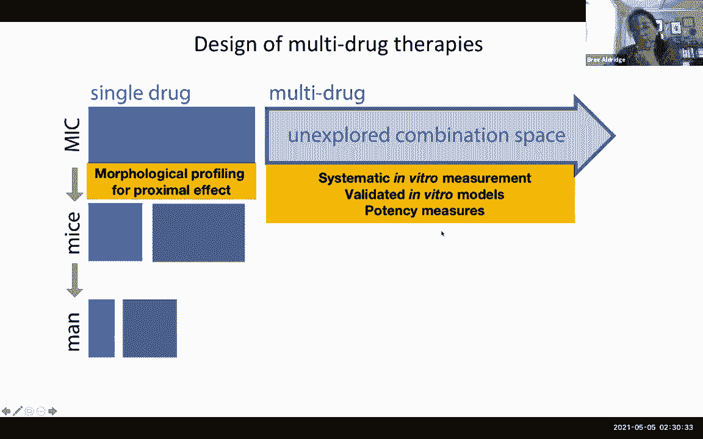

# 18：第19讲 - 病理学中的机器学习 🧬


在本节课中，我们将学习深度学习在数字病理学图像分析中的应用与挑战。我们将探讨如何利用深度学习技术处理高分辨率病理图像，同时也会审视其局限性，并了解结合传统手工特征工程的重要性。

---

## 临床背景与机遇 📊

上一节我们介绍了课程主题，本节中我们来看看应用这些技术的临床背景。

癌症是美国男性和女性中非常普遍的疾病，约40%的人一生中会被诊断出患有某种形式的癌症。然而，每年因癌症死亡的人数约为60万。诊断率与死亡率之间的差异部分归因于早期检测的进步、更好的生物标志物和治疗方法（如免疫疗法）。但另一个重要原因是，对于许多癌症（例如惰性前列腺癌），存在过度诊断和过度治疗的问题，这不仅可能对患者造成伤害，还带来了“经济毒性”的挑战。

因此，人工智能和机器学习的机遇不仅在于疾病诊断，更在于诊断后的环节：如何治疗、如何管理、如何区分侵袭性与惰性癌症，从而制定更精准的治疗方案。这涉及到开发预后和预测工具，而不仅仅是诊断工具。

目前已有一些基于基因组或基因表达的分析工具（如Oncotype DX），但它们价格昂贵、具有组织破坏性，并且可能因肿瘤异质性而无法准确采样到最具侵袭性的部分。

---

## 数字病理学与深度学习 🖼️

上一节我们了解了临床需求，本节中我们来看看数字病理学如何提供新的解决方案。

随着全玻片扫描技术的发展，病理玻片可以被数字化，生成高分辨率图像。这为病理学家在屏幕上阅片提供了便利，更重要的是，为数据科学家和计算机视觉专家提供了使用先进机器学习方法分析这些图像的机会。

我们可以识别出超越人类视觉的模式。例如，算法可以识别单个细胞（如癌细胞核、淋巴细胞），并利用网络理论观察其空间结构和排列。我们可以从细胞的空间排列、不同组织区域（上皮、间质）内的纹理模式中提取一系列定量指标。这些指标不仅能用于诊断，还能用于疾病预后和预测治疗反应。

**核心优势**：这种方法无需破坏组织，只需将数字化玻片图像通过云端算法分析，即可将结果反馈给肿瘤科医生。

---

## 深度学习在计算病理学中的角色 🤖

上一节我们看到了数字病理学的潜力，本节中我们深入探讨深度学习的具体应用。

深度学习在计算病理学领域产生了重大影响，主要是因为病理玻片提供了海量的数据。单次前列腺活检可能产生20-30GB的数据，远超典型的MRI或CT扫描。

一个早期的应用是使用堆叠稀疏自编码器进行细胞检测。具体方法是：
1.  手动标注单个细胞周围的边界框。
2.  将包含细胞的图像块输入网络。
3.  网络以无监督的方式学习特征，例如细胞的椭圆形形状、内部染色梯度等。
4.  训练后的网络可以识别图像中是否有细胞。

**代码示例思路**：
```python
# 伪代码：使用自编码器进行特征学习
autoencoder.fit(training_patches) # training_patches 是包含标注细胞的图像块
learned_features = autoencoder.encode(new_image_patch)
```
然而，这种方法面临挑战，如染色差异、细胞类型多样性和预处理变异，这些都会影响分割的准确性。因此，后续研究开始关注颜色标准化等预处理步骤。

---

## 深度学习的陷阱与教训 ⚠️

上一节我们看到了深度学习的初步应用，本节中我们通过一个案例来了解其潜在风险。

一项研究试图训练CNN（卷积神经网络）基于心内膜心肌活检图像区分正常心脏与衰竭心脏。在初始测试集上，CNN的AUC（曲线下面积）达到了0.97，而病理学家的AUC约为0.74，结果非常出色。

然而，当从同一机构、同一扫描仪获取的新一批患者数据上测试同一个CNN时，其AUC从0.97下降到了0.75。调查发现，在这两批数据采集之间，扫描仪进行了一次不显眼的软件升级，微妙地改变了图像属性。尽管人眼难以察觉，但图像分布的细微变化足以导致神经网络性能显著下降。

**核心教训**：不能盲目相信深度学习算法。它们可能对数据采集过程中的微小变化（如扫描仪设置、染色差异）非常敏感，导致泛化能力差。必须仔细评估算法学到了什么，尤其是在高风险医疗决策中。







---

## 结合深度学习与手工特征工程 🔧

上一节我们认识了深度学习的脆弱性，本节中我们探讨一种更稳健的策略：将深度学习用于初始分割，再结合可解释的手工特征。

研究发现，深度学习在**检测和分割**任务上非常有效且高效。例如，可以使用预训练网络快速识别大图像中的细胞核、有丝分裂等结构。

**主要瓶颈在于标注**。为了提升标注效率，可以开发交互式工具（如快速标注器），允许用户在算法初步结果上进行修正，并利用这些反馈实时重新训练网络，形成人机协同的主动学习循环。

在分割之后，可以提取**手工设计的、可解释的特征**进行后续分析。例如：
1.  **空间结构特征**：利用图网络理论（如Delaunay三角剖分、Voronoi图）分析不同细胞类型（基质细胞、肿瘤细胞、淋巴细胞）的空间排列和相互作用。
2.  **胶原纤维取向**：使用深度学习分割出胶原纤维，为其分配方向向量，然后计算这些向量的熵来量化纤维排列的无序程度。研究表明，胶原纤维取向熵对乳腺癌患者的生存有很强的预测能力。
3.  **腺体结构特征**：在前列腺癌研究中，用深度学习分割腺体，然后分析其空间构架。基于图像特征的模型在预测术后复发方面表现优异，甚至与昂贵的分子检测效果相当，但成本低得多。

**公式示例**：胶原纤维取向熵
```
H = -Σ p(θ) log p(θ)
```
其中，`p(θ)` 是纤维方向在角度 `θ` 上的概率分布。

这种“深度学习分割 + 手工特征工程”的混合方法，既利用了深度学习在感知任务上的强大能力，又通过可解释的特征保证了结果的透明度和可靠性，临床医生更容易理解和信任。

---

## 总结与展望 🎯

本节课我们一起学习了深度学习在计算病理学中的应用旅程。

我们了解到，深度学习为处理海量病理图像、自动识别微观结构提供了强大工具。然而，我们也看到了它作为“黑箱”的局限性，包括对数据细微变化的敏感性和可解释性差的挑战。

关键的收获是，在当前阶段，一种有效的策略是**将深度学习定位为强大的分割工具**，用于提取图像中的基础对象（如细胞、组织区域）。然后，在此基础上，结合**领域知识驱动的手工特征工程**，提取具有明确生物学意义的定量特征（如空间排列、纹理、形态），用于最终的诊断、预后或预测模型。

这种方法在多项研究中显示出巨大潜力，不仅能取得优异性能，而且成本更低、可解释性更强，有助于推动精准医疗的真正实现。未来，深度学习可能会在特征发现方面提供更多线索，但可解释性和与临床实践的紧密结合，始终是医疗AI成功的关键。



---
*注：本教程根据关于病理学机器学习的讲座内容整理，聚焦于核心方法、案例与教训，旨在为初学者提供清晰的理解路径。*