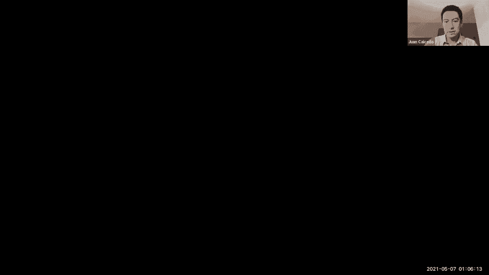
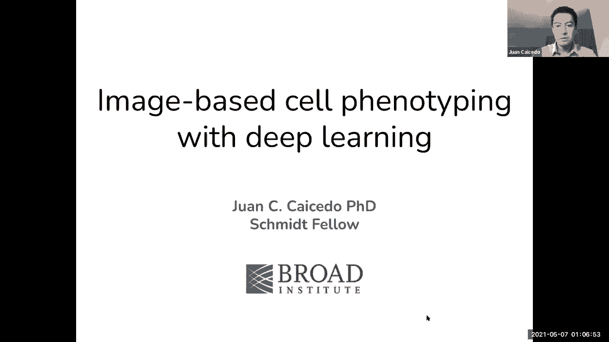
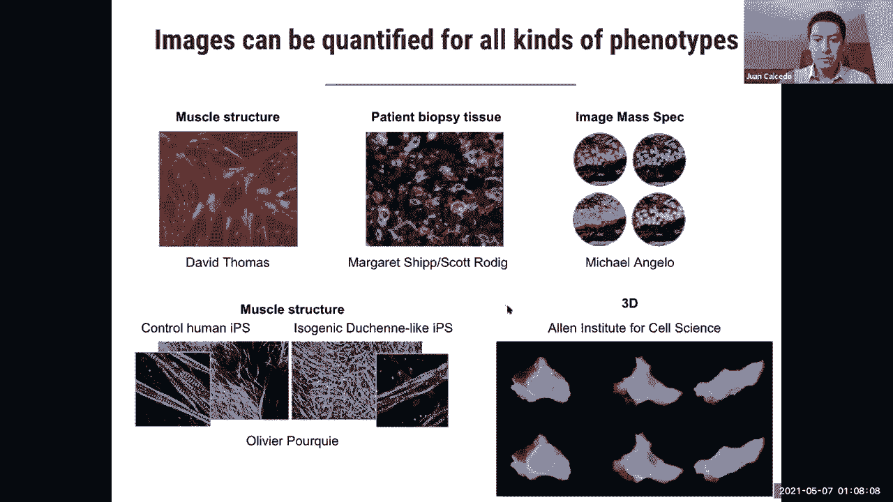
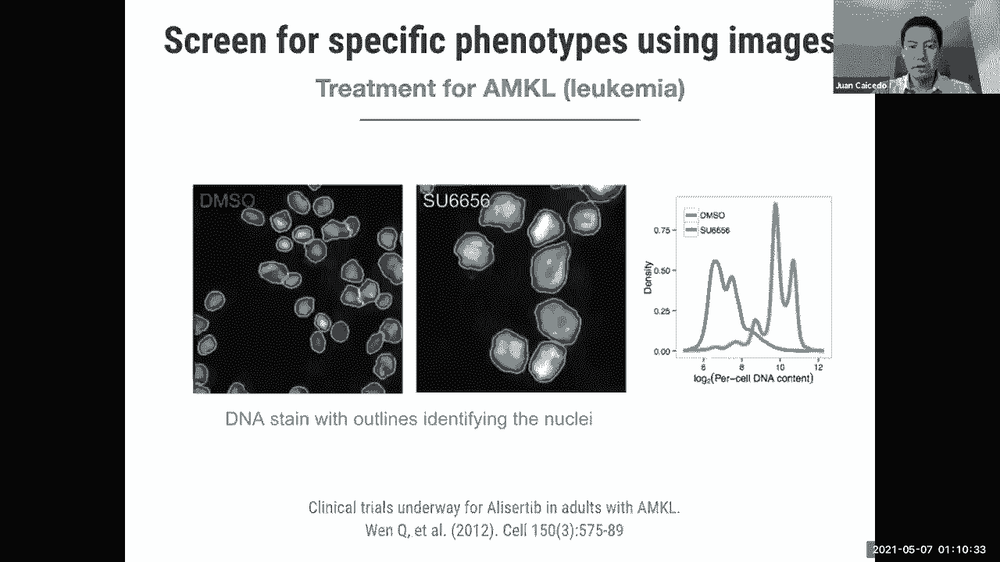
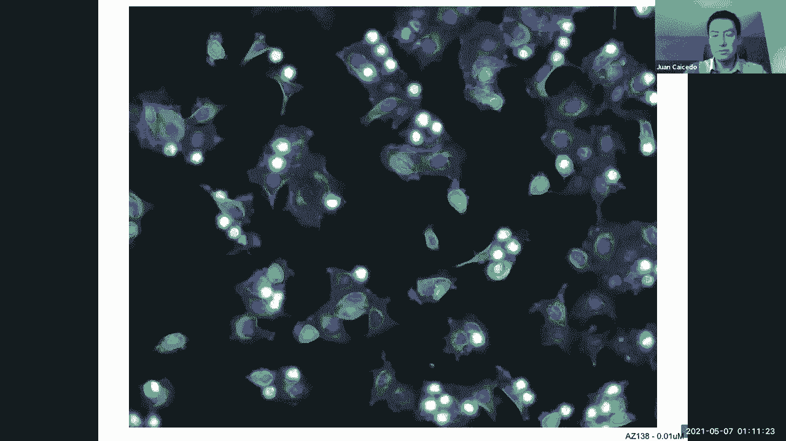
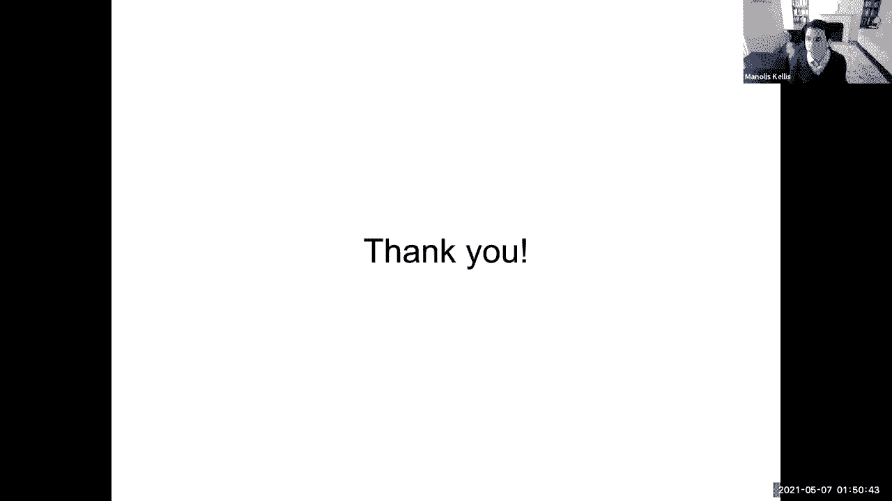

# 19：深度学习用于细胞图像分割 🧫

在本节课中，我们将学习如何利用深度学习技术对细胞显微镜图像进行分析，特别是细胞分割和单细胞表征学习。我们将探讨这些技术如何帮助生物学家从图像中提取定量信息，以用于药物发现和功能基因组学研究。

---

## 🧬 基于图像的表型分析

上一节我们介绍了课程主题，本节中我们来看看什么是基于图像的表型分析。这是一种通过图像来理解生物系统的方法，尤其是在设计治疗方法或发现细胞新表型时。

显微镜图像可以量化多种表型。不同类型的显微镜图像能揭示大部分细胞结构，例如患者组织的活检切片。我们可以使用多种显微镜技术，包括光谱成像，来捕捉三维图像甚至时间序列图像。

显微镜技术让我们能以不同的方式、在不同的分辨率下观察细胞，包括时间和空间分辨率。因此，我们能够从图像中看到大量信息。

挑战在于如何量化这些信息。图像看起来很漂亮，但为了做出治疗决策或在细胞中发现新的行为模式，我们需要精确测量细胞的状态和活动。

---

## 💊 图像在药物发现中的应用

以下是我们可以使用图像进行测量的一个例子。这是一项2012年的研究项目，研究人员正在寻找一种潜在的白血病候选药物。

他们的假设是：如果我们取患病的细胞（例如患有白血病的红细胞），并测试特定的化合物，观察细胞是否能从疾病状态中恢复。在这种情况下，细胞大小是一个指示其恢复健康的特征。

在左侧图像中，我们看到六个用中性化合物处理的细胞。在右侧图像中，我们看到用特定候选化合物处理的细胞，该化合物旨在使细胞恢复正常大小。为了确定化合物是否有效，研究人员通过观察图像并测量DNA总量来进行评估。

经过多次临床试验和长期研究，这种特效药最终在2019年或2020年被FDA批准为白血病的潜在治疗方法。这项研究背后的团队甚至成立了一家公司，专门基于图像寻找新的治疗方法或药物。这展示了利用图像设计治疗方法的可能性。

---

## 🔬 基于图像的分析流程

在前面的案例中，我们研究了一个特定的特征来区分患病细胞与健康细胞。但在更普遍的情况下，如果我们想比较像这样的一群细胞与另一群细胞，我们可能没有明显的单一特征可以依赖。

在这种情况下，可能涉及更多的功能以及从一种治疗到另一种治疗的更多细胞特征。对于这些情况，我们可能需要更多的信息和更好的策略来从图像中提取信息。

这就是我们所说的基于图像的分析。本质上，这是一种利用图像研究细胞形态或细胞状态的方法。想象一下，你正在设计一种化学治疗或基因治疗，这取决于你想在细胞系统中进行什么类型的干预。

你在培养皿（称为多孔板）中进行模拟实验，每个孔中可以同时进行不同的实验，例如加入不同的化合物。让细胞生长一段时间（例如几小时）后，你给细胞拍照以捕捉其状态。在化合物或基因治疗对细胞产生影响后，你再次捕捉图像。

下一步是计算分析部分。我们拍摄这些照片并进行分析，以提取定量信息，从而评估哪些治疗有效，哪些无效。这种方法在生物学中有许多应用，主要是在药物发现中测试化合物，同时也在功能基因组学中用于敲除基因或编辑基因组，以观察细胞的反应或表型变化。

---

## 🧩 细胞分割：识别单个细胞

今天，我们将讨论与这个基于图像的分析流程相关的两个计算问题。第一个是细胞分割，第二个是单细胞表征学习。让我们从细胞分割开始。

细胞分割的问题在于识别图像中单个细胞的位置。实际上有很多方法可以实现这一点，但生物学家捕捉的显微镜图像类型非常多样。

如果你查阅每种图像类型的文献，可能会找到专门的分割算法。这不太好，因为每当改变成像协议时（生物学家喜欢创造性地使用颜色或成像技术以观察更多细胞细节），就必须调整分割算法以确保其在实际中有效。

这阻碍了许多实验室的进展，因为他们要么坚持使用已知的图像协议和分割算法，要么在改变方法时必须花费更多时间和精力来分割图像。因此，我们开始思考：如果我们能开发一个通用的细胞分割算法，就像自然图像中的人脸检测器一样，会怎样？

社交媒体甚至我们手机中的算法可以自动检测人脸，我们无需调整任何参数或进行训练。这些模型经过训练，可以在各种条件下（包括人群、室内、室外等）检测人脸，并且效果很好。那么，为什么在生物学中不能有这样的东西呢？

---

## 🏆 数据科学竞赛：通用细胞分割

我们提出了这个问题，并在2018年围绕这一挑战组织了一场数据科学竞赛，旨在将计算机视觉技术应用于生物学。我们提供了十万美元的奖金，目标是分割任何类型的显微镜图像。

以下是我们在比赛中考虑的五种图像类型的例子。当然还有更多类型，但我们包括了来自三十种不同实验的五种图像类型。比赛持续了三个月，有三千个团队参加，他们总共进行了超过65,000次实验，试图解决如何在任何类型的显微镜图像上分割单个细胞的问题。

为了组织这场比赛，我们主要进行了三个步骤。第一步是创建带注释的数据集，因为我们希望团队参与监督机器学习模型的训练。我们需要输入输出示例，因此我们收集了来自多个不同实验的图像，并手动注释了算法应产生的输出，以获得准确的分割结果，我们称之为“地面实况”。

在收集了大约三万两千个单细胞的手动注释图像后，我们将数据集拆分为训练集和测试集。实际上有三个主要分区：公开的开发分区或训练分区，参与者可以以任何方式使用这些数据进行训练；第二个分区是测试分区，参与者可以用它从系统中获得反馈，但他们无法访问测试数据集的地面实况标签，只能看到图像并为其生成分割结果。

我们还必须定义成功的衡量标准。在这种情况下，度量标准是交并比（IoU），它主要测量两个细胞区域之间的重叠比例。这里有一个例子：想象紫色圆圈是一个真实的细胞，算法给出了这个更小的物体。我们可以计算两个区域的重叠部分（交集），并将其与两个区域的总和（并集）进行比较。这个分数告诉我们分割有多准确。理想情况下，我们希望物体与地面实况完全相同，但在实践中存在一些不匹配。

这是我们给参与者的反馈，以便让他们知道在分割测试集中的细胞方面是否做得好。在比赛的最后一轮，他们只有一周的时间来分割最终的测试集，这是对模型的最终测试。他们只能提交有限次数（如果我没记错的话，在那个时间跨度里可能只有三次），并且不会得到任何反馈，因为这将决定比赛的获胜者，即谁能够根据这个度量标准更准确地将最终测试集分割到数据集中。

---

## 🏅 竞赛中的优秀解决方案

在这种情况下，用于分割的模型被认为是有监督的训练模型，基本上需要一些带有示例输出的示例图像，这样我们就可以训练一个模型来学习输入和输出之间的关系。希望在测试用例中，他们只需要运行模型，就能为我们作为输入提供的图像生成分割图。请注意，这里我们没有对竞争对手可以使用的模型做出具体假设，他们可以选择任何他们想要的架构或机器学习模型，甚至经典分割算法，如果这也有效的话。

在实践中，本次比赛的前三名选手使用了以下架构。第三名是一个名为“深视网膜”的团队，他们使用了掩码R-CNN架构。以今天的标准来看，这是一个经典的架构，在深度学习中一切变化都很快，但这个架构是在2014年和2015年提出的，所以它已经有几年历史了，但非常成熟和可靠。

它的工作方式是：它观察图像，在图像中提议区域，这是掩码R-CNN程序，即系统认为可能有一些感兴趣物体的区域。它从卷积神经网络中提取特征，并生成一些候选区域。这些候选区域由另一个网络再次审查，该网络能够判断物体是否是真实物体，或者是否应该丢弃。如果它是一个真实物体，那么包围物体的确切边界框是什么？将物体与背景分开的掩码是什么？所有这些组件都在掩码R-CNN架构中。因此，这支队伍能够获得第三名。很高兴看到正确重用计算机视觉技术也可以实现高精度的细胞分割。

许多其他团队使用了相同的架构，但他们无法让它像这个特定团队一样准确地工作。这也告诉我们，这不仅仅是架构的问题，还关乎你运行的方式、正则化以及交叉验证实验以确保算法正常工作。

其次，我们拥有的是另一种类型的架构，我觉得这也很有趣，因为它再次告诉我们，也许确切的架构并不像你训练它的方式那么重要。这里的架构是一个图像金字塔网络。基本上，在这种情况下，我们把图像作为输入，然后计算多个特征图，这些特征图用于生成几个中间输出。这样，你可以从图像的所有尺度获得反馈，以改善特征。在最后一层有不同的分辨率，你正在聚合来自所有这些分辨率的信息，以便生成特定的输出。

我认为这个解决方案的创新之一不是架构本身（因为它也是计算机视觉中公认的架构之一），而是他们模拟输出的方式。他们不是预测二元掩码（这是对这类问题的常见做法），而是建议预测某种距离图或角度图。他们创建了一些编码，我猜测输出是为了获得更精确的测量，确保物体被准确定位。就这样，他们在比赛中获得了第二名。我认为主要的创新是输出的编码方式。

最后，第一名团队使用的架构类型是经典的U-Net。也许你在其他作品中见过。这里的基本思想是：你输入图像，一直计算表示直到更低的分辨率，甚至是单个特征向量，然后从那里你将这个表示解码成一个完整分辨率的图像。这是一个在编码器和解码器之间具有跳过连接的多分辨率编码器-解码器架构。他们以一种方式交流信息，基本上是通过将信息从编码器复制到解码器。这是一个非常简单的架构。

这里的创新与其说是架构（因为它也很古老和简单），不如说是他们用三种不同的模型复制了这种结构。他们有三个不同的U-Net，基于ResNets、DenseNets甚至Inception ResNets等。所以他们有各种各样不同的架构来形成编码器和解码器。他们同时训练所有这些模型，所以这是一个大规模的集成类型。我认为这是一种计算上涉及的方式来解决我们想要完成的任务。他们赢得了比赛，我认为集成对赢得比赛是有用的，但在实践中，更简单的模型似乎做得很好。这个组合的表现与第二名和第三名之间的差异很小，我们认为这可能并不重要，但计算负载肯定要大得多。

---

## 📊 分割方法的性能比较

有了这三种方法，我们真正想评估的事情之一是：我们得到了什么改进，以促进生物学研究？在这种情况下，想象一下我们有这五种类型的一百张图像。你有一个生物实验室，必须在本周内分割这100张图像中的细胞。那么有什么选择？

其中一个选项是：我们可以雇佣一个数据科学家，他可以用一个基本的U-Net模型，为我们拥有的每种图像类型分别训练一个模型，因为那是当时的惯例。这个人要花大约20个小时的工作，为五种图像类型优化五个U-Net。通过在这些图像上运行一个独立的模型，我们可以看到你能得到多准确。这里我们用点的颜色表示每个类别中的一张图像。例如，这里只有一个绿色的图像，就是这个，然后在紫色的图像上等等。精度是F1的测量，所以越高越好。正如你所看到的，有些图像很难被这些模型分割，这里的平均准确率是62%，所以很难分割，因为你没有受过足够的训练来准确分割那种图像。

我认为这是这个特定数据集的问题之一：我们得到的注释类型不平衡，对于每个数据集，这也代表了现实世界的情况。有些图像也很难注释，因为它们需要专家真正进入并指出这是一个对象，这是一个单独的对象。所以我们肯定缺少一些例子，尤其是蓝色和紫色的例子，在这个里面是比较难分割的。

另一种可能是使用经典算法对图像进行分割。在这种情况下，你基本上必须下载图像分割工具，然后配置参数。你可以使用多种东西。这个人会花更少的时间，因为它只是调整参数，但它也会得到几乎相同的精度。同类问题，有些图像更难分割，这只是经典的算法，不需要做任何训练或任何优化。

如果你问专家图像分析师，他们可以更好地优化分割算法的参数，因为他们有经验，知道帮助正确分段的参数是什么。他们可以获得高达74%的准确率，这在更短的时间内有点有趣，所以有经验绝对有帮助。

最后，如果你用比赛中排名第一的模型，你不需要配置任何东西，因为模型是预先训练的，可以拍摄任何图像。有趣的是，你也可以得到更高的准确性。我认为这也是一个信息：如果我们利用从所有图像中获得的协同学习，你可以做得更准确。在一天结束的时候，你只需要训练一个模型，你可以分享和使用，就像是通用的检测器。

最近的一些作品专门研究了分割的特定方面。我想，我们现在正在实现一种通用的细胞分割工具的目标。你可以在网上找到至少三种方法：Cellpose、StarDist和Mesmer。它们都是预先训练好的模型，令人惊讶的是，它们都使用了人们在比赛中使用的策略。在Cellpose的情况下，使用了U-Net；在StarDist的情况下，使用了掩码R-CNN；在Mesmer的情况下，使用了特征金字塔网络。所以我们作为一个自动分割细胞的社区正在取得进展。我们不仅仅是分割细胞核，我们现在也分割细胞体，这当然更具挑战性。

---

## 🚀 单细胞表征学习

我要切换到第二个主题：单细胞表征学习。我想我不会有太多时间详细讨论，但基本上，回到表型分析的想法，我们想把图像转换成我们可以用来做决定的信息。一个步骤是分割，我们刚才已经讨论过。第二步是测量细胞的表型，那是最初的动机，比如细胞是怎么回事？我们需要测量这些性质。

测量形态学的一个经典方法是使用区域形状、细胞核的大小或非常具体的工程测量。但我们知道，机器学习方法可能也能够学习我们无法轻松描述的特征。细胞就是这样，只是看着细胞，有时这些已经足够复杂了。发现能在细胞群体之间产生差异的特征，机器学习方法也许能更好地帮助我们。

原来这里有一个重要的警告：我们正在处理扰动实验。这意味着我们要取细胞，用化合物处理细胞（一些化学物质），我们应用这些化合物到培养皿中的细胞，它们给了我们一个形态学，这就是我们在图像中观察到的。但是，这些化合物通常像板一样成批组织。批次对形态也有影响。所以如果是在早上，也许细胞会更活跃；如果是在晚上，它们可能状态不同；或者是另一个人在做实验，一天结束时的一些显微镜干扰，这很敏感。所以批次中任何类型的最小扰动都会在这里产生影响。

我们想发现的，真的是什么表型解释了化合物的效果。我们不能直接测量化合物的效果，我们想通过形态学来观察它，但是批处理效应有时会产生噪音，有时混淆了我们对细胞表型中什么是重要的理解。哦，顺便说一句，我们这里没有标记，这是与分割的一个主要区别：这不是一个监督学习问题。我们最终不知道表型是什么，这是药物发现，我们不知道这种化合物是否有效。所以没有基本的事实。

我们希望在这里使用完全不需要监督的方法。我们使用的是弱监督学习的方法，它使用关于化合物的信息。所以基本上，我们取一个细胞，通过神经网络运行该细胞，我们问：你能说出应用在细胞上的化合物是什么吗？因为这是实验的一部分，我们知道化合物是什么。我们不知道的是这种化合物是否有效。所以网络必须做出分类决定，但我们不在乎分类，因为我们已经知道应用于细胞的化合物是什么。我们想要的是网络学习到的特征，为了以有意义的方式组织这些细胞，因为这些特征会告诉我们化合物是否相似。

我们如何评估？想象一下我们得到十三种化合物。所以图中的每个灰色节点都是一个化合物，我们在每个化合物中都有一个细胞群。这些细胞已经根据网络中的特征聚集在一起，假设这是形态的平均值。所以我们想做的是能够理解哪些化合物彼此相似。我们可以把这个图（所有化合物对所有化合物）中观察到的连接与生物学意义进行比较。这只是为了基准测试的目的，为了了解我们将做出的发现在生物学上是否重要。

如果我们得到的特征表示是有用的，我们应该观察到化合物之间的连接具有生物学意义。这几乎是这里在实践中的目标。当制药公司实际运行这项技术时，他们不知道这种联系是真是假，所以他们必须进行另一个实验，也许更复杂，不仅仅是图像，也许是测序什么的，或者也可以和真正的病人在一起。但是使用图像的目标，就是把搜索空间缩小到几个有用的化合物。

当我们用不同的实验进行测试时，我们观察到深度学习的特征和经典的特征有很大的不同。在x轴上，我们有我们在图中观察到的连接总数的百分比；在y轴上，我们观察到真正有生物学意义的联系有多丰富。深度学习给了我们优势，尤其是在连接化合物方面。例如，在这种情况下我们有一万六千六百种药物，我们想看看它们在生物学上是否有联系，只要看图像。这些结果表明是这样的。

您可以根据细胞形态特征确定癌症梯度或突变的影响。有时当癌症患者有肿瘤时，他们现在常规地对肿瘤进行测序，你可以看出有很多突变，但我们不知道突变是否导致了癌症，或者只是乘客突变（那是癌症的影响，但不会真正产生癌症）。所以在这种情况下，我们比较原始类型的基因与突变体，只要再看一次图像，我们可以看到有区别。问题是我们如何量化它？我们可以计算特征，比较细胞的群体（例如蓝色、红色和绿色的种群），测量它们之间的表型相似性，以估计突变体是否真的导致了癌症。所以这是测量细胞形态的另一个应用。

---

## 🧪 处理批次效应与领域自适应

我说的是批次效应，这是我们在学习过程中必须注意的事情。如果我们不纠正批次效应，数据将有一个结构，基本上对应于批次（这是这里的颜色）。在最下面的一排，当我们在事实发生后对批次进行校正时，我们可以消除一些结构，但它仍然存在。我们应该多用一点防止批次效应的主要方法。

这是我们最近正在测试的一个想法：领域自适应。我们基本上可以添加另一个分类器。这里的标签是：这是一个神经网络，它有两个头。第一个头对化合物进行分类，因为它是我们可以用来学习特征的东西。第二个分类器确定批次，我们不希望这些信息影响我们使用的功能。所以我们用负样本来摧毁任何来自图像并与批次相关联的潜在信息。

使用这种方法，我们可以纠正批次效应。神经网络学习特征，右边的列指示批次，而左边的列指示未经批次更正的信息。所以你可以看到它都混在一起了。我们想把批次和表型分开，为了减少混乱。理想情况下应该是这样的，但不应该影响这些群体中的任何一个，并应通过网络明确确定表型。这就是我们用梯度反转层得到的。

以下是关于表征学习的一些开放挑战，其中涉及批量校正，这仍然是一个问题，以及可解释的模型，因为这些特征在深度学习中通常是没有意义的。所以我们真的需要推动这个领域，然后把它也修好。

---

## 📝 课程总结

本节课中我们一起学习了如何利用深度学习进行细胞图像分割和单细胞表征学习。我们探讨了基于图像的表型分析在药物发现和生物学研究中的重要性，并详细介绍了通过数据科学竞赛推动通用细胞分割算法发展的过程。我们分析了竞赛中优秀的解决方案（如掩码R-CNN、图像金字塔网络和U-Net集成），并比较了不同分割方法的性能。最后，我们讨论了单细胞表征学习的挑战，特别是如何处理批次效应，并介绍了领域自适应等解决方法。图像是丰富的信息来源，通过深度学习技术，我们可以从中提取有价值的定量信息，助力生物医学发现。