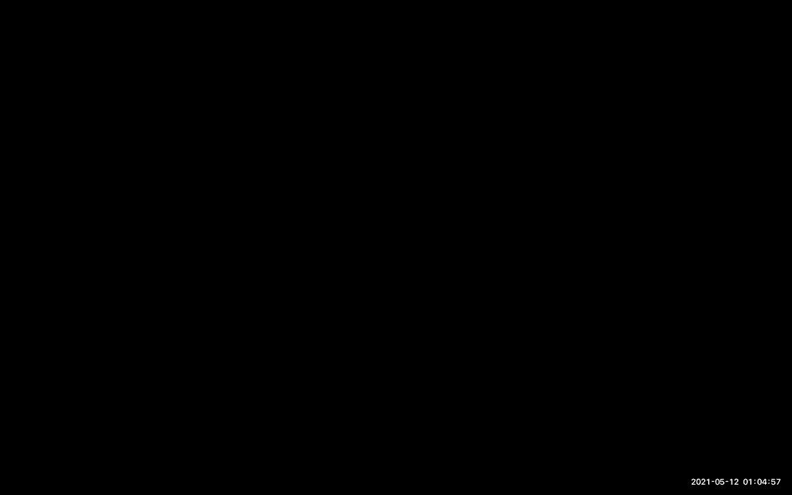
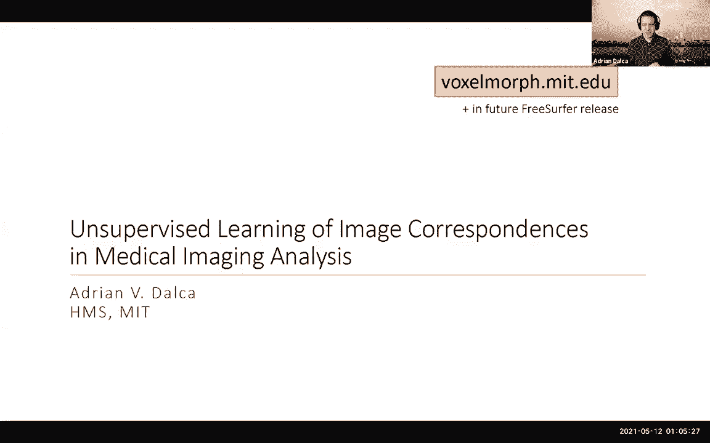
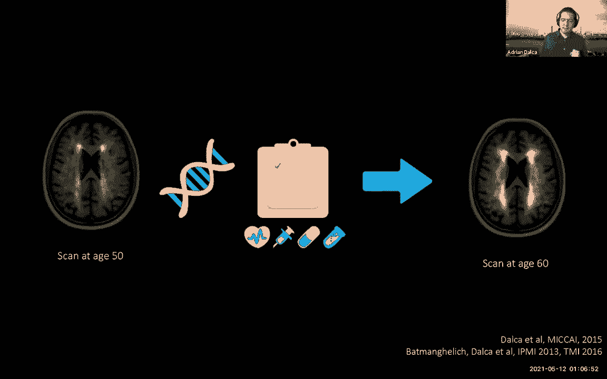
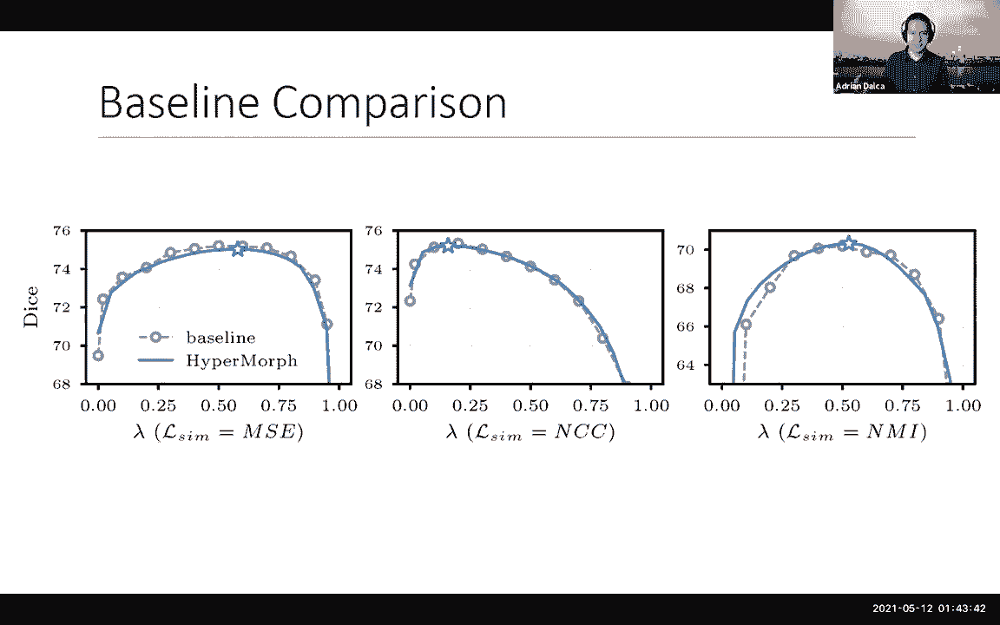
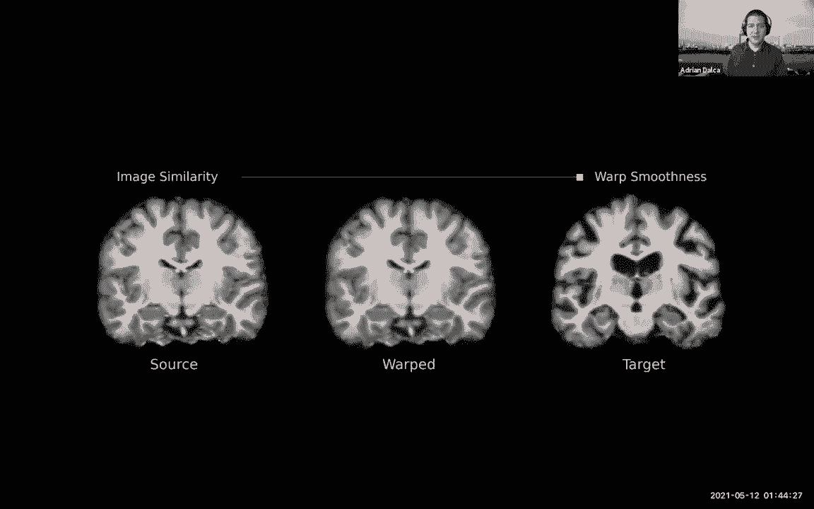
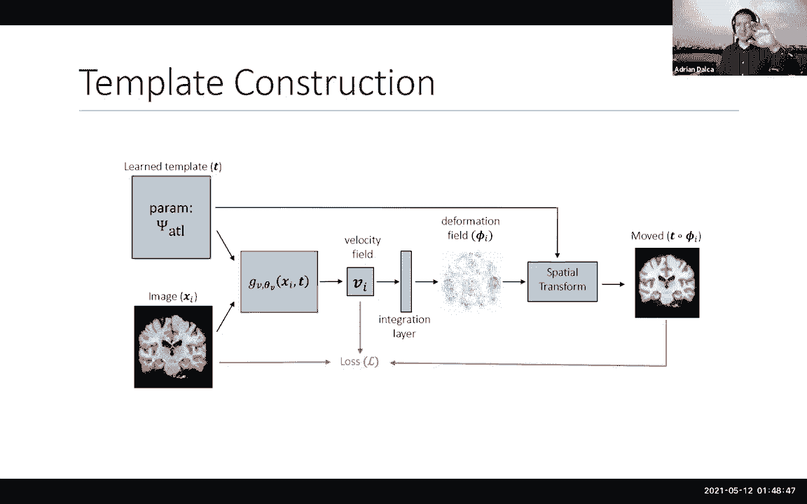
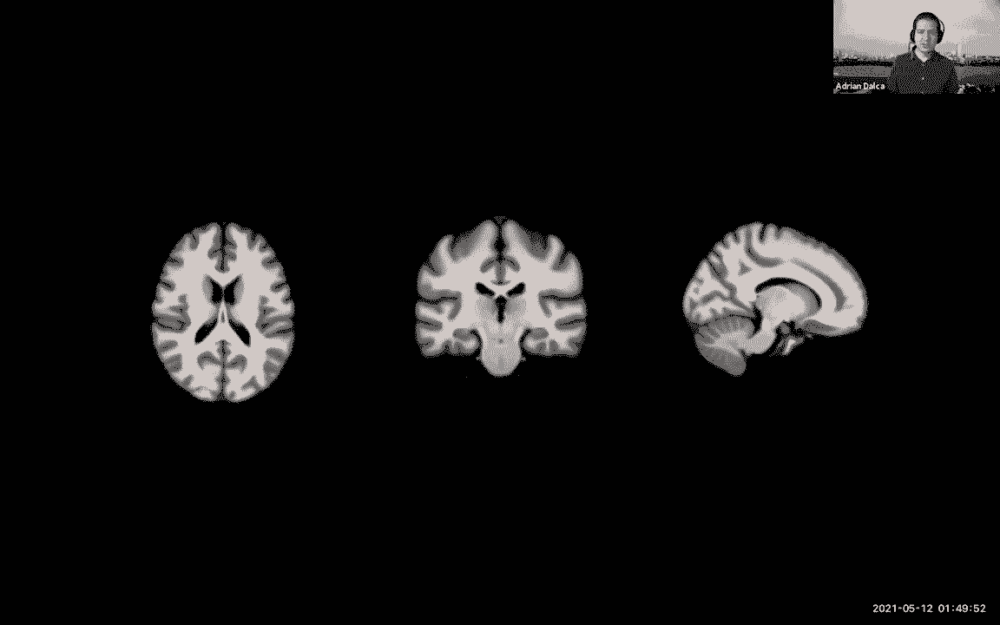
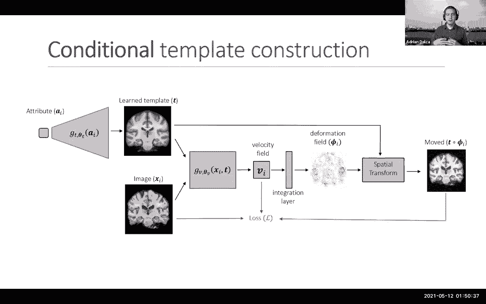
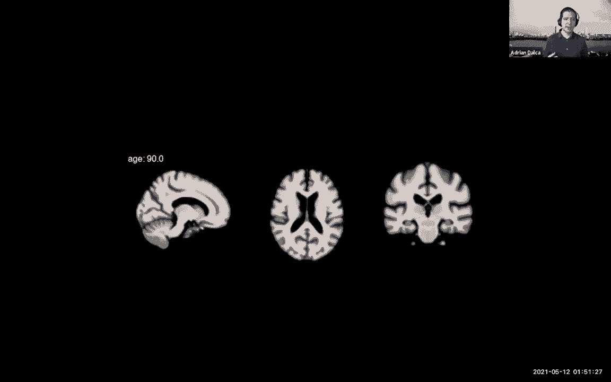

# 20：深度学习图像配准与分析 🧠📊

在本节课中，我们将学习如何利用深度学习技术进行医学图像配准与分析。我们将从核心概念出发，探讨如何将经典配准问题转化为可学习的神经网络任务，并介绍一系列提高模型鲁棒性、灵活性和效率的先进方法。

---

## 图像配准的核心问题与经典方法

上一节我们介绍了课程概述，本节中我们来看看图像配准要解决的核心问题。

医学图像提供了大量关于人体解剖结构的信息。在研究中，我们通过分析医学图像来识别特定结构、捕捉随年龄或疾病发生的变化、建立解剖学与临床结果的关联，甚至预测大脑的未来形态。所有这些分析的核心操作，是将图像对齐到一个共同的参考坐标系中。

图像配准问题可以表述为：给定两个图像（通常是三维体数据），目标是找到一个**变形场**。这个场在每个位置都包含一个小箭头，指示如何移动一个图像（源图像）的像素，使其与另一个图像（目标图像）匹配。

**公式表示**： 寻找变形场 φ，使得变形后的源图像 I_s ∘ φ 与目标图像 I_t 尽可能相似。

这个问题至关重要，因此人们已经进行了数十年的研究。经典方法将其归结为一个优化问题：我们希望找到的变形场 φ 应具备两个特性。
1.  **图像匹配**：变形后的源图像应与目标图像相似。
2.  **场平滑**：变形场本身应该以某种方式保持平滑（正则化）。

**优化目标**可以概括为：
`L_total = L_similarity(I_s ∘ φ, I_t) + λ * L_smooth(φ)`
其中，λ 是权衡两项损失的超参数。

然而，经典优化方法速度很慢，处理一对三维图像可能需要数小时，这严重限制了复杂模型的开发和应用。

---

## 基于学习的配准：VoxelMorph 框架

上一节我们了解了经典配准方法的瓶颈，本节中我们来看看如何用深度学习来加速这一过程。

大约三年前，基于学习的方法开始尝试解决速度问题。这些方法将配准视为一个“黑箱”问题：输入一对图像，通过神经网络直接输出变形场。最初的思路是**监督学习**，需要大量“图像对-真实变形场”数据来训练网络。但获取真实的变形场标注极其困难且昂贵。

我们的方法转向了**无监督学习**。我们借鉴经典配准的损失函数思想，但将其用于训练神经网络。核心思想是：我们向网络输入随机的图像对，网络输出一个变形场 φ。我们使用与经典方法类似的损失函数来评价这个场的好坏，但关键是我们**不优化单个 φ**，而是**优化整个神经网络的参数**，使其能为任何输入图像对都产生低损失的变形场。

以下是实现这一框架的关键步骤：
1.  **网络架构**：通常使用U-Net等编码器-解码器结构，输入是拼接在一起的源图像和目标图像，输出是密集的变形场。
2.  **损失函数**：包含图像相似性损失（如均方误差 MSE 或归一化互相关 NCC）和变形场平滑损失（如基于空间梯度的正则化）。
3.  **图像变换**：通过网络输出的变形场 φ 对源图像进行空间变换，这一操作（如线性插值）需要是可微的，以便梯度可以回传。
4.  **训练**：使用随机梯度下降法在大量未标注的图像数据上优化网络参数。

这个方法被称为 **VoxelMorph**。其优势在于，训练完成后，配准只需一次前向传播，在CPU上耗时不到一分钟，在GPU上不到一秒钟，速度实现了数量级的提升。

---

## 效果验证与小样本学习

我们如何知道VoxelMorph是否真的工作良好？除了视觉上检查解剖结构（如脑室、海马体）是否对齐，我们还需要定量评估。

我们通过分割好的解剖结构标签来计算**戴斯相似系数（Dice Score）**，以衡量重叠度。实验表明，VoxelMorph在配准精度上与需要数小时优化的经典方法相当，但速度极快。

一个常见问题是：需要多少数据来训练这样的网络？我们分析了使用不同数量图像（10, 25, 50, 100张）训练模型的效果。发现即使只有10张图像，模型也能达到接近最先进方法的性能。虽然不完美，但我们可以将其输出作为初始值，再进行短暂的（例如20秒）经典优化微调，就能获得最优结果。这使得该方法对于只有少量数据的研究也非常实用。

---

## 针对特定结构的配准

在实践中，研究者可能只关心某个特定解剖结构（如海马体）的精确对齐。经典方法需要在测试数据中手动标注该结构来引导配准，这在大规模研究中不现实。

我们的解决方案是：在**训练阶段**，除了图像，我们向网络提供一些带有解剖标签的数据（但不需要所有训练数据都有标签）。我们在损失函数中增加一项，要求网络在输出变形场时，也要确保这些已知的解剖标签能够对齐。这样，网络在学会通用配准的同时，也隐式地学习了这些结构的位置和形态。

在**测试阶段**，我们只需要输入图像，网络就能自动地、更精确地对齐我们关心的结构。实验证明，这种方法能显著提升在特定解剖区域上的配准精度。

---

## 提高模型鲁棒性：处理多模态图像

医学影像存在多种模态（如T1, T2, FLAIR等），同一大脑在不同模态下看起来差异很大。一个在特定模态上训练的配准网络，可能无法泛化到其他模态。

为了解决这个**域适应**问题，我们提出了 **SynthMorph** 方法。其核心思想是：通过模拟生成极其多样化和不现实的图像数据来训练网络，使网络暴露在远超真实数据范围的变异中，从而迫使它学习到对图像对比度（强度）**不变**的特征，只关注解剖形状信息。

以下是生成模拟数据的流程：
1.  从公开的脑图谱中获取解剖标签图。
2.  随机变形这些标签图，生成多样的解剖形状。
3.  在变形后的不同标签区域内，填充随机的强度值，并添加各种噪声、伪影等效果，模拟不同模态甚至“非真实”的图像。

网络在训练时只看到这些模拟的图像对，但我们可以通过检查它是否对齐了已知的标签图（我们在模拟时是知道的）来监督它。最终，网络学会了忽略强度差异，只根据形状进行配准。

实验表明，用SynthMorph训练的模型，不仅在见过的模态上表现良好，在从未见过的全新模态图像上进行配准时，也展现出卓越的鲁棒性，性能显著优于在单一模态真实数据上训练的模型。

---

## 超参数自适应：HyperMorph

无论是经典方法还是学习式方法，配准都有一个关键超参数 λ，它控制着图像匹配损失与变形场平滑损失之间的权衡。手动调整 λ 非常耗时。

我们提出了 **HyperMorph**。其思路是训练一个“超网络”，该网络以超参数 λ 的值作为额外输入。在训练过程中，网络会看到不同的 λ 值，并学习根据 λ 的值来调整其行为（例如，当 λ=0 时，输出尽可能匹配图像但不平滑的场；当 λ 很大时，输出非常平滑但匹配度可能稍差的场）。

**技术实现**：我们使用一个小的超网络，输入 λ 值，输出主配准网络（如VoxelMorph）的部分或全部权重。这样，一个单一的HyperMorph模型就涵盖了整个 λ 值范围内的行为。

这意味着：
*   **训练一次**：只需训练一个模型，而非多个不同 λ 的模型。
*   **实时调整**：在推理时，用户可以像调节旋钮一样实时改变 λ，并立即看到配准结果的变化。
*   **事后优化**：可以在一个小验证集上自动搜索针对当前数据或任务的最佳 λ，而无需重新训练模型。

实验证明，最优的 λ 值会因数据集、患者群体、配准任务类型甚至关心的解剖区域不同而变化。HyperMorph 提供了一种灵活高效的解决方案。

---

## 联合学习图谱与配准：条件化模板构建

在许多研究中，我们需要将所有数据对齐到一个公共模板（图谱）上。构建一个好的模板通常是一个迭代、耗时的过程。

我们思考：既然配准网络已经看到了大量数据并学会了对齐，能否让它同时**学习最优的模板**？我们扩展了VoxelMorph框架，让网络在学会将图像配准到一个隐式模板的同时，也估计出这个模板图像本身。网络从数据中直接学习出最具代表性的公共参考框架。

更进一步，当数据集中包含不同属性的个体（如不同年龄）时，单一模板可能不是最佳表示。我们提出了 **条件化模板构建**。

我们让网络学习一个函数，该函数以属性（如年龄）为条件，生成对应的模板。在训练时，我们向网络输入图像以及该图像对应的属性（如年龄）。网络逐渐学会建立一个平滑变化的、依赖于年龄的模板序列。

这样，我们可以得到从青少年到老年的连续变化的脑图谱，清晰展示如脑室随年龄增长而扩大等解剖变化。这一切仅从数据中学习得到，无需预先定义任何解剖变化模型。

---

## 总结

本节课中我们一起学习了深度学习在医学图像配准与分析中的革命性应用。

我们从经典的优化配准方法出发，介绍了如何通过无监督学习框架 **VoxelMorph** 将配准速度提升数个数量级。我们探讨了如何在小样本数据下应用该方法，以及如何使其专注于对齐特定解剖结构。

接着，我们深入研究了提高模型实用性的关键进展：使用 **SynthMorph** 通过模拟极端多样化的数据来解决多模态图像的域适应问题，使模型对未见过的图像类型具有强鲁棒性；通过 **HyperMorph** 将超参数调节过程融入网络本身，实现了配准行为的实时、灵活控制。

最后，我们展示了如何将配准与模板构建统一在一个框架内，并实现**条件化模板学习**，从而能够从数据中直接学习出随连续属性（如年龄）平滑变化的解剖图谱。

这些方法不仅解决了配准本身的速度和精度问题，更重要的是，它们改变了我们进行医学图像分析的研究范式，为下游的形态学分析、疾病建模和临床应用打开了新的道路。