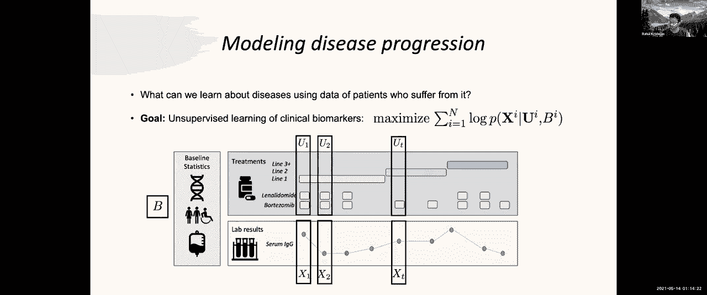
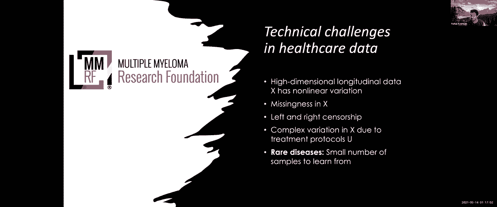

# 21：第22讲 - 电子健康记录 📊

在本节课中，我们将学习如何利用机器学习对电子健康记录（EHR）数据进行建模，特别是针对疾病进展的建模。我们将探讨数据的特点、建模的挑战，以及如何结合领域知识设计更有效的深度生成模型。

---

## 概述

电子健康记录数据的数字化进程，尤其是在美国，自2008年至2015年间迅速增长。这主要是由行政压力驱动，旨在更好地追踪医院系统的支出。然而，这一过程带来了一个有趣的后果：我们拥有了大量关于患者的数据，包括医学影像、住院监测、实验室结果甚至移动设备收集的健康信息。这促使了“医疗保健机器学习”这一领域的兴起，其核心问题是如何利用这些数据做出有意义的发现。

从广义上讲，该领域的工作主要围绕两个方面展开：一是通过对数据进行无监督学习，探索数据中存在的子结构，这些子结构可能与未来的临床结果相关；二是构建工具来辅助临床医生的工作流程。此外，还存在一种称为“疾病登记处”的特定数据集，它由非营利组织发布，专注于某一种疾病，为研究人员提供了更集中的数据来研究特定问题。

---

## 疾病登记处数据介绍

疾病登记处数据集通常包含以下信息：

*   **基线特征**：包括人口统计学信息、遗传数据（如RNA测序）以及基线实验室生物标志物。
*   **纵向数据**：患者随时间推移产生的数据，例如多次就诊记录。
*   **治疗信息**：记录患者接受的治疗方案，通常以“治疗线”的形式组织。一线治疗是初始的标准方案，若效果不佳，则可能升级为二线或三线治疗。
*   **实验室结果**：随时间变化的生物标志物测量值，这些数据通常存在缺失和噪声。

这类数据虽然包含了患者丰富的表型信息，但处理起来非常复杂，需要应对数据缺失、噪声等问题。

---

## 疾病进展建模问题

疾病进展模型通常被视为一个无监督学习问题，旨在对临床生物标志物的纵向序列进行建模。

具体而言，模型的目标是最大化给定患者基线特征和治疗历史条件下，观察到其临床生物标志物序列的概率。用公式表示，即最大化以下对数似然：

**log P(X | A, B)**

其中：
*   **X** 代表随时间变化的临床生物标志物序列。
*   **A** 代表基线协变量（如人口学特征）。
*   **B** 代表随时间进行的干预或治疗序列。

---

## 建模挑战与动机

我们将在多发性骨髓瘤（一种罕见的骨髓癌）的背景下探讨条件密度估计问题。这种罕见病带来了独特的建模挑战：

1.  **样本量少**：由于疾病罕见，可用于学习的数据样本非常有限。
2.  **高维非线性数据**：纵向生物标志物数据维度高，且随时间呈现非线性变化。
3.  **数据缺失**：包括常规缺失和因患者退出研究导致的“右删失”数据。
4.  **治疗影响**：生物标志物的变化不仅受其自身历史影响，也受治疗方案的影响。

上一节我们介绍了疾病进展建模的基本问题，本节中我们来看看解决这些问题可能面临的挑战。

---

## 建模工具选择

面对条件密度估计问题，我们有哪些工具呢？

以下是几种可能的模型选择：

*   **递归神经网络（RNN）**：擅长处理序列数据，可用于建模条件概率分布 `P(X | A, B)`。
*   **隐马尔可夫模型（HMM）及其变体**：如高斯状态空间模型，提供了另一种序列建模框架，其方程描述了状态如何演化并生成观测值。

然而，线性模型可能不足以捕捉数据的非线性动态。因此，深度生成模型，如深度马尔可夫模型（DMM），成为一个有吸引力的选择。DMM 使用神经网络来参数化潜在状态的转移函数和观测函数。

该模型的生成故事如下：从一个初始潜在状态 `z1` 开始，它生成初始观测 `x1`。随后，医生介入并开具治疗，这通过转移函数影响潜在状态，使其演变为 `z2`，进而生成新的观测 `x2`，如此循环。

模型参数通过最大似然估计进行学习，并利用变分推断和推理网络来近似棘手的后验分布。

---

## 融入领域知识

我们之前讨论的工具（如RNN和DMM）是强大的黑盒模型，但在数据稀缺时容易过拟合。而传统的线性模型（如状态空间模型）虽然在该领域有悠久历史，却无法捕捉非线性动态。

因此，我们提出的核心问题是：能否找到一个折中方案，通过融入领域知识来设计更有效的深度生成模型？

这项工作主要关注两种类型的领域知识：

1.  **治疗路线**：用“全局时钟”（治疗总时长）和“局部时钟”（距重大进展事件的时间）来增强治疗表示。
2.  **药物作用机制**：借鉴药代动力学/药效学（PK/PD）模型的思想，来近似药物组合（鸡尾酒疗法）对患者潜在状态的影响。

我们设计了三种受不同PK/PD模型启发的神经结构，并通过注意力机制将它们组合起来，形成一个统一的转换函数，我们称之为 **SSM-PKPD** 模型。

---

## 实验与结果

我们将 SSM-PKPD 模型应用于一个包含约1000名多发性骨髓瘤患者的数据集。数据包括16个纵向生物标志物、9种治疗方式以及16个基线特征。

我们与多个基线模型进行比较：

*   **线性状态空间模型（Linear）**
*   **非线性状态空间模型（Nonlinear）**
*   **专家混合状态空间模型（SSM-MoE）**
*   **基于注意力的状态空间模型（SSM-Attn）**

评估指标是负变分下界（负对数似然的近似），数值越低表示模型泛化能力越好。

实验结果如下：

*   在不同训练集规模下的半合成数据上，SSM-PKPD 比线性和非线性基线模型表现出更好的泛化性能。
*   在真实多发性骨髓瘤数据上，SSM-PKPD 在大多数成对比较中取得了更优的负对数似然。
*   消融分析表明，收益部分来源于模型更好地捕捉了特定生物标志物（如血清IgG）的非线性动态，以及全局和局部时钟的有效性。

此外，对模型潜在空间的探索显示，它能够学习到与治疗线相关的有意义的结构。

---

## 总结与未来方向

本节课中，我们一起学习了如何为电子健康记录数据，特别是疾病进展数据，进行条件密度估计。

我们面临的挑战包括数据稀缺、缺失和非线性。传统方法要么容易过拟合，要么表达能力不足。我们的解决方案是深入思考数据生成过程，并将领域知识——特别是关于治疗路线和药物作用机制的知识——融入模型设计。这催生了新的 SSM-PKPD 模型，并在多发性骨髓瘤患者数据上展示了其改进的泛化能力。

从这项工作中可以获得的更广泛启示是：在设计生成模型时，值得深入思考数据背后的生成机制，并与领域专家合作，将他们的知识直接编码到模型中，从而使模型能更专注于学习数据中更复杂的方面。

未来工作可能包括：

*   在更大规模的独立患者队列中验证模型。
*   探索将模型用于临床决策支持工具，例如预测生物标志物轨迹以辅助治疗调整。
*   扩展模型以进行反事实推理，即预测如果改变治疗方案会有什么结果。
*   将模型整合到强化学习框架中，用于优化治疗策略。

总之，在医疗保健机器学习领域，特别是在临床数据建模、结果预测和多模态数据融合方面，仍然存在大量令人兴奋的研究机会。

---
**感谢阅读本教程！**