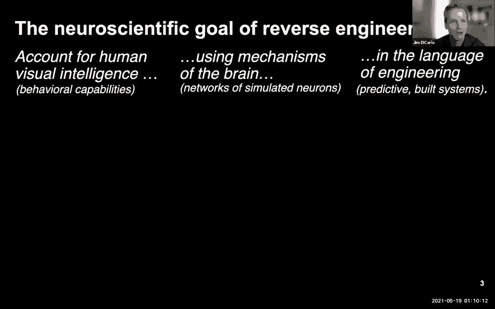
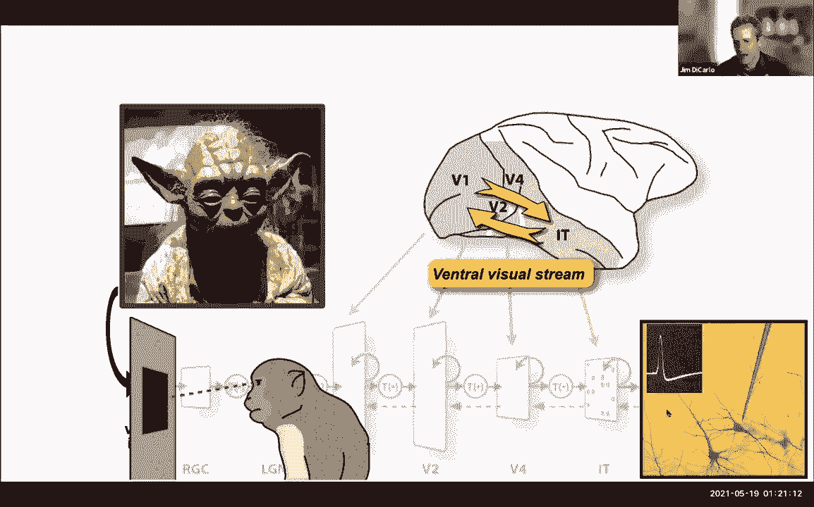
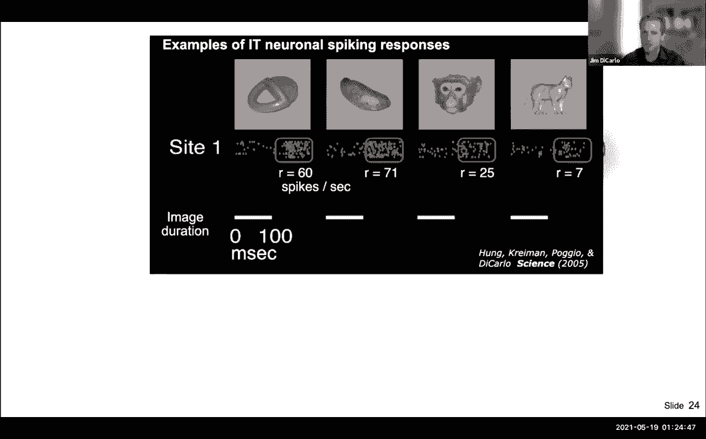
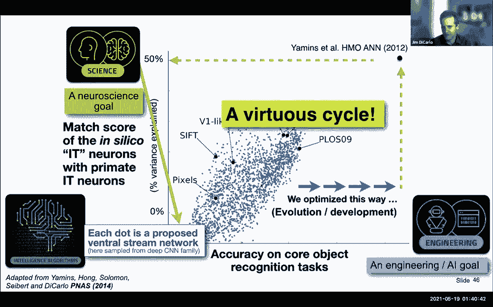
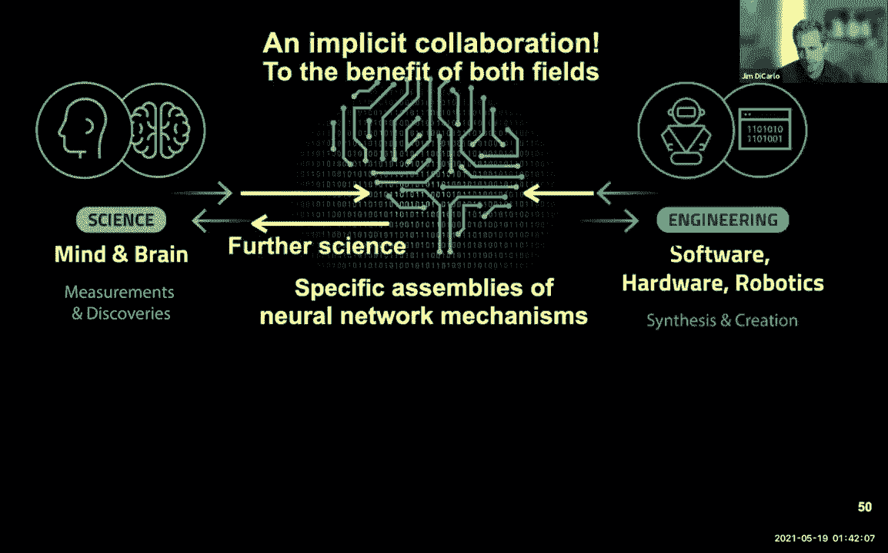
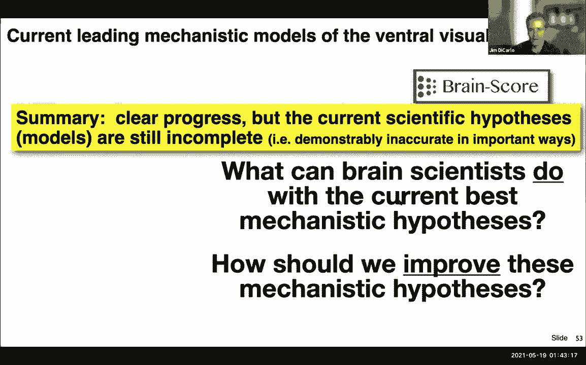
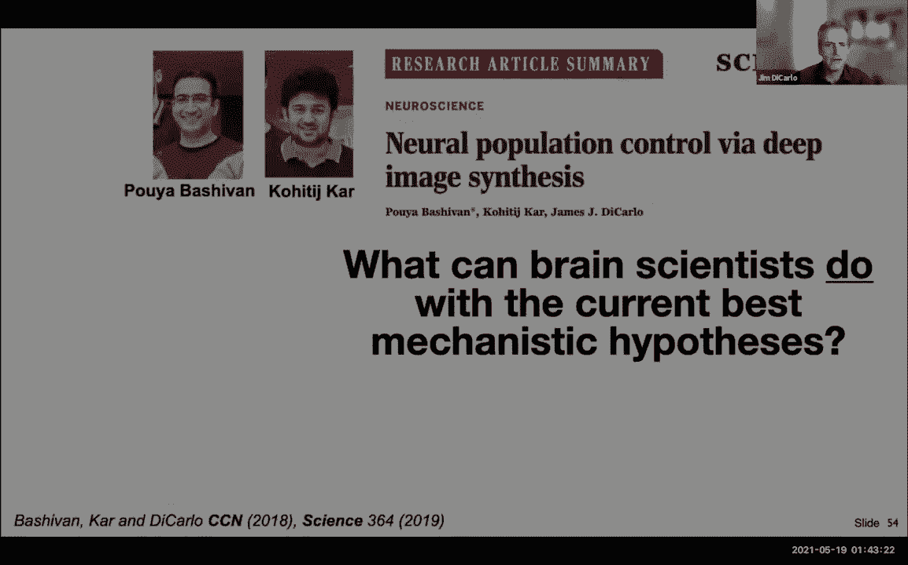
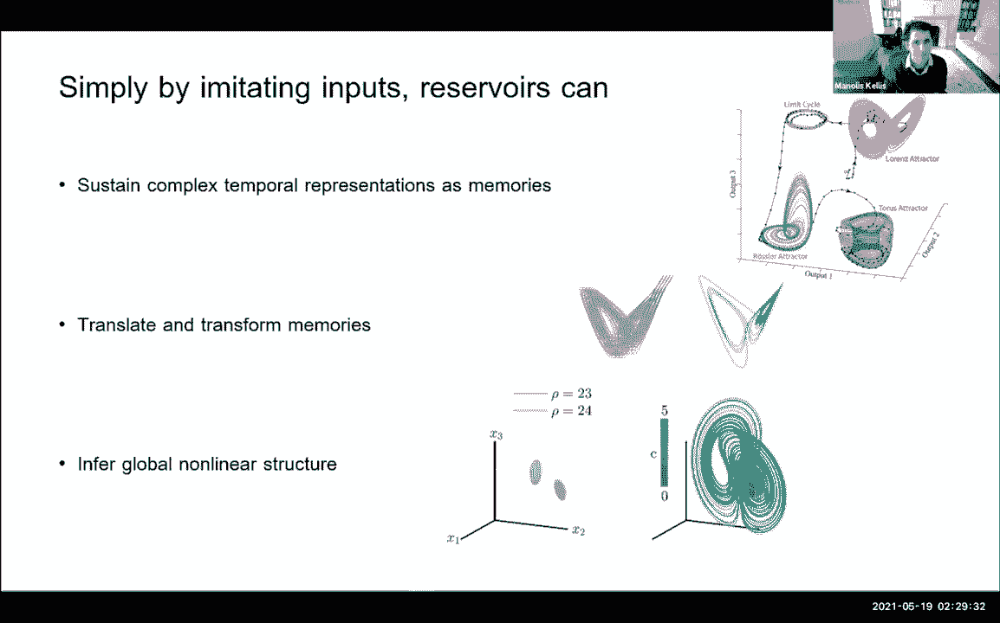

# 22：第23讲 - 深度学习与神经科学 🧠

在本节课中，我们将探讨深度学习与神经科学之间的深刻联系。我们将了解如何将深度网络视为关于大脑功能的科学假设，并回顾神经科学如何启发并受益于深度学习的发展。课程将涵盖从视觉系统研究到循环神经网络中记忆与计算的前沿探索。

---

## 概述：逆向工程人类智能 🎯

本次讲座的核心目标是理解如何“逆向工程”人类的数字智能，特别是视觉智能。我们希望用机制性的语言来解释人类如何根据输入的光子模式（例如视觉图像）产生智能行为输出。这本质上是在探索大脑——一个由模拟神经元组成的深层循环网络——如何工作。

上一节我们介绍了课程的整体目标，本节中我们来看看逆向工程方法的具体内涵。

神经科学的目标是解释人类智力的所有方面。当我们聚焦于“人类视觉智能”时，指的是由进入眼睛的光子输入所驱动的、可被观察到的行为能力。我们希望这种解释能用工程语言描述，即具体说明执行该功能的神经网络的参数，从而构建可预测、可与数据比较的系统。

这引出了三个互相关联的方面：
1.  **经验科学（神经科学与认知科学）**：从行为或大脑测量中观察现象。
2.  **合成工具（工程学）**：构建深度网络、机器人系统或算法。
3.  **深度人工网络作为科学假设**：将特定的深度网络视为关于大脑功能如何运作的假设，并用神经科学数据对其进行评估。

令人兴奋的是，源于科学和工程的这两种方法正在汇聚，特别是深度人工网络已成为理解视觉系统（以及听觉系统等）功能的主要假设。

---

## 历史背景与核心问题 🔍

为了理解我们如何走到今天，需要一些历史背景。研究视觉智能时，我们面临一个难题：输入是击中眼睛的约百万像素的亮度阵列，而大脑却能推断出场景中的物体（如汽车、人）并预测接下来可能发生的事。

然而，从生物学可知，人类视觉并非一次性处理整个场景。视野中心约10度范围内具有高敏锐度，我们通过快速的眼球运动（眼跳）来采样场景，在每个位置停留约200毫秒。因此，我们可以将问题简化为研究在每一“瞥”（约10度、200毫秒的快照）中，大脑如何识别其中的核心物体（如汽车或人）。

以下是研究中使用的一种行为测试方法：
*   向受试者快速闪现图像（约100毫秒）。
*   要求受试者判断图像中的物体类别（例如，“更像鸟还是大象？”）。
*   通过测量成功与失败的详细模式，来量化人类（及其他灵长类动物）的视觉识别能力。

研究发现，人类与恒河猴在核心物体识别任务上的表现非常相似。当前的计算机视觉系统虽然与人类的差距正在缩小，但尚未完全赶上。这种差异正是我们感兴趣的，因为它可能揭示人类大脑独特的工作机制。

---

## 腹侧视觉流：大脑的“深度网络”区域 🧬

当执行核心视觉识别任务时，大脑并非只有一个区域在工作。涉及一系列被称为“腹侧视觉流”的皮层区域。这些区域位于大脑底部，从初级视觉皮层（V1）到高级的颞下皮层（IT），形成一个具有前馈和反馈连接的深层网络。

以下是关于腹侧视觉流的关键事实：
*   **层级结构**：信息从V1、V2、V4流向IT皮层，IT被认为是处理物体识别的高级区域。
*   **功能**：损伤这些区域会导致物体识别任务缺陷。
*   **时间尺度**：从图像呈现到IT皮层产生神经活动模式，大约有100毫秒的延迟，这与行为采样的时间尺度（约200毫秒/瞥）相匹配。

我们如何知道这些？主要通过侵入性电生理记录来研究。例如，在恒河猴的IT皮层植入记录电极，当呈现图像时，可以记录到单个神经元的放电活动（尖峰）。不同图像会引发不同神经元产生不同的放电模式。

通过平均放电率，我们可以将每个神经元对每个图像的响应量化为一个数字。使用慢性记录阵列，我们可以同时记录数百个神经元位点对成千上万张图像的响应，从而获得大规模的神经活动数据集。

---

## 从神经活动到行为：强大的特征空间 📊

一个重要的发现是：IT皮层的神经群体活动构成了一个强大的特征空间。如果在这个神经活动模式上训练一个简单的线性解码器（分类器），即使只用少量图像训练，它也能很好地推广到新图像，并且其产生的行为错误模式与人类和猴子的行为错误模式高度相似。

这意味着，在完成核心识别任务时，IT皮层似乎已经解决了大部分计算上困难的问题，其表征空间近乎线性可分。这不仅说明了该神经表征的强大，也使其成为脑机接口（如通过刺激引发特定感知）和人工智能模型构建的宝贵灵感来源。

因此，核心问题变成了：**图像是如何经过一系列非线性变换，最终形成IT皮层中这种强大的神经表征的？** 这正是深度网络可以建模的过程。

---

## 深度卷积网络作为视觉系统的假设 🤖

视觉神经科学的许多发现直接影响了深度学习架构的设计。例如：
*   **边缘滤波器**：V1区神经元对特定方向的边缘响应，这类似于卷积神经网络中的卷积核。
*   **卷积结构**：滤波器在视野中的平铺特性，启发了卷积操作。
*   **归一化**：视觉系统中的增益控制机制，类似于网络中的归一化层。

因此，一个深度卷积网络在结构上就与已知的腹侧视觉流解剖结构相似。早期的神经科学启发模型（如HMAX）是假设，但它们在预测真实神经数据方面表现不足。

关键的突破来自于将**工程优化**引入到受神经科学启发的架构中。具体方法是：
1.  构建一个深度卷积网络（作为假设的架构）。
2.  让其执行核心物体识别任务（定义目标）。
3.  使用反向传播等优化方法调整网络参数，以完成该任务（工程工具）。
4.  优化完成后，固定网络参数，将其视为一个具体的“人工腹侧流”模型。
5.  将模型的内部神经元活动与真实大脑（如猴子的V1、V4、IT区）记录的神经活动进行一对一的定量比较。

研究发现，经过任务优化的深度网络，其内部表征与真实大脑各层级（V1, V4, IT）的神经活动模式相似度显著高于早期模型。这意味着，通过结合神经科学的架构指导和工程化的性能优化，我们得到了更接近大脑工作机制的假设模型。

---

## 循环神经网络与类脑计算 💭

视觉系统主要是前馈处理，但大脑的许多高级功能（如工作记忆、规划、推理）依赖于循环连接。循环神经网络因其具有内部状态（记忆）和动态特性，成为模拟这类功能的强大工具。

真正的神经系统擅长操纵内部表征。例如：
*   **海马体中的位置细胞**：不仅能编码当前位置，还能在老鼠行动前“规划”未来的运动轨迹。
*   **鸣禽的歌声学习**：通过模仿形成复杂的时间序列记忆，并能通过冷却特定脑区来线性改变歌声时长。

研究问题是：**RNN如何仅通过观察示例，就学会存储、修改和操纵复杂的记忆（如混沌吸引子）？**

一种方法是使用“储备池计算”框架。通过将记忆（如洛伦兹吸引子的时间序列）作为输入驱动储备池，然后仅训练一个线性输出层来重建输入。之后，用输出反馈替代外部输入，网络就能自主地演化出该记忆。

更神奇的是，如果我们在训练时将不同的记忆（如平移或扭曲后的吸引子）与不同的“上下文”控制信号关联，训练后的网络能够学会根据控制信号的值，对其内部记忆表征进行**插值和外推**，甚至能预测从未见过的、复杂的动力学分岔行为。

这背后的机制是，网络在学习重建输入的同时，其输出权重矩阵也隐式地学习了内部状态变化与期望表征变化之间的微分关系。这展示了RNN通过简单模仿来学习复杂表征操作和计算的巨大潜力。

---

## 总结与展望 🚀

本节课我们一起学习了深度学习与神经科学之间丰富的双向互动：

1.  **深度网络作为假设**：我们将深度卷积网络视为关于腹侧视觉流如何工作的可测试假设。通过结合神经科学架构与工程优化，得到的模型能更好地预测大脑神经活动。
2.  **神经科学启发AI**：对视觉皮层的研究直接催生了卷积网络等关键架构思想。
3.  **循环网络与高级认知**：RNN展示了通过模仿学习来获得工作记忆、操纵内部表征和进行预测的强大能力，为理解更高级的脑功能提供了框架。
4.  **未来方向**：当前的模型仍不完美，例如缺乏足够的循环连接。差异之处正是指导未来研究的线索。通过持续整合更真实的神经约束（如连接性、动力学）和开发新的优化目标，我们有望构建更接近大脑的模型，这不仅能深化我们对智能的理解，也将推动人工智能的进步。

最终，我们应开始将神经网络视为具有内在动力和状态的“活”的系统，而不仅仅是函数逼近器。理解这些系统如何通过与世界互动来学习、记忆和规划，是通向通用人工智能和理解我们自身心智的关键一步。