# 【双语字幕】MIT《面向生命科学的深度学习》课程(2021) by Manolis Kellis - P10：Lecture 10 -Single Cell Genomics - 爱可可-爱生活 - BV1wV411q7RE

顺便说一句，所以呃，欢迎，欢迎大家，所以今天我们要潜入，呃，单细胞基因组学，我们很幸运有两位客座讲师是费边，罗马·洛佩兹的Thand，所以我们要谈谈为什么单细胞，为什么传统方法，呃，你知道不一定管用。

我们是如何想出现代单细胞RNA测序的，我们将讨论单细胞技术是如何进化的，并通过三种不同的主要途径使我们发展到今天的技术，然后我们将讨论如何超越rna，单细胞攻击，单细胞水平上的I与多组学。

然后我们要谈谈如何处理噪音，双细胞和其他单细胞问题，然后我们将对单细胞数据中的不同计算挑战进行分类，分析并谈一些新兴的单细胞数据深度学习方法，但接下来的大部分时间都将花在我们的两个客座讲座上，呃。

开发DCA的法比安·泰国人，所以让我们直接潜入，那么为什么单细胞分析，原因是单个细胞彼此之间有很大的不同，即如果你看单元格，你知道在身体里还是电镀的，它们是非常不一样的，他们是，他们不一样，因为他们。

呃，环境刺激，它们是不同的，因为它们的相互作用，他们不一样，因为它们处于细胞周期阶段，因为他们正在经历转录的爆发，所以每个细胞实际上都有很大的不同，所以当你查看大量数据时，很难了解这些细胞的多样性。

有几种也是不同的，因为它们的分化轨迹，如果你看看造血干细胞谱系，它沿着非常不同的路径区分，当你往下走的时候，几乎有一个连续的细胞身份，微分时间进程，单个细胞之间也有巨大的差异。

即使在特定的给定单元格类型中，信令可能会有很大的不同，因为，比如说，每个细胞表面表达的信号受体的表达，也是因为信号分子的梯度，呃，以及它们对每个单独细胞的访问，如果你在显微镜下观察单个细胞。

以及它们是如何表达的，呃，特定的受体或特定的因素或特定的反应元件，你看很好，变异性大，最后是癌症，你也有个别癌细胞之间的基因型差异，基本上，肿瘤细胞本身在拷贝数上发生了戏剧性的变化，嗯，你知道吗。

大段复制，或在，你知道吗，个体基因，这就导致了，这些细胞之间的表型多样性，所以当你看大量样本时，你最终会得到某种平均测量，实际上可能并不代表人口，细胞的数量可能有，你知道的，特定基因的高表达或低表达。

平均值可能只是表明，这些基因在中间水平上表达，否则你可能会失去非常罕见的事件，也许一万个细胞中有一个表达RNA，但当它表达它的时候，它以非常大的数量表达它，所以这些是我们想要用单细胞数据捕获的东西。

有许多不同的技术，在当前单细胞数据分析爆炸之前，所以他们中的一些人基本上是在使用实时，实时探测，不同类型的放大，呃，他们有，你知道，具体优点和缺点，其中包括成像技术或单细胞，呃，pcr，放大，放大。

原位测序，它可以让你直接从一个成像场测序rna分子，那些分布在许多细胞中的单个rna分子在哪里，但每一个都有非常不同的限制，所有这些背后的基础技术是，扩增单个RNA的能力。

然后从极小的样本中捕获这些RNA，与DNA形成鲜明对比，每次只有一个分子，rna有许多分子，你可以用这些分子进一步放大，为了得到一个非常稳健的信号，所以这些技术现在已经扩大了规模。

并在许多方面占据了一席之地，你知道的，非常不同的技术来真正扩大规模，通过细胞分选，在那里你基本上可以对单个细胞进行排序，然后把它们放在井里，或者来自微流体。

您可以引导单个单元格进入以及分析它们的正确位置，甚至移液单个细胞，然后通过扩增来分析这些单个细胞的RNA，这就是当你看到单个的单细胞，这里的道路，不同的时间点和不同的，嗯对不起。

单个基因跨细胞在不同的柱上，所以你可以看到跨越时间，不同反应的过程，个体基因是如何打开或关闭的，你可以看到一些基因在的地方，对于所有单元格，其他实际上存在异质性的地方，即使在特定的时间点。

所以如果你现在开始查看行上的单个单元格，和柱子上的单个基因，你基本上可以看到，如果你把一万个细胞放在一起看，你看到rna信号是什么样子的，你可以在这里看到，外显子和内含子的区别。

你可以看到大部分信号来自外显子，这意味着我们正在捕获经过处理的RNA，但在某些情况下，我们也会捕捉未经处理的RNA，中间还在的地方，你可以看到，对于许多基因来说，你可以看到这个非常好的一致性。

单个细胞基本上有足够数量的RNA分子，单个细胞的形状，事实上，再现你在一万个细胞中看到的形状状态，但对于其他基因，你有一个非常不同的画面，是的，有些细胞确实表现出健壮的表达。

但其他细胞对这些基因的表达为零，原因是这些细胞可能根本没有表达，那个特定的RNA分子，所以有很多关于单细胞数据零值的讨论，其中一些确实是技术性的，因为我不知道爆裂，或者因为不能捕获所有的RNA。

在一个小小的准备中，其中许多实际上是生物的，因为单个细胞之间的可变性，单细胞分析的许多挑战是区分这两者，但真正有趣的是，如果你把稳健表达的基因，以及部分表达在很少表达的基因中的基因。

然后你用这些荧光原位杂交技术做探针，在那里你混合了一个探针，与感兴趣的基因互补，你基本上可以看到确实，这里有中间表达式，那里有强烈的表达，那里有强烈但罕见的表达，所以说，事实上。

我们在单细胞数据中看到的实际上是，概述你在生物学中看到的，这些是单细胞水平上相应的丰度分布，所以当你刺激这些细胞时，他们的反应不同，你所看到的是，在，它们很少，显示出很小的可变性，和最可变的基因。

这些基因经常与环境感知有关，防御反应，炎症反应等等，所以这是探测单个细胞的传统区域技术，这些基本上坐在这里，这些是最早的技术，你知道的，一次分析单个单元格，从那以后，我们看到了一个戏剧性的转变。

我们已经扩大了几个数量级，在一个实验中可以研究的细胞数量，我将重点关注的三项技术将是聪明的，SEQ使用基于单元的技术，滴C和十X，它们使用液滴而不是，嗯，对不起，这是有根据的，这是用液滴代替井。

然后分裂，它从来没有真正分离单个细胞，但是想出其他的条形码技巧，所以这个，你知道的，传统的方法是可以的，让我们用移液管把单个细胞放在单独的井里，或者通过显微镜，然后通过荧光，呃，荧光活化，细胞分选。

当细胞流过时，它基本上是在照耀蜥蜴，然后当检测到有特定标记的细胞时，然后选择它们进行单个单元格分析，但你也可以不用选择特定的标记，就像把单个细胞彼此分离的一种手段，也可以用激光捕获显微解剖。

基本上用显微镜捕捉单个细胞，然后对它们进行侧写，你可以用微流体，它把细胞从一边，然后呃，在油介质中形成的来自另一边的液滴，使您现在能够将细胞捕获在一起，以及珠子中的条形码，允许你捕捉你所在细胞的身份。

呃，每一个rna的来源，所以来自同一个细胞的所有RNA，将贴上相同的条形码，然后当然是直接在你所在的地方采血，你可以捕捉单个细胞，而基本技术是基本管道如下，基本上你首先要做的是分离细胞。

所以基本上把细胞困在水凝胶里或其他方法，这就是你在下降搜索中看到的，你知道很多相关的方法，然后你想放大RNA，你想测序，之后您希望使用不同类型的分析，作为你的，你知道的，传真订单，比如说。

可能是选择不同的种群，你可能会把它们插入微流控设备，或者直接将它们捕获成液滴，所以让我们来谈谈这些，呃，单独的技术和每种技术的优势，特别集中在智能TSI下降寻求，然后这些集合方法。

那么Smart Sido Smart主要使用荧光激活细胞，对它进行排序可以捕获五五百个细胞，根据你愿意分析的井的数量，然后每口井大约三美元，你可以分析，你知道每个细胞多达一万个基因，所以这抓住了最多的。

这些细胞中每一个的um基因，但实际上，你为每一个单独的测序反应实验付费，嗯，所以你实际上是在为，你知道500个实验来描述，五百细胞，那么在这项技术上谁和我在一起，所以呃，让我们看看。

所以这个概念是你把每一个细胞分离到一个单独的井里，然后你就可以做得很好，基于实验，就像你一直通过放大rna来做的那样，然后你有唯一的ID和地址，以此类推好吧，所以呃，五九，三个，六，五个，零，零。

第二个技术是，滴，寻求，或基于液滴的技术，所以这里的想法是这样的，你会流动，你知道的，一个微流控室，然后你要用条形码附上它们，对于每一个连接在珠子上的，所以每一颗珠子都有数十万份相同的条形码副本。

在这个微流控装置中，你在有效地捕捉，在一滴，因此，有效地，液滴成为你的井，为你的测序反应，所以你现在捕捉单个细胞，而不是在井里捕捉它们，你把它们捕捉在液滴中，每一滴都有自己的珠子，有一大堆条形码。

他在这方面和我在一起，我们如何用液滴代替井，这些液滴基本上是作为一种分离单个细胞的方式，这样我们就可以在同一个井中标记同一口井的所有RNA，你知道，细胞类型，或抱歉在同一单元格标识中。

所以我们有百分之八十，百分之二十，四零，零，下一步是非常酷的，你现在想避免对每条鲸鱼做单一的测序反应，所以你要做的是非常聪明的，你现在只需捕获所有这些单独的rna分子。

在一个大管子里用相应的细胞身份进行条形码编码，每个人都被他们来自的细胞标记，那些标有红色条形码的细胞，他们的每个RNA上都有一个红色的条形码，但你可以把，你知道的，你可以打破分区。

把所有的条形码RNA放在一起，对你的一万个细胞做一个反应序列，这里的主要区别是你在做一个传统的rna寻找实验，你已经成功地标记了每个RNA来自哪个细胞，所以你基本上有红色的条形码，你就像，哦。

他们都来自同一个牢房，你有绿色条形码，哦，他们都来自同一个牢房，然后是蓝色条形码，哦，他们都来自同一个牢房，好的，所以在事实之后，在做了一次RNA测序反应后，然后你就可以回去了。

并为每一个rna分子分配单个细胞的身份，好的，谁在这件事上支持我，这是一个重要的概念，太厉害了，所以六十四，二七五五，零，所以这是第二个，嗯技术，这是一个非常非常酷的技术，那就是，你知道吗。

我想说迄今为止使用最广泛的技术，所以基本上你知道，十大基因组学，比如说，已经接受了这一点，他们制造了一些套件，你可以用来，你知道吗，在单个实验室进行数百项实验，第三类技术，现在你们会喜欢。

这一个是嗯分裂和分裂采取，基本上说好，我不想打井，我连飞沫都不想做，我只是要洗牌细胞，在一群不同的鲸鱼中，我会有一百个井和一百个条形码，所以我只能把每一个，你知道一百个不同的类别。

然后我会给每个细胞添加一百种不同的条形码，这里真正酷的是，每个细胞都有它所有的RNA在一起，当它通过第一轮条形码时，然后你把所有的细胞拉在一起，你重新分配，然后你就有了，比如说，蓝色细胞洗牌。

现在它得到了绿色的条形码，然后你又洗牌，现在有蓝色条形码的单元格，绿色条形码又被洗牌了，然后你还添加红色条形码，所以你最终会发现每个细胞都有一个独特的100倍的组合，一百次，条形码的一百种不同选择。

所以在第一轮中，它得到了一百个条形码中的一个，第二轮它得到了一百种不同条形码中的一种，在第三轮，它得到了一百种不同的条形码中的一种，所以你可以有一个标记为红色的细胞，另一个细胞被标记为黄绿蓝。

另一个细胞被标记为绿色、绿色、蓝色等等，诸如此类，所以你最终得到的是一个独特的条形码组合，一个接一个地线性添加，对于同一细胞的所有RNA，我从来没有单独分离过细胞，我所确保我所做的。

我拉出并重新分配所有的细胞，在每一口井里，让我们看看到目前为止谁和我在一起，所以我在这里做的是，我不是在创造这些液滴，而是，我只是确保每个细胞都在一起，因为我每次都把它分成不同的井。

每个细胞通过的井的特定顺序，使我能够唯一地区分这些细胞，所以七十三二三五零零，为什么这很酷，这很酷，因为我只需要在最后做一个巨大的测序反应，每个RNA分子都有一组三个条形码，给我十万分之一的一百万。

所以我基本上可以为每个rna分子有一百万个唯一的地址，它基本上告诉我它通过了哪个井的组合，因此它来自哪个单个细胞，所以再一次，这是酒吧下降寻求，这是分裂寻求，你在哪里，基本上你知道洗牌你所有的分子。

然后最后，每个rna分子都有三个条形码，在末尾添加的，使您能够准确地区分它来自哪个细胞，你可以添加更多的分裂，您可以添加，你知道的，四个分裂，基本上捕获一亿个细胞，以此类推，如此如此，主要有三种技术。

井里有牢房，然后是水滴，然后是组合索引，我们可以用于所有这些，我们已经讨论过单细胞RNA测序，但你可以做很多很多不同类型的酸，你基本上可以看到单细胞DNA甲基化，特征分析，单细胞基因组测序。

单细胞dna可达性，特别是单细胞出租车，也就是转置的化验，可溶性染色质，这是最常用的分析方法之一，超越，单细胞rna寻迹，单细胞芯片一次又一次地寻找，我们已经讨论过mrna和10 x分裂搜索和智能搜索。

你可以做伪时间分析，你可以推断空间定位，我们将讨论空间转录组学，在我们的成像讲座中，你可以观察不同的细胞表面蛋白质，不同的细胞内蛋白质，名单还在继续，所以有很多很多不同的化验，我鼓励你，你知道的。

读一下那些，其中最常见的是单细胞attaxi，这基本上告诉你的是，对于每一个单独的细胞，那个牢房现在的可达性是什么，单细胞攻击，它与单细胞RNA搜索有很大的不同，这种差异的原因是我有很多。

在我的细胞里有许多不同的RNA分子副本，但我只有两个基因组副本，所以这基本上意味着我要么拥有这个区域，在一个染色体副本中可以访问，或在另一个染色体副本中可获得，或者在其中任何一个中都无法访问。

或者在其中任何一个中都没有检测到可访问性，这基本上意味着来自单个细胞的数据可能非常，非常稀疏，但是当你把细胞聚集在一起，你最终会得到一个信号，总的来说，看起来就像一辆出租车，或者就像体积一样。

dna是超敏反应图谱，这是非常令人兴奋的，但在每个细胞的单个细胞水平上，您可能没有足够的信息用于每个位置，通过在同一单元的许多位置聚集，你现在有足够的信息来谈论转录因子。

这些因子可能在一个细胞中通常活跃，与另一个细胞，与第三个细胞相比，所以你可以在转录因子变异性的水平上聚合数据，整合单细胞攻击和单细胞RNA的方法有很多，你知道你的一些项目实际上已经，呃，解决这个问题。

所以说，嗯，最近出现了单细胞多组学的方法，可以让你，比如说，分离每个单独的细胞，然后每个单独的井可以有多种不同类型的反应，你可以用我们谈到的许多技术来做到这一点，一直以来，你知道的。

日益出现的单细胞多组学的许多方法，因此，在处理噪声和对偶时，有许多计算上的挑战，然后嗯，我嗯。

你知道的，i，我为你们准备了很多幻灯片，但我鼓励你们看我们以前的一节课，如果你想深入了解不同的方法，但今年我想做的是。

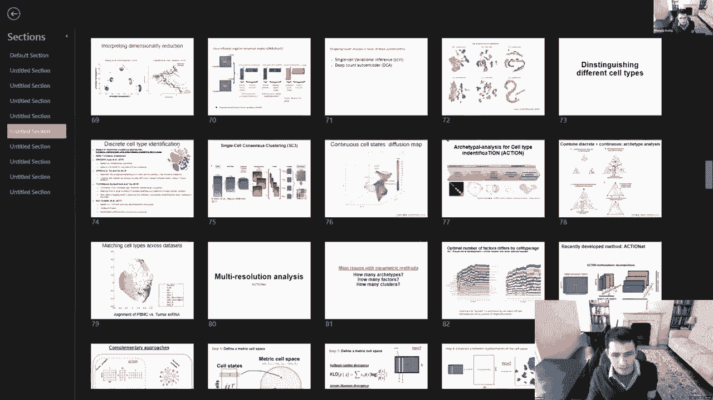

有机会邀请来自世界各地的人实际上是有两个不同的客座讲座。

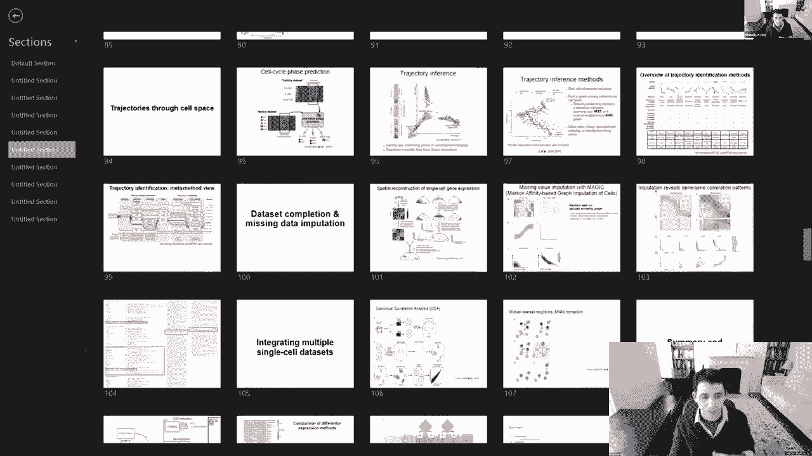

呃横穿，十个不同时区，所以第一个是，从欧洲赶来，法比安，呃，然后第二个实际上是从西海岸进来的。

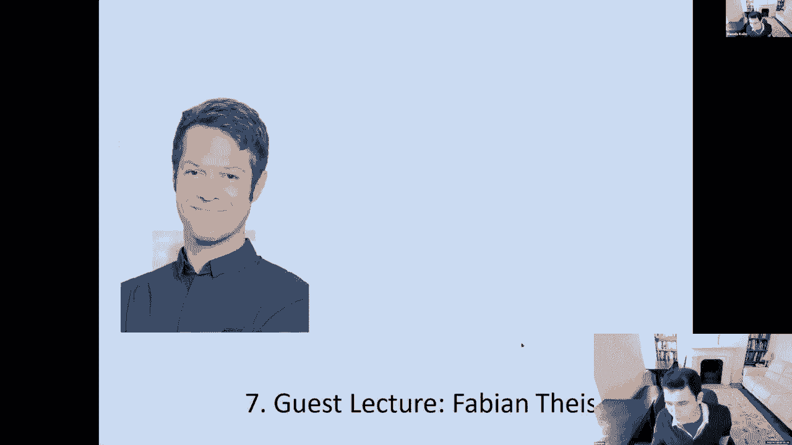

然后呃，i，你知道的，如果生活给你柠檬，你做柠檬水，所以嗯，你知道的，我们彼此相距甚远，但是呃，即使近在咫尺的人最终会走得很远，我们实际上可以把通常离得很近的人带到法比安，很高兴你能和我们在一起。

把它拿走，您可以共享您的屏幕并开始，艾玛在嘿，感谢大家的盛情邀请和有趣的形式，听起来真是个好主意。

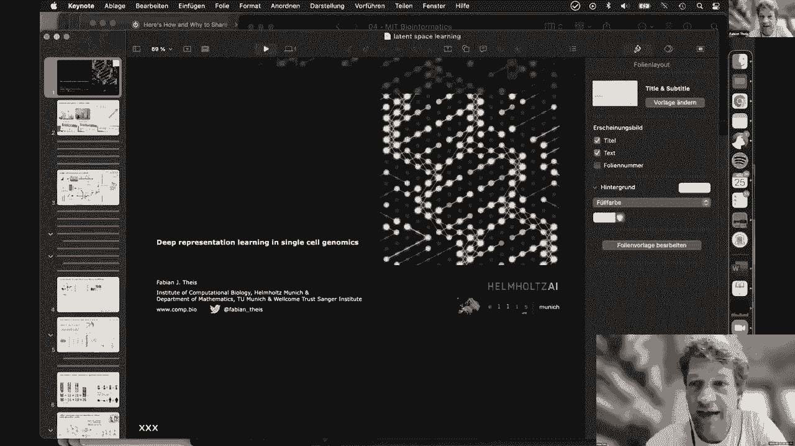

是的，是的，我期待着二十分钟后的大致轮廓，我现在开始，我们一直在贡献的，但也许饲料在做什么，深度再现学习和作为一名记者的事情，我想讲座是，它叫什么，这在生物学中被称为深度学习，就是这样吗。

那是这门课的题目，我们将覆盖这么多不同的颜色，是啊，是啊，我看到了我看到了一堆视频，这真的很酷，我很喜欢，这是一个大师班，对吧，无批次，我猜哈哈哈，因为我印象深刻，我很久以前在麻省理工学院学习过。

我确实上了课，我实际上是布伦南大学，喜欢这个地方，我们喜欢在波士顿，但不幸的是到现在还没有，所以你只要看着我，我会简短地。

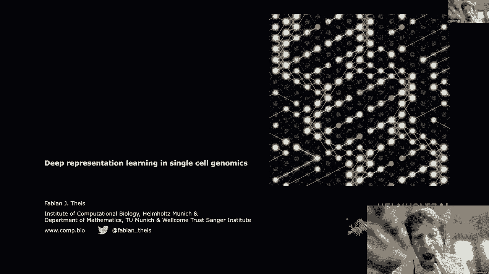

你我不知道你是否显示了我的通知，但你知道，这就是这就是想法，我们现在有奶昔和自行车，你知道我们有点挑剔，食物方面可能已经见过几次了，原因是，比如说，飞沫，但微通量也与快速标记结合在一起，因此。

这已经成为相当容易获得的技术，细节我就不说了，因为你已经从我的，但我只想说这是一件大事，自然方法被称为年度方法，几年前，并随后发表了各种额外的文章，你们能听到我的权利，是啊，是啊，我在健身，有点低。

但我们能听到你，是啊，是啊，不幸的是，我有点失去了我的，呃，没关系，iPad，但我应该没事，因为每个学生都在提高音量，我想我们能听得很清楚，是啊，是啊，我想大声说出来，所以这被称为年度方法，多模式版本。

就在两年前，现在宇宙飞船离开了一个，所以你知道，总是单细胞，单细胞，所以难怪这变得非常巨大，这是我的主要初衷，但我一直对机器学习感兴趣，但你知道在那些日子里当我们想做一些常规基因组学的事情时。

东西总是被称为小P和大P，所以统计方面总是正则化，和一堆线性模型，现在我们在这个制度下，你知道我们有几十万个样本，这些东西就像超级稀疏和各种嘈杂的问题等等，但你还是知道协方差矩阵已经满秩了，突然间。

整个世界都有了新的途径，所以这是一个大数据学科，如果你想，我们可以有很多乐趣，那么如何进行单细胞转录组分析，这是一大堆预处理的东西，这是相当令人兴奋和有趣的，你知道我们必须重做简单的事情。

比如一次又一次的聚类，即使你应该认为这在二五十年前就已经解决了，但你知道有些特点需要适应，所以我们几年前就已经回顾过了，基本上你知道你首先做数据处理，现在它们是如此普遍，我们有一堆计数矩阵，基因，次数。

萨尔玛，你看现在它们更长了对吧，所以他们以前很高，然后你必须做各种预处理，比如QC，潜在地查看数据校正，可能跨批，通常是非常非线性的东西，正常化，特征选择。

然后典型的第一步是你把你所拥有的任何东西想象成一个结果，所以你做了一个二维的，常非线性降维，一开始我们讨论了很多，做那件事最好的方法是什么，但在此基础上做一些聚类，所以这是第一个无人监督的大事，记住。

对比一下，让我们说，我们在人口代码中看到的变化，我们没有关于细胞的特定信息，但通常只是细胞集合，所以这是一个固有的无监督学习问题的程序表示，对呀，这么简单的事，是啊，是啊，只需在数据中找到集群。

许多早期的论文都在处理，做一些比较之类的事情的理想方法是什么，在任何情况下，一旦你有了他们，你想识别他们，然后整个注释部分现在是一个更有监督的事情，假设您有一个带注释的旧数据集，你想转移那种东西。

这里有一些很有趣的问题，然后沿着这条路你做轨迹推断，组成，不同数据分析，只需简单的微分表达式，甚至这些类型的事情，他们都有点特别，因为你知道微分表达过去是我们做一个t测试，或者是更花哨的东西。

在那里你适应了负二分法，但在这种情况下你知道你必须做得更多，因为你可能想测试差异，嗯嗯，比如说，差异变动，这个，这是我认为有趣的方面，尤其是我的实验室一直在研究时间序列信息，在那个数据中。

你只是有一个静态的图片，但是如果你把东西对齐，比如说，呃，通过相似性，你可以学习一些关于细胞分化过程的知识，这已经是早期人们做代表的时候之一，学习，稍微复杂一点，时尚改编，我的实验室一直在贡献一堆东西。

一种更多的工具，呃，呃，呃，框架，我们一直在做的是Python中的Scan I单细胞分析，它本质上为您提供了一个工具库和一个经过调整的模块，在那里你可以做很多这样的步骤，并取得了巨大的成功。

真的很高兴有这么大的用户群，但我应该说是对的，可视化，然后这里呢，但也在下游，这本质上都是潜在的空间学习，和大多数当前的技术因素，呃，潜在空间部分，所以你想有一个很好地代表这些东西的方法，让我说。

事实到标准和最，但主要做的是一个k n图，所以你只看细胞外的相似之处，然后你就做了，比如说，社区集群是非常流行的东西，但我今天想谈谈，因为那是一个深度学习的讲座，是的随着关于这次爆炸的数据集的增加。

人们真的开始寻找，还有你的网络技术，比如说，约瑟夫附近，我的实验室，呃，以及其他许多人，所以我们是这个领域的前两个推进者，已经有很多后续行动了，本质上，您使用一个无监督的体系结构。

我想你们都见过这种类型的自动编码器，呃，输入数据的体系结构，比如基因时代，这里的单元格矩阵，然后你把它往下压，你把它吹向你，让他们通过这个瓶颈，所谓的权利，然后你有一个损失函数，使输出尽可能与输入相似。

如果你这样做了，让我们假设一切都是线性的，你会得到什么类，说这是一个建筑，我们只是一切都是线性的，只是线性权重，我们有一个均方误差损失，你会在那一层得到什么，主成分分析，对呀。

记住在较低维的方式下什么是最佳编码，关于均方误差，嗯，这是第一批主成分，所以你知道这有点酷，这个自动编码器推广了PCA类型的框架，它是泛化的，因为当它在这里添加非线性时。

特别是你还可以改变这里的损失函数，这是非线性PCA的一个非常漂亮的图片，如果你想，然后是参数化版本，与之相比，这很好，你这么说吧，反正你能用这东西做什么，因为它穿过了瓶颈，你实际上可以重建东西，你可以。

例如，估算信息，我一会儿会说一些关于那件事的事情，但非常有趣的是，你也可以看到这个瓶颈层，就像在PCA中一样，会有PCA空间，其中一些事情可能是有意义的，比如说，如果你在这里有一个分化过程。

我们只看到这些细胞异步执行某些操作的快照，是这样的细胞分化，你可能真的想，你可能会在这里看到这种类型的分化序列，所以无论如何，呃，周围的许多变体，他们不会细说的，但是我的实验室一直在做的。

我们采用了这个平面自动编码器架构并尝试将其应用于去噪，正如我提到的对，这东西真的很吵，所以我们采用了成本函数，均方误差，通常不适合这些东西，这是计数数据对吧，所以对于计数数据，这说不通，也许完美的感觉。

至少，除非它真的很有价值，均方误差实质上是指输出分布，是正态分布，对呀，所以也许你用泊松代替这个，或，在这种情况下，因为我们知道它是一个有点长的尾负二项式，甚至可能是锯齿状的，所以我们所说的。

我们生成了，这是卢卡斯的作品，西蒙后来去找奥斯汀教授和古钦，他实际上在波士顿的布罗德，但现在转向基因和技术，就像我最近听说的一群相当有名的人所做的那样，呃。

但是我们开发了一个叫做深度计数自动编码器的东西，它本质上只是一个具有自适应噪声功能的自动编码器，这里我们用零膨胀负二项式代替均方误差，然后你只是在实践中模拟平均分散辍学，2。

我们常常忽略掉那些中途退学的学生，因为呃，只是对于液滴类型的数据阴性就可以了，然后你得到了，刚才这个玩具数据，我想给你看很多例子，在这种情况下，我们有基本的真相，只是一堆现在，只需二维可视化细胞簇。

然后我们再加上一些辍学生，我们把它弄得很吵，如果他用深计数自动编码器去噪这种东西，我们得到了集群结构，或多或少明显，所有这些都不是唯一的旋转等等，但你知道你得到了集群，而如果你只使用均方误差。

你不能拿起那些东西，所以采用你的机器学习模型是有意义的，您选择特定的数据集，所以这很好，人们一直在用它，这不是超级琐碎的，当你真正应该做噪音的时候，为什么不呢？但我最感兴趣的是，在这件事上。

这个瓶颈层实际上做得很有趣，哦耶，我应该说这种方法，因为它是一个神经网络，对呀，它的鳞片像地狱一样，这是非常非常好的功能，那些基于k和n的东西通常有缩放行为，那不是超级好。

因为你知道它们需要经历成对差异，而你知道的小批量生产梯度下降法的规模真的很好，所以这是一个很好的财产，你只是从盒子里出来，但我想说的是，这个瓶颈层真的很有趣，例如，我们一直在做的，做。

我们一直在看PMC数据集，这些颜色只是不同的细胞类型，我们可以把它挤过一个二维的botnik，在实践中，你通常保持这个更高的维度，所以你从两万个输入基因开始，你只要去，就说五十或一百吧，但在这种情况下。

我们只是去做，然后你会得到一些这样的情节，看起来很像一个T SC，所以它找到那些细胞类型组，我们没有告诉它，所以这意味着瓶颈人似乎学到了一些关于这个生物过程的东西，关于血液中细胞类型聚集的病例，对呀。

所以我们一直在想，我们能在瓶颈层利用这些信息吗，这就是我的想法，所以你知道我们经常做什么，我不知道你是怎么做到的，我的通知，但我们经常会看到计算机视觉社区在做什么，因为他们已经在玩这么多东西了。

你知道也许有一个想法，我得承认我们的前六堂课用机器视觉作为一个很常见的例子，他很受欢迎，很直观，你知道我也应该这么说，视觉上最酷的是，当然你可以做卷积，所以你可以减少神经网络所有问题的参数空间。

去做一些事情，那种翻译，不变皮肤等，在基因调控中，我们不能轻易做到这一点，所以我们的网络往往比其他网络更紧密，但又一次，就看你们了，开发下一代卷积滤波器，实际上适用于基因组学和单细胞数据，等，是啊。

是啊，有人想这么做，我和你的同事有一个项目两个在这个方向，我觉得超级难，如果你对此有想法，我的知识，我其他时间休息，这些网络平滑了事情，我一直在尝试，我们从来没有出色的表现，我们没有推那么多。

但我想现在有了这么大的数据集，再做一次的好时机，所以我们把学生和，呃，一些客座讲师，所以如果你愿意监督一些项目，我相信学生们会很高兴能和你一起工作，但在这些虚拟的日子里，你知道这并不重要，所以是的。

我会，我会，我很有兴趣，也很乐意和你谈谈，所以让我把这个想法说清楚，我发现这是一个很好的，你可能听说过域适应，所以就拿一个布景把它的风格转移到一个新的，比如说，在这种情况下的绘画，呃，它是。

这是计算机视觉中的一个数据集，面部训练，这个家伙代表了现在戴眼镜的男人阶层，他们在这个东西中所做的是在潜在的空间中进行算术，减去一个不戴眼镜的人，又加了一个不戴眼镜的女人，你瞧。

你从戴眼镜的女人身上得到样本，那很酷，对呀，所以你把这个仪表的概念，在那里你所知道的，如果您在像素空间上这样做，因为鼻子，i无论比率如何不同，这根本行不通，它在潜在的空间中工作，所以我们一直在问自己。

做什么，对细胞的补充是什么，假设我们有一个细胞经历了一些扰动，或者药物刺激，让我们说一个全面的疾病，或者我们减去的任何东西，然后在基态下接地电池类型，并添加不同的电池类型，我们能预测这种细胞类型。

我们可以预测，或者我们可以解释，我们可以试着解释，所以这有点，呃，呃，预测型问题，我们现在利用扰动，就像戴眼镜一样，我们一直在考虑这个问题，我们也可以说，也许更复杂的风格转移甚至跨越，呃，一个物种等等。

这就是建筑，只是潜在的空间，算术，所以这个我们称之为Gen的东西的想法是由Mo工作的，呃，一起呃，亚历克斯的高级职位转到了一家初创公司，那实际上也是波士顿的名人，呃，我我应该提一下我有时为他们做顾问。

所以我不想为他们做广告，但无论如何，这一代现在正试图模拟这些扰动效应，假设这里有无扰动细胞和扰动细胞，呃，你有一堆这样的问题是什么，一种新的细胞类型会如何表现，你可以想象，如果你能够有力地做到这一点。

你可以放大和加快各种药物筛选，在你知道的地方，如果您想在特定的响应中有空间，呃，这是不能放大到手动完成的事情，所以如果你能在硅胶中做到这一点，这可能有相当大的力量，所以我们所做的就是被编码。

我们不用飞机，CA，我之前给你们看过的一种建筑，但是生成版，让我去找费边，让我问一个非常有趣的问题，C基本上是在问，你对每个细胞都这样做吗，对于每种单元格类型，对于所有单元格，共同。

您在什么级别应用此表示，学习，是啊，是啊，这是很重要的，所以我们输入的实际上是一个矩阵，其中每个单元格获得单独的列，所以你知道，本质上是在梯度更新中学习神经网络的问题，每个细胞分别通过，没有办法。

我们真的可以对细胞进行分组，细胞类型除外，但是我们会把数据偏向于某种类型的预聚类，有些人真的在做这件事，那也是有原因的，但我们不把它们分组，所以这是真的，但有变化是很好的，所以一切都是正态分布。

在那里对东西进行了取样，会很无聊的，它不会找到一个好的代表，所以它需要看到很多变化，比如细胞类型，但也有，你无法想象我在这个社区里呆了多久，人类定居者一直在讨论什么是细胞类型。

因为事实证明这些东西是流动的，对了，有什么东西，在细胞周期阶段之间有一个细胞状态，等等，但无论如何，如果你有变化，你只是试着利用，是啊，是啊，所以我们在这里试图做的也是，我们输入所有这些数据集。

对它们进行编码，那么也许我们希望我们得到线性化的潜在空间，我们可以在哪里做这个算术，就像我们之前看到的图像一样，所以我们了解到在这种情况下的扰动效应，真的是字面上的，因为我们本质上应用了这个线性算术。

所以在此之前，你假设你得到了一个方向，受扰动效应支配的，然后我们把这个应用到新的，我们只是解码，这是惊人的强大，所以这真的很成功，所以这就是我们所说的s gen，这是一个变分自动编码器。

利用这些潜在空间向量算法，你实际上可以做样本外预测，我们最近与Facebook合作扩展了这一功能，朝着一个我们真正可以做的模型前进，呃更复杂，真正的潜在空间分解，但现在我们正在这样做。

只是为了向你展示这实际上是有效的，让我展示一个例子，其中我们有PBMC数据集，不受刺激的和受刺激的，好的，所以这是这是控制，这是刺激，颜色将指示单元格类型，然后我们问，我们能重建一种细胞类型吗。

比如在这种情况下，这需要阳性C四个阳性T细胞，以刺激的方式把它们排除在外，我们希望我们真的做了机器学习中所谓的样本预测对吧，这不是一个不可能的三合会问题，事实证明，这个预测真的很符合，不仅就平均值而言。

但也大致或不那么糟糕，至少在方差的分布方面也是如此，然后我们可以在所有不同的地方这样做，在这种情况下，每个点都是一个基因，我们看到我们在各种学生中都做得很好，所以如果你把我们的预测和真实的预测进行比较。

我们可以很好地重建这个，然后我们系统地这样做，不仅对CD四个阳性T细胞，在那里你可以争论，也许这只是一个线性移位，但我们为所有不同的拒绝者做这件事，我们看到我们可以重建不同类型的细胞，有趣的是。

如果你现在放大并检查，比如说，在这种情况下，我们看看C D四个阳性T细胞的重建，我之前给你看的，这是G15重建的，但例如，这个上背部三A甚至没有用这个积极的表达，呃看到阳性T细胞。

所以你也不会真正估计它，而在树突状细胞中，阳光是可以的，但你也重建了这个苹果，这是不同的，所以它是，这真的是一个关键点，我们还没有学到比线性签名，因为这个签名和这个不一样，你不学线性的。

但你学会了一个细胞类型特定的，它只是线性潜在空间，而是因为解码，它在基因表达空间中变得非线性，这就是为什么你可以有细胞类型特定的反应，我认为这实际上是相当漂亮和酷的财产，我认为有潜在的扩展。

因为你知道你刚刚看到这只是为了rna，所以你不能把它与攻击和其他类型的双重测量结合起来，你可以把它和空间结合起来，在那里你可以添加卷积等等，所以我不想花太长时间，所以让我再给你们看两张幻灯片。

嗯所以是的，我们在报纸上有一堆申请，有一些限制，所以我们目前一直在努力扩展过去的多个扰动，也超越线性，潜在的空间，我只想说的一件事是，因为这个领域已经变得如此受欢迎，很多人已经开始产生这样的东西。

你知道吗，这叫做我们人类的集合，就像一个周期性的元素系统，但不是细胞类型，因为最后你知道，当我们做基因组学的时候，我们不希腊集群，我们没有注释，每个新的DNA序列，新的权利，我们只是把信息传递给。

所以事实上，如果你想，这有点牵强，但你知道基因组学，我们做转移学习，对吧，所以一旦我们有了基因注释，我们只是重用这些信息，我们也想为卖家做同样的事情，还没有发生，但这些地图集正在生成，例如我。

涉及到长长的地图集，我们也将此应用于Covid等，所以有一堆很好的论文在合作，但是使用这些地图集有一些挑战，因为每一张地图看起来都不一样，如何也处理分布式数据，所有这些都是人类数据，因此。

您可能无法有力地分享这一点，你如何让这些地图变得容易获得，你想有一个谷歌地图，但不共享每个单独的采样细胞，那一定是太多了，为此，我们一直在想同样的新网络类型的想法，这就是我想在这件事上给你看的。

所以这是一个扩展，它叫Gen，它是，就在外面，我不会给你们举例子，只要给你看看概念，我们将参考数据集用于我之前向你们展示的相同类型的学习，除此之外，我们现在添加了一个条件，即，每一项研究。

它被称为条件变分自动编码器，让我把这个东西上传到存储库里，所以您的单元格类型映射，只是编码器，或者解码器，取决于你想要什么，但不是样品，所以大样本的所有信息都进入了这个模型，这就像超级有用的。

因为他们可以扔掉所有的样本，一旦你有了这个，你可以做你的风格转移，在这种情况下，因为研究受到影响，然后我们需要做我们所说的建筑手术，所以我们添加查询标签，不会用那个做这个，但本质上我们可以改变。

我们也可以分享这些变化，你实际上可以应用这个，这就是我们在环境中迁移学习的想法，我就跳过那个，我们也有一个很好的模型动物园来做这件事，但我我更喜欢和你说得慢一点，所以呃，我来总结一下。

我认为潜在空间学习和单细胞基因组学真的是一个有趣的领域，因为您基本上可以使用自动编码器的各种扩展，当然也包括真正的生成模型，CN是我们当时一直在做的简单生成模型之一，我们一直在扩展潜在空间学习。

如果你有兴趣尝试一些东西，但你不想真正进入歌手的行列，我们一直在想一个模型动物园，我听说你，我敢肯定就在一周前，对是的，的确，我知道如果他提到他的键盘，否，他没有，但是呃，我其实是同班同学，信不信由你。

朱利安·盖尔，当我们真的很老的时候，我们是同班同学，不可能，一个小的，他当时提到过你，但我不知道是同学，是啊，是啊，少年，你知道那对他来说是件大事，所以我们谈了很多。

我们一直在尝试为单细胞表达谱做一些相关的事情，这个火，在希腊语中是球体的意思，所以我们想模仿关键的东西，对呀，呃很容易给你，一堆数据集来试用，不管你想出什么花哨的主意。

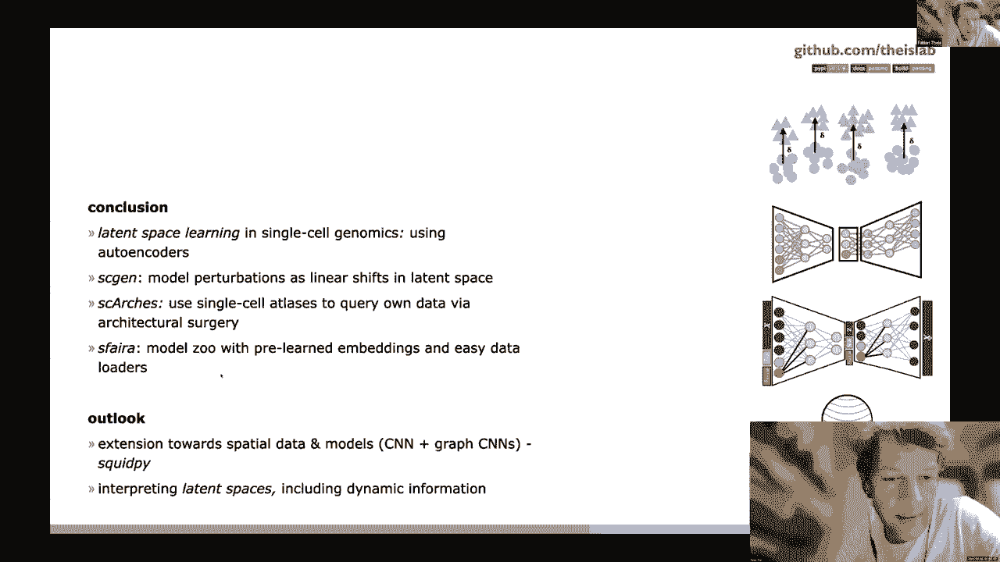

我们有一些关于空间数据和可解释性的扩展，不会提及，这就是巴伐利亚一直以来的样子，你知道我们必须保持社交距离，但是是的，但仅此而已，谢谢鸟类，非常感谢，这真的是惊人的，我知道我们的空间不多了。

但既然你提到了Kipoi，意思是花园，和Sfera，意思是恐惧，我不得不说，今天是希腊革命两百年的时候，呃到今天，所以说，哦，是啊，是啊，今天早上我在收音机里听到的，是啊，是啊，真，哦。

你可能真的在西海岸，但他实际上是法国人，我只想说你知道，欧洲在逆境中团结一致是今天值得庆祝的一件大事，在希腊人之间，法国人和德国人，无论如何，非常感谢费金，很高兴见到你们，我回到家人身边。

所以我不得不登录祝你好运，再见说你欢迎欢迎，所以说，呃，把它拿走，只要分享你的屏幕，跳进去就行了。

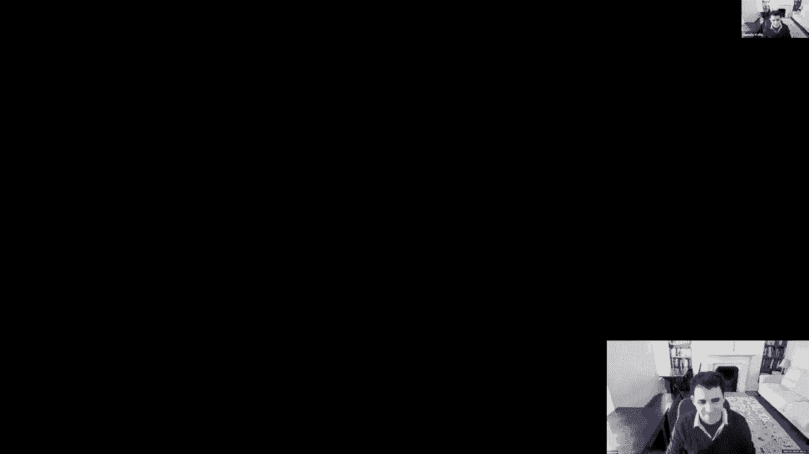

所有的权利，嗯所以嗯，是啊，是啊，谢谢。谢谢马诺利斯邀请我，我看了一下，你知道吗，就像班上的网站，我想说我会非常兴奋，你知道五年前上过这样的课，我得说我也会的，这就是我们制作它的原因，所以这很棒。

今天我将展示我的一些作品，这与费比安的所作所为密切相关，我猜，也许这个演示会有点进入，贝叶斯建模和应用统计的更多细节，这就是我攻读博士学位时一直在做的网站，但我将讨论Vies在单细胞数据中的应用。

呃所以总的来说，呃，这是一个非常合作的，呃，项目的收集，呃，我和研究生们分享了，和来自法国的硕士生，伯克利大学本科生和教授，所以我一直和皮埃尔·亚当一起工作，奇林和加伦，嗯，而且，呃，杰夫·迈克和这里。

所以迈克和我的两个PH附近，d，顾问和杰夫基本上扮演了顾问的角色，他现在是密歇根大学的教授，所以呃，呃，今天我想谈谈很多事情，呃，我们，你知道吗，我想重点更多的是，呃，呃，慢慢地把事情一件一件地。

我希望你能减少这些幻灯片，好像你没有时间做每件事，但我基本上喜欢设置场景，为什么将VAS应用于单个单元格数据是有意义的，从建模的角度来看，那我来谈谈，嗯一个CVI。

以及我看到的许多其他VIE的扩展或失败模式，我们试图纠正，所以我们走吧，所以，做单细胞转录组学的关键思想，细胞共享相同的DNA，但它们有不同的功能，如果我们看看，例如我们左边的H和E染色。

我们看到很多不同的颜色密度，这意味着不同类型的化学物质，糖原学与组织，但本质上这意味着所有这些细胞都在一起工作，但它们是非常异质的，所以我们可以有很多问题，对吧，所以我们想了解。

我们在这个组织中有什么类型的细胞，这个细胞有什么功能，呃，本质上，这是一个多发性硬化症模型，所以我们想知道，它是如何从健康组织变成发炎组织的，所以呃，单细胞帮助，我觉得，呃，你知道的某种类型。

这个问题的答案，它的工作方式是，你可以把你的组织分解成单个细胞，例如发炎的组织和健康的组织，然后你可以运行这样一个单一的RNA测序管道，有很多，但你得到了一个结果，在右边，它基本上是一个计数矩阵。

给出每个细胞，嗯，你有多少次，你知道吗，你必须捕捉与给定基因对齐的抄本，所以呃，对我来说真正令人兴奋的是什么，尤其是当我开始读研究生的时候，作为一名计算机科学家的第一件事，令人兴奋的是，呃。

一百万细胞的测序，来自十倍基因组学的U，你知道，表明我们需要制作算法，刻度，作为一个统计学家，第二件事很有趣，我们可以对很多事情进行排序，呃，或者我们可以从单细胞中测量很多东西，干扰或蛋白质和转录组。

还有很多其他的东西，所以，呃，所以有很多，嗯，你知道，在我们把生物问题转化为算法查询之前，它们就已经被制定好了，嗯，就像没有确切定义，但我们可以从这个到数学和贝叶斯统计。

所以基本上我们有细胞水平的查询和基因细胞水平的查询，单元格级查询的工作方式是，呃，我们想，比如说，将细胞分层，对呀，我们不知道细胞类型是什么，呃，或者我们不知道如何识别细胞状态。

所以我们喜欢把细胞投射到一个低维流形中，这是正确的，当你听到Pciva是所有这些类型的东西，嗯，但我们想做更多的再融资分析，有些人做轨迹分析，还有很多你可能在课堂上见过的其他东西。

另一项重要任务是协调或整合若干数据集，所以我相信我会，本质上，我们有数据集特定的偏见，嗯，这使得，呃，呃，你知道，来自单细胞的类似测量，可能没有直接关系，从一个数据集到另一个数据集，这些被称为批量效应。

所以我们想提供一个嵌入，这在不同的实验中是相关的，然后我们有注释问题，我们想，比如说，一个数据集被注释，这是很难做到这一点，这是呃，是啊，是啊，在以好的方式做这件事之前，所以一旦我们最终注释了数据集。

我们想把注释转移到其他数据集上，嗯，然后关于基因细胞水平的任务，其中之一可以称为归一化或归责，基本上是这样的想法，嗯，我给你看了这个计数矩阵，大多数都是零，它们是从随机过程中取样的。

对泊松或负二项分布的权利，我们想知道，比如说，分布的平均值以更好地了解，就像，什么，基础分布是什么，更特别的是，我们想获得这个发行版的快照，但是它是如何随着技术效果而调节的，例如，移除技术工件。

如果我们能做到这一点，然后我们可以做最重要的事情，不知何故，呃，基因细胞水平查询，就是微分表达式，例如，我们有两个单元格或求解类型，我猜是两袋牢房，我们想知道哪个基因彼此有显著的不同。

这是一个假设检验问题，今天我将讨论所有这些问题。

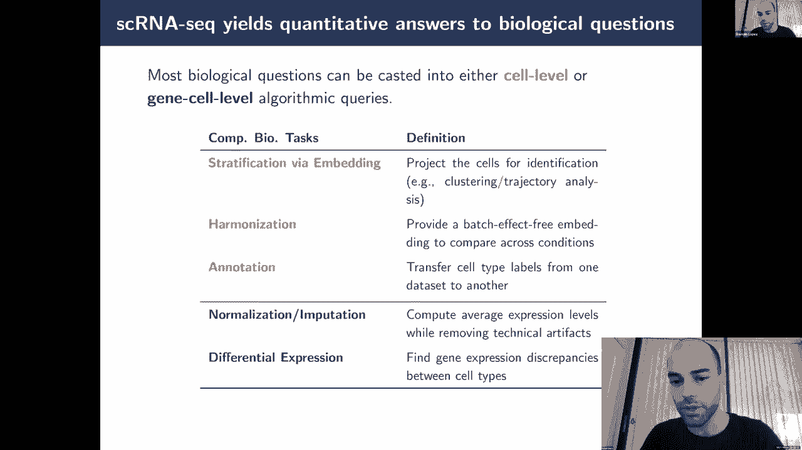

但目标是这样做，你知道，以概率的方式，以及我们将如何做到这一点，我们要在那里建立潜在变量模型。

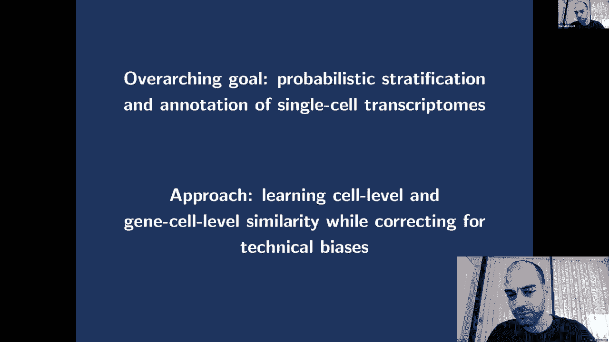

单细胞分析可能很复杂，原因有几个，第一个是，是啊，是啊，我们有大量的技术噪音，所以我今天要讲的第一个技术噪音是可变的，排序死亡，所以也许你在课堂上看到过这个，基本上是从给定的细胞。

你可以得到一千份成绩单或一万份成绩单，和大约一万五千份成绩单，它可以给你一些生物信息，但大多数时候我们想纠正它，因为它可能是微分表达中的一个混淆，比如说，第二种技术噪音是已经提到的批处理效应。

此数据集特定偏差，那么重要的一点是什么，数据来自这个多元计数分布，它是高维的，然后嗯，我们在一个政权中，呃，分布的平均值向零移动，这使得测量，呃，真正的非高斯人。

所以我们要认真思考我们把什么类型的发行版，你知道的，呃，在这些生成模型中，然后最后一件事是，是啊，是啊，正如我已经说过的，呃，我们需要可伸缩的方法，我们要记住，规模是数百万样本。

所以有许多标准的机器学习方法应用于单细胞，其中一些是更传统的统计方法，这一切都覆盖，但我要呈现一个简单的，你知道的，就像一个，所以首先，嗯，我们有计数，我们想让他们正常化，有很多很多的方法来做这些事情。

但假设我们只除以，在给定的牢房里的成绩单，我们应用一些对数变换使数据看起来是高斯的，以某种方式，我们可以应用PCA来减少数据的维度，我们可以应用一种算法来校正批量效应，这么多人，比如说，你知道。

就像在一个数据集中创建一些图表，用PCA，另一个图上的另一个数据集，做一些图形匹配，这些算法在这个领域真的很受欢迎，然后我们可以集群，你知道，就像校正的潜在空间来识别细胞状态，最后我们可以回到原始数据。

计数并执行微分表达式以命名单元格状态，你知道，T细胞cd，或类似T细胞的子集，炎症，等，嗯，不知何故，我从，你知道，就像五年前，当我了解到单细胞是，嗯，呃，等一下，所以说，为什么我们需要，你知道。

就像改变数据这么多，呃，为什么我们需要应用不同的算法也许你有不同的假设，比如说，微分表达式建立负二项式模型，这真的很不错，为什么我们不能回收它来做所有其他的事情，所以关键的想法是。

我们能不能为整个管道找到一个统一的建模假设，嗯，这对我来说很有吸引力，因为这是一个可以工作的想法，你知道事情从哪里开始，正在看PCA，所以我写的，我在方程一中所写的，这里U是概率PCA的生成模型，嗯。

你已经可以看到如何改进这种类型的模型，所以我写的第一件事是嗯是的，所以一点点，呃，x的p是高斯分布，当你积分z时，我们知道表达水平不是很高斯，所以如果我们想适合这个模型，我们需要将数据规范化，等。

我们希望以某种方式避免，我们可以做到这一点的方法是用计数分布来代替它，并应用一些特定的推理键，那么第二点呢，嗯，很难假设线性，基因表达水平的平均值与潜在变量之间的关系，尤其是因为你知道你可以有两个基因。

呃，你在，在定义细胞类型方面，对如果这个基因在，那个也是，但不是这个，所以我们想扩展这个线性假设，最后一件事是，当人们应用PCA时，它其实是，嗯，我是说，你从PCA得到的相当于用，当西格玛为零时。

我们我们，我们失去了这样一个事实，即我们最初是在用概率模型工作，这对于许多应用程序都很好，但他们中的一些人实际上，获得测量的不确定性真的真的很重要，特别是对于微分表达，这将在以后发挥作用。

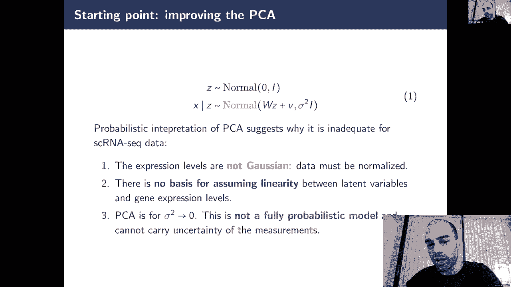

所以说，改进的空间是构建一个可伸缩和一致的框架，用于以概率的方式分析单细胞数据，这就是为什么，这就是CVI背后的所有想法，以建立一个深度生成模型，你可以调用一个花哨的PPCA来基本上解决这个问题。

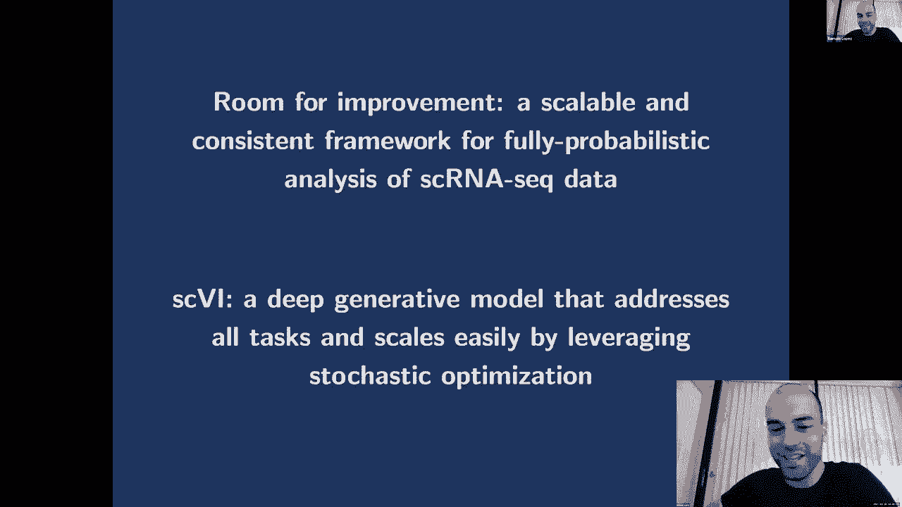

所以现在，我要快点走，通过几张贝叶斯建模的幻灯片，这个想法是我用的，你知道和我的合作者谈谈CVI，等等，所以我想把它作为一个，作为工作的遗产，你们中的大多数人已经知道图形模型是什么。

所以在这个图形模型中，所有节点都是随机变量，和年龄，边缘编码条件依赖，所以这里，基本上你可以阅读这个图的方式是，您希望将一个节点分解为其父节点上每个节点条件的乘积，图形模型很有趣。

因为您可以编码许多概率属性，比如说，如果你去掉一条边，然后你添加条件独立性，呃，你限制，你知道的，你正在处理的概率分布的类别，这是一个比以前更简单的模型，你也可以做的是，当然你可以添加常数。

这些常数可以在过程中学习，它们可以成为可能性的参数，您可以有独立的复制，所以在简历中，比如说，所有的基因都是独立的，有条件独立，在潜在的空间上，一些节点，我们不遵守每件事都是对的，其实其实。

如果你观察一切，那么我不确定你需要一个很好的模特，但这里有一些潜在的变量，一些变量是潜在的，其中一些是观察到的，如果你知道模型，那么你要做的是计算后部，对呀，那么变量的分布是多少，我没有观察到。

你可以用贝叶斯规则来计算，但当然，呃，当你使用贝叶斯规则时，你有分母，这是一个边际可能性，这种微不足道的可能性对许多人来说是难以解决的，很多情况下，实际上除了PPCA以外的大多数情况。

我给你看是因为它是高斯分布，所以这是一个话题，MCMC方法以及变分推理，在CVI中，我们使用变分推理，这就是我今天要呈现的，所以变分推理背后的关键思想是，对于每一个观察，我们希望每一个观察x。

我们要计算后部，所以我们无法计算，我们要近似它，为此，我们将放置一个熟悉的发行版，b，我们要找到点，在这里最小化某个函数的Q星，这是一个K向后的发散，本质上我们在这里做的是。

我们把推理问题转化为优化问题，所以到目前为止我们还不知道有多有趣，那是因为我们不知道如何驯服，优化问题是，嗯，因为我们选择尺度发散，它变成了一个简单的优化问题，我的想法是，所以你看方程二。

我们想找到最小化KL的Q星，立方劳动分歧实际上，嗯是对数比的期望值，所以对数是态射，对呀，所以比例来了差异，你得到方程三，然后你可以使用条件密度的定义来得到，从方程三到方程四，你可以注意到在方程四中。

我们有这个证据项x的log p，这不依赖于变分分布，所以我们可以把它从优化问题中拿出来，而不改变Arg min，然后我们得到方程五，在方程五，有趣的是，一切都很容易处理，因为我们知道模型。

模型是完全指定的，z和x的p，关节，呃，变分分布是我们控制的，所以我们可以解决这个问题，嗯，效率或多或少，但我们我们可以，这是我们现在可以解决的问题，这就是为什么变分推理变得非常有吸引力。

那么现在它是如何融入，v，好吧，所以在，比如说，呃，在这里我要介绍，概率PCA的扩展，其中呃，我们去掉啊两个假设，所以其中一个是，我们有一个线性函数来定义高斯分布的平均值。

在这里我们可以用神经网络来指定它，嗯，这就是我们这里的部分，我们可以用另一个神经网络来指定方差，它看起来的样子，所以说，这是一些天文学数据，你在潜在的空间中取一个点，到潜在空间的每一点。

你绘制一个平均值和一个方差，然后模拟新的数据，你可以从它身上取样，你得到一个恒星的图像，所以我希望我在这里放了一个单元格数据，但看起来就不那么好看了，我们没有那些图像，对呀，嗯，但是是的。

这基本上是VA在做什么的直觉，嗯，现在我们被另一个问题困住了，我们不能只是申请，vi，就像我之前给你看的那样，原因是我们也需要学习模型参数，我们这样做的方法是最大限度地利用证据，所以x的对数p，呃。

当然，我们不能最大化这一点，所以我们需要用变分分布来分解它，这里从左到右的不等式，我应用延森不等式，但在你的课上，你刚刚看到了日志证据的完全分解，使用变分分布，这两个观点非常非常相似，我们右边的东西。

这里有一些我们可以在pytorch或tensorflow中编码的东西，嗯，优化是非常简单的，呃，所以现在我们又有了一个热度，那就是我们有几个观察，对于这些观测中的每一个。

我们都需要得到一个参数正确的变分分布，但我们在VAE中所做的，我们把变分后验的所有参数，使用一个新的使用两个神经网络，所以如果我们有一个高斯变分族，我们需要一个高于平均值的参数和另一个用于方差的参数。

所有这些都只是从输入数据到这些参数的映射匹配，它被称为许多，很多名字，其中之一是摊余变分推理，另一个是自动编码变分贝叶斯，这就是VA中使用的，所以现在我们可以，我们可以谈谈CPI，基本上是把所有的。

你知道吗，比如技术效果，我在将它们合并到图形模型之前进行了讨论，呃，那实际上是一个va，我们想写一个生成过程，也可以用图形模型编写，就像我之前展示的那样，这个想法是，我们有给定细胞的基因表达计数。

在给定的基因中，我们有批处理标识符，生成过程如下，首先，我们对单元格的嵌入进行采样，它使用了与概率PCA几乎相同的先验，或者之前展示的另一个VA，您可以更改此优先级，我稍后会讲一个例子，嗯。

然后我们有一个缩放因子，所以这是一个标量数l，从一个肥尾分布中取样到，解释给定单元格中抄本数量的许多变化，这就是我们所说的库大小，我们有一个神经网络，将UZ和批处理标识符映射到，呃。

我称之为RAO行的量是一个归一化表达式，这意味着在这个神经网络的末端有一个软最大非线性，这意味着一行是每个和为1的单元格的向量，它给你预期的，呃，每个基因的表达频率。

然后我们可以用对数正态分布的样本缩放这一行，这就给出了负二项式的平均值，我们有一个色散参数，所以，这就是我们如何拥有这个，呃，现在我们已经完全指定了生成模型，我想提请你注意的是，所以实际上费边。

刚才谈到的是，这里我们使用条件va，这意味着我们学习一个条件分布，x的p给定z，给定z和s，x的p，我想um和z是潜在变量，观察到S，S是这个数据集，呃标识符，这就是我们处理数据集的方式，特定偏见。

所以当我们这样做的时候，我们的潜在空间对技术效果变得不变，这是一个批量效应，那么现在这个模型的好处是什么，我们有一套建模假设，这是所有任务的共同之处，所以现在我要试着说服你，我们可以解决之前所有的任务。

所以我们在讨论分层和嵌入，是呀，我们可以做到这一点，因为对于给定的细胞，我们可以从后验分布中取样，或者得到，嗯，我谈到了协调，所以我们确实删除了这些数据集，特定偏见，因为我们以他们为条件。

此批处理信息的条件，我们想正常化，所以我们确实正常化了，因为我们以L为条件，我们在神经网络的末端还有一个软最大值技巧，嗯，当我们想把我们能做的，你知道的，行样本，这给了我们一些归责。

我们也可以把它的意思，如果我们想，然后当我们要做微分表达式的时候，嗯，是啊，是啊，我们可以制定一个特定的baan，假设检验问题，我们可以根据角色，我们可以解决它，这就是我们如何在CPI中做微分表达式。

所以呃，我们可以对这个模型进行推断，就像我给你看的那样，嗯，有趣的是，它的工作原理很像普通的VA，除了这里我们有不同数量的神经网络，我们需要一个神经网络来计算平均值，和变分分布中Z的方差。

平均值的神经网络，变分分布中L的方差，然后一个编码的神经网络，uh是负二项式的归一化平均值，在最初发布的CVI中，呃，我们有一个零和五十的负绑定分布，你可以添加另一个神经网络，但为了简单起见。

我只是没有在这里暴露它，这样你就可以看报纸了，所以如果我想说服她，让你相信算法是有用的，我们想研究潜在的变量，对呀，所以第一件事是我们可以看看嵌入Z，有一堆基准，你可以看看，但我会很快的，但本质上。

即使我们有一个向正常的零1收缩的先验，我们设法恢复了原始星团，所以这是一个自细胞相似性，所有这些都是细胞类型，我们也可以重述一些发育梯度，这是通过查询变分分布的均值来完成的，那么呃。

我们可以看看我们的CV8在批量效果方面做得很好的地方，嗯，实际上，因此，在具有严重批量效应的设置中，cvi使用得最多，还有很多批次，这是因为它成为一种极其可伸缩的方法，与许多竞争方法相比，所以没有批量。

这是来自视网膜细胞的数据集颜色这里的数据集，右边的颜色表示单元格类型，所以我们想做的是混合细胞类型，对不起，混合数据集，但仍然能够区分细胞类型，所以如果你看看CVI，它看起来很好。

因为你可以看到细胞类型，但看起来很糟糕，因为所有的数据集都是分开的，如果你的pca看起来不太好，但是当你看到与批次一起申请的CVI时，这是没有批量更正的，它真的混合了数据集，但我们仍然可以看到细胞类型。

然后另一个潜在变量是RAO，呃，所以对于这个潜在的变量，对我来说，最令人兴奋的是看微分表达式，然后呃，我在这方面工作了一段时间，我要给你一点关于，比如为什么这是一个复杂的问题，但为了第一篇论文的目的。

我们所做的是我们有一些PBMC数据，我们观察这两个群体，cd 4和cd t细胞，然后我们计算了，你知道的，呃，我想呃，这是第二篇论文，当你有第三个，但我们提供了更改日志，这意味着在微分表达式中。

哪一个不是计算的标准度量，我们刚刚计算了两个细胞之间对数下降变化的后验概率，对于给定的基因，在RAO方面超过一定的阈值，说零五，嗯，这就给了你基因的排名，呃，你可以比较排名有多好，呃。

你知道就像我们正确的，所以正确总是复杂的，尤其是在这种环境下，如果你没有模拟，嗯，但你的所作所为，本文的目的是研究另一种技术和我的微阵列，稳定多了，嗯在非常特殊的细胞类型上。

我们基本上比较了基因的排名和CVI的排名，和其他与微阵列有关的方法，我们发现CVI的表现类似，如果不是更好一点，正在做排名，对我来说，令人难以置信的兴奋。

因为这证明了我们可以使用相同的模型来完成所有这些任务，最后我谈到了可伸缩性，在简历出来的时候，呃，所以你看这里，dca是法比安实验室的一种方法，这和简历是同时出来的，我想唯一的区别是这是一个自动编码器。

他没有使用，呃当时没有做批量效应校正，但是呃，但你看，这些是唯一可以扩展到数百万个细胞的方法，当然是用pca啊，而所有其他基于，你知道的，mccmc，或者倒置一些矩阵，或者是二次方的。

你知道在规模上或在记忆中爆炸，所有这些都被困在五万个细胞里，所以这是一个巨大的，呃，在所有这些工具中使用随机变化或推理的巨大改进，来自DAS，所以现在我要向我介绍，所以我将呈现，嗯，扩展，那是注释。

有几个数据统一场景，我想Five N已经谈论这个有一段时间了，所以我走得快一点，但你可以分析一个，呃，你知道同一个实验室的多个样本，这就是我在你可以协调不同实验室的数据之前给你展示的。

这就是我们在右边看到的，我们在这里看到，这是一次成功的手术，因为数据集又是混合的，但有些类型不是，还有两个目标，但是还有一个问题，也就是，呃，到目前为止我没有说话，就是嗯。

如何将标签从一个数据集转移到另一个数据集，我们用半监督的VA来做到这一点，所以有很多方法可以做这种工作，但他们与，嗯，你知道建筑图表和呃，匹配图形并传输，你知道，就像不同图形上的标签，嗯，作为警告。

因为嗯，它不能再执行微分表达式，不是所有的事情都在同一个管道里，我们真的很想推进这个想法，所以我们建立了扫描VI，扫描VI的工作方式是在X和S的顶部，你可以观察或不观察这个C星，它是单元格类型标识符。

所以N意味着不被观察到，所以你可以用它来做很多用途，比如说，一个数据集是部分注释的，你喜欢传播标签，或对一个数据集进行注释，另一个不是，嗯，所以我们做的方式是，呃。

我们基本上通过将z中的先验从各向同性改变来扩展cvi，对高斯混合的正常，我是说，让我们看看它不是高斯的混合体，是一个混合模型，这里的c变成了混合分配就像它来自哪种细胞类型，当你看不到是哪种细胞类型时。

你有一个变分分布的神经网络，用于细胞类型分配本身，嗯，所以你可以读这份手稿，这项工作有很多扩展，但这是一个非常强大的想法，我们在这里，我给你看一个例子，所以有一个很好的用例。

其中所有单元格中都有T单元格的子集，但你不知道它们是什么子细胞类型，基于一些表达非常低的标记基因，你也许可以注释其中的几个，但不是一切，然后可以使用NVI传播标签，它比只做聚类或分类要好得多。

因为我们可以利用所有这些灰色细胞的知识，它是超级半监督的，所以我们有一些分类的地面真相标签，我们这里的概率看起来很合理，然后我想给一个笑话，关于我使用CVI遇到的另一个问题，呃。

这是我写的第一篇机器学习论文，所以我在CVI的时候很感兴趣，把潜在空间的东西分解出来，我给你们看了一个例子我们可以排除批量效应，事实证明，在很多设置中，批量效果实际上很容易，但真正困难的是。

一些连续的信息，或者一些类似于其他协变量中的对齐错误，所以我再给你们举一个例子，其中嗯，所以这是同样的问题，我们如何获得独立于讨厌参数的表示，关键的想法还是条件反射，所以，比如说。

在这个机器学习启发的例子中，计算机视觉，我们想，我们有几张不同人脸的照片，所以人的身份，y，但是我们有不同的衬里条件，所以所有这些角度，呃是一个光的角度，我们希望有一个嵌入，你知道就像Z 1。

这对人的身份有很大的歧视，但与衬里条件略微独立，如果你从盒子里拿出一个VA，所以CVI也是一样的，对呀，如果你想找到一个嵌入，这对细胞类型有很大的区别，但是不受细胞周期或其他因素的影响，现在呃。

你能做的就是建立这个条件模型，但是发生的事情是，你得到的嵌入仍然与，It’用这盏灯，有时是有时不是，但是批处理的效果，它起作用了，但这里确实有一个它不起作用的例子，在细胞周期中，例如也遭受了这个问题。

事实证明，这是一个问题，呃，这来自神经网络的过度灵活性，用于变分分布的参数化，嗯，它影响到所有这些问题，所以如果你想学习独立的表示，呃如果你想学不变量，这就是我提出的，甚至这种去噪的表现。

所有这些都是我所说的非常简单的变体，我在报纸上谈到了这件事，我有一个榜样给他们所有人，我们所做的基本上是试图限制搜索空间，对于变分参数，所以我们用黑线鳕的方式，我们强制执行声明，呃格式。

这独立于聚集的后部，我们的方式，所以说，有点复杂，因为嗯，我们不能仅仅通过看下限来强制执行这些陈述，所以我们在那段时间里所做的是使用十字架的速度标准，嵌入的协方差算子，你知道，就像发行版。

它是依赖性的非参数度量，我们把它加到下界，所以它给了你一个更宽松的下界，但它有更合适的属性，我们称之为HC约束VAS，所以如果你对这类事情感兴趣，我非常鼓励你看看这幅作品，但这是一个令人惊讶的例子。

我认为问题来自数据，但实际上它来自模型，所以这很有趣，然后我想介绍，呃，关于微分表达式的更多讨论，所以用我们做微分表达式的方式，在CVI中是一个贝叶斯模型选择问题，对呀，所以我们是，假设我们有两个细胞。

我们有各自的测量，我们有每个基因的归一化基因表达水平，我们可以做正确的模型，模型一寻找比增量模型更多的变化，寻找变化的绝对值小于delta，所以模型一，这个基因是差异表达的，我想模型不是零模型。

它没有差异表达，你知道我们能做的很简单，呃，做一个基本因素，所以似然比，我们可以给出一个阈值，比如说，如果超过十个，这是用很古老的文字写的，贝叶斯书，如果奇数比大于十，那么你可以说你的基因是差异表达的。

首先要注意的是，这种方法可能有偏见，因为我们计算海报概率的方式，我们需要插入变分分布来代替后部，所以如果后面是错的，我们不是，我们有麻烦了，第二件事是，嗯，这种方法的适用性有点有限，因为嗯。

很多人希望看到控制，呃，数量，他们知道所以事情，基数超过十是不可能的，你知道的，与控制完全发现率的测量相比，它没有那么忠实，所以我们花了很多时间思考如何控制完全发现率，或者用CVI做假设检验，嗯。

不知何故，这两个问题，这是一种，它是，这是家庭作业，如果你想或与，呃，准确计算后验期望的这个东西，所以你可以看到为什么第一点是相关的，对呀，因为我们用变分分布代替了这个，所以，罗斯福要做更多的工作。

所以我们的想法是计算这个东西，也就是，你知道的，MCCMC方法的面包和黄油，但你想用VA做，假设我们可以从变分分布中获得这些样本，我们可以先做几件事，我们可以使用插件估计器，对。

从这个分布中平均所有东西，或者我们可以纠正，我们可以使用自归一化重要抽样对样品进行重新称重，嗯，并按这个密度比称重这些标签，这样我们就可以把最有希望的样品留给他们，这些事情实际上并不完全适合香草VIE。

呃，第一个原因是呃，VAE拟合的模型可能不等于数据分布，这是我们在报纸上谈论的副业，但如果你找到一个更好的模型，计算这个微分表达式或者用vs做决定总是更好的，第二件事是。

变分分布和后验分布之间可能有一些很大的差异，所以现在它特别重要，因为嗯，虚拟推理的工作方式，它低估了后部的方差，所以如果你试图用它来进行重要的采样，认为你得到了对你的数量的无偏见的估计，嗯。

你有一个巨大的方差，因为你没有真正涵盖整个模式，或者你没有覆盖，你取样不够，你很本土化，而这种灾难性的表现，呃对于许多应用程序，所以我们要做的是，我想是A，我们考虑了所有不同的，你知道的。

比如证据的组成，所以这是对证据的分解，你在班上看到的对吧，比如证据，等弯头加反向刻度，呃，变分差，这是所有这些操作空白，我猜，第二你也可以，这是一个下限，因为KL是正的，但你可以有上限，呃。

所以这里我们有一个一定的上限，呃叫ubo，这两者之间的差距是前锋，kl发散度，所以这和预期有关，作为，你知道吗，然后我们在这里有另一个边界，也就是古巴，呃，基本上这两个量之间的差距也是负的。

所以这是一个上限，它与高平方散度有关，然后嗯，我们试图思考的，那些上界很有趣，因为嗯，而不是低估方差，他们高估了方差，对于重要的采样来说要好得多，所以我们想出了程序性的，你知道，就像呃，把那些想法。

嗯进入竞争和说，哦，所以我们可以用这些输精管做假设检验，首先，我们拟合多个V，每个V具有不同的变分分布，我们保持最佳模型的基础上，你知道你好可能性或任何其他确定的门，然后我们对这个型号再进行一次改装。

我们保持模型固定，我们学习不同的变分分布，然后我们使用多个重要的样本将所有这些建议结合在一起，我们在实践中看到的是，呃，比如说，呃，Vai a真的很擅长学习模型，所以我们把所有这些东西结合在一起。

呃和呃，我们有一些非常好的结果，关于控制完全发现率，与CVI和一堆其他东西，我时间不多，因为已经三十多了，但基本上嗯，我非常鼓励你看看报纸，如果你对此感兴趣，这篇论文也有一点理论，其中我们量化了。

你知道，就像重要采样的误差，使用浓度界限，啊，我们扔了一个新的VA在那里，使用kV i绑定，这实际上是相当新的，我们在PC和MNIST上也做了一些实验，那么，让我们看看，嗯，我现在应该停下来吗。

我有两张三张幻灯片，我想通过，但我可以把它们盖住，和，好的，这就是为什么，即使他们不得不，然后是两张幻灯片，我想第一件事是，我们真的试过了，你知道，就像所有这些文件一样，呃，我们也有你说的。

我今天给你们展示的所有算法，还有很多其他的，它们被编码在同一个代码库中，这意味着我们真的试图在实验室里做增量工作和内部开发，到达……，你知道的，与Pytorch的良好接口和加载单窖ASIC数据集。

用基本模块编码所有这些VAS，我们创建了一个叫做CVI工具的东西，对于用户来说，包含许多分析单细胞组学数据的工具，但对于模型开发人员来说，还包含概率编程语言的接口，因此。

在一行代码中更改简历是非常容易的，或者制作一个新的VAE，我想我们实施了十三个，在这个代码库中有10到13个遗传模型，所以我非常鼓励你去看看，如果你觉得这很有趣，还有一件事最后一件事是，呃。

我们写了一篇评论，试图过去，你知道，这些竞争的所有影响，以及分子子集中的甘斯，分子生物学的一个小子集，因为这是一个很大的区域，但是嗯，但是是的，如果你想了解更多，呃，我也鼓励你参观这个，呃，呃。

这个出版物是的，某某今天就到这里，非常感谢。

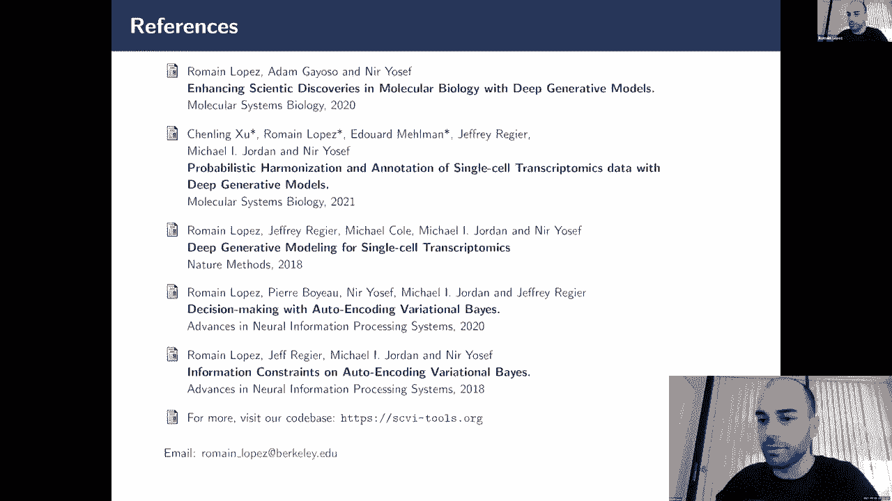

嗯好吧，所以非常感谢你，我们就会，我想呃，潜入一些数学，然后呃，你知道明天背诵的一些结果吗，所以我想人们会有机会真正问问题，所以非常感谢你真正投入到方法论中，然后呃。

我认为这与课程的许多不同方面都有联系，呃，为学生们润色，别抓狂，呃，你知道这是一个很大的数学，但我想呃，我们就会，你知道我们明天会更深入地讨论它，会有更多的机会潜入其中好吧，非常感谢，哦不。

你想在这里呆一会儿吗，我能让助教也留下来吗，所有的权利，谢谢大家再见。