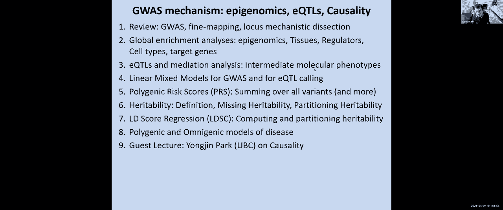
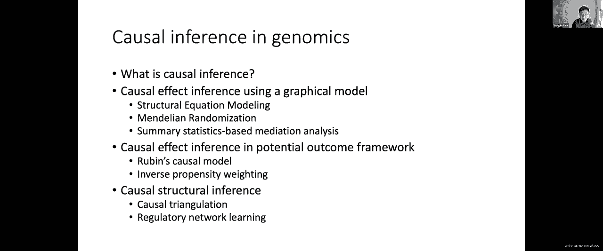
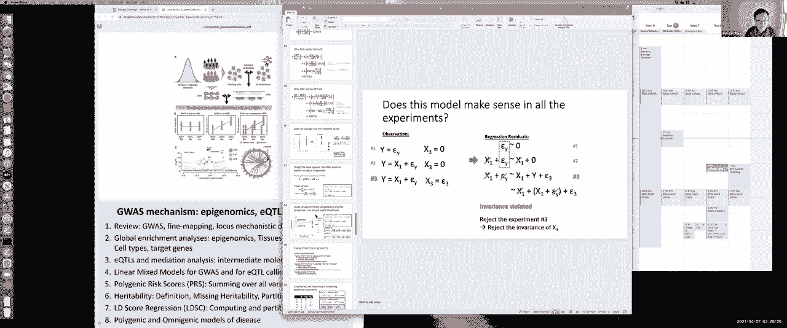
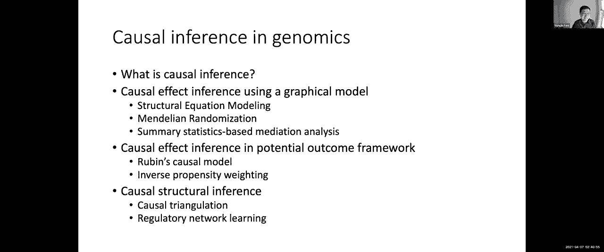

# 【双语字幕】MIT《面向生命科学的深度学习》课程(2021) by Manolis Kellis - P13：Lecture 13 - GWAS mechanism - 爱可可-爱生活 - BV1wV411q7RE

所以欢迎大家今天我们将讨论gewas机制，所以我们继续上次到现在的课程，看全局变量，如表观基因组富集，查看EQTL或表达式，数量性状，基因座，并研究调解和因果关系，我们将有朴永进教授的客座讲座。

来自不列颠哥伦比亚大学，我们要简单回顾一下，gwas和查找映射和位点机制剖析，然后我们将研究全球浓缩分析的不同方法，利用表观基因组学推断作用调节剂的组织，细胞类型与靶基因。

然后我们要看eqtls或表达式，数量性状，位点与中介，了解中间分子表型，遗传变异最终作用于疾病，然后我们要看看全基因组关联研究的主力，也是线性混合模型的eQTL，研究混合效应和随机效应。

固定效应和随机效应，以及这些如何混合在一起进行表型的最终预测，然后我们要看看多基因风险评分，以及我们如何对所有变体求和，你知道许多预测表型的修改，然后呃，我们要看看遗传力，然后呃，你知道吗。

在这里的某个地方，我们要过渡到客座演讲，我们将在星期四的课上讨论剩下的主题，就在艾尔的价格的客座演讲之前，所以呃，让我们直接跳进去，所以我们上次讲的是第一个，在少量影响大的变体和非常。

非常多的小效果变体，以及孟德尔分析是如何捕捉到这些非常强的效应变体的，而全基因组关联研究主要捕捉常见的变体，它们本质上大多是非编码的，大多是微弱的影响，否则它们就不会上升到高频，因此，在人类群体中。

对常见的强效应变体有一种固有的选择，导致了孟德尔变体之间的二分法，这些变体没有被引用，允许未报价上升到高频，然后是不允许高效果大小的常见变体，我们还讨论了常见的变体，事实上落在单倍型块中。

其中一个特定的公共变体与同一块中的许多其他公共变体共同继承，这使得很难推断有时数百种变体中的哪一种是，事实上，当我们发现这种块与疾病的联系时，这是因果关系，我们看到了一个机械剖析非编码关联的例子。

从确定组织和细胞的作用类型开始，基于这些表观基因组丰富，我们今天要更多地讨论，利用eQTL预测目标基因，我们今天要更多地讨论，利用贝叶斯精细映射推断因果核苷酸，我们今天要更多地讨论。

并利用调控母题丰富来推断上游调节器，以及细胞和器官表型，以及我们如何将所有这些应用于fto轨迹，与肥胖最强的遗传联系来推断电路，一旦我们有了电路，能够真正操纵电路，为了逆转疾病表型，所以今天。

我们将深入研究一些全球性的方法，使我们能够同时在数千个基因位点上进行这些类型的推断，所以我们将研究全球浓缩分析的方法，预测疾病相关组织，监管者，细胞类型与靶基因，所以再一次。

我们的目标是了解曼哈顿的这些情节，呃，看看功能驱动程序是什么，这些山峰背后的机械基础是什么，这里真正令人兴奋的是，是因为我们不是一次研究一个山峰吗，我们不必只是说好，我们首先要研究fto轨迹。

然后我们要去孤立地研究那个位点，然后是孤立的这个位点然后是孤立的那个位点，取而代之的是，我们要做的是说出所有这些基因座的共同点，通过共同研究它们，我们将能够推断属性。

可以让我们回到这些基因座中的任何一个，并利用这些特性，换句话说，如果我们发现在所有这些基因座中都有一种浓缩，在一个轨迹中重叠的许多变体中，许多不同类型的增强剂，我们可以说，啊哈。

脂肪细胞增强器重叠的那个，更有可能是因果关系，因为我在所有这些基因座的全局范围内看到了这个属性，好的，那么到目前为止谁和我在一起，上，使用公共全局属性来学习跨越所有这些轨迹的东西的概念。

然后用这些东西回到单个基因座，看看它如何应用于这些基因座，伟大，所以我们在61，三个，五个，四零，零，所以目标，当然啦，遗传学的基础是我们将有一些公正的因果关系，我们将用它来研究疾病机制，预测目标基因。

治疗学与个性化医学，机制的挑战是，在这些地区的绝大多数，没有蛋白质编码改变，这是全基因组关联研究的一个特点，专门寻找常见的变异，和复杂特征的特征，它们实际上是由成千上万的弱效应变体控制的。

这些变体主要是非编码的，所以这意味着目标基因是未知的，因果变体尚不清楚，细胞的作用类型，途径和机制尚不清楚，所以我们在今天的课上要利用的，所有这些用于细胞电路表观基因组注释的数据集。

以及所有这些用于预测哪些主题的深度学习模型，呃，哪个基序中断更有可能产生表型后果，当改变这些变异时，哪些目标基因在表达上发生了变化，等等，等等，许多这些高通量验证研究，我们将在本学期晚些时候讨论。

所以关键的想法是，我们不会一次只看一个地方，我们要看所有的，所以我们要学习，比如说，所有与身高相关的遗传变异，所有与一型糖尿病相关的遗传变异，有血压，胆固醇等等，等等，关键的想法是这些特征可以相互控制。

那个，通过观察身高和一型糖尿病之间的差异，有血压和胆固醇的人，我们将学习一些不仅仅是公共财产的东西，可能更经常与疾病相关的长单倍型的特性，等等，对这些特征中的每一个都是如此。

我们将研究所有基因座的全局重叠，当你观察所有与身高相关的遗传变异时，你问，它们是否经常重叠增强子注释，在干细胞中活跃，然后你会看到这里的丰富，但对其他的来说不是，一型糖尿病也是如此，我们要问。

与1型糖尿病相关的遗传位点和免疫功能之间的全球重叠是什么，血压，我们会发现与血压相关的基因变异是重叠的，心脏活性增强剂，肝脏中相关胆固醇或重叠增强子的遗传变异，等等，如此，每一个特征都是如此。

我们要找到某个p值阈值的所有相关区域，我们要把所有的片段，可信区间内的所有单核苷酸多态性，我们通常用r的平方大于8，所以回到这里的这张照片，我们试图在这个轨迹之间找到一个全球富集。

这个基因座和许多其他与疾病相关的基因座，但我们不知道这个区域内的哪个变体是驱动变体，所以说，我们只是简单地考虑所有的片段，在可信的间隔内，然后在所有共同选择的，我们将考虑可信区间内的所有步骤。

然后我们要评估，如果这些片段和组织特异性增强剂之间的重叠，和，我们将保留显示出某种显著丰富的组织，我们将评估这种浓缩，使用超几何统计量，二项式统计量，某种概率，给定增强器注释覆盖的所有片段的分数，因此。

我们偶然预期的分数，与我们发现的实际重叠该特征的分数相比，然后我们要重复所有的特征，这将是我们矩阵的行，和所有列，对于所有的细胞类型和组织，这些细胞和组织将成为我们基质的柱，好的。

所以当我们这样做的时候，我们发现与所有这些不同特征相关的遗传变异，在这些组织中活跃的所有增强子中，所以我之前给你们看了身高的例子，与身高相关的遗传变异，特别是富含增强子，胚胎干细胞中的um活性。

与许多免疫特征相关的遗传变异，富含T细胞和B细胞增强剂，血压变化正在增加，特别是作用于左心室的增强器等等，诸如此类，好的，所以我要停在那里，看看到目前为止谁和我在一起，我们如何进行这些全球丰富。

以有效地寻找财产，这将使我们能够独立地解释任何一个疾病位点，好的，所以我们在六十七，二九五零零，这太棒了，有时会有惊喜，例如，我们很惊讶地看到，阿尔茨海默病没有全球丰富的增强剂，活跃于大脑。

取而代之的是，阿尔茨海默氏症被强化为增强剂，CD14+细胞单核细胞活性，我们的发现，事实上，阿尔茨海默氏症有两种不同的成分，阿尔茨海默氏症的免疫成分很早就被激活了，然后是阿尔茨海默氏症的神经元成分。

在疾病进展的后期被抑制，和，事实上，阿尔茨海默氏症的浓缩是非常具体的，在14个以上的细胞中告诉我们这可能与小胶质细胞有关，这些也用光盘十四标记，这是两个循环巨噬细胞的细胞表面标记。

循环单核细胞和组织驻留巨噬细胞，包括小胶质细胞，这是大脑的特殊巨噬细胞，这基本上告诉我们，神经元不是主要作用于，阿尔茨海默氏症的基因变异可能有什么作用，在大脑的免疫细胞中首先起作用。

然后这导致我们实际上假设了这一点，你知道的，许多年前，我们一次又一次地发现，越来越多的证据表明基因变异似乎首先在免疫细胞中起作用，而不是神经细胞，好的，这样我们就可以开始对所有这些丰富的东西进行聚类。

在这里圆圈的不同组织之间，和圆形盒子里的盒子里的不同行业，使我们能够，比如说，看看胆固醇和肝脏，溃疡性结肠炎，这是一种炎症性肠病，这两者都涉及免疫过程和消化组织，心率极化与左心室高度。

用胚胎干细胞和成纤维细胞，然后阿尔茨海默氏症坐在这里的免疫力中，呃，性状，但特别是单核细胞，而不是任何这些循环呃，适应性免疫细胞，好的，所以呃，我们现在可以开始在贝叶斯框架中使用这些信息，回去说。

哪些与疾病相关的基因变异更有可能发挥作用，所以我们要用的是，一种贝叶斯方法，允许我们说，嗯，如果我有一组全局的表观基因组注释，我可以用我观察到的丰富作为经验先验，这让我可以说，在没有任何g的情况下。

这是一个轨迹的证据，我希望重叠的片段，假设免疫细胞中的增强子更有可能发挥作用，在克罗恩病或阿尔茨海默氏症中，所以这给了我先验，或，反过来说，如果我发现与精神分裂症相关的基因变异，在中枢神经系统中。

这再次给了我一个强有力的先验，如果一个片段重叠，中枢神经系统增强剂，更有可能是因果片段，好的，这里的每个人都和我一起讨论我们如何服用这些丰富的药物，然后把它们变成前科。

所以当我们在一个特定的位置上有多个片段时，我们可以说与，一些东西，这与全球图景一致，更有可能是因果关系，我们现在是5 8 3 7 0，五零，所以我们现在可以用这个来说，好的。

让我们现在结合这个来自表观基因组注释的先验，根据来自GIS汇总统计的证据，开始建立一个后验概率，即一个特定的变体是因果关系，所以我们基本上要结合一号的信息，片段在哪里的先验，这不仅仅是一个随机的先验。

这是观察到的经验先验，从全球浓缩中获得的，然后任何一个位点的证据，然后说，基于所有这些变体的初始得分，后验概率是多少，这些变体中的每一个都被预测为因果关系，好的，所以说，这现在需要数百个SNP。

这些精神分裂症基因座或克罗恩病基因座，然后优先考虑那些既显示出很高可能性的，基于G是基于表观基因组重叠的高先验，因此后验概率很高，这里的每个人都和我在一起，我们如何结合来自经验基因组富集的先前证据。

具有基因位点特异性，遗传位点特异性与特定关联重叠，然后寻找基因组中每一个片段的后验概率，伟大，所以我们在63，三二五，零，零，当我们这样做的时候，我们基本上发现被优先考虑的片段，使用这种后验概率方法。

在一种方法中呃，我小组中的尤利开发了一个叫做里维埃拉的，这些片段更有可能是进化上保守的，与基因组关联研究直接优先考虑的其他片段相比，它们更有可能在TL中本地化，和数字基因组足迹。

这些是高分辨率的DNA可访问位点，这就是现在，你知道的，关于我们现在如何开始系统地理解这些基因座的一个关键想法，所以这是你知道的，我们五年前做的工作，从那以后，我们极大地扩大了表观基因组的数量。

以及我们可以这样做的分析类型，就在几周前，我们在EPMAP上发表了这项新工作，它在许多方面是表观基因组路线图的追随者，从127个P基因组扩展，到八百三十四个基因组，这基本上扩展了这张桌子。

我们以前从54个丰富的Gtrait，到五百三十四个富饶海峡，更有趣的是，我们现在有三万个基因组范围内的相关变体，富集增强剂，这基本上给了我们许多高度特定的联想。

我们现在可以利用我之前给你们展示的网络绘制遗传方差，通过它们的变体遗憾的遗传性状，它们重叠的增强子，开始谈论认知特征，比如精神分裂症，抑郁症，教育程度，智力的一些衡量标准，数学，最高数学课，等。

对大脑中活跃的增强剂，大量的单核细胞，血液相关性状，免疫特性，等，在免疫细胞中活跃的增强子等等，等等，我们能看到的另一件事是，极其多因子的特征，这些特征有很多，许多不同的丰富，我们现在可以开始做的是。

将所有与这些性状相关的遗传位点划分到特定的组织中，它们是重叠的，所以令人兴奋的事情之一不仅仅是说，哦太好了，有一件T恤重叠了，但要说得好，在某些情况下，有多个组织以显著的方式重叠，这些呃。

冠状动脉疾病相关，呃，snps，我们现在可以开始划分所有的基因座，到肝脏重叠的地方，或者重叠冠状动脉的，重叠甲状腺的，脂肪组织等，我们发现非常有趣的是，与这些基因座相关的生物学功能是截然不同的。

使我们能够将这些非常复杂的特征划分为它们更简单的组件，我们也可以在单个基因座的水平上做到这一点，通过询问，如果我在基因组范围内，显著基因座及其P值，然后我问，这个位置的片段之间的距离是多少。

在这些组织中活跃的增强子，这些距离有时短至30个核苷酸，或者一点一千个核苷酸或者两点，三千核苷酸，这样您就可以开始对直接重叠的基因座进行优先级排序，或者有时很远的基因座。

有一些很酷的例子实际上突出了多因素，的，你知道的，冠状动脉疾病的复杂性，有一些与肝脏重叠的基因座，其他心脏重叠的，和其他重叠的东西，只是为了带你浏览这张照片，这些是我们前面看到的相同的G是汇总统计数据。

这些是曼哈顿的地块，但放大到这些基因座，然后你可以找到有一个片段的地方，一个单一的核苷酸变体，非常紧密地联系在一起，而其他的都比较低，这里的断裂重叠了，特别是一种肝脏增强剂，他实际上与P的发起人有联系。

c，九号基因，这已经被证明是一种非常可靠的治疗冠心病的药物靶点，这里有另一个例子，其中不是一个片段和一个关联，我们现在有两个基因座，一个在这里，另一个在那里，似乎独立地联系在一起。

但这两者实际上都被预测与心脏相关基因有关，这是另一个，你可以看到这些非常多的片段，所有这些都属于与性状相关的增强子，所有这些都与相同的两个基因有关，一个表达在心脏，一个表达在肝脏，好的。

所以谁在这里跟随我的整个概念，把这些复杂的特征，把它们分成片段，然后沿着轨迹列表，观察与不同类型增强子重叠的基因座，然后将它们与目标基因联系起来，所以六十二，三个，一个，零，八，零。

我们现在能做的另一件事是不要问，我可以利用现有的基因座，并优先考虑它们之间的因果片段吗，但我们也可以选择没有达到全基因组意义的新基因座，所以这里是十的负数，你知道的，5乘以10到负8基因组宽显著阈值。

那是红方块顶部的虚线，然后上面的任何东西，它在全基因组范围内具有重要意义，这基本上是说有许多基因座与心率极化有关，在这个特殊的例子中，这些例子正在上升到全基因组的重要性。

我们现在能把注意力集中在那些没有引起全基因组意义的东西上吗，然后用同样的方法，我们有可能来自全基因组关联研究，然后我们有一个来自全基因组丰富的先验，重要的是，它允许我们现在开始优先考虑子阈值基因座。

有时比全基因组意义低三个数量级，所以要做到这一点，我们基本上使用机器学习方法，使我们能够预测，哪些片段更有可能在全基因组范围内具有重要意义，然后使用这些特征作为预测器来优先考虑亚阈值变体。

你可以看到其中一些是，你知道的，十到零下五，这是三个数量级，小于十到零下八，小于10到负8，所以说，事实上当我们去实验测试它们时其中许多都显示了额外的证据，所以使用硫磺记者或三维染色质确认捕获。

我们实际上可以看到，其中许多实际上是联系在一起的，以很有意义的基因为目标，如果你放眼全球，你看这个，在亚阈值位点中被预测为靶点的基因，对于相关的基因组关联研究来说非常丰富。

这项最初的研究是针对QT间隔的，有不同的时间，心率极化点，有Q R S T等等，心率两极分化的地方，然后QRS是一个不同的间隔，事实上，其中许多都非常丰富，这些基因在小鼠表型中的缺失，你又看到了。

使用这种方法优先考虑的基因非常丰富，然后我们取了其中的两个基因，而我们，你知道的，我们看到我们确实可以，我们能够改变这些基因的心脏极化持续时间，尽管在某些情况下，它们比基因组范围的意义要远一千倍，好的。

所以谁同意我的这个概念，我们不仅可以理解没有节点SI，但我们也可以通过学习基因组范围内的特征来发现新的基因座，然后应用这些特征对亚阈值基因座进行优先级排序，好的，所以七十二八零零零，如此如此，呃。

他们觉得自己今天学到了一些东西，所以让我们在这里交换杆子，谁觉得他们学到了一些很棒的东西，让我们看看，非常的帅气，所以四十二，四十二，十一，零五，然后在速度方面，到目前为止速度如何，我是不是开得太快了。

恰到好处，太慢了，太厉害了，好的，所以大约50%的人说刚刚好，你认识的很多人，有点太快了，几乎没有人说太慢，好的，所以呃，现在我们切换到eqtls，所以我们基本上已经讨论过了，只是一个简单的总结。

我们如何机械地解剖这些基因座，然后我们如何通过表观基因组学利用全球丰富，推断相关组织，细胞类型与靶基因，现在让我们更深入地研究目标基因，通过观察表达，数量性状基因座，所以这里的想法是。

不要把疾病视为最终的表型，它是一种全球性的有机体表型，我们不会把表达看作是中间表型，我们将研究疾病的中间分子表型，这个想法是我们想弥合基因变异和疾病之间的差距，这是一个非常非常长的差距。

有成千上万的基因变体贡献极其缓慢，对疾病的反应极其缓慢，而不是看着那个非常大的差距，我们要说，嗯，让我们把注意力集中在特定的组织上，让我们关注特定的表观基因组机制，特异性基因表达改变。

和我们可以在体内测量的表型的特定末端，而不是谁患有阿尔茨海默氏症，然后我们也许可以说这个片段特别影响大脑，特别是大脑内的增强剂，特别是增强子下游基因的表达，特别是淀粉样蛋白，最终是疾病，所以挑战。

当然啦，这些中间表型中的许多实际上可能是疾病的结果，而不是疾病的原因，和许多其他可能只是环境变化的原因，影响疾病和基因表达模式，其他人可能实际上是在对抗这种疾病。

所以他们实际上可能会增加表达来对抗这种疾病，因此，操纵它们实际上可能会让事情变得更糟，而不是让事情变得更好，其他的可能只是相关的，而不是因果关系，所以我们今天要有一个客座讲座，关于因果关系推理。

但我们也可以做的是，利用遗传变异的单向箭头，根据这些特征来推断哪些是遗传的结果，哪些是疾病的后果，特别是，我们要看的是，遗传改变如何与表观基因组和转录改变相关，这些与疾病有何关联。

以及我们如何将两者结合起来来实际研究因果关系，第一步是研究遗传变异与表观遗传变异的关系，这是数量性状基因座的基础，所以特异性表达qtls或甲基化qtls，关键思想如下，而不是测量。

不管是不是阿尔茨海默氏症，我们要测量一个数量性状，这就是QT部分的数量特征，我们要测量一个数量性状，比如身高，我们要问，我有多少个A或G等位基因副本，我是，纯合子aa，杂合子a g或纯合的，gg。

基于人的基因型，我可能会问那个人有多高，这是一个数量特征，但不是使用有机体的数量特征，我要用中间分子特征，即基因的表达水平，或cpg位点的甲基化水平，所以表达量交易位点或甲基化数量性状的整个基础。

基因座是我要找的片段，其价值，其交替等位基因的数量，比如说，如果是零，一两个，实际上与甲基化水平有关，或者附近基因的表达水平，所以让我们看看到目前为止谁和我在一起，所以五个，八，四，两个，零，零，零。

事实上，我们发现了成千上万的甲基化QTL，这些地方，如果我知道那个人受孕时的基因型，我可以很有把握地预测，九十三岁的人大脑中的表观基因组，他们死后，这也意味着我现在可以开始估算这些中间分子表型。

这样我就可以学习甲基化KTL，这让我可以从遗传学中预测甲基化，我现在可以用它来预测甲基化，然后将甲基化与疾病联系起来，所以让我们简单回顾一下，全基因组关联研究正在关注这一点。

遗传变异与疾病之间的很长箭头，这需要成千上万的人，为了能够发现这些非常微妙的影响，TLS和表达TLS的甲基化在做什么，将个体的数量限制在几百人而不是几千人，这让我们现在开始研究与中间分子表型的关系。

为什么那是可行的，因为只有这么多的遗传变异会影响增强子的活性，这些都是围绕增强子的非常局部的东西，这个基因也是如此，是呀，当然可以，也许有二十种变体，但没有一千种变体，这二十个变体在基因组中非常本地化。

使我们拥有更多的力量，而不必测试每一个片段，就像我们在疾病的情况下所做的那样，因此，通过将这一差距弥合到这些中间步骤中，我们有效地让这些特征变得更有营养，而不是极其多基因，他们现在更寡占。

这使得我们现在可以用更少的个体进行这些eQTL分析，谁在这些地方和我在一起，微妙之处，和更原始的天性，事实上，这些效应的大小往往更大，因此我可以有更多的力量去发现它们，因此，我需要更小的队列来发现它们。

好的，我们在七十二，八零零零，这是从G到疾病的前两个，从遗传学到中间分子表型，这可以是甲基化表达，或者你现在说出它的名字，就像一个G是全基因组关联研究，研究与疾病和遗传学的相关性，M是甲基。

广泛关联研究正在研究疾病和甲基化之间的相关性，但是虽然疾病的箭头是单向的，即遗传性变异很可能不是疾病的后果，但不是疾病的原因，甲基化与疾病之间的相关性更有可能是BI，疾病可能导致甲基化差异的方向箭头。

就像甲基化差异可能导致疾病，估算的甲基化是甲基化的遗传成分，因此，如果我发现甲基化与疾病之间的相关性，它更有可能是疾病的单向箭头，所以关键的想法是我们要学习一个g-2m模型。

使用更少的个体和更简单的表型，我们要把甲基化全部归因于，g为队列，因为我只需要那个人的基因，所以如果我能在这里花7万4千，我可以做七万四千年，因为我只需要遗传学，然后我们要寻找基因型驱动的甲基化。

这与表型的相关性，例如阿尔茨海默病，好处是我们有更大的队列和更大的力量，我们专门研究基因成分，当然还有后勤方面的挑战，也就是说，有时我们只有汇总统计数据，我们没有完整的基因型。

所以我们要看看用线性模型克服这个问题的方法，通过将这些统计数据直接输入几张幻灯片，好的，所以谁觉得他们，在这里学到了一些东西，好的，所以我们在56，三十八，零零六。

以下是这项估算的甲龙水关联研究的一些结果，在一个没有任何基因组范围的基因座中，你可以看到这里是负2，到负4，到负6，十到零下八度就在上面，但整个染色体没有全基因组的显著影响。

我们发现许多这些片段在基因组范围内并不重要，现在在用它们来预测甲基化时变得很重要，然后关联甲基化，这怎么可能，如果它只是一个单一的片段和一个线性模型，那我就不需要经历这些了，但情况是我们现在有多张照片。

允许我们预测甲基化，因此，我们可以在甲基化关联二号的指导下结合它们的影响，我们在看一个小得多的片段子集，即只有影响甲基化的，因此，我们需要纠正的假设要少得多。

所以这基本上增强了我们的信号来发现更多的驱动程序变体，我们可以通过遗传学来做到这一点，甲基化，到转录，对疾病，然后研究混杂因素，以及它们是如何影响每一种关系的，然后利用我们现在能开始预测的一切。

疾病表型介质，我们基本上可以说，在某种程度上，哪个基因是遗传影响的第一反应者，遗传变异的第一次影响，然后调节遗传变异的影响，或者疾病遗传变异的结合，我们在全基因组范围内发现了紫色的显著位点。

以及在孤立的情况下没有达到全基因组意义的位点中，这里用灰色显示，看中间表型是，事实上，一些已经被非常好地研究过的东西，有很多模型可以做这些表达式，数量性状基因座研究，所以你知道你基本上是在分离细胞。

你在测量表情，然后你会看到数百个受试者的数千个基因的表达，然后你还测量了这些个体的DNA变异，你在做各种各样的质量控制评估，基本上看一下，呃，每个人的基因型，然后你就，你基本上是在问。

A等位基因或G等位基因有多少个副本，我在每个地方都有，但请注意，我不只是在零，一份或两份，我首先把它归一化为0和1之间，然后是2，这是一个模糊的测量，不完全是零，一两个，当我们问的时候。

我们在这里看到了同样的事情，基因型与甲基化有什么关系，不仅仅是一切都为零，一切在一一切在二，例如人口效应，比如呃，你知道的，批量效应，各种额外的全球变化驱动因素，因此，我们在这里显示的残值不一定为零。

一二，他们是，它们是残差，可以是小数值，好吧，我们这样做，在基因型方面和表型方面，在我们做了所有这些校正之后，最终eQTL研究只是一个线性回归，我们在问，我如何预测表达作为基因型的函数，和一些协变量。

这些协变量可以是年龄，性，人口认证，各种技术协变量，等等，等等，然后最终我们会问，这条曲线是否遵循了预期与观察到的分位数图，这个q q图，基本上告诉我们的是统计数据被很好地校准了。

有多少片段偏离了这个期望，使我们现在能够开始预测这种中间分子表型的遗传驱动因素，像表达规则等等，然后我们可以注释，在这一切的基础上可视化和解释结果，这个非常简单的回归模型，基本上是在说，作为基线的函数。

我对那个基因中的个体的表达水平是多少，再加上一些线性贝塔效应，基因型大小和一些残差，所以我们要预测我们的表型，它将表示为alpha，这是基线，加上基因型的贝塔一号，然后呢。

我们将把所有额外的协变量作为额外的回归相加，带性别的测试版二，随着年龄的增长，你知道的，然后是这些个体基因型的各种主成分，它可以告诉我们原产地，他们可以告诉我们一些全球性的。

一些表达原理组件基本上告诉我们，比如说，PC 1可能是我在一周的哪一天做的实验，PC 2可能是我实验室里的谁，做了实验，PC三可能是多少钱，我的甲基化阵列中的二硫化硫转换，呃。

PC4可以是多长时间我排序这些，嗯读，等等，好的，所以我们把所有这些都放在那里，呃，基因型原理成分与表达追求成分，所以我们，包括这些附加协变量的模型，这包括基因型，更能解释表达的表型变量。

而不仅仅是基线模型，这是表达数量性状基因座研究的基础，我们可以用Ylic分析来补充这一点，这是在干什么，它基本上是在说，而不仅仅是要求每个人，AA个人、C个人和CC个人的费用是多少，总基因表达量是多少。

这基本上是EQTL的基础，一个表达数量性状基因座代替，我们可以要求的是一个AC个人，实际上在他们的每个细胞中都有两个等位基因，如果我将来自该个体的读数划分为包含一个等位基因的读数。

与来自同一人同一细胞的C的另一个等位基因相比，然后呢，在整个基因座上共同继承的，我基本上可以说，哇哦，我可以把A基因型和等位基因联系起来，该等位基因的特异性表达，似乎比其他等位基因有更高的表达，好的。

所以说，而不是问A与CA与CC个体的总表达式是多少，我只研究杂合子个体，然后比较他们其中一个副本的表达式，妈妈给了我一个A，爸爸给了我一个A，给了我C，谁在等位基因上和我在一起，具体，哎呀，对不起。

在狮子座上，特定um，基因型效应，因此，不仅仅是寻找AC和CC个体的全球效应，我将寻找等位基因的特定效应，呃，这是杂合子的，两个等位基因存在于完全相同的地方，呃，轨迹，好的，所以我们有百分之五十。

四十四六然后是零，这是伟大的，嗯，所以基本上我们要取样，提取RNA和DNA，然后分阶段进行单倍型，然后将读数分为等位基因1和等位基因2，然后寻找狮子座特有的表达式，还把所有的阅读结合在一起。

然后寻找总表达式，我们将区分这些读数，在同一杂合子个体内，区分一点具体的效果，当然，我不必只使用基因型特异性效应，和等位基因特异性效应，我也可以把它们组合起来，我基本上可以说，对于我测试的任何特定地区。

给定一个特定的片段，所以这是片段，这是表型测量，我可以问G对GG对AA个人的总阅读深度是多少，我也可以问G和A之间的烯丙基不平衡是什么，对于那些杂合子个体，将最大限度地增加两个不同观测成分的可能性。

其中一个将基于总读取深度，这将是QTL效应，我们会问，你知道用贝塔负二项式观察，你知道特别的，在全球范围内使用个体的基因型和特定参数，另一个将处于不平衡状态，使用贝塔二项式分布，一次又一次。

相应的全局参数，我们也可以要求回应切割，询问，对特定环境条件的反应，例如，片段二可能不是ETL，或者剪断一个可能不在L，剪断二可能在L，它总是在那里，也总是不在那里，但是片段三可能是对QTL的回应。

也就是说它只会变成一个TL，对特定刺激的反应，所以基本上只有当细胞被激活时，对免疫挑战的反应，那么我看到GG和GA之间的表达式有什么不同吗，和AA基因型，所以这是另一个重要的概念，也就是说。

这些eqtl不一定总是存在的，他们可能只出现在，在特定情况下，呃协会，所以呃，勇进，如果你在那里，你能不能，请打开你的视频，我可以在顶上看到你，甚至举起你的手，嗯哦完美，你在这里真棒，所以嗯，如约而至。

我们要过渡到永吉的演讲，然后我们将讨论这些额外的主题，在星期四讲座开始时，所以只是为了，回顾一下，我们谈论的是第一，对G的回顾是，我们如何机械地解剖基因座，第二，我们通过表观基因组学研究了全球富集分析。

还有这些呃，组织特异性富集，这些调节剂特有的浓缩，以及与疾病相关的目标基因和细胞类型，然后我们看表情，数量性状位点与这些中间分子表型。

所以勇进现在要讲的是，我们现在如何利用这些方法并开始研究因果关系推断，我们如何推断这些基因座中的哪一个是，事实上对疾病起因果作用，哪些是简单相关的，疾病表型所以阳晨把它拿走了，你很安静，好的。

你只要静音就行了，好的，我应该分享我的屏幕吗，或者是的，去吧。

好的，呃，是啊，是啊，很高兴见到你，各位，嗯是的，所以我们将讨论因果关系，所以我只想简单地提到一件事，因果关系这个问题已经存在很长时间了，所以将近一百年，所以这是一个例子，公设，基本上。

你如何证明这样的微生物是一种致病的疾病，你就是这么知道的，这些家伙想出了这个标准，以确保他们声称的是真正的因果关系，令人惊讶的是，这一切，很好地捕捉到了因果关系的所有概念，所以这对我来说很有趣。

然后这也意味着不知何故，呃，科学家们已经很擅长定义因果关系，所以他们知道他们在照顾什么啊，但是机器学习的人往往忽略了，呃，那个方面，他们认为你知道数据可以代表一切，但这不一定是真的。

所以这就是为什么我想把这个讲座，呃，因果推论在某种程度上是我们已经知道的，但是原因推断告诉你，你知道的，你如何以更正式的方式从数据中提出因果问题，这就是那种，呃，方向，所以因果推断是一种宽泛的，呃。

文学，有两大类，一个是因果效应文学，另一个是因果发现文献，所以我所说的因果效应是，基本上你有一个因果模型，呃，也许科学家们会想出某种X到Y的因果图，整个目的是测量tau，因果效应。

这是一种被表述为参数的形式，使用数据矩阵，发现的代码有点难，因为您只得到输入数据，但是捕获估计值所需的输出，不知何故，这些变量之间的因果关系是什么，所以他们是两个不同的人，但我将更多地关注因果效应推断。

所以因果效应推断，所以有两个，呃，研究人员的主要两大阵营，嗯他们嗯，他们本质上是相同的精神，但他们有不同的术语，不同的行话，我称之为实验者的人，他们依靠干预和实验，所以其他校园依赖于反事实推理。

所以实验者是他们要求的是某种操作，如果你把某个变量x设置为x，呃，会发生什么，结果变量y，那是他们的问题，所以整个研究的方向是，你如何确保你的条件概率几乎等于你的，呃，介入概率。

反事实推理是一种更哲学的，他们问的是什么，如果我们有一个集合x到1，或者x对0，结果有什么不同，这就是他们的要求，所以这些人实际上是这项工作的先驱，所以因果推理的第一个策略是，呃，我们要看看这些，呃。

实验列表法，呃，其实我们更熟悉，因为它真的依赖于图形术语，假设你的因果关系是X对Y，嗯，然后我们，它们通常用图x箭头到y x原因y来表示它们的因果关系，这实际上与Y的概率不同，给X对不起。

然后另一个概念是，你必须我们必须，呃，介绍是一种能力，所以从变量x到z，有一个可以到达的地方，基于这个因果图，所以另一个概念是，他们介绍说这是一种条件和调整，所以我所说的条件反射是指你设定了一些价值。

随机变量y，比如说，所以这是一个基本的回顾，我可以很快过去，所以另一个测试可达性的概念，你，他们引入了D分离，这是呃，你能从变量x到z，使用因果图上的，如果你在中间没有观察到任何东西，所以是的，x到y。

x到z，有一个依赖关系，然后Y也是常见的原因，那么它也在x和z之间，也有依赖性，然而，另一个结构是呃，正好相反，我们称之为对撞机，所以x和z实际上是独立的，嗯，如果你不观察Y，这是一个v型结构。

所以恰恰相反，但如果你有条件，y是中间的变量，那么x到z，你在这个线性链中挡住了去路，所以常见的原因案例也是一样的，如果你在Y上的情况，变量x和z是独立的，然而，另一个案例呃对撞机。

这是你分享的共同效果，如果你条件Y，那么x和z变得依赖，如此有条件地依赖，所以这些是常见的规则，但你可以在更深入的情况下扩展这种常见的效果，所以如果你有一个后代，你的共同效果是有条件的。

那么x和z是相依的，有条件依赖，使用这种因果推断方法，我们实际上可以问一些因果关系，因果图形语言，你实际上可以问因果问题，这里是我首先列出的四个步骤，我们需要建立一个因果模型，它实际上来自，呃。

你的领域知识，在这种情况下，再见，他第一次想出了这种图形语言，所以用，研究他对豚鼠的基因分析，那么第二步就是因果关系和，什么是反因果关系，鉴于你的因果结构模型，这实际上是这个因果推断的一个关键组成部分。

假设你对识别从x到y的因果效应感兴趣，它是一个绿色的箭头，但也有可能存在反因果路径，那个，呃，我们，我们通常称之为后门路径，所以因为这个后门路径，你对条件概率的解释不等于y的概率，给定x的两个介入概率。

所以这实际上创造了你的相关性，不是因果关系，所以呃，通常在后门路径中，有一个后门变量，不知何故，如果你能明智地利用这些后门变量，然后您可以阻止返回路径，这实际上有助于您识别，呃，前门路径x至y。

那么你是怎么做到的，这是一个，这是所有的图形概念，i，e，介绍了呃D分离，如果你离开呃，x到y，除了前门小路，然后您实际上可以阻止返回变量，所以这是一种练习，嗯，所以说你对x到y感兴趣。

那么变量的后面是什么，所以我们基本上是从后面看的，所以y到x，除了你的前门路径之外，还有什么潜在的后门路径，所以说，所以如果你有什么条件，那么我可以阻止这个光谱路径，那是一个，那是一个。

基本上是方法的共同问题，那就说你的条件是C4，在这种情况下，那么这个，您创建，对撞机模式，所以对撞机模式的问题是如果你以C4为条件，然后创建另一条路径，所以这就是为什么你需要其他条件，所以在这种情况下。

如果你挡住C2，然后你就可以封锁所有的后门路径，那么你就可以确定你的Y概率，给定x对x等于这个条件概率，所以在这种情况下，你所做的实际上是释放你所观察到的东西，所以这就是你如何识别你的因果效应。

所以还有其他可能性存在，但是您必须小心这个图形模型的方向性，所以如果你呃，看方向性，所以如果你在这种情况下，我只是翻转了上一个例子中的方向，没有必要担心后门路径，因为这些都是对撞机模式。

所以在这种情况下，如果你有条件，你拥有一些东西，那你就制造了一种偏见，所以嗯，所以说，问题是，在，在实际情况下，我们对这些变量没有足够的知识，所以比如说，复杂的疾病，复杂的呃，基因表达模式，比如说。

我们不，我们，我们，我们没有所有的环境影响，遗传效应，它们可能影响复杂的疾病和基因表达，所以这给了我们一个研究问题，所以另一个最大的问题是你，嗯是有时你可以观察到的变量，环境因素，它们也可以碰撞到。

所以这意味着，呃，如果你不以对撞机为条件，你，你不创建后门路径，但如果你以对撞机为条件，那么您正在创建另一个后门路径，这实际上导致了问题，那么我们如何在不接触对撞机的情况下调整混杂器，那是。

这是这项研究的真正关键问题，那么我们该怎么做呢，它基本上是呃，在实践中，如果你的变量足够简单，然后你可以进行干预，你可以呃，明智地设计你的实验，然后我们可以随机将x分配给某个x星。

那么您实际上可以打破混淆器与x变量之间的依赖关系，然后你就可以测量做x等于x开始的效果，Y是你的结果效应，所以这实际上是由呃创造的，你知道的，罗纳德·费舍尔很久以前，嗯他嗯，创造了随机对照试验的概念。

他在那里做农业实验的策划实验，他基本上随机分配肥料不同的地块，然后你可以实际测量对因果效应的无偏估计，所以在我们的基因组学问题中，问题其实是，有时会变得更复杂，但有时会变得更容易。

原因是遗传学我们有另一个变量，这是G，给你一个很好的处理，我们如何理解x对y的原因，这看起来很像一个调解问题，所以G遗传遗传变异的好处是，没有影响g的遗传效应，遗传对环境没有影响，继承遗传变量路径。

所以这给了我们一个几乎两个操作，遗传的遗传变异是自然的，随机对照试验，所以如果你，g到某个g星，然后你可以测量这个，所以这实际上为许多问题打开了一扇新的门，在许多情况下如此。

x的一个do等于中间层中的一些x，只是有时候，这是不道德的，如果你，如果你知道这是一种潜在的致病基因，你不想创造，有时也是不可能的，因为这些变量在现实生活中很难操纵，还有你，即使你能做到这一点。

所以设计一个随机实验真的很难，你可以直接对x变量进行操作，但在遗传学的帮助下，你实际上可以阅读，就把这个分配给，让我跳过这个，是啊，是啊，这是一种呃的想法，孟德尔随机化思想。

所以它很久以前就已经被创造出来了，在一九五一年由费舍尔，基因型是非常随机的，原作如此，基因型不受上游任何环境因素的改变，我提到教授，凯尔西提到，一些在假定的调解研究中，这样我们就可以接管，你知道的。

了解基因型与中间表型之间的一些关系，然后我们就可以理解中间表型和，和，千禧年随机化是使用，呃，大自然的运作，嗯，所以这是乔治·戴·史密斯大力推广的，呃，他基本上表明了基因型，如果你知道基因型到表型。

疾病表型，如果你知道基因型到中间表型，那么你实际上可以估计这个，呃，整个链条中间缺少什么，所以利用GEO之间的关系和TL之间的关系，比如说，所以历史上的那个是，呃，同样的概念实际上是由呃创造的，呃。

一些医生，呃，在一九八六年，所以最古老的，他展示了他使用ae的最古老的例子，呃，蛋白质序列，几乎相当于基因型，然后他表明血清和，胆固醇和癌症风险，嗯，所以这个想法是，呃，非常简单，然而。

有一些它受到假设的严重影响，因为正如你所知，这个因果图，如果你知道替代路径，那你就违反了一百万个偏差假设，这意味着你不是真的，呃，这个，你可以从这两个中估计出的贝塔，呃，关系不是真正的因果效应，所以说。

然而，人随机化已成功地应用于基因，包括eptl和gs的整合研究，所以如果你知道地理位置，有的剪到疾病，有的剪到表情，如果你告诉，那么估计是极其简单的，其实，所以你只要把华丽效果再除以效果。

这就给了你剪裁的中介效果，嗯，正如您在本例中所看到的，eq，效应和地缘效应，在这个例子中，斜坡基本上捕捉到了基因对疾病的影响，所以这个也是非常，呃，高度鲁棒性，呃，在许多保险箱里，是啊，是啊。

这是你可以做的另一种方法，这与估算研究很相似，你可以先做回归，呃，y on g，然后在g上的另一个回归x，然后你可以把它们和y和x加g结合起来，然后你可以用回归参数和中介效应来估计beta，呃。

在这个因果链中，社会科学的人的发展大多是阿尔法乘以贝塔，然后他们估计标准误差，这也是调解的另一篇经典论文，所以到目前为止，我们已经研究了原因，呃，你知道的，化是有意义的，然后，然后，这是一个损失。

也类似于，呃，呃，随机对照试验，实际随机对照试验，嗯，因为大自然实际上给了我们基因型，随机控制的基因型实际上随机地扰乱了你的中间变量，这给了你一个关于疾病结果的随机对照试验的方法，比如说。

所以MMR和Jason研究的挑战基本上是，通常很难，呃，当您有备用路径时，所以如果你不太了解这个问题，那么中间的衬里可能会误导，不知何故，呃，如果你不知道未知的混乱。

或者未知的混杂物是x和y之间的对撞机，和g和x之间的对撞机，那么在这种情况下，所以你不知道要不要调整一下，或者你应该离开它，它是它是不清楚，这是另一个你必须做的研究问题，然后第二个挑战我觉得，是关于。

这与我自己的研究密切相关，是呃，在许多情况下，我们有QTL研究和GI研究在一个单独的队列中，所以这意味着在许多情况下没有联合创始人，然而，在许多多个中介变量之间，多轴和多表型方面，有一个未知的混杂物。

这实际上造成了一个更大的问题，原因是如果你以某种方式以中间变量x为条件，那它就是一个，它创造了一个对撞机结构，那表示你非常，呃，你是，您正在创建返回变量，然后你的耶，mmr方法在这种情况下无效。

同样的方法，如果你在更多的表型上，然后创建另一个后门，然后你可以，这就产生了一个问题，那是另一个挑战，所以我将介绍的第二种方法是呃，对于因果效应推断是，呃，这是一个毁灭因果推理模型，所以这是呃。

前一个主要是图形化的方法，它在流行病学中被大量使用，许多人，第二种方法较少，呃，呃，用于基因组学社区，所以这是一个反事实的推理，所以它基本上是在问一个问题，如果我们。

一些人赋予了一些不同的价值而不是我们观察到的，所以这里的符号是，呃，为什么你的疾病基因表达或疾病结局，你感兴趣的东西，然后W是你的赋值，所以疾病分配，一个疾病分配零，在这种情况下。

你会看到你想观察的东西，都是为了同一个人，所以同一个人，你可以，呃有，如果符号w等于z，然后你会观察到这个，如果你有一个符号w为零，那你就会有这个，所以这是路由潜在结果框架的正式定义。

这实际上提供了一种衡量因果效应的方法，当你的赋值是一种离散变量时，所以你有x协方差，这可能会混淆，然后你有赋值变量，它是wi i表示它为零表示控制，一个意思是活跃的，Y I是你观察到的单位的结果。

所以潜在结果的定义是，是你的潜在结果，呃，控制分配，在你的领导下，这是一个潜在的结果，你知道案件分配，所以它本质上造成了一种归责问题，因为你必须说你有六个人，然后你有，呃最初分配的是0 1 1 0。

零一，类似的东西，然后你的潜在结果，第一个个体的零实际上是你观察到的，但是你有一个实际的计数，呃结果，你根本观察不到，就是你一个，呃，也就是，呃，未知，那是另一个案子的失踪，第二个人，正好相反。

所以至少有一半的值实际上丢失了，如果你想问真正的因果问题，所以如果一个疾病任务是一个，那么你为什么我观察到一个实际上是Y I一个，为什么我失踪了Y我零所以，然后反之亦然，用于健康控制，所以理想情况下。

你会想观察每个人的差异，所以赋一赋零，不同的是你的因果效应，个别因果效应，嗯然后是的，然后从技术上来说，不可能填满所有的东西，所以没有任何假设，所以我们必须给出一些假设，所以首先你会假设呃，它是独立的。

呃，一切都是，呃，每个单元都独立于另一个单元，这是因果关系的一个或多或少的条件，所以这是一种稳定的治疗方法，所以我对疾病的治疗，或者我或我对疾病的治疗，呃，药物实际上是独立于别人的，呃，你知道的，转让。

数值以及第二和第三个假设也非常关键，所以第二个假设很强，忽略能力，也就是，呃，你说什么，与你的潜在结果无关，这意味着你的生物机制与你被分配的任务无关，所以如果你这样这意味着生物机制对你的实际。

你被分配到，给定这个协变量，呃，重叠是一种平滑，这意味着呃，你会得到每个不同协变条件的赋值，所以这意味着它不一定是零或一，它必须在中间的某个地方，所以用这个假设我们实际上可以问，呃，非常有趣的问题。

所以这里有一个卡通片，呃，演示这种潜在结果方法的玩具示例，所以说你不知何故分配了你的药物，这是阿尔茨海默病的药物，所以有点，减少淀粉样蛋白，那么你的任务，如果你是这样，它就变成了一个，你知道如果你是。

嗯，呃，是啊，是啊，如果你的协变量在这种情况下正在老化，如果你变老了，如果你是老年人，那么医生倾向于更频繁地给这种补充剂开处方，你的结果在某种程度上是疾病的结果效应，怎么。

然后你也会对你的结果产生一些衰老的影响，让我跳过这个，然而在这个呃，这个假的例子，如果你只是观察相关性，贸易，交易的药物与未治疗的药物，所以你的淀粉样蛋白在增加，这说明这个药好像没什么用，但是呃。

原因是因为你你的医生倾向于更频繁地开处方，呃，病人需要这种药，所以说，然后如果你看看标准化年龄之间的关系，然后淀粉样蛋白浓度，它往往会增加，只是这个假例子，嗯然后然后因果关系，呃，有人进来了，然后这个。

如果你首先要看你的年龄和你的任务之间的关系，你可以看到有一些偏差，你可以拟合一些倾向函数，它基本上是一个逻辑回归函数，呃你，如果你是所有的人，你倾向于更频繁地开处方，所以这是我们想要调整的倾向，嗯。

但是是的，然后如果你看看经过处理的颜色组和未经处理的颜色组的图表，它们是一种线性关系，然而，有一些群体智慧的差异，所以如果你做了，呃，随机对照试验肯定在减少，呃，淀粉样蛋白效应，然后呃，这里。

这张图实际上教会了我们很多关于这种方法的东西，所以基本上你有一个条约和未经处理的不同肤色的群体，然后也在标准年龄的轴上，然后淀粉样蛋白-结果，嗯，然后你马上就能看出，用这一点来比较这一点是不公平的。

右极端对左极端比如案例和控制，你不会想那样做的，看起来你在比较，呃，苹果到橙色，所以在这种情况下，所以你必须，然后我们问一个反事实的问题，如果你随机分配样本会发生什么，随机分配药物给人们。

然后扭转这种情况的一个方法，呃关系是用倾向得分，你可以用不同的方法给点加权，所以你认为这个点是一个，有点极端，但我认为与这里的要点相比，这并不重要，与这里的点相比，以此类推，所以从数学上来说。

这是一个非常直观的，所以你可以看到呃，治疗组的平均值w乘以y除以倾向评分，与倾向成反比，等等，未经治疗的人也是这样，那么理论上它达到了，呃，平均潜在结果的治疗潜在结果，未经治疗的平均潜在结果。

所以你可以看到区别，我们就是这么做的，嗯我溜掉了，是啊，是啊，让我跳过，是啊，是啊，是啊，是啊，让我让我跳过证明，嗯然后是的，我们之前看到的条约小组不知何故有更高的淀粉样蛋白，就像它一样，然而，如果你。

如果你不加区分地权衡它们，你就会，你认为这实际上是非常重要的，与中间的某个地方相比，这也比中间更重要，然后你就可以看到，呃，关系算是恢复了，呃，通过关系，所以这是一种因果关系的味道，呃，呃，由，呃。

可能的成果框架。

哎呀，哦，对不起，为什么。

好的，很抱歉，嗯是的，然后让我介绍一些最先进的，反证是，呃，就像我提到的，这是一个或多或少的归责问题，就像以前的理论家那样认为，所以基本上填满这一切，呃问号，他们嗯，它实际上是最近进来的，呃。

机器学习社区对此很感兴趣，这是一种最先进的纸张和调整，嗯，基本上是法纸，然后他们想展示你能以某种方式做因果戈斯吗，所以嗯，基本上这里A是一个等位基因，所以事业的分配，然后是未知的混杂物，他们想要的是你。

呃，消除这种对疾病结局的影响，嗯，这是一种特殊的结构，因为我们有很多电话，引起变量的潜在调用，然后一个结果变量，嗯，但他们的主要想法实际上很简单，如果你以某种方式对这个进行矢量化，呃，分配变量。

它是一个剪裁矩阵，基本上你可以捕捉到这个多重原因混淆器，通过假设，他们认为单一的原因会混淆，呃不存在，那是他们的假设，考虑到你实际上可以估计Y A对一些，呃，作为多课程混杂器的功能，而是来自美国人民。

这实际上已经是我们已经在做的事情了，所以我想我不认为，呃，在某种意义上的实用价值，如此如此，但不管怎样，你们这些人在用什么，呃，人口pc，呃调整GWAS的潜在混杂效应是，不知何故。

在潜在的结果框架中也是有意义的，第二个嗯策略，其实更有趣的是，这是一篇非常简单写得很好的论文，呃基本上因为我喜欢喜欢，我逃避的一切都是一种归责问题，所以考虑到一些混乱，呃，潜在混杂变量，你想把这个。

呃一个潜在的结果，你还想估算零的潜在结果，那么这是一个你必须估计两个函数，功能一和功能二，然后用这个，你实际上可以估算所有这些θ，所以直接把缺失的，呃，潜在结果，呃，这其实很管用，他们用贝叶斯，呃。

回归树，呃，她用回归树，然后正如你所看到的，与线性模型进行了比较，紫色的线条，好多了，因为你实际上可以捕捉到数据的复杂曲率，然后用这个你可以看到每个人，基本上每个酒吧，你可以测量单个的因果效应。

所以条约与未治疗，等等条约与未治疗，所以有些人可能有更高的治疗效果，有些可能会有更低的，呃，这里可能有更低的，所以这实际上是估算估算问题的一个很好的方法，在潜在结果中，所以这张纸的美妙之处实际上是，嗯。

她实际上包括了一些R代码，上面写着一行，嗯，实际上这是一个非常好的，所以是的，您可以使用这种代码拟合贝叶斯回归树，然后你可以估计治疗和未治疗之间的差异，在这种情况下，您必须根据自己的研究定制。

如果你想用这个，嗯最后一个，呃，如果我有时间就让我，我有那么多时间吗，不是真的，但是呃，你知道，人们可以随时签收并收听录音，我想好吧，所以让我把这个做完，呃只是为了完整，呃，到目前为止。

我们已经看了因果效应文献，另一个方面是因果发现，它是从数据中学习因果图结构，所以传统的方法，我也为这个方向投入了很多时间，基本上你有一个高维数据矩阵，然后你有一些潜在的因果模型，你有图形结构。

然后我们比较这种基本可能性的概率，你在生成数据，给定这个图形模型，然后你比较一下你是否可以通过改变图表结构来提高分数，这是一个非常非常难的问题，这是一个组合优化问题，然后有人证明了这是NP难题，嗯。

但是是的，然后另一个问题是这个结构，呃可能无法根据可能性函数本身来区分，因为你没有足够的，您可能没有足够的数据量，您可能只是或者您的模型没有很好地定义，所以在这种情况下，没有办法打破平局，在这种情况下。

所以在这个案例中，在这个结构化学习案例中，我认为突破实际上来自生物学，所以它基本上是利用遗传学的力量，它们基本上扰乱了所有这些基因，然后他们测量基因表达，在这种情况下，单细胞，比如说。

然后你可以有所有不同扰动的牛矩阵，摄动条件，所以用这个罐子你可以以某种方式学习网络，所以以前我们有2000年初的，我们有一个基因表达矩阵，但在引入了这种扰动之后，我们实际上可以极大地麻痹所有的扰动。

然后我们也可以测量所有这些矩阵，多重矩阵，这实际上为因果结构学习创造了一个非常不同的环境，所以这里是，呃，我们这些天人们使用不同的原则，而不是基于分数的可能性，你知道枚举枚举，所以这里是呃。

依赖于不变性条件，这意味着只有一个因果模型真正生成数据，呃呃，但是所有不同的扰动条件，然而，嗯，结构保持不变，所以他们用这个假设，他们有点用，识别，数据的因果结构是什么，这实际上是乔纳斯·彼得的论文。

从它写得很好，所以你有一个无扰动基因，基因敲除二和三基因敲除四等等，所以这是我的，这是玩具的例子，所以基本上你有三个实验，所以x基因x 1和x 3受到干扰，击倒击倒，呃x 4 x 3击倒，呃x两个击倒。

利用这种扰动研究，你能更好地恢复你的结构吗，所以你从某种模型开始，所以在这种情况下，我的模型是y=x，一个变量加上一些ε，这是我的模特，所以问题是这个模型是不变的吗，在不同的摄动条件下。

所以你对Y有观察，如果你有一个不安的这个，你得到了Epsilon Y，在实验2中，然后你得到了这个观察和实验三你观察到了这个，所以在这个例子中，实验一实验二实验三你有一个y变量，然后呃然后看看你的呃。

你假设模型可以始终如一地很好地解释你的数据，或者始终如一地以同样的方式解释你的数据，实验一，你得到这个εy，它是呃不没有预测，如果实验二，你有x，1，x，1，这就取消了，实验3 x 1 x 1取消了。

所以基本上Epsilon就剩下了，这意味着它是你的残余物，在不同的扰动条件下是相同的，所以你的不变条件有点满足，在你目前的模式下，你不能拒绝任何实验，但是，如果在这种情况下包含了一些错误的预测器x3。

所以在这种情况下，你观察到y x 1 x 3，我们可以做同样的练习，对于实验一和实验二，你基本上有相同的，呃，εy是残差，然而x一和x一x一取消，然而，为了实验，这三个你可以看到一些奇怪的结构。

所以你的Epsilon Y将被取消，因为你不知何故包括了y y实际上是x3的后代，呃，所以这意味着，呃，这意味着你得到了不同的残差，那么你可以你必须拒绝这个，呃，实验三，这意味着您的模型不是不变的。

所以这种原则，所以呃，第二个实验是，是啊，是啊，基本相同的想法，所以不知何故嗯，但不知何故，这并不完美，因为不知何故，您的模型可能无法区分您的不变性条件，所以在这种情况下，你仍然可以包括x2，如此如此。

然而，在实践中，这非常有效，所以他们真的做到了，呃，实际基因敲除实验作为疾病的验证，呃预测标签，所以他们把它命名为因果回归，所以他们实际上扰乱了基因表达，然后与其他回归方法相比，为什么会发生什么。

基本上把所有的数据都当作观测数据，不是扰动数据，然后你会看到，因果回归与，你知道的，典型回归，所以扰动实验越多，呃，你一定会走得很远，你得到了，你可以改进你的模型，所以耶，所以我想，我想就是这样。

我可以简单地提到因果三角测量，嗯，所以最近科学界有很多讨论，重现性，所以你知道，乔治，戴夫，史密斯和彼得·利普顿，他们说，而不是重复你必须做的同样的实验，如果你想发展，呃，一些因果算法或因果发现。

那么你必须有多个正交证据，这与我们在发现的因果关系代码上看到的很相似，按不变性条件，所以如果你，如果你有什么，那么它必须在不同的实验条件下保持不变，就是这样就是这样太棒了。

谢谢。谢谢大家留下来，感谢Young的精彩演讲，让我们为留下来的人做一个快速的民意调查。

我只是觉得，哦好吧，我不再登录，所以我做不到好吧，谢谢大家，请为Young的精彩演讲鼓掌。