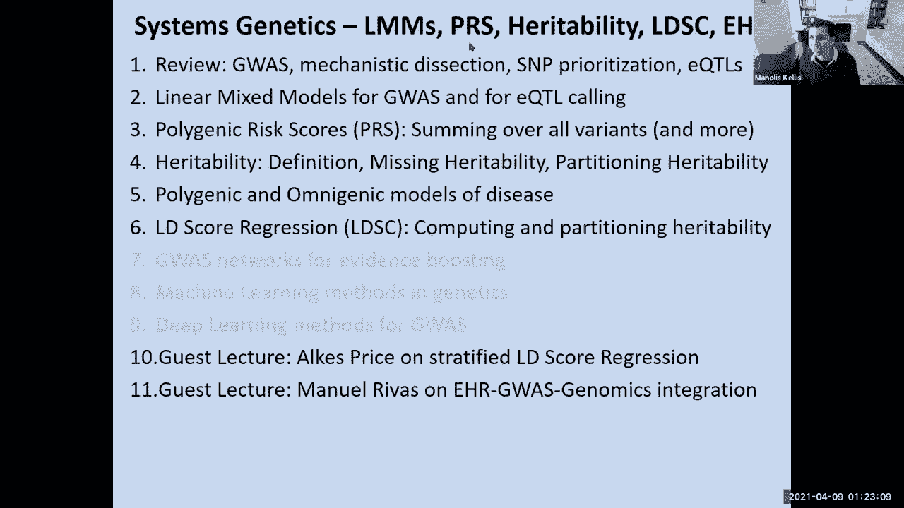
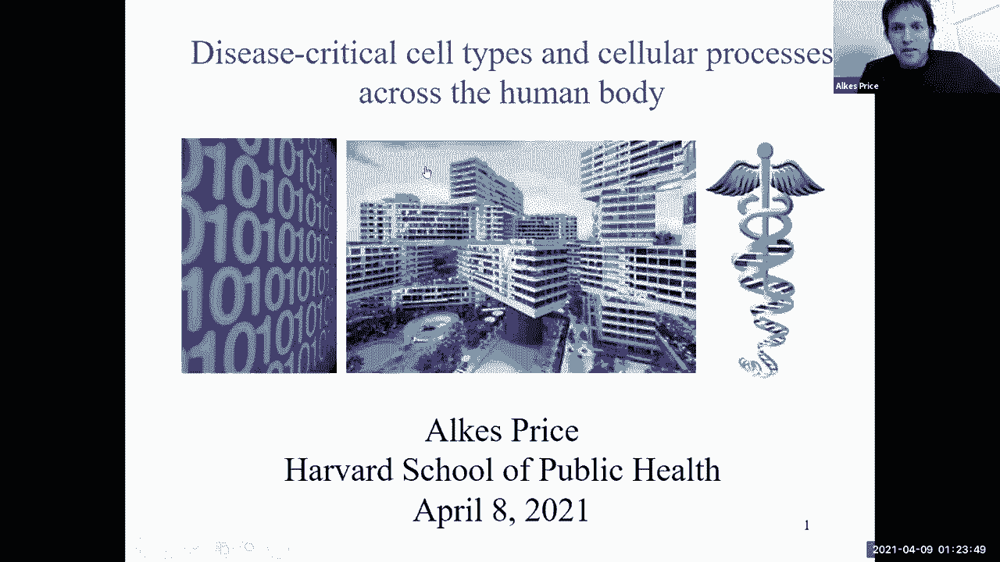
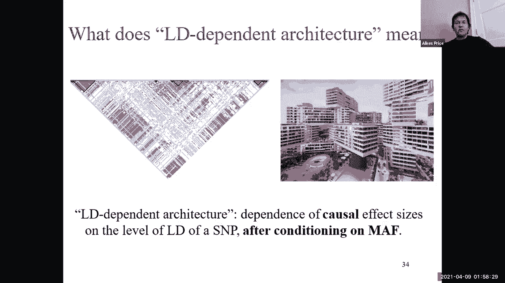
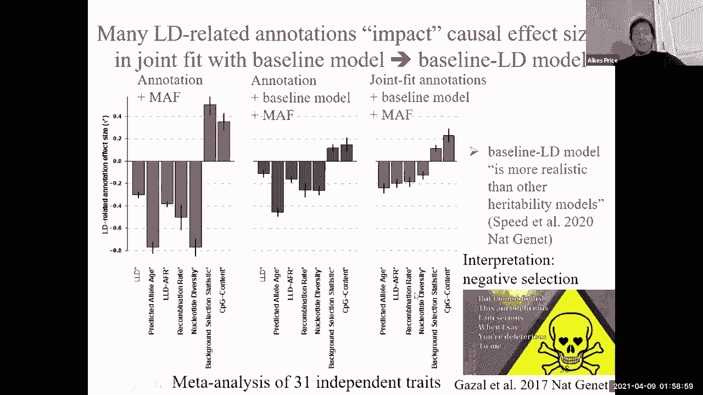
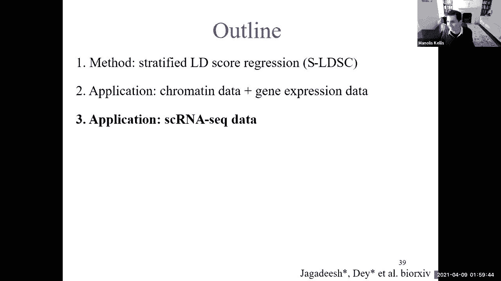
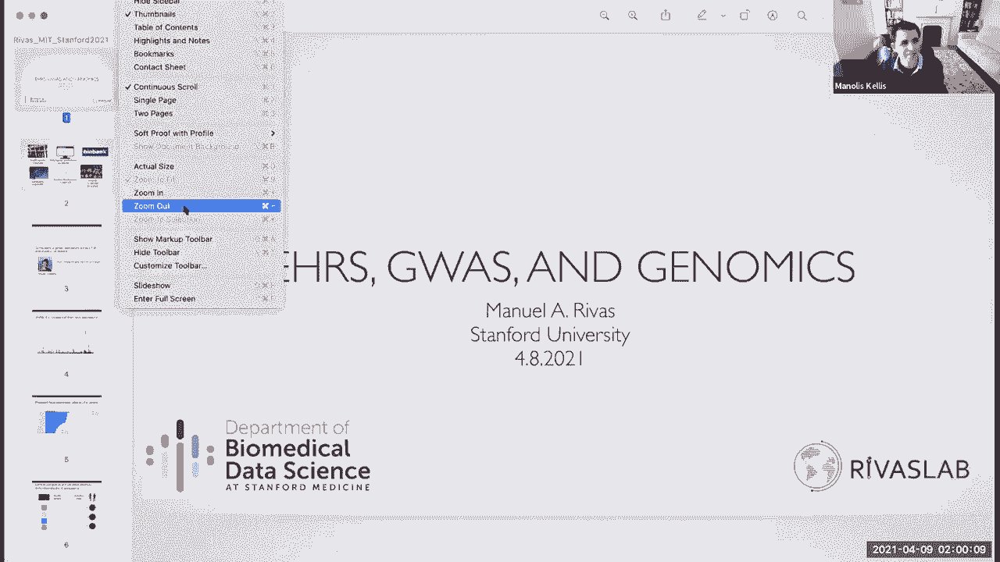
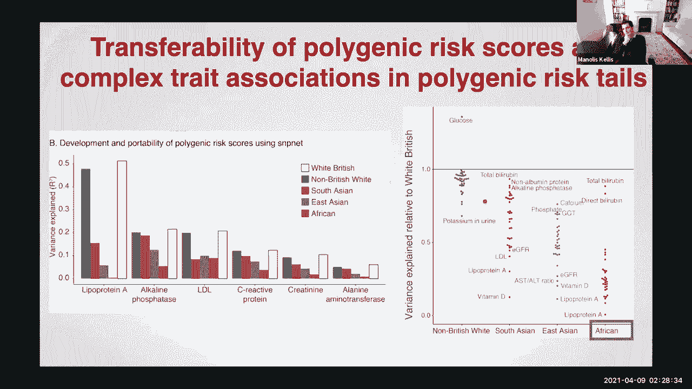

# 【双语字幕】MIT《面向生命科学的深度学习》课程(2021) by Manolis Kellis - P14：Lecture 14 - Systems Genetics - 爱可可-爱生活 - BV1wV411q7RE

今天我们要讨论系统遗传学，这是模块中关于遗传学的最后一课，所以我们把它带到系统层面，我们还将讨论电子健康记录，所以我们要介绍线性混合模型，谈遗传力定义，潜入LD分数回归，然后是电子健康记录，G是集成。

我们很幸运有两个客座讲座，hsb的altis price博士，斯坦福大学的曼努埃尔·里瓦斯博士，所以我们将简要地回顾一下，到目前为止，我们在这个模块中看到了什么，然后潜入线性混合模型，多基因风险评分。

遗传力，然后谈谈全能模特，然后转向所有这些回归，我有一些关于高级主题的附加幻灯片，我们显然没有时间覆盖，然后我们会切换到阿利斯和曼纽尔，所以简单回顾一下，我们所站的地方，我们已经讨论了常见和罕见的变体。

强效应、弱效应与多基因风险评分，G的应用领域与联动分析，我们已经讨论过连锁不平衡，哪个是你的朋友，如果你只是想简单地找到关联块在哪里，因为你只能对片段的一个子集进行基因型，然后找到方块。

但当你试图找到地图时，它就成了你的敌人，驱动这些关联的因果变体是什么，这在很大程度上是理解全基因组关联研究的机制的挑战，为什么解释它们这么难，因为这些关联中的绝大多数是非编码的，当它们有多个片段时。

这意味着我们不知道因果变体，我们不知道目标基因，细胞的作用类型，相关途径，等等，等等，所以说，我们在这个模块中一直在讨论的是，我们如何整合基因组信息以精细映射变体，然后是RNA信息。

序列函数的变异信息和深度学习模型开始预测驱动基因，区域和细胞类型来获得疾病基因座背后的电路，我们看到了这些如何应用于特定的领域，让我们既能揭开电路，又能反转电路，然后呃，上次。

我们研究了如何在全基因组水平上利用它丰富，用一个非常简单的浓缩分析来找到相关的组织，今天，阿基斯·普莱斯博士的客座演讲，将深入研究最流行的方法之一，即LD分数回归，我们说过，我们如何利用这些丰富。

用于优先考虑遗传方差的后验概率，鉴于关联中的许多遗传差异，我们如何利用表观基因组信息对这些变体进行优先级排序，以及我们如何利用这些信息来优先考虑，通过在全基因组显著位点上训练来阈值新的疾病位点。

然后将其应用于亚阈值基因座，然后我们看到了如何使用大量增加的组织和细胞类型，开始在他们的肝脏中解剖导致冠心病等复杂特征的成分，心脏特异性，然后呃，多应用各向同性组分，然后我们转向EQ，tls。

以及我们如何追踪这些遗传变异的中间影响沿着因果关系的路径，以及我们如何开始使用归责，用于预测相关性，在这些中间分子表型的遗传成分和最终疾病之间，然后我们看到了EQTLS的螺母和螺栓。

特别是我们如何将表达视为线性回归预测器，基因型和协变量的预测，我们看到了这个，呃，不仅仅使用这些回归系数的eQTL模型，这些效应尺寸系数，作为该个体基因型的产物，也就是零，一个，两个危险等位基因。

比如说，或交替等位基因，而且今天也利用这些协变量，我们将扩大这一范围，以增加额外的人口分层效应，特别是，我们将研究线性混合模型，对于g是和对于eQTL调用，那么什么是线性混合模型。

所以我们基本上要看固定效应，以及导致感兴趣的表型的随机效应，所以设置很简单，我们基本上是在试图预测表型的集合，用于，让我们说，一千个个体使用他们的基因型，在基因组的数百万个位置。

这些θ向量基本上告诉我们，这些遗传变异的每一个贡献是什么，加上一些错误，好的，所以这是我们将要研究的基本框架，表型预测，表型可能是表达，也可能是身高，用一些，你知道的，固定成分和使用这些基因型依赖成分。

那么谁和我在一起，关于预测一个人表型的基本基础，根据他们拥有的交替等位基因的数量，这些交替等位基因的效应大小，基因组中的所有快照和我们队列中的所有个体，呃，可爱，所以我们在五三，四一，六零，零。

所以这和用线性代数形式写的完全一样，所以我们基本上将应用相同的缩放因子，每个基因型上的θ，然后把每个人的基因组范围的影响加起来，现在的问题是噪音是如何分布的。

我们基本上可以把噪音看作是简单地分布在相同分布的个体之间，他们每个人都有噪音，以零为中心，你知道的，平方，呃，协方差矩阵，基本上就是嗯，简单地按一组标量缩放的对角矩阵，这是每个人的差异，相同的单位矩阵。

所以这些都是IID，基本上问题是这实际上可能不是真的，所以我们要考虑的是，除了这种完全独立于个体的噪声矢量，我们想计算随机效应，这可能被亲属关系协方差所捕获，什么是亲属关系协方差，这基本上告诉我们。

我们测量的遗传方差有多少，由每对个体共享，所以这只是一个向量，基本上告诉我们每个人，它们的基因位点有多少共享，所以我们基本上有了ID组件，我们也有，亲属关系成分，对许多人来说，许多基因组关联研究问题。

最具影响力的随机效应源于人口结构，所以我们要做的是建模这些，由那个协方差引起的效应，呃，亲属关系矩阵，所以我们将使用贝叶斯方法，来解释这些随机效应，说它们是根据亲属关系矩阵分布的，使用这种贝叶斯方法。

通过平均来解决和消除不确定性，所以我们将集成所有这些，呃，未知到，呃，你知道吗，用这个，嗯，基本上说，每种表型效应的概率是多少，由协方差矩阵驱动，这就是线性混合模型，呃会进来的。

所以基本上我们可以观察表型的后果，作为基因型矩阵的线性函数，加上一个错误组件，它包含了我们之前看到的iid错误，亲属关系成分，就是相关性，嘿嘿，8月，你已经来了，所以呃，我会亲吻。

你们的客座演讲什么时候开始？我以为是一点半，但我隐约记得你换到了十五分，我无所谓，我的课程在两点确实很难停下来，好的，所以嗯，我会试着把它包起来，呃很快，因为我想你会报道很多这些事情。

所以我尽量在接下来的几分钟内结束，这些线性的基本基础，混合模型是你要建立一个联合模型，在所有的片段中，以及它们如何解释某一特定性状的总遗传性，根据这个无限小的假设。

我们可以用这个受限的最大似然模型来估计，这避免了对每个参数参数使用ml拟合估计值，而是使用转换数据，这样新闻的所有参数都没有影响，我们将使用这些方差分量分析，这个随机效应模型允许我们捕捉这些转换。

所以这一切的美妙之处在于它实际上是有效的，尽管不知道实际的因果差异，我们要谈谈遗传力，呃，很快，所以这让我们可以开始捕捉，嗯，很多额外的变化，所以你可以用两种不同的方式。

你可以通过预测对每一个的影响来使用这一点，比如说，来自每个个体实例片段的中间分子表型，这和我们上次讲的很相似，也可以直接使用片段和表达式之间的线性关系，以及表达与性状之间的线性关系。

实际上不必为每个人实例化单个基因型变量，而是通过呃把这些效果结合起来，ld，呃，你所有个人的相关性，通过你的每一个呃的影响，片段和你的每一个基因在最终表型上，所以你可以用这个开始。

每一个片段对表达式级别的影响是什么，比如说，对于这些中间表型使用呃，eqtl，然后利用观察到的因素，哪些是你在A队列中观察到的协变量，但也有隐藏的因素，可以从你的队列中从头开始学习，因此。

您可以使用这些模型与不提供信息的先验，或者你基本上可以说好，我们期望这些参数以我们的最大似然估计为中心，或其他估计，然后我们有一些潜在的噪音围绕着它，您可以使用与此匹配的先前发行版。

无论是平滑的还是非常尖锐的，嗯以那些为中心，然后在这个参数空间中搜索，开始推断您想要的参数，事实上，在全球范围内产生的最强烈的影响之一是，事实上直接源于人口差异，所以这是这个已经显示出来了，事实上。

由在这里的阿利斯，嗯，是推动这些遗传矩阵穿越的最强效应之一，比如说，欧洲大陆，如果你看基因型矩阵的主成分分析，在没有任何表型效应的情况下，你基本上可以看到你所有样本的位置，根据变异的前两个主成分是。

实际上重述了他们在欧洲大陆的地理位置，表明你的基因型有这些全球性的横切效应，我们就可以，你知道的，用呃，所有这些现在都要校正这些矩阵，然后呃开始推断，所以我很想直接切换到我们的钥匙，或许我们可以。

这在讲座开始时，下次，也许我想捕捉的关键点之一，我想这对，在准备我们的CAS演示时，是遗传性的概念，我们基本上可以问的概念，我们能解释多少表型变异，使用加性效应，利用显性效应和交互作用效应。

很多G是潜在的，是在做这个潜在的隐含的加法性假设，如果我不断增加基因组中每一个片段的独立影响，我最终会捕捉到总遗传力的一部分，这种遗传性实际上允许你开始问，任何两个个体在表型上有多大关系。

任何两个个体在基因型水平上有多大关系，这实际上给了你一个非常强大的方法来计算遗传性，就像简单的，表型变异比，表型相似性和基因型相似性的基因型研究，这就是它变得非常有趣的地方，因为你可以开始问，呃。

如果我把我的遗传相关性划分为基因组的子集，而不是问整个基因组中的这种相关性，我可以在基因组的一个子集中要求相关性，比如说，只有一号染色体，或者只有2号染色体，或者只有三号染色体，只有4号染色体，等等。

等等，真正值得注意的是，我们发现，或者至少田野发现，染色体越长，这里它们是按长度排序的，它们在人类基因组中按长度编号，染色体越长，方差越大，他们为许多人解释，许多这些复杂的特征，暗示着。

疾病的表型基础几乎均匀地分布在基因组中，你知道你基本上可以取不同的基因组，这一兆字节的基因组块，然后看看那里捕捉到了多少遗传性，这实际上是以不同的方式划分基因组的基础，而不是对基因组进行分区。

只使用染色体，你可以开始根据表型注释对基因组进行分区，或基于表观基因组注释，比如说，dna高敏感位点或启动子区，或中微子或编码区，事实上，这个分层LD评分回归的基础，我们的孩子很快就会出现，所以说。

无论如何，在这里真的很高兴。

阿尔蒂斯价格，他是哈佛大学公共卫生学院的教授，他实际上是许多这些模型的开发人员之一，在许多方面都在推动这个领域，所以我会把它拿走好吧，下午好，各位，我很遗憾，哈佛大学公共卫生学院的价格。

我为我的简短演讲确定的标题是疾病，人体的关键细胞类型和细胞过程，这就像减去提到的那样，利用一个叫做分层lscore回归的工具，当我教书的时候，我喜欢鼓励人们提出任何问题和评论，你可能两者都有。

因为它更有趣，因为这样对每个人来说都更有信息，所以请不要羞于跳进去。

我知道我知道这不会好的，这是我演讲的提纲，我将从一篇方法文章开始，而不是用生物动机的文章，但如果你想知道它的生物学动机是什么，你知道的，对人类了解疾病有用，人体关键细胞类型。

你可以在这篇评论论文中找到一些生物学动机，但是到了方法部分，这篇文章是关于开始的，I得分回归，对所有人来说最相关的参考文献，两千零一万五，所以我将从片段遗传力的定义开始，现在对遗传力有不同的定义。

所有这些都很重要，这个特定的定义是一组特定片段的函数，所以这个数量在种群中的潜在价值是一个函数，不仅仅是你正在研究的人口，很明显，这是你正在研究的疾病或特征的功能，这也是你在学习哪一组片段的函数。

如果你有一大组片段，那么它可能会有一个更大的片段，与之相关的遗传力比一些小片段，所以考虑到这一点，我们将把持久性定义为一个参数，这是在整个人口中定义的，作为你在整个人口中能达到的最大值。

就最大化你表型之间的r平方而言，以及基因型的任何线性组合，因此，这被定义为整个总体中的一个参数，我不需要做任何特别的假设，做这个定义，当然如果我手头有一些有限样本的数据，那你知道如果我幸运的话。

我可能有一些很好的方法，可以提供一个很好的无偏见，这个参数的不太杂的估计，你知道的，根据我所掌握的有限数量的数据，正如负刚才指出的那样，杨的GTA方法在所有两万一是那种，你知道的，主纸或第一张大纸。

在从人类遗传数据中估计寿命的空间里，但我现在不打算详述，及以上，并且超越了在整个基因组中估计单个片段遗传力参数，一个可能非常有趣的皱纹，是定义和估计不同功能类别的片段遗传性参数，所以当我谈到功能类别时。

我们会进入这个，但是您可以考虑编码和非编码片段，你知道的，调节片段，哺乳动物之间保守的片段，你知道基因组中有不同口味的片段，和，将遗传性划分到那些，snps的不同功能类别，因此。

如果我们有多个功能类别的片段，也许我们把所有的片段都分成了，你知道吗，五个、十个或二十个不同的功能类别，你知道吗，我们可以把这个定义推广到，差异由每个相应类别中的片段集解释，这可以使我们得出结论。

那么我们就必须考虑在有限的sap中进行估计，使用来自有限样本的数据，我马上就会讲到，但这可以让我们得出结论，就像，你知道的，丰富编码片段以提高遗传性，或者你知道，调节剪或特定组织中的调节剪。

为遗传力而丰富，和特定疾病，或在哺乳动物中保存的片段因遗传性而丰富，或者那些类型的结论，同样，有一个根本的区别，你知道，在这个领域的几乎任何问题中，一方面，提供参数的定义。

该参数是考虑整个总体的有效定义，另一方面，提出一种估计方法，它在有限样本中给出有限数量的数据，能努力得出一个好的估计，也就是说，一个无偏见的估计，希望在总体水平参数的低标准误差下，所有的权利，所以啊。

你知道吗，在统计遗传学的早期，每个人都在分析个人层面的数据，数千个个体的基因型和表型，但当我们进入，你知道的，更大的数据集和元分析的联盟疾病联盟，你知道40个不同队列的汇总关联统计数据。

当我们进入统计遗传学历史的这个阶段，人们对分析汇总统计数据越来越感兴趣，设计汇总统计数据分析方法，这在很大程度上是，你知道这本《自然遗传学》的社论，他们在信中要求，他们不需要。

但他们要求在他们的期刊上发表的作者公开发布他们的摘要协会统计数据，其中按汇总关联统计，我说的是，每个片段的GWAS关联Z得分，基因型或估算片段分析，在某些情况下，知道计算Z分数的样本量是很有用的。

因为可能会有一些片段，这些都是很差的估算和从队列的子集中删除的，所以样本量可能会随着一个片段而有所不同，知道这一点很有用，在这张幻灯片的底部，我注意到在许多应用程序中，有参考LG信息是有用的。

连接到关于计算的片段之间相关性的平衡信息，比如说，使用一些人口参考面板，比如千个基因组，所以今天我们主要讨论的是，呃，分析汇总统计数据的方法，对于大多数疾病来说，你可以想到精神分裂症或风湿性关节炎。

老太婆病，无论你对什么疾病感兴趣，很有可能，你将有最好的机会分析非常大的样本量，如果你愿意，有点，呃，愿意将就汇总统计数据，而不是完全进入个人级别，基因型和表型，好吧所以，我要讲的方法。

分层LD评分回归是一种你知道的方法，在我们进入数学之前，首先提供一点直觉，就是我们，我们将从疾病地理学中回归高方关联统计数据，这是一个跨片段执行的回归，我们将用LD回归卡方关联统计量。

从不同的功能到不同的功能类别，这里的想法是，如果我，你知道，如果我想评估，比如说，编码snps的遗传性可能过剩的假设，我不只是想看编码片段的关联统计信息，并将它们与非编码片段的关联统计信息进行比较。

因为关联统计，你知道的，它不仅仅来自给定片段的因果效应，它也来自给定片段的标记效果，在那里你标记了其他因果片段，这就是为什么你知道，假设可能是类似于标签的片段，许多编码片段具有较高的卡方统计量。

这是一个更合适的假设来检验，那么假设编码片段本身比其他片段具有更高的关联统计量，所以这个方法依赖于一个非常基本的想法，嗯，由于各种不同的扬加特，当你运行一个g时，所有的文件都是平均chi的平方，大于一。

并不意味着混淆，所以你知道，在过去的日子里，长长的，长，很久以前，人们想得很好，你知道吗，如果我在运行GWAS，你知道吗，也许只用几千个样本，几乎所有的片段都可能是空片段，应该在NULL下。

你知道平均气的平方是1，或者你也可以计算中位的chi平方，它对离群值更健壮一点，这叫做基因组控制，但我不打算谈这个，你知道的，在小样本量下，在过去，平均气的平方应该很接近1。

当你的平均气平方大大高于1时，人们会认为，哦不，我的平均气平方大于1，我一定对混淆有什么问题，由于，你知道，人口分层或隐性相关性，或者类似的东西，但随着时间的推移，你认识的人意识到。

尤其是在这个杨在所有211报纸的人意识到随着时间的推移，当我们得到大样本量时，我们可以期望我们的平均卡方统计量大于1，由于真正的多基因信号，其中一些数学来自Yengel 20111。

我们实际上可以写下作为片段遗传性的函数，嗯，剪断遗传力和L um量，我们期望平均卡方大于1的精确程度，所以这里的方程，这是一个方程，它字面上指定了，你期望平均卡方大于1的精确量，你的年龄越大。

你知道这个，这里的数量是所有片段的平均LD得分，那里有一个LD分数，只是一个片段本身的r平方之和，以及其他片段，你的lg就越多，嗯，平均气的平方就越高，因为卡方关联统计，由于因果关系而超过1的数量。

你知道的，由于由于真实信号，好吧，真正的信号可能是因果关系，一个片段在生物学上是因果的信号，但也可能是标记信号，一个片段不是生物学上的因果关系，但与其他一些生物学上因果关系的片段有关。

因此有某种真正的信号，平均气分数大于1，所以这个想法可以追溯到杨在2万1，平均气的平方大于1并不意味着混淆，但实际上是特定水平的剪裁遗传力的预期结果，加上大样本量，这是这个方法的核心想法，呃，分层的。

至少得分回归，所以我们可以从没有功能类别的LD评分回归开始，从UL的轮廓来看，他可能已经检查过了，但我们可以我们还可以再来一遍，所以在这里，我们只是要去，我们将对每一个片段进行回归。

这是一个跨片段的回归，我们将对每一个片段进行回归，这是关于那个片段的chi平方关联统计，LD得分，也就是说，它本身就是我们的一些分数，以及其他片段，我们预计我们将从，如果没有混淆，这个回归应该等于1。

或大于1，如果在实践中存在混淆，你需要担心你的旧街区外的任何剪断吗，实际有多少个LD块，我们已经做到了，呃，我们把LD分数的计算限制在，正负一兆字节，那个，呃，你知道，一般就足够了，我是说。

用于常见片段的LD，你知道，你知道，在欧洲人口中可能有50 KB，在非洲人口中可能下降到25kb，不受非洲以外瓶颈的影响，增加了l，你知道那是平均的，很明显，你会有一些比这更远的lds。

尤其是当你进入低频片段时，所以我们，呃当选，我觉得，在所有这些论文中，去正负一兆字节，有人尝试过对基因组中的所有片段进行完整的计算吗，而不是说只有一个大的基地社区，而不是说周围的几个旧街区。

看看是否有什么不同，是啊，是啊，嗯，所以这就变得复杂了，我是说，第一名，它可能是非常计算密集的，嗯，是啊，是啊，我是说，第一名，它可能是非常计算密集的，第二名，如果你是，如果你在看一个。

如果你在看参考资料，如果你在看参考资料，LD样本，染色体上真的不会有任何东西，我喜欢它，从某种意义上说，尤其是如果它是一个非常均匀的LD参考面板，从字面上来说，不可能有一个对不起。

如果您有幸拥有个人级别的数据和访问，在GI样本中，可能有交叉染色体，由于，嗯机会对，如果我有一个有限的样本，你知道，这种情况在罕见的片段中尤其常见，你知道，如果我有一个单身。

一条染色体上的单个个体可能与，你知道对另一条染色体上的单身，如果这纯粹是偶然发生的，参考等位基因存在于相同的个体中，对于排列不同染色体的两个片段，情况似乎是，我是说。

我们小组中由PostDoc领导的项目之一，马丁·张正在调查这件事，调查这些问题，在罕见的情况下，一旦你开始去罕见的片段，那么当所有这些变得更加重要时，你刚才提出的问题，它变得更合适，嗯，考虑某种机会。

非人口水平，但是在有限的目标样本中染色体之间的样本机会LD，理论上有原因，原则上，你实际上对目标样本中的样本LD更感兴趣，比老年人在整个人口中，但这是一个微妙之处，可能不值得深入。

考虑到我们有这么多时间，这实际上没有太大区别，所以简短的回答是不要担心，尤其是如果你专注于常见的片段，美丽，所有的权利，所以呃，所有这些东西，你知道的，呃可能是最直观的解释使用一个真实的数据集。

所以这是嗯，这是一个真实的精神分裂症数据集，你知道从啊，从地标，二千零一四张纸，这是真实的数据，在x轴上我们有，现在不是每个点都是一个单一的片段，因为那样就会很吵，不可能看到。

但每一个片段都像一个片段的集合，一组具有相似LD分数的片段的平均值，所以它们是由LD分数建造的装箱片段，这些是旧的垃圾箱，我们可以在这个情节的右边看到，平均有大量LD喜欢的片段，他们是。

你知道一个有250个不同片段的旧D，好吧，如果你是一个有250个其他片段的老D，那么你可能会标记很多片段，你标记了很多可能是因果关系的片段，所以期望你有一个平均的chi平方。

因为你从其他片段中标记的所有信号，而如果你的LD分数很低，你知道接近一个，这是最小的LD分数，因为每一个片段都会和自己在一起，当我们看到这些非常低的LD分数片段时，当你运行这个回归时。

你看他们的平均高分非常接近零分，这基本上反映了这样一个事实，如果你是，你知道标记接近零的片段，那么你实际上会有零驰平方关联统计量，如果没有混淆，这就是你所期望的，所以这个拦截接近一个。

一旦你减去有效的LD，你就不是了，你没有和很多其他的片段在一起，这可能是因果关系，你在标记，那么你的平均气的平方就接近于1，整个数据集的平均值，平均卡方是1。6，比一个大得多，事实上，当你跑的时候。

这个拦截，回归到1意味着平均值，不是因为混淆，这主要是由于道歉的信号，与你在LG中的片段数成正比，或者你标记，事实上，这个拦截是一个暗示或接近，这意味着这不是混淆，这是关于因果西格玛的LG标记。

所以这就是它看起来的样子，如果我们没有函数注释，这就是拦截告诉你的混淆，然后这个坡度，请允许我简单地回到这张幻灯片中的主方程，斜率可以用来估计这个量，这让你得到了剪裁遗传性，所以斜率等于。

这个量可以用来估计剪裁遗传力，我们得小心一点，当我们谈论剪裁遗传力时，哪一组片段，我们正在估计，在这种情况下，我们在估计片段遗传力，在我们的旧参考面板中的任何一组剪裁，比如千个基因组。

现在我们可以把这个弄得更复杂，加一层，有趣的复杂性，而不仅仅是看着，嗯，你知道吗，在一个片段的总LD分上，我们可以看看一个片段的旧分数，关于特定功能类别中的片段，就像，比如说。

片段相对于编码片段的LD得分，如果那是，那是那个片段的R分之和，使用所有编码片段，然后现在而不是旧的分数，总是至少有一个，如果我拿一个非编码片段，原则上，它可能不是带有任何编码片段的LG，原则上。

它可以有一个LD D来编码零片段，有可能，所以我们计算这些LD分数，我们感兴趣的每个功能类别，反过来，而不是做一种chi平方的线性回归，LD得分统计，我们可以对chi评分统计进行多元线性回归。

在旧分数上，在我们感兴趣的每个功能类别的各自LD得分上，事实证明，该倍数的各自斜率，线性回归可以告诉你一些关于，你知道的，剪断，剪断遗传力，这是由于特定功能类别中的片段造成的，这样因果片段。

编码片段的遗传性，因果关系，你知道的，剪断，调控片段或调控片段在特定组织中的遗传性，等等，等等，有一个基本的量富集，这就像对于一个特定的功能类别一样，比如说编码片段。

该功能类别解释的片段遗传力的百分比是多少，与该功能类别中的片段百分比相比，所以如果是百分之一的片段，但它解释了10%的剪裁遗传力，那么它的遗传力就丰富了十倍，这些细分能有多细粒度。

因为如果你在同一个ID块内，你有一堆不同的功能类别，每一个片段都在影响，在旧街区的每一个片段，但你把它们分成不同的类别，有没有什么，我是说答案是，它可以是非常细的颗粒，我是说你可以，你可以想象一套。

你知道的，我不知道，一百个片段，每个片段都有八个，但如果你知道，你知道，如果你在单个轨迹上做精细的映射，你有一百个片段，每个人都有一个旧的d点8，对于成功地绘制精细地图来说，这可能是一场灾难，单个位点。

这就是为什么精细映射，单个轨迹在统计上是一个难以置信的难题，大多数情况下，我根本不能有效地罚款，但是一旦你谈到整合信息，关于编码和调节片段以及整个基因组数据中的任何东西，然后你可以开始挑逗它。

实际上得到了相当精确的估计，用编码片段或因果解释的遗传性原因，你知道吗，通过调节片段等进行因果解释，其实是谢谢你，所有的权利，所以我有点，你知道吗，关于重叠与不重叠的快速与松散，但如果功能类别重叠。

它实际上完全可以工作，比如，你知道，也许你有一个函数注释，它有值，一个用于编码片段，零用于非编码片段，然后你有一个不同的功能注释，你知道的，哺乳动物之间保守的片段值1，哺乳动物中不保守的片段为零。

但当然，涂层剪子和剪子之间有一定程度的重叠，在哺乳动物中保存的，这些是重叠的功能类别，事实证明，如果它们重叠是完全可以的，我们必须，你知道的，对不起，我们必须对斜坡进行功能解释，你知道如果它们不重叠。

你知道我们有一些简单的，简单简单，你知道，的推广，你知道，n除以m乘以片段，遗传力，一旦功能类别重叠，它开始变得有点不同，很难想象我们如何解释这个斜坡，但如果我们仔细做，我们仍然可以解释斜率。

我们仍然可以，你知道吗，定义浓缩的方式大致相同，你知道的，也许编码片段可能是所有片段的百分之一，但可能解释了10%的遗传力，对无数人来说也是如此，可以包含在同一模型中的其他功能注释。

我们甚至可以更进一步，看看连续的函数注释，我们在2017年的一篇后续论文中做了这一点，又在这里，我会掩盖细节，而不是说你知道，使用二进制注释所做的一切，你几乎可以用连续值泛函做所有相同的数学。

如果你只是，你知道的，一路上引入一些额外的铃铛和哨子，我应该跳过这张幻灯片，除了说你知道，我们有一个额外的复杂性层，引入一些回归权重，来解释这样一个事实，即您知道您有相关的数据，如果回归中的一个片段与。

回归中的另一个片段，那就是多余的信息，我们应该纠正多余的信息，有一个不同的现象，这实际上是一个统计相关的现象，但这是一个根本不同的现象，你知道的，涉及异质性。

其中我们知道LD分数较高的片段具有较高的平均值，还有它的气平方的方差，我们可能也应该解释这一点，所以高LD分数的片段，不完全支配回归的输出，所以那些是一些铃铛和哨子，我们不必详细说明。

所以在最初的2015年的作品中，这些是我们研究的一些功能类别，嗯，你知道吗，编码片段，呃，哺乳动物之间保守的片段，各种口味的增强剂，呃，组蛋白标记，等等等等，这是一组模拟，呃，表明你知道，正如我们所料。

该方法在理想情况下产生无偏估计，其中所有的因果类别，在这种情况下，因果类别是DHS，它是一个函数注释，脱氧核糖核酸是一种超敏反应位点，那是一个标记染色质，只要模型知道因果类别，LD分数回归应该不足为奇。

不管我们是否只是告诉它这两个类别，DHS和非DHS，或者我们是否讲述它，带有所有这些不同注释的完整基线模型，你在模型中加入30个注释，然后在30个注释中加入多元线性回归，你知道的，注释类别。

它工作得很好，就像您使用单个级别的数据一样，在两个类别中划分遗传性的dremel方法，所有这些方法都产生了基本无偏的估计，但当你有不在模型中的因果类别时，棘手的部分就来了，所以你知道，在这种情况下，嗯。

你知道我们有，我们要保持，你将使用相同的因果类别，嗯，你知道吗，dhs，但我们不会把因果分类，在LD分数回归模型中，嗯，如果我们有两个类别，嗯，你知道吗，呃，你知道我们在找什么，或，我想我们是在说。

我们告诉模型关于DHS和非DHS，但随后我们将评估这些其他类别的丰富程度，像编码或幻影五增强器，你可以看到两者都记得，基于个人水平的方法和LD评分回归方法，我你知道，当他们不知道这些因果类别时。

就不会很好地工作，比如侧翼区域或编码区域，或增强区域，这并不是一个大惊喜，你知道的，如果你对模特撒谎说真相是什么，然后模型试图在不知道全部真相的情况下进行推理，它可能会产生一个有偏见的结果。

但好消息是如果我们试图发动进攻，我们包括所有这些，你知道吗，我们使用的基线模型的类别，当我们运行分层LD评分回归时，然后我们去掉因果范畴，但我们包括所有，我们保留基线模型中的所有其他类别。

那么好消息是分层，只有得分攻击性仍然产生相当接近无偏见的估计，这意味着基线模型足够丰富，它有足够多的不同功能类别，它知道这件事，即使有你知道的，他们中的一些人失踪了，我们当然不能，我们不能，我们干脆。

我们不应该相信基线模型字面上捕捉到了，你知道的，现实生活功能的丰富，它只包括我们所知道的30个注释，但证据似乎是，即使我们，你知道的，去掉一两个类别，这是因果关系，我们试图对其进行推断。

那么模型中剩下的两个九个类别似乎提供了足够的丰富性，足够丰富的建模，嗯，型号错过规格是最小的，我们仍然能够产生至少相当接近无偏见的估计，你知道，与，如果我们运行LD分数回归，只使用两个类别。

如DHS和DHS，或相当，如果我们运行单个方法，只使用DHS和在DHS上分析个人数据，然后我们就遇到了问题，个人层面的数据方法目前还没有得到调整，或者设计成在30个重叠的地方运行。

或在某些情况下连续值功能类别，所以现在不是一个选择，说我们要跑Remel，使用大量重叠的类别，甚至连续值注释，所有权利，有一个微妙之处，我觉得我应该跳过，你知道你仍然可以违反模型假设，如果你不小心。

如果你看看基因表达数据中的顶级CCQTL，那么这是一个注释的例子，它不满足，基本模型假设任何具有其注释函数的片段，你知道剪裁效果应该是iID，因为它，原来你知道。

带有顶级ccqtl的ld片段可能是因果关系，因为topsy cql可能正在标记，因此对毒性注释的分析，qtl从根本上违反了建模假设，这是你所看到的和函数的函数，你知道的，呃。

所有片段在其注释值上都是IID主题条件，这个建模假设被证明是错误的，如果查看一个名为topcqtl的注释，其中可以包括许多标记snp，那碰巧是顶部的CQTL，这个轨迹，你可以得到无偏的估计。

用于SL DC和其他方法，当你做推理的时候，呃，在这种情况下，所有的权利，所以我剩下的时间不多了，这是换挡的自然时机，从方法片到真实数据片，对我来说，这是教授方法的最好方法。

科学是当你看真实数据时看到发生了什么，所以现在我们要看看这种方法的一些应用，一些染色质数据，还有一些基因表达数据，也许我们甚至可以得到L依赖的体系结构，这些是我们分析的17个特征中的一些。

在最初的工作中，这些都是公开的汇总统计数据和相当大的样本量，这几天，十万的账户是相当大的，相当大的，不是非常大的，非常大的会有五十万或一百万，但样本量仍然相当大，你知道。

最初的发现之一是编码snps实际上丰富了，疾病和复杂性状的可比性，取决于你看到的特定特征，嗯，呃，你知道吗，我们看到自身免疫性疾病和身高的最大丰富，精神分裂症和体重指数的含量可能略低。

以及不同风格的增强器和增强器相关注释，各种法规注释也同样丰富，可能不如编码snps丰富，但对疾病和复杂的性状仍然有大量的过度丰富，有趣的是，是，这是，跨两个保存的片段。

九种哺乳动物实际上是功能最丰富的类别之一，你知道，在遗传性方面比编码snps更丰富，也就是说，这是你知道的那种剪裁，你知道的，哺乳动物系统发育，你知道的，他们在那里，你在人类身上有一个片段。

在基因组的一部分，它不容忍任何突变，在哺乳动物的系统发育过程中，这意味着这个片段可能在做一些重要的事情，如果它在做一些重要的事情，它可能会对疾病产生相当大的影响，这就是这个分析告诉我们的。

然后我们看了幻影五增强剂，这些都是特殊的非常专业的增强剂测试，在幻影五增强器的情况下，我们看到了一个非常大的和统计上显著的自身免疫性疾病的丰富，其他特征也没有什么可欣赏的，我们是否也应该解释这些结果。

因为体重指数比身高或精神分裂症更与存活率有关，或者免疫与否，你不会理解的，这是个好问题，i，我想是，我我想得很好，我们必须，我是说，我们要注意这里的标准误差，我认为这是真的，所以首先我们。

如果我们有一个片段影响，呃，你知道的，让我们以精神分裂症为例，精神分裂症就是一个很好的例子，如果我们有一个片段增加了你患精神分裂症的风险，有一种观点认为，嗯，如果一个片段会增加你患精神分裂症的风险。

精神分裂症，精神分裂症患者的子女平均较少，这可能已经存在了几万年或几十万年，那么你知道突变，你知道的，增加你患精神分裂症的风险，可能会导致你少生孩子，但社区实际上相信的是，有别的事情发生了。

所谓的应用热带选择，在哪里，如果你有一个影响精神分裂症的片段，它可能以各种方式影响大脑，你知道，甚至可能是一个片段，降低你患精神分裂症的风险，但它仍然会对大脑产生深远的影响。

几乎所有的突变都有一个不好的，有……，你知道的，现在对健身的不良影响，当然，我们知道有一些突变做了很大的事情，在过去的五百万年里，使我们成为人类而不是黑猩猩的原因，但几乎所有时候突变都会做坏事。

即使是突变，这会降低你患精神分裂症的风险，它可能在做坏事，所以，两者之间存在某种无符号耦合，影响精神分裂症的片段，你知道，影响生殖健康的片段，所以那里有某种耦合，也许我们可以读懂这种耦合的强度。

某些性状较低较高，其他性状较低，你知道，也许与大脑相关的特征可能更高，因为与大脑相关的特征会影响与大脑相关的特征，可能会受到强烈的负面选择对于自身免疫性疾病来说可能更少，也许是的，我也想向全班同学指出。

当然方向性并不重要，所以它本身不是超薄或超重的BMI，这真的是与新陈代谢期有关的东西，对呀，是啊，是啊，而且真的，你知道的，任何影响任何东西的片段都可能是你知道的，任何影响我们的片段。

任何疾病或复杂的特征都可能影响其他东西，这可能会降低适应度或衍生的等位基因，可能会减少健康，伟大的继续，谢谢。为什么这些类别在功能上丰富了，在这篇关于多源性的工作文件中发现，我不打算详细讨论这个方法。

最终的结论是，这些功能类别因遗传性而丰富的原因不是，这实际上不是由于更大的因果效应大小，这并不像你有相同数量的因果片段，但它们有更大的效果尺寸，这根本不是真的，因为事实证明，普通的片段有某种柔软的上限。

什么，效果大小可能是由于负选择的约束，如果一个片段做了很多事情，你知道的，负选择不会允许这个片段在，在人口中，所以，这并不是说你有相同数量的因果刺激，效果尺寸较大，相反，你有更多的因果片段。

每个片段都有这种，像中等或小到中等效果，因果效应大小，由于消极选择施加的软约束，条件是成为一个共同的片段，所以更多的是关于，在函数类别中做某事，这不是像剪子一样做一些有巨大影响的事情。

你能解释一下低频是什么意思吗，所以这里的低频，呃是嗯，如此低频，我们说的是常见的片段，嗯，低频片段是在1%到5%的单频之间的片段，所以在遗传性富集方面，以及在多系性富集方面。

这只是意味着低频片段不那么多基因，每个片段的遗传力往往较小，它们也往往有更稀疏的效果，这是不是有点违反直觉，是不是有点违背直觉，他们在那一端，你会期望低频可能是低频，因为他们被选中不是高频的，好的。

所以我应该，我在解释这件事时应该更小心一点，对于任何给定的片段，x轴是遗传性富集，该片段解释的遗传性量与其，每狮子座效应大小，平方乘以p乘以一减p，其中p是等位基因频率，所以一方面，我们知道，嗯。

我们知道那种稀有的剪子，例如低频片段具有更大的每个等位基因效应大小，每个等位基因都有更大的影响，但我们也知道，当你乘以p乘以一减p，他们实际上有更小的人遗传力，所以规范化的可能实际上在光谱的另一端。

是啊，是啊，如果你看每个等位基因效应大小，那么罕见的片段平均每个等位基因效应的大小会更大，或每个等位基因效应大小的平方，谢谢好的，所以现在我们要进入这个部分，我们终于要进入角色了，这与演讲的标题相对应。

与…有关，呃，推断疾病关键细胞类型，这是在最初的2015年论文中，查看UM单元类型特定的调节注释，研究对特定疾病最丰富的，你知道这一点，这显然只是几个最显著的例子，但对于精神分裂症。

对身高最丰富的是大脑调节注释，最丰富的是相关的骨调节适应，和类风湿性关节炎，最丰富的是免疫细胞类型，这当然与已知的生物学知识非常一致，这是一个概念证明，至少在这张幻灯片上，你可以使用。

细胞型组织或细胞型特异性调节注释，结合疾病遗传力富集分析，利用阶层L评分回归推断疾病，疾病和复杂性状的关键组织和细胞类型，这是幻灯片上的一大组特征，其中一些包括吸烟和教育程度，在那里。

大脑的重要性并不令人惊讶，但这些都是以前用基因数据无法获得的结果，由于基因组范围内的数量非常有限，这些性状的显著snps，当时进行了2015年的ENUIN研究，我想是一个和三个基因组，如果你喜欢。

分别为这些性状，这是一个演示，尤其是对于这些高度多基因的性状，嗯，全基因组多基因方法可以，在某些情况下，比集中努力的传统方法产生更多的生物学见解，关于全基因组显著snps，对于这些高度多基因的性状来说。

数量可能很少，所有的权利，所以这是一篇2018年新的后续论文，我们使用特异表达的基因，所以这是一种完全不同的方法，现在我们正在研究基因表达数据，我们使用特异表达的基因。

也就是说大脑中特定表达的基因相对于其他组织，并因精神分裂症而丰富，在结缔组织中特异性表达的基因，与其他组织相比，身高的遗传力更丰富，和在血细胞类型中特异表达的基因。

或免疫细胞类型丰富了类风湿关节炎的遗传性，所以这在很大程度上是一种互补的方法，使用不同于特定单元格类型的数据类型，呃，我们刚才谈到的组蛋白标记或染色质标记，你知道，这些结果总体上与数据上的结果基本一致。

但是他们的数据集实例，在现有的基因表达数据中，你实际上获得了更好的分辨率，与现有的染色质数据相比，所以这是一种互补的方法，我提到了连续函数注释，所以我几分钟后就要出发了。

但是这里有一篇关于连续函数注释的文章，这与依赖旧的体系结构有关，其中依赖LD的体系结构指的是因果效应大小的依赖。

在SNP的L D水平上，在对小等位基因频率进行调理后，我们非常惊讶地看到，LD水平较低的片段，d，即使你调整了数学，因果效应的大小也更大，这对我们研究的所有56个特征都是正确的，从特工初潮到一字眉。

在那里有一个基本的影响，其中LD较低的片段具有较大的因果效应大小，这里的故事丰富而复杂，原来和负选择有关，否定选择在这些旧的相关注释中发挥作用是有原因的。

并导致了这种现象，在给定的较小的Leal频率下用较低水平的LD进行剪切，实际上有更大的因果效应大小，看来我没时间了，我相信米纳斯可以和你分享这些幻灯片，我们可以在你自己的时间里看到。

其中与分析单细胞RNYC数据有关的部分，去学习它，更精致的分辨率，关于疾病的一些事情，关键细胞类型，除此之外，我得走了，我可能还有时间再做一两个，非常快速的问题，我真的要感谢，我们要做一个漂亮的展示。

所以呃，我想我们不应该再扣留你了，因为你实际上有一堂课在两点开始，所以非常感谢你。

好的，谢谢你的邀请，谢谢再见，嗯好吧，曼尼，我想我看到你也在这里，很荣幸向大家介绍曼纽尔里瓦斯教授，来自斯坦福大学，老朋友，然后呃，你知道在很多方面，合作者，尤其是通过他最近的学生轭，所以嗯，曼尼。

很高兴和你谈话，所以他今天会告诉我们如何结合电子健康记录，全基因组关联研究与基因组学，基本上采取什么阿利斯，专注于哪一个是一次一个交易，现在问，这如何适用，当我们看到一大群人的整个电子健康记录时。

把它拿走，你知道，刚开始来这里真的很高兴，我将描述我们正在做的一些工作，在组合多个表型的数据方面，所以只要给一个简短的概述，其中一个数据集，让我们看看我们已经彻底研究过了，是英国生物银行数据集。

这是一个以群体为基础的队列，大约有五十万人，混合了电子健康记录，基于网络的问卷数据，基因分型，基线，生物化学和成像数据，所以它是一个丰富的资源，有成千上万的表型，呃，在基因水平上也有非常丰富的数据集。

所以我们分析遗传数据的典型方法，呃，所以这项研究是由亚尼·巴瓦领导的，呃，这是天性，英国两千个遗传关联和表型的通讯成分，生物库，在基因研究中很典型，我们所做的是运行线性回归百万倍。

比如说一个表型的一百万个遗传变异，就像一些呃，奥的斯·普莱斯描述的分析，所以通常你会发现多基因特征，基因组中的多个遗传变异与给定的TRA相关，鉴于我们可以访问英国生物库的数千种表型。

我们也可以对给定的变体提出问题，我们发现与表型有关，它们与其他表型也有联系吗，在我们能接触到的成千上万的表型中，这只是基因变异的一个例子，我们分析了多种表型的关联，所以在这里。

这种基因变异与许多脂肪指标有关，呃，在x轴上是负号，应用于这些表型的线性回归模型的十个P值，在右手，我们有一个测试版或效果大小图，在那里我们看到了这些多个测量的效果大小，我们可以访问它也让你质疑。

如果他们误解了受够了的问题，准确地说，呃，你知道的，所以有时你也会得到一些经验联想，但其他时候可能是娱乐问题，所以遗传关联研究的特点之一是，我们可以获得极端的多基因特征，我们有无处不在的球员奖杯。

这有时会限制遗传关联的可解释性，用于，所以这里是图表，在那里我们将基因组的遗传变异与数千个特征联系起来，你可以看到遗传变异和性状之间的许多联系映射，所以我们问的一个问题是。

其中一些连接是否可以用一个较低的潜在分量来描述，也许可以用数百种成分来最好地表征，所以某种形式的，嗯，遗传关联研究的低阶维表示，正如阿尔卡所展示的那样，呃，他分析的许多特征，他看到了一些共同的特征。

K po银行的数据也是如此，所以这种方法我们称之为遗传关联分解，使用将许多到许多映射分解为，呃，减少，呃，组件，所以我们把这种方法称为画家埃德加·德根之后的人，这个想法是，对于任何给定的表型。

正如这张图所示，对于任何给定的表型，你可能是，呃，遗传成分可能在许多其他性状上共享，所以这里只是一个表型的例子，与绿色成分共享的遗传成分，蓝色的部分，粉色的部分，比如说，所以我们可以接触到的东西之一是。

获得数千个性状的遗传图谱，所以我们可以把这些数据表示为一个矩阵，在x轴上我们有方差，在y轴上我们有表型，我想这个数据集是两千个表型的五十万个变体，矩阵本身由汇总级数据组成，所以汇总统计。

这将是你在这次演讲和总结中越来越多地听到的主题，统计数据只是一个，你知道的，线性回归效应大小估计，以及与该p值相对应的p值或z分数，所以我们采取的方法之一是应用一个截断的，该矩阵的奇异值分解方法。

并将该矩阵表示为由大约100个分量组成的较低阶分量，一百台，所以每个分量都是这三个矩阵中正交元素的乘积，u，T的s和v，这样您就可以看到表型是如何加载到每个组件的，或者矩阵也是如何，呃对不起。

变体如何加载到该组件，所以当我们把它应用到数据上时，呃，前两个组件，鉴于英国生物库非常丰富，人体测量，呃，你可以看到数据的前两个组成部分在遗传关联方面，以公制表型为最佳特征，所以在x轴上。

我们表示PC1，y轴是pc2，然后呢，你可以看到每一个表型是如何加载到这两个组件上的，比如说，高度的投影正对着，在PC 1和PC 2之间的中间，呃，等待是坐在PC 1上，和其他测量，如手握力，比如说。

是由两者的混合驱动的，呃，同样，我们也可以对遗传变异这样做，所以看看他们是如何加载到，呃，两个组成部分，所以这里，比如说，如果我们在看，那是FTO的慢性变异，您可以看到它投射到这个组件上。

呃四张地图对不起，这个组件，个人电脑一号，PC 2标有4，映射到重量上，呃组件，类似地，其他变体如MC 4是，BDNF更多地依赖于重量分量，而其他基因变体，如SCN用于地图，在…的高成分上多一点。

那么好，我得作曲，哼，你知道，在某种程度上，我觉得有这么多丰富，因为，这些箭中的每一支都应该在策划，在比两个高得多的维空间里，这是正确的完全正确，是啊，是啊，这是正确的，所以要欣赏，当你往下走的时候。

嗯，只是一个特定表型的特征，所以这里，比如说，我们在看体重指数，你可以看到混合成分的贡献，呃，所以这些只是促成它的表型，但这里只描述了PC 2和PC 1，但这两种成分只占60%左右，方差的65%。

而较大的一组其他组件有助于剩余的，呃，三个，方差的5%，所以这里只是为了描述，你知道的，PC2更对应于体重指数的脂肪成分，如果我们看看加载到投影上的表型，PC 1更多地对应于无脂肪质量成分，因此。

给定贸易的构成和贡献部分可以用一些分数来量化，这里有一种方法可以给每个组件赋予意义，所以体重指数，毫不奇怪，由脂肪成分和无脂肪质量成分组成，现在这也对我们如何看待遗传风险产生了影响。

所以如果你考虑体重指数的遗传风险，你知道的，BMI的遗传风险是由脂肪成分而不是脂肪贡献的，在其他组件中也有自由组件，所以我们用这种方法来研究一些特定的遗传变异，在研究这些蛋白质截断变体。

被预测对基因功能有强烈的功能影响，呃，我们对这些蛋白质截断变体很感兴趣的原因之一，它们给出了非常直接的推断是什么基因参与了，涉及什么变体，除此之外，我们也有一些PTV，我们发现它们有很强的效果大小，呃。

这里呃，研究ptvs的遗传关联分解，或者这些蛋白质再次让你的父母跨越成千上万的特征，呃，如果我们把注意力集中在PC一号上，这里呃，为了PTV，第三台电脑组成了第二台，呃，对体重指数的最大贡献，呃。

我们在这里看到一个基因变体，标记为两个，投射到组件上，这相当于无脂肪质量和高胆固醇水平，这与p3b基因中的遗传变异或pv相对应，所以这更像是一种高胆固醇，无脂肪质量贡献，呃，bmi。

而如果我们把注意力集中在一个与这个轴相对应的地方，这个对应于表型，五、六、五对应着臀围和体重，所以体重指数中更多的脂肪成分，我们对此很感兴趣的原因之一，是因为我们想确定可能有助于脂肪生成的遗传变异。

或者像政策一样，而不仅仅是吃一个无脂肪的，呃，对体重指数的影响，所以，我们做的其中一件事就是把这些变体中的一些进行功能随访，而gpr-1-5-1似乎对脂肪生成有功能性影响，还挺好看的，然后这里。

如果你只是代表，呃，遗传父类的关联，我们可以获得的一组表型，你可以看到其中的很大一部分，一些无脂肪质量测量以及与遗传亲本相关的，所以说，我们也做过的一件事，就是在这个网站上提供2000种表型的遗传关联。

称为全球生物库引擎，这个想法是，它成为任何人的搜索门户，要么搜索他们最喜欢的基因，它们非常变异或表型，并浏览可用的关联集，通过结合英国现有的一系列丰富的表型，生物库，有成千上万的遗传父母，也是可用的。

这是一个资源，可以在我们的银行引擎网上获得，斯坦福大学，埃杜，世界上任何人都可以使用，目前它支持混合数据，包括最大测序数据，英国生物银行的射线分型，百万退伍军人计划，日本生物银行，还有一些元分析。

将三个生物库的汇总统计数据结合起来的想法，为了提高检测遗传关联的能力，百万退伍军人计划是总部设在美国的项目之一，它有非常丰富的电子健康记录和基因数据的结合，所以呃。

在这里产生的一些想法也被应用到了那个环境中，在日本生物银行也是如此，事实上，有一篇论文我们应用了这个，呃，英国综合统计方法的奇异值分解，日本生物银行，统计摘要，所以我想和你分享的一个方面。

也在识别这些自然实验，所以这些被预测对基因功能有强烈影响的突变，有时会降低患病风险，我们对这个空间非常兴奋的原因之一是因为，那么它确实导致了一些治疗假设，我们可能想通过模仿这些突变的影响来跟进。

它还可以指导药物发现的靶点选择，和，我只给你们举几个例子，我们成功地识别了一些强效应突变，所以只是给你一个数据集的快照，我们正在寻找，我们正在寻找，呃，规模相当大的数据集。

从数以百万计的样本到数万次测量，那么你如何识别和磨练，和百万吨性别差异，那么你如何磨练一个特定的基因假设，也许你以后想跟进，一种方法是从这些大数据集到小数据集，作为具有汇总统计信息的数据集。

深入研究被预测具有强大功能效应的遗传变异，也有很强的效果尺寸，在英国生物银行，我们已经发现了函数截断变体的丢失，这些变体被预测为，呃，打破基因的蛋白质编码序列，在我们2018年进行的研究中。

我们试图识别携带这些人类敲除突变的个体，可能有一个基因破碎副本的个体，和，事实上，而不是给疾病带来风险，这些人似乎已经改变了对疾病的保护，一个例子是蛋白质，通过多种测量来预防哮喘的主干和不变量。

包括血液生物标志物，我们能够确定这些突变最终降低了，对尤斯顿蛋白石计数有很强的降低作用，也有大约两个折叠，风险降低三倍，呃，该基因抗哮喘，i，le，三十三，同样地，在一个叫做ifi h one的基因中。

我们发现了强效应突变，降低患1型糖尿病的风险，降低甲亢银屑病的风险，但似乎也会增加患溃疡性结肠炎等其他疾病的风险，尽管如此，还是为一个相当强大的治疗假说铺平了道路，因为效果大小大约是两倍，呃。

保护人们免受一型糖尿病的侵害，呃，大约1。5伏特的上升和超二极管，所以这个的一个主题是，基本上，我们从这些跨种群的自然实验中学到的想法，我们投入了大量精力的领域之一，正在提供这些资源。

这样我们就可以通过组合跨多个生物库的汇总统计来改进推理，所以，呃，首先我给你一个味道关于你做什么，如果你可以从一个拥有数千种表型的生物库获得数据，现在，在访问多个生物库的设置中，你要做什么，和。

改进推理的一个有力方法，遗传变异与表型之间的联系，是在数据级别上合并汇总级别的数据，这就是我们对其他生物库所做的，比如宾根和生物库，日本和百万退伍军人计划，和，它只是给你一个亮点。

如何识别特定的遗传变异，对基因功能有很强影响的，但也有很强的影响，呃，表型，我们所做的其中一件事就是把这些表型结合起来，为了可视化人类特征的遗传学与疾病之间的关系，所以我们，呃，估计数，遗传参数。

如遗传效应的相关性和多发性疾病的遗传力，你从我们的价格会谈中听到了更多，其中的想法是描述，遗传方差对表型方差的贡献，对于任何给定的贸易，以及这与特定特征对的协方差有何关系，也是，所以最后。

我想关注的一件事是，多基因风险模型的概念，所以呃，第一部分主要强调，如何使用基因型数据，或遗传数据与表型数据，以改善推断，所以识别基因变异，你可能想在功能上跟进，或者提供一个治疗假设，或者描述。

你知道的，这组遗传变异与这数百种表型联系在一起，在某些低阶表示分量中，但我们非常兴奋的另一项活动是风险预测，那么你如何利用基因数据来提高你的能力，预测疾病风险，所以一个呃，主题来自呃。

统计学在人类基因数据中的应用是我们通常认为，呃，遗传变异与表型的关系，是根据单变量模型，所以你应用线性回归或逻辑回归，一次一个变体一个表型，你一遍又一遍地应用它一百万次。

然后如果你能接触到成千上万的表型，你会应用一百万次回归，一千次相互独立，现在这个确实提供了直接降水的好处，它确实提供了一些方便的计算，对于小样本量也很好，然而，对于预测来说，它的属性很弱。

因为很多基因变异就像延迟的啊来相互关联，所以很难区分，这是一个应该参与到您的模型中，因为它，如果你知道，如果任务是为了预测，你会一次又一次地变成双大陆，因为有很多变体是相互关联的，这个问题被称为联系。

这种平衡，它基本上是指遗传变异之间的相关性，所以另一种方法是采用这种多Beric模型，这个想法基本上是你拟合一个非常大的回归模型，Y是你的反应，然后x预测器变成了一个由数百万个变量组成的非常大的模型。

挑战是它不太容易解释，呃，它确实引入了一些高计算成本，你确实需要更多的数据，然而，因为你把它设置成了一个预测问题，它确实导致了更好的预测性能，所以用英国生物银行的术语来说，我们把这些问题称为大规模问题。

因为它们是成千上万的样本，所以n很大，我们把这些问题称为高维问题，因为也有成千上万的变量，鉴于我们有成千上万的基因变体来适应一个模型，我们为了拟合多元回归模型而开发的包。

一次对所有百万个遗传父母做出反应，被引用为snitp net包，我们的想法是在这里实现套索，套索算法，这是一个由罗布开发的惩罚回归框架，神社和特雷弗匆忙，呃，这些是论文的合著者，由年轻的杨昂带领。

谁是刚从斯坦福大学毕业的人，谁让这个在x轴上工作只是一个表示，关于这个模型拟合在x轴上是如何工作的，因为这是最终的回归，你有一些lambda指数告诉你有多受惩罚，呃，模型应该是，所以当你从零到八十，呃。

最后一次惩罚发生，正如你在x轴二上看到的，模型中包含的变量越多，在y轴上你有r的平方，这是我们试图预测的高度的方差，我们所代表的特征是红色上的站立高度，对不起，红黑曲线代表套索。

黑色曲线对应于模型对训练数据的拟合，红色对应于模型对验证数据的拟合，正如我们所料，呃，模型应该在某一时刻用验证数据饱和，这时我们决定告诉模型停止，停止添加变量，所以这里的站立高度，呃。

在模型中包含了47000个变量，给出了大约R的预测或性能，大约零点的平方，站立高度为7零，绿色和蓝色曲线代表另一个模型，这就是所谓的放松套索，这个想法是你用套索来选择变量，但你不惩罚回归系数。

所以这里至少有一个观察是，惩罚回归系数，呃，确实允许您获得更好的改进和预测性性能，相对于非平行形式，所以呃，所以这些方法被实现，呃，对于任何感兴趣的人来说，我们也有访问实现的弹性网回归。

它有一个l 1和l 2的惩罚，呃，模特们有点击剑，呃，但它也有类似的预测性能，所以我们将这些多基因风险评分模型应用于35个生物标志物，这项工作是由美国宇航局领导的，你知道的，阿姆斯特朗，嗯。

这个想法是我们最终预测预测模型，对于这些生物标志物，我们的心血管生物标志物，我们知道生物标志物，肝脏生物标志物，首先，我们创建了70%的训练数据，设置10%的验证，以帮助我们选择何时停止诱饵模型。

然后是20%的测试分成，让我们可以，然后说这是模特的表现，当你呃，在英国生物银行训练它，同样，我们也应用于传统的测试人群，包括非英国欧洲人，南亚人，东亚和非洲人口，我们从中吸取的教训之一是。

转让有一定的局限性，报告这些多基因风险分数超过非欧洲人口，所以说，这里只是一个用白色解释的方差的例子，英国生物库的英国成分约为该生物标志物的50%，称为脂蛋白a的低密度脂蛋白，大约两点，百分之二，呃。

英国生物银行的英国白人欧洲子集，在非英国的欧洲人中，性能也相当相当，所以大约40%和大约20%的低密度脂蛋白，但现在当你转移到南亚，东亚和非洲人口，你会看到这些模型的性能急剧下降，而且有很多原因。

其中包括不同人群之间相关结构的差异，所以转移过来，这些预测模型来自一个群体，使用因果变体的代理进行预测，在其他人群中可能效果不佳，因为那些，这些代理最终会崩溃，根据遗传方差之间的相关结构关系，除此之外。

你也有不同的遗传父母，这可能解释了疾病或表型的遗传性，这里是生物标志物，为了给你一个全面的高级总结，关于这看起来怎么样，呃，值得注意的例外是总胆红素和直接胆红素，在那里，非洲人口的表现仍然与白人相当。

英国生物银行中的英国和欧洲子集，但你可以看到性能急剧下降，当我们转移到非洲人口时，性能下降了大约80%，所以这需要这些人口，结合非欧洲人群中ehr基因数据的基于队列，我想。

这是人类遗传学研究中最令人兴奋的领域之一，在接下来的几年里，真的开始把一些数据聚集在一起，所以曼纽尔它，我是说这很迷人，我非常同意挖掘，更广泛的人类基因变异，而不是欧洲样本捕捉到的这一小部分。

G的大部分都集中在，我对这种变异的来源很好奇，因为我觉得这些对引导，很多研究设计了，差异的一个原因，可能只是基因变异导致了许多欧洲变异，甚至在非洲都找不到，这些都是在离开非洲事件之后出现的。

或者至少你知道，在非洲事件中频率大大增加，在离开非洲的事件中，通过捕捉，在变体的子集中捕获它，并把它带到更高的频率，那是一种选择，方差都没有，另一个选择是变体在那里，但在不同的环境下没有相同的效果。

当我谈论环境时，我也指所有其他遗传变异的细胞环境，该变体在混合种群中发挥作用，就像你知道的，非裔美国人，比如说，可以让你知道基因组的其余部分有多少，促成了这一变体的差异效应，我很好奇，如果你调查过这些。

或者如果你有一些见解可以通过你的小组或其他小组分享，关于这些变体是否没有差异或实际上不同的影响，我是说，此外，当然啦，到你提到的LD组件，绝对，我觉得，没有差异是一个主要原因，在炎症性博病的背景下。

当你从欧洲人口转移到东亚人口时，比如说，你确实看到亚洲人群中没有一些变异，是欧洲人口的主要贡献者，在效果大小分布方面，呃，或效果大小的同质性，我们确实看到当变体在多个人群中存在时，效果大小相当均匀，呃。

有异质性的例子，虽然，嗯，我同意你的观点，解决这个问题的一个方法是观察混合人群，但是没有方差是一个巨大的贡献者，是啊，是啊，这是一个例子，你知道看，比如说，脂丙蛋白，脂蛋白a是一个非常简单的例子。

原因是脂蛋白A，可能有几十个基因变异导致了变异，他们都在，就像蛋白质，a区域，对呀，它们是非编码方差的混合体，编码变异甚至结构变异，我在非洲人口中表现如此糟糕的原因，代理是。

因为那些在欧洲人口中捕获的基因变异是不存在的。

好的，很好，我想以思考结束，实验室里所有对此做出贡献的人，基本上只有泰坦尼亚·加瓦，我很高兴，我们将加入我的分析实验室，令人敬畏的曼纽尔，非常感谢你的精彩演讲，我们有时间问一两个问题，但是嗯。

我最想感谢曼努埃尔和分配两个，太厉害了，很棒的演示文稿，所以当我的意思是，我们太幸运了，能够让像你这样有能力的人加入我们，呃，你知道的，哪怕是三十分钟，我是说你知道我们之间的距离，尽管近邻的人很远，呃。

你知道的，呃，其中一项额外津贴，我不得不说这种可怕的情况，我们在我总是问客人的问题之一，是威尔，你能够并愿意监督那些对做研究项目感兴趣的学生，在这些主题中，尤其是和，你可以买银行多基因分数，然后呃。

生物效应，绝对祝你好运，到令人敬畏，非常的帅气，好吧好吧，非常感谢，曼努埃尔，所有的权利，谢谢。我想我们有一个快速的，哦，在聊天中谢谢你，所有的权利，太厉害了，谢谢大家，然后再见，无，谢谢你。

