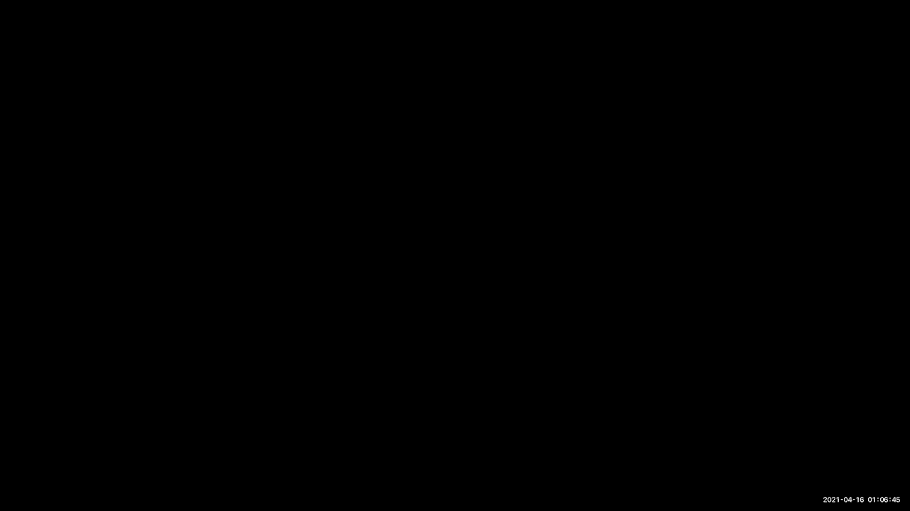
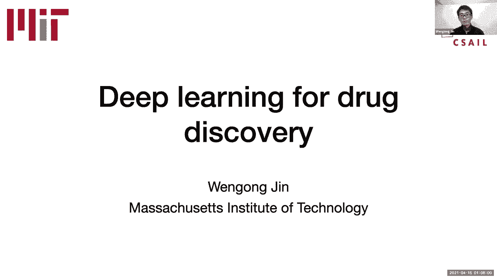
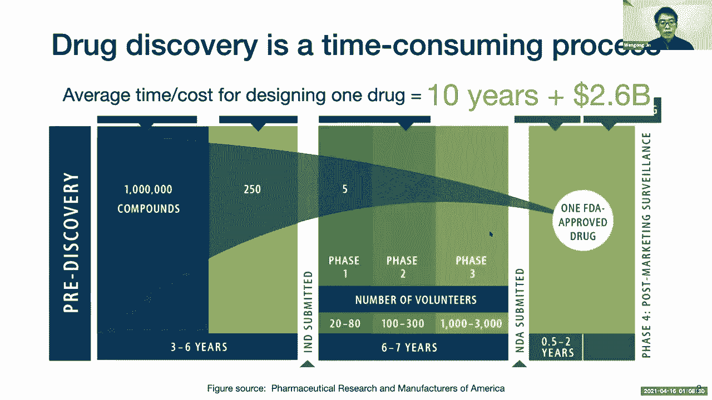
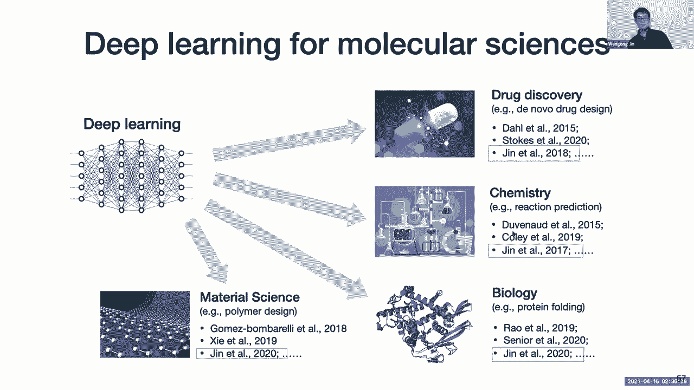
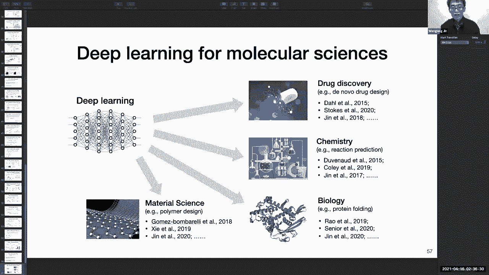

# 【双语字幕】MIT《面向生命科学的深度学习》课程(2021) by Manolis Kellis - P16：Lecture 16 - AI for Drug Design - 爱可可-爱生活 - BV1wV411q7RE

所有的权利，所以呃，欢迎大家今天是第十八课，我们今天的演讲嘉宾是王宫金，所以他其实是先驱者之一，我会说，使用图神经网络的新领域，用于设计新药和新疗法，他实际上会给整个讲座，所以这对我们班来说有点不寻常。

但他慷慨地同意不仅向我们介绍他自己的作品，还向我们介绍了一般领域，以前发生的事情，他的一点观点，所以王安，把它拿走，所有的权利，呃，让我，呃，呃，拉起我的屏幕，呃，是啊，呃，这是伟大的呃，来到这里。

谢谢你邀请我，嗯，所以耶，你好，每个人，呃，今天，我会的，呃，谈论，呃，我在药物发现深度学习方面的一些工作，这是一些呃，我一直在，呃，在我攻读博士学位的四年里，我很兴奋，嗯所以嗯。

我很高兴介绍我所做的一些工作，在这个空间里。

所以呃，是啊，是啊，所以呃，药物发现是一个非常耗时的过程，呃，一个药物研究人员需要十年以上的时间才能真正识别出一种新药，从，就像数百万候选药物一样，设计一种药物的平均时间和成本大约是10年。

成本大约是两点，60亿美元，这只是我从，呃，从呃。

美国的药物研究，就像被锁在家里，只是在等待一种令人垂涎的药物出现，所以我们确实想找到，呃，很快，嗯到，为了应对这种流行病或新的病原体，呃在所以呃，现在呃，在计算术语中，呃，药物发现是，呃。

是一个搜索问题，嗯嗯，这个呃，你可以想到这个化学空间，作为呃，某种女仆，你想，呃，找到一种能杀死病毒的好药，或者病原体，嗯，这有点像，整个，这个的中心目标，药物发现的um，但事实证明，这项计算任务非常。

非常有挑战性，挑战来自于化学空间的大小，所以呃，的数量，呃，像药物这样的分子估计在10到60左右，给人给出不同的数字，如果你问，嗯，不同的人，但通常在10到30到60之间，信不信由你，呃。

没有办法用蛮力屏蔽，他们都是在工业上，呃，像这些制药公司是标准的实验性的，像高通量筛选的方法只能在周围测试，就像十到五分之一的化合物，就像每天有十万种化合物一样，所以比起这个，呃，在天文学家人数中，呃。

这真的没什么所以，而不是做这种蛮力搜索，呃，我们应该开发一些有效的算法来自动设计药物，而不仅仅是把所有这些化合物放进你的网络实验室，然后做实验，这是我们的主要目标，呃。

这就是深度学习或人工智能的用武之地，所以让我给大家介绍一下，就像这个领域，有些喜欢基本概念，所以嗯，社区一直在寻找，你知道，很多，呃，不同种类的解决方案，都是基于计算，所以呃，这里，呃。

有两个重要的概念，呃，一个叫做，呃，这个呃，功能空间，嗯，基本上，怎么，呃，每个化合物在映射中的性质是什么，从化合物中，去嗯，到功能性质，像毒性，那是一个经典的财产，呃，你不想穿的，在你的里。

还有溶解度，呃，制约因素，或者嗯，还有其他的，呃，属性，所以这些属性通常是由，呃，你，你可以给一个数字分数，就像如果呃，毒性在10左右，那就很糟糕了，溶解度，大约五点，那就很好了，类似的东西。

第二个概念是我简要提到的化学空间，它基本上是一组巨大的潜在分子，所以呃，目标是找到，就像一种具有特定性质的化学结构，而且有不同的，呃，所以在过去，嗯，有一些，我可以如此短暂。

它有三种不同的方法来寻找具有特定性质的药物，一个是基于模拟，所以这可能是嗯，像分子动力学或者，分子对接，比如说，呃，这些呃，模拟是基于第一性原理的，像如何嗯，基本上是基于，就像力场。

分子是如何在空间中摆动的，你知道在蛋白质口袋里，比如说，那么呃，你就会知道这个分子是否通过这个蛋白质，第二种方法叫做呃，虚拟筛选，所以基本上你要做的，而不是那样做，呃，你直接预测的模拟，我给。

如果我给你一个分子的结构，你能直接预测它的溶解度或毒性吗，或其他，然后如果你能很好地预测，然后我可以把很多候选人放进你的虚拟屏幕模型中，只需选择溶解度最好或毒性最低的顶部，嗯，但这仍然是一种，呃。

愚蠢的权利，因为你仍然不能把所有的10到60的化合物，进入您的内部模型，这仍然需要像永远，所以最后一个方法，呃被称为从头开始的药物设计是最雄心勃勃的三个量，呃，哪个呃。

所以它基本上想通过查看一组标准来解决这个反问题，像低毒，高易错性，然后你能从这组标准中反向工程正确的化合物吗，所以我可以问你，是啊，是啊，精准对接约束从何而来，因为现在你谈论的是只是一般性质的性质。

你现在如何让它进入蛋白质的功能位点，比如说，呃，嗯哼，是啊，是啊，所以你可以测量，嗯，给出绑定亲和力的数值评分，对嗯，基本上对每个分子，就像给一个给定的蛋白质，结合亲和力是什么，那就像顶峰。

那基本上是PK分数，呃，你可以直接，呃，只是得到它基本上是一个数字，所以你的意思是，对接是一个完全正交的问题，基本上有两个问题，一方面你想要化学物质与蛋白质的结合亲和力，另一方面。

你需要这个分子的某些性质，独立于此的，呃，所以我会把嗯归类，对接到这种基于仿真的方法，你能看到我的鼠标吗，是啊，是啊，是啊，是啊，是啊，是啊，所以对接是呃，通常基于这些，就像，呃，力场右，这些能量。

怎么呃，我们的能量功能，低谷怎么样，基本分子对接寻找最低构象，嗯最，呃，加载蛋白质口袋内的低能构象，通过做这个多卡罗模拟，基于力场，然后在此基础上，你可以试着找出是什么，试着弄清楚绑定是什么。

这是一个非常昂贵的步骤，因为你需要做所有的模拟，是啊，是啊，呃，虚拟放映，试着绕过它，通过观察结构，我能预测新的吗，绑定亲和力评分，它只是一个数字，然后这个箭，然而，在你的第二列中。

从虚拟筛选指向化学物质，所以就是说，如果我知道属性，我可以推断出特定的化学结构，啊，呃好吧，这些是一些，这是我从这张纸上抄下来的图，我想我想要的实际上是，从底部指向另一个否的箭头，我同意你，这是正确的。

我也会这么做的，哦耶，我想念这个，呃是的，应该修好的，但是是的，听起来不错，所以，但最后一个是，箭头从功能空间指向化学空间，那个，我同意这个问题，第三支箭，我同意完美，谢谢。所以很明显，模拟往往太慢。

因为它需要几天的时间，或者呃，如果你想要很高，非常精确的模拟，那么即使只是一种化合物也需要几天时间，所以我会呃，有点省略了，呃，在今天的谈话中，嗯，我会专注于最后一个，关于第二和第三种办法。

所以虚拟放映基本上就像我说的，但在这里，它只是更多的评估，精心制作，我只想详细说明我真正的，我所说的虚拟筛选到底是什么意思，所以基本上这个虚拟筛选模型的输入是一个化合物，然后我可以预测，一些数字分数。

不管是好是坏，这取决于目的和属性是什么样的，如果它找到了亲和力，然后呢，呃，我们需要预测这种化合物是否有低结合亲和力，呃，是否有毒性，那么基本上是一样的虚拟放映，呃是有利的有利的，因为它比，你知道的。

Web应用程序中的实验筛选，它可以在一天内测试大约10到8种化合物，当呃，实验性筛选需要一年多的时间，而且也很便宜，因为一切都在计算机里，而不是在网络实验室里，嗯，但是虚拟放映也有，呃，这个呃，权衡。

所以嗯，所以我就这样，权利，我策划了，呃这个呃，我有两把轴，一个是化学空间的覆盖范围，Y轴是用于合成的IS，它代表了你实际测试一种化合物的速度，在一个实验室里，因为归根结底，呃，喜欢你的虚拟筛选方法后。

提出一些化合物，您仍然需要在Web实验室中验证它们，在一套商业上可获得的化合物中，比如说，就像基因库，基本上，你把所有这些商业上可用的化合物放在你的模型中，然后呃。

这个虚拟筛选方法给你一个比这些候选人高的排名，然后你只需要在你的网络中测试你的顶部，所以好处是不需要，呃，像任何和紧凑的合成，所以呃，生成排名后，测试相对容易，因为你不需要合成，但显然它失去了覆盖面。

因为我们最多可以筛选到10到9个，十分之十，仍然比不上整个化学空间，我也会说话，呃，在后面关于这些传统技术的幻灯片中，传统虚拟筛选技术，呃，或者基于手工制作的特征，限制了它的精度，所以在某种程度上。

模型经常产生错误的预测，呃，最终不会有好的结果，其实不是很好，呃，当你测试呃，这些化合物在一个实验室里，所以我提到的第二个范例是这种从头开始的药物设计，这与虚拟筛选相反，基本上从一组标准，如效力，安全。

反向工程，是正确的工作，右化合物，这是一个非常具有挑战性的问题，因为分子是，你知道的，这种结构和像机器学习模型一样站立，我们通常会遇到的输出只是一个数字，而不是某种结构。

所以这就是为什么这个问题比虚拟筛选困难得多，呃，Noo的药物设计也有，呃，两者之间的权衡，呃，综合与覆盖的容易程度，所以它当然可以非常有效地探索整个化学空间，因为你不需要尝试每一种化合物，如果呃。

模特会为你计算出，这个模型实际上会提出一些非常新的化合物，这些化合物在商业上是不可用的，所以你实际上需要一个合成化学家来，呃，学会如何合成这种化合物，为了在一个实验室里测试它们，这样就减缓了，嗯。

实验工作流程，但它是，呃，它给你，呃，问题嗯嗯，就像呃，把更多的潜力放在发现新的东西上，哦对不起，所以我也忘了提这个问题，呃，传统上是基于这些，呃，通过对分子进行某种随机突变来实现遗传算法，然后呃。

这些突变是通过时间设计规则，所以在某种程度上，嗯，我们还没有有效的算法来有效地探索这个化学空间，那么好，你知道的，即使呃，贵族药物设计或虚拟筛选，这个想法已经存在了很长时间，超过二十年，但其实不是。

实际上很难让它们真正工作，我可以再问你一个问题吗？那么可行吗，基本上这个做了多少，基本上是说，听着，的这个空间，化学空间的这一部分，1。我对…一无所知，所以说，让我们合成一堆分子来探索那部分空间。

也就是说，当你在计算上说，哦，化学空间的这种类型的部分似乎很有趣，但我对此一无所知，你能把播种的实验探索，然后计算搜索，或者这还没有真正完成，所以说，你能做的其实是，嗯，提取实验数据，所以基本上嗯。

人们做了一些，呃，过去的一个实验室实验，对呀，然后你有这些分子，在它们的类似性质上标记，所以你实际上可以从这组测量的实验测量中拨出一个评分函数，呃，数据点，呃，你可以使用评分功能来指导，呃，你的嗯，呃。

这个呃，从头开始，呃，像搜索这样的笑话设计，但我在想相反的情况，你的新作品现在基本上可以说，嗯，我很想测试所有这些分子，或者嘿，有一处房产，有一类分子以前没有人测试过。

你能去测试其中的大部分来扩展训练功能吗，是呀，你可以，所以这绝对是，呃，你也可以更新你的评分功能，在你测试了化合物之后，呃，这更像是一个闭环，那是最雄心勃勃的登月计划，对呀，这个闭环的，呃，系统。

但这里的困难很抱歉，去吧不，哪里哪里，在那里你以组合的方式合成数万种化合物，专门为训练目的探索空间，是呀，你是的，那完全是，呃可能，好的，对不起，问了这么多问题，请继续，你有这么多事情要做，当然可以。

呃好吧，所以呃，如有任何问题，请随时提出，如果你有，我想现在时间足够了，根据我的估计，如此如此，我嗯，一直提到，呃，这些传统技术效率不高，呃完美，让我解释一下为什么，是这样的，嗯那么嗯，有很多像呃。

对计算药物发现感兴趣的研究，主要是因为深度学习的兴起，所以呃就像呃，计算机视觉，就像深度学习已经实现的，像人类水平的计算机视觉精度，呃，成功的关键实际上是这种自动学习功能，当我提到，比如虚拟筛选，呃。

传统的传统方法是基于这些手工制作的特征，这内在地限制了性能，呃，我将在一个案例研究中进一步阐述这一点，后来，深度学习能做的是为你自动学习这些特征，根据你所掌握的数据，所以在某种程度上。

你不必手工设计这些功能，这可能是模型性能的瓶颈，而是让模型为您学习这些特性，嗯嗯，根据数据并结束，所以那是呃，单程，为什么深度学习，很多人对将深度学习应用于药物发现感到兴奋，另一方面。

如果你看看这个从头开始的药物设计问题，它传统上是基于这些手工设计规则，但是呃，在深度学习中，有一种模型叫做深度生成模型，它可以在这些逼真的复杂物体上生成，对呀，呃就像呃，图像或文本。

这只是我从一篇名为Dali的论文中找到的一个例子，那个，呃是一个图像字幕，对不起，图像合成模型，呃，你有，呃一句话，说，我可以，我想生成一个鳄梨形状的扶手椅的图像，是的，这个模型实际上可以生成。

图像很好，这有点符合你的描述，所以嗯，回到这个从头开始的药物设计，呃现在我可以用，嗯，深度生成模型以生成，呃，具有所需性能的化合物，使用这些深度生成的模型，所以这是，呃，这让你可以。

呃这个所以这不再需要，他亲手设计的，呃，如何使分子突变的规则，但是模型可以学习如何生成它们，呃也迎合他们，呃对呃，关于特定属性，这就是为什么深度学习，呃，有点，呃，给一个，呃，呃。

更像是在这个领域的革命，呃，我今天要讲的主要技术是基于，呃，图神经网络，所以如果你看看这个虚拟筛选的两个问题，呃，其他人称之为分子性质预测，以及从头药物设计的问题，基本上就在这个上面，这个循环。

从分子到性质，然后从财产到结构，呃，为什么呃，图神经网络变得有用是因为呃，分子可以用图形来建模，所以嗯，因为如此，比如说，这个分子中的每个原子都可以，呃是呃，是图中的一个节点，每条边，是呃。

所以每一个界都是图中的一条边，所以现在像虚拟筛选这样的问题是，基本上学习如何将这个图编码成某种表示形式，那么呃，基于该表示预测与正确的属性在这一点上，呃，高尚的药物设计问题基本上就是这个图的生成任务。

嗯，给定一套标准，使用我所说的深度生成模型生成正确的图，作为一个例子，呃，这些能做什么，我们的实验室，呃，通过与广泛的研究所合作，我们实际上发现，呃，一种叫做亨森的强效抗生素，可以杀死很多，嗯嗯，细菌。

呃，实际上是有抵抗力的，呃，现有抗生素，所以这有点想，呃，展示一些令人兴奋的，展示，U的一些例子，我们实际上能实现的，使用这些图神经网络，之前那个呃，方法无法实现，我希望你能，呃，你你。

你会对这个领域感到兴奋，所以这是对这个领域的长篇介绍，今天我想给你们三个，嗯，关于，喜欢什么，呃，什么样的技术，嗯，什么是什么，比如说，什么是图神经网络。

如何利用它们来发现新的抗生素或Covid-19药物组合，嗯其实有很多话题，呃，我觉得很重要，比如说，我们如何将生物知识融入其中，呃，神经网络体系结构，还有怎么做，UM图生成，嗯。

图形生成实际上是一个相当新的问题，呃在呃，人们可以生成图像或句子，但不是真正的图形，所以那是，呃，你知道，在第三部分，我会谈谈一些新的技术，呃，呃为了呃，如图生成，实际上这让很多，呃。

我在机器学习社区里引起了很多兴奋，所以呃，让我们进入第一部分，呃，论抗生素的发现，所以嗯，我来解释一下，为什么我们对抗生素的发现感兴趣，这个数字，呃，给你一些发现抗生素的历史，呃，因为呃。

1930年我们发现了青霉素，呃，几十年来，它已经取得了相当大的成果，但是之后，低垂的果实不见了，呃，开始变得很难发现，呃，新型抗体，但另一方面，呃，因为我们经常滥用这些抗生素，呃，这些细菌实际上对。

对许多人来说，呃，抗生素在标记上，呃，在诊所里，这就是为什么它成为一个巨大的问题，因为在医院里的许多死亡实际上是由，对不起，是由这些细菌感染引起的，真的没有治愈的方法，呃，因为抗生素耐药性。

所以我们需要找到新的抗生素来对抗，呃，这些耐药细菌，所以呃，所以我想用这个抗生素发现项目，嗯有点，呃，演示虚拟筛选是如何工作的，如何呃，如何利用深度学习做，呃准确地说，呃呃做这个，呃，更精确的虚拟筛选。

所以说，我们所做的是，所以呃，通过合作，所以我们有一个合作，博德研究所的生物学家和吉姆柯林斯教授，嗯，我们收集了一些，2500个分子对这种叫做e cola的细菌有生长抑制作用，然后呃。

我们收集了每个分子，所以每个分子都被标记为阳性，它抑制了这种细菌，所以你在桌子上看到，呃在这里我有一堆工作，然后呃，不管是不是抗菌，然后我可以用这些实验数据训练一个模型来预测。

一种新的化合物能不能杀死这种细菌，所以这个模型叫呃，图神经网络，让我解释一下让我简单介绍一下，呃，什么是图神经网络，然后呃，为什么还要，我也会解释为什么，呃，我们选择图神经网络而不是其他模型。

所以当我们在一个关于图神经网络的讲座上，但这将是一个精彩的评论，所以假设他们见过一次，然后你可以对我们进行技术调查，听起来不错，呃，让我先解释一下为什么我们要使用图神经网络，因此，在这个虚拟筛选领域。

传统的方法是基于固定的，手工设计的分子特征，比如说，比如分子量或重原子数，还有更复杂的特征，如摩根指纹，它的作用，呃是，呃，其实很简单，所以你可以从右边的图中看到，它的作用基本上是。

把你的分子分成不同的子结构，就像这里的乐队，然后我可以呃，把它们映射成一个子结构袋，呃，每个条目代表，呃，就像这里，嗯，它是一个因为，呃，这个分子有一个弯曲等等，这样你就可以得到，呃，所以这样。

你可以把一个分子变成一个向量表示，所以你要做的其实不是很好，尽管概念上很简单，但实际上是相当密集的，因为你需要，呃，排序，排序，呃，可能像子结构到像，呃，半径2或3，呃，它其实，呃分子是，你知道的。

组合，对呀，所以你实际上有很多这些可能的子结构，所以最后你得到的是一个非常高维的特征，我们会把呃留在摩根，在摩根指纹的案例中，呃，典型的尺寸大约是28个不同的，减去子结构实际上必须由某种哈希函数合并。

呃因为呃，你只要，呃，如果你，如果你不做这个哈希函数，呃，你就会得到，呃，超过一百万，呃尺寸，呃，矢量，所以在某种程度上，嗯这个，呃给你，呃，一种在某种程度上很有趣的表现。

因为每个条目还表示不同类型的子结构，就像我说的，呃，这些功能是由专家设计的，像这样的指纹，然后在你把这个分子变成一个特征之后，然后我可以在上面做一些模型，对呀，这就是传统方法所喜欢的，呃，支持向量机。

随机森林等等，这是一种，已经存在了几十年的典型工作流，在深处与深处，呃，但问题是，嗯，这些专家设计的这些特征不一定能捕捉到所有的抗菌模式，信不信由你，我们真的不知道这些抗菌模式是什么，如果我们了解它们。

我们就会发现所有的抗生素抗生素都是对的，所以在某种程度上，手工设计特征可能会错过很多这些未知的图案，因为嗯，的，我们设计这些摩根指纹的方式有点不可知论，嗯到嗯，到结束属性右。

这就是为什么我们决定使用图神经网络，呃，目标是与模型一起学习这些特征，所以现在功能和模型合二为一，我们想要，我们，呃，这些图神经网络可以直接从数据中学习这种特征表示。

这种表示是以一种捕捉这些抗菌模式的方式学习的，所以现在让我简短地说一下，呃，就像我有一个快速的动画，图神经网络是什么样子的免责声明，我不是图神经网络的发明者。

GNNS是许多研究人员提出的标准深度学习模型，呃，模型的输入是，呃，到这个神经网络是一个图，所以我们需要表示每个分子，就像一张图表，其中每一个，亚当是一个节点，每一个键都是一条边，对呀。

我希望这是一个直截了当的现在，给定这个图，呃，结构，我需要把它变成一个连续的特征向量，对呀，模型，没有一个模型可以直接对图进行操作，所以这个过程叫做图卷积，所以一开始，呃，让我们只看这四项，最初。

每个原子都有一个向量，指示其原子类型，比如它是氮还是碳，所以现在当我有这四个向量，我能做到，我可以，呃，所以现在我可以应用这个图卷积，很像，呃，卷积，呃，在图像中，你只要，呃。

将这四个向量压缩成一个向量，呃，线性层，对呀，呃，然后是一些非线性激活，像Relu或乙状结肠，现在，呃，这四个向量被压扁成一个，这个向量实际上编码了一个局部子图，呃，看起来是这样的对吧，因为，嗯。

它有点来自这四个呃，每个向量都相互表示，所以我实际上可以多次应用这个程序，呃，如果我，呃，如果我之后再加一个图卷积，然后它实际上编码了一个更大的子图，好吧呃，这些图神经网络的好处是，都是连续的。

所以我不是那种，我不是在构建这个长的高维特征向量，而是我们把一切都浓缩到这个低维连续空间中，这让你可以，呃，因为现在的特征是低维的，你实际上可以更好地学习和概括新的新数据集和新分子，所以呃，最后。

我们应用某种池操作，呃，结合了所有这些向量，呃，变成一个单一的向量，呃，只是总结了这个特性，呃，这个图形是什么样子的，我可以，那么嗯，在这个特性表示的基础上添加某种前馈网络，通过这个GNN学习。

呃预测一个单一的数字分数，就像呃，就像一个，基本上是一种概率，他们能杀死细菌的可能性有多大，把它放回去，把它放回去，这种范式，呃，使用此手工制作的功能，然后在这个特征向量的顶部学习一些东西。

但现在我们有这两步，共同学习，呃，呃，在这个图神经网络架构中，好的，所以呃，模型，呃，我会把一些数据，呃和实验，嗯，呃，我们先这么做的，我们想评估一下，呃，什么是，呃，性能，如暂停测试时的预测性能。

然后呃，这个模型其实可以做得很好，大概是九点一摄氏度左右，存在于我们实验测量它们抗体的分子上，抗菌性能，所以在我们完成模型训练和测试之后，然后我们实际上用它对大约一万个化合物进行了排名，它不大。

来自这个公路再利用中心，在哪里，呃，这些分子已经像，他们是最，有，但是呃，它们用于其他上下文，不是抗生素，所以我们对这些化合物进行排名，看看我们是否能将这些药物重新用于，我们用类似的抗体作为能量盒。

信不信由你，我们实际上发现了一种叫做Hallien的新化合物，呃，原来它的标签是，呃，苏三三二七，嗯，呃，它嗯，结构小说，与现有的抗生素相比，呃，你可以在右边看到，呃，呃，分子有很低的，呃，分子相似性。

呃，呃与现有的相似度很低，呃，抗生素，这对我们来说是个好消息，因为呃，我们在寻找新的东西，因为现有的抗生素已经，呃，窒息了他们，他们的，呃，细菌是，它们对这些细菌不再有效了，所以我们想找到一些新的东西。

可能不会遭受同样的问题，你能解释一下吗，呃，你的意思是，呃，当你说你发现了这些化合物，所以基本上有石灰，而且很新奇，所以有化合物库，这种化合物是以前合成的，只是不知道它有抗生素的特性，是啊，是啊。

不知道它有抗生素的特性，它们最初被用作JK抑制剂，基本上是一种抑制剂，但是呃，它，它不是用在，呃，作为抗生素，好的，完美，所以你还没有合成，你还没有产生新的化合物，你只是在测试化合物，啊，是啊，是啊。

我不应该用发现这个词，但我们重新发现了，HEL的新用途，然后你给它起了名字，或，他们已经给它起了很好的名字，我们给它起了个名字，在它，我没有名字，因为，我想它不是真的在诊所里使用，呃。

所以解释一下这个名字的由来，它来自，呃，星际迷航，我相信呃，我忘了，我是说，我的合作者给它起了个名字，但是呃，基本上是的，或者没有没有，这是从呃，一部叫做太空漫游的小说，呃，这就是我所记得的。

非常的帅气，这就是我，我很高兴你，你提到过，你分享了，故事，那太好了，听起来不错，是啊，是啊，所以呃好吧，在这里我只展示了海伦是新奇的，与现有的抗生素相比，是啊，是啊，但也很有效，所以首先它显示了。

对这种叫做大肠杆菌的细菌的有效生长抑制作用，所以这里我有这个，um um响应曲线，Y轴，光密度，基本上越低越好，呃，越低，呃，意味着细菌都被杀死了，是的，是的，对不起，我有这个，我应该，也许我有点想念。

呃，呃，在最后一分钟编辑这个，所以我在这里又有了这个数字，嗯，但它对这些耐药细菌也有效，呃，小鼠菌株，呃，这是相当令人惊讶的，因为我们只在这种叫做大肠杆菌的细菌上训练我们的模型，我们发现了这个阿里。

这个亨德森实际上是，呃，呃，具有广谱抗菌性能，它可以杀死其他已知的耐药性细菌，例如，这个和玛尼，这是一个呃，臭名昭著的耐痛细菌，止痛手段，它在每个地方都有抵抗力，呃，抗生素家族，所以这真的是呃，讨厌的。

呃，侯赛因能杀人杀人，杀死细菌，这是惊人的结果，你现在能回去看看，你能用以前的陈述做什么，也许扩展以前的表示，基本上你有没有说过我的表现力学习的哪个方面是最关键的，更普遍的是，你有没有回去问。

是否有完整的表示类，我现在可以去增加以前的模型，是啊，是啊，那是一个，这是个好问题，呃，我会的，我没有一个好的答案，因为呃，我们嗯，以一种我们还不知道的方式，就像，什么是，新的代表，这促进了哈利的发现。

嗯嗯，那个耶，我会的，呃，它就会，我们就会，有点，呃，以后再做这个，是啊，好的，伟大，谢谢。是啊，呃，在右边，我们也看到了，呃，这种叫做艰难梭菌的细菌是，对许多抗生素或现有抗生素也有耐药性，比如说。

如果你把呃，这种细菌，呃，呃，天然药物和这种药物是前线，嗯，第一选择，呃，加热治疗这种细菌感染，但实际上已经不再有效了，因为抗生素耐药性，一次又一次，感染消失了，如果你用海因治疗它。

这些数字都和他们一样，在小鼠中，对呀，所以它在人身上，呃，而不仅仅是基于细胞的ASSE，所以在某种程度上，这是一个更现实的测量，呃比我们通常有，这些非常嗯，呃，非常激动人心的结果，嗯，我在读这张图吗。

正确的车辆实际上比节拍器做得更好，这是否意味着细菌现在已经进化到真正享受药物，他们曾经试图在一个地方杀死他们，为了耶，六天后，它是，似乎，呃，我想没有，我想有一些拉德点，那是嗯，这是在这里，呃这有点。

嗯，只是呃，呃就像被这些蓝点挡住了，蓝点代表Helson，红点是这个，呃喵和呃，所以它仍然比车辆做得更好，是啊不，但我想指出的是，Metro Nisil实际上比车辆做得更差，就像红色实际上比绿色高。

是啊，是啊，是啊，是啊，但是有一堆红点，呃，这是在这里，这就是为什么，看起来非常，呃明白了，所以它们可以很容易地进化出对它的抵抗力，但对于他们中的一大部分来说，他们实际上已经死了，为了呃。

对他们中的一部分来说是的，是啊，是啊，是啊，是啊，是啊，是啊，再次感谢，这些结果太神奇了，好的，谢谢所以呃，让我们看看这里，是啊，是啊，所以呃，我们也想，所以模型，是它吗，它是，呃。

我们只在一万个化合物上应用这个模型，好吧呃，在这个广泛的再利用中心，为了实验验证的速度，现在我们能做的实际上是超越这组化合物，从10到8甚至更多，通过去更多的化合物集合，我们实际上又发现了八种化合物。

对…的各种抑制，呃，五种不同的，呃，细菌种类，这些仍然是体外结果，呃，还没有在老鼠身上测试，但是呃，我们已经可以看到有两种化合物具有广谱，抗生素耐药性，哦对不起，对这五种都有抗菌活性，所以在某种程度上。

这种基于深度学习的方法给了你，呃，它很有弹性，我相信会有很多新的发现，呃，在各种背景下，只是为了澄清一下，你仍然只有一个模型，我只有一个模特，那就更神奇了，因为我只是训练物种特定的模型，在那里你可以。

基本上你知道训练不同的人，然后看看他们比较如何，他们学到了不同的东西吗，等，是啊，是啊，所以我们还在收集，呃，很多数据，这就是为什么我们还没有结果，但即使你只是在大肠杆菌上训练一个模型。

它仍然可以提供像呃，对于其他细菌种类，是啊，是啊，但反过来，通过对其他细菌种类的训练，你会变得更好吗，或者以某种物种特有的方式进行训练没有好处，我们还在收集数据，这就是为什么我们还没有结果。

好的听起来不错最后，呃，呃，只是呃，我提到过，图神经网络比，其他的传统方法，好的在这种情况下我们要，这次回顾展，实验，呃，如果我知道亨德森很好，嗯，做其他型号，其他模型也能发现，然后呃，原来，比如这些。

呃，嗯三四神经网络基于这个，就像摩根的指纹，它做得很糟糕，就像呃，周围直升机的等级，像一千，对呀，呃，我们就会，我们每天只能测试大约100种化合物，所以在某种程度上，这些传统的方法。

即使他们中的一些人使用神经网络也无法发现汉森，呃，如果我们用这些模型，所以在某种程度上，它表明这些习得的特征是，呃，比这些手工设计的功能更好，呃，在嗯的简单实验，在这方面，呃，呃，药物发现。

我能问相反的问题吗，是其他方法中排名靠前的化合物吗，一点帮助都没有，基本上是的，你发现的东西，他们排名很差，但是他们排名很高的东西呢，第一，它们在实验上有用吗，第二，它们在你的模型中下降了多远。

是你们捕捉到了空间的完全不同的部分，或者他们在你的模型中仍然排名很高，如果他们的模型排名很高，是啊，是啊，这是个好问题，所以我所做的，我记得的，是嗯嗯这些呃，传统模式，他们只是重新发现现有的抗生素。

或者类似于现有抗生素的东西，是啊，是啊，呃，为了我的模型，呃，我们也重新发现了很多这些，呃，现有抗生素，这就是为什么或者类似于现有抗生素的东西，呃，这就是为什么海尔森只排在61位，因为呃，模特自信多了。

呃，用，呃，与现有的类似的东西，明白了，现在就结构的多样性而言，我是说这很酷，哈林是一种新颖的结构，完全，是你提到的同一家族中的八个附加化合物中的新化合物，还是和Halloan完全不同，哦。

他们很不一样，呃，如果你只看结构，嗯自己，它没有什么类似于，呃致汉森，只是看看结构，是啊，是啊，然后另一个问题是优化呢，换句话说，有一种发现空间的某种新的子集的感觉，然后在这个子集中进行优化。

是你的模特吗，也有利于优化，因为它不一定需要是相同的型号，一旦你有了，你知道去哪里找，你可以开发一个不同的模型，为了微调，你研究过微调和一般，在哪里着陆问题，呃，你一直在微调结构，对呀，微调结构，是呀。

是啊，是啊，那是，我觉得，这就是我要来的，呃，最终，在图形生成部分，我可以学习优化结构，因为他们知道你的等价物是，呃，爆破算法的排序，比如说，可以很快告诉你一个击中，但你可以用完全不同的方法。

让它变得更好，嗯，你知道的，用同样的方式，也许你的方法在得分方面很神奇，但不一定是微调，但它似乎两者都在做，我只是好奇如果我的意思，当然，你们之后要讲的图神经网络，可以进一步改进。

但我只是好奇如果你也补充，就像一个不同的呃，损失函数基本上说明了一些细微的尺度差异，您是否需要另一组功能，或者同样的特征是否也能做精细的缩放，好的，所以让我呃去，呃，所以这是对第一部分的总结，嗯。

让我呃跳到第二部分，呃是怎么那么，如果你看看，嗯，第二部分是将生物知识注入这些图神经网络，我将展示它在Covid-19药物组合发现中的应用，所以呃这里，呃，如果你看这样。

这就是我刚才描述的图神经网络模型，对嗯，如果你看这个模型，它仍然只是自己看结构，对呀，输入只是分子结构，你有点呃，推断一些，呃，生物学知识，呃从呃，仅仅从数据来看，所以在某种程度上。

这个模型丢失了很多信息，正确的属性可能取决于，就像呃，附加生物信息，比如说，这个分子是否与某些蛋白质或生物靶点结合，也许这就是它杀死细菌或病毒的原因。

在某种程度上这个模型并没有告诉你太多关于内部机制的信息，或者它实际上是如何到达结束属性的，所以嗯，当谈到喜欢mod的时候，呃，呃就像病毒，呃就像Covid，我们没有足够的数据。

我们实际上需要把这些生物学知识带回模型中，为了更好的概括，所以这就是动机，呃，我会的，呃展示柜，是啊，是啊，所以基本上我想建立一个软件模型，呃那个和呃，意识到某些生物学知识的人，这就是案例研究，呃。

我们在Covid做了十九种药物组合，呃，最近，我们想做药物组合而不是单一药物的原因，仅仅因为它们更有效，所以，嗯，这里拉姆严峻是通过，这是FDA批准的治疗Covid-19的药物，它只是一种单一的化合物。

而是一个，呃，但最近的临床试验表明，如果死亡率，不够低，对，它只比安慰剂低4%，所以我们需要找到更好的，呃，治疗，如果你像其他人一样看着，呃，病毒感染，像艾滋病毒这样的疾病。

你会发现大多数这些艾滋病毒治疗方法就像药物组合一样，对呀，呃，因为他们经常，呃更有效，所以这激励了我们，到嗯，有点，是啊，喜欢，查找您的组合，呃，Covid十九，所以这里，呃。

我们想做的是在这里找到相互协同的药物，呃，所以呃，我有点手舞足蹈，但基本上是通过协同作用，我的意思是，呃，如果两种化合物具有协同作用，它只是意味着一加一大于二，嗯嗯，基本上，如果你把两个加起来。

它们的作用实际上比它们的加性效应大得多，如果你应用它们，嗯分开，只是添加，添加它们的效果，嗯一起，但是，但坦率地说，即使是加法也没问题，对吧，基本上只要他们彼此不是静止的，只要你知道，第二个还在加东西。

它还在添加东西，但是嗯嗯，我怎么说呢，呃，是啊，是啊，你可以，但这也在，呃有，呃，毒性更大，然后呃，所以耶，所以耶，我会的，呃，所以在某种程度上，我们确实想减少u，所以我们不想用药过量，基本上，呃。

这就是为什么，呃，我们想有一些协同作用，因为如果两种化合物是协同的，那么你实际上可以用更低的剂量达到同样的效果，好的，所以这是我们的目标，呃，我们想找到协同作用的药物组合，对呀，呃。

我们真的负担不起做太多的实验，这就是为什么我们再次想做某种虚拟放映，但这一次，关于药物组合，这里的挑战是，如果你还记得，抗生素项目，我们至少有两千种化合物，也不是很大，但能训练一些东西，但在这里。

Covid是一种真正的新疾病，我们真的很难得到任何数据，所以我们找到了一些纸他们做了一个很小的，呃，筛选就像嗯，比如一两百三种组合，它们的标签是协同作用，所以这肯定是不够的，因为呃。

图神经网络确实需要数据，对呀，所以在某种程度上我们不会，我们不再有这个大数据了，神经网络真正需要的，所以我们必须在这个神经网络中加入一些知识，呃由你来概括得更好，当我们只有少量的数据时。

这可以很好地工作，这就是生物学知识发挥作用的地方，还有这里，我想补充的知识是关于病毒复制周期的，所以基本上什么，怎么呃，药物怎么能阻断，呃，Covid-19感染，所以呃，有很多工作，很多生物学家研究。

就像，怎么，病毒的复制周期是怎样的？我在这里就不说得太详细了，因为我不是专家，但基本上有三种机制，一种是阻止病毒进入，抑制，膜上的两个受体，一个是H 2，另一个是TP 2，就是这两个，呃受体，呃。

生物学家发现这是至关重要的，呃呃，那个呃，基本上病毒利用了，利用了这两个，显然你可以，呃，试图抑制病毒蛋白，比如三个cl pro或p蛋白等等，最后，呃，也有很多宿主目标。

就像与这里发生的病毒相互作用的宿主蛋白质，加州大学旧金山分校有一篇论文发表了一种蛋白质，病毒与宿主的蛋白质相互作用图谱，然后呃，我们可以试着抑制这些宿主蛋白来防止病毒，从，你知道的，复制。

所以这是我想添加到模型中的基本知识，所以这有点，呃，这导致了，我们的模特叫，组合网，呃，试图将生物学和化学结合起来，组合和标准的区别，你知道，呃，分子表示中的图神经网络，所以在每个分子之前，呃。

这个这个学过的指纹，呃，这纯粹只是编码分子的化学结构，但现在我想增加一些额外的知识，呃就像，的，这种分子抑制什么样的生物靶点，和我，呃，这些都是由这些三角形表示的，呃，那个呃，与传统的，呃，与之前相比。

呃，中的化学表示，呃，用圆圈表示，对呀，所以现在我可以把这两个表示放入模型中，预测药物的抗病毒活性，通过添加这个，呃，通过模拟这些生物靶点上分子之间的生物相互作用，我们能够带来更多的数据。

可以导致更好的概括，所以这是三个和两个，的三个步骤，呃，我们的模型，呃，这个呃，这个模型预测，呃，药物靶点相互作用，比如这种化合物是否能抑制某些，呃，生物学术语，所以这里，呃，我们所做的是我们，呃。

利用数据集，呃，从呃，坎贝尔，它是一个公众，呃，数据库与呃，生物测定，呃，也来自国家卫生研究所的NAT，他们都提供了，关于Covid-19背景下药物靶点相互作用的一些数据。

所以这里的数据集被组织成一个稀疏矩阵，就像你有这些化合物，这些目标，这里有一个，0或1表示这种药物是否能抑制，呃，这个目标是否知道Covid 19在那个数据库中，我是说，我们知道，我是说。

因为非典感染了一个，比如说，在非典中，2003年的大流行非常相似，那么在这里，和猫，他们只是做了一个很小的屏幕，这些化合物中的，呃对呃，SARS病毒的蛋白质，他们就这样做了，他们有一些数据。

但没有那么多，你包括人类目标吗，或者这只是病毒目标，所以我包括了两个病毒目标，病毒目标和呃，主机目标，如HDAC是主机目标，谢谢。好的，呃，所以理想情况下，如果这个矩阵是完整的，那么呃。

我们可以直接把它作为附加功能插入模型，但是这里因为，它是，呃，矩阵太稀疏了，喜欢因为它是从不同的来源收集的，所以为了呃，充分利用这些信息，我们需要做的是学习通过使，呃。

通过训练模型来预测药物是否抑制生物靶点，所以嗯那么，如果呃，这个矩阵就像一个矩阵完备问题，呃被呃，通过对现有数据的培训，模型可以学会填补这些缺失的条目，然后嗯，你，这就是我们如何得到这个生物，呃代表。

上面的三角形，但是在许多矩阵完备问题中，你假设一个较低维的表示将捕获实际的矩阵，低维表示有多准确，也就是说，如果你要在矩阵上进行降维，你知道，做SVD或其他线性或非线性还原，我只是好奇。

如果这个矩阵中有尖峰，不会被低维表示捕获的，或者如果它足够光滑，低维流形就可以，我说是的，这是个好问题，所以我们在这里，这确实是一个矩阵完备问题，但我们不用这些。

取而代之的是他们依靠这个图神经网络来学习，嗯代表我们通过嗯学习所以，基本上我预测，呃，这种药物是否能抑制这种，呃，就像基于这个图形卷积网络的两三个c pro，非常好，是啊，是啊。

所以在某种程度上它是非线性的，然后呃，这就是为什么你可以捕捉到这些，我是说比，呃，传统的基于VD的方法，谢谢。所以这是第一步，当然我也学会了分子结构的表示，那和以前一样，现在我有这两部分表示。

生物学和化学，现在我可以用它来预测两者，呃，单一药物是否有效，或者以及药物组合是否有效，在这里我们利用了uncats的一只狗的抗病毒活性数据，他们标记了某些药物是否，对非典的抗病毒药物，cov两个um。

这很简单，因为它是一样的，我可以在这个表象上放一个前馈神经网络，然后把它转换成一个单一的数字分数，就像，基本上这种化合物现在杀死病毒的概率，呃最后就是，呃预测协同呃，一套，呃两个紧凑型的对吧。

所以现在我们要做的是，呃首先，呃，所以我们首先要做的是，我们可以得到嗯，呃，这个药物A和B的特征表示，呃分开，这样我就可以学会把它们结合起来，呃变成一个，嗯，一个单一的矢量通过这样做，呃呃根据这个等式。

这类似于集合包含排斥原理，其动机是，呃，这幸福，嗯嗯，祝福协同，呃得分呃，所以基于药物组合的单一载体表示，然后我就可以预测组合，呃抗病毒活性，这是一个单一的数字分数。

然后我可以把这个分数和其他两个分数进行比较，呃基本上如果呃这两个，如果pab比p加bd的总和大很多，然后是协同增效，对所以呃我可以，然后我可以首尾相接地训练这个模型，用一把呃，药物组合协同数据。

所以在某种程度上，我们是，即使这个数据集很小，我们有这个药物组合的辅助数据，你知道药物靶点相互作用，也是呃单一代理，抗生素活性预测，所以这就是我们带来啊啊啊。

不同类型的生物知识融入到这个模型中在这样的背景下做出预测，呃COVID十九，所以这是模型的性能，我知道这里有很多像盒子一样的盒子，嗯，但基本上，右边是我们最好的模型，包括生物知识和化学表示。

如果你只用标准模型，呃基于像svm或呃，深度神经网络，没有这些，呃生物学知识，它只是不能很好地概括，如果你去掉任何一个，呃，化学或生物，呃，信息，会对模特造成一点伤害，呃，相当多。

所以希望这能给你一种感觉，呃，那个呃，让你相信，呃，生物学和化学都很重要，呃，为了呃，对于预测任务，所以再一次，我们呃，我们，我们不想就此止步，嗯，所以说，这就是为什么我们想做出一些预测，并在。

在一些生物资产中，以验证药物组合是否真的具有协同作用，因此，通过与国家卫生研究所的合作，呃，呃，然后呃，国家促进转化科学中心，大概有30种化合物，呃在他们自己的猫里，基于细胞的资产，我们实际上设法。

呃发现发现两个，新型药物组合，都是，有很强的协同作用，所以这里就像那些响应曲线，这两种药物的矩阵，一个是雷姆严重加上说唱和呃，大家可以在这里看到，呃，我只是在取样，嗯，这里的一些数字，呃矩阵，基本上呃。

如果你把这两种药物结合在一起，它可以更好地杀死病毒，你的呢，这和，呃这里是从加号开始的，呃，这个智商太，我们当然要道歉，去吧，你为什么不给我们看0，这里是它的价值太极端了什么的，或者对不起。

我错过了什么，你看到我在你的幻灯片左下角注释的地方了吗，呃，这里，是呀，所以我只是对那些零很好奇，基本上为什么你专注于，啊，是啊，是啊，所以我只是想确定，因为现在，如果你把这两个像结合在一起。

所以就在这里，所以在这里基本上我想做一个苹果对苹果的比较，因为我有这种药物组合，呃，它有两种药物，所以在某种程度上它的剂量大约是6微摩尔，对呀，是啊，是啊，我想，我需要与至少高于6微摩尔的数字进行比较。

我明白了，是啊，是啊，是啊，是啊，否则我在作弊，对呀，如果我，如果你只是如果我给你100个微型臼齿药物，那么一切都正常了，是啊，是啊，一个人死了，所以谢谢你非常非常有帮助。

但当然我们仍然需要在人类细胞中研究这些组合，而且，呃，呃，在动物模型中，所以这些还在进行中，但希望这能给你一些想法，将生物知识纳入模型的重要性，现在到了最后一部分是新药物设计，我会的，呃，呃谈谈，嗯。

这部分更像是机器学习，呃，与前两个部分形成对比的是，我们没有多少，呃生物学结果，但是呃，这是一种，嗯，更雄心勃勃的目标，比如解决这个反问题，这很重要因为，如果你看看以前的方法，我们训练图神经网络。

我们对所有的化合物进行排名，我们做一些实验验证，很好因为，速度很快，但它不能扩展到整个化学空间，我有点，呃一开始就指出，对呀，所以我们不能做这个虚拟筛选，如果我们想拥有，探索整个化学空间。

所以这就是为什么我们需要，嗯，做一些完全不同的事情，这就是图形生成的东西的用武之地，基本上，如果你看看药物发现，它实际上是一个生成的建模问题，对呀，你想学习一个发行版，它的质量是。

呃集中在这些好分子周围，如果可以的话，呃训练这种生成模型，那么我就可以直接从你的模型中提取好的分子，好吧，那么生活是美好的，嗯，但当然，呃，是啊，是啊，所以呃。

我们可以通过这种高效的采样来有效地探索整个化学空间，这是一个具有挑战性的问题，因为嗯，我们现在需要生成呃，图结构，呃而不是呃，在这些数字上，呃数字，呃，呃，标准机器学习模型这样做，呃，我想跳过一些东西。

呃可以吗，因为我知道时间不多了，我想我们通常可以慢慢来，所以我更希望你涵盖你需要涵盖的，然后如果学生需要，是啊，是啊，所以它只是在周围，就像还剩十张幻灯片，这么好，花你需要的时间来覆盖它。

我们可以一直到3点5分听起来不错，如此正确，呃，所以在那里，呃，所以在我做之前有两种类似的方法，首先是这个，基于序列的方法，所以他们实际上在化学上是这样的，有一种表示叫做微笑弦，这是一种特定领域的语言。

你可以把一个分子，把图变成这个一维序列，一旦你这么做了，你可以直接，生成分子的递归神经网络，对呀，这就像呃，在自然语言处理中广泛使用的非常标准的技术，它有pytorch和tensorflow两种版本。

这很容易，嗯，但问题是这个字符串表示相当脆弱，比如说我这里有两个分子或者两个图，几乎相同的对吧，只有一点点，这里有一点不同，但是如果你看看他们的小流表示，他们很不一样，你看这里，呃。

我用红色突出了所有的差异，其中有相当大的一部分，所以在某种程度上我们，有问题的，对呀，呃，它映射的这个表示，呃，即使两个分子相似，但它们实际上有完全不同的字符串表示形式，所以在某种程度上。

它实际上有一个糟糕的性能，如果你呃，呃，把这个应用到工作发现中，这个我以后再说，以前的另一个解决方案是基于此节点逐节点生成，通过添加呃来顺序地生成这个呃图，一次一个节点，例如，我这里有一个部分分子。

我可以创建一个节点，呃，然后我可以学习预测项目类型，然后我也可以预测这是否，这个原子是如何与现有原子连接的，对呀，所以说，呃，我可以做这个手术，呃迭代，但问题是，呃，这些分子通常非常稀疏。

所以在某种程度上，如果你有N个节点，你通常只期望有线性数量的边，如果你，此节点采用不生成方法，你可以，你实际上需要n平方复杂度，因为在每一步中你都需要预测边缘的数量，呃所以呃，你需要这样做所以说到这个。

嗯嗯，就像你将这个节点按节点生成应用到，这个模型，呃，到药物发现，你马上就会发现一个问题，所以呃，所以一个常见的方法是，你要用这个变分自动编码器来生成分子，你基本上呃学会了呃。

某种编码器将分子映射到这种低维表示中，然后把它解码回同一个分子，然后呃，还有这个，你训练这个变分自动编码器，重建输入分子，从它潜在的表现，所以诊断测试是看，呃，这个解码器是否能重建输入分子。

如果我们不能，那么很明显架构有一些问题，所以事实证明，这个节点一个节点地生成有相当多的问题，如果你看右边的图表，Y，x轴是分子中的原子数，一个分子有多大，y轴是重建精度，你可以看到模型显著减少，呃。

例如，如果，这种Covid-19药物，呃叫快速眼动严重，它掉进了，呃，在这个范围内，重建的准确率已经低于40%，所以这显然还不够好，这激励了我，呃，考虑一些新的架构，从你知道的，呃到到，呃。

对于这个图形生成问题，没有一代人失败，因为它是为任意类型的图设计的，特别是密集图，所以它可能不是类似分子的最佳选择，鉴于这些挑战，我认为思考一下，我们应该加入什么样的归纳偏见，对呀，这些呃。

递归或卷积神经网络，他们都利用这种归纳偏见，就像输入是一个序列，或者输入是A是A是A像网格，所以这就是他们成功的原因，那么分子有什么样的诱导偏置，所以当你观察分子时，它们通常是稀疏的。

而且它们的树宽也很低，让我解释一下这到底意味着什么，所以为了解释这个，我需要，嗯嗯解释嗯，呃，我会向杜姆解释的，呃，我的模型叫做连接树版本，自动编码器，利用，呃，这个呃，这棵低矮的树有分子的先验。

所以基本上，我们能做的就是这样，该方法的灵感来自经典的结树算法，像图形模型，利用分子的低树宽，我所做的是，我可以把一个分子分解成一个叫做连接树的树状结构。

这个连接树所做的是在每个节点中不再只是一个单独的项目，它其实是一个，它可以是一个主题，呃，或者一个子图，呃，不管你怎么称呼它，就像，呃，呃，所以因为，呃，呃，分子没有每个基序的树，呃，相对较小，所以说。

呃，呃，模拟，呃，呃，图的三种方式基本上是最大的母题，你可以从这三个分解步骤中得到，所以这里这个分子有三个最多五个，因为呃，有呃，呃，那是呃，五员环，那是最大的，你实际上可以进一步分解环，但在这里，呃。

我们决定只保留戒指，因为它们在化学上有意义，所以那是如此，这就是我所说的有一棵低矮的树的意思，如果你做三次分解，呃，你最终会有，呃，这些很小的图案，另一个呃方面是如果我呃分解，呃。

将这种树分解应用于大量分子集合，它实际上并没有产生那么多类型的主题，我重新做了一遍，就像呃，25万个不同的分子或不同的图形，原来只有大约六百个图案，和不同类型的图案，这些图案有超过99点，九覆盖以上。

呃，呃，一种新分子，所以基本上这些图案的种类并不多，呃那是因为呃，分子没有子代，所以考虑到这两个观察，我能做的就是，我可以设计一个，一种新型的变分自动编码器，如下所示，所以我可以，呃。

把一个分子映射成一个连续的表示，它结合了这个连接树，它建立在中间结树表示的基础上，所以嗯，我将把分子和连接树都嵌入其中，低维向量，然后我可以解码嗯回到分子，但我会先解码连接树，然后解码呃，分子。

这是有利的，因为，树更容易生成，让我解释一下为什么会这样，所以我将运行模型架构，呃，让我们先看看编码器，它不同于标准的图神经网络，因为我们有，呃，你知道吗，两个分子，呃，图和结树都要具体。

我可以先在这个图中运行一个图卷积，它们学习，呃，比如每个项目的未来向量，然后我就可以传播这些，在节点树中添加向量，错误的图卷积，呃，所以现在每个母题都收到一个母题向量表示这些母题是如何连接在一起的。

基于这个编码表示，现在我可以生成呃，图表，呃，用下面的方法，所以在每一个我都可以，呃，模型，呃决定呃，呃，所以它也像一个序列，呃，呃，每个步骤中的模型，呃，模型决定在下一个右边添加哪个主题。

所以基本上我们需要选择下一个主题，然后我们需要添加到我们正在扩展的当前分子中，这是呃，简单的分类任务，六百个，呃，伊什母题，我这样挑，呃，这个单束缚，对，呃，我可以把单键加到分子里。

然后我可以预测如何将这个主题附加到当前的图形上，嗯嗯，预测什么是正确的，在这个呃主题和现有的呃图形之间的连接点，所以在这种情况下我们应该，这个原子，这个原子，所以呃，然后我就可以把这个母题，呃到这个图。

这就给了你一个步骤，分子的一步膨胀，我可以重复这个过程多次，直到模型决定停止，以及这种方法有利的原因，因为现在你在一个主题一个主题地产生一个主题，它实际上需要，呃它，呃很多，呃呃，时间复杂度实际上与。

因为我们生成的是树而不是图，所以生成一棵树，你实际上可以在线性的步骤中做到这一点，正如你所看到的，右边的红色曲线代表了，用母题生成模型重建该母题的精度，你可以看到重建的准确性仍然很高，如果你有一个大的。

呃你所有的一切，即使你有一个多达100个原子的分子，我知道这对像分子这样的药物来说并不常见，但通过母题的产生，这表明了母题的优势，所以在实践中，这些分子多久有一次循环，我是说我们关心有循环的分子吗，1。

2。它们在自然界中并不常见，因为生物过程不太擅长产生循环，第三，它们不是很常见吗，因为生物过程不善于利用循环，呃我相信呃，大循环很难，但是像苯这样的小循环，呃，我想是，这真的很重要。

我不知道循环本身是否是你主题的一部分，我对此并不担心，我只是对你的树很好奇，树本身是否有循环，你是否可以循环回来，哦，呃，这棵树没有周期，因为嗯因为它是一棵树，但是但是自然分子有循环吗，呃这里。

所以如果你，呃拿着这个，嗯，中间的额外边缘，那么连接树就会变成三个节点，每一个都是嗯，这是一个，这是一个循环，这有意义吗，你无法捕捉到的只是大周期，基本上只是我无法捕捉到的大循环，但在这种情况下。

像分子这样的药物并不常见，这正是我所好奇的，但是像分子这样的外部药物常见吗，基本上植物产生，你知道有循环的大分子，或者不是真的，哦，他们做天然产品，呃会有这些大循环，但又一次，呃，我想从数学的角度来看。

此连接树表示不必是，呃，你可以分解循环，呃完全没问题，但我只是决定保持这种方式，因为环在分子中很有意义，谢谢你对吧，所以这是一种，我有的最后一张幻灯片，呃在，呃，分子优化，所以这与微调步骤有关，呃。

你提到，基本上，如果我有一些工作，有一些好的性质，例如，我发现了赫尔森，但它可能不像，呃，够喜欢的工作了，比如说，如果像这种的黑暗，嗯包括，呃很多，呃就像物理化学性质，对呀。

它极大地影响了它在人体内的吸收方式，所以让我们说赫尔森不够好，就笔画的相似性而言，那么我也许可以学着稍微修改一下这个化合物，嗯，做一些当地的，呃修改，这样可以提高药物的仿真度，嗯。

这样它就可以更好地被人类吸收，所以这就是生成模型擅长的地方，所以我不仅可以从零开始生成分子，但是模型也可以学习修改现有的图，或者是现有的分子来改进，呃它存在，呃喜欢，在保持的同时。

改善其药物黑度或其他理化性质，保持它的抗菌特性，大家可以看到，所以我们这样做，简单的实验，在这种情况下，你的黑度是用QE来衡量的，你可以直接计算它，所以在某种程度上，你产生的每一个分子。

我可以很容易地计算出这个Q D分数，所以如果你在这里看到，这种基于序列的方法只能做大约，呃这个所以这里，Y斧是成功率，基本上你能多久，嗯，做一个低，呃，非药物样分子变成好分子，像药物一样的分子。

所以在这种基于小空间或序列的方法中，它在周围做得很糟糕，大概百分之五十八，因为错误的陈述，这个节点一个节点一个节点地接近它，呃，它可以，我是说，如果你进入这个图形表示，它立刻做得好多了。

但是一个主题一个主题的方法可以做得更好，呃，呃，在这项任务中，所以它也显示了，这就是故事的三个部分，呃，我希望呃，它给你一点，我们在这个空间里能完成什么，就像演讲的最后一张幻灯片，呃，有一个很大的像推。

就像分子科学的深度学习，不仅药物发现，还喜欢，就像有机化学一样，生物学或材料科学，所以在某种程度上，这里真的有很多令人兴奋的机会，在这里我要感谢我所有的合作者，在今天的演讲中介绍了我所做的所有工作。

不是真的，它是，这真的是一个团队合作，所以呃，我真的想，我很感激这一切，那个呃，帮助我做这些实验的教授和学生，还有呃，政府机构和制药公司，呃真的帮了大忙，呃，呃给出建议和反馈，是啊，是啊，用那个，是啊。

是啊，我要说的就这些非常感谢，谢谢。谢谢非常感谢，你能回到你上一张幻灯片吗，关于前景的那个，因为我想对每个人说几句话，所以你告诉了我们一些关于药物发现的事情，但如果你想告诉我们一点关于你的前景，用于。

你知道这些区域中的每一个，如果你能在这里说好，你知道，我看到了主要的挑战，也就是x，y，z等，我很想听听你对化学生物学的看法，材料科学，也是药物发现，还有一点点你的，您对字段走向的视图，对呀，是啊。

是啊，那真是，这是个好问题，所以呃，我可以谈谈，就像生物学，呃再多一点，因为呃，这里有一些很独特的东西，比如说，我是说你们我肯定你们听说过阿尔法折叠，这是一个令人兴奋的，蛋白质折叠的进展。

所以在某种程度上，当我们在这个谈话中，我主要是处理这些，呃小分子，但是对于蛋白质来说，这个嗯，呃就像三个D，呃，结构实际上真的很重要，然后呃，它需要不同的技能，呃，不同类型的技术，不只是像这些。

图的操作，但现在你必须处理三维空间中的这些几何物体，以及你如何设计，就像深度学习算法，可以有效地从这些中提取或学习表示，呃，三个D结构是什么，呃，呃，非常有趣，在材料科学中也是如此，你必须处理大型结构。

就像这些聚合物，这些就像巨大的，那么如何将这些深度学习方法扩展到，像这些大结构也是一个大的，呃呃，开放式问题，呃，是啊，是啊，我认为就目前的药物发现而言，我还没有带来，更像是基于配体的药物设计，对呀。

我只看分子，我有一些，呃喜欢工作，像大脑蛋白质或生物靶点，但还没有做到，呃就像把蛋白质结构，像三维结构进入药物设计，就在你谈论配体如何与蛋白质对接的时候，我们显然想模拟蛋白质配体复合物。

而不仅仅是看大的，所以只有成吨的，呃，机会，呃，一提到这一点，我就立刻想到了这一点，是啊，是啊，你也能给我们讲讲化学吗，是啊，是啊，所以对于化学来说，更多的是关于你如何合成，呃，呃，分子，对，是啊。

所以耶，实际反应系列，基本上是对的，你怎么能，呃就像烹饪，呃，由某种生成模型设计的新分子的合成计划，对呀，所以这些是一直在做的一些工作，嗯，但肯定，呃，不只是我，但真的，呃，这个社区。

很多才华横溢的人都在那里工作，在所有这些问题中，所以呃，是啊，是啊，只是想，虽然，这样人们就可以不去这些报纸了，呃看看里面有什么，是啊，是啊，是同一个世代吗，每次，嗯哼，就是你，每次，呃。

这些都是我的作品，是呀，呃，这些都是我做的，只是嗯，但它真的，它是它是一个，这是一个很大的领域，很多人都在做，是啊，是啊，那真是太好了，不管怎么说，我们很荣幸有你在这里。

所以非常感谢你，这是一次精彩的演讲，我当然学到了很多，我希望学生们也能学到更多，所以谢谢恭喜。

非常感谢，是啊，是啊，让我停止分享，是啊，是啊，太厉害了，每个人都超级激动，所以谢谢你，谢谢。谢谢。然后期待再次互动，因为我还有很多问题，我想我会伸出援手，听起来不错，是啊，是啊，非常感谢你邀请我。

我很高兴能成为一个问题，我们对所有客座讲师的要求是，如果学生对我们在这个空间的项目感兴趣，你能为他们提供一些指导吗，当然是的，听起来不错好极了，好的，太厉害了，非常感谢，是啊，是啊，A请留下来。

谢谢你能来，好的，拜拜，拜拜。