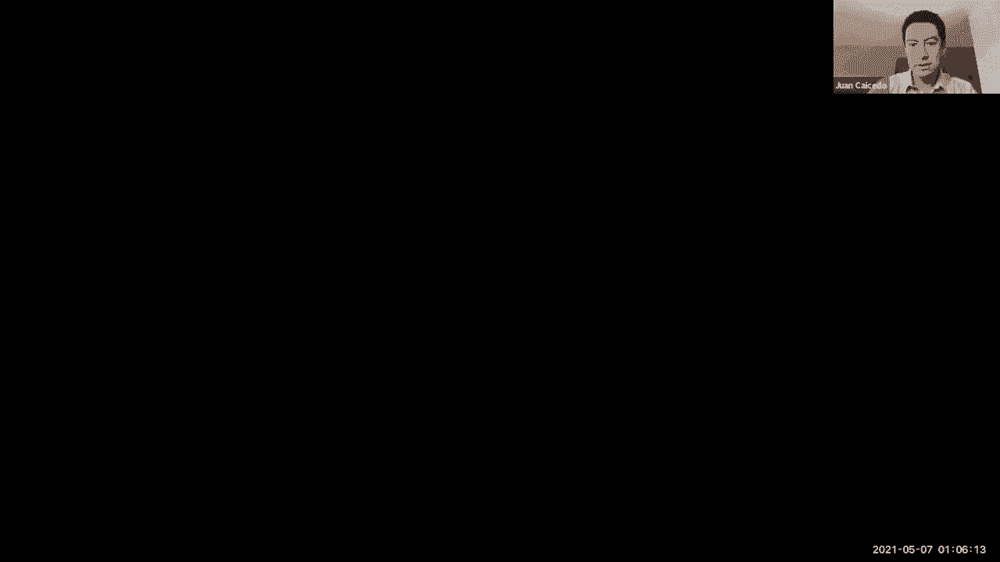
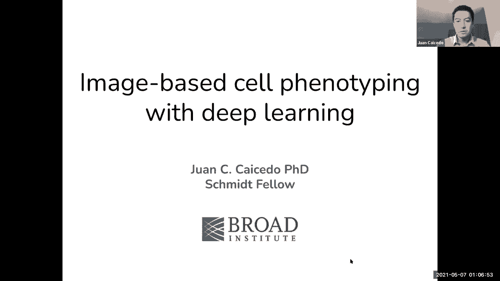
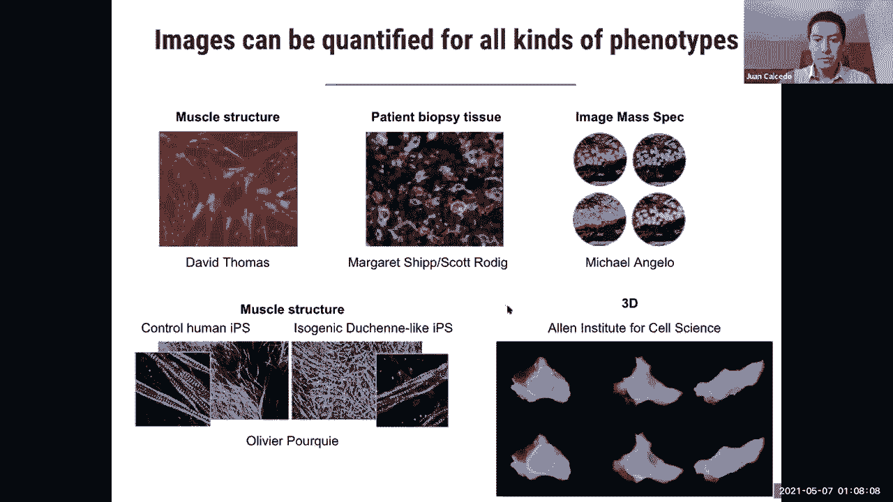
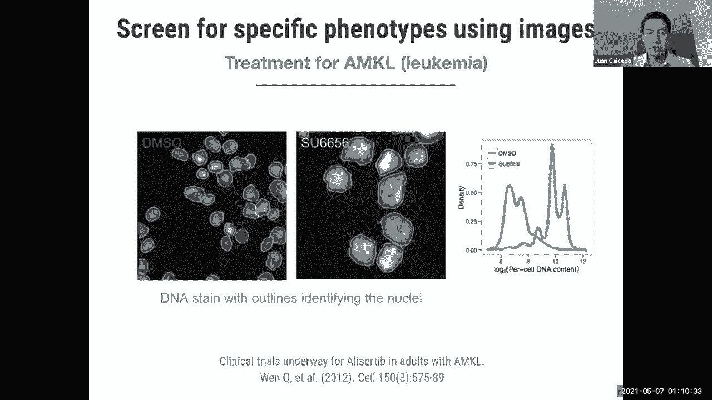
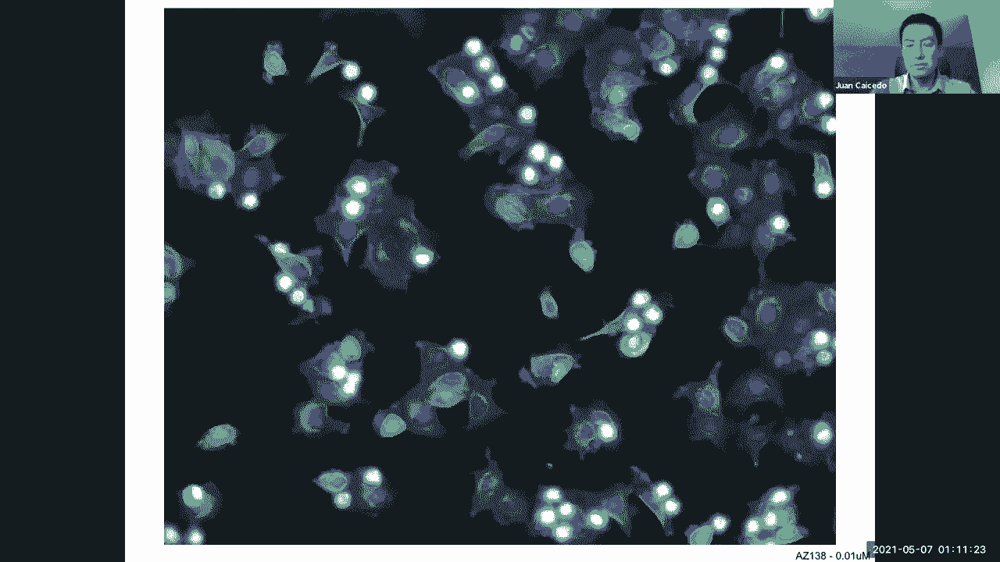
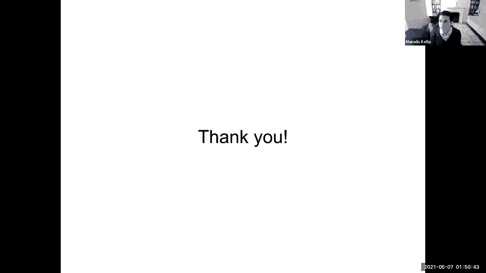

# 【双语字幕】MIT《面向生命科学的深度学习》课程(2021) by Manolis Kellis - P19：Lecture 20 - Deep Learning for Cell Imaging Segmentation - 爱可可-爱生活 - BV1wV411q7RE

欢迎大家，所以今天我们继续我们的图像分析深度学习之旅，我们真的很幸运有芬克·卡萨多和我们在一起，就在街对面的布罗德研究所，包括深度学习，我真的很想，很高兴你能来，非常感谢你让我来这里，对我来说。

分享研究工作是非常令人兴奋的，我要分享我的屏幕，这样你就可以看到这些灯。

嗯，伟大，你能看到我的屏幕吗，是的，非常好，不错嘛，你的指针2，很完美，完美，那又怎样，我今天要描述的是，是一个研究领域，我们称之为基于图像的表型分型或，这是一种理解生物系统的方法。

尤其是当我们设计治疗方法的时候，或者当有嗯，发现细胞新类型表型或功能的机会，所以呃。

这到底是怎么回事，原来图像，生物图像可以具体地量化所有类型的表型，在这张幻灯片中，你可以看到不同类型的显微镜图像，它揭示了大部分的结构，或者你可以看到病人组织的活检，我们也可以使用任何类型的显微镜技术。

包括图像质量，光谱法，我们可以捕捉三维图像，有时甚至是时间推移，所以真的，显微镜是一种让我们以许多不同的方式看到细胞的技术，在不同分辨率下，包括时间和空间分辨率，所以我们真的可以看到很多信息。

挑战之一是我们如何量化这些信息，因为它在照片上看起来很漂亮，但在实践中，为了做出治疗决定，或者在细胞中发现新的行为类型，我们需要精确测量细胞在做什么，决定。

所以这里有一个我们可以使用图像进行测量的例子，这是一个在2012年进行的研究项目，其中呃，研究人员正在寻找一种潜在的白血病候选药物，他们注意到，嗯，或者他们的假设是，呃，如果我们取生病的细胞。

在这种情况下，患有白血病的红细胞，他们是，呃，测试特定的化合物，看看细胞是否能从疾病状态中恢复，在这种情况下，有一个特性告诉我们细胞何时恢复健康，所以在左边的图像中我们看到六个细胞用中性化合物处理。

然后在左边在右边，对不起，我们看到，图像用一种特定的化合物处理，这是细胞恢复正常大小的候选者之一，所以细胞大小是他们在这里观察的具体特征，为了确定化合物是否起作用，还是没用，因为有时在药物发现的过程中。

您找不到，你知道的，您希望产生的行为类型或效果类型，但在这种情况下，他们在筛选后发现了这种特定的化合物，其他几位候选人，他们测量化合物影响的方法是通过观察图像，并测量DNA的总量。

这就是我们在这个中绘制的，呃，其他，呃，右图，经过几次临床试验，然后呃，一直以来，你知道的，就像一个长期的，研究项目，可能在2019年或2020年，这种特效药最终被FDA批准为白血病的潜在治疗方法。

这背后的研究人员，呃，一项具体研究，现在有一家公司致力于寻找新的治疗方法或新药，都是基于图像，所以这是，你知道的，只是一个概念，我们可以用图像来设计治疗方法。

在，在前面的案例中，我们研究了一个特定的特性，您可以使用它来确定，呃，患病细胞与健康细胞，但在更普遍的情况下，呃，如果我们想比较像这样的一群细胞，对抗另一群细胞，比如这个，我们没有明显的特征可以指向。

在这种情况下，不一定只是大小，就像我前面举的例子一样，还有更多的功能，以及从一种治疗到另一种治疗的更多细胞特征，然后呃，对于这些案件，我们可能需要更多的信息，更好的策略来从这些图像中提取信息。

这就是我们所说的基于图像的分析，所以基本上，这是一种利用图像研究细胞形态或细胞状态的方法，想象一下你正在设计一种化学治疗或基因治疗，这真的取决于你想在细胞系统中进行什么类型的干预，你在盘子里做模拟。

它们被称为多孔板，在其中你可以运行多个实验，同时在每一口井里，在每个井里放一种不同的化合物，例如，你让细胞生长，然后呃，的，模拟进行了几个小时，然后你给细胞拍照，以便捕捉细胞的状态，过了一段时间。

在让化合物或基因治疗后，对细胞产生一些影响，你捕捉这些图像，然后下一步是计算部分，我们在其中拍摄这些照片，我们进行分析，为了提取定量信息来估计哪些治疗是有效的，哪些治疗不是。

这种方法在生物学中有很多应用，主要在药物发现方面，你可以在其中测试化合物，但它在功能基因组学中也有许多应用，在功能基因组学中，我们可以敲除基因，或者我们可以干预，呃，编辑基因组，例如，在细胞里。

我们可以看到他们的反应，或者表型发生了什么，这可以给我们关于，嗯，你知道，许多类型的潜在治疗方法，所以我要说的是，今天，是与这个特定的基于图像的分析管道相关的两个计算问题，第一个是细胞分割。

第二个是单细胞表示学习，所以让我们从细胞分割开始，单元格分割的问题在于识别单个单元格在图像中的位置，还有一个，呃，你知道的，实际上有很多方法可以实现这一点，但是呃。

生物学家捕捉到的显微镜图像的多样性也相当广泛，所以呃，如果你去看看每种图像类型的文献，你可以找到一个专门的分割算法，这有点，嗯不好，因为任何时候你改变你的协议，生物学家喜欢很有创意地将某些，你知道的。

颜色或成像技术，以便看到越来越多关于细胞的细节，但每次你改变成像技术，你必须调整分割算法，为了使其在实践中发挥作用，这就防止了，你知道实验室里有很多进展，因为他们要么坚持，你知道的。

已知类型的图像协议和分割算法，或者如果他们改变了什么，他们必须花更多的时间和精力来分割这些图像，所以我们前阵子开始调查的是，如果我们做分段呢，呃，工作单元的分割算法，以及自然图像中的相位探测器。

我们有算法去看，你知道，社交媒体上的图片，甚至在我们自己的手机里，它们自动检测人脸，而我们不必调整任何参数，或者必须做任何训练或我们自己的事情，所以这些模型被训练以便在各种条件下检测人脸，包括呃。

人群或室内，户外等等，等等，它们工作得很好，那么我们为什么不在生物学中也有这样的东西呢，所以我们问了这个问题，我们围绕这个特定的挑战组织了2018年数据科学墙，要做一个你知道的。

计算机视觉技术在生物学中的应用，所以呃，我们出价十万美元，你知道的，能够分割任何类型的，嗯，显微镜，想象一下，以下是我们在这次比赛中考虑的五种类型的一些例子，当然还有更多，但我们包括了三十种不同的实验。

五种图像类型，比赛持续了三个月，我们有三千个团队参加，一起，他们进行了超过65，000个实验，试图破解，如何在任何类型的显微镜图像上分割单个细胞的问题，基本上在幕后。

为了组织这次比赛我们要做的包括三个主要步骤，第一步是，当然，创建带注释的数据集，因为我们希望团队参与监督机器学习模型，所以呃，在做这件事时，在这样做的时候，我们需要输入输出示例，所以我们创建了数据集。

收集来自多个不同实验的图像，然后手动注释，算法应该产生的输出是什么，为了获得准确的分割，所以我们称之为地面真理，然后在收集了一组大约三万两千个单细胞的图像后，手工注释，我们在训练和测试中拆分数据集。

事实上这里有三个主要的分区，与公众共享的开发分区或培训分区，参与者可以以他们喜欢的任何方式使用这些培训测试，然后是第二个分区，这是一个测试分区，他们可以用来从系统中获得反馈，你不能进入地面。

通过测试数据集的符号，你只看到图像，你的任务是为这些图像产生一个分割，所以系统可以告诉你如何，嗯，以评估人们在这项任务中是否取得了进展，我们还必须定义成功的衡量标准，在这种情况下，度量是并集的交集。

它主要测量两个细胞重叠之间的比例是多少，这里有一个例子，想象紫色圆圈是一个真正的细胞，算法给了我们这个更小的物体，我们可以计算两个区域的重叠或交集，我们将其与两个地区的结合进行比较，这是一个分数。

告诉我们分割有多准确，理想情况下，我们希望物体与地面真相完全相同，但在实践中有一些，你知道的，呃，我们打算用这个度量计算的不匹配，这是我们给参与者的反馈，以便让他们知道他们是否在分割细胞方面做得很好。

在测试集中，在比赛的最后一轮，他们只有一周的时间来分割最终的测试集，这是对嗯的测试，他们只能提交，呃，如果我没记错的话，在那个时间跨度里可能有三次，他们没有得到任何反馈，因为那将是呃。

定义比赛获胜者的数据集，谁能够根据这个度量更准确地将最终测试分割到数据集，一次又一次，在这种情况下，用于分割的模型被认为是有监督的训练模型，基本上需要一些，带有示例输出的示例图像。

这样我们就可以训练一个模型，呃，学习输入和输出之间的关系，然后希望在测试用例中，他们只需要运行模型，为了生成我们作为输入提供的图像的分割图，请注意，这里我们没有对呃做出具体的假设。

竞争对手可以使用的模型，他们可以选择任何，他们想要的体系结构或机器学习模型，甚至经典分割，如果这也有效的话，所以在实践中，呃，本次比赛的前三名选手使用以下架构，所以第三名是一个叫深视网膜的团队。

它使用了掩码r cnn架构，以今天的标准来看，这是一个经典的建筑，在深度学习中，一切都变化如此之快，但这个提议是在14年和15年中的20年提出的，所以它已经有几年的历史了，但它已经建立得很好了。

这是一个坚固的建筑，它的工作方式是它看着一个图像，它在汤区分解图像，那是戴着面具的R或CNN程序，这是系统认为可能有一些感兴趣的物体的区域，它从卷积神经网络中提取特征，并生成一些候选人。

这些候选人由另一个网络再次审查，它能够判断物体是否是真实的物体，或者不是为了丢弃它，然后如果它是一个真实的物体，包围物体的确切边界框是什么，将物体与背景分开的掩码是什么。

所以所有这些组件都在掩码r cnn架构中，因此这支队伍能够获得第三名，很高兴看到你知道正确地重用计算机视觉技术，也可以实现高精度的自分割，许多其他团队使用同样的架构。

但他们无法让它像这个特定的团队一样准确地工作，这也告诉我们，这不仅仅是建筑的问题，这也是关于你跑步的方式和规律，交叉验证实验来确保算法正常工作，所以一个是这基本上是不同的，这只是一个圈套吗。

或者他们有什么不同的预处理步骤，我只是想知道你是否能给我们一些直觉，什么时候团队更成功，什么时候不使用相同的底层架构，是啊，是啊，这是个好问题，不幸的是，我们没有。

你知道所有其他使用相同算法的竞争对手的细节，我们知道有很多人在使用这个算法，事实上使用相同的代码，因为在论坛上他们分享信息，你可以看到人们在那里交谈和交流思想，许多人都在使用这个团队使用的实现。

但我们不知道确切的结构，这限制了我们理解，有什么区别，我们有机会和这个人互动，他们分享了他们使用的所有你知道的配置，根据他们的经验，有几个参数对完美的细胞图像有更大的影响，嗯，也许其他人错过了这些参数。

所以总的来说，这些参数能够揭开神秘的面纱，基本上把它从一门艺术变成一门科学，并说这里是你需要采取的步骤，但如果真的是这样，步骤是，这是一门艺术，你必须尝试所有这些不同的参数，那么也许是的，好像是这样。

我们我们，我们没有更多，你知道的，嗯，对此的见解，是啊，是啊，每个人都在同时做实验，也许这个人比其他人有更多的时间，所以我们也不知道作者在什么条件下非常，很有帮助，谢谢。当然可以，所以其次，呃。

我们拥有的是另一种类型的建筑，我觉得这也很有趣，因为再一次，它告诉我们，也许确切的架构并不像，你训练它的方式，这里的建筑是一个图像金字塔网络，基本上在这种情况下，我们把图像作为图像作为输入。

然后我们计算多个特征映射，这些特征映射用于生成几个中间输出，所以你可以得到图像所有尺度的反馈，为了改善功能，在最后一层有不同的分辨率，您正在聚合来自所有这些分辨率的信息，以便生成特定的输出。

我认为这个解决方案的创新之一不是建筑本身，因为它也是计算机视觉中公认的架构之一，这是他们模拟输出的方式，那个呃，而不是预测二元掩码，这是对这类问题的一种实践，他们建议预测某种距离图或。

它们在其中的角度图，呃，有点渐变，如果你喜欢，我们可以测量一个特定物体到细胞中心的距离，在不同的方向，就像方向是什么，对不起，45度方向的距离是多少？从这里到中心，等等，等等，所以他们创造了一些编码。

嗯，人工设计，我猜测输出以便获得更精确的测量，准确的物体被定位，就这样，他们在比赛中获得了第二名，我认为主要的创新是输出的编码方式，这个以前用过吗，他们想出了一个新奇的主意吗，我认为这是一个新奇的想法。

呃，但在这之后，其他一些作品也跟进了，现在有更多的文件，评价，使用这个有什么价值，很显然，尤其是当你有拥挤的图像，有很多物体可以告诉你，物体边缘的距离是多少？相对于中心，在课堂上似乎更有信息。

我们讨论了很多关于表示学习和虚拟任务的创建，我可以强迫系统学习表征，在这方面，这似乎是一个非常有趣的想法，基本上嗯，非常有趣，是啊，是啊，通过欺骗系统，来预测一些特定的东西，你可以在图像上测量，不错嘛。

我想你可以提取这种条件，我也很喜欢等级的性质，这也是在这个领域非常成功的事情，所以你知道，以某种方式限制这种多分辨率方法，是呀，这是一种非常好的建筑类型，不幸的是，这项工作的幕后黑手，呃没有跟进。

你知道有更多细节的出版物，是啊，是啊，嗯，但是其他人已经看了他们的代码，并试图将这些想法形式化一点，嗯，有一些文件，我也可以指出的相关论文，万一有人感兴趣太好了，非常感谢，最后，首先。

他们使用的建筑类型是经典的，它被称为单位，也许你在其他作品中见过，这里的基本思想是你把图像，你一直计算表示到更低的分辨率，甚至是单个特征向量，然后从那里你把这个表示解码成一个完整的分辨率，图像是解码器。

对不起编码器，多个分辨率之间具有跳过连接的解码器体系结构，您可以共享来自的输入或解码器的信息，一直到解码器的编码器路径，所以他们以一种方式交流，基本上是通过将信息从一个复制到另一个。

这是一个非常简单的建筑，这里的创新与其说是，建筑，因为它也很古老，也很简单，他们的创新之处在于他们用三种不同的模型复制了这种结构，基本上是因为你可以选择，嗯，多少层或多少过滤器，或者每个的分辨率是多少。

所以他们有三个不同的单元，下面是这些单位的一些名称，基于Resnets，基于密密网，即使基于初始重置，诸如此类的事情，所以他们有各种各样不同的架构，为了形成编码器和解码器，嗯，他们同时训练他们所有人。

所以这是一个非常大规模的合奏类型，我认为这是一种计算上涉及的方式，你知道的，我们想要解决的任务，他们赢得了比赛，我认为合奏对赢得比赛是有用的，但在实践中，更简单的模型似乎做得很好。

这个组合的表现与第二名和第三名之间的差异真的是少数，我们认为这可能并不重要，嗯，但计算负载肯定要多得多，嗯，只是为了明白，左边的模型是不同的网络相互交谈，或者每一个，其中一个平行独立训练，但独立。

然后他们都做出预测，最后你只需要做一些合奏的方法，这是个好问题，是呀，如果他们是独立经营和独立培训的，在你这样做之后，你拿着测试图像，你通过32个不同的神经网络来运行它，并聚合输出，最后的后处理步骤。

我很好奇，他们是否调查了，他们每个人都研究了单独的方法，基本上可以看到，如果有一些人一直表现优于其他人，嗯哼，这是个好问题，我想他们没有做任何具体分析，可能是因为他们的比赛时间很短。

我认为这也是比赛的局限性之一，你知道很短的时间，有时候有些细节是做不到的，呃，详细研究了，嗯，我认为这是一个很好的问题，我不认为所有的神经网络都同样重要，所以如果能，合奏。

只留下几个在实践中提供更准确性的模型，他们也写了他们的方法吗，否，他们没有没有，好的，但如果你能把文件寄给我们，我是说，我随后就到，那太好了，因为他们所有人都必须做的一件事。

不过是记录他们的方法并分享代码，所以所有这些方法的代码都是公开的，和呃在，理论上，任何人都可以，你知道吗，呃，获取我们创建的数据集，并且该数据集是公开的，是公共领域，所以你可以把它用于学术或商业应用。

此数据集的使用没有限制，你也可以下载他们的代码，测试他们测试的不同方法，为了做某种元分析，也许或者类似的东西，那就太好了，非常健康，谢谢。呃酷，所以有了这三个，嗯，呃，我们真正想评估的事情之一是，嗯。

我们得到了什么改进，你知道的，促进生物学研究，在这种情况下，想象一下我们有这五种类型的一百张图像，你有一个生物实验室，你必须在本周的100张图像中分割细胞，那么有什么选择，其中一个选项是。

我们可以雇佣一个数据科学家，他可以用一个基本的单元模型来训练它，呃，我们拥有的训练集，然后进行一次训练，对不起，每种不同类型分别一个单元，因为那是当时的惯例。

就像每个人都在为特定类型的图像优化他们的算法，这就是我们复制的我们所做的我们在这里观察到的，这个人要花大约20个小时的工作，为五种图像类型优化五个单元，第二次。

我们可以通过在这些图像中运行一个独立的模型来看到你能得到多准确，所以我们这里有这些点的颜色，在每个类别中表示一个图像，这么绿，例如，这里只有一个绿色的图像，就是这个，然后在紫色的图像上等等，精度。

这是F1的测量，所以越高越好，正如你所看到的，有些图像很难被这些模型分割，这里的平均准确率是62%，嗯，所以很难分割，因为你没有受过足够的训练来塑造那种形象，准确地说。

我认为这是这个特定数据集的问题之一，嗯，我们得到的注释类型不平衡，对于每个数据集，这代表了，也是现实世界的情况，有些图像也很难注释，因为它们需要专家真正进入，你知道吗，说这是一个对象。

这是一个单独的对象，所以我们肯定少了，嗯，蓝色和紫色的例子，在这个里面是比较难分割的，但如果能知道，如果不同类型的成像技术比其他技术更容易通过，是呀，呃，那也是，呃，是啊，是啊，我想那是真的。

在这种情况下，小荧光可能是最容易解析的，这个就硬多了，就像粉红色和紫色，呃，他们更难，你知道的，段um，我们有更详细的分析，什么是，每一个挑战是什么，在这种情况下，我要快速展示的是一种趋势。

尤其是当你使用不同的，uh方法培训，每个图像类型一个模型是一种可能性，你可以做的另一种可能是使用经典算法对图像进行分割，在这种情况下，你基本上必须，你知道的，下载图像分割工具，然后配置参数。

你可以使用多种东西，这个人会花更少的时间，因为它只是你知道调整参数，但它也会得到几乎相同的精度，同类问题，有些图像更难分割，这只是经典的算法，不需要做任何训练或任何优化，如果你问专家图像分析师。

他们可以，你知道优化分割算法的参数更好，因为他们有经验，帮助我正确分段的参数是什么，他们可以获得高达74%的准确率，这在更短的时间内有点有趣，所以有经验绝对有帮助，最后如果你用比赛中排名第一的模特。

您不需要配置任何东西，因为模型是预先训练的，可以拍摄任何图像，和，呃，有趣的是，你也可以得到更高的准确性，我认为这也是一个信息，呃，如果我们把所有的，你知道的，你可以从所有的图像中获得的协同学习。

你可以做得更准确，在一天结束的时候，你只需要训练一个模型，你可以分享和使用，好像是鉴相器，最近的一些作品专门研究了分割的特定方面，我想，我们现在正在实现一种通用的细胞分割工具的目标。

你可以在网上找到至少三种方法，细胞核，Zer单元柱，这个叫梅斯默，最近出版的，可能是上个月左右，嗯，都是预先训练好的模型，令人惊讶的是，他们都使用了人们在比赛中使用的策略，在细胞柱的情况下。

在核器单元的情况下，口罩或CNN，在Mesmer的情况下，并以金字塔网络为特征，所以我们作为一个自动分割细胞的社区正在取得进展，我们不仅仅是分割细胞核，我们现在也分割细胞体，这当然更具挑战性。

这就是我们得到的，在细分方面仍然存在一些开放的挑战，第一个是收集更大的，公开数据集，我们的就是一个例子，但它有点小，你知道的，计算机视觉中的其他数据集，以及从，你知道的，例子较少，也许用主动学习。

以优化专家用于识别物体的时间，并确保模型能够了解这些图像中什么是重要的，而不必，你知道，真正进入大规模政权，没问题，我会是，我要搬家了，我要切换到第二档，呃，单一自我表征学习的主题。

我想我不会有太多时间详细讨论，但基本上回到貌相的想法，我们想把图像转换成，你知道的，我们可以用来做决定的信息，一个步骤是分割，我们刚才说到的，第二步是测量细胞的表型，那是最初的动机，比如细胞是怎么回事。

我们需要测量这些性质，测量形态学的一个经典方法是，只需使用区域形状，原子核的大小，或非常具体的工程测量，但我们知道，机器学习方法可能也能够学习我们无法轻松描述的特征，细胞就是这样，只是看着细胞，呃。

有时这些已经足够复杂了，和，发现在细胞群体之间产生差异的特征是，机器学习方法也许能更好地帮助我们，嗯，原来有，呃，这里有一个重要的警告，我们正在处理扰动实验，这意味着我们要取细胞。

我们将用化合物处理细胞，一些复合结构，你知道，就像化学物质，我们应用这些化合物，到盘子里的细胞，它们给了我们一个形态学，这就是我们在图像中观察到的，但是呃，这些化合物通常像板一样成批组织，你知道吗。

批次对形态也有影响，所以如果是在早上，也许细胞会更快乐，如果是在晚上，他们会很伤心，或者这是另一个人在做实验，一天结束时的一些显微镜干扰，这很敏感，嗯，细胞生物学模型，所以批次中任何类型的最小扰动。

会在这里产生影响，我们想发现的，真的是什么表型解释了化合物的效果，呃，我们不能直接测量化合物的效果，我们想通过形态学来观察它，但是批处理效应有时会产生噪音，有时，呃。

混淆了我们对细胞表型中什么是重要的理解，呃，哦，顺便说一句，我们这里没有记号，这是关于分段的一个主要区别，这不是一个监督学习问题，我们最终不知道表型是什么，这是药物发现，我们不知道这种化合物是否有效。

所以没有基本的真相，希望我们能在这里使用完全不需要监督的方法，我们使用的是每周监督学习的方法，它使用关于化合物的信息，所以基本上我们用，我们取一个细胞，通过神经网络运行该细胞，我们问。

你能说出应用在细胞上的化合物是什么吗，因为这是实验的一部分，我们知道化合物是什么，我们不知道的是这种化合物是否有效，所以网络必须做出分类决定，但我们不在乎分类，因为我们已经知道应用于细胞的化合物是什么。

我们想要的是网络出现的功能，为了以有意义的方式组织这些细胞，因为这些特征会告诉我们化合物是否相似，呃，我们如何评估，呃，想象一下我们得到，呃，十三，呃，在这种情况下是化合物。

所以图中的每个灰色节点都是一个化合物，我们在每个化合物中都有一个细胞群，这些细胞已经聚集在一起，假设这是形态的平均值，根据网络中的特征，所以我们想做的是能够理解，哪些化合物彼此相似。

所以我们可以把这个图，所有化合物对所有化合物，看看呃，我们在图表中观察到的连接是否有生物学意义，这只是为了基准测试的目的，为了了解我们将做出的发现，因为这是一种模拟，在生物学上是否重要。

如果我们得到的特征表示是有用的，我们应该观察到，这几乎是这里在实践中的目标，当制药公司实际运行这项技术时，他们不知道这种联系是真是假，所以他们必须进行另一个实验，也许更复杂，不仅仅是图像。

也许是测序什么的，或者也可以和真正的病人在一起，但是使用图像的目标，就是把搜索空间缩小到几个有用的化合物，呃，所以当我们用不同的，实验，呃，呃，我们观察到深度学习的特征和经典的特征有很大的不同。

在x轴上，我们有我们在图中观察到的连接总数的百分比，在y轴上我们观察到，呃，我们观察到的真正有生物学意义的联系有多丰富，然后呃，深度学习给了我们优势，连接化合物的巨大差异。

尤其是这种情况下我们有一万六千六百种药物，我们想看看它们在生物学上是否有联系，只要看图像，这些结果表明是这样的，您可以根据蜂窝功能拥有的其他类型的用法，确定癌症梯度或突变的影响，有时当癌症患者有肿瘤时。

他们现在常规地对肿瘤进行测序，你可以看出有很多突变，但我们不知道突变是否导致了癌症，或者只是乘客突变，那是癌症的影响，但不会真正产生癌症，所以在这种情况下，我们比较原始类型的，嗯，基因与突变体。

只要再看一次图像，我们可以看到有区别，呃，只是通过眼睛，问题是我们如何量化它，我们可以计算特征，我们可以比较细胞的群体，在这种情况下，蓝色，红色和绿色的种群正在被比较，我们可以测量它们之间的表型相似性。

为了估计突变体是否真的导致了癌症，所以这是测量细胞形态的另一个应用，我说的是批量效果，呃，这是你知道的，我们在学习过程中必须注意的事情，如果我们不纠正批量效应，数据将有一个结构，基本上对应于批次。

这是这里的颜色，呃，在最下面的一排，当我们在事实发生后对批次进行校正时，我们可以消除一些结构，但它仍然存在，我们应该多用一点，呃，防止批量效应的主要方法，这是我们最近正在测试的一个想法，这是一个域适应。

我们基本上可以放另一个分类器，这里的标签是，这是神经网络，它有两个头，第一个头对化合物进行分类，因为它是我们可以用来学习特征的东西，第二分类器，呃，确定批次，我们不希望这些信息影响我们使用的功能。

所以我们用底片，嗯，为了摧毁任何，来自图像并与批处理相关联的潜在信息，使用这种方法，我们可以纠正批处理效果，呃，神经网络学习特征，右边的列指示批次，呃，而左边的列指示，哦，对不起。

左边一栏显示的是未经批量更正的信息，所以你可以看到它都混在一起了，我们想把批次和表型分开，为了减少混乱，理想情况下应该是这样的，但不应该影响这些群体中的任何一个，并应通过网络明确确定表型。

这就是我们用梯度反转层得到的，以下是关于表征学习的一些开放挑战，其中涉及批量校正，这仍然是一个问题和可解释的模型，因为这些特征在深度学习中通常是没有意义的，所以我们真的需要推动这个领域，然后嗯。

把它也修好，所以我想说的是图像是一个很好的信息来源，他们有很多东西我们也可以做很多公开挑战，但希望他们是，它们将有助于生物发现，这才是我们真正想推动的，非常感谢您的关注，我想这就是我今天的全部。

非常感谢，这真的是一个美妙的，很高兴你能来，非常感谢你的见解，我期待着与你互动，我也会跟进各种链接，太厉害了，所以呃，杰基。

