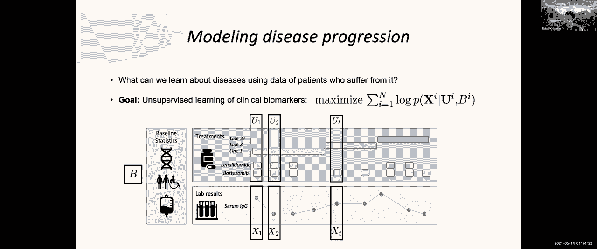
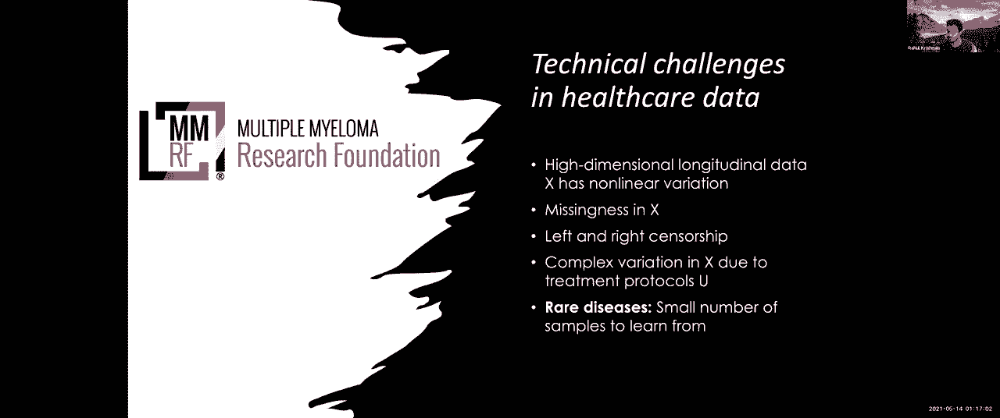

# 【双语字幕】MIT《面向生命科学的深度学习》课程(2021) by Manolis Kellis - P21：Lecture 22 - Electronic health records - 爱可可-爱生活 - BV1wV411q7RE

所以今天欢迎大家，我们很荣幸有拉胡尔·克里希南，他将告诉我们关于医疗保健的机器学习，疾病进展，建模，所以呃，拉胡尔，把它拿走好的，非常感谢，大家好，太棒了啊，在这里展示我们一直在做的一些工作。

机器学习与医疗保健的交集，我叫拉哈尔，我目前是微软研究院的高级研究员，新英格兰，如果你们都在麻省理工的话，呃，但既然我们都在不同的地方，呃，我目前正在远程向您展示，在秋天，我将成为计算机学院的助理教授。

多伦多大学医学专业，所以我想给你一个关于股票的概述，嗯，我将从一些介绍开始，呃，就在机器学习和医疗保健领域，在过去的一个学期里，你们都见过不同种类的研究人员展示他们的工作，嗯，你知道的。

跨越广泛的不同主题，所以我会告诉你们这个交叉工作的基础是什么，嗯，然后我要给你一个小插曲，这将形成一个特定利基市场的大部分库存，在机器学习用于健康或疾病进展建模的背景下，所以我会给你一些动力。

问题陈述是什么，在这种情况下，我将和你谈谈深度生成建模，最后展示一些作品，我看到了这一年的一切，所以我也要总结一下，强调一些我认为在这个领域存在的交叉研究的机会，我认为这门课给了你一个很好的。

让你做好思考准备的话题的广度，其中一些问题将是如此，不再赘述，我要跳进去，嗯，如果我们看看你知道这个情节现在有点过时了，但如果我们看看这个情节，电子健康档案数据的数字化，就在美国。

从2008年开始到2015年，嗯，你会看到医院的数量迅速增加，在美国采用了电子病历系统这意味着什么，这是你知道的，主要是由行政压力驱动的，也就是说，人们想要更好的方法来跟踪医院系统的支出。

所以政府激励了这个过程的实现，但这有一个非常有趣的后果，人们开始问嘿，我们有这么多关于病人的数据，现在我们有关于医学成像的数据，我们有关于住院病人健康监测的数据，我们有这些病人进行的检查。

我们甚至有手机吸引，呃，关于我们自己健康的具体细节，以及实验室结果，我们能用这些数据做有趣的事情吗，所以这个用于医疗保健的机器学习领域开始问这些问题，我认为从广义上来说，在这个领域已经做的一些工作。

是关于通过对数据的无监督学习来思考，也就是说我有一个很大的数据集，我要调查这个数据集，并理解数据中存在的子结构的种类，子结构有趣是可行的，或对未来临床相关结果的预测，这是一个研究乳腺癌患者数据的例子。

现在在医院收集的所有这些数据的另一个替代用例，是关于构建工具来帮助临床医生，所以在这张照片中，你有一个医生，呃，你可以认为他可能是一个机器学习指导的辅助工具，更好地帮助临床工作流程。

所以当人们开始用这些数据问和回答非常有趣的问题时，还有一种不同的数据集，一种不同的数据模式，开始由大量的非营利组织发布，这些通常被称为疾病登记处，所以在医院里，您可以将数据集视为跨越。

各种各样的人和患有不同疾病的人都聚集在一起，疾病登记是更集中的数据集，所以它们通常是由基金会或非营利组织发布的，他们有兴趣让研究人员，就像你们所有人一样，在一种疾病的背景下学习和回答有趣的问题。

所以可能没有多少人知道疾病登记，所以我想给这个，呃，你知道的，图在这里给你一个什么卡通描绘，注册表可能是什么样子，所以呃，在左手边，您通常倾向于为注册表中的每个人，一些基线特征，这将是人口统计信息。

这可能是遗传信息，rna测序数据，而不是暴力和生物标志物的基线实验室，通常用于疾病登记，我们可以访问纵向数据，这是病人随着时间的推移而存在的数据，等等，右上角的情节，你看到的是治疗通常是什么样子的例子。

所以在这种情况下，这个病人有两种药物给他，有时结合在一起，有时是孤立的，他们的治疗费用，你在这条情节线的顶部看到的，一行，二线三加是许多慢性病治疗的一个内在方面，也就是说这是临床医生采用的临床方案。

这在用户注册中心中很明显，例如，医生经常做的事情，尤其是在治疗癌症时，他们将从所谓的第一线治疗开始，也就是说，临床协议告诉我什么，当一个新的癌症病人进来时，我应该这样做，所以你知道你有一个病人，呃。

经过几次治疗的第一步，它构成了一套药物或治疗的组合，也许这些治疗方法对这个病人效果不太好，所以他们进入了二号线，所以第二行通常表示要么是一种更积极的治疗形式，或者完全不同的治疗，最后他们在3号线前进。

所以这些，你可以把这些线看作是近似的，临床医生采用的策略，当他们在医院治疗一种疾病的病人时，和疾病登记，经常跟踪这些帮助研究人员了解病人在哪里，在治疗过程中，最后在底部是实验室结果，所以我向你介绍。

这些生物标志物中的一个可能是什么样子的卡通描述，这些实验室结果，他们下去，对于生病的病人，他们可能会错过一两个医生的预约，所以这些值用红色表示，所以这个数据很有趣，它包含了患者大量丰富的表型信息。

但处理起来往往非常混乱，因为一个人必须处理混乱等问题，所以这只是为了给你一点土地的布局，就什么是疾病登记而言，我能指望在疾病登记处找到什么，数据是什么样子的，所以我今天要给你们的是，是呃。

今年将在icml上发布的作品，它在讨论我们如何建立统计模型，它可以模拟我在上一张幻灯片中展示给你的那种数据，这类模型被称为疾病进展模型，我应该让你知道，在前面声明这是一个非常古老的领域。

它在不同的社区以不同的名字存在了几十年，我绝不是说你知道，这是第一个这样做的工作，所以如果你想，如果你，呃，所以如果你查阅生物信息学中的疾病进展模型，呃，多年来，人们对各种疾病这样做有丰富的历史。

从机器学习的角度来看，提出这个问题的一种方式是无监督学习，所以让我们再来看看我们所拥有的数据的卡通描述，让我们开始给这些随机变量命名，我们要考虑建模，所以在左手边，我们有静态基线协变量，我将称之为。

在顶部和底部，我们有纵向数据，我要参考，我要用x来表示时间，变化的，经度或生物标志物，我在这里只展示了一张照片，但在实践中，嗯，这些登记处跟踪许多，同时为一个病人提供许多不同的生物标志物。

所以x通常是高维的，在顶部，我们有我们使用的治疗方法，给病人开的处方，这包括他们的治疗路线以及他们工作的单个药物，就像我之前提到的，疾病进展模型通常被认为是一个学习问题。

是对这些临床生物标志物的无监督学习，特别是，呃，模型通常被设计和建立来最大化这种条件概率分布，那么这是什么，让我们把它分解，所以我们想最大化所有病人的集合，每个病人的对数概率。

观察条件下临床生物标志物的纵向序列，他们的基线治疗以及一系列呃，治疗，对不起有条件的，两者的基线统计数字，以及他们接受的干预或治疗的顺序，随着时间的推移。

在这次谈话中，我要和你们谈谈如何解决我们先前看到的问题，做条件密度估计作为疾病进展模型，在多发性骨髓瘤的背景下，所以对于那些可能不熟悉它的人来说，多发性骨髓瘤是一种罕见的骨髓癌，它在人口中的发病率。

无论你看到哪个国家都将是难以置信的，呃，难以置信的低，所以，结果呢，这是由于这是一种非常罕见的疾病，我们通常有很少的样本可以学习，所以这就是这种疾病的独特之处，是什么驱使我们思考。

我们如何做好建模和密度估计，当我们处理罕见疾病的数据时，此外，呃，除了样本数量少，我们必须应对传统的挑战，这与处理医疗保健数据有关，第一个是我们有高维纵向数据，在不同时间点观察到的x。

它表现出非线性的变化程度，我们必须处理x中缺少这个的事实，我们需要我们需要一个好的方法来处理这种缺失，我不会深究这件事，但是呃，临床数据通常有相当程度的左右审查来告诉你，什么是权利审查。

这意味着在任何给定的研究或病人观察期间的任何时候，他们可以选择撤回和发送，他们可能会说，我对我的数据再被公布给研究人员感到不舒服，所以从那时起我们就没有关于那个病人的更多信息，所以这实际上是缺失的。

这种特殊形式的缺失通常被称为权利审查，和等价物有呃，呃，你也离开审查制度的情况，最后，我们有一个x的变化是驱动的，不仅仅是生物标志物的过去历史，还有病人的治疗时间表，所以我要谈谈这些挑战。

在我今天向你们展示的东西中，但我想给你提个醒，这通常是一个嗯，一些独特的挑战，显示在医疗保健数据中，我想在你过去的客座演讲中，当您仔细考虑和查看不同的数据模式时，各种各样的挑战出现了。

但我认为努力思考和解决，其中一些挑战可能是最有趣的，是一些最有趣的研究完成的地方。

所以嗯，如果我们你知道，摘下我们的数据帽，戴上我们的模特帽，我们问这个问题，我们想做条件密度估计，我们有什么工具可以有效地解决这个问题，嗯嗯，也许你们中的一些子集可能上过机器学习或深度学习的课，会说好。

我们有非线性的高维数据，也许我们可以试着模拟条件概率分布，用递归神经网络，所以我向你们展示了一个图形模型，在左边，其中x的概率，给你，a逗号b，是由左下角的这个自动回归密度函数建模的，另一群人可能会说。

呃，嗯，我觉得我们应该再仔细想想，也许我们应该选择更简单的模型，就像隐马尔可夫模型或高斯模型，或者它的连续时间，连续的表亲，高斯状态空间模型，所以这是另一个可能的选择，人们可以考虑使用这种数据。

所以我写了一个高斯状态空间模型的方程，关于它如何模拟底部序列的密度，好吧，好吧，在这两种情况下，一个问题可能是一个线性模型是否足以为数据建模，所以在我们过去看过的一些工作中，我们发现。

为了模拟纵向生物标志物的非线性密度，一开始可能需要求助于非线性模型，所以我所展示的，您在这里是一个深度标记模型的图片描述，本质上就像马尔可夫模型，除了发射函数和跃迁函数。

这是两个参数化潜在状态如何演化的函数，以及观察结果的行为，作为潜在态的函数，用神经网络参数化，所以我们要在这里暂停一下，看看，呃，这个模型，以及它是如何成为，所以呃，在左上角，你有一个围绕着。

如何用这个模型来表示数据的条件密度，所以它是在这个高维向量上的积分，z在所有时间内变化的条件概率，随着时间的推移，乘以给定潜在变量的观测条件概率，所以，你知道生成数据的故事，事实上，你从Z1的左边开始。

有些您认为数据是由以下过程生成的，z 1表示一些低维向量，嗯，它生成x 1到初始观测集，然后医生进来，也许开了一套药，所以你对病人的潜在表现改变了Z 2，这种变化是由我们称之为转换函数的东西控制的。

z 2产生自己的观测集，医生又开了一套药，你呃，它管理着Z 3如何，我会在前面说，至少在这次演讲中，我不会非常非常深入地讨论这个模型实际上是如何学习的细节，你可以看看下面的参考资料来理解，但我只想说。

参数估计，这是控制神经网络的参数，这个模型中的每个方程都是通过最大似然学习的，我们将使用变分推理，用一个推理网络来逼近棘手的后验分布，因为记住这是一个潜在变量模型，我们需要有某种方法来近似后验分布。

为了进行参数估计，拉胡尔，我能问你一个问题吗？所以说，取决于您测量的变量的类型，观察结果可能取决于医生的预期，该值将是异常的，是啊，是啊，所以这是一个很好的问题，只有当你预计他们不正常时。

你才会被开处方，否则你不给病人做那个测试，是啊，是啊，这也意味着当您丢失数据时，你不能指望丢失数据的分布，与观测数据的分布相匹配，是啊，是啊，我很好奇这是否适用于这种型号，其中有非缺失的随机分量，嗯。

所以我先回答第一个问题，呃，这是关于新的一个事实，比如说，在我们这里的这张照片中，你们两个会是什么的函数，x 1是也就是说，呃，对不起，呃，什么的，x1和x2是，也就是说医生选择做什么。

接下来将取决于临床生物标志物的价值，嗯，由x 1和x 2取的，因此，您有机会拥有依赖关系，所以这是一个很好的观点，这不是我们在这里处理的事情，因为我们总是假设，随着时间的推移，我们可以使用，也就是说。

我们将以治疗方案为条件，这将为病人决定，所以嗯，你可以想象在x 1之间存在一条假想的边，你们两个，是啊，是啊，是啊，是啊，是啊，是啊，你没有，但除非你想到你们两个是潜在的，你其实不必学习那种优势。

因为YouTube上的条件反射阻止了X 1和X 2的任何影响，关于随后的生物标志物是如何得到它的，谢谢。好的，所以嗯，对不起，我回答了第一个问题，好的，是啊，是啊，我是说，这是一个更大的问题，但是是的。

好的，所以错过这个问题是一个很大的问题，然后嗯，在某种程度上，我想我的第一反应解决了它，但在另一个程度上，我认为，呃，这个模型在处理丢失的数据时很有趣，因为，通常。

最大似然估计的过程要求您排除丢失的数据，是啊，是啊，当你不观察它的时候，在这类退化模型中，边缘化很容易，因为它有效地恢复到忽略与丢失变量相关联的丢失项，这里有一个小微妙之处，我想指出，这就是事实。

如果你用推理网络做变分推理，你确实需要对你的数据有一个条件来参数化一个近似的后验分布，也就是说，您将以丢失数据为条件，在推理网络中的这些场景中，我想在这部作品中，我们使用各种启发式来近似丢失的数据。

就像我们用平均填充和向前填充一样，填充值以近似丢失的数据，但是，对于如何处理丢失的数据，我还没有一个很好的答案，在推理网络的上下文中使用这类模型时，然而，所以我认为在学习方面有有趣的研究要做。

缺少这一点如何影响各种后验分布的偏差，因此影响所学到的参数，但是我见过很多，呃，专门解决这个问题，是啊，是啊，所以，我，我想给可能的图片代表，你知道这个模型看起来像，呃，只是一个地面。

因为在这节课剩下的时间里，我们将研究这类模型，所以让我们说，医生在这个时间点看到病人的以下一组临床观察，医生说一切正常，我真的觉得开任何药都不舒服，嗯，你知道的，三个月过去了，病人又进来了。

你看到其中一个生物标志物，另一个生物标志物不见了，因为诊所没有要求做那个测试，医生说这对我来说有点不对劲，我给你开点药，这种药，嗯，三个月后，一个病人又来了，根据临床观察，他有以下一组实验室值。

医生说我需要在这一点上进行更强烈的干预，但病人对此没有反应，所以这个病人和医生如何互动的故事，是通过这个随时间变化的潜在表示来建模的，所以希望，这张图向您展示了如何对数据的条件密度进行建模。

通过潜在表征的变化和变化，和，所以说，我们的假设是，我们可以把这个随时间变化的Z看作是高，维度病人向量，也许是他们潜在病人状态的代理，那么我们在最后几张幻灯片中做了什么。

我们说我们一开始就说我们有这个问题，我们想模拟临床数据的条件密度，嗯，我们讨论了左手边的一些工具，我们还有一些，呃，我们有递归神经网络和深马尔可夫模型，它们是序列的强大黑匣子模型，然而。

其中一个概念在实践中得到了遵守，事实上，当数据稀缺时，它们容易过度拟合，我们说是因为单发性骨髓瘤，我们关心的疾病，是一种罕见的疾病，在右手边，我们有更传统的模型家族，如状态空间模型和HMMS。

它们是线性的，在疾病进展的背景下有丰富的使用历史，然而，我们知道支配的潜在动力，这些临床生物标志物的行为是非线性的，所以我们在这项工作中问的问题是，是否有一个中间立场。

我们能否利用领域知识有效地为临床数据设计深度生成模型，所以嗯，我们走这条路的原因是，如果我们将正确的领域知识集纳入模型，我们可能希望帮助它更好地概括，这就把我们引向了临床数据的下一个问题。

特别是癌症进展，什么是正确使用的领域知识，因此，在这项工作中，我们关注两种类型的领域知识，一个是关于治疗的路线，另一个是关于捕捉药物效应的机制，所以下一个问题是，如果我们有这些知识，呃。

关于模型的这两个方面是如何表现的，我们如何使用它，所以在这项工作中，我们专注于设计一个新的，过渡函数的新神经结构，所以如果你回想一下状态空间模型的方程，实际上，我们要做的是这个函数，嗯，我是，我是。

我收回了我对注册表数据的卡通描述，我在这里展示的是治疗是如何随着时间的推移而表现出来的，这里有两件事要指出，嗯，我们将集中在治疗线开始，你会注意到治疗路线近似，病人接受治疗多久了，因此，为了捕捉这一点。

我们将增加我们的治疗代表性，用所谓的全球时钟，它只是一个规范化的计数器，上面写着我治疗这种病多久了，此外，你会注意到这些治疗路线在不同的时间点发生变化，所以我们要用这些本地时钟来增加治疗的代表性。

它有效地告诉你已经过去了多少时间，直到病人发生重大进展事件，所以这些本地时钟捕捉相对于进展事件的时间，下一个，我们要考虑如何近似，药物的机制作用，所以左手边又是，我们所拥有的数据的卡通图片。

和两个不同时间点的生物标志物之一，我们假设医生治疗病人的方法之一是，他们问得很好，我觉得多少钱，我怎么想，这个病人的肿瘤负担是，还有很多，这是我们与MGH肿瘤学家的谈话，在，呃，在这方面，呃，数据集。

所以他说，嗯，我有点想，嗯，呃，疾病负担有多大，这在某种程度上指导了我开出的治疗量，所以直觉上，这些癌细胞的应对描述，呃，我们预计这种治疗会对，多发性骨髓瘤患者存在的这些癌细胞的大小，问题，然而。

我们从来没有直接观察到癌症的大小，我们只能通过我们实际上可以获得的临床生物标志物来观察它们，在登记册数据集中，所以我们要做的是想出一个近似值，近似药物机械作用的函数，医生在每个时间点开出的处方，请注意。

开的不仅仅是一种药物，通常用于癌症治疗，你开了这种混合药物，我们需要近似这种鸡尾酒的效果，如果我们有，如果我们需要捕捉，它对潜在病人化疗的影响，为了捕捉近似的效果，我们转向另一个科学分支。

它正好处理这些问题，这就是药物动力学和药效学，所以这两个都是药理学的子领域与发展数学模型有关，特别是药物在实验室中行为的动力学模型，当一次开一个给肿瘤时，所以给你一个具体的例子，制药的经典模式之一。

动力学和远宏观动力学是对数细胞模型，它本质上是一个假设，如果我开X量的药，我预计我的癌细胞会有对数部分死亡，所以这个假设被编码在一个数学公式中，对这些数学公式的研究是众所周知的，它包含在这个领域中。

因此，传统PKPD模型的一个局限性是，它们被设计成与单个生物标志物相关的动力学模型，由于单一药物的干预，但那不完全是我们想要的，因为我们想了解这些药物鸡尾酒的行为，当它们被给予病人和共同。

所以在我们的工作中，我们提出了三种不同的神经结构，模拟同时干预对潜在表征的影响，所以，嗯，我已经把这里的公式给你们看了，不是，嗯，这篇论文更详细地讨论了这些公式是什么，既然我没时间了。

我将跳过这里的细节，但每一个都是为了捕捉病人如何，遗传学或其治疗方法的行为，嗯，他们受到了不同种类的Harmaco动力学模型的启发，嗯，所以通过设计这些不同的神经结构。

然后我们可以使用注意力机制将它们组合起来，创建一个单一的功能，所以记住我们的目标是做条件密度估计，我们说过现在的型号太适合了，所以我们可能需要一些领域知识来帮助他们。

我们创造的领域知识是设计这三个新的神经PK，PD函数，g一，G2和G3，我从PK PD建模的文献中得到了启发，为了将它们纳入模型，我们需要在这个转换函数的上下文中定义它们。

它决定了深马尔可夫模型的潜在状态是如何演化的，作为处方治疗的函数，所以这张幻灯片捕捉到了这个故事，也许从我们开始的地方，到我们最终在这个模型的设计中，所以我们把这个模型叫做SSN P P，和。

我们将把这个模型应用于一组多发性骨髓瘤患者，所以我们的队列中有大约一千个病人，他们每个人都按照目前的护理标准进行治疗，所以我们有大约16个临床生物标志物，随着时间的推移，我们有九种治疗适应症。

我们有16个基线特征，然后我，它们包括一些病人rna的pca投射，剪裁数据，以及病人的人口统计信息，所以对于基线，出于以下原因，我们研究了以下四个基线，资产和线性是一个线性状态空间模型，它是。

它的设计是为了模仿一些已经使用的流行选择，在文献文献中模拟临床数据的条件密度，因为这是一个非，线性对应于在转移函数中只使用神经网络，对应于状态空间模型，其转换函数是通过专家的混合参数化的。

所以专家的混合是一个，现在，这是一个相当古老的神经结构，它被有效地设计成在不同的神经网络之间进行权衡，这个基线会告诉我们什么，是呃，我们到底从，将领域知识融入G，G2和GP对。

让数据自己决定它们的功能形式，最后我们与SSM注意力历史进行比较，这是对ala mana中基于状态的模型模型的重新实现，是一篇非常有趣的论文，我鼓励你们继续阅读，如何做疾病进展模型，自回归的，自回归的。

呃，退化模型，所以我将在这里强调一些结果，所以在上面的图表中，我们看到的是数据的结果，其中描述的数字告诉你负变分下限，因此，较低的数字表明该模型更好地推广到新数据。

所以在上面的情况下我们希望能够改变训练集的大小，查看模型用于学习的样本数量的影响，影响泛化，所以我们用半合成数据，嗯，但我们在这里看到的是，嗯，在线性和非非线性基线上。

SSP KPD的使用似乎创建了更好地概括的模型，然后底部的镜头是在实际的多发性骨髓瘤患者身上，我们在模型之间做了成对比较，也就是说这两对模型，他们有多好，嗯嗯，他们在模型从未见过的数据上表现得有多好。

所以我们统计了PK，PD模型具有更好的负对数似然，嗯再次，与我们所拥有的每一个不同的比较点相比，所以一个你知道的，显而易见的问题是说你创造了这个模型，你在里面放了很多参数，你纯粹看到的好处是什么。

因为你有这么多参数，你只是把数据放得更好吗，嗯，答案并不总是，是呀，因为SSM Moe，比如说，有很多，比SSM P A D更多的参数，但很快就适应了，所以我认为这给了我们一定程度的信心。

功能形式的选择尤为重要，能够对这类数据的动态进行建模，嗯，所以我们做了消融分析，试着理解我们看到的游戏，就概括而言，实际上来自，所以回想一下我说过我们有大约，嗯，16个临床生物标志物。

对于每个生物标志物，我们拉了出来，重要取样得到的负对数似然，从不同的模型，研究他们做得有多好，所以我们看到一些收益来自，我想你知道我们，这个镜头很有趣，当我们把它展示给我们的一些临床合作者时。

他们也觉得很有趣，因为他们说，嗯它，呃，的一些方式，嗯，模型解释了血清IGG，比如说，嗯，是他们对生物标志物的期望，随着时间的推移，它们的行为有相当程度的非线性，然后嗯，这是一个消融分析。

我认为为了时间的目的，我会跳过，但它正在验证本地和全球时钟的效用，我们将其纳入模型，这是我们尝试的一个有趣的实验，所以回想一下我说过的这个退化模型有一个潜在的空间，潜在的空间，呃可以反省一下。

U分别训练后的模型尝试和理解，模型隐含地学习的动态是如何，他们的行为如何，它们依赖于什么，所以这张图表显示的是，其中图表中的每个点都是训练数据点，颜色代表病人是否在一号线，第二行或第三行，这个。

这张图表显示了多个患者的潜在状态是如何表现的，我们目前正在努力与医生了解，为什么我们有两个独立的集群结构，随着时间的推移而变化，并合并为一个，当病人接受治疗时，这是一个只使用模型的示例。

就像预测未来的情况一样，所以在这种情况下，我们只给模型访问基线生物标志物，我们说，你能预测临床生物标志物会发生什么吗，如果你要及时向前运行模型，嗯，我们在这里看到的是，有一个更大的匹配，这是最。

也许在定理lambda的上下文中最明显的是相对于线性基线的数据，使用SSP KP d时，和，我觉得，我们观察到同样的现象，当我们以病人的一小部分临床数据为条件时，并要求这两个模型及时向前采样。

这告诉我们这些被SSP捕获的潜在表征，k，PD保留一些关于病人状态的病史，这与预测未来有关，呃，临床生物标志物，好的，所以嗯，这也许是个好时机，呃，包起来，我觉得，嗯，如果你想从库存中拿走任何东西。

我试着把它压缩并总结在这里，也就是说我们一开始的目标是，我们如何进行条件密度估计，当我们有来自病人的非线性时变数据时，挑战是数据稀缺，有时缺失，传统方法要么过于合适，要么表达力不足。

我们在本文中试验的方法，就是深入思考，我们可以使用的这些数据是什么，为了让模特的工作更简单，因此，我们将领域知识纳入干预如何影响潜在表征，改进泛化，所以我们从药物动力学模型中吸取了一些想法。

以及医生经常用来治疗慢性病的临床治疗方案中的想法，这就产生了一个新的模型，我们研究了，在一个患有多发性骨髓瘤的病人的背景下，所以如果我们把镜头缩小，问他们可能得到的教训是什么，呃。

将这项工作应用于其他项目，或其他感兴趣的研究领域，或者你可能有兴趣为你自己的项目考虑，其中之一是当考虑建立和设计生成模型时，值得深入思考数据是如何产生的，以及与领域专家交谈，试图理解。

他们的知识可以直接融入模型中吗，这样模型就不会浪费建模能力来学习，它可以关注数据中一些更有趣的方面，那么未来的工作是什么呢？至少像这样，就这项工作而言，我们目前正在一个更大的独立队列中验证我们的结果。

我们正在与退伍军人协会的研究人员合作，嗯，所以他医院的老兵，嗯，我们是，我们是，我们正在考虑如何利用这个模型来开发临床决策支持工具，所以这包括与肿瘤学家交谈，看看技术工作流程是什么样的。

了解什么生物标志物，最有意义的，让他们提前知道，的行为，这样他们就可以用它了，例如改变他们的，呃，治疗方案，所以我在这里提出的是一个纯粹的预测模型，那就是，我们在做条件密度估计，一个有趣的问题。

我不知道，我不认为，使用我们目前的队列必然是可行的，但使用更大的队列可能是可行的，正在考虑如何改进模型，使它能够进行反事实推理，也就是说，如何改变治疗，你知道的，病人的时间表进行到一半。

改变展览的下游结果，和，我们还可以考虑如何将这个模型合并到模型的内部循环中，基于强化学习框架，我想强调一些存在的机会和研究，只是作为最后的想法，嗯，我已经指出，嗯，在医疗保健机器学习的更大图景中。

一个特定的利基市场，在这种情况下，如果我们对临床数据进行条件密度估计，关于如何预测病人数据有各种各样的研究问题，预测进展时间，治疗成功的可能性，以及疾病的亚型和聚类。

越来越多的人通过结合不同的数据模式来研究这些问题，包括遗传学，影像学实验室测试和临床笔记，所以所有这些都是在说，在这方面还有很多令人兴奋的工作要做，在第二个区域，所以我会，呃，我会停下来。

非常感谢你的时间和关注，嗯，我很乐意回答任何问题，这太棒了，太感谢你了，嗯，我有一个关于模型复杂性的快速问题，基本上你知道机器学习有一个新的认识。

在某种程度上，更多的参数，是好是坏你有没有玩过不同模型的能力，去看看，你知道什么是真正的，呃，在那里学习超越最简单的模型水平，是啊，是啊，所以嗯，我们尝试了模型的变体，在那里。

我们基本上创建了这些治疗效果函数的副本，所以不是三个，我们有六个，九点和十二点问发生了什么，我们发现有一个点，比如拥有这些治疗效果功能的副本，似乎没有太大的区别，加了很多之后，好像很痛，嗯。

我们也尝试去除一些治疗效果功能，也就是说我们从三个下降到两个，因为我是说这是我们能走的最远的地方了，我们发现性能有所下降，但它的性能仍然优于线性模型，所以我认为概括的问题是一个。

我们想用VA再次访问这个更大的队列，因为在那里，我认为其中一些问题可以确定，嗯，我们不用担心，我们在处理这些数据时必须处理的一些统计问题，所有权利，嗯，请加入我，感谢大家，呃，又是拉胡尔的精彩演讲。

谢谢劳尔，谢谢。嗯，我很乐意回答，如果在聊天中有任何问题，完美，所以是的，基本上，如果你们必须在聊天中键入问题。

