# 【双语字幕】MIT《面向生命科学的深度学习》课程(2021) by Manolis Kellis - P7：Lecture 7 - Regulatory Genomics - 爱可可-爱生活 - BV1wV411q7RE

所有的权利，欢迎大家，今天我们要讲的是调控基因组学，关于基因调控，染色质可及性与dna调控码。

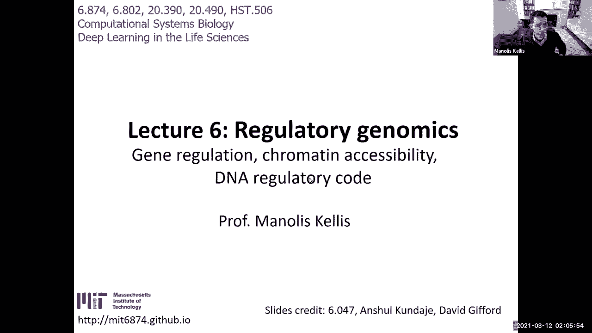

所以呃，今天是我们的第一个菌株，呃，特邀演讲者，所以我们会试着在每节课上，介绍一下这个领域，实际上邀请了两位在该领域有影响力的论文的作者，这样你就可以直接听到他们的消息，还能见到来自，谁是从业者。

来自不同的机构不同的实验室不同的背景给你机会，你知道的，要么在你的最终项目中伸出援手，或者与他们合作，或者找实习，呃等等，诸如此类，所以今天我们很幸运有安德鲁·科纳吉，他是斯坦福大学的教授。

他在监管基因组学的深度学习方面做了很多工作，跨越多年，也是英伟达的前卫，他刚刚发表了一篇很酷的论文，呃，周二为攻击和单细胞标签进行深度学习，我喜欢有两个老前辈，这是该领域发生的最新和最伟大的事情。

我们今天要看的是许多，所以如果你看看我们的课程表，所以我们在这里，我们基本上刚刚结束了关于机器学习基础的前几堂介绍课，卷积神经网络，递归神经网络与图神经网络，然后呃，你知道的，这是模块一的结尾。

ML模型及解释，我们现在进入，基因调控模块二，我们当然要去上课，关于dna可及性促进剂和增强剂，转录因子，dna甲基化，基因表达与剪接，对于其中的每一个，我将介绍基础，然后我们会有特邀演讲者，呃。

其中一些你可以看到，我已经确认了，然后我们将讨论单细胞rna测序，然后切换到基因变异的第三模块，图形和蛋白质模块四，然后五号模块成像，我们在许多方面已经提到过，但不是在医学信息的背景下。

所以这里我们基本上进入了DNA可访问性模块。

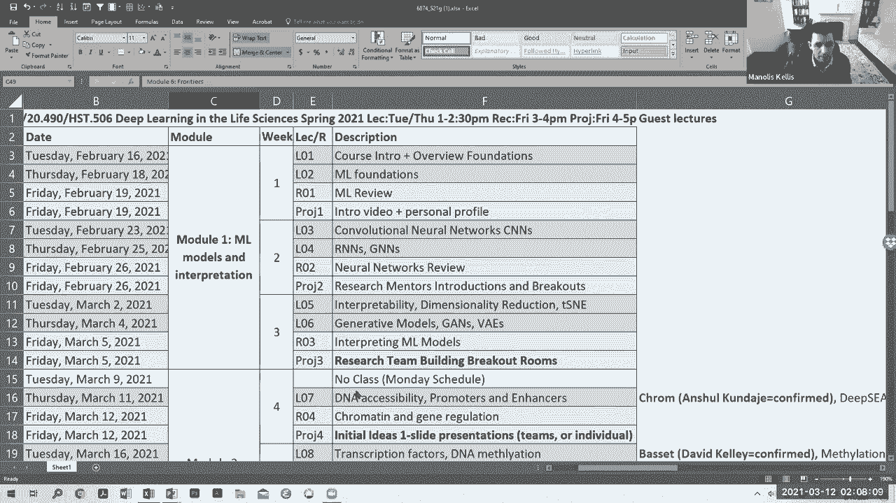

我今天要讲的是生物基础，基因调控的组成部分是什么，那么调控基因组学和基序发现的经典方法是什么，然后我们如何应用卷积神经网络，你知道的，只要给你一些最早的论文，我们实际上会有，嗯，你知道的。

这些论文的几位作者，在我们班上演讲，非常的帅气，所有的权利，所以让我们直接潜入，的组成部分是什么，呃，基因调控，所以首先基因调控，我认为是最迷人的，科学领域时期，作为一名计算机科学家。

基本上意识到你可以写一个自动机，您可以编写一个自包含的程序，都是用汇编代码写的，你有30亿个字母的汇编代码，a c，gt，构造这样一个程序，以便只有代码，只是那个程序的DNA，允许您将所有结构的复杂性。

在整个机器人有机体中，就是自愈，它是从该程序的单个副本发展而来的，通过一系列的细胞分裂，它基本上构建了，不仅是头和脚趾会在哪里，还有你身体每一个方面的错综复杂的相互联系，如果你看你的皮肤，有，你知道的。

这么多不同类型的细胞，它们只是错综复杂地交织在一起，还有血液循环，有神经元神经支配，如果你看着你的心，你基本上有细胞通过血液泵送，携带与，你知道的，你的细胞在泵它，泵它的肌肉细胞，神经细胞触发这些肌肉。

你知道的，有规律地跳动，同样的代码在你发送信号的神经元中运行，受你接受的所有刺激的影响，等等，所以这是一个惊人的壮举，基本上从一个单一的遗传密码到了这种难以置信的复杂性。

使这种复杂性成为可能的是你体内的每个细胞都记得，它在，没有其他上下文，呃，信息，基本上，如果你在早期把这个细胞放在另一个上下文中，它会接受不同的刺激，然后导致不同的，你知道那个细胞的不同身份。

那么这一切怎么可能是问题，这是可能的方式是通过你细胞的调节回路，调节回路的基础是一组，我们将使用深度学习，认识到，和一组结构，让你记住这些单词，记住每一块的状态，呃，基因组。

所以这是可能的通过包装你的DNA，两者都能压缩DNA，你的每一个细胞都有两米长的DNA，你有数万亿个细胞，如果你把你所有的细胞和所有的DNA放在一起，从你的每一个细胞，它不只是从波士顿到纽约。

它不只是从波士顿到喜马拉雅山，它不会只是从波士顿到达月球，它将从波士顿到达木星十次，这是给这条变焦线上的每一个人的，压缩的壮举，我们可以在我们的每一个细胞中输送如此多的DNA。

但它被压缩的方式实际上是极其信息，携带，它发生的方式，每147个碱基对的DNA，每个核小体，你基本上有两个循环，大约有150个碱基对，和大约50个碱基对连接器，所以你可以把DNA想象成200个碱基对块。

用不同组蛋白修饰的包装单元，这些组蛋白修饰是发生在组蛋白尾部的翻译后修饰，DNA包裹的蛋白质，所以让我们介绍一些词汇，核小体是这些小球中的一个，一串小珠子，对DNA的看法。

这实际上已经用显微镜可视化了几十年，我们可以看到这些珠子在绳子上，每一颗珠子都是一个核，现在，每个核小体都是由四种组蛋白组成的，每份两份，H两个A成副本，h 2 b成副本，H三份成副本，和H 4成副本。

这是标准的观点，这些核小体有许多不同的变体，在那里你可以用接近的类似物代替其中的一些蛋白质，DNA基本上包裹在这些，每一个组蛋白都有一个长长的氨基酸尾巴伸出来，可以在翻译后修改，那是什么意思。

这意味着在拱顶石H 3，也就是这里的红色，或者拱顶石h2a或者h2b这些是蓝色的，或者H4，也就是这里的绿色，你可以修改一下，例如，赖氨酸，它被写成第四个氨基酸的k位，这是一个Lyin。

我可以有三个甲基，基本上是添加甲基化，甲基化，甲基化，或一个甲基，或者一个乙酰基，等等，诸如此类，好的，他和我一起在这里命名，以及所有复杂的核小体，组蛋白，然后是组蛋白尾巴，等等，等等。

呃还有六十四二三四零零，其中一个直接在DNA上，所以cpg核苷酸a c，在五素数到三素数方向上跟着一个G，它也是一个c，后面跟着相反股的g，再次在五素数到三素数方向，所以CPG核苷酸。

c磷酸g可通过dna甲基化修饰，所以你实际上可以，呃，更改DNA字母的引号和引号含义，把a c变成甲基c，所以通常与c结合的转录因子将不再能够结合，当他们看到甲基C，好的，所以这是一种额外的修改。

另一种是DNA可以结合不同的转录因子，它们是结合dna并调节转录水平的蛋白质，这就是为什么他们称之为转录因子，因为它们将转录量乘以一个特定的因子，所以这些转录因子基本上可以更容易地访问dna。

当dna可以访问时，即在核小体之间，你可以把基因调节看作是核小体之间的斗争，想要占据他们的DNA和转录因子把核小体推开，然后得到，你知道的，被核小体向后推，所以这三种类型的修饰是最容易获得的DNA。

它告诉你哪些区域可以访问，二号组蛋白修饰，告诉你如何解释这200个碱基对块，第三个DNA甲基化，它有时会改变转录因子或结合dna的蛋白质的结合，他们中的一些人更喜欢甲基C形式。

其他人更喜欢无甲基化的C好吧，所以我介绍了很多月经，谁对这三种类型的修改感到满意，无障碍环境，太厉害了，非常好，所以七十二十十分零零，酷，所以现在。

我们可以使用这三种类型的修改的组合来谈论不同类别的元素，用这种表观基因组学的语言，我们将能够记住体内每一种细胞类型的编程，由，调整dna的压缩，促进区域的两个具体签名。

启动子区是RNA聚合酶基本上结合的地方，然后转录一个基因，将dna中的基因复制到细胞核内的rna中，然后将其输出进行翻译，和利用该基因，所以启动子基本上是最基本的一类调节元素。

所以那是大部分动作发生的地方，在基因的附近，转录实际上开始了，启动子以H3K4三甲基化为标志，氢三钾九酸化，DNA可访问性等等，所以现在转录的区域由一组不同的标记标记，h 3 k 3 6三甲基。

k 79三甲基和h 4 k 20单乙基，被压制的区域由三个不同的签名之一标记，要么是DNA甲基化，这是一种抑制形式，它们甲基化的大部分调节区域被抑制，三甲基化，这是多梳抑制，你可以把它看作是兼性压抑。

这基本上关闭和关闭得更快，然后是异染色质，也就是基因组大区域的稳定抑制，以三k九三甲基化为标志，好的，所以我们谈到了发起人，转录区，抑制区域，也许是所有地区中最酷的，到目前为止，最有趣的是增强区。

所以不像启动子区域就在转录开始的地方旁边，增强剂可以非常远，有时离目标一百万个核苷酸，有时在内含子中间，然后向后循环，你知道，接触这些启动子这些增强子在不同类型的细胞中都是非常动态的，启动子极其稳定。

增强器是非常动态的，增强剂以H3K4单乙基化标记，而不是三甲基化，用h 3 k 2 7振荡代替犬齿振荡，和DNA可访问性，就像发起人一样，但程度较低，所有的权利，这么多新鲜事，呃，生物学。

但到目前为止谁和我在一起，所有不同阶层的发起人，增强剂，受抑制区域，转录区，以及所有标记它们的标记组合，我们的位置是62。29。17。0，好的，我们，在我们组，开发了系统注释的方法。

甚至发现染色质的这些状态，我们称之为非常有创造性的染色质状态，那么我们为什么称它们为染色质状态呢，因为它们是染色质的不同状态，还因为我们使用了隐马尔可夫模型，其隐藏状态基本上对应于增强子，推动者，抄写。

受抑制区域，等，在整个基因组中从头开始学习和训练，能够发现这些组蛋白的组合，修改标记和其他以非随机方式发生的标记，不一定更丰富，但更非随机，因为这些州中的许多，包含一个非常，基因组的很小一部分。

而其他国家，就像被压抑的状态和色态覆盖了基因组的巨大区域，启动子状态和增强子状态只覆盖基因组的1%或更少，然而，它们被非常清楚地发现了，所以说，我们可以用这个多元隐马尔可夫模型来发现这些染色质状态。

我们可以用它来研究增强子区域和启动子区域在哪里，和转录区域在身体的每一种不同的细胞类型，现在最有趣的部分是基因组是如何编码这些的，这一切是如何由DNA编码的，识别基因组不同位置的dna序列模式。

所以转录因子利用这些dna结合域来识别基因组中特定的dna序列，这些序列是，比如说，塔塔或CC GTG，这是一个回文，如果你以相反的趋势阅读它，又来了，cc gt，g以此类推，等等，比如说，ccg。

gtg，因为这是一个反向回文，这通常是因为蛋白质的两种成分彼此相同，在同一位置绑定，和，当然啦，DNA的突变，我们将在下一个模块中讨论，对于非编码区域非常丰富，而不是基因组的蛋白质编码区。

目前的模型是它们扰乱这些蛋白质的结合位点，然后导致其约束力的丧失，最终导致疾病，到目前为止，在这些监管主题上，谁和我在一起，以及蛋白质最初是如何识别DNA的，好的，可爱，所以六十二，五个，十五零。

这就是蛋白质识别DNA的方式，每一种蛋白质的结构都略有不同，它们不能通过互补来识别DNA，就像rna和dna互相识别，它们通过感觉封闭的DNA中的碱基来识别它们的结合母题。

基本上a在这里有一个特定的原子，也许一个G也会有，这将导致母题在那个位置上喜欢A或G，然后这里，只有T有正确的一组原子在那个位置伸出来，使蛋白质能够识别它，等等，和，我们表示这些DNA基序的方式。

就是在所有的绑定部位打桩，比如说，对于这个ABF一个调节器，然后意识到哇，它们似乎有相同的DNA序列，所以你可以创建一个位置权重矩阵，让你识别DNA序列的特异性，所以基本上这允许你做什么。

基本上是区分这个调节器和另一个调节器的结合位点，通过一个信息论的衡量标准，让你说得很好，DNA结合位点在这里的假设相对于背景更高，所以我要做一个似然比测试，看看这有多大可能，呃，序列是由一个母题生成的。

而不是由类型序列的随机背景生成，所以这些主题标识的高度基本上告诉你信息内容，在一位信息之间，就是你知道的，这是一个问题吗，是呀，毫无疑问，一点信息，还是一个城市还是一个AG，哦。

现在我知道是两个中的哪一个了，是T还是C，这是两个信息，所以这些条的高度代表了信息量，然后这些条的内容表示在该位置允许的特定字符，我们将讨论模体，作为交叉切割基因组的实体，而母题实例。

我们的实体基本上是那个主题的单一出现，我们在这里再次假设独立，关于固定间距，等，所以有监管的主题，基本上在启动子增强子的每一个基因调控水平上，在RNA剪接中，这些母题实际上是DNA的语言。

这就是我们将要建立这些深度学习模型的语言，呃，为了认识到，它们之所以重要是因为我前面提到的这些基因变异，经常扰乱这些调节母题，导致基因调控过程的大规模中断，最终是疾病，所以有很多技术来探索基因调节。

你现在想知道，在哪里，比如说，基因组中所有的增强子，如果你知道它们是由组蛋白标记的，H3K9在乙酰化反应中，那么你基本上可以建立抗体来对抗，他已经做了三次七次了，然后拉下所有与这种修饰相关的染色质。

这样我就可以把我的染色质DNA，我可以随便切碎，然后制造抗体来识别与DNA结合的转录因子，一旦你捕捉到那块DNA，你可以直接给它测序，或者你可以用各种新技术来排序，或者你可以把它和微阵列杂交。

但基本上一旦你有了DNA序列，一旦你有了唯一可以识别的DNA，因此你可以找到它在整个基因组中的来源，那么谁和我在一起，这种芯片技术是如何通过构建抗体来工作的，然后用这些抗体拉下DNA的不同区域。

与转录因子结合或组蛋白修饰有关，然后测序并映射回基因组，弄清楚这个序列最终来自哪里，好的，所以呃，七十二五五零五，你知道的，染色质免疫沉淀，我们称之为免疫沉淀的原因是什么，因为它是基于抗体。

抗体是免疫系统的一部分，然后沉淀，因为你在提取DNA，所以你可以使用这项技术来绘制基因组，所有有一个特定修改的位置，然后你可以用它来揭示转录因子在哪里结合，这是染色质免疫沉淀的第一项技术。

第二项技术是DNA可访问性，所以基本上是为了组蛋白的修饰，我们基本上在你的代表中有染色质，但你也可以简单地直接对DNA的小片段进行测序，基于一种切割DNA的酶，即消化DNA的DAS，它在哪里切割。

根据它切割的地方，你可以检测到可访问的染色质，那么谁和我一起做DNA可及性测试，你只是简单地切碎DNA，然后看看它是从哪里来的，好的，可爱，所以六十二，一九一五年，四零，嗯。

我们今天要讲的第三个技术是出租车，这也是捕捉可获得的染色质，但基于转置在那里绑定的能力，所以你基本上只需要在基因组中加入T和五个转位，然后无论它在哪里结合，它都会留下一点印记。

然后你可以捕捉所有这些标记并对它们进行排序，然后这给了你另一种获得DNA可访问性的方法，好的，所以我们今天要看的是。

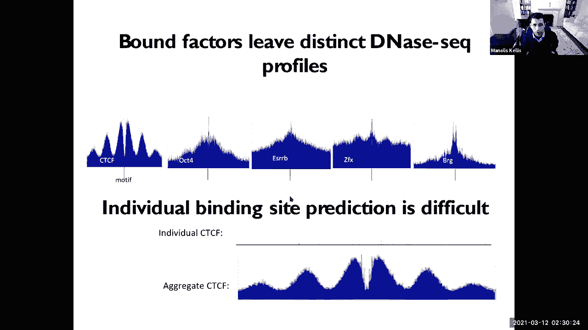

我们如何发现DNA的语言，使用这两种技术，使用芯片寻道和使用可访问性，我看到Unkondagi在这里，我也看到现在是一点半，所以我要停在那里，把它交给阿努乌纳，你在吗，嘿，最近怎么样？嘿，非常感谢你。

呃，做这个客座讲座，绝对乐意让我，把我的幻灯片拿出来，你的声音有点柔和，哦，你现在能听到我吗，是啊，是啊，好多了，好的，所有的权利，呃，只要给我一秒钟，每年这个时候斯坦福看起来都很漂亮，是啊，是啊。

只是看起来和夏威夷一模一样，是不是很神奇，没有交通太确切，我坐在某种山顶上，对呀，在你的背景下，海湾看起来更蓝了，迷宫好吧，所以只要给我一秒钟，所有的权利，你能看到我的屏幕吗，是啊，是啊，去伟大的。

顺便说一句，你们都有幻灯片，它们就在我之前发布的PDF的末尾，所以如果你们不跟着，但我只建议你把注意力集中在我说的话上，嗯很好，所以嗯，谢谢你今天有机会介绍，嗯，我要和你们谈谈我们如何使用机器学习模型。

去了解呃，序列驱动器，其中一些，序列如何编码基因调控的一个非常有趣的特性，尤其是我们刚才谈到的这些调节因素，Monol刚刚说到今天，所以这项工作实际上是由，嗯，作者：寨卡·阿布贾克。

他是这篇论文的第一作者，这篇论文是基于这项工作，呃，两周前发表在《自然遗传学》上，嗯，我会说一堆呃，由WANI在我的实验室或多年开发的深度学习模型的解释方法，这是与朱莉娅实验室的一次非常有趣的合作。

他是个了不起的生物学家，并帮助我们将这些模型提升到一个新的水平，发现新的见解，嗯好吧，所以让我们直接跳进去，你可以用各种各样的实验来分析一年的调节DNA，我给你们看两个这样的例子，呃。

一个是这些吉普赛实验，用于获得蛋白质dna相互作用的全基因组图景，这里的每一行对应于不同的蛋白质转录因子，这个对数据进行编码，你可以看到基因组中的同一区域是如何结合的，不同的转录因子以不同的组合方式。

然后你还可以获得可访问染色质的全基因组图谱，使用出租车或DNA搜索，这就给了你一个全局摘要，说明任何TF绑定在哪里，不会告诉你哪个TF绑定了它，但这是一个单一的实验，这总结了可获得的染色质。

并在整个基因组中以感兴趣的细胞状态结合，所以我们真正想做的是利用这些数据试着理解为什么，你知道的，为什么这个地区可以进入，为什么这个区域被这个转录因子结合，这是如何通过序列发生的，对呀。

这些转录因子可以识别特定的DNA单词，通常被称为母题，然后呃，传统的方法是专注于，每个蛋白质的序列亲和力对吧，所以我们合理地知道哪些蛋白质结合，什么样的词，什么样的图案，但是呃，调节因素的演变方式。

它们实际上已经进化成了更有趣的复杂语法，通过语法，我这里指的是组成规则，那么哪些图案来了，里面的其他图案，驱动特定响应的同类元素，呃，排列规则，如首选间距方向，然后这些。

这种语法是如何在DNA驱动中编码的，这些蛋白质的合作结合，对呀，所以嗯，本质上，监管不仅仅是它的一些部分是对的，你又没有这些，这些实体独立地结合并以附加的方式驱动信号，它们往往具有超级附加效应。

超倍增效应，所以你真的想理解这种非线性逻辑，语法如何驱动，呃，这些结合dna的蛋白质之间的合作相互作用，所以要做到这一点，我们将问题建模为机器学习任务，思考它的方式被给出了一个芯片。

或者有毒的DNA实验，你在整个基因组中得到一个信号，就在这些漂亮的信号峰值下，所以呃，将其转化为经典机器学习的一种方法，监督学习问题就是你把每个基因组，你把它弯成小块，假设一千个碱基对。

这一千个碱基对中的每一个都与一些信号相关联，呃，从实验开始对吧，因此它成为一个经典的分类或回归任务，其中你的输入是一大堆序列，数以百万计的序列通过基因组中的垃圾箱，输出标签要么是二进制的。

如果你二进制一个信号，或者它可能是一个连续的值，总结了整个一千个碱基对的信号，所以这是总结这些信息的传统方法，以合理的低分辨率进行序列，序列并将它们映射到标量，利用各种机器学习模型，svms，神经网络。

你知道随机森林，你喜欢什么都行，嗯，这种方法的问题是它实际上丢失了很多信息，所以让我来谈谈这些细节，所以现在如果你拿着这些吉普赛数据集或芯片EXO，数据集或DNA或出租车。

你看看单核苷酸分辨率的阅读覆盖概况，你会看到芦苇非常有趣的几何形状，这些实际上反映了蛋白质数据的相互作用，所以你知道当蛋白质在这个位置结合DNA时，你在对碎片的末端进行排序，对呀，芯片碎片。

你最终看到的是两股上这些非常美丽的镜面山峰，对呀，你可以看到左边和右边出现了一个很好的峰，在这两条线上，如果你看芯片EXO，你会得到更高分辨率的脚印，直流相同，你可以攻击，蛋白质结合的地方。

你基本上看到信号的值，你看到精确的尖峰，你知道，这些尖峰和读数的精确几何形状确实反映了组合蛋白，dna联系人，所以想象一下，把这些非常丰富的信息，把它总结成一个标量，对呀，只需计算此区域中的读数。

说三十对，你突然失去了所有这些美丽的结构，嗯，结构在简介中，它反映了序列中的语法，所以我们决定做的是建立一种新的模型，uh以最基本的分辨率对数据进行建模，把它想象成一个文本到语音转换器，其中文本是序列。

和说话是是是一个单一的坏死决议，测序实验读数，对呀，芯片寻找实验或DNA寻找实验，所以我们真的没有太多处理数据，我们只是把测序读数，我们正在把它们映射到基因组上，我们在数有多少。

我们在两股上的每个碱基对上得到五个素端，然后我们有一个神经网络来正确地进行翻译，从序列开始，它是一个卷积神经网络，它纯粹是卷积的，没有联营，什么都没有，它只是一堆从序列开始的卷积。

他们开始学习序列特征模式，对呀，像图案一样开始将它们组合成更高阶的图案，潜在地学习句法和语法，然后最高的层开始将这些序列特征转换为真正有价值的读数，它们开始向轮廓移动，最后一层基本上做了一个剖面反褶积。

所以它是，这是一个直线序列到轮廓模型，好的还有，我们在这里做了两件新奇的事情，嗯，建筑没那么重要，通常在基因组学中，呃，许多架构工作得同样好，事实上，这是一个非常简单的架构，它是完全卷积的。

它有它的优点，嗯，但是在架构上有一些小的调整，一个是我们用，呃，一种叫做扩张卷积的东西，卷积是减少参数空间的一种方法，我没有太多时间来讨论这个，呃，希望滚轮能更多地谈论它，在这次讲座或另一次讲座中，呃。

但基本思想是膨胀的卷积，就像跳过你所在的位置，嗯，你在聚合来自下层的信息，所以你可以得到一个戏剧性的，层数较少的模型的接受场指数增长，好的，所以如果你，如果你需要如果你需要最后一层。

右边这个位置可以看到千个碱基对，您可能需要大量的卷积层，能够用直接的卷曲来实现接收场，你的感受场呈指数级增长，当你往上走的时候，这让你可以呃，基本上获得非常大的感受野，呃，和呃，参数少得多，层也少得多。

所以这就是我们使用扩张卷积的目的，然后我们还使用剩余连接，基本上是层之间的连接，它允许信息绕过，所以说，比如说，来自经典卷积模型第一层的信息，只会移动到第二层，第二层会随着剩余的连接移动到第三层。

您实际上可以跳过连接，您可以将信息从最低层传递到更高阶层，不用经过第二层，对呀，所以它可以让你有更多的旁路，可以让你更有效地学习，尤其是对于默认模型，好的，所以建筑师很简单，没什么复杂的。

大部分的创新是在损失函数上，好吧，我希望你真的专注于此，因为通常当你学习深度学习时，你会被告知某些事情，比如当你有二进制分类问题时，使用物流损失，当你有一个实值预测问题时，你会用均值平方亏本。

那个建议并非完全不正确，但它也是非常基本的，最重要的是要认识到设计你的损失函数，数据中噪声的性质，好了，现在，如果你想想我们在这里建模的东西，我们正在建模计数，我们已经读到了这些序列上的计数，对呀。

所以我们有一千个碱基对的序列，我们有和数量的读取，假设四百个读数落在一千个碱基对上，对呀，所以你想要一个模特，能够预测千碱基对序列有400个读数，映射到它，但我们也想预测如何。

这四百个读数精确地分布在一千个基本PA上，所以你有两个预测任务，读取总数，以及序列中每个碱基对上的读数分布，呃，总计数的损失函数是什么，喜欢的账户，你可以转嫁损失，对呀，你可以用负二项式损失函数。

或者你可以取总计数的日志，并使用均方误差对其进行建模，我们发现这两个选项中的任何一个都对现在的总计数非常有效，如果你想想什么，哪种分布捕获了一个有n个实体的事件，假设有四百个实体，呃。

我要给你们举一个球和垃圾箱的例子，对吧，假设你有四百个球，然后我给你一千个箱子，我拿着这四百个球，我正在分发400个球和1000个垃圾箱，那种活动的好发行版是什么，有什么想法吗。

负二项式只会对总数进行建模，这就像一个球和垃圾箱的情况，所以我有N个垃圾箱，有可能观察到，你知道每个垃圾箱里的球，我总共有N个老板分布在，千箱对吧，所以我想模拟球在箱子里的分布，什么是好的分配。

那么我们来想想分裂分布，对呀，丝分裂分布，它是做什么的，它本质上是一个球和建筑的问题，对呀，你有可能观察到，你知道，每个垃圾箱的球或读数，基因组里有一千个垃圾箱，所以有一个，从一到千，对呀。

这是观察到每个位置读数的概率，然后如果你有n次读取，读取总数，你把它引到那些垃圾箱里，则每个头寸的预期读数为大写n，其中n是总读取次数乘以p，其中p是每个位置的读数概率，对呀，所以有了多项式。

它们得到了一个美丽的分布，它真正捕捉到了测序数据实际运行的本质，在这种情况下对吧，所以我们的损失函数是双重的，我们有一个平均平方和总计数的日志损失，我们有另一个损失函数，也就是有丝分裂体的负对数似然。

它实际上模拟了这些读数在1000个碱基对中的每一个碱基对上的分布，好的，所以我们有两个损失函数齐头并进，其中一个建模总读取数，和其他模型的精确分布，我们用，你知道的，经典梯度下降，呃，带反向传播。

好的我们把这个应用到，哦，我忘了说，你知道的，如果你有多个读数，所以假设你有相同的序列，你知道的，呃，你有四五个不同蛋白质的读数，不同的奇普西克实验，您可以为每个模型安装单独的模型。

或者您可以拟合一个具有所有模型的多任务模型，对不起，在同一基座上工作的所有输出，所以基本模型是一样的，最后一层在不同的任务中发散，一些机构预测产出为4-5-10，权利和，然后呃，基本上损失函数。

它的工作方式是，这只是所有任务损失的总和，对吧，所以每个任务都是由这两个损失函数的组合来建模的，所有任务的损失是所有任务损失的总和，好的，有什么问题吗？我们班上有个问题，我想我想这是个很好的问题。

但我们时间不多了，所以我有点回答了，那你为什么不继续，然后OK听起来很棒，所以我们用这个，呃，这个模型给呃，到四种蛋白质，非常著名的蛋白质，哦不，2。我现在正在做报告，好的嗨爸爸，你好。

我儿子刚从学校回来，所以他可能，他可能会给，他可能也会做一部分讲座，我们一直在研究袜子中的四种蛋白质到nanog和kf，这些都很有名，用于细胞重编程的多能转录因子。

我们观察了小鼠胚胎干细胞中的这些蛋白质，朱莉娅表演了，这些漂亮的芯片连接实验给出了这些蛋白质的高分辨率足迹，我们训练模特，我们做到了，我们在染色体的一个子集上训练它们。

我们在我们的整个染色体子集上评估了它们，好的，模型非常准确，你可以看到你的想法，这些实际上是对基因组中三种不同增强子的预测，这是索克斯2纳米和凯拉的OG，这是观察到的数据。

这是以前从未见过的头部染色体的预测数据，所以你真的可以看到，它的分辨率很高，而且非常精确，你知道，准确预测脚印的实际位置，那么在纳米和左边发生了什么，就像纳米枪，是啊，是啊，在这个场景中，是啊，是啊。

在某些情况下，发生的情况是数据有点嘈杂，就像在这种情况下，就在这里，所以你会在模型中得到很多缺失的值，某种归因，有时侧写看起来和你看到的有点不同，但总的来说，如果你评估模型，你知道，我故意给他们看的。

因为你知道，我总能给你完美的预测，但很明显，模型总是和数据一模一样，有时他们会去噪数据，有时它们与数据不同，不管出于什么原因，它不是，这不像是，它并不完全完美，但它已经接近完美了。

因为我们可以在整个基因组范围内评估这个基因组的方法是，呃，我们就可以，我们真的可以计算预测剖面的相似性，你知道，就像对不起，呃，这些预测的剖面到观察到的剖面使用不同的度量，所以我们使用两个指标。

一个是延森香农散度，它捕捉任意两个属性分布之间的距离，因此，您可以从实际读取权中观察到属性分布，你有预测的目标分布，你可以用延森·香农距离来比较它们，我们展示的是。

是测试集中所有增强器的平均延森通道距离，在单碱基分辨率下的测试染色体中，在二垒分辨率五和十，所以我们在这里做的是，你把数据平滑了一点，留出一定的回旋余地，对于其中的每一项决议，我们都是。

我们在计算延森通道发散度，红色曲线显示了模型相对于地面真相的性能，好的，这就是实际的表现，记住延森香农散度越低，模型越好，好的，嗯，现在我们需要将这些值与一些地面进行比较，到一些上界和下界，对呀。

所以我们计算的一个上限是复制实验之间的相似性，所以我们只取了一个复制，我们用它来预测另一个复制，会是什么样子，对呀，那是蓝杂种狗，你可以在很多情况下看到，该模型本质上与复制一致性一样好。

所以它和复制实验一样准确，互相尊重，下界基本上是如果您比较，呃，那个呃，配置文件，嗯，观察到的配置文件洗牌版本的观察到的配置文件，那是，就是这些灰色，呃，这些灰色的代码，所以我们比基线要好得多。

我们尽可能接近复制，好的，所以我们对这个模型在整个基因组中的表现非常满意。

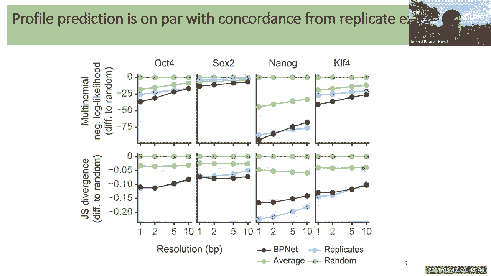

所以给定模型，预测并不那么重要，因为我们已经有了数据。

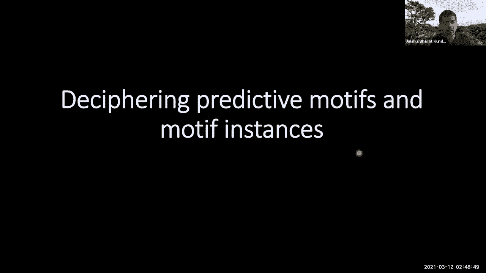

我们真的想了解模型是如何做出这些预测的，好的，所以我们进行解释，我们想拿着模型试着解剖，是什么在推动这些预测。

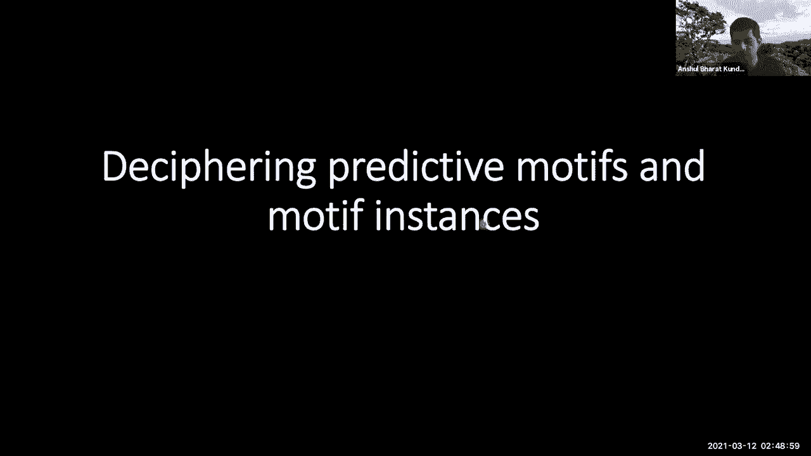

所以我们采取的第一种方法是特征归因方法，但我们可以取基因组中的任何增强子，呃，你知道吗，使用模型进行预测，然后通过反向传播方法，你可以把模型的预测，并递归分解跨层神经元的贡献，一直回到核苷酸，好的。

这是一个叫做深左的算法，由我们于2017年在ML上发表的一件事开发，所以你最终会得到什么在基因组中得到任何答案，基因组中的任何序列，我们可以接受预测并解释它，呃。

在序列中的每个核苷酸如何做出预测的背景下解释它，或者有助于那个预测，所以这就是它看起来的样子，如果你从这些答案中选择一个，这是调节基因的AO增强子，这是由这四种不同蛋白质结合的相同序列。

对相同的序列被四种蛋白质以不同的方式解释，这里我给你看的是每个核型的深度提升得分，呃，在每一项产出的范围内，好的，所以对于不同的输出，我们得到了不同的解释，你可以看到它的一些部分是常见的，对呀。

就像序列的这一部分，这是一个主题，呃，这四种转录因子都常用，但你有一个特定于模拟的，这是卡拉特有的，如果你把这些映射到已知的图案上，你会得到这些非常漂亮的高分辨率解释。

哪些序列片段真正驱动了四个转录因子中的每一个的结合，所以你会看到一个真正的组合语法，呃，其中一些是常用的成分是所有四种蛋白质常用的成分，其他成分被每个蛋白质特异性地使用，对呀。

所以你可以对基因组中的每一个增强子都这样做，如果你想解释单个单位，这很好，单个序列，但是我们能总结一下模型在整个基因组中学习到的模式吗，所以要做到这一点，我们开发了另一种叫做Moo的方法。

莫里斯科所做的是，它需要与感兴趣的蛋白质结合的所有数千个序列，它使用这个模型来推断每个序列中每个核苷酸的足够深的分数，对呀，所以你有成千上万个这样的序列，这些动态核苷酸图谱。

然后我们扔掉序列中不可预测的部分，然后我们把这些小序列聚类，这些基于相似性的词，我们把它们的平均数量分解成非冗余的图案，好的，所以当我们对这四种蛋白质这样做时。

我们实际上最终得到了一套相当复杂的规则或文字，或基序来解释四个转录因子的结合，规范地，呃，转录因子通常由一个或两个基序定义，但就像我在体内说的，这些蛋白质不是自己运作的，他们相互合作，这意味着相互合作。

它们可以产生新的识别，就他们个人而言，他们不会发现这是对的，这就是为什么，你实际上需要大约50个基序来解释四种蛋白质的结合，好的，这些图案中的许多实际上是组合，就像这是一个异二聚体，牛牛异位。

有一个同源二聚体，我们的主题有不同的版本，袜队的主题有不同的版本，不同版本的卡拉·科迪，您还可以看到间接绑定，所以这是一个例子，就像纳米蛋白被另一种叫做C3的蛋白质间接招募，所以齐格三号认识到这场战争。

它结合了这个母题，然后它通过蛋白质和蛋白质的相互作用招募纳米，你能分辨出来的方法是，如果你看对了脚印，实际信号，芯片连接信号，你会看到当蛋白质直接结合这个基序时，就像纳米结合自己的母题。

你看到非常锋利的脚印，当蛋白质被间接招募时，你看这里有模糊的脚印，所以模糊脚印通常是间接招募，直接绑定会产生非常尖锐的足迹，所以我就专注于这些主题中的一个，这是一个动物主题。

现在我们发现直接绑定了三个母题，好的，三个略有不同的版本，它们都有核心的TCA组件，但它们有不同的基因组部分有不同的侧翼，所以一些纳米图案实际上有这个tflank，所以他们有GG的侧翼。

真正有趣的是已经做了实验，包括晶体结构实验，真正表明高度重要的核苷酸，神经网络学习到的实际上是在三维空间中非常接近的，就像你会把晶体结构，DNA中哪些核苷酸与实际蛋白质接近，dna结合域，正是这些脂质。

所以神奇的是，神经网络可以从头学习精确的核苷酸，蛋白质利用它潜在地结合，嗯通过DNA。

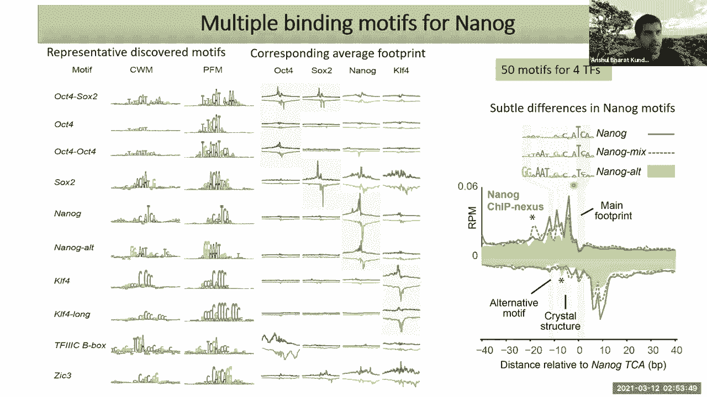

好的，那太好了，但是语法呢，我刚才说过语法，对吧，这才是我们真正感兴趣的，这些母题在驱动合作绑定的序列中的高阶排列。

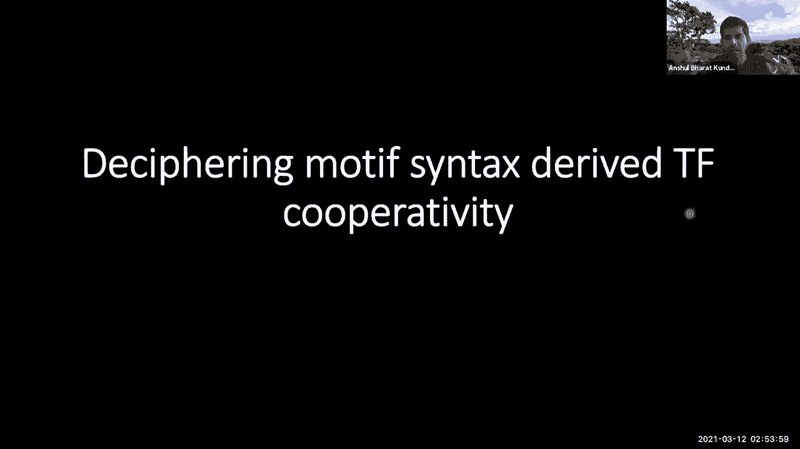

嗯，所以我将跳过这张幻灯片，但这里有第一个语法提示，如果你拿纳米母题，我之前给你看的这个TCA主题，我们在侧翼序列中寻找多达200个碱基对，你看到这种非常有趣的模式开始出现，这个t a t序列是对的。

你可以看到这些重要的坏死物在周期性的距离上，远离核心纳米母题，这是另一个情节，呃在边上，所以这个轴显示了数千个被纳米母题束缚的位置，被纳米蛋白结合，他们在中心有一个TCA网站。

热图显示了中心两侧的核苷酸的重要分数，tca，呃余弦，你看到这些美丽的周期性模式，对呀，神奇的是，这些模式的周期性正好是十个半碱基对，这是DNA的螺旋旋转，所以这告诉我们的是，这个人结合了DNA。

在某种程度上，在10个半基地发生了其他事情，呃看，呃，与纳米母题的距离，它碰巧在DNA螺旋的同一侧，对呀，真正酷的是，其他实验中有证据表明，像Nanog这样的蛋白质，属于同源盒蛋白质家族。

他们倾向于将DNA结合为不同的人，所以它们是成双成对的，它们结合同一侧的DNA，甚至有时在核小体上，好的，在这些核小体之上，这就是为什么你开始看到这些十个半碱基对，神经网络的周期模式能够拾取。

所以我们做的另一件事是我们把纳米图案，我们实际上观察核心纳米位点之间的距离，由基因组中的神经网络识别，你又会看到，如果你把它作为距离的函数，OG OG人多样性的频率，你又看到了。

这个非常漂亮的十个半碱基对周期性启动，权利和不考虑股，所以这个tca可以在正的正链上也可以在正的负链上，没关系，你仍然可以看到它非常美丽的螺旋周期在起作用，所以有一个，有一个首选间距的软语法。

十个半碱基对的倍数，也就是DNA的螺旋，真正有趣的是，如果你把这些序列精确地排列在，他们的图案，它们被这十个半基对频率隔开，绘制实际的原始数据，芯片的数据。

你实际上可以看到芯片Nexus数据中的这些尖峰，你关掉基地PA，这就是模型学习这种语法的方式，因为它看到的是跨基因组的，它看到这些微妙的信号尖峰，每次它看到信号的尖峰，它与这些PCA站点共同本地化。

呃装订，好的，我们在模拟中看到了这一点，还有其他图案，相似的十个半碱基对优选间距约束，现在我们想真正展示这种语法是如何导致合作绑定的，所以要做到这一点，我们实际上依赖于像先知一样使用模型，就像。

我们能在硅中做有趣的微扰实验吗，使我们能够深入了解句法如何驱动这些不同蛋白质的结合，所以我们做两种实验，其中一个是合成实验，在那里我们创造了一些合成DNA，好的，只是一些随机的DNA序列。

我们嵌入了两个主题，这个职位的一个主题，这个位置的一个主题，然后我们改变这些图案之间的间距，我们预测我们使用一个模型来预测蛋白质A和蛋白质B的结合，好的，所以这就像是你正在做的一个合成实验，呃，在在在。

使用模型，另一种实验就像硅脆皮实验，你在基因组中使用实际的增强子，模型已经注释了一堆这些主题，然后我们系统地变异图案，我们再次使用一个模型来预测四种蛋白质结合的效果，好的，所以我从第一个开始，呃。

模拟实验，这是一个合成实验，我们已经创建了一个序列，随机序列，蛋白质不与这个随机序列结合，我们在这个位置嵌入纳米母题，这个位置的辅助股票主题，好的我们开始把牛的主题移向一个主题，当我们改变距离时。

模型正在预测，模拟的预测绑定，和所有四个的预测绑定，好的，所以作为这两个主题之间距离的函数，我们就可以，我们可以画出纳米的反应，以及opt for对语法的响应，你会看到一些惊人的东西弹出来。

所以红色曲线显示了OP对间距的响应，在牛袜主题和Nmotif之间，好的，无论距离如何，你基本上没有反应，或者不关心一个主题是否坐着，这很有趣，因为这四个因子都是经典的先锋转录因子，众所周知。

这是这些翻译因素之一，它可以结合DNA并做它的事情，它现在不在乎周围还有谁，另一方面，反应真的很激烈，你可以看到模拟的绑定呈指数级上升，当牛袜队的主题向它移动时，它只是指数级的上升。

但是当你买衣服的时候，你又看到了这个非常美丽的周期性，对，这是相同的十个半碱基对，所以您看到的是一个软语法首选项，作为牛牛和主题，当你把它们向对方移动时，你会看到作品四对模拟的巨大合作影响。

这一直增加到50个碱基对之外，对呀，所以你有一种相当远的合作效应，你会看到一个首选的间距，如果你正好是10个半碱基对，或者十个半碱基对的倍数，你看这些很好的合作，嗯，所以你能给我们一些见解吗。

你的A网络的哪一层实际上在学习这些关系，是不是像一层，两层出来，三层出来，比如这些信息有多高，这是个很好的问题，所以实际上我们在报纸上有这个，在补编中，我们做了一个实验，我们开始去除膨胀的卷曲，好吧。

最神奇的是，当你移除直接卷积时，语法开始消失，模特的日子越来越不好过，如果你移除三四个扩张，完全消失得无影无踪，好的，所以对模型来说，能够学习这些更高的层是非常重要的，不是下层很好，谢谢。

我们有点没时间了，所以我不知道，如果你可以，呃是的，我只有两张幻灯片，那真是，这是一种合成实验，我们可以在基因组中复制同样的实验，在真实中回答，所以你和一个被阿克沃德和阿诺格束缚的答案。

你可以看到这两个图案，我们可以删除公牛公牛主题，模型预测，牛津去世，纳米模具，我们可以删除Narog主题，什么也不会发生，纳米就会衰减，所以你可以再次看到这种不对称效应，纳米对oform没有影响。

但对纳米有很强的影响，用这个10个半碱基对的周期性，我们学习了许多非常有趣的语法，在不同的单词组合之间，最后，我们通过基因组中的实际CRISPR实验验证了这一点，我不会在这上面花太多时间。

但我会给你一个漂亮的赞，呃，小插图，嗯，这里有一个增强剂，它由纳米和袜子结合在一起，呃，这是袜子的主题，这就是模型预测的，关于囊袜的装订轮廓，我们进行实验，看起来真的很像，然后我们突变这两个核苷酸。

模型预测，哦，这个位置的束缚减弱，和很远的信号，如果我们，如果我们真的做实验，你看到同样的效果，你看到衰减和衰减，然后我们就可以逆转这个，我们可以呃，同样的突变，但这次我们测量的是纳米，我们在预测纳米。

或者我们在测量纳米，你可以在实验旁边再次看到模型的预测，真的很好地在一起，我们可以逆转这一点，我们可以突变纳米OG基序，看看效果，模型再次几乎准确地预测了你在实验中看到的东西，我们可以看看。

突变模拟主题，看看对袜子绑定的影响，你看不到我们预测的效果，Nanook对袜子没有影响，两只袜子，两个对纳米有巨大的影响，所以我就到此为止，刚刚提到我给你介绍过，英国石油净，一种新的模型。

可以像基因组数据的文本到语音转换器，我们可以对任何类型的化验都这样做，吉普赛人，EXO卡兰丹攻击，组蛋白横冲直撞，你想要什么都可以，我们有解释框架，这些黑匣子模型打开它们，丝带从里面出来。

告诉我们语法如何影响TF合作的生物学故事，我向你展示了这些模型可以做出预测，这些预测可以通过，真的很神奇，呃，高分辨率Crispr实验，好吧，我会停止，谢谢。我希望每个人都热烈鼓掌。

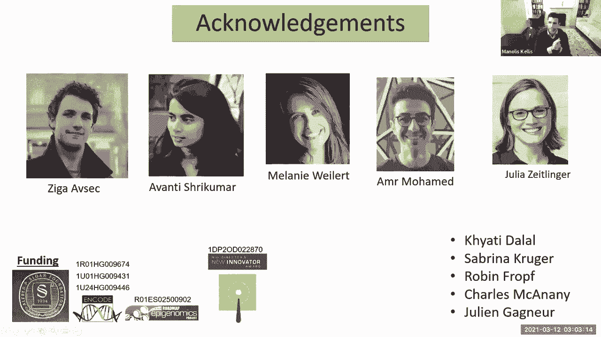

非常感谢你的加入，然后呃，你知道，一些学生可能正在为他们的项目伸出援手，如果你有兴趣指导任何，我刚看到一个非常快的小插曲，阿凡蒂，我在实验室给你看的，是我在Monolo实验室做博士后时遇到的一个人。

她是个很棒的本科生，超级欧洲学生，最后成为我实验室的博士生，她和我一起工作了六年，她真是太棒了，我相信你们都是，所以有趣的组合发生在课程中，博士顾问和博士后顾问，所以我希望在不久的将来能见到你。

非常感谢，好的，所以我们也很幸运今天有来自英伟达的Avantika和我们在一起，如此前卫，如果你想分享你的屏幕，给我们第二个，客座演讲，非常感谢再见再见，拜拜，所有的权利，呃，谢谢你邀请我。

我知道这一点，让我在这里分享我的屏幕。

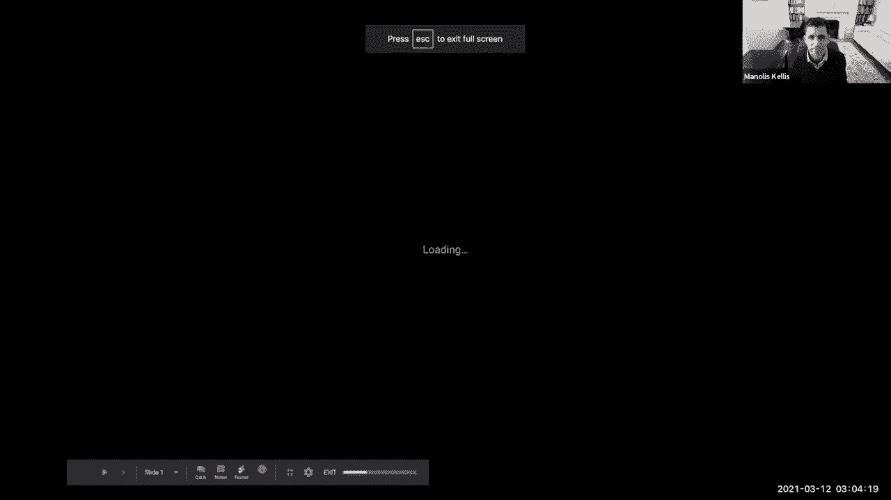

你会看到这个的，大家好，我叫阿邦卡，我是英伟达基因组学研究团队的高级科学家，那是什么意思，所以在英伟达，我们有一个基因组学团队，这是一群非常了不起的科学家和工程师，我们正在开发软件来解决许多不同的问题。

基因组学中非常困难的问题，我们与许多学术实验室合作，以及世界各地的其他公司，我们开发的工具，使用机器学习，深度学习，和加速计算都建立在英伟达硬件上，我们的目标是建立一个更快、更准确的软件。

比许多不同问题的当前技术状态，这样我们就可以实现新的生物发现，我们在基因组学的许多不同领域工作，包括，但不限于单细胞基因组学，癌症基因组学，长读测序，和许多其他人，所以我在这里告诉你我们最近的一篇论文。

出来了，事实上，本周一在《自然通讯》上，这是我们的团队和我们的朋友之间的合作，在哈勃的鲍文·罗斯特拉尔实验室，所以这叫做深度学习，基于攻击工程和攻击工程的表观基因组数据增强，顾名思义，是一个模型。

它与你们都听说过的出租车数据一起工作，出租车测量染色质可达性，这个想法是我们对DNA进行测序，我们得到这些简短的读数或简短的DNA序列片段，然后我们可以与基因组对齐，当我们把它们对齐的时候。

我们得到了一个覆盖轨迹，看起来像这样，在那里你可以绘制基因组中的每一个位置，在x轴上，在y轴上，您可以绘制与该位置对齐的读数，所以你可以看到明显的山峰，这些峰代表可获得的染色质。

它通常与基因组的活跃调节区域相对应，所以出租车可以帮我们，并识别不同类型细胞或组织中的活性调节元件，这可以帮助我们理解基因组是如何调节的，以及非突变的方差或序列方差，基因组的编码区域会影响我们的生物学。

滑行也可以在单细胞水平上进行，这给了我们更高的生物学分辨率，所以生物组织有许多不同种类的细胞的混合物，它们执行不同的功能，然后这边呢，你可以看到当我们在单个细胞的水平上做出租车时会发生什么。

所以如果你看到，呃，在每行的y轴上，你在绘制不同细胞中的信号，你可以看到在一个样本中你可以有许多不同类型的细胞，染色质在这些细胞中的可及性有一些变化，如果你把来自所有不同细胞的信号加起来。

你可以得到一个高质量的信号，如下所示，在那里你可以识别不同的山峰，但你也可以从这张照片中看到，如果你观察单个细胞，你通常没有得到这个清晰信号所需的分辨率水平，并从对应于可获得的染色质中识别峰，那是因为。

通常情况下，你只是没有足够的测序读数来自每个单独的细胞，所以当我们分析单个细胞攻击座椅实验时，我们做一些像右边所示的事情，所以我在这里观察染色质在单细胞中的可达性，从人血序列。

图中的每一个点都代表一个单独的单元格，我们根据细胞的染色质可达性对它们进行了聚类，以便具有相似可访问性配置文件的单元格聚集到同一个群集中，在高水平上，这些簇对应于我们样本中不同类型的细胞。

它们执行不同的功能，然后我们可以取一个单独的集群，把所有单个细胞的信号加起来，并得到一个像这样的聚合染色质可达性剖面，我们可以对每个集群这样做，然后如果我们想，我们可以比较它们。

问这种类型的细胞与那种类型的细胞有什么不同，或者为什么我们基因组中的一个特定序列变体会影响这种类型细胞的功能，但不是那种类型的细胞，但在这样做的过程中，我们失去了每个细胞群体中的所有变异。

所以这就把我带到了数据质量的话题上，所以尽管出租车比之前的许多方法要简单得多，你仍然有理由在出租车实验中，得不到你需要的高质量结果，例如，一个问题是排序深度，所以这里有一个出租车实验。

它被排序到总共5000万次阅读的深度，然后看看同样的攻击SEP实验，但这一次我们只读了一百万次，如果你没有，如果你的测序读数太少，你的数据很吵，很稀疏，你不能得到一个清楚的。

你不能准确地定位峰或可接近的染色质区域，样品制备，所以你的样品质量，样本中的单元格数，你储存和准备它的方式也很重要，然后是另一个问题，呃，这可能是最重要的，以下是单个单元格中单个单元格中的单元格数。

出租车实验，所以如果我在看一种特定类型的细胞，在我的样本中非常丰富，我可以将信号组合在许多细胞上，得到一个清晰的信号，这让我能够判断这种特定细胞类型的峰值在哪里，但如果我看到的是一种不太丰富的细胞。

我可能有很少的细胞，这给了我很少的阅读，所以我收不到清晰的信号，在这种细胞类型中发生了什么，即使在丰富的细胞类型中，在这个群体中可能会有进一步的异质性，在细胞类型中可能有细胞亚群，所以我需要啊。

所以我研究这个实验的分辨率是有限度的，所以攻击工作是一个深度学习模型，我们开发它来解决这些问题，攻击工作采用任何攻击搜索实验的覆盖轨迹作为输入，这可能是一个来自这些不同来源的嘈杂实验。

攻击工作的目的是提高攻击I信号的质量，并确定峰的位置或可接近的染色质位点，所以攻击工作产生它作为输入的覆盖轨道，并产生两个输出，一个是去噪或增强的覆盖轨道，第二个是这个覆盖轨道中峰值的位置。

黑暗作品使用Resnet或残余神经网络架构，这是一个由多个卷积层组成的全卷积模型，它是基于最初为计算机视觉开发的模型，不同的是这里我们使用一维卷积层，而不是通常用于分析图像数据的二维层。

因为这里我们的输入是一维的，基本上对基因组中的每一个位置，我们有一个数字，它对应于映射到该位置的读取数，解释了我在这里要解释的很多事情，我们的模型也使用了膨胀的卷积，这大大提高了我们的结果。

我们使用剩余连接，所以基本上，我们有跨越多个卷积层的连接，并将信息从模型中的较浅层传递到更深的层，我们有一个多部分损失函数，所以因为我们的模型产生两个输出，我们的损失函数是回归损失函数的加权组合。

它测量我们去噪覆盖跟踪的准确性，和分类损失函数，哪个测量哪个测量我们对山峰位置的分类有多准确，所以对于分类损失，基本上，我们正在对基因组中的每个位置进行分类，因为这个位置属于一个山峰。

或者这个位置不属于山峰，不像大学说的模型，早期的攻击工作不使用基因组序列作为输入，它只覆盖基因组中的每个位置，所以有人能建议我们为什么要这么做吗，我们为什么要这么做，好的，所以原因是，我们就会。

我们希望这个模型可以在不同类型的细胞中转移，所以我们想，比如说，在一种类型的单元格上训练模型，然后能够将其应用于完全不同类型的细胞，如果我们给它喂DNA序列，我们在某种程度上看到了这一点。

模型会学习特定的序列主题，就像我应该给你看的那样，它将学习与高染色质可达性相关的基序，但这些基序实际上因细胞类型而异，在一种细胞中预测可访问性的基序，并不一定能预测不同类型细胞的活动。

所以这只是我们做出的选择，为了让我们的模型更可推广，然后模型实际上是如何学会这样做的，所以我们制定了一个非常简单的训练策略，所以首先我们开始训练我们的模型来提高低覆盖率，出租车数据，所以在这里我们采取。

呃，我们取任何一个出租车数据集，它有，呃，它是按高覆盖率排序的，所以我们有数据集，这些数据集被排序为总共5000万次阅读，然后我们随机子样本这些读数的子集，所以我们会随机选择，说五千万读数中有一百万。

这一百万棵树会给我们一个嘈杂的低覆盖数据集，然后我们可以将这对干净而有噪声的数据集输入我们的模型，模型学习如何将噪声数据集作为输入，并预测高覆盖轨迹作为输出，以及山峰的位置。

然后如果我给它提供来自不同来源的低覆盖噪声数据集，它可以利用它学到的重量，并预测这些数据会是什么样子，如果它被测序到更高的深度，所以这是一种我们可以产生尽可能多的训练数据的方法，很容易。

所以这里有一个非常高水平的例子，我们得到的结果，所以在这里，我们使用不同人类细胞类型的数据训练了一个模型，然后我们将其应用于不同类型的人类细胞，未列入其培训数据集，这就是结果的样子。

这里有一个干净数据集的示例，它被排序为5000万次阅读，你可以在这里看到一点赛道，然后这是相同的数据集，如果我们随机抽取一百万次读数，所以你可以看到它要吵得多，我们失去了识别这些山峰的能力。

但我们可以把这个一百万读数的信号通过攻击工程，这是攻击工程预测的输出，所以你可以看到攻击的效果能够消除信号轨道上的背景噪声，并增强了许多以前难以识别的山峰，这是一座山峰的近景，所以穿黑色。

你可以看到这个有一个顶峰，在原始信号中，接近这个基因，峰值在信号下面用红色显示，然后当我们将样本减少到一百万读数时，山峰变得不那么清晰，很难从附近的噪音中分辨出来，如果我们看最大值二。

这是一个标准的高峰呼叫软件，MAX2无法识别PE，但在通过攻击传递这个低覆盖信号后，攻击工作能够区分峰值和附近的噪声信号，它还能够对大多数说话进行分类，告诉你这是一个可以进入的地区，这里有另一个例子。

这里呃，我们去了一个更低的次采样深度，所以我们现在正在重新采样，五千万读数中的二十万，在这里，我向你们展示了用来训练模型的四种细胞类型，以及测试的第五种细胞类型。

所以在这里你可以看到测试数据中有一个峰值，它不存在于，用来训练模型和攻击的任何细胞类型，再次能够去噪峰值，它能够区分峰值和附近的随机噪声，并且能够非常准确地识别X在哪里，那里的山峰。

可接近的染色质所在的位置，如果我们看看训练数据中的峰值，攻击不起作用，呃，识别测试数据中的那些峰，因为它们不存在于这种测试细胞类型中，所以它能够概括，呃，细胞类型之间，它能够接收新的数据。

这和它在训练中看到的不一样，所以这些是呃，整个基因组的性能指标，那么我们如何在这里衡量性能，所以首先我们取干净的数据集，它有五千万个测序读数，然后我们把它取样到不同的测序深度，大约200万。

一百万以此类推，蓝色的是我们绘制的信号轨迹之间的皮尔逊相关性，在这个向下的样本信号陷阱和最初的五千万读取信号轨道之间，所以你可以看到你失去了很多质量，当你下到下到子采样时，但在通过这个之后，呃。

这些轨迹通过攻击作品，呃，这是改进的皮尔森相关性，这里用绿色显示，所以你可以看到在每一个顺序深度攻击都有效，使信号跟踪更准确，在这里破折号，所以实线是整个基因组的表现，虚线，我们在第十号染色体上的表现。

我们包括第十号染色体，因为在我们所有的训练数据中，我们从来没有在第十号染色体上训练过模型，因此，该模型再次能够推广到新的细胞类型，以及新的基因组区域，在这里，我们测量了模型在分类峰位置方面的性能。

所以这里我们看的是精确回忆曲线下的区域，对于每一个低覆盖率数据集，我们看到这个模型能够很好地分类基因组的位置，至于它们是否属于山峰，在每个测序深度，我们看到这个模型能够识别峰值。

比以前的max 2的方法好多了，这些数据还告诉你，如果你观察一个特定的测序深度，比如说500万次阅读，一千万或两千万的阅读量，攻击作品能够产生同样的，呃，同样质量的结果更少的测序如此有效，利用深度学习。

我们可以降低做实验的成本，同时产生同样的结果，这里有另一个实验，出租车不是使用低覆盖，我们用的是低质量的出租车，所以这里我们取了两个序列来攻击寻找实验，两者都是在人红细胞中进行的。

两者都被测序到相同的深度，仅仅因为样本相关的问题，其中一个样本的信噪比比比另一个低得多，再次，通过训练攻击工作模型来处理这样的数据集，我们能够通过攻击工作模型传递这个低质量的信号，它能够清除背景噪音。

并识别与高质量信号非常匹配的峰值，我们也可以量化这个，通过观察转录起始位点周围覆盖的丰富程度，或者基因转录开始的位置，我们看到在低质量的信号中，我们看到一些，我们看到转录起始点的覆盖率比其他十个。

远离它们的区域，但在通过攻击工作传递信号后，攻击工作改善了这种丰富，所以现在，我们看到靠近转录起始点的区域有更高的信号，与遥远地区相比，这就是我们从攻击I实验中所期望的，终于呃，对我们来说。

这个模型最有趣的用例是，当我们谈到单细胞出租车数据的问题时，所以我提到在单组出租车数据中，我们研究小群体细胞的能力是有限的，我们可以训练一个模型来解决这个确切的问题。

我们如何做到这一点与我们如何在低覆盖率数据上训练模型非常相似，我们可以进行一组攻击搜索实验，我们可以取一种非常丰富的细胞类型，我们有很多细胞，我们可以把所有细胞的信号加起来得到一个干净的信号。

就像这里展示的高质量的果皮，然后就像我们随机选择一个读数子集一样，并用这些来获得噪声信号，然后我们可以训练一个攻击工作模型从几个细胞中获取信号，降噪以预测来自许多细胞的信号会是什么样子。

一旦我们有了这个训练有素的模型，我们可以把它应用于细胞很少的小群体，要么来自同一个实验，甚至来自不同的单细胞实验，它可以预测，呃，如果我们有更多的细胞来测序，数据会是什么样子，那么这是怎么工作的呢。

所以我们在这里做了一个实验，在那里我们对不同类型的人类血细胞进行了单细胞测序，我们用两种类型的细胞训练了一个模型，并将其应用于第三种类型的细胞，也就是NK或自然杀伤细胞，在这里，我再次策划，A，u，p。

c，这个模型的峰值调用，在x轴上，我们有不同数量的单元格，所以我们把这些训练好的模型一次应用到一个细胞上，一次五个细胞，十个细胞或五十个细胞，这些也对应于非常低的读数，在蓝色中。

你可以看到max 2的性能，这是现有的基于非深度学习的方法，我们在绿色中看到攻击工作的表现，所以攻击效果在区分极少量细胞中的峰值方面要好得多，也是灰色的。

我们显示了最大两个匹配攻击工作性能所需的单元格数，例如，从五个细胞，攻击工作能够产生和用一百个细胞产生的max two一样好的结果，有五十个细胞。

攻击工作可以产生和你目前从400个细胞中得到的一样好的结果，一般来说，攻击工作可以从一次少十倍的细胞中获得相同质量的结果，所以这增加了我们研究单细胞染色质可及性的分辨率，在我们的论文中。

我们在许多不同的数据集上测试这些模型，所以我们表明这些模型实际上是可以在实验中转移的，跨细胞类型跨物种，所以你可以从一个单细胞实验中得到一个在一种细胞类型上训练的模型，并将其应用到一个不同的实验中。

这个实验是在一个完全不同的样本上进行的，来自一个完全不同的物种，所以在这一点上有什么问题吗，然后我可以继续给你一个例子来说明这是如何使用的，你有什么见解吗这些训练集必须有多近，到最终产品。

基本上你有没有尝试过对不同类型的细胞进行训练，你正在学习的只是攻击的一般属性吗，或者这些特性是否有细胞类型的特异性，我没有看到任何细胞类型的特异性，但我们所看到的是，性能取决于与测序协议的匹配。

所以有不同的实验协议你可以用在单组出租车上，例如，你可以将细胞分离成液滴，或者有不同的，有不同的方法从不同的细胞中分离信号，因此，模型不能完全转移到这些实验差异中，所有的权利。

所以这里有一个我们如何应用攻击工作的例子，所以这个实验是由Zachary Jiang做的，他是骨头餐厅的研究生，他们给他看了一个人类造血干细胞，这些是干细胞，在我们的血液中分化成各种类型的细胞，包括。

呃，免疫细胞，b细胞，t细胞，以及产生我们红细胞的细胞，可以分化为两个谱系中的一个，也就是细胞的淋巴谱系，或者细胞的红系，淋巴谱系产生了，比如说，t细胞，b细胞，及其他，红系产生了不同种类的细胞。

最终包括我们的视网膜细胞，他们做了一个单细胞测序实验，在那里他们分析了大约一万个造血干细胞，这是这些细胞的样子，他们看到单细胞群体之间存在异质性，所以这里，我们正在研究序列母题的可访问性。

这与排水沟转录因子有关，它与血细胞的分化有关，你可以看到在这个群体中有一个梯度，所以在这个造血干细胞群体中有一些变异，它不是一个同质的种群，过去有过工作，假设在这里面有亚群，在这些造血干细胞中。

这些造血干细胞被启动或定居，分化为这两个谱系中的一个，但是我们还没有很好地研究这些亚群，因为它们相当罕见，目前还不可能分离，所以你可以在我们的论文中读到更多关于选择是如何完成的。

但是Zach选择了三个由50个细胞组成的亚群，每一个都来自这个一万个细胞实验，我们假设它对应于淋巴原细胞，红系原代细胞与长期更新造血干细胞，我们想问，是什么使这些淋巴原细胞和红系原细胞不同。

是什么使他们分化为两个谱系中的一个，因为这些车，这些人口只包括五十美分，我们无法使用现有的峰值调用方法获得干净的结果，但是使用攻击是有效的，我们能够去噪来自这两个群体的信号，你看这里的攻击。

各种重要造血基因周围的去噪攻击信号，你可以看到，来自淋巴原干细胞的信号有明显的差异，和红系脑干细胞，我们可以确定只在这两个谱系中的一个谱系中活跃的特定调节元素，这样我们就可以。

我们现在可以看看这些调节因素，看看什么控制，这个血统启动的过程，所以这些是我想承认的，所有参与这个项目的人，所以在英伟达有很多不同的人在这个模型中工作，还有拉杰。

我们从麻省理工学院请来的一个非常有才华的实习生，和我们在Buenrostro实验室的所有合作者，然后嗯，请伸出援手，如果你们对我们的工作有更多的问题，我们的视频团队有实习机会。

所以如果你对深度学习和基因组学感到兴奋，请伸出援手，谢谢。

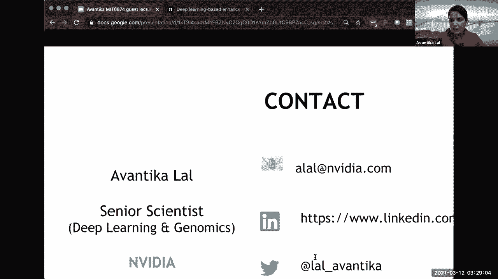

我想我们刚刚按时完成了，哦，非常的酷，你们能听到我说话吗，哦，对不起，对不起，非常感谢，阿凡蒂卡，我很肯定我们会有，更多的人从你的团队回来，还有一件事，如果你愿意，不仅有学生，也许来实习，但也有，呃。

你知道的，学生在他们的项目中与你们合作，你很安静，当然，我很高兴听到这里任何一个学生的来信，太厉害了，非常感谢好的，谢谢，我可以请全班同学再等一分钟吗？再等一分钟，所以嗯，我要做个快速调查。

所以首先谁呃发现，哦天啊，嗯杰基，你可不可以，呃，分享投票，恐怕我把自己断开了，其实坚持住。