# 【双语字幕】MIT《面向生命科学的深度学习》课程(2021) by Manolis Kellis - P8：Lecture 8 - Regulator binding, Transcription Factors - 爱可可-爱生活 - BV1wV411q7RE

 Today we're going to be talking about TF binding。

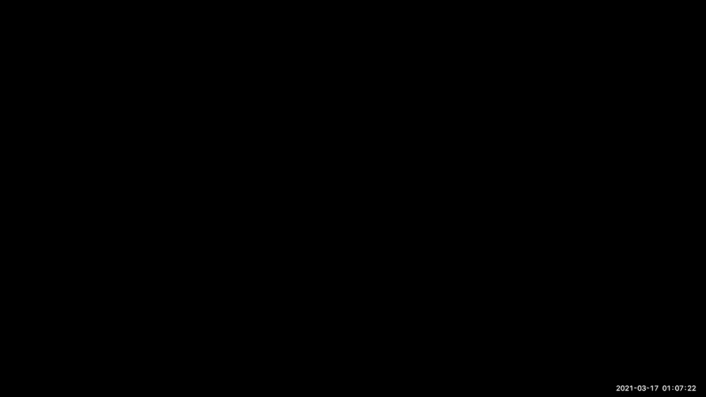

 So we're continuing on the realm of gene regulation， and the DNA regulatory code。

 And we're also going to be looking， at 3D conformational holding。

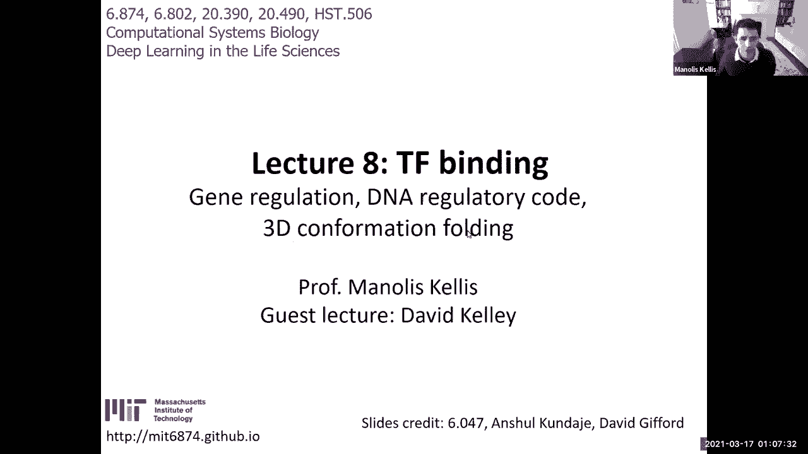

 So I'm going to recap briefly the biological foundation， from last time。

 Then I will also introduce three dimensional chromatin， structure。

 And I'll cover briefly the classical methods， for regulatory monogenomics and what you're discovering。

 And then introduce convolution neural networks， that we heard about for regulatory genomics。

 And then switch to David Kelly， who's， going to be giving us a guest lecture on deep learning。

 using BASSET， which is one of the earliest tools， and one of the most successful tools。

 for deep learning for regulatory genomics。 So without further ado， last time。

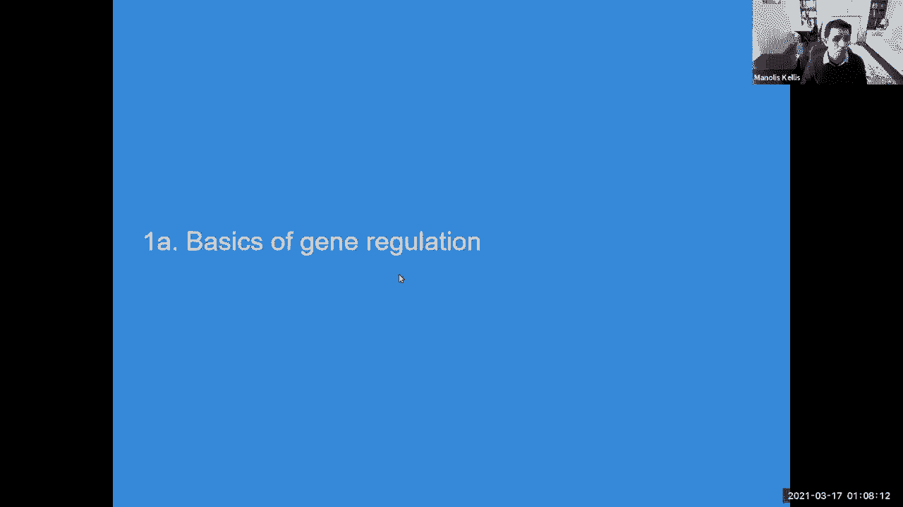

 we talked about how gene regulations at the basis， of the diversity of cell types in the human body。

 how this is enabled by compaction of chromatin， from the DNA into nucleosomes， chromatin fiber。

 higher order， structure and looping， ultimately， to the chromosomes that we know and love。

 and how this packaging was not just， structural to reduce the size of the DNA。

 but also functional in being able to label， the different regions that are packaged up。

 with specific classes of annotations that allow us to now。

 start thinking about the gene regulatory framework， that they enable。

 So we talked about how we can discover， these chromatin states based on combinations。

 of histone modification marks。 But in many ways， this is the input。 The input is the DNA sequence。

 So a lot of the challenge that we're going to address today。

 is how do we use DNA sequence and how do we use deep learning。

 to predict the different features of the gene regulatory genome。 And in particular。

 how do we distinguish， the specific motifs that make up， enhance the regions， promoter regions。

 and also they're， looping in three dimensions。 We talked about how motifs are represented。

 by short sequence patterns。 And these are going to be at the basis， of our convolutional filters。

 We talked about the hierarchical representation， learning that deep learning networks can have。

 in the context of images。 And now we're going to be looking at that in this module。

 both last Thursday and today。 These representations are going to be our motifs。

 and they're going to be the convolutional filters， at the bottom of our deep learning framework。

 So the lowest level that's closest to the DNA sequence， are going to be these motif logos that。

 are going to be learned， the novel。 And these motif logos are going to be allowing us to now。

 start predicting who are the regulators， how do they， combine to predict gene regulatory function。

 And these logos are basically derived from position， specific weight matrices， PSSMs。

 or position weight， matrices， PWMs， which are these position。

 by position independent models that basically tell you， how each position in isolation is dictated。

 by the specificity of binding of each transcription factor。 OK？

 Everybody with me so far based on the review from last time。 So let's see who's with me。

 Pretty cool。 So 653400。 So we're going to be learning these parts list。

 and these are at the basis of much of these DNA sequence， variations underlying human disease。

 We talked briefly about technologies， for profiling those， including chromatin immunoprecipitation。

 that basically builds antibodies and then， pulls down either regulators that are directly bound。

 to the DNA or histone modification signatures， that are associated with nucleosomes。

 And then sequences those to figure out， where in the genome every single part came from。

 mapping back these modifications as to where they're coming， from。

 and then enabling us to now reason about where， are these gene regulatory regions in the first place。

 within which we're going to be looking for motifs。

 So this can basically allow us to now start revealing。

 where are the different tricycline factors bound。

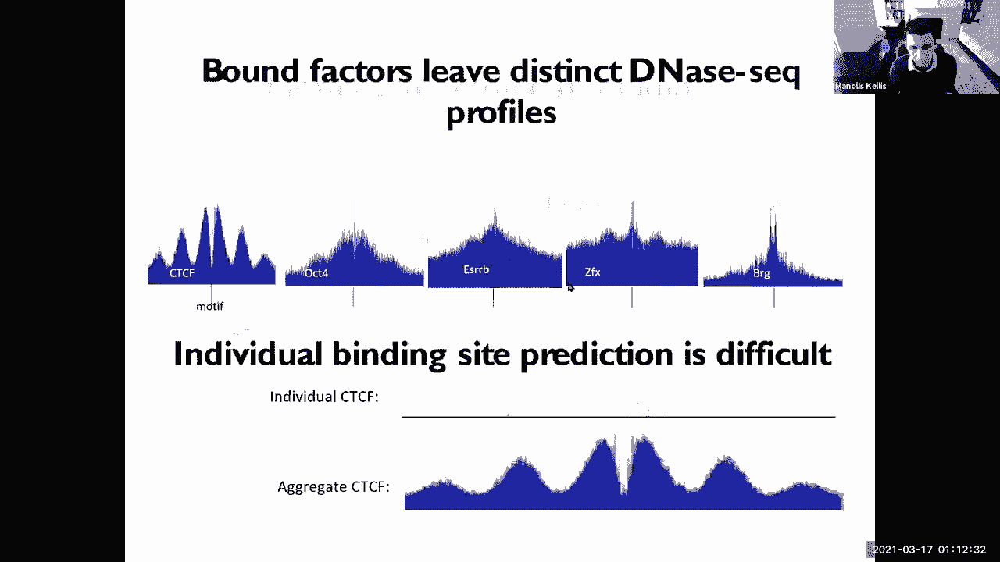

 And we heard many intricacies surrounding that。 The layer that I want to add on this。

 is the three dimensional chromatin structure， that allows regions to fold onto each other。 Again。

 just to recap， the cell is enormous。 And all of the black in this slide is the cytoplasm。

 So that's where the proteins get translated， and that's most of the cell。

 We're now zooming into the nucleus itself， which is the entire blue region， not to be confused。

 by the fact that within the nucleus， there's a nucleus， which is even smaller。

 And that's where a lot of compartmentalization happens， even within the mammalian nucleus。

 So if you look at the nucleus， that's， where all of the DNA is compacted。

 And you can see here the different DNA strands that， are sometimes touching the periphery。

 And this periphery is known as the lamina。 This is the nuclear lamina。

 This is basically the boundary of the nucleus， prior to getting to the cytoplasm。

 And a lot of repressed regions are basically stacked up， and packed up against the lamina。

 Then the active regions are pushed away from the lamina， and closer to the center of the nucleus。

 And they lie within chromosomal territories。 And this allows a spatial organization of the genome。

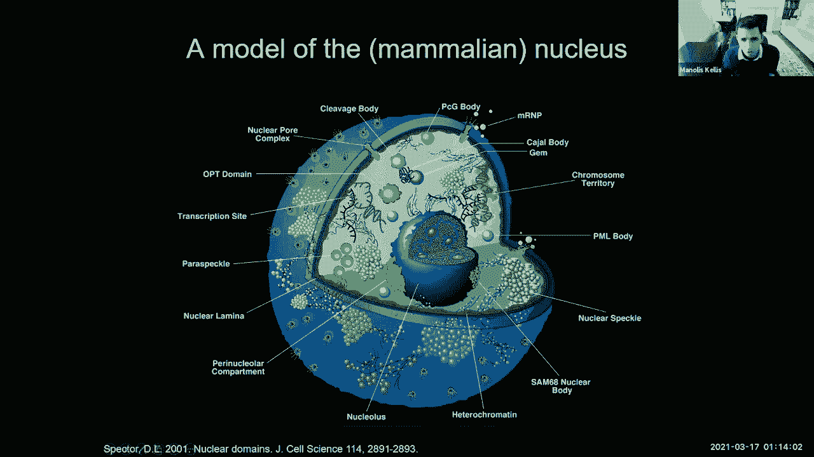

 that you can actually visualize in the microscope。

 You can actually see the cytoplasm on the outside， the DNA inside the nucleus。

 And then this 6 micrometer radius， a diameter of the nucleus， compared to a 2 meter long DNA。

 And again， the scale of compaction is quite， quite daunting。

 It basically spans nine orders of magnitude， between the length and the thickness of the fiber。

 and the diameter within which， in fact， this is like taking a fiber， which is between here。

 between New York and Miami， which is 10 to the 6， which， is 1，000 kilometers。

 between New York and Miami， and then fitting it within a 1 meter large bowl。

 with a fiber that has a diameter of 1 millimeter。 So it's dramatic， dramatic compaction。

 And all of that compaction is happening in stages， in various organizational layers。

 So we understand the nucleosomes quite well。 We understand how these are made， how DNA。

 folds around these nucleosomes。 But then all of these intermediate stages。

 have only recently been elucidated。

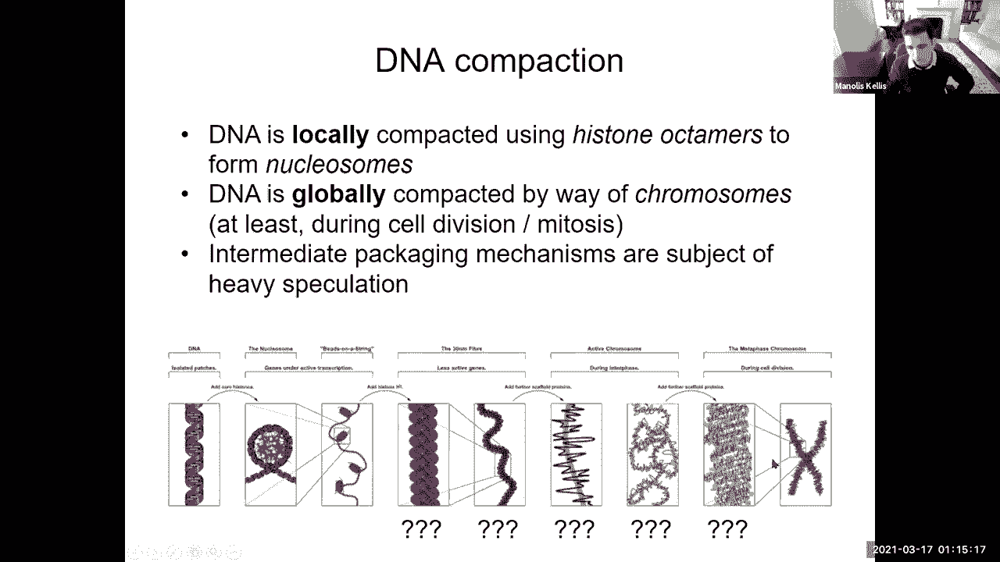

 But we also realize that there are chromosomal domains。

 where the different chromosomes are actually， sitting inside the nucleus。

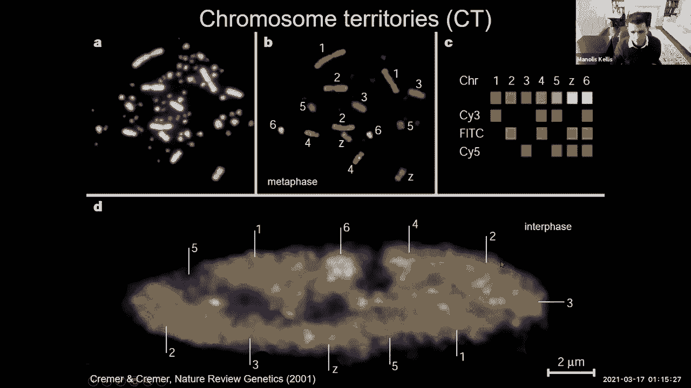

 So what we're going to talk about today， is a technique for actually inferring what loops to what。

 How are the chromosomes actually looping on each other？

 But before I go there， is everybody with me so far， as to the organization here。

 So let's see who is following me so far。 Wonderful。 Great。 So we're at 80， 20， 5， 0， 0。 OK。

 So now here's a very cool technique， for probing chromosomal organization。

 And that technique is chromosome conformation， capture， or 3C。 So what does 3C do？

 It basically says， if I have a soup of spaghetti of noodles， that are basically inside my bowl。

 and I want to figure out where the blue noodle contacts， the red noodle inside my bowl of noodles。

 what I can do is randomly--， so is number one， glue all the noodles together。

 and then randomly chop up strands at some random length， and random fixed intervals。 For example。

 every single time that I see this Hindi 3 cut， site with AA GC TT--。

 so every time I see this former， I will cut， which basically will cut every four to the four nucleotides。

 And that will basically create these random chop top noodles。

 I then take a special glue that finds these cuts that are hanging。

 and then ligates them to each other。 And that allows me to now create these chimeric molecules。

 that basically contain part of a blue noodle， and part of a red noodle。

 And then sequence across them to basically see， where does the red part bind-- sorry。

 map in the genome--， and where does the blue part map in the genome。

 And if the red part maps here and the blue part maps here。

 it basically tells me that these two were looping onto each other。

 And if I have a very long chromosomal segment， and I say that this part here is connected to that part there。

 that basically tells me something about the looping of DNA。

 Let's see who's with me on how I can use this cutting， cameraization， sequencing through。

 and then mapping the two fragments， to figure out which pairs of fragments， which pairs of regions。

 were， in fact， proximal to each other， in this three-dimensional conformation。 It's very cool。

 So we are at 70%， 20%， 10%， 0， and then 4%。 That's pretty good。 OK。

 so we can now use this technique， to start gaining insight as to how。

 is the three-dimensional genome packaged up。 And we can do this at the level of one site versus another site。

 And that's by using PCR， and that's the original 3C。 Or you can use one by all， which is 4C。

 Or you can use many by many， which， is called carbon copy chromatin conformation capture， or 5C。

 Or you can use all against all by just randomly cutting。

 and then selecting the fragments that were marked， as being recently cut。

 And then specifically capturing these chimeric regions。 How？

 By adding a bi-tinalation mark that allows me， to every time a red fragment is cut and a blue fragment is。

 joint to it， every time I have such a junction， I basically have biotinalation， which。

 allows me to now pull down specifically chimeric regions。 Because if I don't do that， I'm just。

 going to be sequencing the entire genome。 Or if I put a little mark here exactly where they're。

 ligated， I can pull down specifically the regions that， were cut。

 So that allows me to now do this systematically。 There are other techniques， for example， chia pet。

 It's similar to chromatin immunoprecipitation。 But now you're basically doing， again。

 chromatin immunoprecipitation。 But in the end， you do this paired end tagging。

 whereby after you pull down these regions， relative to a landmark protein--。

 so I want to figure out what pairs of regions， is my favorite transcription factor bound。

 So what I can do is basically take， I don't know， the CTCF protein。

 And I can build an antibody against the CTCF protein， and pull it down。

 And then sort of do the same ligation， where I'm cutting up the blue and the red。

 and then I'm rejoining them。 But I can do this ligation through the lens， of what is CTCF bound to。

 And it's one of the factors that's actually involved， in chromatin looping。

 So I can basically use chia pet to pull down， a specific regulator that will then allow me to only look。

 at a subset of all of the connections， rather than， all of the connections。

 I've covered an enormous amount of material， in a tiny amount of space。 So if you're not with me。

 that's OK。 But I'm going to do another poll to see who's with me here。 So number one。

 3C is basically looking at one region at a time。 4C， slightly more。 5C， slightly more。 High C。

 all of the above。 It's basically like getting everything to everything。

 And then chia pet is only looking through the lens of one， regulator at a time。

 And then there are variations。 For example， capture of IC allows you to look at only a subset。

 of high C regions， which are associated with things， that I care about。 For example， promoters。

 I can pull down all promoters， and pull down all enhancers， over particular cell type， and then。

 see who they're interacting with。 All right， so we are at 25， 55， 10， 10， 0。 So yes， slightly lower。

 But that's OK。 I'm just introducing a lot of stuff。 There's a whole lecture out there。

 that you can watch on the three-dimensional confirmation。 And we'll post that to you。

 But this is just to give you a brief sense， of those different technologies。 All right。

 so high C is the technology， that's the most widely used by adding these biotinylation， marks。

 and then being able to pull down these marks， and then sequence across these pull down segments。

 to find blue red pairs that are chimerically lagged。 And what this gives you is something like this。

 What are these pictures showing us？ These pictures are basically telling us。

 that this region here interacts with that region here， through these three-day confirmation。

 So the genome is basically going down the diagonal， but also down this way and down that way。

 And every time you see an off-diagonal entry， it basically tells you how much is this region of the genome。

 over here interacting with that region of the genome over here。

 So it basically tells you about loops going this way。 So every one of these pictures you。

 can think of as looping information， between every one of those pairs。

 So regardless of what you actually see inside the picture。

 who understands the coordinate frame of what every single one， of these dots represents。

 So a dot over here basically tells me， that this region here is interacting with that region there。

 So let's see who's with me on this one。 Very， very cool。 Wow， quite impressive。 So 45， 30， 20， 0， 5。

 OK， so we can now start asking， well， now that we understand。

 what these pictures should be showing us， let's see what it's actually showing us。

 What it's actually showing us is these very specific features， of long-range interactions。

 The first thing that we're learning， is that very close to the diagonal。

 our regions tend to interact with each other。 That there's a thick band rather than just a very thin line。

 So that's the first feature。 There's a lot of self-interactions。

 The second feature is that there seems， to be some kind of boundary here where there's a block。

 where there's much more interaction， within the region than across the region。

 And there's another block here， and then there's another block， there。

 So the second feature is that there， are these things called topologically associated domains。

 or tabs that basically are much more interacting， with each other than with the outside。

 The third feature is that these tabs， appear to be kind of hierarchical。

 There are tabs within tabs within tabs。 So there seems to be some kind of nested hierarchy。

 The third feature is that there's this plate pattern。 So if I'm this region here。

 I tend to interact with--， and I'm going to call myself， I don't know--。

 kind of like the jets and the--， gosh， I'm embarrassed。 I don't remember the rivals of the jets。

 But there's A's and then there's the B's。 And if I'm an A， I tend to interact more with other A's。

 And there's another A here， and there's another A there。 But if I'm a B。

 I tend to interact much more with other B's。 So I'm a B there， a terrible choice of colors。

 So if I'm a B， I tend to interact with other B's。 So there's this checkerboard pattern where。

 the A's tend to interact with other A's， and the B's tend to interact with other B's。

 Who's with me here？ So we saw the three features。 Number one， the tabs， the groups of regions。

 that are interacting with each other。 Number two， the hierarchical nature。

 and how the closer you get to the diagonal， the more interactions you have。

 And the third one is that there seems， to be two types of compartments。

 There's A compartments and B compartments。 Awesome。 So 52， 24， 19， 5， 0。 All right。

 so we can now use this to start asking， how is the genome actually organized？

 We can actually start visualizing some of that compaction。

 We can actually start asking what are the features at zooming， and zooming and zooming。

 So basically， across the entire chromosome， you can ask， well， what are these blocks？

 And then you can zoom into one of these blocks。 And then again， you see this hierarchical nature。

 And you can zoom in further and see this hierarchical nature， again。

 And you can zoom in further and start， seeing individual interactions where this region here。

 is clearly interacting with that one very， very strongly。

 And the rest in the middle is sort of much more fuzzy。

 Suggesting very specific long range interactions， and suggesting that there's some kind of looping going on。

 between these region of the DNA and that region of the DNA。

 And you can sort of see this territoriality， these sort of territories。

 As you zoom in to the genome， you can basically， look at all of the different chromosomes。

 And within each chromosome， you can see these territories。

 And then you can zoom in further within these territories， and find additional territories。 OK。

 And this is what we are going to call cis interactions， within the same chromosome。

 And these are going to be trans interactions， across different chromosomes。

 So what's really interesting is that many of these trans。

 interactions are now recognized to be reliably seen repeatedly， across different experiments。

 So what you see with this territoriality， is that different chromosomes tend。

 to occupy their own space inside the nucleus。 It's kind of cool。 So basically。

 this is very similar to the picture， that we had seen very early on when。

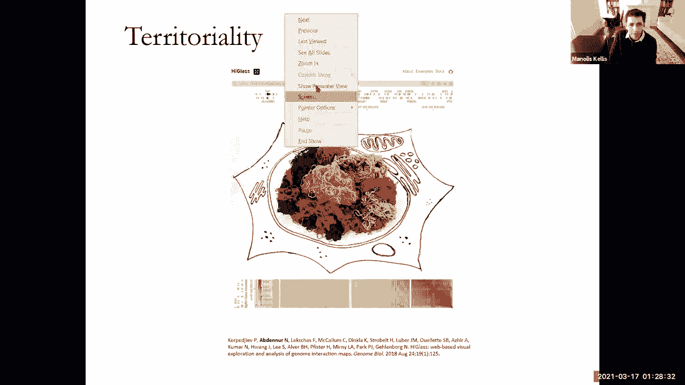

 the different chromosomes were labeled and stained， where。

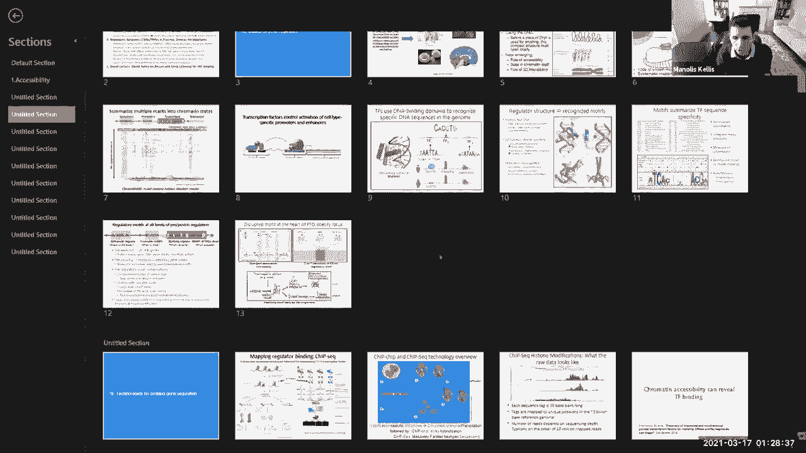

 you could see that each of these chromosomes was， in fact， occupying its own territory。

 And that's what we're starting to see now again。

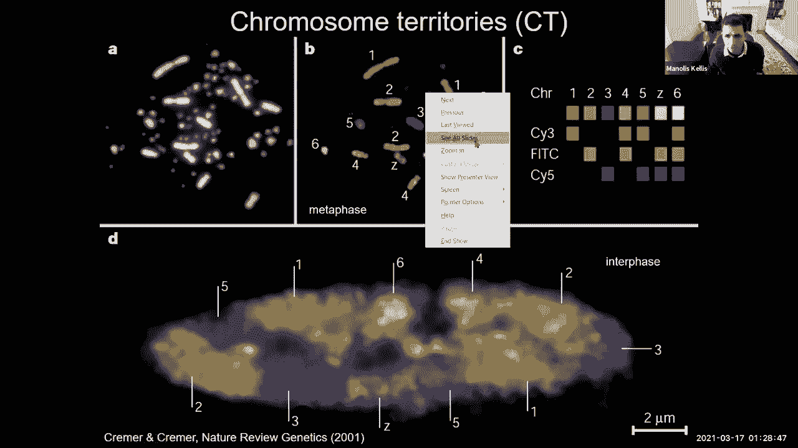

 But now at the level， at the resolution of base pairs。

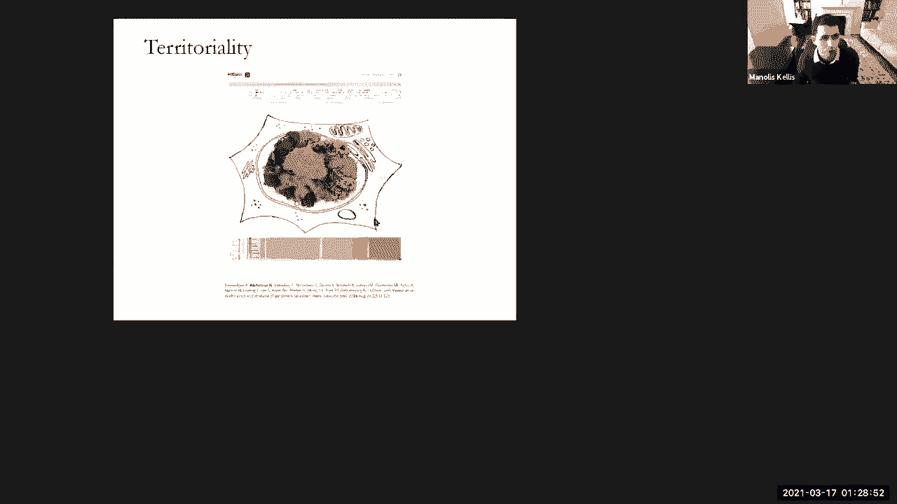

 very， very high resolution。 And then the next thing we see is this sort of plate pattern。

 this A versus B compartment， which basically， suggests that if I'm an A。

 I only interact with other A's， no matter how far they are from me。

 And what that is suggesting is that there， are， in fact。

 two different parts of the chromosome of the genome。 One part is going to be what we call inactive。

 And that's actually closer to the periphery， as I mentioned earlier， closer to the laminar。

 And another part is the active part， which， is closer to the center。 So there's the A compartment。

 which is in the center， and the B compartment， which is closer to the periphery。

 And then I mentioned these topologically associated domains， earlier， these groups of regions that。

 are interacting very strongly within them， but not across them。

 And you can see those as you start browsing through， with this tool， high glass。

 that was developed here at MIT， between Leonid MIRNI and Nezar， a student that was。

 called by Leonid and myself。 And you can sort of see the interactivity here， zooming out。

 scrolling around， and then looking closer， within these regions， and then changing the intensity。

 to see these topologically associated domains， as you go through， and then zooming in here。

 adjusting the intensity again， looking at these regions。

 And you can see these long-range interactions that。

 are suggesting these looping between distal regions， to each other。 All right。

 so let's see who's with me so far。 And actually， let's do something falling。 It's not different。

 Who feels that they've learned something？ [VIDEO PLAYBACK]， - Awesome。 All right， 27。55， 14。0。

 And then my favorite-- nope， I really， don't see why the professor is all excited。 OK。

 so that basically allows us to now start asking， well， what creates these offshoots。

 these off-diagonal， strong items here？ And then what the prevailing model seems to be。

 for these corner peaks， for these loops， is that there's a model whereby different regions would。

 basically come towards each other， by a process of loop extrusion。

 So what people noticed across many different labs。

 is that if you look at the boundaries of these topologically， associated domains， you basically。

 would find binding sites for the CTCF regulator， which。

 is sometimes thought of as an insulator protein， but now recognize to be part of that loop extrusion process。

 So there's a CTCF binding site here， and another CTCF binding site here。

 very often pointing towards each other。 And when the two CTCF proteins bind there。

 they partner up with cohesion， which then pushes， a loop of DNA through that loop that they create。

 and thereby creates these topologically associated domain。

 So the loop extrusion model of high C interpretation。

 and chromatin-- three dimensional chromatin folding， is that you have a binding site here。

 a binding site there， that the two regions are brought closer to each other。

 and then you push the DNA through， sort of effectively growing a loop through there。 OK？

 So now to recap what we've looked at， we basically saw that there are chromosomal territories。

 where， chromosome 6 kind of like to hang out with its bodies， and chromatin 7 with its bodies。

 and chromosome 8 with its bodies。 But much less cross-talk across them， so many cis interactions。

 but very few trans interactions。 And then these compartments of the DNA。

 had one to 10 megabays resolution。 And then when you zoom in， these topologically associated。

 domains， and then at the bottom， these loops。 So let's see who's with me so far on these four different levels。

 of resolution of the chromatin organization。 Beautiful。 So now let dive into what-- so 50%， 35%。

 17%， 0%， so let's now dive into the computational analysis， of these regions。 So first of all。

 how do we understand， the language through which DNA is read。

 through all of these different regulators， and carries out all of this organization？

 So the first thing is we're going， to be looking for regulatory motifs using traditional approaches。

 And those traditional approaches before deep learning。

 were about finding patterns that are repeated。 So you would basically say， I have a set of genes。

 that are co-expressed， and my hypothesis， is that they are co-regulated by a common upstream regulator。

 that binds all of their upstream regions。 So I'm going to develop computational methods。

 that look for motifs that are shared between them。 And that's what the early methods we're doing。

 They were basically saying， let's define the shared motif， using a position weight matrix， which。

 is going to be a latent variable。 And I'm going to be iterating between using the matrix。

 to find instances of that motif， and then using those instances。

 to refine the matrix and using that matrix， to refine the instances and so on and so forth。

 So basically， I'm alternating between recognizing， a common sequence pattern， one of those motifs。

 In this particular case， it's C， A or T， G， G， C， A or T， A， or T， C。 So it's a motif。

 And then I'm refining， I'm discovering the motif， at the same time as I'm discovering。

 the instances of that motif。 So who's with me on this key idea of I'm。

 going to be searching for a motif logo， refining， the motif logo， using that refined motif logo。

 to find all of the instances， better aligning those instances， to each other。

 and then using the better aligned instances， to now define a better motif logo and back and forth。

 Awesome。 So 50%， 35%， 17%， 0%， 0%。 That's great。 So there are many ways of doing this。

 but the key idea that I want you guys to embrace， and that's what we're going to be diving in also with David's。

 guest lecture， is that we can use the same deep learning， methodology that we've developed so far。

 with this representation learning， with these hierarchical layers， with this de novo discovery。

 of filters， all of that which we initially developed for images。

 we can now use in the context of regulatory genomics。 The key idea is the following。

 Just like I had my RGB input images for image analysis， I'm now going to have not just three layers。

 but not just three channels， but four channels。 One channel for each letter of the DNA。

 This is what we call one hot encoding。 So the G channel is going to be one whenever there's a G。

 and zero otherwise。 So the G channel only lights up when there's a G。 The C channel is 0， 1， 0， 0。

 0， 0， 0， 1， 1， 0， 0， 0， 0， and the A channel is going to be 0， 0， 1， 0， 0， 1。

 and so on and so forth。 So I can take my sequence representation。

 ignore the fact that there are letters， and just simply think of it as an RGB color map where。

 I'm going to have four different input channels， one， for each letter。

 Who's with me here about the bottom layer？ So it's a one hot encoding representation。

 of my DNA sequence that enables me to now think of it， as the four channels of an RGB image。

 Awesome。 So 74%， 26%， 0， 0， 0。 Now at the next layer， this is where。

 the representation learning becomes super， super cool and useful。

 The representation learning is going to basically say。

 I'm going to have a convolutional filter which， I will apply at every position of my entire DNA sequence。

 Instead of having an edge detector， which I'm going to be scanning through my image。

 to detect edges， I'm going to have a GCATT detector that I'm。

 going to be scanning through my DNA sequence， to notice when there's a wheel or when there's a CTCF binding。

 side。 The same way that we looked for wheels， for noses， for flashlights， for hats。

 and so on and so forth， we're now going to be searching for different features。

 of the DNA and these features are going to be motifs。 So the concept here is that we're。

 going to have a deep learning architecture， in the same way as before with layers of representation。

 that are increasingly more abstract。 And at the bottom layer， we're going。

 to have the input sequence with one hot encoding。 And at the layer right above it， we're。

 going to have convolutional filters which， are going to be learned the novel。

 And they're convolutional because I'm applying， the same exact operation at every location of my DNA。

 So who is meeting so far on the convolutional filters？ What the convolutional filters are doing。

 are sharing parameters across different regions of the DNA。

 by learning the concept of a wheel or of an edge or of a nose， or of a CTCF binding side。

 And that concept of a CTCF binding side， is going to be a GATTAC， which I'm。

 going to be scanning through my DNA。 Awesome。 So we're at 17%， 13%， 0， 0。 That's awesome。

 So then once I've learned the representation， at the bottom layer and the beauty of all that。

 is that I'm doing this learning。 I'm doing this parameter optimization on the fly。

 Based on some task， for example， is， the transcription factor binding here or not。

 Based on some task， I'm going to learn representations that。

 will then allow me to carry out the task。 I'm going to learn these representations， which。

 are going to be shared parameters across the whole genome。 And my deep learning framework is going。

 to realize that the concept of GATTAC is a useful one。 And it will learn that motif。

 And it will learn that the concept of a CTCF binding， side is a useful one。

 And ABF1 binding side is a useful one， and so forth。

 So it's going to learn all these convolutional filters。

 and then apply these filters throughout the entire genome。

 jointly with a particular prediction task。 And once you have that conceptualization。

 you can then say， OK， great。 I can vary the number of convolutional filters。

 I can vary the length and the size of it。 I can vary the number of layers that I want。

 I can vary the prediction task。 I can have all kinds of input-output relationships。

 And we're going to see many， many different variations， on that theme。

 So who's with me here on the overall architecture， of a deep learning convolutional neural network。

 applied to genome sequences as a way， to extract common properties， common filters， common motifs。

 and then use those motifs to learn， a representation of my sequence， which I will then。

 be able to use for any kind of prediction task。 Awesome。 So we're at 60%， 40%， 400。 That's awesome。

 All right。 So let's do another quick poll who feels that they've， learned something today。

 Beautiful。 So David， are you there？ If so， can you please turn on your camera？ All right。

 So we're at 60%， 30%， 0%， 0%， and then one person always， at the bottom。 All right。 OK。 So David。

 are you there？

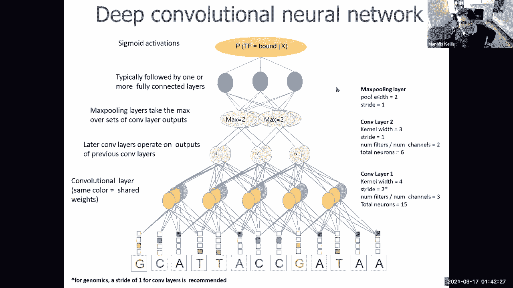

 Awesome。 Perfect。 So I am delighted to invite David Kelly today。

 So we are very fortunate to have David。 Do you want to share your screen？ Yes。

 So David actually is one of the earliest authors， of a deep learning framework。 And in my view。

 he has actually developed， one of the cleanest such frameworks。

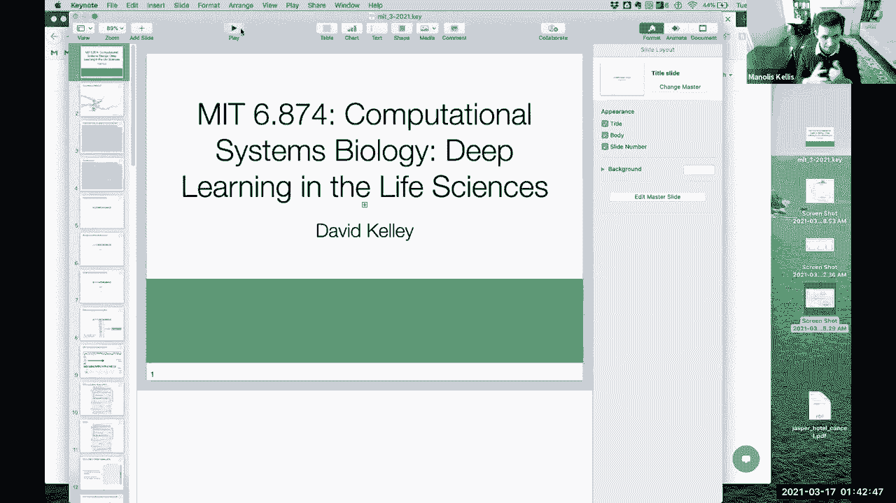

 that truly encompasses very closely， these concepts of a convolutional neural network。

 and these filters and these representations。 So I asked him today to dive right。

 into the foundations of how does deep learning， for convolutional neural networks work。

 from someone who， actually invented that and was one of the first three papers， in the concept。

 So David， take it away。 Yeah。 Great。 Thanks， Manales。

 And happy to be here to walk you guys through this research， and please ask lots of questions。

 I'm trying to figure out here。 It doesn't look like I can see the chat very well。

 Don't worry about the chat。 We'll be answering the questions of the theoretical， CAs and myself。 OK。

 Super。 All right。 So you guys have had some of the background here。

 on the basics of these models and the goals。 I'll just run through a little bit of intro quickly。

 So the overall goal that the research field is really， trying to tackle right now is that we。

 know a lot of the principles of how genes are regulated。 We know that there's transcription factors。

 binding a promoter that leads to transcription。 We know there's distal elements， enhancers。

 that can regulate transcription from thousands， tens of thousands， maybe sometimes hundreds。

 of thousands of nucleotides away， typically by looping。 But what we're not so good at is looking。

 at a huge region of DNA sequence or even a smaller region。

 of DNA sequence and knowing exactly what it's going to do。 We have the principles， but we don't。

 have the precise nature of the language quite down。 And then， accordingly。

 when there's changes made to the genome， we have trouble predicting exactly what the effect is。

 going to be on the things we care about。 So this looks like it's a big matrix of nucleotides。

 or one-hot encoded。 We have lots of information labeling these nucleotides。

 So this is really ripe for machine learning。 I mean。

 me as a human can't make much sense of all these ACGs， and T's。

 but I can teach a computer to try to do it。 So historically， some of the most early successful uses。

 of machine learning on nucleic acid sequences in biology， made use of strain kernels。 So I mean。

 the goal is you have to take， this string of nucleotides。

 And you really have to come up with some sort of vector numeric。

 representation of it to be able to work， with typical machine learning pipelines。

 So a strain kernel would just say， OK， let me look at all the kamers in this sequence。

 Thinking that kamer is an object that is useful。 A nucleotide by itself is not very informative。

 But a kamer is something that a transcription factor can。

 recognize that some of the mechanics of the physics， of the DNA polymer have relevance to。

 So by saying， OK， let's count all the formers in the sequence。 Now I can form a vector。

 And now I can do machine learning on my vector representation， of the sequence。

 feed it into random forests， support vector， machine， anything or heart desires。

 even neural networks。 So the question when I started this was， OK， kamers have shortcomings here。

 The simplest one would just be that there's really no easy。

 straightforward way to take into account spatial， positioning of the kamers。

 So I've looked at a promoter。 And it's really only relevant if the kamer is here， not here， or here。

 That's something that's hard for these kind of bag of kamers， representations to learn。

 Or if there's any sort of relationships between kamers。 I need this one here and that one there。

 Well， that's very hard to learn。 So at the time， deep learning methods。

 were really taking off for image analysis。 And it seemed like using deep learning。

 was going to be a potential way to learn better representations。

 of these sequences to make predictions for the things， we care about。 So the idea here。

 Benoast is recovered， but I'll just go quickly through。

 So we're going to have convolution filters analogous。

 to what people have been doing in image analysis， where， you have an image come in and you。

 have these convolution filters that you scan across your image。 And the idea here。

 the inductive bias， that you're contributing to your model。

 is that there's translation invariance of the features， that you want to extract。 So generally。

 if I see a dog in the upper left corner， versus a dog in the bottom right corner of my image。

 then I want my feature extractors， to be able to recognize either of those situations。

 And so by having these convolution filters， and scanning them across your whole image。

 then you're able to pick up on things like that。 So it's the same for us here。

 except the first layer， of the convolution filters are able to basically recognize。

 position weight matrices。 That's ultimately what they look like。

 It's a four by the length that you choose object。 And we choose it typically to match known transcription。

 factor binding site lengths。 And then those are scanning across the sequence。

 They are creating that a numeric representation that， is the number of filters， three in this case。

 so three rows， by the length of the sequence， which。

 is the element-wise dot product between this position。

 weight matrix object and the one-hot encoded sequence。 Then usually。

 I'm actually going to plug in a layer that's， not on this slide。 Usually。

 then we'll do something called a batch normalization。

 So in terms of how to get these neural networks to really， work well in practice， if you want。

 to do multiple layers， there's this operation， called batch normalization that is extremely helpful for that。

 After the batch normalization， you'll， apply a nonlinear function。

 The most common one right now is a relu rectified linear unit。

 where you basically just set all the negative values to 0。 So we just want positive recognition。

 of our position weight matrices。 We don't care how much a certain string doesn't。

 look like our filter。 We just want the occasions where it， does look like the filter。

 And then ultimately， if you want， to be applying this multiple times。

 then you typically want an operation that， starts to summarize and aggregate information。 So here。

 the final step， this max pooling operation says， let me look at adjacent positions。

 And then for each filter channel， I'm， going to take a maximum operation。

 So I'm just going to send through the maximum value。 And so that starts to code things like， well。

 if I recognize a transcription factor binding site， I don't so much care if it's at position 12。

 versus position 13。 That doesn't make a huge difference。

 I might care about position 12 versus position 800。 And that's fine。

 That's why the max pooling only covers， like a little small window。 OK。 So stitching that together。

 we come in， with our one hot encoded sequence。 We apply this convolutional layer。

 followed by a max pooling。 Then we can start to repeat that operation。

 So if we just did one layer of the convolution， then it starts to look like， OK， maybe I。

 was just using position weight matrices， and just looking at their output。

 That's not very in tune with the philosophy of deep learning。 So instead。

 we continue applying convolutions， in the model that I'm presented here in the original paper。

 I did this three times where I did a pooling operation， and then you continue on。

 So the second and third layers no longer， have this sort of easy interpretation。

 because the convolution filters don't align， with transcription factor binding sites like the first layer。

 Instead， what they're able to learn is， OK， they're seeing。

 as input a vector of all of the first layers filters， and what they found。

 So the second layer can learn things like， oh， well， this filter and that filter activated。

 So now I'm going to activate。 So if there's any sort of relationships。

 between the transcription factors or if there's， a relationship like I need to see a transcription factor binding。

 site， and then I need to see some GC content richness， then the second and third layers can。

 start to learn those sorts of relationships。 Finally， you want to come down and make a prediction。

 So after they've done the convolutions a few times， you still have this object that is。

 the depth of your filter channels by the length of your sequence。 And in this case。

 I just wanted to make one prediction， for the sequence。

 So I need to collapse across the length axis。 So the way I do that is just flatten。

 So now you just kind of thrown away， the positional information。

 And you run a now fully connected layer， it's like a multi-layer perceptron。

 And you make your final prediction。 So in this case， I'm going to bounce ahead。

 and show you the data and then hop back。 In this case， the data that I wanted to predict。

 was DNA hypersensitivity， which measures， the accessibility of a region of DNA。

 on the order of 100 nucleotides， 100 to 100 nucleotides。 And what we had access to， thanks。

 to incredible efforts by consortiums， to which， but also the major contributor。

 is tons of data like this across many different cell types。

 So what I focused on was a curated set of 164 different cell， types。 That's the rows in this matrix。

 And binary calls for whether there's， a significant signal from this DNA hypersensitivity assay。

 measuring the open chromatin。 So to say just a little more about the DNase。

 the simplest way to think of it is combining， all of the binding of different transcription factors。

 So there's going to be lots of different motifs， that are determinant of whether there's a DNA hypersensitivity。

 peak。 And you can see from this matrix that， although there are a bunch of sites that。

 are pretty consistently accessible across cell types， there's also lots of cell type specific peaks。

 We want to be able to learn those。 I mean， those are potentially more interesting。

 to some biologists。 Some of the consistent ones might be promoters。

 that we know would be accessible， but the cell type specific stuff might be more interesting。

 So there's about 2 million sites。 We're going to break them up into a training validation。

 and test set。 We're going to train on a bunch of them。 We're going to test on the others。 OK。

 just to hop back now。 So we have these 164 different cell types。

 So the final layer here where we make a prediction， we're going to output 164 different predictions。

 Now， it doesn't have to be that way。 You could just take each of these experiments one by one。

 and you could train an entire model， to predict just that one experiment。

 But it turns out that even though there's， a lot of cell type specific stuff。

 there's enough structure， and there's enough sharing of motifs。

 and there's enough transcription factors that， are consistent across all the cell types。

 that you get better results if you do it， in a multitask learning setting。

 So multitask learning is OK。 Lots of different prediction problems。

 and I'm going to combine them into one model。 And then you， the practitioner， have choices。

 to make about how much to share between each task。 But here。

 we're going to do a pretty strict sharing。 So all the convolutions and the fully connected layer。

 are shared between all the tasks。 The only parameters that each task has that is specific。

 to that task is just this final linear transformation。 So--。

 And I jump into tight a little bit with the lectures， that we've had。

 We talked a lot in lecture six about representation learning。

 and how you can actually trick the deep learning framework。

 to learn representations by effectively ging， and dummy tasks。 In this particular case。

 these are not actually， dummy tasks。 These are a lot of very useful tasks。

 But what you could have done is trained one deep layer--。

 one deep convolutional neural network for one task。

 and another one for another task and another one， for another task and another one for another task。

 The downside of that would have been that your internal。

 representations might actually have been slightly different。 That basically may be this task is。

 greater at recognizing four transcription factors。 And that other task is greater at recognizing。

 a different six transcription factors。 And a third task has two of the first， one of the third。

 and another one that hasn't been seen before。 And suddenly you'd end up learning。

 a lot of different variations of these underlying， regulatory motifs as opposed to forcing。

 it to have one task--， all of the tasks jointly and therefore one representation。

 that's joined for all of these tasks。 Again， the trick is to get a deep learning model。

 to learn representations of the underlying meaningful features， of our data set。

 which in this particular case， are the motifs。 And those motifs are very often shared and reused。

 across many of these tasks。 David， what are the tasks that you're doing here？

 Is it just different cell types？ Is it different TF chip experiments or any of the above？

 In this case， in the original paper， it was just different cell types with the DNA。

 and hypersensitivity assay。 But in follow-up work， I have included any data。

 from the functional genomics world that generates peaks that， can be represented in this format。

 So in that case， it can be transcription factor， chip seed， histone modification， chip seed。

 attack seed， trivialies， quite close to the DNA。 Anything that you could represent。

 is like a punctade binary peak。 Great。 I'm going to do a quick poll to see how well folks are following。

 So let's see。 Can everybody sort of understand this multi-layer architecture。

 of BASSET and how it maps to everything we've learned before？ Great。 So 41， 41， 18， 0， 0。 Awesome。

 Take it away， David。 Great。 I see a questionnaire in the chat that， a question about the x-axis。

 I'm going to guess the question was， from this slide， here the x-axis is position。

 It's position across the sequence。 OK。 So at the time， I showed you some of these K-mer SVMs。

 At the time， the K-mer SVMs were the most competitive models， for these sorts of tasks。 In fact。

 there's a model called GKMSBM that's GAPs gamers。 It's really an excellent model and still widely used today。

 But in a task like this， you're able to get better performance。

 on the test set by using the convolutional neural network， which is just a more flexible model。

 It can represent more things than the K-mer SVMs can represent。 OK。

 so why don't you get in next to try to understand the model， figure out exactly what is it doing？

 And this is useful as part of the exercise as a practitioner。

 because typically you can identify something， once you understand the model better and go back and iterate。

 and maybe change the architecture and change， different parameters of it。

 You have a lot of choices when you do the search， of convolutional neural networks networks。

 So the better you understand your data and your model， better you can set those parameters。

 So truthfully， the convolution filters， pitched the idea that they would be representing。

 transcription back to the binding sites。 So the first one is to check if that's true。

 So the filter objects themselves are just continuous real values。

 between typically end up between negative 5 to 10 or something。

 So to figure out what they're recognizing， or take the filters， scan them across a whole bunch。

 of test sequences， figure out which places and most sequences， the filter activates。

 and take the highest activations， and build a position weight matrix out of it。

 And then I can compare those position weight， matrices to the databases we have with transcription。

 back to binding sites。 One I'm using here is called sys BP。

 And I can see that indeed this filter from the BASSID model。

 recognizes a sequence that's extremely similar to the database， motif。 So that's really promising。

 And if we look across lots of different convolution filters， that's largely true。

 I should say that this is a little finicky。 It doesn't have to be this way。

 And there are certain settings of the architecture。

 that make it more or less likely that you'll learn， these very position weight matrices filters。

 And so that's just something to watch out for。 Another piece of complexity to it。

 is that for position weight matrices， for transcription factors that are really。

 useful to the model， it's not just going， to use one filter that would match the database。

 So CTCF has a really important factor， for predicting accessibility。

 And there's many different filters， throughout the BASSID model that recognize something that。

 looks like CTCF。 And I can line them up here。 So that's interesting because I'm， indicating that--。

 Can I ask you a question？ So if you had additional layers， basically。

 what Anshil talked about on Thursday， is that with additional layers， higher order layers。

 he would end up sort of combining two sub-motives， in a large motif。 My question is。

 did you look into potentially--， I mean， because CTCF is an unusually long motif。

 And maybe the individual components of it， I mean。

 it has multiple fingers that are sort of touching， the DNA。

 My question is whether having multiple layers， would allow you to perhaps combine more building。

 block representations of it。 Yeah， definitely。 Definitely。 In the first paper。

 I was lacking in the creativity， to sort of quantitatively establish。

 what the deeper filters are doing。 After seeing some of your work。

 Anshil has done kind of gone back， and said， OK， well， even if it's a deeper layer of the network。

 you can look at what activated you。 Go back to the sequence instead of active。 Perfect。 Well。

 you can definitely do the same exercise， for deeper layers in CO。

 It's recognizing a fuller version of the motif。 Thank you。

 Sometimes it's tricky because it'll combine the forward version， with the reverse version。

 And now the sequence of the sort of five-vodel。 It's like two different types of--。

 So how do you avoid that？ So you could imagine， if the orientation of the motif。

 doesn't matter for making predictions， then at some point in the model， it's。

 going to combine recognition of the forward and the reverse。

 And another way it might be for the pooling layer。

 to basically search from motifs in both directions。 Yeah， yeah。

 And there's ways to take advantage of this in a more clever way。

 And Anshil has written some papers about that。 And it seems to help when you have small data。

 because you're imposing a stronger， adaptive bias。 Exactly。 But when you have a huge data set。

 it seems to not matter too much。 You just have enough information to learn it all and you get blind。

 Great。 Thank you。 Yeah。 So the other thing to note here is that this is good。

 There's lots of filters that recognize it。 If there's variant versions of the motif。

 the position weight matrix is insufficient to represent， this transcription factor。

 Then maybe having a bunch helps us make better predictions。

 But it makes it a little hard to say exactly where is CTCF。

 finding and how is CTCF contributing to the predictions？ Because now the CTCF information is now。

 spread across many different filters， and I would have to keep track of that。

 So I tried to do an analysis that sort of bears out this challenge。 I took every filter。

 And so each in the scatter plot here， these are all filters。

 You can sort of see some of them colored。 And on the x-axis。

 it's the information content of the filter。 So CTCF has very high information content。

 So it would be over here。 But some of these have very low information content。

 This one just recognizes a C， G， D， really。 So that's low。 On the y-axis。

 looking at the influence of the filter， as quantified by getting inside the model when。

 it's trying to make predictions and setting， the filter output to its meme。

 So now there's no useful information coming through that filter。 So if it's really important。

 then the model will be handicapped， and it won't make good predictions。

 And that's what this influence measures。 And I made this plot in thought， oh， CTCF。

 is going to be highly influential。 And the problem is it's not because there's。

 no individual filter because you could knock out filter 200， or filter 106。

 but there's still seven more， that can be used to make those CTCF predictions。

 So it's very robust to the loss of one filter。 And the filters that end up being the most important。

 are this sort of picking up on nucleotide composition， information， GC richness。

 So that sort of gives you a taste of some of the challenges。

 we get into your interpreting these models。 OK， just getting through that。 Bon part。

 If you do have transcription factor motifs， that you know are really interesting to you。

 there's one more analysis I did that I think did work pretty， well。

 So once you have the trained model， you can take any sequence you want and give it to the bottle。

 and you can take modifications of that sequence， and make predictions。

 So you can take this known motif you care about， and just start injecting it into other interesting sequences。

 So here I just took 100 random sequences from the genome。

 and put in this transcription factor motif for the AP1， complex。

 And I can see that in different cell types， there's a different reaction to that motif indicating。

 that there's some cell type specificity。 The brain region here didn't seem to care too much about it。

 The stem cells care a little and the Hm maps over here， care a lot。

 Most of the sequences go to very high accessibility， predictions。

 So that's one way you can start to study transcription factor， binding states。 Another way。

 which it sounds like maybe you got a taste of from， on-shore。

 is to come into a sequence of interest and mutate， every single nucleotide across the sequence。

 to its alternatives in order to see which mutations to the sequence。

 induce a change in the prediction I want to make。 And there's alternatives to this that on-chills push forward。

 where you're making use of the gradients。 And there's pros and cons computationally。

 either of the approaches， but they're， trying to capture the same thing。

 What is the influence of this nucleotide on the prediction？ And when you do that。

 you see these motifs， start to emerge out of the sequence。 So over here。

 you have this AP1 motif where mutating any of these， nucleotides is going to significantly decrease。

 the prediction。 And in the paper here， we've verified the chip。

 seek for this transcription factor at that site。 And there's some reasonable conservation statistics。

 on the motifs that are helping to validate， that this is a pretty good labeling of those nucleotides。

 OK， so at this point， I thought that we had a pretty reasonable。

 model for looking at a region of DNA。 The peaks， like I said， are about 100， 200 nucleotides。

 I did give the model something like 600 or 1，000 nucleotides， so it has a little more context。

 But like the NOLAS presented， you know， these really long-range correlations of the genome。

 And we'd really like to be able to take better， account of those。 And more specifically。

 we want to be， able to predict transcription and gene expression。

 Those are ultimately all these transcription， factor binding sites and chromatin data。

 are sort of on the path to the expression of genes。 And if you have a mutation and it just。

 modifies the transcription factor binding site that， affects no gene expression， then you probably。

 don't care about it。 You want to zero in on the ones that actually change RNAs。

 and ultimately change proteins。 OK， so we know a lot about the principles， of how this works。

 as I said before。 We know there's promoters， there's enhancers。

 they have their transcription factor binding site， motifs in there。

 We know something about the 3D structure， there's insulator elements that seek to see up。

 So can we look at this broad region， and use these techniques to compute a function of all。

 these elements to predict the expression of this gene？ That's the problem that I took on next。

 So I'm going to work with the same sort of bones， here of the model。

 We're going to use the same convolution structures， as before。

 The differences are we're going to bring in， a much larger region of sequence。 So in this next work。

 I'm bringing in about 100，000， nucleotides into the model rather than 600。 So much， much more。

 And then after we do our convolutions， we're going to do the max pooling。

 We're going to get the sequence to about 128， base pair resolutions。

 So then across this large region of sequence， we have vector representations。

 And after the convolutions， it's going to roughly know， OK， this looks like a promoter。

 This looks like an enhancer。 This looks like a CTC upside。

 So the challenge of base next is how do we， share all this information across the genome？

 How do we let this promoter know that there's， an enhancer over here and another over there？

 Maybe it's blocked by this insulator over there。 We need all these elements to know about each other。

 So there are several different modules， you can plug in here now。 When I first started the project。

 I hypothesized that recurrent neural networks were going， to be the best tool for the job。

 So it's going to have a recurrent neural network that， would step across the sequence。 It would say。

 aha， an enhancer， aha， a promoter， let me update， because I saw a new cancer。

 and then keep going across the sequence。 The problem I ran into was that the RNN implementations。

 New Years ago， this might be better now， were just too slow on these really long sequences。

 that I wanted to bring in。 I was just having to wait forever to train these jobs。

 and it just wasn't practical。 So instead， I turned to another tool。

 that had been demonstrated in machine learning papers， to be useful for this task。

 which is called a dilated， convolution。 So I'm going to hop ahead， and then I'll hop back again。

 The dilated convolution idea is， let's stick with our convolutions。

 scanning across the image for the convolution。 But let's dilate it in that we're going to expand it。

 and we're going to insert gaps into the convolution。 So on the left here。

 this is just the normal convolution。 And we'll call that dilation rate zero。 Over in the center。

 we'll call this dilation rate one。 So now between every two positions we actually look at。

 there's a gap。 And in two dimensions， it kind of expands the filter， in this way。

 And then the next one is a dilation rate。 Maybe you'd call this one two for something。 At any rate。

 you're kind of continuing， to expand the size of gaps between each position。 OK。

 And you can do this by stacking these， and growing the receptive field of the number of gap positions。

 between each position exponentially。 You can cover the image very quickly， very parameter efficient。

 And you can maybe imagine how this would be very useful for tasks， like image segmentation。

 where you have your convolution captured， representation of each region of the image。

 But to really segment it well， they all， need to know about each other。

 So you've got to pass all the information， around before you segment。 So stepping back here。

 the dilated convolutions， we're going to start small。 We're going to quickly expand。

 And then if you look at this bottom one here， you see that， OK， now we're doing a computation。

 with this convolution that looks at the center position。

 and then looks at positions that are quite far away。 So even though this one is hitting here， which。

 is kind of a boring position， really， we， wanted to look at this enhancer position。

 The key is that this boring position here， has had opportunities to communicate with this enhancer。

 here。 So the information is kind of slowly getting spread around。

 And even though I'm hitting this position rather than this one。

 there's still an opportunity for the information， to pass through so that the promoter can be notified。

 that there's some interesting regulatory elements around。 And then ultimately， similar to before。

 I'm going to make predictions in a multitask framework。 The only difference here is I'm going。

 to maintain my length of the sequence， maintain the length dimension。

 And I'm going to make predictions， in bins across the sequence here。

 So every 128 base pair position for making a prediction。 And for the DNA's hypersensitivity。

 they're very local。 You've got your chip seats。 And then cage is a way to measure gene expression or RNA。

 abundance that is centered right at the promoter。 So this is a nice asset for convolutional neural net。

 learning because all of the information， about the gene's expression is right in the promoter。

 where the convolutional neural net is best， able to find the sequence of information。

 that determines that gene expression。 So we're going to predict all these chromatin data as well。

 as the gene expression。 OK， one last note。 So you may have heard if you've been following the deep learning。

 that it was realized a few years ago， that residual connections or skip connections。

 in the neural network can be really， helpful for training deep nets。

 So once you want to go to dozens or even hundreds of layers。

 you really need these residual connections。 So what is that exactly？ Well。

 it means that for every layer， the input matrix is passed directly onto the output。

 And after you do your convolution， batch norm， re-blue， whatever you're going to do。

 you take the output of that and you directly add it， to the input。

 So now the difference between what we're doing before。

 before each layer needs to re-learn all the information， and pass it all on。

 With a residual network， each layer， just has to learn new information。

 because everything that's already been learned， is going to be directly passed on。

 We don't have to reinvent the wheel。 And that's nice for these dilated convolutions。

 because each one is looking at something different， and further away。

 So we're saying each time we look further away， let's just learn something new and let's just directly pass。

 on what's already been learned with the residual connection。

 So that's ultimately how in the first paper， we go back and follow this reference。

 I'm not doing that， but I recommend doing that。 I realized after that it's a better way to set things up。

 David， can I jump in just a little bit here？ So the residual network connections。

 are usually done in the field across different stacks。

 But what you're doing here is across different genomic positions。

 So it's more residual information and residual networks。

 on the RNA dimension rather than the CNN dimension。 Yeah， yeah。 It's analogous in the image world。

 and each 2D position would have its vector。 And the residual connections would happen there。

 At each 2D position， you learn something new， and add it into the vector。 It's analogous。

 it's just that we have a 1D， rather than a 2D。 The whole thing here is that because you're adding it up。

 and because you have these diluted dilated networks。

 you're effectively bringing in the raw information， and the parsed， quote unquote， information。

 from both near and far。 Yeah。 Yeah。 That's the idea。 Awesome。

 Let me do a quick poll here to see who's with us。 So can everybody see these diluted--， sorry。

 dilated networks and how you're， dilating across genomic positions。

 to bring information closer at various levels of expansion。

 and then combining both the raw sequence and the higher order。

 information using this residual information， which I think。

 will be a good thing to cover in recitations as well。 Awesome。 So we're at 3732 2650。 So yeah。

 definitely worth covering。 All right， David， continue。 Great。

 I see a question there asking if the raw input is， concatenated to each filter。

 And so a couple of things。 So there's the raw input in that there's。

 the nucleotides at the top layer。 Those are gone once we're due。 Sorry， I stepped in the image now。

 Those are gone once we start doing convolutions。 So for the residual layers， it's the input。

 to that layer that gets passed on， not the input from the beginning or the raw input。

 of the nucleotides。 And then to clarify， because you ask， is it concatenated？ No。

 it's not concatenated。 Well， I probably confused you because of this setup here。 But in this case。

 no， it's not concatenated。 It's an ad operation。 So when you're doing your pie torture or your TensorFlow。

 program， you have your input matrix， do your convolutions， and then you add it。

 into the input to that layer。 And is that adding problematic？

 Because if you don't have either of the two， you only have their sum？ No， no。 I mean。

 I think the idea is that the input， like I said before， the input has learned all this information。

 And so by just adding it on， you're， kind of updating each position's vector。

 by taking into account this new information。 And then after you do the ad， then people often。

 do another normalization， maybe throw a convolution， on top of that。

 so you can start to really get things。 Thanks。 Another question。

 how many residual connections are there？ So that kind of depends on the length of the sequence。

 you want to work with， because the most important thing。

 is we want to allow those dilated convolutions， to be able to look far enough， but not too far。

 Because at some point， if I kept going here， it would be the case that I'd start。

 to hit outside the bounds of the sequence a lot。 And at that point， you're not really。

 going to learn anything。 It doesn't hurt too much， but you're not going to learn anything。

 So usually I'm doing something like 5 to 10， dilated convolution layers for an input sequence of 100。

000， nucleotides。 But that would change as you scale the sequence， or if you change the bin size。

 you， just have to sort of work out the map and figure out， what you want。 OK。 So the input。

 in this case， is the continuous signal， from all these different data sets。

 And the reason I had to switch to that is that the cage， the gene expression。

 can't easily be binarized。 You could， but you'd be throwing away a lot of information。

 And it turns out a lot of the assays， sort of have that property。 They can be binarized。

 and it's fine， but there's a little more information， than the continuous signal。

 So we're going to predict the continuous signal here。

 So you can use a mean squared error loss function。 That's fine。 But all the data is positive。

 and it's derived from counts。 So I'm going to use a Poisson loss function， actually。

 That's what I found to work with best。 And you know， you've beat at this region of DNA。

 Here's the experiments。 This is a held out test sequence。

 And we're able to recapitulate the patterns， for most of these assays。 So that's good。

 There's lots of different assays in there。 There's sort of different accuracies。

 our ability to predict them。 This is a little harder interpret。

 The way I set it up here is the x-axis of these plots， of the correlations between replicates。

 So some of the assays are just noisier than others。 And that determines the quality of the model。

 that you can get back。 And the bottom right here， for example， the H3K non-metal。

 Some of these have low correlations between replicates。

 It's just that it's a top chip's need to execute。 And so the quality of the model is a little less。

 But when you have really high replica correlations， like the H3K for M3， this upper end。

 you can get very high quality models。 But I think this is an important principle to leave with。

 that for all the choices you make in your deep learning， model。

 ultimately one of the most important factors， to the quality is the input data coming in。

 And the field is continually improving these assays， and moving to finer resolution things。

 And that's going to be great for the sorts of models。 So no， we'll just have six minutes left。

 right？ Well， yes， technically。 All right， let me just quickly think about what we're going。

 to cover。 So maybe I can stick with finishing the stuff here， maybe skip the high CD。

 I think that's right。 Or it's going to jump ahead and cover the high zero。

 I would say tag the high CD in the context of this one。 Yeah。

 I think it's helpful to mention it briefly， for a few minutes。 OK， great。 All right。

 I'll just briefly mention that again， did some analysis with this model， in this case。

 making use of the gradients。 You can look at the gradient of the prediction。

 with respect to the nucleotides。 We talked about that。

 Or you can take it with respect to any of the intermediate layers。

 And that was useful for labeling regions of the sequence， that the model was making use of。

 I'll just leave it at that。 And then ultimately， we love to be。

 able to make predictions for mutations。 So there's a lot that you can do there。 For example。

 this is a disease-associated SNP。 And you can dive in and see that the nucleotide is。

 part of a transcription factor motif。 And it affects predictions and cell types。

 that are potentially relevant to disease。 And this is a major driver who recently。

 drew these analyses。 And another work at a company， it basically。

 builds to be able to connect this basic computational biology， research to disease-associated。 OK。

 so now let's cover the principles of 3D regulation。

 in the nucleus that the chromosomes are folded up， and very compact。

 This folding is quite important for gene regulation， because it determines which sequences。

 even if they're， far and linear space， are going to be near each other。

 in three-dimensional space and are better able to share， transcription factors and share regulation。

 So the question I had with collaborators， who've been really working intensely with IC data。

 and the sorts of models was， can we， predict that 3D contacts derived from the IC experiment。

 from the underlying DNA sequence？ So the way we're going to go about this。

 is we're going to take the IC data， sort of starting on the upper right here。

 This is the object that we want to predict。 And it's two-dimensional。

 So you have nucleotides across x-axis here， and nucleotides across the y-axis of the matrix。

 And each position is the contact frequency， between that thing in the genome and another thing。

 in the genome。 And there's a really strong distance decay in this data。

 So we're going to do a transformation， where we normalize that distance decay。

 And what we're actually looking at， is a log observed count over expected counts。

 given the distance decay。 And then I'm going to use a mean squared error。

 So I want to predict these objects here。 In what are the monitomultiple layers of these objects。

 that you're showing？ The multiple layers is multiple cell types。 So again。

 we're going to do multi-task learning。 There's a bunch of IC experiments that are high quality。

 enough to predict。 So each of these is a different cell type IC asset。 OK。

 so the model we're going to use， has to get a little more complicated now。

 because one dimension to two dimensions。 So the trunk of the model is the same。

 as what I've shown you before。 We're doing convolutions， batch norm， re-loons， cooling。

 dilated convolutions。 And that's the representation learning， that we've been talking about。

 So you still have the same representation。 And you could even use transfer learning。

 to build on representation that you've already， learned from the previous tasks。 Yeah， exactly。

 Exactly。 So you can even directly plug in parameters， that you've learned from these other data。

 And there's a paper back to back with ours， where that's what they did。

 They pre-trained on lots of chromatin data。 And then they mapped those parameters over。

 to a new model in a transfer learning setting。 And then they tried to predict the high C。

 But we found that we can just run it from scratch， in an hour or two。 OK。

 so we're coming in here with a really long sequence。 So I went from 1，000 nucleotides to 100，000。

 Now we're out of a million。 There's a million nucleotides coming into this thing。

 And so we're starting to stress the memory on our GPUs。 And we can only really do it because we。

 have some big memory GPUs。 And we don't need as many filter channels。

 So we can reduce that a little bit。 But at this point now， we have 1D profile in 2，000 base， per。

 matrix。 So now we need to get some 2D somehow to make predictions。 So we tried a bunch of things。

 You can see some of them here on the next slide。 We tried a bunch of things。

 What worked the best was just to take position I， position J， and take their average。

 So you can see here we tried averaging。 We tried concatenating， taking a max over each channel。

 taking a geometric mean， like multiplying， and then taking a square root and taking a dot product。

 just multiplying， lmodalized dot product。 So the averaging looks like this。 For this filter channel。

 you come in with this 1D signal， and it's on the x-axis and y-axis。

 And then the 2D thing is just the average of the 2。 So if there's something interesting here。

 and something interesting there， then it's， going to have a high signal off that position。

 So now we're in 2D land。 And now we can just start to use 2D deep learning tools。

 so 2D convolutions。 So we start just doing--， we have the same problem where we。

 need to share information across the sequence quickly。 So use dilated convolutions。

 just in a 2D form。 And then because this matrix should be symmetric。

 and there's nothing in the typical workflows， that pose symmetry， the one novel factor we do。

 is every time we do a dilated convolution， we transpose the matrix and take the average magnitude。

 So we re-symmetrize after every layer。 And then you make predictions for your data。

 And it looks like we're about a time， so I'll just say this works reasonably well。

 Here's some predictions for certain data sets， for targets。

 and across the genome it works reasonably well。 And CTCF is the main thing it learns。

 So some of these analysis are digging into how it learns CTCF， what it learns about CTCF。

 whether it learns anything else， the jury's out on that， since it's the absence， of the main thing。

 But hopefully this presentation here， gives you an overview of the ways we can think。

 about the data we have in biology and genomics， and design neural network architectures。

 that are capable of going from really basic inputs， like DNA sequence。

 You can do the sort of stuff on RNA sequence， on proteins。

 and with the right set of transformations and enough data， you can learn some pretty cool stuff。

 Awesome。 Thank you so much， David。 This is truly， truly illuminating。 So let's see， QuickPaul。

 who feels that they've learned something。 Let's see。 Wow， this is outstanding。 Good。 So we have 71%。

 24%， 0， 0， and then one person who's still not， excited。 So it's OK。 Awesome。 So thank you so much。

 David。 Thank you all for sticking around a little over time。 And we will see you guys on Thursday。

 with more exciting guest lectures。 Thank you so much， David。 Bye。 Bye。 Everybody， David， a hand。

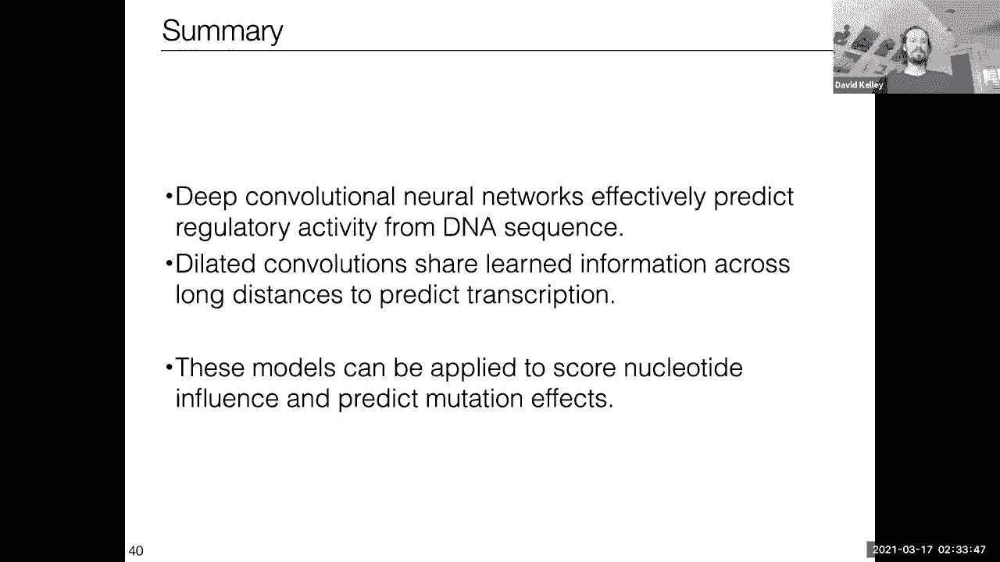

 Thank you。 [ Silence ]。

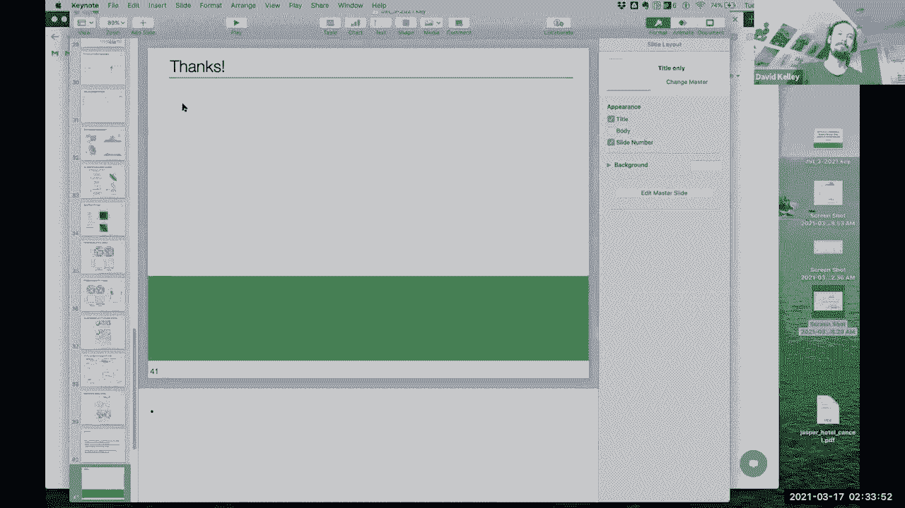