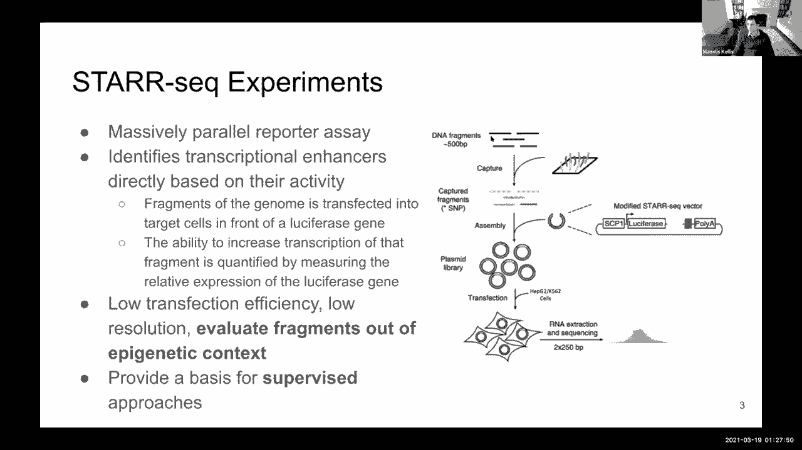
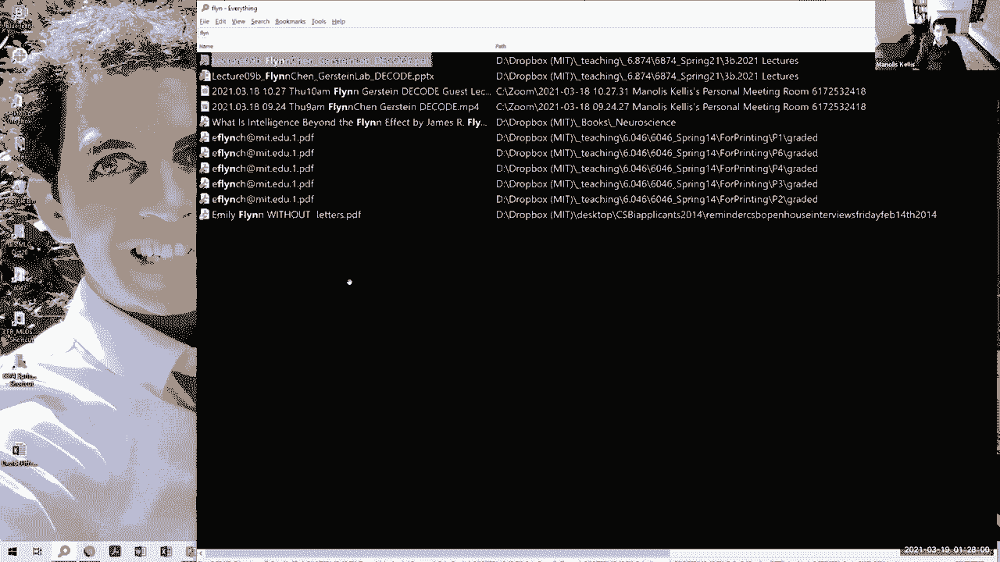
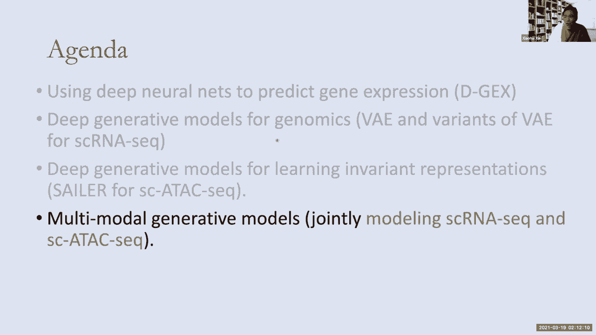
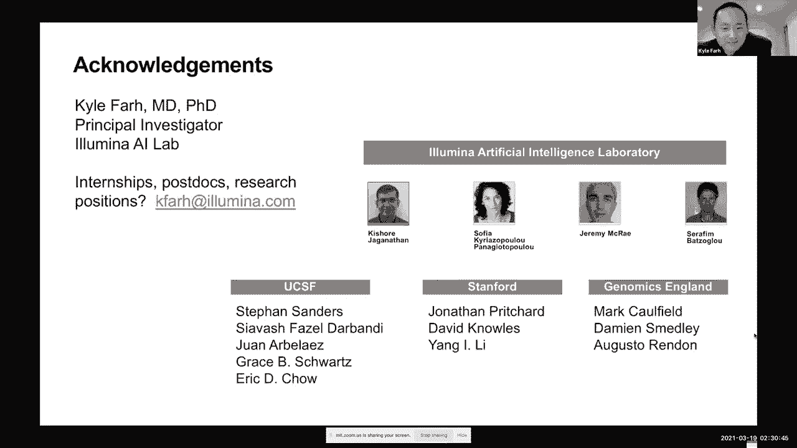

# 【双语字幕】MIT《面向生命科学的深度学习》课程(2021) by Manolis Kellis - P9：Lecture 09 - Gene Expression Prediction - 爱可可-爱生活 - BV1wV411q7RE

 Welcome everyone。 Today we're diving into predicting gene expression and slicing。

 So we are very fortunate to have three guest lecturers， Flynn Chen from our Bursings Lab at Yale。

 Professor Shai Wai-Shae from UC Irvine and then Dr。 Kyle Kai-Hau-Farr from Illumina。

 So today we're going to be briefly introducing expression analysis and supervised learning and clustering。

 which is one of the most basic things that you can actually do with gene expression analysis。

 Then we're going to talk about the challenge of up sampling expression。 How do you predict 20。

000 genes from 1，000 genes， which is the first topic that Professor Shai-Hau-Farr is going to be covering today。

 And then a very cool take on this， which is compressive sensing。

 Instead of making single gene measurements， how do we make composite measurements that encompass multiple genes simultaneously？

 Then we're going to look at how do we predict gene expression from chromatin and how do we predict reporter expression from chromatin features。

 which is what Flynn is going to be talking to us about。

 And we're going to then look at how do we predict splicing from sequence across thousands of features。

 which is also what Dr。 Kyle Kai-Hau-Farr is going to be talking to us about。 So let's dive right in。

 So up until now we've talked about the landmarks of the genome that are gene regulatory。

 basically the elements that control the genes。 And this is a little out of order because the first thing that people think about when they think about genomes is RNA expression。

 And the way that we measure RNA expression has traditionally been using hybridization。 Namely。

 you have a set of， let's say， 1000 probes for one for every gene that you care about。

 And then you go and hybridize your RNA into those probes。 How do you hybridize RNA？

 You basically first reverse transcribe it into complementary DNA or CDNA。

 And then you hybridize the CDNA against homologous sequence in each of your probes。

 effectively giving you a measurement for every gene in the genome。

 So these are the most basic building logs。 More recently， in the last 20 years or so。

 genome sequencing has become much， much cheaper than it used to be。

 So instead of first hybridizing your complementary DNA to an array and then measuring。

 you basically just simply measure directly how by effectively re-sequencing the transcriptome at every single iteration。

 So every single time you want to figure out which genes are expressed。

 you basically go through this wasteful effort of just re-sequencing the heck out of your genome。

 And this is only possible because genome sequencing costs has dramatically dropped by a factor of。

 you know， seven orders of magnitude in the last 20 years。

 So these are the two technologies and in the end， if there's a lot of tricks and methods that you can do to call transcripts。

 either the novel or to map your sequencing reads onto the known features of the DNA。

 And if you want to hear more about that， check out my fall course where we talk about RNA-seq analysis to great length。

 But for now， we'll just assume that we have the expression level for every gene。

 either through hybridization or much more frequently nowadays through RNA sequencing。

 What that gives you is effectively a matrix of activity。 So you can take all your 20。

000 measurements， put them all in one giant column of 20，000 genes for the human genome。

 And then you have a single vector of expression for every gene in the first experiment you did。

 And then you do the same thing for your second gene， sorry， for your second experiment。

 your third experiment， and so on and so forth， effectively giving you a matrix of which gene is expressed as a single vector。

 And then the first thing is expressed at what level in each of hundreds of conditions。

 And that's what gives us the expression profile of a gene。

 So that matrix can be seen either in the vertical direction or in the horizontal direction in the vertical direction basically gives you a 20。

000 long vector， one for every gene in the genome across that experimental interest。

 Or after cyrosis or brain after infarction， or you know hearts after cardiac arrest and so on so forth。

 or healthy heart， or young heart versus old heart and so on so forth。

 Or you know this particular cell type in the heart that you have sorted。

 And next Thursday we're going to talk about single cell RNA C。

 where you just don't have to short cells but you just profile every cell。

 And there are a lot of deep learning methods associated with that as well。 So。

 and that allows you to now start making comparisons across multiple dimensions。

 You can basically look at similarity of the expression vectors for a given gene across different conditions or tissues or cell types or experiments or age or gender and so forth。

 And then you can look at vertically the similarity of different conditions to each other。

 for example male versus female young versus old Alzheimer's versus control and so on so forth。 Okay。

 so let's see who's with me so far。 That's going to be the basic input matrices that we're going to be using for predicting gene expression。

 and then we're going to be complementing these with all of the matrices that we have already for the activity level of every regulatory region in the genome。

 71 24500。 Okay， so you can do all kinds of things。

 the most basic thing is don't bother with deep learning。

 The first thing you're going to do is just cluster。

 You're basically just take all of your gene by condition and then you cluster along this dimension to find similar conditions to each other。

 And then you just cluster them together you're like well。

 all of these experiments are very similar it turns out that I don't know elderly people and people with Alzheimer's。

 but are younger， look similar so maybe Alzheimer's is a component of aging or has some relationship with aging。

 And so and so forth。 So that's along this dimension clustering to novel clustering of different conditions。

 On the other dimension， you basically say well turns out that these 20 genes turn on and turn off in the same way across a bunch of different conditions and tissues。

 So maybe they have similar functions and indeed they're all involved in， I don't know。

 B cell and blood lineage and so forth。 Okay。 So who's with me on the clustering part to here you are in an unsupervised way。

 no training involved， just looking for conditions experiments that are similar to each other or genes that are experiment that are similar to each other across the columns。

 or across the rows。 Okay， so let's do a quick poll here is to who's with me。 Lovely。 So again。

 this is the very basic building law， and this is completely unsupervised learning。 So。

 so 67 33 0 0 0。 On the other dimension on the other side。

 you could basically look at classification， you could basically say well。

 I already know a bunch of genes that are associated with， I don't know。

 T cell function or proliferation and so so forth。 So， instead of clustering the genes， the novel。

 what I'm going to say is， can I look for additional genes that have proliferation like signatures。

 so that I can complete the annotation of some previously unknown data genes。

 based on the similarity of expression。 So this is the guilt by association。

 if you turn on and turn off with that gene chances are with this group of genes。

 chances are that you probably a similar function。 Okay。

 so on one hand we have clustering which is completely unsupervised。

 On the other hand we have classification。 But again。

 what have we seen throughout these lectures the fact that you can play games and sort of change things around and sort of build representations of your expression patterns。

 using latent representations with perhaps sometimes dummy tasks。 So。

 I want you all to look at this matrix and say， Oh， what could I do。 I could， for example。

 erase this part， and use unsupervised learning in a self supervised framework to impute the missing data。

 By sort of having massive training sets where I have taken out parts of my transcriptome。

 and then I tried to re-predict them。 And that will force the system to learn latent representations of your gene expression pattern and so on so forth。

 Or you could basically say， well， hey， instead of looking at correlation。

 I'm going to use a deep learning approach to predict proliferation。

 So I'm going to use all kinds of additional non-linearities and higher order features to learn about the proliferation class。

 I'm going to use a multitask learning to try to predict all of those classes jointly using this input。

 Okay， who sort of with me has to all of these really cool things that I can start now doing using the framework that we have already seen。

 and the gene expression vectors combine， perhaps with all of the crumbed vectors。

 So that's why we're having all these lectures because you now have a set of tools。

 So 6729 500 you now have a set of tools that you can use to go out and ask biological questions。

 and then we'll see what are the representations of these systems。 And again。

 I don't want you to think that deep learning is the only approach you can use principal component analysis to basically look at what are the principal dimensions of variation。

 basically effectively shearing rotating scaling your space of， the field。

 and then we're going to learn the major dimensions of variation。

 and then perhaps projecting my vector of dimensionality from the gene vector to a meta gene vector。

 and from the condition vector to a meta condition vector。

 and that will basically tell you how perhaps every pathway acts。

 and the membership probability of each gene in that pathway。

 and how major diseases function and the membership probability of each condition in。

 that experiment in a disease condition。 Okay。 So that's， you know， dimensionality reduction。

 and you can do that with， you know， PCA， you can also do low rank approximations of your matrices using these。

 you know， singular value decomposition approach of keeping only a subset of your singular values。

 and then zeroing out the remaining ones， which effectively gives you， a probably， you know， optimal。

 lower rank approximation， assuming a particular distribution of your model。 And then， you know。

 applying PCA on the MNIST digits gives you this。 And then there are other approaches， for example。

 Tissney gives you a different type of embedding of the two dimensional space that allows you to represent these classes are as much more separable from each other by effectively learning a。

 more dimensional space that maximally separates the features from each other。

 And we're going to talk a lot more about Tissney at the single cell lecture next week。

 And you can also use on to encoder you can basically say。

 I can compress my expression matrix to a lower dimensional representation。

 and then can then expand it back out to a higher dimensional representation。

 effectively using self supervised learning through a bottleneck of forcing a lower dimensional representation the same way that we saw for images earlier。

 And this is some of the key ideas that we're going to be talking about today。

 we're going to be talking about up sampling， for example， how do you predict 20。

000 genes from a subset of genes。 So in deep learning for image analysis。

 we've basically seen how you can in fact learn representations of the world in high dimension。

 And then take train use self supervised training to basically take higher resolution images。

 subsample them， and then use this as the X and that as the Y and then predict the up sampled image effectively learning how to up sample images and also as a by product learning representations of the world。

 And you can do the same thing with， you know， subsets of measurements in， you know， genomic space。

 You can build these deep learning architectures for up sampling images by， you know。

 up sampling at different places in the city。 And then you're going to hear about one such architecture from share with you。

 which is going to be giving the second guest lecture today。

 You can also think about sort of a very different way of doing your measurements instead of just measuring a subset of genes。

 you can actually build composite measurements using combinations of probes that together capture linear combinations of your gene expression。

 And that's known as compressive sensing。 And you can also ask about how well can I predict gene expression from chromatin information。

 If you look here at the genes that are expressed at different levels。

 what you see is that their level of the animation varies greatly。 And therefore。

 if I have the animation for these genes， maybe I don't need to measure a gene expression。

 Maybe I can just predict gene expression based on the pattern of methylation that I see across my sequence。

 And that's very exciting because for some samples are in need of grades very rapidly。

 but I can find the animation from， you know， much more， much less well preserved samples。

 And then maybe predict the expression of genes corresponding to that。

 And you can see the same kind of relationship with histone modification marks。

 If you look at genes at different quadrants of expression。

 the most highly expressed genes have much more age 3 K27 a simulation。 And the much more highly。

 lowly expressed genes have much more， you know， quietent state in their gene volume regions。

 So you can perhaps use chromatin information to start predicting gene expression levels。

 which is going to be the first guest lecture that we're going to hear today。 And then deep chrome。

 for example， is one approach for doing this by combining multiple features at different distances in order to sort of make that prediction systematic。

 And then attentive chrome uses attention mechanisms。

 similar to what we talked about for the transformer model。

 when we talked about recurrent neural networks。 Again。

 I want you guys to start thinking broadly about all this。 So again。

 we're going to have a guest lecture by Shai Wei on how do we predict expression and chromatin from these features。

 And then you will also hear about how to predict reporter expression from chromatin。

 And then this concept is that you basically can build thousands of reporter constructs simultaneously test them in very high throughput fashion。

 And then effectively infer which gene regulatory regions which test fragments。

 which candidate in regulatory regions actually drive gene expression。

 And you can now go back to the genome and say， okay， what are the coordinates of these fragments。

 Can I now use a machine learning approach or deep learning approach to use the chromatin features in the primary sequence to predict whether these fragments are going to be driving expression。

 And， you know， you will hear more about that from Flynn Chen。

 who's a member of Mark Kirsten lab at Yale。 And then the third guest lecture today is going to be about predicting splicing directly from sequence。

 The idea is the following， every single cell expresses not just a contiguous block of RNA。

 but spliced RNA， which basically mixes and max matches， exons for different teachers and cell types。

 So you can think about the inclusion or exclusion of every exon， and then use that in， you know。

 either a vision neural network， or a representation neural network or a deep learning a neural network to basically start predicting the inclusion or exclusion of individual。

 exons， and then the specific features in that sequence where these are happening。

 And we're going to have Kyle far from Illumina， who was actually previously at Harvard and my team at the Broad talk to us about deep learning for splicing prediction。

 All right， without further ado， I would like to ask if Flynn is there so Flynn take it away。

 Sounds good。 And thank you， Professor Oculus for inviting me to come talk to you guys today。

 My name is Flynn and I'm a graduate student at the Gers。

 for what a weekly supervised framework for precise enhancer localization。 And with this title。

 I sort of want to give you a little bit of intuition on what is weekly supervised learning。

 And my goal for the presentation today is to sort of present to you how we operationalize the task of。

 the answer discovery into this weekly supervised framework。

 So here is the link to our most recent manuscript if you are interested。

 So to give you a little bit of introduction enhancers are regulatory elements that increase the transcription of a gene。

 And it's important to map out these elements because there are potential genetic drivers the diseases。

 and earliest methods have focused on unsupervised approaches like Chrome HMM because of the lack of supervised data。

 But with recent advances in experimental techniques like a professor， mentioned the NPRAs。

 we can massively probe enhancers and obtain a large label data set and we can start switching from this unsupervised paradigm into a paradise supervised paradigm。

 And so， specifically， there is a type of， massively parallel reporter assay called STAR-seq。

 And what this assay does is for a cell line of interest， for example。

 if you have the genome of that cell lining and you fractionate that into 500 base pairs of fragments。

 and you insert that in front of the Lucifer's gene in this plasma， vector。

 and you transfect that vector into back into the cell line of interest。

 And if that fragment is an enhancer， then you would see correspondingly an increase in transcription of the Lucifer's gene which is detected by mRNA expression。

 And so using this method you can probe for every single fragment in the human genome whether if it's likely to be an enhancer or not using a very high thorough。

 profession。 But there are some shortcomings to the experiment。 For example。

 each of these fragments are evaluated outside of the its original epigenetic context。

 What that means is that the ability for the， gene to have a fling， we seem to have lost you。 Oops。

 I guess it's connection problems。 I do have these slides。 So what a nice start sharing。 And then。

 the key concept here is that we can basically systematically measure the reporter activity for every segment in the genome。

 and then ask based on how much expression every segment drives。

 can we start predicting the amount of expression it will drive。

 based on the corresponding chromatin features that were at that segment at the time。

 So the way that fling set this up is by looking at five-dertion cell types where STAR-seq， these。

 reporter experiment was available and then ask for each of them。

 can I predict the STAR-seq result using a set of features that we've already talked about in the class。

 And these features are DNA accessibility， measure through a taxi or DNA's。

 system modification patterns using chromatin immunoprecipitation with sequencing。

 which include acetylation of K27 of histone E3， K4 trimethylation。

 These are marks of enhancers of promoters of enhancers and of promoters。 And， you know。

 not exactly because， I mean， not exclusively， because there's also a lot of overlap。 So his idea is。

 can we now use all of these as features， to predict STAR-seq expression。

 The way that they set this up is by constructing this input matrix of all of these different marks across thousands of locations in the genome。

 one for every gene， and then asking what are the nearby features。

 the nearby chromatin feature that allow us to now start predicting this systematically。

 And the output level was simply， whether something was found to be indeed active as an enhancer in the STAR-seq experiment。

 or whether it was not found， so it's a binary classifier in the end。 So that's the first part。

 and that's what everybody would have done。 But what's really cool and neat here is that they then said。

 can I now， from these intermediate representations。

 go back and start predicting where in the genome sequence is that particular element。 And Flynn。

 whenever you're back， take over。 Yeah， I think my internet is a little bit unstable when I'm sharing and having this network connection。

 What do I give you control of my slides， and then you can control my pointers instead？ Yeah。

 perfect。 That's awesome。 Yeah。 Let's see。 Yep， I think。 See。 Yeah， so basically， as Professor said。

 that we have this convolutional neural network that could predict whether if there are， let's see。

 Yeah， so we can predict with a binary classification of whether if there are enhancers in this region or not。

 But with a positive prediction， what we， in addition。

 we can do is we can take that the gradient of the positive forward pass。

 and use this specific method called GradCam， which is called gradient weighted class activation mapping。

 And we can back propagate that gradient to specific layers in our network that generates these features。

 justifications， as well as， basically a important score。

 highlighting which area in the input is most important in making the decision for our model。

 And we can take that subset of that input and redefine that as basically a core enhancer region that is much more higher resolution and then compact compared to the original original input。

 which is a four kilobyte window。 For everybody on the zoom code here。

 I really wanted to think about not just this particular example。

 but this is a more general principle of basically going back and fitting particular curves in these continuous continuous。

 continuous signals to then have a higher order representation。 For example， if you're thinking。

 where is the cat in the picture， you could just say， Oh， what lit up as a cat。

 or you can take a shape of a cat and then projected back， and then ask where is that lighting up。

 So that's what Flynn is doing here he's basically going back and reinterpreting this by taking various shapes。

 and then projecting them back through that convolutional network， continuous。 Right。

 Let's see if I can， to the next slide。 See。 There's a little bit of a delay in your network so don't don't scroll multiple times。

 I'm just going to scroll， and then I will scroll。 Okay， are we on a slide six， let's see。 Yes。

 we're on slide six。 Okay， cool。 All right， so， yes， so。

 as you can see when we pass on the original image into through a convolutional filter it generates an activation map。

 and each convolutional filter learns the most important features and making an active prediction。

 And therefore， the activation map produced by that convolutional map will highlight that particular feature that was trained。

 and a linear combination of these activation maps by multiple convolutional filters in a particular layer。

 actually produces a heat map of what you would see in an image， here， image I。

 that highlights basically where the dog is in the image。

 and essentially this is the idea of weekly supervised learning。

 where we did not provide any location information to this model。

 unlike object or semantic segmentation。 We only had a label of whether if it contained a dog or not。

 and we are able to infer that location information， and we aim to do that for enhancers as well。

 where we only have a course annotations of whether it enhancers exist。 And。

 and we want to figure out the precise location of where enhancers are using using the same method here by doing a second pass。

 And that's the intuition behind our， our object detection method。 And so。

 we're going to slide seven now。 Yeah， let's see。 Yeah。

 so this is the result for our cross outline and cross chromosome validation。

 We show that given the input features the chromatin accessibility and the histone marks were able to make accurate predictions on whether if this is a star seek。

 or an enhancer。 By cross outline validation we show that we can generalize the new cell lines and cross chromosome validation indicate that we can generalize the new genomic loci。

 And here are some of the example predictions and the positive predictions。

 you see that there is a lot of epigenetic activity going on and in the negative regions。

 There is almost no activity。 And then we benchmarked our model with the state of the art matched filter model that uses a shape matching filter and a linear SVM for classification on this encode enhancer challenge data set。

 And we show that we're able to outperform the previous state of the art model in almost every tissue type with some even with 10 15 to 20% margin。

 And so we performed the case study in neuro progenitor cells hoping to discover neuro specific enhancers。

 And we see the feature justification here that we focus on DNAs and 3K27 AC and 3K4 ME3 these strong active。

 marks and these these marks interact and form this higher level feature on the right。

 And we're able to use this higher level feature to basically say we're going to shave off these regions that are not relevant when we're when our model is making a prediction and obtain a refined and higher resolution set。

 So here we have the 4KV window original prediction set and the and the and the refined refined set。

 And you can see in our statistics here that our refined set has 13% of the coverage as the original set but account for a higher number proportion of transcriptional。

 sites through phylogenetic conservation analysis we show that the refined set is also more conserved in 100 different species。

 And we also evaluated interest species conservation with the rare SNPs because if a certain region is more conserved in interest species it will have more rare SNPs due to negative selection and we also show that our refined regions through our。

 GRAD CAM method is more enriched in in trust species wise。

 So we really have to run to talk so thank so much for a wonderful presentation。

 Everybody please give Flynn。 Big， big thank you。 Yeah， thank you。 Yeah。

 we I see that you're already here。 Do you want to share your screen。 Hey， good morning。

 So she always pays a professor at UC Irvine and he's also an alum from MIT in the road so we're very fortunate to have him back and someone that has truly done so much work in sort of deep learning machine learning and。

 you know， just general， AI research so she always take it away。 Thank you。 Good morning。 Oh。

 not good morning。 Good morning。 Good afternoon everyone。 So they have。

 So they're taking my knowledge of inviting me to be here so that let me share the screen for us。

 As the beauty of zoom the fact that you can have friends from all over the world。 That's right。

 So that's actually very convenient。 And see。 Okay， see my screen。 It works very well。

 And we can also see your pointer so you can guide us through the slides as well。 Yeah， oh。

 wonderful。 Great。 Yeah。 So， and thank you for inviting me to be here。 So it's a。

 it's been a long time and not been back to the MIT for quite a bit， quite many years。

 So that's what I'm going to be here。 I said， I'd like to come here to share some of the work we have been doing in this area with you guys。

 That's exciting。 So today， so I'm going to talk primarily on the deep learning applications on the gene expression。

 I'm sharing for some reason we only see your original screen。 We don't see the projection。

 So I don't know if you shared it just one application rather than sharing your screen。 Oh。

 let me see。 So you only see， yeah， so sharing your whole screen rather than just the application because when you project。

 it effectively becomes a new application。 Okay， sharing her screen。 Okay。 Exactly。 So。

 I think the reason because when I do。 Oh， there's。 Wonderful。 All right， it is better。 Yes。

 now it's better。 So this is a full screen here。 Okay。 Yeah， so the， so let's go back here。

 So today I'm going to talk about the applications， the deep learning on the。

 on the primarily on the G expression part of that。 Of course。

 this is course is dead can apply deep learning to the to biology and medicine primarily genomics。

 And you already learned from a notice that we have lots of this biological data emerged recently due to high throughput sequencing technologies。

 So， so there， so the， and I believe you already talked about the RNA sick and they even talked about the ATAC sick and also single cell genomics as well。

 So， as you can see， what you have here is a very large scale， this type of genomic data sets。 So。

 of course， people， biology， you need time method here to kind of visualize。

 kind of integrate interpret this type of data sets for biological discoveries。 So then， so， so it's。

 so it's， so it's， however， a lot of challenges for in terms of data set。 And so。

 I think that this data is， is a high dimensional， many times is very noisy。

 And how do you kind of extract signals from those high dimensional noisy data sets here。

 It's always a challenging for， for many of you have for， for us as well in terms of developing。

 how to do that。 And especially for the single cell genomics data set。

 there are a lot of this kind of cause a sparse amissing data set kind of a hidden within this type of technology。

 So that， so this particularly kind of important for developing methodology that taking those type of factors into account。

 So that， so the， the research in， so in my lab here we over the years。

 I started with my career with the work with the monolism when I was at the Broad Institute many years ago。

 So， so then， so then this is helping faculty at the UC Irvine here so we have still continue to develop methodology for study。

 kind of the field of the genomics。 And， and， and so I'm pretty interested in how to develop method try to combine kind of multi modality genomics data sets。

 And as you heard from a knowledge learn from a knowledge that nowadays we have so many different type of techniques and high throughput method have been developed over the years。

 And so the ones， the other one most familiar with this kind of RNA sick。

 a tax sick DNA sick but now there are so many newer type technology I don't even be able to keep track of the methodology and kind of。

 and then at least some of them here。 So certainly。

 it's going to be very useful how do we develop methodology that able to combine those type of multi modality data sets。

 allow us to look at the underlying biology from the combined issues data sets so that's something I kind of keep up key interest in this direction。

 So then， of course， there are also recent methodology people have been proposing in the machine learning field that combine kind of multi modality data try to understand the system better so that one of the kind of the hallmark applications is how to combine kind of visual signals computer vision with a。

 with a natural language processing， and I hope hopefully combine them together can help us learning the systems better so they're。

 you know， this is a kind of interesting research area as well。

 just in the field of the machine learning。 So then， so they over the years。

 so the my lab at the UC around here we have developed， you know。

 few tools for the using deep primarily deep learning methodology for for study for in online genomics data sets here。

 So， so I list a few of them here so I will not be able to go over all of them。 I just。

 maybe I just spend one minute quickly go over you each one of the methodology what they are doing and if you're interested。

 And then， of course you're welcome to ask me in this top here or just go directly to some of the。

 some of the GitHub here check them out。 So there's a， so the first tool is this that kind of Dan Q。

 So this is a deep deep learning methodology for kind of quantifying the function of the DNA sequences。

 I'm sure you learn from the minority that human genome on a small fractions and then are actually coded majority of them are non coding sequences。

 So they over the years people are very interesting。

 interesting identify the functions of the so called non coding sequences。

 We have experimental techniques in terms of read out signals from those regions。

 but in general it's pretty hard to pinpoint on the function at individual base levels。

 And so this is also relevant for the for the disease studies because many of these genetic variants are discovered within those non coding regions。

 So that， and people want to know what potential function what type of variants are functional what type function may not be functional。

 And then the other tool was developed， tried to kind of give some ideas in terms of functionality of the individual various and whether they are functional or not。

 what can we say about them。 So that's the tool is called Dan Q developed quite early stage。

 And the next tool is called a D。 So this is a tool that we developed for gene expression analysis。

 So， so I'm going to spend time to talk about this one today because there's a manel is asking me to talk about this one。

 So this one here we divide neural nets here to predict gene expressions。 And so that was developed。

 So that we're going to spend some time talk about this one's here。 And then you can go。

 you can go really fast on the JX and then spend more time on sailor that's fine。

 And then the third way is this a factor that so this is the one where trying to predict kind of a transcription factor binding in the genome wide and fashions。

 And over the years people have done a lot of this type of so called a kind of chip seek analysis。

 And those analysis is able to identify transcription factor binding in a genome wide fashion through experimental procedures。

 And we're interested in utilizing those type of largest data set whether we can。

 and came out with a model that can predict kind of transcription factor binding in cell types。

 specifically fashions。 And I'm sure you you you heard about that because this is a while this type of knowledge of the kind of early applications of the deep learning in genomics。

 So the idea is that previously we model the DNA sequence of primarily through this so。

 position weight matrices。 And， and， and people realize that we can also use this convolutional operations to model the DNA binding。

 It seems like pretty effective。 So this is a work here is work along this type of lines。

 And I'm sure if you have not heard about that I'm sure I'm not sure we'll talk about this part。

 So then the， the next part of works called SC fan。 And this is kind of extensions of the factor net。

 So in which we try to come up with a model that can predict transcription factor binding in single cells。

 because because in single cells it's very hard to kind of carry out those type of a chip sick experiment because limitation material so far。

 And so， so however people are interested in whether we can have understanding of individual transcription factor binding in single cells so we。

 we， we develop some methodology for that purpose。 And then the next one is， is called a U fold。

 And this is the one for the， for the RMS structure， secondary structure predictions that they have。

 And we found that applying some of the techniques can be。

 can be can be pretty effective in terms of predicting the secondary structure of the RMS as well。

 So， and the next final one， I will talk about in today's lecture is， is called a sailor。

 So this is a methodology we just recently developed for utilizing deep generative models for studying single cell。

 a taxi， datasets， and primarily folks on the so-called the ideas of the invariant representation learning。

 And so I'd like to learn a paper representation that is kind of reflect the underlying biological properties themselves。

 instead of the experimental artifacts so that so we can spend time talking about this methodology here。

 And of course， all the tools we develop our business arts and we're going to put it out here actually want to check out。

 All right， so the， so today's agenda here so first I'm going to talk about this DGX this models here so this one we're going to use deep neural net to predict。

 gene expression so that's it's pretty straightforward applications of deep neural net。

 I should be able to go over that pretty quickly。 And the next I'm going to give a little bit overview on the on the generative generative models for the genomic side of that especially folks on this variation of auto encoder time as a model VA model so you learn that from the。

 knowledge a few lectures now， and here you will see how people apply the VA is to study genomics。

 and in particular for the RNA expression data sets。

 And then the next I will do kind of one talk about the one extensions of the deep generative models to for the a taxi analysis。

 In this case here we think about how do we remove the kind of experimental confounding factors from the data sets。

 and allow us to learn a new merit representation representation reflect the biological properties in state of experimental artifacts。

 And then， and this is a new ideas， and relate to the deep generative model like to introduce this part in the third part of that。

 And just to probably quickly mention how do we want to be the idea how do we combine this multi modality data set。

 Cameron with a model to learn a representation that can share across different types of data set。

 So that would be the last part， hopefully I can go over them in the in today's lectures here。

 We only have 12 minutes left so I would really speed up the DGX。 Okay。

 so I keep my clock here and make sure I finish your time here。 Okay。

 so the next one is first of all talk about the GX pressure effort and I will go that pretty quickly I'm sure all of you in the。

 and I'm going to share this part here。 So this is a part of was， was a。

 as a work done few years ago。 And then the main ideas actually collaboration with a few folks here at the Broad so they especially are in Subramanian。

 I'm familiar with that he is still at Broad。 So this is a related to a project that was done quite many years ago when I was at the Broad。

 you know， way back in 2007。 So the idea was originally ideas called a connectivity map project。

 And so they， so they， so people realize that we have this。

 we can quantify the profiles of the cells in terms of the based on the perturbations based on perturbations。

 There are many different types of perturbations， right。

 they could perturbation can be reflected in different cellular types， or can be reflected。

 in the cell that apply drugs to the cells and the cellular state will change。 And so。

 so there are many different types of agents you can apply to the cells。

 and then the cell state will change。 So the primary goal of the connectivity map project is trying to provide a comprehensive characterizations of the cellular state in terms of the expression matters。

 Right。 So， of course， we can characterize cellular state in terms of epigenetic modifications as well。

 And so， usually the C map project is trying to characterize state in terms of the area expression matters。

 So there， so the 2006 and then they provide this pilot in the data set， they're able to profile。

 you know， the expressions of Jesus in the cell lines through many different， perturbations。

 parameters through small molecules， some drugs and so on。

 So that was a very large scale data set at that time。

 And the idea is the idea that the author or really has that maybe you can provide type of a search engine type of idea。

 Once you have this data set in place， and what you can do that once you have a profile。

 you've done some G expression analysis， you can use them as a query and then。

 and then you can do pattern match cross this database。

 When he tells you how this particular perturbation is related to the ones in the database。

 that immediately provide the link potential link here between your small molecules。

 and maybe the expression perturbation due to disease due to other agents perturbation。 So。

 build this type of links between those type of profiles。

 So that would be very helpful for understanding both biologic process。

 even for drug discovery through this type of methodology。 So that was the original idea。

 and then people are very excited by this， they want to kind of extend from this relatively kind of high and small scale data set to much larger ones。

 And however， you know， you know， you know， to do a larger ones and they will think about how to scale up of course。

 and the cost is a concern。 And then that time they propose these ideas that maybe we can generate profile of the G's not cross all G's。

 maybe based on small subset of G's。 And by doing that we can generate profiles quickly and much cheaper costs。

 And so that's the original ideas of that so they propose a technology platform。 And then。

 and the based on this 1000 G solution， in this case， we only profile 1000 G's instead of a 20。

000 G's cross the entire genome。 And so the idea is that because the expression of the G's are highly correlated with each others。

 And then it might be that by profiling this 1000 G's you will be able to。

 you for the remaining the all rest of the G's。 And that's the main ideas behind that。

 So how do you know this is true because you can take out the existing G expressions。

 and do a simple dimension reduction。 And you see how many kind of a principle component。

 That can be used to explain the variance， you observe within the data sets at that time was very surprising。

 and then the last saying that probably with only 100 to 200 gene that can explain 80 to 90% of the total variance。

 And then you can also see the data set in those inherent data sets here。

 So the answer that was shocking because it's saying that you only have this few hundred of factors can explain the entire universe to expression。

 So that I wasn't surprised by that。 But but but this motivated them for developing this methodology to pick up those。

 you know， those 1000 so called land margins。 And then the technology platform called Lumine X beat。

 and then they can profile the expression。 And then the game。

 So by doing that they can kind of doing this in a very high。

 so we can generate profiles with millions of samples。

 So that's how they did I believe the project was still ongoing later on was involved in something called a links program。

 And then they are able to generate millions of profiles with those 1000 G's I believe they still expanding。

 So it's very large， you use for research if you want to look at this part of that。 So， however。

 and what we， we initially we worked on the problem what do we want to know in this。

 and we're interested in so okay now we have this landmark G small number of them only 978 of them。

 And so， we can see whether we can infer the remaining 20，000 years。

 using some computational techniques。 So that's the purpose of that。

 And we know that we shouldn't be able to based on this type of simple dimension reduction analysis that we should be able to do with that reason。

 and how we want to do it kind of kind of accurately improve the precision that creates that。

 So that's at that time， so the neural nets is， you know， it's not。

 it's not very widely used in this type of in genomics and then we took。

 we started this approach is to do that。 And it's pretty straightforward right so what we do here。

 we input here will be kind of 978 dimensional vectors here go through a several layers multi layer perceptions feed for neural nets。

 and I'm going to predict those 20，000 and target G is being a multi task fashion jointly。

 And then we train them through back propagation so that's kind of pretty straightforward idea。

 So at that time it's a harder to implement because there's no pie towards no cancer flow as you're committed today。

 So that， but the other question is how do we train this model so that we train this model here we lose it。

 get data from the geo so geo data set does contain the expression profile with the entire collection of the G。

 And we're either FM matrix array in the old time and then later on with most of the data came from the RNA sick they type that。

 So we changed it， change this models with this collections in the geo data set and then we say， say。

 how well we can do based on this one， roughly 1000 landmark genes predict remain easy to get。

 And it turned out doing pretty well at that time the baseline performance is based on linear regression so it's kind of very easy benchmark to beat。

 And by utilizing those type of neural nets we can do much better than those are simple kind of linear regression models here so this is a kind of overall error rate here you can see the regression as here。

 Now if you change different type of architecture the nor not with how many by choosing different hitting units here。

 and how many layers of the unit and you can see that the model doesn't improve when the system becomes more complex。

 and can fit the model。 So I really really short on time so I really want to have enough time for the other parts。

 So don't。 Okay， I think I'm okay I'm actually on time with this part。 So I'm pretty quick。 Yeah。

 so this is the basic idea I think I think it's pretty straightforward。 I think you， you。

 and then that's that's the initial application of this party。 So I'll skip this part here。

 So the next time we talk about this party here this and this and later on people think about how to utilize this deep generative models for genomics。

 So that this is more or less related to the variation already could remotely talk about。

 But the first method I talked about here is kind of a very rare application of the gene expression analysis based on the neural net。

 However， most of the time， as you know for the genomics data set we do not have labels right most of the time we only have the input and x without the y。

 So in this case here this type of unsupervised learning is sometimes more relevant for the genomics data sets。

 So， so for this reason here this deep generative models has been kind of like。

 why did you use for studying genomics here so I think it's really。

 so underlined so called the metaphor the hypothesis so the idea is that so we have this kind of a high dimensional data set。

 It's pretty in a very complex high noise and most of time it's difficult to identify underlying patterns by direct look into the high dimensional data set。

 And maybe if we can't able to map those high dimensional data sets here into a kind of low dimensional embed nor manifold of that。

 And the way I study those signals within the low dimension embeds that that might be more helpful for us to understand this by much。

 So that's kind of main ideas in that。 And the question is how do we do this。 So they， so they。

 of course we have the lot of this kind of a traditional dimension reduction methodology。

 Later on within the field of the deep learning so method the primarily is based on these ideas the auto encoder ideas so that I'm sure you heard me learned from my notice。

 So the big idea is this you have your data sets here x here you put it here go through layers of the computation。

 And then we represent them using a later representation here。

 And then this later representation later on so this was sometimes kind of encoding part of the models。

 And then we can， once we have identified a representation of the input here， maybe we can， and now。

 recover those input here through this later representation。

 And this is a type of kind of traditional auto encoder type is the model here。

 And then you can try this on the encoder by mapping that the。

 by make sure that the output here matched the input here so that's traditional order you could a time model。

 And however this already heard a lot of you have few issues here right so there。

 so there's no constraints on the representations of this later representation that can be。

 can be any type of distributions。 And then this time。

 model tend to susceptible to overfitting a few other issues。

 and also you cannot generate samples based on the traditional order encoder types model。

 So that is the reason people proposed this type of those type of ideas based on this deep generative model so this is kind of deep general is a has a long tradition in the field of machine learning。

 And so the idea that how do we model data through through type of probabilistic models。

 So in the case of the later update if we believe that those days that's here have a simpler kind of later representation。

 we may write down that's probability distribution。

 is through a generative models here so in this case here we can assume those little variables on z variables here so these are the。

 So these are suppose you have data given for data x here。

 and then the true underlying representation is through kind of less complex lower dimensional z variables here so that's the label variables here。

 When the model the distribution is the x given z with certain parameters。 And then。

 and then we're going to assign some prior to the distribution z here， and in the end model。

 it's by doing that we can kind of marginalize over z to obtain the， the marginal distributions of x。

 And then we have a very generic framework for， for the data representation of a generative models here。

 So in this case here you have some parameter theta here tells you how do you model the conditional distributions of the x given。

 And the idea and then we learn those parameters based on the given data sets here。

 And then most of the time we learned that by construct a loss function based on the log likelihood。

 or particular negative log， negative log， and take a long and then try to optimize， the parameter。

 So， however， this is kind of very generic framework here。

 And however people realize it's kind of very difficult to learn those theta here based on this model because you know to calculate the margin is vision you have to do this integrations here marginalize over the。

 in our distributions of z。 So that most of time is intractable。 It's very hard to do this problem。

 So that is really the people propose some of the most of them proposes an approximate inference methodology to solve this problem。

 So the most popular lines based on this called a variation of inference。 So in this case。

 so we're going to propose some auxiliary distribution on the distributions of z given the x here。

 And then I was modeled through this a cue distribution here。

 So this is more of the distribution z given the x here。

 through some just through some some some some parametrical forms here。

 And then we're going to try to， we can show that there's a lot of likelihood here here is a bounded by this lower bond here。

 So this lower body is interesting you learned from below this right so this， this is the。

 The first term is this data term how likely is the observation the local light of the data。

 But instead of marginalized over the Martin distribution z and now marginalized over the kind of proposed distribution z given this x here so this your proposal。

 That's called auxiliary distribution。 And then at the same time you want to minimize the。

 the kale diff distance between those distribution and your prior distribution so the idea that you want to ensure that your posterior distribution here is close to your prior distribution sufficiently close。

 Of course， the always the balance between these two terms of that， when you try to maximize this。

 you want to minimize the deal， the kale diverges， which is。

 which means that you want to make sure that your proposal distribution is similar to the prior distribution。

 And at the same time you want to make sure you have sufficient power to model the distribution of the observed data sets here。

 And then so， so， and then so that's the general ideas of a kind of overall generative models。

 So in the field and then in the field of this kind of variation or you order。

 what are people proposed that I can model this， both this conditional probability p theta x given z。

 and also the auxiliary distribution through neural nets。 So that's the main idea behind that。

 So that came out with this idea of so called encoder part and all the decoder part so decoder part is simply model the probability distributions and x given the later representation here so this part of that。

 And the decoder part try to propose kind of a good proximate distribution of the later representation given the x part of that。

 So the， and then so， is a parameterized by parameters， the theta and the phi here will be the。

 the width of the neural nets in this framework。 And then。

 and then we can try them to simply by minimizing those those variation of this。

 this negative law of life would minimize them。 And that turns out to be very kind of very efficient you can try them very quickly through this。

 So it's a traditional， you know， deep learning training framework was proposed in 2013 by Kima and Williams。

 So， you know， however， in general， this framework， we still have some issues in particular。

 because calculate those expectations is still a little bit different。

 And then the expectations is still not easy。 And then the one of the main ideas that you can use so called a repairmerization trick here in such a way that when you sample those later representation is easier to calculate。

 And then the main idea that in this case here is particularly if you're soon your prior on this later representation is a Gaussian prior if you make that assumption。

 So Gaussian price very strong prior saying that you have this。

 suppose you have a K late in the variables， you assume they are independent of each other。

 each one of them falls in the simple normal distribution。 So in that case。

 you can kind of sample those distribution with the here is very easy to throw through by just learning the mean and the various of this conditional institution instead of learning hard distribution is that I just learning the mean and the。

 and the covariance of this linear representation。 We have another guest lecturer Kyle who has been patiently waiting。

 And unfortunately we're really out of time so I don't know if you can do something about this。 Okay。

 so what time do I have， what's the 14 minutes ago I told you that he had 12 minutes left which was already six minutes over what we had planned。

 Oh， sorry， sorry but it's so so I thought I will 1130 no。 Sorry why， I thought I have time to 230。

 No， when I told you 12 minutes it was 14 minutes ago I'm sorry to be so difficult it's just that we have another guest lecturer who's waiting in line。

 Okay， sorry let me give me a five minutes let me read that is that okay five minutes yeah five minutes yeah so so this is a so this overall this variation already quarter model of course you learned from。

 you know， notice I'll skip that part of that。 So they are so people apply this。

 there is a kind of variation already quarter models here to the， to the。

 to the person RNA RNA expression analysis of that so they're over the years as the many models to be proposed here。

 So they wasn't what are the main ideas here so the main idea is that we need we like to capture the。

 the， because we're， we're modern the gender to model for the RNA sickness that's here so the main idea that how do we kind of capture the characteristics of the。

 RNA sickness。 So the most of the time， because I think that is that is kind of a discrete is kind of a quantity is a discrete is not a continuous。

 continuous numbers of that。 So that in this field here people typically use something about a zero inflated negative binomial distribution to model the distribution read column the RNA sickness that's that so that so that so that so that。

 so that， so that you can think about this kind of how。

 you produce integers based on probability distribution。

 So that's what has been very useful this is kind of a model here initial proposing DC a framework here。

 And so many ideas that you still use all the included here but then use the final part is not based on reality models but based on the zero inflated negative binomial so I'll skip that there for your primary to do that so that's kind of may application most of the。

 the deep journey model is applying this type of， you know。

 variational encoder combined with the zero inflated negative binomial models and then you can learn that from the end to end the fashion。

 So there's this work here kind of S cbi I really mentioned that the authors of the work will come here talk about it so you don't get an opportunity to learn more about this。

 So they have a quickly go over the last part of that， come a minute。 So they。

 so the idea of the ideas but this type of journey model is that so the we learned this later representations。

 So the， let me see。 So we have the given the input here。

 So we learned this later representation here。 And however。

 we realized that those later representation here most time can reflect a lot of those experimental artifact through which we generate this data sets here。

 So in particular， for many of the genomic data sets here。

 So there are two major confounding factors here one is so called a batch effect so in how the experiments were done in different patches of that。

 And also， in terms of that in this RNA sick or RNA all a tech there sets here in terms of coverage of the。

 reads。 And that can be have a significant impact on the representation of the if you do not come up for them。

 And then you view and then you look at this later representation you see the learner of the primarily impact by those type of confounding factors。

 So in this year's so we're interested in how do we remove the confining factors such that we learned the recommendation only reflect the。

 the underlying biological properties cells instead of those experimental artifacts。

 And so we can see， can we use the idea is that maybe we can learn those deep generative models here through a conditional generative model。

 So the idea that we're not only generating data sets here based on the under representations here but also based on those conditional those。

 are those are confined factors sometimes we know what the batch effect what the coverage。 And。

 and what do we also want to know me that want to make sure that so those z and c's here are kind of independent。

 So， once I was I have to see here or make sure this later representation is completely dependency。

 And that's what we came up with framework here to learning those later until you in which case here。

 we。 So we what do we do here we do the deep generative models here but then we make sure that we want to minimize the so called a mutual information between the Z and the label representation here。

 And so， so， so overall loss function is slightly different not only one mixture would be a legitimate data well。

 but also make sure the mutual information between them is minimized。

 And it's a beautiful beautiful idea shy way wow very cool and then。

 and then I think I will wrap up here so then you have， and we have some work and then。

 and then if you would like more and then we'd be able to see more of that but I think I will wrap it here in each of some time。

 Okay。 Thank you so much for very good idea。 Kyle， can you please share your screen and get going。

 Yes， here， we big big thank you to show it yes we can hear your title， this is great。 Okay， great。

 All right， so I have about 15 minutes I'll try to take you guys to work on spice prediction。

 You guys didn't see my screen。 Great。 Yeah。 Alright。

 so I'm the principal investigator at the AI lab at Aluna。

 and our goal over the next decade is to try to understand every possible guarantee human genome。

 And this is really very daunting goal。 Right now 99% of the genome is nine coding。

 most of that we don't understand how to bear and some their work at all。

 even for the 1% that's putting 30， to 9。9% of those are going to the non significant only 0。

1% are present in databases like clean bar。 So， a little interesting， you know。

 making a genome much more interpretable is directly related to our business。

 We're very interested in making genome sequencing useful。

 not just for a small fraction of population for everybody。 So。

 our hope is that as we make the genome more interpretable。

 more and more people population will get sequence as soon as possible。

 We're also very interested in interpreting non coding variation in general。 As you know。

 right now most clinical sequencing is performed on panels or exome sequencing。

 And that completely skips the men coding genome if we're able to bring in pathogenic mutations and provide people with the tools interpret them。

 And we can imagine that we can move these markets to whole genome sequencing。

 which would be a great thing for a woman。 So this is why we're investing very hard in this area。

 And this is a spicy I sort of our first demonstration of the part of the learning networks at interpreting these non coding variants。

 So if you think about where the diagnostic yield for where disease might be。

 if you just look at sort of what are the most highly conserved nucleotides in each of them。

 So I'm not talking about all conservation， but just the ones that are very deeply conserved across the vertebrates。

 What you see is that， you know， most of the really deeply conserved sequence is actually protein coding。

 This is not true for a less conservative sequence。 But then beyond the protein coding sequence。

 you can see that it's kind of divided among， you know， UTRs。

 promoters and cancers and nearby spice regions to exomes。

 So we've essentially been investigating each of these areas with the learning to identify what are the sequence to function models for what for interpreting variation。

 So， you know， of course， the challenge for finding pathogenic communication。

 especially when coding genome is very challenging if someone looks like this。

 So it's essentially a problem which unlike vision or language， humans have no innate ability to do。

 So we believe that pretty much in a future， all interpretation is going to have to go through AI and deep learning。

 And then just for a primer on splicing itself， if you guys recall from the core values you want to want in higher organisms and vertebrates。

 exons and interrupt exons have to be spliced out of the original gene body。

 So typically the gene body is 10 to 100 times larger than the actual protein coding sequence。

 And splicing is the process like which most of us excess genetic sequences removed。

 And the primary nucleotides are the GT and the HE at the beginning and end of the entron。

 they're called the spice donor and spice acceptor。

 And those are sort of the critical elements for defining the entron， but as you can see。

 these are just like four nucleotides as specificity so it's clearly not enough to find exon entron boundaries with nuclear high level precision in a chemical gene body。

 which is usually hundreds to mega bases， of sequence。 So introducing splice here。

 so this is a deep convolutional neural network that kicks in about 10 kB of input sequence。

 And basically for entire gene body， so sequence the sequence model。

 And for every nucleotide it predicts this is a spice donor acceptor or neither so basically tries to reconstruct the entron exon pattern of the gene purely from sequence。

 And if you go into the model architecture， we have to train a few different flavors of this at 8400 2000 and 10。

000 nucleotides of sequence context is input for each output。

 So basically these are all residual blocks， this is a resnet and I think what distinguishes it from your standard resume is that for image recognition is that this is in 1D。

 And the dilated architecture is dilated convolution architecture is reminiscent of wave net。

 this from deep mind in 2016 but basically it's a way of making your convolutions expand out with every layer so that you're essentially able to cover a large amount。

 of， the， number of， populations without doing things like max pooling。

 And that's critical if you're doing sequence sequence prediction because max pooling completely screws that one to one relationship up。

 Just one of the pause for any questions。 This is great。 Thank you。 Okay， great。

 I'm answering them as we come。 Yeah， I'll try to blitz through this so that we have at least like five minutes to just ask questions and stuff so this just shows how difficult the problem is this is the CFTR gene。

 It's 188 KB for each body and you can see in black these are the exons。

 and we asked Max and scan which is sort of the previous best PWM based model。

 And then we're not the wrong with it to identify for the splice functions were out of these 188 KB and it got about 18% of them correct。

 So running green it's where it marked its guesses。

 And you know this is really not bad given that the gene bodies like 188 KB and splice motifs are incredibly degenerate。

 But our team network actually predicts all 30 of these exons with nepotized level precision。

 And the key is that it turns out beyond the splice motif itself。

 Long range sequence tournaments are key to splice regulation。 So what are some of these things。

 some of them are like the system signaling。 So although we never trained our network to do make the sounds we discovered that it also。

 learned， make the sound position because it's apparently quite important for determining exon definition。

 And then the second thing that we find is that if you look at any genome browser plots of genes you'll find that exons。

 curiously cluster together。 So it turns out that that's not by chance。

 And it appears that when you're close to the exons you the threshold for splicing is much lower than when you're trying to break a very long and so generally when you have a splice junction that interrupts the end of a long and tron。

 It needs to be a near perfect and it's motif。 But when you have， you know。

 a bunch of these clustered exons， you actually accept extremely degenerate motifs。

 So this is like another key insight that the network was able to automatically derive from sequence。

 And so you just the how the accuracy of our networks goes up is you increase these sequence context size。

 And yeah， and I just want to show that for it also works just kind of link our needs to just show that we're not overfitting purely on putting code in sequence。

 And so I just wanted to say that it uses our really no surprise。 This is the branch point。

 This is the polypermane track。 This is the AG and the GT。

 the essential difference vice nucleotides and this is sort of the extended splice site around it。

 And these are actually in chronic splicing cancers and these are。

 this is a exon exposin cancer so basically everything that has been reported literature we went and check to see if the model was actually learning it。

 And it virtually picked up everything that has been documented over like the past four decades of research into the splice determinants。

 And here's just the shown again， the impacts of in tron one and exon one。

 So what I've shown is in blue， local motif score and what I mean by local motif score is we created a splice site network that only takes in like 80 nukatides。

 And then this is the full model 10k with the type score。

 And you can see that for exons that are sort of average and length and this is the histogram of all exon。

 So it takes out around 140。 So for the average exon。

 you can see that the local network that sort of only looks at the local features。

 Things that these are actually pretty poor splice sites。

 But our 10 kb network with the long context actually thinks that the ones in the middle are sort of more most optimal。

 So essentially this exon length is one of the features that's used by the long range model is one of the things that makes exons。

 it makes by some more favorable。 And as a result， this long range context compensates for the local motif and allows the local motif to be more redundant。

 And therefore it scores more poorly on the local motif score。

 And this is essentially why the previous generation。

 period based models were completely unsuccessful at predicting splicing ex scale。 And， right。

 I talked about nuclear swim story as well。 And let's get the clinical data。

 So now we applied this to rare disease patients。 So this is a patient with early onset heart failure we got from the genomes England。

 And what we do is we take in the whole sequence of this gene and why BPC three。

 And then we flip in the single nucleotide mutation and then we predict a splice AI or the exon and from junctions are。

 And you can see that here in the mutant， it causes the exon to be extended 14 nucleotides。

 which frameships the protein。 So really if you're just off by even a single nucleotide。

 the results are usually catastrophic。 And in this case。

 this person has a early onset heart failure before the age of 40 and cardiomyopathy。

 And then we also took this model to validate on RNA C from two texts。

 So what we did here is we looked at these novel junctions that were created。 So these are。

 for example， like new exons that were created。 That were created out of nowhere in a two text data and that are present only in one person。

 And what we look for is a single mutation only in that person。

 which also had a high splice AI score。 You can see that there's a huge odd spreadsheet for those events near the creation near the ends of these new exons that were created in the on a seek data。

 And this is sort of our overall validation rate。 And you can see our validation rate on RNA C depends on our spicy score。

 But when you get to high scores it essentially is pretty similar to the validation rate for essential AG or GT gain losses。

 And you can see just the validation rate versus specific state for us versus the previous generation PWM methods。

 And I think one thing that makes interpretation of these cryptic spice variants very complicated is that not only do you sort of the weaker variance by our model validate less often but they're also much weaker in terms of the fraction of transcripts that they sort of。

 bring into accurate spice forms。 So in general what we find is that for many of these lower scoring a spice variance。

 they actually preserve a lot of normal splicing。 So in this case。

 we find that about 9% of the transcripts were have now been changed into creating this novel spice junction that skips 35 base pairs and therefore frame shifts the protein for us about 91% still use the normal spice junction。

 Now this may be slight underestimates because of things like then sensitive to decay。

 So this could be potentially as much as 30 to 50%。

 But I think this also adds into the complexity of interpreting these variants。

 compared with sort of the standard model of is it pathogenic benign。

 Now we have a much more graded interpretation of human variation。

 which I think is something that the field needs to move to anyways and accept。

 We further look at the impact of natural selection on variants that we predict to have cryptic spice function。

 So the way we do this is that we look at the exact data set of 120。

000 exomes that have been sequenced。 And we look at variants that are under common， better than 1。

1% a little frequency or singleton。 And what we see is that there's a very large odds ratio in terms of depleting common variants that have high spicy ice force。

 And see that you know this ratio is about 10 to one single tends to common variants in terms of variance which don't have any spice function。

 But when we look at variants that have predicted high spicy ice force。

 This should also be about 10 to one but this is actually depleted from maybe 1000 to about 200。

 And this depletion is actually very similar to that for protein truncating mutations。

 So essentially natural selection is showing us that these cryptic spice mutations predicted by spicy I confidently are essentially equivalent to a nonsense or friendship protein protein mutation。

 And you can see that overall this is this is a number of protein truncating mutations per individual about the weapon。

 And there's about four of them that we can add on addition to this that are due to cryptic spice mutation so it increases it by about。

 30 or 40%。 And then finally we took this to large chemical data sets。

 And what we did was we looked at the trio sequencing data for autism spectrum disorder patients and intellectual disability patients this is these are each covert of about。

 4，000 trios plus additional seven controls。 And we looked at the network patients and we predicted what are not they have cryptic spice function based on spicy and we find out the numbers with the complex device function are strongly enriched in cases versus。

 the controls。 And then we actually went and we took blood from these patients are a signal and demonstrated that we picked up exactly the aberrant spice structure that we predicted using their algorithm so these are just the on top this is the patient on bottom。

 this is a healthy control。 And you can see just the these variants causing spicing to a correct the wrong location so here it moves the Exxon over。

 So the Exxon starts too early as opposed to here。 And here's a case where it just completely skips this Exxon。

 You can see that in here there's the vast majority of reads。 Well。

 at least remember these are heterozygous。 So it's like essentially all of them on this type of like this。

 Half of the type all go and skip this Exxon versus this is where normal spice occurs。

 There's also lots of examples of novel junctions。 So this is a additional X additional in Tron that's created in the middle of the Exxon by this variant and this is a healthy control。

 And this is a matter case where the Exxon starts too early， again， causing a friendship。 Yeah。

 anyways， you have a lot of these examples。 A bunch of these are in disease genes。

 This is a case where the intranos fully retained。 So it just creates a super Exxon sort of having normal splicing。

 And yeah， and this is a clinical case where this patient had cancer and in multiple organs and this is typically caused by mutations in MEN1 but when a sequence of patients。

 they can find any protein cutting mutations。 It turns out that the pathogenic mutation is in a men coding sequence。

 It's totally a man considered no one would guess that this does anything， but actually， by series。

 completely confident that this frame ships the protein by causing the Exxon to occur too early。

 Yeah， so all of our tools are available open source。 So please go ahead and play with them。

 And just wanted to thank my team that worked on this。 And yeah。

 if you guys have any questions or you're interested in research positions internships or postdocs。

 just send me an email。 Let me know if you have any questions。 Thank you so much。

 Kyle for a wonderful presentation。 Again， we're very fortunate to be able to interact with you。 So。

 I think students who are interested in splicing and in this more general space of variant interpretation。

 would benefit greatly from interacting with you。 So we'll be in touch as projects take us that way。

 Thank you very much for doing this and thanks everybody for staying over sorry for all the technical difficulties and challenges here。

 Again， we're so， so privileged and fortunate to have three truly outstanding speakers today so thank you so much for sticking around。

 And thanks， Kyle。 Thanks to both the previous speakers。

 And I look forward to seeing you guys again soon and hopefully interacting with you on the final projects。

 Hi everyone。

 Thank you everybody。 Thank you。 Thanks to Shaiwe as well。

