# 2024年最新 MIT 6.S087 基础模型和生成式人工智能入门课程 - P1：1、MIT 6.S087 Foundation Models & Generative AI. INTRODUCTION - Moss学长 - BV114tLemEdn

很好，我很抱歉，我们稍微有点迟到，但是让我们开始吧，所以欢迎来到系列讲座的第一堂课，这门讲座的名字是'人工智能基础模型的未来'，生成式人工智能，这是我们第二次举办这门课程，所以我开始研究这门课程。

在TDP最近的热潮和突破之前，我真的感觉我们开始在社区中看到了一种新的方式来看待人工智能，那真的要改变一切，而且我认为我们现在已经开始看到这一点，而且真的，我在这次讲座系列中想要实现的目标。

是给你理解现在为什么会发生这一切，这种视角转变的本质是什么，而且不仅仅是冰山表面的一点，就是tp，所以我要向你们提供一个深入但不太技术的归纳，而且去年当我给这门课程时，我们对文本感到兴奋，视频和文本。

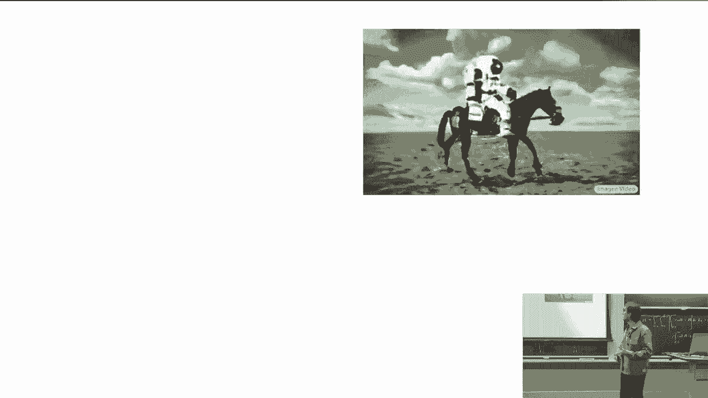

图像模型正确，我想我们仍然如此，我们对你的超级人类感到兴奋。

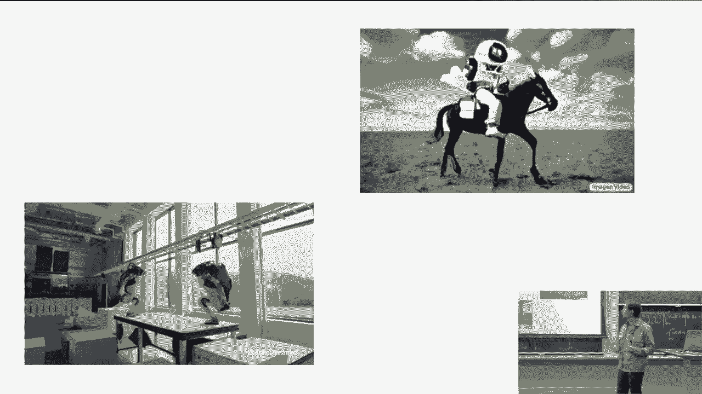

机器人技术，自动驾驶汽车，现在，人工智能也应用于其他领域，如，基因组学等，当然，许多这些突破，即使它们处于非常不同领域，他们返回到这个基础的技术底层，基础模型的技术成就，生成式人工智能。

我们将深入去年的内容，我们对聊天机器人感到兴奋。

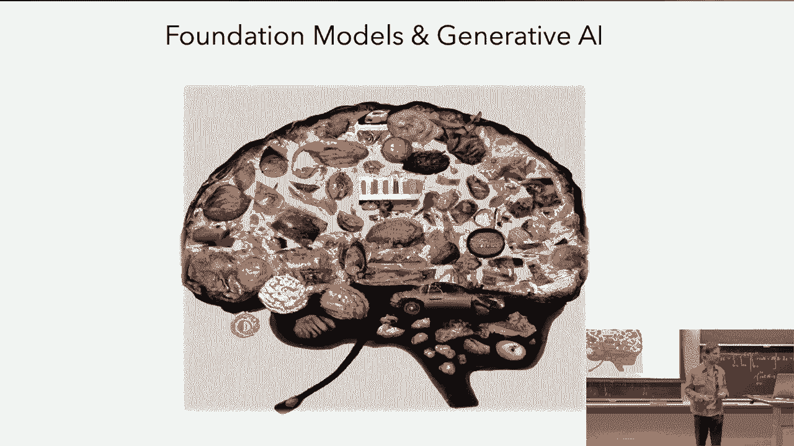

Gpt对吧，所以我们可以让它写一篇吸引人的讲座介绍。

如果我们问更新的gpt。

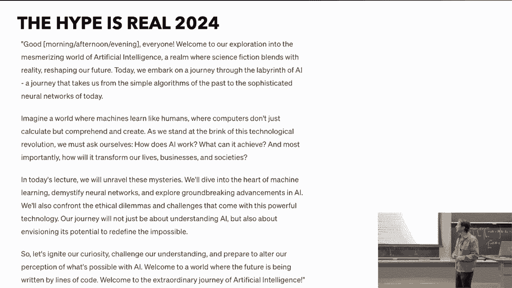

它是否产生更多的文本，但可能它也做得更好，去年我们让它产生人工智能的引人入胜的艺术作品。

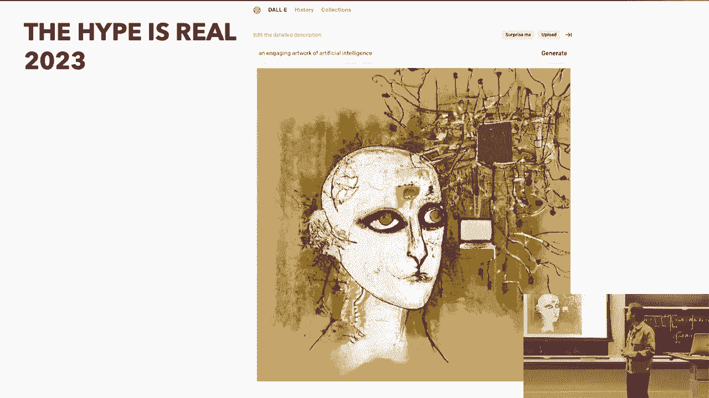

嗯，我们现在是最新版本，它也可能做得更好，它看起来更复杂，至少嗯或主观，但我认为它更好，如果我们对这些事情在，你知道，早期2023年感到兴奋，发生了什么对吧，发生了什么，这一年发生了什么事情，哦，嗯。

很多事情，当然，这已经引起了巨大的轰动，所以有很多，嗯，你知道，资金涌入这些领域，我们有只专注于，你知道，几周或几个月大，达到了20亿美元的估值，这是一个由五人组成的团队，我们对自主代理充满了兴奋。

我们在这门课程中也要谈论这个问题，比如gpt，工程师能够规划，甚至在智能和nvidia方面，以更人类的方式行动，它提供了所有不同的gpus，这些模型需要达到的巨大估值是正确的。

就像我们看到的万亿美元俱乐部一样席卷，监管和某种行动，而且嗯，正确的倡议，嗯，无论是在白宫还是在欧洲联盟，例如，人工智能领域发生了很多戏剧，对吧，开放人工智能，例如。

"首席执行官和推动p co的公司被驱逐后，然后重新回到了公司"，所以，人工智能的透明度问题可能不仅仅适用于模型，"但是，对于那些背后的结构和公司来说"。

"而且你也知道我们正在目睹一种有些炒作和一些赢家的现象。"，"至于所有这些新的人工智能"，"但是现在也有一些公司实际上正在失去用户和流量"，"右栈溢出"，例如，人们说这是一种。

"它正在被一个训练在其自己数据上的AI杀死"，这有点讽刺，当然，一个仍然存在的大问题是你是否已经达到了人工通用智能，有些人说我们已经达到了，我认为我们还有很长的路要走，但我们也将尝试探索一下，嗯。

你知道我们实际上可以意味着什么与'j i'吗，以及我们如何可能实现它，考虑到我们现在的技术，我们可以给出一种大致的量级估计吗，我们什么时候到那里。

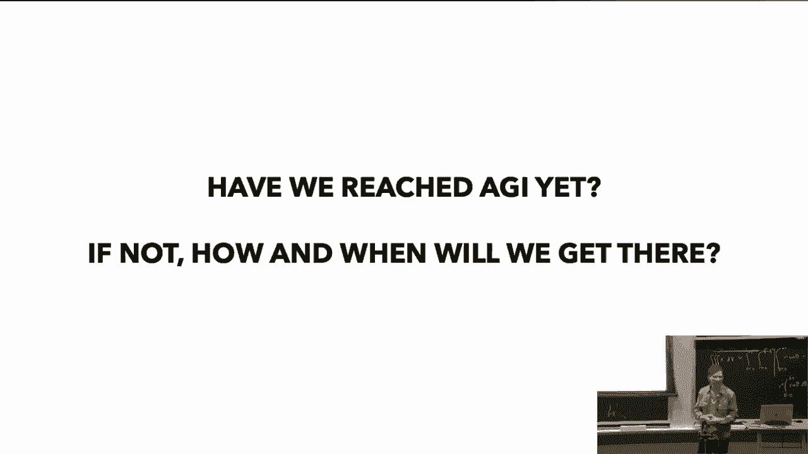

嗯，所以，我嗯，理查德，我嗯，出生在香蕉之国，那是MIT成立之前的瑞典，我在斯坦福呆了七年，我也做了研究，在人工智能和这些方面，我还创立了一家公司，该公司做基础模型，商业环境中的生成性人工智能。

我希望能带来一点那个，那些视角也，而且过去的四年里，几乎现在，我认为我已经在麻省理工学院工作了四年，嗯，我在那里研究，自我，监督学习和模型，并且好的方面，好的，所以嗯，快速地查看课程表。

所以今天我们将进行介绍，并且从高层次的视角介绍人工智能的历史，正在发生什么，并提供一些直觉，然后在下一堂课中，我们将深入研究这些不同算法的工作原理，以及我们如何得到使用这些模型的方法，然后。

我们将对tdp进行深入的分析，就像我们将进行的一个类似案例研究，我们将对图像生成和稳定扩散进行类似的案例研究，然后，这四堂第一课将与去年的课程提供非常相似的内容，但是，我们在第二天第三天将添加。

我们将讨论一些新兴的基础模型，是的，它将是他们已经存在的组合，可能没有一个单一的模型可以统治他们全部，所以我们将谈论这个问题，特别是它在工业和企业设置中的样子，因此，蒙洛洛斯教授也会来。

因为他是神学和基因组学的专家，他也会来，因为他是AI和伦理的专家，然后，他也会在艺术时间工作，他是麻省理工学院的MBA，他将谈论自主代理，然后我们将有一个有趣的，有点，或者它将是一个有趣的。

希望是一个有趣的关于AI和伦理的讲座，这当然可能是有点复杂的，但是也要引入法规，但是关于AI监管的机构现状是怎样的，然后我们还有一个由马诺利斯和秋天组成的小组。

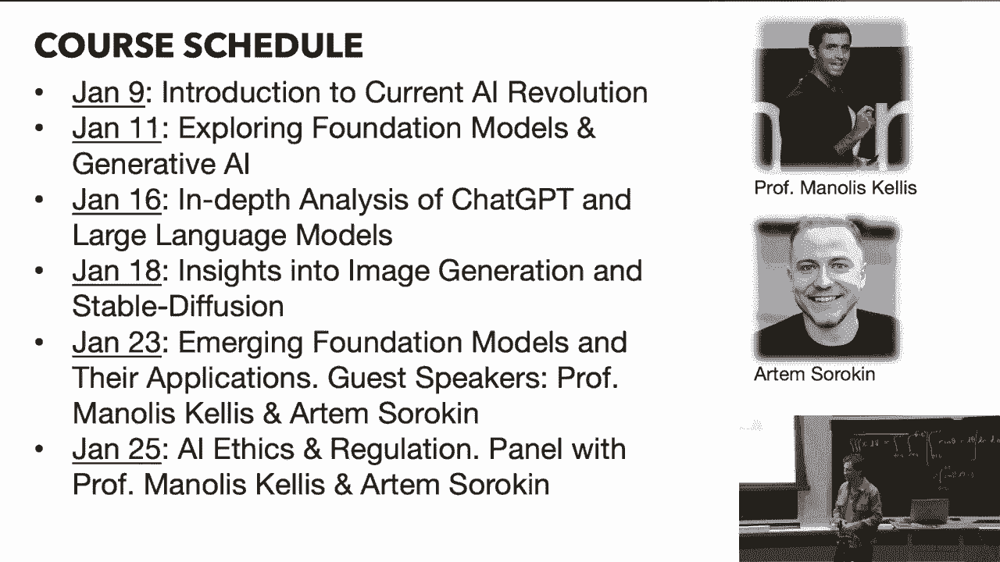

嗯，所以应该很有趣，所以我们将深入探讨，我们将覆盖所有用户密码和新的网络，监督学习表示，无监督学习，强化学习，激励型AI，基础模型，我们将尝试整合许多应用，许多直觉，因为实际上，你应该是非技术的。

我也认为，我想尝试用简单但真实的深度方式解释事情，如果我不能以简单的方式解释某件事，实际上你没有很好地解释它，这就是我们要尝试做的。

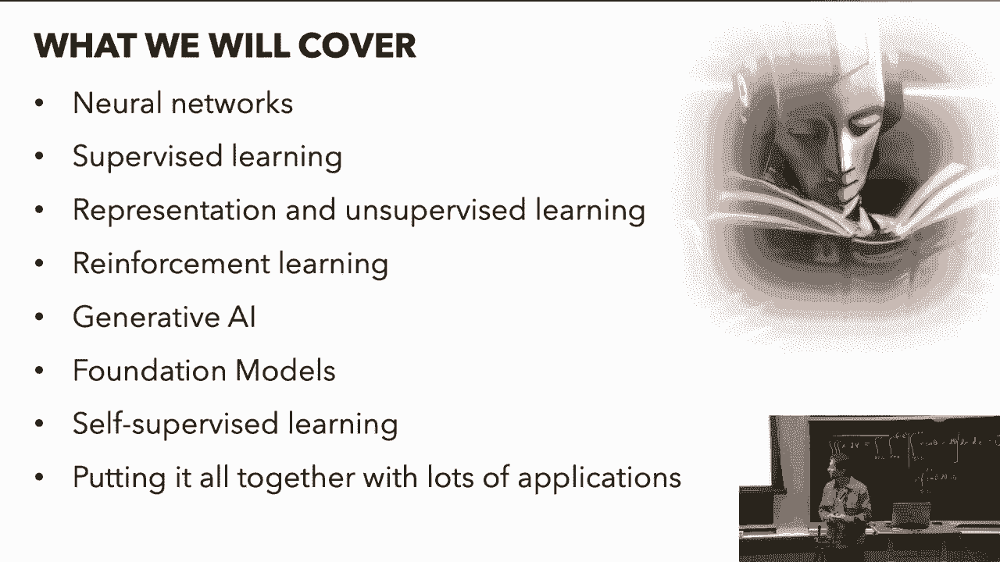

至少今天，我们将给您一个简短而明确的，关于基础模型Moai的秘密来源的答案，当我们完成这个，我们将问世界是如何结构的，因为我们认为世界的结构如何，实际上影响我们在世界中的学习方式。

所以我们将从更哲学的角度探索这个问题，看看这如何实际上引导我们到基础模型和生成式AI，然后，我们将在结束时，覆盖两个我们如何可以在研究和商业中使用这些的应用。

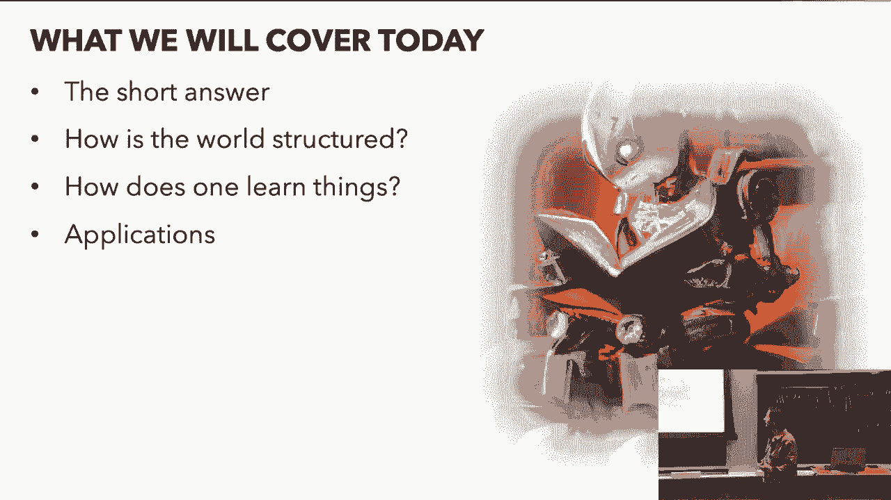

再次，我们将尝试使用直觉，来自科学和商业的示例，并希望您能理解为什么炒作实际上是真实的，正如我所说，去年，但它是真实的，也许我们会理解哪些只是炒作，和哪些是更基础的方面，对，什么重要，好的。

在试图理解并理解AI时，使用自我作为参考框架是有益的。

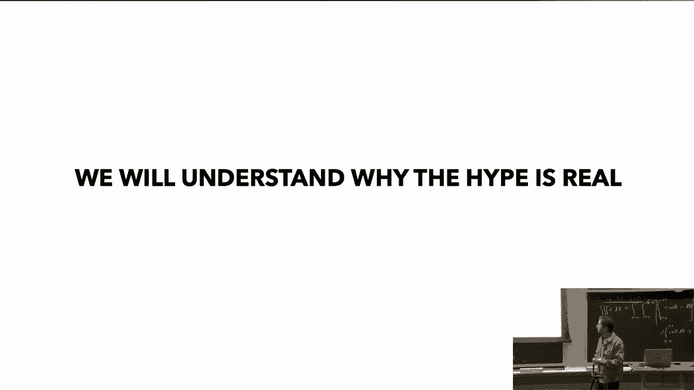

对吗，我认为，在试图理解和理解AI时，使用自我作为参考框架是有益的，你知道，对AI的理解，我们是人类，我认为我们可以问的一个核心问题是在某个时刻，你出生，你是一个空白的画布婴儿，相当无用，你长大。

你与世界和其他利益相关者互动，你获得知识，他们成为在AI和学习方面相当有用和有知识的成年人，一个关键问题是你在成为一个空白的画布婴儿和你成为一个有用和有知识的成年人之间发生了什么。

这是从一个相当无用的婴儿到你成为一个有用和有知识的成年人的关键问题，这是一个关键问题，我们将在这里使用参考框架的结果，所以让我们考虑几个可能负责给我们提供，我们关于世界的大部分知识的候选人。

是我们的父母，他们，他们生下我们，他们抚养我们，他们给了我们许多我们的核心价值，他们肯定是值得考虑的好候选人，或许是我们的DNA在我们的基因中，他们负责给我们许多我们的物理特征。

也包括一些我们的个人特征，但是也许你知道，自然与养育的争论非常灵活，人们可以根据他们成长的地方来变得非常不同，也许DNA在更广泛的世代上起作用，有时候这是一种相当延迟的反馈循环，在短期内学习并不像很多。

也许它是学术界，也许它是教师和教授，以及教育系统，它应该能够教育我们，它使我们变得实用，使我们有用，学习不同的技能，并也了解如何学习世界是如何运作的，所以这也是一个好候选人。

最后也许它是我们更直接的环境，我们可能更重要，是我们的目标，我们希望被爱，我们想要幸福，我们想要成功，通过优化这些目标和目标，我们学习环境，在这个过程中，你知道我们学习环境以及环境中的不同组成部分。

如何帮助我们达到目标，因此我们学习它，好的，所以我们可以将其分开，再稍微高一些，从不同的角度来看，看看他们如何对应于不同的专业领域，对呀，所以这是父母、孩子和教师之间的关系，这是监督学习，有监督。

所以这里有一个人类专家，就像老师或父母一样，他们会为你整理世界，它结构化了它，它给它标记了，并将其压缩为简洁的形式，这样你就可以从中学习，另一方面，这种延迟的反馈，就像进化一样，你在与环境互动。

优化一些目标，我们主要关注的目标是这些，对呀，那是强化学习，以及延迟满足感，你在环境中优化这个目标，但是实际上，实际上那个，这些方法并不负责给你提供关于世界的大部分知识，实际上你可以感谢自己。

因为你知道的大部分事情，你都是通过自己学习得到的，比如酱汁是可能的，嗯，嗯，是的，可能的，通过定义意义来定义公司，它是可能的，这样你就可以从观察世界中学习，让我们以狗为例，并比较和对比狗与其他概念。

所以狗是什么东西，是由一个牵着绳子的主人走的，它是与猫有敌对关系的东西，它是当那些容易受到攻击时追逐自由的东西的东西，这是一种关系性的上下文，使我们能够理解狗是什么，你反过来也会学习猫，例如。

你会学习猫是什么，这就是你从不同概念中获得的关联理解，包括语言，因为单词或名称'狗'会在出现狗的背景下被使用，与狗一起出现，所以'狗'这个词或名称可以通过这种方式学习，如果你仔细想想，如果你知道。

一个小孩子指着一只狗问他的父母说嘿，那是什么感觉，父母真正在做的就是给一些标签，而孩子有将标签泛化到所有大狗的能力，这就显示了他有一个非常，非常坚固的理解一个实体就绪，对狗的概念不仅仅是名字，也许。

但是，那个实体和概念是通过观察狗得到的，所以，例如，让我们以这个，猫和老鼠为例，我认为对我们自己来说，当我们听到猫和老鼠，有一种强烈的关联，我们可以理解猫以鼠的方式，反之亦然，对吧。

猫是一种追逐老鼠的东西，而且我的鼠标通常被猫追，但是当涉及到，当涉及到老鼠和狗，我认为这种关系不如猫和老鼠那么强，也不如那么明显，对，狗和老鼠之间的关系并不完全清楚，在我们的世界理解框架中。

所以让我们将这个观察结果融入到这个基础中，生成式AI模型，同时也有这种类似的意义理解，对，所以，我想说很多这些，基本上，你在这些讲座中看到的所有图像都是由生成式AI产生的，所以。

让我们问一些防御性的问题，AI将图像转换为一只猫在玩老鼠，对，这 makes sense，基于它的训练方式，它理解它生成老鼠，你知道在某种意义上，那是一只猫在玩老鼠，但如果你问的是生成狗在玩老鼠。

它变得困惑，因为在一个上下文的理解中，它并没有太多的意义，这个模型对世界的理解，所以它生成了一个，你知道，一只狗鼠看起来的狗在玩电脑鼠标，所以这表明像，当上下文不清晰时，意义也不清晰。

这对这个模型来说是基本的，并且开始学习世界，这也对应我们如何思考它，可能当我说猫和老鼠时，对你来说，你立即坍缩到一个意义空间，在那里是显而易见的，什么是老鼠，甚至你没有考虑电脑鼠标，当我说猫和老鼠时。

因为它在你的上下文中为你清晰地解释了意义，好的，所以基本上更多的关系导致对意义的更好理解，你理解什么是爱，例如，有助于理解什么是狗，因为狗的主人爱他的狗，所以知道为什么不训练一个大型模型。

带有大量的参数，那是能够压缩所有这些不同关系的模型，尽可能多地使用数据，以学习尽可能多的关系，所以您对所有这些涉及的概念有了最精确的理解，然后您基本上在任何地方使用此模型，在哪里任何这些概念出现。

这就是基础模型的基础，而且你知道你的大脑是从某种基础模型中得来的，您得到一个世界，你知道，模型和知识模型遍及全球，仅从观察它并构建其关系结构中得来，这也是什么，你知道，我们目前看到的AI背后的东西。

这是构建块，正在推动我们所看到的所有突破。

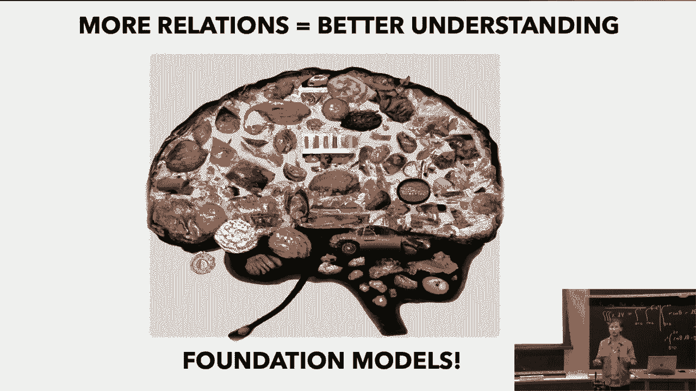

好的，这可能听起来有些直观，有道理，但是要达到这里需要多长时间呢？我认为这对进行一些哲学性的偏离非常有用，并且我们提供了一些我，嗯，嗯，他们对这个过程的想象，也分享给了其他研究人员，一些他们，所以。

我认为这种观点稍微基于，两种稍微相反的观点，关于世界的结构，以及我们在世界中的学习方式，所以我试图通过提供一些例子和对比来理解这一点，一些事情，所以，一方面我们有学习与设计，所以。

一方面我们有学习与设计，我们正在设计的是这个，你知道就像钟表一样，我们知道每个部件如何工作，我们将它们放在一起，每个部件都有像完美的角色一样，我们知道正在发生什么，它是为特定的蓝图和目的而设计的，对。

这就是我们设计东西的方式，而且，另一方面，学习可能是我们不完全理解的事情，我们也不完全意识到它，只是发生了，我们只是变得更擅长某件事，随着我们越来越频繁地暴露于现象中，实际上没有，你知道。

在我们开始学习之前，没有明确的目标，我们只是适应，它非常灵活、直观和好，同样，我们有秩序与混乱，秩序存在于行星或原子的尺度上，事物按照美丽的简单规则如数学行为，如物理和美丽的理论，对，混乱是什么，也许。

你知道，我们人类所发现的不可预测的现实，对，动物世界，人类世界，事物不可预测和混乱，在这里的核心问题之一，是，你知道，我们在日常生活中经历的混乱，是否像，是否有简单的秩序隐藏在所有这一切之中。

如果你找到了这种秩序，那么我们的所有经验都将有意义，或者是否可能世界的秩序有限，并解释多少方程式，你必须以另一种方式处理这个混乱的世界，同样，嗯，我们有从下到上和从上到下的视角，在，嗯，顶部向下的组织。

顶部向下，有啊，球或者一些东西，嗯，你知道，能够想出好主意的顶级人物，从数据分析开始，框架的大致轮廓应该由顶部完成，然后将这个推向整个组织，给所涉及的所有人，某种方式，另一方面，真正的底部向上组织。

然后，在实际操作中，需要有大量的人在底层，他们与客户和产品互动，处理所有这些不同的事情，你知道的混乱或者细节，而且，没有真正的从上到下的简单决策可以被做出，使你的企业真正运行，你需要考虑到所有的细节。

你如何与客户互动真的很重要，你知道的，在个人层面，仅仅依靠老板提出十条简单的规则是不够的，如何解决这些问题，你需要处理这个混乱，而且在一个自下而上的组织中，很多智慧都来自真正倾听离最终消费者最近的人。

好的，嗯，所以我认为，至少在西方世界我们已经有了很长时间，这个设计或自上而下的视角，我认为这是由于古希腊人，正确，所以苏格拉底说，例如，他有一个关于衰败的寓言，嗯，基本上，人类有非常不完美的感官。

以及对世界如何真正运作的极其不完美的理解，以及正在发生的事情，他们给了一个洞穴的寓言，实际上，人类在这里在左边看，你知道，在洞穴的倒影中，所以基本上我们对世界的经验是如此的不真实和不完美。

所以我们甚至无法亲身体验世界，我们只能体验到神与真实物体的描绘一起行走，对，而且我们无法看到那些，即使我们可以通过，你知道，洞穴壁上的火焰看到那些描绘的倒影，这就是我们对现实的扭曲视角，对于足球来说。

就像是，我们接受我们拥有一个非常扭曲、不完美的世界体验，我们必须始终努力理解真正的世界，神存在的美丽世界，你知道，在世界之外，我们能够体验到，所以我认为对于苏格拉底来说，一只狗，例如。

在这个神圣的世界里，有一种对完美狗的真实视角，我们应该努力去理解，以及我们在现实世界中看到的所有变体，只不过是我们感官的一种不完美，我们应该努力理解这个在这个完美绝对世界中的真正狗。

所以我认为这是有道理的，因为希腊人，这次他们正在讨论数学，而且在数学中，例如，存在一个完全符合规则的圆，非常简单的方程，但是每次你取一个完美的圆，尝试在现实世界中重新创建，总是偏离，总是不完美。

所以像这样，这种对应关系在某种程度上影响了苏格拉底的思考，而且在这种数学视角中也有意义，我认为这对我们非常有益，它导致了设计中的黄金之箭，我们经历了一场科学革命和一场工业革命，是的，我们拥有了现代数学。

物理学和现代医学，甚至我们去了月球，这是指设计方式，你知道自上而下的思考方式，所以对我们来说非常好，非常好，但你知道，假设这是自上而下的设计方式，思考方式应该是我们存在的全部。

我们为什么不能更好地做到它，对，我们在地球上已经进化了数十亿年，我们为什么不像计算机或计算器那样，对，如果我们能找到角色背后的简单数学和顺序，并能够完美地存在于其中，我认为这，是一种强烈的迹象。

表明实际上存在一个秩序可以解释的极限，因为，我们并不直觉，就像我们并不善于逻辑和数学一样，因为我们不生活在一个自上而下的秩序世界中，我们实际上生活在一个自下而上的混乱世界中，在那里，数学并不是那么有用。

相反，在自下而上的混乱世界中，有用的是直觉，灵活性和速度，我们实际上擅长的事情，所以，从这个秩序与混乱的视角来看。

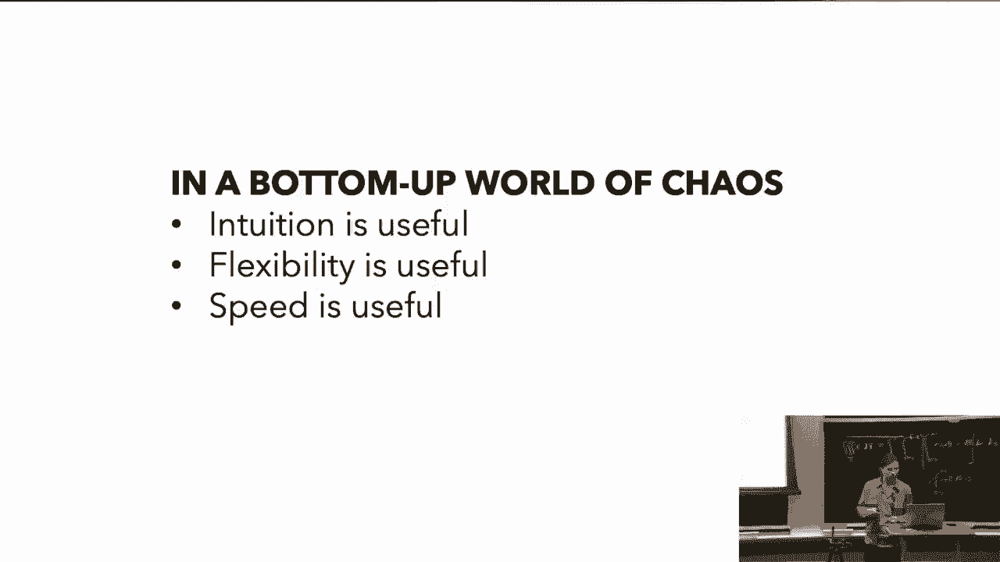

当我们涉及到我们作为普通人的日常互动时，你知道，除了行星或原子的规模之外，实际上，世界是混乱的，我们不能逃避这个事实，我们必须处理它，他们不会是一些简单的方程式，可以为我们所依赖，解释所有事情。

我们必须处理所有这些混乱，这是某种不可避免的，那么，我们应该做什么呢，你只能放弃，那么，是否有一种工具可以帮助我们控制和导航，我们所处的混乱世界，如果我们有亿万年的进化，如果我们没有创造计算机或计算器。

或者自然没有，那么它创建了什么呢。

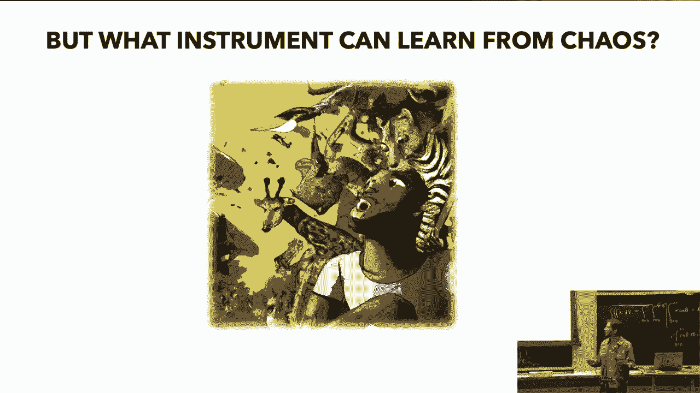

它创建了大脑，这是我们在混乱世界中导航和理解，以及学习的最佳工具，然后，人工智能中的神经网络，就是我们试图在计算机内部复制大脑的最好尝试，所以，它非常灵活和适应性强，它由大量的神经元或参数组成。

并且进行的计算非常简单，但在飓风的规模上进行，而且它训练得非常慢，但非常灵活，适应性强，执行速度快，我们现在接受了混乱的角色，并且我们有一种工具，能够，仍然在混乱的世界中运作和导航，我们如何。

我们如何有效地使用它，问题是，这些新网络仍然存在于计算机中，对，计算机只能理解代码和数学，所以，现在还有一个鸿沟，我们有真实的混乱世界，和计算机侧的机器学习，所以我们必须通过世界的秩序和数学。

来告诉计算机内部的大脑应该优化什么，或者我们应该关注什么，有权利使用他的脑子，因为我们必须以更精确的方式描述这个，以便它有用，所以仍然有，我们还可以完全忽视世界的秩序，那么我们如何严格定义这样的目标。

嗯，这就是我们要尝试的，嗯，我们现在就进行，所以首先我们可以说，嗯，我们理解这个工作如何运作，世界运作正常，我们理解事物如何运作，我们对世界有很多知识，那么为什么不直接将那个知识导入两台电脑。

为什么不将世界结构化为对计算机有意义的方式，我们为所有东西标记，然后我们可以将那个信息喂给电脑，所以你可以从那里学习，这就是我们的第一次尝试，这是监督学习，我们在其中结构化世界，我们标记它，因此。

电脑可以从我们学习，你知道。

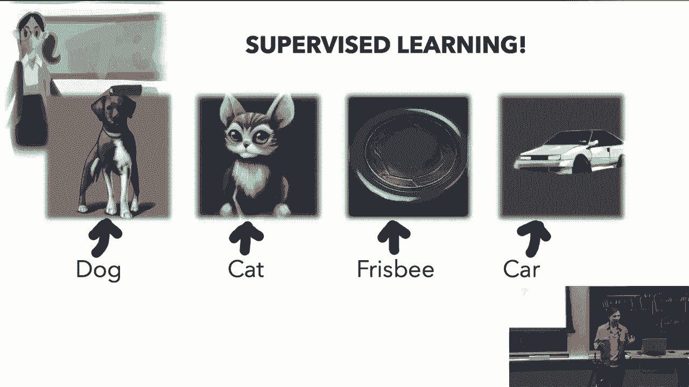

立即我们就会遇到一些问题首先，当然，这与人力劳动成正比，专家和人工标记，这就是你知道你有这些外包中心，人们不断标记数据，所有的东西都能被标记吗，是否像我们那样对自己的行为有自我意识。

我们是否那么意识到事物的运作方式，如爱，例如，能否标记像爱这样的概念，这可能会很困难，我们可能过高估计我们对事物运作的理解，以及我们如何孤立概念，嗯，实际上，你知道。

也许像爱或其他东西再次不是那么可标记的，也许事物并非那么分类或明确，也许世界在某种意义上是连续的，只有在无限的标签数量限制下，我们才能真正开始理解世界确实被结构化。

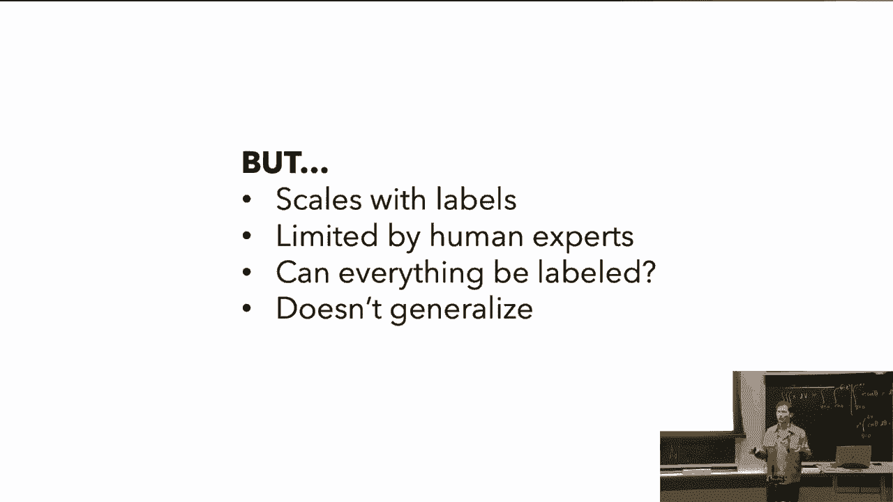

正如你知道的，也许我有一套标签，你从中学习，但你总会发现这些标签之间的点，哪里它们并不解释发生了什么，例如，在这里，你知道这是狗还是猫，所以，这是一个问题，你知道这是狗还是猫，左边，我的意思是。

在某种程度上，某时某刻，事情会变得越来越接近，我们达到标定世界所能达到的极限，然后，我们就需要更多的标签，以便理解它，因此，我们 somehow 看到，监督学习本身并不足以，很好地泛化，它做得不够好。

从需要人类参与的角度来看，它太昂贵，人类专家标注的数据，实际上并不太能泛化到，你知道，真实世界的多元化设置中，好的，所以让我们假设我们现在试图依赖自己，在现实中定义事物。

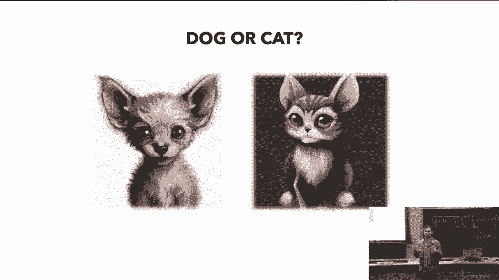

我们几乎采取了相反的方向，所以我们说作为人类，我们有目标，我们有欲望，"我们想要优化"，或者你知道我们正在优化，"我们希望你只是将那些目标导入并决定使用计算机"，"在这个过程中，它会学习到世界"。

"专注于结果"，"就像你在电脑上想要达到的目的地一样"。

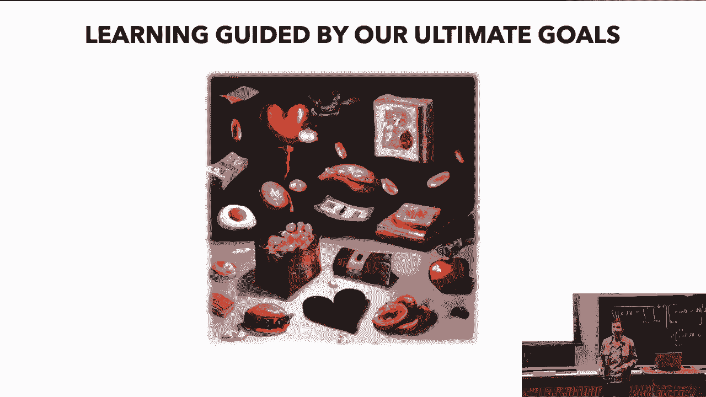

"必须找出怎么过去的方法"，"所以这就是强化学习"。

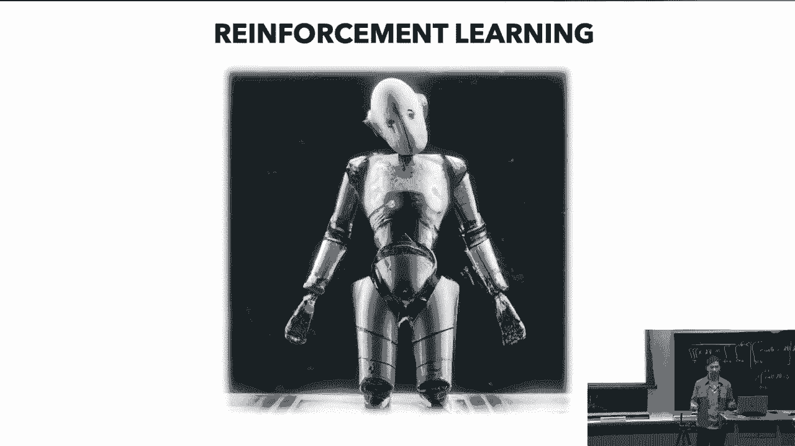

但我认为你知道，"如果一个空白的电脑可以比作一张空白的画布"，"宝宝"，我认为对我们来说，甚至理解"什么"都非常非常困难，这意味着是一个完全的空白板，我认为我们很多知识都是如此的直觉。

我们只是理所当然地接受，"所以，什么东西真正意味着是一个空白的画布"，"就像是从起点对世界如何运作一无所知"，"那么让我们假设你知道你是这样"。

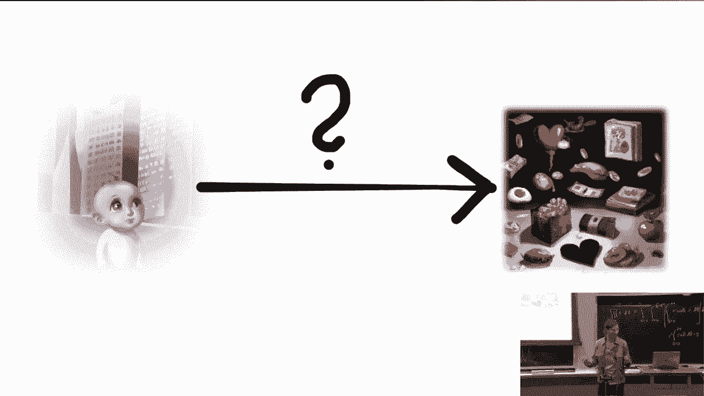

你知道你知道你就是一张空白的画布，"也许对世界如何运作并不理解"，你想要优化的目标上的任何人，或者嗯，首先变得富有，反馈的延迟非常大，对，你做了某事，你不会立即知道这是否真正帮助你。

你需要等待很长时间才能得到信号，这非常非常，你知道很难知道哪些方法有效，哪些无效，你需要长时间坚持下去，才能看到它有所改变，但是，即使你采取一些可能更直接的方法，比如尝试减少饥饿。

在时间上仍然会有一些延迟，可能是几分钟，让我们说，你尝试减少饥饿，对，但是如果你对世界如何运作一无所知，你只是随机选择一个你正在观察的概念，并开始探索这个概念如何影响你的能力减少饥饿，变得饱腹。

也许你只是开始关注月亮，并如何月亮和月亮上的角色影响你的能力减少饥饿，你将花费大量时间探索完全无意义的事情，基本上它与你的能力减少饥饿没有任何关系，你可能会因为饥饿而死亡，比你有任何进步都要早。

所以我认为这有点，这甚至很难理解，让我们以大汽车的完全空白为例，你想要，你知道你想要汽车学会开回家，使用强化学习，我再次强调，也许它开始探索如何，你知道月亮影响到达家的能力，它将没有任何进步。

即使它开始关注实际上相关的事情，但只是偶然，它开始关注其他驾驶员或交通中的其他人类，对，仍然，我们不能承受汽车撞死一百万人，并且撞毁一百万次，直到它实际上到达家，收到信号并开始取得进步。

这在现实生活中太昂贵和风险太高，嗯，如果你取，你知道，想象把一个真正的婴儿放在汽车的驾驶座上，我意思是如果这个婴儿能永远活着，需要多少亿年才能让这个婴儿到达昆士兰州，我意思是它将永远需要时间。

然后当它做到这一点时，你说像嘿，好宝宝，棒极了的工作，你知道，这里是你的信号，现在，再做一次，我意思是，这就是强化学习如何工作时，反馈延迟并且空白的，并且有一个空白的 slate，这就是我的意思。

这在象棋或者类似的游戏中效果更好，因为在那里有一个被崇拜的，一套规则，而且状态空间要小得多，但这种方法在现实生活中会爆炸，所以我们需要的是一个基本的世界工作模型，我们从仅仅观察世界就能得到的。

因为它是我们真正能负担得起的唯一东西，强化学习，正如我们所说，太危险了，在你理解世界如何运作之前，你会死，因此，这也太冒险了，太贵了，监督学习既慢又贵，因为它依赖于人类专家来标记世界，最后，它不工作。

因为标签你不能标记世界，好的，再次，所以，救星的是这个，你知道，我们定义意义由它陪伴的公司，这使得我们可以从观察中学习，好的，所以快速回顾，嗯，我们讨论了混乱与秩序，我们得出结论，实际上世界是混乱的。

我们不能忽视我们必须处理的那个问题，"并且大脑是最好的工具"，"我们在混乱的世界中必须学习和压缩，导航。"，"但是，我们还必须"，他们定义了这些大脑如何与世界交互的方式。

"监督学习不奏效因为它太昂贵了"，"它不具有普遍性"，"像给世界贴标签"，"强化学习太危险也太慢了"，"这就是为什么我们最终会通过观察学习和无监督学习来学习。"，好的。

那么让我们开始讨论这个的特定应用场景，我们将深入探讨一些这个的自主学习算法。

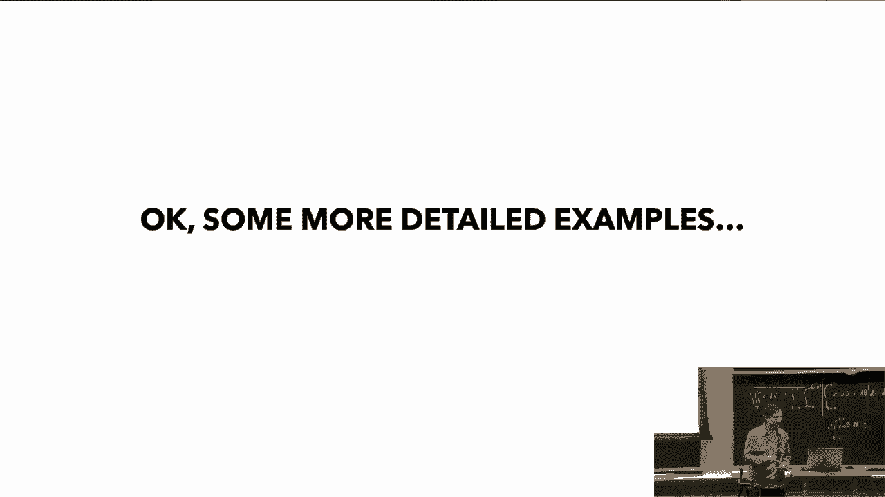

那么，这里有一种不同的自主学习算法的集合，以及它们如何从仅仅观察数据中学习，我们将在随后的讲座中覆盖所有这些，但它们依赖于从数据本身学习，在那里，不需要人类专家在循环中，它可以极好地扩展到无限的数据量。

然后，他们使用这些非常，你知道，广泛的能力来完成各种不同的任务，而且在这个讲座中，我们将快速谈谈预测未来和过去的修复，好的，所以，这种基于过去预测未来的学习理念，依赖于这个想法，即为了预测未来。

我们需要理解过去，所以，让我们以语言模型或学习为例，你知道，从文本数据中学习，所以这很好因为我们从互联网上基本上有无限量的文本数据，所以我们可以下载一个文本序列。

然后我们可以删除最后一个词并尝试根据之前的词预测最后一个词，定义极其简单，然后可以让新的庞大大脑的网络开始做这项任务，现在假设这个新网络，计算机已经变得极其擅长根据之前的词预测下一个词。

这实际上意味着什么，它是否真的，它学习什么，它的语法学得好吗，为了生成和预测语法，就像，你知道，语法语法，语法正确的句子，它必须理解语法，当然，我意思是它必须理解词语的意义。

我的意思是如果我们给它的句子是，你知道狗需要理解如何描述添加剂，他们也需要理解词语的意思，不需要理解非正式社交媒体帖子和正式新闻文章之间的区别很好，你知道如果现在是在喂一个非正式的Facebook帖子。

而且他想要准确完成这个，需要理解对应哪种语言的，反之亦然，对，同样地像，如果人们在，如果人们的写作方式改变，基于他们的政治信念，他们也开始需要捡起他们的政治信念，基于他们如何正确地写东西。

这 only 稍微有点吓人，但是一个 really really 强大的模型可以开始捕捉到这些如此隐含的东西，因为它被优化来做到这一点，这个相对简单的任务，再次，如果我问它，你知道。

斯德哥尔摩的首都是什么问题，瑞典的首都是什么问题，对，我把这句话给了模型，而且它必须准确和最优地完成，它必须给出正确的答案，那就是斯德哥尔摩，所以它也在更大的意义上变得对世界非常了解，这就是核心。

你知道，CHP的方法论，以及它为什么如此有效，以及它为什么如此灵活和有能力，以及这样一个简单的目标如何导致极其，你知道，广泛的智能感，再次，你知道，类似的事情，嗯，嗯，这在现实生活中也适用，例子。

它在现实生活中框架，或者一个动作或什么，如果一个模型能够说，好的，它看到有人牵着狗和一只狗，在下一个帧中它看到飞盘，如果它能预测，我说，嗯，可能人类会扔飞盘，狗会跑过去接住它，能够做到这一点。

预测这个对象组合表明这个模型理解这些对象如何相互关联，所以它是非常，极其灵活和强大的。

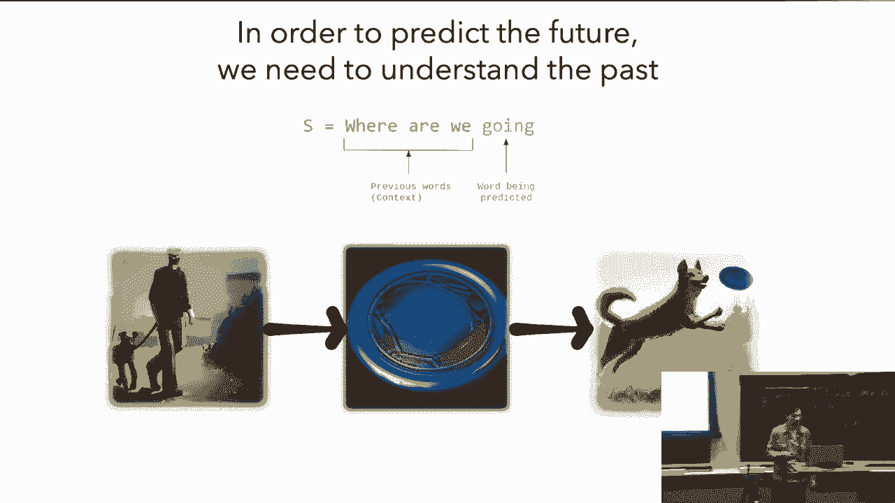

好的，另一种方法在雄心勃勃中非常流行，被称为积极的对比性对比学习在这里，我们再次学习，我们可以说，我们觉得在同一幅图像中出现的对象比出现在不同图像中的对象更相关，所以然后我们可以从网上下载大量的图像。

我们可以只是随机裁剪图像，并将来自同一幅图像的裁剪推近，靠近在一起，并从其他图像的裁剪中推远，如果我们这样做，我们将看到，嗯，我们将看到，嗯，好的，所以，左边的人类和右边的人类，这里与人类的作物，狗链。

一只狗将试图将另一只狗推向更近，与狗链相连的人类剩余，并且一只狗和一只飞盘被推向一起，因为它们更相关，这里的真正酷之处是，你也在挑战这个假设，那就是你不必出现在相同的上下文中就被理解。

就像有相似朋友或相似人的人，所以再次，好的，飞盘和狗链上的人类不在同一图像中，但他们与相似的物体一起出现，比如狗，所以同样，我开始，它将开始捕获这些之间的关系，这可能更抽象，更，嗯，在某种意义上。

我们可以将其隔离得更远，但它仍然以非常 robust 的方式捕获这一点，好的，所以让我们应用这个，所以我们将从科学的一个例子开始谈论。

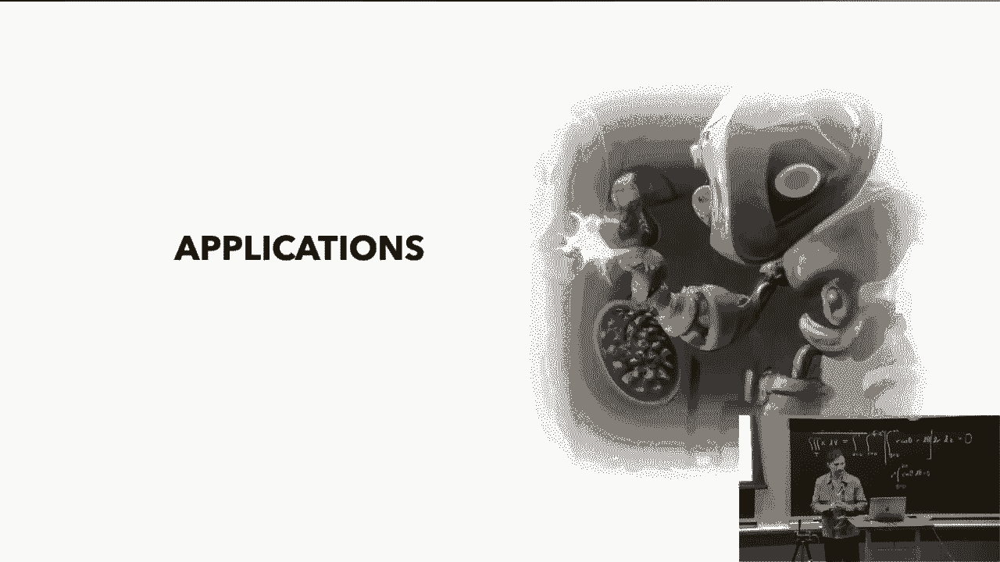

另一个在商业，好的，让我们说，我们要将这个新范式应用于动力学，这是一个好设置，因为我们有大量的dna碱基对，就像这是从人们序列序列中获取的文本序列，人们的，所以我们所做的，我们可能可以做的是。

我们可以利用我们自己的人类智能来看这个数据，并看到，嗯，似乎有一些重复的序列，比如基因，例如，它们再次出现，我们可以看到这些进化的三元组，这些东西是如何被传递的，等等，以构建结构。

开始围绕基因组的一部分构建特征，我用这个来，例如，蛋白质结构预测，开始理解这些基因如何工作，并尝试预测下一个dna碱基对，基于之前的一些，那么让我们假设我们训练一个大型模型在大量的dna数据上。

仅仅基于之前的dna碱基对预测下一个碱基对，在这个过程中，它隐含地学习了什么，所以如果你能够做到这一点真的很好，再次，它是否学习到基因和基因的意义，是的，所以基因只是重复的序列。

所以如果它想要能够生成像完成这个，基因序列真的很好，让我们像识别一样理解，嘿，我现在就在这个基因里面，这就是我为什么需要生成这些新字母的原因，对，不需要像隐含地那样理解。

如果它是完成一个狗的基因组与一个猫的基因组，是的，如果他们不同，它就需要，因为它就是这样，它可能会改变我们如何，它是它如何看待预测下一个的，嗯，碱基对，而且它实际上创建了真的很好的特征，那个。

也许它需要人类花费这个惊人的时间来实际上理解确切地，他们编码什么，但如果你不使用这些特征，并且你训练另一个网络来预测蛋白质结构，对，DNA会导致什么样的蛋白质结构，使它工作得非常好，好的，另一个例子。

嗯，在我在这里的初创公司参与的商业案例中，假设你来到一家零售公司，他们想要理解他们的消费者，也许你可以提供更好的产品组合并给出推荐，等等，所以他们通常会来并雇佣一些顾问开始，尝试定义一些用户画像。

如果目标用户是年轻的单身人士或家庭有孩子的人，那就是正确的，然后他们会试图构建这个形象，给它贴上标签，人们和消费者，他们会问很多问题，比如你问客户，比如嘿，你是谁，你知道你喜欢什么，等等。

以构建一种知识结构，所以首先，没错，"有问题是因为每一个人类都是独一无二的"，"所以每次你强制执行某种用户配置时"，"通常，你会失去对模型实际理解和性能的很多"。

"因为他们依赖于极其极其粗糙的信息和结构。"，"而且实际上真的很很难问人们"，"他们想要什么"，"并且它们如何工作"，"因为他们并不完全意识到自己做出某个决定的原因"，"而且他们更倾向于"，"而且。

这也需要大量的工作。"，就像很多手工工作一样，来把这些人都映射出来，问他们问题并填写问卷，开始建立起对消费者的理解，所以我们可以做什么，相反，开始看客户的行为，让客户通过在你的渠道中行动来做工作，对。

并且跟踪一些交互点，所以这里，例如，正确，我们有，嗯，在顶部，有人购买一瓶葡萄酒，一些奶酪和一些巧克力，如果模型在某种程度上理解并预测得很好，例如，消费者下一步可以这样说，你明白。

在底部我们有汽水和糖果，或许可以开始预测，好的，顶部的人是成年人，或者是在周五晚上想要放松的东西，而底部是孩子的等效版本，然后如果他看到家人进入商店的一些行为，它可以推荐两者，可能是因为如果家庭。

你知道它具有这两种特征，这像这些模型的能力，当你训练它们时，足够的数据变得极其复杂，而且非常，非常便宜来跟踪数据，而不是你自己从人类中构建所有，你知道人类的工作和也是对的。

一些最终到达的是更深入理解你的客户，像你的产品和客户如何互动，如果你在零售，这基本上就是你们的业务，理解你的产品和你的客户，并找到最佳的组合，所以这就是开始建立这种理解的第一步。

它可以在公司的更广泛范围内使用，用于商业智能，等等，它也是通过构建更深入和更一般的智能来实现的，使其更适用，在公司中发生冲突，而不是像对待每个问题一样孤立，我们无法很好地扩展这一点，好的，所以总结。

我们从一个简短的答案开始，比如，基础生成性AI背后的核心基本视角变革是什么，对吧，从观察学习，我们开始问像，世界是如何结构化的，混乱与秩序，从上到下设计，自下而上设计，还是学习，我们 said 有限于。

嗯，秩序和设计以及神经网络是处理这种混乱的一种方式，但随着我们定义这些不同的目标，我们最终仍然以无监督学习和从观察学习结束，至少我们所知道的，现在是一种可行的前进方式，我们必须直接从未标记的数据中学习。

并学习从观察，而不是互动，因为它们可能太危险和昂贵，然后我们也覆盖了两个应用，一个在科学和一个在商业，好的，我想留下这个画面。

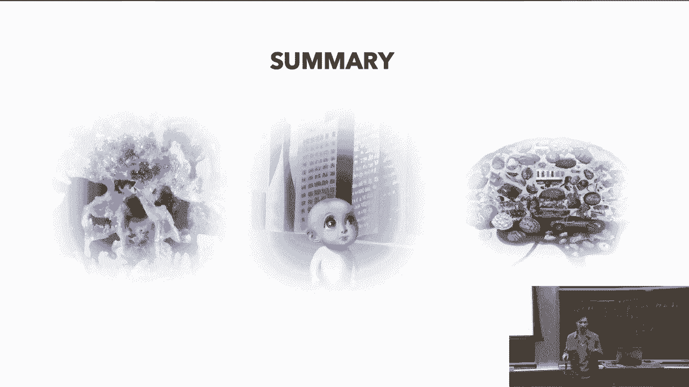

我认为 right，意义的关系性，也许也要问你们自己，比如，你是否在自己的头脑中有正在进行的隐式无监督学习算法，这就是你学习的方式，如果我拿起这个点击器，例如，然后只是放下它，它会在那里漂浮。

我意思是你可能会生气，甚至你知道，惊讶和生气，因为这几乎发生在潜意识中，因为你可能已经有了这种心理模型，你总是试图预测接下来会发生什么，基于之前的行动，对吧，通过这样做，稍微调整当你观察世界时，就可以。

你在这个过程中无意识地学习了整个世界，你的头脑中运行着这些算法，好的，下一堂课，我们将，嗯，使这个变得极其具体，我们将遍历不同的算法，这将非常非常激动人心。

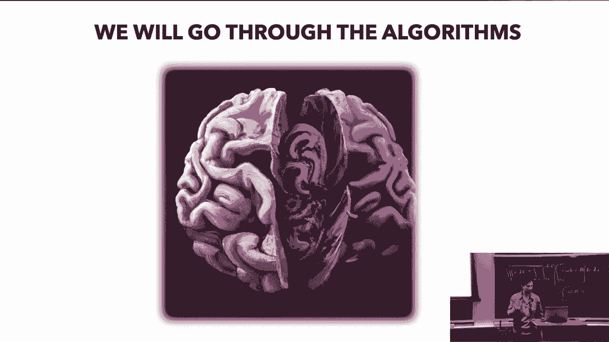

我们还有一个 uh 未来人工智能 mit。edu 的网站，你可以在这里获取所有所有更新，嗯，还有其他好东西，所以非常感谢你，如果你有任何问题，请随时提问，是的，但我，对于你提到的第一个和第二个模型。

我有一些直觉，但在像你这样的情况下，监督模型，那并没有真正理解它背后的直觉，你理解了未来第一个和可能修复的预讲者的直觉，你，你对那里的直觉有一点理解，但你不理解无监督学习，那是无监督学习。

那些是无监督学习的两个例子，所以我的意思是，实际上我们第一次提供这门课程，它被称为基础模型和无监督学习，基础模型，生成式AI是输出，所以，那些，是一种算法家族，它给你生成式AI和基础模型，这是否合理。

所以，实际上，我认为，也许，是的，指出这一点很重要，因为自监督学习是这种方法，我们如何正确地训练这些模型，以及我们何时训练它们，我们称它们为基础模型，所以它有点技术性，我的意思是。

如果你在kuon上有类似的，例如，他说，哦，为什么叫基础人工智能，但是然后它就像，哦，让我们叫它基础模型，因为它比它现在是更好的，斯坦福有他们使用的一些定义，但是媒体就像嗯。

生成式人工智能听起来比术语更酷，而且也不同，根据上下文的日期。

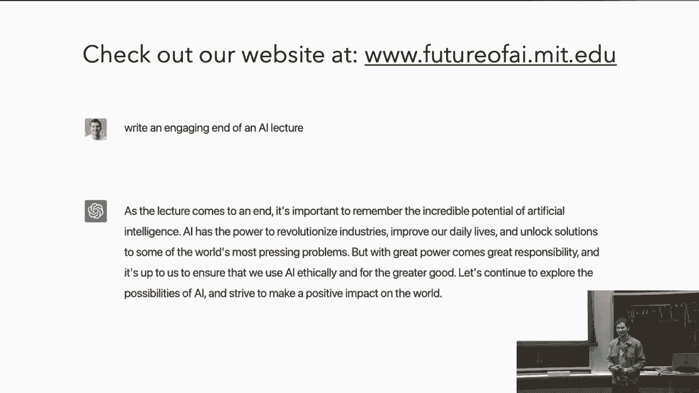