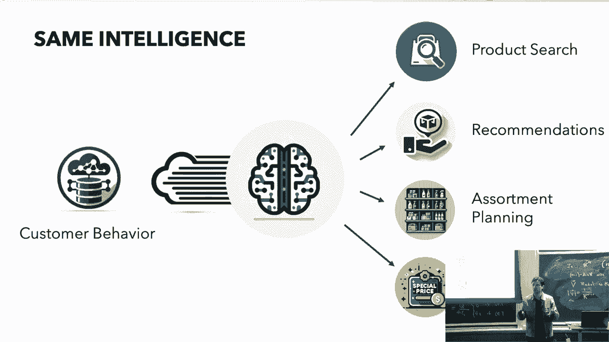
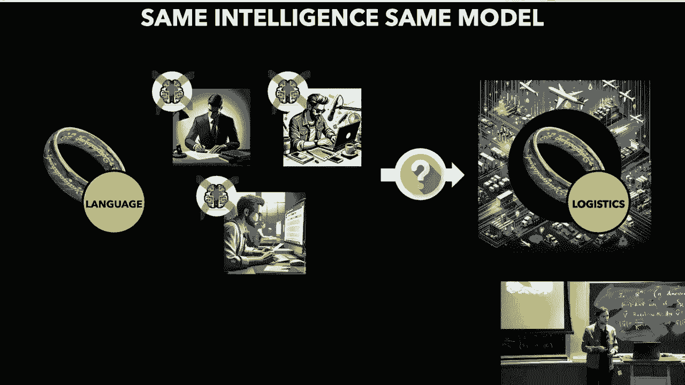
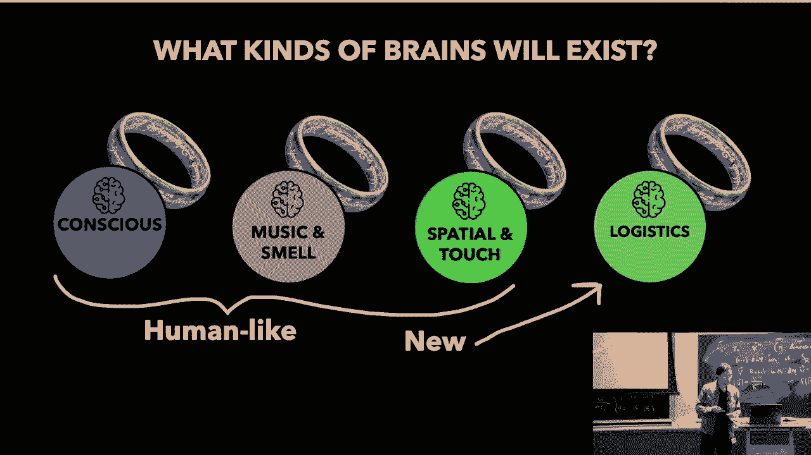
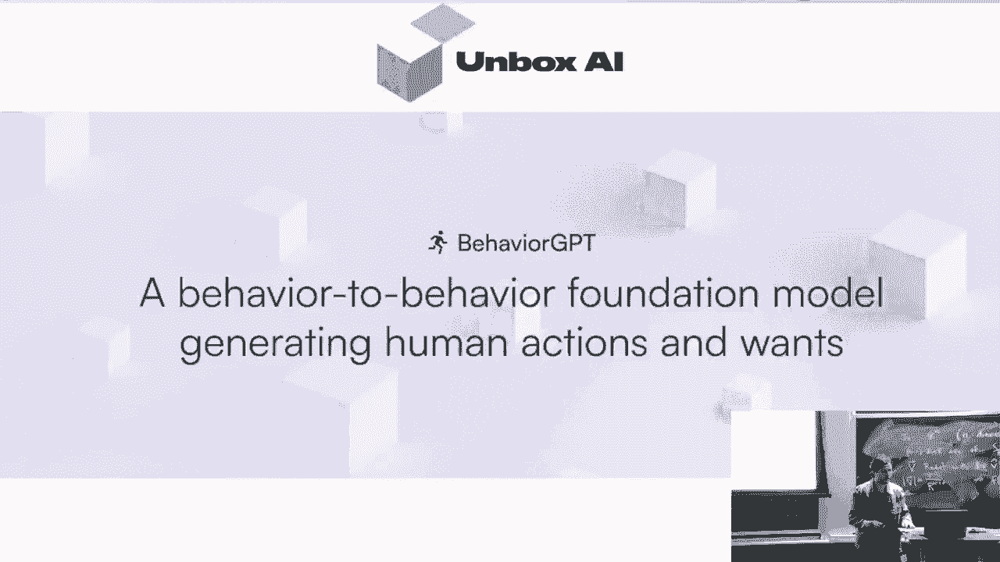
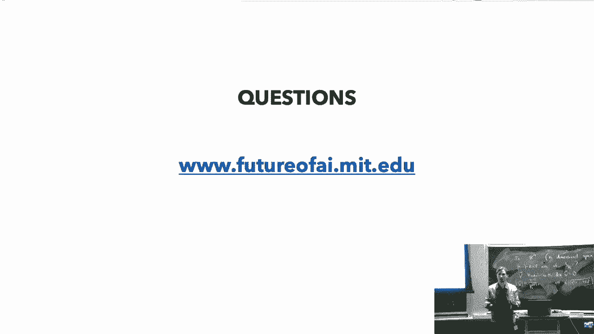

# 2024年最新 MIT 6.S087 基础模型和生成式人工智能入门课程 - P5：5、MIT 6.S087 Foundation Models & Generative AI. ECOSYSTEM - Moss学长 - BV114tLemEdn

欢迎来到第五堂关于基础尼和今天的特别有趣的讲座，因为我们有两场嘉宾讲座，所以，麻省理工学院的罗斯·埃利斯教授会出现并谈谈生物学和AI，以及计算生物学的前沿，然后秋天来了，他从硅谷飞来谈论自主代理。

所以应该很有趣，而且我会开始谈论一个基础模型的框架，所以会有单个基础模型吗，就像一个统治他们的单一大脑。

All will openai have a monopoly on ai or not right，What will be if if not right。

What kind of foundation most will exist，What can you leverage。

And i think it's going to be useful if you're a researcher，But also especially if you're in business。

Understand what kind of foundation models，Also technology that will exist。

And how you can use them and leverage them，And this is based on talk that i've been giving to equity firms。

并且关于啤酒公司如何生存这场爆炸，有一些类似于CC级别的建议，好的，像很多东西都在改变现在，并且人们感觉这是一种不同的技术，它正在改变景观，那么如何生存，在这个新时代中生存并繁荣。

这就是我们今天要解决的问题，好的，你见过这个吗，但是，这是一个基础，那么，发生了什么突破，使我们能够看到所有这些不同的前进呢，我们一直在用自己的框架作为参考，来问关键的问题，我们如何学习世界。

我们从一无所知的婴儿如何变成有用的知识丰富的成年人，我们如何从与世界互动中学习，这是一个关键的AI问题，我们一直在说，什么使你能够从与你互动的世界中学习，这就是AI的关键问题。

我们正在说的基本上是什么负责给你，你对世界的知识大部分，不是你的父母，不是你的老师，不是学术界，所以不是有监督学习，你知道，你不从专家那里学习，好的，所以我认为那是一种我们尝试了很久的技术，但不是答案。

这是一部分，我的意思是有帮助的，但它不是答案，此外，它不是DNA对吧，所以您的遗传，它不是您立即的环境，您正在尝试在那个环境中优化您的目标，所以这不是强化学习。

强化学习本身并不是我们了解世界的关键答案的关键，有帮助，但它不是，主要的，负责的部分，那么是什么对吧，嗯，结果，大多数我们知道的东西我们都自己学习到的，这是关键，你知道。

允许我们做我们现在正在做的所有事情的洞察，这是通过定义公司像意义一样，由公司来实现的，它保持，所以，如果你看一条狗，你不从你的父母那里知道狗是什么，也不是你的情绪让你知道，将狗与其他概念进行关联。

所以你得到什么，你如何理解，狗是，狗是只能被绳子牵着走的东西，它与猫有敌对的关系，它是用那种手机一样的东西追逐飞盘的，这个，这允许你理解狗是什么，这就是你定义，狗是什么，你通过这种方式得到的。

这是一种非常关系的意义理解，你反过来学习猫是什么，所以它是自我参照的，非常非常强大的，它可以捕捉到跨模态的，当然，因为'狗'这个词在狗出现的上下文中被作者或命名得更多，所以它非常强大，这导致什么，嗯。

好吧，这导致你能够理解更多的关系，你对意义的理解就越好，你理解狗是什么就是我喜欢这个的原因，你理解爱是什么，有助于理解狗是什么，因为狗的主人爱他的狗，所以这就像许多相互影响的协同网络一样影响游戏，好的。

这就是这里的关键洞察，那么为什么不试试，你知道一个参数尽可能多的巨大模型，并在此上训练，用尽可能多的数据来训练它，以学习所有这些不同的关系，以获得最精确和强大的意义理解。

然后基本上在所有地方使用这个模型，对吧，这就是基础模型的概念，或者是一个关键突破，你知道在整个，生成式AI和我们现在看到的一切，以及，当然，你的大脑是这种例子的绝佳代表，好的，所以。

我们现在有了一种多样化的，有一些人以前想过这个问题，所以，这实际上意味着什么，现在，我们有了这些基础模型，它们学习到关系意义，这意味着什么，而且，如果你对它们进行更多的训练，它们似乎会变得更好。

变得越来越大，所以你知道，已经发生了一件事，是在研究世界中发生了一次完全的转变，所以六年前，当我在斯坦福的时候，以前是，你知道，一个研究实验室的数据集，以及用于不同语言任务的AI模型，对吧。

所以你开始开始，最初在语言中发生，你会有一个数据集，一个模型，一个正在研究翻译的研究团队，另一个正在研究问题的团队，回答第三个问题，一个分析中心，然后有四个预测点，完全孤立，孤立的努力，但他们问自己嘿。

你知道这似乎是一个共同的视角，在一个共享的智能中，作为语言模型或语言智能，我们能否优化那个相反，而且你知道，拉我们的数据和努力一起，优化单智能，协同作用，因为我们没有，你知道，为每个语言任务单独的大脑。

所以真正的智能应该是普遍的，并且协同作用的对吧，这就是他们做的，我们现在能够构建这些语言模型，它们被训练，真正理解语言在深度智能上，我们在语言中关心的所有任务都是这是真正智能的下游任务。

这是真实的基础模型，好的，当然，尽管你知道许多公司都在这个方面落后，同样适用于公司和企业，如果你今天来到公司，对，如何思考AI、数据或技术通常被看作是孤立的努力，你知道，解决一个问题，所以如果你。

如果你去零售商，例如，他们可能可能有一个单独的服务和数据，数据集和团队专注于产品搜索，另一个用于推荐，第三个用于库存规划，正确的营销活动，营销，但这些当然不是单独的智能，这些是非常非常协同的，对。

如果你能在正确的时间推荐正确的过程，给用户的推荐应该影响你的营销，例如，你应该向谁营销哪些产品，所以，你也应该围绕公司构建这种智能，这就是你可以做的，所以你可以构建一个单一的大脑。

围绕公司来真正利用协同效应，获得最佳性能，好的，所以这导致了基本上，所以，在斯坦福，现在，唯一生存并繁荣的研究团队，是专注于构建一个全面的基础语言模型，正确的关键核心智能。

以及那些围绕自己业务基础构建关键核心能力的企业，也是生存下来的，所以看到一种重大的灭绝正在发生。

人工智能像，我们如何生存并繁荣，正在完全改变空间，这就是我们今天要尝试理解的，对，所以第一个出现在我们脑海中的问题是，如果这种情况是真的，它会在哪里停止，会是一个单一的AI模型或大脑来统治它们吗。

我们将打开，我拥有智能的垄断权，好吧，首先，谁知道在几百年后，但我们现在看到的是，在未来可预见的时间内，这不会是这种情况，它将是一个金融模型的集合，一种看到这种情况发生的方式是。

假设你有一个大型语言模型，例如，当涉及到大型语言模型在语言设置中的应用时，你可能有，你知道，法律，你可能有营销，你可能有，嗯，写文章对吧，这仍然是一种核心智能对吧，这还不够分裂和完全构建单独的大脑。

而且在技术周围，它将基于相同的基础，他们将订阅chty t，也许稍微调整一下，但他们将共享同一个模型对吧，但现在让我们使用这项语言模型，来到一个新的设置，比如物流，也许你与dhl或fedex等公司合作。

他们可能有数十亿个关于这些不同运动的数据点，好吧，你现在尝试应用这个大型语言模型，但其直觉失败，首先，好吧，数据是不同的，这是一个不同的环境，从语言中学习的理解可能不适用于这里，它可能会产生偏见。

实际上，它是有害的，您想在这些事物中重新学习，从数据本身，对，所以然后您就开始看到，好的，在这里，有不同的应用，并将这个数据添加到其中，并将这种潜力添加到大型模型中，几乎削弱了他的能力，这不有帮助。

所以你可以看到，你知道一种新的基于基础的模型技术和模型正在到来，并能够在物流方面发挥作用，这是有些防御性的，有护城河，大语言模型无法竞争，所以另一种看问题的方式是，是的。

我们想要分享，将这个添加到新的概念中，以获得更精确的意义，对意义的理解，但我也想确保添加那个边缘的成本，以及你可能得到的错觉是，你知道就像这样，价值超过了，在某种程度上是正确的，你不想失去模型，也不想。

你知道，增加那么多成本，以至于它得到的价值不能被证明，对，好的，所以我们看到的是，不会有一个单一的，AI模式统治一切，所以会有一系列不同类型的大脑，那么它们会看起来什么样子呢，我认为这将很难说。

我们将尝试去想它，并且构建一种直觉和框架围绕它，我认为我们可以从我们的大脑在人类环境中获取灵感，并且它将是一个结合，因为，我们有人类类似的智能，我们希望复制，我们可以从我们的能力中受到启发。

但在现代经济和文明中，我们有许多不自然和不人类的设置，如物流，例如，那里我们的直觉可能会失败我们，此外，这也使得我们能够在以前未见过的设置周围构建新的类型基础模型，因为你知道我们生活在一个全新的世界。

好的，是的，所以，在询问什么样的人工智能模型是基础模型的时候，所有的技术都有其独特的防御性、模式和独特的卖点，这很重要，因为这将允许你也能理解什么样的人工智能模型，你可以利用和投资于，而且。

这也将是关键的，因为如果你正确，如果你是一个研究者，你可能想要投资于一定的基础技术并构建它，你可能与其他基础模型进行交互，但你想要投资于一个特定的模型，而且作为一个公司作为一个业务，能够识别将是关键的。

哪种类型的基础模型对你的业务案例最重要，所以你可以集成你的知识数据和秘密来源，以及结构和竞争优势，所以我们已经看到，当大型语言模型和GPT-3发布时，有很多你知道的尝试只是构建单独的大脑。

让我们说大约在专业化上，所以有很多公司，例如，这些公司需要一个大型语言模型，并将你带入不同的环境中，仅仅在语言上，你知道我们看到的也是这样，像你一样，你不会再有一个单独的历史语言大脑，对于法律语言。

对于客户服务语言，那些不会分开的，这种这种并不能完全解释，我的意思是，很多进入这个语言特定设置热潮的公司，在前景中没有生存下来，因为他们的数据不正确，因为他们不知道渠道。

这样的模式不足以为他们的存在提供合理的理由，一个大客户公司，客户服务公司只会订阅聊天的，当然可以，你知道，设置稍微有点混乱，这相当简单，然后使用它就对了。

所以这不会像是从零开始构建在这个专门设置中的一个单独的大脑，是的，对，再次，这就像技术在这里，就像提示工程写作，为你的设置最好的提示提示，有一种提示调整和微调，甚至像这些不是，你知道。

这些只是建立一个基础模型，核心技术适应这个新的环境，这是非常非常强大的，而且很多公司都要使用这个，但是不，你知道，它不是多家公司，只是专注于这个，对，好的，所以这些不是分开的脑子。

你只是精细调优了同一种大脑的版本，可能会有多个提供者像openai coher一样，熵的，你知道，但是非常相似，这些是同一种语言，大型语言模型，对，好的，我们最初认为将看到不同类型的大脑的另一种方式。

是在数据类型上的不同，几乎像我们自己的普查，将有一个围绕语言的非常大基础，另一个也非常大，分开的，一个围绕视觉的，第三个围绕音频等，这也不足以justify其自身的基础模型或技术，因为又有很多相似之处。

对，你可以，你可以听到狗，你可以闻到狗，你可以读到关于狗的东西，其中一些是合成的，你想要将它们分开得太多，所以这也不像，这不是正确思考这个问题的方式，所以我认为一个非常好的灵感是关于思考。

我们将看到存在的基础模型类型，以及我们可以利用的灵感，来自于我们自己的大脑，因为实际上我们自己的大脑是一个多个大脑相互作用和协作的集合，这通常是通过进化演变而来的组合。

一个结合了专门数据和专门应用的组合，所以两者都很关键，而且我们经常看到这些大型语言模型，它们能够理解，并且它们做一些推理和规划，你知道，当涉及到我们大脑中的意识和理性时。

这就像我们有一个大脑来处理这些事情对吧，但实际上这只是我们大脑的一个非常小的部分，我们的大部分大脑是，你知道，快速的，直觉的，一个自动系统，展示深层次的智能。

但它们不像可能一个大型语言模型看起来那么有意识，你知道，但是意识与规划，可能是一个大型语言模型看起来像的，但是意识和规划，理由实际上在我们的生活和决策中占据了一个非常非常小的部分，它几乎在后视镜中。

主要是我们可能会围绕我们做的事情构建理性的论据和故事，所以这也将是许多基础模型的一部分，它们不追求这种意识，它们追求这种自动系统和直觉，这也是非常重要的，好的，对，所以如果你想能够构建一个可防御的大脑。

在基础模型技术方面，对，大型语言模型工作与像大型行为模型这样的工作相比，它必须在特定的设置和特定类型的数据上都是独特的，对，这基本上意味着你需要属性数据和属性算法才能使此工作，对于许多公司。

他们可能无法提供适当的算法并开发它，因为它可能太昂贵，所以它们将，它们将订阅一些已经预先训练的大模型，具有他们设置中的优秀算法，然后集成自己的数据并在其上构建，再次，我的意思是。

所有这些不同模型都将相互通信，对，所以它们将相互作用，等，但它们将在所有方面都是专一的，然后可能不同的模式，像大型语言模型可以以某种方式连接它们，但它们将相互作用，专一，但它们只是能够一起工作，好的。

所以总结一下，我们现在知道意义是上下文中理性的，基础模型基本上在利用这一点尽可能多地，好的，这意味着你知道理解得越多，你就能得到对意义的更精确和强大的理解，但有某种限制，并且有更多的微妙之处，对。

所以我们尽可能地扩大这个范围，我们说，像，它们实际上是对这种在特定领域周围建立多个基础模型的必要性的论证，那些金融模型，它们是存在的，将会有 both 论证算法和数据，这是关键。

以便能够作为基础技术进行防御，好的，所以现在我们要跳一下，再多谈谈一点，这从商业角度来看意味着什么，所以现在我们已经讨论了基础模型，这就是我的意思，在研究方面应用到一些程度，你也应该专注于这个。

但尤其是当涉及到企业现在，所以在商业环境中，所以人类，像公司并不是真正的婴儿，但它们似乎几乎像人类婴儿，在某种意义上，我对此深信不疑，我认为我们正在开始看到的是，现在所有存在的公司，我的意思是。

在未来能够存在的所有公司，在未来不久，并且能够有一个模式和防御性，我们将需要一个单一的核心智能，它充分利用这个智能，一个单一的核心模型和基础，运行其业务，这个智能利用其设置中的所有秘密酱料和协同效应。

如果将这些东西分开，它稀释自己，所以你需要有一个单一的核心模型，它建立在，以构建他的智能并知道如何能够竞争，而且这将是，你知道，总结来说，这是一种围绕其空间的智能，好的，并且它将有这个核心大脑。

所以这将是一个基础模型，那就是，它，它将去看看那里是否存在哪种基础模型，并且它将订阅其中的一种，这将成为其关键基础技术，集成其所有数据和秘密，也了解如何和建立在其上，然后当然。

这个模型本身将与我们存在的其他基础模型进行通信和接口，但它对其来说可能不会那么重要，对吧，它可能无法包含其秘密配方，对吧，所以你可能会有这个核心的大脑，这是语言模型和其他基础模型之间的接口。

也许这种愿景或类似的东西，包括那个，并用那个正确地使用，就像使用计算机一样，它非常，非常有用和有用的助手，但它不包含其秘密来源和竞争优势，所以为了构建那种结构化的智能，财务模型，当然。

其他公司也会建立自己的基础模型，这将总结其自身的竞争优势设置，他们可以与其他公司合作和通信，等等，好的，所以如果我们开始看到一点，这些大脑（指基础模型）正在构建，并且跨越公司，所以如果你不是谷歌亚马逊。

你不能从零开始构建一个模型，所以你订阅一些基础技术，并将其自己的数据融入其中，然后在其上构建，好的，现在我们可以稍微思考一下，这如何定义索引，对，有一点，所以，哪些索引将共享类似的基础技术，对，再次。

所以，每家公司都将利用和构建围绕这个业务的单一核心智能，但是，基础技术可能在公司之间共享，所以，当我们谈到大型语言模型模型时，比如，如果你在出版或法律领域，这可能是你想要使用的关键基础技术。

以集成自己的数据并知道如何和利用，你知道这将是核心智能，但如果你现在在零售行业，你的交易数据就重要得多，你知道你拥有的数据中，有九十九是这样的，然后你想要一个模型，是能够理解这种行为或消费行为的。

并能够有效地将其融入并围绕其构建，所以我们将成为核心金融技术，再次，你有像物流这样的东西，然后你知道，金融时间序列也是一样，并不是被很好地捕捉的，在线在互联网上，或者真正符合人类直觉。

那些巨大的数据集周围将有一个单独的基础，但隐藏在公司中，不是在线，而是数据库，所以这也是一个基础模型，我们看到出现的技术，我再次强调这一点，当然，AI和新的AI将像计算机一样无处不在。

我意思是它将对所有人来说都是非常有用的技术，那不是我们真正谈论的，现在，有一个区别在于有一个超级有用的助手，而且，你知道构建你的竞争优势，结构化你的知识，你知道你的企业周围的秘密来源。

以及如何利用这一点，这将是你的存在性竞争优势，因为如果你只是在使用其他人都在使用的其他模型，你没有真正融入你自己的独特设置，对，这是有用的辅助，但它实际上不是你自己独特的智能，是你需要构建的。

我开始思考 uh，理解什么类型，以及如何为你的 uh，业务构建你自己的防御性大脑，看数据非常重要，好的，如果你现在正在运行你的业务，开始思考你的优势在哪里，以及如何获取数据来了解它们。

以便你可以大规模构建智能，你是否有渠道来跟踪总结数据，你知道你做得好的地方，如果你知道有一些数据你不能跟踪，但其他公司可能可以跟踪，你想要使用，这对你的环境来说非常合成，关键在于理解如何获取数据。

因为拥有对你有益的数据的公司，是你的最佳合作伙伴还是最坏的竞争对手，好的，我们现在将跳转到一些更具体的如何做到这一点的例子，但也要快速提到在商业环境中，人工智能已经引起了很长时间的炒作。

有很多公司声称他们做人工智能，他们做各种类型的人工智能，可能不是真正的人工智能，以智能的方式，再次，如果你知道要对声称做人工智能的公司持怀疑态度，但在2020年前他们就达到了顶峰，这是新技术。

在2020年之前成为巨大和成功的公司中，没有充分利用这些新技术，他们的遗产，好的，如果他们说，我们将帮助你，哦，是的，但我们不需要你的数据，我们会自己修复它，那太糟糕了，数据是关键。

这就是你如何集成并帮助你的，此外，不做真正的智能，它需要你的数据，如果他们需要很多手动调整，你不应该做这项工作，你的数据应该做这项工作，例如，如果你是零售商，例如。

你的客户应该通过在你的渠道中的行为来告诉你他们想要什么，你不应该通过做大量的手动调整和猜测来做到这一点，好的，统计学家又变得漂亮起来，就像数据中的人，并且他们喜欢进来看某些统计，就像那个。

你知道有些人像我，标准差只是为了，嗯，压缩的右侧，它不，它不够细腻，你需要构建，实际上，你需要在你的数据上训练这些亿级和参数模型，你不能只看平均值，然后围绕它做一些愿望式的故事讲述，也对此持怀疑态度。

这些不是 very 解释性的技术，你会训练它们，我试图理解他们学到了什么，再次，单一功能公司是正确的，如果有人说嘿，你知道你是零售商，哦，我们可以只做你的研究，我们不做推荐，不做搜索，就像等待。

这不有意义，"你在分散你的智慧"，"不要有单独的服务，不要信任这个"，"人工智能公司仅仅在一个功能中讲话，因为他们没有"，"他们并不是只是为了专攻构建复杂的系统而构建真正的深层次通用智能。"，"好的"。

所以嗯，"我要去展示一些我一直在做的例子"，"我在盒子上的初创公司"，所以我们构建和训练基础模型，使其能够生成人类的行为和欲望。所以，恢复健康意味着什么，就像是如果你真的很鲁莽，这是我们核心领域的一个。

因为消费是行为，所以如果你在零售，对，健谈的dp是一个非常有用的助手，好，但它并没有从核心革命零售，因为零售的核心并不是来自互联网的文本语言，而且很难将这个数据融入其中，零售的核心是消费和消费。

正确的行为模式就是这样，Boxi和行为gpt是那种类型的革命，但对于零售和基于行为的企业，所以他们可以集成自己的数据并构建自己的优势，以集成这一点，这不仅仅是关于使用这一点，哦嘿。

我们有一个有用的聊天机器人助手，可以帮助你更容易地购买东西，如，每个人都可以很容易地构建这一点，但你想要一个大型模型，它集成了数十亿个交易数据点，从你的客户那里学习并结构化，你的秘密来源和智能。

好的，所以让我们来看看零售的一个例子，再次，我们做的是不像，你知道，一个单一的模型用于所有事情，但对于这个业务的所有事情，这是在零售，对，支付差异，我们试图构建一个围绕这个业务的单一核心深度智能。

我们并不，你知道，我们首先不考虑下游任务对吧，我们实际上并不关心下游任务最初对吧，我们只关心围绕业务的深度智能，下游任务的性能只是证明我们实际上在解决实际问题方面取得了进步，所以它是关于深入挖掘。

并且已经解决了特定的问题，所以当你有这个权利时，你可以首先开始应用。

在哪里影响最大，所以我们开始应用这个模型来使电子商务网站的导航，这是一个在线销售壁纸、海报和画布的公司，使导航极度个性化和定制化，因为我们现在可以理解消费者和他们的行为。

所以我们可以使他们的体验更加自动和舒适，这产生了巨大的影响，并且，当然，像有很多公司以前都在导航中做个性化的事情，但是有很大的不同，就像在比较马和法拉利，你需要将法拉利放在它真正重要的地方。

一个有趣的事情是，对吧，我们以前有过聊天机器人，Chet p，但当你开始玩转它时，你会发现，Chet p，但当你开始玩转它时，你会发现，你理解，这是新级别的智能，与这些新技术一样，只是因为设置相似。

它的性能和输出都要好得多，又对，再说一次，这一点很重要，你知道如果你来了一个网站并搜索了一些东西，他们可能有数千种不同的主题和版本，但他们只有房地产，你知道这是一款六款产品的顶级房地产。

所以这里我们可以看到，我们提供了完全不同的体验，这些两个结果之间好像没有什么共同点，尽管从寻找蓝色的角度来看，它们都有意义，就像搜索应用如search up这样的，在某种情况下，是的，这是一个家庭。

可能是有孩子正在寻找为孩子的房间的东西，我们可以为那个提供结果，在其他情况下，可能是一个青少年正在寻找房间里的东西，但是，为每个人创造独特的泰勒体验极其重要，并且，通过非常非常深入地了解他们，你知道。

来使这个网站成为一个，是他们独有的地方，这在电子商务设置中是可能的，而且，真的，你知道，对再次推动销售有着重大影响，然后这就是，当然，你知道，将导致收入和销售额的增加，但也应用到深度智能上，你知道。

可能并不总是直接导致短期销售增加，而且这可能不是最重要的，它提供，其他指标对于长期繁荣的收入也非常重要，如人们感到幸福，回来花更多的时间，你知道，等等，所以这些也是非常重要的，Kpis不管怎么说。

所以只是通过做更加个性化的导航，我们能够增加收入十四个百分点，总收入十四，哪，当然又非常大，这是用十二周少工作的方式完成的，所以现在不需要专家去检查，看错拼写的搜索查询并标记它们，因为它是自动完成的。

我们让客户做正确的工作，他们告诉我们他们想要什么，我们只需要找到它并了解它，好的，所以有些，嗯，有趣的，嗯，这里有一个测验，所以这里，例如，再次，选择一种看产品相似性的模型，正确的一个是一种不错的模型。

在线行为上训练的，一般来说是正确的，所以像一种在线行为的一般模型，然后另一个是专门为这个高度精细的，你知道，欧洲的电子商务购物海报、壁纸和画布，所以，当你看相似性的时候，有一个情况。

人们更加重视地理位置，所以，达伦在这里关闭了，因为它是同一个地方，当你看相似性的时候，另一个情况，注意，更加重视色彩调板，所以这就像嗯，这两者都非常合理，但是。

哪一个对于典型的这个网站上的顾客来说实际上是真实的，有很大的影响，你认为呢，所以实际上，对于壁纸的顾客来说，壁纸和画布，在欧洲的在线，他们更关心色彩调板，而不是产品来自同一个地方，这让我，你知道。

但是两者，当然，相似性可以理解，但是一个驱动销售，一个不驱动，同样地，我们有，你知道，一个模型被训练并正在数据上工作得相当好，它看相似性，旧的一个，所以你这里有克林特·伊斯特伍德拿着一把枪，这是黑白的。

你知道，在一个场景中展示一部旧电影图片，推荐来自其他电影的其他旧黑白图片，对，看起来它们似乎更，有些对，但我们实际上在看客户与这个产品互动的相似性，在这里让客户定义相似性是不同的。

你可以看到人们实际上关心枪，就像在酷旧的电影中一样，而且似乎更干净，蒂斯特伍德焦点，也许这是一个寻找房间装饰的年轻人或者什么，对，当然他们没有任何共同点，从这两方面都讲得通，绝对的视角。

但一种是由观察用户行为给出的，而另一种只是看互联网整体，好，类似，我们可以查看搜索和搜索引擎优化，以及产品关键词标签，对，所以很多公司都有庞大的团队，会检查所有的产品，以添加关键词和类别。

以最大化交互式SEO，所以在顶部，我们有一张天鹅飞过某些颜色的图片，对，所以如果你看一家公司的专家说像，好的，他们应该怎么开始给这个图片添加标签，这就解释了，所以他们添加自然森林，森林，树木，等等。

然后实际上你看到训练在AI上的，人们如何与搜索这一部分互动，并学习到实际上客户使用的语言，你可以看到它说这张图中最明显的从用户角度看的东西，不是自然，森林树木，森林，这是日落，但专家错过了它。

这非常非常困难，当然，你怎么知道日落意味着认为这是最重要的事情，在人们如何思考这个产品上，这非常困难，但你知道它并不直观，但如果你看所有这些数据，它捕捉它并学习，这什么东西让它脱颖而出。

同样在下面的东西这里，我们有很多不同，你知道，人类专家在这里放置类别和标签，但他们缺少人们想要拥有的关键词，当他们与这个产品互动时，以及他们如何思考产品分段，对吧，寺庙和日本和沙。

而且他们错过了所有这些词，这使有很大的不同，好的，所以又再次，这非常非常微妙，这家公司有，你知道两个不同的国家在某种不同的语言上有活动，你知道你也想要聪明，因为很多地方都在使用多种语言，比如在瑞典。

例如，我们喜欢在日常词汇中加入英语单词，所以如果你想学习，你知道从零开始学习语言，以及如何在不同的语言中描述壁纸分析，所以这个模型开始学习，看所有这些数据，开始学习语言和不同市场之间的细微差别。

好的然后，当然这只是一些面向消费者的东西，然后，这个模型被用于许多不同的发现中，因为你的企业周围有深深的智能，所以它用于物理统计商店的商店规划，它可以再次进行保证和主数据，以查找错误。

并确保一切合法和正确，而且还来商业智能，如哦，我理解你欧洲的不同市场，哦，它如何工作，如果你想进入比利时，一个新的市场，它与其他市场有什么关系，在那里最成功的慈善机构是什么，你应该做什么，什么产品。

你应该专注于什么，而且现在智能已经非常深入，他们可以在任何地方使用，好的，另一个例子来自劳动力市场。

在这里我们再次尝试建立，你知道，对于这个消费服务公司的周围环境，有一个模型，好的，我们称之为的工作力，他们负责客户服务，他们有五万名员工，每年有三万名员工离职，所以这是巨大的人员流失。

所以人们在客户服务中离职较早，当他们进行电话呼叫和客户支持时，而且这是一项巨大的成本，他们每年要与500，000名他们想要雇佣的候选人互动，所以这对他们来说是一项巨大的成本。

所以如果他们的大纲是像这样的，如果他们能够更好地理解，谁会离开，以及何时离开，这将能够减少成本，戏剧性地。

好的，但当我们来到他们那里时，就像是说，我们不在乎人们离开，流失率，我们不在乎下游任务，我们关心的是围绕你的员工和你的业务构建核心智能，并真正了解你的员工。

所以让我来构建并查看所有这些关于员工的行为数据点，以便了解他们是谁，以及基于他们的行为您如何了解他们，我们从那里开始看，然后当我们解决这个问题，然后我们能够构建一种理解并能够分解员工能做什么的智能。

然后我们来看一个特定的流失案例，令我们惊讶的是，当我们构建了这个模型，然后我们就开始正常运行，在预测谁可能会离开上进行了调优，当模型能够预测一个人在接下来的两周内是否会离开时。

或者否以91%的准确性进行预测，这在这个设置中是前所未有的，我们到达了那里，这是一项巨大的努力，就像大型咨询公司进来花费大量的，你知道，数百万美元，你知道，做调查，并且和数据分析没有，基本上没有结果。

他们也来了，就像嘿，我们有大量的数据，我们已经对员工进行了十万到二十万份服务调查问卷。我们喜欢二十万个数据点，"这个环境中没有任何东西"，"然后我们看了看这些服务器"。

"在这些服务器上回答的人似乎之间没有像零一样的相关性。"，"而且他们实际上的行为是怎样的"，所以我们做的相反事情是，我们研究了行为数据，"因为行动不会撒谎"，"然后看看行为数据"。

"我们可以查看被跟踪的数据，这要便宜得多"，你可以很快地获取数百万个数据点，好的，我也在与不同保险公司有一些交谈，因为他们依赖数据和预测，我认为这是一个有趣的行业。

实际上我 wonder 如果它能够生存并繁荣，有可能构建一个围绕保险和保险问题单模型的模型。

例如，它跨越了许多其他行业，而且他们通常不控制数据渠道，所以我认为它像，"对于保险公司来说，这将非常困难"，"提供最好的健康保险和最好的房地产保险"，"就像是如果你不是一个房地产开发商"。

"并且你能够收集所有的数据"，"你所认识的人"，"如何塑造了属性，人们如何围绕它们行动，以及事情最终如何发展"，"在智能领域建立真正的竞争优势将非常困难。"，"因为你不拥有那些数据通道"。

"所以对于保险公司来说"，例如，我认为看看他们是如何发展的将会很有趣，如果他们能够继续提供最佳的预测，如果你不控制数据，以及如何他们无法，你知道，通过说我们将在很多地区提供保险而分散自己的资源，是的。

你想要在那里做，也许在一个特定领域建立一些智能，好的，最后再次，这不仅仅适用于公司，这适用于商业空间中的任何实体，所以如果你采样，如果你也是私募股权基金，你也需要考虑如何利用这些技术。

所以，我们正在研究的一件事是如何构建一个模型，关于私募股权公司的智能。

所以，通常，如果你在私募股权，你会考虑横向和例如，垂直整合，你想要拉拢正在运行的公司，但是，也非常重要不要想，你知道，在数据公司之间分享智能并拥有才华，以及像ai集成一样，ai。

这样你才能知道你能够围绕所有这些不同的公司构建这个核心模型，因为你在他们中拥有多数股权，然后他们就可以获得实际将数据放在一起的所有协同效应，他们知道如何一起合作和协作，现在，当你添加一个新公司。

你知道他们将会添加到什么样的智能中，他们能够融入，并且能够，你知道，立即从网络效应和协同效应中受益，而且，结构化你的智能也非常重要，因为你不想依赖一个单一的天才，或者像指尖的感觉。

你想要构建和结构化的智能，你对这些事情更加 robust，好的，所以，总结并撰写这场新的AI革命，我们知道其基础模型，所以，理解外面可能存在的信息模型类型，这将是关键，并且这个过程。

理解驱动你业务领域的核心智能，是的，你需要捕捉那个，并能够结构化，将使你的业务独特和成功转化为真正的结构化智能，就像基础模型，对，首先它开始通过识别数据作为那个的关键来定义它，你需要早点做，做得非常好。

现在就做，对，因为越来越多的人开始这样做，这样做，而且基本上有很多物种灭绝，因为他们实际上没有捕获他们需要的智能，而且他们没有做这件事的数据渠道，你需要确保你做，我认为每个人都可以为许多企业达成共识。

正确，在你的广泛存在主义论证中，基本上就是一种关键的竞争优势，那就是你对你做的事情有一些独特的智能，我之前认为这更多的是间接的，但现在越来越直接，你需要以结构化的方式捕获智能，越来越通过这些基础模型。

好的，嗯，好的，非常感谢，那就是全部，如果你有任何问题。

