# 2024年最新 MIT 6.S087 基础模型和生成式人工智能入门课程 - P6：6、MIT 6.S087 Foundation Models & Generative AI. BIOLOGY - Moss学长 - BV114tLemEdn

请继续，好的，不错，欢迎来到我的永远，他是麻省理工学院的教授，他在计算基因组学和生物学中的AI方面做得非常出色，在这里要谈论AI前沿，对能有这么多非常兴奋，给他们一条温暖的毛巾，好的，棒极了。

欢迎所有人，简单来说，生物学上有很多事情在进行，人工智能上也有很多事情在进行，我的目标是告诉你们一些关于这两者以及这个领域如何剧变地变化的事情，所以我主要要讲的主要是健康和理解生物学以及医学。

谁想在这里永生，很好很好，谁想离开，至少离开到明年，是的，所以有句笑话就是说，就像是，哦，谁想要活到一百岁呢，那个九十九岁的人，并且，嗯，是的，我们实际上并不想死，我们并不一定想要永生，但是不管怎么说。

所以目标就是，我们如何使用ai真正理解人类生物学的工作机制，以及如何利用这一点来基本上开发新的疗法，从而结束疾病，因为我们知道这是一件好事。

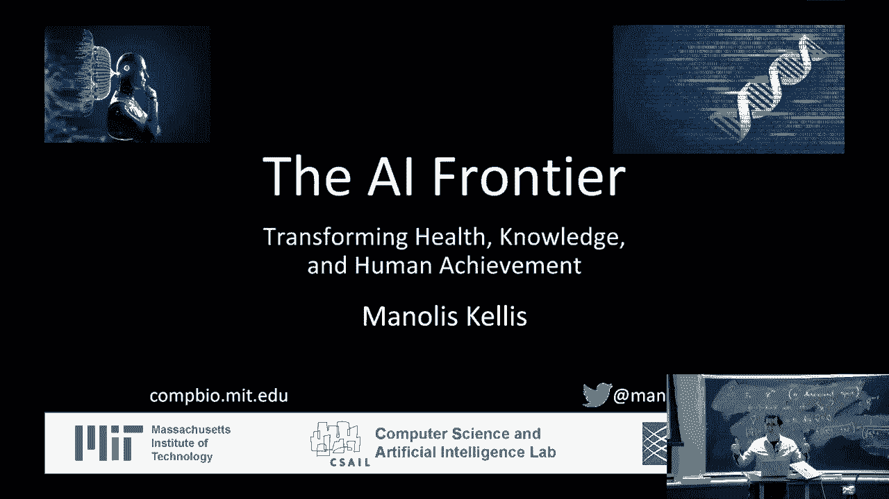

所以我们的目标是什么，我们的目标是理解医学，医学已经取得了长足的进步，这就是我在雅典上周的演讲，那就是我制作幻灯片的时候，这是医学以前如何工作的方式，所以你会有某种类型的，不清楚。

在这里你是描绘一个神还是一个医生还不清楚，但你知道即使在现在，在许多方面，这种区别都已经变得模糊了，然后他们在做这种魔法，病人被 sort of 置于这种状态，你知道有一些同行评审委员会，显然。

但这就是以前我们做事的方式，然后，我们开始越来越仔细地看事情，这已经有一百多年了，我们大脑皮层内的神经元结构和不同脑区的结构，我们现在基本上可以看到我们基于越来越小的部分。

阿尔茨海默症的第一次诊断可以追溯到一百年前，从影像学上，在那里，我们可以实际上看到仍然存在的斑块和神经纤维缠结，阿尔茨海默症的定义，但在过去几年里，情况发生了剧变，这个变化是人类遗传。

人类遗传学基本告诉我们这里有一些因素在起作用，而这允许我们做的就是开始超越仅仅的关联到因果关系，最后改变的一部分是我们自己的工作，能够在收集大量数据方面取得成功，大量的数据用于集成。

所以你可以基本上认为这是下一代显微镜，而不是收集单个细胞的四个细胞，我们正在收集两百万个细胞以单个细胞的分辨率，而不是测量我们可以染色的任何东西，我们最多可以在大约五、十、二十件事上站立。

我们可以测量每个点的二万个基因的表达，好的，所以这是一个有二百万个细胞的十万维空间，将其投影到我们人类可以可视化的二维中，好的，所以正在发生的范式转变是什么。

第一个范式转变是我们从假设驱动转变为数据驱动，不再只是说，哦，我们有一个非常具体的假设来收集大量的数据，然后我们会说是，无答案，我们现在只有巨大的数据，我们应该首先，以后再问问题。

所以我们基本上有系统的数据集，我们正在构建资源，大规模的数据共享和真正的生物学全面视图，正如我所提到的，我们从相关性到因果关系，相关性意味着吃更多巧克力的国家，也获得更高的贵族价格。

这巧克力需要高贵的价格吗，他们是只买吗，我不知道有多少高贵价格的巧克力，这是相关性还是因果关系，还是反向因果关系，所以这就是流行病学一直模糊的地方，而与遗传学，我们现在实际上理解了机制，我们知道这个。

如果有遗传差异，那么最终你可以建立因果关系，然后，最后一个步骤，也是最相关的一步，就是我们从经典数据分析转向，机器学习，在那里，每个问题都有不同的方法论，我们只是想提出一个问题，开发一个统计测试并回答。

而现在，人类负责所有的思考，目标是开发很少的参数和非常精确的模型来理解，以便我们不会过度拟合数据，而现在，我们基本上在说亿级别的参数，没问题，来吧，我们正在构建这些基础模型，这些模型往往具有多模态性。

我们在学习表示，我们正在学习层次化的深度表示，我们真正理解概念并产生见解，到目前为止，大家都和我在一起，所以这些都是主要转变，这意味着什么，这意味着我们，我们现在可以结合遗传学和大数据中的因果关系。

真正理解疾病的机制，遗传学意味着我们从因果关系开始，因为我们知道这些区域与疾病有关，问题是我们并不理解机制，这就是大规模数据发挥作用的地方，我们可以基本说这与阿尔茨海默病有关。

让我们去发现具有遗传差异的人的大脑发生了什么变化，或者是有阿尔茨海默病的人，或者是有这一环境暴露的人，然后我们可以找出负责的特定基因和蛋白质，然后利用这些来理解机制，所以我们正在收集这庞大的数据。

这就是深度学习发挥作用的地方，我们可以从现在的序列信息转变为理解生物语言模型的模型，理解突变是如何作用的，理解蛋白质是如何折叠的，化学物质是如何转化为其功能的，然后最终做出我们可以实验验证预测。

这是社会在生物学中的另一个令人惊叹的地方，很容易说，这可能导致那个但干预将花费像，我不知道，数十亿人正在改变他们做事情的方式，而与生物学不同，我们可以取得一个细胞，然后改变一个基因，然后看看会发生什么。

所以他们更加透明，那些模型，和我一起的每个人都很棒，所以嗯，我们需要做的就是基本上从简单地，这里有一些遗传上的东西到这里是电路，这是遗传变异，字母的差异，这里是motifs，这些字母干扰的序列模式。

这里是绑定这些motifs的调节者，这里是控制区域或增强子，并且在它们变得活跃的细胞类型中，这里是被控制得如此有效的目标基因，一个电路，然后使用那个，我的实验室基本上专注于，将这种方法论应用于数十种。

心脏病的疾病，肥胖症，癌症，阿尔茨海默症的成瘾或退行，病理机制，精神分裂症，精神病，双相抑郁症，蒙特彼特斯德，所以，人类大脑中的人类身体的每一个方面，我们现在可以开始系统地研究，跨越数十种类型的细胞。

跨越数百种组织和数百万细胞，和数百个个体，我们现在可以开始问，疾病行动的渗透方式如何，例如，我喜欢开玩笑说我们在新英格兰医学杂志上发表了一篇论文，人类基因组中的一点点信息，这是关于将t替换为c的。

我们展示的是通过何种机制我们可以翻译一个遗传关联的区域，与肥胖性最强的关联，到一个基本上告诉我们的机制，那个变异是如何作用的，选项调节者，下游目标基因，在机制中的作用细胞类型。

我们通过理解这个机制能够做到，将人类细胞从脂肪储存转换为脂肪燃烧，只需改变一个字母，或将整个动物转换为脂肪燃烧机，所以当我们敲下这两个基因中的任意一个时，好的，在他们的身体中燃烧每一卡路里。

他们的身体中没有白色脂肪，他们只是完完全全的红色，多汁的，健康的器官，然后，嗯，正常小鼠在摄入高脂肪饮食后体重会增加，这些小鼠无法增重，你可以基本上喂它们任何东西，你想要，它们不需要更多的运动。

它们不需要少吃，它们只是睡过去燃烧它，所以通过操纵电路，我们现在能够逆转z电路，到目前为止做得很好，好的，所以那是一个例子，另一个例子是阿尔茨海默病，我们现在能够逆转阿尔茨海默病的电路，基本上。

我们可以取那些有oe4的个体，这是增加你患阿尔茨海默风险的等位基因，以10倍的因素，所以如果你是纯合子，oe4的风险，你几乎肯定患有阿尔茨海默病，在某个时候在你的生活中，很快。

我们发现胆固醇生物合成被改变，我们能够追溯到将胆固醇运输到形成髓鞘的过程，这保护神经元，通过逆转这个过程，通过恢复胆固醇运输，我们成功地恢复了髓鞘和认知，在人类细胞和鼠类中都有。

第二个例子是从区域到电路到操纵，第三个例子在癌症免疫疗法中，大约50%的患者反应，这以前是死刑，现在，对于50%的患者，这太棒了，他们完全打败了癌症，但对于其余的50%，癌症回来了。

我们展示了通过理解电路，我们能够预测位于基因启动基因上游的调节者，关闭它们，然后突然所有的癌症都不再回来，所以再次，在非常不同的应用中，肥胖，阿尔茨海默病，癌症，我们能够逆转这个。

那么这一切都是如何可能的，我将给你一些场景，展示我们如何现在能够理解生物学的语言并系统地逆转它，好的，所以第一个应用是调节基因组学，这基本上意味着从dna序列到序列如何功能，基因调控如何工作。

我们基本上有被称为调节motifs的小模式，这些模式被相应的调节者或蛋白质识别，它们绑定到DNA中的motifs中，然后它们一起合作，打开或关闭调节区域，最终打开或关闭基因，在这里的每一个人。

这就是你需要知道的全部，基本上我们可以通过构建拉下这些区域的实验来测量这些调节者的结合在整个基因组中，然后序列和询问，序列来自哪里，然后我们可以映射所有由不同蛋白质绑定的区域，现在来有趣的部分。

我们可以基本上将所有这些放入深度学习框架，并说在这里预测活动的序列模式是什么，我们可以基本上构建这些多层神经网络，这些学习新知识的卷积神经网络，这些卷积滤波器，以及这些是序列模式。

最终允许我们预测不同区域的激活和抑制，我可以在这里显示您观察到的实验，然后，对于这些调节器的每个预测，你可以看到，它就有这种惊人的能力，只能捕捉到dna的语言，然后，它的美丽在于。

它是机制上富有洞察力的，它基本上告诉你，这个模式在这里起作用，那个模式在那里起作用，所以等等，谁跟我到现在，太棒了，所以那是，dna的语言，如果你有一个我们从未见过的突变，我们能预测那个突变的影响吗。

为什么进行个性化基因组学。

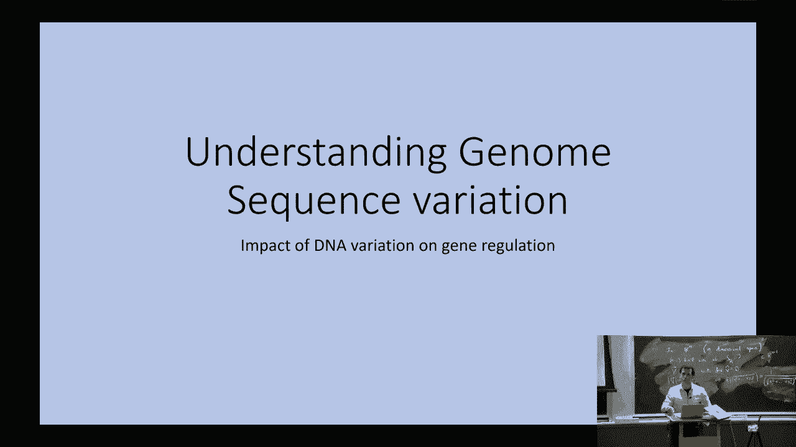

我们想要能够适应治疗方案，将一切都适应到你的DNA，那么我们如何学习基因组的序列。

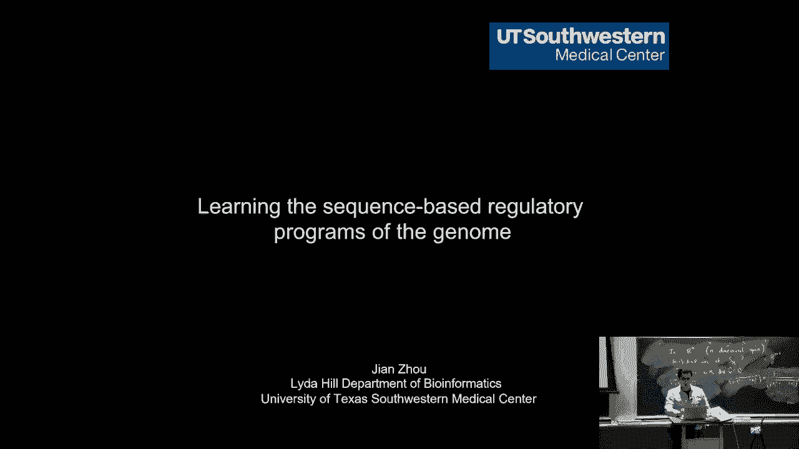

我们如何学习遗传变异对个体和细胞影响的影响。

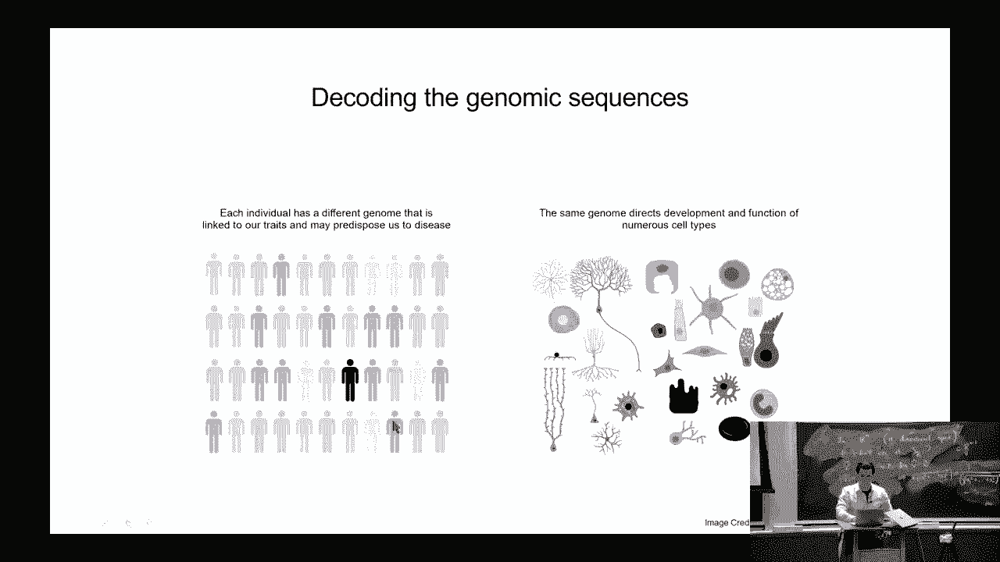

我们想要了解的是，对于任何基因序列，如果我改变一个字母，有一个深度学习框架允许我们预测，这将如何影响绑定DNA的机器，转录因子，DNA的可访问性，然后DNA包装的修改，所以我们基本上可以将此再次放入。

深度神经网络，然后从数千个核苷酸开始预测，跨越多个不同层次的信息，表达影响的影响，然后开始预测这些遗传变异的影响，你可以看到，这使巨大的影响。

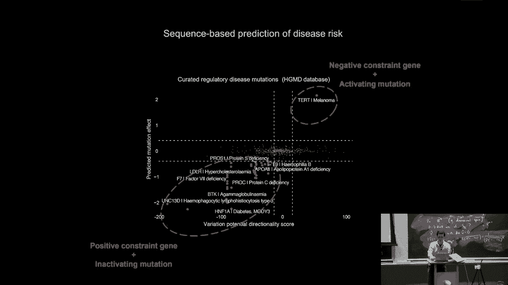

超越这一步是理解细胞活动模式的变化，所以我们的身体大约有一万亿个细胞，"对于这些细胞，我们有神经元之间异常不同的功能。"，"并且我们的心脏细胞"，"并且我们的骨头"，"并且我们的眼睑"。

"并且我们的泪水"，"所有这些东西基本上都具有非常不同的功能性"，"然后，免疫系统本身有数百种细胞类型，它们正在执行非常独特的功能。"，"所以，你能理解基因表达空间的维度和驱动力吗？"。

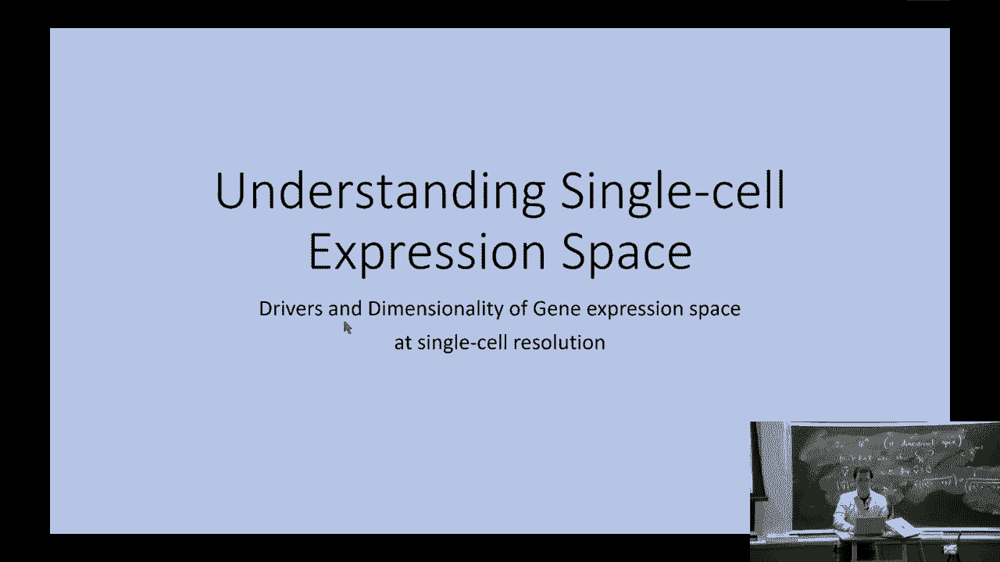

"单细胞分辨率"，因此，我们现在基本上可以测量数百万细胞的表达。

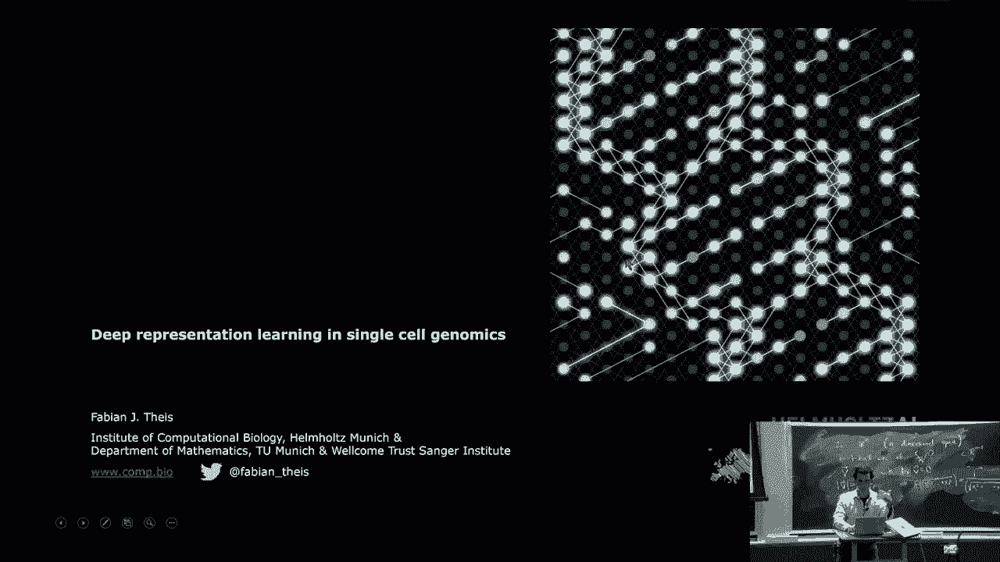

我们可以开始构建深度学习模型，这些模型允许我们从序列信息和表达信息中学习，通过自编码器压缩这些信息，进入这个瓶颈层，然后从中扩展出来，为什么这令人兴奋，因为这就是有趣的地方，这就是变异重要的地方。

同样地，我们可以，我们可以转移风格，例如，太阳镜或男性与女性或年轻与年老，我们现在可以开始询问表达变异的单细胞分辨率维度，并且我们可以使用这个来开始解耦变异的不同组成部分，通过这些变分自编码器。

所以可以说那里有多少是得分，那里有多少是标签特定的，我们现在能否分解这些部分并开始变化标签，将患者的表达模式转换为健康的个体，反之亦然，或年轻转换为年老，男变女，诸如此类，到目前为止，和我一起的所有人。

感觉他们在学习好东西的人，这是一个非常肤浅的概述，但你知道，目标是让你接触到所有这些不同类型的问题，下一步是电子健康记录，所以基本上通过巨大的量表化，我们现在可以收集到具有基因型的大量个体。

并且具有 dozens 个表型变量，所以基本上意味着对于每个个体和测量的六百万常见变异，非常经常，那个人的全部三十亿个字母，其中只有一小部分，像，例如，六百万变异，然后我也测量了表型，疾病。

那个人的医疗信息，我们为此做的就是，我们现在可以使用那个，来现在开始分解一个人的电子健康记录为模块，为与特定表型组合相关联的组件，我们现在可以开始将那个映射到正在改变的独特表达模式上，要么是他们的血液。

要么是从那个人的死后组织样本中，在这个特定的情况下，我们研究了四百三十个人，我们检查了他们死后的脑部，然后我们看了他们死亡前的表型，我们现在能够关联，这些阿尔茨海默病的转录标志。

以那些个体之间的生理差异的重复模式，我们已将这与电子健康记录信息纵向地结合在不同的个体中，我们还已将这些变化与一个大型语言模型的解释相结合，所以现在我们基本上可以取这些大型语言模型。

并开始解释实际上在这些个体中发生了什么变化，活动，好的，所以这基本上意味着我们现在可以开始分解这些模式，我们可以开始使用大型语言模型，对于许多这些人，开始解释预期的奇怪偏离。

所以基本上我们现在可以在电子健康记录中寻找模式，然后使用大型语言模型自动解释这些模式，基本上可以得出关于实际驱动的见解，生物变异的不同方面，我们现在可以取关于你电子健康记录如何变化的表型组件。

然后结合每个人的遗传变异，在数百万变异中寻找它们之间的协变，所以我们现在可以开始构建遗传和表型变异的构建块，在人类基因组中，好的，所以接下来的部分不仅仅是像脂质这样的定量变量。

还包括电子健康记录中的各种其他方面，你现在基本上可以查看影像和病理，如果你取这些切片，你现在可以开始使用ai自动注释这些切片的实际含义，以及在这些切片中肿瘤的位置。

通过基本上提取与这些图像注释相关的特征，对网上可以下载的一百万篇医学论文进行大规模的筛选，然后根据这些图像的传奇来注释每个面板，然后，对于面板a、b、c、d，你有不同的注释。

你现在可以使用你已经听说过的多模态学习，基本上来做图像和这些图像的文本描述之间的联合学习，并开始理解负责不同注释的图像特征，所以，基本上意味着在这些一点上，有1700万图像文本支付者用于病理学。

你现在基本上可以构建一个基础模型，允许你看到一个你从未见过的新图像，甚至可能是一个你从未见过的肿瘤类，并开始推理像素，所有人都对这个好的消息感到兴奋吗，这样允许你现在可以做零-shot学习。

这意味着在一个我从未见过的班级中，信息的检索量巨大，这允许你现在开始学习所有这些的基础，下一个前沿是考虑化学，能够从单个原子到化学函数的功能，如何通过图神经网络来解释整个分子的功能，通过部分的功能。

如何通过构建每个原子的嵌入表示，最初仅依赖于那个原子的特性，然后通过图神经网络，我们在第一层进行卷积操作，基本上说，这仅取决于我自己，但在第一层我依赖于我所有邻居，在第二层我依赖于第一层。

所有邻居的表示，他们自己依赖于所有邻居，所以我可以使用这个来开始传播对化学函数的最终预测，通过化学的个体组织和布局，代表这些分子，所以我们可以使用这种操作来从底部向上传播信息，最终开始预测新分子的功能。

甚至设计具有特定特性的新分子，你现在可以开始使用你已经看到的技术来合成这些，从基础构建它们，使用单个原子或化学空间中的个别模式，然后设计具有特定功能的分子，到目前为止，大家都跟我来吗，是的，谁有右臂。

好，到目前为止，大家都跟我来吗，好，棒极了，几乎每个人都有右臂，这基本上允许我们现在开始设计新的化学，然后，正如你在新闻中听到的那样，下一个前沿是理解蛋白质的功能和蛋白质的结构，在功能方面。

你可以基本上看进化和氨基酸属性，这以前由大规模的物理学来做，你基本上会模拟蛋白质链最终如何折叠成三维结构，而现在我们可以开始看看这个链如何映射到多个物种，比较，共同进化分析，以及序列本身的轮廓。

以开始理解序列和结构的关系，下一个前沿现在是看看这个结构如何编码为功能，所以这里你有预测，你有建模，我们现在正在研究的下一个前沿，目前，在我所在的团队与哈佛医学院的马尔卡·津尼克合作。

正在构建用于翻译蛋白质的基础模型，功能和化学一起，所以目标基本上是能够系统地干预在化学空间，和在蛋白质生物空间，并与布拉德和路德在这里的化学一起，基本上开发了这个程序，允许我们现在药物所有生物学。

我们正在构建这个，这个允许我们现在解析蛋白质结构的疗法llm，蛋白质序列和描述该蛋白质生物功能的文本描述通过医学文献，与类似chgpt的用户查询一起，你可以在这里问任何问题。

我们现在可以开始预测哪些蛋白质会有什么样的功能，从他们的氨基酸构建块和他们的结构中，好的，这使得我们现在可以推理出我应该使用哪种化学物质来干预，并开始逆转心血管疾病，转移性，黑色素瘤，阿尔茨海默病等等。

依此类推，所以我们想要挑战疾病，系统地改变我们对生物学的理解方式，使个性化医疗成为可能并将所有这些结合起来，我想最后告诉你的关于如何使用ai的信息是如何我们可以使用它，现在开始理解，不仅仅是生物的功能。

也包括人类曾经有过的任何想法，曾经发表的每一篇论文，曾经写过的每一首诗，都可以映射到思想的空间中，"我们所构建的工具允许你直接导航那个想法的空间"，"今早晨上"，我实际上正在与希腊开发银行交谈。

"基本上看看如何利用这一来理解所有的贷款"，"他们在分发"，"所有的初创公司"，"遍及整个希腊"，"我们正在与《纽约时报》合作。"，"卡蒂·马里尼报纸"，"基本上解析他们所有的文章。

理解他们的相似之处"，这里我们正在查看由麻省理工学院作者撰写的六万篇论文，然后，我们可以根据撰写这些论文的实验室进行颜色编码，或者实际上在麻省理工学院的地图上显示它们，至于哪些建筑物在产生。

在这个思想空间中，哪种类型的想法，我们基本上在看，麻省理工学院正在教的每一门课程，和自由先决课程的图，以及这些课程发生的部门，然后，最终的视图是，每个概念都有一个岛。

我们现在可以使用一种像谷歌地图一样的导航技术来同时查看，我正在阅读的论文，它在地图上的位置，附近的论文和地图在哪里，所有的知识，嗯，以这种方式，再次，主要的范式转变是。

而不是基本上尝试为每个新的数据集开发一种新的机器学习方法，我们正在构建这些多模态嵌入，这可以在生物空间发生，但也在理念空间，目标是获得以前对人类科学家不可达到的见解，用这种方式，再次。

从假设驱动到数据驱动，从相关性驱动到因果关系，而不是经典数据分析，理解基础模型和多维学习，谁害怕他们今天学到了什么，是的，太棒了，太好了，我们是否可以问几个问题，你知道，也许你应该在星期四讲话。

我担心我们没有太多时间，现在是，嗯，二十一，课程什么时候开始，和像三十，好的，嗯，这就是问题，好的，快速问题，是的，你刚刚展示的最后一件事在这个 mantis 中是否可用，嗯，所以我们刚刚构建了它。

我们已经将其应用到我们能找到的所有数据集中，这些数据集都很酷和有趣，如果您有大量数据想要应用，让我们合作，目标是最终发布它，以便任何人都可以使用它，但我们的初始操作模式是我们与有大量数据集的人合作。

并为他们构建一个，这样您就可以导航自己的数据，你是否有特定的数据集在 mind 中，好的，非常棒，是的，是的是的，这非常有趣，是的是的，我的意思是，我一直都想要这个，但现在终于可能了。

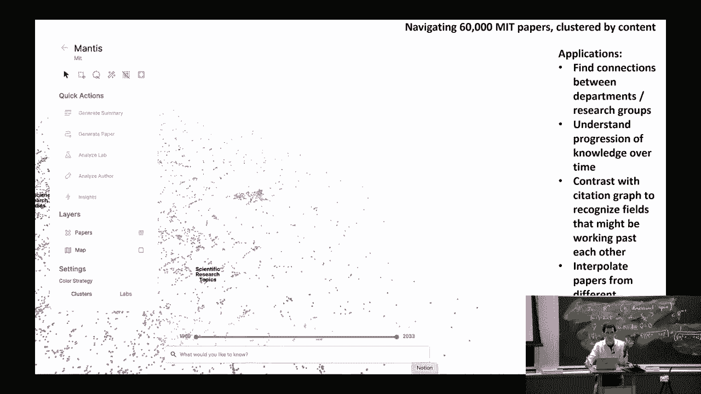

我一直在记录，嗯，过去的十年到十二年里的所有会议，这是我们团队已经进行的一万次会议的嵌入，以及它们如何聚类，这是引用我们工作的一百五十万篇论文，以及它们如何聚类，就像，我想要以这种方式理解一切。

每次我阅读纽约时报，一篇纽约时报文章，我想要理解所有附近的文章，以及当我阅读一段话时，我想要看到最近的段落在任何地方，然后其他论文会出现在那里，你知道如果我想要阅读关于乌克兰战争的五篇论文。

你知道我不想每次阅读时都看到相同的引言，每次我想要将这些论文混合并编织出独特的段落时，它现在就在我们手中，我们应该能够系统地进行这项工作，所以它是一种知识的提炼图谱，是的，基本上。

它是从llms的七十四万维潜在空间中提取的，所以我们训练了自己的llm，这是一个亿参数模型，它使用稍微不同的目标进行训练，即句子的重构，而不是下一个词的预测，这使得llm能够捕获更多的上下文信息和关系。

我们现在正在使用这个来查看，如果我们可以，你知道，我们可以生成嵌入，从一个论文中，再加上那个论文，开始生成一些新且相关的东西，问题，走廊是什么，所以你有像四分之一的数据，你，但看起来像是训练更好的输入。

是的，当你有自编码器时，当你有自动编码器时，你可以仅仅预测输入更多地是关于基因的，对，所以就像是基于语言的，所以基本上在之前我展示的自编码器中，这是在预测实际的表达模式，所以我们基本上在说，表达是什么。

嗯最初，我怎么能从中预测。

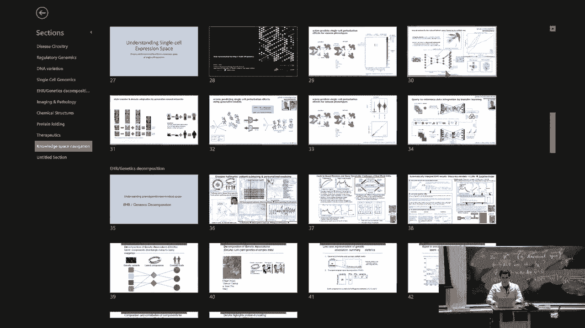

你知道，一个极度压缩的瓶颈层，这就是我们现在能够学习的原因，你知道所以所以基本上输出就是输入，我们正在尝试预测原始数据，但是通过这个瓶颈层，但是什么所以基因表达水平，所以基本上表达量。

每个蛋白质的mrna量，是的，甚至关于所有的一切，我们如何看到患者的数据，我们如何以新的方式诊断，是的，是的，疾病和个性化治疗。

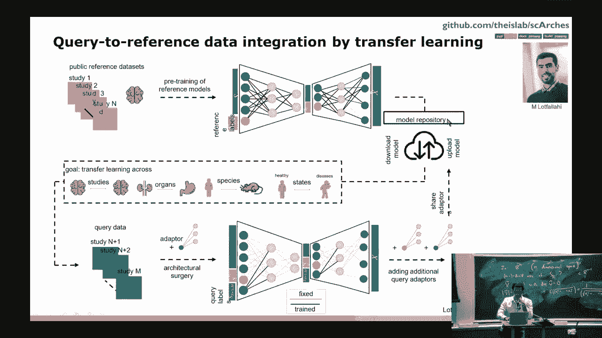

是的。

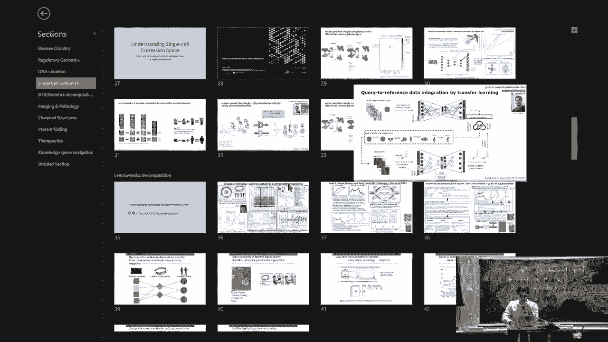

所以所以嗯，多模态是出路，如果你看图像，例如你可以欺骗只学习了图像的ai，但是很难欺骗学习了多模态信息的ai，所以基本上通过这些多个模态，人类不断整合多种信息模式，现在。

我们可以通过ai获得患者的临床视图，基于，当然，他们的临床记录，但也包括他们的图像，他们看起来的样子，他们感觉如何，他们怎么说，他们的症状，他们的手势，他们的眼神接触，他们的手颤抖的方式，还是稳定。

等等等等，所以基本上，嗯，我预期很多患者将来会要求ai辅助诊断，从现在开始，它看起来很奇怪，嗨，医生通过看AI是否在欺骗，而在五年后，我认为，患者会说，嗯，请原谅，你不应该有一个AI助手吗，发生了什么。

今天是否坏了，你知道为什么，为什么我不能得到最好的服务，我可以基本上，我觉得我们现在在诊断，基本上通过训练医生思考像机器一样，在多年的研究中，他们基本上说，哦，我看到这个证据。

我看到他们头脑中的基本上流程图，当然他们是多模态生物，所以他们理解，你知道，更深入，他们有直觉等，但医生需要花费大量的训练，不偏袒医生才能有效地思考，就像AI现在能思考一样，所以我的预期是，未来。

医生的许多人类方面将成为瓶颈，比同情和理解更重要的方面，并帮助患者表达自己，以便，你知道，深思熟虑，我们将能够使用AI整合所有这些信息，首先，目前医生不想看基因信息，他们像，哦，我只想看你。

我不想看你的基因，通过这种多模态信息，从血液表达模式，从大脑成像，从脂质分析，等，他们将能够使用，AI将能够使用所有这些信息，在您收集的所有信息的上下文中，每次来构建一个人对人更完整的模型，是的。

大问题是医生中有偏见，这使得我们有些人可以对此有所控制，是的，是的，是的，所以，有一种被称为非随机缺失和不完全随机缺失的东西，当医生下令进行测试时，大多数时候，测试结果异常。

医生不会下令他们预期正常结果的测试，因此，如果你看观察到的数据分布与未观察到的数据分布，它极大地偏斜，许多模型基本上会将缺失数据视为，你知道，与你观察到的数据一样，实际上。

缺失数据来自一个非常不同的分布，因为它从未被下令，因此，有许多方法来解决这个问题之一就是建立队列，我们在其中系统地测量一切，因此，我们订购的特定测试中存在较少的偏见，然后，当你有了那个。

你可以学习其他变量的协变量分布，然后开始预测一个人的状态，在知道该信息是否存在之前，或使用关于变量存在或不存在的信息，来构建对该变量分布的期望，然后根据它是否被观察到进行插值，至于人类现有的偏见。

人类极其偏见，每个医生都有偏见，每个人类都有偏见，在我看来，AI是构建无偏见模型的最佳希望，或者你知道，无偏见模型或纠正这些偏见的方法，因为这些变分编码器和其他技术，我们可以解耦不同的变异成分。

并查看性别，年龄，祖先，你知道，所有的方面作为正交变量，然后使用反事实分析，基本上说，如果这个人是一个男人而不是一个女人，你知道数据会看什么样子，你可以实际预测那个数据，并做出关于那个数据的推断，是的。

医学极其偏见，当前的算法极其偏见，因为它们是基于我们有的数据训练的，但是有希望最终克服这些人类偏见，好的，好问题，所以，DNA似乎就是生物学的语言，这与你使用的语言非常不同，你知道在文明中。

所以可能你谈论这个的时间，可能需要，你知道一个单独的dna数据基础和当然这个数据量非常大。

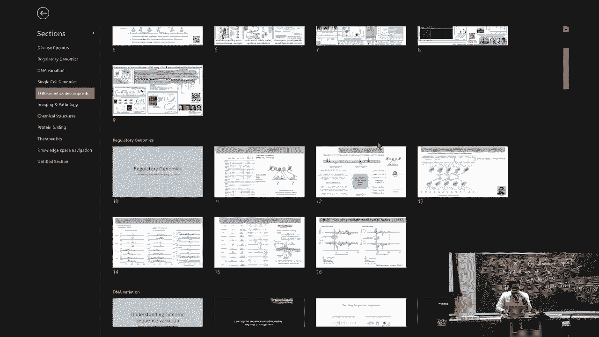

仅通过训练一个大型模型，你能达到多远。

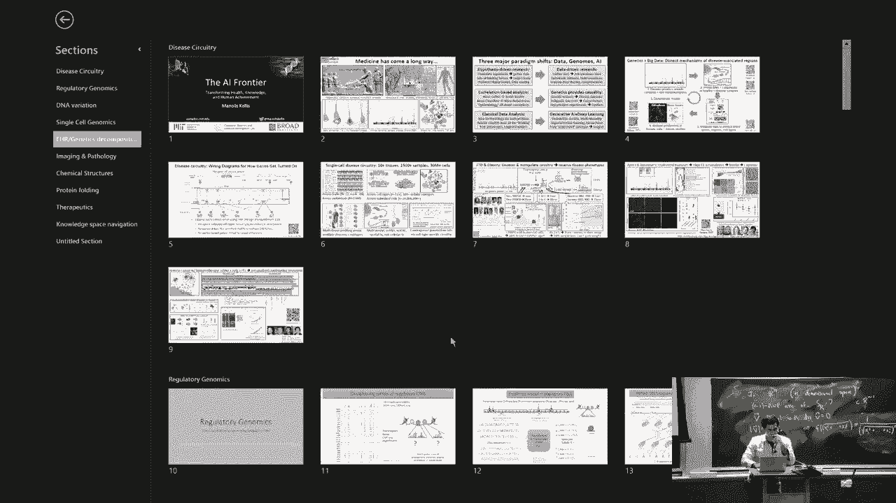

你知道无限大的模型在所有存在的数据上，在理解这个方面，你能达到多远，我喜欢说人类的思考比生物学简单得多，而且原因是生物学已经增加了三亿年，而人类只思考了，我不知道，也许只有一百万年，而且像深入思考。

这是其中的一个方面，另一个方面只是一秒钟，让我来放riley，嗨riley，我会放，我会回来和你说话，很快，会议开始了，所以，所以，第二个是，人类的思考被限制于由这个产生的东西，它本身也被限制于进化。

它本身也被限制于在每个世代中发展，从一个细胞开始，就像受精卵是一个细胞，它从妈妈那里继承了一半的dna，一半的dna从那里，分裂，最终设置起一个神经网络，然后从每个世代中学习所有的人类知识。

所以人类能想得这么好真是令人惊讶，我的意思是，你知道，如果我要写一个nih grant来开发这样一台机器，我会被拒绝，就像这个永远不会工作，所以我惊讶人类甚至能思考，而且他们能发明ai等。

但ai没有这些限制，ai基本上可以使用非常不同的结构，他们不需要适应你的头骨，他们不需要进化，他们不需要发展，他们不需要成为一个局部最大值，所以从某种意义上说，我们几乎惊讶还没有找到显著更好的架构。

和人类大脑的ai，我的意思是，transformers正在逐渐接近，但我不惊讶如果人类正在做一个非常transformer，像，你知道，海马连接性为n克，当我们思考概念等时。

所以问题在于生物学比人类语言难多少，所以我认为人类语言相当简单，并且有像，你知道，只有少数思想岛屿，如果你愿意，而且，嗯，生物学，相比之下是极其复杂的，此外生物学没有逻辑，没有像物理那样美丽。

就像有几个方程式就完了，而意味着几百个方程式，而生物学，每一代都有数十亿次的调整，你就像这里改变一个字母，哦，它，有点工作，也有点适应，等等，所以从某种角度来看。

我们甚至能够理解蛋白质折叠、DNA和语言这一事实，以及基因调控和病理，以及所有这些对我来说都是思维建模，它甚至能工作，因此，它暗示生物学在某种程度上仍然受到限制，而拯救的可能是我们只有二十万个基因。

这就是复杂性的限制步骤，所有这些多模态性都在某种程度上帮助将知识引导到一个更小的空间中，我们看到的变异远小于二十万个基因所有可能的变异，因为存在调节回路，而且调节器的数量有限。

一个细胞只能进入的状态有限，是的，你知道，生物学理论上可能无限复杂，或许化学也是无限复杂的，但是，生物学的空间，化学，蛋白质，折叠，蛋白质结构，等，在这个世界中居住的可能至少至少是九十。

其中可能至少有五分之一在我们的现有模型范围内，太棒了，非常感谢美丽的你，谢谢大家都好。

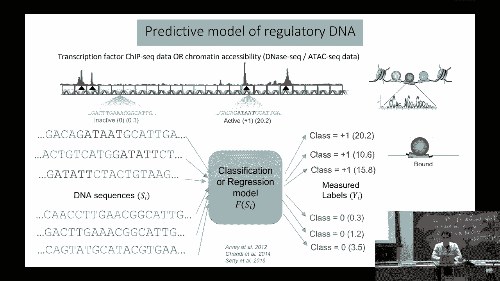