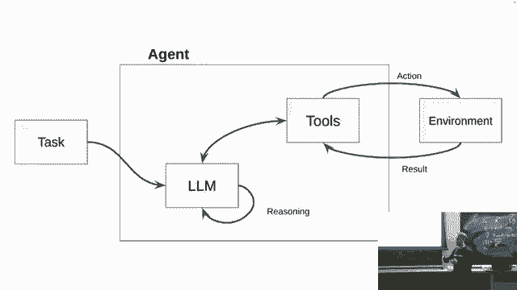
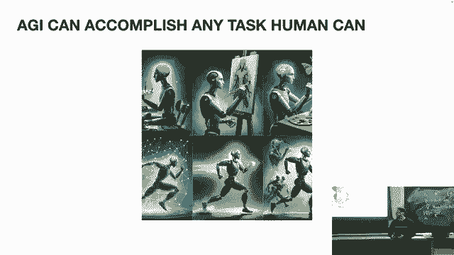
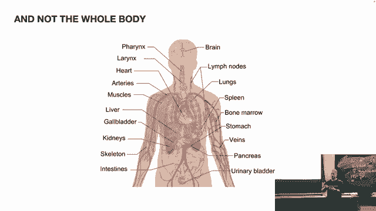
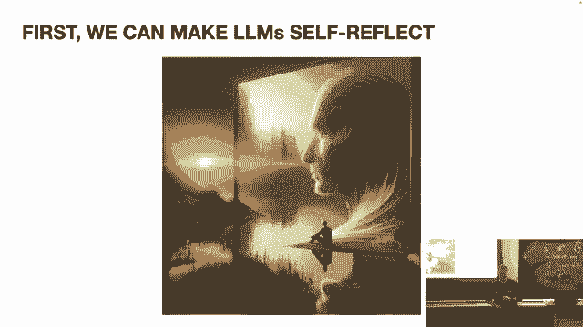
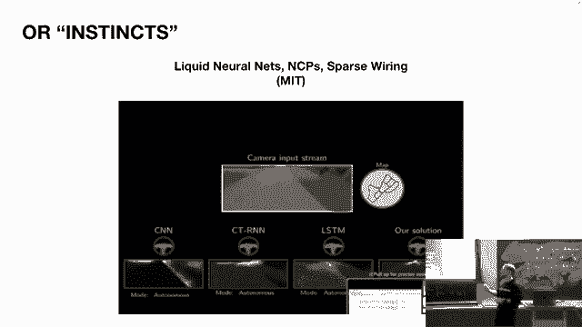
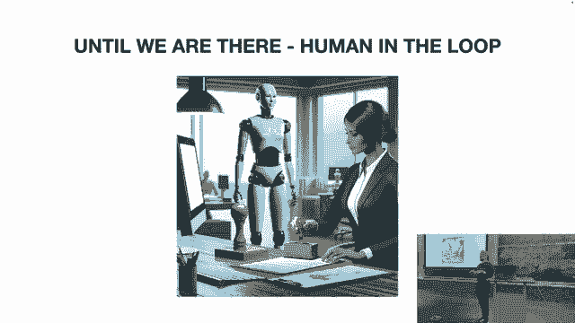
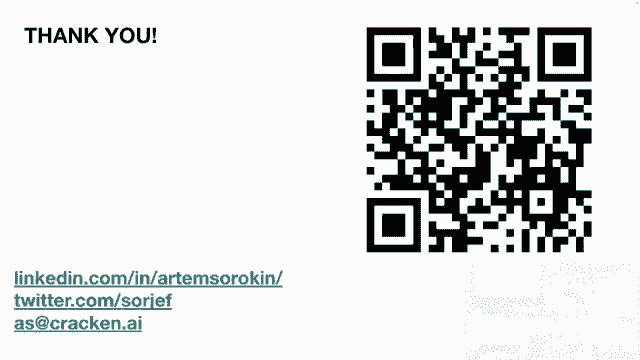

# P7：7、MIT 6.S087 Foundation Models & Generative AI.AUTONOMY - Moss学长 - BV114tLemEdn

但是秋天从硅谷飞过来了，他会在这里，基础的第一部分是第一道墙，但是他要谈论代理，所以请享受，是的，大家好，所以我现在就要快速地进入主题，想象一下，你想要研究人工智能的未来主题。

你想要理解人工智能空间在未来不久内将要发生的事情等，你不想在一个一小时三十分钟的讲座上看到它，你不想点击成千上万的链接，你不想研究和花费很长时间去做那件事，你想要立即得到一个简洁的报告，就在那里。

现在通过自主代理这可能实现，现在也基本上可能发送提示来充电，Gpt并从最喜欢的餐厅获取你最喜欢的比萨，此外，现在可能执行任何几乎任何在线任务，比如，例如，在网上做加州驾驶测试。

你可以看看这个家伙邪恶的脸庞，你可以相信是他自己做的，所以是的，我的名字是艺术，我原本，我是一名软件工程师，我在乌克兰出生和长大，我已经开发了超过十年的人工智能产品。

我猜测现在的每一个乌克兰软件工程师都是如此，这是因为地缘政治的情况，我也是一名道德黑客，并在网络安全领域工作很多，我还是一名连续创业者，我来到麻省理工学院是为了获得我的MBA学位。

但是太多人问我为什么软件工程师要获得MBA学位，所以我辍学了，并不是因为这个原因，我开始自己的公司，它的名字叫做Cracken Ni，我们正在构建代理，提升全球数字可靠性和安全性的任务。

我们在网络安全和软件开发领域基本构建了自主AI代理，现在，我想快速谈谈这个领域的术语，非常混乱，非常混乱和复杂，不幸的是，目前，就像任何新领域一样，我也想从AGI人工智能通用智能的角度探索自主AI代理。

并且我想要向你介绍一些在行业中被使用的技术和机制，以便你现在可以构建这样代理，这样你可能可以离线研究这些主题，特别是在术语方面，Gpt是一个模型，Gpt一Gpt，Two Gpt，Three Gpt。

Four Chad，Gpt是一个saas产品，Gps现在是代理或副驾驶或助手，所以行业内的术语极其极其混乱，不同的东西意味着相同的东西，尽管名称不同，不同的东西，即使名称相同，意味着不同的东西。

所以现在它就像超级混乱，这是可以接受的，你需要理解这是可以接受的，当你在自主代理主题上搜索时，你在一些论文中会看到，神经符号链接在另一个研究中，增强生成谷歌会告诉你这叫做锚定。

其他人可能会使用情感锚定在概念中，这是可以接受的，但我们将讨论几个关键术语，代理自从人工智能的出现以来已经发展了相当一段时间，基本上在旧的人工智能深度学习热潮期间，这种架构出现了，那是相当久远的。

基本上其主要组件是，我们有一个可以自主执行的系统，它具有传感器，它具有执行器，它与环境交互，后生成人工智能热潮，就像几年前，我们得到了一个更简单的架构和一个更简单的方法，执行器和传感器被称为工具，现在。

在这个系统中，我们可能有一个llm作为核心来自一个家族的人工智能模型，基本上为整个代理提供推理能力，我们向代理分配一个任务，它需要实现一个目标。

今天我还想定义一个东西，那就是什么是i，什么是人工的，通用智能，我认为谷歌已经采取了这种方法，实际上已经有了一个非常好的定义，agi基本上是可以完成，人类可以完成的任何任务，或者可以做的。

或者可以在任何环境中交互和反应，人类可以交互和反应。

两天是多少，AI缺少成为很好的我，除了关于礼拜的愚蠢笑话之外，嗯，今天的AI就像一个在洞穴中冥想的僧侣，所以当你与它交互时，它像llm或charge gpt一样，它是快照，时间和空间和知识，它非常明智。

它具有广泛的一般知识，但它存在于时间之外。

存在于环境中之外，基本上你来充电，Gpt，你带来一封写着任务的信，Cgp来获取这封信，像僧人一样阅读并写下它，结果给你回来并继续冥想，它也有许多限制，特定的可扩展性限制，可扩展性的限制之一是事实是。

如果你像带一堆书给这个僧人，它只会截断已经提供的信息的一半，并且只会与允许那样的信息工作。

它的上下文窗口允许，另一个需要关注的当前ai的方面是，理查德在今天的讲座中提到的另一个类比是基础模型，当前的llms基础模型是大脑的组成部分，但不是整个大脑，我们的整个大脑都更加复杂。

它是由相互交织的人工智能组成的家族，而且他们并不是整个身体，身体有传感器，与感觉、看到和有视力的接口相连，因此，当前的lm模型现在只有有限的接口来做到这一点，尽管考虑到这一点。

我们今天能否实现agi的能力，答案是我们基本上可以，或者至少我们可以努力实现agi的能力，并且有几种方法来实现这一点，一种方法是年轻的李昆，他是meta提出的首席科学家，基本上他说llms很笨。

他们无法执行许多任务，比如说规划，他们仍然产生幻觉，所以我们需要构建一个全新的架构，基本上继承我们自己的知识并构建一种全新的方法，一种全新的人工智能模型，可能基于transformers或其他东西。

我会给这个新的ai新的这种新能力的架构，但是，我是一名软件工程师，我喜欢解决问题，在软件工程行业，我们常说'组合性优于继承性'，所以，我们仍然有可能尝试使用领域已经存在的东西，并尝试应用。

尝试克服那里的限制，尝试围绕它创建新的技术，实际上，我们还试图将现有的llms推向类似的能力，只使用我们所有的东西，这是当前另一种方法，目前，工业和硅谷的大部分初创公司和公司都在做这件事，具体如何做。

我们如何构建，我们如何推动当前的lms，那些坐在洞穴中的僧人如何更像一个，首先，我们可以给它，我们可以赋予llms自我反思的能力，作为人类，人类，我们正在迭代思考，我们没有像，当我们产生一个想法。

我们的下一个想法是被喂养的，前一秒的想法，所以我们迭代地思考某件事，直到我们得出结果，我们不是立即就去产生想法或建议或什么的。

这种像关联性思考在迭代中的技术被称为思维链，并且已经被应用在提示工程中，你可以自己应用它，即使现在当你去充电gpd并让它思考一些概念时，嗯，基于你的，迭代几次，前一个结果的新迭代。

你基本上会实现一种链式思考技术，它非常强大，强大到谷歌实际上决定用它来为他们的营销目的时发布gemini ultra，这是他们新的模式，他们基本上声称他们的模型比gpt更强大。

但实际上它比gpus更强大，在三次迭代的思考链上，所以再次，通过简单的提示技术，它可以极大地提高模型的性能，现在，技术是批评提示，基本上就是你，在你洗完澡后，看看你在镜子中的样子，也许成功。

也许失败的约会，你喜欢思考你做错了什么或者你做对了什么，所以基本上，你可以实施同样的方法。

或者在当前LLM和基础模型的提示中，如果我们也像人类一样，我们不仅喜欢自我反思和迭代思考时间，我们还从经验中持续学习，我们持续调整大脑中的重量和偏差，我们不是快照，而是静态的。

并不是我们只训练在某种特定知识上，我们持续提高自己，这种改进可以通过一种叫做强化学习的策略实现，是人类反馈，当你打开'charge gpt'时，你会看到'喜欢'或'不喜欢'，这就是基本打开状态。

AI正在收集关于'charge gpt'如何产生结果的数据，基本上在某个时间点，他们会根据'喜欢'和'不喜欢'来微调他们拥有的模型，产生一个更好、性能更优的微调模型，但现在的AI非常聪明。

我们可以问AI做'喜欢'和'不喜欢'吗，我们可以问AI记住做这种批评提示吗，如果我们在这里要求做这种批评提示，这种技术将被称为人工智能反馈的强化学习，它相当新，而且我已经在行业中广泛使用它。

这一层的概念，如果就像睡眠，就像人类睡眠的概念，当我们睡觉时，我们再次调整我们的权重和偏差，我们记住新信息，我们学习新的东西，这就是我们喜欢的东西，镌刻我们当天学到的东西。

但现在它可能还不会给当前llm产生信息和产生价值的能力，嗯，与最近的事件相关的任务，但我们能否只给这个坐在洞穴中的僧人和一台电脑，并提供新的数据源的访问权，或者我们能给他们一个词汇或一本书。

这样一台电脑和一个llm，对不起，一个nlm可以搜索这个新的数据源，以获取与任务最相关的信息，那也是最近的，也许从今天开始，也许从几秒钟前开始，甚至甚至我们能给他们一个笔记本，用来记住最近发生的事情。

来写下，在任务中被问到的内容方面记一些笔记，就在之前，因此，我们在行业中目前使用所谓的检索增强生成，谷歌也称其为基础，这种方法扎根，但大多数人仍然叫它rag再次，回到术语方面。

目前这是一个极其热门的领域，检索增强生成极其极其活跃，嗯，我自己早上醒来，早上醒来，我们公司在内部开发了一个工具，基本上就是一个葬礼，所有的新闻来源，嗯，围绕AI主题，与我们相关的所有内容。

所有的学术论文和类似的东西，它基本上只过滤出相关的项目并返回，它将其交给团队阅读，每周我都阅读一些新的，检索增强生成每周都有新的 technique 冒出来每周，你的方法也在那里。

所以它是一个非常活跃的领域，实际上，它为熟悉软件工程的人产生了相当有价值的结果，无论是他们想要尝试什么，检查lama index框架，他们正在极其出色地收集这些技术和实施它们，因为它们在学术论文中发表。

我现在要快速抽奖，如果你解决了下一个任务，在五秒钟后的下一页上，如果你能做到，我会在加利福尼亚的时候买回两个更多的客人，如果你能做到，你会买三个，考虑到波士顿这里的价格，但是，基本上在下一页上。

我会给你一个任务，你有五秒钟来解决它，准备好了，五四三二一你输了，好吧，这对我来说太困难了，当我在加利福尼亚的时候，我们为什么在计算器上如此糟糕于符号计算，对于计算器来说，解决这个问题只需要微秒。

对于这来说极其计算效率，我们在符号处理上极其低效，对于处理结构化数据，我们的大脑并不为这个问题与llms相同的问题而设计，不幸的是，llm的架构并不适合处理符号计算，结构化工具和其他类似的东西，但是。

关于检索增强生成，我之前提到的那个，也给llamps提供了工作与这些工具协同工作的能力，rag，检索增强生成，也给llamps提供了与这些工具协同工作的能力，现在，LLMs可以使用计算器。

它们可以使用一些接口来在环境中行动和交互，而且它们基本上可以为任务提供更高效的解决方案，现在，如果一个结构需要计算才能发生，如果我们教LLM自我反思，我们可以进行持续学习，嗯。

我们提供LLM访问工具的机会，到结构化知识，到新的来源等，我们唯一需要做的就是教它如何规划，嗯，规划是一个单独的，相当大的主题，有数千篇论文在那里，如果你想尝试与我所提到的类似分词技术玩耍。

Llama Index，去看看，长链，在我们公司实际上只有几种规划框架，我们构建我们自己的框架，但长链可以让你开始学习一些基本的东西，你可以去查看，嗯，宝贝，我是LLM，规划者和数千篇其他论文。

基本上提出了不同的方法和规划技术，但LLM本身，仍然有很多糟糕的规划者，这就是我在Twitter上关于年轻李孔的帖子上展示的，在研究和论文中已经证明，LLMs的规划能力非常有限，嗯，在这里。

你可以在CGPT的截图上看到，那不是我的脚本截图，你可以去查看最近的Twitter帖子，但基本上它无法为简单的指令规划，对于简单的任务，这是否是关键，虽然，这是否是一个关键问题，这是否是一个关键问题。

嗯，我相信这不重要，因为当我们将规划与行动结合时，我们可以实际上解决这个问题的规划，长期来看，这意味着在简单意义上，去做你的企业吧，我不知道，建造你的工作品，你总是想要建造，实际上尝试一个动作。

看看结果的部分，并观察这个部分的效果，与这个效果一起工作，感知它，然后重新规划以达到您的目标，行动是最高效的环境计算，我们不需要llms来具有规划的能力，计划得太远，计划得太远，增加信息熵。

我们不需要那个，我们可以只是规划，我们基本上只需要第一个动作被规划得好，过程中后续的行动可能没有规划得好，在我们完成最高效的环境计算后，无论何时何地，我们都会重新规划一切，对于这里使用的复杂术语。

我很抱歉，但基本上我在这里想说的是，行动比规划更有力量，行动比预测更有力量，如果我们有一个llm，如果我们打开，打开它并赋予它行动的能力和感知结果的能力，感知行动的效果，我们不需要计划得太远。

发展得太先进，在未来，我们只需要第一步被规划得好。

被执行得好，现在，有了所有这些组件，我们基本上可以构建出功能强大的，人工智能代理，实际上可以完成许多任务，并且将非常智能，就像这样，它将非常接近通用人工智能，问题，如果这样，它将完全不实用。

如果你想把它放在户外，或者为某个特定工作的目标工作，为某个特定任务，它将极其昂贵，非常低效，这是我的猜测，关于这个行业的未来，我感觉这个行业，现在正在努力优化和优化各种方法和技术。

让我来展示一下我学到的，我最近学到了，所以我不像在思考下一个动作，我通过模仿学习从观看一些YouTube视频中学到的，我没有大脑中的低效推理过程，我不考虑它，我只是执行了动作，我现在已经有了肌肉记忆。

人工智能代理，他们认为下一个部分，他们思考如何放置手，在哪里放置不好等等，因此，他们实际上进行了一些相当低效的计算，那里没有肌肉记忆技术，这种技术优化了这种缓存过程，对于这一点。

我相信基于动作和行为的模型可以是大脑的一部分，这有助于这种肌肉记忆，我也相信模仿，学习运动扩散规划将会在那里，对于AI代理也是如此，嗯，行业内正在发生一些事情，但它还没有完全到位。

在将这种方法作为自主代理一部分的实施方面，但我认为那是未来的一部分，未来的另一部分是嗯，是，视频处理和高效的视频处理，目前，LMS没有很好地处理视频信息，它们没有在视频中打印，在任何方式上。

MIT和CL都没有，液态神经网络已经开发出稀疏的连接，这基本上是自动驾驶车辆的技术，以更好地导航我们从计算机视觉传感器接收到的信息，嗯，以及对于说，无人机对于汽车，对于自主的。

对于存在于真实环境中的一切事物，并且可以感知视频信息，这是一个极其高效的模型，一个非常小的模型，但仍然可以提供导航能力，我觉得这可以与人类类似的本能相匹配。

对于最后我想附加的部分，嗯，当我们将AI代理放入环境中，当我们优化它，当它高效时，也许不是今天，也许在未来的某个时候，我们可能可以拥有这个代理社交并一起工作，已经有一些项目正在探索这个，如。

我最喜欢的一个是ChatGPT，它基本上是由AI代理组成的公司，做软件，247每个AI代理都是专一的，一个做客服，另一个做设计，第三个做测试，第四个人在做开发，你给他们一个任务。

他们都试图一起解决这个任务，作为一个集体智能，还有一个事情要你谷歌或付费，Gdp，这次讲座后是微软的自动跳框架，他们探索特定界面和代理之间的交互，如何实现这一事件，以及如何将其实现，最后再次。

当我回到关于我、人工智能和一般人工智能的主题时，我会问你一个问题，我们那里，但我个人认为，我们正在，我们已经有了所有必要的组件，但现在的问题是我们需要将它们 all 粘在一起，另一个问题是。

粘合过程不会在今年发生，明年，可能需要我们十年时间，嗯，我们可以，我们可以具体预测多少，或预测多少，但我几乎可以肯定，从理论角度来看，与 llms，我们已经解决了一个关键关键问题，那就是推理。

我们以前没有这能力，现在我们有了这能力，并将这界面带来，是将这些工具带来，将推理模型放入时间和环境中，只是工程问题，并将这些组件以正确的方式组合，直到我们到达那里。

直到我们到达 agi 部分，直到我们到达这个点，我们仍然需要考虑我们如何使 this ai 代理实用，这是至关重要的，目前我们最多不能信任，我们建造的 ai 代理。

所以我们需要理解我们如何将人类放入循环中，人机交互和用户界面的巨大主题对于 ai 代理，目前正在硅谷，许多公司也在谈论这个问题，我们有关于这个问题的 hackathons，我们在那里探索。

如何具体地将人类放入循环中，来批准 ai 代理想要做的事情，我觉得直到我们得到，直到我们获得我们需要的所有信任，嗯，这可能将是行业的一个关键发展，嗯，在行业中，这可能是另一个关键的发展。

并且我们可能永远都不会到达那个点，当我们有了所有的信任，人类总是要对某些事情负责，我们只会减少一些东西或者，委派我们感到舒适委派责任的一些东西，但是，大多数时候，决定仍然由人类驱动，因此。

我们现在需要学习如何有效地将人类与代理集成，以便他们可以很好地合作。

从今天开始，或者可能整个课程结束后，了解一下这个概念，我认为幻灯片将被发布，关于它们的费用大约是gpd，再次谷歌它们，不要害怕术语，它可能稍微有点复杂，它可能令人困惑，但是，这就是今天的行业结构。

不幸的是，所有这些技术和方法都非常强大，并且将像代理这样的自主agi带到生活中，即使今天，我总是很高兴与你讨论这个话题，这是我的linkedin在qr代码上，这可能是推特，虽然我不使用它那么频繁，嗯。

欢迎与我联系并讨论整体自主代理，非常感谢您，各位，你们花费了像两个小时这样的时间听关于许多概念的讲座，它不断地在-between不同的主题之间切换，我想说，是的，但是，无论如何，问题来了，是的，所以。

第一部分是像，这些模型是否是目前的，像你们这样想的方式，它更像是受到启发的，但是，关于智能，就像你说，大脑中有不同的部分，或者模型，像爪子这样的工作方式，但他们相信这像目标，或者另一种排列方式。

比人类好得多，我们应该使用像人类一样，灵感，这是一个极其极其伟大的问题，我感觉因为也，我对这个问题没有答案，我感觉，嗯，从我看到的来看，有一些像今天里卡德讨论的主题，对，我们仍然可以使用基础模型。

使用那些以前无法想象的模态，在人类存在的地方，我的意思是我们在生物学中看不到，在我们的周围环境中，有一些也使用这些数据的东西，用这种方式使用这些信息，嗯，就是说，基础模型现在已经被构建起来了。

比如行为基础的模型，已经被用于零售，例如，所以它就像是一个整数，所以仍然有一些进化无法实现的东西，但我感觉进化仍然是一个非常强大的过程，对，已经构建了我们大脑中极其高效的机器，在我们的头脑中。

所以我仍然感觉我们会从，并且会学到很多关于它的东西，我们会从历史遗迹中学习很多，因为现在我们正在 artificial 构建它，对，但我确信这是自然为我们提供的大量信息，我们尚未完全探索。

我感觉我们基本上会偏向于人类大脑是如何发展的，以及我们如何互动和行动，是的，这是有道理的，是的，谢谢，好的，棒极了，谢谢，好的，太棒了，嗯，非常感谢，大家还好吗，兄弟们。

