# 2：基础模型与生成式AI的工作原理 🧠

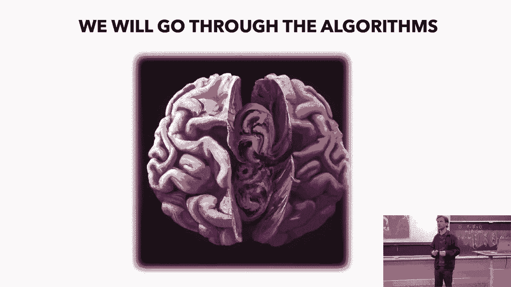

在本节课中，我们将深入探讨基础模型的训练原理以及生成式AI的工作机制。我们将从语言模型开始，逐步扩展到视觉和其他模态，理解如何从无标签数据中学习世界的结构，并最终将这些知识应用于各种任务。

---

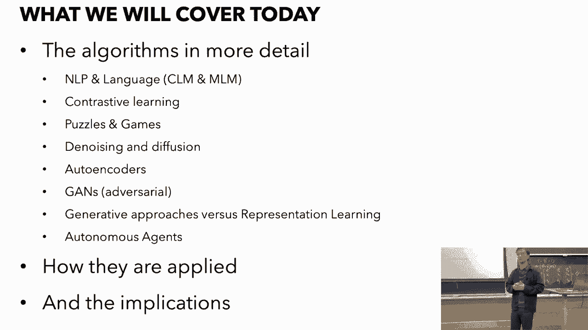

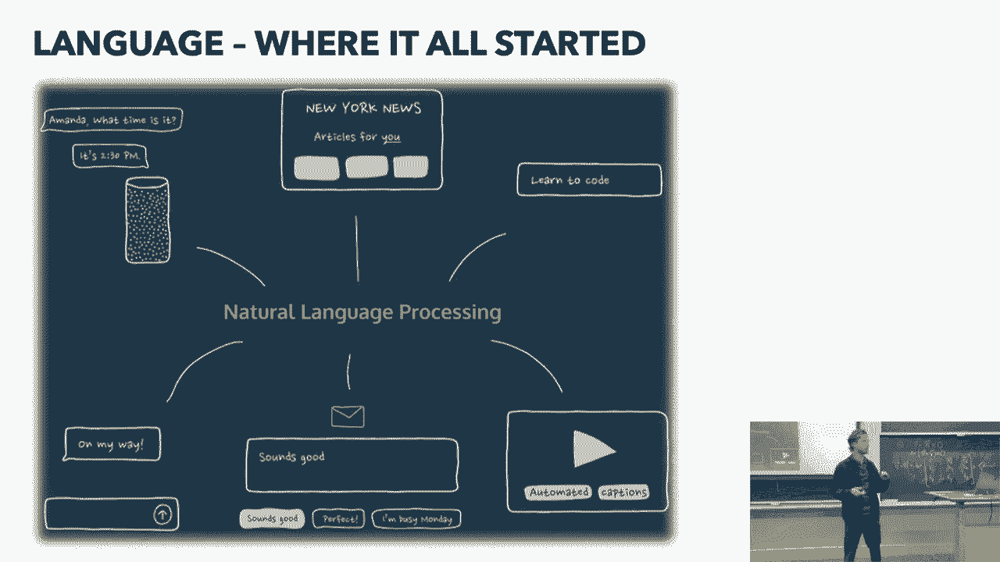

## 回顾：从观察中学习

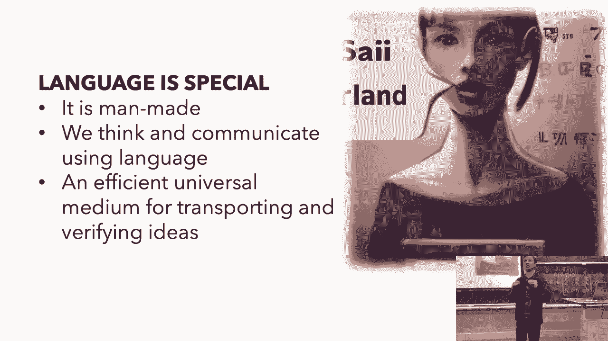

上一节我们介绍了AI的核心是从观察中学习，其意义是上下文化和关系化的。数学本身无法完全处理世界的复杂性，因此需要新的网络和AI方法。

监督学习依赖于人类标记数据，难以扩展。强化学习在没有起点的情况下过于危险和缓慢。因此，我们需要从无标签数据中学习，这种方法可以很好地扩展，只需数据本身即可学习结构。

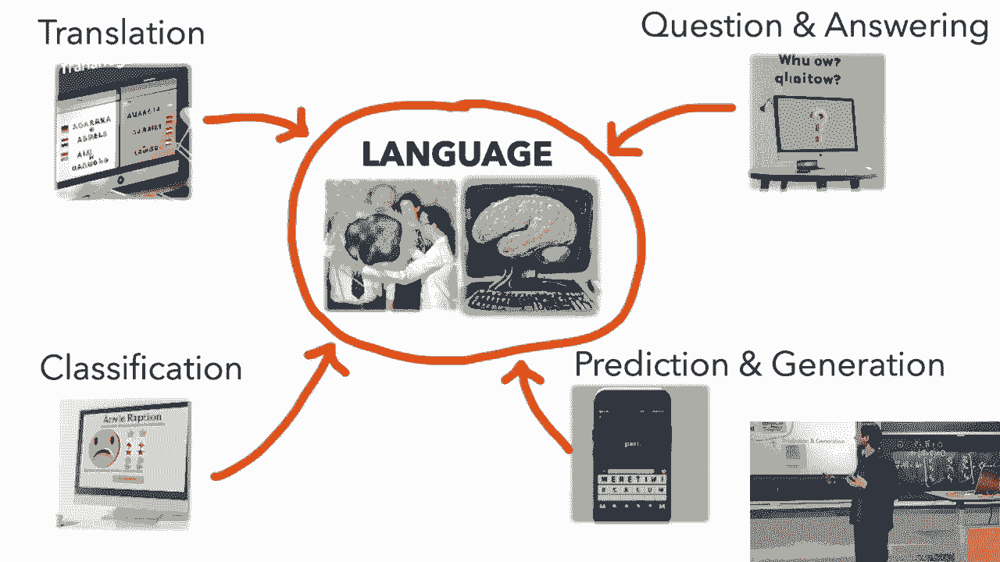

通过关联概念（例如“狗”与“猫”），我们可以获得对意义的非常关系化的理解。本节我们将更详细地探讨这些不同的学习方法。

---

## 语言的特殊性与早期方法 🗣️

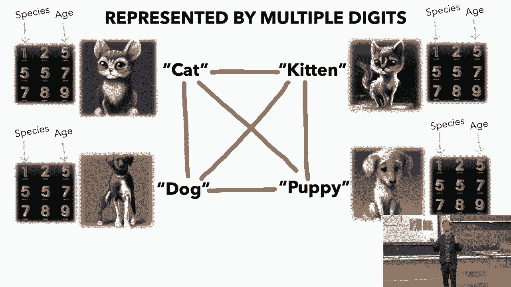

语言是人造的，我们不仅用它交流，也用它思考。它是一种高效的通用媒介，用于传输和验证想法。理解语言是创建自主代理乃至更接近人类智能的关键。

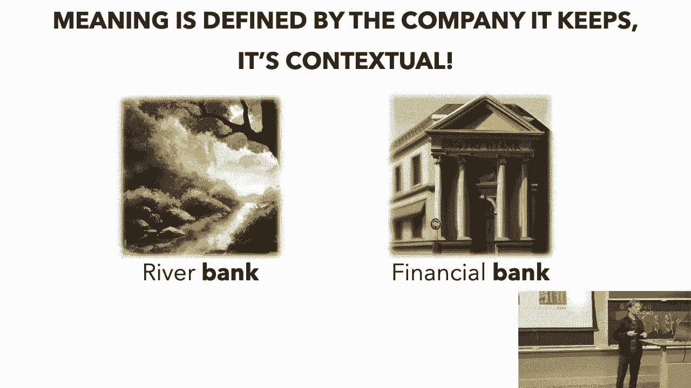

几年前，自然语言处理的研究是孤立的：每个特定任务（如翻译、问答）都有独立的研究团队、数据集和模型。这促使我们思考：是否存在一个可以优化的、关于语言理解的底层目标？我们能否学习一种通用的语言表示，然后将其用于所有下游任务？

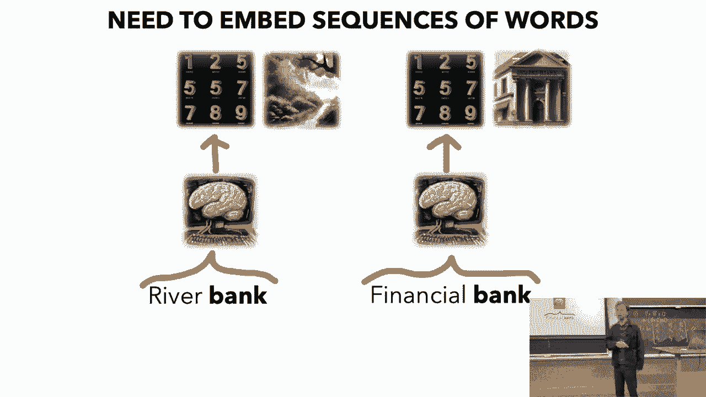

我们希望有一个AI模型能够消化语言，将其意义编码为某种表示（例如数字向量），然后将这种表示输入到所有任务中。如果能够特征化并捕捉文本的真实含义，这将非常有用。

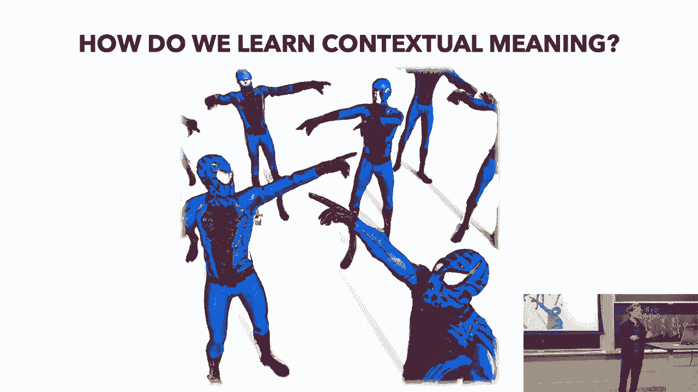

### 如何表示词义？

词义是高维且微妙的。例如，“猫”、“小猫”、“狗”、“幼犬”这些词之间的关系不仅涉及物种，还涉及年龄等属性。仅用一个数字无法捕捉这些细微差别。

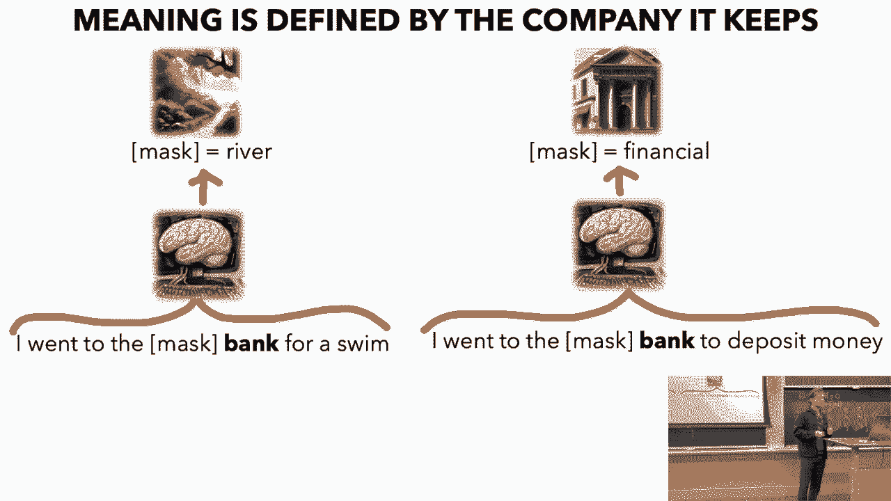

因此，我们使用高维向量（即数组的数组）来表示词义。向量的不同维度可以对应不同的语义属性（如物种、年龄）。这样，含义相近的词在向量空间中的位置也更接近。

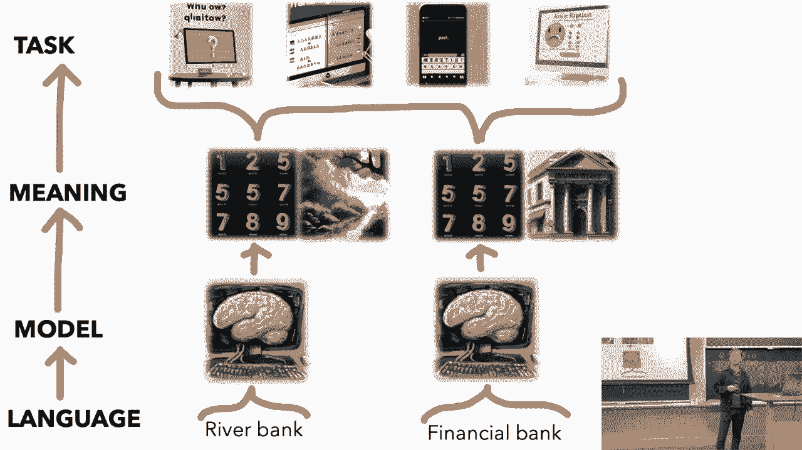

然而，词义是高度上下文化的。以“bank”为例，在“river bank”和“financial bank”中含义截然不同。因此，我们需要学习如何将**整个文本序列**映射到一个能捕捉其上下文意义的向量中。

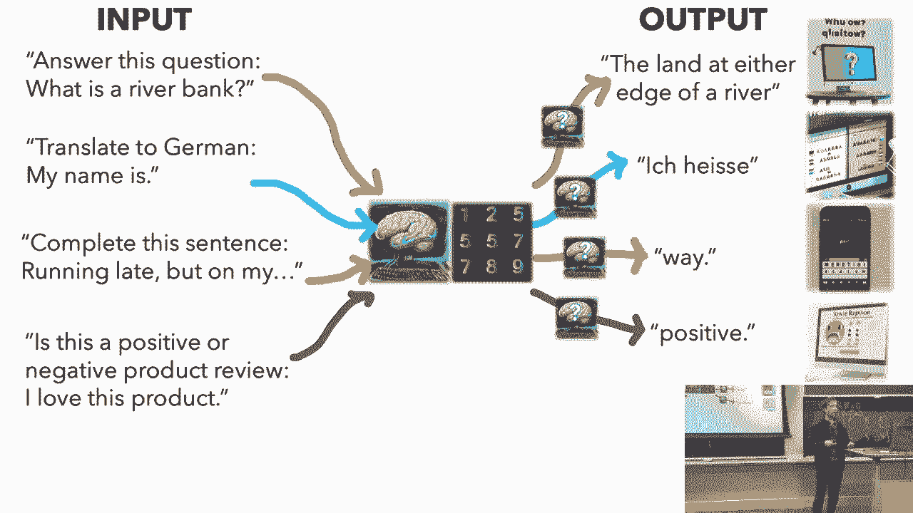

### 通过上下文学习意义

意义由其相伴的词语定义。我们可以利用这一点来学习：从互联网上获取句子，随机遮蔽其中一个词，然后训练模型根据周围的词来预测被遮蔽的词。

例如，给定句子“我去 [MASK] 游泳”，如果模型能预测出“河流”，则说明它理解了此处的“bank”指河岸。同样，对于“我去 [MASK] 存钱”，模型应预测“金融”。通过这种方式，模型学会了根据上下文关联词语的意义。

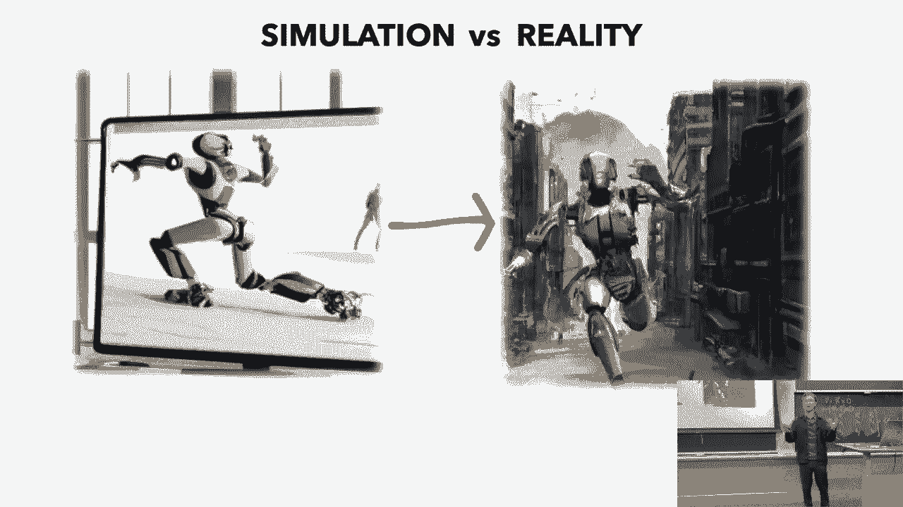

这种方法被称为**掩码语言建模**，是训练大规模语言模型的基础，能产生对文本和语言非常好的特征表示。

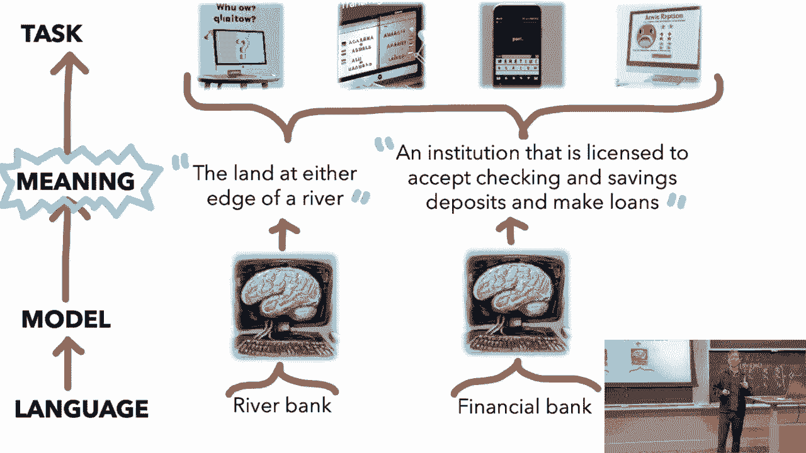

---

## 从表示学习到文本到文本模型 📝

我们首先学会了在高维嵌入空间中编码文本意义。但语言本身就能传达意义，为何不直接进行文本到文本的转换呢？这样在工程上更统一。

我们可以将所有下游任务都重新表述为文本到文本的问题：
*   **翻译**：输入“翻译成德语：My name is...”，输出德语文本。
*   **分类**：输入“评论：这部电影很棒。情感：”，输出“积极”。
*   **问答**：直接以文本形式提供问题和答案。

谷歌的T5模型就采用了这种范式。它将所有任务都视为文本到文本转换，简化了工程架构，并允许模型在不同任务间获得协同效应。

### MLM 与 CLM

我们主要讨论两种预训练目标：
1.  **掩码语言模型**：随机遮蔽句子中的词，根据所有上下文词（前后）进行预测。
2.  **因果语言模型**：只根据之前的词预测下一个词。

MLM因为能看到双向上下文，通常对语言理解更好。CLM虽然只能看到上文，但训练更高效，并且被专门优化用于**生成下一个词**。正是CLM的这种特性，催生了像ChatGPT这样的模型。

### 生成式突破：预测下一个词

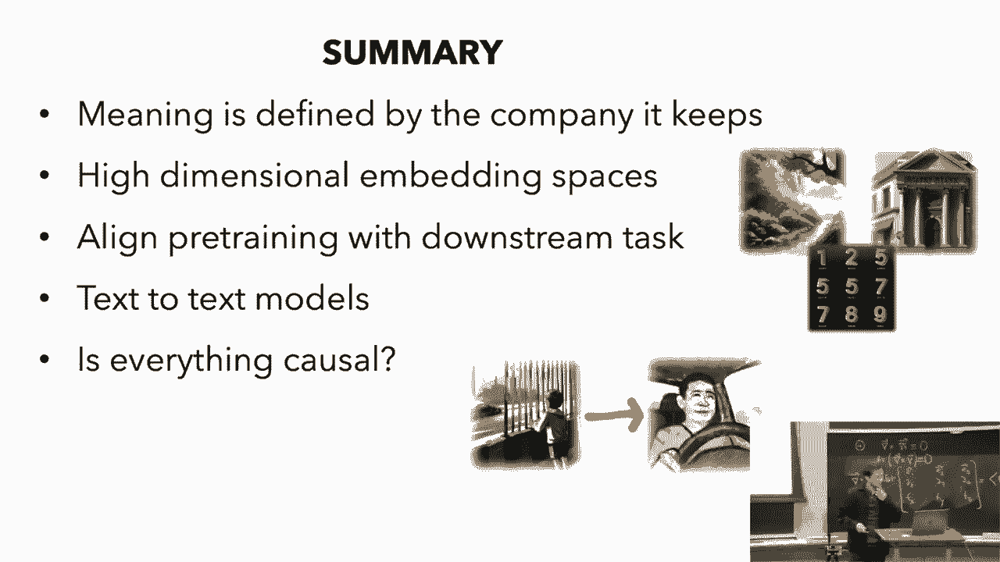

因果语言模型的核心任务是：基于之前的单词预测下一个单词。当这个简单任务被扩展到巨大规模时，奇迹发生了。

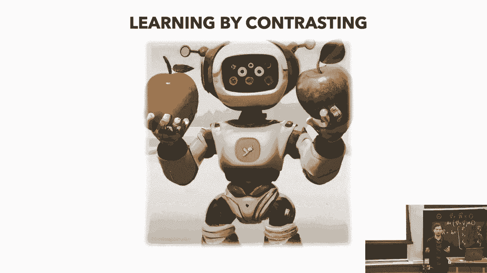

如果我们有一个能很好预测下一个词的模型，那么对于任何以提示开头的任务，最合理的“完成”就是正确的答案。例如，提示“河岸是什么？”，模型生成的下一个词序列就构成了答案。这使它成为一个通用的多任务解决器。

**总结**：语言的意义由上下文定义。我们可以通过预测被遮蔽的词来学习这种意义。预训练（如MLM/CLM）与下游任务对齐得越好，模型性能越佳。最终，简单的“预测下一个词”任务，在足够大的规模下，涌现出了解决多种任务的能力。

---

## 视觉与其他模态的表示学习 👁️

在视觉领域，我们也可以应用类似的思想，但方法有所不同。

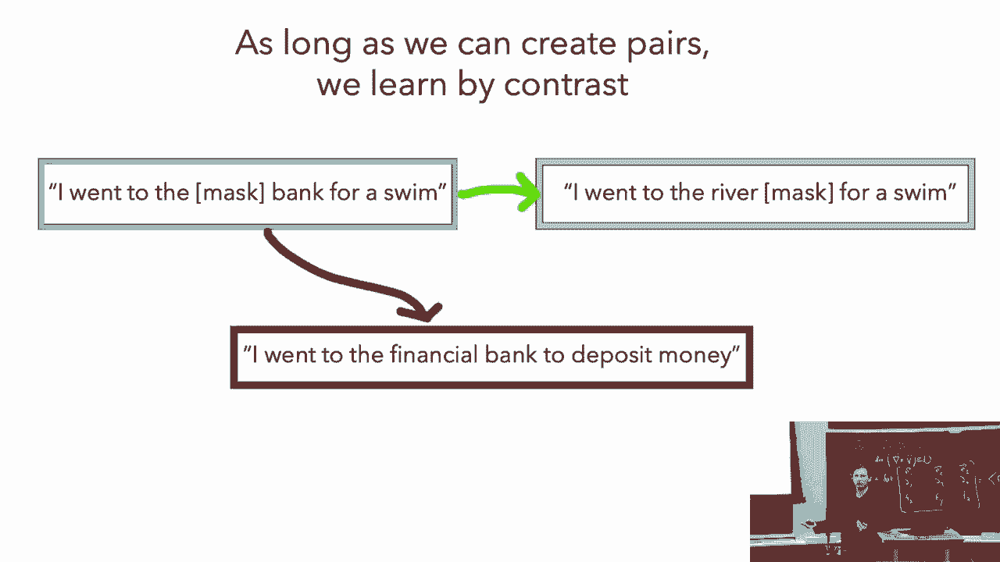

### 对比学习

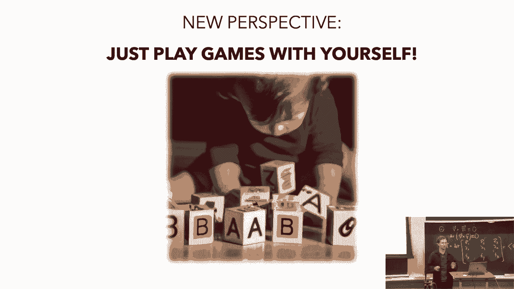

核心思想是：出现在同一张图片中的物体，平均而言比随机图片中的物体更相关。我们可以利用这一点进行学习。

具体做法是：取一张图片，生成两个不同的裁剪区域。训练模型将这两个来自同一图片的裁剪映射到向量空间中相近的位置，而将来自不同图片的裁剪映射到远离的位置。为了防止所有向量坍缩到一起，我们需要同时拉近正样本对、推远负样本对。

在实践中，这通常被构建为一个分类任务：给定一个裁剪，模型需要从一组候选裁剪中选出与之配对的正样本。这种方法能产生非常好的图像表示。

对比学习具有普适性，只要我们能定义正负样本对，就可应用于语言、音频等多种模态。

### 通过“游戏”学习

另一种视角是让模型通过解决特定“游戏”来学习理解概念。如果模型能解决游戏，就意味着它理解了背后的概念。
*   **乱序重组**：打乱句子中的单词或图片中的拼图块，让模型恢复正确顺序。这迫使模型理解语法、语义或视觉结构。
*   **去噪（扩散模型）**：向图片添加噪声，让模型尝试去除噪声以恢复原图。模型需要理解图像内容才能完成此任务。迭代去噪的过程就是“扩散”。像Stable Diffusion这样的模型可以从纯噪声生成图像。
*   **压缩（自编码器）**：将图像压缩为低维向量（瓶颈），再从这个向量重建图像。模型必须学会保留最重要的信息。
*   **对抗游戏（GAN）**：一个生成器网络尝试生成逼真的图像，一个判别器网络尝试区分真实图像与生成图像。二者对抗训练，最终生成器能产生非常逼真的输出。

---

## 生成与表示，以及多模态共享空间 🔄

以上方法大致可分为两类：
1.  **表示学习**：专注于将数据嵌入到有用的特征空间，用于分类等任务。
2.  **生成学习**：专注于从噪声或提示生成新数据。

一个理想的系统是拥有一个**共享的嵌入空间**。无论输入是图像、文本还是音频，都被映射到同一个向量空间中。这样，我们可以：
*   将图像的嵌入输入文本生成器，得到描述图像的文本。
*   将文本的嵌入输入图像生成器，得到文本描述的图像。

这对于多模态理解和应用至关重要，就像人类大脑能关联不同感官接收的信息一样。在商业上，这可以实现跨领域的推荐，例如根据用户的食品购买习惯，推荐其可能喜欢的时尚物品。

---

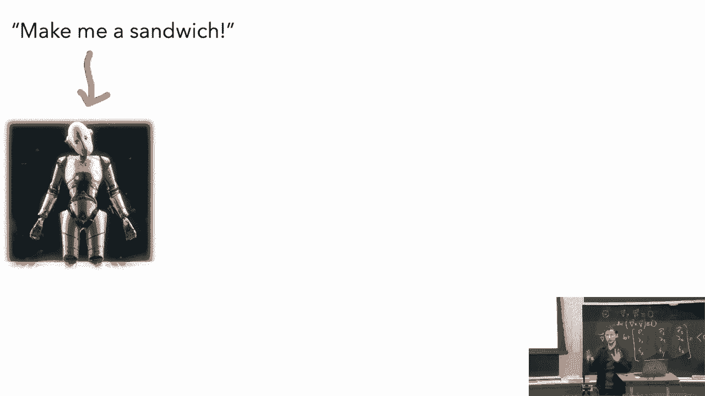

## 语言作为思维与验证的媒介 🤖💭

为什么语言模型如此强大？因为语言不仅是交流工具，更是我们思考和规划的高效媒介。即使不能说话，智能体也可能拥有用于内部推理的语言。

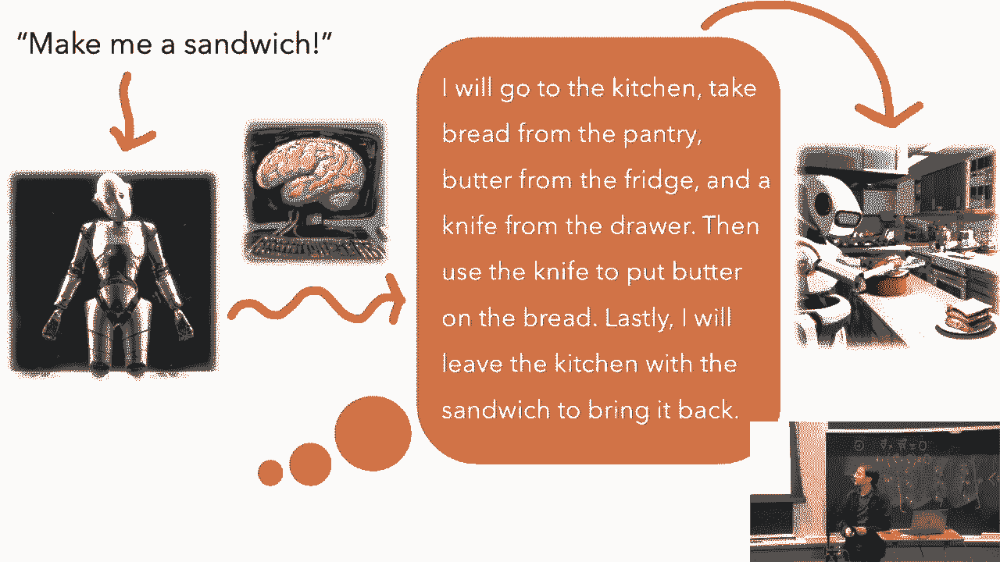

这在训练自主代理（如机器人）时尤其有用。传统方法将任务映射到难以解释的高维动作向量。而如果让模型输出一个**语言描述的计划**，人类或另一个语言模型就可以轻松验证和纠正这个计划。

例如，一个机器人计划“从冷冻室拿刀，在刀上涂黄油”。我们一看就知道这不合逻辑。我们可以让语言模型纠正这个计划：“从抽屉拿刀，在面包上涂黄油”。语言作为一种高效的媒介，极大地便利了想法的验证、纠正和迭代改进。

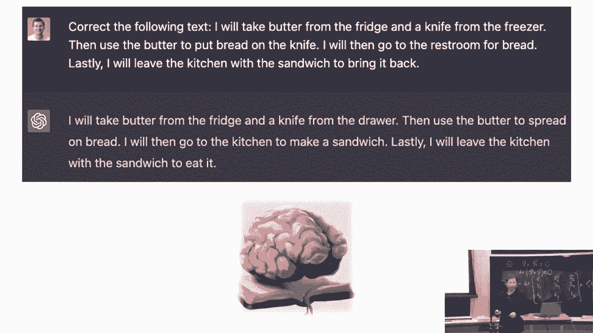

### 自主代理：迭代与工具使用

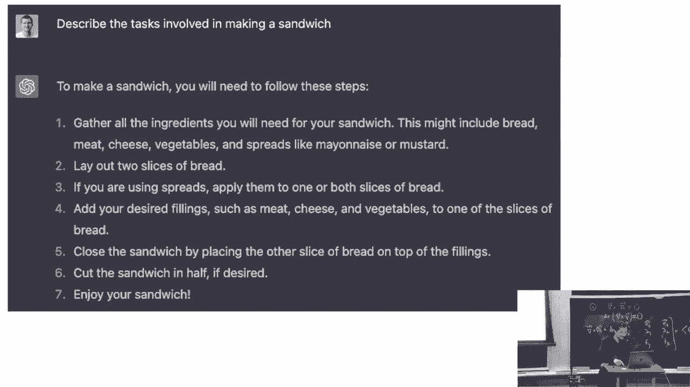

自主代理本质上是一个可以迭代运行自身输出的大型语言模型。它分析输入，生成输出，再以输出为输入进行分析和改进，如此循环。这类似于人类反复打磨想法的过程。

此外，代理还可以被赋予使用工具的能力，例如：
*   **互联网搜索**：获取实时信息。
*   **计算器**：执行精确计算。
*   **调用其他专业模型**：处理图像、代码等。

通过结合规划、自我反思和工具使用，自主代理的能力得到了极大增强。

---

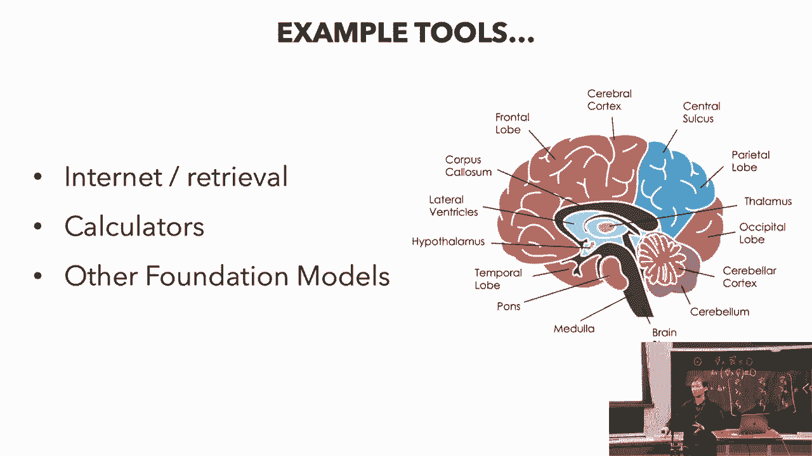

## 智能的协同与集中化趋势 ⚙️

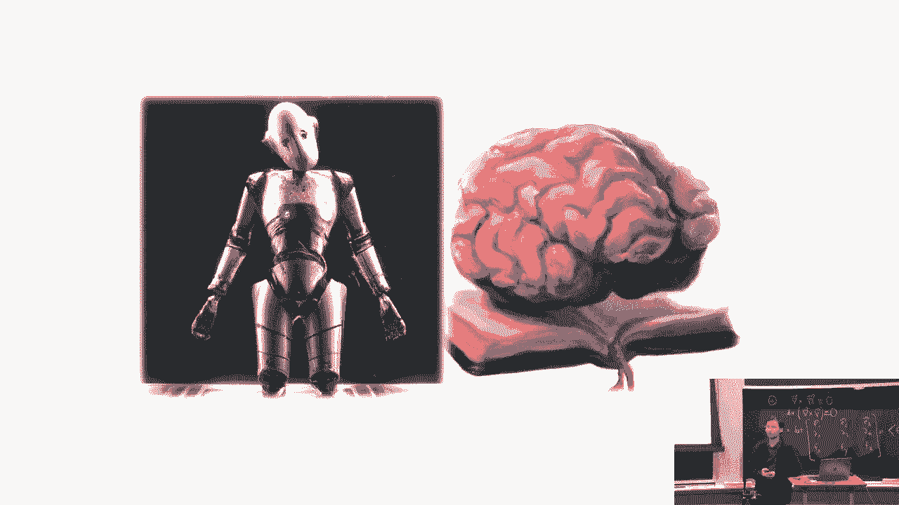

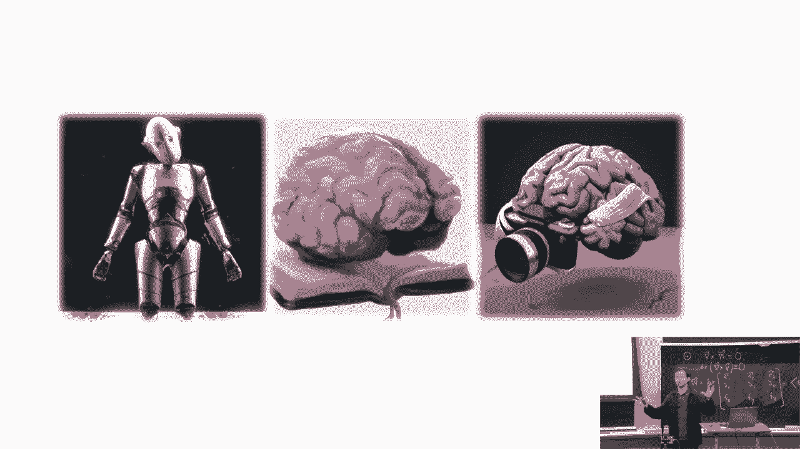

新AI显示，智能是高度协同的。试图将语言、视觉、推理等能力完全分开，往往会损害整体性能。一个统一的大脑比多个孤立的小脑更强大、更高效。

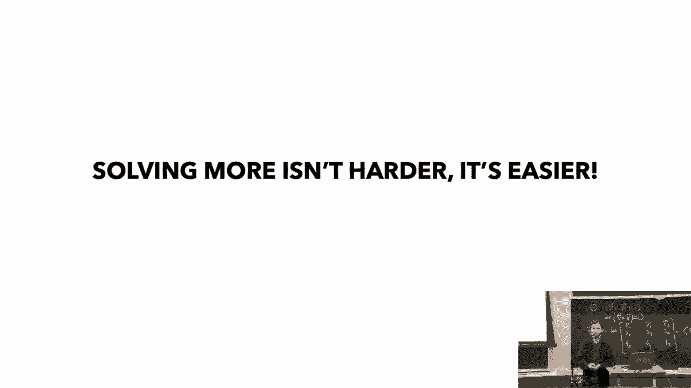

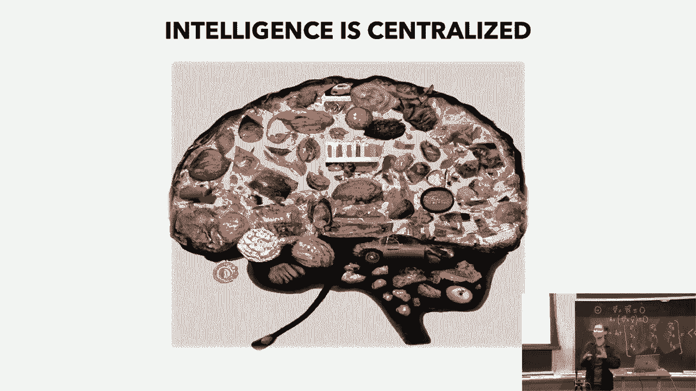

这暗示着AI市场可能呈现“赢家通吃”的趋势，因为能够整合更多数据、更多任务、更多模态的单一大型模型，其性能优势会越来越大。这带来了巨大的机遇（解决复杂问题），也带来了挑战（权力集中、系统脆弱性、伦理问题）。

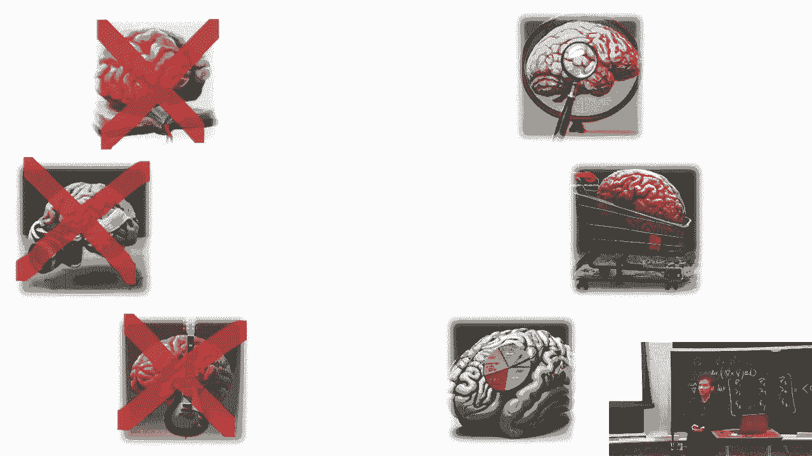

---

## 总结与预告 📚

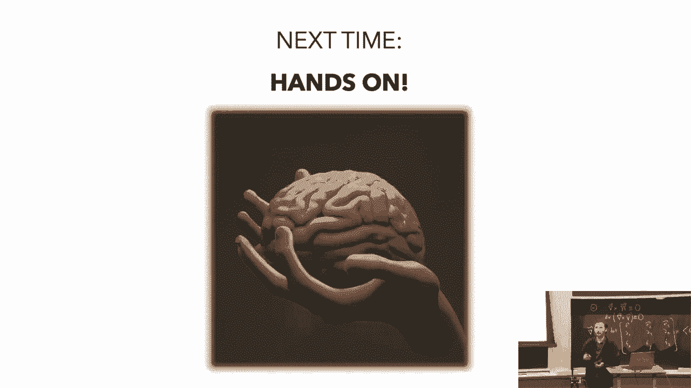

本节课我们一起学习了：
1.  如何通过掩码语言建模和对比学习等无监督方法，从数据中学习意义和表示。
2.  语言模型从表示学习到文本到文本，再到因果预测下一个词的演进过程。
3.  视觉和其他模态的表示学习方法，如对比学习、扩散模型。
4.  生成学习与表示学习的区别与联系，以及多模态共享空间的重要性。
5.  语言作为思维和验证媒介的关键作用，以及如何基于此构建自主代理。
6.  AI智能协同与集中的趋势。

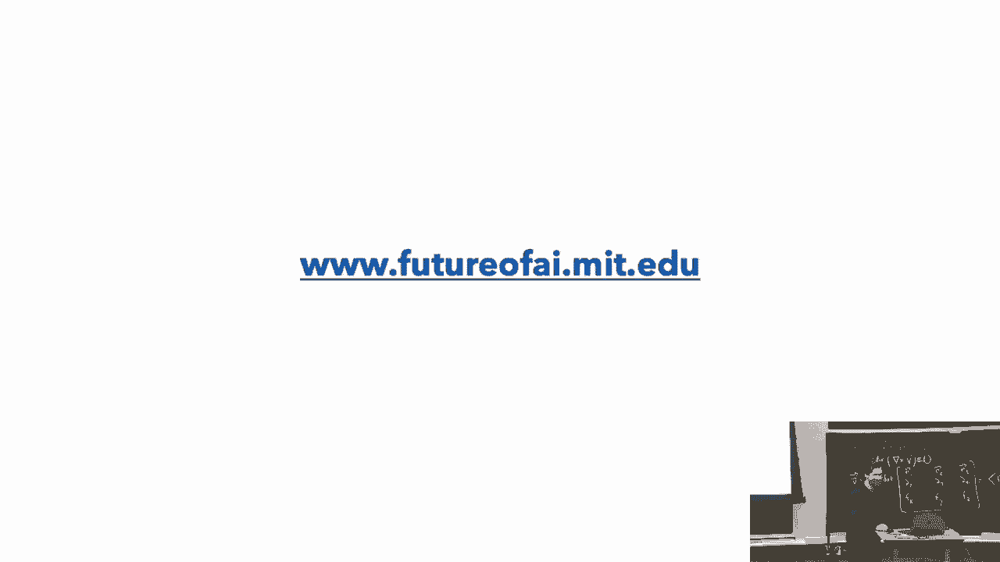

在下一节课中，我们将亲手操作，深入解析Transformer模型的具体架构，并探讨文本到图像模型（如Stable Diffusion）的工作原理。敬请期待！