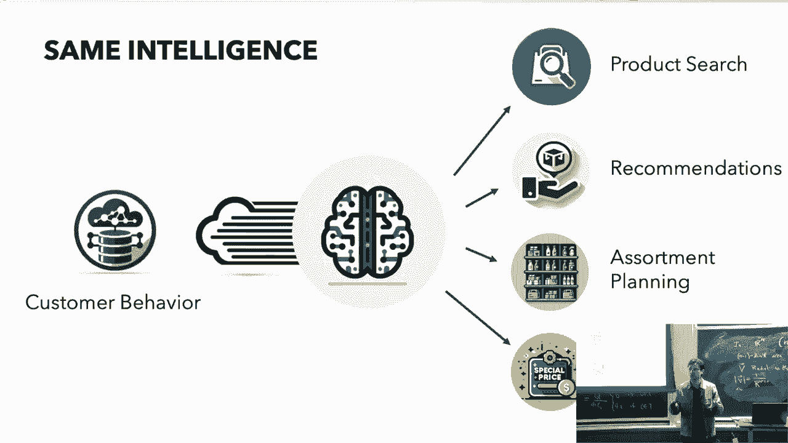
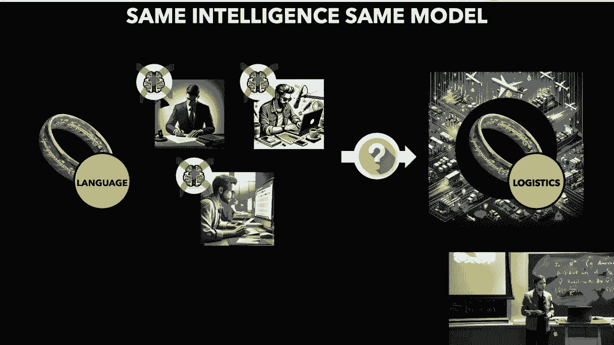
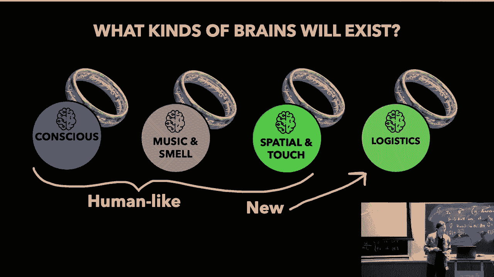
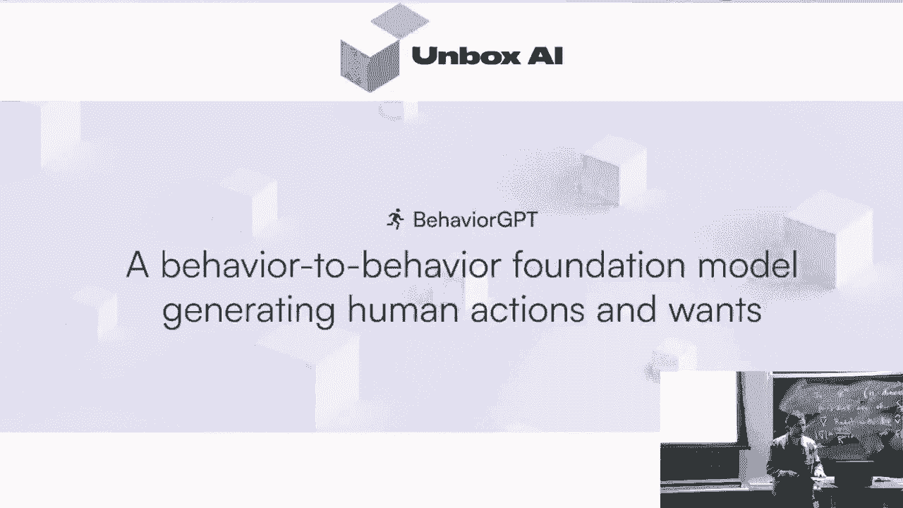
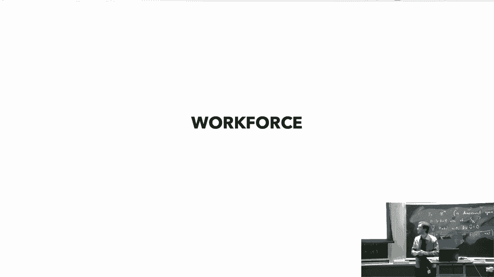
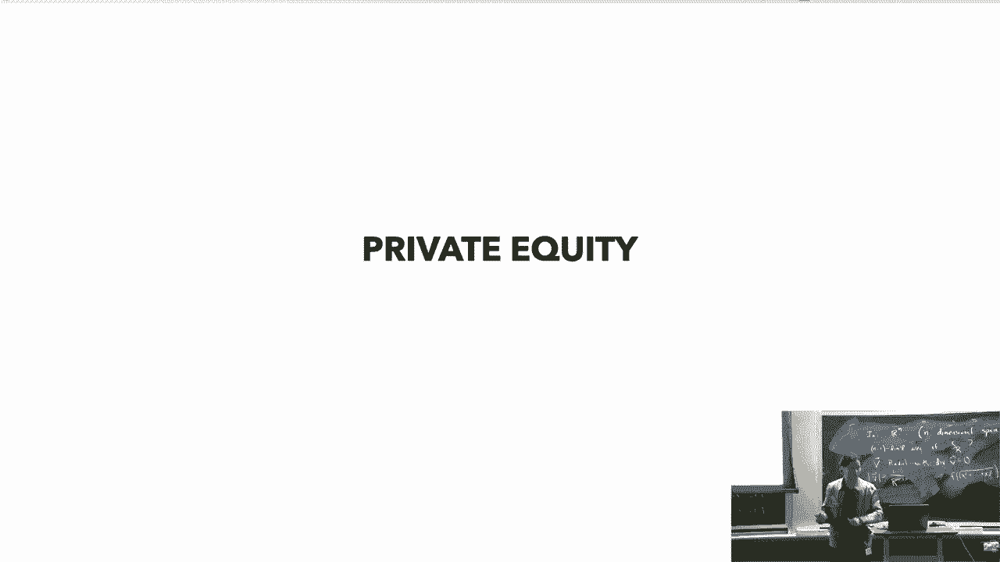
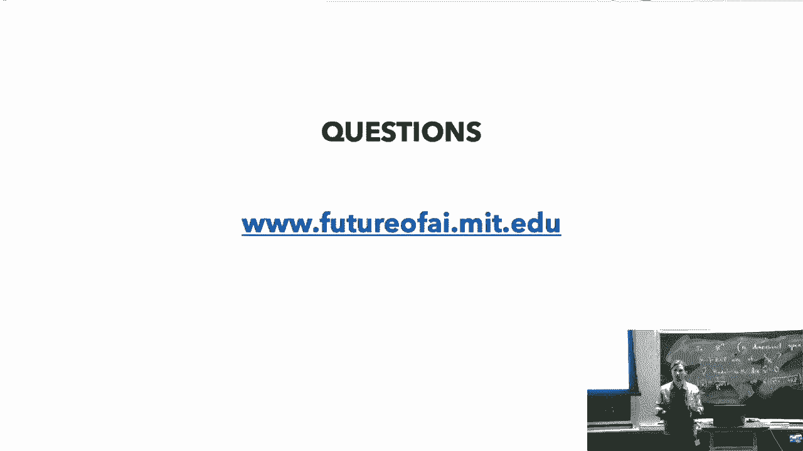

# 5：基础模型与生成式AI生态系统 🌐

在本节课中，我们将学习基础模型的核心概念及其在商业和研究领域的应用。我们将探讨为何不会出现单一AI模型垄断市场的情况，并分析不同类型的基础模型如何共存与协作。课程还将通过实际案例，展示企业如何构建和利用自己的“核心智能”来获得竞争优势。

## 概述：什么是基础模型？🧠

我们从一个根本性问题开始：人类如何学习世界？婴儿如何成长为知识丰富的成年人？答案并非主要来自父母、老师（有监督学习）或单纯的试错（强化学习）。我们的大部分知识是通过**自我学习**获得的，即通过观察事物之间的关系和上下文来理解意义。

例如，你理解“狗”的概念，不是通过定义，而是通过关联：狗需要遛、与猫关系紧张、会追飞盘。这种对**关系意义**的理解是强大且跨模态的。基础模型正是基于这一洞察：用海量数据和参数训练一个巨大模型，让它学习万事万物之间的关系，从而获得最精确、最强大的意义理解能力，然后将其作为基础应用于各种任务。

## 从研究范式转变到商业应用 🔄

上一节我们介绍了基础模型的核心思想，本节我们来看看它如何改变了研究与实践。

在研究领域，过去是“一个任务，一个数据集，一个模型”。例如，翻译、问答、情感分析各有其独立的模型。但现在，研究转向构建统一的**基础语言模型**，它具备深层的语言智能，各种具体任务都成为其下游应用。这模仿了人类大脑的通用智能。

同样，在企业中，技术应用也常是孤立的：产品搜索、推荐系统、库存规划各有独立的团队和数据。然而，这些智能本质上是协同的。推荐应影响营销，搜索应反映库存。因此，企业也需要构建一个**单一的“核心大脑”**（即其专属的基础模型），来整合所有数据和流程，充分利用协同效应，实现最佳性能。未来能够生存和繁荣的企业，正是那些围绕自身业务构建了这种核心智能的企业。

## 生态系统的多样性：为何不是单一模型？🌳

既然基础模型如此强大，是否会出现一个单一的AI模型统治一切？答案是否定的。在可预见的未来，我们将看到一个由多种基础模型组成的生态系统。

以下是几个关键原因：

*   **领域特异性**：一个在通用文本上训练的大型语言模型（LLM），在应用到物流、金融交易或生物化学等专业领域时，其直觉可能会失效甚至有害。这些领域需要从专属数据中重新学习，形成具有“护城河”的专用基础模型。
*   **成本与收益平衡**：向一个通用大模型中添加某个边缘领域的专业知识，其带来的价值可能无法抵消因此增加的计算成本和模型性能稀释。
*   **人类大脑的启示**：我们的大脑本身就是多个专用系统（如快速直觉系统、有意识的规划系统）的集合。AI生态系统也会类似，包含不同类型、专注于不同数据和应用的“大脑”，它们相互协作。

因此，未来的AI格局将是多元化的，不同类型的基础模型将基于其独特的**算法优势**和**数据渠道**建立防御性。

## 企业如何构建自己的防御性大脑？🏢

理解了生态系统的多样性后，对于企业而言，关键在于识别并构建对自己最重要的那类基础模型。

企业不应满足于使用通用的AI助手（如ChatGPT），那只是有用的工具，而非核心竞争力。真正的竞争优势在于构建一个**集成企业自身所有“秘密酱料”**（专有数据、流程、知识）的核心智能模型。

以下是构建防御性大脑的关键步骤：

1.  **识别核心数据与优势**：审视你的业务，你的独特优势在哪里？哪些数据能体现这些优势？（例如，零售商的交易行为数据，制造商的供应链数据）。
2.  **选择或构建基础技术**：根据你的核心数据类型（行为、序列、文本、图像等），选择或合作开发相应的基础模型技术（如大型行为模型、时间序列模型等）。
3.  **深度集成与训练**：将你的专有数据深度集成到该基础模型中，训练它理解你业务领域的深层关系和模式。
4.  **实现协同应用**：利用这个统一的“大脑”驱动所有下游任务（搜索、推荐、规划、风控等），实现智能协同。

需要警惕的是那些声称做AI但存在以下问题的解决方案：
*   **不依赖你的数据**：数据是构建专属智能的关键。
*   **需要大量手动调整**：真正的智能应从数据中自动学习。
*   **仅解决单一功能**：这分散了智能，无法形成协同效应。

## 案例研究 📈

让我们通过具体案例看看上述理论如何实践。

### 案例一：零售电商的个性化革命 🛒

我们为一家在线销售壁纸、海报的公司构建了基于**消费者行为数据**的核心模型（可视为一种“大型行为模型”）。

*   **应用**：将该模型用于网站导航的深度个性化。
*   **结果**：不同用户搜索“蓝色”时，会根据其历史行为得到截然不同的结果（如家庭场景或青少年风格），实现了真正的“千人千面”。这使得网站收入提升了**14%**，同时减少了人工运营成本。

这个案例的关键在于，通用模型可能无法捕捉垂直领域的细微偏好（例如，顾客更关注色彩搭配而非产地）。只有用专属行为数据训练的核心模型，才能驱动真正的销售增长。

### 案例二：劳动力市场的员工留存预测 👥

我们为一家拥有5万名客服员工的公司构建了理解**员工行为**的核心模型。

*   **挑战**：公司年流失率很高，传统调查问卷数据分析收效甚微。
*   **方案**：转向分析员工的行为数据（行动胜于言语），构建预测模型。
*   **结果**：该模型能够以**91%的准确率**预测员工在未来两周内是否会离职，远超传统方法。这使公司能提前干预，显著降低流失成本。

### 行业思考：保险业的挑战 🏦

保险业严重依赖数据和预测，但其挑战在于通常**不控制原始数据渠道**（如房屋建造数据、个人健康实时数据）。因此，保险公司可能难以在特定领域构建具有绝对优势的专属基础模型。未来的发展可能取决于其能否在某一细分领域深耕，或与数据控制方深度合作。

## 总结与展望 🚀

本节课我们一起学习了基础模型生态系统的核心要义。

我们认识到，**意义源于上下文关系**，而基础模型通过海量数据学习这种关系。未来不会出现单一的垄断模型，而是一个由多种具备**算法与数据双重护城河**的专用基础模型组成的生态系统。

对于企业和研究者而言，关键在于：
1.  **识别**驱动自身领域的核心智能类型。
2.  **构建**或**集成**能够封装自身独特数据和知识的基础模型。
3.  **利用**这个结构化智能作为存在性竞争优势，而不仅仅满足于使用通用的AI工具。

这场AI革命正引发一场“物种灭绝”，无法捕获并结构化自身核心智能的实体将面临挑战。现在就是开始行动，定义你的数据战略，并为你的事业构建那个关键“大脑”的时刻。

---
*注：本教程根据MIT 6.S087相关讲座内容整理，侧重于基础模型的商业生态系统逻辑阐释。*