# 6：基础模型与生成式人工智能在生物学中的应用 🧬

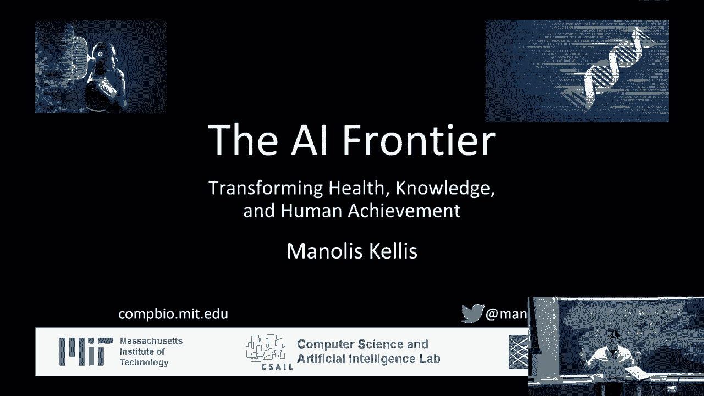

在本节课中，我们将学习人工智能，特别是基础模型和生成式AI，如何变革生物学和医学研究。我们将探讨如何利用这些技术来理解人类生物学、开发新疗法，并最终战胜疾病。

## 概述：生物学与人工智能的融合

生物学和人工智能领域都在快速发展。本课程的目标是介绍这两个领域如何交汇，以及这种交汇如何引发该领域的剧变。核心焦点是健康、对生物学的理解以及医学应用。

我们的目标是利用人工智能真正理解人类生物学的工作机制，并以此为基础开发新的疗法来终结疾病。

## 主要范式转变

上一节我们介绍了课程的整体目标，本节中我们来看看推动这一变革的几个主要范式转变。

以下是当前生物学研究正在经历的三个关键转变：

1.  **从假设驱动到数据驱动**：研究不再从一个具体的假设开始，然后收集有限的数据去验证它。现在，我们首先系统地收集海量数据，构建资源库，之后再提出问题。这实现了对生物学的全面、系统性观察。
2.  **从相关性到因果关系**：传统流行病学常受限于相关性分析（例如，巧克力消费量与诺贝尔奖得主数量的关联）。借助遗传学，我们现在能够理解机制，建立从基因差异到表型的因果关系链。
3.  **从经典数据分析到机器学习**：过去，每个生物学问题都需要设计特定的统计检验。现在，我们转向构建参数庞大的基础模型。这些模型通常是多模态的，能够学习深层次的表征，真正理解概念并产生新见解。

这些转变意味着，我们现在可以结合遗传学的因果关系和大数据的规模，来真正理解疾病的机制。我们从已知的与疾病相关的遗传区域出发，利用大规模数据（如单细胞测序）来揭示其背后的具体基因、蛋白质和细胞类型，从而阐明机制。

## 从基因到电路：理解与操纵

上一节我们了解了研究范式的转变，本节中我们来看看如何将这些新方法应用于具体问题，即从遗传变异理解到可操作的生物学“电路”。

遗传变异（DNA字母的差异）会影响被称为“基序”的特定DNA序列模式。这些基序被转录因子等调控蛋白识别并结合，进而控制增强子等调控区域的活性，最终影响目标基因的表达。这就构成了一个基因调控“电路”。

我的实验室专注于将这种方法应用于数十种疾病，包括心脏病、肥胖症、癌症、阿尔茨海默病、精神分裂症等。我们现在可以系统地研究人类身体的每一个方面，跨越数十种细胞类型、数百种组织、数百万个细胞和数百个个体。

以下是三个成功案例：

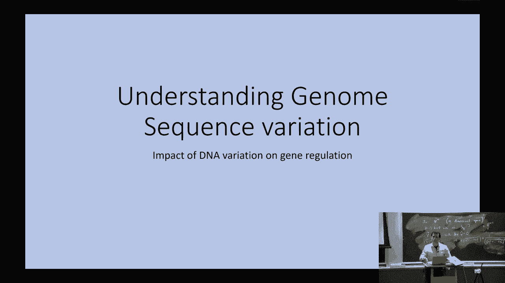

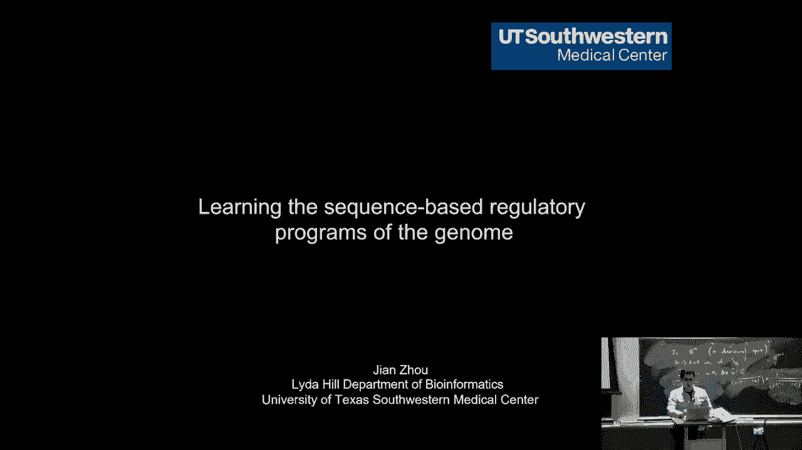

*   **肥胖症**：我们解析了与肥胖最强遗传关联区域的一个单核苷酸变异（T替换为C）的机制。通过理解其影响的调控因子、下游靶基因和作用的细胞类型，我们能够将人类细胞从脂肪储存模式转变为脂肪燃烧模式。在动物模型中，敲除相关基因后，即使摄入高脂肪饮食，动物也无法增重。
*   **阿尔茨海默病**：针对增加患病风险的APOE4等位基因，我们发现其改变了胆固醇生物合成。通过追溯并恢复胆固醇向形成髓鞘（保护神经元）的运输过程，我们在人类细胞和动物模型中成功恢复了髓鞘和认知功能。
*   **癌症免疫疗法**：大约50%的患者对现有免疫疗法无反应。通过理解其背后的调控电路，我们能够预测并抑制导致治疗抵抗的关键上游调控因子，从而使癌症不再复发。

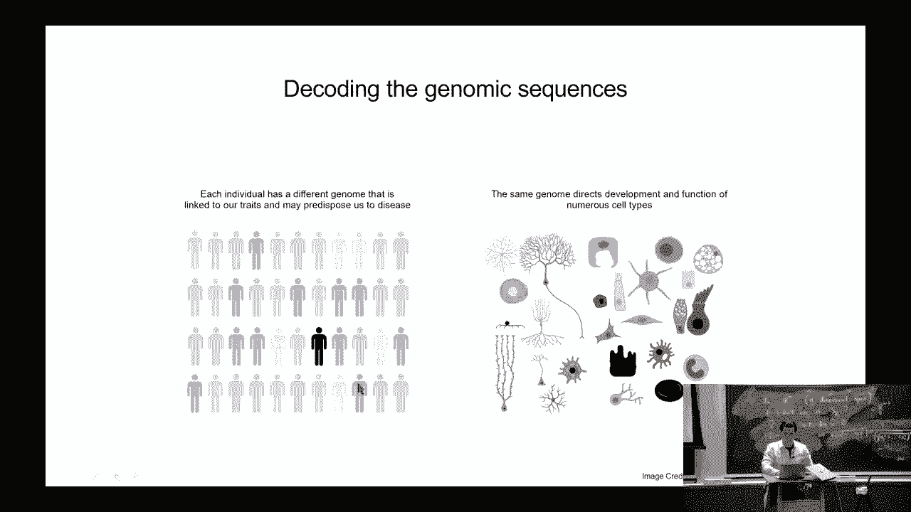

## 关键技术应用场景

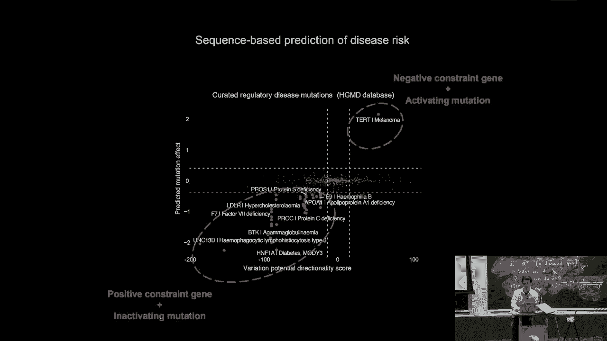

上一节我们看到了从基因到电路的成功案例，本节中我们来深入探讨使这一切成为可能的具体人工智能技术。

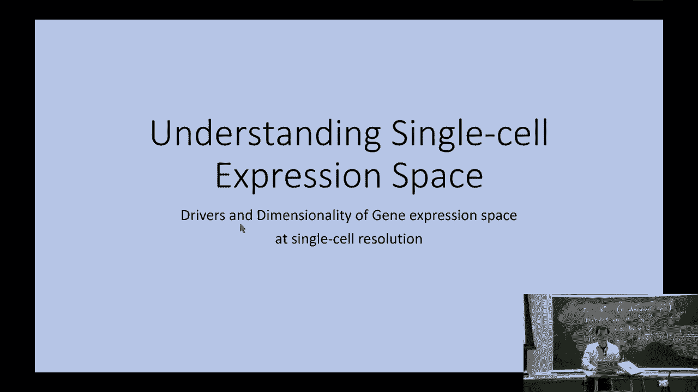

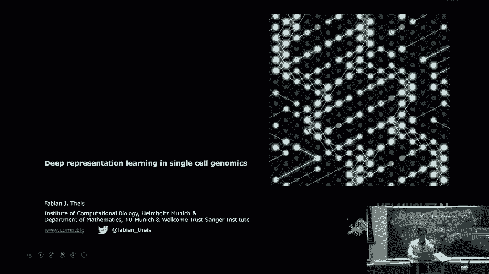

### 1. 调控基因组学：理解DNA的语言

调控基因组学的目标是从DNA序列理解基因如何被调控。核心是被称为“调控基序”的短DNA模式，它们被特定的调控蛋白识别和结合。

我们可以通过实验在全基因组范围内测量这些蛋白质的结合位点。然后，我们将序列数据和结合数据放入深度学习框架（如卷积神经网络）中。模型学习识别预测区域活性的序列模式。

**公式/代码示意**：一个简单的卷积操作可以表示为识别基序：
`feature_map = conv1d(DNA_sequence, motif_filter)`
模型的美妙之处在于它具有机制上的洞察力，能告诉我们哪个模式在何处起作用。

这使我们能够预测从未见过的新突变的影响，为个性化基因组学铺平道路。

### 2. 单细胞分析与变分自编码器

我们的身体由数万亿个功能各异的细胞组成。单细胞测序技术允许我们测量数百万个细胞中每个细胞的基因表达。

我们可以构建深度学习模型（如变分自编码器），从序列和表达信息中学习。模型将高维表达数据压缩到一个低维的“瓶颈”层，然后再重构出来。

**核心概念**：**变分自编码器** 学习数据的低维潜空间表示。这允许我们解耦变异的不同组成部分（如疾病状态、年龄、性别）。类似于图像处理中的“风格迁移”，我们可以尝试将患者的表达模式转换为健康个体的模式，从而理解并可能纠正疾病状态。

### 3. 电子健康记录与多模态学习

通过大规模测序，我们可以收集大量个体的基因型数据和数十种表型数据（即电子健康记录信息）。

我们可以利用这些数据，将一个人的电子健康记录分解为与特定表型组合相关的模块，并将其映射到血液或组织中变化的独特表达模式上。结合大型语言模型，我们可以自动解释这些模式，得出关于驱动生物变异的生物学见解。

### 4. 病理图像分析

对于病理切片等医学图像，AI可以自动注释图像内容（如肿瘤位置）。通过多模态学习，联合训练图像和与之配对的文本描述（来自医学论文），可以构建一个基础模型。

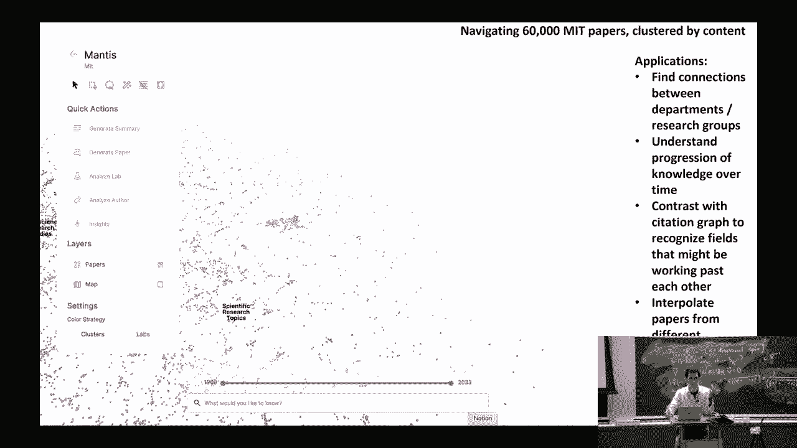

这个模型能够对从未见过的新图像甚至新的肿瘤类型进行推理，实现“零样本学习”，即无需针对该特定类别进行训练即可进行识别和信息检索。

### 5. 化学与分子设计

我们可以使用图神经网络来理解从原子到整个分子的功能。

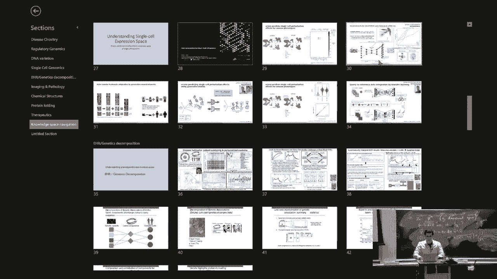

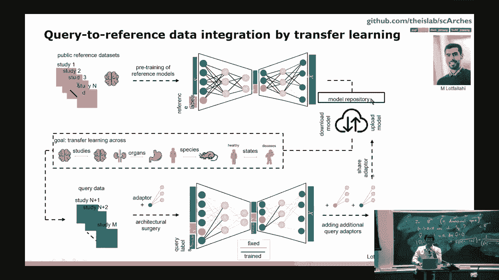

**核心概念**：**图神经网络** 将分子表示为原子（节点）和化学键（边）的图。通过卷积操作，每个原子的表示会聚合其邻居的信息。经过多层传播，最终获得对整个分子功能的预测。
`h_v^(l+1) = UPDATE( h_v^(l), AGGREGATE( {h_u^(l), u in N(v)} ) )`
这允许我们预测新分子的功能，甚至从头设计具有特定性质的新分子。

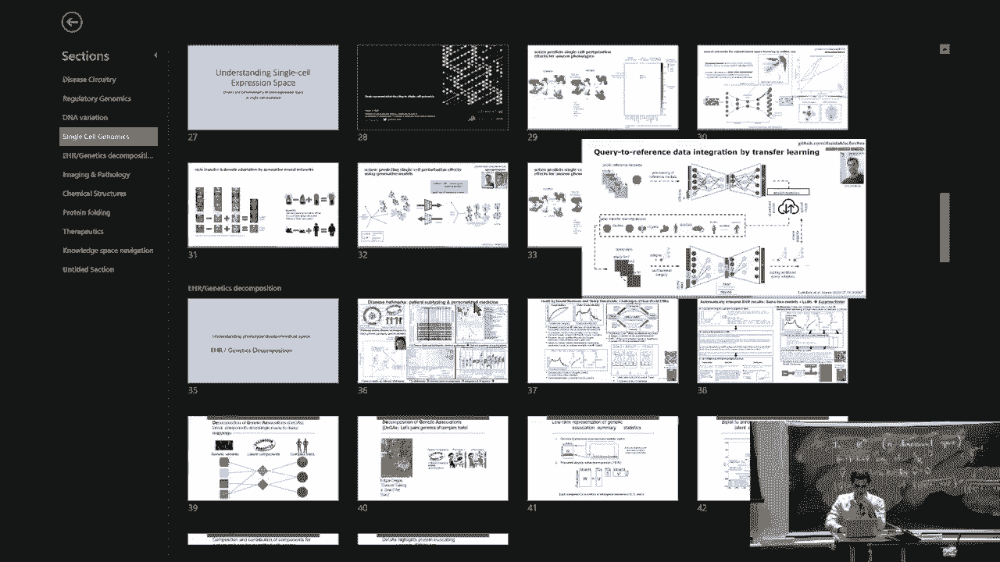

### 6. 蛋白质结构与功能

理解蛋白质如何从其氨基酸序列折叠成三维结构，以及结构如何决定其功能，是前沿领域。通过比较不同物种的蛋白质序列（共进化分析）和利用物理模拟，我们可以洞察序列-结构-功能的关系。

目前的前沿是构建能够整合蛋白质序列、结构和描述其功能的文本信息的基础模型。结合用户查询，这种模型可以预测蛋白质功能，并推理出干预哪些蛋白质或使用何种化学物质来治疗疾病。

## 超越生物学：思想空间的导航

上一节我们探讨了AI在生物医学各层面的应用，本节我们看看这项技术更广阔的愿景——理解并导航人类的所有知识。

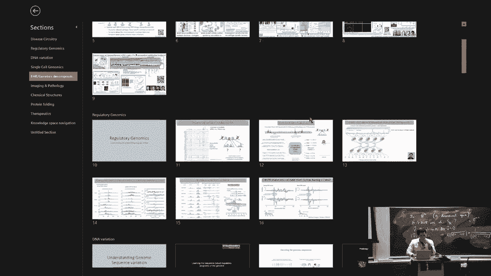

我们所构建的工具允许将人类曾有过的任何想法、已发表的每篇论文、写过的每首诗，都映射到一个“思想空间”中。例如，我们可以将麻省理工学院的所有课程和论文可视化为地图上的“概念岛屿”。

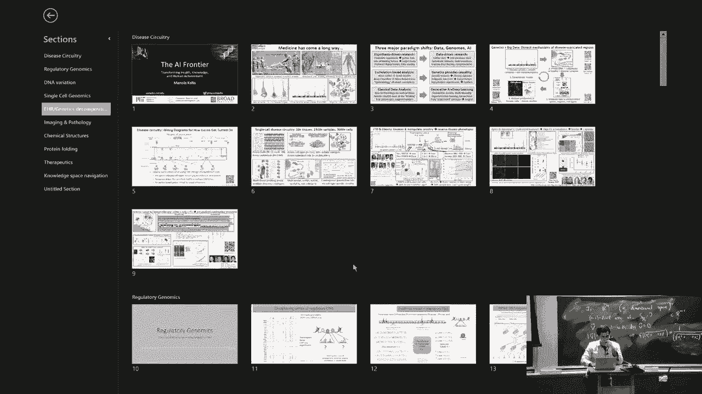

主要的范式转变在于：我们不再为每个新数据集开发新的机器学习方法，而是构建**多模态嵌入**。这种方法不仅适用于生物空间，也适用于理念空间。目标是获得以前人类科学家无法达到的见解。

## 总结与展望

在本节课中，我们一起学习了人工智能，特别是基础模型和多模态学习，如何驱动生物学和医学研究的范式转变。我们从假设驱动转向数据驱动，从相关性转向因果关系，并利用强大的模型来理解从DNA语言到蛋白质功能，再到整个知识体系的复杂关系。

展望未来，多模态整合是方向。未来的医疗诊断将整合临床记录、影像、基因组、蛋白质组、患者主观描述等多维度信息，由AI辅助构建更完整的个人健康模型。尽管当前数据和算法可能存在偏见，但AI也提供了通过解耦变异成分和反事实分析来纠正这些偏见的希望。

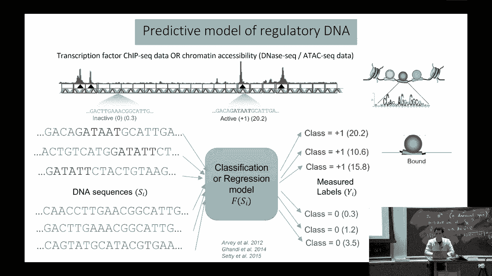

最终，我们的挑战是利用这些工具系统性地理解生物学，实现个性化医疗，并导航人类知识的整个空间，从而加速科学发现和创新。